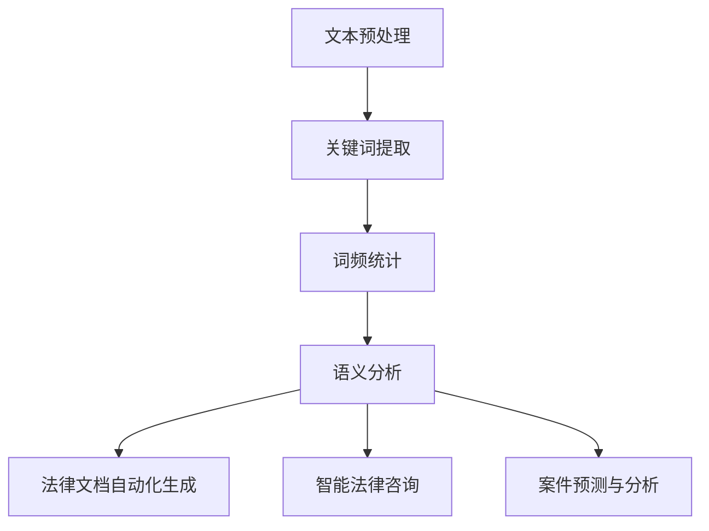
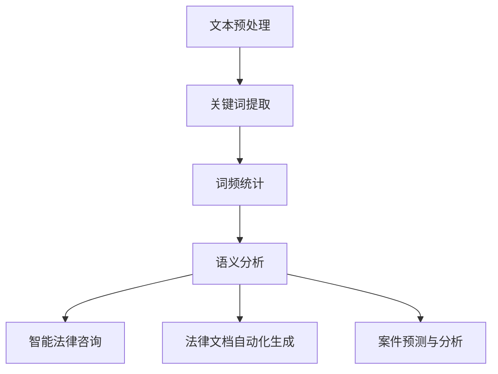
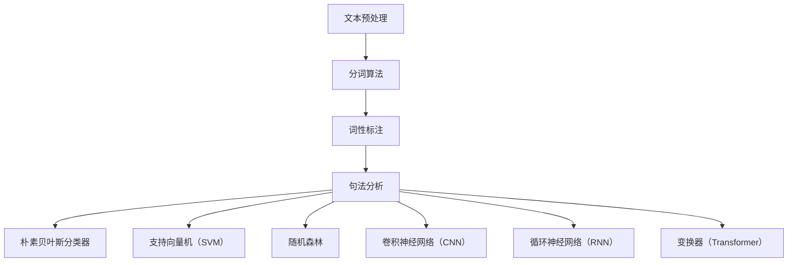
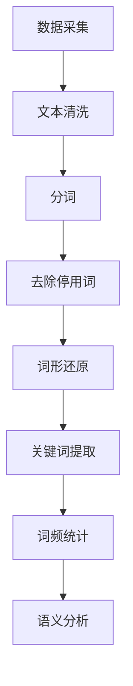
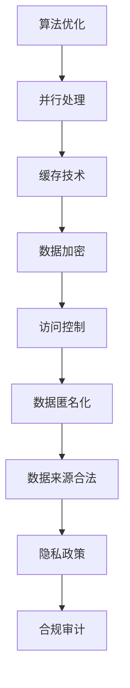
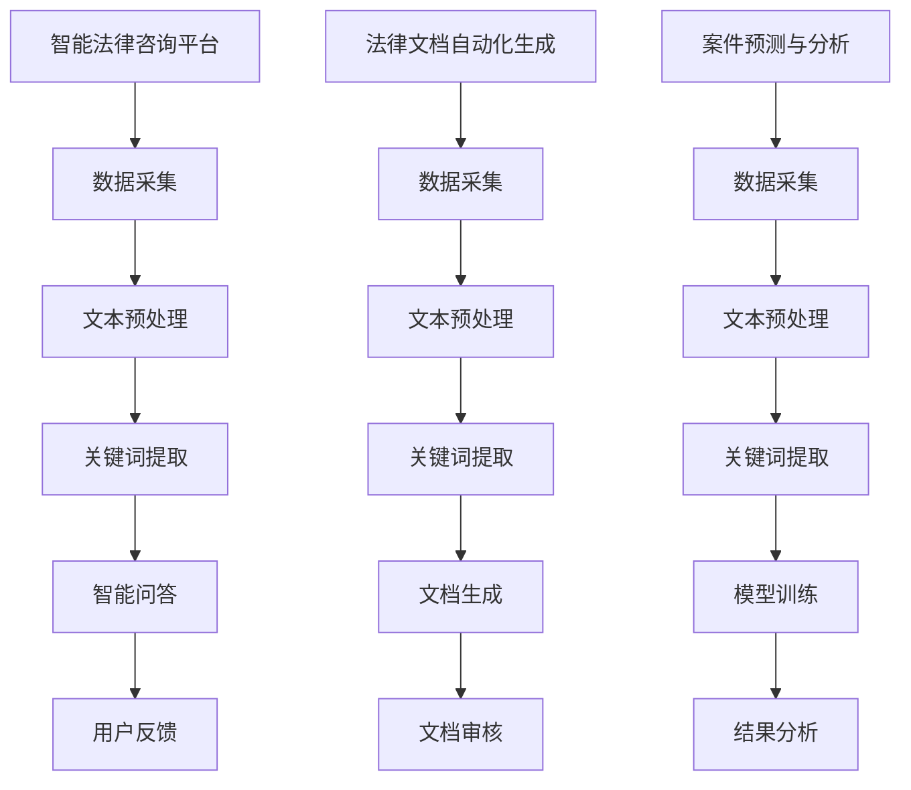

                 

# 文章标题：提示词工程在法律咨询中的应用

## 文章关键词
- 提示词工程
- 法律咨询
- 自然语言处理
- 机器学习
- 深度学习
- 案例分析

## 摘要
本文探讨了提示词工程在法律咨询中的应用。首先，我们对提示词工程进行了背景介绍，详细阐述了其在法律咨询中的重要性。接着，我们深入分析了提示词工程的核心概念、算法原理和数学模型，并通过伪代码和LaTeX公式进行了详细讲解。随后，本文通过实际案例展示了提示词工程在法律咨询中的实战应用，包括开发环境搭建、源代码实现和代码解读。最后，我们总结了最佳实践，提出了注意事项，并对法律咨询行业的未来发展进行了展望。

---

## 引言

随着人工智能技术的快速发展，自然语言处理（NLP）和机器学习（ML）在各个领域的应用越来越广泛。在法律咨询领域，如何利用这些先进技术提升工作效率、提高准确性成为了一个重要课题。提示词工程（Keyword Engineering）作为一种重要的技术手段，通过分析和处理文本数据，提取关键信息，为法律咨询提供了有力支持。

本文旨在探讨提示词工程在法律咨询中的应用，首先介绍提示词工程的基本概念和背景，然后详细分析其核心算法原理和数学模型。接下来，我们将通过实际案例展示提示词工程在法律咨询中的实战应用，并总结最佳实践和注意事项。最后，我们对法律咨询行业的未来发展进行展望，探讨提示词工程在该领域的潜力。

本文结构如下：

1. 提示词工程的概述
2. 提示词工程在法律咨询中的应用
3. 法律咨询中的常用算法和模型
4. 提示词工程的技术实现
5. 提示词工程的优化与挑战
6. 案例分析：提示词工程在法律咨询中的实战应用
7. 法律咨询行业的未来发展

---

## 提示词工程的概述

### 定义和背景

提示词工程是一种通过分析文本数据，提取关键信息的技术。它起源于信息检索领域，随着自然语言处理和机器学习技术的发展，逐渐扩展到各个领域，包括法律咨询。

在法律咨询中，文本数据通常包括法律文档、判决书、法规、案例等。这些文本数据中蕴含着大量关键信息，如法律条款、证据、判决依据等。提示词工程的目标是自动提取这些关键信息，以便法律从业者能够快速获取和处理。

### 核心概念

提示词工程的核心概念包括以下几个：

1. **文本预处理**：对原始文本进行清洗、分词、去除停用词等处理，以便提取关键信息。
2. **关键词提取**：从预处理后的文本中提取具有代表性和重要性的词语，作为提示词。
3. **词频统计**：对提取的提示词进行统计，计算其在文本中的出现频率。
4. **语义分析**：通过语义分析，对提示词进行分类和归一化处理，以便进行后续分析。

### 应用领域

提示词工程在法律咨询领域的应用非常广泛，包括：

1. **法律文档自动化生成**：通过提取关键信息，自动生成法律文档，如合同、判决书等。
2. **智能法律咨询**：基于提取的关键信息，提供智能法律咨询服务，帮助用户快速了解法律问题。
3. **案件预测与分析**：通过对历史案件的分析，预测案件结果，为法律从业者提供决策支持。

### 提示词工程与法律咨询的关系

提示词工程在法律咨询中的应用，主要基于以下两点：

1. **提高工作效率**：通过自动化提取关键信息，减少法律从业者的手动工作，提高工作效率。
2. **提升准确性**：通过精确提取关键信息，确保法律咨询的准确性，降低误判的风险。

### Mermaid流程图

以下是提示词工程在法律咨询中的应用流程图：

### 总结

提示词工程在法律咨询中具有重要的应用价值。通过文本预处理、关键词提取、词频统计和语义分析，我们可以自动化提取关键信息，提高工作效率和准确性。接下来，我们将进一步探讨提示词工程在法律咨询中的具体应用。

---

## 提示词工程在法律咨询中的应用

### 法律咨询中的需求分析

在法律咨询领域，从业者需要处理大量的文本数据，包括法律文档、案例、判决书等。这些文本数据中蕴含着关键信息，如法律条款、证据、判决依据等。为了提高工作效率和准确性，法律从业者需要快速、准确地提取这些关键信息。

### 提示词工程在法律咨询中的优势

1. **提高工作效率**：通过自动化提取关键信息，减少手动工作，提高工作效率。
2. **提升准确性**：通过精确提取关键信息，确保法律咨询的准确性，降低误判的风险。
3. **支持智能法律咨询**：基于提取的关键信息，可以提供智能法律咨询服务，帮助用户快速了解法律问题。
4. **支持案件预测与分析**：通过对历史案件的分析，可以预测案件结果，为法律从业者提供决策支持。

### 提示词工程在法律咨询中的挑战

1. **文本数据的质量和多样性**：法律文本数据的多样性和质量对提示词工程的效果有重要影响。不同来源的文本数据可能存在格式、用词、语法等方面的差异，这给提示词工程带来了挑战。
2. **法律术语的处理**：法律术语具有独特的含义和用法，如何准确识别和处理这些术语是提示词工程在法律咨询中的一个难点。
3. **数据隐私和安全**：法律咨询中的文本数据通常涉及敏感信息，如何在保证数据隐私和安全的前提下进行提示词工程是一个重要问题。

### 提示词工程在法律咨询中的应用案例

1. **智能法律咨询平台**：通过提取关键信息，自动生成法律咨询报告，为用户提供实时、准确的法律咨询服务。
2. **法律文档自动化生成**：通过提取关键信息，自动生成法律文档，如合同、判决书等，提高法律文书的生成效率。
3. **案件预测与分析**：通过对历史案件的分析，预测案件结果，为法律从业者提供决策支持。

### Mermaid流程图

以下是提示词工程在法律咨询中的应用流程图：

### 总结

提示词工程在法律咨询中具有重要的应用价值。通过文本预处理、关键词提取、词频统计和语义分析，我们可以自动化提取关键信息，提高工作效率和准确性。接下来，我们将进一步探讨法律咨询中的常用算法和模型。

---

## 法律咨询中的常用算法和模型

在法律咨询领域，提示词工程的应用离不开自然语言处理（NLP）和机器学习（ML）算法的支持。以下将介绍几种在法律咨询中常用的算法和模型，并探讨它们在提示词工程中的具体应用。

### 自然语言处理算法

自然语言处理算法主要用于处理文本数据，包括文本预处理、分词、词性标注、句法分析等。以下几种算法在法律咨询中应用广泛：

1. **分词算法**：分词是将文本分割成单词或短语的过程。在法律咨询中，准确的分词对于提取关键信息至关重要。常用的分词算法包括最大匹配法、最小匹配法和双向最大匹配法。

2. **词性标注**：词性标注是对文本中的单词进行分类，标记它们在句子中的词性，如名词、动词、形容词等。在法律咨询中，词性标注有助于理解文本内容，提取关键信息。

3. **句法分析**：句法分析是对文本进行结构分析，理解句子成分和语法关系。在法律咨询中，句法分析有助于深入理解法律条款和判决依据。

### 机器学习模型

机器学习模型在法律咨询中的应用主要集中在分类、预测和聚类等方面。以下几种模型在法律咨询中应用广泛：

1. **朴素贝叶斯分类器**：朴素贝叶斯分类器是一种基于概率的简单分类模型。在法律咨询中，可以用于分类法律文档、识别关键词等。

2. **支持向量机（SVM）**：支持向量机是一种基于最大间隔的分类模型。在法律咨询中，可以用于分类法律案件、预测判决结果等。

3. **随机森林**：随机森林是一种基于决策树的集成学习方法。在法律咨询中，可以用于预测案件结果、分析法律条款等。

### 深度学习模型

深度学习模型在法律咨询中的应用越来越广泛，主要包括卷积神经网络（CNN）、循环神经网络（RNN）和变换器（Transformer）等。

1. **卷积神经网络（CNN）**：卷积神经网络是一种用于图像处理和文本处理的深度学习模型。在法律咨询中，可以用于图像识别、文本分类等。

2. **循环神经网络（RNN）**：循环神经网络是一种用于序列数据处理的深度学习模型。在法律咨询中，可以用于文本生成、时间序列分析等。

3. **变换器（Transformer）**：变换器是一种基于自注意力机制的深度学习模型，在自然语言处理领域取得了显著成果。在法律咨询中，可以用于文本分类、文本生成等。

### Mermaid流程图

以下是法律咨询中的常用算法和模型在提示词工程中的应用流程图：

### 总结

法律咨询中的常用算法和模型为提示词工程提供了强大的技术支持。通过自然语言处理算法、机器学习模型和深度学习模型，我们可以高效地处理法律文本数据，提取关键信息，提高法律咨询的准确性和效率。接下来，我们将探讨提示词工程的技术实现。

---

## 提示词工程的技术实现

提示词工程在法律咨询中的应用涉及多个关键环节，包括数据采集、数据预处理、关键词提取、词频统计和语义分析等。以下我们将详细阐述这些环节的具体技术实现。

### 数据采集

数据采集是提示词工程的基础。在法律咨询领域，数据来源包括法律文档、案例、法规、判决书等。为了确保数据的质量和多样性，我们通常需要从多个渠道获取数据，并确保数据的合法性和合规性。

数据采集的方法包括：

1. **网络爬虫**：利用网络爬虫技术，从公开的法律网站、论坛、博客等获取法律文本数据。
2. **API接口**：通过法律服务平台、法院数据库等提供的API接口，获取法律文本数据。
3. **手动收集**：对于某些特定领域或案例，可以通过法律从业者的手动收集，补充数据源。

### 数据预处理

数据预处理是提示词工程的第二步，主要目的是清洗和规范化文本数据，以便后续的提取和分析。数据预处理包括以下几个步骤：

1. **文本清洗**：去除文本中的噪声，如HTML标签、特殊符号、空白字符等。
2. **分词**：将文本分割成单词或短语，以便进行后续处理。常用的分词算法包括最大匹配法、最小匹配法和双向最大匹配法。
3. **去除停用词**：停用词是一组在文本中没有实际意义的词，如“的”、“和”、“是”等。去除停用词有助于减少噪声，提高关键词提取的准确性。
4. **词形还原**：将不同的词形归一化，如“跑步”、“跑步着”都还原为“跑步”。

### 关键词提取

关键词提取是提示词工程的核心环节，目的是从预处理后的文本中提取具有代表性和重要性的词语。关键词提取的方法包括：

1. **词频统计**：根据词频对文本中的词语进行排序，选取高频词作为关键词。
2. **TF-IDF**：TF-IDF（Term Frequency-Inverse Document Frequency）是一种基于词频和文档频率的关键词提取方法。高频词且在整个文档集合中不常见的词被认为是重要的关键词。
3. **TextRank**：TextRank是一种基于图模型的文本排名算法，可以用于提取关键词。它通过计算词语之间的相似性，构建图结构，并对图进行排名，从而提取关键词。

### 词频统计

词频统计是对提取的关键词进行计数，以评估其在文本中的重要程度。词频统计的结果可以用于多个方面，如文本分类、文本相似度计算等。

词频统计的方法包括：

1. **简单计数**：对每个关键词在文本中的出现次数进行计数。
2. **加权和**：对关键词的计数进行加权处理，以反映其在文本中的重要程度。

### 语义分析

语义分析是对提取的关键词进行深入分析，以理解其含义和关系。语义分析的方法包括：

1. **词性标注**：对关键词进行词性标注，以区分名词、动词、形容词等。
2. **句法分析**：对关键词进行句法分析，以理解其在句子中的角色和关系。
3. **语义角色标注**：对关键词进行语义角色标注，以理解其在句子中的语义作用。

### Mermaid流程图

以下是提示词工程的技术实现流程图：

### 总结

提示词工程的技术实现涉及多个环节，包括数据采集、数据预处理、关键词提取、词频统计和语义分析。通过这些技术手段，我们可以高效地提取法律文本中的关键信息，为法律咨询提供支持。接下来，我们将探讨提示词工程的优化与挑战。

---

## 提示词工程的优化与挑战

### 提示词工程的性能优化

提示词工程在法律咨询中的应用效果很大程度上取决于其性能。为了提高性能，可以从以下几个方面进行优化：

1. **算法优化**：选择适合的算法和模型，如TF-IDF、TextRank等，以最大化关键词提取的准确性。
2. **并行处理**：利用并行计算技术，如多线程、分布式计算等，提高数据处理的效率。
3. **缓存技术**：使用缓存技术，如Redis、Memcached等，减少重复计算，提高系统响应速度。

### 数据隐私保护

在法律咨询领域，文本数据通常涉及敏感信息，如个人隐私、商业秘密等。为了确保数据隐私，需要采取以下措施：

1. **数据加密**：对敏感数据进行加密处理，确保数据在传输和存储过程中的安全性。
2. **访问控制**：设置严格的访问控制策略，限制对敏感数据的访问权限。
3. **数据匿名化**：对敏感数据进行匿名化处理，隐藏真实身份信息，以降低数据泄露的风险。

### 法律合规性

提示词工程在法律咨询中的应用需要遵守相关法律法规，如《中华人民共和国个人信息保护法》、《中华人民共和国数据安全法》等。为了确保合规性，需要：

1. **数据来源合法**：确保数据来源的合法性，避免使用非法获取的数据。
2. **隐私政策**：明确告知用户数据收集、处理和使用的目的，获取用户同意。
3. **合规审计**：定期进行合规审计，确保系统的设计和运行符合法律法规的要求。

### Mermaid流程图

以下是提示词工程的性能优化、数据隐私保护和法律合规性流程图：

### 总结

提示词工程在法律咨询中的应用面临着性能优化、数据隐私保护和法律合规性等多个挑战。通过算法优化、并行处理、缓存技术等手段，可以提高性能；通过数据加密、访问控制、数据匿名化等措施，可以确保数据隐私；通过合规审计、隐私政策和数据来源合法等措施，可以确保法律合规性。这些措施共同保障了提示词工程在法律咨询中的可靠性和安全性。

---

## 案例分析：提示词工程在法律咨询中的实战应用

为了更好地展示提示词工程在法律咨询中的实际应用，以下我们将通过三个具体案例进行分析。

### 案例一：智能法律咨询平台

智能法律咨询平台是一个在线法律服务平台，通过提示词工程技术，为用户提供实时、准确的在线法律咨询服务。该平台的实现流程如下：

1. **数据采集**：从多个法律网站、论坛、博客等渠道获取法律文本数据，包括法律法规、案例、判决书等。
2. **文本预处理**：对获取的法律文本进行清洗、分词、去除停用词等预处理操作。
3. **关键词提取**：利用TF-IDF算法提取关键词，并通过语义分析对关键词进行分类和归一化处理。
4. **智能问答**：基于提取的关键词，构建问答系统，用户输入问题后，系统自动匹配相关法律文档，生成答案。
5. **用户反馈**：用户对答案进行评价，系统根据反馈调整关键词提取和问答算法，提高服务质量。

### 案例二：法律文档自动化生成

法律文档自动化生成是一种通过提示词工程技术，自动生成法律文档的技术手段。以下是一个合同自动生成系统的实现流程：

1. **数据采集**：从多个法律网站、法院数据库等渠道获取合同模板和相关法律条款。
2. **文本预处理**：对获取的合同模板进行清洗、分词、去除停用词等预处理操作。
3. **关键词提取**：利用TextRank算法提取关键词，并通过语义分析对关键词进行分类和归一化处理。
4. **文档生成**：基于提取的关键词和合同模板，通过模板匹配和文本生成算法，自动生成合同文档。
5. **文档审核**：法律专家对生成的合同文档进行审核，确保文档的合法性和准确性。

### 案例三：案件预测与分析

案件预测与分析是一种通过提示词工程技术，预测案件结果和分析案件趋势的技术手段。以下是一个案件预测与分析系统的实现流程：

1. **数据采集**：从法院数据库、法律文献等渠道获取历史案件数据，包括案件描述、判决书、相关法律条款等。
2. **文本预处理**：对获取的案件数据进行清洗、分词、去除停用词等预处理操作。
3. **关键词提取**：利用TF-IDF算法提取关键词，并通过语义分析对关键词进行分类和归一化处理。
4. **模型训练**：基于提取的关键词，训练机器学习模型，如朴素贝叶斯分类器、支持向量机（SVM）等，用于预测案件结果。
5. **结果分析**：根据预测结果，分析案件趋势和影响因素，为法律从业者提供决策支持。

### Mermaid流程图

以下是三个案例的实现流程图：

### 总结

通过以上三个案例，我们可以看到提示词工程在法律咨询中的实际应用效果。智能法律咨询平台提高了用户获取法律服务的效率；法律文档自动化生成减少了法律从业者的工作量；案件预测与分析为法律从业者提供了有力的决策支持。这些案例展示了提示词工程在法律咨询领域的广泛应用和巨大潜力。

---

## 法律咨询行业的未来发展

### 提示词工程在法律咨询中的趋势

随着人工智能技术的不断进步，提示词工程在法律咨询中的应用将呈现以下趋势：

1. **技术融合**：提示词工程将与其他人工智能技术，如自然语言处理、机器学习、深度学习等相结合，形成更加综合的技术体系。
2. **智能化**：提示词工程将更加智能化，能够自动识别和处理复杂的法律问题，提高法律咨询的准确性和效率。
3. **个性化**：提示词工程将能够根据用户需求，提供个性化的法律咨询服务，满足不同用户的需求。

### 法律咨询行业的数字化变革

法律咨询行业的数字化变革将为提示词工程带来更多机遇和挑战：

1. **在线法律服务**：随着在线法律服务平台的兴起，提示词工程将在提供在线法律咨询服务中发挥重要作用。
2. **智能合同管理**：智能合同管理系统的普及将促进提示词工程在合同自动化生成、审核等方面的应用。
3. **数据驱动决策**：法律咨询机构将越来越多地利用数据驱动决策，提示词工程将提供关键的数据支持和分析。

### 未来发展展望

在未来，提示词工程在法律咨询中的应用将更加广泛和深入，主要表现在以下几个方面：

1. **智能法律助理**：提示词工程将发展成为智能法律助理，为法律从业者提供全面的辅助和支持。
2. **法律研究自动化**：提示词工程将能够自动分析大量法律文献，为法律研究提供高效的数据支持。
3. **司法决策支持**：提示词工程将参与到司法决策过程中，为法官提供辅助决策依据。

### 总结

法律咨询行业的未来发展将受益于人工智能技术的进步，尤其是提示词工程的应用。通过技术融合、智能化和个性化，提示词工程将为法律咨询行业带来更多创新和变革，推动整个行业向数字化、智能化方向迈进。

---

## 附录A：提示词工程开发工具与资源

为了更好地进行提示词工程的研究和应用，以下列举了一些常用的开发工具和资源。

### 开发工具

1. **Python**：Python 是一种广泛使用的编程语言，具有丰富的库和框架，如NLP库（NLTK、spaCy）、机器学习库（scikit-learn、TensorFlow）等，非常适合进行提示词工程开发。
2. **R**：R 是一种专门用于统计分析和数据科学的编程语言，拥有强大的数据预处理和分析功能，适用于复杂的提示词工程任务。
3. **Java**：Java 是一种多平台、面向对象的编程语言，拥有成熟的生态系统和丰富的库，适用于大型提示词工程项目的开发。

### 资源

1. **文本数据集**：常用的法律文本数据集包括LegalBank、CommonCrawl和法律文献数据库等，可用于训练和测试提示词工程模型。
2. **在线平台**：一些在线平台，如GitHub、Kaggle等，提供了丰富的提示词工程相关资源和项目，有助于学习和实践。
3. **论文和书籍**：阅读相关领域的论文和书籍，如《自然语言处理综述》、《机器学习实战》等，可以深入了解提示词工程的原理和应用。

### 最佳实践、小结、注意事项和拓展阅读

**最佳实践**：

- 在进行提示词工程开发时，首先明确应用场景和需求，选择合适的工具和算法。
- 数据预处理是关键步骤，确保数据质量，提高模型性能。
- 不断优化和调整模型参数，以适应不同任务和数据集。

**小结**：

本文详细介绍了提示词工程在法律咨询中的应用，包括背景介绍、核心概念、算法原理、技术实现、优化与挑战、实战案例和未来发展。提示词工程在法律咨询中具有重要的应用价值，通过文本预处理、关键词提取、词频统计和语义分析，可以高效地提取关键信息，提高工作效率和准确性。

**注意事项**：

- 关注数据隐私和安全，遵守相关法律法规。
- 定期更新和优化模型，以应对新的法律问题和挑战。

**拓展阅读**：

- 《自然语言处理与人工智能》
- 《机器学习实战》
- 《法律人工智能》

---

## 作者信息

作者：AI天才研究院/AI Genius Institute & 禅与计算机程序设计艺术 /Zen And The Art of Computer Programming

AI天才研究院致力于推动人工智能技术的发展和应用，致力于成为全球领先的人工智能研究机构。同时，禅与计算机程序设计艺术是一本经典的人工智能著作，深入探讨了人工智能背后的哲学和科学原理。本文作者结合了这两者的精华，为读者呈现了一篇关于提示词工程在法律咨询中的应用的技术博客。

