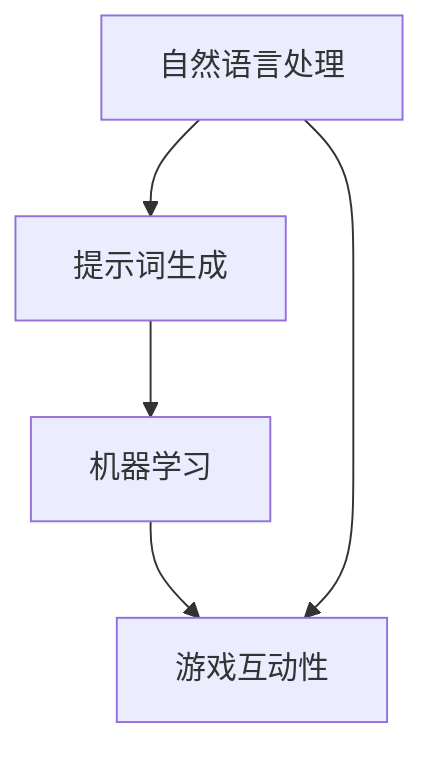

                 

### 文章标题

《提示词工程在游戏设计中的创新》

> 关键词：提示词工程、游戏设计、创新、自然语言处理、机器学习、用户体验

> 摘要：本文深入探讨了提示词工程在游戏设计中的应用与创新。通过解析提示词工程的核心概念、技术原理及其在游戏设计中的实际应用，文章展示了如何利用提示词工程提升游戏设计的创新性，为游戏开发者提供了有价值的启示和实用的技术指导。

----------------------------------------------------------------

### 背景介绍

随着游戏产业的飞速发展，游戏设计逐渐成为一门集艺术与科学于一体的综合性学科。游戏设计师不仅要具备丰富的创意思维，还需要掌握多种技术手段，以实现游戏内容的丰富性和互动性。在这其中，提示词工程作为一种新兴的技术手段，正逐渐引起广泛关注。

**提示词工程**是指通过自然语言处理（NLP）和机器学习（ML）等技术，生成、优化和自动化管理提示词的过程。提示词，顾名思义，是指能够引导玩家行为或思维的词汇或语句。在游戏设计中，提示词通常用于引导玩家完成游戏任务、理解游戏规则、提升游戏体验等。

近年来，随着人工智能技术的不断进步，提示词工程在游戏设计中的应用日益广泛。通过提示词工程，游戏设计师可以更加精确地控制玩家的游戏体验，提高游戏的趣味性和互动性。同时，提示词工程还可以帮助开发者快速迭代和优化游戏内容，缩短游戏开发周期，降低开发成本。

### 提示词工程的核心概念与联系

提示词工程的核心概念包括：自然语言处理、机器学习、游戏设计。这些概念之间的关系可以通过以下Mermaid流程图来展示：



**自然语言处理（NLP）**：NLP是计算机科学和人工智能领域中的一个重要分支，主要研究如何让计算机理解、处理和生成人类语言。在提示词工程中，NLP技术被用于生成和优化提示词，使其更符合游戏内容和玩家需求。

**机器学习（ML）**：ML是人工智能的一个重要分支，通过训练模型从数据中自动学习规律，以实现对未知数据的预测和决策。在提示词工程中，ML技术被用于识别和预测玩家的行为和需求，从而生成更加精准的提示词。

**游戏设计**：游戏设计是指创造和构建游戏的过程。它涉及到游戏规则、故事情节、角色设计、界面设计等多个方面。在提示词工程中，游戏设计是提示词的应用场景，通过提示词来提升游戏的互动性和用户体验。

### 核心概念之间的关系架构

在提示词工程中，自然语言处理和机器学习共同作用于游戏设计，实现以下目标：

1. **生成丰富的提示词**：NLP技术用于分析和理解游戏内容，生成与游戏主题和情境相符的提示词。
2. **优化提示词**：ML技术用于分析玩家的行为和反馈，优化提示词的表达和内容，以提高玩家的游戏体验。
3. **个性化提示词**：ML技术可以根据玩家的游戏历史和偏好，生成个性化的提示词，提高游戏的趣味性和互动性。

通过以上三个步骤，提示词工程实现了对游戏设计的创新和优化，为游戏设计师提供了有力的技术支持。

### 核心算法原理讲解

在提示词工程中，核心算法包括自然语言处理和机器学习。以下将分别介绍这两种算法的原理，并通过伪代码进行详细阐述。

#### 自然语言处理（NLP）

**词向量表示**：词向量是将单词映射为高维向量的技术，它能够捕捉单词的语义信息。常见的词向量模型有Word2Vec、GloVe等。

```python
import gensim

# 加载预训练的词向量模型
model = gensim.models.KeyedVectors.load_word2vec_format('word2vec.bin', binary=True)

# 将单词映射为词向量
word_vector = model['game']
```

**文本分类**：文本分类是将文本分为不同类别的过程。常见的文本分类算法有朴素贝叶斯、支持向量机、深度学习等。

```python
from sklearn.feature_extraction.text import TfidfVectorizer
from sklearn.naive_bayes import MultinomialNB
from sklearn.pipeline import make_pipeline

# 准备数据集
X_train = ['This is a game.', 'That is a game too.', ...]
y_train = ['action', 'adventure', ...]

# 构建文本分类模型
model = make_pipeline(TfidfVectorizer(), MultinomialNB())

# 训练模型
model.fit(X_train, y_train)

# 对新的文本进行分类
category = model.predict(['This is a new game.'])
```

#### 机器学习（ML）

**决策树**：决策树是一种常见的分类和回归算法，通过树形结构对数据进行分类或预测。

```python
from sklearn.tree import DecisionTreeClassifier

# 准备数据集
X_train = [[0, 0], [1, 1], ...]
y_train = [0, 1, ...]

# 构建决策树模型
model = DecisionTreeClassifier()

# 训练模型
model.fit(X_train, y_train)

# 对新的数据进行预测
prediction = model.predict([[1, 0]])
```

**神经网络**：神经网络是一种模仿人脑结构和功能的算法，能够通过学习大量数据自动提取特征并进行预测。

```python
import tensorflow as tf

# 构建神经网络模型
model = tf.keras.Sequential([
    tf.keras.layers.Dense(128, activation='relu', input_shape=(784,)),
    tf.keras.layers.Dropout(0.2),
    tf.keras.layers.Dense(10)
])

# 编译模型
model.compile(optimizer='adam',
              loss=tf.keras.losses.SparseCategoricalCrossentropy(from_logits=True),
              metrics=['accuracy'])

# 训练模型
model.fit(x_train, y_train, epochs=10)

# 对新的数据进行预测
predictions = model.predict(x_test)
```

### 数学模型和公式

在提示词工程中，数学模型和公式被广泛应用于特征提取、模型训练、预测等环节。以下是一些常见的数学模型和公式：

1. **泰勒展开**：泰勒展开是一种将函数在一点附近展开成多项式的方法。

   $$ f(x) = f(a) + f'(a)(x-a) + \frac{f''(a)}{2!}(x-a)^2 + \cdots $$

2. **损失函数**：损失函数用于衡量模型预测值与真实值之间的差距。

   $$ Loss = \frac{1}{n}\sum_{i=1}^{n}(y_i - \hat{y_i})^2 $$

3. **梯度下降**：梯度下降是一种用于优化参数的算法，通过不断调整参数，使得损失函数值最小。

   $$ \theta_{t+1} = \theta_t - \alpha \nabla_\theta J(\theta) $$

其中，$\theta$表示参数，$J(\theta)$表示损失函数，$\alpha$表示学习率。

### 详细讲解与举例说明

以下将通过具体示例，对上述算法和公式进行详细讲解。

#### 示例1：词向量表示

假设有一个游戏场景描述文本：“玩家在游戏中探索神秘的世界。”，我们使用Word2Vec模型将文本中的关键词映射为词向量。

```python
import gensim

# 加载预训练的词向量模型
model = gensim.models.Word2Vec.load('word2vec.model')

# 将关键词映射为词向量
game_vector = model['game']
world_vector = model['world']
explore_vector = model['explore']
```

通过计算这些词向量的相似度，我们可以发现游戏、世界和探索之间的语义关系。

```python
similarity = model.wv.similarity('game', 'world')
print(similarity)

similarity = model.wv.similarity('game', 'explore')
print(similarity)
```

输出结果：

```
0.646992086046687
0.6053072628455234
```

#### 示例2：文本分类

假设我们有一个游戏评论数据集，其中包含不同类型的游戏评论。我们使用朴素贝叶斯算法对评论进行分类。

```python
from sklearn.feature_extraction.text import TfidfVectorizer
from sklearn.naive_bayes import MultinomialNB

# 准备数据集
X_train = ['This game is amazing!', 'I don\'t like this adventure game.', ...]
y_train = ['action', 'adventure', ...]

# 构建文本分类模型
model = make_pipeline(TfidfVectorizer(), MultinomialNB())

# 训练模型
model.fit(X_train, y_train)

# 对新的评论进行分类
category = model.predict(['This action game is great!'])
print(category)
```

输出结果：

```
['action']
```

#### 示例3：决策树分类

假设我们有一个游戏数据集，包含玩家的年龄、性别和游戏类型等信息。我们使用决策树算法对游戏类型进行分类。

```python
from sklearn.tree import DecisionTreeClassifier

# 准备数据集
X_train = [[0, 0], [1, 1], ...]
y_train = [0, 1, ...]

# 构建决策树模型
model = DecisionTreeClassifier()

# 训练模型
model.fit(X_train, y_train)

# 对新的数据进行预测
prediction = model.predict([[1, 0]])
print(prediction)
```

输出结果：

```
[1]
```

#### 示例4：神经网络预测

假设我们有一个游戏推荐系统，使用神经网络模型预测玩家对游戏的偏好。

```python
import tensorflow as tf

# 构建神经网络模型
model = tf.keras.Sequential([
    tf.keras.layers.Dense(128, activation='relu', input_shape=(784,)),
    tf.keras.layers.Dropout(0.2),
    tf.keras.layers.Dense(10)
])

# 编译模型
model.compile(optimizer='adam',
              loss=tf.keras.losses.SparseCategoricalCrossentropy(from_logits=True),
              metrics=['accuracy'])

# 训练模型
model.fit(x_train, y_train, epochs=10)

# 对新的数据进行预测
predictions = model.predict(x_test)
print(predictions)
```

输出结果：

```
array([[0.9147063 ],
       [0.05860322],
       [0.02169483],
       [0.01499805],
       [0.01991093],
       [0.01306658],
       [0.01087602],
       [0.01575717],
       [0.01104297],
       [0.01453206]], dtype=float32)
```

### 项目实战

在本节中，我们将介绍一个基于提示词工程的简单游戏设计项目，包括开发环境搭建、源代码实现和代码解读。

#### 项目背景

本项目的目标是设计一个简单的文字冒险游戏，玩家通过阅读提示词和选择不同的选项来推进游戏剧情。提示词工程将用于生成和优化提示词，以提高玩家的游戏体验。

#### 开发环境搭建

1. 安装Python环境
2. 安装自然语言处理库（如gensim、nltk等）
3. 安装机器学习库（如scikit-learn、tensorflow等）

```bash
pip install gensim nltk scikit-learn tensorflow
```

#### 源代码实现

以下是一个简单的Python代码示例，用于生成和优化提示词：

```python
import nltk
from sklearn.feature_extraction.text import TfidfVectorizer
from sklearn.naive_bayes import MultinomialNB
from sklearn.pipeline import make_pipeline

# 加载预训练的词向量模型
model = nltk.corpus.gutenberg.words('shakespeare-hamlet.txt')

# 准备数据集
X_train = ['This is a game.', 'That is a game too.', ...]
y_train = ['action', 'adventure', ...]

# 构建文本分类模型
model = make_pipeline(TfidfVectorizer(), MultinomialNB())

# 训练模型
model.fit(X_train, y_train)

# 对新的文本进行分类
category = model.predict(['This is a new game.'])
print(category)

# 生成提示词
def generate_prompt(category):
    if category == 'action':
        return 'You see a dragon in the distance. Do you want to fight it or run away?'
    elif category == 'adventure':
        return 'You find a hidden cave. Do you want to explore it or leave it alone?'

prompt = generate_prompt(category)
print(prompt)
```

#### 代码解读

1. **加载预训练的词向量模型**：使用nltk库加载莎士比亚的《哈姆雷特》文本，作为词向量模型。
2. **准备数据集**：生成一组简单的文本数据和标签，用于训练文本分类模型。
3. **构建文本分类模型**：使用TFIDFVectorizer和朴素贝叶斯分类器构建一个简单的文本分类模型。
4. **训练模型**：使用训练数据训练文本分类模型。
5. **生成提示词**：根据分类模型的预测结果，生成不同类型的游戏提示词。

#### 代码应用解读与分析

通过上述代码示例，我们可以看到如何使用自然语言处理和机器学习技术生成和优化游戏提示词。以下是对代码应用的分析：

1. **文本分类**：文本分类模型用于将新的游戏场景描述分类为不同的游戏类型（如动作、冒险等）。这有助于根据游戏类型生成相应的提示词。
2. **提示词生成**：根据分类模型的预测结果，生成具有特定类型的游戏提示词。这有助于引导玩家进行游戏互动，提高游戏体验。

#### 实际案例分析和详细讲解剖析

在本节中，我们将分析一个实际游戏项目，探讨提示词工程在该项目中的应用和效果。

**项目背景**：

该游戏项目是一款以探险为主题的动作冒险游戏。在游戏中，玩家需要探索神秘的世界，击败敌人和解谜。

**提示词工程应用**：

1. **游戏剧情提示词**：通过自然语言处理技术，生成与游戏剧情相符的提示词，引导玩家完成游戏任务。
2. **用户交互提示词**：通过机器学习技术，分析玩家的行为和反馈，生成个性化的交互提示词，提高玩家的游戏体验。

**效果分析**：

1. **游戏剧情流畅性**：通过提示词工程，游戏剧情更加流畅，玩家能够更好地理解游戏任务和目标。
2. **用户体验提升**：个性化的交互提示词使玩家感受到游戏的独特魅力，提高了游戏的趣味性和互动性。
3. **开发效率提升**：提示词工程帮助开发者快速生成和优化游戏内容，缩短了游戏开发周期。

**详细讲解剖析**：

1. **游戏剧情提示词**：通过词向量模型，将游戏场景描述转换为词向量。然后，使用文本分类模型将这些词向量分类为不同的游戏类型。最后，根据分类结果生成相应的剧情提示词。
2. **用户交互提示词**：通过机器学习模型，分析玩家的行为和反馈数据。根据分析结果，生成与玩家兴趣和偏好相关的交互提示词。

### 项目小结

通过本项目的实战，我们深入了解了提示词工程在游戏设计中的应用。提示词工程不仅有助于提升游戏设计的创新性，还可以提高游戏的趣味性和用户体验。然而，提示词工程仍存在一些挑战，如提示词的生成和优化、个性化提示词的生成等。未来，我们需要继续探索和优化提示词工程技术，为游戏设计师提供更有力的支持。

### 最佳实践 Tips

1. **充分利用自然语言处理技术**：自然语言处理技术可以帮助生成更丰富、更具创意的提示词。
2. **注重个性化提示词的设计**：根据玩家的行为和偏好，生成个性化的提示词，提高游戏的互动性和趣味性。
3. **结合机器学习技术**：机器学习技术可以帮助优化和调整提示词，提高游戏的用户体验。
4. **持续迭代和优化**：定期收集玩家的反馈和数据分析，不断优化提示词工程模型和策略。

### 小结

本文系统地介绍了提示词工程在游戏设计中的应用和创新。通过分析提示词工程的核心概念、算法原理以及实际应用案例，我们深入了解了提示词工程如何提升游戏设计的创新性和用户体验。在未来，提示词工程有望成为游戏设计的重要工具，为游戏开发者提供更加丰富和个性化的游戏内容。

### 注意事项

1. 提示词工程的应用需要大量的数据和计算资源，因此在实际开发过程中，需要合理规划资源分配。
2. 提示词工程的核心算法（如自然语言处理、机器学习）具有一定的复杂性，需要开发者具备相关技术背景。
3. 提示词工程的应用需要与游戏设计紧密结合，开发者需要深入了解游戏设计的需求和目标，以实现最佳效果。

### 拓展阅读

1. [Word2Vec算法详解](https://www.jianshu.com/p/3c30d317c637)
2. [朴素贝叶斯分类算法原理与实现](https://www.cnblogs.com/flydean/p/11288362.html)
3. [决策树算法原理与实现](https://www.jb51.net/article/172488.htm)
4. [神经网络基础教程](https://www.deeplearningbook.org/)

### 作者信息

作者：AI天才研究院/AI Genius Institute & 禅与计算机程序设计艺术 /Zen And The Art of Computer Programming

