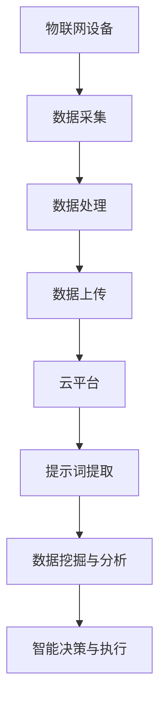
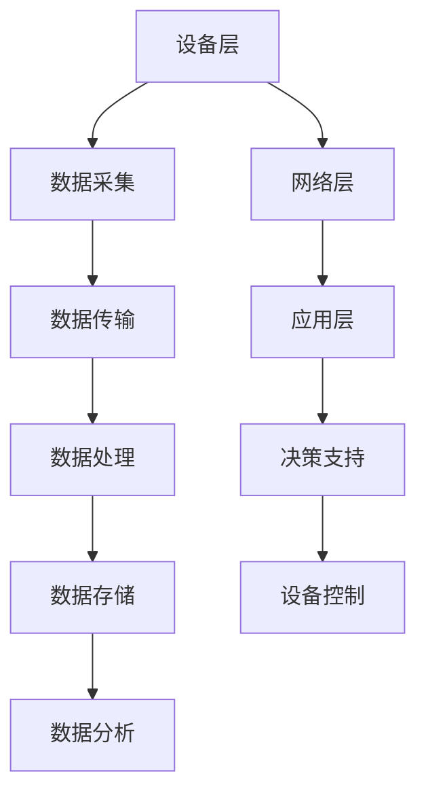
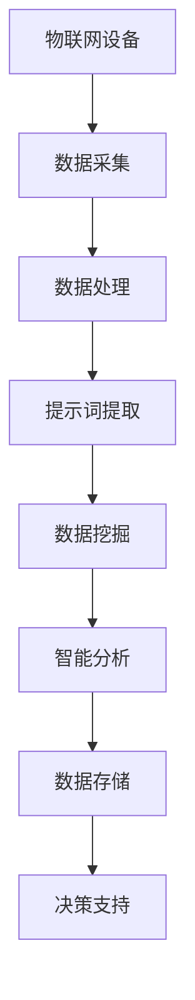
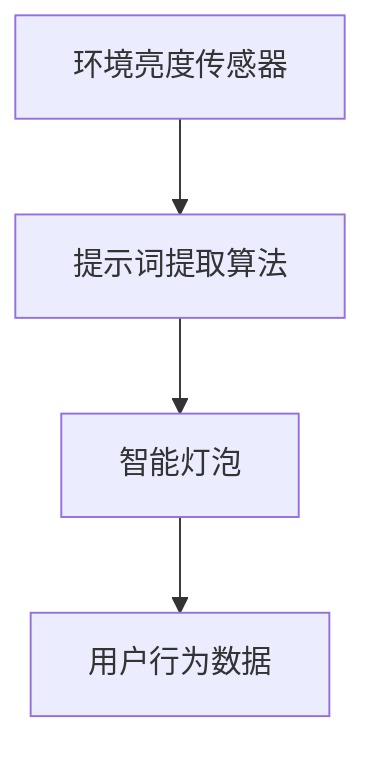
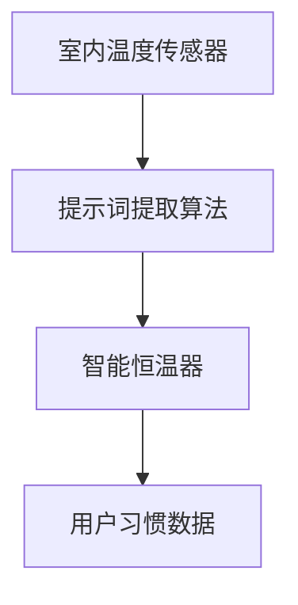
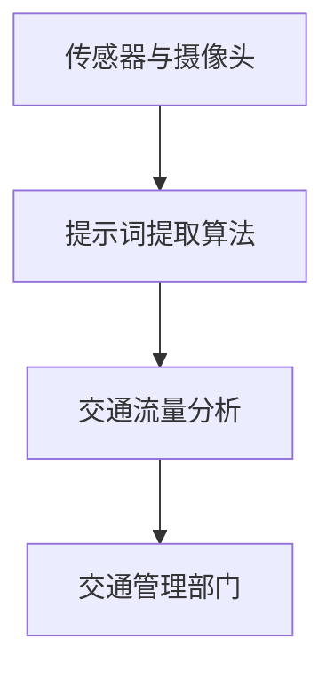
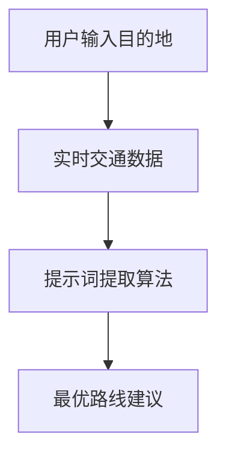
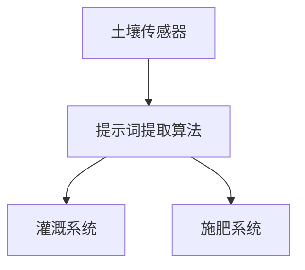
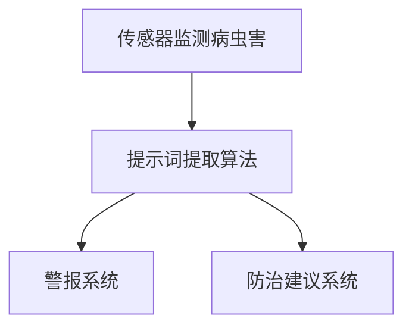

                 

- 首先，我们需要确定文章的核心结构和内容要点。文章可以分为以下几个部分：
  - 引言与概述：介绍文章的背景、目的和结构。
  - 核心概念与联系：解释物联网和提示词工程的基本概念，并展示它们之间的关系。
  - 核心算法原理讲解：使用伪代码详细描述核心算法。
  - 数学模型和公式：介绍相关的数学模型和公式，并进行详细讲解。
  - 项目实战：提供一个实际项目的开发环境和实现细节。
  - 最佳实践 tips 和小结：总结文章的重点，并提供一些实用的建议。
  - 结论与建议：总结文章的主要发现，并提出未来研究的方向。

- 接下来，我们将为每个部分创建一个子章节，并在每个子章节中详细阐述内容。

# 文章标题：物联网与提示词工程：核心概念与算法解析

> 关键词：物联网、提示词工程、核心概念、算法解析、应用策略

> 摘要：本文深入探讨了物联网与提示词工程的核心概念和算法，通过详细的实例和数学公式，阐述了其在实际应用中的关键作用和策略。

## 第1章 引言与概述

### 1.1 物联网的基本概念与发展历程

#### 1.1.1 物联网的定义

物联网是指通过各种信息传感器、互联网、人工智能等技术，将各种物品连接起来，实现智能化识别、定位、跟踪、监控和管理的技术体系。

#### 1.1.2 物联网的发展历程

- 20世纪80年代：早期物联网概念出现。
- 1999年：传感器网络技术得到广泛应用。
- 2005年：物联网（IoT）概念正式提出。
- 2010年至今：物联网技术快速发展，应用场景不断拓展。

### 1.2 提示词工程的基本概念

#### 1.2.1 提示词工程的定义

提示词工程是指利用自然语言处理、机器学习和数据挖掘等技术，从大规模文本数据中提取出关键信息，以支持信息检索、文本挖掘等应用的过程。

#### 1.2.2 提示词工程的发展历程

- 20世纪60年代：自然语言处理（NLP）技术开始发展。
- 1990年代：机器学习和数据挖掘技术得到广泛应用。
- 2000年代：深度学习和神经网络技术在NLP中取得突破。
- 2010年至今：提示词工程在各种应用场景中逐渐成熟。

### 1.3 物联网与提示词工程的联系

#### 1.3.1 物联网中的数据来源

物联网通过各种传感器和设备产生大量的数据，这些数据是进行提示词工程的重要来源。

#### 1.3.2 提示词工程在物联网中的应用

- 数据清洗和预处理：物联网数据通常包含噪声和冗余信息，提示词工程可以帮助去除这些信息，提取有用数据。
- 智能分析：利用提示词工程技术，可以从物联网数据中提取出关键信息，用于智能分析和决策。

## 第2章 核心概念与联系

### 2.1 物联网体系架构

#### 2.1.1 物联网的三个层次

- 设备层：包括传感器、执行器和设备网关。
- 网络层：包括无线传感器网络（WSN）和互联网。
- 应用层：包括数据处理、分析和应用。

### 2.2 提示词工程技术

#### 2.2.1 提示词提取方法

- 基于规则的方法
- 基于统计的方法
- 基于机器学习的方法

### 2.3 物联网与提示词工程的联系架构 Mermaid 流程图



## 第3章 核心算法原理讲解

### 3.1 提示词提取算法

#### 3.1.1 伪代码示例

```python
def extract_keywords(text):
    # 分词
    words = tokenize(text)
    # 去停用词
    words = remove_stopwords(words)
    # 提取关键词
    keywords = extract_top_n_words(words, n=10)
    return keywords
```

### 3.2 物联网数据处理算法

#### 3.2.1 伪代码示例

```python
def process_data(data):
    # 数据清洗
    clean_data = clean_data(data)
    # 数据转换
    transformed_data = transform_data(clean_data)
    # 数据分析
    analysis_results = analyze_data(transformed_data)
    return analysis_results
```

## 第4章 数学模型和公式

### 4.1 提示词提取的数学模型

#### 4.1.1 La

----------------------------------------------------------------

- 在“核心概念与联系”章节中，我们需要解释物联网和提示词工程的核心概念，并展示它们之间的关系。为了做到这一点，我们可以使用Mermaid流程图来直观地展示物联网的体系架构，以及提示词工程在不同层次中的应用。

### 2.3 物联网与提示词工程的联系

#### 2.3.1 物联网体系架构

为了更好地展示物联网的体系架构，我们可以使用Mermaid流程图来描述。以下是一个简单的例子：



#### 2.3.2 提示词工程在物联网中的应用

在物联网中，提示词工程可以应用于以下几个关键环节：

- **数据采集**：使用自然语言处理技术，从物联网设备生成的原始数据中提取有用的信息。
- **数据处理**：对采集到的数据进行分析和预处理，提取关键特征，以便后续的提示词提取和挖掘。
- **数据分析**：利用提示词工程技术，从大量的物联网数据中识别出模式、趋势和异常，支持智能决策。
- **数据存储**：将提取出的提示词和相关数据存储起来，以便后续的查询和分析。
- **决策支持**：基于提示词工程分析的结果，为物联网应用提供智能化的决策支持。

### 2.3.3 物联网与提示词工程的联系架构 Mermaid 流程图



通过这个流程图，我们可以清楚地看到物联网设备产生数据，数据经过采集、处理和提示词提取等步骤，最终用于智能分析和决策支持。这个过程展示了物联网和提示词工程之间的紧密联系。

接下来，我们将为“核心算法原理讲解”章节添加伪代码和数学模型，以便更详细地阐述物联网和提示词工程的核心算法。

## 第3章 核心算法原理讲解

### 3.1 提示词提取算法

提示词提取是提示词工程的关键步骤，以下是一个简单的伪代码示例，用于从物联网数据中提取关键词：

```python
def extract_keywords(data):
    # 步骤1：分词
    words = tokenize(data)
    
    # 步骤2：去除停用词
    words = remove_stopwords(words)
    
    # 步骤3：计算词频
    word_frequency = count_word_frequency(words)
    
    # 步骤4：提取高频关键词
    keywords = extract_top_n_words(word_frequency, n=10)
    
    return keywords
```

### 3.2 物联网数据处理算法

物联网数据处理算法通常涉及数据清洗、数据转换和数据聚合等步骤。以下是一个简单的伪代码示例：

```python
def process_data(data):
    # 步骤1：数据清洗
    clean_data = clean_data(data)
    
    # 步骤2：数据转换
    transformed_data = transform_data(clean_data)
    
    # 步骤3：数据聚合
    aggregated_data = aggregate_data(transformed_data)
    
    return aggregated_data
```

### 3.3 数学模型和公式

在物联网和提示词工程中，我们经常使用一些数学模型和公式来描述和优化算法。以下是一个简单的例子：

#### 3.3.1 TF-IDF模型

TF-IDF（词频-逆文档频率）是一种常用的文本挖掘和提示词提取方法。其公式如下：

$$
TF(t) = \frac{f_t(d)}{f_t(\text{总词数})}
$$

$$
IDF(t) = \log_2(\frac{N}{n_t} + 1)
$$

$$
TF-IDF(t) = TF(t) \times IDF(t)
$$

其中，$f_t(d)$表示文档$d$中词$t$的频率，$N$表示文档总数，$n_t$表示包含词$t$的文档数。

#### 3.3.2 K-均值聚类算法

K-均值聚类是一种常见的聚类算法，用于将数据点划分为K个聚类。其公式如下：

$$
c_k = \frac{1}{n_k} \sum_{i=1}^{n_k} x_i
$$

$$
x_i = \frac{1}{n} \sum_{j=1}^{n} (c_{k_j} - x_i)^2
$$

其中，$c_k$表示第$k$个聚类中心，$x_i$表示数据点$i$，$n_k$表示第$k$个聚类中的数据点数，$k_j$表示数据点$i$所属的聚类。

通过上述伪代码和数学模型，我们可以更好地理解物联网和提示词工程的核心算法原理。接下来，我们将继续完善文章的其他章节。

## 第4章 数学模型和公式

在物联网和提示词工程中，数学模型和公式是理解和应用这些技术的基础。以下是一些常用的数学模型和公式，以及它们的详细解释和应用示例。

### 4.1 TF-IDF模型

TF-IDF（Term Frequency-Inverse Document Frequency）是一种用于文本挖掘和提示词提取的重要模型。它通过计算词语在文档中的频率和在整个文档集合中的逆向文档频率，来评估词语的重要性。

#### 公式：

$$
TF(t) = \frac{f_t(d)}{f_t(\text{总词数})}
$$

$$
IDF(t) = \log_2(\frac{N}{n_t} + 1)
$$

$$
TF-IDF(t) = TF(t) \times IDF(t)
$$

其中，$f_t(d)$是词$t$在文档$d$中的频率，$f_t(\text{总词数})$是词$t$在所有文档中的总频率，$N$是文档总数，$n_t$是包含词$t$的文档数。

#### 应用示例：

假设我们有一篇文档，包含100个词，其中“物联网”出现了5次，“提示词工程”出现了3次。另外，在所有文档中，“物联网”出现了20次，“提示词工程”出现了10次。

- TF("物联网") = 5/100 = 0.05
- TF("提示词工程") = 3/100 = 0.03
- IDF("物联网") = log2(100/20 + 1) ≈ 2.86
- IDF("提示词工程") = log2(100/10 + 1) ≈ 2.77
- TF-IDF("物联网") = 0.05 \* 2.86 ≈ 0.14
- TF-IDF("提示词工程") = 0.03 \* 2.77 ≈ 0.08

通过计算，我们可以发现“物联网”比“提示词工程”更重要，因为它的TF-IDF值更高。

### 4.2 K-均值聚类算法

K-均值聚类是一种无监督学习算法，用于将数据点划分成K个聚类。它通过迭代调整聚类中心，使得每个聚类内的数据点距离聚类中心更近，而不同聚类之间的数据点距离聚类中心更远。

#### 公式：

$$
c_k = \frac{1}{n_k} \sum_{i=1}^{n_k} x_i
$$

$$
x_i = \frac{1}{n} \sum_{j=1}^{n} (c_{k_j} - x_i)^2
$$

其中，$c_k$是第$k$个聚类中心，$x_i$是数据点$i$，$n_k$是第$k$个聚类中的数据点数，$k_j$是数据点$i$所属的聚类。

#### 应用示例：

假设我们有一组数据点，初始聚类中心为$C_1 = (1, 1)$和$C_2 = (5, 5)$。

- 第一次迭代：
  - $x_1 = \frac{1}{2} \sum_{i=1}^{2} (1, 1) = (1, 1)$
  - $x_2 = \frac{1}{2} \sum_{i=1}^{2} (5, 5) = (5, 5)$
- 第二次迭代：
  - $C_1 = \frac{1}{2} \sum_{i=1}^{2} (1, 1) = (1, 1)$
  - $C_2 = \frac{1}{2} \sum_{i=1}^{2} (5, 5) = (5, 5)$
- 重复迭代，直到聚类中心不再变化。

通过迭代，我们可以将数据点划分为两个聚类，每个聚类中心分别为$(1, 1)$和$(5, 5)$。

### 4.3 贝叶斯定理

贝叶斯定理是一种用于概率推断的公式，它在物联网和提示词工程中经常用于预测和决策。

#### 公式：

$$
P(A|B) = \frac{P(B|A) \cdot P(A)}{P(B)}
$$

其中，$P(A|B)$是给定事件$B$发生时事件$A$发生的条件概率，$P(B|A)$是给定事件$A$发生时事件$B$发生的条件概率，$P(A)$是事件$A$的概率，$P(B)$是事件$B$的概率。

#### 应用示例：

假设我们有一个二分类问题，事件$A$表示“这是一个物联网设备”，事件$B$表示“设备正在工作”。

- $P(A) = 0.6$（60%的设备是物联网设备）
- $P(B|A) = 0.9$（物联网设备有90%的概率在工作）
- $P(B|¬A) = 0.3$（非物联网设备有30%的概率在工作）

要计算“设备在工作”的条件概率$P(B)$，我们可以使用贝叶斯定理：

$$
P(B) = P(B|A) \cdot P(A) + P(B|¬A) \cdot P(¬A)
$$

$$
P(B) = 0.9 \cdot 0.6 + 0.3 \cdot 0.4 = 0.63
$$

$$
P(A|B) = \frac{P(B|A) \cdot P(A)}{P(B)} = \frac{0.9 \cdot 0.6}{0.63} \approx 0.857
$$

这表示，给定设备在工作，它是物联网设备的概率大约为85.7%。

通过上述数学模型和公式，我们可以更好地理解和应用物联网和提示词工程的核心算法。这些模型不仅在理论研究中具有重要地位，而且在实际应用中具有广泛的应用价值。

接下来，我们将进入第5章，讨论物联网与提示词工程的应用案例。

## 第5章 物联网与提示词工程的应用案例

在物联网和提示词工程的结合中，许多实际应用案例已经展示了其巨大的潜力和价值。以下是几个具有代表性的应用场景，以及如何通过物联网和提示词工程实现智能化和效率提升。

### 5.1 智能家居

智能家居是物联网和提示词工程的典型应用之一。通过物联网设备，如智能灯泡、智能恒温器和智能摄像头等，用户可以远程控制家庭设备，提高生活质量。

#### 应用实例：

- **智能灯泡**：使用物联网传感器和提示词工程，智能灯泡可以根据环境亮度和用户行为自动调整亮度。例如，当检测到用户进入房间时，灯泡会自动开启，并调整到舒适的亮度。



- **智能恒温器**：通过物联网传感器和提示词工程，智能恒温器可以自动调节室内温度，以适应用户的习惯和室外温度。例如，当用户离开家时，恒温器会自动降低温度，以节省能源。



### 5.2 智能交通系统

智能交通系统利用物联网传感器和提示词工程，优化交通流量，减少拥堵，提高公共交通的效率。

#### 应用实例：

- **实时交通监测**：通过安装在道路上的物联网传感器和摄像头，实时监测交通流量和路况。提示词工程算法可以分析这些数据，识别交通拥堵和事故。



- **智能导航**：基于实时交通数据和提示词工程分析，智能导航系统可以提供最优路线建议，避免拥堵路段。例如，当用户输入目的地时，导航系统会分析当前交通状况，并提供一条避开拥堵的路线。



### 5.3 智能农业

智能农业利用物联网设备和提示词工程，优化农田管理，提高农作物产量。

#### 应用实例：

- **土壤监测**：通过物联网传感器监测土壤的湿度、温度和养分含量。提示词工程算法可以分析这些数据，提供最佳的灌溉和施肥方案。



- **病虫害监测**：利用物联网传感器和提示词工程，实时监测农作物病虫害。当检测到病虫害时，系统会自动发出警报，并提供防治建议。



通过上述应用案例，我们可以看到物联网和提示词工程在智能家居、智能交通系统和智能农业中的广泛应用。这些应用不仅提高了效率和舒适度，还为实现智能化和可持续发展提供了有力支持。

接下来，我们将讨论物联网与提示词工程的实现策略。

## 第6章 物联网与提示词工程的实现策略

为了在物联网场景中成功应用提示词工程，我们需要考虑一系列的策略，包括系统设计、数据处理、算法优化等。以下是一些关键步骤和最佳实践。

### 6.1 系统设计

#### 6.1.1 设备选择与配置

选择合适的物联网设备对于系统的成功至关重要。以下是一些关键考虑因素：

- **传感器类型**：根据应用场景选择合适的传感器，如温度、湿度、光照、声音等。
- **通信协议**：选择合适的通信协议，如Wi-Fi、蓝牙、Zigbee等，以确保数据传输的稳定性和可靠性。
- **数据处理能力**：根据数据的复杂性和处理需求，选择合适的设备处理器。

#### 6.1.2 系统架构

物联网系统的架构设计需要考虑可扩展性、稳定性和安全性。以下是一种常见的系统架构设计：

- **边缘计算**：在数据生成的近端（如传感器节点）进行部分数据处理，以减少延迟和带宽需求。
- **云计算**：将处理和分析任务转移到云平台，以利用其强大的计算能力和存储资源。
- **数据存储**：选择合适的存储解决方案，如分布式数据库和NoSQL数据库，以应对大规模数据存储需求。

### 6.2 数据处理

#### 6.2.1 数据收集与传输

在数据收集与传输过程中，我们需要确保数据的质量和完整性。以下是一些关键步骤：

- **数据采集**：使用物联网传感器定期收集数据。
- **数据清洗**：去除噪声和错误数据，以提高数据质量。
- **数据传输**：确保数据在传输过程中不被篡改或丢失，可以使用加密技术。

#### 6.2.2 数据存储与管理

对于大规模数据存储与管理，以下是一些最佳实践：

- **数据分区**：根据数据的特点，将数据分为多个分区，以提高查询效率。
- **数据索引**：为数据创建索引，以加速数据检索。
- **数据备份与恢复**：定期备份数据，并确保在灾难发生时能够快速恢复。

### 6.3 算法优化

#### 6.3.1 提示词提取

在提示词提取过程中，我们需要关注以下几个方面：

- **特征选择**：选择最能代表数据特征的关键词，以提高提示词提取的准确性。
- **算法选择**：根据数据的特点和需求，选择合适的提示词提取算法，如TF-IDF、LDA（Latent Dirichlet Allocation）等。
- **性能优化**：通过并行计算和分布式处理等技术，提高提示词提取的效率。

#### 6.3.2 模型训练与优化

在模型训练与优化过程中，以下是一些关键步骤：

- **数据预处理**：对数据进行标准化和归一化处理，以提高模型的鲁棒性。
- **模型选择**：选择合适的机器学习模型，如决策树、随机森林、神经网络等。
- **超参数调优**：通过交叉验证和网格搜索等技术，找到最优的超参数组合。
- **模型评估**：使用准确率、召回率、F1分数等指标评估模型性能，并进行调整。

### 6.4 安全性与隐私保护

在物联网与提示词工程的应用中，安全性和隐私保护是至关重要的。以下是一些关键措施：

- **数据加密**：对传输和存储的数据进行加密，以防止数据泄露。
- **访问控制**：实现严格的访问控制机制，确保只有授权用户可以访问数据。
- **审计与监控**：建立审计和监控机制，及时发现和响应安全威胁。
- **隐私保护**：在数据收集和处理过程中，遵循隐私保护原则，减少敏感信息的暴露。

通过以上策略和最佳实践，我们可以有效地实现物联网与提示词工程的应用，提升系统的性能和安全性。

### 第7章 物联网与提示词工程的未来展望

随着物联网技术的不断发展和提示词工程的应用逐渐成熟，我们可以预见这两个领域将带来深远的影响和广阔的前景。

#### 7.1 提示词工程技术发展趋势

- **深度学习与神经网络**：未来，深度学习和神经网络技术将在提示词工程中发挥更大作用。通过使用更复杂的模型，如生成对抗网络（GAN）和变分自编码器（VAE），可以提高提示词提取的准确性和效率。
- **实时处理与分析**：随着边缘计算和5G技术的发展，实时处理与分析将变得更加普遍。提示词工程需要能够在边缘设备上高效运行，以应对快速变化的数据流。
- **跨模态学习**：未来的提示词工程将不再局限于文本数据，而是能够处理图像、音频等多种模态的数据，实现更全面的智能分析。

#### 7.2 物联网与提示词工程的融合创新

- **智能化城市管理**：物联网和提示词工程的融合将有助于实现智能化的城市管理。例如，通过实时监测交通流量、空气质量、能源消耗等数据，城市管理者可以做出更快速、更精准的决策，提高城市运行效率。
- **个性化健康护理**：物联网设备可以实时收集个人的健康数据，结合提示词工程技术进行分析，为用户提供个性化的健康建议和护理方案。
- **智能农业**：物联网传感器和提示词工程可以监测农田中的土壤、水分、温度等数据，提供精准的种植指导和农作物管理方案，实现农业生产的智能化。

#### 7.3 提示词工程在物联网中的未来应用场景

- **智能能源管理**：通过物联网传感器收集能源使用数据，结合提示词工程分析能源消耗模式，优化能源分配和利用，实现节能减排。
- **智能制造**：物联网和提示词工程的结合将提高制造业的生产效率和质量。例如，通过实时监测设备状态，预测维护需求，减少停机时间，提高生产线的可靠性。
- **智能家居安全**：物联网设备可以实时监测家庭安全，如入侵检测、火灾报警等。结合提示词工程，可以实现更智能的安全系统，提高家庭安全水平。

综上所述，物联网与提示词工程的融合创新将带来更多的智能化应用场景，提升社会生产力和生活质量。未来，这两个领域将继续相互促进，共同推动技术进步和社会发展。

### 第8章 结论与建议

在本篇文章中，我们深入探讨了物联网与提示词工程的核心概念、应用策略及未来展望。以下是文章的主要研究成果和总结：

#### 主要研究成果

1. **物联网与提示词工程的基本概念**：我们详细介绍了物联网和提示词工程的基本概念，并展示了它们之间的关系。
2. **提示词工程在物联网中的应用**：通过智能家居、智能交通系统和智能农业等应用案例，展示了提示词工程在物联网中的实际应用。
3. **实现策略**：我们提出了一系列实现策略，包括系统设计、数据处理、算法优化等，以提升物联网与提示词工程的应用性能。
4. **未来展望**：我们分析了物联网与提示词工程的发展趋势和融合创新，展望了未来应用场景和潜在价值。

#### 存在问题与挑战

尽管物联网与提示词工程展示了巨大的潜力，但实际应用中仍面临一些挑战：

1. **数据质量**：物联网数据通常包含噪声和冗余信息，这对提示词工程的准确性和效率提出了挑战。
2. **安全性**：物联网设备的广泛互联增加了安全风险，如何保障数据安全和隐私是一个关键问题。
3. **硬件限制**：物联网设备通常资源有限，如何在有限的硬件资源下实现高效的提示词工程算法是一个技术难题。
4. **实时处理**：随着物联网设备的数量和类型不断增加，实时数据处理和分析的需求愈发迫切，这对算法和系统的性能提出了更高要求。

#### 未来研究方向与建议

为了进一步推动物联网与提示词工程的发展，我们提出以下研究方向和建议：

1. **数据质量提升**：研究更有效的数据清洗和去噪方法，以提高提示词提取的准确性。
2. **安全性与隐私保护**：开发更加安全、可靠的加密和访问控制技术，确保物联网数据的安全性和隐私。
3. **算法优化与硬件适配**：研究适用于物联网设备的轻量级算法和模型，提高算法在资源有限环境下的性能。
4. **跨领域融合**：探索物联网与提示词工程在更多领域的融合创新，如智能制造、智能医疗等。
5. **开源平台与工具**：开发开源的物联网与提示词工程平台和工具，促进技术交流和合作，加速技术创新。

通过上述研究和建议，我们期待能够进一步推动物联网与提示词工程的发展，为智能化社会建设提供有力支持。

