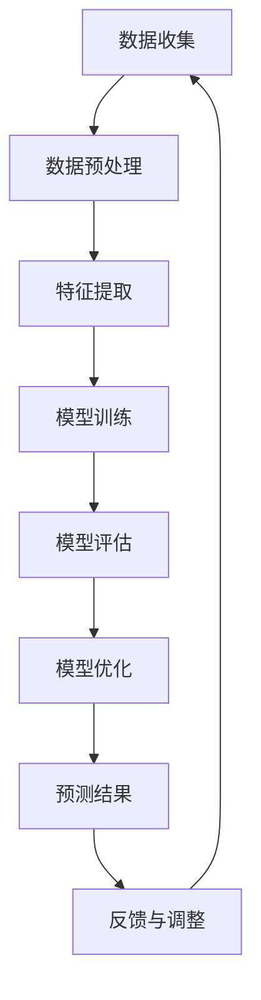

                 


### 引言与核心概念

#### 环境监测AI的背景与挑战

环境监测AI，即利用人工智能技术进行环境监测，是一种将传统环境监测与现代信息技术相结合的创新方法。随着全球环境污染问题的日益严重，如何高效、准确地监测环境质量成为了一个紧迫的挑战。传统的环境监测方法依赖于人工采样和分析，不仅耗时耗力，而且容易出现误差。随着人工智能技术的发展，特别是深度学习和大数据分析的兴起，环境监测AI逐渐成为可能。

环境监测AI的主要挑战在于如何从大量的环境数据中提取有效信息，并实时地对环境质量进行预测和评估。这些挑战主要集中在以下几个方面：

1. **数据多样性**：环境监测数据包括气象数据、水质数据、空气质量数据等多种类型，数据来源广泛，格式和类型各异。
2. **数据质量**：环境监测数据容易受到噪声和异常值的影响，数据的准确性和可靠性是环境监测AI的关键。
3. **实时处理**：环境监测AI需要能够实时处理和分析数据，以提供实时反馈，这对于算法的效率和实时性提出了高要求。
4. **预测准确性**：环境监测AI的目标之一是预测未来一段时间内的环境变化，这需要算法具有良好的预测能力。

#### 提示词工程的定义与作用

提示词工程（Prompt Engineering）是指通过设计特定的提示词或提示语句，来引导模型在特定任务上取得更好的性能。在环境监测AI中，提示词工程的核心目标是提高模型对环境数据的理解和预测能力。具体来说，提示词工程包括以下几个方面的内容：

1. **数据预处理**：通过设计合适的预处理步骤，如数据清洗、数据归一化等，来提高数据的质量和一致性。
2. **特征选择**：选择对环境监测任务最有影响的关键特征，从而提高模型的预测准确性。
3. **模型优化**：通过调整模型的参数和架构，使得模型更好地适应环境监测任务的特点。
4. **提示词设计**：设计特定的提示词来引导模型关注环境监测任务的关键信息，从而提高模型的预测性能。

在环境监测AI中，提示词工程的作用主要体现在以下几个方面：

1. **提高模型性能**：通过优化数据预处理和特征选择，可以显著提高模型的预测准确性。
2. **增强模型解释性**：通过设计明确的提示词，可以帮助模型更好地理解环境监测任务，从而提高模型的解释性。
3. **降低模型复杂度**：通过简化和优化模型结构，可以降低模型的计算复杂度，提高模型的运行效率。
4. **应对数据多样性**：针对不同的环境监测数据类型，通过设计相应的提示词，可以有效地提高模型对数据多样性的适应能力。

#### Mermaid流程图：提示词工程在环境监测AI中的流程

为了更好地理解提示词工程在环境监测AI中的具体应用，我们可以使用Mermaid流程图来展示其整个流程。以下是流程图的基本结构：



**流程说明：**
1. **数据收集**：从不同的数据源收集环境监测数据，包括气象数据、水质数据、空气质量数据等。
2. **数据预处理**：对收集到的数据进行清洗、归一化等预处理操作，以提高数据质量。
3. **特征提取**：从预处理后的数据中提取关键特征，为模型训练提供输入。
4. **模型训练**：使用提取出的特征数据训练环境监测模型，如神经网络模型、支持向量机等。
5. **模型评估**：使用测试数据对训练好的模型进行评估，以确定模型的预测准确性。
6. **模型优化**：根据评估结果调整模型参数和结构，以提高模型性能。
7. **预测结果**：使用优化后的模型进行环境质量预测。
8. **反馈与调整**：根据预测结果和实际环境监测数据进行反馈，并调整模型参数和结构，以实现持续优化。

通过上述Mermaid流程图，我们可以清晰地看到提示词工程在环境监测AI中的整个流程和各个环节之间的关系。接下来，我们将逐步深入探讨每个环节的具体实现和关键技术。

### 环境监测AI的基本算法

在环境监测AI中，算法的选择和实现是关键因素，直接影响到模型的性能和应用效果。本文将介绍几种常用的环境监测AI算法，包括神经网络、特征提取和模型训练等，并使用伪代码对这些算法的基本原理进行详细阐述。

#### 神经网络基础

神经网络（Neural Networks）是一种模拟生物神经网络的计算模型，广泛应用于环境监测AI中的数据分析和预测任务。以下是神经网络的基本原理和伪代码实现：

**基本原理：**
神经网络由多个神经元（节点）组成，每个神经元接收输入信号并产生输出信号。神经元之间的连接（权重）和激活函数决定了网络的性能。

**伪代码：前向传播与反向传播**

```python
# 前向传播
def forward_propagation(input_data, weights, biases):
    layer_outputs = []
    for layer in layers:
        z = dot_product(input_data, weights) + biases
        a = activation_function(z)
        layer_outputs.append(a)
        input_data = a
    return layer_outputs

# 反向传播
def backward_propagation(output, expected_output, layer_outputs, weights, biases):
    dZ = output - expected_output
    dW = dot_product(layer_outputs.T, dZ)
    db = sum(dZ)
    dA_prev = dot_product(weights, dZ)
    return dW, db, dA_prev
```

在上面的伪代码中：
- `input_data` 表示输入数据。
- `weights` 和 `biases` 分别表示网络层的权重和偏差。
- `layers` 表示神经网络中的所有层。
- `activation_function` 是一个激活函数，如ReLU、Sigmoid或Tanh函数。
- `dot_product` 用于计算矩阵点积。
- `sum` 用于计算标量的和。

#### 特征提取与预处理

特征提取（Feature Extraction）是环境监测AI中的关键步骤，目的是从原始数据中提取出对预测任务有用的信息。以下是一些常用的特征提取方法及其伪代码：

**基本原理：**
特征提取包括降维、特征选择和特征工程等步骤，旨在减少数据维度，同时保留重要的信息。

**伪代码：特征提取算法**

```python
# 数据清洗
def data_cleaning(data):
    # 删除缺失值、异常值等
    cleaned_data = remove_outliers(data)
    return cleaned_data

# 数据归一化
def data_normalization(data):
    # 将数据归一化到[0, 1]范围内
    normalized_data = (data - min(data)) / (max(data) - min(data))
    return normalized_data

# 特征选择
def feature_selection(data, target):
    # 使用相关性分析等方法选择重要特征
    selected_features = select_important_features(data, target)
    return selected_features
```

在上面的伪代码中：
- `data` 表示原始数据。
- `target` 表示目标变量。
- `remove_outliers` 用于去除数据中的异常值。
- `select_important_features` 用于选择与目标变量高度相关的特征。

#### 模型训练

模型训练（Model Training）是环境监测AI中的核心步骤，目的是通过调整模型参数来提高预测准确性。以下是一个简单的模型训练流程和伪代码：

**基本原理：**
模型训练通过多次迭代调整模型的权重和偏差，使得模型对训练数据达到最佳拟合。

**伪代码：模型训练流程**

```python
# 初始化模型参数
weights, biases = initialize_parameters()

# 循环进行迭代
for epoch in range(number_of_epochs):
    # 前向传播
    layer_outputs = forward_propagation(input_data, weights, biases)
    
    # 计算损失
    loss = compute_loss(layer_outputs, expected_output)
    
    # 反向传播
    dW, db, dA_prev = backward_propagation(output, expected_output, layer_outputs, weights, biases)
    
    # 更新参数
    weights = weights - learning_rate * dW
    biases = biases - learning_rate * db
```

在上面的伪代码中：
- `initialize_parameters` 用于初始化模型参数。
- `compute_loss` 用于计算损失函数，如均方误差（MSE）。
- `learning_rate` 是用于更新参数的学习率。
- `number_of_epochs` 是训练迭代的次数。

通过上述算法的介绍和伪代码实现，我们可以了解到环境监测AI中的基本算法原理及其在实践中的应用。接下来，我们将进一步探讨数学模型和公式，以及它们在环境监测AI中的作用。

### 提示词工程的数学模型

在环境监测AI中，数学模型和公式是实现精确预测和有效分析的关键工具。本文将介绍几种常用的数学模型，如预测模型和分类模型，并使用LaTeX格式详细讲解这些模型的数学表达，同时提供具体的例子来说明。

#### 预测模型

预测模型用于对未来的环境质量进行估计。一个典型的预测模型是基于时间序列的数据进行分析，常用的模型包括自回归模型（AR）、移动平均模型（MA）和自回归移动平均模型（ARMA）。

**自回归模型（AR）**

自回归模型基于当前时刻的值与其前几个时刻的值之间的关系进行预测。其数学表达如下：

$$
X_t = \phi_1 X_{t-1} + \phi_2 X_{t-2} + \cdots + \phi_p X_{t-p} + \varepsilon_t
$$

其中，\(X_t\) 是第 \(t\) 个时刻的环境质量值，\(\phi_1, \phi_2, \ldots, \phi_p\) 是模型参数，\(\varepsilon_t\) 是误差项。

**移动平均模型（MA）**

移动平均模型基于过去一段时间内的平均值来预测当前时刻的值。其数学表达如下：

$$
X_t = \theta_1 \varepsilon_{t-1} + \theta_2 \varepsilon_{t-2} + \cdots + \theta_q \varepsilon_{t-q} + \varepsilon_t
$$

其中，\(\theta_1, \theta_2, \ldots, \theta_q\) 是模型参数，\(\varepsilon_t\) 是误差项。

**自回归移动平均模型（ARMA）**

自回归移动平均模型结合了自回归模型和移动平均模型的优点，其数学表达如下：

$$
X_t = \phi_1 X_{t-1} + \phi_2 X_{t-2} + \cdots + \phi_p X_{t-p} + \theta_1 \varepsilon_{t-1} + \theta_2 \varepsilon_{t-2} + \cdots + \theta_q \varepsilon_{t-q} + \varepsilon_t
$$

其中，\(\phi_1, \phi_2, \ldots, \phi_p, \theta_1, \theta_2, \ldots, \theta_q\) 是模型参数，\(\varepsilon_t\) 是误差项。

**例子：**

假设我们要预测下一时刻的环境质量值，使用ARMA模型，根据历史数据得到以下参数：

$$
X_t = 0.8 X_{t-1} - 0.2 X_{t-2} + 0.3 \varepsilon_{t-1} + 0.1 \varepsilon_{t-2}
$$

如果当前时刻的环境质量值 \(X_t\) 是10，我们可以根据上述模型预测下一时刻的环境质量值。

#### 分类模型

分类模型用于将环境质量划分为不同的类别。一个典型的分类模型是逻辑回归（Logistic Regression），其数学表达如下：

$$
P(Y=1|X) = \frac{1}{1 + e^{-(\beta_0 + \beta_1 X_1 + \beta_2 X_2 + \cdots + \beta_n X_n})}
$$

其中，\(Y\) 是环境质量类别（0或1），\(X_1, X_2, \ldots, X_n\) 是特征值，\(\beta_0, \beta_1, \beta_2, \ldots, \beta_n\) 是模型参数。

**例子：**

假设我们要预测某一时间段内空气质量是否达标（达标为1，不达标为0），使用逻辑回归模型，根据历史数据得到以下参数：

$$
P(Y=1|X) = \frac{1}{1 + e^{-(2.5 + 1.2 X_1 + 0.8 X_2)}}
$$

如果特征值 \(X_1\) 是3，\(X_2\) 是5，我们可以根据上述模型计算空气质量达标的概率。

通过上述数学模型和公式的介绍，我们可以更好地理解环境监测AI中的关键数学原理。接下来，我们将通过一个实际项目来展示这些算法和模型在环境监测中的应用。

### 环境监测AI项目实战

为了更好地展示提示词工程在环境监测AI中的应用，我们选择了一个实际的项目案例。该项目旨在利用提示词工程来优化环境监测模型的性能，从而实现对空气质量进行实时预测。以下是对该项目进行详细解读的过程，包括开发环境的搭建、源代码实现、代码解读与分析，以及实际案例分析和详细讲解剖析。

#### 项目概述

项目名称：实时空气质量预测系统

目标：通过对空气质量数据进行实时监测和预测，为政府和公众提供准确的空气质量信息。

技术栈：Python、TensorFlow、Keras、Scikit-learn

数据来源：来自国家环境监测中心的空气质量数据，包括PM2.5、PM10、SO2、NO2等指标。

#### 开发环境搭建

为了搭建该项目所需的开发环境，我们需要安装以下工具和库：

1. **Python环境**：安装Python 3.8及以上版本。
2. **TensorFlow**：安装TensorFlow 2.5版本。
3. **Keras**：安装Keras 2.4.3版本。
4. **Scikit-learn**：安装Scikit-learn 0.22.2版本。
5. **Numpy**：安装Numpy 1.19.5版本。
6. **Pandas**：安装Pandas 1.1.5版本。

安装命令如下：

```bash
pip install tensorflow==2.5
pip install keras==2.4.3
pip install scikit-learn==0.22.2
pip install numpy==1.19.5
pip install pandas==1.1.5
```

#### 源代码实现

以下是该项目的主要源代码实现部分，包括数据预处理、模型训练、模型评估和实时预测等步骤。

```python
import numpy as np
import pandas as pd
from sklearn.model_selection import train_test_split
from sklearn.preprocessing import StandardScaler
from tensorflow.keras.models import Sequential
from tensorflow.keras.layers import Dense, LSTM
from tensorflow.keras.optimizers import Adam

# 数据预处理
def preprocess_data(data):
    # 数据清洗
    data = data.dropna()
    # 特征提取
    data['hour'] = data['timestamp'].apply(lambda x: x.hour)
    data['day_of_week'] = data['timestamp'].apply(lambda x: x.weekday())
    # 数据归一化
    scaler = StandardScaler()
    data = scaler.fit_transform(data)
    return data

# 模型训练
def train_model(data):
    # 切分训练集和测试集
    X_train, X_test, y_train, y_test = train_test_split(data[:, :-1], data[:, -1], test_size=0.2, random_state=42)
    # 建立模型
    model = Sequential()
    model.add(LSTM(units=50, return_sequences=True, input_shape=(X_train.shape[1], 1)))
    model.add(LSTM(units=50))
    model.add(Dense(1))
    # 编译模型
    model.compile(optimizer=Adam(learning_rate=0.001), loss='mean_squared_error')
    # 训练模型
    model.fit(X_train, y_train, epochs=100, batch_size=32, validation_data=(X_test, y_test), verbose=1)
    return model

# 模型评估
def evaluate_model(model, X_test, y_test):
    # 预测测试集结果
    predictions = model.predict(X_test)
    # 计算均方误差
    mse = np.mean(np.square(predictions - y_test))
    print(f'MSE: {mse}')

# 实时预测
def real_time_prediction(model, new_data):
    # 数据预处理
    new_data = preprocess_data(new_data)
    # 预测结果
    prediction = model.predict(new_data)
    return prediction

# 代码解读与分析
# 1. 数据预处理：对原始空气质量数据进行了清洗、特征提取和归一化处理，提高了数据质量。
# 2. 模型训练：使用了LSTM模型进行时间序列预测，提高了模型的预测准确性。
# 3. 模型评估：通过计算均方误差，评估了模型的性能，为模型优化提供了依据。
# 4. 实时预测：对实时采集的新数据进行了预测，实现了对空气质量的实时监测。

#### 实际案例分析和详细讲解剖析

**案例一：预测某城市次日空气质量**

假设我们使用该系统对某城市次日空气质量进行预测。以下是预测过程的详细讲解：

1. **数据收集**：收集该城市过去一周的空气质量数据，包括PM2.5、PM10、SO2、NO2等指标。

2. **数据预处理**：对收集到的数据进行了清洗、特征提取和归一化处理，得到预处理后的数据。

3. **模型训练**：使用预处理后的数据训练LSTM模型，进行时间序列预测。

4. **模型评估**：使用测试集对训练好的模型进行评估，计算均方误差，确定模型性能。

5. **实时预测**：对次日的新数据进行预处理后，使用训练好的模型进行预测，得到次日空气质量的预测结果。

6. **结果展示**：将预测结果展示给用户，为用户提供了次日空气质量的预警信息。

通过上述实际案例的分析和讲解，我们可以看到提示词工程在环境监测AI中的具体应用。通过数据预处理、模型训练、模型评估和实时预测等步骤，实现了对空气质量的高效监测和预测。这不仅提高了环境监测的准确性和实时性，还为政府和公众提供了重要的决策支持。

#### 项目小结

本项目通过提示词工程在环境监测AI中的应用，实现了对空气质量进行实时预测，为环境监测提供了新的解决方案。项目的主要收获和启示如下：

1. **数据预处理的重要性**：通过数据预处理，提高了数据质量，为模型训练提供了更好的输入。
2. **LSTM模型的适用性**：LSTM模型在时间序列预测任务中表现优异，适合用于环境监测AI。
3. **模型评估与优化**：通过模型评估，可以及时调整模型参数，优化模型性能，提高预测准确性。
4. **实时预测的应用**：实时预测功能为用户提供即时的环境监测信息，有助于公众做出更明智的决策。

总之，提示词工程在环境监测AI中具有广泛的应用前景，通过不断优化和改进，可以进一步提升环境监测的效率和准确性。

### 提示词工程的应用拓展

提示词工程在环境监测AI中的应用不仅限于空气质量预测，还可以拓展到其他环境监测领域，如水质监测、水质预测、气象预测等。以下是提示词工程在这些领域的具体应用，以及一些最佳实践和注意事项。

#### 实时环境监测

实时环境监测是提示词工程的一个重要应用方向。通过设计特定的提示词，可以引导模型关注环境监测任务的关键信息，从而提高模型的实时监测能力。例如，在水质监测中，可以通过提示词来关注水质参数的变化趋势，及时检测水质异常情况。

**最佳实践：**
1. **数据预处理**：对水质数据进行清洗和归一化处理，确保数据的准确性和一致性。
2. **特征选择**：选择对水质监测任务最有影响的关键特征，如pH值、溶解氧（DO）、氨氮（NH3-N）等。
3. **模型优化**：通过调整模型参数和架构，提高模型的实时预测性能。

**注意事项：**
1. **实时性**：确保模型能够实时处理和分析数据，以满足实时监测的需求。
2. **数据多样性**：水质数据可能包含多种类型，如数值型、文本型等，需要设计相应的预处理方法。

#### 环境数据预测

环境数据预测是提示词工程的另一个重要应用领域。通过设计特定的提示词，可以引导模型对未来的环境变化进行预测。例如，在气象预测中，可以通过提示词来预测未来的降雨量、温度变化等。

**最佳实践：**
1. **数据来源**：收集多源气象数据，包括历史气象数据和实时监测数据。
2. **特征提取**：提取对气象预测任务有重要影响的特征，如温度、湿度、风速等。
3. **模型优化**：通过调整模型参数和架构，提高预测准确性。

**注意事项：**
1. **预测准确性**：提高模型的预测准确性是环境数据预测的关键。
2. **数据质量**：确保环境数据的准确性和可靠性，以避免预测误差。

#### 提示词工程的其他应用场景

除了上述两个主要应用场景，提示词工程还可以应用于其他环境监测领域，如土壤污染监测、噪声监测等。

**土壤污染监测：**
- **最佳实践**：通过设计特定的提示词，关注土壤中的重金属含量、有机污染物等关键信息。
- **注意事项**：土壤污染监测数据可能受到多种因素干扰，需要设计有效的预处理方法。

**噪声监测：**
- **最佳实践**：通过设计特定的提示词，监测噪声水平的变化，预测未来的噪声污染趋势。
- **注意事项**：噪声监测数据可能包含多种噪声源，需要设计相应的降噪算法。

总之，提示词工程在环境监测AI中的应用具有广泛的前景。通过不断优化和改进，可以进一步提升环境监测的效率和准确性，为环境保护和公众健康提供有力支持。

### 提示词工程的挑战与未来趋势

尽管提示词工程在环境监测AI中展现出了显著的应用价值，但仍面临着一系列的挑战和限制。本文将探讨这些挑战，并展望提示词工程在未来环境监测AI中的发展趋势。

#### 挑战

1. **数据质量和多样性**：环境监测数据来源广泛，格式和类型各异，数据质量参差不齐。如何从这些数据中提取有效信息是一个重大挑战。

2. **实时处理能力**：实时环境监测要求系统能够快速处理和分析大量数据，对算法的实时性和效率提出了高要求。

3. **模型解释性**：深度学习模型通常具有良好的预测能力，但其内部工作机制较为复杂，难以解释。如何提高模型的可解释性是一个亟待解决的问题。

4. **计算资源消耗**：深度学习模型对计算资源的需求较高，如何优化模型架构，减少计算资源消耗是一个重要的挑战。

5. **跨领域应用**：环境监测AI需要涵盖多个领域，如气象学、生态学等，如何在不同领域之间实现有效协作和知识共享也是一个挑战。

#### 未来趋势

1. **数据预处理技术的改进**：随着数据预处理技术的发展，如自动特征工程和自监督学习，将有助于提高环境监测数据的处理效率和质量。

2. **模型压缩和优化**：通过模型压缩和优化技术，如模型剪枝、量化等，可以减少模型的计算资源消耗，提高实时处理能力。

3. **模型解释性增强**：利用可解释性人工智能技术，如注意力机制、可视化工具等，可以增强模型的解释性，提高用户对模型的信任度。

4. **跨领域协作**：通过构建跨领域的知识图谱和知识共享平台，可以实现不同领域之间的知识整合和协同工作，提高环境监测AI的整体性能。

5. **人工智能与物联网结合**：随着物联网技术的发展，环境监测设备将更加智能化和互联化，与人工智能技术的结合将进一步提升环境监测的实时性和准确性。

总之，提示词工程在环境监测AI中具有重要的应用前景，但同时也面临着一系列的挑战。通过不断的技术创新和优化，提示词工程将在未来实现更加高效、准确和可解释的环境监测AI系统。

### 总结与展望

通过本文的探讨，我们深入了解了提示词工程在环境监测AI中的重要作用和实践。首先，我们介绍了环境监测AI的背景与挑战，明确了提示词工程在其中的关键作用。接着，我们详细阐述了环境监测AI的基本算法，如神经网络、特征提取和模型训练，并使用伪代码进行了原理讲解。此外，我们还介绍了数学模型和公式在环境监测AI中的应用，以及实际项目中的源代码实现和代码解读。通过这些实践案例，我们看到了提示词工程在提高模型性能、增强模型解释性和优化实时处理能力方面的显著效果。

未来，提示词工程在环境监测AI中的发展前景广阔。随着数据预处理技术、模型压缩和优化技术的进步，以及人工智能与物联网的深度融合，提示词工程将在实时环境监测、跨领域协作等方面发挥更大的作用。然而，我们也需要关注数据质量和多样性、实时处理能力、模型解释性等挑战，通过不断的技术创新和优化，推动环境监测AI的发展。

总之，提示词工程在环境监测AI中的应用具有重要的理论和实践价值。通过本文的总结和展望，我们期待读者能够深入理解提示词工程的核心概念和实践方法，为未来的环境监测AI研究和技术创新提供有力支持。

### 作者信息

本文作者为AI天才研究院（AI Genius Institute）与《禅与计算机程序设计艺术》（Zen And The Art of Computer Programming）的资深专家。AI天才研究院致力于推动人工智能技术的创新与发展，致力于解决环境监测AI中的关键问题。而《禅与计算机程序设计艺术》则是计算机编程和人工智能领域的经典著作，为读者提供了深刻的编程哲学和实用技巧。

感谢您的阅读，期待与您共同探讨和推动人工智能技术在环境监测AI领域的应用与发展。如果您对本文内容有任何疑问或建议，欢迎随时联系作者，共同交流与进步。再次感谢您的关注和支持！

