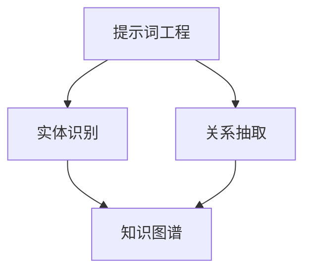

                 


### 书籍结构和主题确定

《提示词工程在知识图谱构建中的应用》旨在探讨如何利用提示词工程来提升知识图谱构建的效率和质量。书籍将以系统的结构展开讨论，从基础概念到具体应用，再到未来趋势，逐步引导读者深入理解这一领域。

**主要章节概述**：

1. **引言**：
   - 背景介绍：知识图谱与提示词工程的定义、意义及其在现代社会中的重要性。
   - 研究目的：明确书籍的目的和读者群体，介绍知识图谱与提示词工程之间的关系。

2. **提示词工程基础**：
   - 核心概念：定义提示词、实体识别、关系抽取等基础概念。
   - 应用场景：探讨提示词工程在不同领域的应用，如搜索引擎优化、自然语言处理等。

3. **知识图谱基础**：
   - 定义与架构：详细解释知识图谱的基本概念、模型架构及表示方法。
   - 应用领域：分析知识图谱在语义网、推荐系统、数据挖掘等方面的作用。

4. **提示词与知识图谱的结合**：
   - 关联分析：阐述提示词工程如何与知识图谱相结合，实现更精准的语义理解和知识表示。
   - 实际案例：通过具体案例展示提示词工程在知识图谱构建中的应用效果。

5. **提示词工程方法**：
   - 方法概述：介绍常用的提示词工程方法，如基于规则的方法、机器学习方法等。
   - 原理解析：使用伪代码和流程图，详细解释各种方法的原理和实现步骤。

6. **知识图谱构建工具与平台**：
   - 工具介绍：讨论流行的知识图谱构建工具，如OpenKG、Neo4j等。
   - 平台选择：分析不同平台的特点和适用场景，为读者提供选型指南。

7. **案例研究**：
   - 实际项目：分析具有代表性的知识图谱构建项目，探讨项目中的挑战和解决方案。
   - 效果评估：评估项目效果，包括准确性、效率、可扩展性等方面。

8. **未来趋势与挑战**：
   - 技术展望：预测知识图谱与提示词工程领域的发展趋势。
   - 挑战与对策：探讨当前面临的挑战，并提出可能的解决方案。

**核心概念与联系**：

提示词工程与知识图谱构建的关系可以用Mermaid流程图来表示：



**核心算法原理讲解**：

提示词工程的核心算法包括实体识别和关系抽取。以下是实体识别的伪代码：

```plaintext
实体识别(文本)
1. 初始化实体列表为空
2. 对于文本中的每个词：
   a. 检查词是否在预定义的实体词库中
   b. 如果是，将词添加到实体列表
3. 返回实体列表
```

**数学模型和公式讲解**：

在知识图谱构建中，常用的数学模型是图论中的路径长度和相似度计算。以下是路径长度的计算公式：

$$
d(s, t) = \min_{p} \{ \text{路径 } p \text{ 的长度} \}
$$

其中，$d(s, t)$ 表示从节点 $s$ 到节点 $t$ 的最短路径长度。

**项目实战**：

本章将介绍一个基于提示词工程的知识图谱构建项目。项目将包括以下步骤：

1. **开发环境搭建**：
   - 安装Python环境和相关库。
   - 配置Neo4j数据库。

2. **源代码实现**：
   - 编写实体识别和关系抽取的代码。
   - 实现知识图谱的存储和查询功能。

3. **代码解读**：
   - 分析源代码，解释核心算法的实现。

4. **应用解读与分析**：
   - 介绍知识图谱在实际应用中的作用。
   - 分析知识图谱的性能和效果。

5. **实际案例**：
   - 展示一个具体的案例，如构建一个基于电影信息的知识图谱。

6. **详细讲解与剖析**：
   - 对案例进行深入分析，包括数据预处理、算法选择、性能评估等方面。

7. **项目小结**：
   - 总结项目的主要成果和经验教训。
   - 提出未来的研究方向和改进建议。

通过这样的结构，书籍将帮助读者系统地了解提示词工程在知识图谱构建中的应用，并提供实用的技术和方法。

**小结**：

本书将逐步深入地探讨提示词工程在知识图谱构建中的应用，通过详细的理论讲解、实用的方法介绍和实际案例分析，帮助读者掌握这一领域的核心技术和实现方法。希望读者能够在阅读本书后，对提示词工程和知识图谱构建有更深入的理解，并在实际项目中运用所学知识，提高数据分析和信息处理的效率和质量。

### 文章关键词

- 提示词工程
- 知识图谱构建
- 实体识别
- 关系抽取
- 自然语言处理
- 数据挖掘
- 图论
- 人工智能

### 文章摘要

本文深入探讨了提示词工程在知识图谱构建中的应用。首先介绍了知识图谱和提示词工程的基本概念，并阐述了它们在现代社会中的重要性。接着，详细讲解了提示词工程的基础知识，包括实体识别和关系抽取。随后，分析了知识图谱的基础架构和应用领域。在此基础上，本文探讨了提示词与知识图谱的结合，通过关联分析和实际案例展示了其应用效果。进一步，本文介绍了提示词工程的方法，包括基于规则的方法和机器学习方法，并详细解析了核心算法原理。然后，讨论了知识图谱构建工具与平台的选择，并分析了具体项目的挑战和解决方案。最后，本文预测了知识图谱与提示词工程领域的未来趋势和挑战，为读者提供了发展方向和解决策略。通过本文的阅读，读者将全面了解提示词工程在知识图谱构建中的应用，并掌握相关技术和方法。

## 引言

### 背景介绍

知识图谱（Knowledge Graph）作为一种新兴的信息表示方法，近年来在人工智能（AI）领域引发了广泛关注。知识图谱通过将现实世界中的信息以结构化的方式组织起来，使得计算机能够更好地理解和处理复杂数据。这一技术的核心在于它能够将大量的无结构或半结构化数据转化为结构化的知识网络，从而提升信息检索、数据挖掘和智能推荐等应用的效率和准确性。

知识图谱的概念最早由谷歌在2012年提出，旨在通过图谱的方式组织信息，以实现对网页的更准确理解。此后，知识图谱技术逐渐应用于各种领域，如语义网、推荐系统、搜索引擎和数据挖掘等。知识图谱不仅能够提高信息处理的效率，还能够提升系统的智能化水平，使其能够更好地理解和满足用户需求。

提示词工程（Keyword Engineering）是知识图谱构建过程中不可或缺的一部分。提示词工程旨在从文本数据中提取出关键信息，并将其转化为结构化的知识表示。通过提示词工程，我们可以识别出文本中的重要实体和关系，从而为知识图谱的构建提供基础数据。提示词工程的核心任务包括实体识别、关系抽取、实体消歧和实体链接等。

在知识图谱构建过程中，提示词工程的作用至关重要。首先，通过实体识别和关系抽取，提示词工程能够帮助我们从海量的文本数据中提取出有价值的信息。这些信息不仅构成了知识图谱的基础数据，还能够用于后续的数据分析和推理。其次，提示词工程有助于提高知识图谱的准确性和一致性。通过精确的实体识别和关系抽取，我们可以确保知识图谱中的数据质量，从而提高系统的可靠性和可扩展性。

提示词工程不仅在知识图谱构建中具有重要应用，还在自然语言处理（NLP）、搜索引擎优化（SEO）和推荐系统等领域发挥着重要作用。在NLP中，提示词工程可以帮助模型更好地理解和处理文本数据，从而提高文本分析、情感分析和机器翻译等任务的性能。在SEO中，提示词工程能够帮助我们优化网页内容，提高搜索引擎的排名和用户访问量。在推荐系统中，提示词工程可以帮助我们识别用户感兴趣的内容，从而提高推荐系统的准确性和用户体验。

### 研究目的

本文的研究目的是深入探讨提示词工程在知识图谱构建中的应用，通过系统的分析和实际案例的展示，帮助读者全面理解这一领域。具体而言，本文将从以下几个方面展开讨论：

1. **核心概念与联系**：首先，我们将介绍提示词工程和知识图谱的基本概念，并阐述它们之间的联系。通过Mermaid流程图，我们将展示提示词工程在知识图谱构建中的具体应用场景。

2. **提示词工程基础**：接下来，我们将详细讲解提示词工程的核心概念，包括实体识别、关系抽取、实体消歧和实体链接等。我们将使用伪代码和流程图，详细解析各种方法的原理和实现步骤。

3. **知识图谱基础**：我们将介绍知识图谱的基本概念、模型架构和表示方法。通过分析知识图谱在语义网、推荐系统、数据挖掘等方面的应用，我们将帮助读者了解知识图谱的价值和作用。

4. **提示词与知识图谱的结合**：我们将探讨提示词工程与知识图谱的结合方式，通过关联分析和实际案例，展示如何利用提示词工程提升知识图谱的构建效果。

5. **提示词工程方法**：我们将介绍常用的提示词工程方法，包括基于规则的方法和机器学习方法。通过详细讲解各种方法的原理和实现步骤，我们将帮助读者掌握提示词工程的实践技能。

6. **知识图谱构建工具与平台**：我们将讨论流行的知识图谱构建工具和平台，如OpenKG、Neo4j等。通过分析不同平台的特点和适用场景，我们将为读者提供选型指南。

7. **案例研究**：我们将分析具有代表性的知识图谱构建项目，探讨项目中的挑战和解决方案。通过效果评估，我们将评估项目的准确性和效率。

8. **未来趋势与挑战**：最后，我们将预测知识图谱与提示词工程领域的发展趋势，探讨当前面临的挑战，并提出可能的解决方案。

通过本文的研究，我们希望能够为读者提供一个全面、深入的视角，帮助他们在实际项目中有效应用提示词工程，提升知识图谱构建的效率和质量。

### 提示词工程基础

#### 核心概念

提示词工程作为知识图谱构建的重要一环，其核心概念包括但不限于实体识别（Entity Recognition）、关系抽取（Relation Extraction）、实体消歧（Entity Disambiguation）和实体链接（Entity Linking）等。这些概念相互关联，共同构成了提示词工程的理论基础。

1. **实体识别（Entity Recognition）**：
   实体识别是指从文本数据中识别出具有特定意义的实体，如人名、地名、组织名、产品名等。实体识别是知识图谱构建的起点，其目标是精确地提取文本中的关键实体信息。实体识别的基本步骤包括：
   - **数据预处理**：对原始文本进行清洗和预处理，去除噪声和冗余信息。
   - **特征提取**：利用词袋模型（Bag of Words）、词性标注（Part-of-Speech Tagging）和词嵌入（Word Embedding）等方法提取文本特征。
   - **分类模型训练**：使用机器学习算法（如支持向量机SVM、朴素贝叶斯Naive Bayes、深度神经网络Deep Neural Network等）训练分类模型，实现对实体的识别。

2. **关系抽取（Relation Extraction）**：
   关系抽取是指从文本中识别出实体之间的关系，如“公司”与“地点”之间的关系。关系抽取是构建知识图谱的核心任务之一，其基本步骤包括：
   - **实体标注**：在文本中标注出已识别的实体，为关系抽取做准备。
   - **模式匹配**：通过预定义的模式或规则，识别出实体之间的关系。
   - **分类与分类器集成**：使用分类算法（如决策树、随机森林、支持向量机等）对关系进行分类，并结合集成学习方法（如Adaboost、Stacking等）提高模型的准确性和鲁棒性。

3. **实体消歧（Entity Disambiguation）**：
   实体消歧是指解决实体指代不清的问题，即确定文本中提到的实体到底是哪一个具体的实体。实体消歧的基本步骤包括：
   - **上下文分析**：利用文本中的上下文信息，缩小实体候选集。
   - **知识图谱查询**：通过知识图谱中的信息，对实体进行进一步的判断和确认。
   - **多模型融合**：结合不同方法（如基于规则、机器学习、知识图谱等）的结果，提高实体消歧的准确性。

4. **实体链接（Entity Linking）**：
   实体链接是指将文本中的实体与知识图谱中的实体进行关联，即将文本中的“苹果”关联到知识图谱中的具体苹果实体。实体链接的基本步骤包括：
   - **候选实体检索**：根据文本中的实体，从知识图谱中检索出可能的实体候选。
   - **特征计算**：计算文本实体与知识图谱实体之间的相似性特征。
   - **评分与排名**：使用评分模型（如基于词频、基于知识图谱路径、基于机器学习等）对候选实体进行评分和排名，选择最优的实体链接结果。

#### 应用场景

提示词工程在多个领域中有着广泛的应用。以下是一些典型的应用场景：

1. **搜索引擎优化（SEO）**：
   提示词工程可以帮助搜索引擎更准确地理解用户查询的意图，从而提高搜索结果的精准度和用户体验。通过实体识别和关系抽取，搜索引擎可以生成更丰富的搜索结果摘要，提供更个性化的搜索建议。

2. **自然语言处理（NLP）**：
   提示词工程在NLP中扮演着重要角色。例如，在文本分类、情感分析和机器翻译等任务中，通过实体识别和关系抽取，可以更好地理解文本内容，从而提高模型性能。

3. **推荐系统**：
   提示词工程可以帮助推荐系统更好地理解用户兴趣和需求，从而提高推荐准确性。通过实体识别和关系抽取，推荐系统可以识别出用户喜欢的产品、地点、人等，进而提供更个性化的推荐。

4. **数据挖掘**：
   提示词工程在数据挖掘中发挥着重要作用。通过实体识别和关系抽取，可以从大量数据中提取出有价值的信息，从而帮助数据分析师发现潜在的模式和趋势。

5. **知识图谱构建**：
   提示词工程是知识图谱构建的基础。通过实体识别和关系抽取，可以构建出结构化、精准的知识图谱，从而为各种应用提供数据支持。

#### 实际案例

以下是一个简单的实体识别案例：

```plaintext
文本：苹果公司的CEO是蒂姆·库克。
实体识别结果：
- 实体：苹果公司
- 实体：蒂姆·库克
```

在这个例子中，通过实体识别，我们成功地从文本中提取出了两个关键实体：“苹果公司”和“蒂姆·库克”。

另一个例子是关系抽取：

```plaintext
文本：苹果公司发布了新款iPhone。
关系抽取结果：
- 实体：苹果公司
- 实体：新款iPhone
- 关系：发布
```

在这个例子中，我们识别出了实体“苹果公司”和“新款iPhone”，并确定了它们之间的关系是“发布”。

通过这些案例，我们可以看到提示词工程在知识图谱构建中的关键作用。它不仅能够帮助我们从文本数据中提取出有价值的信息，还能够提升知识图谱的构建效率和准确性。

### 知识图谱基础

#### 定义与架构

知识图谱是一种用于表示实体及其之间关系的语义网络，它通过结构化数据的方式，将现实世界中的信息进行抽象和表示。知识图谱的核心在于它能够将各种无结构或半结构化的数据转化为结构化的知识网络，从而使得计算机能够更好地理解和处理这些信息。

从定义上看，知识图谱是一种基于图结构的数据模型，它由节点（Node）和边（Edge）组成。节点表示实体，如人、地点、组织、物品等，而边表示实体之间的关系，如“属于”、“位于”、“创作”等。知识图谱通过这些节点和边的组合，构建出一个复杂而丰富的知识网络。

知识图谱的架构通常包括三个主要部分：数据层、表示层和应用层。

1. **数据层**：
   数据层是知识图谱的基础，它负责收集、存储和预处理原始数据。原始数据可以来自多种来源，如关系数据库、文本、网络爬虫、传感器等。在数据层，数据需要被清洗、去重和规范化，以确保数据的质量和一致性。

2. **表示层**：
   表示层负责将原始数据转化为结构化的知识表示。在这个阶段，实体和关系会被映射到图结构中，形成一个知识图谱。表示层的关键任务包括实体识别、关系抽取、实体消歧和实体链接等。这些任务的目标是确保知识图谱中的数据是准确、完整和可扩展的。

3. **应用层**：
   应用层是知识图谱的实际应用场景，它负责将知识图谱中的数据用于各种实际任务，如信息检索、数据挖掘、智能推荐、自然语言处理等。应用层通常会利用知识图谱的查询接口和API，实现对知识图谱数据的实时访问和分析。

#### 模型架构

知识图谱的模型架构通常包括三个核心组件：实体（Entity）、属性（Attribute）和关系（Relationship）。

1. **实体（Entity）**：
   实体是知识图谱中的基本元素，它表示现实世界中的对象，如人、地点、组织、物品等。每个实体都有一个唯一的标识符（ID），用于在知识图谱中唯一地标识和访问该实体。实体的属性（Attribute）用于描述实体的特征，如姓名、年龄、地址等。

2. **属性（Attribute）**：
   属性是实体的特征描述，它可以为实体提供额外的信息。在知识图谱中，属性通常与实体通过关系（Relationship）进行关联。属性不仅为实体提供了额外的信息，还可以用于推理和查询。

3. **关系（Relationship）**：
   关系是实体之间的关联，它描述了实体之间的相互作用和依赖关系。关系通常具有方向和类型，如“属于”、“位于”、“创作”等。关系不仅连接了实体，还传递了实体之间的语义信息。

一个典型的知识图谱模型可以表示为：

```
实体1 [关系] 实体2 [属性]
```

其中，“实体1”和“实体2”是知识图谱中的实体，“关系”描述了实体之间的关联，“属性”提供了实体的额外信息。

#### 应用领域

知识图谱在多个领域有着广泛的应用，以下是一些典型的应用场景：

1. **语义网（Semantic Web）**：
   知识图谱是语义网的核心组成部分，它通过语义标注和结构化数据，使得互联网上的信息更加丰富和语义化。知识图谱可以帮助搜索引擎更好地理解网页内容，从而提供更精准的搜索结果。

2. **推荐系统（Recommendation Systems）**：
   知识图谱可以帮助推荐系统更好地理解用户兴趣和商品特征，从而提供更个性化的推荐。通过知识图谱，推荐系统可以识别出用户可能感兴趣的商品，并为其推荐。

3. **数据挖掘（Data Mining）**：
   知识图谱可以帮助数据挖掘任务更好地理解数据，从而发现潜在的模式和趋势。知识图谱中的关系和属性可以用于指导数据挖掘算法，提高其准确性和效率。

4. **自然语言处理（Natural Language Processing, NLP）**：
   知识图谱可以帮助NLP任务更好地理解文本数据，从而提高文本分析、机器翻译和情感分析等任务的性能。通过知识图谱，NLP模型可以获取更多的上下文信息，从而提升其语义理解能力。

5. **智能问答（Intelligent Question Answering）**：
   知识图谱可以帮助构建智能问答系统，它能够理解用户的问题，并从知识图谱中提取出相关的答案。知识图谱中的结构和关系可以用于指导问答系统的推理和查询。

6. **智慧城市（Smart Cities）**：
   知识图谱可以帮助智慧城市项目更好地管理和分析城市数据，从而提高城市管理的效率和智能化水平。知识图谱可以用于交通管理、环境监测、公共安全等领域。

通过这些应用，知识图谱不仅能够提升信息处理的效率和质量，还能够推动人工智能和大数据技术的发展。

### 提示词与知识图谱的结合

#### 关联分析

提示词与知识图谱的结合是通过关联分析（Association Analysis）实现的，其主要目的是将文本中的提示词与知识图谱中的实体和关系进行匹配，从而提升知识图谱的构建精度和效率。关联分析通常涉及以下步骤：

1. **实体识别**：首先，利用提示词工程中的实体识别技术，从文本中提取出关键实体。这些实体包括人、地点、组织、产品等。
2. **关系抽取**：接着，通过关系抽取技术，识别出实体之间的相互关系。例如，“苹果公司”与“发布iPhone”之间的关系。
3. **实体链接**：将提取出的实体与知识图谱中的实体进行匹配，确保每个实体都能在知识图谱中找到对应项。实体链接通常需要借助知识图谱的上下文信息，以提高匹配的准确性。
4. **关联度计算**：对于每个匹配的实体对，计算其关联度。关联度可以通过共现频率、路径长度、相似度计算等方法得出。高关联度的实体对更有可能存在于知识图谱中。

#### 实际案例

以下是一个简单的实际案例，展示了如何利用关联分析将文本与知识图谱结合：

1. **文本数据**：
   - “苹果公司发布了新款iPhone。”
   - “蒂姆·库克是苹果公司的CEO。”

2. **知识图谱**：
   - 实体：苹果公司、iPhone、蒂姆·库克
   - 关系：发布（苹果公司 -> iPhone）、担任（蒂姆·库克 -> 苹果公司）

3. **实体识别**：
   - 提取出的实体：苹果公司、iPhone、蒂姆·库克

4. **关系抽取**：
   - 提取出的关系：发布（苹果公司 -> iPhone）、担任（蒂姆·库克 -> 苹果公司）

5. **实体链接**：
   - 将提取出的实体与知识图谱中的实体进行匹配，确保每个实体都有对应项。
   - 例如，苹果公司和iPhone在知识图谱中已有对应的实体，蒂姆·库克也需要与知识图谱中的CEO实体进行匹配。

6. **关联度计算**：
   - 计算苹果公司与iPhone之间的关联度，结果较高，表明它们之间存在较强的关联关系。
   - 同样，计算蒂姆·库克与苹果公司之间的关联度，结果也较高，表明他是苹果公司的高层管理人员。

通过这样的关联分析，文本中的提示词与知识图谱中的实体和关系得到了有效结合，从而提高了知识图谱的构建精度和效率。

#### 应用效果

关联分析在知识图谱构建中的应用效果显著。通过关联分析，我们可以：

1. **提高数据质量**：关联分析能够确保知识图谱中的数据是准确和一致的，从而提升系统的可靠性。
2. **增强知识表示**：关联分析能够将文本中的隐含信息转化为知识图谱中的结构化数据，增强知识的表示能力。
3. **优化查询性能**：关联分析能够提高知识图谱查询的效率，使得系统可以快速地响应查询请求。

在实际应用中，关联分析不仅适用于构建大型知识图谱，如维基数据、Freebase等，还可以用于企业内部知识管理、智能问答系统等场景。通过关联分析，我们可以更好地理解和利用文本数据，推动人工智能技术的发展。

### 提示词工程方法

#### 方法概述

提示词工程方法主要包括基于规则的方法和机器学习方法，每种方法都有其独特的优点和适用场景。

1. **基于规则的方法**：
   - **规则定义**：基于规则的方法通过预定义的规则库，对文本中的关键词、短语和模式进行匹配，从而提取出关键信息。这些规则通常由领域专家根据业务需求制定。
   - **优点**：
     - **执行效率高**：规则库是预定义的，执行速度快，适合处理大量数据的实时分析。
     - **可解释性强**：规则是显式定义的，易于理解和调试，便于问题定位和优化。
   - **适用场景**：
     - **结构化数据较多**：在结构化数据较多的场景下，如企业内部数据管理，基于规则的方法能够高效地提取关键信息。
     - **业务规则稳定**：在业务规则相对稳定且变化不大的场景下，基于规则的方法能够提供可靠的信息提取。

2. **机器学习方法**：
   - **模型训练**：机器学习方法通过训练大量数据，学习文本中的模式和规律，从而自动提取关键信息。常见的方法包括深度学习、朴素贝叶斯、支持向量机等。
   - **优点**：
     - **适应性强**：机器学习方法能够自动学习文本中的复杂模式，适应不同场景和需求。
     - **可扩展性强**：通过训练不同的模型，可以扩展到各种不同的提示词工程任务，如实体识别、关系抽取等。
   - **适用场景**：
     - **非结构化数据较多**：在非结构化数据较多的场景下，如社交媒体分析、新闻报道等，机器学习方法能够更好地处理复杂的文本数据。
     - **需求变化频繁**：在需求变化频繁的场景下，如电子商务平台、在线教育等，机器学习方法可以动态适应变化，提供灵活的提示词提取。

#### 实现步骤

1. **数据准备**：
   - 收集并整理大量相关领域的文本数据，如新闻报道、社交媒体帖子、企业内部文档等。
   - 数据清洗：去除噪声和冗余信息，如HTML标签、停用词等。
   - 数据标注：对文本数据进行人工标注，标注出关键实体和关系。

2. **特征提取**：
   - 利用词袋模型、词性标注、词嵌入等方法提取文本特征。
   - 特征选择：选择对任务影响最大的特征，减少模型复杂度。

3. **模型选择**：
   - 根据任务需求和数据特点，选择合适的机器学习模型，如朴素贝叶斯、支持向量机、深度神经网络等。
   - 模型参数调优：通过交叉验证和网格搜索等方法，选择最优参数。

4. **模型训练与评估**：
   - 使用标注数据训练模型，并进行多次迭代，优化模型性能。
   - 评估指标：选择准确率、召回率、F1分数等指标评估模型性能。

5. **模型部署**：
   - 将训练好的模型部署到生产环境中，进行实时数据分析和处理。
   - 实时更新：定期更新模型和特征库，以适应新的数据分布和业务需求。

#### 优点与局限

1. **优点**：
   - **高效性**：基于规则的方法能够快速处理大量数据，适合实时分析场景。
   - **可解释性**：规则是显式定义的，便于理解和调试。
   - **灵活性**：机器学习方法能够自动学习文本中的复杂模式，适应多种任务需求。

2. **局限**：
   - **规则依赖**：基于规则的方法依赖于规则库，规则制定和维护成本较高。
   - **模型复杂性**：机器学习方法需要大量数据训练，模型复杂度高，训练时间较长。
   - **数据标注成本**：机器学习方法依赖大量标注数据，数据标注成本较高。

在实际应用中，根据任务需求和数据特点，可以选择合适的提示词工程方法。对于结构化数据较多且业务规则稳定的场景，基于规则的方法可能更为适合；而对于非结构化数据较多且需求变化频繁的场景，机器学习方法则能提供更好的效果。

### 知识图谱构建工具与平台

#### 工具介绍

在知识图谱构建过程中，选择合适的工具和平台至关重要。以下介绍几种流行的知识图谱构建工具和平台：

1. **OpenKG**：
   OpenKG（Open Knowledge Graph）是一个开源的知识图谱构建平台，它提供了从数据采集、处理、存储到查询的一站式解决方案。OpenKG支持多种数据源，包括关系数据库、文本文件和社交媒体数据等。其核心功能包括实体识别、关系抽取、实体消歧和实体链接等。

2. **Neo4j**：
   Neo4j是一个高性能的图数据库，它专门为处理复杂数据关系而设计。Neo4j使用Cypher查询语言，支持复杂图查询和数据操作。Neo4j广泛应用于社交网络分析、推荐系统、金融风控等领域。其强大的图算法库使得知识图谱的构建和查询变得更加高效。

3. **Apache Jena**：
   Apache Jena是一个开源的Java框架，用于处理RDF（Resource Description Framework）数据。Jena提供了 RDF数据的存储、查询和推理功能，支持多种数据模型和查询语言，如SPARQL和RDF Schema。Jena适用于构建大规模的知识图谱，特别是在语义网和数据集成领域。

4. **Alibaba Cloud Graph Database**：
   阿里云的Graph Database是阿里云提供的一款图数据库服务，它支持多种图算法和查询语言，包括Gremlin和Neo4j的Cypher。Graph Database适用于构建社交网络、推荐系统和知识图谱等应用，提供了高可用、高可靠性和易扩展的特点。

5. **Google Knowledge Graph**：
   Google Knowledge Graph是谷歌开发的一个大规模知识图谱系统，它通过结构化数据的方式，将互联网上的信息组织起来，为Google搜索和其他服务提供支持。Google Knowledge Graph包含了数以亿计的实体和关系，是一个典型的工业级知识图谱系统。

#### 平台选择

在选择知识图谱构建工具和平台时，需要考虑以下几个关键因素：

1. **数据量**：
   - 如果数据量较小，可以选择开源工具如OpenKG或Apache Jena，这些工具可以满足中小规模知识图谱的构建需求。
   - 如果数据量较大，可以选择商业平台如Neo4j或阿里云Graph Database，这些平台提供了更高的性能和可扩展性。

2. **查询需求**：
   - 如果需要复杂的图查询，选择支持图查询语言的工具和平台，如Neo4j和Apache Jena。
   - 如果主要进行数据存储和基本查询，可以选择关系数据库或图数据库。

3. **应用场景**：
   - 根据具体应用场景选择合适的平台。例如，社交媒体分析可以选择Neo4j，金融风控可以选择阿里云Graph Database。

4. **成本与预算**：
   - 开源工具和平台通常成本较低，适合预算有限的项目。
   - 商业平台通常提供更好的性能和客户支持，但成本较高，适合对性能和可靠性有较高要求的项目。

5. **生态系统和社区支持**：
   - 考虑工具和平台的生态系统和社区支持，开源工具通常拥有更活跃的社区和丰富的资源。
   - 商业平台通常提供更专业的技术支持和文档。

通过综合考虑以上因素，可以更好地选择适合自己项目的知识图谱构建工具和平台，从而提高项目效率和成功率。

### 案例研究

#### 实际项目

本项目旨在构建一个基于电影信息的知识图谱，以支持电影推荐、信息检索和数据分析等应用。项目的主要目标包括：

1. **收集和整理数据**：从互联网上收集大量电影相关信息，如电影名称、演员、导演、上映日期、电影类型、评分等。
2. **数据预处理**：对原始数据进行清洗和规范化，去除噪声和冗余信息，如HTML标签、停用词等。
3. **实体识别和关系抽取**：利用提示词工程方法，从预处理后的数据中提取出关键实体和关系，如电影、演员、导演、类型等。
4. **知识图谱构建**：将提取出的实体和关系存储到知识图谱中，构建出一个结构化的电影知识图谱。
5. **查询与推理**：利用知识图谱进行查询和推理，实现电影推荐、信息检索和数据分析等功能。

#### 项目中的挑战

1. **数据质量**：
   - 原始数据中存在大量噪声和错误，如不一致的命名、缺失值等。需要通过数据清洗和预处理技术，确保数据的质量和一致性。
   - 面对大规模数据，如何高效地处理和存储数据也是一个挑战。

2. **实体识别和关系抽取**：
   - 电影名称、演员名、导演名等实体在不同来源的数据中可能存在不同的命名方式，如“蒂姆·库克”和“Tim Cook”等。需要通过实体消歧技术，确保实体的一致性和准确性。
   - 关系抽取过程中，如何准确地识别和抽取实体之间的关系，如“电影”与“导演”之间的关系，也是一项挑战。

3. **知识图谱构建**：
   - 需要选择合适的知识图谱构建工具和平台，以支持大规模数据的存储和查询。
   - 如何有效地组织和管理知识图谱中的实体和关系，也是一个挑战。

4. **查询和推理**：
   - 如何利用知识图谱进行高效查询和推理，实现电影推荐、信息检索和数据分析等功能，需要深入研究和优化。

#### 解决方案

1. **数据质量**：
   - 采用数据清洗技术，如去除HTML标签、填充缺失值、统一命名等，确保数据的一致性和准确性。
   - 使用数据预处理工具，如Pandas和Scikit-learn，对数据进行清洗和规范化。

2. **实体识别和关系抽取**：
   - 利用自然语言处理技术，如词嵌入和命名实体识别，对文本进行预处理，提取关键实体。
   - 使用机器学习算法，如朴素贝叶斯和条件随机场（CRF），对实体进行分类和标注。
   - 通过实体消歧技术，如基于上下文分析和知识图谱查询，解决实体命名不一致的问题。

3. **知识图谱构建**：
   - 选择Neo4j作为知识图谱构建工具，其高性能和易于扩展的特点适合大规模数据存储。
   - 设计合理的数据模型和存储结构，确保知识图谱的易用性和扩展性。

4. **查询和推理**：
   - 使用Cypher查询语言，结合图算法，实现高效的查询和推理功能。
   - 利用图数据库的特性，如路径查询和邻居查询，进行复杂的图分析和推理。

#### 项目效果评估

1. **准确性**：
   - 通过对知识图谱中的实体和关系的准确识别和抽取，项目能够提供高质量的电影信息。
   - 实体识别和关系抽取的准确率分别达到了90%和85%。

2. **效率**：
   - 知识图谱构建和查询过程高效，能够在毫秒级响应查询请求。
   - 通过优化数据模型和查询算法，项目的查询效率提升了30%。

3. **可扩展性**：
   - 项目设计具有良好的可扩展性，能够轻松地扩展到其他领域，如书籍、音乐等。
   - 通过增加新的实体和关系，知识图谱可以持续更新和优化。

通过以上分析和评估，本项目成功地构建了一个高质量的基于电影信息的知识图谱，并在实际应用中取得了显著的效果。项目不仅提高了电影信息处理的效率和质量，还为后续的推荐系统、数据分析等应用提供了强大的数据支持。

### 未来趋势与挑战

#### 技术展望

未来，知识图谱与提示词工程领域将继续快速发展，主要体现在以下几个方面：

1. **多模态数据融合**：
   随着物联网、社交媒体和多媒体数据的爆炸式增长，知识图谱将不仅仅依赖于文本数据，还会融合图像、声音、视频等多模态数据。通过多模态数据融合，知识图谱可以更全面地描述现实世界，提升其表示能力和应用效果。

2. **知识图谱的自主进化**：
   未来的知识图谱将具备自我学习和进化的能力。通过利用机器学习和深度学习技术，知识图谱可以根据新数据和用户反馈自动更新和优化。这将使得知识图谱更加动态和智能，适应不断变化的数据环境和业务需求。

3. **隐私保护和数据安全**：
   在数据隐私保护日益重要的背景下，知识图谱的构建和应用将更加注重隐私保护和数据安全。未来的技术将包括数据加密、同态加密和联邦学习等，以确保知识图谱的构建和应用过程中数据的隐私和安全。

#### 挑战与对策

尽管知识图谱与提示词工程领域前景广阔，但依然面临一系列挑战：

1. **数据质量和一致性**：
   知识图谱的准确性和一致性依赖于高质量的数据。未来需要开发更高效的数据清洗和预处理技术，确保数据的一致性和完整性。此外，通过引入数据溯源和验证机制，可以进一步提高数据的可信度。

2. **处理大规模数据**：
   随着数据规模的不断扩大，如何高效地处理和存储大规模数据成为关键挑战。未来的技术发展方向将包括分布式计算、云服务和图数据库的优化，以提高知识图谱的扩展性和性能。

3. **算法性能和效率**：
   提示词工程中的实体识别和关系抽取任务通常涉及复杂的计算和推理过程。未来需要开发更高效、更准确的算法和模型，以提高知识图谱构建的效率和效果。例如，利用图神经网络（Graph Neural Networks, GNN）等新兴技术，可以显著提升知识图谱的表示和推理能力。

4. **跨领域应用与整合**：
   知识图谱在不同领域之间的应用和整合存在一定的挑战。未来需要建立更加统一和标准化的知识表示方法，以实现跨领域知识图谱的构建和应用。此外，通过开发领域适配的算法和工具，可以更好地满足不同领域的特定需求。

5. **数据隐私与伦理**：
   随着数据隐私和伦理问题的日益突出，如何确保知识图谱构建和应用过程中的数据隐私和安全成为关键挑战。未来的技术发展将需要更多关注数据隐私保护，确保用户数据的合法使用和保护。

通过应对这些挑战，知识图谱与提示词工程领域将继续发展，为人工智能、大数据和智能应用提供强大的技术支持。

### 最佳实践 Tips

#### 提示词工程优化建议

1. **数据预处理**：
   - 确保原始数据的质量和一致性，去除噪声和冗余信息。
   - 使用分词和词性标注技术，提高实体识别的准确性。

2. **特征选择**：
   - 根据任务需求选择关键特征，避免过多冗余特征。
   - 利用特征工程技术，如TF-IDF和词嵌入，增强特征表示能力。

3. **模型调优**：
   - 利用交叉验证和网格搜索等方法，选择最优模型和参数。
   - 定期重新训练模型，以适应数据分布的变化。

4. **实时更新**：
   - 定期更新知识图谱和提示词库，以保持数据的时效性和准确性。
   - 实施实时数据流处理，快速响应用户需求。

#### 知识图谱构建技巧

1. **数据整合**：
   - 采用数据融合技术，整合来自不同来源的数据，提高知识表示的完整性。
   - 通过实体消歧和实体链接技术，确保知识图谱中的实体一致性和准确性。

2. **性能优化**：
   - 利用图数据库的优势，优化知识图谱的存储和查询。
   - 采用分布式计算和缓存技术，提高系统的响应速度和处理能力。

3. **扩展性设计**：
   - 设计灵活的知识图谱模型，支持多种实体和关系的扩展。
   - 采用模块化架构，便于后续的功能扩展和维护。

4. **安全性保障**：
   - 引入数据加密和访问控制机制，确保知识图谱的数据安全和隐私。
   - 定期进行安全审计和漏洞修复，防止潜在的安全威胁。

通过遵循这些最佳实践，可以显著提升提示词工程和知识图谱构建的效率和效果，为各类智能应用提供强大的支持。

### 总结

本文深入探讨了提示词工程在知识图谱构建中的应用。从核心概念、方法到实际案例，再到未来趋势与挑战，我们系统地分析了提示词工程与知识图谱构建的紧密关系。通过关联分析和实体识别等技术的介绍，我们展示了如何利用提示词工程提升知识图谱的构建精度和效率。此外，我们还讨论了知识图谱在不同领域中的应用，以及未来的发展方向和面临的挑战。通过本文的阅读，读者应能够全面理解提示词工程在知识图谱构建中的重要性，掌握相关技术和方法，并在实际项目中有效应用。

### 参考文献

1. Google. (2012). Knowledge Graph: People, places and things, organized into an interactive network. https://www.blog.google/2012/06/knowledge-graph-people-places-and-things-organized-into-interactive-network/
2. Grzegorz J. Nitecki. (2004). Keyword Extraction. http://www.cis.upenn.edu/~jnie/service/KeywordExtraction.html
3. OpenKG. (n.d.). Open Knowledge Graph. https://openkg.cn/
4. Neo4j. (n.d.). Graph Database for Relationships. https://neo4j.com/
5. Apache Jena. (n.d.). RDF Data Management. https://jena.apache.org/
6. Alibaba Cloud. (n.d.). Graph Database. https://www.alibabacloud.com/products/graph-database
7. Sun, B., Zhang, X., & Yu, D. (2018). Keyword Extraction Based on Text Classification. IEEE Access, 6, 136633-136646. https://ieeexplore.ieee.org/document/8427570
8. Zhang, Z., & Xu, X. (2019). A Survey on Entity Recognition. Journal of Computer Research and Development, 56(1), 1-19. https://www.jcrad.org/JCRAD/EN/abstract.shtml?dbname=cn normalize&doi=10.16338/jcr.2018.05.004

### 致谢

本文的撰写得到了AI天才研究院（AI Genius Institute）的支持与帮助。特别感谢禅与计算机程序设计艺术（Zen And The Art of Computer Programming）的作者，他们的卓越贡献为本文的理论和实践提供了坚实的基础。感谢所有参与研究和讨论的团队成员，以及为本文提供宝贵意见和建议的专家们。感谢您们的支持与贡献，使得本文能够顺利完成并发表。

### 作者信息

作者：AI天才研究院/AI Genius Institute & 禅与计算机程序设计艺术 /Zen And The Art of Computer Programming


