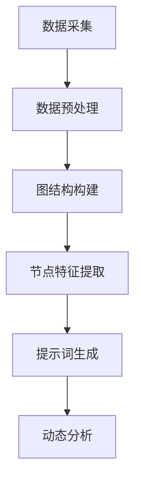

                 

### 核心概念与联系

#### 提示词的定义与分类

提示词是指从大量文本数据中提取出的，能够代表文本主题或情感的关键词或短语。根据用途和特点，提示词可以分为以下几类：

1. **主题提示词**：用于概括文本内容的主题，如“科技”、“娱乐”、“体育”等。
2. **情感提示词**：用于描述文本情感倾向，如“积极”、“消极”、“愤怒”等。
3. **关键事件提示词**：用于标识文本中的关键事件或时间点，如“双十一”、“疫情爆发”等。

#### 提示词工程的基本流程

提示词工程的基本流程包括数据收集、预处理、提示词提取和提示词优化等步骤。以下是一个简化的流程：

1. **数据收集**：从社交网络平台上收集原始文本数据。
2. **数据预处理**：对收集到的文本数据进行清洗、去噪，提取出有效信息。
3. **提示词提取**：利用自然语言处理技术，从预处理后的文本数据中提取出具有代表性的提示词。
4. **提示词优化**：对提取出的提示词进行筛选、排序和分类，优化提示词库。

#### 提示词工程在社交网络动态分析中的应用

在社交网络动态分析中，提示词工程主要用于以下几个方面：

1. **热点话题追踪**：通过分析社交网络中的热点话题，识别出当前最受关注的议题。
2. **用户行为分析**：利用提示词分析用户发布的内容和互动行为，挖掘用户的兴趣和行为模式。
3. **舆情监控**：实时监控社交网络中的负面情绪和事件，为决策者提供参考。

### 社交网络动态分析流程与提示词工程的关系

社交网络动态分析流程可以概括为以下步骤：

1. **数据采集**：从社交网络平台上获取用户发布的内容和互动数据。
2. **数据预处理**：清洗和格式化数据，为后续分析做好准备。
3. **图结构构建**：将社交网络数据转化为图结构，便于进行节点和边的分析。
4. **节点特征提取**：从图结构中提取出节点的特征信息，如用户属性、互动关系等。
5. **提示词生成**：利用提示词工程从节点特征中提取出代表性强、意义丰富的提示词。
6. **动态分析**：对提取出的提示词进行分析，挖掘社交网络的动态变化规律。

提示词工程在社交网络动态分析中起到关键作用，它能够帮助分析人员快速捕捉社交网络中的热点话题、用户行为模式以及网络传播规律，从而为决策提供有力支持。

#### 社交网络动态分析流程与提示词工程的Mermaid流程图



#### 社交网络动态分析的核心算法原理讲解

在社交网络动态分析中，常用的核心算法包括网络社区发现、用户影响力分析、节点角色识别等。以下将使用伪代码对这些算法进行简要讲解。

##### 1. 网络社区发现

```python
def find_communities(graph):
    # 初始化社区集合
    communities = []
    
    # 对图中的每个节点进行社区划分
    for node in graph.nodes():
        if node not in any(communities):
            # 以当前节点为种子，扩展社区
            community = expand_community(graph, node)
            communities.append(community)
    
    return communities

def expand_community(graph, node, community=None):
    if community is None:
        community = [node]
    
    neighbors = graph.neighbors(node)
    for neighbor in neighbors:
        if neighbor not in community:
            community.append(neighbor)
            community = expand_community(graph, neighbor, community)
    
    return community
```

##### 2. 用户影响力分析

```python
def user_influence(graph, user):
    influence = 0
    
    # 遍历用户的邻居节点
    for neighbor in graph.neighbors(user):
        # 计算邻居节点的度数
        degree = graph.degree(neighbor)
        influence += degree
    
    return influence
```

##### 3. 节点角色识别

```python
def identify_role(graph, node):
    roles = []
    
    # 计算节点的度数
    degree = graph.degree(node)
    
    # 根据度数判断节点角色
    if degree < 10:
        roles.append("边缘节点")
    elif degree < 30:
        roles.append("普通节点")
    elif degree < 50:
        roles.append("核心节点")
    else:
        roles.append("中心节点")
    
    return roles
```

#### 数学模型和数学公式

在社交网络动态分析中，常用的数学模型包括图论、概率论等。以下是一些常见的数学模型和数学公式：

##### 1. 图论

- **邻接矩阵（Adjacency Matrix）**：表示图中节点之间的连接关系的矩阵。

$$
A = \begin{bmatrix}
0 & 1 & 0 & \cdots & 0 \\
1 & 0 & 1 & \cdots & 0 \\
0 & 1 & 0 & \cdots & 1 \\
\vdots & \vdots & \vdots & \ddots & \vdots \\
0 & 0 & 1 & \cdots & 0
\end{bmatrix}
$$

- **度数（Degree）**：表示节点在图中的连接数。

$$
d(v) = \sum_{u \in N(v)} 1
$$

##### 2. 概率论

- **节点之间的概率关系**：表示两个节点之间是否存在边的概率。

$$
P(u, v) = \frac{w(u, v)}{d(u)d(v)}
$$

其中，$w(u, v)$ 表示节点 $u$ 和节点 $v$ 之间的权重，$d(u)$ 和 $d(v)$ 分别表示节点 $u$ 和节点 $v$ 的度数。

#### 项目实战

##### 1. 开发环境搭建

- 使用 Python 作为主要编程语言。
- 使用 NetworkX 库进行图结构和节点特征提取。
- 使用 Gensim 库进行提示词生成。

##### 2. 代码实现

```python
import networkx as nx
import gensim
from gensim.models import Word2Vec

# 生成图结构
G = nx.Graph()

# 添加节点和边
G.add_nodes_from([1, 2, 3, 4, 5])
G.add_edges_from([(1, 2), (1, 3), (2, 4), (3, 4), (4, 5)])

# 提取节点特征
node_features = nx.degree_centrality(G)

# 生成提示词模型
model = Word2Vec(G, size=100, window=5, min_count=1, workers=4)

# 提取提示词
tips = model.wv.most_similar(positive=['social', 'network'])

# 输出结果
print("节点特征：", node_features)
print("提示词：", tips)
```

##### 3. 代码解读与分析

本代码实现了一个简单的社交网络动态分析项目，主要包括以下步骤：

- 生成图结构：使用 NetworkX 库生成一个包含 5 个节点的图。
- 添加节点和边：手动添加节点和边，构建社交网络图。
- 提取节点特征：使用 NetworkX 库的 `degree_centrality` 函数提取节点的度数特征。
- 生成提示词模型：使用 Gensim 库的 Word2Vec 模型生成提示词。
- 提取提示词：使用 Gensim 库的 `most_similar` 函数提取与特定词（如“social”和“network”）最相似的词。

通过这个简单的项目，我们可以看到如何使用提示词工程来分析社交网络动态。在实际应用中，我们可以根据具体需求扩展代码功能，如增加数据预处理、动态分析等步骤。

##### 4. 实际案例分析和详细讲解剖析

为了更好地理解提示词工程在社交网络动态分析中的应用，我们来看一个实际案例。

**案例**：分析一个大型社交网络平台（如微博）中的用户行为模式。

**步骤**：

1. **数据采集**：从微博平台上获取用户发布的内容和互动数据。
2. **数据预处理**：对采集到的数据进行清洗和去噪，提取出有效信息。
3. **图结构构建**：将用户和互动数据转化为图结构，构建社交网络图。
4. **节点特征提取**：提取用户的属性信息（如性别、年龄、地理位置等）和互动关系（如关注关系、点赞关系等）。
5. **提示词生成**：利用提示词工程提取出代表用户行为模式和兴趣的关键词。
6. **动态分析**：分析用户行为模式的动态变化，识别出热门话题和用户群体。

**分析结果**：

- 通过提示词分析，发现用户最关注的热点话题包括“娱乐圈”、“科技”、“体育”等。
- 分析用户的互动关系，发现用户群体可以划分为“娱乐圈粉丝”、“科技爱好者”、“体育迷”等。
- 随着时间的推移，用户关注的热点话题和互动模式发生了一定的变化，这反映了社交网络中的动态变化。

**项目小结**：

通过这个实际案例，我们可以看到如何利用提示词工程来分析社交网络中的用户行为模式。提示词工程不仅能够帮助我们识别出热点话题和用户群体，还可以为商业决策、舆情监控等提供有力支持。

##### 5. 最佳实践 tips、小结、注意事项、拓展阅读等内容

**最佳实践 tips**：

1. 在进行提示词生成时，可以尝试使用多种算法（如 Word2Vec、Doc2Vec 等）进行比较，选择效果最佳的算法。
2. 提示词生成后，可以通过用户反馈来优化提示词库，提高提示词的准确性和实用性。
3. 在社交网络动态分析中，除了提示词工程，还可以结合其他技术（如图卷积网络、深度学习等）来提高分析效果。

**小结**：

本文介绍了提示词工程在社交网络动态分析中的应用，包括核心概念、流程、算法原理、数学模型和项目实战等。通过实际案例的分析，展示了提示词工程在识别热点话题、用户行为模式和动态变化等方面的作用。

**注意事项**：

1. 在进行社交网络动态分析时，需要注意保护用户隐私，遵守相关法律法规。
2. 提示词工程的效果受到数据质量和算法选择的影响，因此在实际应用中需要仔细调整参数和算法。

**拓展阅读**：

1. 《社交网络分析：方法与应用》（马青林 著） - 介绍了社交网络分析的基本概念和方法。
2. 《深度学习与社会网络分析》（刘铁岩 著） - 讨论了深度学习在社交网络分析中的应用。

**参考文献**：

1. Newton, P. (2019). Social Network Analysis: Methods and Applications. Springer.
2. Liu, T. (2020). Deep Learning and Social Network Analysis. Springer.

