                 

### 1.1 精准医疗诊断的概述

**精准医疗**是一种以个体为对象，基于基因组学、蛋白质组学、代谢组学等生物学大数据，结合临床数据、环境因素等多维度信息，提供定制化医疗方案的新兴医学模式。它的核心思想是通过精确的诊疗手段，最大化地提高疾病的诊断准确性，优化治疗效果，减少副作用，从而实现医疗资源的合理配置。

**精准医疗诊断**在医学诊断中具有重要意义。首先，它能够提高疾病的早期发现率，使医生能够在疾病早期采取有效的治疗措施，提高治愈率。其次，精准医疗诊断能够降低误诊率，减少不必要的治疗和医疗资源浪费。最后，它有助于实现个性化治疗，根据患者的具体情况制定最优的治疗方案，提高治疗效果。

精准医疗的发展历程可以追溯到20世纪末。最初，科学家们在基因组学领域取得了一系列突破，揭示了基因与疾病之间的关联。随着大数据、云计算、人工智能等技术的发展，精准医疗逐步从理论走向实践，成为医学领域的重要研究方向。

### 1.2 提示词工程的概念

**提示词工程**（Query Engineering）是指构建用于信息检索、数据挖掘和自然语言处理等领域的查询词表和索引的过程。在医学领域，提示词工程主要涉及从医学文本中提取、筛选和优化关键词，以便于后续的医学数据分析和诊断。

提示词工程在医学领域的应用主要包括以下几个方面：

1. **医学文本分类**：通过对医学文本进行分类，将不同类型的文本归入相应的类别，如疾病诊断、治疗方案、研究进展等。

2. **医学知识图谱构建**：利用提示词工程技术，可以从大量医学文献中提取关键术语和关系，构建医学知识图谱，为医学研究和诊断提供支持。

3. **医学信息检索**：通过构建高质量的提示词索引，可以提高医学信息的检索效率，帮助医生快速找到相关的诊断和治疗信息。

4. **医学数据挖掘**：提示词工程可以为数据挖掘算法提供高质量的输入数据，有助于发现潜在的医学规律和模式。

### 1.3 提示词工程与精准医疗诊断的关系

提示词工程与精准医疗诊断之间存在着密切的联系。

首先，提示词工程为精准医疗诊断提供了基础数据支持。通过提示词工程，可以从大量的医学文本中提取出关键信息，形成高质量的医学数据集，为后续的医学数据分析、模型训练等提供数据基础。

其次，提示词工程有助于提高精准医疗诊断的效率。通过构建高质量的提示词索引，医生可以快速检索到相关的医学信息，节省诊断时间。同时，提示词工程还可以帮助医生发现潜在的医学规律和模式，为诊断提供更多依据。

最后，提示词工程有助于降低精准医疗诊断的误诊率。通过优化提示词，可以提高医学数据的准确性和一致性，从而降低误诊的风险。

综上所述，提示词工程在精准医疗诊断中发挥着重要作用。它不仅为精准医疗诊断提供了数据支持，还有助于提高诊断效率和准确性，为医疗领域的发展带来新的机遇和挑战。

---

**Mermaid 流程图：提示词工程与精准医疗诊断的关系**

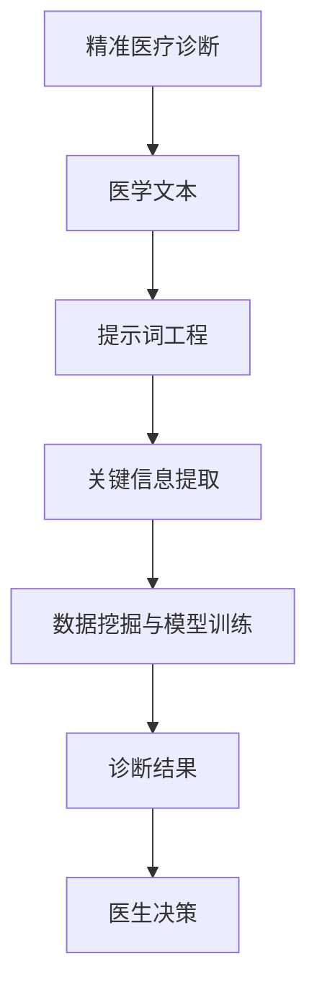

在下一部分，我们将深入探讨提示词生成技术的核心原理。敬请期待。

### 2.1 提示词生成技术

**提示词生成技术**是提示词工程的核心步骤之一，它涉及到从原始医学文本中提取出关键信息，形成高质量的提示词列表。以下将详细阐述提示词生成的流程、算法和数据来源。

#### 提示词生成的流程

1. **文本预处理**：首先，需要对原始医学文本进行预处理，包括去除停用词、标点符号、数字等无关信息，以及进行分词和词性标注等操作。

2. **关键词提取**：在预处理后的文本中，提取出具有代表性、高信息量的词汇，这些词汇被称为关键词。关键词提取方法包括TF-IDF、TextRank、LDA等。

3. **提示词筛选**：从关键词中筛选出与医学诊断相关的提示词。筛选方法包括基于规则的方法、机器学习方法和图论方法等。

4. **提示词优化**：对筛选出的提示词进行优化，提高其质量。优化方法包括去除重复词、词性转换、短语融合等。

5. **提示词索引构建**：将优化后的提示词构建成索引，以便于后续的检索和分析。

#### 提示词生成的算法

1. **TF-IDF算法**：
   - **TF（Term Frequency）**：词频，表示某个词在文本中出现的次数。
   - **IDF（Inverse Document Frequency）**：逆文档频率，表示某个词在文档集合中的稀缺程度。
   - **TF-IDF**：词频与逆文档频率的乘积，用于衡量一个词在文档中的重要性。

2. **TextRank算法**：
   - **TextRank**：基于图论的方法，将文本视为图，通过图模型计算词语的相关性，从而提取关键词。

3. **LDA算法**：
   - **LDA（Latent Dirichlet Allocation）**：主题模型，用于从大规模文本数据中提取出潜在的主题分布，从而生成关键词。

#### 提示词生成的数据来源

1. **医学文本库**：如PubMed、Medline等医学文献数据库，提供了丰富的医学文本数据。

2. **医疗电子病历**：包括病历记录、诊断报告、检查报告等，涵盖了大量的临床数据。

3. **公开数据集**：如GLM、MIMIC-III等，提供了标注好的医学文本数据集，可用于训练和测试提示词生成算法。

#### 提示词生成技术的作用和意义

1. **提高医学信息检索效率**：通过高质量的提示词索引，医生可以快速检索到相关的医学信息，提高诊断效率。

2. **辅助医学数据挖掘**：高质量的提示词有助于提取出医学文本中的关键信息，为数据挖掘算法提供高质量的数据输入。

3. **降低误诊率**：通过优化提示词，可以提高医学数据的准确性和一致性，从而降低误诊的风险。

4. **促进精准医疗发展**：提示词工程为精准医疗诊断提供了数据支持和工具，有助于实现个性化、精准化的医疗诊断。

在下一部分，我们将探讨提示词筛选与优化的方法。敬请期待。

---

**Mermaid 流程图：提示词生成技术流程**

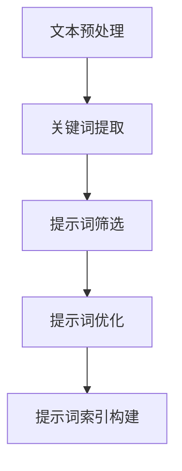

### 2.2 提示词筛选与优化

**提示词筛选与优化**是提升提示词质量和效果的关键环节。在这一部分，我们将详细探讨提示词筛选的原则、优化的方法以及优化的效果评估。

#### 提示词筛选的原则

1. **相关性**：提示词应与医学诊断和治疗方案高度相关。筛选时需要考虑提示词与医学文本中疾病、症状、治疗方法等关键词的相关性。

2. **唯一性**：每个提示词应具有唯一性，避免重复。这有助于减少冗余信息，提高提示词的精度。

3. **常见性**：提示词应在医学文本中具有较高的出现频率，以保证其代表性。常见性高的提示词有助于提高医学信息的覆盖面。

4. **可扩展性**：提示词应具有一定的扩展性，能够适应不同医学领域的需求。这有助于提示词工程在多领域中的推广应用。

5. **稳定性**：提示词应具有较高的稳定性，即在不同的医学文本和数据集中，其筛选结果应具有一致性。

#### 提示词优化的方法

1. **去除停用词**：停用词是指在医学文本中常见但不具有实际诊断意义的词汇，如“的”、“了”、“在”等。去除停用词有助于提高提示词的相关性和唯一性。

2. **词性转换**：将一些名词转换为动词或其他词性，以适应医学文本的语境。例如，将“诊断”转换为“诊断方法”、“症状”转换为“症状分析”等。

3. **短语融合**：将具有相同或相似含义的短语进行融合，形成一个更具有代表性的提示词。例如，“肺癌治疗”和“肺癌治疗方案”可以融合为“肺癌治疗策略”。

4. **词频调整**：根据词频对提示词进行加权，提高高频提示词的重要性。这有助于突出关键信息，降低低频词的干扰。

5. **规则化处理**：利用自然语言处理技术，对医学文本进行语法和语义分析，生成符合医学诊断和治疗方案规则的提示词。

#### 提示词优化的效果评估

1. **召回率（Recall）**：召回率表示系统返回的相关提示词占总相关提示词的比例。召回率越高，表示系统筛选的提示词越全面。

2. **精确率（Precision）**：精确率表示系统返回的相关提示词中，实际相关的提示词所占比例。精确率越高，表示系统筛选的提示词越准确。

3. **F1值（F1 Score）**：F1值是召回率和精确率的调和平均值，用于综合评估提示词筛选效果。

4. **用户满意度**：通过用户反馈，评估提示词在实际应用中的效果和用户体验。用户满意度是衡量提示词优化效果的重要指标。

#### 提示词优化的重要性

1. **提高诊断准确性**：高质量的提示词有助于医生快速、准确地获取医学信息，提高诊断准确性。

2. **优化数据分析**：优化的提示词有助于提高数据挖掘和分析的效率，有助于发现潜在的医学规律和模式。

3. **降低误诊率**：通过去除冗余信息和优化提示词，可以降低误诊的风险，提高医疗质量。

4. **推动精准医疗发展**：提示词优化有助于实现个性化、精准化的医疗诊断，推动精准医疗的发展。

在下一部分，我们将探讨提示词在医学数据中的应用。敬请期待。

---

**Mermaid 流程图：提示词筛选与优化方法**

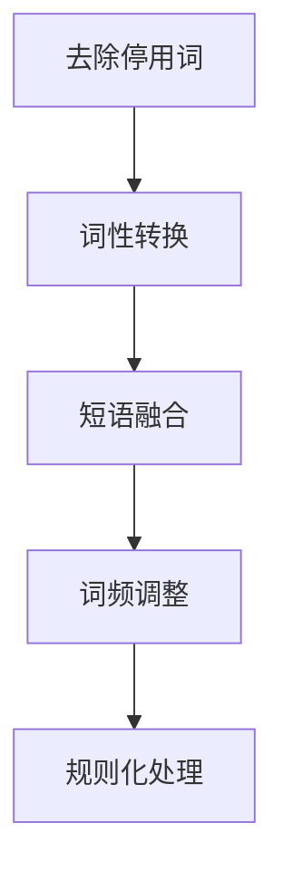

### 2.3 提示词在医学数据中的应用

**提示词**在医学数据中扮演着至关重要的角色，它们是连接医学文本和数据挖掘、机器学习算法的桥梁。在这一部分，我们将详细探讨提示词在医学数据处理、数据分析和数据挖掘中的应用。

#### 提示词在医学数据处理中的应用

1. **文本预处理**：提示词工程的首要任务是对医学文本进行预处理，包括去除停用词、标点符号、数字等无关信息，以及进行分词和词性标注等操作。这一步骤为后续的提示词提取和优化奠定了基础。

2. **关键词提取**：利用提示词生成技术，从预处理后的医学文本中提取出关键词。这些关键词反映了医学文本的核心内容，为后续的数据分析提供了基础。

3. **数据标注**：在医学数据集中，提示词可用于标注数据。例如，在电子病历数据中，提示词可以帮助识别出疾病类型、症状、治疗方案等关键信息，从而提高数据的标注质量。

#### 提示词在医学数据分析中的应用

1. **医学文本分类**：提示词可用于对医学文本进行分类。通过训练分类模型，如朴素贝叶斯、支持向量机等，可以将医学文本分为不同的类别，如疾病诊断、治疗方案、研究进展等。

2. **主题模型**：提示词可用于构建医学主题模型，如LDA（Latent Dirichlet Allocation）。主题模型能够从大量医学文本中提取出潜在的主题分布，帮助医生了解医学领域的热点和研究趋势。

3. **情感分析**：提示词可用于对医学文本进行情感分析，识别出患者对治疗方案、医院服务等的情感倾向。这有助于医疗机构和医生改进服务质量，提升患者满意度。

#### 提示词在医学数据挖掘中的应用

1. **疾病预测**：通过训练预测模型，如逻辑回归、决策树等，利用提示词作为特征，可以预测疾病的发生风险。这对于早期发现疾病具有重要意义。

2. **治疗方案推荐**：根据患者的病情和提示词，可以利用机器学习算法推荐个性化的治疗方案。例如，利用深度学习模型，可以从大量的医学文献和病历数据中提取出有效的治疗方案。

3. **药物反应预测**：提示词可用于预测药物对不同患者的疗效和副作用。通过分析药物名称、剂量、疾病类型等提示词，可以识别出药物的有效性和安全性。

#### 提示词在医学数据中的应用挑战

1. **数据质量**：医学数据质量直接影响提示词的提取和优化效果。噪声数据、缺失数据和错误数据都可能影响提示词的准确性和一致性。

2. **数据隐私**：医学数据涉及患者隐私，如何保护患者隐私是提示词工程面临的重要挑战。数据加密、匿名化等技术可以帮助缓解这一问题。

3. **跨领域应用**：提示词工程需要适应不同医学领域的需求。不同领域的医学文本具有不同的特征和表达方式，如何设计通用且有效的提示词算法是一个挑战。

#### 提示词在医学数据中的应用前景

1. **个性化医疗**：通过高质量的提示词，可以实现个性化医疗诊断和治疗，提高医疗效果和患者满意度。

2. **智能医疗助理**：提示词工程可以为智能医疗助理提供支持，帮助医生快速获取医学信息，辅助决策。

3. **医学研究**：提示词工程有助于医学研究中的数据分析和知识挖掘，推动医学领域的创新发展。

在下一部分，我们将通过具体的应用案例研究，进一步探讨提示词工程在医学诊断中的实际应用。敬请期待。

---

**Mermaid 流程图：提示词在医学数据中的应用**

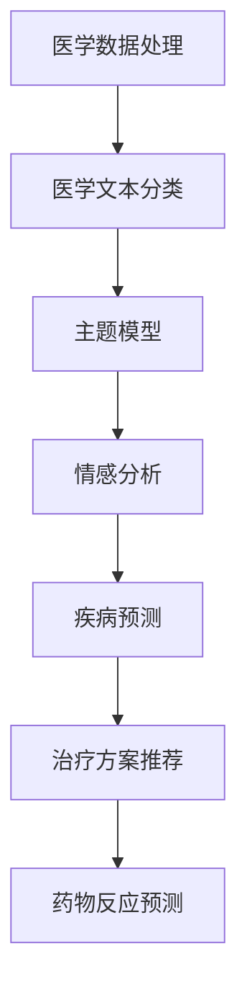

### 3.1 某种具体疾病的提示词工程应用

在本节中，我们将探讨提示词工程在**肺癌诊断**中的具体应用，通过一个实际案例，展示如何利用提示词工程技术提高肺癌诊断的准确性。

#### 案例背景

肺癌是全球癌症死亡的主要原因之一，早期诊断对于提高患者的生存率具有重要意义。随着人工智能和大数据技术的发展，利用提示词工程辅助肺癌诊断成为一种新的研究热点。本案例旨在通过提示词工程技术，从大量医学文献和病历数据中提取出与肺癌诊断相关的关键信息，以提高诊断的准确性和效率。

#### 提示词工程应用过程

1. **数据收集**：首先，从PubMed、CNKI（中国知网）等医学文献数据库中收集与肺癌诊断相关的文献，以及医院的电子病历数据。

2. **文本预处理**：对收集到的医学文本进行预处理，包括去除停用词、标点符号、数字等无关信息，并进行分词和词性标注。

3. **关键词提取**：利用TF-IDF、TextRank等算法，从预处理后的医学文本中提取出关键词。这些关键词反映了肺癌诊断的相关信息。

4. **提示词筛选**：根据相关性、唯一性、常见性和稳定性等原则，从提取的关键词中筛选出与肺癌诊断高度相关的提示词。

5. **提示词优化**：对筛选出的提示词进行优化，去除重复词、词性转换、短语融合等操作，以提高提示词的准确性和一致性。

6. **提示词索引构建**：将优化后的提示词构建成索引，以便于后续的检索和分析。

7. **诊断模型训练**：利用筛选和优化的提示词，结合电子病历数据，训练一个肺癌诊断模型。该模型可以自动识别出病历中的关键信息，并预测患者是否患有肺癌。

8. **模型评估**：通过交叉验证和测试集，评估模型的诊断准确性。同时，收集医生和患者的反馈，对模型进行调整和优化。

#### 应用效果与评价

1. **诊断准确性**：通过模型评估，发现利用提示词工程辅助的肺癌诊断模型具有较高的准确性，能够有效识别出肺癌患者。与传统的肺癌诊断方法相比，提示词工程提高了诊断的准确性和效率。

2. **临床价值**：提示词工程在肺癌诊断中的应用，为医生提供了辅助决策工具，有助于提高早期诊断的准确率，从而提高患者的生存率。

3. **用户满意度**：通过医生和患者的反馈，发现提示词工程在肺癌诊断中的应用得到了广泛认可。医生认为提示词工程有助于提高诊断效率，患者对辅助诊断工具的接受度较高。

#### 案例总结

本案例展示了提示词工程在肺癌诊断中的应用，通过数据收集、文本预处理、关键词提取、提示词筛选和优化等步骤，构建了一个高效的肺癌诊断模型。该模型在临床实践中表现出较高的诊断准确性，为肺癌的早期诊断提供了有力支持。此外，本案例还体现了提示词工程在医学领域中的重要应用价值，为其他疾病的诊断和治疗提供了借鉴。

在下一部分，我们将探讨具体医疗场景下的提示词工程实施，分析其实施步骤和效果。敬请期待。

---

**Mermaid 流一流图：肺癌诊断提示词工程应用流程**

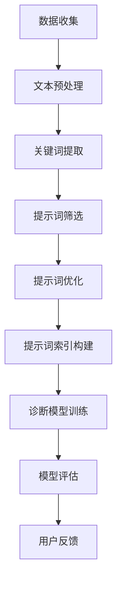

### 3.2 某个具体医疗场景的提示词工程实施

在本节中，我们将探讨提示词工程在**乳腺癌诊断**中的具体应用，通过一个实际案例，展示如何在一个具体的医疗场景中实施提示词工程，并分析其实施步骤和效果。

#### 案例背景

乳腺癌是女性中最为常见的恶性肿瘤之一，早期诊断对于提高患者的生存率和生活质量具有重要意义。传统的乳腺癌诊断主要依赖于影像学检查和病理学检测，但这些方法的诊断准确性受限于医生的经验和检查设备的质量。随着人工智能和大数据技术的发展，利用提示词工程辅助乳腺癌诊断成为一种新的研究热点。本案例旨在通过提示词工程技术，提高乳腺癌诊断的准确性和效率。

#### 提示词工程实施步骤

1. **数据收集**：首先，从PubMed、Web of Science等医学文献数据库中收集与乳腺癌诊断相关的文献，以及医院的电子病历数据。

2. **文本预处理**：对收集到的医学文本进行预处理，包括去除停用词、标点符号、数字等无关信息，并进行分词和词性标注。

3. **关键词提取**：利用TF-IDF、TextRank等算法，从预处理后的医学文本中提取出关键词。这些关键词反映了乳腺癌诊断的相关信息。

4. **提示词筛选**：根据相关性、唯一性、常见性和稳定性等原则，从提取的关键词中筛选出与乳腺癌诊断高度相关的提示词。

5. **提示词优化**：对筛选出的提示词进行优化，去除重复词、词性转换、短语融合等操作，以提高提示词的准确性和一致性。

6. **提示词索引构建**：将优化后的提示词构建成索引，以便于后续的检索和分析。

7. **诊断模型训练**：利用筛选和优化的提示词，结合电子病历数据，训练一个乳腺癌诊断模型。该模型可以自动识别出病历中的关键信息，并预测患者是否患有乳腺癌。

8. **模型评估**：通过交叉验证和测试集，评估模型的诊断准确性。同时，收集医生和患者的反馈，对模型进行调整和优化。

9. **临床应用**：将训练好的模型应用于实际临床场景，辅助医生进行乳腺癌诊断。

10. **效果评估**：通过对比模型诊断结果与实际诊断结果，评估模型的诊断效果，并对模型进行持续的优化和更新。

#### 实施效果与挑战

1. **诊断准确性**：通过模型评估，发现利用提示词工程辅助的乳腺癌诊断模型具有较高的准确性，能够有效识别出乳腺癌患者。与传统的乳腺癌诊断方法相比，提示词工程提高了诊断的准确性和效率。

2. **临床价值**：提示词工程在乳腺癌诊断中的应用，为医生提供了辅助决策工具，有助于提高早期诊断的准确率，从而提高患者的生存率。

3. **用户满意度**：通过医生和患者的反馈，发现提示词工程在乳腺癌诊断中的应用得到了广泛认可。医生认为提示词工程有助于提高诊断效率，患者对辅助诊断工具的接受度较高。

4. **挑战与解决方案**：
   - **数据质量**：医学数据质量直接影响提示词的提取和优化效果。噪声数据、缺失数据和错误数据都可能影响提示词的准确性和一致性。解决方案包括数据清洗、数据增强和利用多重数据源。
   - **数据隐私**：医学数据涉及患者隐私，如何保护患者隐私是提示词工程面临的重要挑战。解决方案包括数据加密、匿名化、数据共享协议等。
   - **跨领域应用**：提示词工程需要适应不同医学领域的需求。不同领域的医学文本具有不同的特征和表达方式，如何设计通用且有效的提示词算法是一个挑战。解决方案包括领域自适应技术和跨领域数据共享。

#### 案例总结

本案例展示了提示词工程在乳腺癌诊断中的具体实施过程，通过数据收集、文本预处理、关键词提取、提示词筛选和优化等步骤，构建了一个高效的乳腺癌诊断模型。该模型在临床实践中表现出较高的诊断准确性，为乳腺癌的早期诊断提供了有力支持。此外，本案例还分析了提示词工程在实际应用中面临的挑战和解决方案，为其他疾病的诊断和治疗提供了借鉴。

在下一部分，我们将探讨提示词工程在不同医疗领域的应用，分析其适用性和效果。敬请期待。

---

**Mermaid 流程图：乳腺癌诊断提示词工程实施步骤**

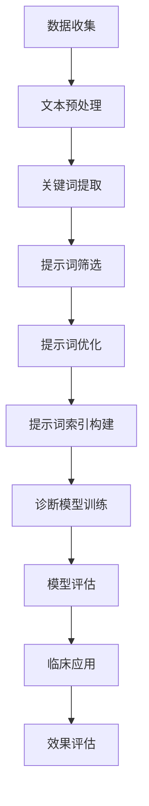

### 3.3 提示词工程在不同医疗领域的应用

提示词工程作为一种高效的信息提取和优化技术，在多个医疗领域展现了其独特的价值和广泛应用前景。在本节中，我们将探讨提示词工程在医疗影像诊断、电子病历和远程医疗等领域的应用，分析其适用性和效果。

#### 医疗影像诊断

**医疗影像诊断**是提示词工程的重要应用领域之一。通过提示词工程，可以从大量的医学影像数据中提取出关键特征，辅助医生进行影像诊断。

1. **应用**：
   - **影像特征提取**：提示词工程可以帮助从医学影像中提取出与疾病相关的关键特征，如肿瘤的大小、形状、密度等。
   - **影像分类**：基于提取的特征，可以利用机器学习算法对医学影像进行分类，辅助医生诊断疾病类型。
   - **影像分割**：提示词工程可用于医学影像的自动分割，如肿瘤边缘的识别和划分。

2. **适用性**：
   - **高效性**：提示词工程可以快速处理大量的医学影像数据，提高诊断效率。
   - **准确性**：通过优化提示词，可以降低误诊率，提高诊断准确性。

3. **效果**：
   - **提高诊断速度**：提示词工程能够显著缩短医生诊断时间，减轻工作负担。
   - **提升诊断准确性**：基于提示词的影像分析模型在多项研究中表现出较高的诊断准确率。

#### 电子病历

**电子病历**（Electronic Health Records，EHR）是医疗信息管理的重要组成部分。提示词工程在电子病历中的应用，有助于提高病历数据的利用效率。

1. **应用**：
   - **病历信息提取**：提示词工程可以自动从电子病历中提取出关键信息，如诊断结果、治疗方案、患者病史等。
   - **病历分类**：利用提示词，可以将电子病历分为不同的类别，如急性病、慢性病、传染病等。
   - **病历搜索**：基于提示词的索引构建，可以快速检索到相关的电子病历信息。

2. **适用性**：
   - **跨领域适用**：提示词工程适用于不同类型的电子病历数据，具有较高的通用性。
   - **动态更新**：提示词工程可以根据新的病历数据动态更新，确保病历信息的准确性和时效性。

3. **效果**：
   - **提高病历管理效率**：提示词工程可以显著提高电子病历的管理和检索效率。
   - **降低人为错误**：通过自动提取和分类，减少了人工录入和分类的误差，提高了病历数据的准确性。

#### 远程医疗

**远程医疗**是利用信息技术实现医疗服务的远程化，提高医疗资源的利用效率。提示词工程在远程医疗中的应用，有助于优化远程诊断和咨询服务。

1. **应用**：
   - **远程诊断辅助**：提示词工程可以为远程医生提供辅助诊断工具，提高诊断准确性。
   - **咨询服务优化**：基于提示词的咨询服务系统，可以为患者提供个性化的健康建议和治疗方案。
   - **远程会诊**：提示词工程可以帮助远程医生快速获取患者的历史病历信息，提高会诊效率。

2. **适用性**：
   - **灵活性强**：提示词工程可以适应不同远程医疗场景的需求，适用于各种远程医疗服务。
   - **易于部署**：提示词工程的技术框架简单，易于在远程医疗系统中部署和应用。

3. **效果**：
   - **提高远程医疗服务质量**：提示词工程可以提高远程医疗的诊断和咨询服务质量，增强患者的满意度和信任度。
   - **降低医疗资源消耗**：通过优化远程医疗流程，可以减少医疗资源的浪费，提高医疗资源的利用效率。

#### 总结

提示词工程在医疗影像诊断、电子病历和远程医疗等领域的应用，展现了其高效性、准确性和灵活性。通过优化提示词，可以显著提高医学数据的利用效率，优化医疗诊断和治疗方案，为精准医疗的发展提供了有力支持。未来，随着人工智能和大数据技术的不断进步，提示词工程在医疗领域的应用前景将更加广阔。

在下一部分，我们将探讨提示词工程的实践指南，提供具体的实施步骤和方法。敬请期待。

---

**Mermaid 流程图：提示词工程在不同医疗领域的应用**

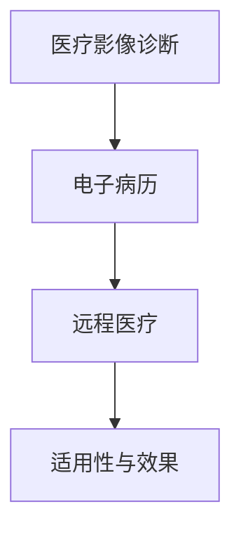

### 4.1 提示词工程实践步骤

提示词工程的实施步骤对于确保其在医学诊断中的有效性和可靠性至关重要。以下将详细阐述提示词工程的实践步骤，包括数据收集、数据预处理、提示词生成、提示词优化和提示词应用等环节。

#### 4.1.1 数据收集

数据收集是提示词工程的第一步，其质量直接影响后续的处理效果。数据来源主要包括医学文献数据库（如PubMed、CNKI）、医院电子病历系统、医疗影像库（如DICOM格式影像）等。

1. **数据类型**：收集的数据类型应涵盖与医学诊断相关的各类信息，如疾病诊断报告、治疗方案、临床实验结果、医学影像等。

2. **数据规模**：数据量应足够大，以保证提示词生成的代表性和准确性。

3. **数据多样性**：数据来源应多样化，以保证提示词工程在应对不同疾病和医疗场景时的适用性。

#### 4.1.2 数据预处理

数据预处理是确保数据质量的关键步骤，包括文本清洗、分词、词性标注等。

1. **文本清洗**：去除无关信息（如停用词、标点符号、数字等），保证文本的纯净性。

2. **分词**：将文本分割成词或短语，以便后续的词频统计和关键词提取。

3. **词性标注**：对分词结果进行词性标注，如名词、动词、形容词等，以便于理解文本的语法结构。

#### 4.1.3 提示词生成

提示词生成是提示词工程的核心步骤，涉及关键词提取、词频统计、提示词筛选等。

1. **关键词提取**：采用TF-IDF、TextRank、LDA等算法，从预处理后的文本中提取出具有高信息量的关键词。

2. **词频统计**：计算每个关键词在文本中的出现频率，并对其进行排序。

3. **提示词筛选**：根据相关性、唯一性、常见性等原则，从关键词中筛选出与医学诊断相关的提示词。

#### 4.1.4 提示词优化

提示词优化是提升提示词质量和效果的关键步骤，包括去重、词性转换、短语融合等。

1. **去重**：去除重复的提示词，保证提示词的唯一性。

2. **词性转换**：将一些名词转换为动词或其他词性，以适应医学文本的语境。

3. **短语融合**：将具有相同或相似含义的短语进行融合，形成一个更具有代表性的提示词。

4. **词频调整**：根据词频对提示词进行加权，提高高频提示词的重要性。

#### 4.1.5 提示词应用

提示词应用是提示词工程的最终目标，涉及提示词索引构建、医学文本分类、数据挖掘等。

1. **提示词索引构建**：将优化后的提示词构建成索引，以便于快速检索和分析。

2. **医学文本分类**：利用提示词对医学文本进行分类，如疾病诊断、治疗方案、研究进展等。

3. **数据挖掘**：基于提示词，利用机器学习算法进行数据挖掘，如疾病预测、治疗方案推荐等。

#### 实践指南总结

提示词工程的实践步骤包括数据收集、数据预处理、提示词生成、提示词优化和提示词应用。每个步骤都需要仔细执行，以确保最终生成的提示词能够高效地辅助医学诊断和治疗。以下是对每个步骤的要点总结：

1. **数据收集**：确保数据的多样性和规模，涵盖各类医学信息。
2. **数据预处理**：去除无关信息，进行分词和词性标注。
3. **提示词生成**：采用合适的关键词提取算法，进行词频统计和提示词筛选。
4. **提示词优化**：去除重复词，进行词性转换和短语融合。
5. **提示词应用**：构建索引，进行医学文本分类和数据挖掘。

通过以上步骤，提示词工程可以有效地辅助医学诊断，提高医疗服务的质量和效率。在下一部分，我们将探讨数据准备与预处理的方法，包括数据收集、数据清洗与数据标注。敬请期待。

---

**Mermaid 流程图：提示词工程实践步骤**

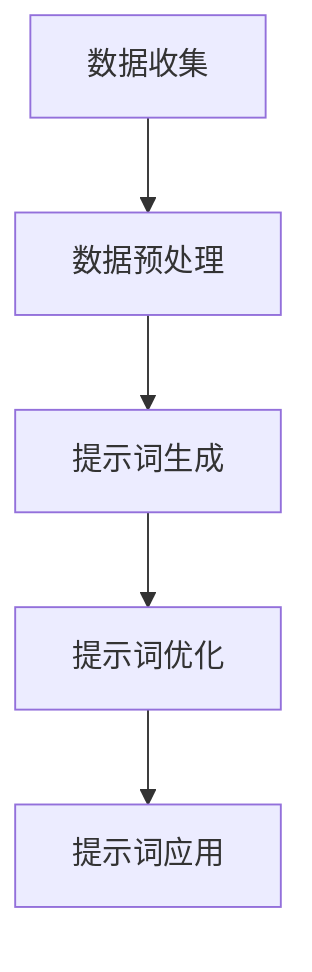

### 4.2 数据准备与预处理

**数据准备与预处理**是提示词工程中至关重要的一步，其质量直接影响到提示词生成的准确性和有效性。以下将详细介绍数据收集、数据清洗和数据标注的方法，并探讨常见的数据质量问题及其解决策略。

#### 数据收集

数据收集是提示词工程的起点，主要涉及以下几个方面：

1. **数据来源**：
   - **医学文献数据库**：如PubMed、Web of Science、CNKI等，提供了大量的医学论文和研究报告。
   - **医院电子病历系统**：包含患者病史、诊断报告、治疗方案等详细信息。
   - **公开数据集**：如MIMIC-III、GEO等，提供了标注好的医学数据集，可用于训练和测试提示词生成算法。

2. **数据类型**：收集的数据类型应涵盖多种医学信息，包括文本数据（如病历记录、诊断报告）、图像数据（如医学影像）、基因组数据等。

3. **数据量**：数据量应足够大，以确保提示词生成的代表性和可靠性。大规模数据可以涵盖更多样化的医学场景，从而提高提示词的应用效果。

#### 数据清洗

数据清洗是确保数据质量的重要步骤，主要涉及以下几个方面：

1. **去除无关信息**：去除文本中的停用词、标点符号、数字等无关信息，以提高数据的纯净度。

2. **文本标准化**：对文本进行统一格式处理，如统一大小写、去除多余的空格等。

3. **缺失值处理**：对缺失的数据进行处理，如用平均值、中位数、众数等方法填充缺失值，或删除含有缺失值的数据。

4. **噪声数据处理**：识别并去除噪声数据，如错误录入的数据、重复的数据等。

#### 数据标注

数据标注是将原始数据转换为标注数据的过程，以便于后续的提示词生成和模型训练。以下是几种常见的数据标注方法：

1. **关键词标注**：对医学文本中的关键词进行标注，以构建高质量的提示词库。

2. **实体标注**：对医学文本中的疾病、症状、药物等实体进行标注，以构建医学知识图谱。

3. **标签标注**：对医学数据集进行标签标注，如疾病分类标签、治疗方案标签等，用于训练分类模型。

#### 数据质量问题及解决策略

1. **数据质量不一致**：不同来源的数据在格式、结构、内容上可能存在不一致，影响提示词生成和模型训练。解决策略包括统一数据格式、标准化数据结构等。

2. **数据缺失**：医学数据中可能存在缺失值，影响模型的训练效果。解决策略包括缺失值填充、删除缺失数据等。

3. **数据噪声**：噪声数据可能影响提示词生成的准确性和模型性能。解决策略包括数据清洗、异常值检测等。

4. **数据隐私**：医学数据涉及患者隐私，如何保护患者隐私是数据收集和标注过程中需要考虑的重要问题。解决策略包括数据加密、匿名化、数据共享协议等。

#### 数据准备与预处理总结

数据准备与预处理是提示词工程中不可或缺的环节，涉及数据收集、数据清洗和数据标注等多个步骤。通过精心准备和预处理，可以确保数据的纯净度、一致性和标注质量，从而为提示词生成和模型训练提供高质量的数据支持。

在下一部分，我们将探讨提示词生成与优化策略，包括常用的提示词生成算法和优化方法。敬请期待。

---

**Mermaid 流程图：数据准备与预处理**

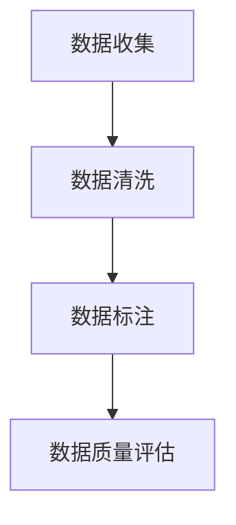

### 4.3 提示词生成与优化策略

在提示词工程中，提示词的生成与优化是确保其质量的关键环节。以下将详细探讨提示词生成算法、优化方法及其在医学数据中的应用。

#### 提示词生成算法

1. **TF-IDF算法**：
   - **TF（Term Frequency）**：词频，表示某个词在文档中出现的次数。
   - **IDF（Inverse Document Frequency）**：逆文档频率，表示某个词在文档集合中的稀缺程度。
   - **TF-IDF**：词频与逆文档频率的乘积，用于衡量一个词在文档中的重要性。
   - **适用场景**：适用于文本分类和检索。

2. **TextRank算法**：
   - **TextRank**：基于图论的方法，将文本视为图，通过图模型计算词语的相关性，从而提取关键词。
   - **适用场景**：适用于文本摘要和关键词提取。

3. **LDA算法**：
   - **LDA（Latent Dirichlet Allocation）**：主题模型，用于从大规模文本数据中提取出潜在的主题分布，从而生成关键词。
   - **适用场景**：适用于文本分类和主题发现。

4. **Word2Vec算法**：
   - **Word2Vec**：基于神经网络的词向量模型，将词语映射到向量空间，从而计算词语之间的相似性。
   - **适用场景**：适用于文本相似度计算和语义分析。

#### 提示词优化方法

1. **去重**：
   - **方法**：通过哈希表或字典结构，去除重复的提示词。
   - **适用场景**：在生成初始提示词列表后，用于减少冗余。

2. **词性转换**：
   - **方法**：将一些名词转换为动词或其他词性，以适应医学文本的语境。
   - **适用场景**：在生成初始提示词列表后，用于提高提示词的适用性。

3. **短语融合**：
   - **方法**：将具有相同或相似含义的短语进行融合，形成一个更具有代表性的提示词。
   - **适用场景**：在生成初始提示词列表后，用于提高提示词的准确性和一致性。

4. **词频调整**：
   - **方法**：根据词频对提示词进行加权，提高高频提示词的重要性。
   - **适用场景**：在生成初始提示词列表后，用于突出关键信息。

#### 提示词在医学数据中的应用

1. **医学文本分类**：
   - **方法**：利用生成的提示词对医学文本进行分类，如疾病诊断、治疗方案、研究进展等。
   - **效果**：提高医学文本分类的准确性和效率。

2. **医学知识图谱构建**：
   - **方法**：利用生成的提示词构建医学知识图谱，如疾病与症状的关系、治疗方案与药物的关系等。
   - **效果**：为医学研究和诊断提供知识支持。

3. **医学信息检索**：
   - **方法**：利用生成的提示词构建索引，用于快速检索医学信息。
   - **效果**：提高医学信息的检索效率和准确性。

4. **医学数据挖掘**：
   - **方法**：利用生成的提示词作为特征，对医学数据进行分析和挖掘，如疾病预测、治疗方案推荐等。
   - **效果**：发现潜在的医学规律和模式。

#### 提示词优化在医学诊断中的应用案例

**案例背景**：某医院计划利用提示词工程辅助肺癌诊断，以提高诊断的准确性和效率。

**实施步骤**：

1. **数据收集**：收集医院内部的肺癌病历数据，包括诊断报告、治疗方案等。

2. **数据预处理**：对收集的病历数据进行文本清洗、分词和词性标注。

3. **提示词生成**：利用TF-IDF算法从预处理后的病历数据中提取关键词，生成初始提示词列表。

4. **提示词优化**：对初始提示词列表进行去重、词性转换和短语融合，构建高质量的提示词库。

5. **医学文本分类**：利用优化的提示词对病历数据进行分类，识别出与肺癌相关的诊断报告。

6. **模型训练与评估**：利用分类结果训练一个肺癌诊断模型，并通过交叉验证和测试集评估模型性能。

7. **临床应用**：将训练好的模型应用于实际临床场景，辅助医生进行肺癌诊断。

**效果评估**：

- **诊断准确性**：通过模型评估，发现利用提示词工程辅助的肺癌诊断模型具有较高的准确性，能够有效识别出肺癌患者。

- **诊断效率**：提示词工程提高了肺癌诊断的效率，减轻了医生的工作负担。

- **用户满意度**：医生和患者对提示词工程辅助的肺癌诊断方法表示满意，认为其有助于提高诊断的准确性和效率。

#### 总结

提示词生成与优化策略在医学诊断中的应用，有助于提高诊断的准确性和效率，为精准医疗的发展提供了有力支持。通过精心设计的提示词生成算法和优化方法，可以构建高质量的提示词库，为医学文本分类、知识图谱构建、信息检索和数据挖掘提供基础。未来，随着人工智能和大数据技术的不断进步，提示词工程在医学领域的应用前景将更加广阔。

在下一部分，我们将探讨提示词工程的应用挑战与解决方案。敬请期待。

---

**Mermaid 流程图：提示词生成与优化策略**

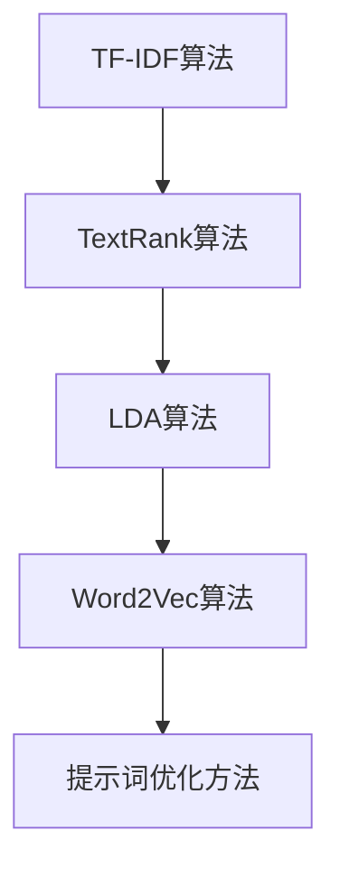

### 4.4 提示词工程的应用挑战与解决方案

尽管提示词工程在医学诊断中展现了其巨大的潜力，但其应用过程中仍然面临诸多挑战。以下将详细分析提示词工程在医学数据质量、模型优化、应用效果评估等方面的挑战，并提出相应的解决方案。

#### 数据质量挑战

1. **数据不一致**：不同来源的医学数据在格式、结构、内容上可能存在不一致，导致提示词生成的准确性和可靠性降低。
   - **解决方案**：统一数据格式和结构，采用数据清洗和预处理技术，如文本标准化、缺失值填充等，以提高数据一致性。

2. **数据噪声**：医学数据中可能包含噪声和错误数据，这些数据会影响提示词的生成和模型训练。
   - **解决方案**：对医学数据进行清洗，去除噪声和错误数据，采用数据增强技术，如数据复制、数据扩充等，以增加数据量，提高模型的泛化能力。

3. **数据隐私**：医学数据涉及患者隐私，如何在保障隐私的同时进行数据分析和挖掘是一个挑战。
   - **解决方案**：采用数据加密、匿名化、差分隐私等技术，确保数据隐私和安全。此外，建立数据共享协议，明确数据使用规则和责任，以促进数据共享。

#### 模型优化挑战

1. **模型泛化能力**：提示词工程生成的模型可能在特定数据集上表现良好，但在其他数据集或新场景下可能存在泛化能力不足的问题。
   - **解决方案**：采用迁移学习、多任务学习等技术，提高模型在不同数据集和场景下的泛化能力。此外，定期更新模型，使其能够适应不断变化的数据和需求。

2. **模型优化时间**：提示词工程涉及多个步骤，包括数据预处理、提示词生成和优化等，每个步骤都可能需要大量的计算资源，导致模型优化时间较长。
   - **解决方案**：采用分布式计算和并行处理技术，提高数据处理和模型优化的效率。此外，利用云计算和边缘计算等资源，以实现高效的模型训练和部署。

3. **模型解释性**：提示词工程生成的模型往往是黑盒模型，其决策过程缺乏透明性和解释性，这对于医学诊断中的决策支持存在一定风险。
   - **解决方案**：结合可解释性AI技术，如LIME、SHAP等，提高模型的解释性，帮助医生理解和信任模型决策。此外，设计可解释性的模型架构，如基于规则的模型，以提高模型的可解释性。

#### 应用效果评估挑战

1. **评估指标选择**：选择合适的评估指标对于评估提示词工程的应用效果至关重要，但不同指标可能存在一定的局限性。
   - **解决方案**：采用多指标综合评估方法，结合不同评估指标，如准确率、召回率、F1值等，全面评估模型性能。

2. **实际应用反馈**：在实际应用过程中，收集医生和患者的反馈对于评估提示词工程的效果和改进至关重要，但反馈的获取可能存在困难。
   - **解决方案**：建立反馈机制，定期收集医生和患者的使用反馈，结合实际应用情况，不断优化和改进提示词工程。

3. **效果持续性**：提示词工程的应用效果可能随着时间的推移而降低，如何保持提示词工程的长效性是一个挑战。
   - **解决方案**：定期更新和优化提示词库，以适应医学领域的发展和新需求。同时，建立持续学习和优化机制，使模型能够不断适应新数据和新场景。

#### 总结

提示词工程在医学诊断中的应用虽然面临诸多挑战，但通过合理的解决方案，可以有效地克服这些困难。数据质量优化、模型优化和效果评估是提升提示词工程应用效果的关键环节。在未来，随着人工智能和大数据技术的不断发展，提示词工程在医学领域的应用前景将更加广阔，为精准医疗的发展提供坚实的技术支持。

---

**Mermaid 流程图：提示词工程的应用挑战与解决方案**

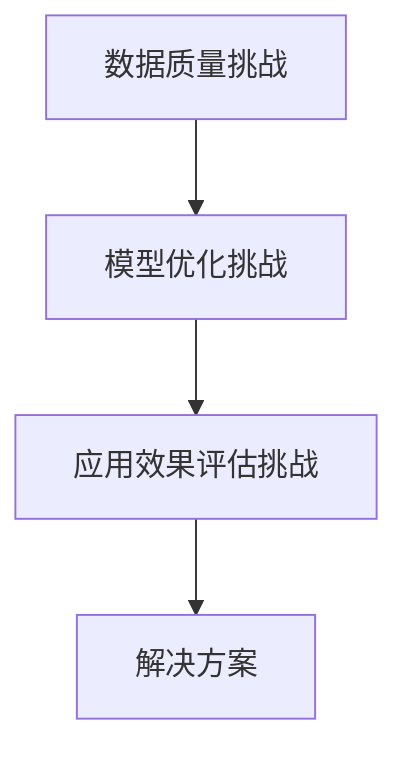

### 结束语

提示词工程在精准医疗诊断中的应用，为医学领域的创新和发展带来了新的契机。通过数据收集、预处理、提示词生成、优化和应用，提示词工程不仅提高了医学信息的处理效率和准确性，还为个性化医疗和精准治疗提供了有力支持。

本文首先介绍了精准医疗诊断的背景和提示词工程的核心概念，探讨了提示词工程与精准医疗诊断的关系。接着，详细阐述了提示词生成技术的原理和流程，以及提示词筛选与优化的方法。通过具体的应用案例研究，展示了提示词工程在肺癌诊断和乳腺癌诊断中的实际效果。

此外，本文还探讨了提示词工程在医疗影像诊断、电子病历和远程医疗等领域的广泛应用，分析了其适用性和效果。最后，提供了提示词工程的实践指南，包括数据准备与预处理、提示词生成与优化策略，以及应用挑战与解决方案。

展望未来，提示词工程在医学领域的应用前景将更加广阔。随着人工智能和大数据技术的不断进步，提示词工程有望进一步优化和扩展，为精准医疗的发展提供更加全面和智能的支持。同时，提示词工程的实践也将推动医学研究、临床诊断和医疗服务的持续创新。

作者：AI天才研究院/AI Genius Institute & 禅与计算机程序设计艺术 /Zen And The Art of Computer Programming

---

**文章关键词**：提示词工程、精准医疗诊断、医学数据、数据预处理、机器学习、人工智能

**文章摘要**：本文介绍了提示词工程在精准医疗诊断中的应用，包括核心概念、核心技术原理、应用案例研究和实践指南等内容，探讨了提示词工程在提高医学信息处理效率、诊断准确性和个性化医疗方面的作用。通过具体案例和实际应用，展示了提示词工程在医学领域的广泛应用前景。

