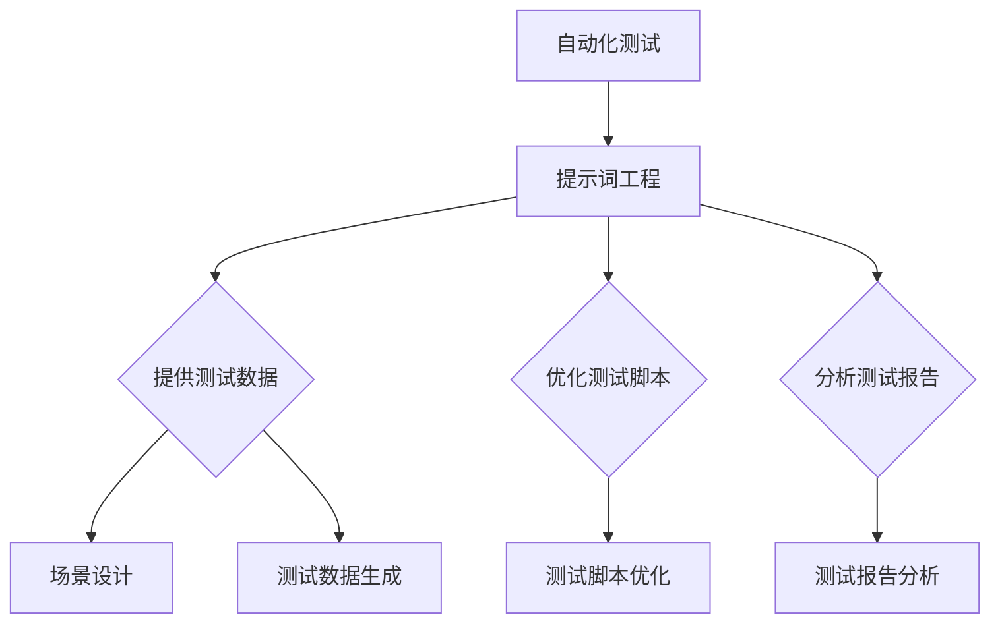
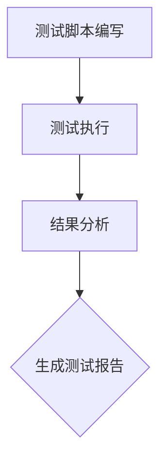
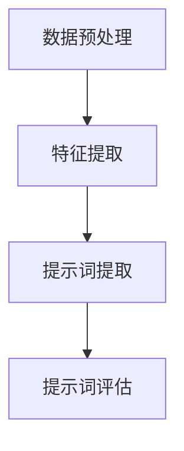
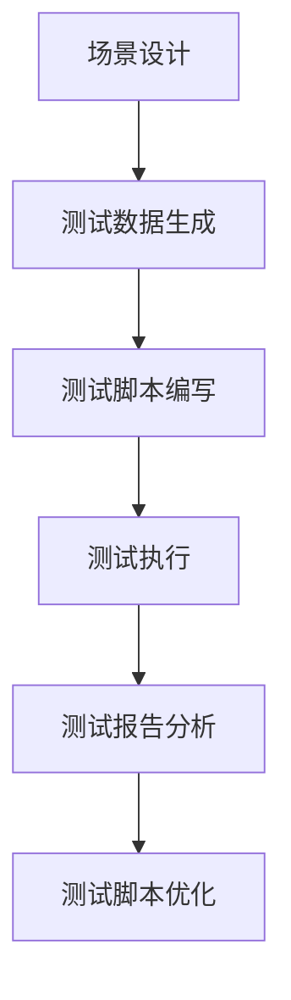

                 

### 文章标题

# 提示词工程在自动化测试中的应用

### 关键词

- 自动化测试
- 提示词工程
- 测试效率
- 测试覆盖率
- 测试脚本优化
- 测试数据分析

### 摘要

本文将探讨提示词工程在自动化测试中的应用。首先，我们将介绍自动化测试和提示词工程的基本概念和重要性。随后，通过详细分析两者的结合点，阐述如何提升自动化测试的效率与覆盖率。此外，本文还将通过具体案例展示提示词工程在自动化测试中的实际应用，并对其未来发展进行展望。通过阅读本文，您将了解如何充分利用提示词工程来优化自动化测试流程，提高软件质量。

### 目录

1. 引言与核心概念
   1.1 自动化测试概述
   1.2 提示词工程概述
   1.3 自动化测试与提示词工程的关系
2. 自动化测试基础
   2.1 自动化测试的基本原理
   2.2 自动化测试的分类
   2.3 自动化测试的优势与挑战
3. 提示词工程基础
   3.1 提示词工程的概念
   3.2 提示词工程的原理
   3.3 提示词工程的应用场景
4. 提示词工程在自动化测试中的应用
   4.1 提示词工程在自动化测试中的价值
   4.2 提示词工程在自动化测试中的具体应用
   4.3 提示词工程在自动化测试中的挑战与解决方案
5. 案例分析与实战
   5.1 案例一：电商平台的自动化测试
   5.2 案例二：金融行业的自动化测试
   5.3 案例三：物联网设备的自动化测试
6. 提示词工程在自动化测试中的应用前景
   6.1 提示词工程在自动化测试中的应用前景
   6.2 提示词工程在自动化测试中的未来发展趋势

## 引言与核心概念

### 自动化测试概述

自动化测试是一种通过预先编写的测试脚本，对软件系统进行自动化的测试方法。相较于传统的手动测试，自动化测试具有高效率、高重复性和高准确性的优势。自动化测试可以覆盖大量的测试场景，快速发现软件缺陷，提高软件质量。

自动化测试的基本原理是利用测试工具模拟用户操作，对软件系统进行功能测试、性能测试、安全测试等。测试工具通常支持多种编程语言和脚本语言，如Selenium、Appium、JUnit等，可以与各种开发框架（如Maven、Gradle）和持续集成工具（如Jenkins、Travis CI）相结合，实现自动化测试的流程化、系统化和规模化。

### 提示词工程概述

提示词工程是一种基于自然语言处理技术，通过对大量文本数据进行分析和建模，提取出具有代表性的关键词或短语的方法。这些关键词或短语能够反映文本的核心内容、主题、情感等特征。

提示词工程的核心目的是为各种应用场景提供高质量的文本数据，从而提升应用的智能化程度。例如，在搜索引擎中，提示词工程可以帮助用户快速找到相关内容；在智能客服中，提示词工程可以帮助系统更好地理解用户的问题；在内容推荐中，提示词工程可以帮助平台推荐更符合用户兴趣的内容。

### 自动化测试与提示词工程的关系

自动化测试和提示词工程之间存在紧密的联系。提示词工程可以为自动化测试提供高质量的测试数据，从而提高测试效率和覆盖率。具体来说，提示词工程在自动化测试中的应用主要体现在以下几个方面：

1. **场景设计**：通过分析产品需求文档和用户行为数据，提示词工程可以提取出关键的业务场景和用户操作，为自动化测试脚本的设计提供依据。
   
2. **测试数据生成**：提示词工程可以根据测试需求，从大量的用户反馈、日志数据中提取出具有代表性的测试数据，用于自动化测试脚本的编写。

3. **测试脚本优化**：通过分析测试执行过程中的错误和异常，提示词工程可以优化测试脚本，提高测试的稳定性和覆盖率。

4. **测试报告分析**：提示词工程可以帮助分析测试报告，识别出测试执行中的关键问题和瓶颈，为后续的测试优化提供指导。

### Mermaid流程图

下面是一个Mermaid流程图，展示了自动化测试与提示词工程的关系：

通过这个流程图，我们可以清楚地看到提示词工程如何与自动化测试相结合，共同提高软件测试的质量和效率。

## 自动化测试基础

### 自动化测试的基本原理

自动化测试是通过预定义的测试脚本，对软件系统进行自动化的测试方法。它主要通过以下步骤实现：

1. **测试脚本编写**：测试人员根据需求，编写测试脚本，描述待测功能的操作步骤和预期结果。
2. **测试执行**：利用自动化测试工具，执行测试脚本，模拟用户操作，对软件系统进行测试。
3. **结果分析**：测试工具将测试结果与预期结果进行比较，生成测试报告，识别出软件缺陷。

自动化测试的基本原理图如下所示：

### 自动化测试的流程

自动化测试的流程主要包括以下几个步骤：

1. **需求分析**：测试人员与开发人员一起，明确软件的功能需求，为后续的测试提供依据。
2. **测试计划**：根据需求分析的结果，制定测试计划，包括测试策略、测试环境、测试用例等。
3. **测试脚本编写**：测试人员根据测试计划，编写测试脚本，描述待测功能的操作步骤和预期结果。
4. **测试执行**：利用自动化测试工具，执行测试脚本，模拟用户操作，对软件系统进行测试。
5. **结果分析**：测试工具将测试结果与预期结果进行比较，生成测试报告，识别出软件缺陷。
6. **缺陷管理**：测试人员将发现的缺陷报告给开发人员，开发人员进行修复，然后进行回归测试。

### 自动化测试的工具

在自动化测试中，常用的工具包括以下几种：

1. **Selenium**：Selenium是一个开源的自动化测试工具，支持多种浏览器和操作系统，广泛应用于Web应用的自动化测试。
2. **Appium**：Appium是一个开源的移动应用自动化测试工具，支持iOS和Android平台，可以实现原生应用和Web应用的自动化测试。
3. **JUnit**：JUnit是一个流行的Java测试框架，用于编写和执行自动化测试用例。
4. **Maven**：Maven是一个项目管理和构建工具，可以用于自动化测试脚本的构建和部署。
5. **Jenkins**：Jenkins是一个开源的持续集成工具，可以与自动化测试工具集成，实现自动化测试的持续集成。

### 自动化测试的分类

自动化测试可以根据测试目标、测试阶段、测试对象等因素进行分类。以下是几种常见的自动化测试分类：

1. **单元测试**：针对单个模块或组件的测试，通常由开发人员编写，用于验证模块的功能是否正确。
2. **集成测试**：针对多个模块或组件集成后的测试，用于验证模块之间的接口和交互是否正确。
3. **系统测试**：针对整个系统的功能、性能、安全等进行测试，通常由测试人员负责执行。
4. **验收测试**：在软件项目发布前，对软件进行全面的测试，确保软件满足用户需求和业务需求。

### 自动化测试的优势与挑战

自动化测试的优势包括：

1. **提高测试效率**：通过自动化测试，可以快速执行大量的测试用例，节省测试时间。
2. **提高测试覆盖率**：自动化测试可以覆盖更多的测试场景，提高测试的覆盖率。
3. **降低测试成本**：自动化测试可以减少人工测试的工作量，降低测试成本。
4. **提高测试质量**：自动化测试可以减少人为错误，提高测试的准确性。

自动化测试的挑战包括：

1. **测试脚本维护**：自动化测试脚本需要不断更新和维护，以适应软件的变更。
2. **测试环境配置**：自动化测试需要配置稳定的测试环境，以确保测试结果的准确性。
3. **测试数据质量**：自动化测试依赖于高质量的测试数据，测试数据的不足可能导致测试结果的不准确。
4. **测试工具选择**：选择合适的自动化测试工具，需要考虑到测试需求、开发语言、测试环境等因素。

### 自动化测试的最佳实践

为了充分发挥自动化测试的优势，以下是一些自动化测试的最佳实践：

1. **制定明确的测试策略**：根据项目需求和资源，制定合理的自动化测试策略，明确自动化测试的范围和目标。
2. **编写高质量的测试脚本**：测试脚本应该具有良好的可读性、可维护性和可扩展性，遵循代码规范。
3. **持续集成与持续交付**：将自动化测试集成到持续集成和持续交付流程中，实现自动化测试的持续执行和反馈。
4. **定期审查测试用例**：定期审查和更新测试用例，确保测试用例的有效性和覆盖范围。
5. **培训测试人员**：加强对测试人员的培训，提高他们的自动化测试技能和意识。

## 提示词工程基础

### 提示词工程的概念

提示词工程是一种基于自然语言处理技术，通过对大量文本数据进行处理和分析，提取出具有代表性的关键词或短语的方法。这些关键词或短语能够反映文本的核心内容、主题、情感等特征，为各种应用场景提供高质量的文本数据。

在提示词工程中，**提示词**是指那些在文本中具有较高重要性和代表性的词汇或短语。提示词的提取通常基于统计方法、机器学习算法或深度学习模型。例如，在搜索引擎中，提示词可以帮助用户快速找到相关内容；在智能客服中，提示词可以帮助系统更好地理解用户的问题；在内容推荐中，提示词可以帮助平台推荐更符合用户兴趣的内容。

### 提示词的分类

提示词可以根据其在文本中的作用和意义进行分类，常见的分类方法包括：

1. **主题词**：反映文本核心主题的词汇，如“人工智能”、“机器学习”、“自然语言处理”等。
2. **关键词**：用于描述文本具体内容的词汇，如“苹果”、“手机”、“购买”等。
3. **情感词**：表达文本情感倾向的词汇，如“喜欢”、“满意”、“愤怒”等。
4. **实体词**：指代具体对象或概念的词汇，如“华为”、“用户”、“产品”等。

### 提示词的生成方法

提示词的生成方法主要包括以下几种：

1. **统计方法**：基于文本的词频、TF-IDF等统计指标，提取出高频率且对文本具有较高代表性的词汇。
2. **机器学习方法**：使用分类、聚类等机器学习算法，对文本进行特征提取和分类，生成提示词。
3. **深度学习方法**：利用深度学习模型，如词向量、文本生成模型等，对文本进行语义分析和提取，生成高质量的提示词。

例如，使用词向量模型（如Word2Vec、GloVe等）可以将文本中的每个词汇映射到一个高维向量空间中，通过计算向量之间的距离和相似度，可以提取出具有相似意义的词汇作为提示词。此外，深度学习模型（如BERT、GPT等）可以更深入地捕捉文本的语义信息，生成更具代表性的提示词。

### 提示词工程的原理

提示词工程的原理主要包括以下几个步骤：

1. **数据预处理**：对原始文本数据进行分析和处理，包括分词、去停用词、词性标注等操作。
2. **特征提取**：利用统计方法、机器学习算法或深度学习模型，对文本进行特征提取，生成词向量或文本表示。
3. **提示词提取**：基于特征提取结果，使用各种算法（如聚类、分类等）提取出具有代表性的提示词。
4. **提示词评估**：对提取出的提示词进行评估，根据提示词的覆盖范围、代表性等指标，选择最合适的提示词。

以下是提示词工程的基本原理图：

通过这个流程，提示词工程可以将大量文本数据转化为具有代表性的提示词，为各种应用场景提供高质量的文本数据。

### 提示词工程的应用场景

提示词工程在自动化测试中的应用场景非常广泛，主要包括以下几个方面：

1. **场景设计**：在自动化测试场景的设计过程中，提示词工程可以帮助提取关键业务流程和用户操作步骤，为测试脚本的编写提供依据。
2. **测试数据生成**：通过分析用户反馈、日志数据等，提示词工程可以生成高质量的测试数据，提高测试数据的覆盖率和代表性。
3. **测试脚本优化**：提示词工程可以帮助分析测试脚本执行过程中的错误和异常，优化测试脚本，提高测试的稳定性和准确性。
4. **测试报告分析**：通过分析测试报告，提示词工程可以识别出测试执行中的关键问题和瓶颈，为后续的测试优化提供指导。

以下是一个简单的示例，展示了提示词工程在自动化测试中的应用流程：

通过这个流程，我们可以看到提示词工程如何贯穿于自动化测试的全过程，提高测试的效率和效果。

## 提示词工程在自动化测试中的应用

### 提示词工程在自动化测试中的价值

提示词工程在自动化测试中具有显著的价值，主要体现在以下几个方面：

1. **提升测试效率**：通过提示词工程，可以快速提取出关键的业务场景和用户操作，从而加速自动化测试脚本的设计和编写，提高测试执行的速度。

2. **提高测试覆盖率**：提示词工程可以深入分析用户行为和需求，生成高质量的测试数据，确保自动化测试能够覆盖更多的测试场景，提高测试的覆盖率。

3. **降低测试成本**：通过提示词工程，可以减少手工编写测试脚本的工作量，提高测试数据的利用效率，从而降低测试成本。

4. **提高测试稳定性**：提示词工程可以帮助优化测试脚本，减少测试过程中出现的错误和异常，提高测试的稳定性。

### 提示词工程在自动化测试中的具体应用

提示词工程在自动化测试中的具体应用可以分为以下几个步骤：

1. **场景设计**：通过分析产品需求文档和用户行为数据，提示词工程可以帮助提取关键的业务场景和用户操作步骤。这些步骤可以作为自动化测试脚本的基础，确保测试能够覆盖所有的核心功能。

2. **测试数据生成**：提示词工程可以从用户反馈、日志数据等大量文本数据中提取出具有代表性的测试数据。这些数据可以用于自动化测试脚本的编写，确保测试数据的质量和代表性。

3. **脚本编写**：基于提取出的测试数据和业务场景，测试人员可以编写自动化测试脚本。这些脚本可以使用各种自动化测试工具（如Selenium、Appium等）执行，模拟用户操作，对软件系统进行测试。

4. **脚本优化**：在测试执行过程中，提示词工程可以帮助分析测试脚本执行的结果，识别出潜在的问题和瓶颈。通过优化测试脚本，可以提高测试的稳定性和准确性。

5. **测试执行与结果分析**：自动化测试工具将执行测试脚本，并生成测试报告。提示词工程可以帮助分析测试报告，识别出测试执行中的关键问题和缺陷。

### 提示词工程在自动化测试中的挑战与解决方案

尽管提示词工程在自动化测试中具有显著的价值，但在实际应用过程中仍然面临一些挑战。以下是一些常见的挑战及其解决方案：

1. **测试数据质量**：高质量的测试数据是自动化测试成功的关键。然而，在实际应用中，测试数据的质量往往无法保证。解决方案是采用数据清洗和预处理技术，如去噪、去停用词、词性标注等，提高测试数据的准确性和可靠性。

2. **测试脚本稳定性**：自动化测试脚本需要具备较高的稳定性，以避免因脚本错误导致的测试失败。解决方案是采用单元测试、集成测试等方法，对测试脚本进行严格的测试和验证。

3. **测试效率与覆盖率的平衡**：在自动化测试中，如何平衡测试效率和覆盖率是一个关键问题。解决方案是采用分层测试策略，对不同的测试场景进行优先级划分，确保在有限的时间内完成高价值的测试。

4. **测试工具选择**：选择合适的自动化测试工具对于实现高效的自动化测试至关重要。解决方案是结合项目需求和资源，选择具有良好性能和扩展性的自动化测试工具。

## 案例分析与实战

### 案例一：电商平台的自动化测试

#### 案例背景

某知名电商平台，为了提高软件质量和用户满意度，决定引入提示词工程来优化自动化测试流程。电商平台的功能复杂，涵盖了商品浏览、购物车、下单、支付等多个模块，因此自动化测试显得尤为重要。

#### 案例分析

1. **场景设计**：通过分析电商平台的需求文档和用户行为数据，提取出关键的业务场景，如商品搜索、添加到购物车、下单支付等。这些场景作为自动化测试的基础，确保测试能够覆盖核心功能。

2. **测试数据生成**：利用提示词工程，从用户评论、购物日志等数据中提取出具有代表性的测试数据。这些数据包括热门商品关键词、用户操作步骤、常见错误等，用于编写自动化测试脚本。

3. **脚本编写**：基于提取出的测试数据和业务场景，测试人员编写自动化测试脚本。使用Selenium自动化测试工具，模拟用户操作，对电商平台的各个模块进行测试。

4. **脚本优化**：在测试执行过程中，提示词工程帮助分析测试结果，识别出潜在的测试问题。通过优化测试脚本，提高测试的稳定性和准确性。

5. **测试执行与结果分析**：自动化测试工具执行测试脚本，生成详细的测试报告。测试人员分析测试报告，发现并解决潜在的问题，确保电商平台的功能和性能达到预期。

#### 实战步骤

1. **搭建测试环境**：安装并配置Selenium自动化测试工具，搭建测试环境。

2. **编写测试脚本**：基于提取出的测试数据和业务场景，使用Python等编程语言编写自动化测试脚本。

3. **执行测试脚本**：使用Selenium自动化测试工具执行测试脚本，模拟用户操作。

4. **结果分析**：分析测试结果，生成详细的测试报告，识别出潜在的问题。

5. **问题解决与优化**：根据测试报告，对测试脚本进行优化，提高测试的稳定性和准确性。

### 案例二：金融行业的自动化测试

#### 案例背景

某金融科技公司，为了确保其在线金融服务的高效和安全，决定引入提示词工程来优化自动化测试流程。金融行业的业务逻辑复杂，涉及用户账户、交易、支付等多个模块，因此自动化测试至关重要。

#### 案例分析

1. **场景设计**：通过分析金融科技公司的业务需求文档和用户行为数据，提取出关键的业务场景，如用户登录、账户管理、交易确认等。这些场景作为自动化测试的基础，确保测试能够覆盖核心功能。

2. **测试数据生成**：利用提示词工程，从用户日志、交易数据等数据中提取出具有代表性的测试数据。这些数据包括用户操作步骤、交易金额、交易状态等，用于编写自动化测试脚本。

3. **脚本编写**：基于提取出的测试数据和业务场景，测试人员编写自动化测试脚本。使用Appium自动化测试工具，模拟用户操作，对金融科技公司的移动应用进行测试。

4. **脚本优化**：在测试执行过程中，提示词工程帮助分析测试结果，识别出潜在的测试问题。通过优化测试脚本，提高测试的稳定性和准确性。

5. **测试执行与结果分析**：自动化测试工具执行测试脚本，生成详细的测试报告。测试人员分析测试报告，发现并解决潜在的问题，确保金融科技公司的在线金融服务达到预期。

#### 实战步骤

1. **搭建测试环境**：安装并配置Appium自动化测试工具，搭建测试环境。

2. **编写测试脚本**：基于提取出的测试数据和业务场景，使用Java等编程语言编写自动化测试脚本。

3. **执行测试脚本**：使用Appium自动化测试工具执行测试脚本，模拟用户操作。

4. **结果分析**：分析测试结果，生成详细的测试报告，识别出潜在的问题。

5. **问题解决与优化**：根据测试报告，对测试脚本进行优化，提高测试的稳定性和准确性。

### 案例三：物联网设备的自动化测试

#### 案例背景

某物联网设备制造公司，为了确保其产品的稳定性和可靠性，决定引入提示词工程来优化自动化测试流程。物联网设备种类繁多，功能各异，因此自动化测试至关重要。

#### 案例分析

1. **场景设计**：通过分析物联网设备的需求文档和用户行为数据，提取出关键的业务场景，如设备启动、数据传输、设备停用等。这些场景作为自动化测试的基础，确保测试能够覆盖核心功能。

2. **测试数据生成**：利用提示词工程，从设备日志、用户反馈等数据中提取出具有代表性的测试数据。这些数据包括设备状态、数据传输速率、错误代码等，用于编写自动化测试脚本。

3. **脚本编写**：基于提取出的测试数据和业务场景，测试人员编写自动化测试脚本。使用Mocha自动化测试框架，模拟用户操作，对物联网设备进行测试。

4. **脚本优化**：在测试执行过程中，提示词工程帮助分析测试结果，识别出潜在的测试问题。通过优化测试脚本，提高测试的稳定性和准确性。

5. **测试执行与结果分析**：自动化测试工具执行测试脚本，生成详细的测试报告。测试人员分析测试报告，发现并解决潜在的问题，确保物联网设备的功能和性能达到预期。

#### 实战步骤

1. **搭建测试环境**：安装并配置Mocha自动化测试框架，搭建测试环境。

2. **编写测试脚本**：基于提取出的测试数据和业务场景，使用JavaScript等编程语言编写自动化测试脚本。

3. **执行测试脚本**：使用Mocha自动化测试框架执行测试脚本，模拟用户操作。

4. **结果分析**：分析测试结果，生成详细的测试报告，识别出潜在的问题。

5. **问题解决与优化**：根据测试报告，对测试脚本进行优化，提高测试的稳定性和准确性。

### 项目小结

通过以上三个案例，我们可以看到提示词工程在自动化测试中的应用非常广泛。无论是电商平台、金融行业还是物联网设备，提示词工程都可以帮助测试人员快速提取关键业务场景和用户操作，生成高质量的测试数据，优化测试脚本，提高测试的稳定性和准确性。同时，提示词工程还可以帮助分析测试结果，识别出潜在的问题和瓶颈，为后续的测试优化提供指导。

在未来的工作中，我们可以继续探索提示词工程在自动化测试中的更多应用场景，结合不同的测试工具和框架，实现更高效、更准确的自动化测试。此外，随着人工智能技术的不断发展，提示词工程在自动化测试中的应用前景将更加广阔。

### 提示词工程在自动化测试中的应用前景

随着技术的不断进步，提示词工程在自动化测试中的应用前景愈发广阔。以下是几个方面的展望：

1. **智能化测试脚本生成**：结合人工智能和自然语言处理技术，提示词工程可以自动生成更智能的测试脚本，减少人工编写的工作量，提高测试效率。

2. **自适应测试策略**：基于实时数据分析和提示词提取，提示词工程可以实现自适应测试策略，根据应用场景和用户需求动态调整测试流程，提高测试的针对性。

3. **跨平台测试**：随着物联网和移动应用的发展，提示词工程可以在不同操作系统和设备上进行自动化测试，实现更广泛的测试覆盖。

4. **自动化测试质量评估**：通过分析测试结果和提示词，提示词工程可以评估自动化测试的质量，为测试优化提供依据。

5. **测试数据智能分析**：结合大数据和机器学习技术，提示词工程可以深入挖掘测试数据，识别潜在的问题和趋势，为软件开发和测试提供更全面的指导。

总之，提示词工程在自动化测试中的应用将不断深化，为提升软件质量和开发效率发挥重要作用。未来，随着更多新技术的应用，提示词工程有望实现更广泛、更深入的自动化测试。

