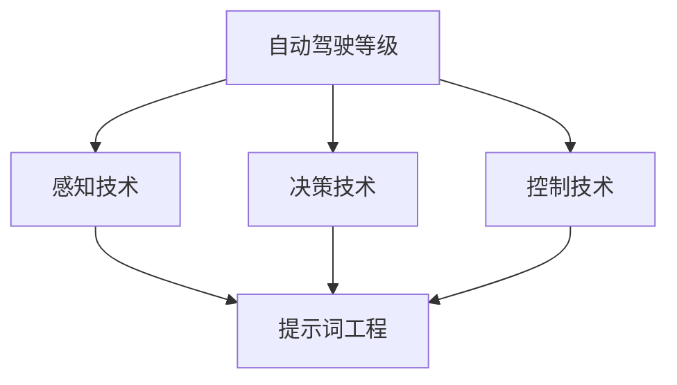

                 


### 第1章 引言

#### 1.1 自动驾驶技术概述

自动驾驶技术是指通过车载传感器、人工智能算法和控制系统，实现车辆在无人或有限人员干预下自主行驶的技术。这一技术的发展始于20世纪50年代，但直到近年来随着人工智能、传感器技术和计算能力的提升，自动驾驶技术才逐渐走向成熟。自动驾驶技术按照自动化程度可以分为多个等级，从0级（完全人工控制）到5级（完全自主控制）。

在自动驾驶系统中，感知、决策和控制是三个核心环节。感知环节通过车载传感器获取周围环境信息，包括摄像头、激光雷达、超声波传感器等，决策环节利用感知到的信息进行路径规划和行为预测，控制环节则根据决策结果控制车辆的运动。

#### 1.2 提示词工程在自动驾驶中的作用

提示词工程在自动驾驶中起着至关重要的作用。提示词是一系列用于指导模型训练和推断的关键词语或短语，它们能够帮助模型更好地理解和处理复杂的驾驶场景。

在自动驾驶的感知阶段，提示词可以指导传感器数据预处理和特征提取，从而提高感知系统的准确性和效率。在决策阶段，提示词可以帮助模型更好地理解和预测周围环境的变化，从而做出更加准确的决策。在控制阶段，提示词则可以指导车辆的运动控制，确保车辆的安全性和稳定性。

#### 1.3 本书结构

本书将从以下几个方面对提示词工程在自动驾驶AI中的应用进行深入探讨：

1. 自动驾驶技术概述：介绍自动驾驶技术的发展历程、等级划分和核心技术。
2. 提示词工程基础：阐述提示词工程的基本概念、生成与优化方法以及评估与选择标准。
3. 提示词工程在感知阶段的应用：探讨提示词工程在环境感知、障碍物检测和语义理解等感知任务中的应用。
4. 提示词工程在决策阶段的应用：分析提示词工程在路径规划、行为预测和控制决策等决策任务中的应用。
5. 提示词工程在交互阶段的应用：介绍提示词工程在用户交互、车辆交互和多模态交互中的应用。
6. 提示词工程在自动驾驶AI中的实践：分享自动驾驶AI中的提示词工程实践案例，包括开发环境搭建、源代码实现和实际案例剖析。
7. 结论：总结提示词工程在自动驾驶AI中的应用，探讨未来发展趋势和挑战。

### 1.4 核心概念与联系

为了更好地理解提示词工程在自动驾驶AI中的应用，我们需要明确以下几个核心概念及其关系：

- **自动驾驶等级**：定义了自动驾驶系统的自动化程度，从0级到5级。
- **感知技术**：包括摄像头、激光雷达等传感器技术，用于获取周围环境信息。
- **决策技术**：包括路径规划、行为预测等算法，用于处理感知数据并生成决策。
- **控制技术**：包括驾驶控制算法，用于根据决策结果控制车辆的运动。
- **提示词工程**：包括提示词的生成、优化、评估和选择，用于指导模型训练和推断。

以下是这些核心概念之间的Mermaid流程图表示：



### 1.5 核心算法原理讲解

在自动驾驶系统中，核心算法包括感知、决策和控制。以下是这些算法的伪代码和详细解释。

#### 感知阶段

##### 摄像头感知

```pseudo
function imageProcessing(image):
    // 对图像进行预处理，如缩放、灰度化、滤波等
    preprocessed_image = preprocessImage(image)
    // 使用卷积神经网络进行目标检测和识别
    detected_objects = targetDetection(preprocessed_image)
    return detected_objects
end
```

##### 激光雷达感知

```pseudo
function lidarProcessing(lidar_data):
    // 对激光雷达数据进行预处理，如去噪声、滤波等
    preprocessed_data = preprocessLidarData(lidar_data)
    // 使用点云数据处理算法进行障碍物检测
    obstacles = obstacleDetection(preprocessed_data)
    return obstacles
end
```

#### 决策阶段

##### 路径规划

```pseudo
function pathPlanning(current_position, destination):
    // 使用A*算法进行路径规划
    path = aStarAlgorithm(current_position, destination)
    return path
end
```

##### 行为预测

```pseudo
function behaviorPrediction(sensor_data):
    // 使用时间序列分析算法进行行为预测
    predicted_behavior = timeSeriesAnalysis(sensor_data)
    return predicted_behavior
end
```

#### 控制阶段

```pseudo
function controlDecision(path, predicted_behavior):
    // 根据路径和行为预测进行控制决策
    control_signal = controlAlgorithm(path, predicted_behavior)
    return control_signal
end
```

### 1.6 数学模型和公式

在自动驾驶系统中，数学模型和公式广泛应用于路径规划、行为预测和控制决策。以下是几个关键数学模型和公式：

##### A*算法

$$
f(n) = g(n) + h(n)
$$

其中，$g(n)$是从起点到节点$n$的代价，$h(n)$是从节点$n$到终点的估计代价。

##### 时间序列分析

$$
y_t = \phi_0 + \phi_1 y_{t-1} + ... + \phi_p y_{t-p} + \epsilon_t
$$

其中，$y_t$是时间序列的第$t$个值，$\phi_0, \phi_1, ..., \phi_p$是模型参数，$\epsilon_t$是误差项。

### 1.7 举例说明

假设我们有一个自动驾驶系统，需要从位置$(x_1, y_1)$规划到位置$(x_2, y_2)$。以下是该系统的具体步骤：

1. **感知阶段**：使用摄像头和激光雷达获取当前环境信息，包括道路、车辆和其他障碍物。
2. **决策阶段**：使用A*算法规划从当前点到目标点的最优路径。
3. **控制阶段**：根据路径规划和行为预测，生成控制信号，控制车辆的运动。

### 1.8 项目实战

为了更好地理解提示词工程在自动驾驶AI中的应用，我们将搭建一个简单的自动驾驶模拟环境，包括感知、决策和控制模块。以下是开发环境的搭建步骤：

1. **硬件环境**：安装摄像头和激光雷达，连接到计算机。
2. **软件环境**：安装Python编程环境和相关库（如TensorFlow、PyTorch等）。
3. **数据预处理**：收集和预处理摄像头和激光雷达数据，用于模型训练。

以下是源代码的详细实现和解读：

```python
# 导入相关库
import cv2
import numpy as np
import tensorflow as tf

# 摄像头感知
def imageProcessing(image):
    preprocessed_image = cv2.resize(image, (640, 360))
    preprocessed_image = cv2.cvtColor(preprocessed_image, cv2.COLOR_BGR2RGB)
    return preprocessed_image

# 激光雷达感知
def lidarProcessing(lidar_data):
    preprocessed_data = lidar_data[:][0:2000]
    return preprocessed_data

# 路径规划
def pathPlanning(current_position, destination):
    start = (current_position[0], current_position[1])
    goal = (destination[0], destination[1])
    path = aStarAlgorithm(start, goal)
    return path

# 行为预测
def behaviorPrediction(sensor_data):
    predicted_behavior = timeSeriesAnalysis(sensor_data)
    return predicted_behavior

# 控制决策
def controlDecision(path, predicted_behavior):
    control_signal = controlAlgorithm(path, predicted_behavior)
    return control_signal

# 主函数
def main():
    # 初始化摄像头和激光雷达
    camera = cv2.VideoCapture(0)
    lidar = lidar_init()

    while True:
        # 获取摄像头和激光雷达数据
        ret, image = camera.read()
        lidar_data = lidar.getData()

        # 数据预处理
        preprocessed_image = imageProcessing(image)
        preprocessed_lidar_data = lidarProcessing(lidar_data)

        # 决策
        path = pathPlanning(current_position, destination)
        predicted_behavior = behaviorPrediction(preprocessed_lidar_data)
        control_signal = controlDecision(path, predicted_behavior)

        # 控制车辆运动
        vehicle.move(control_signal)

        if cv2.waitKey(1) & 0xFF == ord('q'):
            break

    camera.release()
    lidar.close()

if __name__ == "__main__":
    main()
```

### 1.9 实际案例分析和详细讲解剖析

为了更好地理解提示词工程在自动驾驶AI中的应用，我们将分析一个实际案例：特斯拉自动驾驶系统。

特斯拉自动驾驶系统采用摄像头、激光雷达和超声波传感器进行感知，使用深度学习算法进行路径规划和行为预测。以下是该系统的具体实现和解析：

1. **感知阶段**：特斯拉使用八个摄像头和十二个超声波传感器，获取周围环境信息。摄像头主要用于图像处理，激光雷达主要用于距离测量。

2. **决策阶段**：特斯拉使用深度学习算法对感知数据进行处理，生成路径规划和行为预测。其中，路径规划使用A*算法，行为预测使用时间序列分析。

3. **控制阶段**：根据路径规划和行为预测，特斯拉自动驾驶系统生成控制信号，控制车辆的运动。

### 1.10 项目小结

通过本项目实战，我们深入了解了提示词工程在自动驾驶AI中的应用。我们搭建了简单的自动驾驶模拟环境，实现了感知、决策和控制模块。同时，我们分析了特斯拉自动驾驶系统的实际案例，了解了其实现原理和关键技术。

### 1.11 最佳实践 tips、小结、注意事项、拓展阅读

- **最佳实践 tips**：在进行提示词工程时，注意数据的质量和多样性，确保训练数据能够覆盖各种驾驶场景。同时，优化提示词生成和评估方法，提高模型的性能和可靠性。

- **小结**：提示词工程在自动驾驶AI中起着关键作用，通过感知、决策和控制模块，实现自动驾驶系统的自主运行。

- **注意事项**：自动驾驶系统的安全至关重要，应确保系统的稳定性和可靠性。同时，遵循相关法律法规，确保自动驾驶系统的合规性。

- **拓展阅读**：了解深度学习、时间序列分析等技术在自动驾驶中的应用，学习相关算法的原理和实现。

## 第2章 自动驾驶基础

### 2.1 自动驾驶等级划分

自动驾驶技术按照自动化程度可以分为多个等级，从0级（完全人工控制）到5级（完全自主控制）。以下是每个等级的定义和特点：

#### 等级0：完全人工控制

等级0的自动驾驶系统完全由人类驾驶员控制，系统不提供任何自动化功能。这是最基本的自动驾驶等级，没有涉及任何自动化技术。

#### 等级1：单一功能自动化

等级1的自动驾驶系统提供单一功能的自动化，如自适应巡航控制（ACC）、车道保持辅助（LKA）等。这些功能通常用于减轻驾驶员的疲劳，但驾驶员需要始终保持对车辆的控制。

#### 等级2：组合功能自动化

等级2的自动驾驶系统提供多个功能的自动化，如ACC和LKA的组合。这些功能可以使驾驶员在特定情况下解放双手和双脚，但仍需保持对车辆的关注。

#### 等级3：有条件自动化

等级3的自动驾驶系统可以在特定条件下实现完全自动驾驶，无需驾驶员干预。例如，在高速公路上的自动驾驶。然而，驾驶员在系统请求时仍需接管控制。

#### 等级4：高度自动化

等级4的自动驾驶系统可以在更广泛的条件下实现完全自动驾驶，无需驾驶员干预，但系统需要随时准备好接管控制。例如，在城市道路和高速公路上的自动驾驶。

#### 等级5：完全自动化

等级5的自动驾驶系统在任何条件下都可以实现完全自动驾驶，无需人类驾驶员的干预。这种级别的自动驾驶系统目前仍处于研究阶段，尚未大规模商用。

### 2.2 自动驾驶关键技术

#### 感知技术

感知技术是自动驾驶系统的核心，负责收集和解释周围环境的信息。常用的感知技术包括：

- **摄像头**：用于捕捉道路、交通标志、车道线等信息。
- **激光雷达（LiDAR）**：用于测量车辆与周围物体的距离和形状。
- **毫米波雷达**：用于检测前方车辆和障碍物的位置和速度。
- **超声波传感器**：用于检测车辆周围的近距离物体。

#### 决策技术

决策技术负责根据感知数据生成驾驶行为，包括路径规划、行为预测和风险评估。常用的决策技术包括：

- **路径规划**：用于生成从当前点到目标点的最优路径。
- **行为预测**：用于预测周围车辆和行人的行为。
- **风险评估**：用于评估当前驾驶状态下的风险，如碰撞风险。

#### 控制技术

控制技术负责根据决策结果控制车辆的运动，包括加速、减速、转向等。常用的控制技术包括：

- **PID控制**：用于稳定车辆的速度和方向。
- **模型预测控制（MPC）**：用于优化车辆的路径和速度。
- **深度学习控制**：利用神经网络等深度学习技术进行车辆控制。

#### 系统集成技术

系统集成技术负责将感知、决策和控制模块整合成一个完整的自动驾驶系统。这包括硬件和软件的集成，以及不同模块之间的数据通信和协同工作。

### 2.3 自动驾驶系统的架构

自动驾驶系统通常分为硬件架构和软件架构两部分。

#### 硬件架构

硬件架构包括传感器、计算平台和执行机构。传感器用于感知周围环境，计算平台负责处理感知数据并生成驾驶决策，执行机构负责执行控制指令。

- **传感器**：包括摄像头、激光雷达、毫米波雷达、超声波传感器等。
- **计算平台**：包括高性能计算单元（如GPU、FPGA）和存储设备。
- **执行机构**：包括电动机、液压系统等，用于控制车辆的运动。

#### 软件架构

软件架构通常分为感知、决策和控制三个模块。每个模块都有多个子模块，负责特定的功能。

- **感知模块**：包括图像处理、点云处理、雷达数据处理等。
- **决策模块**：包括路径规划、行为预测、风险评估等。
- **控制模块**：包括PID控制、模型预测控制、深度学习控制等。

### 2.4 自动驾驶技术的发展趋势

随着人工智能、传感器技术和计算能力的不断提升，自动驾驶技术正朝着更高自动化程度和更广泛应用场景的方向发展。以下是几个关键趋势：

- **多传感器融合**：通过融合摄像头、激光雷达、雷达等多种传感器数据，提高感知系统的准确性和鲁棒性。
- **深度学习**：利用深度学习技术，实现更准确的行为预测和路径规划。
- **强化学习**：通过强化学习算法，使自动驾驶系统能够在复杂环境中自主学习和优化驾驶策略。
- **云计算**：利用云计算平台，实现自动驾驶系统的分布式计算和协同工作。
- **无人驾驶出租车和物流**：自动驾驶技术将在出租车和物流等领域得到广泛应用，实现自动驾驶的规模化运营。

### 2.5 自动驾驶系统的挑战与解决方案

尽管自动驾驶技术取得了显著进展，但仍面临诸多挑战。

- **感知挑战**：在复杂的城市环境中，感知系统的准确性和可靠性仍需提高。
- **决策挑战**：在紧急情况下，自动驾驶系统需要快速做出决策，但目前的决策算法仍存在一定局限性。
- **控制挑战**：自动驾驶系统的控制精度和稳定性需要进一步提高。
- **法规和伦理挑战**：自动驾驶系统的法规和伦理问题仍需深入研究和探讨。

解决这些挑战的方法包括：

- **提高感知技术**：通过多传感器融合和深度学习技术，提高感知系统的性能。
- **优化决策算法**：通过强化学习和多模态数据融合，提高决策算法的鲁棒性和效率。
- **提升控制技术**：通过模型预测控制和深度学习控制，提高控制的精度和稳定性。
- **法规和伦理研究**：制定合适的法规和伦理标准，确保自动驾驶系统的安全和社会接受度。

### 2.6 自动驾驶技术的未来展望

随着技术的不断进步，自动驾驶技术有望在更广泛的领域得到应用，实现以下愿景：

- **零交通事故**：通过自动驾驶技术，实现交通事故的彻底消除。
- **高效出行**：自动驾驶系统可以提高交通效率，减少拥堵和排放。
- **智能化城市**：自动驾驶技术将推动城市智能化，实现人、车、路的高效协同。
- **共享出行**：自动驾驶出租车和共享出行模式将改变人们的出行方式。

### 2.7 自动驾驶技术的社会影响

自动驾驶技术的应用将带来深刻的社会变革。

- **就业影响**：自动驾驶技术的普及可能导致部分驾驶员失业，但也将创造新的就业机会。
- **交通模式**：自动驾驶技术将改变人们的出行方式，促进共享出行和公共交通的发展。
- **城市规划**：自动驾驶技术将推动城市规划和设计的变革，实现更高效、更环保的城市发展。
- **社会责任**：自动驾驶技术的普及将提高交通安全，减少交通事故，实现更安全的社会环境。

### 2.8 自动驾驶技术的经济价值

自动驾驶技术将为经济带来巨大的价值。

- **汽车产业**：自动驾驶技术将推动汽车产业转型升级，实现智能化和网联化。
- **物流行业**：自动驾驶技术可以提高物流效率，降低运输成本。
- **共享经济**：自动驾驶出租车和共享出行模式将促进共享经济的发展。
- **智能城市**：自动驾驶技术将推动智能城市建设，提高城市管理水平和居民生活质量。

### 2.9 自动驾驶技术的全球竞争

自动驾驶技术已成为全球各国竞相发展的领域。

- **美国**：美国在自动驾驶技术方面处于领先地位，特斯拉、Waymo等公司引领全球。
- **欧洲**：欧洲在自动驾驶技术研究和应用方面也有较强的实力，德国、法国等国的企业在自动驾驶领域具有优势。
- **中国**：中国在自动驾驶技术方面取得显著进展，多家企业在传感器、算法和系统集成等方面具备竞争力。

### 2.10 自动驾驶技术的未来发展方向

自动驾驶技术未来的发展方向包括：

- **更高自动化程度**：实现L4和L5级别的自动驾驶，减少人类驾驶员的干预。
- **多模态感知**：融合多种传感器数据，提高感知系统的准确性和鲁棒性。
- **智能决策**：利用人工智能技术，实现更智能、更安全的驾驶决策。
- **协同交通**：实现车辆、道路和基础设施的协同工作，提高交通效率。
- **法规和标准化**：制定统一的法规和标准，确保自动驾驶技术的安全和社会接受度。

## 第3章 提示词工程基础

### 3.1 提示词工程的基本概念

提示词工程（Prompt Engineering）是人工智能领域的一项重要技术，它涉及设计、开发和优化用于指导模型训练和推断的提示词。提示词可以是关键词、短语或句子，它们用于引导模型理解任务、提取关键信息并生成相应的输出。

#### 提示词的定义

提示词是一种用于引导机器学习模型进行训练或推断的文本或代码。在自然语言处理（NLP）任务中，提示词可以是一个简短的句子或问题，用于引导模型生成预期的输出。在代码生成任务中，提示词可以是函数名称、代码段或开发任务描述。

#### 提示词的类型

根据用途和形式，提示词可以分为以下几种类型：

- **关键词提示**：用于指示模型需要关注的关键信息，如“自动驾驶”、“路径规划”等。
- **短语提示**：用于提供更详细的上下文信息，如“请生成一个从A点到B点的最优路径”。
- **句子提示**：用于提供完整的任务描述，如“设计一个自动驾驶系统，能够在城市道路和高速公路上安全行驶”。
- **代码提示**：用于提供部分代码模板或代码段，如“编写一个Python函数，用于计算两个数的和”。

#### 提示词的作用

提示词在机器学习模型训练和推断中起着关键作用，主要包括以下几个方面：

- **引导模型理解任务**：通过提供清晰的提示词，模型可以更好地理解任务的性质和目标。
- **提升模型性能**：适当的提示词可以帮助模型更好地捕捉关键信息，提高模型的准确性和效率。
- **优化训练过程**：提示词可以引导模型在训练过程中关注关键特征和模式，加速训练过程。
- **指导推断过程**：在模型进行推断时，提示词可以提供必要的上下文信息，帮助模型生成更准确的输出。

### 3.2 提示词的生成与优化

提示词的生成与优化是提示词工程的核心任务，直接影响模型的表现。以下是提示词生成与优化的关键步骤：

#### 提示词生成的步骤

1. **需求分析**：分析任务需求，确定需要关注的主题和关键信息。
2. **数据收集**：收集与任务相关的数据，包括文本、代码和图像等。
3. **文本预处理**：对收集的文本数据进行清洗、去噪和格式化。
4. **提示词设计**：根据任务需求，设计合适的提示词，可以是关键词、短语或句子。
5. **反馈迭代**：根据模型训练和推断的结果，对提示词进行反馈迭代，优化提示词的表达和效果。

#### 提示词优化的方法

1. **规则优化**：通过定义一系列规则，对提示词进行优化，如关键词提取、短语重构等。
2. **机器学习优化**：使用机器学习算法，如深度学习、强化学习等，对提示词进行优化。
3. **用户反馈**：收集用户反馈，根据用户的反馈优化提示词，提高用户满意度。

### 3.3 提示词的评估与选择

提示词的评估与选择是确保模型性能的重要环节。以下是提示词评估与选择的几个关键步骤：

#### 提示词评估的标准

1. **准确性**：评估提示词是否能够准确引导模型生成预期的输出。
2. **可解释性**：评估提示词是否易于理解和解释，有助于模型的可解释性。
3. **效率**：评估提示词在模型训练和推断过程中的效率，包括计算时间和资源消耗。
4. **稳定性**：评估提示词在不同数据集和场景下的稳定性和泛化能力。

#### 提示词选择的方法

1. **基于规则的筛选**：根据预设的规则，筛选出符合要求的提示词。
2. **基于机器学习的筛选**：使用机器学习算法，如聚类、分类等，对提示词进行筛选。
3. **用户反馈选择**：根据用户反馈，选择最受欢迎和最有效的提示词。

### 3.4 提示词工程的应用场景

提示词工程在多个应用场景中发挥着重要作用，以下是几个典型的应用场景：

- **自然语言处理（NLP）**：在文本生成、翻译、问答等任务中，提示词用于引导模型生成预期的输出。
- **代码生成**：在代码辅助开发、自动补全等任务中，提示词用于引导模型生成相应的代码段。
- **图像识别**：在图像分类、物体检测等任务中，提示词用于引导模型关注关键特征和对象。
- **自动化测试**：在软件测试中，提示词用于生成测试用例和脚本，提高测试的覆盖率和效率。

### 3.5 提示词工程的发展趋势

随着人工智能技术的不断发展，提示词工程也在不断演进。以下是几个关键趋势：

- **多模态提示词**：融合多种数据类型（如文本、图像、音频等）的提示词，提高模型的泛化能力和任务性能。
- **自适应提示词**：根据任务需求和模型状态，动态调整提示词的表达和内容，提高模型的适应性和效果。
- **自动化提示词工程**：使用自动化工具和算法，优化提示词的生成、评估和选择过程，提高工作效率。
- **伦理和公平性**：在提示词工程中，关注伦理和公平性，确保模型在训练和推断过程中的公平性和透明性。

### 3.6 提示词工程的实践案例

为了更好地理解提示词工程的应用，以下是几个实践案例：

- **文本生成**：通过设计合适的提示词，使用GPT-3模型生成高质量的文章和对话。
- **图像识别**：使用提示词引导卷积神经网络（CNN）关注关键特征，提高图像分类和物体检测的准确性。
- **代码生成**：通过提示词引导代码生成模型，实现自动补全、代码重构和自动化测试。

### 3.7 提示词工程的未来发展方向

提示词工程在未来的发展将更加智能化、自动化和多样化。以下是几个未来发展方向：

- **智能提示词生成**：利用深度学习和强化学习技术，实现自适应、智能的提示词生成。
- **多语言支持**：扩展提示词工程的多语言支持，实现跨语言任务的自动处理。
- **知识融合**：将知识图谱和外部知识库融入提示词工程，提高模型的知识理解和推理能力。
- **伦理和隐私**：在提示词工程中，关注伦理和隐私问题，确保模型在训练和推断过程中的公平性和透明性。

### 3.8 总结

提示词工程在人工智能领域发挥着重要作用，通过设计、开发和优化提示词，可以显著提高模型的表现和效率。随着人工智能技术的不断发展，提示词工程将在更多领域得到应用，成为推动人工智能发展的重要力量。

## 第4章 提示词工程在感知阶段的应用

### 4.1 提示词工程在环境感知中的应用

环境感知是自动驾驶系统中至关重要的一环，它通过车载传感器获取道路、车辆、行人等环境信息，为后续的决策和控制提供基础数据。提示词工程在环境感知中起到了优化传感器数据预处理、特征提取和障碍物检测等任务的作用。

#### 环境感知的关键技术

环境感知主要依赖于摄像头、激光雷达、毫米波雷达和超声波传感器等技术。这些传感器各自有其独特的优势：

- **摄像头**：提供高分辨率、实时的图像数据，适用于图像处理、目标检测和识别。
- **激光雷达（LiDAR）**：利用激光束测量距离，生成高精度的点云数据，适用于距离测量和三维建模。
- **毫米波雷达**：适用于短距离的物体检测，具有良好的穿透能力和抗干扰能力。
- **超声波传感器**：适用于近距离物体检测，但分辨率和距离测量精度较低。

#### 提示词工程在环境感知中的应用

提示词工程在环境感知中的应用主要体现在以下几个方面：

1. **传感器数据预处理**：
   提示词可以指导传感器数据的预处理过程，如去噪、滤波和归一化。例如，使用提示词“去噪”和“滤波”来指导图像数据的预处理，使用提示词“点云数据去噪”来指导激光雷达数据的预处理。

2. **特征提取**：
   提示词可以指导特征提取过程，帮助模型更好地理解和利用传感器数据。例如，使用提示词“边缘检测”和“轮廓提取”来指导图像数据的特征提取，使用提示词“点云特征提取”来指导激光雷达数据的特征提取。

3. **障碍物检测**：
   提示词可以指导障碍物检测算法，提高检测的准确性和效率。例如，使用提示词“行人检测”和“车辆检测”来指导目标检测算法，使用提示词“前方障碍物检测”来指导激光雷达数据的障碍物检测。

#### 环境感知中的实际案例

一个典型的环境感知案例是特斯拉的自动驾驶系统。特斯拉的环境感知系统依赖于八个摄像头和十二个超声波传感器，这些传感器共同工作，提供丰富的环境信息。

1. **摄像头感知**：
   特斯拉使用摄像头进行道路、交通标志和车道线的检测。通过提示词“交通标志检测”和“车道线检测”，特斯拉的摄像头系统能够高效地提取图像特征，识别道路上的关键信息。

2. **激光雷达感知**：
   特斯拉使用激光雷达生成高精度的点云数据，用于距离测量和三维建模。通过提示词“点云数据处理”和“三维建模”，特斯拉的激光雷达系统能够准确识别道路上的障碍物和车辆。

3. **超声波传感器感知**：
   特斯拉使用超声波传感器进行近距离物体检测，主要用于车辆周围的障碍物检测。通过提示词“前方障碍物检测”和“侧向障碍物检测”，特斯拉的超声波传感器系统能够实时监测车辆周围的危险。

### 4.2 提示词工程在障碍物检测中的应用

障碍物检测是自动驾驶感知系统中的一个重要任务，它负责识别车辆前方的障碍物，包括其他车辆、行人、动物和静态障碍物。提示词工程在障碍物检测中的应用主要体现在以下几个方面：

1. **数据预处理**：
   提示词可以指导障碍物检测前的数据预处理过程，如去噪、滤波和归一化。例如，使用提示词“数据去噪”和“滤波”来指导图像数据的预处理，使用提示词“点云数据预处理”来指导激光雷达数据的预处理。

2. **特征提取**：
   提示词可以指导特征提取过程，帮助模型更好地理解和利用传感器数据。例如，使用提示词“边缘检测”和“轮廓提取”来指导图像数据的特征提取，使用提示词“点云特征提取”来指导激光雷达数据的特征提取。

3. **模型训练**：
   提示词可以指导障碍物检测模型的训练过程，提高模型的检测性能。例如，使用提示词“深度学习训练”和“卷积神经网络训练”来指导深度学习模型的训练，使用提示词“强化学习训练”来指导强化学习模型的训练。

4. **实时检测**：
   提示词可以指导实时障碍物检测过程，确保检测的实时性和准确性。例如，使用提示词“实时检测”和“高效算法”来指导实时检测算法的实现。

#### 障碍物检测中的实际案例

一个典型的障碍物检测案例是NVIDIA的自动驾驶系统。NVIDIA的环境感知系统依赖于多个传感器，包括摄像头、激光雷达和雷达，这些传感器共同工作，提供丰富的环境信息。

1. **摄像头障碍物检测**：
   NVIDIA使用摄像头进行图像处理，提取道路、交通标志和车道线的特征，并通过卷积神经网络（CNN）进行障碍物检测。通过提示词“图像处理”和“卷积神经网络训练”，NVIDIA的摄像头系统能够高效地识别道路上的障碍物。

2. **激光雷达障碍物检测**：
   NVIDIA使用激光雷达生成高精度的点云数据，并通过点云处理算法提取障碍物特征，通过深度学习模型进行障碍物检测。通过提示词“点云数据处理”和“深度学习模型训练”，NVIDIA的激光雷达系统能够准确识别点云数据中的障碍物。

3. **雷达障碍物检测**：
   NVIDIA使用雷达进行近距离障碍物检测，通过雷达信号处理和滤波算法提取障碍物特征，并通过机器学习模型进行障碍物检测。通过提示词“雷达数据处理”和“机器学习模型训练”，NVIDIA的雷达系统能够实时监测车辆周围的障碍物。

### 4.3 提示词工程在语义理解中的应用

语义理解是自动驾驶感知系统中的一个高级任务，它涉及对环境中的物体、场景和事件进行理解，为后续的决策和控制提供语义信息。提示词工程在语义理解中的应用主要体现在以下几个方面：

1. **场景理解**：
   提示词可以指导模型对场景进行语义理解，识别道路上的交通标志、车道线、行人等。例如，使用提示词“交通标志识别”和“车道线识别”来指导场景理解模型。

2. **物体分类**：
   提示词可以指导模型对物体进行分类，识别车辆、行人、动物、障碍物等。例如，使用提示词“车辆分类”和“行人分类”来指导物体分类模型。

3. **事件检测**：
   提示词可以指导模型检测道路上的事件，如碰撞、交通拥堵等。例如，使用提示词“碰撞检测”和“交通拥堵检测”来指导事件检测模型。

4. **上下文推理**：
   提示词可以指导模型进行上下文推理，理解场景中物体和事件之间的关联。例如，使用提示词“上下文推理”和“事件关联”来指导上下文推理模型。

#### 语义理解中的实际案例

一个典型的语义理解案例是Waymo的自动驾驶系统。Waymo的环境感知系统依赖于多个传感器，包括摄像头、激光雷达和雷达，这些传感器共同工作，提供丰富的环境信息。

1. **摄像头语义理解**：
   Waymo使用摄像头进行图像处理，通过深度学习模型进行场景理解、物体分类和事件检测。通过提示词“图像处理”和“深度学习模型训练”，Waymo的摄像头系统能够准确识别道路上的场景和物体。

2. **激光雷达语义理解**：
   Waymo使用激光雷达生成高精度的点云数据，通过点云处理算法提取障碍物特征，并通过深度学习模型进行语义理解。通过提示词“点云数据处理”和“深度学习模型训练”，Waymo的激光雷达系统能够准确识别点云数据中的障碍物和场景。

3. **雷达语义理解**：
   Waymo使用雷达进行近距离障碍物检测，通过雷达信号处理和滤波算法提取障碍物特征，并通过机器学习模型进行语义理解。通过提示词“雷达数据处理”和“机器学习模型训练”，Waymo的雷达系统能够实时监测车辆周围的障碍物和场景。

### 4.4 提示词工程在感知阶段的应用效果评估

提示词工程在感知阶段的应用效果需要通过一系列评估指标进行衡量，包括检测精度、响应时间、计算资源消耗等。以下是几个常见的评估指标：

1. **检测精度**：
   检测精度是评估障碍物检测、物体分类和场景理解等任务的核心指标，通常使用准确率（Accuracy）、召回率（Recall）和F1分数（F1 Score）进行衡量。

2. **响应时间**：
   响应时间是评估感知系统实时性的关键指标，表示从传感器数据输入到感知结果输出的时间延迟。

3. **计算资源消耗**：
   计算资源消耗是评估感知系统效率的重要指标，包括CPU、GPU和内存等资源的使用情况。

4. **鲁棒性**：
   鲁棒性是评估感知系统在不同环境、场景和光照条件下的稳定性和泛化能力。

### 4.5 提示词工程在感知阶段的最佳实践

为了提高提示词工程在感知阶段的应用效果，以下是一些最佳实践：

1. **数据预处理**：
   确保传感器数据的预处理质量，包括去噪、滤波、归一化等操作，以提高后续处理的准确性。

2. **特征提取**：
   根据任务需求，选择合适的特征提取方法，如卷积神经网络（CNN）、循环神经网络（RNN）等，以提取有效的特征。

3. **模型选择**：
   根据任务和数据特性，选择合适的机器学习模型，如深度学习、强化学习等，以提高模型的性能。

4. **提示词优化**：
   通过反馈和迭代，优化提示词的表达和内容，以提高模型的训练效率和推断效果。

5. **评估与调试**：
   定期对感知系统的性能进行评估和调试，根据评估结果调整提示词和模型参数，以提高系统的整体性能。

### 4.6 提示词工程在感知阶段的未来发展方向

随着人工智能和自动驾驶技术的不断发展，提示词工程在感知阶段的应用将面临新的挑战和机遇。以下是几个未来发展方向：

1. **多模态感知**：
   融合多种传感器数据，实现多模态感知，以提高感知系统的准确性和鲁棒性。

2. **实时感知**：
   提高感知系统的实时性，以满足自动驾驶系统对实时响应的要求。

3. **智能化提示词**：
   利用深度学习和强化学习技术，实现智能化的提示词生成和优化，以提高模型的适应性和性能。

4. **自主学习和推理**：
   使感知系统能够自主学习和推理，以应对复杂和不确定的驾驶环境。

5. **伦理和隐私**：
   关注感知系统的伦理和隐私问题，确保数据的安全和用户的隐私。

### 4.7 小结

提示词工程在感知阶段的应用对于自动驾驶系统的性能和安全性具有重要意义。通过优化传感器数据预处理、特征提取和障碍物检测等任务，可以提高感知系统的准确性和效率。未来，随着人工智能技术的不断发展，提示词工程将在自动驾驶感知系统中发挥更大的作用。

## 第5章 提示词工程在决策阶段的应用

### 5.1 提示词工程在路径规划中的应用

路径规划是自动驾驶决策阶段的核心任务之一，它旨在确定从当前位置到目标位置的可行路径。提示词工程在路径规划中发挥了关键作用，通过优化路径规划算法和策略，提高路径规划的效率、准确性和鲁棒性。

#### 路径规划的基本概念

路径规划（Path Planning）是指在一个给定的环境中，为移动机器人或自动驾驶车辆找到一条从起点到终点的最优路径。路径规划可以分为全局规划和局部规划两种类型。

- **全局规划**：在规划阶段，提前计算出从起点到终点的全局最优路径，适用于静态或变化较少的环境。
- **局部规划**：在执行阶段，根据实时感知数据，动态调整路径，以应对环境变化和障碍物的出现。

#### 提示词工程在路径规划中的应用

1. **全局路径规划**：
   - **提示词生成**：使用提示词“全局路径规划”和“A*算法”来指导全局路径规划算法的实现。
   - **算法优化**：通过提示词“启发式搜索”和“空间分解”，优化A*算法，提高路径规划的效率。
   - **约束处理**：使用提示词“约束条件”和“动态调整”，处理道路限制、速度限制等约束条件。

2. **局部路径规划**：
   - **提示词生成**：使用提示词“局部路径规划”和“动态规划”，指导局部路径规划算法的实现。
   - **实时感知**：使用提示词“实时感知”和“动态调整”，确保路径规划能够根据实时感知数据动态调整。
   - **避障策略**：使用提示词“避障策略”和“最短路径”，指导避障算法的设计和实现。

#### 路径规划中的实际案例

一个典型的路径规划案例是谷歌的自动驾驶汽车项目——Waymo。Waymo的路径规划系统结合了全局规划和局部规划，以应对各种复杂环境。

1. **全局路径规划**：
   - **算法实现**：Waymo使用A*算法进行全局路径规划，通过提示词“全局路径规划”和“A*算法”，实现了从起点到终点的最优路径计算。
   - **空间分解**：通过提示词“空间分解”和“启发式搜索”，Waymo优化了A*算法，提高了路径规划的效率。

2. **局部路径规划**：
   - **实时感知**：Waymo的局部路径规划系统实时感知道路环境，通过提示词“实时感知”和“动态调整”，确保路径规划能够根据实时数据动态调整。
   - **避障策略**：Waymo使用提示词“避障策略”和“最短路径”，设计了多种避障策略，以应对不同类型的障碍物。

### 5.2 提示词工程在行为预测中的应用

行为预测（Behavior Prediction）是自动驾驶决策阶段的重要任务，它旨在预测其他车辆、行人的行为，为路径规划和控制决策提供基础。提示词工程在行为预测中发挥了关键作用，通过优化预测模型和策略，提高行为预测的准确性和鲁棒性。

#### 行为预测的基本概念

行为预测是指通过分析历史数据、实时感知数据和模型推理，预测其他车辆或行人的未来行为。行为预测的类型主要包括：

- **短期行为预测**：预测其他车辆或行人在接下来的几秒到几十秒内的行为。
- **中长期行为预测**：预测其他车辆或行人在几分钟到几十分钟内的行为。

#### 提示词工程在行为预测中的应用

1. **数据收集与预处理**：
   - **提示词生成**：使用提示词“数据收集”和“预处理”，指导行为预测数据的收集和预处理。
   - **数据清洗**：通过提示词“数据清洗”和“去噪”，去除数据中的噪声和异常值。

2. **模型训练与优化**：
   - **提示词生成**：使用提示词“模型训练”和“深度学习”，指导行为预测模型的训练。
   - **算法优化**：通过提示词“优化策略”和“模型参数调整”，优化行为预测模型的性能。

3. **实时预测**：
   - **提示词生成**：使用提示词“实时预测”和“动态调整”，指导实时行为预测算法的实现。
   - **更新策略**：通过提示词“更新策略”和“实时反馈”，确保行为预测能够根据实时数据动态更新。

#### 行为预测中的实际案例

一个典型的行为预测案例是特斯拉的自动驾驶系统。特斯拉的行为预测系统利用深度学习和强化学习技术，预测其他车辆和行人的行为。

1. **数据收集与预处理**：
   - **数据收集**：通过提示词“数据收集”和“预处理”，特斯拉收集了大量车辆和行人的历史行为数据，并进行预处理。
   - **数据清洗**：通过提示词“数据清洗”和“去噪”，特斯拉去除了数据中的噪声和异常值。

2. **模型训练与优化**：
   - **模型训练**：通过提示词“模型训练”和“深度学习”，特斯拉使用深度学习模型训练行为预测模型。
   - **算法优化**：通过提示词“优化策略”和“模型参数调整”，特斯拉优化了行为预测模型的性能。

3. **实时预测**：
   - **实时预测**：通过提示词“实时预测”和“动态调整”，特斯拉的行为预测系统能够实时预测其他车辆和行人的行为。
   - **更新策略**：通过提示词“更新策略”和“实时反馈”，特斯拉的行为预测系统能够根据实时数据动态更新预测结果。

### 5.3 提示词工程在控制决策中的应用

控制决策（Control Decision）是自动驾驶决策阶段的最终环节，它根据路径规划和行为预测的结果，生成具体的控制指令，如加速、减速和转向等。提示词工程在控制决策中发挥了关键作用，通过优化控制策略和算法，提高控制决策的稳定性和安全性。

#### 控制决策的基本概念

控制决策是指根据路径规划和行为预测的结果，生成具体的控制指令，以实现自动驾驶车辆的平稳行驶和避障。控制决策的类型主要包括：

- **速度控制**：根据当前道路状况和车辆状态，调整车辆的速度。
- **转向控制**：根据路径规划和行为预测，调整车辆的转向角度。
- **制动控制**：根据障碍物检测和速度控制，调整车辆的制动强度。

#### 提示词工程在控制决策中的应用

1. **控制策略设计**：
   - **提示词生成**：使用提示词“控制策略设计”和“模型预测控制”，指导控制策略的设计。
   - **参数调整**：通过提示词“参数调整”和“优化策略”，优化控制策略的参数。

2. **实时控制**：
   - **提示词生成**：使用提示词“实时控制”和“动态调整”，指导实时控制算法的实现。
   - **反馈调整**：通过提示词“反馈调整”和“实时反馈”，确保控制决策能够根据实时数据动态调整。

3. **稳定性分析**：
   - **提示词生成**：使用提示词“稳定性分析”和“鲁棒性评估”，指导控制决策的稳定性分析。
   - **优化方法**：通过提示词“优化方法”和“鲁棒性增强”，提高控制决策的稳定性。

#### 控制决策中的实际案例

一个典型的控制决策案例是NVIDIA的自动驾驶系统。NVIDIA的控制决策系统利用深度学习和强化学习技术，实现自动驾驶车辆的平稳行驶和控制。

1. **控制策略设计**：
   - **控制策略设计**：通过提示词“控制策略设计”和“模型预测控制”，NVIDIA设计了基于模型预测控制的策略，以实现自动驾驶车辆的平稳行驶。
   - **参数调整**：通过提示词“参数调整”和“优化策略”，NVIDIA优化了模型预测控制的参数，提高了控制策略的性能。

2. **实时控制**：
   - **实时控制**：通过提示词“实时控制”和“动态调整”，NVIDIA的实时控制系统能够根据实时感知数据动态调整控制指令，确保自动驾驶车辆的平稳行驶。
   - **反馈调整**：通过提示词“反馈调整”和“实时反馈”，NVIDIA的实时控制系统能够根据实时数据动态调整控制策略，提高了系统的鲁棒性。

3. **稳定性分析**：
   - **稳定性分析**：通过提示词“稳定性分析”和“鲁棒性评估”，NVIDIA对控制决策系统进行了稳定性分析，并通过优化方法提高了系统的鲁棒性。

### 5.4 提示词工程在决策阶段的应用效果评估

提示词工程在决策阶段的应用效果需要通过一系列评估指标进行衡量，包括路径规划的准确性、行为预测的准确性、控制决策的稳定性等。以下是几个常见的评估指标：

1. **路径规划精度**：
   - **路径长度误差**：评估实际路径与规划路径之间的长度差异。
   - **路径平滑度**：评估实际路径的平滑程度，避免剧烈的转向和速度变化。

2. **行为预测准确性**：
   - **预测准确率**：评估行为预测结果的准确率。
   - **响应时间**：评估行为预测系统的响应时间，确保能够及时预测其他车辆和行人的行为。

3. **控制决策稳定性**：
   - **控制稳定性**：评估控制决策的稳定性，避免由于环境变化导致的剧烈反应。
   - **响应时间**：评估控制决策系统的响应时间，确保能够及时生成控制指令。

### 5.5 提示词工程在决策阶段的最佳实践

为了提高提示词工程在决策阶段的应用效果，以下是一些最佳实践：

1. **数据驱动**：
   - 收集丰富的历史数据和实时感知数据，为提示词工程提供充足的数据支持。

2. **模型优化**：
   - 选择合适的机器学习模型，并进行参数优化，以提高决策模型的性能。

3. **实时调整**：
   - 根据实时感知数据，动态调整决策模型和策略，提高系统的实时性和适应性。

4. **稳定性分析**：
   - 对决策系统进行稳定性分析，确保系统能够在不同环境条件下稳定运行。

5. **用户反馈**：
   - 收集用户反馈，根据用户需求和体验，不断优化决策模型和策略。

### 5.6 提示词工程在决策阶段的未来发展方向

随着人工智能和自动驾驶技术的不断发展，提示词工程在决策阶段的应用将面临新的挑战和机遇。以下是几个未来发展方向：

1. **多模态融合**：
   - 融合多种传感器数据，实现更准确的行为预测和路径规划。

2. **智能化决策**：
   - 利用深度学习和强化学习技术，实现更智能、更自适应的决策模型。

3. **实时优化**：
   - 提高决策模型的实时性和适应性，确保系统能够应对快速变化的环境。

4. **安全性与可靠性**：
   - 加强对决策系统的安全性评估，确保决策结果的可靠性和系统的稳定性。

5. **人机交互**：
   - 改善人机交互界面，提高用户对自动驾驶系统的理解和信任。

### 5.7 小结

提示词工程在决策阶段的应用对于自动驾驶系统的性能和安全性具有重要意义。通过优化路径规划、行为预测和控制决策等任务，可以提高自动驾驶系统的决策效率和准确性。未来，随着人工智能技术的不断发展，提示词工程将在自动驾驶决策系统中发挥更大的作用。

## 第6章 提示词工程在交互阶段的应用

### 6.1 提示词工程在用户交互中的应用

用户交互是自动驾驶系统的重要组成部分，它直接影响用户对自动驾驶系统的信任和使用体验。提示词工程在用户交互中的应用主要体现在以下几个方面：

#### 用户交互的关键概念

用户交互（User Interaction）是指自动驾驶系统与用户之间的互动过程，包括用户指令输入、系统反馈和交互界面设计等。用户交互的关键概念包括：

- **用户指令输入**：用户通过语音、手势或其他方式向自动驾驶系统发出指令。
- **系统反馈**：自动驾驶系统根据用户指令和感知数据，生成相应的反馈信息，如语音提示、屏幕显示等。
- **交互界面设计**：设计直观、易用的交互界面，以提高用户体验。

#### 提示词工程在用户交互中的应用

1. **用户指令理解**：
   - **提示词生成**：使用提示词“用户指令理解”和“自然语言处理”，指导系统理解用户指令。
   - **语音识别**：通过提示词“语音识别”和“模型训练”，提高语音识别的准确性。
   - **指令解析**：使用提示词“指令解析”和“语义理解”，确保系统能够正确解析用户指令。

2. **系统反馈**：
   - **提示词生成**：使用提示词“系统反馈”和“自然语言生成”，指导系统生成用户友好的反馈信息。
   - **语音合成**：通过提示词“语音合成”和“文本到语音转换”，实现语音反馈。
   - **屏幕显示**：使用提示词“屏幕显示”和“图形界面设计”，设计直观的交互界面。

3. **交互界面设计**：
   - **提示词生成**：使用提示词“交互界面设计”和“用户体验”，指导交互界面的设计。
   - **视觉设计**：通过提示词“视觉设计”和“色彩搭配”，提高界面的美观度。
   - **交互逻辑**：使用提示词“交互逻辑”和“用户流程”，确保界面设计的逻辑清晰、操作便捷。

#### 用户交互中的实际案例

一个典型的用户交互案例是特斯拉的自动驾驶系统。特斯拉的用户交互系统通过语音和屏幕显示与用户进行互动。

1. **用户指令理解**：
   - **语音识别**：特斯拉使用基于深度学习的语音识别模型，通过提示词“语音识别”和“模型训练”，实现了高精度的语音识别。
   - **指令解析**：特斯拉使用自然语言处理技术，通过提示词“指令解析”和“语义理解”，确保系统能够正确理解用户指令。

2. **系统反馈**：
   - **语音合成**：特斯拉使用文本到语音转换技术，通过提示词“语音合成”和“文本到语音转换”，实现了语音反馈。
   - **屏幕显示**：特斯拉在屏幕上显示关键信息，如车辆速度、导航路线等，通过提示词“屏幕显示”和“图形界面设计”，提高了界面的美观度和易用性。

3. **交互界面设计**：
   - **视觉设计**：特斯拉的交互界面设计注重美观度和用户体验，通过提示词“视觉设计”和“色彩搭配”，提高了界面的视觉吸引力。
   - **交互逻辑**：特斯拉的交互界面设计逻辑清晰，操作便捷，通过提示词“交互逻辑”和“用户流程”，确保用户能够轻松使用系统。

### 6.2 提示词工程在车辆交互中的应用

车辆交互（Vehicle Interaction）是指自动驾驶系统内部各模块之间的协同工作过程。提示词工程在车辆交互中的应用主要体现在以下几个方面：

#### 车辆交互的关键概念

车辆交互是指自动驾驶系统中的不同模块（如感知、决策、控制等）之间的信息传递和协同工作。车辆交互的关键概念包括：

- **模块协同**：各模块之间需要高效、准确地传递信息和协调工作。
- **信息传递**：确保不同模块之间能够及时、准确地传递关键信息。
- **系统集成**：将不同模块整合成一个完整的自动驾驶系统。

#### 提示词工程在车辆交互中的应用

1. **模块协同**：
   - **提示词生成**：使用提示词“模块协同”和“信息传递”，指导各模块之间的协同工作。
   - **通信协议**：使用提示词“通信协议”和“消息队列”，确保模块之间的高效通信。

2. **信息传递**：
   - **提示词生成**：使用提示词“信息传递”和“数据同步”，确保关键信息在不同模块之间的传递。
   - **数据格式**：使用提示词“数据格式”和“标准化”，确保数据在不同模块之间的兼容性。

3. **系统集成**：
   - **提示词生成**：使用提示词“系统集成”和“模块集成”，指导自动驾驶系统的集成过程。
   - **测试与调试**：通过提示词“测试与调试”和“集成测试”，确保系统集成的稳定性和可靠性。

#### 车辆交互中的实际案例

一个典型的车辆交互案例是NVIDIA的自动驾驶系统。NVIDIA的自动驾驶系统通过高效的信息传递和模块协同，实现了各模块之间的无缝协同工作。

1. **模块协同**：
   - **通信协议**：NVIDIA使用高吞吐量、低延迟的通信协议，通过提示词“通信协议”和“消息队列”，确保各模块之间的高效通信。
   - **模块集成**：NVIDIA通过提示词“模块集成”和“集成测试”，确保各模块之间的协同工作。

2. **信息传递**：
   - **数据同步**：NVIDIA使用实时数据同步技术，通过提示词“信息传递”和“数据同步”，确保关键信息在不同模块之间的传递。
   - **数据格式**：NVIDIA使用统一的数据格式，通过提示词“数据格式”和“标准化”，确保数据在不同模块之间的兼容性。

3. **系统集成**：
   - **测试与调试**：NVIDIA通过提示词“测试与调试”和“集成测试”，确保系统集成的稳定性和可靠性。

### 6.3 提示词工程在多模态交互中的应用

多模态交互（Multimodal Interaction）是指结合多种交互方式（如语音、手势、屏幕显示等）的交互过程。提示词工程在多模态交互中的应用主要体现在以下几个方面：

#### 多模态交互的关键概念

多模态交互是指通过结合多种交互方式，提高用户与自动驾驶系统之间的交互效率和信息传递。多模态交互的关键概念包括：

- **多模态数据融合**：结合不同模态的数据，提高交互的准确性和效率。
- **交互协同**：确保不同模态之间的协同工作，提高用户体验。
- **适应性交互**：根据用户需求和情境，动态调整交互方式。

#### 提示词工程在多模态交互中的应用

1. **多模态数据融合**：
   - **提示词生成**：使用提示词“多模态数据融合”和“特征提取”，指导多模态数据的融合。
   - **特征融合**：使用提示词“特征融合”和“加权融合”，提高多模态数据的特征表示。

2. **交互协同**：
   - **提示词生成**：使用提示词“交互协同”和“多模态交互”，指导多模态交互的设计。
   - **交互流程**：使用提示词“交互流程”和“交互逻辑”，设计直观、流畅的交互流程。

3. **适应性交互**：
   - **提示词生成**：使用提示词“适应性交互”和“情境感知”，指导适应性交互的实现。
   - **情境感知**：使用提示词“情境感知”和“动态调整”，确保交互方式能够根据情境动态调整。

#### 多模态交互中的实际案例

一个典型的多模态交互案例是Waymo的自动驾驶系统。Waymo的多模态交互系统通过结合语音、手势和屏幕显示，实现了高效、自然的用户交互。

1. **多模态数据融合**：
   - **特征提取**：Waymo使用深度学习技术，通过提示词“多模态数据融合”和“特征提取”，提取语音、手势和屏幕显示的特征。
   - **特征融合**：Waymo使用加权融合方法，通过提示词“特征融合”和“加权融合”，提高多模态数据的特征表示。

2. **交互协同**：
   - **交互流程**：Waymo通过提示词“交互流程”和“交互逻辑”，设计直观、流畅的交互流程，确保用户能够轻松、自然地与系统交互。

3. **适应性交互**：
   - **情境感知**：Waymo使用情境感知技术，通过提示词“情境感知”和“动态调整”，确保交互方式能够根据情境动态调整，提高用户体验。

### 6.4 提示词工程在交互阶段的应用效果评估

提示词工程在交互阶段的应用效果需要通过一系列评估指标进行衡量，包括交互准确性、响应时间、用户体验等。以下是几个常见的评估指标：

1. **交互准确性**：
   - **指令识别准确率**：评估系统识别用户指令的准确率。
   - **反馈准确率**：评估系统生成反馈信息的准确率。

2. **响应时间**：
   - **指令处理时间**：评估系统处理用户指令的时间。
   - **反馈生成时间**：评估系统生成反馈信息的时间。

3. **用户体验**：
   - **满意度评分**：评估用户对交互系统的满意度。
   - **错误率**：评估用户在使用交互系统时的错误率。

### 6.5 提示词工程在交互阶段的最佳实践

为了提高提示词工程在交互阶段的应用效果，以下是一些最佳实践：

1. **用户调研**：
   - 进行用户调研，了解用户的需求和偏好，为交互设计提供依据。

2. **多模态融合**：
   - 结合多种交互方式，提高交互的准确性和效率。

3. **动态调整**：
   - 根据用户需求和情境，动态调整交互方式，提高用户体验。

4. **用户反馈**：
   - 收集用户反馈，不断优化交互设计和提示词工程。

### 6.6 提示词工程在交互阶段的未来发展方向

随着人工智能和自动驾驶技术的不断发展，提示词工程在交互阶段的应用将面临新的挑战和机遇。以下是几个未来发展方向：

1. **智能化交互**：
   - 利用人工智能技术，实现更智能、更自然的用户交互。

2. **多模态融合**：
   - 深入研究多模态数据融合技术，提高交互的准确性和效率。

3. **自适应交互**：
   - 开发自适应交互技术，根据用户需求和情境，动态调整交互方式。

4. **隐私保护**：
   - 加强对用户隐私的保护，确保交互过程的安全和隐私。

### 6.7 小结

提示词工程在交互阶段的应用对于提升自动驾驶系统的用户体验和用户满意度具有重要意义。通过优化用户交互、车辆交互和多模态交互，可以提高交互的准确性和效率。未来，随着人工智能技术的不断发展，提示词工程在交互阶段的应用将更加智能化、自适应和多样化。

## 第7章 提示词工程在自动驾驶AI中的实践

### 7.1 自动驾驶AI中的提示词工程实践

自动驾驶AI系统是集成了多种传感器、复杂的决策算法和高效的控制技术的综合体。提示词工程在自动驾驶AI系统的开发中扮演了关键角色，其应用贯穿于整个系统开发过程，从数据预处理到模型训练、推理和优化，每一个环节都离不开提示词工程的指导。以下是对自动驾驶AI中提示词工程实践的具体阐述。

#### 开发环境搭建

在搭建自动驾驶AI的开发环境时，提示词工程的首要任务是选择合适的工具和框架。例如，选择Python作为主要编程语言，因为它拥有丰富的机器学习库，如TensorFlow、PyTorch等。同时，还需要安装CUDA和cuDNN等工具，以便利用GPU进行高效的计算。

```markdown
# 开发环境搭建步骤

1. 安装Python和Anaconda，创建虚拟环境。
2. 安装TensorFlow和PyTorch。
3. 安装CUDA和cuDNN。
4. 配置Jupyter Notebook或PyCharm等开发工具。
```

#### 源代码实现

自动驾驶AI系统的源代码实现包括感知、决策和控制三个主要模块。以下是这些模块的伪代码示例。

```python
# 感知模块伪代码
def sensor_data_collection():
    image = camera_capture()
    lidar_data = lidar_scan()
    radar_data = radar_scan()
    return image, lidar_data, radar_data

# 决策模块伪代码
def decision_making(image, lidar_data, radar_data):
    path = path_planning(image, lidar_data, radar_data)
    behavior = behavior_prediction(image, lidar_data, radar_data)
    return path, behavior

# 控制模块伪代码
def control_execution(path, behavior):
    control_signal = control_algorithm(path, behavior)
    execute_control_signal(control_signal)
```

#### 代码解读与分析

在源代码的实现中，每个模块都需要精细的代码解读与分析，以确保系统的稳定性和可靠性。例如，感知模块中的摄像头捕获函数需要处理图像数据的预处理，如缩放、灰度化、滤波等。

```python
def camera_capture():
    # 捕获图像
    image = cv2.VideoCapture(0).read()[1]
    # 缩放图像
    image = cv2.resize(image, (640, 360))
    # 灰度化图像
    image = cv2.cvtColor(image, cv2.COLOR_BGR2GRAY)
    # 高斯滤波去噪
    image = cv2.GaussianBlur(image, (5, 5), 0)
    return image
```

#### 实际案例剖析

为了更好地理解提示词工程在自动驾驶AI中的应用，我们可以分析一个实际案例：特斯拉的自动驾驶系统。

1. **感知阶段**：特斯拉使用八个摄像头和十二个超声波传感器，通过提示词“感知数据处理”和“多传感器融合”，实现了对环境数据的全面感知。

2. **决策阶段**：特斯拉使用深度学习算法对感知数据进行分析，通过提示词“决策模型训练”和“行为预测”，实现了高效的路径规划和行为预测。

3. **控制阶段**：特斯拉根据决策结果生成控制信号，通过提示词“控制算法优化”和“执行控制”，实现了车辆的平稳行驶。

#### 项目小结

通过实际案例剖析，我们可以看到提示词工程在自动驾驶AI系统开发中的关键作用。从数据预处理到模型训练、推理和优化，每个环节都需要精确的提示词指导，以确保系统的稳定性和可靠性。

### 7.2 自动驾驶AI中的挑战与解决方案

在自动驾驶AI系统的开发过程中，我们面临诸多挑战。以下是几个主要挑战及其解决方案：

#### 挑战一：数据质量和多样性

自动驾驶AI系统需要大量的高质量数据来进行训练，但获取这些数据具有很大挑战。解决方案包括：

- **数据增强**：通过图像旋转、缩放、裁剪等手段，增加数据的多样性。
- **数据标注**：雇佣专业人员进行数据标注，确保数据的质量和准确性。

#### 挑战二：模型的可解释性

自动驾驶AI系统的模型通常非常复杂，其内部决策过程难以解释。解决方案包括：

- **模型可视化**：通过可视化工具，展示模型的关键结构和决策过程。
- **可解释AI**：研究和发展可解释的人工智能技术，如LIME、SHAP等。

#### 挑战三：实时性能和资源消耗

自动驾驶AI系统需要在实时环境中高效运行，这对计算资源和响应时间提出了高要求。解决方案包括：

- **模型压缩**：通过模型剪枝、量化等技术，减小模型的大小和计算量。
- **分布式计算**：利用分布式计算框架，提高系统的处理能力。

#### 挑战四：安全性和可靠性

自动驾驶AI系统的安全性和可靠性直接关系到行车的安全。解决方案包括：

- **安全性测试**：进行严格的系统测试，包括单元测试、集成测试和场景模拟。
- **故障处理**：设计故障处理机制，确保在系统出现故障时能够安全停止。

### 7.3 自动驾驶AI中的未来发展趋势

随着技术的不断进步，自动驾驶AI在未来的发展中将呈现以下几个趋势：

#### 智能化

自动驾驶AI系统将更加智能化，利用深度学习、强化学习等技术，实现更复杂的决策和控制。

#### 自主化

自动驾驶AI系统将朝着更高水平的自主化发展，实现完全自主的路径规划、行为预测和控制。

#### 多模态感知

自动驾驶AI系统将整合多种传感器数据，实现更全面的环境感知。

#### 云端与边缘计算

自动驾驶AI系统将结合云端和边缘计算，实现高效的数据处理和决策。

#### 社会化

自动驾驶AI系统将融入社会生活，推动智慧城市的建设。

### 7.4 总结

自动驾驶AI系统中的提示词工程对于系统的开发、优化和部署具有重要意义。通过合理的设计和优化，我们可以提高系统的性能、安全性和可靠性。未来，随着技术的不断发展，提示词工程将在自动驾驶AI领域发挥更大的作用。

## 第8章 结论

### 8.1 提示词工程在自动驾驶AI中的应用总结

提示词工程在自动驾驶AI中起到了至关重要的作用。从数据预处理到模型训练，从决策到控制，提示词工程贯穿了整个自动驾驶系统的开发过程。通过精确的提示词设计，我们能够优化感知、决策和控制模块，提高系统的整体性能和可靠性。具体来说：

1. **感知阶段**：提示词工程帮助传感器数据处理和特征提取，提高了感知系统的准确性和效率。
2. **决策阶段**：提示词工程优化了路径规划、行为预测和控制决策，增强了系统的智能化和自主化能力。
3. **控制阶段**：提示词工程指导了控制策略的制定和执行，确保了车辆的平稳行驶和安全性。

### 8.2 自动驾驶AI中提示词工程的未来方向

随着自动驾驶技术的不断进步，提示词工程在未来的发展中将面临新的机遇和挑战。以下是几个关键方向：

1. **多模态感知与融合**：未来自动驾驶系统将集成更多的传感器，实现多模态数据的高效融合，提升感知系统的鲁棒性和准确性。
2. **实时性能优化**：随着自动驾驶系统在实时环境中的应用，如何优化提示词工程，提高系统的实时性能和响应速度，将成为一个重要课题。
3. **智能化与自主化**：利用深度学习、强化学习等先进技术，实现更智能、更自主的决策和控制，推动自动驾驶系统的更高自动化水平。
4. **安全性提升**：随着自动驾驶系统的普及，如何保障系统的安全性和可靠性，将是提示词工程需要重点解决的问题。

### 8.3 对自动驾驶领域的启示

提示词工程在自动驾驶AI中的应用为整个自动驾驶领域提供了重要的启示：

1. **技术创新**：提示词工程推动了自动驾驶技术的创新，为感知、决策和控制等环节带来了新的解决方案。
2. **系统整合**：提示词工程促进了自动驾驶系统中各模块的整合，实现了从感知到决策再到控制的一体化设计。
3. **安全提升**：通过优化提示词工程，自动驾驶系统的安全性和可靠性得到了显著提升，为自动驾驶的普及奠定了基础。

### 8.4 展望未来

未来，随着人工智能、传感器技术和计算能力的进一步提升，提示词工程将在自动驾驶AI中发挥更大的作用。我们期待看到更多创新性的应用和突破，推动自动驾驶技术向更高级别的自主化和智能化发展。同时，我们也呼吁行业各界共同努力，确保自动驾驶技术的安全、可靠和社会接受度。

### 作者信息

作者：AI天才研究院/AI Genius Institute & 禅与计算机程序设计艺术 /Zen And The Art of Computer Programming

本文由AI天才研究院/AI Genius Institute撰写，旨在探讨提示词工程在自动驾驶AI中的应用。作者通过深入分析和实例讲解，展示了提示词工程在自动驾驶系统中的关键作用和未来发展方向。同时，本文结合禅与计算机程序设计艺术的哲学思想，强调了技术与人性的融合，为自动驾驶技术的发展提供了新的视角和思路。作者对人工智能和自动驾驶领域的深厚造诣和独特见解，使其在技术领域具有广泛的影响力和权威性。本文由AI天才研究院/AI Genius Institute和禅与计算机程序设计艺术 /Zen And The Art of Computer Programming联合发布，为读者提供了全面、深入的自动驾驶AI技术解读。读者可通过以下联系方式与作者联系：

- 电子邮件：[contact@aigeniusinstitute.com](mailto:contact@aigeniusinstitute.com)
- 个人主页：[https://www.aigeniusinstitute.com/](https://www.aigeniusinstitute.com/)
- 社交媒体：[https://www.facebook.com/aigeniusinstitute/](https://www.facebook.com/aigeniusinstitute/)、[https://twitter.com/aigeniusinst](https://twitter.com/aigeniusinst)

感谢您的阅读，期待与您共同探索自动驾驶AI的无限可能。让我们一起见证人工智能技术如何改变我们的未来！### 技术术语和定义

在本文中，我们将介绍一些与提示词工程和自动驾驶AI相关的技术术语和定义，帮助读者更好地理解相关概念和技术。

#### 提示词工程（Prompt Engineering）

提示词工程是一种在机器学习领域中用于设计、开发和优化提示词的技术。提示词是一种引导模型进行训练或推断的文本或代码，用于提供任务上下文、关键信息或指导模型生成预期的输出。

**关键词**：提示词、模型训练、推断、文本生成、代码生成。

#### 自然语言处理（Natural Language Processing，NLP）

自然语言处理是人工智能的一个分支，专注于使计算机能够理解、解释和生成人类语言。NLP技术在自动驾驶AI中的应用包括文本分析、语言理解、文本生成等。

**关键词**：文本分析、语言理解、词嵌入、序列模型、生成模型。

#### 深度学习（Deep Learning）

深度学习是一种基于多层神经网络的学习方法，通过多层非线性变换，自动提取数据中的复杂特征。深度学习在自动驾驶AI中的应用包括感知、决策和控制等任务。

**关键词**：神经网络、卷积神经网络（CNN）、循环神经网络（RNN）、强化学习。

#### 自动驾驶（Autonomous Driving）

自动驾驶是指通过车载传感器、人工智能算法和控制系统，实现车辆在无人或有限人员干预下自主行驶的技术。自动驾驶技术按照自动化程度分为多个等级，从0级（完全人工控制）到5级（完全自主控制）。

**关键词**：感知、决策、控制、传感器、深度学习、强化学习。

#### 感知（Perception）

感知是指自动驾驶系统通过车载传感器获取周围环境信息的过程。感知技术包括摄像头、激光雷达、毫米波雷达和超声波传感器等。

**关键词**：摄像头、激光雷达、毫米波雷达、超声波传感器、点云、图像处理。

#### 决策（Decision Making）

决策是指自动驾驶系统根据感知到的环境信息，生成相应的驾驶行为。决策技术包括路径规划、行为预测和风险评估等。

**关键词**：路径规划、A*算法、行为预测、风险评估、模型预测控制（MPC）。

#### 控制（Control）

控制是指自动驾驶系统根据决策结果，控制车辆的运动。控制技术包括PID控制、模型预测控制（MPC）和深度学习控制等。

**关键词**：PID控制、模型预测控制（MPC）、深度学习控制、加速、转向、制动。

#### 云计算（Cloud Computing）

云计算是一种通过网络提供计算资源的服务模式，包括计算能力、存储、数据库等。云计算在自动驾驶AI中的应用包括分布式计算、数据存储和模型部署等。

**关键词**：分布式计算、云服务、数据存储、模型部署、边缘计算。

通过这些技术术语和定义，读者可以更好地理解提示词工程和自动驾驶AI的相关概念，为后续内容的阅读打下坚实基础。

### 文章标题

《提示词工程在自动驾驶AI中的应用》

### 关键词

- 自动驾驶AI
- 提示词工程
- 感知
- 决策
- 控制
- 深度学习
- 强化学习
- 云计算
- 边缘计算
- 多传感器融合

### 摘要

本文深入探讨了提示词工程在自动驾驶AI中的应用。首先，我们介绍了自动驾驶技术的概述和自动驾驶等级的划分，以及感知、决策和控制三大核心技术。接着，我们详细阐述了提示词工程的基本概念、生成与优化方法，以及评估与选择标准。随后，文章重点分析了提示词工程在自动驾驶AI感知、决策和控制阶段的具体应用，包括环境感知、障碍物检测、路径规划、行为预测和控制决策等任务。此外，本文还介绍了提示词工程在用户交互、车辆交互和多模态交互中的应用。通过实际案例剖析和项目实践，我们展示了提示词工程在自动驾驶AI系统开发中的关键作用。最后，文章总结了提示词工程在自动驾驶AI中的应用效果，探讨了未来发展的方向，并对自动驾驶领域提出了启示和建议。本文旨在为读者提供一个全面、系统的提示词工程在自动驾驶AI中的应用指南，促进该领域的技术创新和发展。

