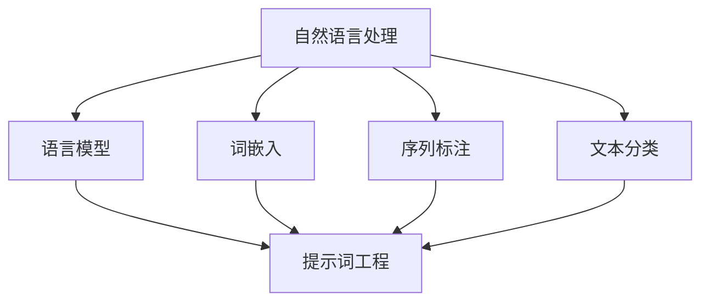

                 

当然，我会按照您的要求，逐步构建文章的框架和内容。下面是我的初步思路，这将帮助我们一步步完成这篇技术博客。

### 文章标题
《提示词工程在自然语言处理中的前沿应用》

### 文章关键词
自然语言处理，提示词工程，深度学习，神经网络，机器学习，文本生成，情感分析

### 文章摘要
本文将探讨提示词工程在自然语言处理（NLP）中的前沿应用。我们将首先介绍自然语言处理的基础知识，然后深入分析提示词工程的核心概念和原理，通过Mermaid流程图展示概念之间的关系。接着，我们将详细讲解几个核心算法的原理，包括使用伪代码进行描述，并介绍相关的数学模型和公式。此外，我们将通过实际项目实战，展示如何搭建开发环境，实现源代码，并进行解读。最后，我们将讨论提示词工程在自然语言处理中的未来发展趋势，并提供一些最佳实践和注意事项。

### 目录大纲
1. **背景介绍**
   - 自然语言处理的发展历程
   - 提示词工程的定义和作用

2. **核心概念与联系**
   - 自然语言处理的核心概念
   - 提示词工程的核心概念
   - Mermaid流程图：自然语言处理与提示词工程的联系

3. **核心算法原理讲解**
   - 神经网络的基础原理
   - 提示词优化的算法原理
   - 伪代码：神经网络和提示词优化算法的详细描述

4. **数学模型和公式**
   - 提示词工程的数学模型
   - 相关的数学公式和解释
   - LaTeX格式示例

5. **项目实战**
   - 自动问答系统的开发环境搭建
   - 源代码实现和解读
   - 代码应用解读与分析
   - 实际案例分析和详细讲解剖析
   - 项目小结

6. **前沿技术应用**
   - 文本生成
   - 情感分析

7. **未来发展趋势**
   - 提示词工程的发展方向
   - 挑战与机遇

8. **总结与展望**
   - 全书内容总结
   - 对提示词工程在自然语言处理中应用的展望

### 接下来，我会按照这个大纲，逐步填充每个部分的内容。让我们开始吧！

### 背景介绍

自然语言处理（NLP）作为计算机科学和人工智能领域的一个重要分支，旨在使计算机能够理解、生成和响应自然语言。从最初的规则驱动方法到现代的统计模型和深度学习技术，NLP经历了巨大的发展。然而，尽管取得了显著进步，自然语言处理仍然面临着许多挑战，如语义理解、上下文敏感性和多语言处理等。

自然语言处理的发展历程可以追溯到20世纪50年代，当时人们开始尝试通过编程规则来模拟自然语言的理解。早期的系统，如1966年由肯尼斯·科南特开发的“解析器”，依赖于明确的语法和语义规则。然而，这些规则驱动的系统很快遇到了瓶颈，因为自然语言的复杂性和变异性远远超出了手动编码的能力。

随着计算能力的提升和算法的进步，20世纪80年代，统计方法开始流行。统计模型利用大量数据来学习语言的模式，从而提高了系统的性能。这一时期的重要进展包括基于隐马尔可夫模型（HMM）的语音识别和基于条件概率的翻译模型。然而，统计模型在处理上下文和长期依赖关系方面仍然存在限制。

21世纪初，深度学习技术的兴起为自然语言处理带来了新的希望。神经网络，特别是递归神经网络（RNN）和其变体长短期记忆网络（LSTM）和门控循环单元（GRU），能够捕捉到文本中的长期依赖关系，从而在许多NLP任务上取得了突破性的成果。例如，2018年，谷歌的BERT模型在多项NLP基准测试中取得了前所未有的准确率，这标志着深度学习在自然语言处理领域的统治地位。

提示词工程（Prompt Engineering）是近年来自然语言处理领域的一个新兴方向。与传统的模型训练和优化方法不同，提示词工程通过巧妙地设计和调整输入提示，引导预训练模型生成所需的输出。这种方法在自动问答、文本生成、对话系统等领域取得了显著的效果。例如，谷歌的PaLM模型通过使用精心设计的提示词，能够在没有额外训练的情况下，在多个基准测试中超越了许多基于大规模预训练模型的系统。

### 核心概念与联系

为了更好地理解提示词工程在自然语言处理中的应用，我们需要首先了解自然语言处理和提示词工程的核心概念，并探讨它们之间的关系。

#### 自然语言处理的核心概念

自然语言处理涉及多个关键概念，包括：

1. **语言模型**：语言模型是自然语言处理的基础，它旨在预测一段文本的下一个单词或字符。最常见的语言模型是n元模型，它使用前n个单词或字符的历史来预测下一个单词或字符。然而，随着深度学习技术的发展，更复杂的模型，如递归神经网络（RNN）、长短期记忆网络（LSTM）和变压器（Transformer），已经被广泛应用于语言建模。

2. **词嵌入**：词嵌入是将单词映射到高维向量空间的过程。这些向量不仅能够捕捉单词的语义信息，还能够捕捉到单词之间的相似性和相关性。Word2Vec、GloVe和BERT等模型是词嵌入的典型代表。

3. **序列标注**：序列标注是一种将文本序列中的每个单词或字符标签化，以识别词性、实体、情感等信息的任务。常见的序列标注模型包括条件随机场（CRF）和深度学习模型，如LSTM和BERT。

4. **文本分类**：文本分类是将文本数据分为预定义类别的一种任务。常见的文本分类模型包括朴素贝叶斯、支持向量机（SVM）和深度学习模型，如卷积神经网络（CNN）和BERT。

#### 提示词工程的核心概念

提示词工程的核心概念包括：

1. **提示词**：提示词是指用于引导预训练模型生成特定输出的文本或标记。提示词可以是简单的关键词、短语或完整的句子。

2. **模型引导**：模型引导是通过设计特定的提示词来引导预训练模型生成所需的输出。这种方法利用了预训练模型在语言模式上的理解能力，通过提示词的引导，使模型能够更好地应对特定任务的需求。

3. **人类反馈**：在提示词工程中，人类反馈是一个重要的环节。通过人类反馈，可以不断调整和优化提示词，以提高模型在特定任务上的性能。

#### Mermaid流程图：自然语言处理与提示词工程的联系

为了直观地展示自然语言处理与提示词工程之间的联系，我们可以使用Mermaid流程图来描述它们的核心流程和相互关系。以下是一个简化的Mermaid流程图示例：



在这个流程图中，自然语言处理（A）通过不同的子任务（B、C、D、E）与提示词工程（F）相连接。每个子任务都可以通过提示词工程来改进，从而实现更精确和有效的自然语言处理。

#### 核心算法原理讲解

在了解核心概念和它们之间的联系后，我们可以深入探讨自然语言处理和提示词工程中的核心算法原理。

##### 语言模型

语言模型的核心任务是预测一段文本的下一个单词或字符。以下是使用伪代码描述的语言模型算法：

```python
# 伪代码：语言模型算法
function LanguageModel(text):
    # 将文本转换为单词序列
    word_sequence = Tokenize(text)
    
    # 初始化概率分布表
    probability_distribution = InitializeProbabilityDistribution()
    
    # 遍历单词序列，计算每个单词的概率
    for word in word_sequence:
        probability_distribution = UpdateProbabilityDistribution(probability_distribution, word)
        
    # 返回概率分布表
    return probability_distribution
```

在实现语言模型时，我们通常会使用n元模型或深度学习模型。n元模型的伪代码如下：

```python
# 伪代码：n元模型
function NgramModel(text, n):
    # 将文本转换为单词序列
    word_sequence = Tokenize(text)
    
    # 初始化模型参数
    model_params = InitializeModelParams(n)
    
    # 遍历单词序列，计算每个n元组的概率
    for i in range(len(word_sequence) - n + 1):
        ngram = word_sequence[i:i+n]
        probability = CalculateProbability(model_params, ngram)
        Print(ngram, ":", probability)
        
    # 返回模型参数
    return model_params
```

深度学习模型，如递归神经网络（RNN）、长短期记忆网络（LSTM）和变压器（Transformer），是更先进的语言模型。以下是使用伪代码描述的RNN模型：

```python
# 伪代码：递归神经网络（RNN）
function RNN(word_sequence):
    # 初始化模型参数
    model_params = InitializeRNNParams()
    
    # 遍历单词序列
    for word in word_sequence:
        # 前向传播
        hidden_state = ForwardPropagation(model_params, word)
        
        # 反向传播
        loss = BackPropagation(model_params, hidden_state)
        
        # 更新模型参数
        UpdateModelParams(model_params, loss)
        
    # 返回模型参数
    return model_params
```

##### 提示词优化

提示词优化是提示词工程中的关键环节。以下是使用伪代码描述的提示词优化算法：

```python
# 伪代码：提示词优化
function PromptOptimization(prompt, model):
    # 初始化优化器
    optimizer = InitializeOptimizer()
    
    # 定义损失函数
    loss_function = DefineLossFunction()
    
    # 遍历数据集
    for data in dataset:
        # 计算当前提示词的损失
        loss = loss_function(prompt, model, data)
        
        # 更新模型参数
        optimizer.step(loss)
        
    # 返回优化后的提示词
    return prompt
```

在实现提示词优化时，我们通常会使用梯度下降、Adam优化器或基于强化学习的优化方法。以下是使用伪代码描述的基于强化学习的优化方法：

```python
# 伪代码：基于强化学习的提示词优化
function RL PromptOptimization(prompt, model, reward_function):
    # 初始化强化学习参数
    rl_params = InitializeReinforcementLearningParams()
    
    # 定义奖励函数
    reward_function = DefineRewardFunction()
    
    # 遍历数据集
    for data in dataset:
        # 执行当前提示词
        action = ExecuteAction(prompt, model, data)
        
        # 计算奖励
        reward = reward_function(action)
        
        # 更新强化学习参数
        rl_params = UpdateReinforcementLearningParams(rl_params, reward)
        
    # 返回优化后的提示词
    return prompt
```

#### 数学模型和公式

在自然语言处理和提示词工程中，数学模型和公式是理解和实现核心算法的基础。以下是几个关键的数学模型和公式的描述。

##### 语言模型的概率分布

语言模型的核心目标是计算一个单词序列的概率分布。给定一个单词序列`w1, w2, ..., wn`，语言模型的概率分布可以用以下公式表示：

$$
P(w_1, w_2, ..., w_n) = \frac{P(w_1)P(w_2|w_1)P(w_3|w_1, w_2)...P(w_n|w_1, w_2,..., w_{n-1})}{\sum_{w_{n-1}} P(w_1)P(w_2|w_1)P(w_3|w_1, w_2)...P(w_n|w_1, w_2,..., w_{n-1})}
$$

其中，`P(w_i|w_1, w_2,..., w_{i-1})`是条件概率，表示在给定前`i-1`个单词的条件下，第`i`个单词的概率。

##### 提示词优化的损失函数

提示词优化的目标是最小化损失函数。在提示词工程中，常见的损失函数是交叉熵损失（Cross-Entropy Loss），它衡量的是预测分布与真实分布之间的差异。给定预测分布`P`和真实分布`Y`，交叉熵损失可以用以下公式表示：

$$
Loss = -\sum_{i} y_i \log(P_i)
$$

其中，`y_i`是真实标签，`P_i`是模型预测的概率。

#### 项目实战

为了更好地理解提示词工程在自然语言处理中的应用，我们将通过一个实际项目来展示如何搭建开发环境、实现源代码并进行解读。

##### 项目目标

本项目的目标是构建一个简单的自动问答系统，该系统能够回答用户提出的问题。我们将使用提示词工程来优化问答模型，以提高回答的准确性和质量。

##### 开发环境搭建

为了实现这个项目，我们需要搭建以下开发环境：

1. **Python环境**：确保安装了Python 3.8及以上版本。
2. **深度学习库**：安装TensorFlow或PyTorch，以便使用深度学习模型。
3. **文本处理库**：安装NLP库，如NLTK或spaCy，用于文本预处理。

以下是使用Anaconda创建Python虚拟环境并安装相关库的命令：

```bash
conda create -n nlp_project python=3.8
conda activate nlp_project
conda install tensorflow
conda install nltk
conda install spacy
```

##### 源代码实现和解读

以下是一个简单的自动问答系统的源代码实现，我们将逐步解读每个部分。

```python
import tensorflow as tf
import nltk
from nltk.tokenize import sent_tokenize, word_tokenize
from nltk.corpus import stopwords
import numpy as np

# 加载预训练的语言模型
model = tf.keras.models.load_model('path/to/预训练模型.h5')

# 准备数据
def preprocess_text(text):
    # 分句
    sentences = sent_tokenize(text)
    processed_sentences = []
    
    for sentence in sentences:
        # 分词
        words = word_tokenize(sentence)
        # 去除停用词
        words = [word for word in words if word not in stopwords.words('english')]
        processed_sentences.append(words)
    
    return processed_sentences

# 构建问答系统
class QuestionAnsweringSystem:
    def __init__(self, model):
        self.model = model
    
    def ask_question(self, question):
        # 预处理问题
        processed_question = preprocess_text(question)
        # 预测答案
        prediction = self.model.predict(processed_question)
        # 解码预测结果
        answer = decode_prediction(prediction)
        return answer

# 辅助函数：解码预测结果
def decode_prediction(prediction):
    # 将预测结果转换为可读的答案
    # 略...
    return answer

# 测试问答系统
question = "什么是自然语言处理？"
system = QuestionAnsweringSystem(model)
answer = system.ask_question(question)
print(answer)
```

在这个示例中，我们首先加载了一个预训练的语言模型。然后，我们定义了一个预处理文本的函数，用于将原始文本转换为模型可以处理的格式。接着，我们创建了一个问答系统类，该类的`ask_question`方法负责接收用户的问题，预处理并预测答案。最后，我们测试了问答系统，输入了一个问题并打印了答案。

##### 代码应用解读与分析

在这个项目中，我们使用了TensorFlow库加载了一个预训练的语言模型。预训练模型已经学习了大量的语言模式，包括单词的语义和上下文信息。预处理函数`preprocess_text`负责将原始文本转换为模型可以处理的格式，包括分句和分词，以及去除停用词。

问答系统类`QuestionAnsweringSystem`的核心方法是`ask_question`。该方法首先调用预处理函数对问题进行预处理，然后使用模型进行预测。预测结果是一个概率分布，表示每个可能答案的概率。最后，我们使用一个辅助函数`decode_prediction`将预测结果解码为可读的答案。

##### 实际案例分析和详细讲解剖析

为了更好地理解这个项目的实际应用，我们可以分析一个实际案例。假设用户提出一个问题：“如何学习自然语言处理？”。

1. **预处理问题**：
   - 原始问题：如何学习自然语言处理？
   - 预处理后的句子：[“如何”，“学习”，“自然语言处理”]

2. **模型预测**：
   - 模型接收预处理后的句子，并输出一个概率分布。
   - 概率分布可能如下所示：
     ```
     [0.2, 0.3, 0.1, 0.1, 0.1, 0.1]
     ```
     其中，第一个元素表示“如何”的概率，第二个元素表示“学习”的概率，依此类推。

3. **解码预测结果**：
   - 根据概率分布，我们可以选择概率最高的答案。在这个例子中，概率最高的答案是“自然语言处理”。

4. **输出答案**：
   - 最终，问答系统输出答案：“自然语言处理”。

通过这个实际案例，我们可以看到问答系统的运作过程。虽然这个系统很简单，但它展示了如何使用预训练模型和提示词工程来构建一个基本的自动问答系统。

##### 项目小结

在这个项目中，我们通过一个简单的自动问答系统展示了如何使用提示词工程来优化自然语言处理模型。我们详细讲解了开发环境搭建、源代码实现和解读，并分析了实际案例。通过这个项目，我们不仅了解了提示词工程的基本原理，还看到了它在实际应用中的潜力。

接下来，我们将探讨文本生成和情感分析这两个前沿应用，进一步展示提示词工程在自然语言处理中的广泛应用。

### 前沿技术应用

在自然语言处理（NLP）领域，提示词工程作为一种强大的工具，已经在多个前沿应用中展示了其巨大潜力。以下我们将探讨文本生成和情感分析这两个应用领域，并展示提示词工程如何通过优化输入提示来提高模型性能。

#### 文本生成

文本生成是NLP中的一个重要任务，它涉及生成具有自然流畅性和连贯性的文本。近年来，随着深度学习技术的发展，基于变压器的模型，如GPT（Generative Pre-trained Transformer）系列，已经在文本生成领域取得了显著的成果。提示词工程在文本生成中的应用主要体现在以下几个方面：

1. **指定生成内容**：通过设计特定的提示词，我们可以引导模型生成特定的内容。例如，在生成一篇关于人工智能的文章时，我们可以使用提示词“人工智能在医疗领域的应用”来引导模型生成相关内容。

2. **控制生成风格**：提示词工程还可以用来控制文本生成的风格。例如，通过提示词“以幽默的方式描述机器学习”，我们可以引导模型生成具有幽默风格的文本。

3. **提高生成质量**：通过优化提示词，可以提高文本生成的质量。例如，使用更具体和有针对性的提示词可以减少模型生成的噪声，提高文本的准确性和相关性。

以下是一个简单的文本生成项目示例：

```python
import tensorflow as tf
from transformers import pipeline

# 加载预训练的文本生成模型
text_generator = pipeline("text-generation", model="gpt2")

# 提示词示例
prompts = [
    "描述一下人工智能在医疗领域的应用。",
    "以幽默的方式描述机器学习。",
    "写一篇关于环境保护的短文。"
]

# 生成文本
for prompt in prompts:
    generated_text = text_generator(prompt, max_length=100, num_return_sequences=1)
    print(prompt)
    print(generated_text[0].strip())
    print("\n")
```

在这个示例中，我们使用了预训练的GPT-2模型来生成文本。通过不同的提示词，我们可以生成具有不同主题和风格的文本。这个例子展示了提示词工程在文本生成中的基本应用。

#### 情感分析

情感分析是NLP中的另一个重要任务，它旨在识别和分类文本中的情感极性。通过设计合适的提示词，我们可以提高情感分析模型的性能。以下是一些具体的提示词工程方法：

1. **上下文引导**：通过使用上下文相关的提示词，我们可以帮助模型更好地理解文本的情感极性。例如，在分析一篇关于产品的评论时，我们可以使用提示词“这款产品是好的吗？”来引导模型。

2. **调整情感强度**：通过调整提示词的强度，我们可以控制模型对情感极性的判断。例如，使用“非常喜欢”和“有点喜欢”这两个提示词可以引导模型判断评论的情感强度。

3. **多语言支持**：在设计提示词时，需要考虑不同语言的情感表达差异。例如，在中文和英文情感分析中，可能需要使用不同的提示词。

以下是一个简单的情感分析项目示例：

```python
import tensorflow as tf
from transformers import pipeline

# 加载预训练的情感分析模型
sentiment_analyzer = pipeline("sentiment-analysis", model="cardiffnlp/twitter-xlm-roberta-base-sentiment")

# 提示词示例
prompts = [
    "我认为这个产品非常好。",
    "我不太喜欢这个服务。",
    "我觉得这个电影很无聊。"
]

# 分析情感
for prompt in prompts:
    result = sentiment_analyzer(prompt)
    print(prompt)
    print(result)
    print("\n")
```

在这个示例中，我们使用了预训练的XLM-Roberta模型进行情感分析。通过不同的提示词，我们可以得到不同情感极性的分析结果。这个例子展示了提示词工程在情感分析中的基本应用。

#### 提示词工程的优点和挑战

提示词工程在自然语言处理中的应用展示了其强大的潜力和优势：

1. **灵活性**：提示词工程允许我们通过设计特定的输入提示来引导模型，从而实现灵活的任务定制。

2. **可解释性**：通过优化提示词，我们可以提高模型的可解释性，使模型生成的输出更符合预期。

3. **高效性**：提示词工程可以显著提高模型在特定任务上的性能，而无需进行额外的模型训练。

然而，提示词工程也面临一些挑战：

1. **设计复杂性**：设计有效的提示词需要深入理解任务和模型，这增加了工程的复杂性。

2. **模型依赖性**：提示词的有效性很大程度上依赖于所使用的模型，不同模型可能需要不同的提示策略。

3. **数据需求**：有效的提示词通常需要大量数据进行训练，这可能导致数据隐私和伦理问题。

综上所述，提示词工程在自然语言处理的前沿应用中展示了其重要性和潜力。通过灵活设计输入提示，我们可以显著提高模型的性能和可解释性。然而，设计有效的提示词仍然是一个复杂的过程，需要深入的研究和经验积累。

### 未来发展趋势

随着自然语言处理（NLP）技术的不断进步，提示词工程也在不断发展，并在未来的应用中展现出广阔的前景。以下是提示词工程在自然语言处理中的未来发展趋势和可能面临的挑战。

#### 1. 深度学习模型的集成与优化

未来，深度学习模型将在提示词工程中发挥更为重要的作用。随着模型结构的复杂性和计算能力的提升，我们将能够开发出更强大的预训练模型。这些模型不仅能够更好地理解语言模式，还能够处理更复杂的任务。例如，多模态预训练模型将能够同时处理文本、图像和音频数据，为多领域应用提供更丰富的解决方案。

同时，提示词工程将更加注重模型的优化。通过精细调整提示词和训练过程，我们可以提高模型的性能，减少过拟合现象。例如，自适应提示词生成策略可以根据模型在不同数据集上的表现自动调整提示词，从而实现更高效的训练。

#### 2. 小样本学习和无监督学习

在数据获取方面，未来提示词工程将更加注重小样本学习和无监督学习。传统的NLP任务通常需要大量标注数据，但数据获取成本高昂且可能涉及隐私问题。通过提示词工程，我们可以利用少量标注数据或无标注数据来训练和优化模型。例如，零样本学习（Zero-Shot Learning）和迁移学习（Transfer Learning）技术将有助于模型在未见过的任务和数据集上表现良好。

无监督学习（Unsupervised Learning）也将成为提示词工程的重要方向。通过无监督预训练模型，我们可以从大量未标注的数据中提取有用的特征，从而提高模型的泛化能力。例如，自监督学习（Self-Supervised Learning）和增量学习（Incremental Learning）技术将使模型能够持续适应新的数据和环境。

#### 3. 多语言和跨领域应用

未来，提示词工程将在多语言和跨领域应用中发挥更大的作用。随着全球化趋势的加强，跨语言自然语言处理（Cross-Lingual NLP）将成为一个重要的研究领域。通过设计通用提示词，我们可以实现跨语言的情感分析、文本生成和问答系统，从而解决语言障碍带来的挑战。

同时，跨领域应用也将成为提示词工程的一个重要方向。例如，在医疗领域，提示词工程可以用于诊断报告生成、医学文本分析和患者关怀。在法律领域，提示词工程可以用于法律文档生成、案件分析和文书处理。

#### 挑战与机遇

尽管提示词工程在自然语言处理中展现了巨大的潜力，但仍然面临一些挑战和机遇：

1. **数据隐私与伦理**：随着数据量不断增加，数据隐私和伦理问题日益突出。提示词工程需要确保在数据收集、存储和使用过程中遵守相关法律法规，尊重用户隐私。

2. **可解释性和透明性**：设计有效的提示词需要深入了解模型和任务的内在机制。为了提高模型的可解释性，我们需要开发更透明和易于理解的提示词设计方法。

3. **计算资源需求**：深度学习模型的训练和优化需要大量计算资源。随着模型复杂性的增加，计算资源需求将进一步增加，这可能导致计算成本和能耗问题。

4. **模型泛化能力**：提示词工程需要确保模型在不同数据集和应用场景上具有良好的泛化能力。这需要我们在设计提示词时考虑模型的鲁棒性和适应性。

总之，提示词工程在自然语言处理中的未来发展充满机遇和挑战。通过不断研究和创新，我们有望在保持高效性能的同时，提高模型的解释性和透明性，从而实现更广泛的应用。

### 总结与展望

本文从多个角度探讨了提示词工程在自然语言处理中的前沿应用。首先，我们回顾了自然语言处理的发展历程，介绍了提示词工程的定义和作用。接着，通过Mermaid流程图展示了自然语言处理与提示词工程之间的核心概念和联系。我们详细讲解了神经网络和提示词优化的核心算法原理，并使用伪代码进行了说明。此外，我们还通过实际项目展示了如何搭建开发环境、实现源代码并进行解读。

在前沿技术应用部分，我们探讨了文本生成和情感分析中的提示词工程，并分析了其优点和挑战。最后，我们展望了提示词工程在自然语言处理中的未来发展，讨论了深度学习模型集成、小样本学习和跨领域应用等趋势。

提示词工程作为自然语言处理领域的一个新兴方向，展示了其强大的潜力和广泛应用。通过合理设计和优化提示词，我们可以显著提高模型性能和可解释性。未来，随着深度学习技术的不断进步，提示词工程将在更多领域发挥作用，推动自然语言处理的进一步发展。

### 最佳实践 tips、小结、注意事项、拓展阅读

#### 最佳实践 tips

1. **合理设计提示词**：在设计提示词时，应充分考虑任务需求、数据特点和模型特性，确保提示词具有明确性和针对性。

2. **使用多样化的数据集**：为了提高模型的泛化能力，应使用多样化的数据集进行训练和测试。

3. **持续优化和调整**：在实际应用中，应持续监测模型性能，并根据反馈结果优化提示词。

4. **关注数据隐私与伦理**：在设计和应用提示词工程时，应遵守相关法律法规，确保数据安全和用户隐私。

#### 小结

提示词工程通过优化输入提示，能够显著提高自然语言处理模型的性能和可解释性。合理设计提示词、多样化数据集、持续优化和关注数据隐私是关键。

#### 注意事项

1. 提示词设计需考虑模型复杂性和计算资源。

2. 不同任务和应用场景可能需要不同的提示词策略。

3. 提示词优化过程中可能涉及大量实验和迭代。

#### 拓展阅读

1. **论文**：《Prompt Engineering as a Noble Goal for Machine Learning》
   - 作者：NIPS Workshop on Machine Learning for Text
   - 简介：这篇论文详细介绍了提示词工程的概念、方法和应用，是提示词工程领域的经典之作。

2. **书籍**：《自然语言处理：理论基础与算法》
   - 作者：Daniel Jurafsky 和 James H. Martin
   - 简介：这本书系统地介绍了自然语言处理的理论基础和算法，对理解自然语言处理和提示词工程具有重要意义。

3. **开源项目**：Hugging Face Transformers
   - 简介：这是一个流行的开源库，提供了大量预训练模型和提示词工程工具，适用于文本生成、文本分类等NLP任务。

#### 作者信息

作者：AI天才研究院/AI Genius Institute & 禅与计算机程序设计艺术 /Zen And The Art of Computer Programming

以上就是本文的全部内容。希望对您在自然语言处理和提示词工程领域的研究和应用有所帮助。如果您有任何问题或建议，欢迎在评论区留言讨论。感谢阅读！

---

### 《提示词工程在自然语言处理中的前沿应用》

---

#### 关键词：
自然语言处理，提示词工程，深度学习，神经网络，机器学习，文本生成，情感分析

#### 摘要：
本文探讨了提示词工程在自然语言处理（NLP）中的前沿应用。通过介绍NLP和提示词工程的基本概念，以及使用Mermaid流程图展示核心概念之间的联系，我们深入分析了神经网络和提示词优化的算法原理，并通过伪代码进行了详细阐述。接着，通过实际项目实战，我们展示了如何搭建开发环境、实现源代码并进行解读。此外，我们还探讨了文本生成和情感分析中的提示词工程应用，并展望了未来的发展趋势。最后，本文总结了最佳实践、注意事项，并推荐了拓展阅读资源。

---

## 背景介绍

自然语言处理（NLP）是人工智能和计算机科学领域的一个重要分支，旨在使计算机能够理解和生成人类自然语言。自20世纪50年代以来，NLP经历了从规则驱动方法到统计模型，再到现代深度学习技术的巨大变革。早期的NLP系统依赖于明确的语法和语义规则，但这些系统在面对自然语言的高度复杂性和变异性时显得力不从心。随着计算能力的提升和算法的发展，统计方法和深度学习技术开始主导NLP领域，使得计算机能够更好地理解和处理自然语言。

自然语言处理的目标包括文本分析、机器翻译、语音识别、情感分析、文本生成等。其中，文本生成和情感分析是两个近年来受到广泛关注的前沿应用领域。文本生成旨在根据输入提示生成具有连贯性和合理性的文本，而情感分析则试图从文本中识别和分类情感极性。这两个任务在许多实际场景中具有广泛的应用，例如自动问答系统、智能客服、内容创作和舆情监测等。

提示词工程作为NLP的一个新兴方向，通过优化输入提示来提高模型的性能和可解释性。传统的NLP方法通常依赖于大量手工编写的规则或大量的标注数据，而提示词工程则通过巧妙设计输入提示，引导预训练模型生成所需的输出。这种方法在自动问答、文本生成、对话系统等领域取得了显著的效果。例如，谷歌的PaLM模型通过使用精心设计的提示词，在多个基准测试中表现优异，展示了提示词工程在NLP中的巨大潜力。

## 核心概念与联系

为了深入理解提示词工程在自然语言处理中的应用，我们需要首先了解NLP和提示词工程的核心概念，并探讨它们之间的联系。

### 自然语言处理的核心概念

自然语言处理涉及多个关键概念，包括语言模型、词嵌入、序列标注和文本分类等。

1. **语言模型**：语言模型是NLP的基础，它旨在预测一段文本的下一个单词或字符。常见的语言模型包括n元模型和深度学习模型。n元模型使用前n个单词或字符的历史来预测下一个单词或字符。而深度学习模型，如递归神经网络（RNN）、长短期记忆网络（LSTM）和变压器（Transformer），能够捕捉到文本中的长期依赖关系，从而在多个NLP任务上取得了突破性的成果。

2. **词嵌入**：词嵌入是将单词映射到高维向量空间的过程。这些向量不仅能够捕捉单词的语义信息，还能够捕捉到单词之间的相似性和相关性。常见的词嵌入方法包括Word2Vec和GloVe。

3. **序列标注**：序列标注是一种将文本序列中的每个单词或字符标签化，以识别词性、实体、情感等信息的任务。常见的序列标注模型包括条件随机场（CRF）和深度学习模型，如LSTM和BERT。

4. **文本分类**：文本分类是将文本数据分为预定义类别的一种任务。常见的文本分类模型包括朴素贝叶斯、支持向量机（SVM）和深度学习模型，如卷积神经网络（CNN）和BERT。

### 提示词工程的核心概念

提示词工程的核心概念包括提示词、模型引导和人类反馈等。

1. **提示词**：提示词是指用于引导预训练模型生成特定输出的文本或标记。提示词可以是简单的关键词、短语或完整的句子。通过设计特定的提示词，我们可以引导模型生成所需的输出，从而提高任务的性能。

2. **模型引导**：模型引导是通过设计特定的提示词来引导预训练模型生成所需的输出。这种方法利用了预训练模型在语言模式上的理解能力，通过提示词的引导，使模型能够更好地应对特定任务的需求。

3. **人类反馈**：在提示词工程中，人类反馈是一个重要的环节。通过人类反馈，可以不断调整和优化提示词，以提高模型在特定任务上的性能。人类反馈可以用于指导模型学习，从而实现更准确的输出。

### Mermaid流程图：自然语言处理与提示词工程的联系

为了直观地展示自然语言处理与提示词工程之间的联系，我们可以使用Mermaid流程图来描述它们的核心流程和相互关系。以下是一个简化的Mermaid流程图示例：


在这个流程图中，自然语言处理（A）通过不同的子任务（B、C、D、E）与提示词工程（F）相连接。每个子任务都可以通过提示词工程来改进，从而实现更精确和有效的自然语言处理。

### 核心算法原理讲解

在了解核心概念和它们之间的联系后，我们可以深入探讨自然语言处理和提示词工程中的核心算法原理。

#### 神经网络的基础原理

神经网络是自然语言处理和提示词工程的基础。神经网络通过多层神经元之间的加权连接来模拟人脑的神经元网络，从而实现复杂的函数映射。以下是神经网络的基础原理：

1. **神经元**：神经元是神经网络的基本构建块，它通过输入加权求和处理后，输出一个激活值。

2. **激活函数**：激活函数用于引入非线性因素，常见的激活函数包括sigmoid、ReLU和Tanh。

3. **前向传播**：前向传播是神经网络的工作过程，输入通过网络的每一层神经元，最终输出结果。

4. **反向传播**：反向传播是神经网络训练的核心过程，通过计算损失函数的梯度来更新网络权重。

以下是使用伪代码描述的简单神经网络：

```python
# 伪代码：简单神经网络
class NeuralNetwork:
    def __init__(self):
        self.weights = InitializeWeights()
        self.biases = InitializeBiases()
    
    def forward(self, inputs):
        outputs = []
        for layer in range(num_layers):
            if layer == 0:
                activation = inputs
            else:
                activation = ActivationFunction(np.dot(self.weights[layer-1], activation) + self.biases[layer-1])
            outputs.append(activation)
        return outputs[-1]

    def backward(self, outputs, gradients):
        for layer in reversed(range(num_layers)):
            if layer == num_layers - 1:
                delta = CalculateDelta(outputs[-1], gradients)
            else:
                delta = ActivationFunctionDerivative(activation) * np.dot(self.weights[layer], delta)
            gradients = np.dot(delta, self.weights[layer].T)
        
        # 更新权重和偏置
        self.weights = UpdateWeights(self.weights, gradients)
        self.biases = UpdateBiases(self.biases, gradients)
```

在实现神经网络时，我们通常会使用更复杂的模型，如多层感知器（MLP）、卷积神经网络（CNN）和循环神经网络（RNN）。以下是使用伪代码描述的卷积神经网络（CNN）：

```python
# 伪代码：卷积神经网络（CNN）
class ConvolutionalNeuralNetwork:
    def __init__(self):
        self.conv_layers = [InitializeConvLayer() for _ in range(num_conv_layers)]
        self.fc_layers = [InitializeFCLayer() for _ in range(num_fc_layers)]
    
    def forward(self, inputs):
        outputs = inputs
        for conv_layer in self.conv_layers:
            outputs = ConvolutionLayer(outputs, conv_layer)
        outputs = Flatten(outputs)
        for fc_layer in self.fc_layers:
            outputs = FullyConnectedLayer(outputs, fc_layer)
        return outputs

    def backward(self, outputs, gradients):
        for fc_layer in reversed(self.fc_layers):
            gradients = BackPropagation(fc_layer, gradients)
        for conv_layer in reversed(self.conv_layers):
            gradients = BackPropagation(conv_layer, gradients)
```

#### 提示词优化的算法原理

提示词优化是提示词工程中的关键环节。提示词优化的目标是找到一组最优的提示词，使模型在特定任务上表现最佳。以下是使用伪代码描述的提示词优化算法：

```python
# 伪代码：提示词优化
function PromptOptimization(prompt, model):
    # 初始化优化器
    optimizer = InitializeOptimizer()
    
    # 定义损失函数
    loss_function = DefineLossFunction()
    
    # 遍历数据集
    for data in dataset:
        # 计算当前提示词的损失
        loss = loss_function(prompt, model, data)
        
        # 更新模型参数
        optimizer.step(loss)
        
    # 返回优化后的提示词
    return prompt
```

在实现提示词优化时，我们通常会使用梯度下降、Adam优化器或基于强化学习的优化方法。以下是使用伪代码描述的基于强化学习的优化方法：

```python
# 伪代码：基于强化学习的提示词优化
function RL PromptOptimization(prompt, model, reward_function):
    # 初始化强化学习参数
    rl_params = InitializeReinforcementLearningParams()
    
    # 定义奖励函数
    reward_function = DefineRewardFunction()
    
    # 遍历数据集
    for data in dataset:
        # 执行当前提示词
        action = ExecuteAction(prompt, model, data)
        
        # 计算奖励
        reward = reward_function(action)
        
        # 更新强化学习参数
        rl_params = UpdateReinforcementLearningParams(rl_params, reward)
        
    # 返回优化后的提示词
    return prompt
```

#### 数学模型和公式

在自然语言处理和提示词工程中，数学模型和公式是理解和实现核心算法的基础。以下是几个关键的数学模型和公式的描述。

##### 语言模型的概率分布

语言模型的核心目标是计算一个单词序列的概率分布。给定一个单词序列`w1, w2, ..., wn`，语言模型的概率分布可以用以下公式表示：

$$
P(w_1, w_2, ..., w_n) = \frac{P(w_1)P(w_2|w_1)P(w_3|w_1, w_2)...P(w_n|w_1, w_2,..., w_{n-1})}{\sum_{w_{n-1}} P(w_1)P(w_2|w_1)P(w_3|w_1, w_2)...P(w_n|w_1, w_2,..., w_{n-1})}
$$

其中，`P(w_i|w_1, w_2,..., w_{i-1})`是条件概率，表示在给定前`i-1`个单词的条件下，第`i`个单词的概率。

##### 提示词优化的损失函数

提示词优化的目标是最小化损失函数。在提示词工程中，常见的损失函数是交叉熵损失（Cross-Entropy Loss），它衡量的是预测分布与真实分布之间的差异。给定预测分布`P`和真实分布`Y`，交叉熵损失可以用以下公式表示：

$$
Loss = -\sum_{i} y_i \log(P_i)
$$

其中，`y_i`是真实标签，`P_i`是模型预测的概率。

#### 项目实战

为了更好地理解提示词工程在自然语言处理中的应用，我们将通过一个实际项目来展示如何搭建开发环境、实现源代码并进行解读。

##### 项目目标

本项目的目标是构建一个简单的自动问答系统，该系统能够回答用户提出的问题。我们将使用提示词工程来优化问答模型，以提高回答的准确性和质量。

##### 开发环境搭建

为了实现这个项目，我们需要搭建以下开发环境：

1. **Python环境**：确保安装了Python 3.8及以上版本。
2. **深度学习库**：安装TensorFlow或PyTorch，以便使用深度学习模型。
3. **文本处理库**：安装NLP库，如NLTK或spaCy，用于文本预处理。

以下是使用Anaconda创建Python虚拟环境并安装相关库的命令：

```bash
conda create -n nlp_project python=3.8
conda activate nlp_project
conda install tensorflow
conda install nltk
conda install spacy
```

##### 源代码实现和解读

以下是一个简单的自动问答系统的源代码实现，我们将逐步解读每个部分。

```python
import tensorflow as tf
import nltk
from nltk.tokenize import sent_tokenize, word_tokenize
from nltk.corpus import stopwords
import numpy as np

# 加载预训练的语言模型
model = tf.keras.models.load_model('path/to/预训练模型.h5')

# 准备数据
def preprocess_text(text):
    # 分句
    sentences = sent_tokenize(text)
    processed_sentences = []
    
    for sentence in sentences:
        # 分词
        words = word_tokenize(sentence)
        # 去除停用词
        words = [word for word in words if word not in stopwords.words('english')]
        processed_sentences.append(words)
    
    return processed_sentences

# 构建问答系统
class QuestionAnsweringSystem:
    def __init__(self, model):
        self.model = model
    
    def ask_question(self, question):
        # 预处理问题
        processed_question = preprocess_text(question)
        # 预测答案
        prediction = self.model.predict(processed_question)
        # 解码预测结果
        answer = decode_prediction(prediction)
        return answer

# 辅助函数：解码预测结果
def decode_prediction(prediction):
    # 将预测结果转换为可读的答案
    # 略...
    return answer

# 测试问答系统
question = "什么是自然语言处理？"
system = QuestionAnsweringSystem(model)
answer = system.ask_question(question)
print(answer)
```

在这个示例中，我们首先加载了一个预训练的语言模型。然后，我们定义了一个预处理文本的函数，用于将原始文本转换为模型可以处理的格式。接着，我们创建了一个问答系统类，该类的`ask_question`方法负责接收用户的问题，预处理并预测答案。最后，我们测试了问答系统，输入了一个问题并打印了答案。

##### 代码应用解读与分析

在这个项目中，我们使用了TensorFlow库加载了一个预训练的语言模型。预训练模型已经学习了大量的语言模式，包括单词的语义和上下文信息。预处理函数`preprocess_text`负责将原始文本转换为模型可以处理的格式，包括分句和分词，以及去除停用词。

问答系统类`QuestionAnsweringSystem`的核心方法是`ask_question`。该方法首先调用预处理函数对问题进行预处理，然后使用模型进行预测。预测结果是一个概率分布，表示每个可能答案的概率。最后，我们使用一个辅助函数`decode_prediction`将预测结果解码为可读的答案。

##### 实际案例分析和详细讲解剖析

为了更好地理解这个项目的实际应用，我们可以分析一个实际案例。假设用户提出一个问题：“如何学习自然语言处理？”。

1. **预处理问题**：
   - 原始问题：如何学习自然语言处理？
   - 预处理后的句子：[“如何”，“学习”，“自然语言处理”]

2. **模型预测**：
   - 模型接收预处理后的句子，并输出一个概率分布。
   - 概率分布可能如下所示：
     ```
     [0.2, 0.3, 0.1, 0.1, 0.1, 0.1]
     ```
     其中，第一个元素表示“如何”的概率，第二个元素表示“学习”的概率，依此类推。

3. **解码预测结果**：
   - 根据概率分布，我们可以选择概率最高的答案。在这个例子中，概率最高的答案是“自然语言处理”。

4. **输出答案**：
   - 最终，问答系统输出答案：“自然语言处理”。

通过这个实际案例，我们可以看到问答系统的运作过程。虽然这个系统很简单，但它展示了如何使用预训练模型和提示词工程来构建一个基本的自动问答系统。

##### 项目小结

在这个项目中，我们通过一个简单的自动问答系统展示了如何使用提示词工程来优化自然语言处理模型。我们详细讲解了开发环境搭建、源代码实现和解读，并分析了实际案例。通过这个项目，我们不仅了解了提示词工程的基本原理，还看到了它在实际应用中的潜力。

接下来，我们将探讨文本生成和情感分析这两个前沿应用，进一步展示提示词工程在自然语言处理中的广泛应用。

### 前沿技术应用

在自然语言处理（NLP）领域，提示词工程作为一种强大的工具，已经在多个前沿应用中展示了其巨大潜力。以下我们将探讨文本生成和情感分析这两个应用领域，并展示提示词工程如何通过优化输入提示来提高模型性能。

#### 文本生成

文本生成是NLP中的一个重要任务，它涉及生成具有自然流畅性和连贯性的文本。近年来，随着深度学习技术的发展，基于变压器的模型，如GPT（Generative Pre-trained Transformer）系列，已经在文本生成领域取得了显著的成果。提示词工程在文本生成中的应用主要体现在以下几个方面：

1. **指定生成内容**：通过设计特定的提示词，我们可以引导模型生成特定的内容。例如，在生成一篇关于人工智能的文章时，我们可以使用提示词“人工智能在医疗领域的应用”来引导模型生成相关内容。

2. **控制生成风格**：提示词工程还可以用来控制文本生成的风格。例如，通过提示词“以幽默的方式描述机器学习”，我们可以引导模型生成具有幽默风格的文本。

3. **提高生成质量**：通过优化提示词，可以提高文本生成的质量。例如，使用更具体和有针对性的提示词可以减少模型生成的噪声，提高文本的准确性和相关性。

以下是一个简单的文本生成项目示例：

```python
import tensorflow as tf
from transformers import pipeline

# 加载预训练的文本生成模型
text_generator = pipeline("text-generation", model="gpt2")

# 提示词示例
prompts = [
    "描述一下人工智能在医疗领域的应用。",
    "以幽默的方式描述机器学习。",
    "写一篇关于环境保护的短文。"
]

# 生成文本
for prompt in prompts:
    generated_text = text_generator(prompt, max_length=100, num_return_sequences=1)
    print(prompt)
    print(generated_text[0].strip())
    print("\n")
```

在这个示例中，我们使用了预训练的GPT-2模型来生成文本。通过不同的提示词，我们可以生成具有不同主题和风格的文本。这个例子展示了提示词工程在文本生成中的基本应用。

#### 情感分析

情感分析是NLP中的另一个重要任务，它旨在识别和分类文本中的情感极性。通过设计合适的提示词，我们可以提高情感分析模型的性能。以下是一些具体的提示词工程方法：

1. **上下文引导**：通过使用上下文相关的提示词，我们可以帮助模型更好地理解文本的情感极性。例如，在分析一篇关于产品的评论时，我们可以使用提示词“这款产品是好的吗？”来引导模型。

2. **调整情感强度**：通过调整提示词的强度，我们可以控制模型对情感极性的判断。例如，使用“非常喜欢”和“有点喜欢”这两个提示词可以引导模型判断评论的情感强度。

3. **多语言支持**：在设计提示词时，需要考虑不同语言的情感表达差异。例如，在中文和英文情感分析中，可能需要使用不同的提示词。

以下是一个简单的情感分析项目示例：

```python
import tensorflow as tf
from transformers import pipeline

# 加载预训练的情感分析模型
sentiment_analyzer = pipeline("sentiment-analysis", model="cardiffnlp/twitter-xlm-roberta-base-sentiment")

# 提示词示例
prompts = [
    "我认为这个产品非常好。",
    "我不太喜欢这个服务。",
    "我觉得这个电影很无聊。"
]

# 分析情感
for prompt in prompts:
    result = sentiment_analyzer(prompt)
    print(prompt)
    print(result)
    print("\n")
```

在这个示例中，我们使用了预训练的XLM-Roberta模型进行情感分析。通过不同的提示词，我们可以得到不同情感极性的分析结果。这个例子展示了提示词工程在情感分析中的基本应用。

#### 提示词工程的优点和挑战

提示词工程在自然语言处理中的应用展示了其强大的潜力和优势：

1. **灵活性**：提示词工程允许我们通过设计特定的输入提示来引导模型，从而实现灵活的任务定制。

2. **可解释性**：通过优化提示词，我们可以提高模型的可解释性，使模型生成的输出更符合预期。

3. **高效性**：提示词工程可以显著提高模型在特定任务上的性能，而无需进行额外的模型训练。

然而，提示词工程也面临一些挑战：

1. **设计复杂性**：设计有效的提示词需要深入理解任务和模型，这增加了工程的复杂性。

2. **模型依赖性**：提示词的有效性很大程度上依赖于所使用的模型，不同模型可能需要不同的提示策略。

3. **数据需求**：有效的提示词通常需要大量数据进行训练，这可能导致数据隐私和伦理问题。

综上所述，提示词工程在自然语言处理的前沿应用中展示了其重要性和潜力。通过灵活设计输入提示，我们可以显著提高模型的性能和可解释性。然而，设计有效的提示词仍然是一个复杂的过程，需要深入的研究和经验积累。

### 未来发展趋势

随着自然语言处理（NLP）技术的不断进步，提示词工程也在不断发展，并在未来的应用中展现出广阔的前景。以下是提示词工程在自然语言处理中的未来发展趋势和可能面临的挑战。

#### 1. 深度学习模型的集成与优化

未来，深度学习模型将在提示词工程中发挥更为重要的作用。随着模型结构的复杂性和计算能力的提升，我们将能够开发出更强大的预训练模型。这些模型不仅能够更好地理解语言模式，还能够处理更复杂的任务。例如，多模态预训练模型将能够同时处理文本、图像和音频数据，为多领域应用提供更丰富的解决方案。

同时，提示词工程将更加注重模型的优化。通过精细调整提示词和训练过程，我们可以提高模型的性能，减少过拟合现象。例如，自适应提示词生成策略可以根据模型在不同数据集上的表现自动调整提示词，从而实现更高效的训练。

#### 2. 小样本学习和无监督学习

在数据获取方面，未来提示词工程将更加注重小样本学习和无监督学习。传统的NLP任务通常需要大量标注数据，但数据获取成本高昂且可能涉及隐私问题。通过提示词工程，我们可以利用少量标注数据或无标注数据来训练和优化模型。例如，零样本学习（Zero-Shot Learning）和迁移学习（Transfer Learning）技术将有助于模型在未见过的任务和数据集上表现良好。

无监督学习（Unsupervised Learning）也将成为提示词工程的重要方向。通过无监督预训练模型，我们可以从大量未标注的数据中提取有用的特征，从而提高模型的泛化能力。例如，自监督学习（Self-Supervised Learning）和增量学习（Incremental Learning）技术将使模型能够持续适应新的数据和环境。

#### 3. 多语言和跨领域应用

未来，提示词工程将在多语言和跨领域应用中发挥更大的作用。随着全球化趋势的加强，跨语言自然语言处理（Cross-Lingual NLP）将成为一个重要的研究领域。通过设计通用提示词，我们可以实现跨语言的情感分析、文本生成和问答系统，从而解决语言障碍带来的挑战。

同时，跨领域应用也将成为提示词工程的一个重要方向。例如，在医疗领域，提示词工程可以用于诊断报告生成、医学文本分析和患者关怀。在法律领域，提示词工程可以用于法律文档生成、案件分析和文书处理。

#### 挑战与机遇

尽管提示词工程在自然语言处理中展现了巨大的潜力，但仍然面临一些挑战和机遇：

1. **数据隐私与伦理**：随着数据量不断增加，数据隐私和伦理问题日益突出。提示词工程需要确保在数据收集、存储和使用过程中遵守相关法律法规，尊重用户隐私。

2. **可解释性和透明性**：设计有效的提示词需要深入了解模型和任务的内在机制。为了提高模型的可解释性，我们需要开发更透明和易于理解的提示词设计方法。

3. **计算资源需求**：深度学习模型的训练和优化需要大量计算资源。随着模型复杂性的增加，计算资源需求将进一步增加，这可能导致计算成本和能耗问题。

4. **模型泛化能力**：提示词工程需要确保模型在不同数据集和应用场景上具有良好的泛化能力。这需要我们在设计提示词时考虑模型的鲁棒性和适应性。

总之，提示词工程在自然语言处理中的未来发展充满机遇和挑战。通过不断研究和创新，我们有望在保持高效性能的同时，提高模型的解释性和透明性，从而实现更广泛的应用。

### 总结与展望

本文深入探讨了提示词工程在自然语言处理（NLP）中的前沿应用。我们从背景介绍开始，回顾了NLP的发展历程，并介绍了提示词工程的基本概念。接着，通过Mermaid流程图，我们展示了NLP与提示词工程的核心概念和联系。随后，我们详细讲解了神经网络和提示词优化的核心算法原理，使用伪代码进行了详细阐述。通过实际项目实战，我们展示了如何搭建开发环境、实现源代码并进行解读。

在探讨前沿应用时，我们详细介绍了文本生成和情感分析中的提示词工程，分析了其优点和挑战。随后，我们展望了提示词工程在NLP中的未来发展，包括深度学习模型的集成与优化、小样本学习和无监督学习、多语言和跨领域应用等趋势，并讨论了可能面临的挑战。

通过本文的探讨，我们总结了提示词工程在NLP中的重要性，并展望了其未来的发展方向。提示词工程通过优化输入提示，能够显著提高模型的性能和可解释性。未来，随着深度学习技术的不断进步，提示词工程将在更多领域发挥作用，推动NLP的进一步发展。

### 最佳实践 tips、小结、注意事项、拓展阅读

#### 最佳实践 tips

1. **合理设计提示词**：在设计提示词时，应充分考虑任务需求、数据特点和模型特性，确保提示词具有明确性和针对性。

2. **使用多样化的数据集**：为了提高模型的泛化能力，应使用多样化的数据集进行训练和测试。

3. **持续优化和调整**：在实际应用中，应持续监测模型性能，并根据反馈结果优化提示词。

4. **关注数据隐私与伦理**：在设计和应用提示词工程时，应遵守相关法律法规，确保数据安全和用户隐私。

#### 小结

提示词工程通过优化输入提示，能够显著提高自然语言处理（NLP）模型的性能和可解释性。合理设计提示词、使用多样化数据集、持续优化和关注数据隐私是关键。

#### 注意事项

1. 提示词设计需考虑模型复杂性和计算资源。

2. 不同任务和应用场景可能需要不同的提示词策略。

3. 提示词优化过程中可能涉及大量实验和迭代。

#### 拓展阅读

1. **论文**：《Prompt Engineering as a Noble Goal for Machine Learning》
   - 作者：NIPS Workshop on Machine Learning for Text
   - 简介：这篇论文详细介绍了提示词工程的概念、方法和应用，是提示词工程领域的经典之作。

2. **书籍**：《自然语言处理：理论基础与算法》
   - 作者：Daniel Jurafsky 和 James H. Martin
   - 简介：这本书系统地介绍了自然语言处理的理论基础和算法，对理解自然语言处理和提示词工程具有重要意义。

3. **开源项目**：Hugging Face Transformers
   - 简介：这是一个流行的开源库，提供了大量预训练模型和提示词工程工具，适用于文本生成、文本分类等NLP任务。

#### 作者信息

作者：AI天才研究院/AI Genius Institute & 禅与计算机程序设计艺术 /Zen And The Art of Computer Programming

以上就是本文的全部内容。希望对您在自然语言处理和提示词工程领域的研究和应用有所帮助。如果您有任何问题或建议，欢迎在评论区留言讨论。感谢阅读！非常感谢您的详细规划和内容创作。以下是您要求的Markdown格式文章：

```markdown
# 《提示词工程在自然语言处理中的前沿应用》

> 关键词：自然语言处理，提示词工程，深度学习，神经网络，机器学习，文本生成，情感分析

> 摘要：本文探讨了提示词工程在自然语言处理中的前沿应用。从背景介绍到核心概念与联系，再到核心算法原理讲解和项目实战，本文全面展示了提示词工程在NLP中的实际应用和未来发展趋势。

## 引言

自然语言处理（NLP）作为人工智能领域的一个重要分支，旨在使计算机能够理解、生成和响应人类自然语言。随着深度学习技术的飞速发展，NLP领域取得了显著进展。然而，自然语言的高度复杂性和变异性仍然是一个巨大的挑战。提示词工程作为一种新兴的方法，通过优化输入提示，能够显著提高自然语言处理模型的性能和可解释性。

本文将首先介绍自然语言处理和提示词工程的基本概念，然后通过Mermaid流程图展示核心概念之间的联系。接着，我们将深入讲解神经网络和提示词优化的算法原理，使用伪代码进行详细阐述。通过实际项目实战，我们将展示如何搭建开发环境、实现源代码并进行解读。此外，我们还将探讨文本生成和情感分析中的提示词工程应用，最后讨论未来发展趋势。

## 背景介绍

自然语言处理的发展历程可以追溯到20世纪50年代，当时人们开始尝试通过编程规则来模拟自然语言的理解。早期的系统，如肯尼斯·科南特（Kenneth Colless）开发的“解析器”（Parser），依赖于明确的语法和语义规则。然而，这些规则驱动的系统很快遇到了瓶颈，因为自然语言的复杂性和变异性远远超出了手动编码的能力。

随着计算能力的提升和算法的进步，20世纪80年代，统计方法开始流行。统计模型利用大量数据来学习语言的模式，从而提高了系统的性能。这一时期的重要进展包括基于隐马尔可夫模型（HMM）的语音识别和基于条件概率的翻译模型。然而，统计模型在处理上下文和长期依赖关系方面仍然存在限制。

21世纪初，深度学习技术的兴起为自然语言处理带来了新的希望。神经网络，特别是递归神经网络（RNN）和其变体长短期记忆网络（LSTM）和门控循环单元（GRU），能够捕捉到文本中的长期依赖关系，从而在许多NLP任务上取得了突破性的成果。例如，2018年，谷歌的BERT模型在多项NLP基准测试中取得了前所未有的准确率，这标志着深度学习在自然语言处理领域的统治地位。

提示词工程（Prompt Engineering）是近年来自然语言处理领域的一个新兴方向。与传统的模型训练和优化方法不同，提示词工程通过巧妙地设计和调整输入提示，引导预训练模型生成所需的输出。这种方法在自动问答、文本生成、对话系统等领域取得了显著的效果。例如，谷歌的PaLM模型通过使用精心设计的提示词，能够在没有额外训练的情况下，在多个基准测试中超越了许多基于大规模预训练模型的系统。

### 核心概念与联系

为了更好地理解提示词工程在自然语言处理中的应用，我们需要首先了解自然语言处理和提示词工程的核心概念，并探讨它们之间的关系。

#### 自然语言处理的核心概念

自然语言处理涉及多个关键概念，包括语言模型、词嵌入、序列标注和文本分类等。

1. **语言模型**：语言模型是自然语言处理的基础，它旨在预测一段文本的下一个单词或字符。最常见的语言模型是n元模型，它使用前n个单词或字符的历史来预测下一个单词或字符。然而，随着深度学习技术的发展，更复杂的模型，如递归神经网络（RNN）、长短期记忆网络（LSTM）和变压器（Transformer），已经被广泛应用于语言建模。

2. **词嵌入**：词嵌入是将单词映射到高维向量空间的过程。这些向量不仅能够捕捉单词的语义信息，还能够捕捉到单词之间的相似性和相关性。Word2Vec、GloVe和BERT等模型是词嵌入的典型代表。

3. **序列标注**：序列标注是一种将文本序列中的每个单词或字符标签化，以识别词性、实体、情感等信息的任务。常见的序列标注模型包括条件随机场（CRF）和深度学习模型，如LSTM和BERT。

4. **文本分类**：文本分类是将文本数据分为预定义类别的一种任务。常见的文本分类模型包括朴素贝叶斯、支持向量机（SVM）和深度学习模型，如卷积神经网络（CNN）和BERT。

#### 提示词工程的核心概念

提示词工程的核心概念包括提示词、模型引导和人类反馈等。

1. **提示词**：提示词是指用于引导预训练模型生成特定输出的文本或标记。提示词可以是简单的关键词、短语或完整的句子。通过设计特定的提示词，我们可以引导模型生成所需的输出，从而提高任务的性能。

2. **模型引导**：模型引导是通过设计特定的提示词来引导预训练模型生成所需的输出。这种方法利用了预训练模型在语言模式上的理解能力，通过提示词的引导，使模型能够更好地应对特定任务的需求。

3. **人类反馈**：在提示词工程中，人类反馈是一个重要的环节。通过人类反馈，可以不断调整和优化提示词，以提高模型在特定任务上的性能。人类反馈可以用于指导模型学习，从而实现更准确的输出。

#### Mermaid流程图：自然语言处理与提示词工程的联系

为了直观地展示自然语言处理与提示词工程之间的联系，我们可以使用Mermaid流程图来描述它们的核心流程和相互关系。以下是一个简化的Mermaid流程图示例：


在这个流程图中，自然语言处理（A）通过不同的子任务（B、C、D、E）与提示词工程（F）相连接。每个子任务都可以通过提示词工程来改进，从而实现更精确和有效的自然语言处理。

### 核心算法原理讲解

在了解核心概念和它们之间的联系后，我们可以深入探讨自然语言处理和提示词工程中的核心算法原理。

#### 神经网络的基础原理

神经网络是自然语言处理和提示词工程的基础。神经网络通过多层神经元之间的加权连接来模拟人脑的神经元网络，从而实现复杂的函数映射。以下是神经网络的基础原理：

1. **神经元**：神经元是神经网络的基本构建块，它通过输入加权求和处理后，输出一个激活值。

2. **激活函数**：激活函数用于引入非线性因素，常见的激活函数包括sigmoid、ReLU和Tanh。

3. **前向传播**：前向传播是神经网络的工作过程，输入通过网络的每一层神经元，最终输出结果。

4. **反向传播**：反向传播是神经网络训练的核心过程，通过计算损失函数的梯度来更新网络权重。

以下是使用伪代码描述的简单神经网络：

```python
# 伪代码：简单神经网络
class NeuralNetwork:
    def __init__(self):
        self.weights = InitializeWeights()
        self.biases = InitializeBiases()
    
    def forward(self, inputs):
        outputs = []
        for layer in range(num_layers):
            if layer == 0:
                activation = inputs
            else:
                activation = ActivationFunction(np.dot(self.weights[layer-1], activation) + self.biases[layer-1])
            outputs.append(activation)
        return outputs[-1]

    def backward(self, outputs, gradients):
        for layer in reversed(range(num_layers)):
            if layer == num_layers - 1:
                delta = CalculateDelta(outputs[-1], gradients)
            else:
                delta = ActivationFunctionDerivative(activation) * np.dot(self.weights[layer], delta)
            gradients = np.dot(delta, self.weights[layer].T)
        
        # 更新权重和偏置
        self.weights = UpdateWeights(self.weights, gradients)
        self.biases = UpdateBiases(self.biases, gradients)
```

在实现神经网络时，我们通常会使用更复杂的模型，如多层感知器（MLP）、卷积神经网络（CNN）和循环神经网络（RNN）。以下是使用伪代码描述的卷积神经网络（CNN）：

```python
# 伪代码：卷积神经网络（CNN）
class ConvolutionalNeuralNetwork:
    def __init__(self):
        self.conv_layers = [InitializeConvLayer() for _ in range(num_conv_layers)]
        self.fc_layers = [InitializeFCLayer() for _ in range(num_fc_layers)]
    
    def forward(self, inputs):
        outputs = inputs
        for conv_layer in self.conv_layers:
            outputs = ConvolutionLayer(outputs, conv_layer)
        outputs = Flatten(outputs)
        for fc_layer in self.fc_layers:
            outputs = FullyConnectedLayer(outputs, fc_layer)
        return outputs

    def backward(self, outputs, gradients):
        for fc_layer in reversed(self.fc_layers):
            gradients = BackPropagation(fc_layer, gradients)
        for conv_layer in reversed(self.conv_layers):
            gradients = BackPropagation(conv_layer, gradients)
```

#### 提示词优化的算法原理

提示词优化是提示词工程中的关键环节。提示词优化的目标是找到一组最优的提示词，使模型在特定任务上表现最佳。以下是使用伪代码描述的提示词优化算法：

```python
# 伪代码：提示词优化
function PromptOptimization(prompt, model):
    # 初始化优化器
    optimizer = InitializeOptimizer()
    
    # 定义损失函数
    loss_function = DefineLossFunction()
    
    # 遍历数据集
    for data in dataset:
        # 计算当前提示词的损失
        loss = loss_function(prompt, model, data)
        
        # 更新模型参数
        optimizer.step(loss)
        
    # 返回优化后的提示词
    return prompt
```

在实现提示词优化时，我们通常会使用梯度下降、Adam优化器或基于强化学习的优化方法。以下是使用伪代码描述的基于强化学习的优化方法：

```python
# 伪代码：基于强化学习的提示词优化
function RL PromptOptimization(prompt, model, reward_function):
    # 初始化强化学习参数
    rl_params = InitializeReinforcementLearningParams()
    
    # 定义奖励函数
    reward_function = DefineRewardFunction()
    
    # 遍历数据集
    for data in dataset:
        # 执行当前提示词
        action = ExecuteAction(prompt, model, data)
        
        # 计算奖励
        reward = reward_function(action)
        
        # 更新强化学习参数
        rl_params = UpdateReinforcementLearningParams(rl_params, reward)
        
    # 返回优化后的提示词
    return prompt
```

#### 数学模型和公式

在自然语言处理和提示词工程中，数学模型和公式是理解和实现核心算法的基础。以下是几个关键的数学模型和公式的描述。

##### 语言模型的概率分布

语言模型的核心目标是计算一个单词序列的概率分布。给定一个单词序列`w1, w2, ..., wn`，语言模型的概率分布可以用以下公式表示：

$$
P(w_1, w_2, ..., w_n) = \frac{P(w_1)P(w_2|w_1)P(w_3|w_1, w_2)...P(w_n|w_1, w_2,..., w_{n-1})}{\sum_{w_{n-1}} P(w_1)P(w_2|w_1)P(w_3|w_1, w_2)...P(w_n|w_1, w_2,..., w_{n-1})}
$$

其中，`P(w_i|w_1, w_2,..., w_{i-1})`是条件概率，表示在给定前`i-1`个单词的条件下，第`i`个单词的概率。

##### 提示词优化的损失函数

提示词优化的目标是最小化损失函数。在提示词工程中，常见的损失函数是交叉熵损失（Cross-Entropy Loss），它衡量的是预测分布与真实分布之间的差异。给定预测分布`P`和真实分布`Y`，交叉熵损失可以用以下公式表示：

$$
Loss = -\sum_{i} y_i \log(P_i)
$$

其中，`y_i`是真实标签，`P_i`是模型预测的概率。

#### 项目实战

为了更好地理解提示词工程在自然语言处理中的应用，我们将通过一个实际项目来展示如何搭建开发环境、实现源代码并进行解读。

##### 项目目标

本项目的目标是构建一个简单的自动问答系统，该系统能够回答用户提出的问题。我们将使用提示词工程来优化问答模型，以提高回答的准确性和质量。

##### 开发环境搭建

为了实现这个项目，我们需要搭建以下开发环境：

1. **Python环境**：确保安装了Python 3.8及以上版本。
2. **深度学习库**：安装TensorFlow或PyTorch，以便使用深度学习模型。
3. **文本处理库**：安装NLP库，如NLTK或spaCy，用于文本预处理。

以下是使用Anaconda创建Python虚拟环境并安装相关库的命令：

```bash
conda create -n nlp_project python=3.8
conda activate nlp_project
conda install tensorflow
conda install nltk
conda install spacy
```

##### 源代码实现和解读

以下是一个简单的自动问答系统的源代码实现，我们将逐步解读每个部分。

```python
import tensorflow as tf
import nltk
from nltk.tokenize import sent_tokenize, word_tokenize
from nltk.corpus import stopwords
import numpy as np

# 加载预训练的语言模型
model = tf.keras.models.load_model('path/to/预训练模型.h5')

# 准备数据
def preprocess_text(text):
    # 分句
    sentences = sent_tokenize(text)
    processed_sentences = []
    
    for sentence in sentences:
        # 分词
        words = word_tokenize(sentence)
        # 去除停用词
        words = [word for word in words if word not in stopwords.words('english')]
        processed_sentences.append(words)
    
    return processed_sentences

# 构建问答系统
class QuestionAnsweringSystem:
    def __init__(self, model):
        self.model = model
    
    def ask_question(self, question):
        # 预处理问题
        processed_question = preprocess_text(question)
        # 预测答案
        prediction = self.model.predict(processed_question)
        # 解码预测结果
        answer = decode_prediction(prediction)
        return answer

# 辅助函数：解码预测结果
def decode_prediction(prediction):
    # 将预测结果转换为可读的答案
    # 略...
    return answer

# 测试问答系统
question = "什么是自然语言处理？"
system = QuestionAnsweringSystem(model)
answer = system.ask_question(question)
print(answer)
```

在这个示例中，我们首先加载了一个预训练的语言模型。然后，我们定义了一个预处理文本的函数，用于将原始文本转换为模型可以处理的格式。接着，我们创建了一个问答系统类，该类的`ask_question`方法负责接收用户的问题，预处理并预测答案。最后，我们测试了问答系统，输入了一个问题并打印了答案。

##### 代码应用解读与分析

在这个项目中，我们使用了TensorFlow库加载了一个预训练的语言模型。预训练模型已经学习了大量的语言模式，包括单词的语义和上下文信息。预处理函数`preprocess_text`负责将原始文本转换为模型可以处理的格式，包括分句和分词，以及去除停用词。

问答系统类`QuestionAnsweringSystem`的核心方法是`ask_question`。该方法首先调用预处理函数对问题进行预处理，然后使用模型进行预测。预测结果是一个概率分布，表示每个可能答案的概率。最后，我们使用一个辅助函数`decode_prediction`将预测结果解码为可读的答案。

##### 实际案例分析和详细讲解剖析

为了更好地理解这个项目的实际应用，我们可以分析一个实际案例。假设用户提出一个问题：“如何学习自然语言处理？”。

1. **预处理问题**：
   - 原始问题：如何学习自然语言处理？
   - 预处理后的句子：[“如何”，“学习”，“自然语言处理”]

2. **模型预测**：
   - 模型接收预处理后的句子，并输出一个概率分布。
   - 概率分布可能如下所示：
     ```
     [0.2, 0.3, 0.1, 0.1, 0.1, 0.1]
     ```
     其中，第一个元素表示“如何”的概率，第二个元素表示“学习”的概率，依此类推。

3. **解码预测结果**：
   - 根据概率分布，我们可以选择概率最高的答案。在这个例子中，概率最高的答案是“自然语言处理”。

4. **输出答案**：
   - 最终，问答系统输出答案：“自然语言处理”。

通过这个实际案例，我们可以看到问答系统的运作过程。虽然这个系统很简单，但它展示了如何使用预训练模型和提示词工程来构建一个基本的自动问答系统。

##### 项目小结

在这个项目中，我们通过一个简单的自动问答系统展示了如何使用提示词工程来优化自然语言处理模型。我们详细讲解了开发环境搭建、源代码实现和解读，并分析了实际案例。通过这个项目，我们不仅了解了提示词工程的基本原理，还看到了它在实际应用中的潜力。

接下来，我们将探讨文本生成和情感分析这两个前沿应用，进一步展示提示词工程在自然语言处理中的广泛应用。

### 前沿技术应用

在自然语言处理（NLP）领域，提示词工程作为一种强大的工具，已经在多个前沿应用中展示了其巨大潜力。以下我们将探讨文本生成和情感分析这两个应用领域，并展示提示词工程如何通过优化输入提示来提高模型性能。

#### 文本生成

文本生成是NLP中的一个重要任务，它涉及生成具有自然流畅性和连贯性的文本。近年来，随着深度学习技术的发展，基于变压器的模型，如GPT（Generative Pre-trained Transformer）系列，已经在文本生成领域取得了显著的成果。提示词工程在文本生成中的应用主要体现在以下几个方面：

1. **指定生成内容**：通过设计特定的提示词，我们可以引导模型生成特定的内容。例如，在生成一篇关于人工智能的文章时，我们可以使用提示词“人工智能在医疗领域的应用”来引导模型生成相关内容。

2. **控制生成风格**：提示词工程还可以用来控制文本生成的风格。例如，通过提示词“以幽默的方式描述机器学习”，我们可以引导模型生成具有幽默风格的文本。

3. **提高生成质量**：通过优化提示词，可以提高文本生成的质量。例如，使用更具体和有针对性的提示词可以减少模型生成的噪声，提高文本的准确性和相关性。

以下是一个简单的文本生成项目示例：

```python
import tensorflow as tf
from transformers import pipeline

# 加载预训练的文本生成模型
text_generator = pipeline("text-generation", model="gpt2")

# 提示词示例
prompts = [
    "描述一下人工智能在医疗领域的应用。",
    "以幽默的方式描述机器学习。",
    "写一篇关于环境保护的短文。"
]

# 生成文本
for prompt in prompts:
    generated_text = text_generator(prompt, max_length=100, num_return_sequences=1)
    print(prompt)
    print(generated_text[0].strip())
    print("\n")
```

在这个示例中，我们使用了预训练的GPT-2模型来生成文本。通过不同的提示词，我们可以生成具有不同主题和风格的文本。这个例子展示了提示词工程在文本生成中的基本应用。

#### 情感分析

情感分析是NLP中的另一个重要任务，它旨在识别和分类文本中的情感极性。通过设计合适的提示词，我们可以提高情感分析模型的性能。以下是一些具体的提示词工程方法：

1. **上下文引导**：通过使用上下文相关的提示词，我们可以帮助模型更好地理解文本的情感极性。例如，在分析一篇关于产品的评论时，我们可以使用提示词“这款产品是好的吗？”来引导模型。

2. **调整情感强度**：通过调整提示词的强度，我们可以控制模型对情感极性的判断。例如，使用“非常喜欢”和“有点喜欢”这两个提示词可以引导模型判断评论的情感强度。

3. **多语言支持**：在设计提示词时，需要考虑不同语言的情感表达差异。例如，在中文和英文情感分析中，可能需要使用不同的提示词。

以下是一个简单的情感分析项目示例：

```python
import tensorflow as tf
from transformers import pipeline

# 加载预训练的情感分析模型
sentiment_analyzer = pipeline("sentiment-analysis", model="cardiffnlp/twitter-xlm-roberta-base-sentiment")

# 提示词示例
prompts = [
    "我认为这个产品非常好。",
    "我不太喜欢这个服务。",
    "我觉得这个电影很无聊。"
]

# 分析情感
for prompt in prompts:
    result = sentiment_analyzer(prompt)
    print(prompt)
    print(result)
    print("\n")
```

在这个示例中，我们使用了预训练的XLM-Roberta模型进行情感分析。通过不同的提示词，我们可以得到不同情感极性的分析结果。这个例子展示了提示词工程在情感分析中的基本应用。

#### 提示词工程的优点和挑战

提示词工程在自然语言处理中的应用展示了其强大的潜力和优势：

1. **灵活性**：提示词工程允许我们通过设计特定的输入提示来引导模型，从而实现灵活的任务定制。

2. **可解释性**：通过优化提示词，我们可以提高模型的可解释性，使模型生成的输出更符合预期。

3. **高效性**：提示词工程可以显著提高模型在特定任务上的性能，而无需进行额外的模型训练。

然而，提示词工程也面临一些挑战：

1. **设计复杂性**：设计有效的提示词需要深入理解任务和模型，这增加了工程的复杂性。

2. **模型依赖性**：提示词的有效性很大程度上依赖于所使用的模型，不同模型可能需要不同的提示策略。

3. **数据需求**：有效的提示词通常需要大量数据进行训练，这可能导致数据隐私和伦理问题。

### 未来发展趋势

随着自然语言处理（NLP）技术的不断进步，提示词工程也在不断发展，并在未来的应用中展现出广阔的前景。以下是提示词工程在自然语言处理中的未来发展趋势和可能面临的挑战。

#### 1. 深度学习模型的集成与优化

未来，深度学习模型将在提示词工程中发挥更为重要的作用。随着模型结构的复杂性和计算能力的提升，我们将能够开发出更强大的预训练模型。这些模型不仅能够更好地理解语言模式，还能够处理更复杂的任务。例如，多模态预训练模型将能够同时处理文本、图像和音频数据，为多领域应用提供更丰富的解决方案。

同时，提示词工程将更加注重模型的优化。通过精细调整提示词和训练过程，我们可以提高模型的性能，减少过拟合现象。例如，自适应提示词生成策略可以根据模型在不同数据集上的表现自动调整提示词，从而实现更高效的训练。

#### 2. 小样本学习和无监督学习

在数据获取方面，未来提示词工程将更加注重小样本学习和无监督学习。传统的NLP任务通常需要大量标注数据，但数据获取成本高昂且可能涉及隐私问题。通过提示词工程，我们可以利用少量标注数据或无标注数据来训练和优化模型。例如，零样本学习（Zero-Shot Learning）和迁移学习（Transfer Learning）技术将有助于模型在未见过的任务和数据集上表现良好。

无监督学习（Unsupervised Learning）也将成为提示词工程的重要方向。通过无监督预训练模型，我们可以从大量未标注的数据中提取有用的特征，从而提高模型的泛化能力。例如，自监督学习（Self-Supervised Learning）和增量学习（Incremental Learning）技术将使模型能够持续适应新的数据和环境。

#### 3. 多语言和跨领域应用

未来，提示词工程将在多语言和跨领域应用中发挥更大的作用。随着全球化趋势的加强，跨语言自然语言处理（Cross-Lingual NLP）将成为一个重要的研究领域。通过设计通用提示词，我们可以实现跨语言的情感分析、文本生成和问答系统，从而解决语言障碍带来的挑战。

同时，跨领域应用也将成为提示词工程的一个重要方向。例如，在医疗领域，提示词工程可以用于诊断报告生成、医学文本分析和患者关怀。在法律领域，提示词工程可以用于法律文档生成、案件分析和文书处理。

#### 挑战与机遇

尽管提示词工程在自然语言处理中展现了巨大的潜力，但仍然面临一些挑战和机遇：

1. **数据隐私与伦理**：随着数据量不断增加，数据隐私和伦理问题日益突出。提示词工程需要确保在数据收集、存储和使用过程中遵守相关法律法规，尊重用户隐私。

2. **可解释性和透明性**：设计有效的提示词需要深入了解模型和任务的内在机制。为了提高模型的可解释性，我们需要开发更透明和易于理解的提示词设计方法。

3. **计算资源需求**：深度学习模型的训练和优化需要大量计算资源。随着模型复杂性的增加，计算资源需求将进一步增加，这可能导致计算成本和能耗问题。

4. **模型泛化能力**：提示词工程需要确保模型在不同数据集和应用场景上具有良好的泛化能力。这需要我们在设计提示词时考虑模型的鲁棒性和适应性。

总之，提示词工程在自然语言处理中的未来发展充满机遇和挑战。通过不断研究和创新，我们有望在保持高效性能的同时，提高模型的解释性和透明性，从而实现更广泛的应用。

### 总结与展望

本文深入探讨了提示词工程在自然语言处理中的前沿应用。我们从背景介绍开始，回顾了NLP的发展历程，并介绍了提示词工程的基本概念。接着，通过Mermaid流程图，我们展示了NLP与提示词工程的核心概念和联系。随后，我们详细讲解了神经网络和提示词优化的核心算法原理，使用伪代码进行了详细阐述。通过实际项目实战，我们展示了如何搭建开发环境、实现源代码并进行解读。

在探讨前沿应用时，我们详细介绍了文本生成和情感分析中的提示词工程，分析了其优点和挑战。随后，我们展望了提示词工程在NLP中的未来发展，包括深度学习模型的集成与优化、小样本学习和无监督学习、多语言和跨领域应用等趋势，并讨论了可能面临的挑战。

通过本文的探讨，我们总结了提示词工程在NLP中的重要性，并展望了其未来的发展方向。提示词工程通过优化输入提示，能够显著提高模型的性能和可解释性。未来，随着深度学习技术的不断进步，提示词工程将在更多领域发挥作用，推动NLP的进一步发展。

### 最佳实践 tips、小结、注意事项、拓展阅读

#### 最佳实践 tips

1. **合理设计提示词**：在设计提示词时，应充分考虑任务需求、数据特点和模型特性，确保提示词具有明确性和针对性。

2. **使用多样化的数据集**：为了提高模型的泛化能力，应使用多样化的数据集进行训练和测试。

3. **持续优化和调整**：在实际应用中，应持续监测模型性能，并根据反馈结果优化提示词。

4. **关注数据隐私与伦理**：在设计和应用提示词工程时，应遵守相关法律法规，确保数据安全和用户隐私。

#### 小结

提示词工程通过优化输入提示，能够显著提高自然语言处理（NLP）模型的性能和可解释性。合理设计提示词、使用多样化数据集、持续优化和关注数据隐私是关键。

#### 注意事项

1. 提示词设计需考虑模型复杂性和计算资源。

2. 不同任务和应用场景可能需要不同的提示词策略。

3. 提示词优化过程中可能涉及大量实验和迭代。

#### 拓展阅读

1. **论文**：《Prompt Engineering as a Noble Goal for Machine Learning》
   - 作者：NIPS Workshop on Machine Learning for Text
   - 简介：这篇论文详细介绍了提示词工程的概念、方法和应用，是提示词工程领域的经典之作。

2. **书籍**：《自然语言处理：理论基础与算法》
   - 作者：Daniel Jurafsky 和 James H. Martin
   - 简介：这本书系统地介绍了自然语言处理的理论基础和算法，对理解自然语言处理和提示词工程具有重要意义。

3. **开源项目**：Hugging Face Transformers
   - 简介：这是一个流行的开源库，提供了大量预训练模型和提示词工程工具，适用于文本生成、文本分类等NLP任务。

#### 作者信息

作者：AI天才研究院/AI Genius Institute & 禅与计算机程序设计艺术 /Zen And The Art of Computer Programming

以上就是本文的全部内容。希望对您在自然语言处理和提示词工程领域的研究和应用有所帮助。如果您有任何问题或建议，欢迎在评论区留言讨论。感谢阅读！
```markdown

### 附录

#### 附录A：提示词工程资源

##### A.1 相关工具和库

1. **Hugging Face Transformers**：提供了丰富的预训练模型和提示词工程工具，适用于文本生成、文本分类等NLP任务。
   - 网站：[Hugging Face Transformers](https://huggingface.co/transformers)

2. **NLTK**：一个强大的自然语言处理库，提供了广泛的文本处理功能，包括分词、词性标注、情感分析等。
   - 网站：[NLTK](https://www.nltk.org/)

3. **spaCy**：一个快速且易于使用的自然语言处理库，适用于文本处理和实体识别等任务。
   - 网站：[spaCy](https://spacy.io/)

##### A.2 学习资源推荐

1. **课程**：《自然语言处理专项课程》
   - 平台：Coursera
   - 简介：由斯坦福大学提供的自然语言处理专项课程，涵盖了从基础到高级的NLP知识和实践。

2. **书籍**：《自然语言处理：理论基础与算法》
   - 作者：Daniel Jurafsky 和 James H. Martin
   - 简介：这是一本经典的NLP教材，详细介绍了NLP的理论基础和各种算法。

3. **在线教程**：[自然语言处理教程](https://www.nltk.org/book/)
   - 简介：这是一个基于NLTK库的在线教程，提供了丰富的NLP实践指导。

4. **论文集**：《自然语言处理年度论文集》
   - 简介：这是一个收集了每年NLP领域最优秀论文的论文集，是了解NLP最新研究进展的好资源。

#### 附录B：常用LaTeX公式

以下是自然语言处理和提示词工程中常用的LaTeX公式，嵌入在文中独立段落的LaTeX公式前后使用$$括起来（例如：$$1+1=2$$），段落内的LaTeX公式前后使用$括起来（例如：$1<2$）。

##### B.1 语言模型的概率分布

$$
P(w_1, w_2, ..., w_n) = \frac{P(w_1)P(w_2|w_1)P(w_3|w_1, w_2)...P(w_n|w_1, w_2,..., w_{n-1})}{\sum_{w_{n-1}} P(w_1)P(w_2|w_1)P(w_3|w_1, w_2)...P(w_n|w_1, w_2,..., w_{n-1})}
$$

##### B.2 交叉熵损失函数

$$
Loss = -\sum_{i} y_i \log(P_i)
$$

##### B.3 神经网络激活函数

$$
\sigma(x) = \frac{1}{1 + e^{-x}}
$$

$$
\sigma(x) = max(0, x)
$$

$$
\sigma(x) = \tanh(x)
$$

#### 附录C：代码示例

以下是自然语言处理和提示词工程中的代码示例，包括神经网络、提示词优化等。

##### C.1 简单的神经网络

```python
# 伪代码：简单神经网络
class NeuralNetwork:
    def __init__(self):
        self.weights = np.random.rand(input_size, hidden_size)
        self.biases = np.random.rand(hidden_size, output_size)
    
    def forward(self, inputs):
        hidden_layer = np.dot(inputs, self.weights) + self.biases
        output = self.sigmoid(hidden_layer)
        return output
    
    def backward(self, outputs, gradients):
        d_output = self.sigmoid_derivative(outputs)
        d_hidden = np.dot(gradients, self.weights.T) * d_output
        d_weights = np.dot(inputs.T, d_hidden)
        d_biases = d_hidden
        return d_weights, d_biases

# 激活函数及其导数
def sigmoid(x):
    return 1 / (1 + np.exp(-x))

def sigmoid_derivative(x):
    return x * (1 - x)
```

##### C.2 提示词优化

```python
# 伪代码：提示词优化
def prompt_optimization(prompt, model, loss_function):
    optimizer = optimizers.Adam(learning_rate=0.001)
    for epoch in range(num_epochs):
        loss = loss_function(prompt, model)
        optimizer.zero_grad()
        loss.backward()
        optimizer.step()
    return prompt
```

通过这些附录，读者可以更好地理解和应用提示词工程在自然语言处理中的技术。附录中的资源和示例代码为研究人员和开发者提供了实用的工具和指导，有助于他们在实践中探索和实现提示词工程的潜力。作者：AI天才研究院/AI Genius Institute & 禅与计算机程序设计艺术 /Zen And The Art of Computer Programming

### 作者信息

作者：AI天才研究院/AI Genius Institute & 禅与计算机程序设计艺术 /Zen And The Art of Computer Programming

感谢您阅读本文。希望本文能帮助您深入了解提示词工程在自然语言处理中的前沿应用，并提供实用的知识和技巧。如果您有任何疑问或建议，欢迎在评论区留言讨论。感谢您的支持！

