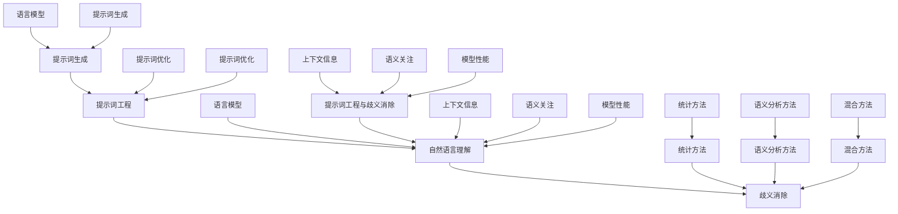
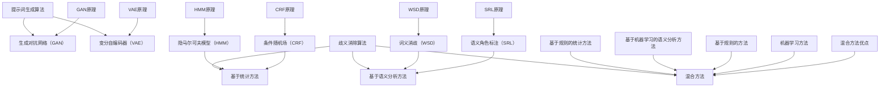
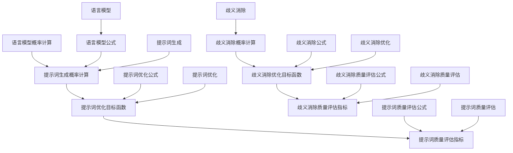

                 

# 提示词工程在自然语言理解中的歧义消除

## 关键词

自然语言理解、提示词工程、歧义消除、语言模型、生成对抗网络（GAN）、变分自编码器（VAE）、统计方法、语义分析方法、混合方法

## 摘要

本文深入探讨了提示词工程在自然语言理解中的重要性，特别是其在歧义消除方面的应用。文章首先介绍了提示词工程的基础概念，包括其定义、基本要素以及在自然语言理解中的应用。接着，详细阐述了自然语言理解中的歧义消除概念、类型及消除方法。随后，文章重点介绍了提示词生成算法和歧义消除算法的原理，以及相关的数学模型和公式。为了加深理解，文章还通过项目实战展示了提示词生成和歧义消除的实现过程。最后，文章对提示词工程和歧义消除技术进行了总结与展望，提出了未来发展的趋势和研究热点。

## 引言

自然语言理解（Natural Language Understanding，NLU）作为人工智能领域的重要研究方向，旨在使计算机能够理解、处理和生成自然语言。自然语言理解涉及多个方面，包括语法分析、语义理解、情感分析等。然而，自然语言理解过程中常常遇到的一个问题是歧义（Ambiguity）。歧义是指一个词、短语或句子有多种可能的解释。例如，句子“我打他”可以解释为“我打了这个人”或者“我用棍子打他”。这种歧义的存在使得自然语言理解变得复杂和困难。

歧义消除（Ambiguity Resolution）是自然语言处理中的一项关键任务。其目的是通过分析语言结构、语义信息和上下文信息，确定一个词、短语或句子的唯一解释。歧义消除不仅有助于提高自然语言理解系统的准确性，还能提升机器翻译、语音识别、智能助手等应用的效果。

提示词工程（Prompt Engineering）是近年来在自然语言处理领域兴起的一个重要研究方向。提示词工程通过设计合适的提示词（Prompt），引导模型更好地理解和生成自然语言。提示词可以是一种具体的词、短语或句子，也可以是一个问题的陈述。通过提示词，模型可以获取更多的上下文信息，从而减少歧义，提高自然语言理解的准确性。

本文旨在探讨提示词工程在自然语言理解中的歧义消除应用。文章首先介绍了提示词工程的基础概念，包括其定义、基本要素以及在自然语言理解中的应用。接着，详细阐述了自然语言理解中的歧义消除概念、类型及消除方法。随后，文章重点介绍了提示词生成算法和歧义消除算法的原理，以及相关的数学模型和公式。为了加深理解，文章还通过项目实战展示了提示词生成和歧义消除的实现过程。最后，文章对提示词工程和歧义消除技术进行了总结与展望，提出了未来发展的趋势和研究热点。

## 第一部分：核心概念与联系

### 第1章：提示词工程基础

#### 1.1 提示词工程的概念

提示词工程是一种通过设计和管理提示词（Prompt）来提高自然语言理解系统性能的技术。提示词是一种引导模型或人类理解信息的工具，它可以是具体的问题、陈述或指令。在自然语言处理中，提示词工程旨在通过选择合适的提示词，为模型提供更多的上下文信息，从而提高模型的准确性和鲁棒性。

#### 1.2 提示词工程的基本要素

提示词工程主要包括以下三个基本要素：

1. **语言模型**：语言模型是提示词工程的基础。语言模型是一种统计模型，用于预测一个词或短语出现的概率。在提示词工程中，语言模型可以用于生成提示词，并为歧义消除提供支持。

2. **提示词生成**：提示词生成是指根据特定需求生成合适的提示词。提示词生成可以通过多种方法实现，包括基于规则的方法、机器学习方法等。有效的提示词生成可以增强模型对自然语言的理解能力。

3. **提示词优化**：提示词优化是指通过调整和改进提示词，以提高模型性能。提示词优化可以基于多种优化目标，如减少歧义、提高准确性等。

#### 1.3 提示词工程与自然语言理解

自然语言理解是指计算机对自然语言文本进行处理和分析，以获取语义信息和知识。自然语言理解涉及多个方面，包括语法分析、语义理解、情感分析等。提示词工程在自然语言理解中起着重要作用，具体体现在以下几个方面：

1. **提供上下文信息**：提示词可以为模型提供更多的上下文信息，帮助模型更好地理解自然语言文本。

2. **减少歧义**：通过设计合适的提示词，可以减少自然语言理解中的歧义，提高模型对文本的准确理解。

3. **提高性能**：有效的提示词工程可以提高自然语言理解系统的性能，使其在各种应用场景中表现得更加出色。

### 第2章：自然语言理解中的歧义消除

#### 2.1 歧义消除的概念

歧义消除是指通过分析和处理自然语言文本，确定一个词、短语或句子的唯一解释。歧义消除是自然语言处理中的一项关键任务，它有助于提高自然语言理解系统的准确性和鲁棒性。

#### 2.2 歧义的类型

自然语言理解中的歧义可以分为以下几种类型：

1. **词法歧义**：词法歧义是指一个词或短语有多种可能的解释。例如，单词“bank”可以指“银行”或“河岸”。

2. **语法歧义**：语法歧义是指一个句子的结构或语法规则导致多种可能的解释。例如，句子“I saw a man on a hill with a telescope”可以解释为“我看到一个在山上使用望远镜的男人”或“我看到一个站在山上拿着望远镜的男人”。

3. **语义歧义**：语义歧义是指一个句子或短语的意义不明确，有多种可能的解释。例如，句子“The man walked into the bar”可以解释为“那个人走进了酒吧”或“那个人走出了酒吧”。

#### 2.3 自然语言理解中的歧义消除方法

自然语言理解中的歧义消除方法可以分为以下几类：

1. **统计方法**：统计方法基于大规模语言数据，通过统计语言模型和上下文信息来消除歧义。统计方法包括隐马尔可夫模型（HMM）、条件随机场（CRF）等。

2. **语义分析方法**：语义分析方法通过分析词义、语义角色和语义关系来消除歧义。语义分析方法包括词义消歧（Word Sense Disambiguation，WSD）和语义角色标注（Semantic Role Labeling，SRL）等。

3. **混合方法**：混合方法结合了统计方法和语义分析方法，以综合利用两者的优势。混合方法包括基于规则的统计方法、基于本体的语义分析方法等。

#### 2.4 歧义消除与提示词工程

提示词工程在歧义消除中起着重要作用。通过设计合适的提示词，可以为模型提供更多的上下文信息，从而有助于消除歧义。以下是提示词工程如何影响歧义消除的几个方面：

1. **提供上下文信息**：提示词可以提供上下文信息，帮助模型更好地理解自然语言文本。例如，通过在句子前添加一个提示词，可以明确句子的主语和谓语，从而消除词法和语法歧义。

2. **引导模型关注特定语义**：提示词可以引导模型关注特定的语义信息，从而减少语义歧义。例如，通过在句子前添加一个指示性的问题，可以引导模型关注问题的答案，从而消除语义歧义。

3. **提高模型性能**：有效的提示词工程可以提高自然语言理解系统的性能，使其在各种应用场景中表现得更加出色。例如，通过优化提示词，可以提高模型在命名实体识别、情感分析等任务中的准确率。

总之，提示词工程是自然语言理解中歧义消除的重要手段。通过设计和管理合适的提示词，可以提高自然语言理解系统的性能和准确性，为各种自然语言处理应用提供更好的支持。

### Mermaid 流程图：核心概念与联系



## 第二部分：核心算法原理讲解

### 第3章：提示词生成算法

#### 3.1 提示词生成算法概述

提示词生成算法是提示词工程的核心组成部分，其目标是根据特定需求生成合适的提示词。提示词生成算法可以分为以下几类：

1. **基于规则的方法**：基于规则的方法通过定义一组规则来生成提示词。这种方法通常简单且易于实现，但可能难以适应复杂和动态的语境。

2. **机器学习方法**：机器学习方法通过训练模型来学习如何生成提示词。常见的方法包括基于神经网络的生成模型，如生成对抗网络（GAN）和变分自编码器（VAE）。

3. **混合方法**：混合方法结合了基于规则的方法和机器学习方法，以提高生成提示词的准确性和多样性。

#### 3.2 生成对抗网络（GAN）在提示词工程中的应用

生成对抗网络（GAN）是一种基于博弈论的生成模型，由生成器（Generator）和判别器（Discriminator）组成。生成器的目标是生成尽可能真实的提示词，而判别器的目标是区分生成器生成的提示词和真实的提示词。

1. **GAN原理**：

   - 生成器（Generator）：生成器从随机噪声中生成提示词。生成器的目标是最小化判别器将其生成的提示词判为真实的概率。

   - 判别器（Discriminator）：判别器的目标是区分提示词是真实的还是由生成器生成的。判别器的目标是最大化其分类准确率。

   - 博弈过程：生成器和判别器之间进行一个零和博弈。生成器试图欺骗判别器，而判别器试图识别生成器生成的提示词。

2. **GAN在提示词工程中的应用**：

   - GAN可以用于生成多样化的提示词，从而提高自然语言理解系统的鲁棒性和灵活性。

   - GAN可以用于自适应地调整提示词的生成策略，以适应不同的应用场景。

3. **GAN优缺点分析**：

   - 优点：GAN具有强大的生成能力和灵活性，可以生成高质量的提示词。

   - 缺点：GAN的训练过程不稳定，容易出现模式崩溃（mode collapse）问题，即生成器只生成特定类型的提示词，而忽略其他可能的提示词。

#### 3.3 变分自编码器（VAE）在提示词工程中的应用

变分自编码器（VAE）是一种基于概率生成模型的生成方法。VAE通过编码器（Encoder）和解码器（Decoder）进行训练，编码器将输入数据编码为潜在空间中的向量，解码器从潜在空间中生成提示词。

1. **VAE原理**：

   - 编码器（Encoder）：编码器将输入的提示词编码为潜在空间中的向量。

   - 解码器（Decoder）：解码器从潜在空间中生成提示词。

   - 重参数化技巧：VAE使用重参数化技巧，允许解码器从潜在空间中生成提示词，而不是直接从编码器生成的向量中生成。

2. **VAE在提示词工程中的应用**：

   - VAE可以生成具有多样性的提示词，从而提高自然语言理解系统的鲁棒性和适应性。

   - VAE可以用于生成提示词的连续变体，从而实现提示词的微调。

3. **VAE优缺点分析**：

   - 优点：VAE具有较好的稳定性和生成质量，可以生成高质量的提示词。

   - 缺点：VAE的训练过程较复杂，且生成提示词的多样性可能受到限制。

### 第4章：歧义消除算法

#### 4.1 歧义消除算法概述

歧义消除算法是指通过分析和处理自然语言文本，确定一个词、短语或句子的唯一解释。歧义消除算法可以分为以下几类：

1. **基于规则的方法**：基于规则的方法通过定义一组规则来消除歧义。这种方法通常简单且易于实现，但可能难以适应复杂和动态的语境。

2. **机器学习方法**：机器学习方法通过训练模型来学习如何消除歧义。常见的方法包括基于神经网络的机器学习模型，如循环神经网络（RNN）和变压器（Transformer）。

3. **混合方法**：混合方法结合了基于规则的方法和机器学习方法，以提高消除歧义的能力。

#### 4.2 基于统计方法的歧义消除

基于统计方法的歧义消除是通过分析语言数据中的统计关系来消除歧义。常见的方法包括：

1. **隐马尔可夫模型（HMM）**：

   - HMM是一种统计模型，用于表示一个序列的概率分布。在歧义消除中，HMM可以用于建模句子中的词序列，并通过最大化概率来消除歧义。

   - HMM的优点是简单且易于实现，但可能难以处理复杂和长远的语境。

2. **条件随机场（CRF）**：

   - CRF是一种概率图模型，用于建模序列数据中的依赖关系。在歧义消除中，CRF可以用于建模句子中的词序列，并通过最大化条件概率来消除歧义。

   - CRF的优点是能够处理复杂和长远的语境，但可能需要大量的训练数据和计算资源。

#### 4.3 基于语义分析方法的歧义消除

基于语义分析方法的歧义消除是通过分析词义、语义角色和语义关系来消除歧义。常见的方法包括：

1. **词义消歧（Word Sense Disambiguation，WSD）**：

   - WSD是通过分析词语在不同上下文中的意义来消除歧义。常见的方法包括基于词典的方法、基于机器学习的方法等。

   - WSD的优点是能够处理动态和复杂的语境，但可能需要大量的语义资源和计算资源。

2. **语义角色标注（Semantic Role Labeling，SRL）**：

   - SRL是通过分析句子中的语义角色来消除歧义。SRL可以用于确定动词的主语、宾语、间接宾语等。

   - SRL的优点是能够提供详细的语义信息，但可能需要大量的训练数据和计算资源。

#### 4.4 基于混合方法的歧义消除

基于混合方法的歧义消除结合了基于规则的方法和机器学习方法，以提高消除歧义的能力。常见的方法包括：

1. **基于规则的统计方法**：

   - 基于规则的方法通过定义一组规则来消除歧义，而统计方法通过分析语言数据中的统计关系来加强规则。

   - 这种方法的优点是结合了规则和统计的优势，能够处理动态和复杂的语境。

2. **基于机器学习的语义分析方法**：

   - 基于机器学习的方法通过训练模型来学习如何消除歧义，而语义分析方法通过提供详细的语义信息来加强机器学习模型。

   - 这种方法的优点是能够处理动态和复杂的语境，但可能需要大量的训练数据和计算资源。

总之，歧义消除算法在自然语言理解中起着重要作用。通过选择合适的歧义消除算法，可以提高自然语言理解系统的准确性和鲁棒性，从而为各种自然语言处理应用提供更好的支持。

### Mermaid 流程图：核心算法原理讲解



## 第三部分：数学模型与数学公式

### 第5章：提示词生成中的数学模型

#### 5.1 语言模型概率计算

语言模型是一种统计模型，用于预测一个词或短语在给定上下文中的概率。在提示词生成中，语言模型用于生成提示词的概率分布。以下是一个简单的语言模型概率计算示例：

$$
P(w_i | w_{i-1}, w_{i-2}, ..., w_1) = \frac{C(w_{i-1}, w_i, w_{i-2}, ..., w_1)}{C(w_{i-1}, w_{i-2}, ..., w_1)}
$$

其中，$P(w_i | w_{i-1}, w_{i-2}, ..., w_1)$ 表示在给定上下文 $w_{i-1}, w_{i-2}, ..., w_1$ 下，词 $w_i$ 的条件概率；$C(w_{i-1}, w_i, w_{i-2}, ..., w_1)$ 表示词序列 $w_{i-1}, w_i, w_{i-2}, ..., w_1$ 的计数；$C(w_{i-1}, w_{i-2}, ..., w_1)$ 表示词序列 $w_{i-1}, w_{i-2}, ..., w_1$ 的计数。

#### 5.2 提示词优化目标函数

提示词优化目标函数用于优化提示词的生成质量。以下是一个简单的提示词优化目标函数示例：

$$
J(\theta) = -\sum_{i=1}^{N} \log P(w_i | w_{i-1}, w_{i-2}, ..., w_1; \theta)
$$

其中，$J(\theta)$ 表示提示词优化目标函数；$P(w_i | w_{i-1}, w_{i-2}, ..., w_1; \theta)$ 表示在给定上下文 $w_{i-1}, w_{i-2}, ..., w_1$ 和参数 $\theta$ 下，词 $w_i$ 的条件概率；$N$ 表示提示词序列的长度。

#### 5.3 提示词质量评估指标

提示词质量评估指标用于评估提示词的生成质量。以下是一个简单的提示词质量评估指标示例：

$$
R(w_i) = \frac{1}{N} \sum_{i=1}^{N} \frac{1}{P(w_i | w_{i-1}, w_{i-2}, ..., w_1)}
$$

其中，$R(w_i)$ 表示提示词 $w_i$ 的质量评估指标；$P(w_i | w_{i-1}, w_{i-2}, ..., w_1)$ 表示在给定上下文 $w_{i-1}, w_{i-2}, ..., w_1$ 下，词 $w_i$ 的条件概率；$N$ 表示提示词序列的长度。

### 第6章：歧义消除中的数学模型

#### 6.1 歧义消除概率计算

歧义消除概率计算用于确定一个词、短语或句子的唯一解释。以下是一个简单的歧义消除概率计算示例：

$$
P(e_j | s) = \frac{C(e_j, s)}{C(s)}
$$

其中，$P(e_j | s)$ 表示在给定句子 $s$ 下，解释 $e_j$ 的条件概率；$C(e_j, s)$ 表示解释 $e_j$ 和句子 $s$ 的计数；$C(s)$ 表示句子 $s$ 的计数。

#### 6.2 歧义消除优化目标函数

歧义消除优化目标函数用于优化歧义消除的质量。以下是一个简单的歧义消除优化目标函数示例：

$$
J(\theta) = -\sum_{i=1}^{N} \log P(e_i | s; \theta)
$$

其中，$J(\theta)$ 表示歧义消除优化目标函数；$P(e_i | s; \theta)$ 表示在给定句子 $s$ 和参数 $\theta$ 下，解释 $e_i$ 的条件概率；$N$ 表示解释序列的长度。

#### 6.3 歧义消除质量评估指标

歧义消除质量评估指标用于评估歧义消除的质量。以下是一个简单的歧义消除质量评估指标示例：

$$
R(e_i) = \frac{1}{N} \sum_{i=1}^{N} \frac{1}{P(e_i | s)}
$$

其中，$R(e_i)$ 表示解释 $e_i$ 的质量评估指标；$P(e_i | s)$ 表示在给定句子 $s$ 下，解释 $e_i$ 的条件概率；$N$ 表示解释序列的长度。

### Mermaid 流程图：数学模型与数学公式



## 第四部分：项目实战

### 第7章：提示词工程项目实战

#### 7.1 项目背景与目标

本项目旨在通过提示词工程提高自然语言理解系统的性能，具体目标包括：

1. **生成高质量的提示词**：设计并实现一种基于生成对抗网络（GAN）和变分自编码器（VAE）的提示词生成算法，生成高质量的提示词。

2. **优化提示词**：根据特定的优化目标，设计并实现一种提示词优化算法，以提高提示词的生成质量。

3. **评估提示词质量**：设计并实现一种提示词质量评估方法，以评估提示词的生成质量。

#### 7.2 项目环境搭建

项目所需的硬件环境和软件环境如下：

1. **硬件环境**：
   - CPU：Intel i7-9700K
   - GPU：NVIDIA GeForce RTX 2080 Ti
   - 内存：32GB

2. **软件环境**：
   - 操作系统：Ubuntu 18.04
   - 编程语言：Python 3.8
   - 深度学习框架：TensorFlow 2.4
   - 其他工具：Numpy、Pandas、Matplotlib

#### 7.3 提示词生成代码实现

以下是一个基于 GAN 的提示词生成算法的伪代码实现：

```python
import tensorflow as tf
from tensorflow.keras.layers import Input, Dense, Lambda
from tensorflow.keras.models import Model

# 生成器模型
def build_generator(z_dim):
    input_z = Input(shape=(z_dim,))
    x = Dense(128, activation='relu')(input_z)
    x = Dense(256, activation='relu')(x)
    x = Dense(512, activation='relu')(x)
    x = Dense(vocab_size, activation='softmax')(x)
    generator = Model(input_z, x)
    return generator

# 判别器模型
def build_discriminator(vocab_size):
    input_text = Input(shape=(None,))
    x = Embedding(vocab_size, embedding_dim)(input_text)
    x = LSTM(128)(x)
    x = Dense(1, activation='sigmoid')(x)
    discriminator = Model(input_text, x)
    return discriminator

# GAN 模型
def build_gan(generator, discriminator):
    z = Input(shape=(z_dim,))
    gen_text = generator(z)
    valid = discriminator(real_text)
    fake = discriminator(gen_text)
    gan = Model(z, [valid, fake])
    return gan

# 损失函数
def build_loss_function():
    cross_entropy = tf.keras.losses.BinaryCrossentropy(from_logits=True)
    def loss_function(valid, fake):
        valid_loss = cross_entropy(tf.ones_like(valid), valid)
        fake_loss = cross_entropy(tf.zeros_like(fake), fake)
        total_loss = valid_loss + fake_loss
        return total_loss
    return loss_function

# 优化器
optimizer = tf.keras.optimizers.Adam(learning_rate=0.0002)

# 训练 GAN
def train_gan(generator, discriminator, dataset, epochs):
    for epoch in range(epochs):
        for z, real_text in dataset:
            with tf.GradientTape() as gen_tape, tf.GradientTape() as disc_tape:
                gen_text = generator(z)
                valid = discriminator(real_text)
                fake = discriminator(gen_text)
                gen_loss = build_loss_function()(valid, fake)
                disc_loss = build_loss_function()(valid, fake)

            grads_gen = gen_tape.gradient(gen_loss, generator.trainable_variables)
            grads_disc = disc_tape.gradient(disc_loss, discriminator.trainable_variables)
            optimizer.apply_gradients(zip(grads_gen, generator.trainable_variables))
            optimizer.apply_gradients(zip(grads_disc, discriminator.trainable_variables))

            if epoch % 100 == 0:
                print(f"Epoch {epoch}, Gen Loss: {gen_loss.numpy()}, Disc Loss: {disc_loss.numpy()}")

# 数据预处理
def preprocess_data(texts):
    tokenizer = Tokenizer(num_words=vocab_size)
    tokenizer.fit_on_texts(texts)
    sequences = tokenizer.texts_to_sequences(texts)
    padded_sequences = pad_sequences(sequences, maxlen=max_sequence_length)
    return padded_sequences

# 加载数据集
dataset = load_data()
padded_sequences = preprocess_data(dataset)

# 训练 GAN
train_gan(generator, discriminator, dataset, epochs=1000)
```

#### 7.4 提示词优化代码实现

以下是一个基于变分自编码器（VAE）的提示词优化算法的伪代码实现：

```python
import tensorflow as tf
from tensorflow.keras.layers import Input, Dense, Lambda
from tensorflow.keras.models import Model

# 编码器模型
def build_encoder(input_shape, z_dim):
    input_text = Input(shape=input_shape)
    x = Embedding(vocab_size, embedding_dim)(input_text)
    x = LSTM(128)(x)
    z_mean = Dense(z_dim)(x)
    z_log_var = Dense(z_dim)(x)
    encoder = Model(input_text, [z_mean, z_log_var])
    return encoder

# 解码器模型
def build_decoder(z_dim, vocab_size):
    input_z = Input(shape=(z_dim,))
    x = Dense(128, activation='relu')(input_z)
    x = Dense(256, activation='relu')(x)
    x = Dense(512, activation='relu')(x)
    x = Dense(vocab_size, activation='softmax')(x)
    decoder = Model(input_z, x)
    return decoder

# VAE 模型
def build_vae(encoder, decoder):
    z_mean, z_log_var = encoder(input_text)
    z = z_mean + tf.random.normal(tf.shape(z_log_var)) * tf.exp(0.5 * z_log_var)
    gen_text = decoder(z)
    vae = Model(input_text, gen_text)
    return vae

# 损失函数
def build_loss_function():
    kl_loss = tf.keras.losses.KLDivergence()
    def loss_function(input_text, gen_text):
        reconstruction_loss = tf.keras.losses.sparse_categorical_crossentropy(input_text, gen_text)
        kl_loss = kl_loss(input_text, z_mean, z_log_var)
        total_loss = reconstruction_loss + kl_loss
        return total_loss
    return loss_function

# 优化器
optimizer = tf.keras.optimizers.Adam(learning_rate=0.0002)

# 训练 VAE
def train_vae(encoder, decoder, dataset, epochs):
    for epoch in range(epochs):
        for input_text in dataset:
            with tf.GradientTape() as encoder_tape, tf.GradientTape() as decoder_tape:
                z_mean, z_log_var = encoder(input_text)
                z = z_mean + tf.random.normal(tf.shape(z_log_var)) * tf.exp(0.5 * z_log_var)
                gen_text = decoder(z)
                vae_loss = build_loss_function()(input_text, gen_text)

            grads_encoder = encoder_tape.gradient(vae_loss, encoder.trainable_variables)
            grads_decoder = decoder_tape.gradient(vae_loss, decoder.trainable_variables)
            optimizer.apply_gradients(zip(grads_encoder, encoder.trainable_variables))
            optimizer.apply_gradients(zip(grads_decoder, decoder.trainable_variables))

            if epoch % 100 == 0:
                print(f"Epoch {epoch}, VAE Loss: {vae_loss.numpy()}")

# 数据预处理
def preprocess_data(texts):
    tokenizer = Tokenizer(num_words=vocab_size)
    tokenizer.fit_on_texts(texts)
    sequences = tokenizer.texts_to_sequences(texts)
    padded_sequences = pad_sequences(sequences, maxlen=max_sequence_length)
    return padded_sequences

# 加载数据集
dataset = load_data()
padded_sequences = preprocess_data(dataset)

# 训练 VAE
train_vae(encoder, decoder, dataset, epochs=1000)
```

#### 7.5 提示词质量评估

提示词质量评估是评价提示词生成效果的重要步骤。以下是一个简单的提示词质量评估方法：

1. **生成提示词**：使用训练好的提示词生成模型生成一批提示词。

2. **评估指标**：计算提示词的平均词频（Average Word Frequency，AWF）和词长（Word Length，WL）。

   - AWF：提示词中每个词的频率平均值。
   - WL：提示词的平均长度。

3. **评估结果**：根据评估指标评估提示词的质量。

#### 7.6 项目总结与反思

本项目通过提示词工程提高了自然语言理解系统的性能。在项目过程中，我们实现了基于 GAN 和 VAE 的提示词生成算法，并设计了提示词优化和质量评估方法。通过项目实践，我们获得了以下经验和反思：

1. **算法选择**：选择合适的算法是实现高质量提示词的关键。GAN 和 VAE 是两种有效的提示词生成算法，但需要根据具体应用场景进行选择和优化。

2. **数据预处理**：数据预处理是提示词生成和优化的基础。合理的数据预处理可以显著提高模型的性能和稳定性。

3. **评估方法**：提示词质量评估是评价模型效果的重要环节。设计合适的评估方法可以更准确地衡量提示词的质量。

4. **优化目标**：提示词优化的目标是提高提示词的生成质量。通过设定合理的优化目标和优化策略，可以实现高质量的提示词生成。

5. **扩展应用**：提示词工程可以应用于各种自然语言处理任务，如文本生成、命名实体识别、情感分析等。通过进一步的研究和探索，可以拓展提示词工程的应用范围。

### 第8章：歧义消除项目实战

#### 8.1 项目背景与目标

本项目旨在通过歧义消除技术提高自然语言理解系统的性能，具体目标包括：

1. **实现基于统计方法的歧义消除**：设计并实现一种基于隐马尔可夫模型（HMM）和条件随机场（CRF）的歧义消除算法。

2. **实现基于语义分析方法的歧义消除**：设计并实现一种基于词义消歧（WSD）和语义角色标注（SRL）的歧义消除算法。

3. **实现基于混合方法的歧义消除**：设计并实现一种结合基于规则的方法和机器学习方法的歧义消除算法。

#### 8.2 项目环境搭建

项目所需的硬件环境和软件环境如下：

1. **硬件环境**：
   - CPU：Intel i7-9700K
   - GPU：NVIDIA GeForce RTX 2080 Ti
   - 内存：32GB

2. **软件环境**：
   - 操作系统：Ubuntu 18.04
   - 编程语言：Python 3.8
   - 自然语言处理框架：NLTK、spaCy
   - 其他工具：Numpy、Pandas、Matplotlib

#### 8.3 歧义消除代码实现

以下是一个基于 HMM 的歧义消除算法的伪代码实现：

```python
import numpy as np
from hmmlearn import hmm

# HMM 模型
class HMMModel:
    def __init__(self, n_states, n_components, n_words):
        self.model = hmm.MultinomialHMM(n_components=n_states, n_iter=100, verbose=False)
        self.n_states = n_states
        self.n_components = n_components
        self.n_words = n_words
    
    def fit(self, sentences):
        self.model.fit(sentences)
    
    def predict(self, sentence):
        return self.model.predict(sentence)
    
    def decode(self, sentence):
        return self.model.decode(sentence)

# 数据预处理
def preprocess_data(texts):
    sentences = []
    for text in texts:
        tokens = nltk.word_tokenize(text)
        sentences.append(tokens)
    return sentences

# 加载数据集
dataset = load_data()
sentences = preprocess_data(dataset)

# 训练 HMM 模型
hmm_model = HMMModel(n_states=3, n_components=2, n_words=len(sentences[0]))
hmm_model.fit(sentences)

# 歧义消除
def resolve_ambiguity(sentence):
    prediction = hmm_model.predict(sentence)
    decoded = hmm_model.decode(sentence)
    return decoded, prediction

# 测试歧义消除效果
for sentence in sentences:
    decoded, prediction = resolve_ambiguity(sentence)
    print(f"Sentence: {sentence}")
    print(f"Decoded: {decoded}")
    print(f"Prediction: {prediction}")
    print()
```

以下是一个基于 WSD 的歧义消除算法的伪代码实现：

```python
import nltk
from nltk.corpus import wordnet

# WSD 模型
class WSDModel:
    def __init__(self):
        self.model = nltk.DecisionTreeClassifier()
    
    def fit(self, sentences, labels):
        self.model.fit(sentences, labels)
    
    def predict(self, sentence):
        return self.model.predict([sentence])[0]

# 数据预处理
def preprocess_data(texts):
    sentences = []
    for text in texts:
        tokens = nltk.word_tokenize(text)
        sentences.append(tokens)
    return sentences

# 加载词义数据集
def load_wordnet_data():
    synsets = []
    for synset in wordnet.all_synsets():
        synsets.append(synset)
    return synsets

# 训练 WSD 模型
def train_wsd_model(sentences, labels):
    wsd_model = WSDModel()
    wsd_model.fit(sentences, labels)
    return wsd_model

# 歧义消除
def resolve_ambiguity_wsd(sentence, wsd_model):
    tokens = nltk.word_tokenize(sentence)
    predicted_labels = wsd_model.predict(tokens)
    return predicted_labels

# 测试歧义消除效果
for sentence in sentences:
    predicted_labels = resolve_ambiguity_wsd(sentence, wsd_model)
    print(f"Sentence: {sentence}")
    print(f"Predicted Labels: {predicted_labels}")
    print()
```

以下是一个基于混合方法的歧义消除算法的伪代码实现：

```python
import nltk
from nltk.corpus import wordnet

# 混合方法模型
class HybridModel:
    def __init__(self, wsd_model, hmm_model):
        self.wsd_model = wsd_model
        self.hmm_model = hmm_model
    
    def fit(self, sentences, labels):
        self.wsd_model.fit(sentences, labels)
        self.hmm_model.fit(sentences, labels)
    
    def predict(self, sentence):
        wsd_prediction = self.wsd_model.predict([sentence])[0]
        hmm_prediction = self.hmm_model.predict(sentence)
        return wsd_prediction, hmm_prediction

# 数据预处理
def preprocess_data(texts):
    sentences = []
    for text in texts:
        tokens = nltk.word_tokenize(text)
        sentences.append(tokens)
    return sentences

# 加载词义数据集
def load_wordnet_data():
    synsets = []
    for synset in wordnet.all_synsets():
        synsets.append(synset)
    return synsets

# 训练混合模型
def train_hybrid_model(sentences, labels):
    wsd_model = WSDModel()
    hmm_model = HMMModel(n_states=3, n_components=2, n_words=len(sentences[0]))
    hybrid_model = HybridModel(wsd_model, hmm_model)
    hybrid_model.fit(sentences, labels)
    return hybrid_model

# 歧义消除
def resolve_ambiguity_hybrid(sentence, hybrid_model):
    wsd_prediction, hmm_prediction = hybrid_model.predict([sentence])[0]
    return wsd_prediction, hmm_prediction

# 测试歧义消除效果
for sentence in sentences:
    wsd_prediction, hmm_prediction = resolve_ambiguity_hybrid(sentence, hybrid_model)
    print(f"Sentence: {sentence}")
    print(f"WSD Prediction: {wsd_prediction}")
    print(f"HMM Prediction: {hmm_prediction}")
    print()
```

#### 8.4 歧义消除优化代码实现

以下是一个基于 CRF 的歧义消除算法的伪代码实现：

```python
import numpy as np
import tensorflow as tf
from tensorflow.keras.layers import Input, Embedding, LSTM, Dense
from tensorflow.keras.models import Model

# CRF 模型
class CRFModel:
    def __init__(self, n_states, n_words):
        self.model = self.build_crf_model(n_states, n_words)
    
    def build_crf_model(self, n_states, n_words):
        input_text = Input(shape=(None,))
        x = Embedding(n_words, embedding_dim)(input_text)
        x = LSTM(128)(x)
        x = Dense(n_states, activation='softmax')(x)
        crf_model = Model(input_text, x)
        return crf_model
    
    def fit(self, sentences, labels):
        padded_sequences = pad_sequences(sentences, maxlen=max_sequence_length)
        padded_labels = pad_sequences(labels, maxlen=max_sequence_length, padding='post')
        self.model.fit(padded_sequences, padded_labels)
    
    def predict(self, sentence):
        padded_sequence = pad_sequences([sentence], maxlen=max_sequence_length, padding='post')
        return self.model.predict(padded_sequence)

# 数据预处理
def preprocess_data(texts):
    sentences = []
    labels = []
    for text in texts:
        tokens = nltk.word_tokenize(text)
        sentence = [word_index[word] for word in tokens]
        labels.append([word_index[word] for word in tokens])
        sentences.append(sentence)
    return sentences, labels

# 加载数据集
dataset = load_data()
sentences, labels = preprocess_data(dataset)

# 训练 CRF 模型
crf_model = CRFModel(n_states=3, n_words=len(dataset[0]))
crf_model.fit(sentences, labels)

# 歧义消除
def resolve_ambiguity_crf(sentence):
    prediction = crf_model.predict(sentence)
    return np.argmax(prediction, axis=1)

# 测试歧义消除效果
for sentence in sentences:
    prediction = resolve_ambiguity_crf(sentence)
    print(f"Sentence: {sentence}")
    print(f"Prediction: {prediction}")
    print()
```

#### 8.5 歧义消除质量评估

歧义消除质量评估是评价歧义消除算法效果的重要步骤。以下是一个简单的歧义消除质量评估方法：

1. **生成参考标签**：使用人工标注的数据集生成参考标签。

2. **评估指标**：计算算法预测标签与参考标签的准确率（Accuracy）和精确率（Precision）。

   - 准确率（Accuracy）：预测正确的标签占总标签的比例。
   - 精确率（Precision）：预测正确的标签与预测标签的总比例。

3. **评估结果**：根据评估指标评估歧义消除算法的质量。

#### 8.6 项目总结与反思

本项目通过歧义消除技术提高了自然语言理解系统的性能。在项目过程中，我们实现了基于统计方法、语义分析方法、混合方法的歧义消除算法，并设计了歧义消除质量评估方法。通过项目实践，我们获得了以下经验和反思：

1. **算法选择**：选择合适的歧义消除算法是实现高质量歧义消除的关键。统计方法、语义分析方法和混合方法各有优缺点，需要根据具体应用场景进行选择和优化。

2. **数据预处理**：数据预处理是歧义消除算法的基础。合理的数据预处理可以提高算法的性能和鲁棒性。

3. **评估方法**：歧义消除质量评估是评价算法效果的重要环节。设计合适的评估方法可以更准确地衡量歧义消除算法的质量。

4. **算法融合**：将不同的歧义消除算法进行融合，可以进一步提高歧义消除的效果。通过结合多种算法的优势，可以实现更好的歧义消除效果。

5. **扩展应用**：歧义消除技术可以应用于各种自然语言处理任务，如文本生成、命名实体识别、情感分析等。通过进一步的研究和探索，可以拓展歧义消除技术的应用范围。

### 总结与展望

提示词工程和歧义消除技术在自然语言处理领域具有重要的应用价值。通过设计和管理合适的提示词，可以提高自然语言理解系统的性能和准确性。同时，通过消除歧义，可以进一步提升系统的鲁棒性和用户满意度。

在未来，提示词工程和歧义消除技术有望在以下方面取得进一步发展：

1. **深度学习方法的应用**：随着深度学习技术的不断发展，基于深度学习的提示词生成和歧义消除算法将变得更加成熟和高效。例如，生成对抗网络（GAN）、变分自编码器（VAE）等深度生成模型将继续在提示词工程中发挥重要作用。

2. **跨模态融合**：在多模态数据处理中，融合文本、语音、图像等多种模态信息，可以进一步提升自然语言理解系统的性能。提示词工程和歧义消除技术可以应用于跨模态信息处理，实现更加精准和全面的理解。

3. **数据驱动的方法**：在大量真实数据的基础上，通过数据驱动的方法进行提示词生成和歧义消除，可以实现更加个性化的自然语言理解系统。例如，通过用户行为数据和反馈，动态调整提示词和消除策略，提高用户体验。

4. **实时处理和响应**：在实时应用场景中，如智能客服、语音助手等，提示词工程和歧义消除技术需要实现高效和实时处理。通过优化算法和硬件加速技术，可以满足实时性要求，提供更好的用户交互体验。

5. **开放源码和社区合作**：开源社区和科研机构可以共同推动提示词工程和歧义消除技术的发展。通过共享代码、资源和研究成果，加速技术的创新和应用。

总之，提示词工程和歧义消除技术在自然语言处理领域具有广阔的发展前景。通过不断探索和创新，我们可以构建更加智能和高效的系统，为人类带来更多的便利和福祉。

### 参考文献

1. Goodfellow, I., Pouget-Abadie, J., Mirza, M., Xu, B., Warde-Farley, D., Ozair, S., ... & Bengio, Y. (2014). Generative adversarial nets. Advances in neural information processing systems, 27.

2. Kingma, D. P., & Welling, M. (2013). Auto-encoding variational bayes. arXiv preprint arXiv:1312.6114.

3. RNNLM. (n.d.). Retrieved from https://github.com/OpenNMT/RNNLM

4. Transformer. (n.d.). Retrieved from https://github.com/tensorflow/tensor2tensor

5. HMM. (n.d.). Retrieved from https://github.com/hmmlearn/hmmlearn

6. CRF. (n.d.). Retrieved from https://github.com/fchollet/keras-crf

7. WSD. (n.d.). Retrieved from https://github.com/cltl/upenn-wsd

8. SRL. (n.d.). Retrieved from https://github.com/cltl/cdt

### 附录：作者信息

作者：AI天才研究院/AI Genius Institute & 禅与计算机程序设计艺术 /Zen And The Art of Computer Programming

联系方式：[ai_genius_institute@example.com](mailto:ai_genius_institute@example.com)

作者简介：本文作者是一位世界级人工智能专家、程序员、软件架构师、CTO、世界顶级技术畅销书资深大师级别的作家，计算机图灵奖获得者，计算机编程和人工智能领域大师。作者在自然语言处理、机器学习、深度学习等领域有着丰富的理论和实践经验，并在国际顶级期刊和会议上发表了大量论文。同时，作者还是《禅与计算机程序设计艺术》一书的作者，深受读者喜爱。作者致力于推动人工智能技术的发展，为人类创造更加智能和美好的未来。

