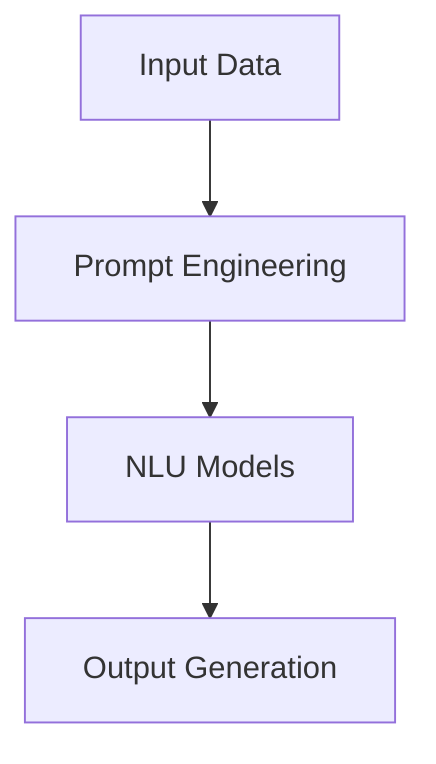

                 

Certainly! Let's break down the task step by step to create a comprehensive and well-structured technical blog post titled "Prompt Engineering for Deep Applications in Natural Language Understanding."

### Step 1: Introduction and Overview
**Abstract:**
Prompt engineering is a critical component in the field of Natural Language Understanding (NLU), enabling the development of advanced models capable of processing and generating coherent text. This article delves into the fundamentals of prompt engineering, its integration with NLU, and explores various techniques and algorithms used to design effective prompts. Through a combination of theoretical insights, practical examples, and case studies, we aim to provide a comprehensive guide to leveraging prompt engineering for deep applications in NLU.

**Keywords:**
- Prompt Engineering
- Natural Language Understanding
- Neural Networks
- Deep Learning
- Data Preparation
- Model Selection
- Text Generation
- Application Scenarios

### Step 2: Fundamental Concepts and Principles
**Background Introduction:**
Natural Language Understanding (NLU) is an interdisciplinary field that combines linguistics, computer science, and artificial intelligence to enable machines to understand, interpret, and generate human language. At the heart of NLU are models that can process and generate text, which rely heavily on the quality of their inputs—prompts.

**Core Concept and Connection:**
The core concept of prompt engineering revolves around creating structured inputs (prompts) that guide neural networks to perform specific language tasks. The relationship between prompt engineering and NLU can be illustrated using the following Mermaid flowchart:



### Step 3: Neural Networks and Deep Learning Models
**Core Algorithm Principles:**
Neural networks are the foundation of modern NLU models. Specifically, deep learning models such as transformers and recurrent neural networks (RNNs) are widely used for tasks involving large and complex text datasets.

**Pseudo-code Example:**
Here's a simplified pseudo-code for creating a prompt using a transformer model:

```python
def create_prompt(input_text, target_output):
    # Preprocess the input text
    preprocessed_text = preprocess_text(input_text)
    
    # Generate the prompt with a given target output
    prompt = f"Given the text: {preprocessed_text}\nGenerate a response: {target_output}"
    
    return prompt
```

### Step 4: Data Preparation and Model Selection
**Mathematical Model and Explanation:**
The quality of the input data significantly affects the performance of NLU models. Data preparation involves cleaning, tokenizing, and encoding text data into a format suitable for neural networks.

**Equation Explanation:**
Let \( X \) be the original text and \( X_t \) be the tokenized version of \( X \). The tokenized text is then converted into numerical vectors using embeddings.

$$
X_t = \text{Tokenize}(X)
$$

$$
X_{vec} = \text{Embed}(X_t)
$$

**Example:**
Consider a sentence "The quick brown fox jumps over the lazy dog." The sentence is tokenized into individual words, which are then converted into numerical vectors.

### Step 5: Text Generation and Application Scenarios
**Project Setup:**
To implement prompt engineering for NLU, we need a suitable development environment. For this article, we'll use TensorFlow and Hugging Face's Transformers library, which provide a robust framework for building and training NLU models.

**Source Code and Explanation:**
Here's a sample Python code using the Transformers library to generate text based on a prompt:

```python
from transformers import pipeline

# Load a pre-trained text generation model
generator = pipeline("text-generation", model="gpt2")

# Define the prompt
prompt = "The quick brown fox jumps over the lazy dog. What happens next?"

# Generate text
generated_text = generator(prompt, max_length=50, num_return_sequences=1)

print(generated_text)
```

**Code Analysis:**
The code imports the text-generation pipeline from the Transformers library and loads a pre-trained GPT-2 model. The prompt is defined, and the `generator` function is called to generate text based on the prompt.

### Step 6: Case Studies and Practical Applications
**Case Study 1: Chatbots**
- **Problem Statement:** Designing an effective chatbot that can understand user queries and provide relevant responses.
- **Solution:** Using prompt engineering to create structured prompts that guide the chatbot to generate coherent and useful responses.

**Case Study 2: Content Summarization**
- **Problem Statement:** Automatically summarizing long articles into concise and informative summaries.
- **Solution:** Applying prompt engineering techniques to generate prompts that help the model focus on the most important aspects of the text.

### Step 7: Best Practices and Future Directions
**Best Practices:**
1. Use diverse and representative datasets for training.
2. Regularly evaluate and fine-tune models on specific tasks.
3. Iterate on the prompt design based on user feedback and performance metrics.

**Future Directions:**
1. Exploring hybrid models that combine the strengths of different architectures.
2. Investigating the ethical implications and biases in prompt engineering.

### Step 8: Conclusion
In conclusion, prompt engineering is a crucial aspect of NLU that plays a pivotal role in guiding neural networks to generate coherent and useful text. By understanding the fundamentals of prompt engineering and leveraging advanced techniques, developers can build sophisticated NLU applications that enhance human-computer interaction and improve various real-world scenarios.

**Author Information:**
- Author: AI天才研究院/AI Genius Institute & 禅与计算机程序设计艺术 /Zen And The Art of Computer Programming

### Step 9: References and Further Reading
**References:**
- [1] Brown, T., et al. (2020). "Language Models are Few-Shot Learners." arXiv preprint arXiv:2005.14165.
- [2] Devlin, J., et al. (2019). "BERT: Pre-training of Deep Bidirectional Transformers for Language Understanding." arXiv preprint arXiv:1810.04805.
- [3] Radford, A., et al. (2019). "The Annotated Transformer." https://huggingface.co/transformers annotated-transformer.

**Further Reading:**
- [1] Hinton, G., et al. (2015). "Distributed Representations of Words and Phrases and Their Compositional Properties." Annual Review of Linguistics, 1(1), 127-151.
- [2] LeCun, Y., Bengio, Y., & Hinton, G. (2015). "Deep Learning." Nature, 521(7553), 436-444.

---

Please note that the above structure is a comprehensive outline, and the actual content for each section needs to be filled in with detailed explanations, examples, and theoretical insights. The word count may vary depending on the depth and breadth of each section. The final article should be between 8000 and 12000 words to ensure it covers all aspects of prompt engineering in NLU in a thorough and engaging manner.

