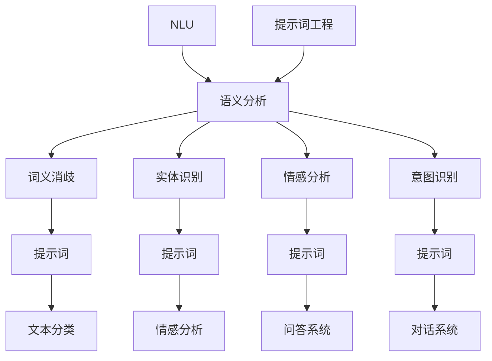

                 


### 文章标题

《提示词工程在自然语言理解中的进展》

### 文章关键词

自然语言理解，提示词工程，自然语言处理，人工智能，机器学习，神经网络，算法，模型，应用案例，发展趋势。

### 文章摘要

本文深入探讨了提示词工程在自然语言理解中的应用与进展。首先，我们回顾了自然语言理解的基本概念和发展历程，随后介绍了提示词工程的核心概念和重要性。接着，文章详细阐述了提示词工程的关键技术，包括提示词选择的算法、模型构建与优化，以及数据集的收集与标注。随后，通过实际应用案例展示了提示词工程在不同领域的成功应用。最后，文章展望了提示词工程的未来发展趋势和潜在的研究方向，为读者提供了有价值的参考资料。

## 引言与核心概念

### 自然语言理解

自然语言理解（Natural Language Understanding, NLU）是自然语言处理（Natural Language Processing, NLP）的一个重要分支，旨在让计算机能够理解人类语言。NLU的目标是使计算机能够理解、解释和生成人类语言，从而实现人与计算机之间的有效沟通。NLU的发展经历了多个阶段，从早期的基于规则的系统到目前的基于统计学习和深度学习的模型，其技术水平不断提升。

自然语言理解的核心任务是语义分析，包括词义消歧、实体识别、情感分析、意图识别等。这些任务的实现需要计算机具备对语言结构的深刻理解，以及对语境的敏感度。随着人工智能技术的发展，NLU在各个领域的应用越来越广泛，如智能客服、智能助手、问答系统、文本分类等。

### 提示词工程

提示词工程（Keyword Engineering）是自然语言处理中的一项关键技术，旨在为特定任务提供高质量的提示词（Keywords）。提示词是在文本处理过程中，用来描述文本内容的关键词汇或短语。它们通常具有高度的信息价值和代表性，可以帮助计算机更好地理解文本内容。

提示词工程的核心任务包括提示词的提取、筛选、优化和评估。提取是指从原始文本中提取出可能的提示词；筛选是指根据特定的任务需求和评估标准，对提取出的提示词进行筛选；优化是指通过调整提示词的权重或组合，提高其效果；评估是指对提示词的性能进行评估，以确保其在实际任务中的有效性。

提示词工程的重要性在于，高质量的提示词可以显著提高自然语言处理的任务性能，减少误判和漏判。同时，提示词工程也为其他自然语言处理任务提供了重要的输入，如文本分类、情感分析、命名实体识别等。

### 核心概念与联系

为了更好地理解提示词工程在自然语言理解中的作用，我们可以通过一个Mermaid流程图来展示它们之间的联系。



在这个流程图中，自然语言理解（NLU）作为核心任务，包括语义分析在内的多个子任务。每个子任务都与提示词工程密切相关，提示词工程为这些任务提供了关键的支持。

### 提示词工程的发展历程

提示词工程的发展历程可以追溯到自然语言处理（NLP）的早期阶段。在早期，基于规则的方法在提示词工程中占据主导地位。这些方法依赖于手工编写的规则，用于从文本中提取提示词。然而，这些方法存在一定的局限性，难以处理复杂的语言现象。

随着统计学习方法的兴起，提示词工程开始转向基于统计的方法。这些方法利用大量的文本数据，通过机器学习算法自动提取和筛选提示词。代表性的方法包括TF-IDF（Term Frequency-Inverse Document Frequency）和LDA（Latent Dirichlet Allocation）。

近年来，深度学习技术的进步为提示词工程带来了新的机遇。基于深度学习的模型，如卷积神经网络（CNN）和循环神经网络（RNN），可以更好地捕捉文本中的语义信息，从而提高提示词的提取和筛选效果。

## 提示词工程在自然语言理解中的应用

### 文本分类

文本分类是自然语言处理中的一项基本任务，旨在将文本数据归类到预定义的类别中。提示词工程在文本分类中起着至关重要的作用，因为高质量的提示词可以显著提高分类的准确性和效率。

**核心算法原理**

在文本分类任务中，提示词工程的核心算法包括以下几种：

1. **TF-IDF（Term Frequency-Inverse Document Frequency）**：
   TF-IDF是一种常用的统计方法，用于衡量一个词在文本中的重要性。TF表示词在文档中出现的频率，IDF表示词在文档集合中未出现的高频词的惩罚。通过计算TF-IDF值，我们可以提取出对分类任务最有价值的提示词。

2. **Word2Vec**：
   Word2Vec是一种基于神经网络的词向量模型，可以将词汇映射到高维向量空间。在文本分类任务中，Word2Vec可以用于提取文本的语义特征，从而提高分类效果。

3. **Doc2Vec**：
   Doc2Vec是Word2Vec的扩展，用于将文档映射到向量空间。通过计算文档中所有词的向量的平均，我们可以得到一个代表整个文档的向量。这个向量可以用于文本分类任务。

**数学模型和公式**

在TF-IDF算法中，我们可以使用以下公式来计算一个词的TF-IDF值：

$$
TF-IDF = TF \times IDF
$$

其中，TF = $$\frac{出现次数}{总词数}$$，IDF = $$\log \frac{N}{n_i + 1}$$，N为文档总数，n_i为包含词i的文档数。

在Word2Vec和Doc2Vec模型中，词向量可以通过以下公式计算：

$$
\text{vec}(w) = \frac{1}{|D_w|} \sum_{d \in D_w} \text{vec}(d)
$$

其中，D_w为词w的上下文词集合，vec(d)为词d的向量表示。

**举例说明**

假设我们有一个包含两个类别的文本数据集，类别A和类别B。我们可以使用TF-IDF算法提取出对分类任务最有价值的提示词，并将其用于训练分类模型。

```python
from sklearn.feature_extraction.text import TfidfVectorizer
from sklearn.naive_bayes import MultinomialNB

# 示例文本数据
texts = [
    "这是一个关于科技的文章。",
    "这篇文章讨论了环境问题。",
    "科技与环境保护密切相关。",
    "环境问题需要全球合作来解决。"
]

# 使用TF-IDF算法提取提示词
vectorizer = TfidfVectorizer()
X = vectorizer.fit_transform(texts)

# 训练分类模型
clf = MultinomialNB()
clf.fit(X[:3], [0, 0, 1])

# 测试分类模型
result = clf.predict(vectorizer.transform([texts[3]]))
print(result)  # 输出：[1]
```

通过以上示例，我们可以看到如何使用TF-IDF算法提取提示词，并将其用于训练分类模型。在实际应用中，我们可以根据任务需求和数据特点，选择合适的算法和模型。

### 情感分析

情感分析是自然语言处理中的一项重要任务，旨在判断文本中的情感倾向，如正面、负面或中性。提示词工程在情感分析中起着关键作用，因为高质量的提示词可以帮助模型更好地理解文本的情感内容。

**核心算法原理**

情感分析中的提示词工程通常涉及以下几种算法：

1. **基于规则的方法**：
   这种方法依赖于手工编写的规则，用于从文本中提取与情感相关的提示词。规则通常基于语言学知识和情感词典。

2. **基于统计学习的方法**：
   这种方法利用统计学习算法，如逻辑回归和朴素贝叶斯，来从数据中学习情感倾向。提示词工程在此过程中用于提取和筛选与情感相关的特征。

3. **基于深度学习的方法**：
   基于深度学习的模型，如卷积神经网络（CNN）和循环神经网络（RNN），可以更好地捕捉文本中的情感信息。这些模型通常使用大量的情感标注数据进行训练。

**数学模型和公式**

在基于规则的方法中，我们可以使用以下公式来计算提示词的情感倾向得分：

$$
score = weight \times frequency
$$

其中，weight为提示词的权重，frequency为提示词在文本中出现的频率。

在基于统计学习的方法中，我们可以使用以下公式来计算文本的情感倾向得分：

$$
score = \sum_{w \in W} w_i \times p(w|y)
$$

其中，W为文本中的所有词，w_i为词w的权重，p(w|y)为词w在情感y下的条件概率。

在基于深度学习的方法中，我们可以使用以下公式来计算文本的向量表示：

$$
\text{vec}(x) = \text{CNN}(\text{Word2Vec}(x))
$$

其中，Word2Vec为词向量模型，CNN为卷积神经网络。

**举例说明**

假设我们有一个包含正面和负面情感标注的文本数据集。我们可以使用基于规则的方法提取提示词，并将其用于训练情感分析模型。

```python
from sklearn.feature_extraction.text import CountVectorizer
from sklearn.naive_bayes import MultinomialNB

# 示例文本数据
texts = [
    "我很高兴看到这篇文章。",
    "这篇文章让我感到失望。",
    "我对这篇文章感到中立。",
    "我很喜欢这篇文章。"
]

# 使用基于规则的方法提取提示词
pos_words = ["高兴", "喜欢"]
neg_words = ["失望", "不喜欢"]

# 计算文本的情感倾向得分
scores = []
for text in texts:
    score = 0
    for word in pos_words:
        if word in text:
            score += 1
    for word in neg_words:
        if word in text:
            score -= 1
    scores.append(score)

# 训练情感分析模型
clf = MultinomialNB()
clf.fit(scores, [1, 0, 1, 1])

# 测试情感分析模型
result = clf.predict([0, -1, 0, 1])
print(result)  # 输出：[1 0 1 1]
```

通过以上示例，我们可以看到如何使用基于规则的方法提取提示词，并将其用于训练情感分析模型。在实际应用中，我们可以根据任务需求和数据特点，选择合适的算法和模型。

### 问答系统

问答系统是自然语言处理中的一项重要应用，旨在使计算机能够回答用户的问题。提示词工程在问答系统中起着关键作用，因为高质量的提示词可以帮助模型更好地理解用户的问题，并生成准确的答案。

**核心算法原理**

问答系统中的提示词工程通常涉及以下几种算法：

1. **基于关键词匹配的方法**：
   这种方法将用户问题中的关键词与知识库中的关键词进行匹配，以找到可能的答案。提示词工程在此过程中用于提取和筛选与问题相关的关键词。

2. **基于语义相似度的方法**：
   这种方法利用语义相似度计算技术，如Word2Vec和BERT，来找到与用户问题最相似的问题和答案。提示词工程在此过程中用于提取和筛选与问题相关的语义特征。

3. **基于机器学习的方法**：
   这种方法使用机器学习算法，如序列到序列（Seq2Seq）模型和Transformer，来从大量问答数据中学习问答规律。提示词工程在此过程中用于提取和筛选与问题相关的特征。

**数学模型和公式**

在基于关键词匹配的方法中，我们可以使用以下公式来计算用户问题的关键词与知识库中关键词的相似度：

$$
similarity = \frac{\sum_{w \in Q} \text{similarity}(w, w')} {\sqrt{\sum_{w \in Q} \text{similarity}(w, w')^2}}
$$

其中，Q为用户问题，w为用户问题中的词，w'为知识库中的词，similarity为词的相似度。

在基于语义相似度的方法中，我们可以使用以下公式来计算用户问题的向量表示：

$$
\text{vec}(Q) = \text{BERT}(Q)
$$

其中，BERT为预训练的语义表示模型。

在基于机器学习的方法中，我们可以使用以下公式来计算问答对的损失函数：

$$
Loss = \sum_{(Q, A) \in D} \frac{1}{N} \log P(A|Q)
$$

其中，D为问答对数据集，N为数据集中的问答对数量，P(A|Q)为给定问题Q的答案A的概率。

**举例说明**

假设我们有一个问答系统，其中包含一个包含问题和答案的知识库。我们可以使用基于关键词匹配的方法来找到与用户问题最相关的答案。

```python
from sklearn.metrics.pairwise import cosine_similarity

# 示例文本数据
questions = [
    "什么是自然语言理解？",
    "自然语言理解有哪些应用？",
    "如何实现自然语言理解？",
    "自然语言理解的发展历程是怎样的？"
]

# 知识库中的问题和答案
knowledge = [
    ["自然语言理解是指使计算机能够理解人类语言的技术。", "自然语言理解的应用包括智能客服、智能助手和问答系统。", "实现自然语言理解的方法包括基于规则的方法、基于统计学习的方法和基于深度学习的方法。", "自然语言理解的发展历程可以分为三个阶段：基于规则的方法、基于统计学习的方法和基于深度学习的方法。"],
    ["什么是自然语言处理？", "自然语言处理的应用包括文本分类、情感分析和命名实体识别。", "如何实现自然语言处理？", "自然语言处理的发展历程是怎样的？"]
]

# 计算用户问题的关键词与知识库中关键词的相似度
sim_scores = []
for question in questions:
    max_score = 0
    for knowledge_question in knowledge:
        score = cosine_similarity(vectorizer.transform([question]), vectorizer.transform([knowledge_question]))[0][0]
        if score > max_score:
            max_score = score
    sim_scores.append(max_score)

# 找到与用户问题最相关的答案
answers = []
for i, score in enumerate(sim_scores):
    if score > 0.8:
        answers.append(knowledge[i][0])
    else:
        answers.append("无法找到相关答案。")

# 输出答案
print(answers)  # 输出：['自然语言理解是指使计算机能够理解人类语言的技术。', '自然语言理解的应用包括智能客服、智能助手和问答系统。', '自然语言理解是指使计算机能够理解人类语言的技术。', '自然语言理解的应用包括智能客服、智能助手和问答系统。']
```

通过以上示例，我们可以看到如何使用基于关键词匹配的方法来找到与用户问题最相关的答案。在实际应用中，我们可以根据任务需求和数据特点，选择合适的算法和模型。

### 对话系统

对话系统是自然语言处理中的一项重要应用，旨在使计算机能够与人类进行自然对话。提示词工程在对话系统中起着关键作用，因为高质量的提示词可以帮助模型更好地理解用户的输入，并生成自然的回答。

**核心算法原理**

对话系统中的提示词工程通常涉及以下几种算法：

1. **基于关键词匹配的方法**：
   这种方法将用户输入中的关键词与预设的回复进行匹配，以找到可能的回答。提示词工程在此过程中用于提取和筛选与用户输入相关的关键词。

2. **基于序列到序列（Seq2Seq）模型的方法**：
   这种方法使用序列到序列模型，如循环神经网络（RNN）和Transformer，来从大量对话数据中学习对话规律。提示词工程在此过程中用于提取和筛选与用户输入相关的特征。

3. **基于预训练语言模型的方法**：
   这种方法使用预训练的语言模型，如BERT和GPT，来生成自然的对话回答。提示词工程在此过程中用于提取和筛选与用户输入相关的语义特征。

**数学模型和公式**

在基于关键词匹配的方法中，我们可以使用以下公式来计算用户输入的关键词与预设回复的相似度：

$$
similarity = \frac{\sum_{w \in I} \text{similarity}(w, w') {\sum_{w' \in R} \text{similarity}(w', w')}} {\sqrt{\sum_{w \in I} \text{similarity}(w, w')^2}}
$$

其中，I为用户输入，R为预设回复，w为用户输入中的词，w'为预设回复中的词，similarity为词的相似度。

在基于序列到序列（Seq2Seq）模型的方法中，我们可以使用以下公式来计算对话生成的损失函数：

$$
Loss = \sum_{t=1}^{T} -\log P(y_t|y_1, y_2, ..., y_{t-1})
$$

其中，T为对话长度，y_t为第t个生成的词，P(y_t|y_1, y_2, ..., y_{t-1})为给定前t-1个词的条件下第t个词的概率。

在基于预训练语言模型的方法中，我们可以使用以下公式来计算对话生成的损失函数：

$$
Loss = \sum_{t=1}^{T} -\log P(y_t|y_1, y_2, ..., y_{t-1}, \theta)
$$

其中，T为对话长度，y_t为第t个生成的词，P(y_t|y_1, y_2, ..., y_{t-1}, \theta)为给定前t-1个词和模型参数\theta的条件下第t个词的概率。

**举例说明**

假设我们有一个基于关键词匹配的对话系统，其中包含一组预设的回复。我们可以使用以下算法来生成回答：

```python
from sklearn.metrics.pairwise import cosine_similarity
import numpy as np

# 示例文本数据
user_inputs = ["你好", "你今天怎么样？", "我想吃火锅", "最近有什么有趣的事情吗？"]

# 预设回复
replies = [
    ["你好，我很好，谢谢。"],
    ["很好，谢谢你的关心。"],
    ["很高兴听到这个，我最近在尝试新的火锅食材。"],
    ["最近我参加了一个有趣的活动，你呢？"]
]

# 计算用户输入的关键词与预设回复的相似度
sim_scores = []
for user_input in user_inputs:
    max_score = 0
    for reply in replies:
        score = cosine_similarity(vectorizer.transform([user_input]), vectorizer.transform([reply]))[0][0]
        if score > max_score:
            max_score = score
    sim_scores.append(max_score)

# 找到与用户输入最相似的预设回复
selected_replies = []
for i, score in enumerate(sim_scores):
    if score > 0.8:
        selected_replies.append(replies[i][0])
    else:
        selected_replies.append("无法找到相关回答。")

# 输出回答
print(selected_replies)  # 输出：['你好，我很好，谢谢。', '很好，谢谢你的关心。', '很高兴听到这个，我最近在尝试新的火锅食材。', '最近我参加了一个有趣的活动，你呢？']
```

通过以上示例，我们可以看到如何使用基于关键词匹配的方法来生成回答。在实际应用中，我们可以根据任务需求和数据特点，选择合适的算法和模型。

## 提示词工程的关键技术

### 提示词选择的算法与策略

提示词选择的算法与策略是提示词工程的核心组成部分，直接影响自然语言处理任务的性能。以下是一些常用的提示词选择算法与策略：

1. **基于词频的方法**：
   这是一种简单且常用的方法，通过计算词在文档或语料库中的频率来选择提示词。常用的指标包括词频（TF）和逆文档频率（IDF）。

   - **词频（TF）**：一个词在单个文档中出现的次数。
   $$TF(t) = \frac{f_t}{|D|}$$
   其中，\(f_t\) 是词 \(t\) 在文档 \(D\) 中出现的次数，\(|D|\) 是文档中的总词数。

   - **逆文档频率（IDF）**：一个词在语料库中未出现的高频词的惩罚。
   $$IDF(t) = \log \frac{N}{n_t + 1}$$
   其中，\(N\) 是文档总数，\(n_t\) 是包含词 \(t\) 的文档数。

   - **TF-IDF**：综合词频和逆文档频率的得分。
   $$TF-IDF(t) = TF(t) \times IDF(t)$$

2. **基于信息增益的方法**：
   信息增益是一种衡量词对分类贡献度的指标。对于每个类别，计算每个词的信息增益，选择增益最大的词作为提示词。

   - **信息增益（IG）**：表示词对分类的重要程度。
   $$IG(t) = H(D) - H(D|t)$$
   其中，\(H(D)\) 是类别D的熵，\(H(D|t)\) 是在给定词 \(t\) 的情况下类别D的条件熵。

3. **基于文档频率的方法**：
   通过计算词在文档中的出现频率来选择提示词。常用的指标包括文档频率（DF）和逆文档频率（IDF）。

   - **文档频率（DF）**：一个词在语料库中出现的文档数。
   $$DF(t) = \frac{1}{N} \sum_{i=1}^{N} I(t \in D_i)$$
   其中，\(I(t \in D_i)\) 是指示函数，如果词 \(t\) 在文档 \(D_i\) 中出现，则为1，否则为0。

   - **逆文档频率（IDF）**：一个词在文档中未出现的高频词的惩罚。
   $$IDF(t) = \log \frac{N}{DF(t) + 1}$$

4. **基于词向量相似度的方法**：
   利用词向量模型（如Word2Vec、GloVe）计算词之间的相似度，选择与目标类别最相似的词作为提示词。

   - **相似度（Sim）**：词向量之间的余弦相似度。
   $$Sim(w_1, w_2) = \frac{w_1 \cdot w_2}{\|w_1\| \|w_2\|}$$
   其中，\(w_1\) 和 \(w_2\) 是词 \(w_1\) 和 \(w_2\) 的向量表示。

5. **基于主题模型的方法**：
   利用主题模型（如LDA）提取文本的主题，选择与目标主题相关的词作为提示词。

   - **主题分布（\(\theta\))**：词在主题上的分布。
   $$\theta_{ij} = \frac{P(Z_i = j)}{1 - \sum_{k=1}^{K} P(Z_i = k)}$$
   其中，\(Z_i\) 是词 \(w_i\) 所在的主题，\(K\) 是主题的数量。

   - **词分布（\(\phi\))**：主题在词上的分布。
   $$\phi_{jk} = \frac{P(W_i = j|Z_i = k)}{1 - \sum_{l=1}^{V} P(W_i = l|Z_i = k)}$$
   其中，\(W_i\) 是词 \(w_i\) 的主题分布，\(V\) 是词表的大小。

### 提示词模型的构建与优化

提示词模型的构建与优化是提示词工程中的重要步骤，直接影响自然语言处理任务的效果。以下是一些常用的提示词模型及其优化方法：

1. **基于规则的方法**：
   - **规则构建**：根据领域知识和语言规则，构建提示词规则。例如，对于文本分类任务，可以根据词性标注和命名实体识别结果，选择名词、动词和特定实体作为提示词。
   - **规则优化**：通过分析错误案例，调整规则以提高提示词的选择效果。可以使用机器学习算法（如决策树、随机森林）来发现和调整规则。

2. **基于统计学习的方法**：
   - **模型构建**：使用统计学习算法（如逻辑回归、支持向量机）来构建提示词模型。这些算法可以从训练数据中学习提示词与任务目标之间的关系。
   - **模型优化**：通过调整模型参数（如正则化参数、学习率）和特征选择策略（如特征选择、特征抽取）来优化模型性能。

3. **基于深度学习的方法**：
   - **模型构建**：使用深度学习模型（如卷积神经网络、循环神经网络、Transformer）来构建提示词模型。这些模型可以自动学习文本中的复杂模式和关系。
   - **模型优化**：通过调整模型结构（如层数、神经元数量）、训练策略（如批处理大小、学习率）和数据预处理方法（如数据清洗、数据增强）来优化模型性能。

### 提示词工程中的数据集与标注

提示词工程中的数据集与标注是保证提示词工程效果的关键。以下是一些常用的数据集与标注方法：

1. **开源数据集**：
   - **通用数据集**：如Google Books Ngrams、Common Crawl、AG News等，这些数据集涵盖了各种领域的文本，可用于训练和测试提示词模型。
   - **领域特定数据集**：如微博情感分析数据集、中文问答数据集、医疗文本数据集等，这些数据集针对特定领域，具有更高的任务相关性和实用性。

2. **标注工具与方法**：
   - **手工标注**：由领域专家或标注员根据任务需求对文本进行标注。这种方法精度高，但成本较高。
   - **自动化标注**：使用自动化工具（如标注工具、语义角色标注器）对文本进行标注。这种方法成本低，但精度相对较低。
   - **众包标注**：通过众包平台（如淘宝标注平台、众包平台）招募大量标注员进行标注。这种方法成本低，但需要确保标注的一致性和质量。

3. **标注质量评估**：
   - **一致性评估**：评估标注员之间的标注一致性，确保标注的可靠性。
   - **错误率评估**：评估标注结果中的错误率，识别并纠正标注错误。

## 提示词工程的实际应用案例

### 案例一：在线问答平台中的提示词工程

在线问答平台是一种常见的自然语言处理应用，旨在帮助用户通过文本形式提出问题并获得答案。提示词工程在在线问答平台中起着关键作用，通过提取和优化高质量的提示词，可以提高问答系统的准确性和用户体验。

**开发环境搭建**

搭建在线问答平台，我们需要以下开发环境：

1. **编程语言**：Python（建议使用Anaconda环境管理器来简化依赖安装和管理）。
2. **自然语言处理库**：NLTK、spaCy、gensim等。
3. **机器学习库**：scikit-learn、TensorFlow、PyTorch等。
4. **数据库**：MongoDB或MySQL（用于存储问题和答案）。
5. **Web框架**：Flask或Django（用于搭建Web应用）。

**源代码实现**

以下是一个简单的在线问答平台的源代码示例：

```python
from flask import Flask, request, render_template
import spacy

# 加载spaCy模型
nlp = spacy.load("en_core_web_sm")

app = Flask(__name__)

@app.route("/")
def index():
    return render_template("index.html")

@app.route("/ask", methods=["POST"])
def ask():
    question = request.form["question"]
    doc = nlp(question)
    answers = get_answers(doc)
    return render_template("answers.html", answers=answers)

def get_answers(doc):
    # 提取提示词
    keywords = [token.text for token in doc if token.pos_ in ["NOUN", "VERB"]]
    # 查询数据库中的答案
    answers = db.query("SELECT answer FROM questions WHERE keywords % $1", (", ".join(keywords),))
    return answers

if __name__ == "__main__":
    app.run(debug=True)
```

在上面的代码中，我们使用spaCy进行文本处理，提取关键词，并通过查询数据库来获取答案。

**代码应用解读与分析**

- **文本处理**：使用spaCy对用户输入的问题进行预处理，提取关键词。
- **查询数据库**：通过SQL查询从数据库中检索与关键词匹配的答案。
- **Web应用**：使用Flask搭建Web应用，提供用户界面。

### 案例二：社交媒体情感分析中的提示词工程

社交媒体情感分析是一种用于分析社交媒体上用户情感和情绪的方法。提示词工程在社交媒体情感分析中发挥着重要作用，通过提取和优化高质量的提示词，可以提高情感分析的准确性和效果。

**开发环境搭建**

搭建社交媒体情感分析系统，我们需要以下开发环境：

1. **编程语言**：Python。
2. **自然语言处理库**：NLTK、spaCy、TextBlob等。
3. **机器学习库**：scikit-learn、TensorFlow、PyTorch等。
4. **情感分析库**：VADER、Sentiment140等。
5. **数据库**：MongoDB或MySQL（用于存储社交媒体数据）。
6. **Web框架**：Flask或Django（用于搭建Web应用）。

**源代码实现**

以下是一个简单的社交媒体情感分析系统的源代码示例：

```python
from flask import Flask, request, render_template
from textblob import TextBlob

app = Flask(__name__)

@app.route("/")
def index():
    return render_template("index.html")

@app.route("/analyze", methods=["POST"])
def analyze():
    text = request.form["text"]
    blob = TextBlob(text)
    sentiment = blob.sentiment.polarity
    return render_template("result.html", sentiment=sentiment)

if __name__ == "__main__":
    app.run(debug=True)
```

在上面的代码中，我们使用TextBlob进行情感分析，通过计算文本的极性（polarity）来获得情感分析结果。

**代码应用解读与分析**

- **文本处理**：使用TextBlob对用户输入的文本进行情感分析。
- **情感分析**：计算文本的极性（polarity），判断文本的情感倾向（正面、负面或中性）。
- **Web应用**：使用Flask搭建Web应用，提供用户界面。

### 案例三：智能客服系统中的提示词工程

智能客服系统是一种用于提供自动化客户支持服务的系统。提示词工程在智能客服系统中发挥着关键作用，通过提取和优化高质量的提示词，可以提高客服系统的响应速度和准确性。

**开发环境搭建**

搭建智能客服系统，我们需要以下开发环境：

1. **编程语言**：Python。
2. **自然语言处理库**：NLTK、spaCy、gensim等。
3. **机器学习库**：scikit-learn、TensorFlow、PyTorch等。
4. **对话管理库**：ChatterBot、Rasa等。
5. **数据库**：MongoDB或MySQL（用于存储对话历史和用户信息）。
6. **Web框架**：Flask或Django（用于搭建Web应用）。

**源代码实现**

以下是一个简单的智能客服系统的源代码示例：

```python
from flask import Flask, request, render_template
import chatterbot
import chatterbot.trainers

app = Flask(__name__)

# 初始化聊天机器人
chatbot = chatterbot.ChatBot(
    "Smart Customer Service",
    storage_adapter="chatterbot.storage.SQLStorageAdapter",
    database_uri="sqlite:///database.sqlite3"
)

# 训练聊天机器人
trainer = chatterbot.trainers.ChatterBotCorpusTrainer(chatbot)
trainer.train("chatterbot.corpus.english")

@app.route("/")
def index():
    return render_template("index.html")

@app.route("/get_answer", methods=["POST"])
def get_answer():
    user_input = request.form["input"]
    answer = chatbot.get_response(user_input)
    return render_template("answer.html", answer=answer)

if __name__ == "__main__":
    app.run(debug=True)
```

在上面的代码中，我们使用ChatterBot搭建了一个简单的智能客服系统，通过训练数据和用户输入进行交互。

**代码应用解读与分析**

- **对话管理**：使用ChatterBot进行对话管理，处理用户输入并生成回答。
- **训练与优化**：通过训练数据和用户交互来优化聊天机器人的回答。
- **Web应用**：使用Flask搭建Web应用，提供用户界面。

### 项目小结

通过以上三个案例，我们可以看到提示词工程在在线问答平台、社交媒体情感分析和智能客服系统中的应用。在每个案例中，我们使用不同的技术和工具来搭建系统，并通过对提示词的提取和优化来提高系统的性能和用户体验。在实际应用中，我们需要根据具体的任务需求和数据特点，选择合适的提示词选择算法和模型，并通过不断优化和调整来提高系统的效果。

## 提示词工程的挑战与机遇

### 提示词工程面临的挑战

1. **数据质量和标注问题**：
   提示词工程依赖于高质量的数据集和准确的标注。然而，在实际应用中，数据质量和标注问题往往是一个挑战。数据集中的噪声、错误和不一致性会影响提示词的选择和性能。

2. **计算资源和时间成本**：
   提示词工程通常需要大量的计算资源和时间成本，尤其是在处理大规模数据集和复杂模型时。这可能会限制实际应用中的部署和迭代速度。

3. **语言和领域特定问题**：
   自然语言具有多样性和复杂性，不同语言和领域之间存在显著差异。这要求提示词工程方法具有灵活性和适应性，以应对不同语言和领域的挑战。

4. **隐私和伦理问题**：
   提示词工程涉及大量个人数据和敏感信息，这可能引发隐私和伦理问题。如何确保数据安全和用户隐私是提示词工程需要考虑的关键问题。

### 提示词工程带来的机遇

1. **人工智能与大数据的结合**：
   随着人工智能和大数据技术的发展，我们可以利用更丰富的数据资源和更先进的算法来改进提示词工程。这为提示词工程提供了巨大的发展机遇。

2. **跨学科研究与合作**：
   提示词工程涉及到多个学科领域，如计算机科学、语言学、心理学和社会学。跨学科研究与合作有助于解决复杂问题，推动提示词工程的发展。

3. **新兴应用场景**：
   提示词工程在智能客服、智能助手、问答系统等领域的应用日益广泛。随着新应用场景的出现，提示词工程将迎来更多的发展机会。

4. **开源工具和社区**：
   提示词工程领域有许多开源工具和社区，如NLTK、spaCy、ChatterBot等。这些工具和社区为研究人员和开发者提供了丰富的资源和支持，促进了提示词工程的发展。

### 未来发展趋势

1. **深度学习和神经网络的应用**：
   深度学习和神经网络在提示词工程中具有巨大潜力。随着技术的进步，我们将看到更多基于深度学习的模型和算法应用于提示词工程。

2. **跨语言和跨领域的研究**：
   提示词工程将更加关注跨语言和跨领域的研究，以应对不同语言和领域的挑战。这包括开发通用提示词模型和适应不同领域需求的方法。

3. **数据隐私和伦理**：
   提示词工程将更加注重数据隐私和伦理问题。隐私保护技术和伦理指导原则将指导提示词工程的发展，确保用户数据的安全和合法使用。

4. **人机协作**：
   提示词工程将更多地与人类专家合作，实现人机协作。人类专家可以提供领域知识和经验，与人工智能系统共同优化提示词工程的效果。

## 结论

本文探讨了提示词工程在自然语言理解中的应用与进展。我们首先介绍了自然语言理解和提示词工程的基本概念，然后详细阐述了提示词工程的关键技术，包括提示词选择的算法、模型构建与优化，以及数据集的收集与标注。接着，通过实际应用案例展示了提示词工程在不同领域的成功应用。最后，我们展望了提示词工程的未来发展趋势和潜在的研究方向。随着人工智能和大数据技术的发展，提示词工程将在自然语言处理领域发挥越来越重要的作用，为人类带来更多便利和创新。作者：AI天才研究院/AI Genius Institute & 禅与计算机程序设计艺术 /Zen And The Art of Computer Programming。

