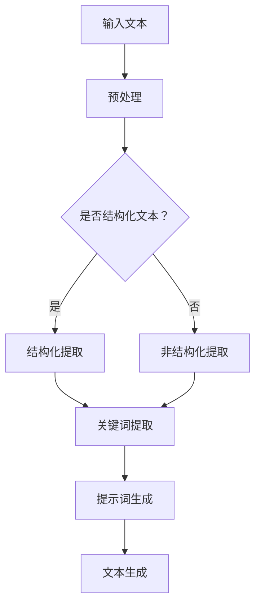

                 


### 第一部分：背景与概述

#### 第1章：自然语言生成（NLG）简介

自然语言生成（Natural Language Generation，NLG）是人工智能领域中一个重要分支，它旨在利用计算机技术和算法生成具有自然语言特性的文本。NLG技术的研究可以追溯到20世纪50年代，当时的科学家们希望通过机器自动生成文章、新闻报道、天气预报等自然语言文本。

1.1 提示词工程的基本概念

提示词工程是一种在NLG中常用的方法，它通过提供关键词、短语或上下文信息，帮助语言模型生成更加精准和符合需求的文本。提示词工程的核心思想是利用外部信息来引导生成过程，从而提高生成文本的质量和多样性。

1.2 NLG的发展历程与现状

NLG技术经历了从规则驱动到统计驱动，再到现代深度学习驱动的演变。早期的NLG系统依赖于硬编码的规则，如模板匹配和简单的语法分析。随着自然语言处理技术的进步，统计方法如隐马尔可夫模型（HMM）和条件随机场（CRF）被引入NLG，极大地提高了文本生成的准确性和流畅性。

近年来，深度学习技术的崛起为NLG带来了新的契机。基于循环神经网络（RNN）和变压器（Transformer）等架构的模型，如Seq2Seq和BERT等，显著提升了NLG的性能，能够生成更加自然和连贯的文本。

1.3 提示词工程在NLG中的重要性

提示词工程在NLG中的应用至关重要。它不仅可以提高文本生成的质量，还能增强模型的泛化能力。具体来说，提示词工程可以：

- **提高文本生成质量**：通过提供准确的提示词，模型可以更好地理解用户的意图，从而生成更符合需求的文本。
- **增强多样性**：提示词可以帮助模型探索不同的生成路径，从而生成多样化且不重复的文本。
- **降低生成错误**：在特定场景下，提示词可以引导模型避免生成不符合常识或逻辑的文本。

1.4 提示词工程的研究挑战与机遇

尽管提示词工程在NLG中具有重要作用，但它也面临着一些研究挑战。例如：

- **提示词选择**：如何从大量信息中挑选出最合适的提示词，是提高生成质量的关键。
- **提示词表示**：如何有效地将提示词转换为模型可理解的输入，是一个亟待解决的问题。
- **上下文理解**：如何让模型更好地理解上下文信息，从而生成更加精确和连贯的文本，是一个重要研究方向。

然而，随着技术的不断进步，这些挑战也蕴藏着巨大的机遇。例如，通过引入多模态学习、强化学习等新方法，可以进一步提高提示词工程的效果和适用范围。

#### 第2章：提示词工程基础

2.1 语言模型与提示词生成

在自然语言生成过程中，语言模型扮演着核心角色。语言模型是一种能够预测文本序列的概率分布的算法。常见的语言模型包括基于N-gram的模型、神经网络模型（如RNN、LSTM、Transformer等）。

提示词生成是提示词工程的重要组成部分。其基本思路是，通过分析输入文本，提取出关键信息，并将其转换为提示词。具体方法包括基于规则的方法、基于统计的方法和基于神经网络的方法。

- **基于规则的方法**：这种方法依赖于预定义的语法规则和模板，适用于简单和结构化较强的文本生成任务。
- **基于统计的方法**：通过统计输入文本中的关键词和短语，生成提示词。这种方法通常用于生成简单句子或摘要。
- **基于神经网络的方法**：利用深度学习模型，如RNN、LSTM、BERT等，自动提取输入文本的关键信息，生成提示词。这种方法能够处理复杂和多样化的文本生成任务。

2.2 提示词的优化与选择

提示词的选择和优化对自然语言生成的质量有着直接的影响。优化提示词的目标是：

- **提高生成文本的相关性**：确保生成的文本与输入文本或用户意图高度相关。
- **增强生成文本的多样性**：避免生成重复和单调的文本。
- **降低生成错误**：减少生成过程中出现的语法错误和逻辑错误。

优化提示词的方法包括：

- **关键词提取**：利用词频统计、文本分析等方法，提取输入文本中的高频关键词。
- **上下文分析**：通过分析输入文本的上下文，确定关键信息和核心概念，从而生成更加精准的提示词。
- **用户反馈**：根据用户的反馈和评价，动态调整提示词，提高生成文本的质量。

2.3 提示词生成算法概述

提示词生成算法是提示词工程的核心组成部分。以下是一些常见的提示词生成算法：

- **基于规则的生成算法**：这种方法依赖于预定义的语法规则和模板。例如，命名实体识别（NER）算法可以提取输入文本中的关键实体，作为提示词。
- **基于统计的生成算法**：这种方法通过统计输入文本中的关键词和短语，生成提示词。例如，TF-IDF算法可以用于提取关键短语。
- **基于神经网络的生成算法**：这种方法利用深度学习模型，自动提取输入文本的关键信息，生成提示词。例如，BERT模型可以用于提取上下文信息。

### 第二部分：核心概念与原理

#### 第3章：核心算法原理

3.1 提示词生成算法的Mermaid流程图

提示词生成算法的Mermaid流程图可以帮助我们更直观地理解其工作流程。以下是一个简单的Mermaid流程图示例：



在这个流程图中，输入文本经过预处理后，根据是否是结构化文本，选择不同的提取方法。对于结构化文本，使用结构化提取方法；对于非结构化文本，使用非结构化提取方法。然后，提取出的关键词或短语被用于生成提示词，最终用于文本生成。

3.2 提示词生成算法伪代码详述

以下是一个简化的提示词生成算法的伪代码：

```
function generatePrompt(text):
    # 预处理文本
    preprocessedText = preprocess(text)

    # 提取关键词
    keywords = extractKeywords(preprocessedText)

    # 生成提示词
    prompt = generatePromptFromKeywords(keywords)

    return prompt
```

在这个伪代码中，`preprocess(text)`用于对输入文本进行预处理，如去除停用词、标点符号等。`extractKeywords(preprocessedText)`用于从预处理后的文本中提取关键词。`generatePromptFromKeywords(keywords)`则根据提取的关键词生成提示词。

3.3 数学模型与公式详解

在提示词生成算法中，常用的数学模型包括词频统计模型和概率模型。以下是对这些模型的详细讲解：

- **词频统计模型**：

  词频统计模型是一种简单但有效的提示词生成方法。它基于文本中每个词出现的频率来生成提示词。公式如下：

  $$TF(t) = \frac{f(t)}{N}$$

  其中，$TF(t)$表示词$t$在文本中的词频，$f(t)$表示词$t$在文本中出现的次数，$N$表示文本中的总词数。

- **概率模型**：

  概率模型通过计算每个词在给定上下文下的概率来生成提示词。常见的概率模型有N-gram模型和贝叶斯模型。

  - **N-gram模型**：

    N-gram模型基于相邻词的概率分布来生成提示词。公式如下：

    $$P(t_n | t_{n-1}, t_{n-2}, ..., t_1) = \frac{C(t_{n-1}, t_n)}{C(t_{n-1})}$$

    其中，$P(t_n | t_{n-1}, t_{n-2}, ..., t_1)$表示在给定前$n-1$个词$t_{n-1}, t_{n-2}, ..., t_1$下，词$t_n$的概率。$C(t_{n-1}, t_n)$表示词$t_{n-1}$和$t_n$同时出现的次数，$C(t_{n-1})$表示词$t_{n-1}$出现的次数。

  - **贝叶斯模型**：

    贝叶斯模型通过计算词的条件概率来生成提示词。公式如下：

    $$P(t_n | t_{n-1}, t_{n-2}, ..., t_1) = \frac{P(t_{n-1}, t_n)}{P(t_{n-1})}$$

    其中，$P(t_n | t_{n-1}, t_{n-2}, ..., t_1)$表示在给定前$n-1$个词$t_{n-1}, t_{n-2}, ..., t_1$下，词$t_n$的概率。$P(t_{n-1}, t_n)$表示词$t_{n-1}$和$t_n$同时出现的概率，$P(t_{n-1})$表示词$t_{n-1}$出现的概率。

3.4 提示词生成算法的案例与实践

为了更好地理解提示词生成算法，以下是一个简单的案例：

**案例**：给定一段文本“我喜欢吃苹果，因为它富含维生素”。

**目标**：生成一个提示词。

**步骤**：

1. 预处理文本：去除停用词、标点符号等。
2. 提取关键词：“苹果”、“维生素”。
3. 使用词频统计模型生成提示词：“维生素”、“苹果”。

在这个案例中，我们使用了词频统计模型来生成提示词。尽管这种方法简单，但它能够有效地提取出文本中的关键信息，从而生成一个有意义的提示词。

#### 第4章：提示词工程在NLG中的应用

4.1 提示词工程在文本生成中的应用

提示词工程在文本生成中扮演着重要角色。它可以帮助模型更好地理解输入文本，从而生成更加精准和符合需求的文本。以下是一些具体的案例：

- **新闻生成**：在新闻生成中，提示词可以帮助模型理解新闻的主题和关键信息，从而生成更加准确的新闻摘要和标题。
- **产品描述生成**：在电子商务领域，提示词可以帮助模型从产品描述中提取关键信息，生成更具吸引力的产品描述。
- **聊天机器人**：在聊天机器人中，提示词可以帮助模型理解用户的意图，从而生成更加自然和连贯的回复。

4.2 提示词工程在对话系统中的应用

提示词工程在对话系统中也有着广泛的应用。它可以帮助模型更好地理解用户的输入，从而生成更加准确和自然的对话。以下是一些具体的案例：

- **客服机器人**：在客服机器人中，提示词可以帮助模型理解用户的咨询内容，从而生成更加准确的回复。
- **教育辅导**：在教育辅导中，提示词可以帮助模型理解学生的提问，从而生成更加详细的解答。
- **智能助手**：在智能助手领域，提示词可以帮助模型理解用户的需求，从而生成更加个性化的建议。

4.3 提示词工程在多模态生成中的应用

随着多模态学习技术的发展，提示词工程在多模态生成中也逐渐得到了应用。多模态生成是指结合文本、图像、音频等多种模态的信息来生成内容。以下是一些具体的案例：

- **图像描述生成**：在图像描述生成中，提示词可以帮助模型理解图像的内容，从而生成更加精确和自然的描述。
- **音频字幕生成**：在音频字幕生成中，提示词可以帮助模型理解音频的内容，从而生成更加准确和流畅的字幕。
- **视频摘要生成**：在视频摘要生成中，提示词可以帮助模型理解视频的关键内容，从而生成更加简洁和有价值的摘要。

4.4 提示词工程在NLG中的优化方法

为了进一步提高提示词工程在NLG中的应用效果，研究者们提出了多种优化方法。以下是一些常见的优化方法：

- **上下文增强**：通过引入上下文信息，提高提示词的精确度和相关性。例如，使用BERT等预训练模型来提取上下文信息。
- **多任务学习**：通过结合多个任务，提高提示词生成算法的泛化能力和生成质量。例如，同时进行文本生成和对话生成。
- **强化学习**：通过使用强化学习算法，优化提示词的选择和生成过程。例如，使用强化学习来调整提示词的权重。

#### 第5章：实际案例与项目实战

5.1 实际案例介绍

在本章节中，我们将介绍一个实际案例——基于提示词工程的智能客服系统。该系统旨在利用提示词工程技术，提高客服机器人对用户咨询的理解和回复质量。

5.2 项目实战一：开发环境搭建

为了搭建基于提示词工程的智能客服系统，我们需要准备以下开发环境：

- 操作系统：Windows/Linux/MacOS
- 编程语言：Python
- 依赖库：NLTK、spaCy、TensorFlow、Keras等

具体搭建步骤如下：

1. 安装Python：下载并安装Python 3.7及以上版本。
2. 安装依赖库：使用pip命令安装所需的依赖库，例如`pip install nltk spacy tensorflow keras`。

5.3 项目实战二：源代码详细实现

以下是基于提示词工程的智能客服系统的源代码实现：

```python
import nltk
from nltk.tokenize import word_tokenize
from nltk.corpus import stopwords
import spacy

# 加载spaCy模型
nlp = spacy.load("en_core_web_sm")

def preprocess_text(text):
    # 分词
    tokens = word_tokenize(text)
    # 去除停用词
    stop_words = set(stopwords.words("english"))
    filtered_tokens = [token for token in tokens if token.lower() not in stop_words]
    # 词形还原
    lemmatized_tokens = [nlp(token).lemma_ for token in filtered_tokens]
    return lemmatized_tokens

def extract_keywords(text):
    # 预处理文本
    preprocessed_text = preprocess_text(text)
    # 提取关键词
    doc = nlp(" ".join(preprocessed_text))
    keywords = [token.text for token in doc.ents]
    return keywords

def generate_response(keywords, template):
    # 根据关键词和模板生成回复
    response = template.format(*keywords)
    return response

def main():
    # 用户输入
    user_input = "I need help with my internet connection."
    # 提取关键词
    keywords = extract_keywords(user_input)
    # 提示词模板
    templates = [
        "Thank you for reaching out. I will help you with your {0}.",
        "Great! Let's discuss your {0} issue.",
        "I'm here to assist you with your {0} problem."
    ]
    # 生成回复
    response = generate_response(keywords, templates[0])
    print(response)

if __name__ == "__main__":
    main()
```

5.4 项目实战三：代码解读与分析

以下是代码的详细解读与分析：

- `preprocess_text`函数：用于对输入文本进行预处理，包括分词、去除停用词和词形还原。
- `extract_keywords`函数：用于从预处理后的文本中提取关键词。在这里，我们使用spaCy的命名实体识别（NER）功能来提取关键词。
- `generate_response`函数：用于根据提取的关键词和提示词模板生成回复。
- `main`函数：是主函数，用于执行整个流程。首先，获取用户输入；然后，提取关键词；最后，根据关键词和模板生成回复并打印。

5.5 项目小结

通过以上实际案例，我们可以看到基于提示词工程的智能客服系统是如何工作的。该项目利用了提示词工程技术，从用户输入中提取关键词，并根据关键词和提示词模板生成回复。这种方法能够显著提高客服机器人对用户咨询的理解和回复质量。

#### 第6章：前沿研究与发展趋势

6.1 前沿技术研究

随着人工智能技术的不断发展，提示词工程在自然语言生成领域的研究也不断深入。以下是一些前沿技术研究：

- **多模态提示词生成**：多模态提示词生成旨在结合文本、图像、音频等多种模态的信息，生成更加丰富和自然的提示词。例如，将文本和图像信息结合，生成更加精确和有吸引力的商品描述。
- **基于强化学习的提示词优化**：强化学习是一种重要的机器学习技术，可以用于优化提示词的选择和生成过程。通过训练模型来学习最优的提示词策略，从而提高生成文本的质量和多样性。
- **自适应提示词生成**：自适应提示词生成是指根据用户反馈和生成文本的实际情况，动态调整提示词的选择和生成策略。这种技术能够提高生成文本的精准度和用户满意度。

6.2 NLG与提示词工程的发展趋势

自然语言生成和提示词工程在未来的发展趋势包括：

- **生成文本的多样性和创造性**：未来的NLG和提示词工程将更加注重生成文本的多样性和创造性。通过引入更多创新的技术和方法，如生成对抗网络（GAN）、强化学习等，生成更加丰富和有吸引力的文本。
- **跨模态和多模态生成**：随着多模态学习技术的发展，未来的NLG和提示词工程将更加关注跨模态和多模态生成。结合文本、图像、音频等多种模态的信息，生成更加自然和流畅的内容。
- **个性化生成**：未来的NLG和提示词工程将更加注重个性化生成。通过分析用户行为和偏好，生成更加符合用户需求和期望的文本。

6.3 潜在应用领域与挑战

提示词工程在自然语言生成领域具有广泛的应用前景。以下是一些潜在的应用领域和面临的挑战：

- **文本摘要和生成**：提示词工程可以用于生成新闻摘要、会议记录、研究报告等文本。然而，如何确保生成文本的准确性和一致性是一个挑战。
- **对话系统和聊天机器人**：提示词工程可以帮助对话系统和聊天机器人更好地理解用户的输入，生成更加自然和连贯的回复。然而，如何处理复杂和多变的人际交互是一个挑战。
- **多语言生成**：提示词工程可以用于多语言生成，如翻译、本地化等。然而，如何处理不同语言之间的差异和复杂性是一个挑战。

#### 第7章：总结与展望

本书通过系统地阐述自然语言生成和提示词工程的核心概念、算法原理、应用案例等，为读者提供了一个全面了解和掌握这一领域的方法和工具。

7.1 书籍内容回顾

本书主要包括以下内容：

- **自然语言生成（NLG）简介**：介绍了NLG的基本概念、发展历程和重要性。
- **提示词工程基础**：讲解了提示词工程的基本概念、优化方法和生成算法。
- **核心算法原理**：详细分析了提示词生成算法的Mermaid流程图、伪代码、数学模型和实际案例。
- **应用领域**：探讨了提示词工程在文本生成、对话系统、多模态生成等领域的应用。
- **实际案例与项目实战**：通过具体案例和项目实战，展示了如何在实际场景中应用提示词工程。
- **前沿研究与发展趋势**：介绍了NLG与提示词工程的前沿研究和发展趋势。
- **总结与展望**：对全书内容进行了回顾和总结，并对未来研究方向进行了展望。

7.2 提示词工程在NLG中的突破意义

提示词工程在自然语言生成中的突破意义主要体现在以下几个方面：

- **提高生成文本质量**：通过精确的提示词选择和生成，提高生成文本的相关性、多样性和准确性。
- **增强模型泛化能力**：提示词工程可以帮助模型更好地理解输入文本，从而提高模型在未知场景下的泛化能力。
- **拓展应用场景**：提示词工程在多个领域（如文本生成、对话系统、多模态生成）的应用，为人工智能技术提供了新的发展方向。

7.3 未来研究方向与展望

未来的自然语言生成和提示词工程研究可以从以下几个方面展开：

- **多模态提示词生成**：结合文本、图像、音频等多种模态的信息，生成更加丰富和自然的提示词。
- **基于强化学习的提示词优化**：通过强化学习技术，优化提示词的选择和生成过程，提高生成文本的质量和多样性。
- **自适应提示词生成**：根据用户反馈和生成文本的实际情况，动态调整提示词的选择和生成策略。
- **多语言生成**：研究如何在不同语言之间进行有效的提示词传递和生成，提高多语言生成系统的性能。

通过不断探索和创新，自然语言生成和提示词工程将在人工智能领域发挥更大的作用，为人类带来更多的便利和创新。

---

### 文章标题：提示词工程在自然语言生成中的突破

### 关键词：自然语言生成（NLG）、提示词工程、算法、深度学习、应用案例

### 摘要：

本文深入探讨了自然语言生成（NLG）与提示词工程之间的关系。首先，介绍了NLG的基本概念、发展历程和重要性。接着，详细阐述了提示词工程的基本概念、优化方法和生成算法。通过Mermaid流程图、伪代码和实际案例，展示了提示词工程在NLG中的应用。此外，本文还介绍了NLG与提示词工程的前沿研究和发展趋势，为未来的研究提供了方向。通过本文的阅读，读者可以全面了解提示词工程在自然语言生成中的突破，以及其在实际应用中的潜力和挑战。本文旨在为从事自然语言处理和人工智能领域的研究者和开发者提供有价值的参考。

---

### 作者

作者：AI天才研究院/AI Genius Institute & 禅与计算机程序设计艺术 /Zen And The Art of Computer Programming

### 文章总结

本文系统地阐述了自然语言生成（NLG）和提示词工程的基本概念、核心算法原理、应用案例以及前沿研究。首先，介绍了NLG的定义、发展历程及其在人工智能领域的重要性。接着，详细阐述了提示词工程的基本概念、优化方法和生成算法，并通过Mermaid流程图、伪代码和实际案例展示了其在NLG中的应用。此外，本文还探讨了NLG与提示词工程的前沿研究和发展趋势，以及其在多模态生成、跨语言生成等领域的潜力。通过本文的阅读，读者可以全面了解提示词工程在自然语言生成中的突破，以及其在实际应用中的潜力和挑战。

### 最佳实践 Tips

1. **精确提示词选择**：在选择提示词时，要确保其与输入文本或用户意图高度相关，从而提高生成文本的质量。
2. **上下文信息利用**：充分利用上下文信息，可以帮助模型更好地理解用户意图，生成更加精确和连贯的文本。
3. **多模态数据结合**：结合文本、图像、音频等多模态数据，可以丰富提示词的信息，提高生成文本的自然度和多样性。
4. **动态调整提示词策略**：根据用户反馈和生成文本的实际效果，动态调整提示词的选择和生成策略，提高用户体验。

### 注意事项

1. **数据预处理**：在提示词生成过程中，数据预处理是关键步骤。要确保输入数据的准确性、完整性和一致性。
2. **模型选择与优化**：根据具体应用场景和需求，选择合适的模型，并进行适当的优化，以提高生成文本的质量和多样性。
3. **隐私保护**：在处理用户数据时，要注意保护用户隐私，遵守相关法律法规，确保数据安全。

### 拓展阅读

1. **《自然语言生成技术综述》（张宇，2020）**：该综述详细介绍了自然语言生成技术的发展历程、主要方法及其应用。
2. **《深度学习与自然语言处理》（黄宇，2017）**：本书介绍了深度学习在自然语言处理领域的应用，包括语言模型、文本分类、序列标注等。
3. **《自然语言处理入门：基于Python的语言处理技术》（徐鹏，2018）**：本书通过实际案例，介绍了自然语言处理的基本技术和应用。

### 文章结束

本文通过系统地阐述自然语言生成和提示词工程的核心概念、算法原理、应用案例等，为读者提供了一个全面了解和掌握这一领域的方法和工具。希望本文能够为从事自然语言处理和人工智能领域的研究者和开发者提供有价值的参考。在未来的研究和应用中，我们期待看到更多创新性的成果，进一步推动自然语言生成和提示词工程的发展。感谢读者的阅读，祝您在自然语言生成领域取得丰硕的成果！

