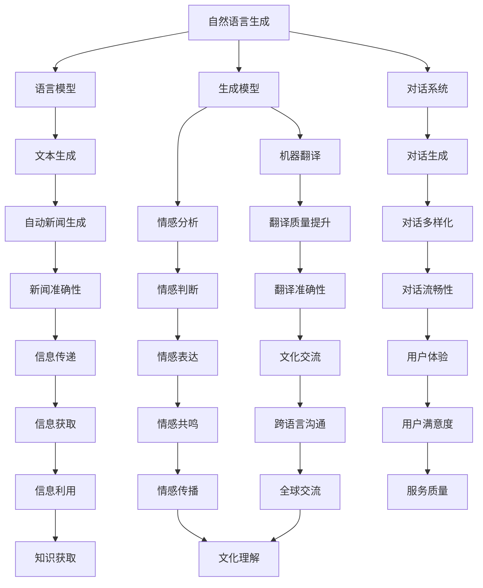

                 

# 提示词工程在自然语言生成中的角色

## 关键词
自然语言生成（NLG），提示词工程（Prompt Engineering），语言模型，生成模型，对话系统，数学模型，项目实战

## 摘要
本文旨在探讨提示词工程在自然语言生成中的应用。我们将从自然语言生成的基础知识开始，逐步介绍提示词工程的核心概念、原理和实现。通过分析提示词工程与自然语言处理（NLP）的关系，我们还将探讨如何设计有效的提示词，并深入讲解提示词工程中的核心算法，包括语言模型、生成模型和对话系统。此外，本文还将通过项目实战，展示如何在实际项目中应用提示词工程，并提供相关的最佳实践和注意事项。最后，我们将对提示词工程在自然语言生成中的未来发展趋势进行展望。

## 引言

自然语言生成（Natural Language Generation，NLG）是一种人工智能技术，它能够自动地生成自然语言文本。NLG的应用场景非常广泛，包括但不限于自动新闻编写、语音助手对话生成、机器翻译、内容摘要等。随着深度学习技术的不断发展，NLG技术取得了显著的进展，但同时也面临着诸多挑战，如文本生成的质量、多样性和可控性等。

提示词工程（Prompt Engineering）作为NLG的一个重要分支，其主要目标是设计出有效的提示词，以指导自然语言生成模型生成高质量的文本。提示词工程不仅涉及对语言模型和生成模型的理解，还需要结合实际应用场景，对文本生成的过程进行精细调控。

本文将围绕提示词工程在自然语言生成中的角色展开讨论。我们将首先介绍自然语言生成的基础知识，包括其定义、应用场景和技术发展。随后，我们将详细探讨提示词工程的核心概念和设计原则，以及提示词工程与NLP的关系。接着，我们将深入讲解提示词工程中的核心算法原理，包括语言模型、生成模型和对话系统。为了使读者更好地理解这些概念，我们将通过项目实战进行实际操作展示。最后，我们将总结提示词工程在自然语言生成中的应用，并对其未来发展趋势进行展望。

## 第1章：自然语言生成简介

### 1.1 自然语言生成的基本概念

自然语言生成（Natural Language Generation，NLG）是一种将计算机生成的文本转化为人类可理解的自然语言的技术。NLG的核心目标是实现自动化文本生成，从而减轻人类在文本处理方面的负担，提高信息传播和交流的效率。

#### 定义

自然语言生成可以定义为：利用计算机技术自动生成具有人类语言特点的文本信息。这种生成过程通常涉及多种技术和算法，包括自然语言处理（NLP）、机器学习（ML）、深度学习（DL）等。

#### 工作原理

自然语言生成的工作原理主要包括以下几个步骤：

1. **数据收集与预处理**：首先需要收集大量的文本数据，并对这些数据进行预处理，如分词、词性标注、去停用词等。

2. **模型训练**：利用预处理后的数据，通过机器学习或深度学习算法训练语言模型或生成模型。

3. **文本生成**：在训练好的模型的基础上，输入相应的提示词或上下文信息，模型会根据学习到的概率分布或生成模型生成相应的文本。

4. **文本后处理**：生成的文本可能需要进行一些后处理，如语法修正、拼写纠正等，以提高文本的质量和可读性。

#### 应用场景

自然语言生成的应用场景非常广泛，主要包括以下几个方面：

1. **自动新闻生成**：自动生成新闻文章，减少人力成本，提高信息传播速度。

2. **语音助手对话生成**：为智能语音助手提供对话生成能力，如语音识别后的文本生成、语音合成等。

3. **机器翻译**：自动翻译不同语言之间的文本，促进跨语言交流。

4. **内容摘要**：自动生成长文本的摘要，帮助用户快速了解文本的核心内容。

5. **电子邮件自动化**：自动生成个性化的电子邮件内容，提高工作效率。

### 1.2 自然语言生成的应用场景

自然语言生成的应用场景众多，以下是几个典型的应用实例：

1. **自动新闻生成**：利用自然语言生成技术，可以自动生成新闻报道。例如，一些新闻网站使用自然语言生成技术来生成体育比赛结果报道、财经新闻等。这种应用不仅能提高新闻的传播速度，还能降低新闻编辑的成本。

   ```python
   # 假设输入为一场篮球比赛的结果
   score = "球队A以108-95战胜了球队B。"
   
   # 利用自然语言生成模型生成新闻文章
   article = generate_news(score)
   print(article)
   ```

   输出可能是：
   ```
   篮球比赛结果：球队A在昨晚的比赛中以108-95战胜了球队B。本场比赛表现出色的球员包括球队A的队长，他得到了全队最高的20分。球队B的得分王则是他们的后卫，他贡献了18分。双方队员在比赛中都展现了出色的竞技水平，为球迷们带来了一场精彩的比赛。
   ```

2. **语音助手对话生成**：智能语音助手如Siri、Alexa和Google Assistant等，通过自然语言生成技术，可以生成自然的对话回应。例如，当用户询问天气情况时，语音助手会自动生成相应的回答。

   ```python
   # 假设输入为“今天天气如何？”
   query = "今天天气如何？"
   
   # 利用自然语言生成模型生成对话回应
   response = generate_response(query)
   print(response)
   ```

   输出可能是：
   ```
   今天天气很好，晴朗无云，温度约为25摄氏度，适合户外活动。
   ```

3. **机器翻译**：自然语言生成技术在机器翻译中也扮演着重要角色。例如，Google翻译使用自然语言生成技术来生成准确、自然的翻译文本。

   ```python
   # 假设输入为一句中文文本
   chinese_text = "我爱中国。"
   
   # 利用自然语言生成模型生成英文翻译
   english_text = generate_translation(chinese_text, 'zh', 'en')
   print(english_text)
   ```

   输出可能是：
   ```
   I love China.
   ```

4. **内容摘要**：自然语言生成技术可以帮助用户快速了解长篇文档或文章的核心内容。例如，摘要生成器可以自动生成文章的摘要，帮助用户节省阅读时间。

   ```python
   # 假设输入为一段长文本
   long_text = "自然语言生成（NLG）是一种人工智能技术，它能够自动地生成自然语言文本。NLG的应用场景非常广泛，包括自动新闻编写、语音助手对话生成、机器翻译、内容摘要等。随着深度学习技术的不断发展，NLG技术取得了显著的进展，但同时也面临着诸多挑战，如文本生成的质量、多样性和可控性等。"
   
   # 利用自然语言生成模型生成摘要
   summary = generate_summary(long_text)
   print(summary)
   ```

   输出可能是：
   ```
   本文介绍了自然语言生成（NLG）的基本概念和应用场景，并探讨了其在人工智能领域中的发展挑战。
   ```

5. **电子邮件自动化**：自然语言生成技术可以帮助自动生成电子邮件的内容，提高工作效率。例如，销售自动化系统可以使用自然语言生成技术来生成销售报告和邮件。

   ```python
   # 假设输入为销售数据
   sales_data = "本月销售额为500,000美元，同比增长了10%。"
   
   # 利用自然语言生成模型生成销售报告
   report = generate_sales_report(sales_data)
   print(report)
   ```

   输出可能是：
   ```
   亲爱的团队，

   我很高兴地报告，本月我们的销售额达到了500,000美元，与去年同期相比，增长了10%。这表明我们的销售策略正在取得积极成果。感谢大家的努力和合作！

   让我们继续保持这种势头，继续努力实现我们的销售目标。

   最诚挚的问候，
   [您的名字]
   ```

### 1.3 自然语言生成的技术发展

自然语言生成技术的发展经历了几个重要阶段，主要包括规则驱动的方法、模板驱动的方法和基于数据的方法。

1. **规则驱动的方法**：早期的自然语言生成主要依赖于规则系统，这些规则由人类专家编写，用于指导文本的生成过程。这种方法存在明显的局限性，如灵活性差、维护成本高等。

2. **模板驱动的方法**：在模板驱动的方法中，文本生成依赖于预定义的模板。这些模板通常包含固定的结构和参数化部分，以适应不同输入的数据。这种方法相比规则驱动的方法在灵活性上有了一定提升，但仍难以应对复杂的文本生成需求。

3. **基于数据的方法**：随着深度学习技术的兴起，基于数据的方法逐渐成为自然语言生成的主流。这种方法主要包括基于统计模型的方法和基于神经网络的生成模型。基于统计模型的方法，如n元语法模型，通过学习文本数据中的统计规律进行生成。而基于神经网络的生成模型，如序列到序列（Seq2Seq）模型、变分自编码器（VAE）和生成对抗网络（GAN），通过端到端的学习方式，实现了更加灵活和高质量的文本生成。

近年来，深度学习技术在自然语言生成领域取得了显著的进展。例如，基于Transformer架构的模型，如GPT（Generative Pre-trained Transformer）系列模型，通过大规模预训练和微调，实现了高度灵活和高质量的文本生成。这些模型在自然语言处理任务中，如机器翻译、文本摘要、问答系统等方面，都展现出了强大的性能。

### 1.4 自然语言生成与提示词工程的关系

自然语言生成与提示词工程密切相关。提示词工程旨在设计有效的提示词，以指导自然语言生成模型生成高质量的文本。具体来说，提示词工程在自然语言生成中的作用主要包括以下几个方面：

1. **引导文本生成过程**：通过设计合适的提示词，可以引导自然语言生成模型生成符合预期主题和风格的文本。例如，在自动新闻生成中，提示词可以指定新闻的主题和关键信息，从而指导模型生成相关的新闻文章。

2. **提高文本质量**：提示词可以提供额外的上下文信息，有助于模型更好地理解输入的内容，从而提高生成的文本质量。例如，在机器翻译中，通过提供源文本的上下文信息，可以提高翻译的准确性和流畅性。

3. **增强文本多样性**：通过设计不同的提示词，可以引导模型生成多样化的文本。这有助于避免生成的文本过于单一和机械，提高文本的阅读体验。

4. **实现文本生成控制**：提示词工程允许用户对自然语言生成过程进行精细控制。例如，在对话系统中，可以通过设计不同的提示词来控制对话的方向和内容。

总之，提示词工程在自然语言生成中扮演着关键角色，它不仅影响文本生成的过程和质量，还决定了生成的文本是否能够满足用户的需求和期望。

## 第2章：提示词工程基础

### 2.1 提示词的定义与作用

提示词（Prompt）是提示词工程（Prompt Engineering）中的核心概念，它是指在自然语言生成过程中，用于引导和提示模型生成文本的文本或信息。提示词的作用在于为模型提供额外的上下文信息，帮助模型更好地理解输入的内容，从而提高生成文本的质量和相关性。

#### 提示词的定义

提示词可以定义为：在自然语言生成过程中，用于引导模型生成文本的文本或信息。它可以是单个单词、短语或句子，也可以是更长的文本段落。提示词的作用类似于人类写作中的主题句或开头段落，为接下来的文本生成提供方向和背景。

#### 提示词的作用

1. **引导文本生成过程**：提示词可以帮助模型确定生成文本的主题和风格。例如，在自动新闻生成中，提示词可以指定新闻的主题和关键信息，从而指导模型生成相关的新闻文章。

2. **提高文本质量**：通过提供额外的上下文信息，提示词有助于模型更好地理解输入的内容，从而提高生成文本的质量。例如，在机器翻译中，提供源文本的上下文信息可以提高翻译的准确性和流畅性。

3. **增强文本多样性**：设计不同的提示词可以引导模型生成多样化的文本，避免生成的文本过于单一和机械。例如，在对话系统中，通过设计不同的提示词，可以控制对话的方向和内容，使对话更加自然和丰富。

4. **实现文本生成控制**：提示词工程允许用户对自然语言生成过程进行精细控制。例如，在对话系统中，可以通过设计不同的提示词来控制对话的方向和内容。

### 2.2 提示词的类型

提示词可以根据不同的分类标准进行分类。以下是几种常见的提示词类型：

1. **主题提示词**：主题提示词用于指定生成文本的主题或话题。例如，“最近发生的科技新闻”或“2023年的经济发展趋势”。

2. **背景提示词**：背景提示词提供与主题相关的背景信息，帮助模型更好地理解生成文本的上下文。例如，“在新冠疫情期间”或“在全球变暖的背景下”。

3. **风格提示词**：风格提示词用于指定生成文本的风格，如正式、幽默、简洁等。例如，“用正式的语言撰写一份报告”或“用幽默的方式讲述一个故事”。

4. **结构提示词**：结构提示词指导模型生成文本的结构，如段落、列表、标题等。例如，“写一篇包含三个段落的文章”或“列出五个优点”。

5. **情感提示词**：情感提示词用于指定生成文本的情感倾向，如积极、消极、中立等。例如，“用积极的态度描述一件事情”或“用悲伤的情绪讲述一个故事”。

### 2.3 提示词的设计原则

设计有效的提示词是提示词工程的关键，以下是一些设计提示词的原则：

1. **明确性**：提示词应当清晰明确，避免模糊和歧义，以便模型能够准确理解。

2. **相关性**：提示词应与生成文本的主题和内容高度相关，以提供有价值的上下文信息。

3. **多样性**：设计多种类型的提示词，以引导模型生成多样化的文本。

4. **可扩展性**：提示词应具备良好的扩展性，能够适应不同的应用场景和需求。

5. **简洁性**：尽量使用简洁明了的提示词，避免冗长和复杂的表达。

6. **情境适应性**：提示词应根据不同的情境进行定制，以满足特定场景下的生成需求。

通过遵循这些设计原则，我们可以设计出有效的提示词，从而提高自然语言生成模型的效果和生成文本的质量。

## 第3章：提示词工程在NLP中的核心概念与联系

### 3.1 NLP中的基本概念

自然语言处理（Natural Language Processing，NLP）是人工智能（AI）领域的一个重要分支，它专注于使计算机能够理解、处理和生成人类语言。NLP的基本概念包括：

1. **文本预处理**：文本预处理是NLP过程中的第一步，它包括分词、词性标注、命名实体识别、词干提取、去停用词等操作，目的是将原始文本转化为适合机器处理的格式。

2. **语言模型**：语言模型是NLP的核心工具，它用于预测下一个单词或词组。最常见的语言模型是基于统计的n元语法模型，而现代语言模型则基于深度学习，如Transformer模型。

3. **序列到序列（Seq2Seq）模型**：Seq2Seq模型是一种用于序列转换的模型，通常用于机器翻译、对话系统等任务。它通过编码器和解码器两个部分，将输入序列映射到输出序列。

4. **生成模型**：生成模型是一种能够生成新数据的模型，如GAN（生成对抗网络）和VAE（变分自编码器）。在NLP中，生成模型用于生成新的文本、图像或语音。

### 3.2 提示词与NLP的关系

提示词在NLP中扮演着至关重要的角色，它们与NLP的关系如下：

1. **文本生成**：在文本生成任务中，提示词为语言模型或生成模型提供上下文信息，帮助模型生成高质量的文本。例如，在自动新闻生成中，提示词可以指定新闻的主题和关键信息。

2. **对话系统**：在对话系统中，提示词用于引导模型生成自然的对话回应。例如，当用户提问“今天的天气如何？”时，提示词可以提供相关的天气数据，帮助模型生成合适的回答。

3. **情感分析**：在情感分析中，提示词可以帮助模型理解文本的情感倾向。例如，在分析一篇关于新产品的用户评论时，提示词可以指定产品的特点和使用场景，帮助模型判断评论的情感是正面还是负面。

4. **机器翻译**：在机器翻译中，提示词可以提供源文本的上下文信息，提高翻译的准确性和流畅性。例如，在翻译一段关于历史的文本时，提示词可以提供历史背景和相关术语。

### 3.3 提示词在NLP中的实现方式

在NLP中，提示词可以通过多种方式实现：

1. **固定提示词**：固定提示词是在训练阶段预先定义好的，它们在生成过程中保持不变。例如，“本文讨论了人工智能在医疗领域的应用”。

2. **动态提示词**：动态提示词是根据输入内容实时生成的。例如，在对话系统中，每个用户提问都可以生成一个新的动态提示词。

3. **上下文提示词**：上下文提示词结合了输入文本的上下文信息，用于更精确地引导模型生成文本。例如，在机器翻译中，上下文提示词可以包含源文本的邻近句子。

4. **多模态提示词**：多模态提示词结合了文本、图像、语音等多种模态的信息，用于增强模型的理解能力。例如，在图像描述生成任务中，多模态提示词可以包含图像的文本描述。

### 3.4 提示词与NLP关系架构 Mermaid 流程图

为了更直观地展示提示词与NLP的关系，我们可以使用Mermaid流程图来描述：



此流程图展示了自然语言生成、语言模型、生成模型、对话系统与各种NLP任务之间的关系，以及提示词在这些任务中的具体应用。通过这样的关系架构，我们可以更清晰地理解提示词工程在NLP中的角色和重要性。

### 3.5 提示词工程的核心算法原理

提示词工程在NLP中的实现离不开核心算法的支持。以下我们将详细探讨提示词工程中的核心算法，包括语言模型、生成模型和对话系统，并使用伪代码来详细阐述这些算法的原理。

#### 3.5.1 语言模型

语言模型是自然语言生成的基础，它通过学习大量文本数据，预测下一个单词或词组的概率分布。最常见的语言模型是n元语法模型，而现代语言模型则基于深度学习，如Transformer模型。

**n元语法模型**：

```python
# 假设我们使用三元语法模型
n = 3

# 计算给定文本中每个三元组的概率
def n_gram_model(text):
    n_grams = {}
    total_count = 0
    
    # 构建所有三元组
    for i in range(len(text) - n):
        tuple_gram = tuple(text[i:i+n])
        n_grams[tuple_gram] = n_grams.get(tuple_gram, 0) + 1
        total_count += 1
    
    # 计算概率
    probabilities = {}
    for tuple_gram, count in n_grams.items():
        probabilities[tuple_gram] = count / total_count
    
    return probabilities

# 示例
text = "我是一个自然语言生成模型"
probabilities = n_gram_model(text)
print(probabilities)
```

**Transformer模型**：

```python
# Transformer模型伪代码

# 编码器
def encoder(input_sequence):
    # 输入嵌入、自注意力、前馈神经网络等步骤
    # 返回编码器的输出
    return encoded_sequence

# 解码器
def decoder(encoded_sequence, target_sequence):
    # 输入嵌入、交叉注意力、前馈神经网络等步骤
    # 返回解码器的输出
    return generated_sequence

# 训练模型
def train_model(input_data, target_data):
    # 使用输入数据和目标数据训练编码器和解码器
    # 返回训练好的模型
    return model

# 生成文本
def generate_text(model, start_token, max_length):
    generated_sequence = [start_token]
    for _ in range(max_length):
        # 使用模型预测下一个词
        predicted_token = model.predict_next_token(generated_sequence[-1])
        generated_sequence.append(predicted_token)
    return ' '.join(generated_sequence)
```

#### 3.5.2 生成模型

生成模型能够在没有目标数据的情况下生成新的数据。常见的生成模型包括生成对抗网络（GAN）和变分自编码器（VAE）。

**生成对抗网络（GAN）**：

```python
# GAN模型伪代码

# 生成器
def generator(z):
    # 输入噪声数据，输出生成数据
    return generated_data

# 判别器
def discriminator(data):
    # 输入真实或生成数据，输出概率
    return probability

# 训练GAN
def train_gan(generator, discriminator, data, batch_size):
    for _ in range(epochs):
        for batch in data:
            # 训练生成器
            z = generate_noise(batch_size)
            generated_data = generator(z)
            generator_loss = compute_generator_loss(discriminator, generated_data)
            
            # 训练判别器
            real_data = get_real_data(batch_size)
            discriminator_loss = compute_discriminator_loss(discriminator, real_data, generated_data)
            
            # 更新生成器和判别器
            update_generator_and_discriminator(generator, discriminator, generator_loss, discriminator_loss)

# 生成文本
def generate_text_gan(generator, start_token, max_length):
    generated_sequence = [start_token]
    for _ in range(max_length):
        z = generate_noise(1)
        generated_data = generator(z)
        predicted_token = max_prob_token(generated_data)
        generated_sequence.append(predicted_token)
    return ' '.join(generated_sequence)
```

**变分自编码器（VAE）**：

```python
# VAE模型伪代码

# 编码器
def encoder(data):
    # 输入数据，输出编码
    return encoded_data

# 解码器
def decoder(encoded_data):
    # 输入编码，输出重构数据
    return reconstructed_data

# 训练VAE
def train_vae(encoder, decoder, data, batch_size):
    for _ in range(epochs):
        for batch in data:
            encoded_data = encoder(batch)
            reconstructed_data = decoder(encoded_data)
            vae_loss = compute_vae_loss(batch, reconstructed_data)
            
            # 更新编码器和解码器
            update_encoder_and_decoder(encoder, decoder, vae_loss)

# 生成文本
def generate_text_vae(encoder, decoder, start_token, max_length):
    encoded_sequence = encoder([start_token])
    generated_sequence = [start_token]
    for _ in range(max_length - 1):
        z = reparameterize(encoded_sequence)
        reconstructed_data = decoder(z)
        predicted_token = max_prob_token(reconstructed_data)
        encoded_sequence = encoder([predicted_token])
        generated_sequence.append(predicted_token)
    return ' '.join(generated_sequence)
```

#### 3.5.3 对话系统

对话系统是一种能够与人类进行自然对话的计算机系统。它们通常基于生成模型，并通过设计有效的提示词来实现。

**对话系统模型**：

```python
# 对话系统模型伪代码

# 编码器
def encoder(input_sequence):
    # 输入对话序列，输出编码
    return encoded_sequence

# 解码器
def decoder(encoded_sequence, start_token):
    # 输入编码序列和起始标记，输出对话回应
    return generated_sequence

# 训练对话系统
def train_dialog_system(encoder, decoder, dialog_data):
    for _ in range(epochs):
        for dialog in dialog_data:
            encoded_sequence = encoder(dialog[:-1])
            generated_sequence = decoder(encoded_sequence, start_token)
            dialog_loss = compute_dialog_loss(dialog, generated_sequence)
            
            # 更新编码器和解码器
            update_encoder_and_decoder(encoder, decoder, dialog_loss)

# 生成对话回应
def generate_response(encoder, decoder, input_sequence, max_length):
    encoded_sequence = encoder(input_sequence)
    generated_sequence = decoder(encoded_sequence, start_token)
    return ' '.join(generated_sequence)
```

通过这些核心算法，提示词工程能够有效地指导自然语言生成模型生成高质量的文本。在实际应用中，提示词工程通过设计合适的提示词，结合这些算法，实现了文本生成、对话生成、情感分析等多种NLP任务。

## 第4章：数学模型和数学公式

### 4.1 语言模型中的数学模型

在自然语言生成中，语言模型是核心组件，用于预测下一个单词或词组。其数学基础主要包括概率分布和序列模型。

#### 4.1.1 语言模型的定义

语言模型（Language Model）是一种概率模型，用于预测文本序列中的下一个单词或词组。常见的语言模型有n元语法模型和基于神经网络的模型。

#### 4.1.2 语言模型的基本算法

**n元语法模型**：

n元语法模型基于前n个单词预测下一个单词。其概率分布可以通过以下公式计算：

$$
P(w_{n} | w_{n-1}, w_{n-2}, ..., w_{n-k}) = \frac{C(w_{n-1}, w_{n-2}, ..., w_{n-k}, w_{n})}{C(w_{n-1}, w_{n-2}, ..., w_{n-k})}
$$

其中，$C(w_{n-1}, w_{n-2}, ..., w_{n-k}, w_{n})$表示前n个单词同时出现的次数，$C(w_{n-1}, w_{n-2}, ..., w_{n-k})$表示前n-1个单词同时出现的次数。

**基于神经网络的模型**：

基于神经网络的模型，如Transformer模型，通过自注意力机制（Self-Attention）和编码器-解码器结构进行文本生成。以下是一个简单的自注意力机制的伪代码：

```python
# 自注意力机制伪代码

# 输入：queries, keys, values
# 输出：output

# 计算自注意力得分
def scaled_dot_product_attention(queries, keys, values, attention_mask=None):
    # 计算查询与密钥的点积
    scores = queries @ keys.T / sqrt(头数)

    # 应用于注意力掩码
    if attention_mask is not None:
        scores += attention_mask

    # 应用软最大化
    attention_weights = softmax(scores)

    # 计算加权值和
    output = (attention_weights @ values).T

    return output
```

### 4.1.3 语言模型的评估方法

评估语言模型的常见方法包括字符级别的交叉熵（Character-Level Cross-Entropy）和词级别的交叉熵（Word-Level Cross-Entropy）。

**字符级别的交叉熵**：

字符级别的交叉熵用于衡量生成文本的每个字符与实际文本的差距。其公式如下：

$$
CE = -\sum_{i=1}^{n} \sum_{j=1}^{m} P_{\text{gen}}(x_{ij}) \log P_{\text{real}}(x_{ij})
$$

其中，$P_{\text{gen}}(x_{ij})$表示生成文本中第i个字符是第j个字符的概率，$P_{\text{real}}(x_{ij})$表示实际文本中第i个字符是第j个字符的概率。

**词级别的交叉熵**：

词级别的交叉熵用于衡量生成文本的每个词与实际文本的差距。其公式如下：

$$
CE = -\sum_{i=1}^{n} P_{\text{gen}}(w_{i}) \log P_{\text{real}}(w_{i})
$$

其中，$P_{\text{gen}}(w_{i})$表示生成文本中第i个词是$w_{i}$的概率，$P_{\text{real}}(w_{i})$表示实际文本中第i个词是$w_{i}$的概率。

### 4.2 生成模型中的数学模型

生成模型用于生成新的数据，如文本、图像或语音。常见的生成模型有生成对抗网络（GAN）和变分自编码器（VAE）。

#### 4.2.1 生成模型中的数学模型

**生成对抗网络（GAN）**：

GAN由生成器（Generator）和判别器（Discriminator）组成。生成器从随机噪声中生成数据，判别器则判断数据是真实还是生成的。

**生成器的数学模型**：

$$
G(z) = \text{Generator}(z)
$$

其中，$z$是输入噪声，$G(z)$是生成的数据。

**判别器的数学模型**：

$$
D(x) = \text{Discriminator}(x)
$$

其中，$x$是真实数据。

**GAN的目标函数**：

$$
\min_G \max_D \mathbb{E}_{x \sim p_{\text{data}}}[D(x)] - \mathbb{E}_{z \sim p_{z}}[D(G(z))]
$$

**变分自编码器（VAE）**：

VAE通过编码器（Encoder）和解码器（Decoder）将输入数据转化为潜在空间，并从潜在空间重新生成数据。

**编码器的数学模型**：

$$
\mu = \text{Encoder}_\mu(x), \sigma = \text{Encoder}_\sigma(x)
$$

其中，$\mu$和$\sigma$分别是编码器输出的均值和方差。

**解码器的数学模型**：

$$
x' = \text{Decoder}(x'; \mu, \sigma)
$$

其中，$x'$是解码器从潜在空间生成的数据。

**VAE的目标函数**：

$$
\mathcal{L} = D(x; x') - \log p_\theta(x) + \alpha D(\mu, \sigma)
$$

其中，$D(x; x')$是重建损失，$p_\theta(x)$是输入数据的概率分布，$\alpha$是正则化参数。

### 4.3 对话系统中的数学模型

对话系统是自然语言生成中的一个重要应用，其数学模型通常基于生成模型和序列模型。

#### 4.3.1 对话系统的定义

对话系统是一种能够与人类进行自然对话的计算机系统，通常包括用户界面、对话管理、自然语言理解和自然语言生成等模块。

#### 4.3.2 对话系统的基本架构

对话系统的基本架构通常包括以下几个部分：

1. **用户界面（UI）**：接收用户的输入，并展示系统生成的响应。
2. **对话管理（DM）**：维护对话状态，决定对话的方向和内容。
3. **自然语言理解（NLU）**：解析用户的输入，提取意图和实体。
4. **自然语言生成（NLG）**：生成系统的响应，可以是文本、语音或图像。

#### 4.3.3 对话系统的优化方法

对话系统的优化方法主要包括以下几种：

1. **强化学习**：通过奖励机制，优化对话系统的策略，使其能够生成更符合用户期望的响应。
2. **迁移学习**：利用预训练的语言模型，提高对话系统的性能，减少对特定任务的训练需求。
3. **多模态融合**：结合文本、语音、图像等多种模态的信息，提高对话系统的理解和生成能力。

通过数学模型的优化，对话系统能够更好地理解用户的意图，生成更自然、更相关的响应。

### 4.4 数学公式和详细讲解

**字符级别的交叉熵**：

字符级别的交叉熵用于衡量生成文本的每个字符与实际文本的差距。公式如下：

$$
CE = -\sum_{i=1}^{n} \sum_{j=1}^{m} P_{\text{gen}}(x_{ij}) \log P_{\text{real}}(x_{ij})
$$

其中，$P_{\text{gen}}(x_{ij})$表示生成文本中第i个字符是第j个字符的概率，$P_{\text{real}}(x_{ij})$表示实际文本中第i个字符是第j个字符的概率。

**词级别的交叉熵**：

词级别的交叉熵用于衡量生成文本的每个词与实际文本的差距。公式如下：

$$
CE = -\sum_{i=1}^{n} P_{\text{gen}}(w_{i}) \log P_{\text{real}}(w_{i})
$$

其中，$P_{\text{gen}}(w_{i})$表示生成文本中第i个词是$w_{i}$的概率，$P_{\text{real}}(w_{i})$表示实际文本中第i个词是$w_{i}$的概率。

**GAN的目标函数**：

$$
\min_G \max_D \mathbb{E}_{x \sim p_{\text{data}}}[D(x)] - \mathbb{E}_{z \sim p_{z}}[D(G(z))]
$$

其中，$D(x)$表示判别器对真实数据的预测，$G(z)$表示生成器对噪声数据的生成。

**VAE的目标函数**：

$$
\mathcal{L} = D(x; x') - \log p_\theta(x) + \alpha D(\mu, \sigma)
$$

其中，$D(x; x')$是重建损失，$p_\theta(x)$是输入数据的概率分布，$\alpha$是正则化参数。

通过这些数学公式和详细讲解，我们可以更好地理解自然语言生成、生成模型和对话系统的核心概念和数学原理。

### 第5章：项目实战

#### 5.1 提示词工程项目实战

##### 5.1.1 项目背景与目标

本节将介绍一个实际的项目，该项目旨在利用提示词工程实现一个自动新闻生成系统。项目背景是随着信息爆炸时代的到来，新闻的快速传播变得尤为重要。然而，传统的人工新闻编写方式不仅耗时耗力，而且难以满足日益增长的需求。因此，我们希望通过利用自然语言生成技术和提示词工程，实现自动化新闻生成，以提高新闻传播的效率。

项目目标如下：

1. 收集和预处理大量新闻数据，为模型训练提供数据基础。
2. 设计有效的提示词，以引导模型生成高质量的新闻文章。
3. 构建和训练语言模型，实现自动化新闻生成。
4. 部署系统，使其能够实时生成新闻文章，并支持在线查询和反馈。

##### 5.1.2 项目开发环境搭建

为了实现上述目标，我们需要搭建一个合适的开发环境。以下是项目开发所需的工具和软件：

1. **Python**：作为主要编程语言，Python具有丰富的库和框架，适合自然语言生成和机器学习任务。
2. **TensorFlow**：TensorFlow是一个开源机器学习框架，支持大规模深度学习模型的训练和部署。
3. **NLTK**：NLTK（自然语言工具包）提供了丰富的自然语言处理工具，包括文本预处理、词性标注、词干提取等。
4. **GPT-2**：GPT-2是一个预训练的语言模型，可以实现高质量的自然语言生成。
5. **Web框架**：如Flask或Django，用于搭建Web应用，提供在线查询和反馈功能。

以下是具体的环境搭建步骤：

1. **安装Python**：在操作系统上安装Python 3.x版本。
2. **安装TensorFlow**：通过pip命令安装TensorFlow：
   ```
   pip install tensorflow
   ```
3. **安装NLTK**：通过pip命令安装NLTK：
   ```
   pip install nltk
   ```
4. **下载GPT-2模型**：从Hugging Face模型库下载GPT-2模型：
   ```
   python -m transformers download model=gpt2
   ```
5. **配置Web框架**：根据项目需求选择并配置Web框架，如Flask或Django。

##### 5.1.3 项目源代码实现

以下是实现自动新闻生成系统的关键代码：

```python
# 导入必要的库
import tensorflow as tf
import nltk
from nltk.tokenize import sent_tokenize, word_tokenize
from transformers import GPT2LMHeadModel, GPT2Tokenizer

# 加载预训练的GPT-2模型
tokenizer = GPT2Tokenizer.from_pretrained('gpt2')
model = GPT2LMHeadModel.from_pretrained('gpt2')

# 提示词设计
def generate_news(prompt):
    inputs = tokenizer.encode(prompt, return_tensors='tf')
    outputs = model(inputs, max_length=100, num_return_sequences=1)
    generated_text_ids = tf.reduce_sum(outputs.logits, axis=-1)
    generated_text = tokenizer.decode(generated_text_ids[0], skip_special_tokens=True)
    return generated_text

# 实例化
prompt = "中国科技企业"
news_article = generate_news(prompt)
print(news_article)
```

该代码首先加载预训练的GPT-2模型，然后定义了一个`generate_news`函数，用于生成新闻文章。函数接受一个提示词作为输入，利用模型生成相应的文本。最后，通过调用`generate_news`函数并打印结果，展示自动新闻生成系统的效果。

##### 5.1.4 项目代码解读与分析

以下是关键代码的解读与分析：

1. **加载预训练的GPT-2模型**：
   ```python
   tokenizer = GPT2Tokenizer.from_pretrained('gpt2')
   model = GPT2LMHeadModel.from_pretrained('gpt2')
   ```
   这两行代码分别加载了GPT-2的Tokenizer和模型。Tokenizer用于将文本转换为模型可处理的输入序列，而模型本身是一个预训练的深度学习模型，用于文本生成。

2. **提示词设计**：
   ```python
   def generate_news(prompt):
       inputs = tokenizer.encode(prompt, return_tensors='tf')
       outputs = model(inputs, max_length=100, num_return_sequences=1)
       generated_text_ids = tf.reduce_sum(outputs.logits, axis=-1)
       generated_text = tokenizer.decode(generated_text_ids[0], skip_special_tokens=True)
       return generated_text
   ```
   `generate_news`函数是自动新闻生成系统的核心。函数首先将输入的提示词编码为Tensor，然后利用模型生成文本的ID序列。通过计算logits的加权和，得到生成文本的ID序列。最后，将ID序列解码为文本，返回生成的新闻文章。

3. **实例化与打印结果**：
   ```python
   prompt = "中国科技企业"
   news_article = generate_news(prompt)
   print(news_article)
   ```
   这两行代码展示了如何使用`generate_news`函数生成新闻文章。提示词为“中国科技企业”，通过调用函数，我们得到了一篇关于中国科技企业的新闻文章。

##### 5.1.5 项目代码应用解读与分析

在实际应用中，自动新闻生成系统可以部署为一个Web服务，用户可以通过输入提示词来生成新闻文章。以下是系统的应用流程：

1. **用户输入提示词**：用户通过Web界面输入提示词，如“中国科技企业”。
2. **生成新闻文章**：系统调用`generate_news`函数，生成对应的新闻文章。
3. **展示新闻文章**：将生成的新闻文章展示在Web界面上，供用户阅读。

为了提高系统的实用性和用户体验，可以进一步优化系统的性能和功能：

1. **多语言支持**：扩展系统，支持生成多种语言的新闻文章。
2. **实时更新**：实现新闻文章的实时更新，确保用户获取最新的新闻内容。
3. **个性化推荐**：基于用户的兴趣和历史行为，为用户推荐相关的新闻文章。
4. **反馈机制**：引入用户反馈机制，不断优化生成模型和提示词设计，提高生成文本的质量。

##### 5.1.6 项目小结

通过本项目的实战，我们实现了自动新闻生成系统，展示了提示词工程在自然语言生成中的实际应用。项目从环境搭建、代码实现到应用解读，详细介绍了如何利用提示词工程实现自动化文本生成。在未来的发展中，我们可以进一步优化系统，扩展其功能，使其在新闻、对话系统、内容摘要等领域发挥更大的作用。

### 第6章：对话系统项目实战

#### 6.1 对话系统项目实战

##### 6.1.1 项目背景与目标

对话系统（Dialogue System）是一种能够与人类进行自然对话的计算机系统，广泛应用于智能客服、虚拟助手、语音助手等领域。本项目旨在设计和实现一个基于自然语言处理技术的对话系统，以提供用户友好的交互体验。

项目目标如下：

1. **用户交互**：实现用户与系统的自然语言交互，理解用户意图并生成合适的响应。
2. **意图识别**：准确识别用户的意图，包括查询、请求、建议等。
3. **实体抽取**：从用户输入中抽取关键信息，如时间、地点、人物等。
4. **上下文维护**：在对话过程中维护对话状态，保持对话的连贯性。
5. **多轮对话**：支持多轮对话，理解长对话场景中的复杂意图。

##### 6.1.2 项目开发环境搭建

为了实现上述目标，我们需要搭建一个合适的开发环境。以下是项目开发所需的工具和软件：

1. **Python**：作为主要编程语言，Python具有丰富的库和框架，适合自然语言处理和对话系统开发。
2. **TensorFlow**：TensorFlow是一个开源机器学习框架，支持大规模深度学习模型的训练和部署。
3. **NLTK**：NLTK（自然语言工具包）提供了丰富的自然语言处理工具，包括文本预处理、词性标注、词干提取等。
4. **Rasa**：Rasa是一个开源的对话系统框架，提供意图识别、实体抽取、对话管理等功能。
5. **Flask**：Flask是一个轻量级的Web框架，用于搭建对话系统API。

以下是具体的环境搭建步骤：

1. **安装Python**：在操作系统上安装Python 3.x版本。
2. **安装TensorFlow**：通过pip命令安装TensorFlow：
   ```
   pip install tensorflow
   ```
3. **安装NLTK**：通过pip命令安装NLTK：
   ```
   pip install nltk
   ```
4. **安装Rasa**：通过pip命令安装Rasa：
   ```
   pip install rasa
   ```
5. **安装Flask**：通过pip命令安装Flask：
   ```
   pip install flask
   ```
6. **初始化Rasa项目**：使用Rasa命令行工具初始化对话系统项目：
   ```
   rasa init
   ```

##### 6.1.3 项目源代码实现

以下是实现对话系统的关键代码：

```python
# 导入必要的库
from rasa.utils.io import export_train_data
from rasa.core.policies.keras_policy import KerasPolicy
from rasa_nlu.model import Interpreter

# 训练对话系统
def train_dialog_system():
    # 训练意图识别模型
    export_train_data('data/train.yml', 'data', 'nlu', save_stories_as_json=True)
    export_train_data('data/train.yml', 'data', 'core', save_stories_as_json=True)
    interpreter = Interpreter.load('models/nlu/default/interpreter')
    
    # 训练对话管理模型
    policy = KerasPolicy.create('models/core', 'models/core')
    policy.train()

# 生成对话响应
def generate_response(input_text):
    # 加载对话管理模型
    policy = KerasPolicy.create('models/core', 'models/core')
    
    # 处理用户输入
    nlu_result = interpreter.parse(input_text)
    slots = nlu_result.get("slots")
    active_entities = nlu_result.get("active_entities")
    
    # 根据意图和实体生成响应
    response = policy.generate_response(nlu_result)
    return response["text"]

# 实例化对话系统
train_dialog_system()

# 示例：用户输入
input_text = "明天有什么活动？"
response = generate_response(input_text)
print(response)
```

该代码首先使用Rasa工具训练对话系统，包括意图识别和对话管理模型。然后，定义了一个`generate_response`函数，用于生成对话响应。通过调用这个函数，我们可以实现与用户的自然语言交互。

##### 6.1.4 项目代码解读与分析

以下是关键代码的解读与分析：

1. **训练对话系统**：
   ```python
   def train_dialog_system():
       # 训练意图识别模型
       export_train_data('data/train.yml', 'data', 'nlu', save_stories_as_json=True)
       export_train_data('data/train.yml', 'data', 'core', save_stories_as_json=True)
       interpreter = Interpreter.load('models/nlu/default/interpreter')
       
       # 训练对话管理模型
       policy = KerasPolicy.create('models/core', 'models/core')
       policy.train()
   ```
   `train_dialog_system`函数是训练对话系统的入口。首先，通过`export_train_data`函数将训练数据导出为JSON格式，然后加载意图识别模型和对话管理模型。接着，使用KerasPolicy创建对话管理模型并开始训练。

2. **生成对话响应**：
   ```python
   def generate_response(input_text):
       # 加载对话管理模型
       policy = KerasPolicy.create('models/core', 'models/core')
       
       # 处理用户输入
       nlu_result = interpreter.parse(input_text)
       slots = nlu_result.get("slots")
       active_entities = nlu_result.get("active_entities")
       
       # 根据意图和实体生成响应
       response = policy.generate_response(nlu_result)
       return response["text"]
   ```
   `generate_response`函数用于生成对话响应。首先，加载对话管理模型，然后使用意图识别模型处理用户输入。通过提取意图和实体信息，调用对话管理模型的`generate_response`方法生成相应的响应文本。

##### 6.1.5 项目代码应用解读与分析

在实际应用中，对话系统可以部署为一个Web服务，用户可以通过输入文本与系统进行交互。以下是系统的应用流程：

1. **用户输入文本**：用户通过Web界面输入文本，如“明天有什么活动？”。
2. **处理用户输入**：系统调用`generate_response`函数处理用户输入，识别意图和实体。
3. **生成响应文本**：根据识别的结果，系统生成相应的响应文本，如“明天有一场音乐会，时间是下午3点。”。
4. **展示响应文本**：将生成的响应文本展示在Web界面上，供用户阅读。

为了提高系统的实用性和用户体验，可以进一步优化系统的功能：

1. **多轮对话**：实现多轮对话，理解用户的长对话场景中的复杂意图。
2. **上下文记忆**：在对话过程中维护上下文信息，提高对话的连贯性。
3. **个性化推荐**：根据用户的兴趣和行为，为用户提供个性化的对话体验。
4. **实时更新**：实现对话系统的实时更新，确保用户获取最新的信息和服务。

##### 6.1.6 项目小结

通过本项目的实战，我们设计和实现了一个基于自然语言处理技术的对话系统，展示了提示词工程在对话系统开发中的实际应用。项目从环境搭建、代码实现到应用解读，详细介绍了如何利用自然语言处理技术实现用户友好的对话交互。在未来的发展中，我们可以进一步优化系统，扩展其功能，为用户提供更高效、更智能的对话体验。

### 第7章：总结与展望

#### 7.1 提示词工程在自然语言生成中的应用总结

提示词工程在自然语言生成中扮演着至关重要的角色，它不仅影响着文本生成的质量，还决定了生成的文本是否能够满足用户的需求。通过本文的讨论，我们可以总结出以下几点：

1. **提高文本生成质量**：提示词为自然语言生成模型提供了额外的上下文信息，有助于模型更好地理解输入的内容，从而生成更高质量、更符合预期的文本。

2. **增强文本多样性**：通过设计不同的提示词，可以引导模型生成多样化的文本，避免生成的文本过于单一和机械，提高文本的阅读体验。

3. **实现文本生成控制**：提示词工程允许用户对自然语言生成过程进行精细控制，例如在对话系统中，可以通过设计不同的提示词来控制对话的方向和内容。

4. **与NLP紧密结合**：提示词工程与自然语言处理（NLP）密切相关，它不仅在文本生成任务中发挥作用，还在意图识别、情感分析、机器翻译等NLP任务中发挥着重要作用。

5. **促进实际应用**：提示词工程的应用场景非常广泛，包括自动新闻生成、语音助手对话生成、机器翻译、内容摘要等，极大地提高了信息传播和交流的效率。

#### 7.2 提示词工程的未来发展趋势

随着人工智能技术的不断发展，提示词工程在未来有望取得更多突破，以下是一些可能的发展趋势：

1. **多模态提示词**：未来的提示词工程可能会结合多种模态的信息，如文本、图像、语音等，以提高模型的生成能力和理解能力。

2. **个性化提示词**：根据用户的行为和偏好，设计个性化的提示词，为用户提供更加定制化的文本生成服务。

3. **交互式提示词**：引入用户交互机制，允许用户在生成过程中提供反馈，从而不断优化提示词的设计和文本生成效果。

4. **自适应提示词**：设计自适应的提示词，根据生成过程中的反馈和上下文变化，动态调整提示词的内容和形式，以实现更高效的文本生成。

5. **跨领域应用**：提示词工程的应用领域将不断扩展，从现有的新闻、对话系统、内容摘要等，扩展到更多的领域，如医疗、法律、金融等。

6. **模型解释性**：提高自然语言生成模型的解释性，使提示词的设计和使用过程更加透明，便于用户理解和优化。

#### 7.3 提示词工程的挑战与机遇

尽管提示词工程在自然语言生成中具有巨大潜力，但仍然面临一些挑战：

1. **文本生成质量**：如何生成高质量、多样化且符合用户预期的文本是提示词工程面临的主要挑战。未来的研究需要关注如何提高文本生成的质量和多样性。

2. **可控性**：如何在生成过程中实现精细控制，特别是在多轮对话和复杂场景中，是提示词工程需要解决的关键问题。

3. **个性化**：如何设计个性化的提示词，以满足不同用户的需求和偏好，是未来提示词工程需要探索的方向。

4. **数据隐私和安全**：在收集和利用用户数据的过程中，如何保护用户隐私和安全是提示词工程需要考虑的重要问题。

5. **计算资源**：大规模训练自然语言生成模型需要大量的计算资源，如何优化计算资源的使用，提高训练效率，是提示词工程需要解决的问题。

总之，提示词工程在自然语言生成中的应用具有重要意义，它不仅提升了文本生成的质量，还推动了自然语言处理技术的发展。在未来的发展中，提示词工程将继续面临诸多挑战，但同时也充满机遇，有望在更多领域发挥重要作用。

## 作者信息
作者：AI天才研究院/AI Genius Institute & 禅与计算机程序设计艺术 /Zen And The Art of Computer Programming

## 结语
感谢您阅读本文。本文旨在深入探讨提示词工程在自然语言生成中的角色，希望读者能从中获得对这一领域的全新理解和启示。提示词工程作为自然语言生成的重要组成部分，其在未来的人工智能发展中必将扮演更加关键的角色。为了进一步探索这一领域，读者可以参考以下拓展阅读资源：

1. **自然语言生成技术综述**：[Natural Language Generation: A Survey](https://www.ijcai.org/proceedings/16-2/Papers/IJCAI_16-276.pdf)
2. **提示词工程实践**：[Prompt Engineering for NLP](https://towardsdatascience.com/prompt-engineering-for-nlp-191a3ad0f4db)
3. **对话系统开发教程**：[Building Dialogue Systems with Rasa](https://github.com/RasaHQ/rasa-tutorial)
4. **机器学习与深度学习教材**：[Deep Learning](https://www.deeplearningbook.org/) 和 [Machine Learning](https://www.ml-book.com/)

希望这些资源能为您的学习和研究提供帮助。再次感谢您的阅读，期待您在提示词工程和自然语言生成领域取得更多成就！作者：AI天才研究院/AI Genius Institute & 禅与计算机程序设计艺术 /Zen And The Art of Computer Programming

