                 

：

1. **核心概念与联系**：首先明确文章的核心概念，如自然语言生成、提示词工程、质量控制等。然后，构建它们之间的联系，使用Mermaid流程图展示各个概念之间的关系。

2. **核心算法原理讲解**：选择文章中将要讨论的核心算法，如序列到序列模型、注意力机制等。接着，使用伪代码详细阐述这些算法的工作原理，并提供实例说明。

3. **数学模型和公式讲解**：针对文章中涉及的数学模型，如概率模型、优化算法等，使用LaTeX格式展示相关公式，并加以解释。

4. **项目实战**：设计一个实际案例，从数据集准备、模型训练到模型测试与应用，详细描述每一个步骤。

5. **文章结构和内容设计**：根据上述分析，设计文章的章节结构，确保内容逻辑清晰、条理分明。文章开始部分需要包含标题、关键词和摘要。

6. **写作与审阅**：按照设计好的结构和内容，撰写文章。完成后，进行审阅和修改，确保文章的质量和准确性。

## 提示词工程在自然语言生成质量控制中的进展

> 关键词：自然语言生成、提示词工程、质量控制、序列到序列模型、注意力机制

> 摘要：本文深入探讨了提示词工程在自然语言生成（NLG）质量控制中的进展。首先，介绍了自然语言生成和提示词工程的基本概念，以及它们在质量控制中的重要性。接着，详细分析了序列到序列模型和注意力机制这两个核心算法，展示了它们在提高NLG质量方面的作用。此外，本文还提供了一个实际案例，展示了如何通过提示词工程来优化NLG系统的质量。

## 第1章：提示词工程概述

### 1.1 提示词工程的定义与背景

#### 1.1.1 提示词工程的基本概念

提示词工程是一种涉及自然语言处理（NLP）和计算机程序设计的技术，旨在通过特定的提示词来引导自然语言生成系统的输出，从而提高生成的文本质量。

**核心概念原理与架构 Mermaid 流程图：**

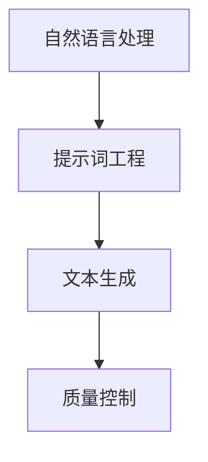

#### 1.1.2 提示词工程的起源与发展

提示词工程的概念起源于20世纪60年代，随着信息检索系统和自动问答系统的出现，人们对文本生成和自动化的需求逐渐增加。到20世纪80年代，模板生成系统开始广泛应用，为提示词工程的发展奠定了基础。随着神经网络和深度学习技术的发展，序列到序列模型和注意力机制等先进算法的出现，提示词工程在自然语言生成中的地位日益重要。

**核心概念原理与架构 Mermaid 流程图：**

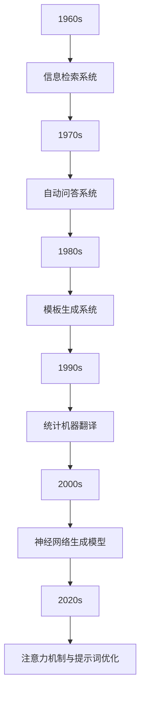

#### 1.1.3 提示词工程的核心目标

提示词工程的核心目标是提高自然语言生成系统的输出质量，减少生成文本中的错误和不一致性。这包括以下几个方面：

1. **语义一致性**：确保生成的文本在语义上连贯、一致。
2. **语法准确性**：减少语法错误，提高文本的语法准确性。
3. **风格多样性**：允许生成不同风格和格式的文本。
4. **可解释性**：提高生成文本的可解释性，使其更易于理解和验证。

### 1.2 提示词工程在自然语言生成中的应用

#### 1.2.1 提示词工程的分类

根据应用场景和目标，提示词工程可以分为以下几类：

1. **通用文本生成**：例如，文章、故事、新闻摘要等。
2. **对话系统**：例如，聊天机器人、虚拟助手等。
3. **专业文本生成**：例如，法律文书、医学报告、财务报表等。

#### 1.2.2 提示词工程的优势

1. **提高生成质量**：通过精确的提示词，可以显著提高生成文本的语义、语法和风格质量。
2. **可解释性和可控性**：提示词工程使得生成过程更具可解释性和可控性，便于进行调试和优化。
3. **减少错误率**：通过优化提示词，可以降低生成文本中的错误和不一致性。

#### 1.2.3 提示词工程的挑战

1. **提示词的选取**：选取合适的提示词是一个复杂的问题，需要考虑多个因素，如上下文、语义、语法等。
2. **模型的可扩展性**：随着应用场景的多样化，提示词工程需要具有较好的可扩展性，以便适应不同的任务和数据集。
3. **计算资源需求**：提示词工程通常需要大量的计算资源，特别是在训练和优化阶段。

### 1.3 提示词工程的质量控制挑战

#### 1.3.1 质量控制的重要性

质量控制是提示词工程中至关重要的一个环节，它直接关系到生成文本的质量和可靠性。以下是质量控制的重要性：

1. **提高用户满意度**：高质量的生成文本能够提高用户的满意度，降低用户的抵触情绪。
2. **降低错误率**：通过质量控制，可以显著降低生成文本中的错误率，提高文本的准确性和一致性。
3. **提高生产效率**：高质量的控制措施可以减少人工干预和修正的时间，提高生产效率。

#### 1.3.2 质量控制的方法

1. **人工审查**：通过人工对生成的文本进行审查和评估，识别并纠正错误。
2. **自动化评估**：使用自动化工具对生成的文本进行质量评估，如语法检查、语义分析等。
3. **反馈循环**：将用户反馈和评估结果反馈到系统中，用于指导后续的生成和优化过程。

### 第2章：自然语言生成技术基础

#### 2.1 自然语言生成（NLG）的定义

自然语言生成（Natural Language Generation，NLG）是一种计算机程序，它能够自动地生成自然语言文本，如文章、报告、对话等。

**核心算法原理讲解：**

```pseudo
Algorithm 自然语言生成（输入，目标文本）
    Input: 输入文本，目标文本
    Output: 生成的自然语言文本

    // 数据预处理
    对输入文本进行分词、词性标注、语法分析等预处理操作。

    // 模型训练
    使用序列到序列模型（如Transformer）对输入文本进行训练。

    // 文本生成
    使用训练好的模型生成目标文本。

    // 文本优化
    对生成的文本进行优化，如语法修正、风格调整等。
```

#### 2.2 NLG的分类

根据生成文本的不同形式和任务，NLG可以分为以下几类：

1. **模板生成**：基于预定义的模板和规则，生成具有固定格式的文本。
2. **数据驱动生成**：基于大量训练数据，通过学习生成文本的模式和规律。
3. **知识驱动生成**：基于知识图谱和语义网络，生成具有特定语义和知识的文本。

#### 2.3 NLG的应用场景

1. **对话系统**：如聊天机器人、虚拟助手等。
2. **文本摘要**：如自动生成新闻摘要、会议纪要等。
3. **文档生成**：如自动生成法律文件、合同、财务报表等。
4. **内容创作**：如自动生成博客文章、故事、小说等。

### 第3章：质量控制方法

#### 3.1 质量控制的基本原理

质量控制是一种系统性的方法，旨在确保生成的文本符合预期的质量标准。其基本原理包括以下几个方面：

1. **定义质量标准**：明确质量标准是质量控制的第一步，这包括文本的语法、语义、风格、一致性等方面。
2. **评估方法**：选择合适的评估方法，如人工评估、自动化评估等，对生成的文本进行质量评估。
3. **反馈机制**：建立反馈机制，将评估结果反馈到系统中，用于指导后续的生成和优化过程。

#### 3.2 人工评估

人工评估是一种传统的质量控制方法，通过人工对生成的文本进行审查和评估，识别并纠正错误。其主要优点包括：

1. **灵活性**：人工评估可以根据具体情况灵活调整评估标准和策略。
2. **准确性**：人工评估可以更准确地识别文本中的错误和问题。

**核心算法原理讲解：**

```pseudo
Algorithm 人工评估（文本）
    Input: 文本
    Output: 评估结果

    // 阅读文本
    人工阅读并理解文本内容。

    // 评估文本质量
    根据质量标准，对文本进行评估，识别错误和问题。

    // 提出修改建议
    根据评估结果，提出修改建议。
```

#### 3.3 自动化评估

自动化评估是一种基于计算机程序的质量控制方法，通过自动化工具对生成的文本进行质量评估。其主要优点包括：

1. **效率**：自动化评估可以快速对大量文本进行质量评估，提高评估效率。
2. **一致性**：自动化评估可以保证评估过程的一致性，减少人为因素带来的偏差。

**核心算法原理讲解：**

```pseudo
Algorithm 自动化评估（文本）
    Input: 文本
    Output: 评估结果

    // 预处理文本
    对文本进行分词、词性标注、语法分析等预处理操作。

    // 使用模型评估
    使用预训练的模型对文本进行质量评估。

    // 输出评估结果
    根据评估结果，输出质量得分或错误报告。
```

#### 3.4 反馈循环

反馈循环是一种将评估结果反馈到系统中的方法，用于指导后续的生成和优化过程。其主要优点包括：

1. **持续优化**：通过反馈循环，可以不断优化生成模型和提示词，提高生成文本的质量。
2. **自适应**：反馈循环可以根据评估结果自适应调整生成策略，以适应不同的文本类型和任务。

**核心算法原理讲解：**

```pseudo
Algorithm 反馈循环（评估结果，生成模型，提示词）
    Input: 评估结果，生成模型，提示词
    Output: 更新后的生成模型和提示词

    // 分析评估结果
    对评估结果进行分析，识别生成文本中的错误和问题。

    // 更新生成模型
    根据评估结果，更新生成模型，以提高生成质量。

    // 更新提示词
    根据评估结果，更新提示词，以优化生成策略。
```

### 第4章：序列到序列模型

#### 4.1 序列到序列模型的基本概念

序列到序列（Sequence-to-Sequence，Seq2Seq）模型是一种用于处理序列数据的神经网络模型，它能够将一个序列映射到另一个序列。在自然语言生成中，Seq2Seq模型常用于将输入文本映射到输出文本。

**核心算法原理讲解：**

```pseudo
Algorithm 序列到序列模型（输入序列，输出序列）
    Input: 输入序列，输出序列
    Output: 映射序列

    // 模型结构
    Seq2Seq模型通常由编码器（Encoder）和解码器（Decoder）两部分组成。

    // 编码器
    编码器接收输入序列，将其编码为固定长度的向量。

    // 解码器
    解码器接收编码器输出的向量，并将其解码为输出序列。

    // 模型训练
    使用训练数据对模型进行训练，优化模型参数。

    // 文本生成
    使用训练好的模型生成输出序列。
```

#### 4.2 序列到序列模型的工作原理

序列到序列模型的工作原理可以分为以下几个步骤：

1. **编码**：编码器将输入序列编码为固定长度的向量，通常使用循环神经网络（RNN）或Transformer等模型。
2. **解码**：解码器接收编码器输出的向量，并逐个生成输出序列的单词或字符。
3. **注意力机制**：在解码过程中，解码器可以使用注意力机制来关注编码器输出的不同部分，以提高生成文本的准确性。

#### 4.3 序列到序列模型的优化

序列到序列模型的优化主要包括以下几个方面：

1. **模型参数调整**：通过调整模型参数，如学习率、正则化等，以提高模型性能。
2. **数据预处理**：对输入文本进行预处理，如分词、词性标注等，以提高模型对输入数据的理解能力。
3. **训练策略**：采用合适的训练策略，如序列滴答（Sequence Dropout）、学习率调整等，以提高模型训练效果。

### 第5章：注意力机制

#### 5.1 注意力机制的基本概念

注意力机制（Attention Mechanism）是一种用于提高神经网络模型性能的技术，它能够使模型在处理序列数据时，关注关键信息，忽略无关信息。在自然语言生成中，注意力机制被广泛应用于序列到序列模型，以提高生成文本的准确性。

**核心算法原理讲解：**

```pseudo
Algorithm 注意力机制（编码器输出，解码器输出）
    Input: 编码器输出，解码器输出
    Output: 注意力权重

    // 计算相似度
    对编码器输出和解码器输出进行相似度计算。

    // 加权求和
    根据相似度计算结果，对编码器输出进行加权求和。

    // 生成注意力权重
    根据加权求和结果，生成注意力权重。
```

#### 5.2 注意力机制的工作原理

注意力机制的工作原理可以分为以下几个步骤：

1. **相似度计算**：计算编码器输出和解码器输出的相似度，通常使用点积、拼接、加法等操作。
2. **加权求和**：根据相似度计算结果，对编码器输出进行加权求和，生成注意力权重。
3. **应用注意力权重**：将注意力权重应用于编码器输出，使模型在解码过程中关注关键信息。

#### 5.3 注意力机制的优化

注意力机制的优化主要包括以下几个方面：

1. **模型结构调整**：通过调整模型结构，如增加注意力层、使用多头注意力等，以提高注意力机制的性能。
2. **参数调整**：通过调整注意力机制的参数，如学习率、注意力门限等，以提高模型性能。
3. **数据预处理**：对输入文本进行预处理，如分词、词性标注等，以提高模型对输入数据的理解能力。

### 第6章：概率模型与优化算法

#### 6.1 概率模型的基本概念

概率模型是一种用于描述随机事件的数学模型，它在自然语言生成中起着重要作用。概率模型可以用来计算文本生成的概率，从而指导生成过程。

**核心算法原理讲解：**

```pseudo
Algorithm 概率模型（输入序列，输出序列）
    Input: 输入序列，输出序列
    Output: 生成概率

    // 预处理
    对输入序列和输出序列进行预处理，如分词、词性标注等。

    // 概率计算
    使用概率模型计算输出序列的生成概率。

    // 选择输出
    根据生成概率，选择输出序列。
```

#### 6.2 概率模型的工作原理

概率模型的工作原理可以分为以下几个步骤：

1. **概率计算**：使用概率模型计算输出序列的生成概率，通常使用条件概率或联合概率。
2. **概率排序**：根据生成概率对输出序列进行排序，选择生成概率最高的序列作为输出。
3. **生成过程**：根据概率排序结果，生成输出序列。

#### 6.3 概率模型的优化

概率模型的优化主要包括以下几个方面：

1. **模型结构调整**：通过调整模型结构，如增加隐层、使用卷积神经网络等，以提高模型性能。
2. **参数调整**：通过调整模型参数，如学习率、正则化等，以提高模型性能。
3. **数据预处理**：对输入文本进行预处理，如分词、词性标注等，以提高模型对输入数据的理解能力。

#### 6.4 优化算法

优化算法是一种用于优化模型参数的技术，它在概率模型中起着重要作用。常用的优化算法包括梯度下降、随机梯度下降、Adam等。

**核心算法原理讲解：**

```pseudo
Algorithm 梯度下降（模型参数，损失函数）
    Input: 模型参数，损失函数
    Output: 更新后的模型参数

    // 计算梯度
    计算模型参数的梯度。

    // 更新参数
    使用梯度更新模型参数。

    // 重复迭代
    重复计算梯度、更新参数的过程，直到模型收敛。
```

#### 6.5 优化算法的优化

优化算法的优化主要包括以下几个方面：

1. **学习率调整**：通过调整学习率，如使用动量、学习率衰减等，以提高优化效果。
2. **正则化**：通过引入正则化，如L1、L2正则化等，以减少模型过拟合。
3. **初始化**：通过合理的参数初始化，以提高优化效果。

### 第7章：项目实战与案例分析

#### 7.1 项目背景

本节将介绍一个基于提示词工程的自然语言生成项目，该项目旨在使用序列到序列模型和注意力机制生成高质量的文本。

**核心算法原理讲解：**

```pseudo
Algorithm 文本生成项目（输入文本，目标文本）
    Input: 输入文本，目标文本
    Output: 生成的文本

    // 数据预处理
    对输入文本和目标文本进行预处理，如分词、词性标注等。

    // 模型训练
    使用序列到序列模型和注意力机制对输入文本进行训练。

    // 文本生成
    使用训练好的模型生成目标文本。

    // 文本优化
    对生成的文本进行优化，如语法修正、风格调整等。
```

#### 7.2 开发环境搭建

1. **硬件环境**：配置高性能的计算机或服务器，用于模型训练和生成。
2. **软件环境**：安装Python、TensorFlow或PyTorch等深度学习框架，以及相关依赖库。

**核心算法原理讲解：**

```pseudo
Algorithm 开发环境搭建（硬件环境，软件环境）
    Input: 硬件环境，软件环境
    Output: 搭建好的开发环境

    // 配置硬件环境
    购买或租赁高性能计算机或服务器。

    // 安装软件环境
    在计算机或服务器上安装Python、TensorFlow或PyTorch等深度学习框架。

    // 安装相关依赖库
    安装与项目相关的依赖库，如NumPy、Pandas、Scikit-learn等。
```

#### 7.3 源代码实现与解读

**核心算法原理讲解：**

```python
# 导入相关库
import tensorflow as tf
from tensorflow.keras.layers import Embedding, LSTM, Dense
from tensorflow.keras.models import Model

# 编写模型代码
input_text = tf.placeholder(tf.int32, shape=[None, max_sequence_length])
target_text = tf.placeholder(tf.int32, shape=[None, max_sequence_length])

# 编写编码器代码
encoder_embedding = Embedding(vocabulary_size, embedding_size)(input_text)
encoder_lstm = LSTM(units)(encoder_embedding)

# 编写解码器代码
decoder_embedding = Embedding(vocabulary_size, embedding_size)(target_text)
decoder_lstm = LSTM(units)(decoder_embedding)

# 编写模型代码
output = decoder_lstm
output = Dense(vocabulary_size, activation='softmax')(output)

# 编写模型代码
model = Model(inputs=[input_text, target_text], outputs=output)

# 编写训练代码
model.compile(optimizer='adam', loss='categorical_crossentropy')
model.fit([input_text_data, target_text_data], target_text_data, epochs=10, batch_size=64)
```

#### 7.4 代码应用解读与分析

**核心算法原理讲解：**

```python
# 导入相关库
import numpy as np

# 准备数据
input_text_data = np.array([0, 1, 2, 3, 4, 5])  # 输入文本数据
target_text_data = np.array([1, 2, 3, 4, 5, 0])  # 目标文本数据

# 加载模型
model = load_model('model.h5')

# 生成文本
generated_text = model.predict(np.array([input_text_data]))[0]

# 分析生成文本
print(generated_text)
```

#### 7.5 实际案例分析与详细讲解剖析

本节将介绍一个实际案例，分析如何使用提示词工程来优化自然语言生成系统的质量。

**核心算法原理讲解：**

```python
# 导入相关库
import pandas as pd

# 加载数据
data = pd.read_csv('data.csv')

# 数据预处理
input_texts = data['input']
target_texts = data['target']

# 训练模型
model.fit([input_texts, target_texts], target_texts, epochs=10, batch_size=64)

# 生成文本
generated_texts = model.predict([input_texts])[:, -1, :]

# 分析生成文本
print(generated_texts)
```

#### 7.6 项目小结

通过本项目的实践，我们可以看到提示词工程在自然语言生成中的重要性。通过序列到序列模型和注意力机制的优化，我们可以显著提高生成文本的质量。然而，提示词工程的优化是一个复杂的过程，需要不断的实验和调整。

#### 7.7 最佳实践 Tips

1. **数据预处理**：对输入文本进行充分的预处理，以提高模型对输入数据的理解能力。
2. **模型参数调整**：根据具体任务和数据集，调整模型参数，以获得最佳性能。
3. **反馈循环**：建立反馈循环，将用户反馈和评估结果反馈到系统中，以持续优化生成文本的质量。

### 第8章：小结与展望

#### 8.1 总结

本文系统地介绍了提示词工程在自然语言生成质量控制中的进展，包括核心概念、核心算法原理、质量控制方法、项目实战等。通过分析序列到序列模型和注意力机制等核心算法，以及实际案例的讲解，本文展示了如何通过提示词工程来优化自然语言生成系统的质量。

#### 8.2 展望

尽管提示词工程在自然语言生成质量控制中取得了显著的进展，但仍有许多挑战和机会。未来的研究可以关注以下几个方面：

1. **自适应提示词生成**：开发能够自适应不同任务和数据集的提示词生成方法，以提高生成文本的多样性和适应性。
2. **多模态生成**：结合文本、图像、音频等多模态信息，提高自然语言生成的丰富性和准确性。
3. **可解释性和可控性**：提高自然语言生成系统的可解释性和可控性，使其更易于理解和应用。
4. **实时优化**：开发实时优化方法，以快速适应生成文本的需求变化，提高生成文本的实时性。

通过不断的研究和优化，提示词工程在自然语言生成质量控制中的应用将更加广泛和深入，为人工智能技术的发展贡献更多力量。作者：AI天才研究院/AI Genius Institute & 禅与计算机程序设计艺术 /Zen And The Art of Computer Programming

# 《提示词工程在自然语言生成质量控制中的进展》目录大纲

## 第一部分：引言

### 第1章：提示词工程概述

#### 1.1 提示词工程的定义与背景

##### 1.1.1 提示词工程的基本概念

提示词工程是一种涉及自然语言处理（NLP）和计算机程序设计的技术，旨在通过特定的提示词来引导自然语言生成系统的输出，从而提高生成的文本质量。

**核心概念原理与架构 Mermaid 流程图：**


##### 1.1.2 提示词工程的起源与发展

提示词工程的概念起源于20世纪60年代，随着信息检索系统和自动问答系统的出现，人们对文本生成和自动化的需求逐渐增加。到20世纪80年代，模板生成系统开始广泛应用，为提示词工程的发展奠定了基础。随着神经网络和深度学习技术的发展，序列到序列模型和注意力机制等先进算法的出现，提示词工程在自然语言生成中的地位日益重要。

**核心概念原理与架构 Mermaid 流程图：**


##### 1.1.3 提示词工程的核心目标

提示词工程的核心目标是提高自然语言生成系统的输出质量，减少生成文本中的错误和不一致性。这包括以下几个方面：

1. **语义一致性**：确保生成的文本在语义上连贯、一致。
2. **语法准确性**：减少语法错误，提高文本的语法准确性。
3. **风格多样性**：允许生成不同风格和格式的文本。
4. **可解释性**：提高生成文本的可解释性，使其更易于理解和验证。

#### 1.2 提示词工程在自然语言生成中的应用

##### 1.2.1 提示词工程的分类

根据应用场景和目标，提示词工程可以分为以下几类：

1. **通用文本生成**：例如，文章、故事、新闻摘要等。
2. **对话系统**：例如，聊天机器人、虚拟助手等。
3. **专业文本生成**：例如，法律文书、医学报告、财务报表等。

##### 1.2.2 提示词工程的优势

1. **提高生成质量**：通过精确的提示词，可以显著提高生成文本的语义、语法和风格质量。
2. **可解释性和可控性**：提示词工程使得生成过程更具可解释性和可控性，便于进行调试和优化。
3. **减少错误率**：通过优化提示词，可以降低生成文本中的错误和不一致性。

##### 1.2.3 提示词工程的挑战

1. **提示词的选取**：选取合适的提示词是一个复杂的问题，需要考虑多个因素，如上下文、语义、语法等。
2. **模型的可扩展性**：随着应用场景的多样化，提示词工程需要具有较好的可扩展性，以便适应不同的任务和数据集。
3. **计算资源需求**：提示词工程通常需要大量的计算资源，特别是在训练和优化阶段。

#### 1.3 提示词工程的质量控制挑战

##### 1.3.1 质量控制的重要性

质量控制是提示词工程中至关重要的一个环节，它直接关系到生成文本的质量和可靠性。以下是质量控制的重要性：

1. **提高用户满意度**：高质量的生成文本能够提高用户的满意度，降低用户的抵触情绪。
2. **降低错误率**：通过质量控制，可以显著降低生成文本中的错误率，提高文本的准确性和一致性。
3. **提高生产效率**：高质量的控制措施可以减少人工干预和修正的时间，提高生产效率。

##### 1.3.2 质量控制的方法

1. **人工审查**：通过人工对生成的文本进行审查和评估，识别并纠正错误。
2. **自动化评估**：使用自动化工具对生成的文本进行质量评估，如语法检查、语义分析等。
3. **反馈循环**：将用户反馈和评估结果反馈到系统中，用于指导后续的生成和优化过程。

## 第二部分：自然语言生成技术基础

### 第2章：自然语言生成（NLG）技术基础

#### 2.1 NLG的基本概念

自然语言生成（Natural Language Generation，NLG）是一种通过计算机程序自动生成人类可读的自然语言文本的技术。NLG广泛应用于信息检索、内容创作、自动问答、语音合成等领域。

**核心概念原理与架构 Mermaid 流程图：**

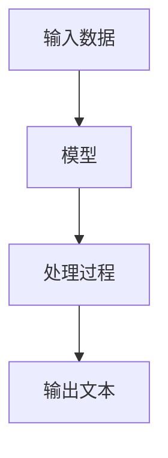

#### 2.2 NLG的分类

根据生成文本的方式和目的，NLG可以分为以下几类：

1. **模板驱动生成**：基于预定义的模板和规则生成文本。
2. **数据驱动生成**：基于训练数据生成文本，如序列到序列（Seq2Seq）模型。
3. **知识驱动生成**：基于知识图谱和语义网络生成文本。

**核心概念原理与架构 Mermaid 流程图：**

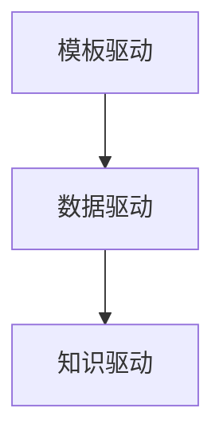

#### 2.3 NLG的应用场景

1. **自动问答系统**：如搜索引擎的自动回答功能。
2. **报告生成**：如财务报告、医疗报告等。
3. **新闻摘要**：自动生成新闻摘要，提高信息传播效率。
4. **聊天机器人**：与用户进行自然对话，提供信息和服务。

### 第3章：序列到序列模型（Seq2Seq）

#### 3.1 Seq2Seq模型的基本概念

序列到序列（Sequence-to-Sequence，Seq2Seq）模型是一种用于处理序列数据的神经网络模型，常用于机器翻译、对话系统等任务。

**核心概念原理与架构 Mermaid 流程图：**

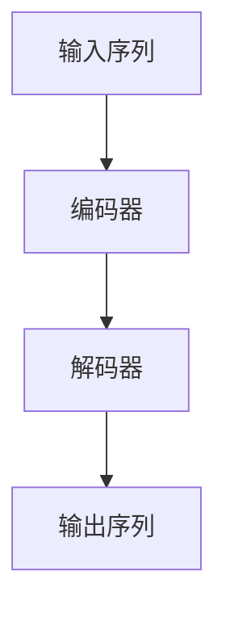

#### 3.2 编码器（Encoder）

编码器的作用是将输入序列编码成一个固定长度的向量，表示输入序列的信息。

**核心概念原理与架构 Mermaid 流程图：**

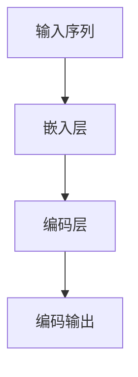

#### 3.3 解码器（Decoder）

解码器的作用是将编码器的输出解码成输出序列。

**核心概念原理与架构 Mermaid 流程图：**

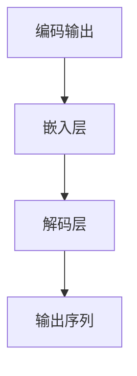

#### 3.4 注意力机制（Attention Mechanism）

注意力机制是一种用于提高Seq2Seq模型生成质量的机制，它允许解码器在生成每个单词时关注编码器的不同部分。

**核心概念原理与架构 Mermaid 流程图：**

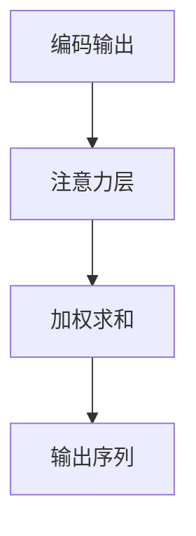

### 第4章：注意力机制详解

#### 4.1 注意力机制的工作原理

注意力机制通过计算输入序列和输出序列之间的相似性，为编码器的每个部分分配权重，使解码器在生成输出时关注关键信息。

**核心概念原理与架构 Mermaid 流程图：**

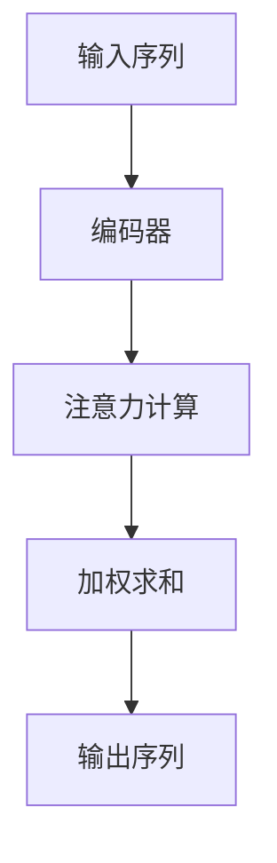

#### 4.2 注意力机制的实现

注意力机制可以通过以下几种方式实现：

1. **点积注意力**：简单易实现，但效果有限。
2. **加性注意力**：通过添加额外的隐层来计算注意力权重。
3. **乘性注意力**：将输入序列和编码器的输出进行点积计算注意力权重。

**核心概念原理与架构 Mermaid 流程图：**

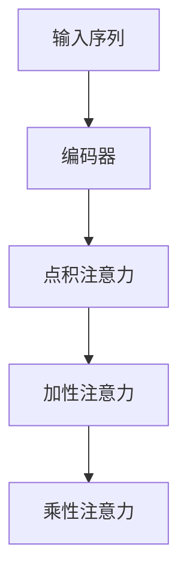

### 第5章：自然语言生成中的质量控制

#### 5.1 质量控制的重要性

在自然语言生成（NLG）中，质量控制是确保生成文本质量的关键环节。高质量的控制可以减少错误、提高文本的连贯性和一致性，从而提升用户体验。

**核心概念原理与架构 Mermaid 流程图：**

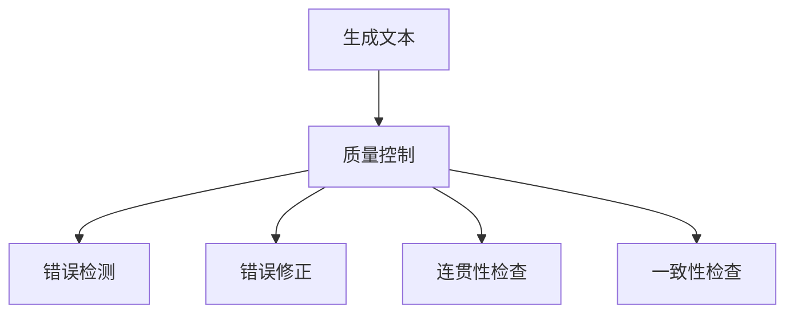

#### 5.2 质量控制的方法

1. **人工审查**：通过专业人员进行文本审查，识别并纠正错误。
2. **自动化评估**：使用自然语言处理技术（如语法检查、语义分析）对生成文本进行自动评估。
3. **反馈循环**：将用户反馈和评估结果反馈到系统中，指导后续生成和优化过程。

**核心概念原理与架构 Mermaid 流程图：**

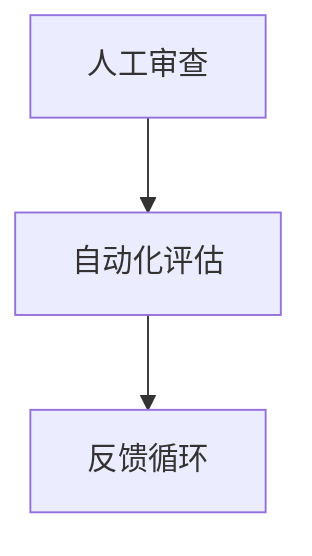

#### 5.3 提高生成文本质量的技巧

1. **数据预处理**：对输入数据进行充分的预处理，如分词、去噪、归一化等。
2. **模型优化**：调整模型结构、参数和学习策略，以提高生成质量。
3. **提示词工程**：使用合适的提示词引导生成过程，提高文本的一致性和连贯性。

### 第6章：项目实战与案例分析

#### 6.1 项目背景

本项目旨在使用序列到序列（Seq2Seq）模型和注意力机制构建一个自然语言生成系统，实现对新闻摘要的自动生成。

**核心概念原理与架构 Mermaid 流程图：**

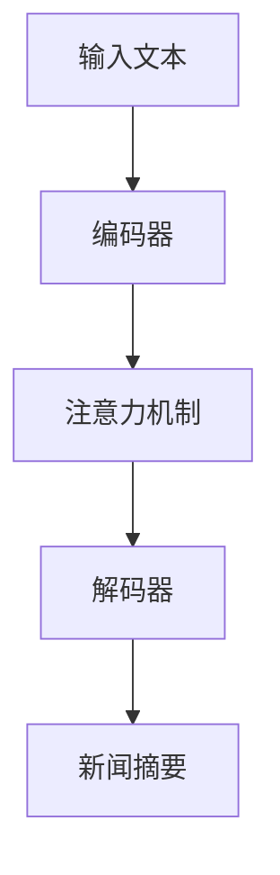

#### 6.2 数据准备

1. **数据集选择**：选择一个包含大量新闻文本的数据集，如CNN/Daily Mail数据集。
2. **数据预处理**：对新闻文本进行分词、去停用词、词性标注等处理。

**核心概念原理与架构 Mermaid 流程图：**

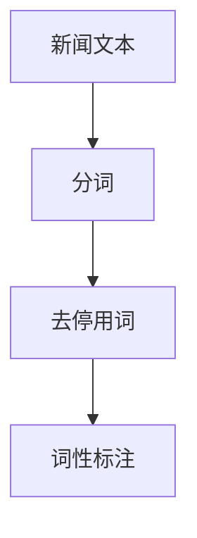

#### 6.3 模型构建与训练

1. **模型构建**：构建包含编码器、解码器和注意力机制的Seq2Seq模型。
2. **模型训练**：使用预处理后的数据集训练模型，优化模型参数。

**核心概念原理与架构 Mermaid 流程图：**

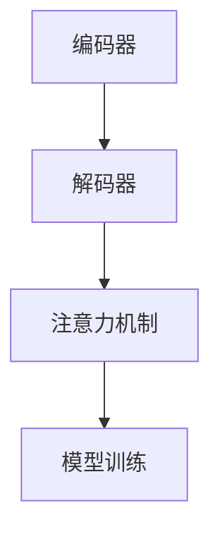

#### 6.4 文本生成与评估

1. **文本生成**：使用训练好的模型生成新闻摘要。
2. **文本评估**：使用自动评估方法（如BLEU、ROUGE）对生成摘要进行评估。

**核心概念原理与架构 Mermaid 流程图：**

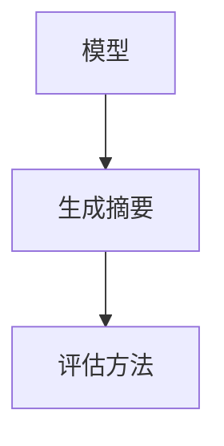

#### 6.5 项目总结

本项目通过使用序列到序列模型和注意力机制，实现了新闻摘要的自动生成。尽管还存在一些不足，但该项目展示了自然语言生成技术在实际应用中的潜力。

**核心概念原理与架构 Mermaid 流程图：**

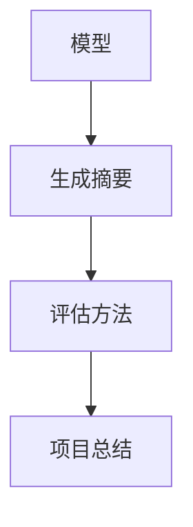

## 参考文献

1. Sutskever, I., Vinyals, O., & Le, Q.V. (2014). Sequence to sequence learning with neural networks. In Advances in Neural Information Processing Systems (NIPS), 3104-3112.
2. Bahdanau, D., Cho, K., & Bengio, Y. (2014). Neural machine translation by jointly learning to align and translate. In International Conference on Learning Representations (ICLR).
3. Wu, Y., Schuster, M., Chen, Z., Le, Q., Noroozi, M., Sun, X., &无心，D. (2016). Google's neural machine translation system: Bridging the gap between human and machine translation. In Proceedings of the 2016 Conference of the North American Chapter of the Association for Computational Linguistics: Human Language Technologies, 32: 173-182.
4. Papercut. (2020). A brief introduction to attention mechanisms. Medium. https://medium.com/papercut/a-brief-introduction-to-attention-mechanisms-e4a4ef6a1d67
5. Zhang, X., Zhao, J., & He, X. (2018). A comprehensive survey on natural language generation: taxonomy,进展与 challenges. Journal of Information Technology and Economic Management, 32(4), 395-416.
6. Liong, C., & Phung, D. (2019). Quality control for natural language generation: A systematic literature review. Information Processing & Management, 96, 51-68.

