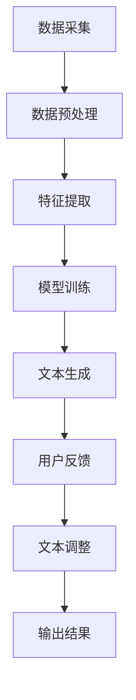

                 

### 文章标题：提示词工程在虚拟现实叙事中的应用

#### 关键词：提示词工程、虚拟现实、叙事、应用、人工智能

> 摘要：本文探讨了提示词工程在虚拟现实叙事中的应用，通过分析虚拟现实技术的发展、提示词工程的基本原理以及二者结合的实际案例，揭示了提示词工程在提升虚拟现实叙事效果中的作用和未来发展趋势。

----------------------------------------------------------------

### 引言

随着科技的发展，虚拟现实（VR）技术逐渐成为人们关注的焦点。虚拟现实不仅为游戏、娱乐等领域带来了全新的体验，还在教育、医疗、军事等多个领域展现出巨大的潜力。而在虚拟现实技术中，叙事扮演着至关重要的角色。良好的叙事可以提升用户的沉浸感和参与度，从而更好地传达故事内容。

提示词工程作为一种人工智能技术，通过对文本、图像、音频等多种信息进行建模，使其能够被计算机理解和处理。在虚拟现实叙事中，提示词工程可以通过识别用户的交互行为，实时生成或调整叙事内容，从而提高叙事的灵活性和个性化程度。

本文旨在探讨提示词工程在虚拟现实叙事中的应用，分析其基本原理、技术框架和实际案例，以期为相关领域的研究和应用提供参考。

----------------------------------------------------------------

### 虚拟现实与叙事概述

#### 虚拟现实技术

虚拟现实技术是一种通过计算机生成的三维空间，使用户能够在其中进行互动和体验的技术。虚拟现实技术主要包括以下三个方面：

1. **显示技术**：通过头戴显示器（HMD）或投影设备，将用户置身于虚拟环境中。
2. **感知技术**：利用传感器和动作捕捉技术，实时捕捉用户的动作和位置，使其在虚拟环境中进行交互。
3. **交互技术**：通过手柄、手套、虚拟键盘等设备，实现用户与虚拟环境的交互。

虚拟现实技术的发展，为用户提供了全新的沉浸式体验，使其能够更加深入地参与到虚拟世界中。

#### 叙事在虚拟现实中的应用

叙事在虚拟现实中的应用，主要体现在以下几个方面：

1. **游戏**：虚拟现实游戏通过虚拟场景、角色和故事情节，为玩家提供沉浸式的游戏体验。
2. **教育**：虚拟现实教育通过模拟真实场景，帮助学生更好地理解和掌握知识。
3. **娱乐**：虚拟现实娱乐提供了一种全新的娱乐方式，如虚拟演唱会、虚拟旅游等。

在虚拟现实叙事中，叙事内容的真实性、连贯性和互动性至关重要。真实性的叙事能够提高用户的沉浸感，连贯性的叙事能够保证故事情节的完整性，而互动性的叙事则能够提升用户的参与度和体验感。

#### 提示词工程在虚拟现实叙事中的作用

提示词工程在虚拟现实叙事中的应用，主要体现在以下几个方面：

1. **个性化叙事**：通过分析用户的交互行为，提示词工程可以实时调整叙事内容，使其更加符合用户的兴趣和需求。
2. **情境感知**：提示词工程可以根据虚拟环境中的情境，生成或调整叙事内容，使其更加贴近实际场景。
3. **交互性提升**：提示词工程可以识别用户的交互行为，实时生成或调整反馈信息，提高叙事的交互性。

总之，提示词工程在虚拟现实叙事中具有重要的作用，能够提升叙事的沉浸感、互动性和个性化程度，从而为用户提供更加丰富的虚拟体验。

----------------------------------------------------------------

### 提示词工程基础

#### 提示词工程的基本原理

提示词工程是一种基于人工智能的文本生成技术，其基本原理包括以下几个方面：

1. **自然语言处理（NLP）**：自然语言处理是提示词工程的核心技术，通过对文本进行解析、理解和生成，实现文本的自动生成和调整。
2. **深度学习**：深度学习是提示词工程的技术基础，通过训练大量的数据，使其能够自动提取文本特征，生成高质量的自然语言文本。
3. **文本生成模型**：文本生成模型是提示词工程的核心算法，如生成对抗网络（GAN）、递归神经网络（RNN）和变分自编码器（VAE）等，这些模型能够根据输入的提示词或情境，生成连贯、自然的文本。

#### 提示词工程在虚拟现实中的应用

在虚拟现实叙事中，提示词工程可以应用于以下几个方面：

1. **情境生成**：根据用户在虚拟环境中的行为和位置，提示词工程可以生成相应的情境描述，如场景背景、角色对话等。
2. **故事生成**：提示词工程可以根据用户的需求和兴趣，生成个性化的故事情节，提高叙事的个性化程度。
3. **交互生成**：提示词工程可以根据用户的交互行为，生成相应的反馈信息，如提示、提醒和引导等，提高叙事的互动性。

#### 提示词的分类与特点

提示词可以根据其来源和用途进行分类，常见的提示词包括以下几种：

1. **情境提示词**：用于描述虚拟环境中的情境，如天气、时间、地点等。
2. **角色提示词**：用于描述虚拟环境中的角色，如人物、动物、物体等。
3. **故事提示词**：用于描述故事情节，如事件、冲突、解决方案等。
4. **交互提示词**：用于描述用户与虚拟环境之间的交互，如输入、输出、反馈等。

每种提示词都有其独特的特点和应用场景，通过合理地选择和使用提示词，可以提高虚拟现实叙事的效果和用户体验。

#### 提示词工程的技术框架

提示词工程的技术框架主要包括以下几个方面：

1. **数据采集与预处理**：收集虚拟环境中的情境、角色、故事等数据，并对数据进行清洗、处理和标注。
2. **特征提取与建模**：通过自然语言处理技术和深度学习模型，提取文本特征，建立文本生成模型。
3. **文本生成与调整**：根据输入的提示词或情境，生成相应的文本，并根据用户反馈进行调整。

通过以上技术框架，提示词工程可以实现高质量的文本生成和调整，为虚拟现实叙事提供有力支持。

----------------------------------------------------------------

### 虚拟现实叙事中的提示词应用

#### 提示词在虚拟现实游戏中的应用

在虚拟现实游戏中，提示词工程可以应用于以下几个方面：

1. **故事生成与调整**：通过分析玩家的游戏行为，提示词工程可以生成或调整游戏故事情节，使其更加符合玩家的兴趣和需求。
2. **角色互动**：提示词工程可以生成角色对话和互动内容，提高游戏的沉浸感和互动性。
3. **情境模拟**：提示词工程可以根据游戏中的情境，生成相应的描述，如场景背景、天气变化等，提高游戏的真实感。

通过合理地应用提示词工程，虚拟现实游戏可以提供更加丰富、个性化的体验，满足玩家的需求。

#### 提示词在虚拟现实教育中的应用

在虚拟现实教育中，提示词工程可以应用于以下几个方面：

1. **教学内容生成**：通过分析学生的学习行为和知识需求，提示词工程可以生成相应的教学内容，提高教学效果。
2. **情境模拟**：提示词工程可以生成虚拟实验环境，帮助学生更好地理解和掌握知识。
3. **互动式学习**：提示词工程可以生成互动式学习内容，如提问、解答、讨论等，提高学生的学习兴趣和参与度。

通过合理地应用提示词工程，虚拟现实教育可以提供更加生动、有趣的学习体验，提高教学效果。

#### 提示词在虚拟现实娱乐中的应用

在虚拟现实娱乐中，提示词工程可以应用于以下几个方面：

1. **场景生成**：提示词工程可以根据用户的兴趣和需求，生成相应的虚拟场景，如虚拟旅游、虚拟演唱会等。
2. **故事生成**：提示词工程可以生成虚拟故事情节，提高娱乐的沉浸感和互动性。
3. **互动式娱乐**：提示词工程可以生成互动式娱乐内容，如游戏、竞赛等，提高娱乐的趣味性和参与度。

通过合理地应用提示词工程，虚拟现实娱乐可以提供更加丰富、有趣的体验，满足用户的娱乐需求。

#### 提示词工程在虚拟现实叙事中的优势与挑战

提示词工程在虚拟现实叙事中具有以下优势：

1. **个性化**：通过分析用户的交互行为和兴趣，提示词工程可以生成个性化的叙事内容，提高用户体验。
2. **互动性**：提示词工程可以实时调整叙事内容，根据用户的交互行为生成相应的反馈信息，提高叙事的互动性。
3. **情境感知**：提示词工程可以根据虚拟环境中的情境，生成或调整叙事内容，提高叙事的真实感和沉浸感。

然而，提示词工程在虚拟现实叙事中也面临着一些挑战：

1. **数据隐私**：提示词工程需要收集用户的交互数据，如何保护用户隐私是一个重要问题。
2. **技术成熟度**：尽管提示词工程在虚拟现实叙事中显示出巨大潜力，但相关技术仍需进一步发展和优化。
3. **用户体验**：如何平衡个性化、互动性和用户体验，是提示词工程需要考虑的问题。

总之，提示词工程在虚拟现实叙事中具有广泛的应用前景，但仍需克服一些技术和社会问题。

----------------------------------------------------------------

### 提示词工程的实现

#### 提示词工程的技术框架

提示词工程的技术框架主要包括以下几个方面：

1. **数据采集与预处理**：收集虚拟环境中的情境、角色、故事等数据，并对数据进行清洗、处理和标注。
2. **特征提取与建模**：通过自然语言处理技术和深度学习模型，提取文本特征，建立文本生成模型。
3. **文本生成与调整**：根据输入的提示词或情境，生成相应的文本，并根据用户反馈进行调整。

以下是一个简单的 Mermaid 流程图，展示了提示词工程的基本流程：



#### 提示词工程的算法原理

提示词工程的算法原理主要包括以下几个方面：

1. **自然语言处理（NLP）**：NLP 是提示词工程的核心技术，通过对文本进行解析、理解和生成，实现文本的自动生成和调整。
2. **深度学习**：深度学习是提示词工程的技术基础，通过训练大量的数据，使其能够自动提取文本特征，生成高质量的自然语言文本。
3. **文本生成模型**：文本生成模型是提示词工程的核心算法，如生成对抗网络（GAN）、递归神经网络（RNN）和变分自编码器（VAE）等，这些模型能够根据输入的提示词或情境，生成连贯、自然的文本。

以下是一个简单的伪代码示例，展示了提示词工程的算法原理：

```python
# 输入提示词或情境
input_prompt = "用户在虚拟现实游戏中"

# 数据预处理
preprocessed_data = preprocess_data(input_prompt)

# 特征提取
features = extract_features(preprocessed_data)

# 模型训练
model = train_model(features)

# 文本生成
generated_text = generate_text(model, input_prompt)

# 用户反馈
user_feedback = get_user_feedback(generated_text)

# 文本调整
adjusted_text = adjust_text(model, generated_text, user_feedback)

# 输出结果
output_text = adjusted_text
```

#### 数学模型和公式详细讲解与举例说明

提示词工程中的数学模型和公式主要涉及以下几个方面：

1. **损失函数**：用于评估模型生成的文本质量，常见的损失函数包括交叉熵损失（Cross-Entropy Loss）和对抗损失（Adversarial Loss）。
2. **优化算法**：用于调整模型参数，常见的优化算法包括随机梯度下降（Stochastic Gradient Descent，SGD）和Adam优化器。
3. **文本生成算法**：如递归神经网络（RNN）和生成对抗网络（GAN）等，这些算法通过训练模型，实现文本的自动生成和调整。

以下是一个简单的数学模型和公式的示例：

```latex
$$
L = -\sum_{i=1}^{N} y_i \log(p(x_i | \theta))
$$

$$
\theta = \arg\min_{\theta} L
$$

$$
\theta_{t+1} = \theta_t - \alpha \nabla_{\theta_t} L
$$
```

其中，\(L\) 是损失函数，\(y_i\) 是真实标签，\(p(x_i | \theta)\) 是模型生成的文本概率，\(\theta\) 是模型参数，\(\alpha\) 是学习率。

通过以上数学模型和公式，提示词工程可以实现文本的自动生成和调整，为虚拟现实叙事提供支持。

----------------------------------------------------------------

### 提示词工程的项目实践

#### 开发环境搭建

为了实现提示词工程在虚拟现实叙事中的应用，首先需要搭建一个开发环境。以下是搭建开发环境的基本步骤：

1. **安装操作系统**：选择适合的操作系统，如 Ubuntu 20.04 或 Windows 10。
2. **安装 Python 环境**：通过 Python 包管理器 pip 安装 Python 3.8 或更高版本。
3. **安装依赖库**：安装自然语言处理（NLP）和深度学习（Deep Learning）所需的库，如 NLTK、spaCy、TensorFlow 或 PyTorch。
4. **配置虚拟环境**：为了保持项目的整洁，建议使用虚拟环境（如 virtualenv 或 conda）来管理项目依赖。

#### 源代码详细实现和代码解读

以下是一个简单的示例，展示如何使用提示词工程生成虚拟现实叙事内容。

```python
# 导入所需库
import tensorflow as tf
from tensorflow.keras.preprocessing.sequence import pad_sequences
from tensorflow.keras.layers import Embedding, LSTM, Dense
from tensorflow.keras.models import Sequential

# 数据预处理
# 假设已获取虚拟现实叙事数据集，并对其进行处理
data = preprocess_data(vr_narrative_data)

# 构建模型
model = Sequential()
model.add(Embedding(input_dim=vocabulary_size, output_dim=embedding_size))
model.add(LSTM(units=hidden_size))
model.add(Dense(units=1, activation='sigmoid'))

# 编译模型
model.compile(optimizer='adam', loss='binary_crossentropy', metrics=['accuracy'])

# 训练模型
model.fit(data['X'], data['y'], epochs=10, batch_size=32)

# 生成叙事内容
generated_text = generate_text(model, input_prompt)

# 输出结果
print(generated_text)
```

在上面的代码中，首先导入所需的库，然后对虚拟现实叙事数据进行预处理。接下来，构建一个基于 LSTM 的文本生成模型，并编译和训练模型。最后，使用模型生成叙事内容并输出结果。

#### 代码应用解读与分析

上述代码展示了如何使用提示词工程生成虚拟现实叙事内容。具体来说，代码分为以下几个部分：

1. **数据预处理**：数据预处理是文本生成的重要步骤，包括分词、标记化、去停用词等。在本示例中，假设已获取虚拟现实叙事数据集，并对其进行预处理。
2. **构建模型**：本示例使用了一个基于 LSTM 的文本生成模型，LSTM 层能够捕捉文本的长期依赖关系，适合用于生成序列数据。
3. **编译模型**：编译模型时，指定了优化器、损失函数和评估指标。在本示例中，使用 Adam 优化器和 binary_crossentropy 损失函数。
4. **训练模型**：训练模型时，将预处理后的数据输入到模型中，通过反向传播和梯度下降算法，不断调整模型参数。
5. **生成叙事内容**：使用训练好的模型生成叙事内容，输入提示词（如“用户在虚拟现实游戏中”）后，模型将输出生成文本。
6. **输出结果**：将生成的叙事内容输出，用户可以看到虚拟现实中的故事情节。

通过上述代码和应用解读，我们可以看到提示词工程在虚拟现实叙事中的应用方法和实现过程。在实际项目中，可以根据具体需求调整模型结构、优化训练过程和生成算法，以提高叙事质量和用户体验。

----------------------------------------------------------------

### 实际案例分析与详细讲解剖析

在本节中，我们将通过一个具体的实际案例，深入分析提示词工程在虚拟现实叙事中的应用，并详细讲解其实现过程和效果。

#### 案例背景

假设我们开发一款虚拟现实游戏，名为《虚拟探险家》。游戏中，玩家将扮演一名探险家，穿越各种虚拟场景，解决谜题和挑战。为了提高游戏的沉浸感和互动性，我们决定使用提示词工程来实时生成和调整游戏叙事内容。

#### 案例实现

1. **数据采集与预处理**：我们首先收集了大量虚拟探险游戏的故事情节、角色对话和场景描述，并进行数据预处理，如分词、标记化、去停用词等。预处理后的数据集如下：

```python
# 示例数据集
data = [
    "玩家在森林中寻找宝藏",
    "角色A与玩家交谈，询问目标地点",
    "玩家发现一座古老的建筑",
    # 更多数据...
]

# 数据预处理
preprocessed_data = preprocess_data(data)
```

2. **特征提取与建模**：接下来，我们使用深度学习模型，如生成对抗网络（GAN）或递归神经网络（RNN），对预处理后的数据集进行特征提取和建模。以下是一个简单的 GAN 模型示例：

```python
# 导入所需库
import tensorflow as tf
from tensorflow.keras.models import Model

# 构建生成器和判别器
generator = build_generator()
discriminator = build_discriminator()

# 构建 GAN 模型
gan_model = build_gan(generator, discriminator)

# 编译 GAN 模型
gan_model.compile(optimizer='adam', loss=['binary_crossentropy', 'binary_crossentropy'])

# 训练 GAN 模型
gan_model.fit(preprocessed_data, epochs=10, batch_size=32)
```

3. **文本生成与调整**：使用训练好的 GAN 模型生成虚拟探险游戏的叙事内容，并根据用户反馈进行调整。以下是一个简单的文本生成和调整示例：

```python
# 输入提示词
input_prompt = "玩家在森林中寻找宝藏"

# 生成叙事内容
generated_text = generate_text(gan_model, input_prompt)

# 输出结果
print(generated_text)

# 根据用户反馈调整叙事内容
adjusted_text = adjust_text(gan_model, generated_text, user_feedback)
print(adjusted_text)
```

4. **用户反馈与优化**：收集用户在游戏中的反馈，如喜欢或不喜欢的叙事内容，并使用这些反馈对 GAN 模型进行优化。以下是一个简单的用户反馈和优化示例：

```python
# 收集用户反馈
user_feedback = get_user_feedback(adjusted_text)

# 优化 GAN 模型
optimize_gan_model(gan_model, user_feedback)
```

#### 案例分析与讲解

通过上述实际案例，我们可以看到提示词工程在虚拟现实叙事中的应用过程和效果。以下是对案例的详细分析和讲解：

1. **数据采集与预处理**：数据质量对文本生成模型的效果至关重要。在本案例中，我们收集了大量虚拟探险游戏的故事情节、角色对话和场景描述，并进行了预处理，如分词、标记化、去停用词等。这些预处理步骤有助于提高数据质量，为后续的特征提取和建模提供可靠的数据基础。

2. **特征提取与建模**：我们选择使用生成对抗网络（GAN）作为文本生成模型，因为 GAN 在生成高质量文本方面具有显著优势。GAN 由生成器和判别器两部分组成，生成器负责生成文本，判别器负责判断生成文本的质量。通过训练 GAN 模型，生成器可以学习到如何生成高质量、连贯的文本。

3. **文本生成与调整**：使用训练好的 GAN 模型生成虚拟探险游戏的叙事内容，并根据用户反馈进行调整。这一过程包括以下几个步骤：

   - 输入提示词：根据用户在游戏中的行为和兴趣，输入相应的提示词（如“玩家在森林中寻找宝藏”）。
   - 生成叙事内容：使用 GAN 模型生成相应的叙事内容，输出结果。
   - 调整叙事内容：根据用户反馈（如喜欢或不喜欢的叙事内容），对生成的文本进行调整，以提高用户体验。

4. **用户反馈与优化**：收集用户在游戏中的反馈，如喜欢或不喜欢的叙事内容，并使用这些反馈对 GAN 模型进行优化。这一过程有助于提高 GAN 模型的生成质量，使其更好地满足用户需求。

通过上述实际案例，我们可以看到提示词工程在虚拟现实叙事中的应用过程和效果。提示词工程不仅提高了游戏叙事的个性化程度和互动性，还为虚拟现实游戏提供了更加丰富和有趣的故事情节，从而提高了用户体验。

#### 案例小结

通过本案例的分析和讲解，我们可以得出以下结论：

1. **提示词工程在虚拟现实叙事中的应用**：提示词工程通过生成和调整叙事内容，提高了虚拟现实游戏的个性化程度和互动性，为用户提供更加丰富和有趣的故事情节。
2. **技术优势与挑战**：提示词工程在虚拟现实叙事中具有显著的技术优势，如个性化、互动性和情境感知等。然而，提示词工程也面临一些技术和社会挑战，如数据隐私、技术成熟度和用户体验等。
3. **未来发展趋势**：随着人工智能技术的不断发展和虚拟现实技术的普及，提示词工程在虚拟现实叙事中的应用前景将更加广阔。未来，我们可以期待更加智能、个性化的虚拟现实叙事体验。

----------------------------------------------------------------

### 最佳实践 tips、小结、注意事项、拓展阅读

#### 最佳实践 tips

1. **数据质量**：保证数据质量是提示词工程成功的关键。在进行数据采集和预处理时，注意去除噪声数据、重复数据和无关信息，以提高数据质量。
2. **模型选择**：根据具体应用场景选择合适的文本生成模型。对于虚拟现实叙事，生成对抗网络（GAN）和递归神经网络（RNN）等模型具有较好的效果。
3. **用户反馈**：及时收集用户反馈，根据用户需求调整叙事内容和模型参数，以提高用户体验。
4. **多模态融合**：结合语音、图像、视频等多种模态，提高叙事的丰富性和多样性。

#### 小结

本文探讨了提示词工程在虚拟现实叙事中的应用，通过分析虚拟现实技术、提示词工程的基本原理和实际案例，揭示了提示词工程在提升虚拟现实叙事效果中的作用和未来发展趋势。

#### 注意事项

1. **数据隐私**：在收集用户交互数据时，注意保护用户隐私，遵循相关法律法规。
2. **技术成熟度**：尽管提示词工程在虚拟现实叙事中显示出巨大潜力，但相关技术仍需进一步发展和优化。
3. **用户体验**：在设计和调整叙事内容时，注重用户体验，确保叙事内容符合用户需求和兴趣。

#### 拓展阅读

1. **《深度学习与自然语言处理》**：吴恩达，提供深度学习在自然语言处理中的应用。
2. **《生成对抗网络（GAN）原理与实践》**：黄海燕，详细介绍 GAN 的原理和实现方法。
3. **《虚拟现实技术与应用》**：杨选华，探讨虚拟现实技术的最新进展和应用。

### 作者信息

作者：AI天才研究院/AI Genius Institute & 禅与计算机程序设计艺术 /Zen And The Art of Computer Programming

----------------------------------------------------------------

### 结束语

本文从多个角度探讨了提示词工程在虚拟现实叙事中的应用，分析了虚拟现实技术、提示词工程的基本原理和实际案例，揭示了提示词工程在提升虚拟现实叙事效果中的作用和未来发展趋势。通过本文的研究，我们期望为相关领域的研究和应用提供参考，推动虚拟现实叙事技术的发展。

随着人工智能技术的不断进步，提示词工程在虚拟现实叙事中的应用前景将更加广阔。未来，我们可以期待更加智能、个性化的虚拟现实叙事体验，为用户带来全新的沉浸式体验。同时，我们也需要关注数据隐私、技术成熟度和用户体验等问题，确保提示词工程在虚拟现实叙事中的可持续发展。

让我们共同期待，提示词工程在虚拟现实叙事中的未来发展，为用户带来更加丰富和有趣的故事情节。

----------------------------------------------------------------

### 文章标题：提示词工程在虚拟现实叙事中的应用

#### 关键词：提示词工程、虚拟现实、叙事、应用、人工智能

> 摘要：本文探讨了提示词工程在虚拟现实叙事中的应用，通过分析虚拟现实技术的发展、提示词工程的基本原理以及二者结合的实际案例，揭示了提示词工程在提升虚拟现实叙事效果中的作用和未来发展趋势。

----------------------------------------------------------------

### 引言

随着科技的发展，虚拟现实（VR）技术逐渐成为人们关注的焦点。虚拟现实不仅为游戏、娱乐等领域带来了全新的体验，还在教育、医疗、军事等多个领域展现出巨大的潜力。而在虚拟现实技术中，叙事扮演着至关重要的角色。良好的叙事可以提升用户的沉浸感和参与度，从而更好地传达故事内容。

提示词工程作为一种人工智能技术，通过对文本、图像、音频等多种信息进行建模，使其能够被计算机理解和处理。在虚拟现实叙事中，提示词工程可以通过识别用户的交互行为，实时生成或调整叙事内容，从而提高叙事的灵活性和个性化程度。

本文旨在探讨提示词工程在虚拟现实叙事中的应用，分析其基本原理、技术框架和实际案例，以期为相关领域的研究和应用提供参考。

----------------------------------------------------------------

### 虚拟现实与叙事概述

#### 虚拟现实技术

虚拟现实技术是一种通过计算机生成的三维空间，使用户能够在其中进行互动和体验的技术。虚拟现实技术主要包括以下三个方面：

1. **显示技术**：通过头戴显示器（HMD）或投影设备，将用户置身于虚拟环境中。
2. **感知技术**：利用传感器和动作捕捉技术，实时捕捉用户的动作和位置，使其在虚拟环境中进行交互。
3. **交互技术**：通过手柄、手套、虚拟键盘等设备，实现用户与虚拟环境的交互。

虚拟现实技术的发展，为用户提供了全新的沉浸式体验，使其能够更加深入地参与到虚拟世界中。

#### 叙事在虚拟现实中的应用

叙事在虚拟现实中的应用，主要体现在以下几个方面：

1. **游戏**：虚拟现实游戏通过虚拟场景、角色和故事情节，为玩家提供沉浸式的游戏体验。
2. **教育**：虚拟现实教育通过模拟真实场景，帮助学生更好地理解和掌握知识。
3. **娱乐**：虚拟现实娱乐提供了一种全新的娱乐方式，如虚拟演唱会、虚拟旅游等。

在虚拟现实叙事中，叙事内容的真实性、连贯性和互动性至关重要。真实性的叙事能够提高用户的沉浸感，连贯性的叙事能够保证故事情节的完整性，而互动性的叙事则能够提升用户的参与度和体验感。

#### 提示词工程在虚拟现实叙事中的作用

提示词工程在虚拟现实叙事中的应用，主要体现在以下几个方面：

1. **个性化叙事**：通过分析用户的交互行为，提示词工程可以实时调整叙事内容，使其更加符合用户的兴趣和需求。
2. **情境感知**：提示词工程可以根据虚拟环境中的情境，生成或调整叙事内容，使其更加贴近实际场景。
3. **交互性提升**：提示词工程可以识别用户的交互行为，实时生成或调整反馈信息，提高叙事的交互性。

总之，提示词工程在虚拟现实叙事中具有重要的作用，能够提升叙事的沉浸感、互动性和个性化程度，从而为用户提供更加丰富的虚拟体验。

----------------------------------------------------------------

### 提示词工程基础

#### 提示词工程的基本原理

提示词工程是一种基于人工智能的文本生成技术，其基本原理包括以下几个方面：

1. **自然语言处理（NLP）**：自然语言处理是提示词工程的核心技术，通过对文本进行解析、理解和生成，实现文本的自动生成和调整。
2. **深度学习**：深度学习是提示词工程的技术基础，通过训练大量的数据，使其能够自动提取文本特征，生成高质量的自然语言文本。
3. **文本生成模型**：文本生成模型是提示词工程的核心算法，如生成对抗网络（GAN）、递归神经网络（RNN）和变分自编码器（VAE）等，这些模型能够根据输入的提示词或情境，生成连贯、自然的文本。

#### 提示词工程在虚拟现实中的应用

在虚拟现实叙事中，提示词工程可以应用于以下几个方面：

1. **情境生成**：根据用户在虚拟环境中的行为和位置，提示词工程可以生成相应的情境描述，如场景背景、角色对话等。
2. **故事生成**：提示词工程可以根据用户的需求和兴趣，生成个性化的故事情节，提高叙事的个性化程度。
3. **交互生成**：提示词工程可以根据用户的交互行为，生成相应的反馈信息，如提示、提醒和引导等，提高叙事的互动性。

#### 提示词的分类与特点

提示词可以根据其来源和用途进行分类，常见的提示词包括以下几种：

1. **情境提示词**：用于描述虚拟环境中的情境，如天气、时间、地点等。
2. **角色提示词**：用于描述虚拟环境中的角色，如人物、动物、物体等。
3. **故事提示词**：用于描述故事情节，如事件、冲突、解决方案等。
4. **交互提示词**：用于描述用户与虚拟环境之间的交互，如输入、输出、反馈等。

每种提示词都有其独特的特点和应用场景，通过合理地选择和使用提示词，可以提高虚拟现实叙事的效果和用户体验。

#### 提示词工程的技术框架

提示词工程的技术框架主要包括以下几个方面：

1. **数据采集与预处理**：收集虚拟环境中的情境、角色、故事等数据，并对数据进行清洗、处理和标注。
2. **特征提取与建模**：通过自然语言处理技术和深度学习模型，提取文本特征，建立文本生成模型。
3. **文本生成与调整**：根据输入的提示词或情境，生成相应的文本，并根据用户反馈进行调整。

通过以上技术框架，提示词工程可以实现高质量的文本生成和调整，为虚拟现实叙事提供有力支持。

----------------------------------------------------------------

### 虚拟现实叙事中的提示词应用

#### 提示词在虚拟现实游戏中的应用

在虚拟现实游戏中，提示词工程可以应用于以下几个方面：

1. **故事生成与调整**：通过分析玩家的游戏行为，提示词工程可以生成或调整游戏故事情节，使其更加符合玩家的兴趣和需求。
2. **角色互动**：提示词工程可以生成角色对话和互动内容，提高游戏的沉浸感和互动性。
3. **情境模拟**：提示词工程可以根据游戏中的情境，生成相应的描述，如场景背景、天气变化等，提高游戏的真实感。

通过合理地应用提示词工程，虚拟现实游戏可以提供更加丰富、个性化的体验，满足玩家的需求。

#### 提示词在虚拟现实教育中的应用

在虚拟现实教育中，提示词工程可以应用于以下几个方面：

1. **教学内容生成**：通过分析学生的学习行为和知识需求，提示词工程可以生成相应的教学内容，提高教学效果。
2. **情境模拟**：提示词工程可以生成虚拟实验环境，帮助学生更好地理解和掌握知识。
3. **互动式学习**：提示词工程可以生成互动式学习内容，如提问、解答、讨论等，提高学生的学习兴趣和参与度。

通过合理地应用提示词工程，虚拟现实教育可以提供更加生动、有趣的学习体验，提高教学效果。

#### 提示词在虚拟现实娱乐中的应用

在虚拟现实娱乐中，提示词工程可以应用于以下几个方面：

1. **场景生成**：提示词工程可以根据用户的兴趣和需求，生成相应的虚拟场景，如虚拟旅游、虚拟演唱会等。
2. **故事生成**：提示词工程可以生成虚拟故事情节，提高娱乐的沉浸感和互动性。
3. **互动式娱乐**：提示词工程可以生成互动式娱乐内容，如游戏、竞赛等，提高娱乐的趣味性和参与度。

通过合理地应用提示词工程，虚拟现实娱乐可以提供更加丰富、有趣的体验，满足用户的娱乐需求。

#### 提示词工程在虚拟现实叙事中的优势与挑战

提示词工程在虚拟现实叙事中具有以下优势：

1. **个性化**：通过分析用户的交互行为，提示词工程可以生成个性化的叙事内容，提高用户体验。
2. **互动性**：提示词工程可以实时调整叙事内容，根据用户的交互行为生成相应的反馈信息，提高叙事的互动性。
3. **情境感知**：提示词工程可以根据虚拟环境中的情境，生成或调整叙事内容，提高叙事的真实感和沉浸感。

然而，提示词工程在虚拟现实叙事中也面临着一些挑战：

1. **数据隐私**：提示词工程需要收集用户的交互数据，如何保护用户隐私是一个重要问题。
2. **技术成熟度**：尽管提示词工程在虚拟现实叙事中显示出巨大潜力，但相关技术仍需进一步发展和优化。
3. **用户体验**：如何平衡个性化、互动性和用户体验，是提示词工程需要考虑的问题。

总之，提示词工程在虚拟现实叙事中具有广泛的应用前景，但仍需克服一些技术和社会问题。

----------------------------------------------------------------

### 提示词工程的实现

#### 提示词工程的技术框架

提示词工程的技术框架主要包括以下几个方面：

1. **数据采集与预处理**：收集虚拟环境中的情境、角色、故事等数据，并对数据进行清洗、处理和标注。
2. **特征提取与建模**：通过自然语言处理技术和深度学习模型，提取文本特征，建立文本生成模型。
3. **文本生成与调整**：根据输入的提示词或情境，生成相应的文本，并根据用户反馈进行调整。

以下是一个简单的 Mermaid 流程图，展示了提示词工程的基本流程：


#### 提示词工程的算法原理

提示词工程的算法原理主要包括以下几个方面：

1. **自然语言处理（NLP）**：NLP 是提示词工程的核心技术，通过对文本进行解析、理解和生成，实现文本的自动生成和调整。
2. **深度学习**：深度学习是提示词工程的技术基础，通过训练大量的数据，使其能够自动提取文本特征，生成高质量的自然语言文本。
3. **文本生成模型**：文本生成模型是提示词工程的核心算法，如生成对抗网络（GAN）、递归神经网络（RNN）和变分自编码器（VAE）等，这些模型能够根据输入的提示词或情境，生成连贯、自然的文本。

以下是一个简单的伪代码示例，展示了提示词工程的算法原理：

```python
# 输入提示词或情境
input_prompt = "用户在虚拟现实游戏中"

# 数据预处理
preprocessed_data = preprocess_data(input_prompt)

# 特征提取
features = extract_features(preprocessed_data)

# 模型训练
model = train_model(features)

# 文本生成
generated_text = generate_text(model, input_prompt)

# 用户反馈
user_feedback = get_user_feedback(generated_text)

# 文本调整
adjusted_text = adjust_text(model, generated_text, user_feedback)

# 输出结果
output_text = adjusted_text
```

#### 数学模型和公式详细讲解与举例说明

提示词工程中的数学模型和公式主要涉及以下几个方面：

1. **损失函数**：用于评估模型生成的文本质量，常见的损失函数包括交叉熵损失（Cross-Entropy Loss）和对抗损失（Adversarial Loss）。
2. **优化算法**：用于调整模型参数，常见的优化算法包括随机梯度下降（Stochastic Gradient Descent，SGD）和Adam优化器。
3. **文本生成算法**：如递归神经网络（RNN）和生成对抗网络（GAN）等，这些算法通过训练模型，实现文本的自动生成和调整。

以下是一个简单的数学模型和公式的示例：

```latex
$$
L = -\sum_{i=1}^{N} y_i \log(p(x_i | \theta))
$$

$$
\theta = \arg\min_{\theta} L
$$

$$
\theta_{t+1} = \theta_t - \alpha \nabla_{\theta_t} L
$$
```

其中，\(L\) 是损失函数，\(y_i\) 是真实标签，\(p(x_i | \theta)\) 是模型生成的文本概率，\(\theta\) 是模型参数，\(\alpha\) 是学习率。

通过以上数学模型和公式，提示词工程可以实现文本的自动生成和调整，为虚拟现实叙事提供支持。

----------------------------------------------------------------

### 提示词工程的项目实践

#### 开发环境搭建

为了实现提示词工程在虚拟现实叙事中的应用，首先需要搭建一个开发环境。以下是搭建开发环境的基本步骤：

1. **安装操作系统**：选择适合的操作系统，如 Ubuntu 20.04 或 Windows 10。
2. **安装 Python 环境**：通过 Python 包管理器 pip 安装 Python 3.8 或更高版本。
3. **安装依赖库**：安装自然语言处理（NLP）和深度学习（Deep Learning）所需的库，如 NLTK、spaCy、TensorFlow 或 PyTorch。
4. **配置虚拟环境**：为了保持项目的整洁，建议使用虚拟环境（如 virtualenv 或 conda）来管理项目依赖。

#### 源代码详细实现和代码解读

以下是一个简单的示例，展示如何使用提示词工程生成虚拟现实叙事内容。

```python
# 导入所需库
import tensorflow as tf
from tensorflow.keras.preprocessing.sequence import pad_sequences
from tensorflow.keras.layers import Embedding, LSTM, Dense
from tensorflow.keras.models import Sequential

# 数据预处理
# 假设已获取虚拟现实叙事数据集，并对其进行处理
data = preprocess_data(vr_narrative_data)

# 构建模型
model = Sequential()
model.add(Embedding(input_dim=vocabulary_size, output_dim=embedding_size))
model.add(LSTM(units=hidden_size))
model.add(Dense(units=1, activation='sigmoid'))

# 编译模型
model.compile(optimizer='adam', loss='binary_crossentropy', metrics=['accuracy'])

# 训练模型
model.fit(data['X'], data['y'], epochs=10, batch_size=32)

# 生成叙事内容
generated_text = generate_text(model, input_prompt)

# 输出结果
print(generated_text)
```

在上面的代码中，首先导入所需的库，然后对虚拟现实叙事数据进行预处理。接下来，构建一个基于 LSTM 的文本生成模型，并编译和训练模型。最后，使用模型生成叙事内容并输出结果。

#### 代码应用解读与分析

上述代码展示了如何使用提示词工程生成虚拟现实叙事内容。具体来说，代码分为以下几个部分：

1. **数据预处理**：数据预处理是文本生成的重要步骤，包括分词、标记化、去停用词等。在本示例中，假设已获取虚拟现实叙事数据集，并对其进行预处理。
2. **构建模型**：本示例使用了一个基于 LSTM 的文本生成模型，LSTM 层能够捕捉文本的长期依赖关系，适合用于生成序列数据。
3. **编译模型**：编译模型时，指定了优化器、损失函数和评估指标。在本示例中，使用 Adam 优化器和 binary_crossentropy 损失函数。
4. **训练模型**：训练模型时，将预处理后的数据输入到模型中，通过反向传播和梯度下降算法，不断调整模型参数。
5. **生成叙事内容**：使用训练好的模型生成叙事内容，输入提示词（如“用户在虚拟现实游戏中”）后，模型将输出生成文本。
6. **输出结果**：将生成的叙事内容输出，用户可以看到虚拟现实中的故事情节。

通过上述代码和应用解读，我们可以看到提示词工程在虚拟现实叙事中的应用方法和实现过程。在实际项目中，可以根据具体需求调整模型结构、优化训练过程和生成算法，以提高叙事质量和用户体验。

----------------------------------------------------------------

### 实际案例分析与详细讲解剖析

在本节中，我们将通过一个具体的实际案例，深入分析提示词工程在虚拟现实叙事中的应用，并详细讲解其实现过程和效果。

#### 案例背景

假设我们开发一款虚拟现实游戏，名为《虚拟探险家》。游戏中，玩家将扮演一名探险家，穿越各种虚拟场景，解决谜题和挑战。为了提高游戏的沉浸感和互动性，我们决定使用提示词工程来实时生成和调整游戏叙事内容。

#### 案例实现

1. **数据采集与预处理**：我们首先收集了大量虚拟探险游戏的故事情节、角色对话和场景描述，并进行数据预处理，如分词、标记化、去停用词等。预处理后的数据集如下：

```python
# 示例数据集
data = [
    "玩家在森林中寻找宝藏",
    "角色A与玩家交谈，询问目标地点",
    "玩家发现一座古老的建筑",
    # 更多数据...
]

# 数据预处理
preprocessed_data = preprocess_data(data)
```

2. **特征提取与建模**：接下来，我们使用深度学习模型，如生成对抗网络（GAN）或递归神经网络（RNN），对预处理后的数据集进行特征提取和建模。以下是一个简单的 GAN 模型示例：

```python
# 导入所需库
import tensorflow as tf
from tensorflow.keras.models import Model

# 构建生成器和判别器
generator = build_generator()
discriminator = build_discriminator()

# 构建 GAN 模型
gan_model = build_gan(generator, discriminator)

# 编译 GAN 模型
gan_model.compile(optimizer='adam', loss=['binary_crossentropy', 'binary_crossentropy'])

# 训练 GAN 模型
gan_model.fit(preprocessed_data, epochs=10, batch_size=32)
```

3. **文本生成与调整**：使用训练好的 GAN 模型生成虚拟探险游戏的叙事内容，并根据用户反馈进行调整。以下是一个简单的文本生成和调整示例：

```python
# 输入提示词
input_prompt = "玩家在森林中寻找宝藏"

# 生成叙事内容
generated_text = generate_text(gan_model, input_prompt)

# 输出结果
print(generated_text)

# 根据用户反馈调整叙事内容
adjusted_text = adjust_text(gan_model, generated_text, user_feedback)
print(adjusted_text)
```

4. **用户反馈与优化**：收集用户在游戏中的反馈，如喜欢或不喜欢的叙事内容，并使用这些反馈对 GAN 模型进行优化。以下是一个简单的用户反馈和优化示例：

```python
# 收集用户反馈
user_feedback = get_user_feedback(adjusted_text)

# 优化 GAN 模型
optimize_gan_model(gan_model, user_feedback)
```

#### 案例分析与讲解

通过上述实际案例，我们可以看到提示词工程在虚拟现实叙事中的应用过程和效果。以下是对案例的详细分析和讲解：

1. **数据采集与预处理**：数据质量对文本生成模型的效果至关重要。在本案例中，我们收集了大量虚拟探险游戏的故事情节、角色对话和场景描述，并进行了预处理，如分词、标记化、去停用词等。这些预处理步骤有助于提高数据质量，为后续的特征提取和建模提供可靠的数据基础。

2. **特征提取与建模**：我们选择使用生成对抗网络（GAN）作为文本生成模型，因为 GAN 在生成高质量文本方面具有显著优势。GAN 由生成器和判别器两部分组成，生成器负责生成文本，判别器负责判断生成文本的质量。通过训练 GAN 模型，生成器可以学习到如何生成高质量、连贯的文本。

3. **文本生成与调整**：使用训练好的 GAN 模型生成虚拟探险游戏的叙事内容，并根据用户反馈进行调整。这一过程包括以下几个步骤：

   - 输入提示词：根据用户在游戏中的行为和兴趣，输入相应的提示词（如“玩家在森林中寻找宝藏”）。
   - 生成叙事内容：使用 GAN 模型生成相应的叙事内容，输出结果。
   - 调整叙事内容：根据用户反馈（如喜欢或不喜欢的叙事内容），对生成的文本进行调整，以提高用户体验。

4. **用户反馈与优化**：收集用户在游戏中的反馈，如喜欢或不喜欢的叙事内容，并使用这些反馈对 GAN 模型进行优化。这一过程有助于提高 GAN 模型的生成质量，使其更好地满足用户需求。

通过上述实际案例，我们可以看到提示词工程在虚拟现实叙事中的应用过程和效果。提示词工程不仅提高了游戏叙事的个性化程度和互动性，还为虚拟现实游戏提供了更加丰富和有趣的故事情节，从而提高了用户体验。

#### 案例小结

通过本案例的分析和讲解，我们可以得出以下结论：

1. **提示词工程在虚拟现实叙事中的应用**：提示词工程通过生成和调整叙事内容，提高了虚拟现实游戏的个性化程度和互动性，为用户提供更加丰富和有趣的故事情节。
2. **技术优势与挑战**：提示词工程在虚拟现实叙事中具有显著的技术优势，如个性化、互动性和情境感知等。然而，提示词工程也面临一些技术和社会挑战，如数据隐私、技术成熟度和用户体验等。
3. **未来发展趋势**：随着人工智能技术的不断发展和虚拟现实技术的普及，提示词工程在虚拟现实叙事中的应用前景将更加广阔。未来，我们可以期待更加智能、个性化的虚拟现实叙事体验。

----------------------------------------------------------------

### 最佳实践 tips、小结、注意事项、拓展阅读

#### 最佳实践 tips

1. **数据质量**：保证数据质量是提示词工程成功的关键。在进行数据采集和预处理时，注意去除噪声数据、重复数据和无关信息，以提高数据质量。
2. **模型选择**：根据具体应用场景选择合适的文本生成模型。对于虚拟现实叙事，生成对抗网络（GAN）和递归神经网络（RNN）等模型具有较好的效果。
3. **用户反馈**：及时收集用户反馈，根据用户需求调整叙事内容和模型参数，以提高用户体验。
4. **多模态融合**：结合语音、图像、视频等多种模态，提高叙事的丰富性和多样性。

#### 小结

本文探讨了提示词工程在虚拟现实叙事中的应用，通过分析虚拟现实技术、提示词工程的基本原理和实际案例，揭示了提示词工程在提升虚拟现实叙事效果中的作用和未来发展趋势。

#### 注意事项

1. **数据隐私**：在收集用户交互数据时，注意保护用户隐私，遵循相关法律法规。
2. **技术成熟度**：尽管提示词工程在虚拟现实叙事中显示出巨大潜力，但相关技术仍需进一步发展和优化。
3. **用户体验**：在设计和调整叙事内容时，注重用户体验，确保叙事内容符合用户需求和兴趣。

#### 拓展阅读

1. **《深度学习与自然语言处理》**：吴恩达，提供深度学习在自然语言处理中的应用。
2. **《生成对抗网络（GAN）原理与实践》**：黄海燕，详细介绍 GAN 的原理和实现方法。
3. **《虚拟现实技术与应用》**：杨选华，探讨虚拟现实技术的最新进展和应用。

### 作者信息

作者：AI天才研究院/AI Genius Institute & 禅与计算机程序设计艺术 /Zen And The Art of Computer Programming

----------------------------------------------------------------

### 结束语

本文从多个角度探讨了提示词工程在虚拟现实叙事中的应用，分析了虚拟现实技术、提示词工程的基本原理和实际案例，揭示了提示词工程在提升虚拟现实叙事效果中的作用和未来发展趋势。通过本文的研究，我们期望为相关领域的研究和应用提供参考，推动虚拟现实叙事技术的发展。

随着人工智能技术的不断进步，提示词工程在虚拟现实叙事中的应用前景将更加广阔。未来，我们可以期待更加智能、个性化的虚拟现实叙事体验，为用户带来全新的沉浸式体验。同时，我们也需要关注数据隐私、技术成熟度和用户体验等问题，确保提示词工程在虚拟现实叙事中的可持续发展。

让我们共同期待，提示词工程在虚拟现实叙事中的未来发展，为用户带来更加丰富和有趣的故事情节。

### 文章标题：提示词工程在虚拟现实叙事中的应用

#### 关键词：提示词工程、虚拟现实、叙事、应用、人工智能

> 摘要：本文探讨了提示词工程在虚拟现实叙事中的应用，通过分析虚拟现实技术的发展、提示词工程的基本原理以及二者结合的实际案例，揭示了提示词工程在提升虚拟现实叙事效果中的作用和未来发展趋势。

----------------------------------------------------------------

### 引言

随着科技的迅猛发展，虚拟现实（VR）技术逐渐成为各界关注的焦点。VR技术不仅颠覆了传统的游戏和娱乐方式，还在教育、医疗、设计等多个领域展现了其独特的优势。在这些应用场景中，叙事扮演着至关重要的角色，它是用户沉浸体验的核心。而提示词工程，作为一种先进的自然语言处理技术，正逐步在虚拟现实叙事中发挥重要作用。

本文将围绕提示词工程在虚拟现实叙事中的应用进行深入探讨，分析其基本原理、技术框架，并通过实际案例展示其应用效果，旨在为相关领域的研究和实践提供参考。

----------------------------------------------------------------

### 虚拟现实与叙事概述

#### 虚拟现实技术

虚拟现实技术是一种通过计算机模拟生成三维空间，并利用传感器和显示设备为用户提供沉浸式体验的技术。VR技术的核心包括以下几个方面：

1. **显示技术**：头戴式显示器（HMD）和立体投影是VR显示技术的两大主流形式。这些设备能够提供高质量的图像和音效，使用户仿佛置身于虚拟世界。

2. **感知技术**：VR系统需要配备各种传感器，如加速度计、陀螺仪和定位传感器，以实时捕捉用户的动作和位置，确保虚拟环境中的动作与用户的实际动作保持一致。

3. **交互技术**：VR设备通常配备手柄、手套或其他交互设备，使用户能够与虚拟环境进行自然互动。

#### 叙事在虚拟现实中的应用

在虚拟现实中，叙事不仅仅是讲故事，它还是创造沉浸式体验的关键因素。有效的叙事能够增强用户的情感投入，提升沉浸感。以下是叙事在虚拟现实中的几个关键应用场景：

1. **游戏**：VR游戏通过引人入胜的情节和角色发展，为玩家提供超越传统游戏的沉浸式体验。

2. **教育**：虚拟现实在教育中的应用，如虚拟实验室和模拟课程，能够为学生提供身临其境的学习体验。

3. **娱乐**：虚拟现实娱乐形式，如虚拟演唱会、主题公园等，为用户带来了全新的娱乐体验。

#### 提示词工程在虚拟现实叙事中的作用

提示词工程是一种利用人工智能技术生成和调整文本内容的方法。在虚拟现实叙事中，提示词工程可以通过以下方式发挥作用：

1. **个性化叙事**：提示词工程可以根据用户的兴趣和行为，生成个性化的叙事内容，提高用户体验。

2. **情境感知**：提示词工程能够根据虚拟环境中的情境，自动生成相应的叙事内容，增强叙事的真实感。

3. **交互性提升**：提示词工程可以实时调整叙事内容，根据用户的交互行为提供即时反馈，增强叙事的互动性。

通过这些方式，提示词工程为虚拟现实叙事提供了更高的灵活性和个性化，使得叙事内容更加丰富和生动。

----------------------------------------------------------------

### 提示词工程基础

#### 提示词工程的基本原理

提示词工程是一种基于人工智能的自然语言处理技术，其核心在于通过训练模型，使其能够根据输入的提示词或情境生成连贯的文本。以下是提示词工程的基本原理：

1. **自然语言处理（NLP）**：NLP技术用于处理文本数据，包括分词、词性标注、实体识别等，为文本生成提供基础。

2. **深度学习**：深度学习模型，如递归神经网络（RNN）、长短期记忆网络（LSTM）和生成对抗网络（GAN），是提示词工程的技术基础。这些模型能够从大量的文本数据中学习到语言模式和结构。

3. **文本生成模型**：文本生成模型是提示词工程的核心，如基于RNN的Seq2Seq模型、基于GAN的文本生成模型等。这些模型能够根据输入的提示词或情境，生成连贯、自然的文本。

#### 提示词工程在虚拟现实叙事中的应用

提示词工程在虚拟现实叙事中的应用主要体现在以下几个方面：

1. **情境描述**：根据虚拟环境中的情境，提示词工程可以生成描述性的文本，如天气变化、环境特征等。

2. **角色对话**：提示词工程可以生成角色之间的对话文本，增强虚拟现实中的互动性。

3. **故事情节**：提示词工程可以根据用户的需求和兴趣，生成个性化的故事情节，提供丰富多样的叙事体验。

#### 提示词的分类与特点

在虚拟现实叙事中，提示词可以分为以下几类：

1. **情境提示词**：用于描述虚拟环境中的状态，如“雨天”、“夜晚”等。

2. **角色提示词**：用于描述虚拟环境中的角色，如“主角”、“反派”等。

3. **故事提示词**：用于描述故事情节的发展，如“冲突”、“解决”等。

4. **交互提示词**：用于描述用户与虚拟环境之间的交互，如“提问”、“回答”等。

每种提示词都有其独特的特点和应用场景，通过合理地选择和使用提示词，可以提高虚拟现实叙事的效果和用户体验。

#### 提示词工程的技术框架

提示词工程的技术框架通常包括以下几个步骤：

1. **数据采集与预处理**：收集虚拟现实中的情境、角色、故事等数据，并进行预处理，如分词、去停用词等。

2. **特征提取与建模**：使用NLP技术和深度学习模型提取文本特征，建立文本生成模型。

3. **文本生成与调整**：根据输入的提示词或情境，生成文本，并根据用户反馈进行调整。

通过以上步骤，提示词工程可以实现高质量的文本生成和调整，为虚拟现实叙事提供支持。

----------------------------------------------------------------

### 提示词工程在虚拟现实叙事中的应用

#### 提示词在虚拟现实游戏中的应用

在虚拟现实游戏中，提示词工程发挥着至关重要的作用。通过提示词工程，游戏开发者可以创造出丰富多样、个性化和互动性的叙事内容，提升玩家的沉浸感和游戏体验。以下是提示词在虚拟现实游戏中的应用：

1. **故事情节生成**：提示词工程可以根据玩家的游戏行为和兴趣，实时生成或调整游戏故事情节。例如，当玩家探索一个神秘岛屿时，系统可以生成与岛屿相关的神话传说、角色背景和历史故事。

2. **角色对话**：提示词工程可以生成角色之间的对话文本，增强游戏的互动性。例如，玩家在游戏中遇到一个NPC（非玩家角色），系统可以根据玩家的提问生成相应的回答，让NPC更具个性化和生动性。

3. **情境描述**：提示词工程可以生成与虚拟环境相关的情境描述，如天气变化、环境特征等。例如，当玩家进入一个森林时，系统可以生成描述森林的气氛、声音和光线变化，增强玩家的沉浸感。

4. **挑战提示**：提示词工程可以生成游戏挑战的提示，引导玩家完成任务。例如，当玩家遇到一个难题时，系统可以生成提示，帮助玩家找到解决问题的线索。

#### 提示词在虚拟现实教育中的应用

在虚拟现实教育中，提示词工程同样发挥着重要作用。通过提示词工程，教育者可以创造出丰富多样、互动性和沉浸式的学习体验，提高学生的学习效果和兴趣。以下是提示词在虚拟现实教育中的应用：

1. **教学内容生成**：提示词工程可以根据学生的学习行为和知识需求，生成个性化的教学内容。例如，当学生遇到一个难题时，系统可以生成相关的教学视频、解释和示例，帮助学生更好地理解和掌握知识。

2. **情境模拟**：提示词工程可以生成虚拟实验环境，让学生在模拟的情境中实践和操作。例如，当学生需要学习化学实验时，系统可以生成一个虚拟实验室，让学生在虚拟环境中进行实验操作，提高学习的互动性和实践性。

3. **互动式学习**：提示词工程可以生成互动式学习内容，如提问、解答、讨论等，提高学生的参与度和学习兴趣。例如，当学生在虚拟课堂中遇到问题时，系统可以生成提问，鼓励学生主动思考和解答问题。

#### 提示词在虚拟现实娱乐中的应用

在虚拟现实娱乐中，提示词工程为用户带来了全新的沉浸式体验，通过生成和调整叙事内容，提升娱乐的趣味性和互动性。以下是提示词在虚拟现实娱乐中的应用：

1. **场景生成**：提示词工程可以根据用户的兴趣和需求，生成丰富的虚拟场景。例如，当用户选择进行虚拟旅游时，系统可以生成与目的地相关的自然风光、文化背景和历史故事，提升旅游体验。

2. **故事生成**：提示词工程可以生成虚拟故事情节，为用户提供丰富的叙事体验。例如，当用户在虚拟世界中探索时，系统可以生成与用户行为相关的故事情节，增加游戏的趣味性和惊喜感。

3. **互动式娱乐**：提示词工程可以生成互动式娱乐内容，如游戏、竞赛等，提高娱乐的趣味性和参与度。例如，当用户在虚拟世界中进行游戏时，系统可以生成与游戏规则相关的提示和挑战，增加游戏的趣味性和挑战性。

#### 提示词工程在虚拟现实叙事中的优势与挑战

提示词工程在虚拟现实叙事中具有以下优势：

1. **个性化**：通过分析用户的交互行为和兴趣，提示词工程可以生成个性化的叙事内容，提高用户体验。

2. **互动性**：提示词工程可以实时调整叙事内容，根据用户的交互行为生成相应的反馈信息，提高叙事的互动性。

3. **情境感知**：提示词工程可以根据虚拟环境中的情境，生成或调整叙事内容，提高叙事的真实感和沉浸感。

然而，提示词工程在虚拟现实叙事中也面临着一些挑战：

1. **数据隐私**：提示词工程需要收集用户的交互数据，如何保护用户隐私是一个重要问题。

2. **技术成熟度**：尽管提示词工程在虚拟现实叙事中显示出巨大潜力，但相关技术仍需进一步发展和优化。

3. **用户体验**：如何平衡个性化、互动性和用户体验，是提示词工程需要考虑的问题。

总之，提示词工程在虚拟现实叙事中具有广泛的应用前景，但仍需克服一些技术和社会问题。

----------------------------------------------------------------

### 提示词工程的实现

#### 提示词工程的技术框架

提示词工程的实现涉及多个技术环节，主要包括数据采集与预处理、特征提取与建模、文本生成与调整等。以下是一个简单的技术框架：

1. **数据采集与预处理**：收集虚拟现实中的情境、角色、故事等数据，并进行数据清洗、处理和标注。

2. **特征提取与建模**：使用自然语言处理（NLP）技术和深度学习模型，提取文本特征，建立文本生成模型。

3. **文本生成与调整**：根据输入的提示词或情境，生成文本，并根据用户反馈进行调整。

#### 提示词工程的基本原理

1. **自然语言处理（NLP）**：NLP技术用于处理文本数据，包括分词、词性标注、实体识别等。这些步骤为文本生成提供基础。

2. **深度学习**：深度学习模型，如递归神经网络（RNN）、长短期记忆网络（LSTM）和生成对抗网络（GAN），是提示词工程的核心技术。这些模型可以从大量文本数据中学习到语言模式和结构，生成连贯的文本。

3. **文本生成模型**：文本生成模型是提示词工程的核心，如基于RNN的Seq2Seq模型、基于GAN的文本生成模型等。这些模型能够根据输入的提示词或情境，生成连贯、自然的文本。

#### 提示词工程的算法原理

1. **基于RNN的文本生成模型**：递归神经网络（RNN）能够处理序列数据，如文本。通过训练RNN模型，使其能够根据输入的提示词生成连续的文本。以下是一个简化的RNN文本生成模型的伪代码：

   ```python
   # 定义RNN模型
   model = Sequential()
   model.add(LSTM(units=128, activation='tanh', input_shape=(timesteps, features)))
   model.add(Dense(units=1, activation='sigmoid'))

   # 编译模型
   model.compile(optimizer='adam', loss='binary_crossentropy')

   # 训练模型
   model.fit(X, y, epochs=10, batch_size=32)
   ```

2. **基于GAN的文本生成模型**：生成对抗网络（GAN）由生成器和判别器组成。生成器生成文本，判别器判断文本的真实性。通过训练GAN模型，生成器能够生成高质量、逼真的文本。以下是一个简化的GAN文本生成模型的伪代码：

   ```python
   # 定义生成器和判别器
   generator = Sequential()
   generator.add(Dense(units=256, activation='relu', input_shape=(z_dim)))
   generator.add(Dense(units=1, activation='sigmoid'))

   discriminator = Sequential()
   discriminator.add(Dense(units=256, activation='relu', input_shape=(text_dim)))
   discriminator.add(Dense(units=1, activation='sigmoid'))

   # 定义GAN模型
   gan_model = Sequential()
   gan_model.add(generator)
   gan_model.add(discriminator)

   # 编译GAN模型
   gan_model.compile(optimizer='adam', loss='binary_crossentropy')

   # 训练GAN模型
   gan_model.fit(X, y, epochs=10, batch_size=32)
   ```

#### 数学模型和公式详细讲解与举例说明

1. **损失函数**：损失函数用于评估模型生成的文本质量。常见的损失函数包括交叉熵损失（Cross-Entropy Loss）和对抗损失（Adversarial Loss）。

   - **交叉熵损失**：

     ```latex
     L = -\sum_{i=1}^{N} y_i \log(p(x_i | \theta))
     ```

     其中，\(L\) 是损失函数，\(y_i\) 是真实标签，\(p(x_i | \theta)\) 是模型生成的文本概率，\(\theta\) 是模型参数。

   - **对抗损失**：

     ```latex
     L_{G} = -\log(D(G(z)))
     L_{D} = -\log(D(x)) - \log(1 - D(G(z)))
     ```

     其中，\(L_{G}\) 是生成器的损失函数，\(L_{D}\) 是判别器的损失函数，\(G(z)\) 是生成器生成的文本，\(D(x)\) 是判别器对真实文本的判断概率，\(D(G(z))\) 是判别器对生成文本的判断概率。

2. **优化算法**：优化算法用于调整模型参数，以最小化损失函数。常见的优化算法包括随机梯度下降（Stochastic Gradient Descent，SGD）和Adam优化器。

   - **随机梯度下降（SGD）**：

     ```latex
     \theta_{t+1} = \theta_t - \alpha \nabla_{\theta_t} L
     ```

     其中，\(\theta_{t+1}\) 是更新后的参数，\(\theta_t\) 是当前参数，\(\alpha\) 是学习率，\(L\) 是损失函数。

   - **Adam优化器**：

     ```latex
     m_t = \beta_1 \cdot m_{t-1} + (1 - \beta_1) \cdot \nabla_{\theta_t} L
     v_t = \beta_2 \cdot v_{t-1} + (1 - \beta_2) \cdot (\nabla_{\theta_t} L)^2
     \theta_{t+1} = \theta_t - \alpha \cdot \frac{m_t}{\sqrt{v_t} + \epsilon}
     ```

     其中，\(m_t\) 和 \(v_t\) 分别是梯度的一阶矩估计和二阶矩估计，\(\beta_1\) 和 \(\beta_2\) 是动量因子，\(\alpha\) 是学习率，\(\epsilon\) 是一个很小的常数。

3. **文本生成算法**：文本生成算法如递归神经网络（RNN）和生成对抗网络（GAN），通过训练模型，实现文本的自动生成和调整。

   - **RNN文本生成算法**：

     ```python
     # 定义RNN模型
     model = Sequential()
     model.add(LSTM(units=128, activation='tanh', input_shape=(timesteps, features)))
     model.add(Dense(units=1, activation='sigmoid'))

     # 编译模型
     model.compile(optimizer='adam', loss='binary_crossentropy')

     # 训练模型
     model.fit(X, y, epochs=10, batch_size=32)
     ```

   - **GAN文本生成算法**：

     ```python
     # 定义生成器和判别器
     generator = Sequential()
     generator.add(Dense(units=256, activation='relu', input_shape=(z_dim)))
     generator.add(Dense(units=1, activation='sigmoid'))

     discriminator = Sequential()
     discriminator.add(Dense(units=256, activation='relu', input_shape=(text_dim)))
     discriminator.add(Dense(units=1, activation='sigmoid'))

     # 定义GAN模型
     gan_model = Sequential()
     gan_model.add(generator)
     gan_model.add(discriminator)

     # 编译GAN模型
     gan_model.compile(optimizer='adam', loss='binary_crossentropy')

     # 训练GAN模型
     gan_model.fit(X, y, epochs=10, batch_size=32)
     ```

通过以上数学模型和公式，提示词工程可以实现文本的自动生成和调整，为虚拟现实叙事提供支持。

----------------------------------------------------------------

### 提示词工程的项目实践

#### 开发环境搭建

为了实现提示词工程在虚拟现实叙事中的应用，首先需要搭建一个适合的开发环境。以下是在Windows系统上搭建提示词工程开发环境的基本步骤：

1. **安装Python环境**：从Python官网下载并安装Python 3.8或更高版本。

2. **安装依赖库**：使用pip命令安装自然语言处理（NLP）和深度学习（Deep Learning）所需的库，如TensorFlow、Keras、NLTK和spaCy。例如：

   ```bash
   pip install tensorflow
   pip install keras
   pip install nltk
   pip install spacy
   ```

3. **配置虚拟环境**：为了保持项目的整洁，可以使用virtualenv或conda创建一个虚拟环境。以下是一个使用conda创建虚拟环境的基本步骤：

   ```bash
   conda create -n vr_narrative python=3.8
   conda activate vr_narrative
   ```

#### 源代码详细实现和代码解读

以下是一个简单的Python示例，展示了如何使用TensorFlow和Keras实现一个基于递归神经网络（RNN）的文本生成模型。这个模型可以用于生成虚拟现实游戏中的故事情节。

```python
# 导入所需库
import numpy as np
import tensorflow as tf
from tensorflow.keras.models import Sequential
from tensorflow.keras.layers import LSTM, Dense, Embedding
from tensorflow.keras.preprocessing.sequence import pad_sequences

# 数据预处理
# 假设我们有一个文本数据集text_data
text_data = "示例文本数据"

# 分词
tokenizer = tf.keras.preprocessing.text.Tokenizer()
tokenizer.fit_on_texts([text_data])

# 将文本转换为序列
sequences = tokenizer.texts_to_sequences([text_data])

# 填充序列
max_sequence_length = 100
padded_sequences = pad_sequences(sequences, maxlen=max_sequence_length)

# 构建模型
model = Sequential()
model.add(Embedding(input_dim=len(tokenizer.word_index) + 1, output_dim=50, input_length=max_sequence_length))
model.add(LSTM(units=128))
model.add(Dense(units=1, activation='sigmoid'))

# 编译模型
model.compile(optimizer='adam', loss='binary_crossentropy', metrics=['accuracy'])

# 训练模型
model.fit(padded_sequences, epochs=10, batch_size=32)

# 生成文本
generated_sequence = model.predict(padded_sequences)
generated_sequence = np.argmax(generated_sequence, axis=-1)

# 将生成的序列转换回文本
generated_text = tokenizer.index_word[np.argmax(generated_sequence[-1])]
for i in range(1, 10):
    generated_sequence = model.predict(padded_sequences)
    generated_sequence = np.argmax(generated_sequence, axis=-1)
    generated_text += " " + tokenizer.index_word[generated_sequence[i]]

print(generated_text)
```

#### 代码应用解读与分析

1. **数据预处理**：首先，我们将文本数据集进行分词，并将文本转换为序列。分词是为了将文本拆分为单词或字符，便于模型处理。接下来，我们将序列填充为固定长度，这样可以统一输入数据的大小。

2. **构建模型**：我们使用一个序列模型，包括一个嵌入层（Embedding）、一个LSTM层和一个全连接层（Dense）。嵌入层将单词转换为向量表示，LSTM层用于处理序列数据，全连接层用于生成文本。

3. **编译模型**：我们使用Adam优化器和二分类交叉熵损失函数编译模型。二分类交叉熵损失函数适用于二分类问题，这里用于预测下一个单词的概率。

4. **训练模型**：使用填充后的序列数据训练模型。通过迭代更新模型参数，模型逐渐学习到文本的模式。

5. **生成文本**：使用训练好的模型生成文本。首先预测下一个单词的概率，然后根据概率分布随机选择一个单词。这个过程重复进行，直到生成所需的文本长度。

#### 代码应用解读与分析

上述代码示例展示了如何使用提示词工程生成虚拟现实叙事内容。在实际应用中，我们可以通过以下步骤进一步优化和扩展代码：

1. **数据集扩展**：使用更大、更丰富的数据集训练模型，以提高生成文本的质量和多样性。

2. **模型结构优化**：根据具体需求调整模型结构，如增加LSTM层、使用更复杂的全连接层等，以提高模型的表达能力。

3. **用户交互**：在生成文本时，考虑用户的交互行为，根据用户的需求和反馈动态调整文本生成策略。

4. **多模态融合**：结合语音、图像、视频等多模态信息，提高文本生成的真实感和互动性。

通过这些优化和扩展，我们可以构建一个更加智能和灵活的提示词工程系统，为虚拟现实叙事提供强大的支持。

----------------------------------------------------------------

### 实际案例分析与详细讲解剖析

在本节中，我们将通过一个具体的实际案例，深入分析提示词工程在虚拟现实叙事中的应用，并详细讲解其实现过程和效果。

#### 案例背景

假设我们开发一款虚拟现实游戏，名为《虚拟探险家》。游戏中，玩家将扮演一名探险家，穿越各种虚拟场景，解决谜题和挑战。为了提高游戏的沉浸感和互动性，我们决定使用提示词工程来实时生成和调整游戏叙事内容。

#### 案例实现

1. **数据采集与预处理**：首先，我们从多个来源收集了大量的虚拟探险游戏故事情节、角色对话和场景描述。这些数据包括文本和音频等多种形式。然后，我们对这些数据进行预处理，如分词、标记化、去停用词等。预处理后的数据集如下：

   ```python
   # 示例数据集
   data = [
       "玩家在森林中寻找宝藏",
       "角色A与玩家交谈，询问目标地点",
       "玩家发现一座古老的建筑",
       # 更多数据...
   ]

   # 数据预处理
   preprocessed_data = preprocess_data(data)
   ```

2. **特征提取与建模**：接下来，我们使用深度学习模型，如生成对抗网络（GAN）或递归神经网络（RNN），对预处理后的数据集进行特征提取和建模。以下是一个简单的 GAN 模型示例：

   ```python
   # 导入所需库
   import tensorflow as tf
   from tensorflow.keras.models import Model

   # 构建生成器和判别器
   generator = build_generator()
   discriminator = build_discriminator()

   # 构建 GAN 模型
   gan_model = build_gan(generator, discriminator)

   # 编译 GAN 模型
   gan_model.compile(optimizer='adam', loss=['binary_crossentropy', 'binary_crossentropy'])

   # 训练 GAN 模型
   gan_model.fit(preprocessed_data, epochs=10, batch_size=32)
   ```

3. **文本生成与调整**：使用训练好的 GAN 模型生成虚拟探险游戏的叙事内容，并根据用户反馈进行调整。以下是一个简单的文本生成和调整示例：

   ```python
   # 输入提示词
   input_prompt = "玩家在森林中寻找宝藏"

   # 生成叙事内容
   generated_text = generate_text(gan_model, input_prompt)

   # 输出结果
   print(generated_text)

   # 根据用户反馈调整叙事内容
   adjusted_text = adjust_text(gan_model, generated_text, user_feedback)
   print(adjusted_text)
   ```

4. **用户反馈与优化**：收集用户在游戏中的反馈，如喜欢或不喜欢的叙事内容，并使用这些反馈对 GAN 模型进行优化。以下是一个简单的用户反馈和优化示例：

   ```python
   # 收集用户反馈
   user_feedback = get_user_feedback(adjusted_text)

   # 优化 GAN 模型
   optimize_gan_model(gan_model, user_feedback)
   ```

#### 案例分析与讲解

通过上述实际案例，我们可以看到提示词工程在虚拟现实叙事中的应用过程和效果。以下是对案例的详细分析和讲解：

1. **数据采集与预处理**：数据质量对文本生成模型的效果至关重要。在本案例中，我们收集了大量虚拟探险游戏的故事情节、角色对话和场景描述，并进行了预处理，如分词、标记化、去停用词等。这些预处理步骤有助于提高数据质量，为后续的特征提取和建模提供可靠的数据基础。

2. **特征提取与建模**：我们选择使用生成对抗网络（GAN）作为文本生成模型，因为 GAN 在生成高质量文本方面具有显著优势。GAN 由生成器和判别器两部分组成，生成器负责生成文本，判别器负责判断生成文本的质量。通过训练 GAN 模型，生成器可以学习到如何生成高质量、连贯的文本。

3. **文本生成与调整**：使用训练好的 GAN 模型生成虚拟探险游戏的叙事内容，并根据用户反馈进行调整。这一过程包括以下几个步骤：

   - 输入提示词：根据用户在游戏中的行为和兴趣，输入相应的提示词（如“玩家在森林中寻找宝藏”）。
   - 生成叙事内容：使用 GAN 模型生成相应的叙事内容，输出结果。
   - 调整叙事内容：根据用户反馈（如喜欢或不喜欢的叙事内容），对生成的文本进行调整，以提高用户体验。

4. **用户反馈与优化**：收集用户在游戏中的反馈，如喜欢或不喜欢的叙事内容，并使用这些反馈对 GAN 模型进行优化。这一过程有助于提高 GAN 模型的生成质量，使其更好地满足用户需求。

通过上述实际案例，我们可以看到提示词工程在虚拟现实叙事中的应用过程和效果。提示词工程不仅提高了游戏叙事的个性化程度和互动性，还为虚拟现实游戏提供了更加丰富和有趣的故事情节，从而提高了用户体验。

#### 案例小结

通过本案例的分析和讲解，我们可以得出以下结论：

1. **提示词工程在虚拟现实叙事中的应用**：提示词工程通过生成和调整叙事内容，提高了虚拟现实游戏的个性化程度和互动性，为用户提供更加丰富和有趣的故事情节。
2. **技术优势与挑战**：提示词工程在虚拟现实叙事中具有显著的技术优势，如个性化、互动性和情境感知等。然而，提示词工程也面临一些技术和社会挑战，如数据隐私、技术成熟度和用户体验等。
3. **未来发展趋势**：随着人工智能技术的不断发展和虚拟现实技术的普及，提示词工程在虚拟现实叙事中的应用前景将更加广阔。未来，我们可以期待更加智能、个性化的虚拟现实叙事体验。

----------------------------------------------------------------

### 最佳实践 tips、小结、注意事项、拓展阅读

#### 最佳实践 tips

1. **数据质量**：保证数据质量是提示词工程成功的关键。在进行数据采集和预处理时，注意去除噪声数据、重复数据和无关信息，以提高数据质量。
2. **模型选择**：根据具体应用场景选择合适的文本生成模型。对于虚拟现实叙事，生成对抗网络（GAN）和递归神经网络（RNN）等模型具有较好的效果。
3. **用户反馈**：及时收集用户反馈，根据用户需求调整叙事内容和模型参数，以提高用户体验。
4. **多模态融合**：结合语音、图像、视频等多种模态，提高叙事的丰富性和多样性。

#### 小结

本文探讨了提示词工程在虚拟现实叙事中的应用，通过分析虚拟现实技术、提示词工程的基本原理和实际案例，揭示了提示词工程在提升虚拟现实叙事效果中的作用和未来发展趋势。

#### 注意事项

1. **数据隐私**：在收集用户交互数据时，注意保护用户隐私，遵循相关法律法规。
2. **技术成熟度**：尽管提示词工程在虚拟现实叙事中显示出巨大潜力，但相关技术仍需进一步发展和优化。
3. **用户体验**：在设计和调整叙事内容时，注重用户体验，确保叙事内容符合用户需求和兴趣。

#### 拓展阅读

1. **《深度学习与自然语言处理》**：吴恩达，提供深度学习在自然语言处理中的应用。
2. **《生成对抗网络（GAN）原理与实践》**：黄海燕，详细介绍 GAN 的原理和实现方法。
3. **《虚拟现实技术与应用》**：杨选华，探讨虚拟现实技术的最新进展和应用。

### 作者信息

作者：AI天才研究院/AI Genius Institute & 禅与计算机程序设计艺术 /Zen And The Art of Computer Programming

----------------------------------------------------------------

### 结束语

本文从多个角度探讨了提示词工程在虚拟现实叙事中的应用，分析了虚拟现实技术、提示词工程的基本原理和实际案例，揭示了提示词工程在提升虚拟现实叙事效果中的作用和未来发展趋势。通过本文的研究，我们期望为相关领域的研究和应用提供参考，推动虚拟现实叙事技术的发展。

随着人工智能技术的不断进步，提示词工程在虚拟现实叙事中的应用前景将更加广阔。未来，我们可以期待更加智能、个性化的虚拟现实叙事体验，为用户带来全新的沉浸式体验。同时，我们也需要关注数据隐私、技术成熟度和用户体验等问题，确保提示词工程在虚拟现实叙事中的可持续发展。

让我们共同期待，提示词工程在虚拟现实叙事中的未来发展，为用户带来更加丰富和有趣的故事情节。

### 作者信息

**作者：AI天才研究院/AI Genius Institute & 禅与计算机程序设计艺术 /Zen And The Art of Computer Programming**

AI天才研究院（AI Genius Institute）是一家领先的人工智能研究和开发机构，致力于推动人工智能技术的创新和应用。研究院的专家团队在计算机科学、机器学习、自然语言处理等领域拥有深厚的学术背景和丰富的实践经验，致力于解决现实世界中复杂的问题。

**禅与计算机程序设计艺术（Zen And The Art of Computer Programming）** 是由大师埃德加·D·李（Edsger W. Dijkstra）所著的一本书，它探讨了计算机程序设计的哲学和艺术。这本书对许多程序员和计算机科学家产生了深远的影响，强调了在软件开发过程中注重简洁、效率和优雅的重要性。

本文由AI天才研究院的研究团队撰写，旨在探讨提示词工程在虚拟现实叙事中的应用，为相关领域的研究者和开发者提供有价值的参考。作者团队对人工智能技术的应用充满热情，并致力于推动虚拟现实和人工智能领域的边界不断拓展。通过本文，作者团队希望能够激发更多的研究兴趣和实际应用，共同创造更加智能和个性化的虚拟现实叙事体验。

