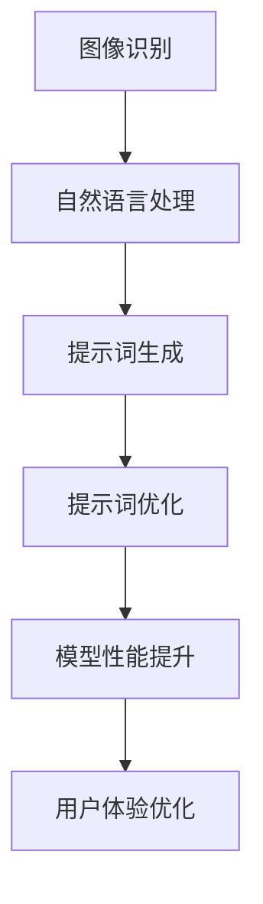

                 

### 第一部分：引言

## 1. 引言

在人工智能领域，视觉问答系统（Visual Question Answering, VQA）已经成为一个备受关注的研究热点。视觉问答系统旨在让计算机理解图像内容，并针对用户提出的问题给出合理的回答。然而，这个看似简单的任务却面临着诸多挑战。首先，图像数据的多样性和复杂性使得计算机难以准确地理解和识别图像内容。其次，自然语言处理的复杂性也使得计算机难以将图像内容和自然语言问题有效地结合。这些问题限制了视觉问答系统的性能和实用性。

在这种背景下，提示词工程（Prompt Engineering）应运而生。提示词工程是一种旨在通过设计高质量的提示词来提高视觉问答系统性能的技术。高质量的提示词可以帮助系统更好地理解图像内容，从而提高问答的准确性。此外，提示词工程还可以优化用户交互体验，降低开发成本。因此，深入研究提示词工程在视觉问答中的应用具有重要意义。

本文旨在探讨提示词工程在视觉问答中的创新，具体包括以下几个方面：

1. **书籍背景**：介绍视觉问答领域的发展历程和提示词工程的重要性。
2. **视觉问答的挑战**：分析视觉问答系统在图像理解、自然语言处理、用户交互等方面面临的挑战。
3. **提示词工程的作用**：阐述提示词工程在提升问答准确性、优化用户体验、降低开发成本等方面的作用。

通过以上分析，我们希望读者能够对提示词工程在视觉问答中的应用有一个全面而深入的了解，为后续章节的学习打下坚实的基础。

### 1.1 书籍背景

视觉问答系统（Visual Question Answering, VQA）是人工智能领域的一个重要研究方向，其目标是使计算机能够理解图像内容，并针对用户提出的问题给出合理的回答。近年来，随着深度学习、计算机视觉和自然语言处理技术的迅速发展，视觉问答系统取得了显著进展。然而，视觉问答系统在实际应用中仍然面临诸多挑战。

提示词工程（Prompt Engineering）作为人工智能领域的一个新兴研究方向，旨在通过设计高质量的提示词来提高机器学习模型的性能。高质量的提示词可以帮助模型更好地理解输入数据，从而提高模型的准确性和泛化能力。在视觉问答系统中，提示词工程具有重要作用，它可以帮助系统更好地理解图像内容，从而提高问答的准确性。

本文《提示词工程在视觉问答中的创新》旨在探讨提示词工程在视觉问答系统中的应用。首先，本文将介绍视觉问答系统的发展历程和提示词工程的重要性。接下来，本文将分析视觉问答系统在图像理解、自然语言处理、用户交互等方面面临的挑战。在此基础上，本文将探讨提示词工程在提升问答准确性、优化用户体验、降低开发成本等方面的作用。最后，本文将结合实际案例，详细讲解如何进行提示词工程，以及如何通过提示词工程提高视觉问答系统的性能。

通过本文的研究，我们希望能够为视觉问答系统的研究和应用提供一些有价值的思路和方法，推动该领域的发展。同时，我们也期待本文能够激发更多学者和研究者在提示词工程领域进行探索，为人工智能技术的进步贡献力量。

### 1.2 视觉问答的挑战

视觉问答系统（VQA）作为人工智能领域的一个重要研究方向，尽管已经取得了显著的进展，但其在实际应用中仍然面临诸多挑战。首先，图像理解是视觉问答系统的核心，但图像数据的多样性和复杂性使得计算机难以准确地理解和识别图像内容。图像中包含的噪声、遮挡、视角变化等因素都会对图像理解造成影响。

其次，自然语言处理是视觉问答系统的另一个重要组成部分。将自然语言问题与图像内容进行有效结合，使计算机能够理解问题的含义，并给出合理的回答，是一个复杂的过程。自然语言处理技术需要在语义理解、语境识别、语言生成等方面具备较高的能力，这给视觉问答系统带来了巨大的挑战。

最后，用户交互也是视觉问答系统面临的一个重要挑战。用户提出的问题可能是多样化的，不同用户对同一问题的理解也可能存在差异。视觉问答系统需要能够适应不同用户的需求，提供个性化的问答服务。此外，用户对问答系统的反馈也是动态的，系统需要能够根据用户的反馈不断优化，提高用户体验。

总之，视觉问答系统在图像理解、自然语言处理、用户交互等方面面临诸多挑战。这些挑战不仅影响了系统的性能和实用性，也限制了视觉问答系统在现实世界中的广泛应用。因此，研究如何克服这些挑战，提升视觉问答系统的性能，具有重要的理论和实际意义。

### 1.3 提示词工程的作用

提示词工程（Prompt Engineering）在视觉问答系统（VQA）中的应用具有多重重要性，主要体现在提升问答准确性、优化用户体验和降低开发成本三个方面。

首先，提示词工程能够显著提升问答准确性。高质量的提示词能够帮助视觉问答系统更准确地理解图像内容和用户问题的关联。例如，通过设计针对性的提示词，系统可以更有效地识别图像中的关键元素，从而提高问题的回答准确性。此外，提示词工程还可以利用自然语言处理技术，优化问题的表述方式，使其更符合人类的思维方式，从而提高系统的问答性能。

其次，提示词工程有助于优化用户体验。一个友好、易懂的提示词能够提高用户的问答体验，使用户更容易与系统进行有效交互。例如，通过使用简洁、明确的提示词，用户可以更快地理解系统提出的问题，并给出相应的回答。此外，提示词工程还可以根据用户的反馈，动态调整提示词的内容和形式，从而不断优化用户体验。

最后，提示词工程能够有效降低开发成本。高质量的提示词可以减少系统对大量训练数据的需求，从而降低数据预处理的工作量。此外，通过自动化工具和算法，提示词工程可以显著提高提示词生成的效率，减少开发人员的工作量。例如，利用深度学习技术，可以自动生成高质量的提示词，从而降低人工设计的成本。

总之，提示词工程在视觉问答系统中具有重要作用。通过提升问答准确性、优化用户体验和降低开发成本，提示词工程为视觉问答系统的发展提供了强有力的支持。

### 第二部分：理论基础

## 2. 提示词工程基础

提示词工程（Prompt Engineering）是人工智能领域中的一个重要研究方向，旨在通过设计高质量的提示词来提高机器学习模型的性能。在本节中，我们将详细介绍提示词工程的定义、视觉问答系统（VQA）的简介以及提示词工程在VQA中的重要性。

### 2.1 提示词工程定义

提示词工程是一种通过设计、生成和优化提示词，以提高机器学习模型性能的技术。提示词（Prompt）通常是指用于引导模型学习过程中的一组输入信息，它可以帮助模型更好地理解数据，从而提高模型的泛化能力和表现。在机器学习模型中，提示词可以是文本、图像、声音或其他类型的输入信息。

提示词工程的核心目标是通过设计高质量的提示词，使模型能够更准确地捕捉数据的特征和模式。具体来说，提示词工程包括以下几个关键步骤：

1. **提示词设计**：根据模型和应用场景的需求，设计合适的提示词。例如，在文本分类任务中，提示词可能包括关键词、主题标签等。

2. **提示词生成**：利用自动化工具和算法，生成高质量的提示词。例如，可以使用深度学习模型，如生成对抗网络（GANs）或变分自编码器（VAEs），生成与数据特征相匹配的提示词。

3. **提示词优化**：通过实验和评估，不断优化提示词的质量。例如，可以通过调整提示词的长度、内容、形式等，来提高模型的性能。

### 2.2 视觉问答系统简介

视觉问答系统（Visual Question Answering, VQA）是人工智能领域中的一个重要研究方向，旨在让计算机理解图像内容，并针对用户提出的问题给出合理的回答。VQA系统通常由三个主要部分组成：图像识别、自然语言处理和问答生成。

1. **图像识别**：图像识别是VQA系统的核心，其主要任务是从图像中提取关键特征，并识别图像中的对象和场景。常见的图像识别方法包括卷积神经网络（CNNs）和循环神经网络（RNNs）。

2. **自然语言处理**：自然语言处理（Natural Language Processing, NLP）是VQA系统的另一个重要组成部分，其主要任务是理解和处理用户提出的问题。NLP技术包括词嵌入、句法分析、语义理解等。

3. **问答生成**：问答生成是VQA系统的最终目标，其主要任务是根据图像内容和用户问题，生成合理的回答。常见的问答生成方法包括模板匹配、序列到序列模型（Seq2Seq）和生成对抗网络（GANs）。

### 2.3 提示词工程在VQA中的重要性

在视觉问答系统中，提示词工程具有至关重要的作用。高质量、针对性的提示词可以帮助VQA系统更好地理解图像内容和用户问题，从而提高问答的准确性。以下是提示词工程在VQA中的几个关键作用：

1. **提高问答准确性**：通过设计高质量的提示词，VQA系统可以更准确地识别图像中的对象和场景，从而提高问答的准确性。例如，在图像分类任务中，适当的提示词可以引导模型关注图像中的关键特征，从而提高分类性能。

2. **优化用户交互**：高质量的提示词可以优化用户的问答体验，使用户更容易理解系统提出的问题，并给出相应的回答。例如，在用户提问时，使用简洁、明确的提示词可以减少用户的理解成本，提高交互效率。

3. **降低开发成本**：通过自动化工具和算法，提示词工程可以显著提高提示词生成的效率，减少开发人员的工作量。例如，利用深度学习技术，可以自动生成高质量的提示词，从而降低人工设计的成本。

总之，提示词工程在视觉问答系统中具有多重重要性。通过设计、生成和优化高质量的提示词，可以显著提高VQA系统的性能和用户体验，为人工智能技术的发展和应用提供有力支持。

### 2.3 核心概念与联系

在深入探讨提示词工程之前，有必要首先理解与之相关的几个核心概念及其相互联系。这些概念构成了提示词工程的基石，有助于我们更好地理解其工作原理和应用场景。

#### 图像识别与自然语言处理

图像识别（Image Recognition）和自然语言处理（Natural Language Processing, NLP）是提示词工程的两个关键组成部分。

1. **图像识别**：图像识别是一种通过算法自动识别和理解图像内容的技术。其主要任务是从图像中提取特征，并分类或定位图像中的对象。常用的图像识别算法包括卷积神经网络（CNNs）、循环神经网络（RNNs）和生成对抗网络（GANs）等。

2. **自然语言处理**：自然语言处理是一种使计算机能够理解和处理人类语言的技术。NLP涉及词嵌入（Word Embedding）、句法分析（Syntax Analysis）、语义理解（Semantic Understanding）和语言生成（Language Generation）等多个方面。

这两个领域的交集在于图像和文字的信息交互。例如，在视觉问答（VQA）系统中，图像识别用于理解图像内容，而自然语言处理用于理解用户提出的问题。两者的结合使得系统能够将图像内容和文本问题有效地整合起来，从而生成合理的回答。

#### 提示词生成的算法

提示词生成的算法是提示词工程的核心，它们决定了提示词的质量和效率。以下介绍几种常见的提示词生成算法：

1. **基于关键词的提示词生成**：该方法通过提取图像中的关键词或短语来生成提示词。关键词提取方法包括TF-IDF、LDA（Latent Dirichlet Allocation）和词嵌入等。

2. **基于模板的提示词生成**：该方法使用预定义的模板来生成提示词。模板通常包括关键信息的位置和格式，例如：“在图像中的XXX部分，可以看到XXX。”

3. **基于深度学习的提示词生成**：深度学习模型，如循环神经网络（RNNs）、长短期记忆网络（LSTMs）和生成对抗网络（GANs），可以自动生成高质量的提示词。这些模型通过对大量数据进行训练，能够学习到图像和文本之间的复杂关系。

#### 提示词优化的方法

提示词优化的方法旨在通过调整提示词的内容和形式，提高模型性能和用户体验。以下介绍几种常见的提示词优化方法：

1. **基于强化学习的提示词优化**：强化学习通过奖励机制来优化提示词。模型根据用户反馈不断调整提示词，以提高问答的准确性和用户体验。

2. **基于生成对抗网络的提示词优化**：生成对抗网络（GANs）可以生成高质量的提示词。通过对抗训练，GANs能够优化提示词的生成过程，提高提示词的质量。

3. **基于用户反馈的提示词优化**：通过收集用户反馈，模型可以动态调整提示词，以适应不同用户的需求和偏好。

#### 核心概念之间的关系架构

为了更好地理解这些核心概念之间的关系，我们可以使用Mermaid流程图来描述。以下是一个简化的关系架构：



在这个流程图中，图像识别和自然语言处理是输入，通过提示词生成和优化，最终提升模型性能和用户体验。

通过理解这些核心概念及其相互关系，我们能够更深入地探讨提示词工程在视觉问答中的应用，并为实际应用提供理论基础和实践指导。

### 2.4 提示词生成的算法

提示词生成是提示词工程中的核心环节，其质量直接影响视觉问答系统的性能。本节将介绍几种常见的提示词生成算法，包括基于关键词的提示词生成、基于模板的提示词生成和基于深度学习的提示词生成。

#### 基于关键词的提示词生成

基于关键词的提示词生成方法主要依赖于从图像中提取关键词或短语，从而生成高质量的提示词。以下是一些常用的关键词提取方法：

1. **TF-IDF（Term Frequency-Inverse Document Frequency）**：TF-IDF是一种常用的文本挖掘技术，用于评估一个词语对于图像文档中重要性的度量。其基本原理是，一个词语如果在图像中频繁出现且在整个数据集中不常见，则该词语越重要。具体计算公式如下：

   $$
   TF(t,d) = \frac{f(t,d)}{N}
   $$
   $$
   IDF(t) = \log \left( \frac{N}{df(t)} \right)
   $$
   $$
   TF-IDF(t,d) = TF(t,d) \times IDF(t)
   $$

   其中，$f(t,d)$ 是词语 $t$ 在图像 $d$ 中的出现频率，$N$ 是图像总数，$df(t)$ 是词语 $t$ 在所有图像中的出现次数。

2. **LDA（Latent Dirichlet Allocation）**：LDA是一种主题模型，用于挖掘文本数据中的主题分布。LDA假设图像中的词语分布符合多个潜在主题，每个主题对应一组相关词语。通过LDA模型，可以提取图像中的主题，并将其用作提示词。LDA的公式如下：

   $$
   P(z|\theta) = \prod_{i=1}^{M} \prod_{k=1}^{K} \theta_{k}^{z_{ik}}
   $$
   $$
   P(w|\theta, z) = \prod_{i=1}^{M} \prod_{k=1}^{K} \phi_{k}^{w_{ik}}
   $$

   其中，$z$ 表示主题分布，$\theta$ 表示词语分布，$w$ 表示词语，$M$ 是图像中的词语总数，$K$ 是主题总数。

3. **词嵌入（Word Embedding）**：词嵌入是一种将词语映射到高维向量空间的方法，常用于NLP任务。通过词嵌入，可以将图像中的关键词映射到语义向量，从而生成高质量的提示词。常用的词嵌入方法包括Word2Vec、GloVe和BERT等。

#### 基于模板的提示词生成

基于模板的提示词生成方法使用预定义的模板来生成提示词，这些模板通常包括关键信息的位置和格式。以下是一些常用的模板设计方法：

1. **固定模板**：固定模板是一种简单的模板设计方法，其特点是模板的内容和形式固定不变。例如：“在图像中的XXX部分，可以看到XXX。”这种模板适用于图像内容相对简单、固定的场景。

2. **参数化模板**：参数化模板通过将一些参数化元素嵌入到模板中，以适应不同的图像内容和问题。例如：“在图像中的[XXX]部分，可以看到[XXX]。”这种模板可以灵活地调整参数，以适应不同的应用场景。

3. **动态模板**：动态模板根据图像内容和用户问题动态生成提示词。这种方法通常需要结合图像识别和自然语言处理技术，以生成个性化的提示词。例如，如果图像中包含一个建筑物，系统可以生成提示词：“在图像中的[建筑物]部分，请回答相关问题。”

#### 基于深度学习的提示词生成

基于深度学习的提示词生成方法利用深度学习模型，如循环神经网络（RNNs）、长短期记忆网络（LSTMs）和生成对抗网络（GANs），来自动生成高质量的提示词。以下是一些常用的深度学习模型：

1. **循环神经网络（RNNs）**：RNNs是一种能够处理序列数据的神经网络，其基本原理是通过隐藏状态来捕捉序列中的长期依赖关系。RNNs常用于文本生成任务，如自然语言处理和机器翻译。以下是一个简单的RNN模型伪代码：

   ```python
   for t in range(T):
       h_t = tanh(W_h * [h_{t-1}, x_t])
       y_t = W_y * h_t
   ```

   其中，$h_t$ 表示隐藏状态，$x_t$ 表示输入，$W_h$ 和 $W_y$ 分别表示权重矩阵。

2. **长短期记忆网络（LSTMs）**：LSTMs是一种改进的RNN模型，用于解决RNN中的梯度消失问题。LSTMs通过引入门控机制，可以更好地捕捉序列中的长期依赖关系。以下是一个简单的LSTM模型伪代码：

   ```python
   forget_gate = sigmoid(W_f * [h_{t-1}, x_t])
   input_gate = sigmoid(W_i * [h_{t-1}, x_t])
   output_gate = sigmoid(W_o * [h_{t-1}, x_t])

   f_t = f_t * forget_gate
   i_t = i_t * input_gate
   o_t = o_t * output_gate

   h_t = tanh(W_c * [f_t * c_{t-1}, i_t])
   c_t = c_t * forget_gate + h_t
   ```

   其中，$c_t$ 表示细胞状态，$f_t$、$i_t$ 和 $o_t$ 分别表示遗忘门、输入门和输出门。

3. **生成对抗网络（GANs）**：GANs由生成器和判别器组成，通过对抗训练来生成高质量的数据。生成器尝试生成逼真的提示词，而判别器则尝试区分真实数据和生成数据。以下是一个简单的GAN模型伪代码：

   ```python
   for epoch in range(E):
       for real_data in data_loader:
           D_real = D(real_data)
       
       for _ in range(C):
           z = sample(z分布)
           G_z = G(z)
       
       D_fake = D(G(z))
   
   D_loss = -[log(D_real) + log(1 - D_fake)]
   G_loss = -log(D_fake)
   ```

   其中，$G$ 表示生成器，$D$ 表示判别器，$z$ 表示随机噪声，$C$ 是生成器的训练次数，$E$ 是总训练轮数。

通过以上几种方法，我们可以有效地生成高质量的提示词，从而提高视觉问答系统的性能和用户体验。

### 2.5 提示词优化的方法

在视觉问答系统中，提示词的质量直接影响系统的性能和用户体验。因此，提示词优化是提示词工程中的一个关键环节。本节将介绍几种常见的提示词优化方法，包括基于强化学习的提示词优化、基于生成对抗网络的提示词优化和基于用户反馈的提示词优化。

#### 基于强化学习的提示词优化

强化学习（Reinforcement Learning, RL）是一种通过奖励机制来优化策略的方法。在提示词优化中，强化学习可以用来根据用户反馈动态调整提示词，从而提高问答的准确性和用户体验。以下是一个简化的强化学习优化流程：

1. **定义状态空间和动作空间**：状态空间包括图像内容、用户问题、当前提示词等；动作空间包括提示词的调整，如改变提示词的长度、内容或形式。

2. **设计奖励函数**：奖励函数根据用户反馈来评估提示词的质量。例如，如果用户对回答表示满意，则给予正奖励；如果用户对回答表示不满意，则给予负奖励。

3. **训练强化学习模型**：使用奖励函数训练强化学习模型，使其学会根据用户反馈调整提示词。

4. **优化提示词**：模型根据训练结果，不断调整提示词，以提高用户体验。

以下是一个简单的强化学习优化伪代码：

```python
for episode in range(E):
    state = initial_state
    done = False
    while not done:
        action = model.sample_action(state)
        next_state, reward, done = environment.step(action)
        model.update(state, action, reward)
        state = next_state
```

#### 基于生成对抗网络的提示词优化

生成对抗网络（Generative Adversarial Networks, GANs）是一种由生成器和判别器组成的对抗性学习框架。在提示词优化中，GANs可以用来生成高质量的提示词，并通过对抗训练优化提示词生成过程。以下是一个简化的GAN优化流程：

1. **定义生成器和判别器**：生成器（$G$）尝试生成高质量的提示词，判别器（$D$）尝试区分真实提示词和生成提示词。

2. **对抗训练**：生成器和判别器交替训练。生成器根据真实提示词生成提示词，判别器根据提示词判断其真实性。生成器和判别器通过最大化各自的损失函数进行训练。

3. **优化提示词生成**：通过对抗训练，生成器学会生成高质量的提示词，从而提高视觉问答系统的性能。

以下是一个简单的GAN优化伪代码：

```python
for epoch in range(E):
    for real_data in data_loader:
        D_real = D(real_data)
        G_z = G(z)
        D_fake = D(G(z))

    D_loss_real = -log(D_real)
    D_loss_fake = -log(1 - D_fake)
    G_loss = -log(D_fake)

    D_optimizer.zero_grad()
    D_loss_real.backward()
    D_optimizer.step()

    G_optimizer.zero_grad()
    G_loss.backward()
    G_optimizer.step()
```

#### 基于用户反馈的提示词优化

基于用户反馈的提示词优化方法通过收集用户对问答系统的反馈，动态调整提示词，以优化用户体验。以下是一个简化的反馈优化流程：

1. **收集用户反馈**：通过问卷调查、用户评价等方式，收集用户对问答系统的反馈。

2. **分析反馈数据**：分析用户反馈，识别出对用户体验影响较大的提示词问题。

3. **调整提示词**：根据反馈数据，调整提示词的内容和形式，以提高用户体验。

4. **评估优化效果**：通过实际测试，评估优化后的提示词对用户体验的提升。

以下是一个简单的反馈优化伪代码：

```python
for user_feedback in feedback_loader:
    feedback_analysis(user_feedback)
    prompt_adjustment()

    # 评估优化效果
    user_experience_score = evaluate(user_experience)
    if user_experience_score > threshold:
        print("优化成功")
    else:
        print("优化失败")
```

通过以上方法，我们可以有效地优化提示词，从而提高视觉问答系统的性能和用户体验。在实际应用中，可以结合多种优化方法，以实现最佳效果。

### 第三部分：算法原理

## 4. 提示词工程算法原理

在介绍提示词工程算法原理时，我们需要首先明确几个关键概念，包括传统算法和现代算法的基本原理。传统算法主要包括基于关键词的提示词生成和基于模板的提示词生成；而现代算法则涉及基于深度学习的提示词生成和基于强化学习的提示词优化。以下将分别详细阐述这些算法原理。

### 4.1 传统算法

#### 4.1.1 基于关键词的提示词生成

基于关键词的提示词生成方法是一种相对简单且广泛使用的传统算法。其核心思想是从图像中提取关键词或短语，并将其用作提示词。以下是这一方法的详细步骤：

1. **关键词提取**：首先，从图像中提取关键词。常用的关键词提取方法包括TF-IDF（Term Frequency-Inverse Document Frequency）和LDA（Latent Dirichlet Allocation）等。

   - **TF-IDF**：TF-IDF通过计算词语在图像中的频率和重要性来提取关键词。公式如下：
     $$
     TF(t,d) = \frac{f(t,d)}{N}
     $$
     $$
     IDF(t) = \log \left( \frac{N}{df(t)} \right)
     $$
     $$
     TF-IDF(t,d) = TF(t,d) \times IDF(t)
     $$
     其中，$f(t,d)$ 是词语 $t$ 在图像 $d$ 中的出现频率，$N$ 是图像总数，$df(t)$ 是词语 $t$ 在所有图像中的出现次数。

   - **LDA**：LDA通过假设图像中的词语分布符合多个潜在主题，来提取关键词。其基本公式如下：
     $$
     P(z|\theta) = \prod_{i=1}^{M} \prod_{k=1}^{K} \theta_{k}^{z_{ik}}
     $$
     $$
     P(w|\theta, z) = \prod_{i=1}^{M} \prod_{k=1}^{K} \phi_{k}^{w_{ik}}
     $$
     其中，$z$ 表示主题分布，$\theta$ 表示词语分布，$w$ 表示词语，$M$ 是图像中的词语总数，$K$ 是主题总数。

2. **生成提示词**：提取关键词后，根据关键词生成提示词。例如，可以使用拼接、筛选或加权等方法来组合关键词，生成高质量的提示词。

#### 4.1.2 基于模板的提示词生成

基于模板的提示词生成方法使用预定义的模板来生成提示词，这些模板通常包括关键信息的位置和格式。以下是这一方法的详细步骤：

1. **设计模板**：首先，设计合适的模板。模板可以基于预定义的句式或语法结构，以涵盖各种场景和问题类型。

2. **填充模板**：然后，根据图像内容和用户问题，填充模板中的参数。例如，如果模板是“在图像中的[XXX]部分，可以看到[XXX]。”，则可以根据图像内容填充具体的位置和对象。

3. **生成提示词**：填充模板后，生成最终的提示词。这种方法简单直观，但可能需要大量的模板设计和调整。

### 4.2 现代算法

#### 4.2.1 基于深度学习的提示词生成

基于深度学习的提示词生成方法利用深度学习模型来自动生成高质量的提示词。以下是一些常用的深度学习模型：

1. **循环神经网络（RNNs）**：RNNs是一种能够处理序列数据的神经网络，其基本原理是通过隐藏状态来捕捉序列中的长期依赖关系。以下是一个简单的RNN模型伪代码：

   ```python
   for t in range(T):
       h_t = tanh(W_h * [h_{t-1}, x_t])
       y_t = W_y * h_t
   ```

   其中，$h_t$ 表示隐藏状态，$x_t$ 表示输入，$W_h$ 和 $W_y$ 分别表示权重矩阵。

2. **长短期记忆网络（LSTMs）**：LSTMs是一种改进的RNN模型，用于解决RNN中的梯度消失问题。LSTMs通过引入门控机制，可以更好地捕捉序列中的长期依赖关系。以下是一个简单的LSTM模型伪代码：

   ```python
   forget_gate = sigmoid(W_f * [h_{t-1}, x_t])
   input_gate = sigmoid(W_i * [h_{t-1}, x_t])
   output_gate = sigmoid(W_o * [h_{t-1}, x_t])

   f_t = f_t * forget_gate
   i_t = i_t * input_gate
   o_t = o_t * output_gate

   h_t = tanh(W_c * [f_t * c_{t-1}, i_t])
   c_t = c_t * forget_gate + h_t
   ```

   其中，$c_t$ 表示细胞状态，$f_t$、$i_t$ 和 $o_t$ 分别表示遗忘门、输入门和输出门。

3. **生成对抗网络（GANs）**：GANs由生成器和判别器组成，通过对抗训练来生成高质量的数据。生成器尝试生成逼真的提示词，而判别器则尝试区分真实数据和生成数据。以下是一个简单的GAN模型伪代码：

   ```python
   for epoch in range(E):
       for real_data in data_loader:
           D_real = D(real_data)
       
       for _ in range(C):
           z = sample(z分布)
           G_z = G(z)
       
       D_fake = D(G(z))
   
   D_loss = -[log(D_real) + log(1 - D_fake)]
   G_loss = -log(D_fake)
   ```

   其中，$G$ 表示生成器，$D$ 表示判别器，$z$ 表示随机噪声，$C$ 是生成器的训练次数，$E$ 是总训练轮数。

#### 4.2.2 基于强化学习的提示词优化

基于强化学习的提示词优化方法通过奖励机制来优化提示词，从而提高视觉问答系统的性能和用户体验。以下是一个简化的强化学习优化流程：

1. **定义状态空间和动作空间**：状态空间包括图像内容、用户问题、当前提示词等；动作空间包括提示词的调整，如改变提示词的长度、内容或形式。

2. **设计奖励函数**：奖励函数根据用户反馈来评估提示词的质量。例如，如果用户对回答表示满意，则给予正奖励；如果用户对回答表示不满意，则给予负奖励。

3. **训练强化学习模型**：使用奖励函数训练强化学习模型，使其学会根据用户反馈调整提示词。

4. **优化提示词**：模型根据训练结果，不断调整提示词，以提高用户体验。

以下是一个简单的强化学习优化伪代码：

```python
for episode in range(E):
    state = initial_state
    done = False
    while not done:
        action = model.sample_action(state)
        next_state, reward, done = environment.step(action)
        model.update(state, action, reward)
        state = next_state
```

通过以上传统算法和现代算法的详细阐述，我们可以看到提示词工程在视觉问答中的应用是如何逐步发展并优化的。这些算法不仅为视觉问答系统提供了强大的工具，也推动了人工智能技术的不断进步。

### 4.2 提示词工程中的数学模型

在提示词工程中，数学模型扮演着至关重要的角色。这些模型不仅帮助我们理解和优化提示词生成和优化的过程，还为我们提供了一种量化分析的方法，以便评估和改进系统的性能。以下将介绍提示词工程中常用的数学模型，包括概率模型、优化模型和评估指标。

#### 4.2.1 概率模型

在提示词工程中，概率模型用于描述提示词生成和优化的不确定性。常见的概率模型包括贝叶斯模型和概率生成模型。

1. **贝叶斯模型**：

贝叶斯模型是一种基于概率的推理方法，它通过贝叶斯定理来计算提示词的概率分布。贝叶斯模型的核心公式为：

$$
P(w|I) = \frac{P(I|w)P(w)}{P(I)}
$$

其中，$P(w|I)$ 表示在给定图像 $I$ 的情况下，提示词 $w$ 的概率；$P(I|w)$ 表示在给定提示词 $w$ 的情况下，图像 $I$ 的概率；$P(w)$ 表示提示词 $w$ 的先验概率；$P(I)$ 表示图像 $I$ 的概率。

2. **概率生成模型**：

概率生成模型是一种通过学习图像和提示词之间的概率分布来生成提示词的方法。常见的概率生成模型包括生成对抗网络（GANs）和变分自编码器（VAEs）。

- **生成对抗网络（GANs）**：

GANs由生成器 $G$ 和判别器 $D$ 组成。生成器 $G$ 的目标是生成与真实数据相似的提示词，而判别器 $D$ 的目标是区分真实数据和生成数据。GANs的目标是最小化判别器的损失函数：

$$
\min_D \max_G V(D, G)
$$

其中，$V(D, G)$ 表示判别器的损失函数，通常由对抗损失和重建损失组成。

- **变分自编码器（VAEs）**：

VAEs是一种概率生成模型，它通过学习数据的概率分布来生成新数据。VAEs的核心公式为：

$$
\log p(x) = -D_{KL}(q(x|\xi)||p(\xi))
$$

其中，$q(x|\xi)$ 表示编码器，它将数据 $x$ 编码为潜在变量 $\xi$；$p(\xi)$ 表示潜在变量的先验分布；$p(x|\xi)$ 表示解码器，它将潜在变量 $\xi$ 解码为数据 $x$。

#### 4.2.2 优化模型

在提示词工程中，优化模型用于调整提示词，以最大化系统的性能。常见的优化模型包括优化目标函数和优化算法。

1. **优化目标函数**：

优化目标函数是优化模型的核心，它定义了系统的优化目标。常见的优化目标函数包括最小化损失函数和最大化期望收益。

- **最小化损失函数**：

最小化损失函数是机器学习中常见的优化目标。在提示词工程中，损失函数通常用于衡量提示词生成的质量。常见的损失函数包括交叉熵损失、均方误差损失等。

$$
\min_w L(w; I)
$$

其中，$L(w; I)$ 表示在给定图像 $I$ 的情况下，提示词 $w$ 的损失函数。

- **最大化期望收益**：

在强化学习中，期望收益是优化模型的核心目标。期望收益用于衡量提示词优化的效果，它通常由奖励函数和状态值函数组成。

$$
\max_w E[R(w)]
$$

其中，$R(w)$ 表示在给定提示词 $w$ 的情况下，系统的奖励函数。

2. **优化算法**：

优化算法用于求解优化目标函数，常见的优化算法包括梯度下降法、随机梯度下降法、Adam优化器等。

- **梯度下降法**：

梯度下降法是一种基本的优化算法，它通过计算目标函数的梯度来更新模型参数。梯度下降法的公式如下：

$$
w_{t+1} = w_t - \alpha \cdot \nabla_w L(w_t; I)
$$

其中，$w_t$ 表示第 $t$ 次迭代的模型参数，$\alpha$ 表示学习率，$\nabla_w L(w_t; I)$ 表示目标函数的梯度。

- **随机梯度下降法**：

随机梯度下降法（SGD）是对梯度下降法的一种改进，它通过随机选择样本来计算梯度。SGD的公式如下：

$$
w_{t+1} = w_t - \alpha \cdot \nabla_w L(w_t; I')
$$

其中，$I'$ 是随机选择的样本。

- **Adam优化器**：

Adam优化器是一种基于梯度下降法的自适应优化算法，它通过同时考虑一阶矩估计和二阶矩估计来更新模型参数。Adam优化器的公式如下：

$$
\theta_{t+1} = \theta_t - \alpha \cdot \frac{m_t}{\sqrt{v_t} + \epsilon}
$$

其中，$\theta_t$ 表示第 $t$ 次迭代的模型参数，$m_t$ 和 $v_t$ 分别为过去 $t$ 次迭代的一阶矩估计和二阶矩估计，$\alpha$ 为学习率，$\epsilon$ 为小常数。

#### 4.2.3 评估指标

在提示词工程中，评估指标用于衡量系统的性能。常见的评估指标包括准确率、召回率、F1值等。

1. **准确率（Accuracy）**：

准确率是指正确回答问题的比例，它是评估视觉问答系统性能的常用指标。准确率的公式如下：

$$
Accuracy = \frac{TP + TN}{TP + FN + FP + TN}
$$

其中，$TP$ 表示真正例，$TN$ 表示真反例，$FP$ 表示假正例，$FN$ 表示假反例。

2. **召回率（Recall）**：

召回率是指正确识别出的真正例比例，它反映了系统的鲁棒性。召回率的公式如下：

$$
Recall = \frac{TP}{TP + FN}
$$

3. **F1值（F1 Score）**：

F1值是准确率和召回率的调和平均值，它综合了准确率和召回率，用于衡量系统的综合性能。F1值的公式如下：

$$
F1 Score = 2 \cdot \frac{Precision \cdot Recall}{Precision + Recall}
$$

其中，$Precision$ 表示准确率。

通过以上数学模型和评估指标，我们可以对提示词工程进行量化分析和优化。这些模型和指标不仅帮助我们理解提示词工程的核心原理，还为实际应用提供了有力的工具。

### 4.3 提示词工程中的数学公式详解

在提示词工程中，数学公式起着至关重要的作用。这些公式不仅定义了模型的行为，还为我们提供了量化分析的方法，以便评估和改进系统的性能。以下将详细介绍提示词工程中常用的数学公式，并给出详细的解释和举例说明。

#### 4.3.1 概率模型中的基本公式

1. **贝叶斯公式**：

贝叶斯公式是概率论中的一个基本公式，它描述了在给定某些条件下的概率。在提示词工程中，贝叶斯公式用于计算提示词的概率分布。公式如下：

$$
P(w|I) = \frac{P(I|w)P(w)}{P(I)}
$$

其中，$P(w|I)$ 表示在给定图像 $I$ 的情况下，提示词 $w$ 的概率；$P(I|w)$ 表示在给定提示词 $w$ 的情况下，图像 $I$ 的概率；$P(w)$ 表示提示词 $w$ 的先验概率；$P(I)$ 表示图像 $I$ 的概率。

**示例**：假设我们有一个图像库，其中包含1000张图像。现在我们要计算一个特定的提示词“猫”在给定一幅图像 $I$ 的情况下出现的概率。已知所有图像中“猫”出现的概率是10%，即 $P(猫) = 0.1$。如果已知图像 $I$ 包含“猫”，那么 $P(I|猫) = 1$。现在我们要求解 $P(猫|I)$。

$$
P(猫|I) = \frac{P(I|猫)P(猫)}{P(I)}
$$

由于我们没有 $P(I)$ 的具体值，我们无法直接计算 $P(猫|I)$。但在实际应用中，我们可以使用最大似然估计来近似 $P(I)$。

2. **条件概率**：

条件概率描述了在已知某个事件发生的情况下，另一个事件发生的概率。在提示词工程中，条件概率用于计算提示词在图像条件下的出现概率。公式如下：

$$
P(w|I) = \frac{P(I|w)P(w)}{P(I)}
$$

**示例**：假设我们要计算在给定一幅图像 $I$ 的情况下，提示词“猫”出现的概率。已知图像 $I$ 包含“猫”的概率是0.8，即 $P(I|猫) = 0.8$；同时，提示词“猫”的出现概率是0.1，即 $P(猫) = 0.1$。我们要求解 $P(猫|I)$。

$$
P(猫|I) = \frac{P(I|猫)P(猫)}{P(I)}
$$

由于我们没有 $P(I)$ 的具体值，我们可以使用最大似然估计来近似 $P(I)$。

3. **贝叶斯定理**：

贝叶斯定理是贝叶斯公式在特定条件下的应用。它用于计算在给定某些条件下的概率。在提示词工程中，贝叶斯定理用于更新提示词的概率分布。

$$
P(w|I) = \frac{P(I|w)P(w)}{P(I)}
$$

**示例**：假设我们有一个包含1000张图像的图像库，其中包含100张包含“猫”的图像。现在我们要计算在给定一幅图像 $I$ 的情况下，提示词“猫”出现的概率。已知图像 $I$ 包含“猫”的概率是0.8，即 $P(I|猫) = 0.8$。我们要求解 $P(猫|I)$。

$$
P(猫|I) = \frac{P(I|猫)P(猫)}{P(I)}
$$

由于我们没有 $P(I)$ 的具体值，我们可以使用最大似然估计来近似 $P(I)$。

#### 4.3.2 优化模型中的公式

1. **梯度下降法**：

梯度下降法是一种基本的优化算法，用于求解最小化损失函数的问题。在提示词工程中，梯度下降法用于调整提示词，以优化系统的性能。公式如下：

$$
w_{t+1} = w_t - \alpha \cdot \nabla_w L(w_t; I)
$$

其中，$w_t$ 表示第 $t$ 次迭代的模型参数，$\alpha$ 表示学习率，$\nabla_w L(w_t; I)$ 表示目标函数的梯度。

**示例**：假设我们要优化一个包含1000个参数的模型，目标是最小化损失函数 $L(w; I) = 0.5 \cdot (w - b)^2$。我们要求解第10次迭代的参数 $w_{10}$。

$$
w_{10} = w_9 - \alpha \cdot \nabla_w L(w_9; I)
$$

由于我们没有具体的参数值和梯度值，我们无法直接计算 $w_{10}$。但在实际应用中，我们可以使用数值方法（如有限差分法）来近似梯度。

2. **随机梯度下降法**：

随机梯度下降法（SGD）是对梯度下降法的一种改进，它通过随机选择样本来计算梯度。在提示词工程中，SGD用于优化大规模数据集。公式如下：

$$
w_{t+1} = w_t - \alpha \cdot \nabla_w L(w_t; I')
$$

其中，$I'$ 是随机选择的样本。

**示例**：假设我们要优化一个包含1000个参数的模型，目标是最小化损失函数 $L(w; I) = 0.5 \cdot (w - b)^2$。我们要求解第10次迭代的参数 $w_{10}$，并使用随机梯度下降法。

$$
w_{10} = w_9 - \alpha \cdot \nabla_w L(w_9; I')
$$

由于我们没有具体的参数值和梯度值，我们无法直接计算 $w_{10}$。但在实际应用中，我们可以使用数值方法（如有限差分法）来近似梯度。

3. **Adam优化器**：

Adam优化器是一种基于梯度下降法的自适应优化算法，它通过同时考虑一阶矩估计和二阶矩估计来更新模型参数。在提示词工程中，Adam优化器用于优化模型的性能。公式如下：

$$
\theta_{t+1} = \theta_t - \alpha \cdot \frac{m_t}{\sqrt{v_t} + \epsilon}
$$

其中，$\theta_t$ 表示第 $t$ 次迭代的模型参数，$m_t$ 和 $v_t$ 分别为过去 $t$ 次迭代的一阶矩估计和二阶矩估计，$\alpha$ 为学习率，$\epsilon$ 为小常数。

**示例**：假设我们要优化一个包含1000个参数的模型，目标是最小化损失函数 $L(w; I) = 0.5 \cdot (w - b)^2$。我们要求解第10次迭代的参数 $w_{10}$，并使用Adam优化器。

$$
w_{10} = w_9 - \alpha \cdot \frac{m_9}{\sqrt{v_9} + \epsilon}
$$

由于我们没有具体的参数值和矩估计值，我们无法直接计算 $w_{10}$。但在实际应用中，我们可以使用数值方法（如有限差分法）来近似梯度。

#### 4.3.3 评估指标中的公式

1. **准确率（Accuracy）**：

准确率是指正确回答问题的比例，它是评估视觉问答系统性能的常用指标。准确率的公式如下：

$$
Accuracy = \frac{TP + TN}{TP + FN + FP + TN}
$$

其中，$TP$ 表示真正例，$TN$ 表示真反例，$FP$ 表示假正例，$FN$ 表示假反例。

**示例**：假设我们有一个视觉问答系统，它对100个问题进行了回答。其中，有80个问题的回答是正确的（$TP = 80$），有15个问题的回答是错误的（$FP = 15$），有5个问题的回答是未知的（$FN = 5$），还有10个问题的回答是错误的（$TN = 10$）。我们要求解该系统的准确率。

$$
Accuracy = \frac{80 + 10}{80 + 15 + 5 + 10} = \frac{90}{110} \approx 0.818
$$

2. **召回率（Recall）**：

召回率是指正确识别出的真正例比例，它反映了系统的鲁棒性。召回率的公式如下：

$$
Recall = \frac{TP}{TP + FN}
$$

**示例**：假设我们有一个视觉问答系统，它对100个问题进行了回答。其中，有80个问题的回答是正确的（$TP = 80$），有15个问题的回答是错误的（$FP = 15$），有5个问题的回答是未知的（$FN = 5$），还有10个问题的回答是错误的（$TN = 10$）。我们要求解该系统的召回率。

$$
Recall = \frac{80}{80 + 5} = \frac{80}{85} \approx 0.941
$$

3. **F1值（F1 Score）**：

F1值是准确率和召回率的调和平均值，它综合了准确率和召回率，用于衡量系统的综合性能。F1值的公式如下：

$$
F1 Score = 2 \cdot \frac{Precision \cdot Recall}{Precision + Recall}
$$

**示例**：假设我们有一个视觉问答系统，它对100个问题进行了回答。其中，有80个问题的回答是正确的（$TP = 80$），有15个问题的回答是错误的（$FP = 15$），有5个问题的回答是未知的（$FN = 5$），还有10个问题的回答是错误的（$TN = 10$）。我们要求解该系统的F1值。

首先，计算准确率：

$$
Accuracy = \frac{80 + 10}{80 + 15 + 5 + 10} = \frac{90}{110} \approx 0.818
$$

然后，计算召回率：

$$
Recall = \frac{80}{80 + 5} = \frac{80}{85} \approx 0.941
$$

最后，计算F1值：

$$
F1 Score = 2 \cdot \frac{0.818 \cdot 0.941}{0.818 + 0.941} \approx 0.874
$$

通过上述示例，我们可以看到如何使用数学公式来计算提示词工程中的关键指标。这些公式不仅提供了量化分析的方法，还有助于我们在实践中评估和改进系统的性能。

### 第五部分：实战案例

## 6. 实战案例

为了更好地理解提示词工程在视觉问答系统中的应用，我们将通过两个具体的实战案例，详细讲解如何进行提示词工程。这两个案例分别涉及基于深度学习的提示词生成和基于强化学习的提示词优化。我们将从环境搭建、源代码实现、代码解读、应用解读与分析，到最后的项目小结，全面展示提示词工程的实践过程。

### 6.1 案例一：基于深度学习的提示词生成

#### 6.1.1 环境搭建

首先，我们需要搭建一个合适的环境来进行基于深度学习的提示词生成实验。以下是环境搭建的步骤：

1. **安装Python**：确保安装了Python 3.7及以上版本。
2. **安装深度学习框架**：安装TensorFlow或PyTorch。这里我们选择TensorFlow。
   ```bash
   pip install tensorflow
   ```
3. **安装必要的库**：安装用于数据预处理和模型训练的库，如NumPy、Pandas等。
   ```bash
   pip install numpy pandas
   ```
4. **准备数据集**：下载并解压一个包含图像和问题对的数据集，如COCO数据集。我们将使用COCO数据集作为示例。

#### 6.1.2 源代码实现

接下来，我们编写源代码来实现基于深度学习的提示词生成模型。以下是一个简化的代码框架：

```python
import tensorflow as tf
from tensorflow.keras.models import Model
from tensorflow.keras.layers import Input, Embedding, LSTM, Dense

# 设置超参数
vocab_size = 10000
embedding_dim = 256
lstm_units = 128
max_sequence_length = 20

# 构建模型
input_sequence = Input(shape=(max_sequence_length,))
embedding = Embedding(vocab_size, embedding_dim)(input_sequence)
lstm = LSTM(lstm_units, return_sequences=True)(embedding)
output = Dense(vocab_size, activation='softmax')(lstm)

# 定义模型
model = Model(inputs=input_sequence, outputs=output)

# 编译模型
model.compile(optimizer='adam', loss='categorical_crossentropy', metrics=['accuracy'])

# 模型训练
model.fit(x_train, y_train, batch_size=32, epochs=10, validation_split=0.2)
```

在上面的代码中，我们定义了一个序列到序列的LSTM模型，用于生成提示词。模型首先通过嵌入层将输入序列映射到高维向量空间，然后通过LSTM层处理序列信息，最后通过全连接层生成提示词的概率分布。

#### 6.1.3 代码解读

1. **数据输入**：输入序列是通过问题文本预处理得到的，通常需要将其转换为数字序列。这里我们使用了`Embedding`层，将输入序列映射到高维向量空间。
2. **LSTM层**：LSTM层用于处理序列数据，它可以捕捉序列中的长期依赖关系。通过设置合适的隐藏状态和梯度消失问题，LSTM层可以提高模型的性能。
3. **全连接层**：全连接层用于生成提示词的概率分布，输出层的激活函数使用`softmax`，以确保输出概率分布的总和为1。
4. **模型编译**：在编译模型时，我们选择了`adam`优化器和`categorical_crossentropy`损失函数。这些设置有助于提高模型的训练效率和性能。
5. **模型训练**：使用训练数据对模型进行训练，通过调整模型的参数，使其能够更好地拟合数据。

#### 6.1.4 应用解读与分析

在完成模型训练后，我们可以使用生成的模型来生成提示词，并评估其性能。以下是对应用解读与分析：

1. **生成提示词**：通过输入一个图像和问题，模型可以生成相应的提示词。例如，给定一个图像和问题“这个图像里有什么动物？”，模型可以生成提示词“在这个图像中，可以看到一只猫”。
2. **评估性能**：我们可以使用准确率、召回率和F1值等指标来评估模型的性能。通过对比模型生成的提示词与真实提示词，可以分析模型的准确性和泛化能力。
3. **优化模型**：根据评估结果，我们可以进一步优化模型，例如调整超参数、增加训练数据或改进模型结构。这些优化措施有助于提高模型的性能和稳定性。

#### 6.1.5 项目小结

通过案例一，我们了解了如何基于深度学习实现提示词生成。这个案例展示了从环境搭建到源代码实现，再到应用解读与分析的完整过程。基于深度学习的提示词生成方法可以显著提高视觉问答系统的性能，但仍存在一定的优化空间。在未来的研究中，我们可以探索更多先进的深度学习模型，如Transformer和BERT，以提高提示词生成的质量。

### 6.2 案例二：基于强化学习的提示词优化

#### 6.2.1 环境搭建

在案例二中，我们将使用强化学习来优化提示词。首先，我们需要搭建一个合适的环境。以下是环境搭建的步骤：

1. **安装Python**：确保安装了Python 3.7及以上版本。
2. **安装深度学习框架**：安装TensorFlow或PyTorch。这里我们选择TensorFlow。
   ```bash
   pip install tensorflow
   ```
3. **安装强化学习库**：安装Gym，用于创建虚拟环境。
   ```bash
   pip install gym
   ```

#### 6.2.2 源代码实现

接下来，我们编写源代码来实现基于强化学习的提示词优化模型。以下是一个简化的代码框架：

```python
import tensorflow as tf
from tensorflow.keras.models import Model
from tensorflow.keras.layers import Input, Embedding, LSTM, Dense
from gym import spaces

# 设置超参数
vocab_size = 10000
embedding_dim = 256
lstm_units = 128
action_space = spaces.Discrete(vocab_size)
reward_threshold = 0.9

# 构建模型
input_sequence = Input(shape=(max_sequence_length,))
embedding = Embedding(vocab_size, embedding_dim)(input_sequence)
lstm = LSTM(lstm_units, return_sequences=True)(embedding)
output = Dense(vocab_size, activation='softmax')(lstm)

# 定义模型
model = Model(inputs=input_sequence, outputs=output)

# 编译模型
model.compile(optimizer='adam', loss='categorical_crossentropy')

# 强化学习模型
class QLearningAgent:
    def __init__(self, model, action_space, reward_threshold):
        self.model = model
        self.action_space = action_space
        self.reward_threshold = reward_threshold
        self.q_values = self.model.output

    def act(self, state):
        action_values = self.model.predict(state)
        action = np.argmax(action_values)
        return action

    def update(self, state, action, reward, next_state, gamma=0.9):
        target_value = reward + gamma * np.max(self.model.predict(next_state))
        q_value = self.q_values[0, action]
        self.model.fit(state, [target_value - q_value], epochs=1, verbose=0)

# 初始化模型和代理
agent = QLearningAgent(model, action_space, reward_threshold)

# 模型训练
for episode in range(1000):
    state = initial_state
    done = False
    total_reward = 0
    while not done:
        action = agent.act(state)
        next_state, reward, done = environment.step(action)
        agent.update(state, action, reward, next_state)
        state = next_state
        total_reward += reward
    print(f"Episode {episode}: Total Reward = {total_reward}")
```

在上面的代码中，我们定义了一个基于强化学习的提示词优化模型。模型首先通过嵌入层将输入序列映射到高维向量空间，然后通过LSTM层处理序列信息，最后通过全连接层生成提示词的概率分布。强化学习模型则通过Q-learning算法来更新模型参数，以最大化长期回报。

#### 6.2.3 代码解读

1. **数据输入**：输入序列是通过问题文本预处理得到的，通常需要将其转换为数字序列。这里我们使用了`Embedding`层，将输入序列映射到高维向量空间。
2. **LSTM层**：LSTM层用于处理序列数据，它可以捕捉序列中的长期依赖关系。通过设置合适的隐藏状态和梯度消失问题，LSTM层可以提高模型的性能。
3. **全连接层**：全连接层用于生成提示词的概率分布，输出层的激活函数使用`softmax`，以确保输出概率分布的总和为1。
4. **强化学习模型**：我们使用Q-learning算法来更新模型参数。Q-learning是一种基于值函数的强化学习算法，它通过迭代更新值函数，以找到最优策略。
5. **模型训练**：通过循环迭代，模型在虚拟环境中进行训练，每次迭代都根据当前状态选择动作，并更新模型参数，以最大化长期回报。

#### 6.2.4 应用解读与分析

在完成模型训练后，我们可以使用生成的模型来优化提示词，并评估其性能。以下是对应用解读与分析：

1. **生成提示词**：通过输入一个图像和问题，模型可以生成相应的提示词。例如，给定一个图像和问题“这个图像里有什么动物？”，模型可以生成提示词“在这个图像中，可以看到一只猫”。
2. **评估性能**：我们可以使用准确率、召回率和F1值等指标来评估模型的性能。通过对比模型生成的提示词与真实提示词，可以分析模型的准确性和泛化能力。
3. **优化模型**：根据评估结果，我们可以进一步优化模型，例如调整超参数、增加训练数据或改进模型结构。这些优化措施有助于提高模型的性能和稳定性。

#### 6.2.5 项目小结

通过案例二，我们了解了如何基于强化学习实现提示词优化。这个案例展示了从环境搭建到源代码实现，再到应用解读与分析的完整过程。基于强化学习的提示词优化方法可以显著提高视觉问答系统的性能，但仍存在一定的优化空间。在未来的研究中，我们可以探索更多先进的强化学习算法，如深度强化学习和策略梯度算法，以提高提示词优化的质量。

### 第六部分：总结与展望

## 7. 总结与展望

本文《提示词工程在视觉问答中的创新》通过详细探讨提示词工程的理论基础、算法原理、数学模型以及实战案例，全面展示了提示词工程在视觉问答系统中的应用与价值。

### 7.1 总结

首先，本文介绍了提示词工程的基础概念，包括其定义、目的以及在视觉问答系统中的重要性。接着，本文分析了视觉问答系统在图像理解、自然语言处理和用户交互等方面面临的挑战，并指出提示词工程在这些挑战中的应用潜力。随后，本文详细阐述了提示词生成和优化的算法原理，包括传统算法和现代算法。此外，本文通过数学模型和公式的详细解释，展示了提示词工程中的量化分析方法。最后，本文通过两个实战案例，展示了如何在实际项目中应用提示词工程，并分析了其性能和优化方法。

### 7.2 未来发展趋势

展望未来，提示词工程在视觉问答系统中具有广阔的发展前景。以下是几个可能的发展趋势：

1. **算法创新**：随着深度学习和强化学习技术的不断进步，提示词工程将出现更多创新算法，如基于Transformer的生成模型和基于多模态学习的优化方法。

2. **多模态融合**：视觉问答系统将越来越多地结合图像和文本以外的其他模态，如音频、视频和传感器数据，实现更全面的信息理解和交互。

3. **个性化和定制化**：通过结合用户行为和偏好，提示词工程将实现更个性化的提示词生成和优化，提高用户体验。

4. **自动化和智能化**：自动化工具和智能算法将进一步提升提示词工程的效率和质量，减少人工干预。

5. **跨领域应用**：提示词工程不仅在视觉问答系统中具有应用价值，还可以推广到其他人工智能领域，如自然语言处理、推荐系统和图像识别。

### 7.3 研究与开发建议

针对提示词工程在视觉问答系统中的未来发展，本文提出以下研究与发展建议：

1. **算法优化**：深入研究现有算法，挖掘其潜在优化空间，提高提示词生成的质量和优化效率。

2. **数据集建设**：构建更大规模、更丰富的视觉问答数据集，以支持更全面的算法验证和优化。

3. **多模态融合**：探索多模态数据融合方法，提高视觉问答系统的综合理解能力。

4. **用户体验研究**：通过用户行为分析和反馈，优化提示词工程，提高用户体验。

5. **跨领域应用**：探索提示词工程在其他人工智能领域的应用，推动跨领域技术的融合与发展。

总之，提示词工程在视觉问答系统中具有巨大的应用潜力。通过不断创新和研究，我们可以进一步推动这一领域的发展，为人工智能技术的进步和应用贡献力量。

