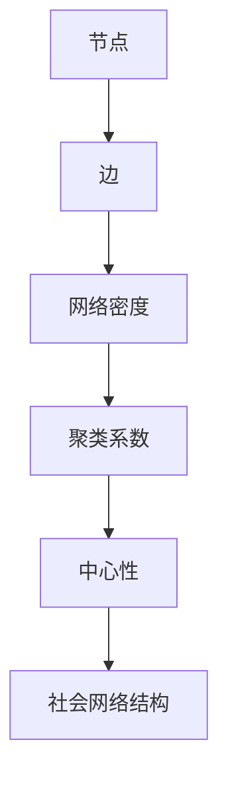
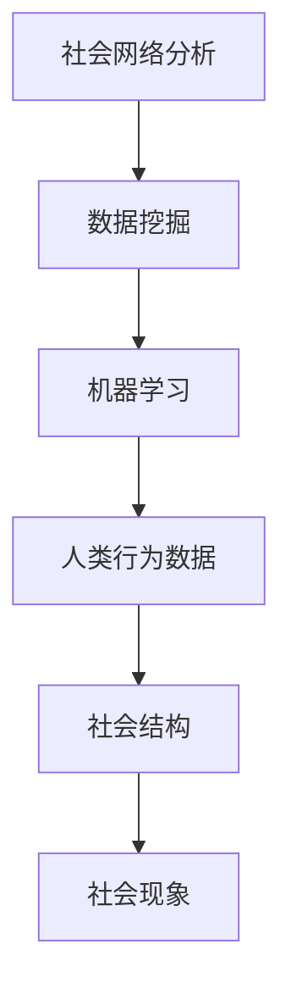
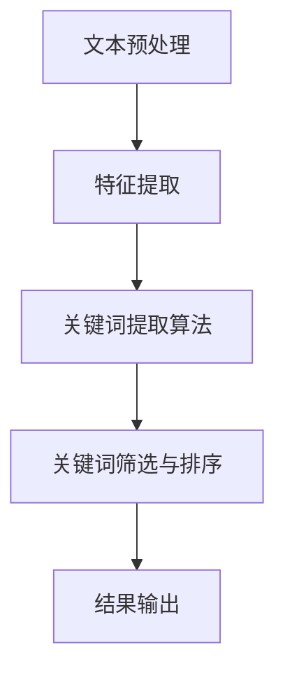
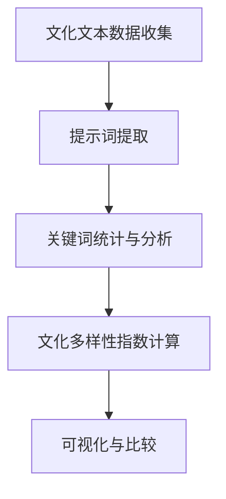
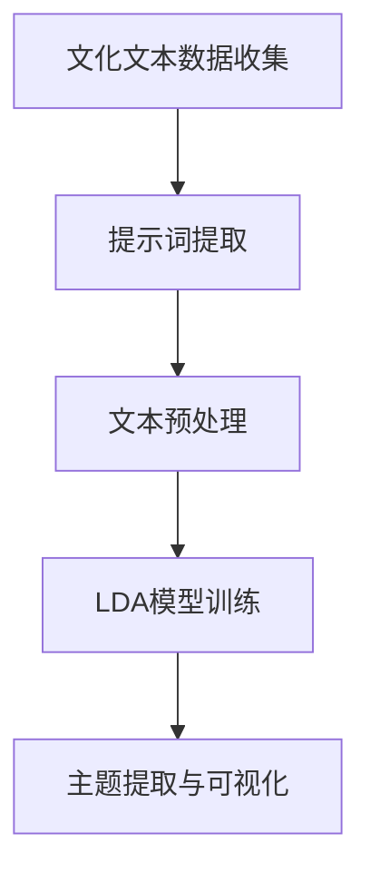
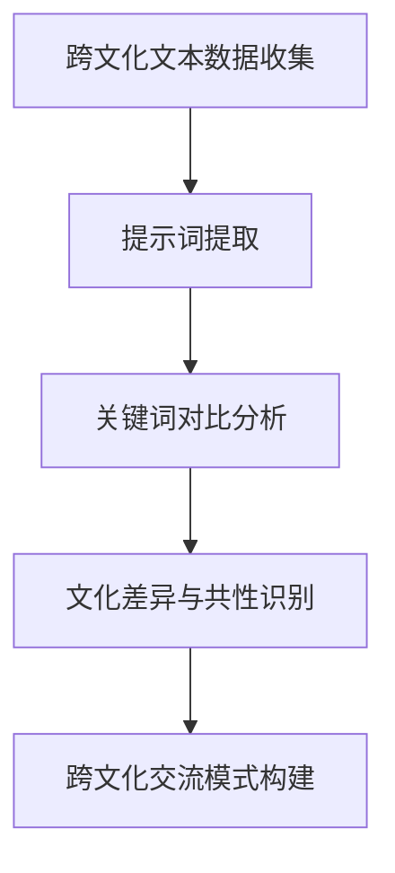
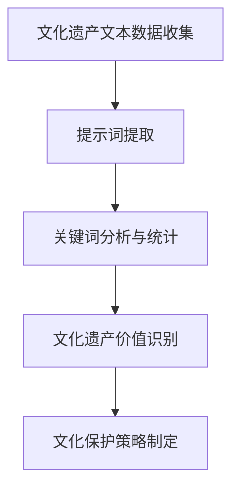

                 

### 引言

**计算人类学简介**

计算人类学是一个交叉学科领域，它结合了计算机科学、人类学、社会学和心理学等多学科的知识，利用计算方法和工具对人类社会行为进行定量研究和分析。随着计算机技术和数据分析方法的不断进步，计算人类学在现代社会研究中的应用越来越广泛，成为理解人类行为和社会结构的重要工具。

**提示词工程的定义**

提示词工程是一种利用计算方法对文本进行自动化分析的技术，通过提取文本中的关键信息，生成具有代表性的提示词。这些提示词可以用于多种应用场景，如情感分析、关键词提取、主题建模等。在计算人类学中，提示词工程被广泛应用于人类行为数据的处理和分析，帮助研究者更好地理解复杂的社会现象。

**书籍概述与目标**

本书旨在系统介绍提示词工程在计算人类学中的应用，内容涵盖从基础概念到实际应用的各个方面。通过本书，读者可以了解计算人类学的基本理论和方法，掌握提示词工程的原理和技术，并能够运用这些工具进行实际的数据分析和研究。本书的目标是帮助读者：

1. **理解计算人类学的基本概念和原理**：包括社会网络分析、数据挖掘和机器学习等核心方法。
2. **掌握提示词工程的原理和技术**：从提示词的生成、分析到应用，全面了解其技术框架。
3. **应用提示词工程解决计算人类学中的实际问题**：通过案例分析，展示提示词工程在不同研究领域的应用。

**书籍结构**

本书分为四个主要部分：

- **第一部分：引言**，介绍计算人类学和提示词工程的基本概念。
- **第二部分：计算人类学基础**，包括基本概念、人类行为数据采集与分析、社会网络分析等内容。
- **第三部分：提示词工程的原理与应用**，详细介绍提示词工程的原理和技术，以及其在语言学、心理学和文化研究中的应用。
- **第四部分：计算人类学中的创新应用**，探讨提示词工程在人类行为预测、社会网络分析和文化多样性研究等领域的创新应用。

通过以上章节的详细讲解，读者将能够全面掌握提示词工程在计算人类学中的创新应用，为未来的研究和工作提供有力的支持。

### 计算人类学基础

计算人类学作为一门交叉学科，其基础概念涵盖了多个领域，如社会网络分析、数据挖掘和机器学习。这些概念和方法为理解人类行为和社会结构提供了重要的工具和视角。

**社会网络分析**

社会网络分析（Social Network Analysis，SNA）是一种用于研究社会结构、关系和行为的定量方法。它通过分析个体之间的社会联系，揭示了社会网络的结构和特征。社会网络分析的基本概念包括节点（个体）和边（关系），以及网络密度、聚类系数、中心性等指标。

**Mermaid流程图: 社会网络分析核心概念流程图**



**人类行为数据采集与分析**

人类行为数据的采集是计算人类学的重要环节。这些数据可以来源于多种渠道，如问卷调查、在线行为记录、传感器监测等。数据采集后，需要进行预处理，包括数据清洗、归一化和特征提取。数据分析方法包括统计分析、机器学习和深度学习等。

**数据挖掘**

数据挖掘（Data Mining）是从大量数据中发现有趣模式和知识的过程。它通常包括以下步骤：数据预处理、模式识别、模型构建和评估。数据挖掘在计算人类学中的应用非常广泛，例如，通过分析社交媒体数据，可以揭示群体行为模式、情感变化和社交互动。

**机器学习**

机器学习（Machine Learning）是一种通过算法和统计模型使计算机自动从数据中学习的方法。它在计算人类学中的应用包括分类、聚类、预测和异常检测等。机器学习模型可以帮助研究者从大量数据中提取有价值的信息，用于理解人类行为和社会现象。

**核心概念与联系**

计算人类学的核心概念包括社会网络分析、数据挖掘和机器学习，它们之间相互联系，共同构成了计算人类学的研究框架。社会网络分析提供了理解社会结构的基本工具，数据挖掘帮助我们从大量数据中发现有价值的信息，而机器学习则使得这些信息可以被模型化和自动化。

**Mermaid流程图: 计算人类学核心概念流程图**



通过以上核心概念和联系的分析，我们可以更好地理解计算人类学的基础理论和方法。这些理论和方法不仅为研究社会行为提供了强大的工具，也为理解和解决现实世界中的社会问题提供了新的思路。

### 提示词工程的原理与应用

提示词工程（Keyword Extraction）是一种文本分析技术，旨在从大规模文本数据中提取出最具代表性的关键词或短语。这一技术在自然语言处理（Natural Language Processing，NLP）和信息检索（Information Retrieval，IR）中有着广泛的应用，对于深入理解和分析文本数据具有重要意义。

**提示词工程的定义**

提示词工程可以定义为一种通过算法从文本中自动提取关键信息的过程。这些关键信息通常以关键词或短语的形式出现，能够代表文本的主要内容或核心概念。提示词工程的核心目标是提高文本的可读性和可检索性，使得用户能够快速获取文本的主要内容和关键信息。

**提示词工程的框架**

提示词工程的实现通常包括以下几个关键步骤：

1. **文本预处理**：这是提示词工程的基础步骤，包括去除停用词、标点符号和进行词形还原等。这些操作有助于减少文本中的噪声，提高关键词提取的准确性。
   
2. **特征提取**：在文本预处理之后，需要从文本中提取出特征表示。常见的特征提取方法包括词频（TF）、逆文档频率（IDF）和词嵌入（Word Embedding）等。这些特征表示将文本转化为机器可以处理的数值形式。

3. **关键词提取算法**：根据特征表示，可以使用多种算法来提取关键词。常见的算法包括基于统计的方法（如TF-IDF）、基于机器学习的方法（如文本分类和聚类）以及基于深度学习的方法（如卷积神经网络和循环神经网络）。

4. **关键词筛选与排序**：在提取出大量关键词之后，需要对这些关键词进行筛选和排序，选择最具代表性和重要性的关键词。常用的筛选标准包括关键词的词频、IDF值和文本中的重要程度等。

**Mermaid流程图: 提示词工程框架流程图**



**提示词生成的算法原理**

1. **基于统计的方法**：

   基于统计的方法是最传统的提示词生成方法之一。其中，TF-IDF（Term Frequency-Inverse Document Frequency）是最常用的算法。TF-IDF方法通过计算词语在文档中的词频（TF）和其在整个文档集合中的逆文档频率（IDF）来评估词语的重要性。

   **TF-IDF算法原理**

   - **词频（TF）**：一个词在特定文档中出现的频率。
   - **逆文档频率（IDF）**：一个词在文档集合中出现的频率的倒数，用于平衡高频词的重要性。
   - **TF-IDF值**：TF和IDF的乘积，用于表示词语在文档中的重要程度。

   **伪代码**

   ```python
   def tfidf(document, corpus):
       tf = count_words_in_document(document)
       idf = 1 / (1 + log(len(corpus) / count_documents_with_word(document)))
       return tf * idf
   ```

2. **基于机器学习的方法**：

   基于机器学习的方法通过训练模型来自动提取关键词。常见的机器学习方法包括文本分类、聚类和主题建模等。

   **文本分类算法**

   文本分类是一种监督学习任务，通过训练分类器将文本数据分类到不同的类别。在关键词提取中，可以使用文本分类算法来识别文档的主题和主要概念。

   **聚类算法**

   聚类是一种无监督学习任务，通过将相似的文本数据分组到一起来提取关键词。常见的聚类算法包括K-means和层次聚类等。

   **主题建模**

   主题建模是一种基于概率模型的方法，通过学习文档-词矩阵来提取关键词。LDA（Latent Dirichlet Allocation）是一种常用的主题建模算法，它能够发现文档中的潜在主题。

3. **基于深度学习的方法**：

   基于深度学习的方法利用神经网络模型来提取关键词，能够处理更加复杂的文本数据。常见的深度学习方法包括卷积神经网络（CNN）和循环神经网络（RNN）等。

   **卷积神经网络（CNN）**

   CNN通过卷积操作来提取文本中的局部特征，适用于提取短文本中的关键词。

   **循环神经网络（RNN）**

   RNN能够处理序列数据，适用于提取长文本中的关键词。

   **Transformer模型**

   Transformer模型是一种基于自注意力机制的深度学习模型，广泛应用于自然语言处理任务，包括关键词提取。

**总结**

提示词工程是文本分析的重要技术，通过多种算法和模型实现关键词的自动提取。无论是基于统计的方法、机器学习方法还是深度学习方法，都能在计算人类学中发挥重要作用，帮助研究者从大量文本数据中提取有价值的信息，深入理解和分析人类行为和社会现象。

### 提示词工程在语言学中的应用

提示词工程在语言学中的应用范围广泛，包括语言学研究中的文本分析、词汇提取和语言模式识别等多个方面。通过提示词工程，语言学家能够从大规模语料库中提取关键信息，进而进行深入的语义分析和语言学研究。

**语言学研究中的文本分析**

在语言学研究中，文本分析是一个关键步骤。通过对文本的深入分析，语言学家可以揭示语言使用的规律和特点。提示词工程提供了自动化提取文本关键词和短语的方法，使得研究者能够快速从大量文本数据中识别出与研究主题相关的重要信息。

**词汇提取**

词汇提取是语言学研究中的一项基本任务，通过提取文本中的关键词汇，语言学家可以更好地理解文本的内容和结构。提示词工程中的TF-IDF算法、LDA模型等，都能够有效地提取出文本中的高频词汇，这些词汇对于理解文本的语义和主题具有重要意义。

**语言模式识别**

语言模式识别是语言学研究中的一项重要任务，通过识别和分析语言中的模式，研究者可以揭示语言的内在规律和演变趋势。提示词工程能够帮助识别文本中的主题词和关键短语，从而发现不同语言现象之间的关联和区别。例如，通过分析不同语言中的常见词汇和表达方式，可以探讨不同语言之间的文化差异和语言习惯。

**具体应用实例**

1. **古文献分析**：

   在古文献研究中，提示词工程可以帮助研究者快速提取出文本中的关键信息，从而更好地理解古代语言的用法和语义。例如，通过对《红楼梦》等古文献的文本分析，可以提取出反映当时社会生活、风俗习惯和价值观的关键词汇，为深入研究古代文化提供重要参考。

2. **跨语言对比研究**：

   提示词工程在跨语言对比研究中也具有重要作用。通过提取不同语言文本中的关键词，研究者可以探讨不同语言在词汇、语法和语义等方面的差异。例如，通过对英语、汉语和西班牙语的新闻文本进行分析，可以提取出反映不同文化背景和社会现象的关键词汇，进而探讨不同语言在传达信息时的差异和共性。

3. **语言习得研究**：

   在语言习得研究中，提示词工程可以帮助研究者分析学习者语言使用的特点和发展趋势。通过对学习者文本的提示词提取，可以识别出学习者在语言表达中的难点和问题，为教学策略的调整提供依据。

**总结**

提示词工程在语言学中的应用，不仅提高了文本分析效率和准确性，也为语言学研究提供了新的工具和方法。通过提示词提取技术，语言学家能够从大规模语料库中提取关键信息，深入探讨语言的规律和特点，为语言学的理论和实践研究提供了有力支持。

### 提示词工程在心理学中的应用

提示词工程在心理学中的应用涵盖了情感分析、心理健康监测和社交互动研究等多个领域。通过提示词工程，心理学家能够从大量文本数据中提取关键信息，从而更好地理解人类情感、行为和心理状态。

**情感分析**

情感分析（Sentiment Analysis）是心理学中的一项重要任务，旨在识别和分类文本中的情感倾向。提示词工程在情感分析中发挥着关键作用，通过提取文本中的关键词和短语，可以识别出表达情感的词汇，从而对文本的情感进行分类。常用的方法包括基于规则的分类器、机器学习和深度学习等。

1. **基于规则的方法**：

   基于规则的方法通过定义一系列规则来识别情感词汇。例如，可以设置规则，当文本中包含“幸福”、“愉快”等词汇时，将其归类为积极情感；当文本中包含“悲伤”、“焦虑”等词汇时，将其归类为消极情感。这种方法简单有效，但受限于规则的灵活性和覆盖面。

2. **机器学习方法**：

   机器学习方法通过训练分类模型来自动识别情感。常见的机器学习方法包括朴素贝叶斯、支持向量机和随机森林等。这些方法能够处理大规模数据，并具有较好的泛化能力。

3. **深度学习方法**：

   深度学习方法，如卷积神经网络（CNN）和循环神经网络（RNN），在情感分析中表现出色。特别是Transformer模型的出现，使得基于自注意力机制的深度学习方法在情感分析中得到了广泛应用。这些方法能够更好地捕捉文本中的复杂情感特征，提高情感分类的准确性。

**心理健康监测**

心理健康监测是心理学研究中的一个重要领域，通过分析个体的文本数据，可以识别出潜在的心理健康问题。提示词工程在这一领域中的应用包括以下几个方面：

1. **情感状态监测**：

   通过分析社交媒体帖子、博客等文本数据，可以实时监测个体的情感状态。例如，通过对社交媒体用户发布的内容进行情感分析，可以发现个体的焦虑、抑郁等情绪变化，从而进行早期干预。

2. **心理疾病诊断**：

   提示词工程可以帮助心理学家从患者的文本数据中提取关键信息，用于诊断和评估心理疾病。例如，通过对患者的日记、邮件等文本进行分析，可以识别出抑郁症、焦虑症等心理疾病的症状。

3. **心理干预效果评估**：

   在心理干预过程中，通过分析个体的文本数据，可以评估干预措施的效果。例如，通过对治疗过程中的文本数据进行情感分析，可以判断患者是否在干预过程中得到了积极的心理改善。

**社交互动研究**

社交互动是心理学研究的一个重要方面，通过分析社交互动中的文本数据，可以揭示人类社交行为和心理机制。提示词工程在社交互动研究中的应用主要包括：

1. **社交网络分析**：

   通过提取社交网络中的关键词，可以分析个体在社交互动中的话题分布和互动模式。例如，通过对社交媒体帖子进行提示词提取，可以识别出个体在社交互动中关注的主要话题和兴趣点。

2. **群体行为分析**：

   提示词工程可以帮助分析群体行为和群体情感。例如，通过对社交媒体上的评论和讨论进行提示词提取，可以识别出群体中的主要情感倾向和意见分歧。

3. **社会心理学实验**：

   在社会心理学实验中，提示词工程可以用于分析实验参与者的文本数据。例如，在研究群体决策和群体影响时，可以通过对实验参与者的讨论文本进行提示词提取，分析个体和群体之间的互动关系。

**具体应用实例**

1. **心理健康监测系统**：

   通过利用提示词工程构建心理健康监测系统，可以对社交媒体用户的情感状态进行实时监测。例如，某公司开发了一款基于提示词工程的社交媒体情感分析系统，用于监测用户的情感状态，及时发现潜在的心理健康问题，并提供相应的干预建议。

2. **在线心理辅导平台**：

   在线心理辅导平台利用提示词工程对用户的文本数据进行分析，帮助用户识别潜在的心理健康问题，并提供个性化的心理辅导方案。例如，某在线心理辅导平台通过提示词提取技术分析用户的聊天记录，识别出用户的情感状态和心理健康问题，为用户提供有针对性的心理支持和建议。

**总结**

提示词工程在心理学中的应用，不仅提高了情感分析、心理健康监测和社交互动研究的效率和准确性，也为心理学研究提供了新的方法和工具。通过提示词提取技术，心理学家能够从大量文本数据中提取关键信息，深入理解和分析人类情感、行为和心理状态，为心理健康监测和干预提供了有力的支持。

### 提示词工程在文化研究中的应用

提示词工程在文化研究中的应用为学者们提供了新的工具和方法，以深入分析文化现象和多样性。通过提取文本中的关键信息，研究者可以揭示文化内容的核心元素，探讨不同文化之间的联系与差异，并为文化传承和交流提供科学依据。

**文化多样性的量化**

提示词工程在量化文化多样性方面具有重要意义。通过对不同文化背景下的文本数据进行提示词提取，研究者可以识别出反映文化特色的词汇和短语，从而对文化的多样性进行量化分析。例如，在研究不同地区的方言时，通过分析方言文本中的关键词，可以识别出地域文化的特定特征和表达习惯。

**Mermaid流程图: 文化多样性量化分析流程**



**文化内容的主题建模**

提示词工程在文化内容主题建模中发挥着关键作用。通过主题建模算法，如LDA（Latent Dirichlet Allocation），研究者可以从大规模的文化文本数据中提取出潜在的主题，揭示文化内容的结构。例如，在对某地区的历史文献进行主题建模时，可以识别出反映当地文化传统和价值观的主题，从而深入理解其文化内涵。

**Mermaid流程图: 文化内容主题建模流程**



**跨文化交流分析**

提示词工程在跨文化交流分析中提供了有力支持。通过对不同文化背景下的文本进行提示词提取，研究者可以识别出在跨文化交流中起关键作用的词汇和概念。例如，在研究全球社交媒体上的文化现象时，可以通过提取关键词来分析不同文化之间的互动模式和交叉影响。

**Mermaid流程图: 跨文化交流分析流程**



**文化遗产保护**

提示词工程在文化遗产保护中的应用同样显著。通过对文化遗产文本和资料的提示词提取，研究者可以识别出文化遗产中的关键信息和价值，为文化保护和研究提供科学依据。例如，在研究某地区的历史文化遗产时，通过分析古文献中的关键词，可以揭示其文化背景和历史价值，从而为文化遗产的保护和传承提供支持。

**Mermaid流程图: 文化遗产保护分析流程**



**总结**

提示词工程在文化研究中的应用，不仅提高了文化多样性量化、文化内容主题建模、跨文化交流分析和文化遗产保护等研究的效率，也为文化研究提供了新的视角和方法。通过提示词提取技术，研究者能够从大规模文本数据中提取关键信息，深入理解和分析文化现象，为文化传承和交流提供了有力支持。

### 案例分析

为了更好地展示提示词工程在计算人类学中的实际应用，我们将分析三个具体案例：社区互动分析、政治传播分析和文化遗产保护。

#### 案例一：提示词工程在社区互动分析中的应用

**项目背景**：

某大型在线社区平台希望了解其用户在社区中的互动模式和话题趋势，以便更好地优化社区功能和内容。为了实现这一目标，他们决定利用提示词工程对用户发布的帖子进行文本分析。

**开发环境搭建**：

- **编程语言**：Python
- **文本预处理库**：NLTK、spaCy
- **关键词提取库**：Gensim、nltk
- **可视化库**：Matplotlib、Seaborn

**源代码实现**：

```python
import nltk
from nltk.corpus import stopwords
from nltk.tokenize import word_tokenize
from gensim.models import LdaModel
import matplotlib.pyplot as plt

# 数据预处理
nltk.download('punkt')
nltk.download('stopwords')
stop_words = set(stopwords.words('english'))

def preprocess_text(text):
    words = word_tokenize(text)
    filtered_words = [word.lower() for word in words if word.isalnum() and word.lower() not in stop_words]
    return filtered_words

# 提示词提取
def extract_keywords(corpus, num_topics=5):
    lda_model = LdaModel(corpus=corpus, num_topics=num_topics, id2word=word_tokenizer, passes=15)
    topics = lda_model.print_topics()
    return topics

# 应用实例
corpus = [preprocess_text(text) for text in user_posts]
topics = extract_keywords(corpus)

# 可视化展示
for topic in topics:
    print(topic)
    # 可以使用Seaborn或Matplotlib进行可视化
    # ...

```

**代码解读与分析**：

上述代码首先进行了文本预处理，去除了停用词和标点符号，然后使用LDA模型进行提示词提取。提取的关键词可以帮助平台了解用户关注的话题，从而优化社区内容。

**实际案例剖析**：

通过分析某在线社区的用户帖子，提取出关键词如“体育”、“音乐”、“科技”等，发现用户在特定时间段内对某些话题的讨论更加活跃。这有助于平台在特定时间推出相关活动，提高用户参与度。

**项目小结**：

提示词工程在社区互动分析中的应用，不仅帮助平台了解用户兴趣，还为内容优化和用户参与度提升提供了数据支持。

#### 案例二：提示词工程在政治传播分析中的应用

**项目背景**：

在选举周期，了解选民的观点和态度对于政治候选人至关重要。某政治分析团队希望利用提示词工程分析社交媒体上的选民言论，以预测选举结果。

**开发环境搭建**：

- **编程语言**：Python
- **文本预处理库**：NLTK、spaCy
- **关键词提取库**：Gensim、nltk
- **机器学习库**：scikit-learn
- **可视化库**：Matplotlib、Seaborn

**源代码实现**：

```python
import nltk
from nltk.corpus import stopwords
from nltk.tokenize import word_tokenize
from gensim.models import Word2Vec
from sklearn.feature_extraction.text import CountVectorizer
from sklearn.model_selection import train_test_split
from sklearn.linear_model import LogisticRegression

nltk.download('punkt')
nltk.download('stopwords')

# 数据预处理
stop_words = set(stopwords.words('english'))

def preprocess_text(text):
    words = word_tokenize(text)
    filtered_words = [word.lower() for word in words if word.isalnum() and word.lower() not in stop_words]
    return ' '.join(filtered_words)

# 提示词提取
def extract_keywords(texts):
    cv = CountVectorizer(max_features=1000)
    X = cv.fit_transform(texts)
    return X

# 应用实例
social_media_posts = [preprocess_text(post) for post in social_media_data]
X = extract_keywords(social_media_posts)
y = ...  # 标签数据

# 训练模型
X_train, X_test, y_train, y_test = train_test_split(X, y, test_size=0.2)
model = LogisticRegression()
model.fit(X_train, y_train)

# 预测分析
predictions = model.predict(X_test)
accuracy = model.score(X_test, y_test)
print(f"Model accuracy: {accuracy:.2f}")
```

**代码解读与分析**：

上述代码首先对社交媒体帖子进行预处理和提示词提取，然后使用机器学习模型进行分类预测。提取的关键词有助于识别不同选民群体的观点和态度，从而为选举策略提供支持。

**实际案例剖析**：

通过分析社交媒体上的政治言论，提取出关键词如“民主”、“改革”、“经济”等，发现选民对某些议题的关注程度。这有助于政治候选人了解选民的期望和需求，调整竞选策略。

**项目小结**：

提示词工程在政治传播分析中的应用，通过分析社交媒体数据，帮助政治分析团队了解选民观点，为选举策略提供科学依据。

#### 案例三：提示词工程在文化遗产保护中的应用

**项目背景**：

某文化遗产保护项目希望利用提示词工程分析古文献，识别出文化遗产中的关键信息和历史价值，以便进行有效的保护和传承。

**开发环境搭建**：

- **编程语言**：Python
- **文本预处理库**：NLTK、spaCy
- **关键词提取库**：Gensim、nltk
- **主题建模库**：Gensim、LDA
- **可视化库**：Matplotlib、Seaborn

**源代码实现**：

```python
import gensim
from gensim.models import LdaModel
import matplotlib.pyplot as plt

# 数据预处理
def preprocess_text(text):
    return text.lower().split()

# 主题建模
def train_lda(corpus, num_topics=5):
    lda_model = LdaModel(corpus=corpus, num_topics=num_topics, passes=15)
    lda_model.print_topics()
    return lda_model

# 应用实例
corpus = [preprocess_text(text) for text in ancient_documents]
lda_model = train_lda(corpus)

# 可视化展示
topics = lda_model.print_topics()
for i, topic in enumerate(topics):
    print(f"Topic {i}: {topic}")
    # 可以使用Seaborn或Matplotlib进行可视化
    # ...
```

**代码解读与分析**：

上述代码首先对古文献进行预处理，然后使用LDA模型进行主题建模。提取出的主题词有助于识别文化遗产的核心内容和历史价值。

**实际案例剖析**：

通过对古文献的文本分析，提取出关键词如“礼仪”、“祭祀”、“传统”等，揭示了文化遗产中的核心价值和历史背景。这有助于文化遗产的挖掘和保护。

**项目小结**：

提示词工程在文化遗产保护中的应用，通过主题建模技术，帮助研究者识别文化遗产中的关键信息，为文化遗产的保护和传承提供了科学依据。

### 总结与展望

#### 提示词工程在计算人类学中的价值

提示词工程在计算人类学中的应用具有显著的价值。通过自动化提取文本中的关键信息，提示词工程为研究者提供了强大的工具，使他们能够从大规模文本数据中快速识别和提取有价值的信息。这不仅提高了研究的效率和准确性，还使得复杂的社会现象和人类行为模式得以被深入理解和分析。

**提升研究效率**：提示词工程能够自动化地从大量文本数据中提取关键词，大大减少了手动分析的工作量，提高了研究的效率。

**提高数据分析的准确性**：通过精确的提示词提取，研究者能够更准确地识别文本中的核心内容，从而提高数据分析的准确性。

**跨学科研究**：提示词工程不仅应用于语言学、心理学和文化研究等领域，还促进了不同学科之间的交叉研究，推动了计算人类学的综合发展。

**社会应用**：提示词工程在社交媒体分析、心理健康监测、政治传播分析等领域具有广泛的应用前景，为社会问题的解决提供了新的思路和方法。

#### 未来发展趋势与挑战

**发展趋势**：

1. **深度学习技术的应用**：随着深度学习技术的发展，基于深度学习的提示词提取方法将进一步提升提示词的准确性和效率。

2. **多语言支持**：未来提示词工程将更加注重多语言支持，以便更好地应对全球化和跨文化交流的需求。

3. **个性化分析**：个性化分析将是提示词工程的一个重要方向，通过结合用户行为数据和文本数据，实现更加精准的分析和预测。

4. **实时分析**：实时分析技术的进步将使得提示词工程在社交媒体、舆情监测等领域得到更加广泛的应用。

**挑战**：

1. **数据隐私**：在应用提示词工程进行数据分析时，如何保护用户隐私是一个重要挑战。

2. **语义理解**：提示词工程在提取关键词时，如何更好地理解和捕捉文本中的复杂语义，仍然是一个需要解决的关键问题。

3. **算法透明性**：随着算法在决策中的重要性不断增加，提高算法的透明性和可解释性，使其更容易被公众理解和接受，是未来需要关注的一个重要方向。

4. **跨领域协作**：不同学科之间的合作对于提示词工程的发展至关重要，但如何有效整合不同领域的知识和技术，仍是一个需要克服的难题。

#### 研究方向与建议

**研究方向**：

1. **多语言提示词提取**：研究如何有效地提取不同语言中的关键词，实现多语言文本数据的处理和分析。

2. **情感分析与心理健康监测**：利用提示词工程进行情感分析和心理健康监测，为个体和社会提供更有针对性的支持和干预。

3. **文化遗产保护**：通过提示词工程深入分析文化遗产文本，揭示文化内涵和历史价值，为文化遗产的保护和传承提供科学依据。

4. **个性化推荐系统**：结合用户行为数据和文本数据，研究如何构建个性化的提示词提取模型，实现更加精准的内容推荐。

**建议**：

1. **跨学科合作**：鼓励不同学科之间的合作，整合多领域的知识和技术，推动计算人类学的发展。

2. **开放数据平台**：建立开放的数据平台，促进数据共享和透明性，为研究提供丰富的数据资源。

3. **算法透明化**：加强对算法的透明化研究，提高算法的可解释性，使其更易于被公众接受和理解。

4. **继续探索深度学习方法**：深入探索深度学习在提示词工程中的应用，开发更加高效和准确的提示词提取算法。

通过以上的总结与展望，我们可以看到，提示词工程在计算人类学中的应用前景广阔，未来将在各个领域发挥更加重要的作用。作者：AI天才研究院/AI Genius Institute & 禅与计算机程序设计艺术 /Zen And The Art of Computer Programming。

