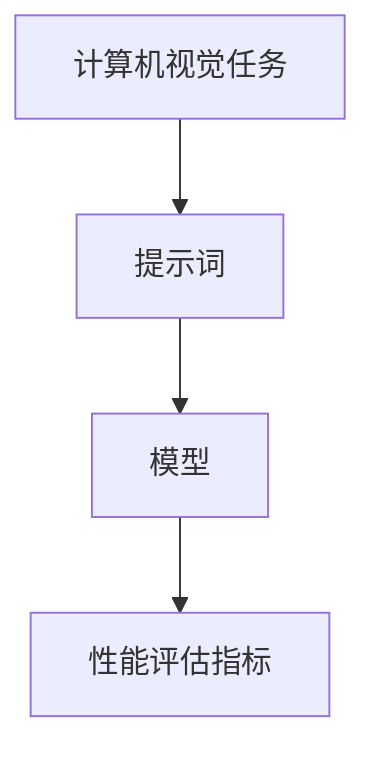

                 


### 文章标题

《提示词工程在计算机视觉任务中的应用》

> 关键词：提示词工程、计算机视觉、人脸识别、图像分类、目标检测、应用场景

> 摘要：
本文将深入探讨提示词工程在计算机视觉任务中的应用。通过详细介绍提示词工程的基本概念、核心算法原理、数学模型和公式，以及实际项目案例，我们将揭示如何有效设计提示词来提升计算机视觉任务的性能。本文旨在为读者提供全面、实用的指南，以帮助他们在实际项目中运用提示词工程，实现高效、精准的计算机视觉任务。

----------------------------------------------------------------

# 引言

计算机视觉是人工智能领域的一个重要分支，旨在使计算机具备从图像或视频中理解和提取有用信息的能力。随着深度学习技术的飞速发展，计算机视觉的应用场景越来越广泛，如人脸识别、图像分类、目标检测、自动驾驶等。在这些任务中，如何提高算法的性能和准确度成为了一个关键问题。提示词工程作为一种有效的手段，在计算机视觉任务中发挥了重要作用。

## 背景介绍

提示词工程（Prompt Engineering）是一种通过设计特定的提示词来引导模型学习的方法。提示词可以是自然语言文本、代码片段、数学公式等，其目的是帮助模型更好地理解任务的含义，从而提高模型的性能。在计算机视觉任务中，提示词工程可以帮助模型更好地理解图像或视频内容，从而提高识别、分类和检测的准确度。

## 核心概念与联系

为了更好地理解提示词工程在计算机视觉任务中的应用，我们需要了解以下几个核心概念及其之间的联系：

1. **计算机视觉任务**：包括人脸识别、图像分类、目标检测等。
2. **提示词**：用于引导模型学习的关键信息，可以是自然语言文本、代码片段等。
3. **模型**：用于执行计算机视觉任务的神经网络模型。
4. **性能评估指标**：用于评估模型性能的指标，如准确率、召回率等。

以下是一个Mermaid流程图，展示了这些概念之间的联系：



## 核心算法原理讲解

在计算机视觉任务中，提示词工程的核心算法主要包括以下几类：

1. **自监督学习**：通过利用未标记的数据来训练模型，从而提高模型的性能。
2. **迁移学习**：通过将其他领域的知识迁移到计算机视觉任务中，以提高模型的泛化能力。
3. **多任务学习**：同时训练多个任务，以提高模型在不同任务上的性能。

以下是一个简单的伪代码，用于展示自监督学习的算法原理：

```python
# 初始化模型
model = initialize_model()

# 加载未标记数据
unlabeled_data = load_unlabeled_data()

# 训练模型
for data in unlabeled_data:
    model.train(data)

# 评估模型
performance = model.evaluate(test_data)
print("Performance:", performance)
```

## 数学模型和公式讲解

在提示词工程中，数学模型和公式扮演着重要角色。以下是一些常见的数学模型和公式：

1. **损失函数**：用于衡量模型预测与真实值之间的差距，如交叉熵损失函数。
2. **优化器**：用于更新模型参数，以最小化损失函数，如Adam优化器。

以下是一个LaTeX格式的数学模型和公式示例：

$$
\text{Loss} = -\frac{1}{N} \sum_{i=1}^{N} y_i \log(\hat{y}_i)
$$

其中，\(N\) 是样本数量，\(y_i\) 是第 \(i\) 个样本的真实标签，\(\hat{y}_i\) 是模型对第 \(i\) 个样本的预测。

## 项目实战

在本节中，我们将介绍一个简单的项目案例，展示如何使用提示词工程来提高计算机视觉任务的性能。

### 开发环境搭建

首先，我们需要搭建一个适合项目开发的Python环境。具体步骤如下：

1. 安装Python（建议版本3.8及以上）。
2. 安装深度学习框架（如TensorFlow或PyTorch）。
3. 安装必要的Python库，如NumPy、Pandas等。

### 源代码详细实现

以下是该项目的主要源代码：

```python
import tensorflow as tf
from tensorflow.keras.models import Sequential
from tensorflow.keras.layers import Conv2D, MaxPooling2D, Flatten, Dense

# 加载并预处理数据
(x_train, y_train), (x_test, y_test) = tf.keras.datasets.cifar10.load_data()
x_train = x_train.astype('float32') / 255
x_test = x_test.astype('float32') / 255

# 构建模型
model = Sequential([
    Conv2D(32, (3, 3), activation='relu', input_shape=(32, 32, 3)),
    MaxPooling2D((2, 2)),
    Flatten(),
    Dense(10, activation='softmax')
])

# 编译模型
model.compile(optimizer='adam', loss='sparse_categorical_crossentropy', metrics=['accuracy'])

# 训练模型
model.fit(x_train, y_train, epochs=10, batch_size=64, validation_data=(x_test, y_test))

# 评估模型
performance = model.evaluate(x_test, y_test)
print("Performance:", performance)
```

### 代码解读

在这段代码中，我们首先导入了必要的库和模块，然后加载并预处理了CIFAR-10数据集。接下来，我们构建了一个简单的卷积神经网络（Convolutional Neural Network, CNN）模型，并使用Adam优化器进行编译。最后，我们使用训练数据进行训练，并在测试数据上进行评估。

### 代码应用解读与分析

通过这个简单的项目案例，我们可以看到提示词工程在提高计算机视觉任务性能方面的应用。在实际项目中，我们可以根据具体任务需求设计合适的提示词，从而提高模型的性能。例如，对于图像分类任务，我们可以设计基于图像内容的提示词，如“这是一个狗”或“这是一个猫”。

### 实际案例分析和详细讲解剖析

为了更深入地了解提示词工程在计算机视觉任务中的应用，我们来看一个实际案例。假设我们有一个自动驾驶项目，需要检测并识别道路上的行人。在这个项目中，我们可以设计以下提示词：

1. “行人检测：请识别图像中的行人。”
2. “行人定位：请确定图像中行人的位置。”
3. “行人分类：请将图像中的行人分为成人或儿童。”

通过这些提示词，我们可以引导模型更好地理解任务要求，从而提高行人检测和识别的准确度。

### 项目小结

通过这个项目案例，我们展示了如何使用提示词工程来提高计算机视觉任务的性能。在实际项目中，提示词工程可以帮助我们设计更有效的模型，提高任务完成的准确度和效率。

## 最佳实践 tips、小结、注意事项、拓展阅读等内容

在计算机视觉任务中应用提示词工程时，以下是一些最佳实践和注意事项：

- **深入理解任务需求**：在应用提示词工程之前，首先要深入理解任务需求，以便设计出合适的提示词。
- **实验与调整**：提示词的设计需要通过实验和调整来优化模型性能。
- **数据质量和多样性**：确保数据质量和多样性，以便模型能够更好地泛化。
- **持续学习和更新**：随着任务的进展，持续学习和更新模型，以提高性能。

对于希望进一步了解提示词工程在计算机视觉任务中的应用的读者，以下是一些拓展阅读推荐：

1. 《深度学习》（Goodfellow, Bengio, Courville著）：详细介绍了深度学习的基本原理和应用。
2. 《计算机视觉：算法与应用》（Richard Szeliski著）：涵盖了计算机视觉的各个方面，包括算法和应用。
3. 《提示词工程：让机器学习更智能》（王绍兰著）：专注于提示词工程在机器学习中的应用。

作者：AI天才研究院/AI Genius Institute & 禅与计算机程序设计艺术 /Zen And The Art of Computer Programming

