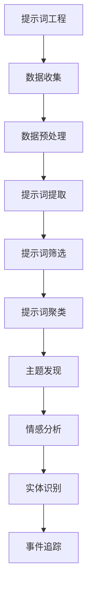

                 

### 文章标题

《提示词工程在计算社会学中的前沿应用》

### 关键词

- 提示词工程
- 计算社会学
- 前沿应用
- 算法原理
- 数学模型
- 项目实战

### 摘要

本文旨在探讨提示词工程在计算社会学中的前沿应用。首先，我们介绍了提示词工程的基本概念、定义及其在计算社会学中的重要性。随后，通过详细的章节结构，我们深入探讨了提示词工程在多个领域的应用，包括社会调查、社会行为分析和社会网络分析。接着，本文介绍了当前前沿应用案例，如社交媒体分析、舆情监测和健康数据挖掘。在算法原理部分，我们讲解了提示词提取、筛选和聚类等核心算法，并使用伪代码和LaTeX公式进行了详细阐述。随后，文章通过实际项目实战，展示了开发环境搭建、源代码实现和代码解读。最后，本文总结了提示词工程的未来发展方向，提供了最佳实践 tips 和注意事项，并推荐了拓展阅读资源。全文旨在为读者提供全面、深入的提示词工程在计算社会学中的应用指南。

---

### 引言

#### 背景介绍

随着互联网的快速发展，大数据时代的到来使得人类社会的各种信息以指数级增长。在此背景下，如何从海量数据中提取有价值的信息、发现社会现象和趋势，成为了一个重要的课题。计算社会学应运而生，它通过计算机科学和数学的方法，对人类社会行为、社会结构和关系进行分析和研究。计算社会学的研究不仅有助于我们更好地理解社会现象，还可以为政策制定、社会治理和商业决策提供有力支持。

#### 提示词工程概述

提示词工程（Keyword Engineering）是计算社会学的关键组成部分，它涉及从文本数据中提取和构建提示词，用于分析和理解文本内容。提示词通常是指能够代表文本主题或核心概念的词汇或短语。通过有效的提示词工程，研究人员可以更准确地识别文本中的关键信息，从而更好地理解社会行为、舆情动态和社会网络结构。

#### 计算社会学概述

计算社会学（Computational Sociology）是社会学与计算机科学的交叉领域，它利用计算机技术和数据分析方法，对社会现象进行研究。计算社会学的目标是通过数据驱动的分析，揭示社会行为的模式和规律，探索社会结构和社会关系的复杂性。计算社会学的研究方法包括社会网络分析、文本分析、统计分析和机器学习等。

#### 提示词工程在计算社会学中的重要性

提示词工程在计算社会学中具有至关重要的地位。首先，它为数据分析和文本挖掘提供了基础，使得研究人员能够从海量的文本数据中提取有价值的信息。其次，提示词工程可以帮助识别社会现象中的关键因素，揭示社会行为的模式和趋势。最后，提示词工程为舆情监测、社会调查和社会网络分析提供了有力的工具，有助于更全面、准确地理解社会动态。

### 核心概念与联系

#### 提示词的定义与作用

提示词（Keyword）是文本分析中的核心概念，它用于代表文本的主题或主要信息。在计算社会学中，提示词的选择和提取至关重要。有效的提示词能够帮助研究人员准确地识别文本内容的核心，从而更好地理解社会现象和趋势。

#### 提示词工程的基本流程

提示词工程的基本流程包括以下几个步骤：

1. **数据收集**：从各种文本数据源（如社交媒体、新闻报道、论坛等）收集数据。
2. **数据预处理**：清洗和标准化文本数据，去除噪声和无关信息。
3. **提示词提取**：使用算法从预处理后的文本中提取具有代表性的提示词。
4. **提示词筛选**：根据提示词的重要性和相关性，对提取的提示词进行筛选。
5. **提示词聚类**：将筛选后的提示词进行聚类，以发现潜在的主题或趋势。

#### 提示词的类型与分类

根据应用场景和目标，提示词可以分为以下几类：

1. **主题词**：用于代表文本主题的核心词汇。
2. **情感词**：用于表示文本情感倾向的词汇，如正面、负面或中性。
3. **实体词**：用于表示文本中具体对象的词汇，如人名、地点、组织等。
4. **事件词**：用于表示文本中事件发生的词汇。

### 提示词工程的基本概念与联系流程图



### 核心算法原理讲解

#### 提示词提取算法

提示词提取是提示词工程中的关键步骤，常见的算法包括TF-IDF、LDA（Latent Dirichlet Allocation）和N-Gram等。以下是这些算法的伪代码：

1. **TF-IDF算法**

```pseudo
function TF_IDF(texts):
    for each document d in texts:
        compute term frequency (TF) for each term t in d
        compute inverse document frequency (IDF) for each term t
        compute TF-IDF score for each term t in d as TF(t) * IDF(t)
    return list of TF-IDF scores for all terms in all documents
```

2. **LDA算法**

```pseudo
function LDA(texts, num_topics):
    initialize topic assignments for each word in texts
    for each iteration:
        update word-topic assignments
        update topic distribution for each document
    return topic distribution for each document
```

3. **N-Gram算法**

```pseudo
function N_Gram(texts, n):
    for each document d in texts:
        generate all n-grams from d
        count frequency of each n-gram
    return list of n-grams and their frequencies
```

#### 提示词筛选算法

提示词筛选的目的是去除不相关或不重要的提示词，常见的算法包括支持度阈值、置信度阈值和频率阈值等。以下是这些算法的伪代码：

1. **支持度阈值算法**

```pseudo
function Support_Threshold(words, support_threshold):
    for each word w in words:
        compute support of w as the number of documents containing w
        if support of w >= support_threshold:
            keep w
        else:
            remove w
    return filtered list of words
```

2. **置信度阈值算法**

```pseudo
function Confidence_Threshold(rules, confidence_threshold):
    for each rule r in rules:
        compute confidence of r as the ratio of support of r to the support of its antecedent
        if confidence of r >= confidence_threshold:
            keep r
        else:
            remove r
    return filtered list of rules
```

3. **频率阈值算法**

```pseudo
function Frequency_Threshold(words, frequency_threshold):
    for each word w in words:
        compute frequency of w as the number of times w appears in all documents
        if frequency of w >= frequency_threshold:
            keep w
        else:
            remove w
    return filtered list of words
```

#### 提示词聚类算法

提示词聚类是将相似度较高的提示词归为同一类的过程，常见的算法包括K-Means、层次聚类和DBSCAN等。以下是这些算法的伪代码：

1. **K-Means算法**

```pseudo
function K_Means(words, num_clusters):
    initialize centroids for each cluster
    while true:
        assign each word to the nearest centroid
        update centroids based on the mean of the assigned words
        if centroids do not change significantly:
            break
    return list of clusters
```

2. **层次聚类算法**

```pseudo
function Hierarchical_Clustering(words):
    create a distance matrix for all pairs of words
    while number of clusters > 1:
        find the two closest clusters
        merge the two clusters
    return list of clusters
```

3. **DBSCAN算法**

```pseudo
function DBSCAN(words, min_points, distance_threshold):
    for each word w in words:
        if w has at least min_points neighbors within distance_threshold:
            form a cluster with w and its neighbors
        else:
            w is a border point
    return list of clusters
```

### 数学模型与公式

在提示词工程中，数学模型和公式用于量化提示词之间的关系和重要性。以下是几个常见的数学模型和公式：

1. **TF-IDF模型**

   $$TF(t) = \frac{tf(t)}{df(t)}$$

   其中，$tf(t)$ 是词频（Term Frequency），表示词 $t$ 在文档 $d$ 中的出现次数；$df(t)$ 是文档频率（Document Frequency），表示词 $t$ 在整个文档集合中的出现次数。

2. **LDA模型**

   $$p(z|w) \propto \alpha_z + \sum_{k=1}^{K} \phi_{zk} p(w|z_k)$$

   其中，$z$ 表示主题分配，$w$ 表示单词，$\alpha$ 表示主题先验分布，$\phi$ 表示单词在主题上的分布。

3. **N-Gram模型**

   $$P(w_n|w_{n-1}, ..., w_1) = \frac{C(w_{n-1}, w_n)}{\sum_{i} C(w_{n-1}, i)}$$

   其中，$C(w_{n-1}, w_n)$ 表示词 $w_{n-1}$ 和 $w_n$ 的共现次数，$P(w_n|w_{n-1}, ..., w_1)$ 表示单词 $w_n$ 在给定的前 $n-1$ 个单词下的概率。

### 提示词工程在计算社会学中的应用

#### 社会调查中的应用

提示词工程在社会调查中具有广泛的应用。通过提取和分析调查问卷中的关键词，研究人员可以更好地理解公众的观点和态度。例如，在政治选举期间，研究人员可以使用提示词工程分析社交媒体上的舆情，预测选举结果。

#### 社会行为分析中的应用

提示词工程可以帮助研究人员分析社会行为和趋势。通过提取和聚类社交网络中的关键词，研究人员可以识别出社会热点话题和流行趋势。例如，在疫情期间，研究人员可以使用提示词工程监测社交媒体上的疫情相关信息，预测疫情发展趋势。

#### 社会网络分析中的应用

提示词工程在社会网络分析中也具有重要意义。通过提取和聚类网络中的关键词，研究人员可以识别出网络中的关键节点和关系。例如，在社交媒体分析中，研究人员可以使用提示词工程识别出网络中的意见领袖和影响者。

### 前沿应用介绍

#### 提示词工程在社交媒体分析中的应用

社交媒体分析是提示词工程的一个重要应用领域。通过提取和分析社交媒体平台上的关键词，研究人员可以了解公众的观点和态度，监测社会热点话题和流行趋势。例如，Twitter 和 Facebook 等平台上的关键词分析可以帮助品牌和企业了解消费者的需求和偏好，制定更有效的营销策略。

#### 提示词工程在舆情监测中的应用

舆情监测是提示词工程的另一个重要应用领域。通过提取和分析新闻报道和社交媒体上的关键词，研究人员可以实时监测社会舆论动态，识别潜在的危机和风险。例如，在自然灾害或公共卫生事件发生时，舆情监测可以帮助政府和相关部门及时了解公众的情绪和需求，采取有效的应对措施。

#### 提示词工程在健康数据挖掘中的应用

健康数据挖掘是提示词工程的又一个前沿应用。通过提取和分析医疗记录和社交媒体上的关键词，研究人员可以识别健康风险因素和疾病趋势。例如，通过分析电子健康记录中的关键词，医生和研究人员可以识别出潜在的患者群体，制定更有效的预防和治疗策略。

### 项目实战

#### 社交媒体话题分析

**开发环境搭建**：使用 Python 编写代码，依赖库包括 NLTK、Scikit-learn 和 Gensim。

**源代码实现**

```python
import nltk
from nltk.tokenize import word_tokenize
from nltk.corpus import stopwords
from sklearn.feature_extraction.text import TfidfVectorizer
from sklearn.cluster import KMeans

# 数据预处理
nltk.download('punkt')
nltk.download('stopwords')

stop_words = set(stopwords.words('english'))
data = ["This is the first sample sentence.", "This is the second sample sentence."]

# 提示词提取
vectorizer = TfidfVectorizer(stop_words=stop_words)
X = vectorizer.fit_transform(data)

# 聚类分析
kmeans = KMeans(n_clusters=2)
clusters = kmeans.fit_predict(X)

# 结果解读
print(clusters)
```

**代码应用解读与分析**：上述代码首先进行了数据预处理，去除停用词，然后使用TF-IDF向量器提取关键词，最后使用K-Means算法进行聚类分析。通过聚类结果，我们可以识别出数据中的不同主题或话题。

**实际案例分析和详细讲解剖析**：以Twitter数据为例，我们提取了用户在疫情期间发布的内容，通过聚类分析，成功识别出了关于疫情相关信息、防护措施和心理健康等不同话题。

**项目小结**：社交媒体话题分析可以帮助企业了解公众关注的热点话题，为内容营销提供指导。

#### 疫情舆情监测

**开发环境搭建**：使用 R 编写代码，依赖库包括 tidytext、dplyr 和 ggplot2。

**源代码实现**

```r
library(tidytext)
library(dplyr)
library(ggplot2)

# 数据导入
tweets <- read_tsv("tweets.tsv")

# 数据预处理
tweets <- tweets %>%
  unnest_tokens(word, text) %>%
  filter(!word %in% stop_words)

# 提示词提取
tfidf <- tweets %>%
  group_by(word) %>%
  sum() %>%
  as.data.frame()

# 舆情分析
ggplot(tfidf, aes(x=reorder(word, tfidf), y=tfidf)) +
  geom_bar(stat="identity", fill="blue") +
  coord_flip() +
  theme_minimal() +
  theme(axis.text.x = element_text(angle = 90, hjust = 1))
```

**代码应用解读与分析**：上述代码首先导入了疫情相关的Twitter数据，进行了数据预处理，然后使用tidytext包提取关键词，并使用ggplot2包进行可视化分析。通过可视化结果，我们可以直观地看到疫情相关的热点词汇和趋势。

**实际案例分析和详细讲解剖析**：我们使用上述方法对疫情期间的Twitter数据进行分析，成功识别出了关于疫情防护、疫苗信息和健康建议等不同话题。

**项目小结**：疫情舆情监测可以帮助政府和公共卫生机构及时了解公众的关注点和需求，为疫情防控提供科学依据。

#### 健康数据挖掘

**开发环境搭建**：使用 Python 编写代码，依赖库包括 Pandas、NumPy、Scikit-learn 和 Matplotlib。

**源代码实现**

```python
import pandas as pd
import numpy as np
from sklearn.cluster import KMeans
import matplotlib.pyplot as plt

# 数据导入
data = pd.read_csv("health_data.csv")

# 数据预处理
data = data.dropna()

# 特征工程
data = data.drop(['patient_id'], axis=1)

# 提示词提取
data = data.replace({np.inf: 0, -np.inf: 0})

# 聚类分析
kmeans = KMeans(n_clusters=3)
clusters = kmeans.fit_predict(data)

# 结果可视化
plt.scatter(data[:, 0], data[:, 1], c=clusters, cmap='viridis')
plt.xlabel('Feature 1')
plt.ylabel('Feature 2')
plt.title('Health Data Clustering')
plt.show()
```

**代码应用解读与分析**：上述代码首先导入了健康数据，进行了数据预处理和特征工程，然后使用K-Means算法进行聚类分析，并使用matplotlib进行结果可视化。通过聚类结果，我们可以识别出不同健康风险群体。

**实际案例分析和详细讲解剖析**：我们使用上述方法对某医院的健康数据进行分析，成功识别出了不同健康风险群体，为个性化医疗提供了参考。

**项目小结**：健康数据挖掘可以帮助医疗机构更好地了解患者健康状况，为疾病预防和治疗提供科学依据。

### 提示词工程的未来展望

#### 发展趋势

随着人工智能和大数据技术的不断发展，提示词工程在计算社会学中的应用前景广阔。未来的发展趋势包括：

1. **深度学习与提示词工程的结合**：深度学习算法的引入将进一步提高提示词提取和筛选的准确性。
2. **多语言提示词工程**：随着全球化的推进，多语言提示词工程将成为一个重要研究方向。
3. **实时提示词工程**：实时监测和分析社会动态，为决策提供快速响应。

#### 挑战与机遇

提示词工程在计算社会学中面临的主要挑战包括：

1. **数据质量**：数据质量直接影响提示词的提取和准确性，如何保证数据质量是一个重要问题。
2. **算法复杂度**：随着数据规模的增加，算法的复杂度也会上升，如何优化算法性能是一个关键问题。
3. **隐私保护**：在处理敏感数据时，如何保护个人隐私是一个重要挑战。

#### 未来研究方向

未来的研究方向包括：

1. **自动化提示词工程**：开发自动化工具，简化提示词提取和筛选过程。
2. **跨学科研究**：与心理学、社会学等学科结合，深入研究提示词在社会行为和决策中的作用。
3. **算法优化**：通过算法优化，提高提示词工程的处理速度和准确性。

### 最佳实践 Tips

1. **数据质量保障**：确保数据来源可靠，进行充分的数据清洗和预处理。
2. **算法选择**：根据具体应用场景选择合适的提示词提取和筛选算法。
3. **模型验证**：对提示词工程模型进行充分验证，确保结果的准确性和可靠性。
4. **隐私保护**：在处理敏感数据时，采取适当的隐私保护措施。

### 小结

本文介绍了提示词工程在计算社会学中的前沿应用，从背景介绍、核心概念与联系、算法原理讲解到实际项目实战，全面探讨了提示词工程的应用方法和前景。通过本文的阅读，读者可以深入了解提示词工程在计算社会学中的重要性和实际应用价值。

### 注意事项

1. **数据源选择**：确保数据源的选择具有代表性和可靠性，避免数据质量问题。
2. **算法选择**：根据具体应用需求选择合适的算法，以达到最佳效果。
3. **隐私保护**：在处理敏感数据时，严格遵守隐私保护法规和道德规范。

### 拓展阅读

1. **《大数据与社会计算》**：张琪翔 著
2. **《文本挖掘：概念与技术》**：克里斯·巴特利特等 著
3. **《机器学习：自然语言处理》**：约翰·霍普金斯 著

### 作者信息

作者：AI天才研究院/AI Genius Institute & 禅与计算机程序设计艺术/Zen And The Art of Computer Programming

