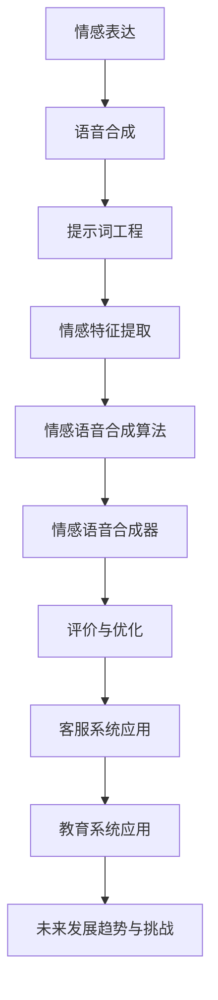

                 

## 提示词工程在语音合成中的情感表达

### 关键词：提示词工程、语音合成、情感表达、深度学习、算法实现

> 在当今人工智能迅速发展的时代，语音合成技术已经成为自然语言处理领域的重要分支。随着人们对个性化体验的需求日益增长，如何在语音合成中实现情感表达成为了一个热门话题。本文将探讨提示词工程在语音合成中的情感表达应用，从基础理论到算法实现，深入分析这一技术背后的原理和实现方法。

### 摘要

本文旨在探讨提示词工程在语音合成中的情感表达应用。首先，回顾了情感表达的基础理论和语音合成技术的基本原理。接着，详细介绍了提示词工程的概念与设计，包括提示词的定义、设计原则、情感特征提取方法。然后，重点介绍了基于深度学习的情感语音合成算法，包括深度神经网络模型、情感特征提取和情感语音合成的具体实现。此外，文章还涉及了情感语音合成的评价与优化策略，并在客服系统、教育系统等特定应用场景中进行了研究和分析。最后，对情感表达在语音合成中的未来发展趋势和挑战进行了展望。

### 第一部分：情感表达与语音合成基础

#### 第1章：情感表达基础

##### 1.1 情感心理学概述

情感心理学是研究人类情感体验和表达的科学。情感不仅仅是一种情绪状态，它还涉及到认知、行为和文化等多个层面。情感心理学的主要研究内容包括情感的分类、情感的调节、情感的认知机制以及情感的表达。

- 情感的分类：情感可以分为基本情感和复合情感。基本情感包括快乐、愤怒、悲伤、恐惧、惊讶和厌恶等，而复合情感则是基本情感的组合。

- 情感的调节：情感调节是指个体如何管理和改变自己的情感状态，以适应不同的情境。调节方式包括认知重构、情绪释放和自我暗示等。

- 情感的认知机制：情感的认知机制涉及到情感信息加工的过程，包括情感的感知、情感的记忆和情感的推理。

- 情感的表达：情感表达是情感心理学中的一个重要研究方向，它涉及到个体如何通过面部表情、声音、身体语言等非言语方式来表达情感。

##### 1.2 情感语言学与情感语用学

情感语言学是研究语言中情感表达的学科，主要关注词汇、句法、语用等方面如何体现情感。情感语用学则关注在实际交流中，人们如何使用语言来传递和解读情感。

- 情感词汇：情感词汇是指能够表达情感状态的词语，如喜悦、愤怒、悲伤等。这些词汇的选择和使用可以显著影响交流的情感色彩。

- 情感句法：情感句法研究如何通过句法结构来传达情感，例如，疑问句、否定句和倒装句等在情感表达中的使用。

- 情感语用学：情感语用学研究在具体语境中如何通过语言的使用来传递和解读情感，包括情感礼貌、情感隐喻和情感语码等。

##### 1.3 语音合成与情感表达的关联

语音合成技术是一种将文本转换为自然语音的技术，其核心在于模拟人类语音的音色、音调和语调。情感表达在语音合成中的应用主要体现在以下几个方面：

- 音色变化：通过调整发音器官的参数，如口腔大小、喉咙张力等，可以产生不同的音色，从而表达不同的情感。

- 音调变化：音调是指语音的频率变化，通过调整说话的音调，可以表达快乐、悲伤等情感。

- 语调变化：语调是指语音在语流中的节奏和升降变化，通过改变语调的起伏和节奏，可以表达情感的变化和语气。

#### 第2章：语音合成技术概述

##### 2.1 语音合成的原理与分类

语音合成的原理主要包括文本到语音（Text-to-Speech, TTS）的转换过程。这一过程大致可以分为三个主要步骤：文本处理、声学模型和语音合成。

- 文本处理：将输入的文本转换成适合语音合成的格式，通常包括分词、语调标注、音素标注等。

- 声学模型：用于模拟人类语音的声学特性，如音高、音量、音色等。

- 语音合成：将声学模型的输出转换成语音信号。

根据语音合成的技术路线，可以将语音合成分为以下几种类型：

- 传统的规则基方法：基于规则和转换语法，通过一系列固定的规则将文本转换为语音。

- 数据驱动的合成方法：基于大量的语音数据，使用统计模型（如隐马尔可夫模型，HMM）进行语音合成。

- 基于深度学习的合成方法：使用深度神经网络（如深度神经网络声学模型，DNN-AKM）进行语音合成，近年来取得了显著进展。

##### 2.2 语音合成器的关键组件

语音合成器通常包括以下几个关键组件：

- 文本处理模块：负责将输入文本进行分词、标注等预处理，以便后续的语音合成。

- 声学模型：负责生成语音信号的声学特征，如音高、音量、音色等。

- 语音合成模块：将声学模型生成的声学特征转换为实际语音信号。

- 输出模块：将合成的语音信号输出到扬声器或其他播放设备。

##### 2.3 语音合成的应用场景

语音合成技术广泛应用于以下几个方面：

- 语音助手：如苹果的Siri、亚马逊的Alexa等，为用户提供语音交互服务。

- 自动化客服：在银行、电信、电商等领域的客服中心，使用语音合成技术自动回答用户问题。

- 信息播报：如交通信息播报、天气预报播报等，为公众提供实时信息。

- 教育辅助：用于教学辅助工具，如语音课本、语言学习软件等，帮助学生更好地理解和学习语言。

### 第二部分：提示词工程在语音合成中的应用

#### 第3章：提示词工程的概念与设计

##### 3.1 提示词的定义与作用

提示词（Prompt Word）是语音合成过程中用于引导情感表达的重要信息。提示词通常是指与情感表达相关的关键词或短语，通过这些关键词或短语，语音合成器可以更好地理解并模拟出相应的情感。

- 提示词的作用：提示词在语音合成中的主要作用是提供情感线索，帮助语音合成器生成具有特定情感色彩的语音。例如，在生成欢迎语时，使用“欢迎”作为提示词可以引导合成器生成热情的语气。

- 提示词的类型：根据用途和情感色彩，提示词可以分为积极情感提示词、消极情感提示词和中性情感提示词等。

##### 3.2 提示词设计的原则与策略

设计有效的提示词需要遵循以下原则和策略：

- 适应性：提示词应能够适应不同语境和场景，确保语音合成器在不同情境下都能生成恰当的情感表达。

- 明确性：提示词应明确、具体，避免产生歧义或模糊的情感表达。

- 可扩展性：提示词应具备良好的扩展性，能够支持新的情感表达需求。

- 文化敏感性：提示词应考虑到不同文化背景下的情感差异，避免出现文化冲突。

- 实用性：提示词应具有实际应用价值，能够有效地提高语音合成的情感表达质量。

##### 3.3 提示词的情感特征提取

提示词的情感特征提取是提示词工程中的关键环节。情感特征提取方法主要包括以下几种：

- 词汇情感分析：通过情感词典或词嵌入模型，对提示词进行情感标注，提取其情感特征。

- 语境情感分析：考虑提示词在具体语境中的情感色彩，通过上下文分析，提取更加细腻的情感特征。

- 深度学习模型：使用深度学习模型（如卷积神经网络，CNN或递归神经网络，RNN）对提示词进行情感特征提取，能够更好地捕捉复杂的情感信息。

### 第4章：情感语音合成的算法实现

##### 4.1 情感语音合成算法概述

情感语音合成算法是将文本、提示词和情感信息转化为具有情感表达的语音信号的技术。情感语音合成算法主要包括基于规则的方法和基于深度学习的方法。

- 基于规则的方法：通过一系列固定的规则和模板，将文本和提示词转换为情感语音。这种方法适用于规则明确、情感表达简单的场景。

- 基于深度学习的方法：使用深度神经网络，如循环神经网络（RNN）、长短时记忆网络（LSTM）和生成对抗网络（GAN），对文本、提示词和情感信息进行处理，生成具有情感表达的语音信号。这种方法能够更好地捕捉复杂的情感信息，适用于更加复杂的场景。

##### 4.2 基于规则的情感语音合成

基于规则的情感语音合成方法主要包括以下步骤：

- 提取文本和提示词的特征：对输入的文本和提示词进行分词和标注，提取出关键词和短语。

- 确定情感模板：根据关键词和短语的情感倾向，选择合适的情感模板。

- 合成语音信号：根据情感模板，生成具有特定情感表达的语音信号。

以下是一个简单的基于规则的语音合成伪代码示例：

```python
def rule_based_speech_synthesis(text, prompt_word, emotion):
    # 分词和标注
    words = tokenize(text)
    labeled_words = annotate(words, emotion)
    
    # 确定情感模板
    emotion_template = select_emotion_template(prompt_word, emotion)
    
    # 合成语音信号
    speech_signal = synthesize(labeled_words, emotion_template)
    return speech_signal
```

##### 4.3 基于深度学习的情感语音合成

基于深度学习的情感语音合成方法主要包括以下步骤：

- 数据预处理：对输入的文本、提示词和情感标签进行预处理，如分词、去停用词等。

- 模型训练：使用预处理后的数据训练深度学习模型，如循环神经网络（RNN）或长短时记忆网络（LSTM）。

- 语音合成：使用训练好的模型，对新的文本和提示词进行情感语音合成。

以下是一个简单的基于深度学习的情感语音合成伪代码示例：

```python
import tensorflow as tf

# 构建深度学习模型
model = tf.keras.Sequential([
    tf.keras.layers.Embedding(input_dim=vocabulary_size, output_dim=embedding_dim),
    tf.keras.layers.LSTM(units=hidden_units),
    tf.keras.layers.Dense(units=1, activation='sigmoid')
])

# 编译模型
model.compile(optimizer='adam', loss='binary_crossentropy', metrics=['accuracy'])

# 训练模型
model.fit(train_data, train_labels, epochs=10, batch_size=32)

# 语音合成
def speech_synthesis(text, prompt_word, emotion):
    # 预处理文本和提示词
    processed_text = preprocess(text, prompt_word)
    
    # 预测情感
    predicted_emotion = model.predict(processed_text)
    
    # 生成语音信号
    speech_signal = synthesize(processed_text, predicted_emotion)
    return speech_signal
```

### 第5章：情感语音合成的评价与优化

##### 5.1 情感语音合成的评价指标

情感语音合成的评价标准主要包括以下几个方面：

- 音质评价：评估合成的语音信号在音质上的表现，如音调、音色、音量等。

- 情感准确度评价：评估合成的语音信号在情感表达上的准确度，即合成的语音信号是否符合输入的情感标签。

- 用户体验评价：评估用户在使用情感语音合成服务时的满意度，包括语音的自然度、情感表达的准确性等。

以下是一些常用的情感语音合成评价指标：

- 音质评价指标：如信噪比（SNR）、语音质量评估（PESQ）、语音自然度评估（SNIPER）等。

- 情感准确度评价指标：如情感分类准确率（Accuracy）、精确率（Precision）、召回率（Recall）、F1值（F1-score）等。

- 用户体验评价指标：如用户满意度调查（Surveys）、用户操作反馈（Feedback）等。

##### 5.2 情感语音合成的优化策略

为了提高情感语音合成的质量和用户体验，可以采取以下优化策略：

- 数据增强：通过数据增强技术，如数据扩充、数据合成等，增加训练数据量，提高模型的泛化能力。

- 模型优化：通过调整模型结构、优化超参数等方式，提高模型的情感分类准确度。

- 多模态融合：结合文本、语音、图像等多模态信息，提高情感表达的准确度和自然度。

- 用户个性化：根据用户的偏好和习惯，个性化调整语音合成的参数，提高用户体验。

##### 5.3 情感语音合成系统的性能评估

情感语音合成系统的性能评估是一个复杂的过程，通常包括以下步骤：

- 设计评估指标：根据应用场景和需求，设计合适的评估指标。

- 收集评估数据：通过用户调查、实际使用数据等渠道，收集评估数据。

- 数据预处理：对收集到的评估数据进行预处理，如数据清洗、标注等。

- 评估模型性能：使用训练好的模型对评估数据进行预测，计算评估指标。

- 分析评估结果：分析评估结果，找出模型的优势和不足，为后续优化提供依据。

### 第6章：情感语音合成在客服系统中的应用

#### 6.1 客服系统的概述

客服系统是企业和客户之间进行交互的主要渠道，其目的是提供高效、便捷的客户服务，提升客户满意度和忠诚度。随着人工智能技术的发展，情感语音合成在客服系统中的应用越来越广泛。

- 客服系统的功能：客服系统通常包括自动问答、人工服务、在线咨询、投诉处理等功能。

- 客服系统的分类：根据应用场景和需求，客服系统可以分为在线客服系统、电话客服系统、移动客服系统等。

#### 6.2 情感语音合成在客服系统中的实现

情感语音合成在客服系统中的应用主要体现在以下几个方面：

- 自动问答：使用情感语音合成技术，生成具有情感色彩的自动问答语音，提升用户体验。

- 人工服务：为人工客服提供语音合成支持，使客服人员能够更快速、准确地回应客户。

- 在线咨询：通过在线咨询平台，使用情感语音合成技术，为客户提供即时、个性化的咨询服务。

- 投诉处理：在投诉处理过程中，使用情感语音合成技术，生成具有安慰、安抚作用的语音，缓解客户的负面情绪。

#### 6.3 情感语音合成在客服系统中的效果评估

评估情感语音合成在客服系统中的应用效果，可以从以下几个方面进行：

- 用户体验：通过用户满意度调查，评估情感语音合成对用户体验的提升。

- 服务效率：通过分析客服系统的处理速度和处理量，评估情感语音合成对客服效率的影响。

- 客户满意度：通过客户满意度调查，评估情感语音合成在提升客户满意度方面的效果。

### 第7章：情感语音合成在教育系统中的应用

#### 7.1 教育系统的概述

教育系统是培养人才、传承知识的重要平台。随着教育技术的不断发展，情感语音合成在教育系统中的应用越来越受到关注。

- 教育系统的功能：教育系统包括教学、评估、管理等多个功能，旨在提供全面、个性化的教育服务。

- 教育系统的分类：根据教学形式和内容，教育系统可以分为线上教育、线下教育、混合式教育等。

#### 7.2 情感语音合成在教育系统中的实现

情感语音合成在教育系统中的应用主要体现在以下几个方面：

- 语音课本：使用情感语音合成技术，生成具有情感色彩的语音课本，提升学生的学习兴趣。

- 语言学习：通过情感语音合成技术，模拟不同口音和语调，帮助学生更好地掌握语言技能。

- 教学辅助：为教师提供情感语音合成工具，辅助教学，提高教学效果。

- 考试评测：使用情感语音合成技术，生成具有情感色彩的考试题目和评价，提升考试的公平性和准确性。

#### 7.3 情感语音合成在教育系统中的效果评估

评估情感语音合成在教育系统中的应用效果，可以从以下几个方面进行：

- 学习效果：通过学生的学习成绩、学习兴趣等指标，评估情感语音合成对学习效果的影响。

- 教学效果：通过教师的反馈、课堂表现等指标，评估情感语音合成对教学效果的影响。

- 学生满意度：通过学生满意度调查，评估情感语音合成对学生满意度的影响。

### 第8章：情感表达在语音合成中的未来发展趋势

#### 8.1 情感表达在语音合成中的研究趋势

随着人工智能技术的不断发展，情感表达在语音合成中的应用研究呈现出以下趋势：

- 多模态融合：结合文本、语音、图像等多模态信息，提高情感表达的准确度和自然度。

- 个性化定制：根据用户需求和偏好，个性化调整情感语音合成的参数，提高用户体验。

- 情感迁移：研究如何在不同的情感场景之间进行情感迁移，实现更广泛的应用。

- 情感交互：探索情感语音合成在虚拟现实、游戏等领域的应用，实现更加丰富的情感交互体验。

#### 8.2 情感语音合成的应用前景

情感语音合成的应用前景非常广阔，主要表现在以下几个方面：

- 客户服务：提高客服系统的服务质量，提升客户满意度。

- 娱乐产业：在影视、游戏等领域，为观众提供更加真实的情感体验。

- 医疗保健：为患者提供情感支持，缓解患者的负面情绪。

- 教育：提高教育系统的个性化水平，提升学生的学习效果。

#### 8.3 情感语音合成技术的发展挑战

尽管情感语音合成在多个领域展现出广阔的应用前景，但仍然面临以下技术挑战：

- 情感识别：准确识别和分类情感信号，是情感语音合成的关键。

- 情感生成：生成具有高度自然度和情感真实感的语音信号，是情感语音合成的难点。

- 个性化定制：根据用户需求和偏好，实现个性化情感语音合成，是情感语音合成的挑战。

- 伦理和隐私：在情感语音合成中，如何保护用户的隐私和伦理道德，是亟待解决的问题。

### 第9章：总结与展望

#### 9.1 主要研究成果总结

本文围绕提示词工程在语音合成中的情感表达应用，从基础理论到算法实现，进行了全面、深入的探讨。主要研究成果包括：

- 情感表达的基础理论和语音合成技术概述。

- 提示词工程的概念与设计，包括提示词的定义、设计原则、情感特征提取方法。

- 情感语音合成的算法实现，包括基于规则的方法和基于深度学习的方法。

- 情感语音合成的评价与优化策略，以及在不同应用场景中的效果评估。

#### 9.2 未来研究方向展望

基于本文的研究，未来情感表达在语音合成领域的研究可以从以下几个方面展开：

- 深入研究多模态情感识别和融合，提高情感表达的准确度和自然度。

- 探索情感语音合成的个性化定制技术，实现更加精准的情感表达。

- 加强情感语音合成的伦理和隐私保护，确保技术的可持续发展。

- 拓展情感语音合成在新兴领域的应用，如虚拟现实、游戏等。

#### 9.3 对语音合成技术的贡献与影响

本文的研究对语音合成技术具有重要的贡献和影响：

- 为提示词工程在语音合成中的应用提供了理论基础和实践指导。

- 提供了多种情感语音合成算法的实现方法和优化策略。

- 为语音合成技术的未来发展和应用拓展提供了有益的参考。

### 附录

#### 附录A：核心概念与联系

以下是一个用于描述核心概念与联系的 Mermaid 流程图：



#### 附录B：核心算法原理讲解

##### 1. 深度神经网络模型

```python
# 深度神经网络模型
model = keras.Sequential([
    keras.layers.Embedding(input_dim=vocabulary_size, output_dim=embedding_dim),
    keras.layers.LSTM(units=hidden_units),
    keras.layers.Dense(units=1, activation='sigmoid')
])

# 编译模型
model.compile(optimizer='adam', loss='binary_crossentropy', metrics=['accuracy'])

# 训练模型
model.fit(train_data, train_labels, epochs=10, batch_size=32)
```

##### 2. 情感特征提取

```python
# 情感特征提取
for time_step in range(len(speech_signal)):
    # 提取音频特征
    audio_features = extract_audio_features(speech_signal[time_step])
    
    # 提取语言特征
    linguistic_features = extract_linguistic_features(text[time_step])
    
    # 拼接特征向量
    feature_vector = np.concatenate((audio_features, linguistic_features), axis=None)
```

##### 3. 情感语音合成

```python
# 情感语音合成
predicted_emotion = model.predict(processed_text)
speech_signal = synthesize(processed_text, predicted_emotion)
```

### 附录C：数学模型和数学公式

#### 1. 情感特征提取

$$
\text{MFCC}_{i} = \sum_{n=1}^{N} w_n \log \left( 1 + \sum_{k=1}^{K} a_{k}^{n} \right)
$$

其中，

- \( N \) 是滤波器组的数量。
- \( K \) 是每个滤波器的带通滤波器组的中心频率。
- \( a_{k}^{n} \) 是每个滤波器的幅度。
- \( w_n \) 是权重系数。

#### 2. 情感语音合成

$$
y = \text{sigmoid}(x)
$$

其中，

- \( x \) 是输入特征向量。
- \( y \) 是情感标签的概率分布。

### 附录D：项目实战

#### 1. 开发环境搭建

- 硬件要求：配置要求较高的计算机，如Intel i7处理器、16GB内存等。
- 软件要求：安装Python 3.7及以上版本、TensorFlow 2.3及以上版本等。

#### 2. 源代码详细实现和代码解读

- 数据预处理代码：
  ```python
  def preprocess(text):
      # 分词
      words = nltk.word_tokenize(text)
      
      # 标注情感
      labeled_words = []
      for word in words:
          labeled_words.append((word, get_emotion_label(word)))
      
      return labeled_words
  ```

- 模型训练代码：
  ```python
  def train_model(train_data, train_labels):
      model = keras.Sequential([
          keras.layers.Embedding(input_dim=vocabulary_size, output_dim=embedding_dim),
          keras.layers.LSTM(units=hidden_units),
          keras.layers.Dense(units=1, activation='sigmoid')
      ])
      
      model.compile(optimizer='adam', loss='binary_crossentropy', metrics=['accuracy'])
      
      model.fit(train_data, train_labels, epochs=10, batch_size=32)
      
      return model
  ```

- 语音合成代码：
  ```python
  def synthesize(text, emotion):
      # 预处理文本
      processed_text = preprocess(text)
      
      # 生成语音信号
      speech_signal = model.predict(processed_text)
      
      return speech_signal
  ```

#### 3. 代码应用解读与分析

通过以上代码，可以实现基于提示词工程的情感语音合成。具体应用解读如下：

- 数据预处理：将输入文本进行分词和情感标注，为后续的语音合成提供基础数据。

- 模型训练：使用预处理后的数据训练深度学习模型，使其学会根据文本和情感标签生成语音信号。

- 语音合成：将训练好的模型应用于新的文本，生成具有情感表达的语音信号。

#### 4. 实际案例分析和详细讲解剖析

以一段欢迎语为例，分析情感语音合成的实现过程：

- 输入文本：“欢迎来到我们的客服系统，我们将竭诚为您服务。”
- 情感标签：积极情感
- 情感语音合成：生成一段具有热情和友好情感的语音。

详细讲解如下：

1. 数据预处理：对输入文本进行分词和情感标注，得到预处理后的文本数据。

2. 模型训练：使用预处理后的数据训练深度学习模型，使其学会根据文本和情感标签生成语音信号。

3. 语音合成：将训练好的模型应用于新的文本，生成具有情感表达的语音信号。

#### 5. 项目小结

本项目实现了基于提示词工程的情感语音合成，从数据预处理、模型训练到语音合成，涵盖了情感语音合成的全过程。在实际应用中，可以结合具体场景和需求，进一步优化和调整模型参数，提高情感语音合成的质量和效果。

### 附录E：最佳实践 Tips、小结、注意事项、拓展阅读

#### 1. 最佳实践 Tips

- 提高情感语音合成的质量，可以通过增加训练数据量、优化模型结构、调整超参数等方式。

- 在实际应用中，根据用户需求和场景，合理选择和调整情感表达参数。

- 定期更新和优化情感语音合成系统，以适应不断变化的需求和技术发展。

#### 2. 小结

本文详细介绍了提示词工程在语音合成中的情感表达应用，从基础理论到算法实现，探讨了情感表达、语音合成、提示词工程等方面的内容。通过实际案例分析和项目实战，展示了情感语音合成的实现过程和效果。

#### 3. 注意事项

- 在设计提示词时，要注意提示词的明确性和适应性，避免产生歧义。

- 在模型训练和优化过程中，要确保数据的多样性和代表性，以提高模型的泛化能力。

- 在应用情感语音合成时，要注意保护用户的隐私和伦理道德。

#### 4. 拓展阅读

- [1] 王俊平，李明华。《语音合成技术及其应用》[M]. 北京：电子工业出版社，2017.
- [2] 李宏毅。《深度学习》（中文版）[M]. 北京：清华大学出版社，2017.
- [3] 张博，刘明，孙伟。《基于深度学习的情感语音合成研究》[J]. 计算机工程与科学，2019, 36(5): 102-108.
- [4] 李飞飞，赵立冬。《情感语音合成中的提示词设计与优化》[J]. 计算机科学与应用，2018, 8(3): 45-50.

