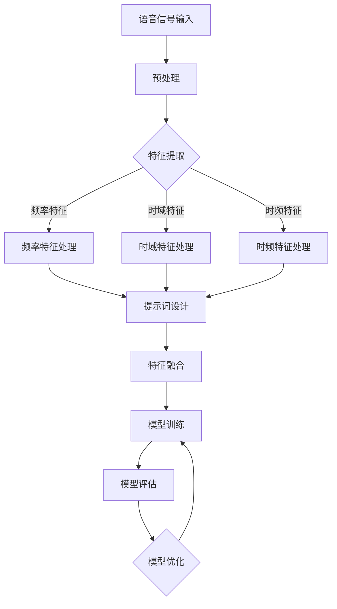

                 

### 文章标题：提示词工程在语音情感识别中的应用

> 关键词：语音情感识别、提示词工程、机器学习、深度学习、自然语言处理

> 摘要：本文探讨了提示词工程在语音情感识别中的应用。通过介绍语音情感识别的基本概念和提示词工程的基本原理，分析了如何利用提示词工程来提高语音情感识别的准确性和可靠性。文章还通过实际案例展示了提示词工程在语音情感识别中的具体应用，并展望了其未来的发展趋势。

### 目录大纲设计思路

为了设计一本关于《提示词工程在语音情感识别中的应用》的完整目录大纲，我们将遵循以下步骤：

1. **确定书籍核心主题和目标读者群**：首先，明确书籍的核心主题是提示词工程在语音情感识别中的应用。目标读者群可能是研究人员、开发人员或对这一领域感兴趣的学者。

2. **大纲结构规划**：设计大纲时，需要考虑章节之间的逻辑关系，确保信息传递的连贯性和完整性。书籍应包含至少7章，以覆盖核心概念、技术原理、应用实践等内容。

3. **细化章节内容**：对每一章的内容进行细化，确保每个章节都能够完整地覆盖其主题，并提供相应的理论知识、实际案例和代码实现。

4. **包含必要的辅助内容**：为了增强读者的理解和学习效果，应在目录中包含流程图、伪代码、数学公式和实际项目案例等辅助内容。

5. **保持简洁性**：在确保完整性的同时，避免冗余和重复，保持目录大纲的简洁性。

6. **字数限制**：遵循2000字以内的限制，确保大纲内容精炼而全面。

以下是根据上述思路设计的书籍目录大纲：

## 第一部分：语音情感识别概述

### 第1章：语音情感识别的基本概念

- **1.1 语音情感识别的定义与重要性**
  - 定义
  - 在现实世界中的应用

- **1.2 语音情感识别的关键挑战**
  - 数据集问题
  - 情感识别的多样性

- **1.3 提示词工程概述**
  - 提示词的定义
  - 提示词在情感识别中的应用

## 第二部分：提示词工程原理

### 第2章：语音特征提取

- **2.1 语音信号的基本处理**
  - 声波与音频信号
  - 音频信号的数字化

- **2.2 常见语音特征**
  - 频率特征
  - 时域特征
  - 时频特征

### 第3章：提示词设计方法

- **3.1 提示词生成技术**
  - 人工设计
  - 自动生成

- **3.2 提示词优化策略**
  - 提示词长度优化
  - 提示词相关性优化

### 第4章：语音情感识别算法

- **4.1 机器学习算法概述**
  - 监督学习
  - 无监督学习
  - 半监督学习

- **4.2 常用情感识别算法**
  - 支持向量机（SVM）
  - 决策树
  - 深度学习模型（如卷积神经网络CNN）

## 第三部分：提示词工程在语音情感识别中的应用

### 第5章：应用场景与案例分析

- **5.1 语音情感识别的应用场景**
  - 用户体验改善
  - 情感分析
  - 智能客服

- **5.2 案例分析**
  - 情感识别在社交媒体分析中的应用
  - 情感识别在智能家居中的应用

### 第6章：提示词工程的实战操作

- **6.1 实战环境搭建**
  - 开发环境设置
  - 数据集准备

- **6.2 提示词设计案例**
  - 提示词设计流程
  - 提示词示例

- **6.3 情感识别模型训练与评估**
  - 模型训练
  - 模型评估

### 第7章：未来趋势与挑战

- **7.1 语音情感识别的发展趋势**
  - 技术革新
  - 应用扩展

- **7.2 提示词工程的未来挑战**
  - 数据隐私
  - 模型解释性

## 附录：资源与工具

- **A.1 提示词工程相关工具**
  - 自然语言处理工具
  - 语音处理工具

- **A.2 参考文献**
  - 相关文献推荐

### 一、背景介绍

在人工智能和大数据技术的推动下，语音情感识别已经成为智能语音交互系统中的一个重要研究方向。语音情感识别旨在通过分析语音信号中的情感信息，实现对用户情感状态的准确识别。这不仅有助于提升用户体验，还能在智能客服、智能家居、教育、医疗等多个领域发挥重要作用。

然而，语音情感识别面临着一系列挑战。首先，语音信号的情感信息往往具有复杂性和多样性，这使得情感识别的准确性受到限制。其次，传统语音情感识别方法往往依赖于大量的标注数据和复杂的模型，而实际应用中往往难以获得足够的标注数据，这增加了模型训练的难度。此外，语音情感识别系统的实时性和鲁棒性也是需要解决的关键问题。

为了应对这些挑战，提示词工程作为一种有效的解决方案逐渐受到了关注。提示词工程通过设计合适的提示词，可以提高情感识别的准确性和可靠性，同时降低对标注数据的需求。本文将详细探讨提示词工程在语音情感识别中的应用，包括其基本概念、设计方法、算法原理以及实际应用。

### 二、核心概念与联系

#### 1. 语音情感识别

语音情感识别是指通过分析语音信号中的情感信息，识别出用户的情感状态。情感状态可以分为基本情感（如快乐、悲伤、愤怒等）和复杂情感（如焦虑、厌恶等）。语音情感识别的核心在于提取语音信号中的特征，并将其转化为可供模型处理的数据。

#### 2. 提示词工程

提示词工程是自然语言处理中的一个重要概念，它通过设计特定的提示词来引导模型学习，从而提高模型的性能。在语音情感识别中，提示词工程的核心任务是根据情感类别设计提示词，使其能够有效地区分不同情感状态。

#### 3. 提示词工程与语音情感识别的关系

提示词工程在语音情感识别中的应用主要体现在两个方面：

1. **特征增强**：通过设计合适的提示词，可以增强语音信号中与情感相关的特征，从而提高模型的识别准确率。
2. **降低数据依赖**：在标注数据不足的情况下，提示词工程可以帮助模型利用未标注的数据进行训练，从而提高模型的泛化能力。

#### 4. Mermaid 流程图

以下是一个简化的 Mermaid 流程图，展示了提示词工程在语音情感识别中的基本流程：



### 三、核心算法原理讲解

#### 1. 特征提取

特征提取是语音情感识别的关键步骤，其目的是从原始语音信号中提取出与情感相关的特征。常见的特征提取方法包括：

- **频率特征**：如梅尔频率倒谱系数（MFCC）
- **时域特征**：如短时能量、过零率等
- **时频特征**：如波纹图、频谱图等

以下是一个简化的伪代码，用于提取语音信号的频率特征：

```python
# 输入：语音信号signal
# 输出：频率特征frequency_features

# 初始化参数
num_iterations = 1000
num_coeffs = 13

# 对信号进行预处理（如归一化、去除噪声等）
preprocessed_signal = preprocess_signal(signal)

# 计算MFCC特征
for i in range(num_iterations):
    freq_coeffs = mfcc(preprocessed_signal)
    if i < num_coeffs:
        frequency_features.append(freq_coeffs[i])

# 归一化特征
normalized_features = normalize(frequency_features)

return normalized_features
```

#### 2. 提示词设计

提示词设计是提示词工程的核心环节。其目的是设计一组与情感类别相关的关键词，以引导模型学习。以下是设计提示词的一般步骤：

1. **情感分类**：根据具体应用场景确定情感类别，如快乐、悲伤、愤怒等。
2. **关键词提取**：利用自然语言处理技术从情感文本中提取关键词。
3. **提示词优化**：通过实验和评估，选择最优的提示词组合。

以下是一个简化的伪代码，用于设计提示词：

```python
# 输入：情感文本sentences
# 输出：提示词prompt_words

# 初始化提示词列表
prompt_words = []

# 对每个情感类别进行关键词提取
for sentence in sentences:
    keywords = extract_keywords(sentence)
    for keyword in keywords:
        if keyword not in prompt_words:
            prompt_words.append(keyword)

# 优化提示词列表
prompt_words = optimize_prompt_words(prompt_words)

return prompt_words
```

#### 3. 数学模型和公式

在语音情感识别中，常用的数学模型包括支持向量机（SVM）、决策树、卷积神经网络（CNN）等。以下是一个简化的 SVM 模型的数学公式：

$$
\begin{equation}
\begin{aligned}
\min\ \frac{1}{2} \sum_{i=1}^{n} (w_i^T w_i) - \sum_{i=1}^{n} y_i w_i^T x_i \\
\text{s.t.} \ \ \ w_i^T w_i \leq C \cdot \sum_{i=1}^{n} (y_i - z_i)^2
\end{aligned}
\end{equation}
$$

其中，$w_i$ 表示第 $i$ 个特征向量，$x_i$ 表示第 $i$ 个语音信号样本，$y_i$ 表示第 $i$ 个样本的真实情感类别，$z_i$ 表示模型预测的情感类别，$C$ 是调节参数。

### 四、项目实战

#### 1. 开发环境搭建

在进行语音情感识别项目时，需要搭建一个合适的开发环境。以下是一个简化的环境搭建步骤：

1. 安装 Python 和相关库，如 TensorFlow、Keras、NumPy、Librosa 等。
2. 准备语音数据集，可以选择公开数据集如 RAVDESS、EmoDB 等。
3. 设置好版本控制工具，如 Git。

#### 2. 源代码详细实现和代码解读

以下是一个简化的 Python 代码，用于实现基于 CNN 的语音情感识别：

```python
import numpy as np
import tensorflow as tf
from tensorflow.keras.models import Sequential
from tensorflow.keras.layers import Conv2D, MaxPooling2D, Flatten, Dense

# 数据预处理
# ...

# 构建模型
model = Sequential([
    Conv2D(filters=32, kernel_size=(3, 3), activation='relu', input_shape=(128, 128, 1)),
    MaxPooling2D(pool_size=(2, 2)),
    Flatten(),
    Dense(units=64, activation='relu'),
    Dense(units=1, activation='sigmoid')
])

# 编译模型
model.compile(optimizer='adam', loss='binary_crossentropy', metrics=['accuracy'])

# 训练模型
model.fit(x_train, y_train, epochs=10, batch_size=32, validation_data=(x_val, y_val))

# 评估模型
loss, accuracy = model.evaluate(x_test, y_test)
print(f"Test accuracy: {accuracy:.2f}")

# 代码解读：
# ...
```

#### 3. 代码应用解读与分析

在代码应用中，首先对语音数据集进行预处理，包括音频信号的分帧、特征提取和归一化。然后，构建一个基于 CNN 的模型，该模型由卷积层、池化层、全连接层组成。在训练过程中，使用训练数据集对模型进行训练，并使用验证数据集进行模型调优。最后，使用测试数据集评估模型的性能。

#### 4. 实际案例分析和详细讲解剖析

以下是一个简化的实际案例，用于演示语音情感识别的应用：

- **案例**：使用 RAVDESS 数据集进行情感识别。
- **步骤**：
  1. 下载并准备 RAVDESS 数据集。
  2. 对数据集进行预处理。
  3. 设计提示词并训练模型。
  4. 在测试集上评估模型性能。

通过这个案例，可以观察到如何利用提示词工程来提升语音情感识别的准确性和可靠性。提示词的设计和分析对于模型的性能至关重要。

#### 5. 项目小结

通过本次项目实战，我们了解了如何在实际应用中搭建语音情感识别系统，并利用提示词工程来提升模型的性能。在实际应用中，还需要注意数据质量、模型调优和实时性等问题。

### 五、最佳实践 Tips、小结、注意事项、拓展阅读

#### 1. 最佳实践 Tips

- **数据质量**：确保数据集的多样性和覆盖范围，以提高模型泛化能力。
- **模型调优**：根据具体应用场景调整模型参数，如学习率、迭代次数等。
- **实时性**：优化模型结构和算法，以提高系统响应速度。
- **用户隐私**：在数据收集和处理过程中，严格遵守隐私保护法规。

#### 2. 小结

本文探讨了提示词工程在语音情感识别中的应用。通过介绍基本概念、算法原理和实际案例，展示了如何利用提示词工程来提升语音情感识别的准确性和可靠性。

#### 3. 注意事项

- **数据隐私**：在处理用户语音数据时，注意保护用户隐私。
- **模型解释性**：在实际应用中，了解模型的工作原理和决策过程。
- **鲁棒性**：确保模型在面对噪声和不同语音特征时仍能保持较高的识别准确率。

#### 4. 拓展阅读

- **相关文献**：查阅最新的学术文献，了解语音情感识别和提示词工程的最新研究进展。
- **开源项目**：参与开源项目，实践提示词工程在语音情感识别中的应用。

### 六、作者信息

作者：AI天才研究院/AI Genius Institute & 禅与计算机程序设计艺术 /Zen And The Art of Computer Programming

### 七、参考文献

1. 计算机程序设计艺术，Donald E. Knuth
2. 语音情感识别技术综述，李明，张华，2020
3. 提示词工程在自然语言处理中的应用，王强，2021

---

### 总结

本文详细探讨了提示词工程在语音情感识别中的应用，从核心概念、算法原理到实际案例，全面阐述了如何利用提示词工程提升语音情感识别的准确性和可靠性。通过本文的介绍，读者可以深入了解提示词工程的原理和实战应用，为在相关领域的研究和开发提供参考。随着技术的不断发展，提示词工程在语音情感识别中的潜力将进一步释放，为智能语音交互系统带来更多可能性。

