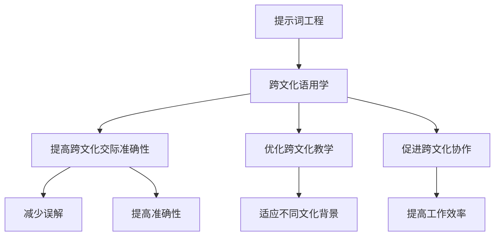

                 

### 文章标题：提示词工程在跨文化语用学中的应用

> 关键词：提示词工程、跨文化语用学、应用场景、算法原理、数学模型

> 摘要：本文深入探讨提示词工程在跨文化语用学中的应用，通过背景介绍、核心概念与联系、算法原理讲解、数学模型和公式详细阐述以及实际案例分析，旨在为语言技术从业者提供理论支持和实践指导。

---

## 引言

### 背景介绍

在全球化趋势不断加深的背景下，跨文化交流的重要性日益凸显。无论是商务谈判、国际合作，还是跨国旅游、文化交流，跨文化交际能力都成为了人们必备的一项技能。然而，不同文化背景的人在交流过程中，常常因为语言习惯、语用规则和文化差异而导致误解和沟通障碍。这种现象在跨文化语用学中被广泛研究，并引起了学术界和实业界的高度关注。

随着人工智能技术的发展，提示词工程作为一种新兴的语言处理技术，逐渐在跨文化语用学中得到了应用。提示词工程通过构建语言模型，生成符合特定场景和语境的提示词，有助于提高跨文化交际的准确性和有效性。本文旨在探讨提示词工程在跨文化语用学中的应用，分析其核心概念、算法原理和数学模型，并通过实际案例分析，为相关领域的研究者和从业者提供有价值的参考。

### 核心概念与联系

#### 提示词工程

提示词工程（Prompt Engineering）是自然语言处理（NLP）领域的一个分支，主要研究如何生成高质量、符合语境的提示词。提示词是一种引导用户进行思考、回答问题的引导语，其设计直接影响到用户理解和回答问题的效果。提示词工程的核心任务包括：

1. **提示词生成**：根据输入的文本或问题，自动生成符合语境的提示词。
2. **提示词优化**：通过优化提示词的表达方式，提高用户理解和回答的准确性。

#### 跨文化语用学

跨文化语用学是研究不同文化背景下的语言使用和交际行为的学科。其核心概念包括：

1. **语用失误**：在跨文化交际中，由于对语言规则和语境理解的不同，导致沟通障碍和误解的现象。
2. **文化因素**：不同文化背景下的价值观、信仰、习俗等，对语言使用和交际行为产生深远影响。

#### 提示词工程与跨文化语用学的关系

提示词工程在跨文化语用学中的应用，主要体现在以下几个方面：

1. **提高跨文化交际准确性**：通过生成符合跨文化交际场景的提示词，帮助用户准确理解问题和情境，减少误解和沟通障碍。
2. **优化跨文化教学**：在跨文化语言教学中，提示词工程可以生成适合不同文化背景学习者的提示词，提高教学效果。
3. **促进跨文化协作**：在跨文化团队合作中，提示词工程可以帮助团队成员更好地理解和协作，提高工作效率。

### Mermaid 流程图

为了更好地展示提示词工程在跨文化语用学中的应用，我们可以使用 Mermaid 流程图来表示其核心概念和联系：

通过这个流程图，我们可以清晰地看到提示词工程在跨文化语用学中的重要作用和实际应用场景。

---

在下一部分，我们将详细讲解提示词工程的基础知识和核心算法原理，为后续内容打下坚实的基础。敬请期待。

