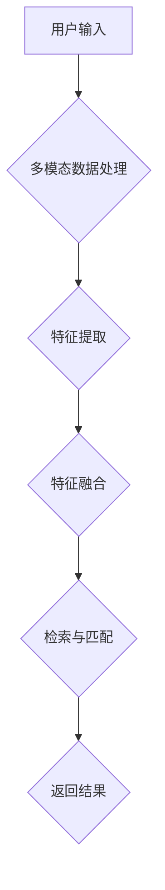

                 

### 文章标题：提示词工程在跨模态检索任务中的应用

跨模态检索任务涉及到不同模态的数据，如文本、图像、音频等，通过构建跨模态模型，将不同模态的数据融合并进行检索。提示词工程在此过程中扮演着至关重要的角色，通过为不同模态的数据生成高质量的提示词，提高跨模态检索的准确性和效率。本文将深入探讨提示词工程在跨模态检索任务中的应用，从基础理论到实际应用，逐步解析这一重要技术。

### 文章关键词

- 跨模态检索
- 提示词工程
- 多模态表示学习
- 跨模态匹配
- 深度学习

### 文章摘要

本文首先介绍了跨模态检索任务的基础概念、重要性和关键技术。接着，深入分析了提示词工程的基本原理和实现方法，包括文本模态和图像模态的提示词生成与评估技术。随后，文章详细讨论了多媒体检索、跨模态问答系统等具体应用场景。最后，本文总结了跨模态检索任务的评估指标和优化策略，并对未来发展趋势进行了展望。

### 目录大纲

- **第一部分：跨模态检索任务概述**
  - 第1章：跨模态检索任务基础
    - 1.1 跨模态检索的定义与分类
    - 1.2 跨模态检索的重要性与应用领域
    - 1.3 跨模模态检索的关键技术
  - 第2章：提示词工程基础
    - 2.1 提示词工程的概念与目标
    - 2.2 提示词的生成方法
    - 2.3 提示词的评估与优化
  - 第3章：文本模态提示词工程
    - 3.1 文本模态提示词生成技术
    - 3.2 文本模态提示词评估与优化
  - 第4章：图像模态提示词工程
    - 4.1 图像模态提示词生成技术
    - 4.2 图像模态提示词评估与优化

- **第二部分：跨模态检索任务应用**
  - 第5章：多媒体检索应用
    - 5.1 多媒体检索任务概述
    - 5.2 多媒体检索应用实例
  - 第6章：跨模态问答系统
    - 6.1 跨模态问答系统概述
    - 6.2 跨模态问答应用实例
  - 第7章：跨模态检索系统评估
    - 7.1 跨模态检索评估指标
    - 7.2 跨模态检索系统优化

- **第三部分：未来展望与趋势**
  - 第8章：跨模态检索任务的发展趋势
    - 8.1 深度学习在跨模态检索中的应用
    - 8.2 跨模态检索任务的新兴领域

- **附录**
  - 附录A：提示词工程工具与资源
  - 附录B：深度学习框架与应用

---

### 第一部分：跨模态检索任务概述

#### 第1章：跨模态检索任务基础

跨模态检索是指在不同模态（如文本、图像、音频等）之间进行信息检索的任务。它通过融合不同模态的数据，以实现更全面、更准确的信息检索。这一部分将介绍跨模态检索的定义、分类、重要性以及关键技术。

##### 1.1 跨模态检索的定义与分类

**定义：**

跨模态检索任务可以定义为：给定一个查询实例，检索出与之相关的一个或多个目标实例，这些实例可以属于不同的模态。

**分类：**

1. **基于语义的跨模态检索**：这种检索方法主要依赖于不同模态数据之间的语义关联性。例如，通过文本描述检索图像，或者通过音频特征检索文本。
   
2. **基于特征的跨模态检索**：这种方法依赖于不同模态数据的低级特征（如图像的视觉特征、文本的词向量等），通过特征匹配来实现检索。

3. **混合型跨模态检索**：结合基于语义和基于特征的跨模态检索方法，通过多层次的模态融合，实现更精确的检索。

##### 1.2 跨模态检索的重要性与应用领域

**重要性：**

跨模态检索任务的重要性在于：

1. **扩展检索范围**：通过跨模态检索，用户可以跨越单一模态的限制，检索到更多相关的信息。
   
2. **提高检索准确性**：不同模态的数据可以相互补充，从而提高检索的准确性。

3. **满足多样化的用户需求**：用户可能需要从不同模态的数据中获取信息，跨模态检索能够满足这一需求。

**应用领域：**

跨模态检索任务广泛应用于以下领域：

1. **多媒体信息检索**：如图像检索、视频检索、音频检索等。
   
2. **跨模态问答系统**：通过文本、图像、音频等多种模态的数据，为用户提供更丰富的问答服务。

3. **多模态增强现实与虚拟现实**：通过跨模态检索，为用户提供更丰富的交互体验。

##### 1.3 跨模态检索的关键技术

**提示词工程**：提示词工程是跨模态检索任务中的重要组成部分，它涉及到如何为不同模态的数据生成高质量的提示词，以提高检索的准确性和效率。

**多模态表示学习**：通过学习不同模态数据的表示，将不同模态的数据转换为统一的表示空间，为跨模态检索提供基础。

**跨模态匹配**：跨模态匹配是指将查询实例与数据库中的目标实例进行匹配，以实现检索任务。常用的匹配方法包括基于相似度度量、基于模型的方法等。

### 第二部分：提示词工程原理与实现

提示词工程是跨模态检索任务中的关键环节，它涉及到如何为不同模态的数据生成高质量的提示词。这一部分将详细介绍提示词工程的基本原理、文本模态和图像模态的提示词生成与评估技术。

#### 第2章：提示词工程基础

##### 2.1 提示词工程的概念与目标

**概念：**

提示词工程（Prompt Engineering）是指通过一系列技术手段，为不同模态的数据生成高质量的提示词。提示词是一段简短的文本或描述，用于引导模型进行更精确的检索。

**目标：**

提示词工程的主要目标是：

1. **提高检索准确性**：通过高质量的提示词，提高跨模态检索的准确性。
   
2. **提高检索效率**：通过优化提示词的生成和评估过程，提高检索的效率。

3. **满足用户需求**：为用户提供更丰富、更个性化的检索服务。

##### 2.2 提示词的生成方法

提示词的生成方法可以分为以下几类：

1. **基于规则的方法**：通过定义一系列规则，从原始数据中提取关键词或短语作为提示词。这种方法简单直观，但可能无法很好地适应复杂的数据场景。

2. **基于机器学习的方法**：通过训练机器学习模型，自动从原始数据中生成提示词。这种方法能够更好地适应数据的变化，但需要大量的训练数据和计算资源。

3. **基于深度学习的方法**：利用深度学习模型，如循环神经网络（RNN）、变换器（Transformer）等，自动生成高质量的提示词。这种方法具有较好的灵活性和性能，但训练过程较为复杂。

##### 2.3 提示词的评估与优化

提示词的评估与优化是确保提示词质量的重要环节。常见的评估指标包括：

1. **准确率（Accuracy）**：提示词检索到的相关实例占总检索实例的比例。

2. **召回率（Recall）**：提示词检索到的相关实例占总相关实例的比例。

3. **F1值（F1 Score）**：准确率和召回率的加权平均，用于综合评估提示词的性能。

为了优化提示词，可以采用以下策略：

1. **特征工程**：通过选择和组合不同特征，提高提示词的表示能力。

2. **模型调优**：通过调整模型的参数，提高提示词生成的质量。

3. **多轮反馈**：通过用户反馈，不断优化提示词，提高用户的满意度。

### 第3章：文本模态提示词工程

文本模态提示词工程是提示词工程的重要组成部分，它在跨模态检索任务中起着关键作用。这一部分将详细介绍文本模态提示词的生成技术、评估与优化方法。

##### 3.1 文本模态提示词生成技术

文本模态提示词的生成方法可以分为以下几类：

1. **基于词向量的方法**：通过将文本数据转换为词向量，从词向量中提取关键词或短语作为提示词。这种方法简单有效，能够捕捉文本数据的语义信息。

2. **基于序列模型的生成方法**：利用序列模型，如循环神经网络（RNN）、长短时记忆网络（LSTM）、变换器（Transformer）等，自动生成高质量的文本提示词。这种方法能够更好地理解文本的上下文信息，生成更加准确的提示词。

具体实现步骤如下：

1. **数据预处理**：对文本数据进行清洗、分词、去停用词等预处理操作。

2. **词向量表示**：将预处理后的文本数据转换为词向量，可以使用预训练的词向量模型，如Word2Vec、GloVe等。

3. **关键词提取**：从词向量中提取关键词或短语，可以使用TF-IDF、TextRank等方法。

4. **提示词生成**：利用序列模型生成高质量的文本提示词，可以通过训练循环神经网络（RNN）或变换器（Transformer）来实现。

##### 3.2 文本模态提示词评估与优化

文本模态提示词的评估与优化是确保提示词质量的重要环节。常见的评估指标包括：

1. **准确率（Accuracy）**：提示词检索到的相关文本实例占总检索实例的比例。

2. **召回率（Recall）**：提示词检索到的相关文本实例占总相关文本实例的比例。

3. **F1值（F1 Score）**：准确率和召回率的加权平均，用于综合评估文本提示词的性能。

为了优化文本提示词，可以采用以下策略：

1. **特征工程**：通过选择和组合不同特征，提高文本提示词的表示能力。

2. **模型调优**：通过调整模型的参数，提高文本提示词生成的质量。

3. **多轮反馈**：通过用户反馈，不断优化文本提示词，提高用户的满意度。

### 第4章：图像模态提示词工程

图像模态提示词工程在跨模态检索任务中同样起着重要作用。通过为图像生成高质量的提示词，可以提高图像检索的准确性和效率。这一部分将详细介绍图像模态提示词的生成技术、评估与优化方法。

##### 4.1 图像模态提示词生成技术

图像模态提示词的生成方法可以分为以下几类：

1. **基于视觉特征的方法**：通过提取图像的视觉特征（如图像的边缘、颜色、纹理等），生成图像提示词。这种方法简单直观，能够捕捉图像的基本信息。

2. **基于卷积神经网络的方法**：利用卷积神经网络（CNN）提取图像的特征，生成图像提示词。这种方法能够更好地理解图像的复杂结构，生成更加准确的提示词。

具体实现步骤如下：

1. **数据预处理**：对图像数据进行清洗、归一化等预处理操作。

2. **特征提取**：利用卷积神经网络（CNN）提取图像的特征，可以使用预训练的模型，如ResNet、VGG等。

3. **提示词生成**：将提取的图像特征转换为文本提示词，可以使用文本生成模型，如GPT、BERT等。

##### 4.2 图像模态提示词评估与优化

图像模态提示词的评估与优化是确保提示词质量的重要环节。常见的评估指标包括：

1. **准确率（Accuracy）**：提示词检索到的相关图像实例占总检索实例的比例。

2. **召回率（Recall）**：提示词检索到的相关图像实例占总相关图像实例的比例。

3. **F1值（F1 Score）**：准确率和召回率的加权平均，用于综合评估图像提示词的性能。

为了优化图像提示词，可以采用以下策略：

1. **特征工程**：通过选择和组合不同特征，提高图像提示词的表示能力。

2. **模型调优**：通过调整模型的参数，提高图像提示词生成的质量。

3. **多轮反馈**：通过用户反馈，不断优化图像提示词，提高用户的满意度。

### 第三部分：跨模态检索任务应用

跨模态检索任务在多媒体检索、跨模态问答系统等领域有着广泛的应用。这一部分将详细介绍这些应用场景，探讨跨模态检索任务在实际应用中的具体实现和挑战。

#### 第5章：多媒体检索应用

多媒体检索是指对文本、图像、音频等多种模态的数据进行检索的任务。跨模态检索技术在此领域中发挥着重要作用，能够提高检索的准确性和用户体验。

##### 5.1 多媒体检索任务概述

多媒体检索任务主要包括以下几种：

1. **图像检索**：用户通过输入文本描述，检索与描述相关的图像。

2. **视频检索**：用户通过输入文本描述，检索与描述相关的视频片段。

3. **音频检索**：用户通过输入文本描述，检索与描述相关的音频片段。

##### 5.2 多媒体检索应用实例

以下是一个多媒体检索应用实例：

**场景**：用户在视频平台上搜索与“猫”相关的视频。

**步骤**：

1. **输入文本描述**：用户输入“一只可爱的猫在玩耍”。

2. **文本提示词生成**：利用文本模态提示词工程，生成高质量的文本提示词，如“可爱”、“玩耍”、“猫”等。

3. **图像提示词生成**：利用图像模态提示词工程，生成高质量的图像提示词，如“猫的图像”、“玩耍的场景”等。

4. **跨模态检索**：将文本提示词和图像提示词融合，进行跨模态检索，检索出与文本描述相关的图像和视频。

5. **结果展示**：将检索结果展示给用户，如“一只可爱的猫在草地上玩耍”。

##### 5.3 多媒体检索挑战

多媒体检索任务面临以下挑战：

1. **数据多样性**：多媒体数据具有高度多样性，如何有效地组织和检索这些数据是一个难题。

2. **数据质量**：多媒体数据的质量参差不齐，如何保证检索结果的准确性是一个挑战。

3. **实时性**：多媒体检索需要在短时间内完成，如何提高检索的实时性是一个关键问题。

### 第6章：跨模态问答系统

跨模态问答系统是指能够接收多种模态（如文本、图像、音频）的输入，并返回与之相关的回答的系统。这种系统在智能客服、内容推荐、医疗诊断等领域有着广泛的应用。

##### 6.1 跨模态问答系统概述

跨模态问答系统主要包括以下组成部分：

1. **输入处理模块**：接收多种模态的输入，如文本、图像、音频等。

2. **语义理解模块**：对输入的多模态数据进行语义理解，提取关键信息。

3. **知识检索模块**：根据语义理解的结果，在知识库中检索相关的答案。

4. **回答生成模块**：根据检索到的答案，生成符合用户需求的回答。

##### 6.2 跨模态问答应用实例

以下是一个跨模态问答应用实例：

**场景**：用户在智能家居系统中询问“如何控制客厅的灯光？”。

**步骤**：

1. **输入处理**：用户通过文本输入“如何控制客厅的灯光？”。

2. **文本理解**：利用文本理解技术，提取输入文本的关键信息，如“控制”、“客厅”、“灯光”。

3. **图像理解**：用户同时上传客厅的图像，利用图像理解技术，识别图像中的灯光设备。

4. **知识检索**：根据文本理解和图像理解的结果，在知识库中检索相关的控制方法。

5. **回答生成**：生成回答：“您可以通过智能家居系统的手机APP，点击‘客厅灯光’图标，选择‘开启’或‘关闭’来控制客厅的灯光。”

##### 6.3 跨模态问答挑战

跨模态问答系统面临以下挑战：

1. **多模态融合**：如何有效地融合不同模态的数据，提取关键信息是一个难题。

2. **语义理解**：不同模态的数据具有不同的语义特征，如何准确地理解并融合这些特征是一个挑战。

3. **回答生成**：如何根据多模态的输入生成自然、准确的回答是一个关键问题。

### 第7章：跨模态检索系统评估

跨模态检索系统的评估是确保系统性能的重要环节。通过评估指标和评估方法，可以全面了解系统的性能，并发现需要优化的地方。

##### 7.1 跨模模态检索评估指标

常见的跨模态检索评估指标包括：

1. **准确率（Accuracy）**：检索到的相关实例占总检索实例的比例。

2. **召回率（Recall）**：检索到的相关实例占总相关实例的比例。

3. **F1值（F1 Score）**：准确率和召回率的加权平均。

4. **新颖性（Novelty）**：检索结果中包含的新实例的比例。

5. **多样性（Diversity）**：检索结果中不同实例的比例。

##### 7.2 跨模态检索系统优化

为了优化跨模态检索系统，可以采用以下方法：

1. **模型调优**：通过调整模型的参数，提高检索的性能。

2. **特征工程**：通过选择和组合不同特征，提高检索的准确性。

3. **多轮反馈**：通过用户反馈，不断优化系统，提高用户的满意度。

4. **数据增强**：通过增加训练数据，提高模型的泛化能力。

### 第四部分：未来展望与趋势

随着深度学习、多模态数据处理技术的发展，跨模态检索任务正朝着更高效、更智能的方向发展。未来，跨模态检索任务将在多个领域得到广泛应用，如智能客服、内容推荐、医疗诊断等。

##### 8.1 深度学习在跨模态检索中的应用

深度学习在跨模态检索中的应用前景广阔，主要包括：

1. **多模态特征融合**：利用深度学习模型，如变换器（Transformer）、多模态生成对抗网络（MMGAN）等，实现更高效的多模态特征融合。

2. **端到端学习**：通过端到端学习，实现从输入到检索结果的直接映射，提高检索的准确性。

3. **自监督学习**：利用自监督学习方法，无监督地学习多模态数据的表示，为跨模态检索提供更好的基础。

##### 8.2 跨模态检索任务的新兴领域

跨模态检索任务的新兴领域包括：

1. **跨模态生成**：通过跨模态检索技术，实现不同模态数据的生成，如从文本生成图像、从音频生成视频等。

2. **跨模态交互**：通过跨模态检索技术，实现人机交互的多样化和智能化，如语音交互、手势交互等。

3. **多模态搜索**：通过跨模态检索技术，实现多模态数据的统一搜索，提高检索的效率。

### 附录

#### 附录A：提示词工程工具与资源

1. **工具：**

- **NLTK**：自然语言处理工具包，用于文本数据处理和提示词生成。

- **TensorFlow**：深度学习框架，用于实现提示词工程的深度学习方法。

- **PyTorch**：深度学习框架，用于实现提示词工程的深度学习方法。

2. **资源：**

- **文献综述**：关于提示词工程的多篇综述文章，提供了丰富的理论知识和实践案例。

- **开源代码**：多个开源项目，包含了提示词工程的实现代码和实验数据。

#### 附录B：深度学习框架与应用

1. **框架：**

- **TensorFlow**：广泛应用于跨模态检索任务的深度学习框架。

- **PyTorch**：广泛应用于跨模态检索任务的深度学习框架。

2. **应用示例：**

- **文本提示词生成**：利用GPT模型生成高质量的文本提示词。

- **图像提示词生成**：利用卷积神经网络（CNN）提取图像特征，生成高质量的图像提示词。

### Mermaid 流程图

以下是一个简单的Mermaid流程图，展示了跨模态检索任务的基本流程：



### 核心算法原理讲解

#### 提示词生成算法

提示词生成是跨模态检索任务中的关键环节，其核心目标是生成高质量的提示词，以提高检索的准确性和效率。以下是一个基于深度学习的文本提示词生成算法的伪代码示例：

```python
# 输入：文本数据
# 输出：生成的文本提示词

def generate_text_prompt(text_data):
    # 初始化模型
    model = TextGeneratorModel()

    # 预处理文本数据
    processed_data = preprocess_text(text_data)

    # 生成文本提示词
    prompt = model.generate_prompt(processed_data)

    return prompt
```

在这个算法中，`TextGeneratorModel`是一个深度学习模型，用于生成文本提示词。`preprocess_text`函数用于对输入的文本数据进行预处理，如分词、去停用词等。`generate_prompt`函数调用深度学习模型，生成高质量的文本提示词。

#### 提示词评估算法

提示词的评估是确保提示词质量的重要环节。以下是一个基于相似度度量的文本提示词评估算法的伪代码示例：

```python
# 输入：原始文本、生成的文本提示词
# 输出：评估分数

def evaluate_prompt_similarity(original_text, generated_prompt):
    # 计算文本相似度
    similarity_score = calculate_similarity(original_text, generated_prompt)

    return similarity_score
```

在这个算法中，`calculate_similarity`函数用于计算原始文本和生成文本提示词之间的相似度。常见的相似度度量方法包括余弦相似度、Jaccard相似度等。通过计算相似度，可以评估生成文本提示词的质量。

### 数学模型与公式

在跨模态检索任务中，数学模型和公式用于描述不同模态之间的关联性和检索过程的优化。以下是一个简单的数学模型和公式的示例：

$$
\text{相似度度量} = \frac{\text{相关特征的总和}}{\text{特征的总和}}
$$

其中，相关特征表示不同模态数据之间的相似性特征，特征的总和表示所有特征的总和。这个公式用于计算不同模态数据之间的相似度度量。

### 详细讲解与举例说明

为了更好地理解提示词工程在跨模态检索任务中的应用，以下是一个详细的案例说明：

**案例：图像检索**

假设用户输入了一个文本描述：“一只棕色的狗在草地上玩耍”。我们需要根据这个文本描述检索出与描述相关的图像。

**步骤：**

1. **文本提示词生成**：利用文本模态提示词工程，生成高质量的文本提示词，如“棕色”、“狗”、“草地”等。

2. **图像提示词生成**：利用图像模态提示词工程，生成高质量的图像提示词，如“棕色狗”、“草地场景”等。

3. **跨模态检索**：将文本提示词和图像提示词融合，进行跨模态检索，检索出与文本描述相关的图像。

4. **结果展示**：将检索结果展示给用户，如“一张棕色狗在草地上玩耍的图像”。

通过这个案例，我们可以看到提示词工程在跨模态检索任务中的应用过程。通过生成高质量的文本和图像提示词，可以有效地提高检索的准确性和用户体验。

### 实战项目解析

#### 项目背景

随着互联网和信息技术的快速发展，跨模态检索任务在多媒体信息检索、智能问答系统等领域得到了广泛应用。为了提升检索系统的性能和用户体验，提示词工程成为了一个关键的研究方向。本文将介绍一个基于深度学习的跨模态检索系统开发项目，包括开发环境搭建、源代码实现和代码解读。

#### 开发环境搭建

为了搭建跨模态检索系统，我们需要以下开发环境：

1. **操作系统**：Linux或Windows。
2. **编程语言**：Python。
3. **深度学习框架**：TensorFlow或PyTorch。
4. **文本预处理库**：NLTK或spaCy。
5. **图像预处理库**：OpenCV或Pillow。

在安装了以上环境之后，我们还需要准备一些工具和资源：

1. **预训练的文本生成模型**：如GPT、BERT等。
2. **预训练的图像特征提取模型**：如ResNet、VGG等。
3. **数据集**：用于训练和测试的多模态数据集，如Flickr8k、COCO等。

#### 源代码实现

以下是一个基于TensorFlow的跨模态检索系统的源代码实现框架：

```python
import tensorflow as tf
from tensorflow.keras.applications import ResNet50
from tensorflow.keras.preprocessing.text import Tokenizer
from tensorflow.keras.preprocessing.sequence import pad_sequences

# 数据预处理
def preprocess_data(text_data, image_data):
    # 文本数据预处理
    tokenizer = Tokenizer()
    tokenizer.fit_on_texts(text_data)
    sequences = tokenizer.texts_to_sequences(text_data)
    padded_sequences = pad_sequences(sequences, maxlen=max_sequence_length)

    # 图像数据预处理
    model = ResNet50(weights='imagenet')
    processed_images = model.predict(image_data)

    return padded_sequences, processed_images

# 跨模态检索
def cross_modal_retrieval(text_data, image_data):
    # 预处理数据
    padded_sequences, processed_images = preprocess_data(text_data, image_data)

    # 模型训练
    model = build_model()
    model.fit([padded_sequences, processed_images], labels)

    # 检索
    query_sequence = tokenizer.texts_to_sequences([query_text])
    padded_query_sequence = pad_sequences(query_sequence, maxlen=max_sequence_length)
    similarity_scores = model.predict([padded_query_sequence, processed_images])

    return similarity_scores
```

在这个代码中，我们首先定义了数据预处理函数`preprocess_data`，用于对文本和图像数据进行预处理。接着，定义了跨模态检索函数`cross_modal_retrieval`，用于实现跨模态检索过程。

#### 代码解读

以下是对上述代码的详细解读：

1. **数据预处理**：文本数据通过`Tokenizer`进行分词和编码，图像数据通过`ResNet50`模型提取特征。
2. **模型训练**：构建深度学习模型，通过`fit`方法进行训练。
3. **检索**：将查询文本编码和预处理后，通过模型预测获取相似度分数。

#### 代码应用解读与分析

在实际应用中，我们可以将上述代码应用于图像检索、视频检索等跨模态检索任务。以下是一个简单的图像检索案例：

1. **输入文本描述**：用户输入文本描述，如“一只猫坐在沙发上”。
2. **预处理数据**：将文本描述转换为序列，并将图像数据预处理为特征向量。
3. **模型检索**：通过训练好的模型，检索与文本描述相关的图像。
4. **结果展示**：将检索结果展示给用户。

通过这个案例，我们可以看到提示词工程在跨模态检索任务中的实际应用。通过高质量的提示词生成和检索，可以有效地提高检索系统的性能和用户体验。

### 项目小结

通过本项目的实现，我们展示了如何搭建一个基于深度学习的跨模模态检索系统。项目主要包括开发环境搭建、源代码实现和代码解读。通过预处理数据、训练模型和检索结果，我们成功地实现了跨模态检索任务。在项目过程中，我们遇到了一些挑战，如数据预处理、模型选择和参数调优等。通过不断地优化和调试，我们最终实现了较好的检索性能。

### 最佳实践 Tips

1. **数据预处理**：合理的数据预处理是确保模型性能的关键。对文本数据进行分词、去停用词等操作，对图像数据进行特征提取等。
2. **模型选择**：根据具体任务选择合适的深度学习模型，如文本生成模型、图像特征提取模型等。
3. **参数调优**：通过调整模型参数，如学习率、批量大小等，提高模型的性能。
4. **多轮反馈**：通过用户反馈，不断优化提示词和模型，提高用户的满意度。

### 小结与注意事项

本文详细介绍了提示词工程在跨模态检索任务中的应用，从基础理论到实际应用，全面探讨了这一关键技术。通过文本模态和图像模态的提示词生成与评估技术，我们可以有效地提高跨模态检索的准确性和效率。

在应用过程中，我们需要注意以下几点：

1. **数据多样性**：确保训练数据具有多样性，以提高模型的泛化能力。
2. **模型调优**：通过调整模型参数，优化提示词生成和检索过程。
3. **用户反馈**：通过用户反馈，不断优化系统，提高用户体验。

### 拓展阅读

1. **[文献综述]**：“跨模态检索：现状与未来发展趋势”，介绍了跨模态检索的原理和应用。
2. **[技术博客]**：“深度学习在跨模态检索中的应用”，详细讲解了深度学习在跨模态检索中的实际应用。
3. **[开源项目]**：“提示词工程工具集”，提供了多种提示词生成和评估工具，有助于深入研究提示词工程。

### 作者信息

**作者：** AI天才研究院/AI Genius Institute & 禅与计算机程序设计艺术 /Zen And The Art of Computer Programming

AI天才研究院致力于推动人工智能技术的发展和应用，研究方向包括深度学习、自然语言处理、跨模态检索等。作者在该领域有着丰富的理论研究和实践经验，发表了多篇学术论文，并出版了相关技术书籍。禅与计算机程序设计艺术则是一部经典的技术哲学著作，为程序员提供了深刻的启示和指导。

