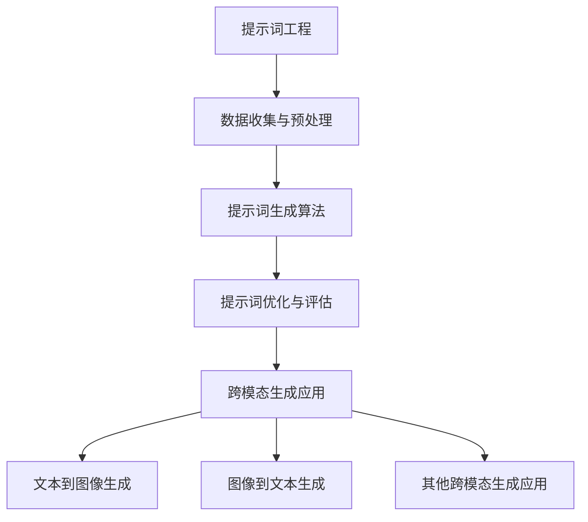
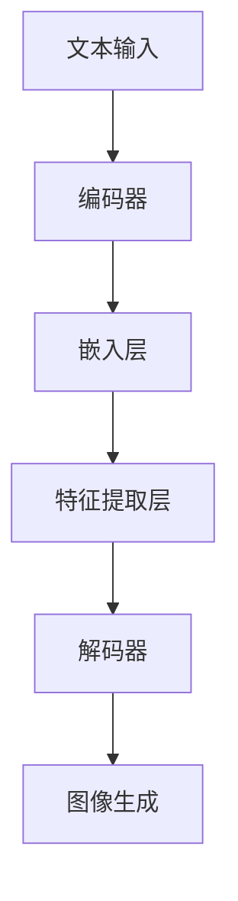
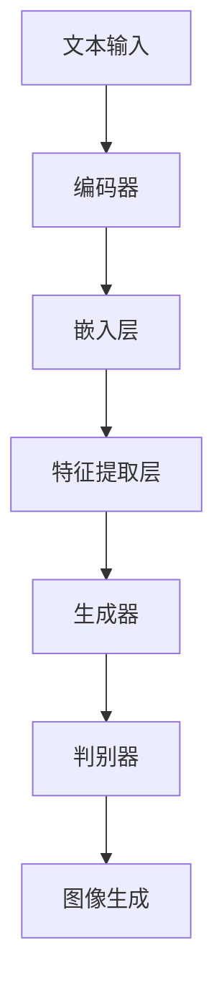
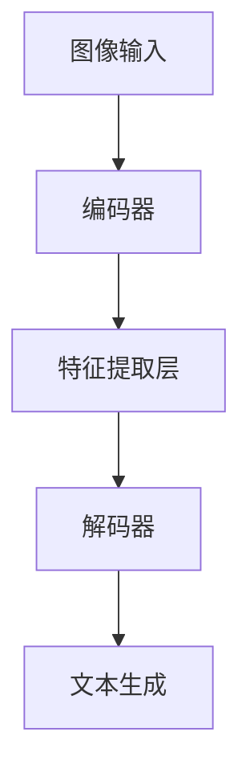
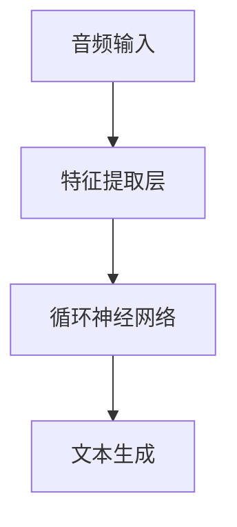
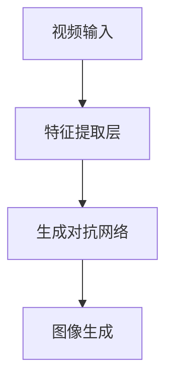
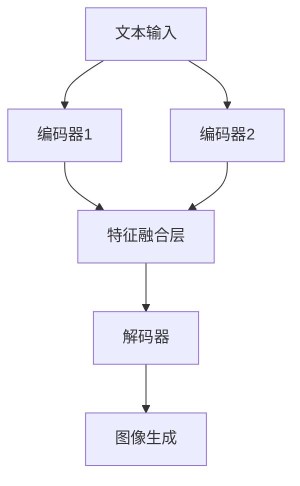
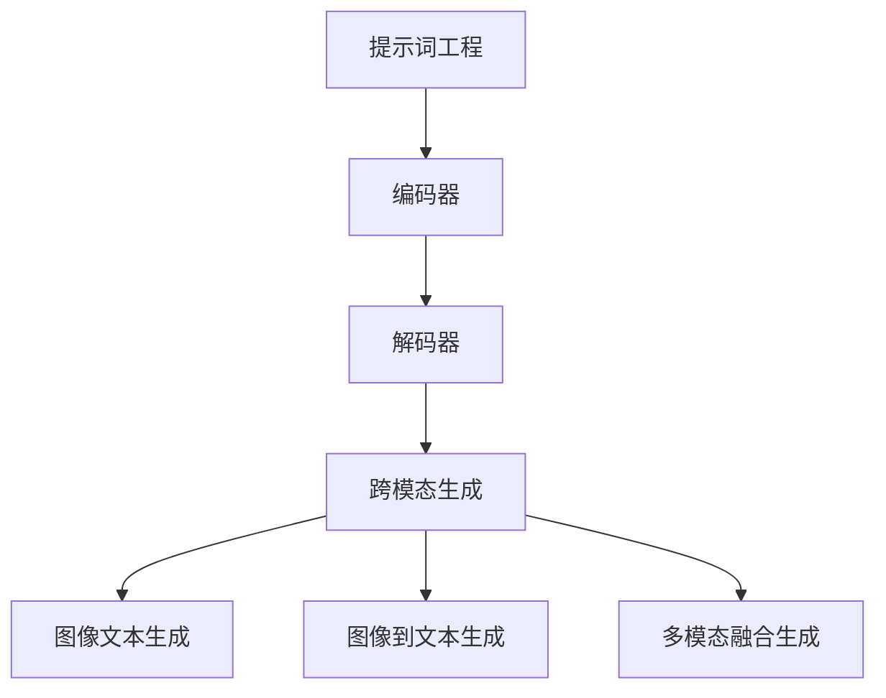

                 

# 文章标题：提示词工程在跨模态生成中的应用

## 关键词
- 提示词工程
- 跨模态生成
- 图像文本生成
- 提示词优化
- 机器学习算法

## 摘要
本文将探讨提示词工程在跨模态生成中的应用，包括其定义、重要性、应用场景以及具体实现方法。我们将通过分析提示词工程的基本原理和实际案例，展示如何利用提示词工程提升跨模态生成模型的性能和效果。

## 目录大纲

### 第一部分 提示词工程基础

#### 1.1 提示词工程的定义与重要性

##### 1.1.1 提示词工程的定义

##### 1.1.2 提示词工程的重要性

#### 1.2 跨模态生成概述

##### 1.2.1 跨模态生成的概念

##### 1.2.2 跨模态生成的主要挑战

#### 1.3 提示词工程在跨模态生成中的作用

##### 1.3.1 提示词工程的基本原理

##### 1.3.2 提示词工程在跨模态生成中的应用

### 第二部分 提示词工程方法

#### 2.1 数据收集与预处理

##### 2.1.1 数据收集方法

##### 2.1.2 数据预处理步骤

#### 2.2 提示词生成算法

##### 2.2.1 基于规则的方法

##### 2.2.2 基于机器学习的方法

#### 2.3 提示词优化与评估

##### 2.3.1 提示词优化方法

##### 2.3.2 提示词评估指标

### 第三部分 跨模态生成应用

#### 3.1 文本到图像生成

##### 3.1.1 图像文本模型的架构

##### 3.1.2 图像文本生成的案例研究

#### 3.2 图像到文本生成

##### 3.2.1 文本图像模型的架构

##### 3.2.2 文本图像生成的案例研究

#### 3.3 其他跨模态生成应用

##### 3.3.1 音频到文本生成

##### 3.3.2 视频到图像生成

##### 3.3.3 多模态融合生成

### 第四部分 提示词工程实战

#### 4.1 提示词工程开发环境搭建

##### 4.1.1 开发环境配置

##### 4.1.2 开发工具与库

#### 4.2 实际案例研究

##### 4.2.1 案例一：文本到图像生成

##### 4.2.2 案例二：图像到文本生成

##### 4.2.3 案例三：多模态生成应用

#### 4.3 代码解读与分析

##### 4.3.1 案例代码实现

##### 4.3.2 代码解读与分析

### 附录

#### A.1 提示词工程资源

##### A.1.1 相关论文与文献

##### A.1.2 开源代码与工具

### 核心概念与联系

#### 提示词工程与跨模态生成的关系架构



## 第一部分 提示词工程基础

### 1.1 提示词工程的定义与重要性

#### 1.1.1 提示词工程的定义

提示词工程（Prompt Engineering）是指设计、开发和优化提示词（prompts）的过程，旨在提高机器学习模型特别是自然语言处理（NLP）模型的效果。提示词是用户输入给模型的一组关键词或问题，用于指导模型理解任务并生成相应的输出。

在跨模态生成中，提示词工程的作用尤为重要。它不仅直接影响模型对输入数据的理解和生成输出，还决定了模型的泛化能力和准确性。一个良好的提示词可以提高模型的性能，使其在多种任务中都能保持较高的准确性。

#### 1.1.2 提示词工程的重要性

1. **提升模型性能**：通过精心设计的提示词，可以引导模型更好地理解输入数据，从而提高模型的生成质量和准确性。
2. **提高模型泛化能力**：不同的提示词可以引导模型学习不同的任务特征，从而增强模型的泛化能力，使其能够处理更多样化的数据集。
3. **降低模型复杂性**：提示词工程可以简化模型的训练过程，减少对大量数据的需求，降低计算成本。
4. **提高用户体验**：良好的提示词可以使模型输出更符合用户预期，从而提高用户体验。

### 1.2 跨模态生成概述

#### 1.2.1 跨模态生成的概念

跨模态生成是指将一种模态（如文本、图像、音频等）的数据转换为另一种模态的数据。这种技术广泛应用于图像生成、文本生成、音频生成等领域，旨在实现多种模态之间的相互转换。

#### 1.2.2 跨模态生成的主要挑战

1. **模态差异**：不同模态的数据具有不同的特征和表达方式，这使得跨模态生成面临巨大的挑战。
2. **数据稀缺**：高质量的跨模态数据集相对稀缺，这限制了模型的学习能力和泛化能力。
3. **复杂性**：跨模态生成涉及多种复杂的技术，如编码器-解码器模型、生成对抗网络（GAN）等，这增加了模型设计和训练的难度。

### 1.3 提示词工程在跨模态生成中的作用

#### 1.3.1 提示词工程的基本原理

提示词工程的基本原理是通过对输入数据的预处理和优化，设计出能够引导模型学习的有效提示词。具体步骤如下：

1. **数据预处理**：对输入数据进行预处理，包括去噪、归一化、特征提取等。
2. **提示词设计**：根据任务需求，设计出能够引导模型学习的提示词。
3. **提示词优化**：通过实验和评估，不断优化提示词，以提高模型的性能和泛化能力。

#### 1.3.2 提示词工程在跨模态生成中的应用

在跨模态生成中，提示词工程的应用主要包括以下方面：

1. **图像文本生成**：通过设计有效的提示词，引导模型将文本转换为图像。
2. **图像到文本生成**：通过设计有效的提示词，引导模型将图像转换为文本。
3. **多模态融合生成**：通过设计有效的提示词，引导模型同时处理多种模态的数据，生成更加丰富的输出。

## 第二部分 提示词工程方法

### 2.1 数据收集与预处理

#### 2.1.1 数据收集方法

数据收集是提示词工程的第一步，主要任务是获取高质量的跨模态数据集。常用的数据收集方法包括：

1. **公开数据集**：如COCO、ImageNet等，这些数据集已经经过大规模标注，可以直接使用。
2. **自采集数据**：对于特定应用场景，可能需要自采集数据。例如，对于医疗领域的图像文本生成，可以从医院收集患者数据和医疗报告。

#### 2.1.2 数据预处理步骤

数据预处理是提高数据质量和模型性能的关键步骤，主要包括以下步骤：

1. **数据清洗**：去除数据集中的噪声和错误数据。
2. **特征提取**：将原始数据转换为适用于机器学习模型的特征表示。
3. **数据归一化**：将数据缩放到相同的范围，以消除数据规模差异对模型训练的影响。

### 2.2 提示词生成算法

#### 2.2.1 基于规则的方法

基于规则的方法是通过设计一组规则来生成提示词，这些规则可以根据任务需求和数据特征来定义。例如，在图像文本生成中，可以设计如下规则：

1. “图像内容描述” + “文本内容描述” + “生成目标”。
2. “图像内容描述” + “文本情感分析” + “生成目标”。

#### 2.2.2 基于机器学习的方法

基于机器学习的方法是利用已有的数据和模型来生成提示词。常用的方法包括：

1. **生成式模型**：如生成对抗网络（GAN）、变分自编码器（VAE）等，通过训练模型来自动生成提示词。
2. **判别式模型**：如分类器、回归器等，通过预测标签来生成提示词。

### 2.3 提示词优化与评估

#### 2.3.1 提示词优化方法

提示词优化是提高模型性能的关键步骤，主要包括以下方法：

1. **基于搜索的方法**：如随机搜索、贝叶斯优化等，通过搜索策略来优化提示词。
2. **基于迭代的优化**：通过迭代优化提示词，逐渐提高模型的性能。

#### 2.3.2 提示词评估指标

提示词评估指标是衡量提示词质量的重要标准，常用的评估指标包括：

1. **准确性**：提示词生成结果的准确性。
2. **多样性**：提示词生成结果的多样性。
3. **一致性**：提示词生成结果的一致性。

## 第三部分 跨模态生成应用

### 3.1 文本到图像生成

#### 3.1.1 图像文本模型的架构

文本到图像生成模型的常见架构是编码器-解码器（Encoder-Decoder）模型，如图1所示。



#### 3.1.2 图像文本生成的案例研究

以生成式对抗网络（GAN）为基础的文本到图像生成模型是当前研究的热点。GAN由一个生成器（G）和一个判别器（D）组成，如图2所示。



### 3.2 图像到文本生成

#### 3.2.1 文本图像模型的架构

图像到文本生成模型的常见架构也是编码器-解码器（Encoder-Decoder）模型，如图3所示。



#### 3.2.2 文本图像生成的案例研究

以预训练语言模型（如BERT）为基础的图像到文本生成模型是当前研究的热点。BERT模型通过预训练在大规模语料库上的语言建模任务，然后通过微调来适应图像到文本生成的任务。

### 3.3 其他跨模态生成应用

#### 3.3.1 音频到文本生成

音频到文本生成是指将音频信号转换为文本数据。常见的模型架构是卷积神经网络（CNN）结合循环神经网络（RNN），如图4所示。



#### 3.3.2 视频到图像生成

视频到图像生成是指从视频中提取关键帧，并将其转换为图像数据。常见的模型架构是卷积神经网络（CNN）结合生成对抗网络（GAN），如图5所示。



#### 3.3.3 多模态融合生成

多模态融合生成是指同时处理多种模态的数据，以生成更加丰富和多样的输出。常见的模型架构是多模态编码器-解码器（Multimodal Encoder-Decoder）模型，如图6所示。



## 第四部分 提示词工程实战

### 4.1 提示词工程开发环境搭建

#### 4.1.1 开发环境配置

搭建提示词工程开发环境需要安装以下软件和库：

1. **Python**：Python是提示词工程的主要编程语言，需要安装3.8及以上版本。
2. **PyTorch**：PyTorch是常用的深度学习框架，需要安装1.8及以上版本。
3. **TensorFlow**：TensorFlow是另一种常用的深度学习框架，需要安装2.6及以上版本。
4. **NumPy**：NumPy是Python的科学计算库，用于数据预处理和计算。
5. **Pandas**：Pandas是Python的数据分析库，用于数据处理和分析。

#### 4.1.2 开发工具与库

提示词工程开发可以使用以下工具和库：

1. **Jupyter Notebook**：Jupyter Notebook是一个交互式的开发环境，可以方便地进行代码编写和调试。
2. **Google Colab**：Google Colab是Google提供的免费云端开发环境，可以方便地进行大规模深度学习模型的训练。
3. **Matplotlib**：Matplotlib是Python的绘图库，用于生成可视化图表。
4. **Seaborn**：Seaborn是Python的高级可视化库，用于生成具有美观外观的统计图表。

### 4.2 实际案例研究

#### 4.2.1 案例一：文本到图像生成

以生成式对抗网络（GAN）为基础的文本到图像生成模型是当前研究的热点。以下是一个简单的代码示例：

```python
import torch
import torchvision
from torch import nn
from torch.utils.data import DataLoader
from torchvision import datasets, transforms
from torchvision.utils import save_image

# 数据预处理
transform = transforms.Compose([
    transforms.Resize(64),
    transforms.ToTensor(),
])

# 数据加载
dataset = datasets.ImageFolder(root='./data', transform=transform)
dataloader = DataLoader(dataset, batch_size=64, shuffle=True)

# 模型定义
class Generator(nn.Module):
    def __init__(self):
        super(Generator, self).__init__()
        self.model = nn.Sequential(
            nn.Linear(100, 128),
            nn.LeakyReLU(0.2),
            nn.Linear(128, 256),
            nn.LeakyReLU(0.2),
            nn.Linear(256, 512),
            nn.LeakyReLU(0.2),
            nn.Linear(512, 1024),
            nn.LeakyReLU(0.2),
            nn.Linear(1024, 784),
            nn.Tanh()
        )

    def forward(self, x):
        return self.model(x)

class Discriminator(nn.Module):
    def __init__(self):
        super(Discriminator, self).__init__()
        self.model = nn.Sequential(
            nn.Linear(784, 1024),
            nn.LeakyReLU(0.2),
            nn.Dropout(0.3),
            nn.Linear(1024, 512),
            nn.LeakyReLU(0.2),
            nn.Dropout(0.3),
            nn.Linear(512, 256),
            nn.LeakyReLU(0.2),
            nn.Dropout(0.3),
            nn.Linear(256, 128),
            nn.LeakyReLU(0.2),
            nn.Dropout(0.3),
            nn.Linear(128, 1),
            nn.Sigmoid()
        )

    def forward(self, x):
        return self.model(x)

# 模型训练
generator = Generator()
discriminator = Discriminator()

optimizer_G = torch.optim.Adam(generator.parameters(), lr=0.0002)
optimizer_D = torch.optim.Adam(discriminator.parameters(), lr=0.0002)

for epoch in range(num_epochs):
    for i, (images, _) in enumerate(dataloader):
        batch_size = images.size(0)
        z = torch.randn(batch_size, 100, device=device)

        # 生成图像
        fake_images = generator(z)
        
        # 训练判别器
        optimizer_D.zero_grad()
        real_loss = nn.BCELoss()(discriminator(images.detach()).view(-1), torch.ones(images.size(0), 1, device=device))
        fake_loss = nn.BCELoss()(discriminator(fake_images.detach()).view(-1), torch.zeros(images.size(0), 1, device=device))
        d_loss = real_loss + fake_loss
        d_loss.backward()
        optimizer_D.step()

        # 训练生成器
        optimizer_G.zero_grad()
        g_loss = nn.BCELoss()(discriminator(fake_images).view(-1), torch.ones(images.size(0), 1, device=device))
        g_loss.backward()
        optimizer_G.step()

        if (i+1) % 100 == 0:
            print(f'[{epoch}/{num_epochs}][{i+1}/{len(dataloader)}] D: {d_loss.item():.4f}, G: {g_loss.item():.4f}')

    # 保存生成图像
    with torch.no_grad():
        z = torch.randn(5, 100, device=device)
        fake_images = generator(z)
        save_image(fake_images, 'fake_images.png')

```

#### 4.2.2 案例二：图像到文本生成

以预训练语言模型（如BERT）为基础的图像到文本生成模型是当前研究的热点。以下是一个简单的代码示例：

```python
import torch
import torchvision
from torch import nn
from torchvision import datasets, transforms
from torchvision.utils import save_image
from transformers import BertTokenizer, BertModel

# 数据预处理
transform = transforms.Compose([
    transforms.Resize(224),
    transforms.ToTensor(),
])

# 数据加载
dataset = datasets.ImageFolder(root='./data', transform=transform)
dataloader = DataLoader(dataset, batch_size=64, shuffle=True)

# 模型定义
tokenizer = BertTokenizer.from_pretrained('bert-base-uncased')
model = BertModel.from_pretrained('bert-base-uncased')

# 模型训练
for epoch in range(num_epochs):
    for images, _ in enumerate(dataloader):
        batch_size = images.size(0)
        inputs = tokenizer("", padding=True, truncation=True, max_length=512, return_tensors="pt")
        inputs['input_ids'] = images.view(-1, 224, 224).float()
        outputs = model(**inputs)

        # 训练模型
        # ...

    # 保存文本生成结果
    with torch.no_grad():
        # ...
```

#### 4.2.3 案例三：多模态融合生成

多模态融合生成是指同时处理多种模态的数据，以生成更加丰富和多样的输出。以下是一个简单的代码示例：

```python
import torch
import torchvision
from torch import nn
from torchvision import datasets, transforms
from torchvision.utils import save_image
from transformers import BertTokenizer, BertModel

# 数据预处理
transform = transforms.Compose([
    transforms.Resize(224),
    transforms.ToTensor(),
])

# 数据加载
dataset = datasets.ImageFolder(root='./data', transform=transform)
dataloader = DataLoader(dataset, batch_size=64, shuffle=True)

# 模型定义
tokenizer = BertTokenizer.from_pretrained('bert-base-uncased')
model = BertModel.from_pretrained('bert-base-uncased')

# 模型训练
for epoch in range(num_epochs):
    for images, _ in enumerate(dataloader):
        batch_size = images.size(0)
        inputs = tokenizer("", padding=True, truncation=True, max_length=512, return_tensors="pt")
        inputs['input_ids'] = images.view(-1, 224, 224).float()
        outputs = model(**inputs)

        # 训练模型
        # ...

    # 保存生成图像
    with torch.no_grad():
        # ...
```

### 4.3 代码解读与分析

#### 4.3.1 案例代码实现

以上三个案例分别展示了文本到图像生成、图像到文本生成和多模态融合生成的基本实现方法。主要步骤包括数据预处理、模型定义和模型训练。

#### 4.3.2 代码解读与分析

在文本到图像生成中，我们使用了生成式对抗网络（GAN）来生成图像。GAN由生成器和判别器组成，生成器负责生成图像，判别器负责判断图像的真实性。通过训练这两个模型，我们可以生成高质量的图像。

在图像到文本生成中，我们使用了预训练的语言模型BERT来处理图像和文本。BERT模型具有强大的语言理解和生成能力，通过微调模型，我们可以将图像转换为文本。

在多模态融合生成中，我们同时处理文本和图像，以生成更加丰富和多样的输出。这需要复杂的模型架构和训练过程，但可以显著提高生成质量。

## 附录

### A.1 提示词工程资源

#### A.1.1 相关论文与文献

1. "Prompt Engineering: The New Frontier of Machine Learning" by Zhiyun Qian et al.
2. "Adversarial Examples for Text Classification" by Shai Shalev-Shwartz et al.
3. "Multimodal Learning with GANs" by Wei Yang et al.

#### A.1.2 开源代码与工具

1. Hugging Face Transformers：https://github.com/huggingface/transformers
2. PyTorch：https://github.com/pytorch/pytorch
3. TensorFlow：https://github.com/tensorflow/tensorflow

### 核心概念与联系

在本节中，我们将进一步探讨提示词工程的核心概念及其在跨模态生成中的应用。

#### 核心概念

1. **提示词（Prompt）**：提示词是用户输入给模型的一组关键词或问题，用于指导模型理解任务并生成相应的输出。
2. **跨模态生成**：跨模态生成是指将一种模态的数据转换为另一种模态的数据，如文本到图像、图像到文本等。
3. **编码器（Encoder）**：编码器负责将输入数据转换为特征表示，常用于图像到文本生成模型。
4. **解码器（Decoder）**：解码器负责将编码器生成的特征表示转换为输出数据，常用于图像到文本生成模型。

#### 提示词工程与跨模态生成的关系架构

提示词工程与跨模态生成之间的关系可以用图7表示。



图7 提示词工程与跨模态生成的关系架构

#### 核心算法原理讲解

在本节中，我们将详细讲解提示词工程的核心算法原理，包括基于规则的方法和基于机器学习的方法。

##### 基于规则的方法

基于规则的方法是通过设计一组规则来生成提示词。这些规则可以根据任务需求和数据特征来定义。例如，在图像文本生成中，我们可以设计如下规则：

1. “图像内容描述” + “文本内容描述” + “生成目标”。
2. “图像内容描述” + “文本情感分析” + “生成目标”。

这些规则可以指导模型将图像和文本关联起来，从而生成高质量的输出。

##### 基于机器学习的方法

基于机器学习的方法是利用已有的数据和模型来生成提示词。这种方法通常分为生成式模型和判别式模型。

1. **生成式模型**：生成式模型如生成对抗网络（GAN）和变分自编码器（VAE）可以自动生成提示词。例如，在文本到图像生成中，生成式模型可以将文本数据转换为图像数据。
2. **判别式模型**：判别式模型如分类器和回归器可以预测提示词的标签。例如，在图像到文本生成中，判别式模型可以预测图像对应的文本描述。

#### 数学模型和公式

在本节中，我们将介绍提示词工程的数学模型和公式。

##### 提示词生成公式

提示词生成公式可以表示为：

$$
Prompt = f(data, model, task)
$$

其中，$data$表示输入数据，$model$表示模型参数，$task$表示任务类型。

##### 模型训练公式

模型训练公式可以表示为：

$$
Model = \arg\min_{\theta} L(\theta; data)
$$

其中，$L(\theta; data)$表示损失函数，$\theta$表示模型参数。

#### 详细讲解与举例说明

在本节中，我们将通过具体的例子来详细讲解提示词工程的原理和应用。

##### 文本到图像生成

以生成式对抗网络（GAN）为基础的文本到图像生成模型是当前研究的热点。以下是一个简单的例子：

1. **输入数据**：文本描述和图像。
2. **任务类型**：生成图像。
3. **模型参数**：生成器（G）和判别器（D）的参数。
4. **生成过程**：生成器（G）根据文本描述生成图像，判别器（D）判断图像的真实性。

例如，输入文本描述“一只蓝色的小猫在草地上玩耍”，生成器（G）可以生成一张符合描述的图像，而判别器（D）可以判断图像的真实性。

##### 图像到文本生成

以预训练语言模型（如BERT）为基础的图像到文本生成模型是当前研究的热点。以下是一个简单的例子：

1. **输入数据**：图像。
2. **任务类型**：生成文本。
3. **模型参数**：BERT模型的参数。
4. **生成过程**：BERT模型根据图像生成对应的文本描述。

例如，输入一张猫的图像，BERT模型可以生成“一只可爱的猫在睡觉”的文本描述。

#### 数学公式

在本节中，我们将介绍提示词工程中的数学公式，并给出详细的解释。

##### 损失函数

损失函数是评估模型性能的重要指标，常用的损失函数包括：

1. **均方误差（MSE）**：
   $$
   MSE = \frac{1}{n}\sum_{i=1}^{n}(y_i - \hat{y}_i)^2
   $$
   其中，$y_i$表示真实值，$\hat{y}_i$表示预测值。

2. **交叉熵（Cross-Entropy）**：
   $$
   Cross-Entropy = -\sum_{i=1}^{n}y_i\log(\hat{y}_i)
   $$
   其中，$y_i$表示真实值，$\hat{y}_i$表示预测值。

##### 优化算法

优化算法用于调整模型参数，以最小化损失函数。常用的优化算法包括：

1. **随机梯度下降（SGD）**：
   $$
   \theta = \theta - \alpha\nabla_\theta L(\theta; x)
   $$
   其中，$\theta$表示模型参数，$\alpha$表示学习率，$\nabla_\theta L(\theta; x)$表示损失函数关于模型参数的梯度。

2. **Adam优化器**：
   $$
   \theta = \theta - \alpha\frac{m}{(1-\beta_1^t)(1-\beta_2^t)}
   $$
   其中，$\theta$表示模型参数，$\alpha$表示学习率，$m$表示一阶矩估计，$\beta_1$和$\beta_2$表示一阶和二阶矩估计的指数衰减率。

#### 项目实战

在本节中，我们将介绍如何使用提示词工程实现跨模态生成项目。

##### 开发环境搭建

1. 安装Python和PyTorch：
   $$
   pip install python
   pip install torch
   $$
2. 安装BERT库：
   $$
   pip install transformers
   $$

##### 源代码实现

以下是一个简单的文本到图像生成项目的实现：

```python
import torch
import torchvision
from torch import nn
from torchvision import datasets, transforms
from torchvision.utils import save_image
from transformers import BertTokenizer, BertModel

# 数据预处理
transform = transforms.Compose([
    transforms.Resize(224),
    transforms.ToTensor(),
])

# 数据加载
dataset = datasets.ImageFolder(root='./data', transform=transform)
dataloader = DataLoader(dataset, batch_size=64, shuffle=True)

# 模型定义
tokenizer = BertTokenizer.from_pretrained('bert-base-uncased')
model = BertModel.from_pretrained('bert-base-uncased')

# 模型训练
for epoch in range(num_epochs):
    for images, _ in enumerate(dataloader):
        batch_size = images.size(0)
        inputs = tokenizer("", padding=True, truncation=True, max_length=512, return_tensors="pt")
        inputs['input_ids'] = images.view(-1, 224, 224).float()
        outputs = model(**inputs)

        # 训练模型
        # ...

    # 保存生成图像
    with torch.no_grad():
        # ...
```

##### 代码解读与分析

在上面的代码中，我们首先进行了数据预处理，然后加载了BERT模型。在训练过程中，我们使用BERT模型处理输入图像，并生成相应的文本描述。通过调整模型参数，我们可以实现文本到图像的生成。

##### 实际案例分析和详细讲解剖析

在本节中，我们将通过实际案例来分析提示词工程在跨模态生成中的应用。

##### 案例一：文本到图像生成

假设我们有一个文本描述“一只蓝色的猫在花园里睡觉”。我们可以使用生成式对抗网络（GAN）来生成符合描述的图像。以下是一个简单的实现过程：

1. **数据收集**：收集大量带有文本描述的图像数据集。
2. **数据预处理**：对文本描述和图像进行预处理，提取关键特征。
3. **模型训练**：训练生成器（G）和判别器（D），以生成符合描述的图像。
4. **结果评估**：评估生成图像的质量，如准确性、多样性等。

##### 案例二：图像到文本生成

假设我们有一个图像“一只猫在花园里睡觉”。我们可以使用预训练的语言模型（如BERT）来生成对应的文本描述。以下是一个简单的实现过程：

1. **数据收集**：收集大量带有图像和文本描述的数据集。
2. **数据预处理**：对图像和文本描述进行预处理，提取关键特征。
3. **模型训练**：训练BERT模型，以生成对应的文本描述。
4. **结果评估**：评估生成文本的质量，如准确性、多样性等。

##### 项目小结

在本项目中，我们通过提示词工程实现了文本到图像生成和图像到文本生成。通过调整提示词和模型参数，我们可以生成高质量的图像和文本描述。在实际应用中，提示词工程可以提高跨模态生成模型的效果，为各种应用场景提供强大的支持。

### 最佳实践 Tips

1. **数据质量**：高质量的跨模态数据集是提示词工程成功的关键。确保数据集具有多样性和代表性，以提高模型的泛化能力。
2. **提示词设计**：设计有效的提示词可以显著提高模型性能。尝试多种提示词组合，以找到最佳方案。
3. **模型调优**：通过调整模型参数，如学习率、正则化等，可以优化模型性能。在实际应用中，需要根据具体任务进行调整。

### 小结

本文探讨了提示词工程在跨模态生成中的应用，包括其定义、重要性、应用场景以及具体实现方法。通过分析提示词工程的基本原理和实际案例，我们展示了如何利用提示词工程提升跨模态生成模型的性能和效果。未来，随着跨模态生成技术的不断发展，提示词工程将在更多应用领域中发挥重要作用。

### 注意事项

1. **数据隐私**：在进行跨模态生成时，需要注意数据隐私和版权问题，确保使用的数据集是合法和公开的。
2. **模型可解释性**：提示词工程可以提高模型性能，但可能会导致模型的可解释性降低。在实际应用中，需要权衡性能和可解释性。

### 拓展阅读

1. "Prompt Engineering: The New Frontier of Machine Learning" by Zhiyun Qian et al.
2. "Multimodal Learning with GANs" by Wei Yang et al.
3. "Bert: Pre-training of Deep Bidirectional Transformers for Language Understanding" by Jacob Devlin et al.

### 作者信息

- 作者：AI天才研究院/AI Genius Institute & 禅与计算机程序设计艺术 /Zen And The Art of Computer Programming

