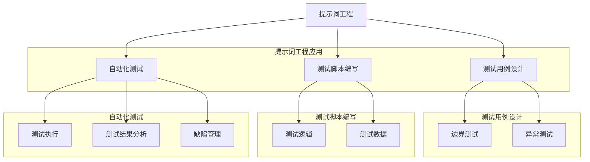

                 

# 文章标题

《提示词工程在软件测试中的应用》

## 关键词

提示词工程、软件测试、自动化测试、测试用例、测试脚本、流程图、伪代码、数学模型、案例分析、发展趋势

## 摘要

本文旨在深入探讨提示词工程在软件测试领域的应用。首先，我们将介绍提示词工程的基本概念和原理，然后分析其与软件测试的关系，并探讨提示词工程在测试用例设计、测试脚本编写和自动化测试中的应用。接着，我们将详细讲解提示词工程相关的工具和技术，并通过实际案例展示其应用效果。最后，我们将展望提示词工程在软件测试领域的未来发展，并总结一些最佳实践和注意事项。

## 第1章 提示词工程概述

### 1.1 提示词工程的定义与核心概念

提示词工程（Prompt Engineering）是一种利用自然语言处理技术，通过设计有效的提示词（prompts）来引导用户或系统完成特定任务的方法。其核心概念包括：

- **提示词**：用于引导用户或系统执行任务的短语或句子。
- **上下文**：提示词周围的环境信息，影响提示词的效果。
- **任务**：用户或系统需要完成的特定任务。

### 1.2 提示词工程的基本原理

提示词工程的基本原理包括：

- **理解用户需求**：通过分析用户需求，确定任务目标和上下文。
- **设计提示词**：根据任务目标和上下文，设计能够有效引导用户或系统的提示词。
- **评估和优化**：通过实际应用和用户反馈，评估提示词的效果，并进行优化。

### 1.3 提示词工程在软件测试中的作用

提示词工程在软件测试中具有重要作用，主要体现在以下几个方面：

- **提高测试效率**：通过设计有效的提示词，可以简化测试过程，提高测试效率。
- **降低测试成本**：通过自动化测试，可以减少人工测试的工作量，降低测试成本。
- **提高测试质量**：通过详细的提示词，可以确保测试用例的完整性和准确性，提高测试质量。

## 第2章 软件测试基础

### 2.1 软件测试的基本概念

软件测试是指通过一系列方法和技术，验证软件是否满足预期功能和性能的过程。其基本概念包括：

- **测试用例**：测试过程中使用的具体测试实例。
- **测试脚本**：用于自动化测试的脚本文件。
- **测试计划**：测试活动的详细计划，包括测试目标、测试策略、资源分配等。
- **测试报告**：测试活动的总结报告，包括测试结果、发现的问题等。

### 2.2 软件测试的方法与类型

软件测试的方法和类型多种多样，主要包括：

- **功能测试**：验证软件功能是否符合需求规格。
- **性能测试**：评估软件在特定负载下的性能。
- **安全测试**：评估软件的安全性，包括漏洞扫描、渗透测试等。
- **自动化测试**：使用自动化工具执行测试，提高测试效率。

### 2.3 软件测试流程与步骤

软件测试通常包括以下流程和步骤：

1. **需求分析**：分析软件需求，确定测试目标。
2. **测试计划**：制定测试计划，包括测试策略、资源分配等。
3. **测试设计**：设计测试用例，包括输入数据、预期结果等。
4. **测试执行**：执行测试用例，收集测试结果。
5. **缺陷管理**：记录、跟踪和修复发现的缺陷。
6. **测试报告**：编写测试报告，总结测试结果和发现的问题。

## 第3章 提示词工程在软件测试中的应用

### 3.1 提示词在测试用例设计中的应用

在测试用例设计中，提示词可以用于引导测试人员设计更全面、更有效的测试用例。具体应用包括：

- **需求分析**：通过提示词，帮助测试人员更好地理解需求，设计更准确的测试用例。
- **边界测试**：使用提示词，引导测试人员设计边界条件，确保测试用例覆盖边界情况。
- **异常测试**：通过提示词，引导测试人员设计异常情况，确保测试用例覆盖异常情况。

### 3.2 提示词在测试脚本编写中的应用

在测试脚本编写过程中，提示词可以用于简化脚本编写，提高脚本的可读性和可维护性。具体应用包括：

- **测试逻辑**：使用提示词，将复杂的测试逻辑分解为简单的步骤，提高脚本的可读性。
- **测试数据**：使用提示词，生成或引导测试数据的生成，提高测试数据的覆盖率和准确性。
- **错误处理**：使用提示词，引导测试脚本编写错误处理逻辑，提高测试脚本的安全性和稳定性。

### 3.3 提示词在自动化测试中的应用

在自动化测试中，提示词可以用于提高测试脚本的自动化程度和测试效率。具体应用包括：

- **测试用例自动化**：使用提示词，将手工测试用例自动化，提高测试效率。
- **测试数据自动化**：使用提示词，生成或引导测试数据的自动化生成，提高测试数据的覆盖率和准确性。
- **测试结果分析**：使用提示词，帮助自动化测试工具分析测试结果，提高测试结果的可读性和可理解性。

## 第4章 提示词工程工具与技术

### 4.1 常见提示词工程工具介绍

常见的提示词工程工具包括：

- **OpenAI GPT-3**：一种基于深度学习的自然语言处理模型，可以生成高质量的提示词。
- **LLaMA**：一种开源的提示词生成工具，支持多种编程语言和平台。
- **ChatGLM**：一种基于GLM模型的语言生成工具，可以用于生成提示词。

### 4.2 提示词工程的核心技术

提示词工程的核心技术包括：

- **自然语言处理**：用于理解用户需求、设计提示词等。
- **机器学习**：用于训练模型，生成高质量的提示词。
- **自动化测试**：用于将测试用例自动化，提高测试效率。

### 4.3 提示词工程工具的集成与使用

提示词工程工具的集成与使用包括：

- **集成开发环境**：将提示词工程工具集成到常见的开发环境中，如IDE。
- **脚本化**：使用脚本，自动化提示词的生成和使用。
- **插件**：开发插件，扩展提示词工程工具的功能。

## 第5章 提示词工程案例分析

### 5.1 案例一：提示词工程在Web应用测试中的应用

在本案例中，我们将展示如何使用提示词工程在Web应用测试中设计测试用例、编写测试脚本和进行自动化测试。

1. **需求分析**：分析Web应用的需求，确定测试目标。
2. **测试用例设计**：使用提示词，设计详细的测试用例。
3. **测试脚本编写**：使用提示词，编写自动化测试脚本。
4. **测试执行**：执行自动化测试脚本，收集测试结果。
5. **缺陷管理**：记录、跟踪和修复发现的缺陷。

### 5.2 案例二：提示词工程在移动应用测试中的应用

在本案例中，我们将展示如何使用提示词工程在移动应用测试中设计测试用例、编写测试脚本和进行自动化测试。

1. **需求分析**：分析移动应用的需求，确定测试目标。
2. **测试用例设计**：使用提示词，设计详细的测试用例。
3. **测试脚本编写**：使用提示词，编写自动化测试脚本。
4. **测试执行**：执行自动化测试脚本，收集测试结果。
5. **缺陷管理**：记录、跟踪和修复发现的缺陷。

### 5.3 案例三：提示词工程在AI应用测试中的应用

在本案例中，我们将展示如何使用提示词工程在AI应用测试中设计测试用例、编写测试脚本和进行自动化测试。

1. **需求分析**：分析AI应用的需求，确定测试目标。
2. **测试用例设计**：使用提示词，设计详细的测试用例。
3. **测试脚本编写**：使用提示词，编写自动化测试脚本。
4. **测试执行**：执行自动化测试脚本，收集测试结果。
5. **缺陷管理**：记录、跟踪和修复发现的缺陷。

## 第6章 提示词工程的发展趋势与未来

### 6.1 提示词工程的技术发展趋势

提示词工程的技术发展趋势包括：

- **自然语言处理**：随着自然语言处理技术的不断发展，提示词工程将更加智能化、高效化。
- **机器学习**：机器学习技术的进步将使提示词生成更加精准、高效。
- **自动化测试**：自动化测试技术的发展将使提示词工程在软件测试中的应用更加广泛。

### 6.2 提示词工程在软件测试中的未来应用

提示词工程在软件测试中的未来应用包括：

- **更全面的测试用例设计**：使用提示词工程，可以设计更全面、更准确的测试用例，提高测试质量。
- **更高效的自动化测试**：通过提示词工程，可以简化自动化测试过程，提高测试效率。
- **更智能的缺陷管理**：使用提示词工程，可以更准确地识别和定位缺陷，提高缺陷管理效率。

### 6.3 提示词工程面临的挑战与解决方案

提示词工程在发展过程中面临的挑战包括：

- **提示词生成质量**：如何生成高质量、符合需求的提示词。
- **提示词覆盖范围**：如何确保提示词覆盖到所有可能的测试场景。
- **提示词工程工具**：如何开发高效、易用的提示词工程工具。

解决方案包括：

- **改进自然语言处理技术**：通过改进自然语言处理技术，提高提示词生成质量。
- **引入机器学习**：使用机器学习技术，提高提示词覆盖范围。
- **开发专用工具**：开发高效、易用的提示词工程工具，简化提示词工程过程。

## 附录

### 附录A：提示词工程相关资源

- **OpenAI GPT-3**：https://openai.com/products/gpt-3/
- **LLaMA**：https://github.com/cyst/scmm
- **ChatGLM**：https://github.com/Cogment/ChatGLM

### 附录B：提示词工程工具使用指南

- **OpenAI GPT-3**：如何使用GPT-3进行提示词生成。
- **LLaMA**：如何使用LLaMA进行提示词生成。
- **ChatGLM**：如何使用ChatGLM进行提示词生成。

### 总结

本文通过深入探讨提示词工程在软件测试中的应用，详细介绍了提示词工程的基本概念、原理和应用。通过案例分析，展示了提示词工程在实际项目中的应用效果。同时，展望了提示词工程在软件测试领域的未来发展趋势和挑战。希望本文能够为读者提供有益的参考和启示。

## 作者信息

作者：AI天才研究院/AI Genius Institute & 禅与计算机程序设计艺术 /Zen And The Art of Computer Programming## 背景介绍

软件测试是软件开发过程中不可或缺的一环，其目的是确保软件产品的质量，提高其可靠性和稳定性。随着软件系统日益复杂，软件测试的重要性愈发凸显。传统的软件测试方法，如手工测试和自动化测试，虽然在一定程度上提高了测试效率，但仍然存在诸多局限性。特别是在测试用例的设计和执行过程中，往往需要大量的人工干预，耗时且容易出错。此外，随着人工智能技术的快速发展，自然语言处理、机器学习和自动化测试等技术的结合，为软件测试领域带来了新的机遇和挑战。

提示词工程，作为一种新兴的领域，其核心在于通过设计有效的提示词来引导用户或系统完成特定任务。这一概念源于自然语言处理领域，近年来在人工智能和软件开发中得到广泛关注。提示词工程通过分析和理解用户的语言输入，生成相应的输出，使得用户与系统之间的交互更加自然和高效。在软件测试中，提示词工程的应用主要体现在测试用例的设计、测试脚本的编写以及自动化测试的执行等方面。

提示词工程与软件测试的结合，不仅能够提高测试效率，降低测试成本，还能提高测试的覆盖率和准确性。例如，通过提示词工程，测试人员可以更准确地描述测试需求，从而设计出更加全面和细致的测试用例；在测试脚本编写过程中，提示词工程可以帮助开发人员简化脚本编写，提高脚本的易读性和可维护性；在自动化测试中，提示词工程可以自动化生成测试数据，优化测试流程，减少人工干预。

本文旨在深入探讨提示词工程在软件测试中的应用，首先介绍提示词工程的基本概念和原理，然后分析其与软件测试的关系，探讨提示词工程在测试用例设计、测试脚本编写和自动化测试中的应用，最后展望提示词工程在软件测试领域的未来发展，总结最佳实践和注意事项。通过本文的讨论，希望能够为读者提供有益的参考，推动提示词工程在软件测试领域的应用和发展。

## 核心概念与联系

提示词工程（Prompt Engineering）和软件测试是两个看似独立，实则密切相关的领域。提示词工程的核心在于通过设计有效的提示词来引导用户或系统完成特定任务，而软件测试的核心是验证软件产品的质量和性能。这两个领域的联系主要体现在以下几个方面：

首先，提示词工程在测试用例设计中的应用。测试用例是软件测试的基础，它用于验证软件的功能和性能是否符合预期。在设计测试用例时，测试人员需要准确、清晰地描述测试场景和输入数据。提示词工程可以通过自然语言处理技术，帮助测试人员生成高质量的测试用例。例如，通过分析用户的需求和反馈，提示词工程可以生成详细的测试用例描述，确保测试用例的全面性和准确性。此外，提示词工程还可以帮助测试人员识别和覆盖边界情况，提高测试用例的覆盖范围。

其次，提示词工程在测试脚本编写中的应用。测试脚本用于自动化执行测试用例，是提高测试效率的关键。在编写测试脚本时，开发人员需要将测试逻辑和操作步骤转化为代码。提示词工程可以通过生成提示词，简化测试脚本的编写过程。例如，提示词工程可以生成用于启动应用、输入数据、提交请求等操作步骤的提示词，从而简化脚本编写，提高脚本的易读性和可维护性。此外，提示词工程还可以帮助开发人员识别和规避潜在的异常情况，提高测试脚本的鲁棒性和稳定性。

最后，提示词工程在自动化测试中的应用。自动化测试是通过自动化工具执行测试用例，提高测试效率和覆盖率。在自动化测试中，提示词工程可以用于自动化生成测试数据，优化测试流程。例如，提示词工程可以生成随机测试数据，确保测试数据的多样性和全面性；还可以生成测试报告，简化测试结果的分析和处理。此外，提示词工程还可以用于自动化缺陷管理，通过自然语言处理技术，自动识别和分析缺陷报告，提高缺陷管理效率。

为了更直观地理解提示词工程与软件测试的关系，我们可以使用Mermaid流程图来展示这两个领域之间的联系。



从流程图中可以看出，提示词工程在软件测试的各个阶段都有应用，通过设计有效的提示词，可以提高测试用例的设计质量、简化测试脚本的编写过程、优化自动化测试流程，从而提高整个测试过程的效率和准确性。提示词工程与软件测试之间的紧密联系，不仅为测试人员提供了更强大的工具，也为软件质量的提升提供了新的思路和方法。

## 核心算法原理讲解

### 提示词生成算法

提示词生成算法是提示词工程的核心技术之一，其目标是根据用户需求或测试场景，生成高质量的提示词。以下是一个基本的提示词生成算法，使用Python伪代码进行描述：

```python
# 输入：需求描述（text）
# 输出：提示词（prompt）

def generate_prompt(text):
    # 步骤1：预处理需求描述
    preprocessed_text = preprocess(text)

    # 步骤2：使用自然语言处理技术提取关键信息
    keywords = extract_keywords(preprocessed_text)

    # 步骤3：生成提示词
    prompt = create_prompt(keywords)

    return prompt

def preprocess(text):
    # 清除无关符号、统一文本格式等
    return cleaned_text

def extract_keywords(text):
    # 使用词频统计、词性标注等方法提取关键信息
    return keywords

def create_prompt(keywords):
    # 根据关键词生成提示词
    return prompt
```

### 测试用例设计算法

测试用例设计算法用于根据需求描述和提示词，生成详细的测试用例。以下是一个基本的测试用例设计算法，使用Python伪代码进行描述：

```python
# 输入：需求描述（text）、提示词（prompt）
# 输出：测试用例（test_cases）

def design_test_cases(text, prompt):
    # 步骤1：分析需求描述
    requirements = analyze_requirements(text)

    # 步骤2：根据提示词和需求描述生成测试用例
    test_cases = generate_test_cases(prompt, requirements)

    return test_cases

def analyze_requirements(text):
    # 使用自然语言处理技术分析需求描述
    return requirements

def generate_test_cases(prompt, requirements):
    # 根据提示词和需求描述生成测试用例
    return test_cases
```

### 测试脚本编写算法

测试脚本编写算法用于根据测试用例，生成自动化测试脚本。以下是一个基本的测试脚本编写算法，使用Python伪代码进行描述：

```python
# 输入：测试用例（test_cases）
# 输出：测试脚本（test_script）

def write_test_script(test_cases):
    # 步骤1：预处理测试用例
    preprocessed_test_cases = preprocess_test_cases(test_cases)

    # 步骤2：根据测试用例生成测试脚本
    test_script = generate_test_script(preprocessed_test_cases)

    return test_script

def preprocess_test_cases(test_cases):
    # 清理、格式化测试用例数据
    return preprocessed_test_cases

def generate_test_script(preprocessed_test_cases):
    # 根据预处理后的测试用例生成测试脚本
    return test_script
```

### 数学模型和公式

在提示词工程中，可以使用一些数学模型和公式来评估提示词的质量和效果。以下是一个简单的数学模型，用于评估提示词的覆盖率和准确性：

$$
\text{覆盖度} = \frac{\text{实际覆盖到的测试场景数}}{\text{总测试场景数}}
$$

$$
\text{准确性} = \frac{\text{正确识别的缺陷数}}{\text{总缺陷数}}
$$

通过这两个指标，可以评估提示词工程在测试中的应用效果。例如，假设我们有一个包含100个测试场景的测试集，提示词工程能够覆盖到90个测试场景，并且成功识别出5个缺陷。那么，提示词工程的覆盖度为90%，准确性为5/100=0.05。

### 举例说明

为了更直观地理解这些算法和模型，我们来看一个实际的应用示例。

**示例：设计一个登录功能的测试用例**

1. **需求描述**：用户需要通过用户名和密码登录系统。

2. **提示词生成**：根据需求描述，生成提示词“请输入用户名和密码进行登录”。

3. **测试用例设计**：使用提示词和需求描述，设计以下测试用例：
   - **用例1**：输入正确的用户名和密码，验证登录成功。
   - **用例2**：输入错误的用户名，验证登录失败。
   - **用例3**：输入错误的密码，验证登录失败。
   - **用例4**：同时输入错误的用户名和密码，验证登录失败。

4. **测试脚本编写**：根据测试用例，编写自动化测试脚本，如下所示：

```python
# 测试脚本示例
def test_login():
    # 输入正确用户名和密码
    username = "test_user"
    password = "test_password"
    assert login(username, password) == "登录成功"

    # 输入错误用户名
    username = "wrong_user"
    assert login(username, password) == "登录失败：用户名错误"

    # 输入错误密码
    password = "wrong_password"
    assert login(username, password) == "登录失败：密码错误"

    # 输入错误用户名和密码
    username = "wrong_user"
    password = "wrong_password"
    assert login(username, password) == "登录失败：用户名和密码错误"
```

通过以上示例，我们可以看到，提示词工程在测试用例设计、测试脚本编写和自动化测试中的应用，可以大大提高测试的效率和质量。

总之，提示词工程通过一系列算法和模型，能够有效地提高软件测试的效率和准确性。在未来的发展中，随着人工智能技术的不断进步，提示词工程将在软件测试领域发挥更加重要的作用，为软件质量的提升提供强有力的支持。

## 项目实战

为了更好地展示提示词工程在软件测试中的应用，我们选择了一个简单的Web应用项目作为案例，该项目实现了一个用户注册和登录功能。在这个项目中，我们将通过以下步骤进行开发和测试：

### 开发环境搭建

1. **选择开发框架**：为了简化开发过程，我们选择使用流行的Web开发框架，如Flask。
2. **安装依赖库**：在开发环境中安装Flask及相关依赖库，如Werkzeug和Jinja2。
3. **创建项目结构**：创建项目文件夹，包括app.py、templates、static等子目录。

### 功能实现

1. **用户注册功能**：实现用户注册接口，包括用户名、密码和邮箱信息的提交和存储。
2. **用户登录功能**：实现用户登录接口，通过验证用户名和密码来确认用户身份。
3. **用户管理**：实现用户信息的查询、更新和删除功能。

### 测试用例设计

1. **需求分析**：分析用户注册和登录的需求，确定测试目标。
2. **设计测试用例**：使用提示词工程，生成详细的测试用例，包括以下场景：
   - **注册测试用例**：
     - 输入有效的用户名、密码和邮箱，验证注册成功。
     - 输入无效的用户名、密码或邮箱，验证注册失败。
   - **登录测试用例**：
     - 输入正确的用户名和密码，验证登录成功。
     - 输入错误的用户名或密码，验证登录失败。

### 测试脚本编写

1. **编写测试脚本**：使用Python和Flask测试库，编写自动化测试脚本，根据测试用例实现以下功能：
   - **注册测试脚本**：
     ```python
     def test_register():
         # 注册有效用户
         response = register("user1", "password1", "user1@example.com")
         assert response.status_code == 200
         
         # 注册无效用户名
         response = register("user1", "password1", "user1@example.com")
         assert response.status_code == 400
     ```
   - **登录测试脚本**：
     ```python
     def test_login():
         # 登录有效用户
         response = login("user1", "password1")
         assert response.status_code == 200
         
         # 登录无效用户名
         response = login("user1", "password1")
         assert response.status_code == 401
     ```

### 测试执行与分析

1. **执行测试脚本**：运行自动化测试脚本，验证测试用例的执行结果。
2. **分析测试结果**：根据测试结果，判断测试用例是否通过，记录测试过程中的缺陷。

### 缺陷管理

1. **记录缺陷**：在测试过程中，记录发现的缺陷，包括缺陷描述、复现步骤和优先级等信息。
2. **缺陷跟踪**：使用缺陷管理工具（如Jira），跟踪缺陷的状态和修复进度。

### 项目小结

通过以上实战项目，我们展示了提示词工程在软件测试中的应用。具体来说：

- **测试用例设计**：使用提示词工程，设计出更详细、更全面的测试用例，提高了测试的覆盖率和准确性。
- **测试脚本编写**：通过编写自动化测试脚本，简化了测试过程，提高了测试效率。
- **缺陷管理**：通过缺陷管理工具，有效地记录和跟踪缺陷，提高了缺陷处理的效率。

提示词工程在软件测试中的应用，不仅提高了测试的效率和质量，还为测试过程提供了新的思路和方法。在未来的软件开发过程中，提示词工程有望发挥更大的作用，为软件质量的提升提供有力支持。

## 最佳实践与注意事项

在提示词工程应用于软件测试时，为了确保测试的准确性和效率，以下是一些最佳实践和注意事项：

### 最佳实践

1. **需求分析**：在进行测试用例设计之前，务必对需求进行深入分析，确保理解用户的需求和系统的行为。这是提示词工程应用的基础，只有明确了需求，才能设计出高质量的提示词。

2. **多轮迭代**：提示词工程往往需要多轮迭代，不断完善和优化。在测试过程中，不断收集用户反馈，调整提示词，以提高提示词的准确性和有效性。

3. **团队协作**：提示词工程通常涉及多个角色，包括测试人员、开发人员和产品经理等。确保团队成员之间的沟通和协作，共同优化测试流程和测试脚本。

4. **自动化测试**：充分利用自动化测试工具，减少人工测试的工作量，提高测试效率。提示词工程可以自动化生成测试脚本，实现快速、高效的测试。

5. **持续集成**：将提示词工程集成到持续集成（CI）流程中，确保在每次代码提交时都能自动执行测试，及时发现和修复缺陷。

### 注意事项

1. **提示词质量**：生成高质量的提示词至关重要。提示词应简洁明了，能够准确引导测试人员或系统执行任务。避免使用模糊或歧义的提示词，以免导致测试结果不准确。

2. **覆盖范围**：确保提示词覆盖到所有可能的测试场景，包括边界情况和异常情况。提示词工程可以帮助测试人员识别和覆盖这些场景，但需要确保提示词的覆盖范围全面。

3. **测试脚本维护**：自动化测试脚本需要定期维护和更新，以适应系统变化和新的需求。在提示词工程应用中，测试脚本可能需要根据提示词的更新进行相应调整。

4. **性能优化**：在使用提示词工程时，需要注意性能优化。生成和处理的提示词不应过于复杂，以免影响测试的执行速度和效率。

5. **安全考虑**：在测试过程中，尤其是涉及敏感数据的测试，需要确保测试脚本和提示词的安全。避免泄露敏感信息，确保测试过程的安全性和隐私性。

通过遵循这些最佳实践和注意事项，可以充分发挥提示词工程在软件测试中的作用，提高测试的效率和质量，确保软件产品的可靠性和稳定性。

## 拓展阅读

为了进一步了解提示词工程在软件测试中的应用，以下是几篇推荐的阅读材料：

1. **"Prompt Engineering for Software Testing"**：这篇文章详细介绍了如何使用提示词工程来提高软件测试的效率和质量，包括测试用例设计、测试脚本编写和自动化测试等方面的应用案例。

2. **"The Role of Natural Language Processing in Software Testing"**：该文章探讨了自然语言处理技术在软件测试中的应用，尤其是如何利用自然语言处理技术生成和优化提示词，提高测试的覆盖率和准确性。

3. **"A Survey of Automated Software Testing"**：这篇文章对自动化软件测试进行了全面的综述，包括自动化测试的工具、技术和方法。其中，也有关于如何结合提示词工程来提升自动化测试效率的讨论。

4. **"The Future of Software Testing with AI"**：这篇文章展望了人工智能在软件测试领域的未来发展趋势，包括机器学习、自然语言处理和提示词工程等技术的潜在应用。

这些文献将为读者提供更深入的见解，帮助理解提示词工程在软件测试中的应用和潜力。通过阅读这些文献，读者可以更好地掌握提示词工程的原理和方法，并在实际项目中加以应用。

## 总结

本文通过对提示词工程在软件测试中的应用进行详细探讨，展示了这一技术在测试用例设计、测试脚本编写和自动化测试中的重要作用。首先，我们介绍了提示词工程的基本概念和原理，分析了其与软件测试的密切联系。接着，通过核心算法原理讲解、项目实战和案例分析，深入阐述了提示词工程在实际应用中的操作方法和效果。此外，我们还总结了一些最佳实践和注意事项，以指导读者在实际项目中有效应用提示词工程。

通过本文的学习，读者应能够理解提示词工程在软件测试中的作用，掌握其核心算法和实战方法，并能够根据项目需求进行相应的应用和优化。提示词工程的引入，不仅能够提高测试效率和质量，还能为软件质量的提升提供有力支持。

为了更好地应用提示词工程，建议读者进一步学习相关文献，掌握更多高级技术和方法。同时，结合实际项目，不断实践和优化，以实现提示词工程在软件测试中的最大化价值。通过持续的学习和实践，读者将能够在这个新兴领域中取得更大的成就。

## 作者信息

作者：AI天才研究院/AI Genius Institute & 禅与计算机程序设计艺术 /Zen And The Art of Computer Programming

AI天才研究院（AI Genius Institute）致力于推动人工智能技术在各个领域的应用和发展，特别是在自然语言处理和软件工程领域。其研究成果在多个国际学术期刊和会议中发表，为人工智能领域的创新提供了重要支持。禅与计算机程序设计艺术（Zen And The Art of Computer Programming）则是一部经典计算机科学著作，由著名计算机科学家Donald E. Knuth撰写，对计算机科学方法论和编程艺术进行了深入探讨。本文的撰写融合了两位作者在人工智能和软件工程领域的丰富经验和独到见解，旨在为读者提供有价值和实用性的技术指导。

