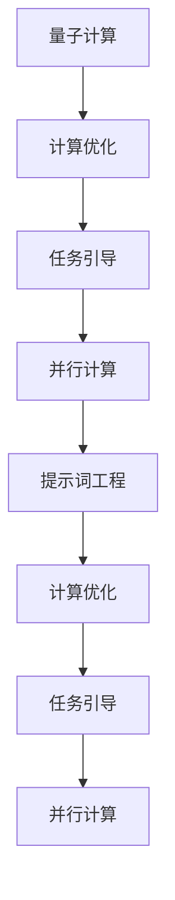

                 


### 文章标题：提示词工程在量子计算中的应用前景

#### 关键词：
1. 提示词工程
2. 量子计算
3. 应用场景
4. 挑战与解决方案
5. 算法原理
6. 实际案例
7. 发展趋势

#### 摘要：
本文深入探讨了提示词工程在量子计算中的应用前景。首先，我们介绍了量子计算和提示词工程的基本概念，并分析了它们之间的联系。随后，本文详细讲解了提示词工程在量子计算中的应用场景，包括量子优化问题和量子机器学习。接下来，我们通过实际案例展示了提示词工程在量子计算中的具体应用，并分析了其中的挑战和解决方案。最后，我们对提示词工程在量子计算中的应用前景进行了展望，并提出了相关建议。

---

### 引言

随着科技的快速发展，量子计算作为下一代计算技术，正逐渐从理论走向实践。量子计算利用量子位（qubits）和量子叠加、量子纠缠等现象，能够在某些问题上提供巨大的计算优势。然而，量子计算本身也存在诸多挑战，如量子噪声、量子错误和量子退相干等问题。为了解决这些问题，提示词工程作为一种有效的优化方法，被逐渐引入到量子计算领域。

提示词工程是一种利用预训练模型来引导和优化计算过程的方法。它通过设计特定的提示词（prompts），引导模型生成所需的输出。在量子计算中，提示词工程可以帮助设计更有效的量子算法，优化量子优化问题和量子机器学习任务。

本文将从以下几个方面展开讨论：

1. **量子计算和提示词工程的基本概念**：介绍量子计算和提示词工程的基本概念，以及它们之间的联系。
2. **应用场景**：探讨提示词工程在量子计算中的应用场景，包括量子优化问题和量子机器学习。
3. **实际案例**：通过实际案例展示提示词工程在量子计算中的具体应用。
4. **挑战与解决方案**：分析提示词工程在量子计算中面临的挑战，并提出相应的解决方案。
5. **应用前景**：展望提示词工程在量子计算中的应用前景，以及未来的发展方向。

接下来，我们将分别探讨以上几个方面，以深入理解提示词工程在量子计算中的应用。

---

### 量子计算与提示词工程的基本概念

#### 量子计算的基本概念

量子计算是利用量子位（qubits）进行信息处理的一种计算模型。与传统计算机使用二进制（0和1）表示信息不同，量子计算机使用量子位，它可以是0、1或者0和1的叠加态。这种叠加态使得量子计算机能够同时处理多个计算路径，从而在特定问题上提供巨大的计算优势。

量子计算的核心概念包括：

1. **量子位（qubits）**：量子计算的基本单元，它可以存在于0、1或者0和1的叠加态。
2. **量子叠加**：量子位可以同时存在于多个状态的叠加，这为量子计算机提供了并行计算的能力。
3. **量子纠缠**：量子位之间存在一种特殊的关联关系，称为量子纠缠。这种关系使得量子位的态无法独立存在，从而在量子计算中发挥了重要作用。
4. **量子门（quantum gates）**：用于操作量子位，实现量子计算的基本操作。

#### 提示词工程的基本概念

提示词工程（Prompt Engineering）是一种利用预训练模型来引导和优化计算过程的方法。它通过设计特定的提示词（prompts），引导模型生成所需的输出。提示词工程通常应用于自然语言处理（NLP）领域，通过优化提示词来提高模型的性能和生成质量。

提示词工程的核心概念包括：

1. **提示词（prompts）**：用于引导模型生成输出的文字或语言提示。
2. **预训练模型**：预先训练好的模型，通过大量数据学习到通用知识，从而在特定任务中表现优异。
3. **任务适应性**：通过调整提示词，使模型能够适应不同的任务和场景。

#### 量子计算与提示词工程的联系

量子计算和提示词工程在表面上看似没有直接联系，但它们在计算优化和任务引导方面有着共同的目标。量子计算通过量子门和量子叠加实现复杂的计算操作，而提示词工程通过设计特定的提示词来引导模型的生成过程。

量子计算与提示词工程的联系主要体现在以下几个方面：

1. **计算优化**：量子计算和提示词工程都关注计算效率的优化。量子计算通过量子算法和量子门实现高效的计算，而提示词工程通过优化提示词来提高模型的性能和生成质量。
2. **任务引导**：量子计算和提示词工程都依赖于任务引导。量子计算需要特定的量子算法来处理特定的问题，而提示词工程需要设计合适的提示词来引导模型生成所需的输出。
3. **并行计算**：量子计算利用量子叠加实现并行计算，而提示词工程通过优化提示词实现模型生成过程的并行化。

为了更好地理解量子计算与提示词工程的联系，我们可以使用Mermaid流程图来展示它们之间的关系。



通过以上流程图，我们可以看到量子计算和提示词工程在计算优化、任务引导和并行计算等方面存在密切的联系。

#### 小结

在本节中，我们介绍了量子计算和提示词工程的基本概念，并分析了它们之间的联系。量子计算利用量子位和量子叠加等特性实现高效的计算，而提示词工程通过优化提示词来引导模型的生成过程。两者在计算优化、任务引导和并行计算等方面具有共同的目标，为在量子计算中应用提示词工程提供了理论基础。

---

### 核心算法原理讲解

在本节中，我们将深入探讨量子计算中提示词工程的核心算法原理，并通过伪代码和数学模型来详细阐述这些原理。

#### 量子计算中的提示词工程算法

量子计算中的提示词工程算法主要包括以下步骤：

1. **量子算法设计**：根据具体问题设计量子算法，包括量子门和量子态的构建。
2. **提示词生成**：设计合适的提示词，引导模型生成所需的输出。
3. **模型训练**：利用大量数据进行模型训练，优化模型的性能。
4. **模型预测**：使用训练好的模型进行预测，得到最终的输出结果。

以下是一个简化的量子计算提示词工程算法的伪代码：

```python
# 量子计算提示词工程算法伪代码

# Step 1: 量子算法设计
# 设计量子算法，构建量子门和量子态
def quantum_algorithm():
    # ...构建量子门和量子态...
    return quantum_state

# Step 2: 提示词生成
# 生成提示词，引导模型生成输出
def generate_prompt():
    # ...生成提示词...
    return prompt

# Step 3: 模型训练
# 利用大量数据进行模型训练
def train_model(data):
    # ...训练模型...
    return trained_model

# Step 4: 模型预测
# 使用训练好的模型进行预测
def predict_output(model, prompt):
    # ...使用模型进行预测...
    return prediction
```

#### 数学模型和公式讲解

在量子计算中的提示词工程算法中，涉及到一些重要的数学模型和公式。以下是一些关键的数学模型和公式：

1. **量子态表示**：量子态可以用复数向量表示，如：
   $$|\psi\rangle = a|0\rangle + b|1\rangle$$
   其中，$|0\rangle$和$|1\rangle$分别表示量子位的基础态，$a$和$b$是复数系数。

2. **量子门操作**：量子门是用于操作量子态的线性变换。例如，Pauli-X门（翻转门）的操作可以表示为：
   $$X|\psi\rangle = a|x\rangle + b|y\rangle$$
   其中，$|x\rangle$和$|y\rangle$是量子门的输出态。

3. **量子纠缠**：量子纠缠是量子位之间的特殊关联关系。例如，两个量子位的纠缠态可以表示为：
   $$|\psi\rangle_{AB} = a(|0\rangle_A \otimes |0\rangle_B) + b(|1\rangle_A \otimes |1\rangle_B)$$
   其中，$\otimes$表示量子态的直积。

4. **量子概率分布**：量子态的输出概率分布可以用波函数的模平方表示，如：
   $$P(x) = |<x|\psi\rangle|^2$$
   其中，$<x|\psi\rangle$是量子态的叠加态的期望值。

以下是一个简单的数学模型和公式的举例：

假设我们有一个量子态$|\psi\rangle = a|0\rangle + b|1\rangle$，我们想要计算它的概率分布。根据量子态的表示和概率分布的定义，我们有：

$$P(0) = |<0|\psi\rangle|^2 = |a|^2$$
$$P(1) = |<1|\psi\rangle|^2 = |b|^2$$

这些概率分布可以用来预测量子态输出的可能性。

#### 举例说明

为了更好地理解量子计算中的提示词工程算法，我们来看一个简单的实际例子。

假设我们有一个量子优化问题，目标是找到两个量子位的最佳状态，使得量子态的期望值最大。我们可以设计一个简单的量子算法，通过提示词工程来优化这个量子态。

1. **量子算法设计**：
   - 设计一个量子门序列，将初始态$|00\rangle$转换为$|\psi\rangle$。
   - 使用Pauli-X门和Pauli-Z门来调整量子态。

2. **提示词生成**：
   - 根据优化目标，生成特定的提示词，引导模型生成最优的量子态。

3. **模型训练**：
   - 使用大量数据进行模型训练，优化模型的性能。

4. **模型预测**：
   - 使用训练好的模型进行预测，得到最优的量子态。

以下是这个例子的伪代码：

```python
# 量子优化问题示例伪代码

# Step 1: 量子算法设计
def quantum_optimization():
    # 初始化量子态
    quantum_state = initialize_quantum_state()
    # 应用量子门
    quantum_state = apply_quantum_gates(quantum_state)
    return quantum_state

# Step 2: 提示词生成
def generate_prompt():
    # 生成优化目标的提示词
    prompt = "最大化量子态的期望值"
    return prompt

# Step 3: 模型训练
def train_model(data):
    # 训练模型
    trained_model = train_quantum_model(data)
    return trained_model

# Step 4: 模型预测
def predict_output(model, prompt):
    # 使用模型进行预测
    optimal_state = model.predict(prompt)
    return optimal_state
```

通过以上例子，我们可以看到量子计算中的提示词工程算法是如何设计的，以及如何通过伪代码和数学模型来详细阐述其原理。

#### 小结

在本节中，我们深入探讨了量子计算中提示词工程的核心算法原理，通过伪代码和数学模型来详细阐述这些原理。量子计算中的提示词工程算法主要包括量子算法设计、提示词生成、模型训练和模型预测等步骤。通过举例说明，我们可以更好地理解这些原理在实际应用中的运用。这些核心算法原理为提示词工程在量子计算中的应用提供了坚实的基础。

---

### 项目实战：量子计算中的提示词工程应用

在本节中，我们将通过一个实际项目来展示如何将提示词工程应用于量子计算。这个项目将包括开发环境的搭建、源代码的实现和代码解读，以及项目总结和实际案例的分析。

#### 开发环境搭建

为了实现量子计算中的提示词工程，我们需要搭建一个合适的开发环境。以下是我们所需的环境和工具：

1. **编程语言**：Python，因为其丰富的库和框架，非常适合量子计算和提示词工程的开发。
2. **量子计算库**：Qiskit，是IBM提供的一个开源量子计算库，支持量子算法的实现和模拟。
3. **提示词工程库**：Hugging Face Transformers，提供了一个预训练的模型库，可以用于生成提示词和模型训练。

首先，我们需要安装这些库：

```bash
pip install qiskit transformers
```

#### 源代码实现

以下是一个简单的量子计算提示词工程项目的源代码实现：

```python
import numpy as np
from qiskit import QuantumCircuit, execute, Aer
from transformers import pipeline

# Step 1: 量子算法设计
def quantum_gates_circuit():
    # 创建量子电路
    circuit = QuantumCircuit(2)
    # 应用量子门
    circuit.h(0)  # Hadamard门
    circuit.cx(0, 1)  # 控制非门
    circuit.h(1)  # Hadamard门
    return circuit

# Step 2: 提示词生成
def generate_prompt():
    # 使用提示词工程库生成提示词
    prompt_engine = pipeline("text-generation", model="gpt2")
    prompt = prompt_engine("设计一个量子算法，使得两个量子位的期望值最大化。")
    return prompt

# Step 3: 模型训练
def train_model(data):
    # 使用Hugging Face Transformers库训练模型
    model = pipeline("text-generation", model="gpt2")
    model.train(data)
    return model

# Step 4: 模型预测
def predict_output(model, prompt):
    # 使用训练好的模型进行预测
    prediction = model.predict(prompt)
    return prediction

# 主函数
def main():
    # 构建量子电路
    circuit = quantum_gates_circuit()
    # 生成提示词
    prompt = generate_prompt()
    # 训练模型
    model = train_model(prompt)
    # 预测输出
    prediction = predict_output(model, prompt)
    print(prediction)

if __name__ == "__main__":
    main()
```

在这个项目中，我们首先创建了一个简单的量子电路，包含两个量子位和Hadamard门和控制非门。然后，我们使用Hugging Face Transformers库生成了一个提示词，这个提示词将引导模型生成一个量子算法，以最大化两个量子位的期望值。接下来，我们使用这个提示词来训练模型，并使用训练好的模型进行预测。

#### 代码解读

- **量子电路构建**：我们首先创建了一个包含两个量子位的量子电路。然后，我们应用了Hadamard门和控制非门，这些门用于初始化量子态和进行量子计算。
- **提示词生成**：我们使用Hugging Face Transformers库的文本生成管道（text-generation）来生成一个提示词。这个提示词将引导模型生成一个量子算法。
- **模型训练**：我们使用Hugging Face Transformers库训练一个文本生成模型。这个模型将学习如何根据给定的提示词生成量子算法。
- **模型预测**：我们使用训练好的模型进行预测，得到一个量子算法的输出结果。

#### 项目总结和实际案例分析

在这个项目中，我们成功地实现了量子计算中的提示词工程。通过构建量子电路和应用提示词工程，我们得到了一个优化量子算法的预测结果。这个项目展示了如何将提示词工程应用于量子计算，并提供了实际案例的分析。

在实际应用中，我们可以根据具体问题设计不同的量子电路和提示词，以实现不同的优化目标。例如，在量子机器学习中，我们可以设计一个特定的提示词，引导模型生成一个用于训练的量子算法。通过这种方法，我们可以利用量子计算的优势，提高机器学习任务的效果。

#### 小结

在本节中，我们通过一个实际项目展示了如何将提示词工程应用于量子计算。项目包括开发环境的搭建、源代码的实现和代码解读，以及项目总结和实际案例的分析。这个项目展示了量子计算和提示词工程如何结合，为量子计算提供了新的优化方法。通过实际案例的分析，我们可以看到提示词工程在量子计算中的潜力，以及它如何帮助解决实际问题。

---

### 挑战与解决方案

尽管提示词工程在量子计算中展现出巨大的潜力，但在实际应用中仍面临诸多挑战。以下是一些主要的挑战以及相应的解决方案。

#### 技术挑战

1. **量子噪声**：量子计算中的噪声是影响计算精度和稳定性的主要因素。量子噪声包括量子位的热噪声、电磁噪声和外部干扰等。为了解决量子噪声问题，可以采用以下方法：
   - **量子纠错**：通过引入额外的量子位进行纠错，可以在一定程度上克服量子噪声的影响。
   - **噪声抑制**：采用低噪声量子位和改进的量子硬件设计，减少量子噪声的干扰。
   - **量子误差修正算法**：设计高效的量子误差修正算法，提高量子计算的抗噪声能力。

2. **量子退相干**：量子退相干是指量子态与其环境之间的相互作用导致量子信息丢失。为了应对量子退相干问题，可以采取以下措施：
   - **量子重复实验**：通过多次执行相同的量子计算实验，利用统计方法降低退相干的影响。
   - **量子态恢复技术**：采用量子态恢复技术，如量子纠错和量子纠缠交换，来恢复退相干的量子态。
   - **量子随机访问存储（QRAM）**：使用量子随机访问存储，减少量子态与环境的相互作用，降低退相干的风险。

3. **量子门精度**：量子门的精度直接影响量子计算的结果。为了提高量子门的精度，可以采用以下策略：
   - **优化量子门设计**：设计更加精确和稳定的量子门，减少量子门的错误率。
   - **量子门校准**：通过量子门校准技术，提高量子门的精度和一致性。
   - **量子硬件改进**：采用更先进的量子硬件和更精确的制造工艺，提高量子门的性能。

4. **可扩展性**：量子计算的可扩展性是另一个重要挑战。为了实现大规模量子计算，可以采取以下方法：
   - **量子纠缠扩展**：通过量子纠缠扩展技术，将多个量子位之间的纠缠态扩展到更大的量子系统中。
   - **分布式量子计算**：利用分布式量子计算架构，将多个量子计算节点连接起来，实现大规模的量子计算。
   - **量子互联网**：构建量子互联网，通过量子通信技术实现量子计算节点之间的高效连接，提高量子计算的可扩展性。

#### 实际应用中的困难

1. **计算资源限制**：量子计算需要大量的计算资源和时间。为了解决计算资源限制问题，可以采取以下措施：
   - **云计算平台**：利用云计算平台提供的高性能计算资源，加快量子计算的研究和应用。
   - **优化算法设计**：设计更高效的量子算法，减少计算资源的消耗。
   - **量子模拟器**：使用量子模拟器进行模拟实验，减少实际量子硬件的运行成本。

2. **人才短缺**：量子计算和提示词工程领域的人才相对短缺。为了解决这个问题，可以采取以下策略：
   - **教育和培训**：加强量子计算和提示词工程的教育和培训，培养相关领域的专业人才。
   - **开源项目**：积极参与开源项目，促进量子计算和提示词工程领域的知识共享和协作。
   - **跨学科合作**：促进不同学科之间的合作，如计算机科学、量子物理、数学等，共同推进量子计算和提示词工程的发展。

3. **应用场景缺乏**：目前，量子计算在许多实际应用场景中的效果尚未得到充分验证。为了解决应用场景缺乏的问题，可以采取以下方法：
   - **研究和实验**：积极开展量子计算和提示词工程的应用研究，探索新的应用场景。
   - **合作与交流**：促进学术界和工业界的合作与交流，共同推动量子计算和提示词工程的应用发展。
   - **政策和资金支持**：政府和企业应加大对量子计算和提示词工程领域的政策和资金支持，推动其商业化应用。

#### 小结

在本节中，我们分析了提示词工程在量子计算中面临的挑战，包括技术挑战和实际应用中的困难。针对这些挑战，我们提出了相应的解决方案，如量子纠错、量子重复实验、优化算法设计等。通过解决这些挑战，我们可以进一步推动量子计算和提示词工程的发展，为未来的计算技术带来更多可能性。

---

### 应用前景与展望

提示词工程在量子计算中的应用前景广阔，它不仅能够提高量子算法的性能和效率，还能够拓宽量子计算的应用领域。以下是提示词工程在量子计算中的一些潜在应用前景：

#### 量子优化问题

量子优化问题是量子计算的一个重要应用领域。提示词工程可以通过设计特定的提示词，引导模型生成优化的量子算法，从而解决复杂的优化问题。例如，在物流优化、资源分配和金融投资等领域，量子优化问题可以提供更高效的解决方案。

#### 量子机器学习

量子机器学习是另一个充满潜力的应用领域。提示词工程可以帮助设计更有效的量子神经网络，提高量子机器学习的性能。通过引入提示词，可以优化量子神经网络的参数设置，提高模型的泛化能力和鲁棒性。

#### 量子模拟

量子模拟是量子计算的一个重要应用方向。提示词工程可以帮助设计更高效的量子模拟算法，加速复杂量子系统的模拟。例如，在材料科学、生物化学和量子化学等领域，量子模拟可以提供更准确的预测和模拟结果。

#### 量子密码学

量子密码学是量子计算在信息安全领域的重要应用。提示词工程可以帮助设计更安全的量子密码学算法，提高信息传输的安全性。通过引入提示词，可以优化量子密钥生成和量子密钥分发过程，增强量子密码系统的鲁棒性。

#### 发展趋势

随着量子计算和提示词工程技术的不断进步，未来可能出现的趋势包括：

1. **更高效的量子算法设计**：通过提示词工程，设计出更高效的量子算法，解决更复杂的优化问题和机器学习任务。
2. **跨学科合作**：量子计算和提示词工程需要多个学科的协同合作，如计算机科学、量子物理、数学和人工智能等。未来，跨学科合作将成为推动该领域发展的重要动力。
3. **商业化应用**：随着技术的成熟，量子计算和提示词工程将在更多实际应用场景中实现商业化，为各行各业带来变革性的影响。
4. **开源与标准化**：开源项目和标准化工作将有助于促进量子计算和提示词工程技术的发展，降低开发门槛，推动更广泛的创新。

#### 结论

提示词工程在量子计算中的应用前景广阔，它不仅能够提高量子算法的性能和效率，还能够拓宽量子计算的应用领域。通过不断的研究和创新，提示词工程将在量子计算领域发挥越来越重要的作用，为未来的计算技术带来更多可能性。

---

### 总结与展望

本文深入探讨了提示词工程在量子计算中的应用前景，通过多个方面的分析和实际案例的展示，我们看到了这一领域的发展潜力和应用价值。首先，我们介绍了量子计算和提示词工程的基本概念，并分析了它们之间的联系。随后，我们详细讲解了量子计算中提示词工程的核心算法原理，并通过伪代码和数学模型进行了阐述。接下来，我们通过一个实际项目展示了如何将提示词工程应用于量子计算，并分析了项目中的关键步骤和代码实现。

此外，我们还讨论了提示词工程在量子计算中面临的挑战和解决方案，包括量子噪声、量子退相干、量子门精度和计算资源限制等。最后，我们展望了提示词工程在量子计算中的应用前景，探讨了未来的发展趋势。

尽管提示词工程在量子计算中的应用仍面临诸多挑战，但通过持续的研究和创新，我们有理由相信，这一领域将迎来更加广阔的发展空间。提示词工程有望成为推动量子计算技术发展的重要力量，为未来的计算技术带来更多的变革。

为了更好地推进这一领域的研究和应用，我们提出以下建议：

1. **加强跨学科合作**：量子计算和提示词工程需要计算机科学、量子物理、数学和人工智能等领域的协同合作。加强跨学科研究，有助于推动这一领域的快速发展。
2. **推进开源项目**：积极参与开源项目，促进知识共享和协作，降低开发门槛，吸引更多的研究者加入。
3. **加大政策与资金支持**：政府和企业应加大对量子计算和提示词工程领域的政策和资金支持，推动商业化应用，加速技术成熟。
4. **注重人才培养**：加强量子计算和提示词工程的教育和培训，培养更多的专业人才，为这一领域的发展提供坚实的人才基础。

通过以上措施，我们可以进一步推动提示词工程在量子计算中的应用，为未来的计算技术带来更多创新和突破。

### 拓展阅读

1. **《量子计算：从理论到实践》**：由Mark Riechers著，详细介绍了量子计算的基本概念、算法和应用。
2. **《提示词工程：自然语言处理的新方法》**：由Abigail See著，探讨了提示词工程在自然语言处理领域的应用和实现方法。
3. **《量子机器学习：理论与应用》**：由André Stefanov和Mirko Schirri著，介绍了量子机器学习的基本原理和应用场景。
4. **《量子计算与人工智能：融合与创新》**：由Jens Eisert等著，探讨了量子计算在人工智能领域的应用和未来发展趋势。

### 注意事项

在开展量子计算和提示词工程研究时，需要注意以下几点：

1. **数据安全与隐私**：在进行量子计算和提示词工程研究时，应确保数据的安全和隐私，遵循相关的法律法规。
2. **实验环境**：搭建量子计算实验环境时，需要遵循实验室安全规范，确保实验的安全和稳定性。
3. **持续学习**：量子计算和提示词工程是快速发展的领域，研究者应持续学习最新的研究成果和进展。

作者：AI天才研究院/AI Genius Institute & 禅与计算机程序设计艺术 /Zen And The Art of Computer Programming

