                 


### 第1章: AI伦理概述

#### 背景介绍
人工智能（AI）作为21世纪最具变革性的技术之一，已经在多个领域展现出了巨大的潜力和价值。然而，随着AI技术的快速发展，其伦理问题也逐渐成为了一个备受关注的话题。AI伦理涉及的范围广泛，从数据隐私到算法偏见，再到AI决策的透明性和可解释性，都是我们需要深入探讨的核心问题。

在人工智能产品设计、开发和应用的过程中，如何确保技术的伦理合规性，已经成为企业和开发者面临的一大挑战。为此，我们需要建立一套系统化的AI伦理培训体系，帮助提示词工程师等技术人员更好地理解和应对AI伦理问题。

#### 核心概念与联系

在讨论AI伦理时，以下几个核心概念是至关重要的：

1. **AI伦理的定义**：AI伦理是研究人工智能系统设计和应用过程中所涉及的伦理问题的学科。它关注的是如何确保AI技术不仅高效，而且符合道德和社会价值观。

2. **核心问题**：AI伦理的核心问题包括数据隐私、算法偏见、安全性、社会责任等。这些问题相互交织，构成了一个复杂的伦理生态系统。

3. **研究领域**：AI伦理的研究领域包括哲学、计算机科学、社会科学、法律等多个学科。这些学科从不同的角度对AI伦理问题进行深入探讨。

4. **重要性**：AI伦理的重要性体现在多个方面。首先，它关系到个人和社会的基本价值观；其次，它对技术的发展和应用方向具有指导作用；最后，它有助于建立公众对AI技术的信任。

**Mermaid 流程图：**

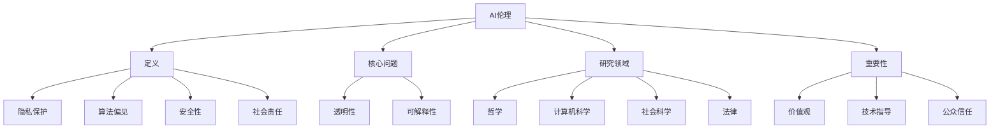

#### 核心算法原理讲解

为了更好地理解AI伦理，我们需要从核心算法原理的角度来讲解其工作原理。以下是一个简化的伪代码，展示了AI伦理分析的基本框架：

```python
def ai_ethics_analysis():
    # 数据隐私保护
    privacy_check(data)

    # 算法偏见检测
    bias_detection(algorithm)

    # 决策透明性和可解释性评估
    transparency_evaluation(model)

    # 安全性评估
    security_evaluation(system)

    # 社会责任分析
    social_responsibility_analysis(technology)

    # 输出伦理分析报告
    report = generate_report()
    return report
```

在这个伪代码中，`ai_ethics_analysis` 函数代表AI伦理分析的整体过程。各个子函数分别对应于AI伦理的核心问题，如数据隐私保护、算法偏见检测、决策透明性和可解释性评估、安全性评估以及社会责任分析。

通过这样的分析过程，我们可以系统地评估AI系统的伦理合规性，并据此提出改进措施。

### 第2章: AI伦理的挑战

#### 背景介绍
AI伦理的挑战主要来自于以下几个方面：

1. **数据隐私保护**：随着AI技术的发展，大量个人数据被收集和分析，如何保护这些数据不被滥用是一个严峻的挑战。
   
2. **算法偏见**：算法可能会受到训练数据的影响，产生偏见，导致不公平的结果。

3. **安全性**：AI系统可能会受到恶意攻击，从而造成严重的安全问题。

4. **社会责任**：AI技术的快速发展给社会带来了巨大的变革，但如何确保这些变革符合社会的价值观和利益，是一个亟待解决的问题。

#### 核心概念与联系

以下是AI伦理的几个核心挑战及其相互关系的Mermaid流程图：

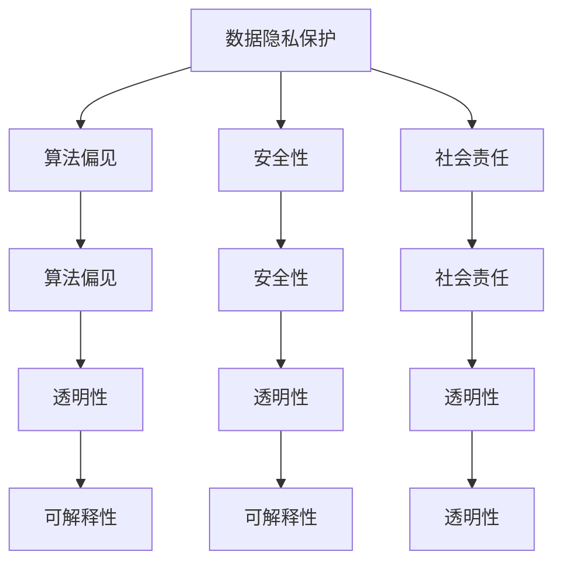

#### 核心算法原理讲解

为了深入理解AI伦理的挑战，我们需要从算法原理的角度来讲解它们如何影响AI系统的伦理合规性。以下是一个简化的伪代码，展示了AI伦理分析的基本框架：

```python
def ethics_challenge_analysis():
    # 数据隐私保护
    privacy_check(data)

    # 算法偏见检测
    bias_detection(algorithm)

    # 安全性评估
    security_evaluation(system)

    # 社会责任分析
    social_responsibility_analysis(technology)

    # 输出伦理挑战报告
    report = generate_report()
    return report
```

在这个伪代码中，`ethics_challenge_analysis` 函数代表AI伦理挑战分析的整体过程。各个子函数分别对应于AI伦理的核心挑战，如数据隐私保护、算法偏见检测、安全性评估以及社会责任分析。

通过这样的分析过程，我们可以系统地识别和评估AI系统的伦理挑战，并据此提出改进措施。

### 第3章: AI伦理的规范

#### 背景介绍
为了应对AI伦理的挑战，我们需要建立一系列的规范和标准。这些规范和标准旨在确保AI技术的开发和应用符合伦理要求，同时保护个人和社会的利益。

AI伦理规范可以从以下几个方面进行构建：

1. **国际标准**：如ISO/IEC 27001、ISO/IEC 27002等，这些标准涵盖了数据隐私保护、信息安全等方面。
   
2. **行业规范**：不同行业根据自身特点，制定了一系列的AI伦理规范，如医疗AI的伦理规范、金融AI的伦理规范等。

3. **企业责任**：企业需要承担起AI伦理的主体责任，制定内部伦理准则，确保AI技术的研发和应用符合伦理要求。

4. **法律法规**：各国政府和国际组织也在积极制定相关法律法规，以规范AI技术的发展和应用。

#### 核心概念与联系

以下是AI伦理规范的几个核心概念及其相互关系的Mermaid流程图：

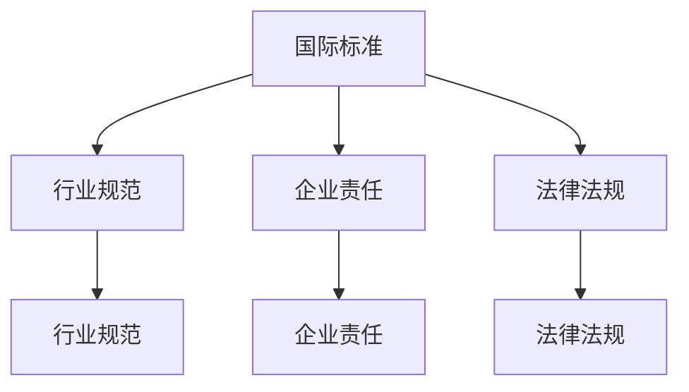

#### 核心算法原理讲解

为了深入理解AI伦理规范，我们需要从算法原理的角度来讲解它们如何影响AI系统的伦理合规性。以下是一个简化的伪代码，展示了AI伦理规范分析的基本框架：

```python
def ethics_norm_analysis():
    # 检查国际标准合规性
    check_international_norms()

    # 检查行业规范合规性
    check_industry_norms()

    # 检查企业责任合规性
    check_corporate_responsibility()

    # 检查法律法规合规性
    check_legislative_compliance()

    # 输出伦理规范分析报告
    report = generate_report()
    return report
```

在这个伪代码中，`ethics_norm_analysis` 函数代表AI伦理规范分析的整体过程。各个子函数分别对应于国际标准、行业规范、企业责任以及法律法规的合规性检查。

通过这样的分析过程，我们可以系统地评估AI系统的伦理合规性，并据此提出改进措施。

## 第4章: AI伦理在人工智能产品设计中的应用

#### 背景介绍
在人工智能（AI）产品的设计过程中，AI伦理的考量至关重要。产品设计不仅仅是技术实现，更涉及到伦理道德和社会责任。提示词工程师作为AI产品开发的核心成员，承担着确保产品符合伦理标准的重要责任。

#### 核心概念与联系

以下是AI伦理在人工智能产品设计中的几个核心概念及其相互关系的Mermaid流程图：

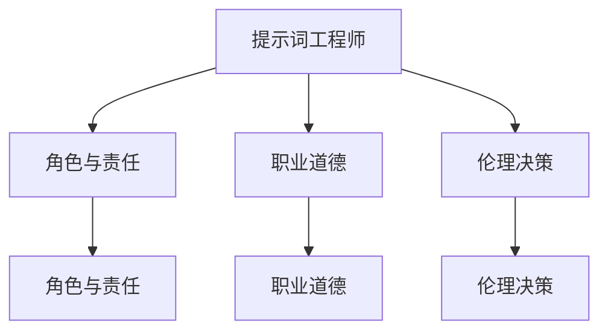

#### 提示词工程师的角色与责任

提示词工程师在AI产品设计中扮演着关键角色，他们的主要职责包括：

1. **定义问题域**：理解用户需求，明确AI产品解决的问题和目标。

2. **设计提示词**：创建和优化用于训练AI模型的提示词，确保它们能够引导AI系统做出合理的决策。

3. **数据预处理**：确保输入数据的质量和多样性，减少数据偏见。

4. **算法选择**：选择合适的算法和模型，并对其进行调整和优化，以满足特定的伦理要求。

5. **模型解释**：确保AI模型的可解释性和透明性，帮助用户理解AI系统的决策过程。

**伪代码示例：**

```python
class PromptEngineer:
    def define_problem_domain(self):
        # 分析用户需求，定义问题域
        pass

    def design_prompt(self):
        # 创建和优化提示词
        pass

    def preprocess_data(self):
        # 确保数据质量和多样性
        pass

    def select_algorithm(self):
        # 选择合适的算法和模型
        pass

    def explain_model(self):
        # 确保模型可解释性和透明性
        pass
```

通过以上步骤，提示词工程师可以确保AI产品的设计和实现符合伦理要求，从而增强用户对AI技术的信任。

### 2.2 公平与正义

#### 背景介绍
在人工智能（AI）领域，公平与正义是关键伦理原则，确保AI技术不歧视任何群体，不对特定个体或群体造成不公平影响。提示词工程师在AI产品设计过程中必须充分考虑这些原则，以防止算法偏见和歧视。

#### 核心概念与联系

以下是公平与正义在AI产品设计中的几个核心概念及其相互关系的Mermaid流程图：

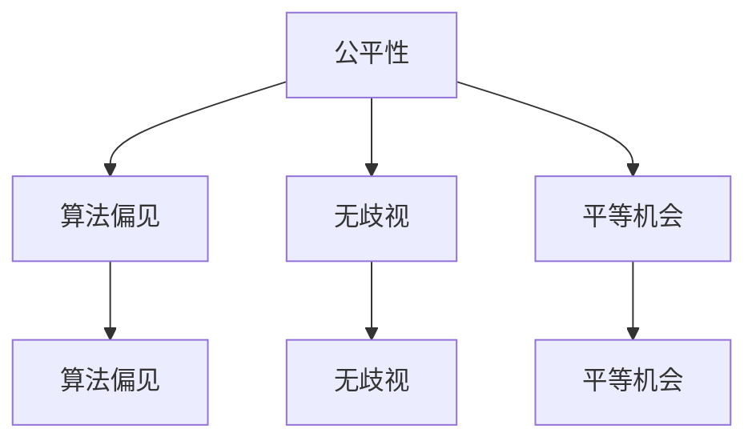

#### 公平性的定义和重要性

**定义：** 公平性是指AI系统在决策过程中不歧视任何群体，确保所有个体或群体都能公平地获得AI技术带来的利益。

**重要性：** 
- **社会正义**：公平性有助于实现社会正义，防止因AI技术而加剧社会不平等。
- **用户信任**：确保AI系统决策的公平性可以增强用户对AI技术的信任。
- **合规性**：遵守公平性原则有助于满足相关法律法规要求，降低法律风险。

#### 算法偏见和消除方法

**算法偏见：** 算法偏见是指AI系统在决策过程中因训练数据、模型设计等因素而产生的歧视性结果。

**消除方法：**
1. **数据多样化**：确保训练数据集的多样性和代表性，减少因数据偏差导致的偏见。
2. **算法审计**：定期对AI系统进行审计，识别和纠正算法偏见。
3. **透明性与可解释性**：提高AI系统的透明性和可解释性，让用户了解决策过程，从而增强信任。
4. **伦理培训**：对开发人员进行AI伦理培训，提高其对公平性和无歧视的认识。

#### 伪代码示例

以下是一个简化的伪代码，展示了如何在AI系统中实现公平性检查：

```python
def fairness_check(model, data):
    # 分析模型决策，检查是否存在偏见
    bias_detected = check_for_bias(model, data)

    if bias_detected:
        # 采取措施消除偏见
        model = remove_bias(model, data)

    return model
```

在这个伪代码中，`fairness_check` 函数负责分析AI模型的决策过程，并检查是否存在偏见。如果发现偏见，则采取措施进行纠正。

### 2.3 透明性与可解释性

#### 背景介绍
透明性与可解释性是AI伦理的重要组成部分，尤其是在AI系统决策过程被广泛应用的情况下。提示词工程师需要确保AI系统的决策过程能够被理解和追踪，从而提高用户对AI技术的信任和接受度。

#### 核心概念与联系

以下是透明性与可解释性的几个核心概念及其相互关系的Mermaid流程图：

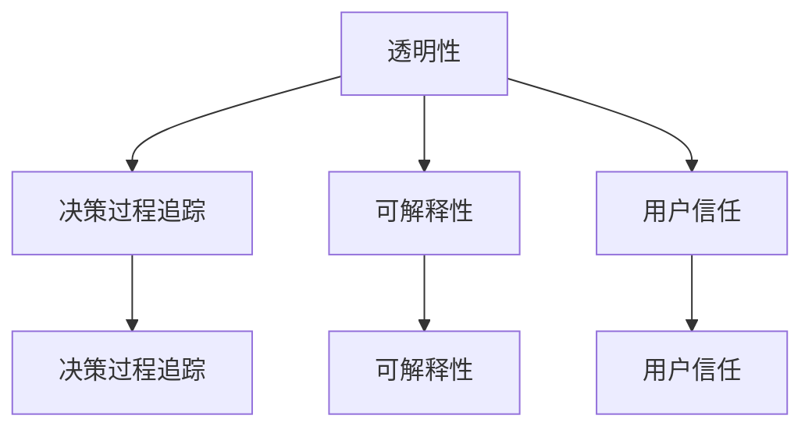

#### 透明性的定义和重要性

**定义：** 透明性是指AI系统的决策过程和结果能够被用户和其他利益相关者理解和追踪。

**重要性：**
- **信任建立**：透明性有助于建立用户对AI技术的信任，减少对AI系统的不确定性和恐惧。
- **监管合规**：透明性是满足监管要求和合规性的关键，有助于减少法律风险。
- **质量控制**：透明性有助于质量控制，及时发现和纠正问题。

#### 可解释性的定义和重要性

**定义：** 可解释性是指AI系统的决策过程和结果能够被解释和验证，用户能够理解为什么做出特定决策。

**重要性：**
- **信任增强**：可解释性有助于增强用户对AI技术的信任，提高其对AI系统的接受度。
- **错误修正**：可解释性有助于识别和修正AI系统的错误决策，提高系统的准确性。
- **伦理审查**：可解释性是伦理审查的重要组成部分，确保AI系统符合道德和社会价值观。

#### 透明性与可解释性的实现方法

**实现方法：**
1. **可视化工具**：使用可视化工具展示AI模型的决策过程和结果，帮助用户理解。
2. **解释性算法**：开发解释性算法，让AI系统的决策过程更容易被用户理解。
3. **文档和报告**：编写详细的文档和报告，记录AI系统的设计、实现和决策过程。
4. **用户反馈**：收集用户反馈，了解他们对AI系统的理解和满意度，不断改进系统的透明性和可解释性。

#### 伪代码示例

以下是一个简化的伪代码，展示了如何实现AI系统的透明性和可解释性：

```python
class AIModel:
    def train(self, data):
        # 使用训练数据进行模型训练
        pass

    def explain_decision(self, input_data):
        # 解释模型决策过程
        explanation = generate_explanation(self, input_data)
        return explanation

    def visualize_decision_path(self, input_data):
        # 可视化决策过程
        visualization = generate_visualization(self, input_data)
        return visualization
```

在这个伪代码中，`AIModel` 类包含了训练模型、解释决策过程和可视化决策路径的方法，从而提高系统的透明性和可解释性。

### 2.4 数据保护与隐私

#### 背景介绍
在人工智能（AI）领域，数据保护与隐私是至关重要的伦理问题。提示词工程师在AI产品设计过程中必须确保用户数据的安全和隐私，避免数据泄露和滥用。

#### 核心概念与联系

以下是数据保护与隐私的几个核心概念及其相互关系的Mermaid流程图：

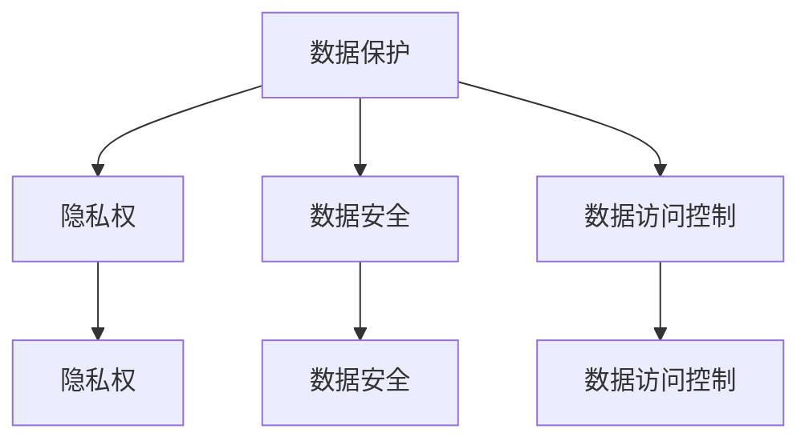

#### 隐私权的定义和重要性

**定义：** 隐私权是指个人对其个人信息和活动的控制权，确保个人信息不被未经授权的第三方获取和使用。

**重要性：**
- **基本人权**：隐私权是基本人权之一，保障个人隐私是法律和伦理的基本要求。
- **用户信任**：保护用户隐私有助于建立用户对AI技术的信任，提高用户满意度。
- **合规性**：遵守隐私保护法规是企业的法律义务，有助于降低法律风险。

#### 数据安全的定义和重要性

**定义：** 数据安全是指保护用户数据免受未经授权的访问、使用、披露、破坏、修改和丢失。

**重要性：**
- **数据完整性**：确保用户数据不被篡改，保持数据的准确性和完整性。
- **数据可用性**：确保用户数据在需要时可以及时访问和利用。
- **数据保密性**：确保用户数据不被泄露给未经授权的第三方。

#### 数据访问控制的定义和重要性

**定义：** 数据访问控制是指限制用户对数据访问的权限，确保只有授权用户可以访问特定数据。

**重要性：**
- **最小权限原则**：确保用户仅具有完成任务所需的最低权限，减少数据泄露风险。
- **身份验证与授权**：使用身份验证和授权机制，确保只有授权用户可以访问敏感数据。
- **审计与监控**：记录和监控用户访问数据的行为，及时发现和防止违规行为。

#### 伪代码示例

以下是一个简化的伪代码，展示了如何实现数据保护与隐私：

```python
class DataPrivacy:
    def protect_data(self, user_data):
        # 加密用户数据
        encrypted_data = encrypt(user_data)
        return encrypted_data

    def control_access(self, user_id, data):
        # 检查用户访问权限
        if has_access(user_id, data):
            return data
        else:
            raise AccessDeniedException()

    def audit_access_log(self):
        # 记录和监控访问日志
        log = generate_access_log()
        return log
```

在这个伪代码中，`DataPrivacy` 类包含了保护数据、控制访问和审计访问日志的方法，从而确保用户数据的隐私和安全。

### 3.1 提示词工程师的角色与责任

#### 背景介绍
在人工智能（AI）产品的设计和开发过程中，提示词工程师扮演着至关重要的角色。他们不仅负责创建和优化用于训练AI模型的提示词，还必须确保这些提示词符合伦理标准和道德要求。

#### 核心概念与联系

以下是提示词工程师的角色与责任的几个核心概念及其相互关系的Mermaid流程图：

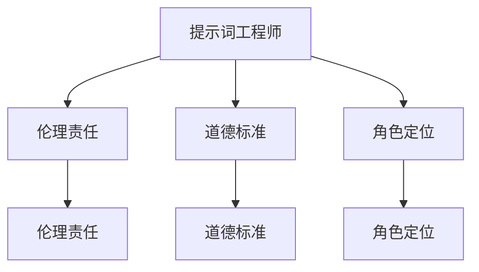

#### 提示词工程师的伦理责任

作为AI系统的核心构建者，提示词工程师的伦理责任体现在以下几个方面：

1. **确保数据质量**：提示词工程师需要确保训练数据的质量和多样性，避免数据偏见。
2. **消除算法偏见**：通过优化提示词和模型设计，消除算法偏见，确保AI系统的公平性和无歧视性。
3. **维护用户隐私**：在AI产品设计过程中，提示词工程师需要采取措施保护用户隐私，防止数据泄露和滥用。
4. **遵守法律法规**：遵守相关法律法规，确保AI技术的开发和应用符合法律要求。

#### 道德标准

提示词工程师在AI产品设计过程中应遵循的道德标准包括：

1. **公正性**：确保AI系统不歧视任何群体，对所有用户公平对待。
2. **透明性**：确保AI系统的决策过程和结果透明，用户可以理解AI系统的行为。
3. **尊重隐私**：尊重用户的隐私权，采取措施保护用户数据的安全和隐私。
4. **社会责任**：认识到自己的行为对社会的潜在影响，并努力确保AI技术的积极影响。

#### 伪代码示例

以下是一个简化的伪代码，展示了提示词工程师在AI产品设计过程中的角色和责任：

```python
class PromptEngineer:
    def ensure_data_quality(self, training_data):
        # 确保训练数据的质量和多样性
        cleaned_data = clean_and_diversify_data(training_data)
        return cleaned_data

    def eliminate_algorithm_bias(self, model, training_data):
        # 消除算法偏见
        bias_free_model = remove_bias(model, training_data)
        return bias_free_model

    def protect_user_privacy(self, user_data):
        # 保护用户隐私
        encrypted_data = encrypt_user_data(user_data)
        return encrypted_data

    def comply_with_law(self, ai_system):
        # 遵守法律法规
        legal_compliant_system = ensure_law_compliance(ai_system)
        return legal_compliant_system
```

在这个伪代码中，`PromptEngineer` 类包含了确保数据质量、消除算法偏见、保护用户隐私和遵守法律法规的方法，从而确保AI系统的伦理合规性。

### 3.2 提示词工程师的职业道德

#### 背景介绍
提示词工程师在人工智能（AI）领域的职业道德至关重要，他们不仅需要具备扎实的专业技能，还要具备高尚的道德品质。职业道德直接影响AI系统的公正性、透明性和安全性，因此，提示词工程师必须严格遵守职业道德规范。

#### 核心概念与联系

以下是提示词工程师的职业道德的几个核心概念及其相互关系的Mermaid流程图：


#### 诚信

**定义**：诚信是指提示词工程师在职业活动中遵循诚实、真实和透明的原则。

**重要性**：
- **建立信任**：诚信有助于建立用户对AI技术的信任，提高用户满意度。
- **职业声誉**：诚信是建立职业声誉的基础，有助于提升个人的职业地位和影响力。
- **合规性**：遵守诚信原则有助于满足相关法律法规和行业标准。

#### 责任

**定义**：责任是指提示词工程师对其职业行为和决策所承担的道德和法律责任。

**重要性**：
- **职业安全**：承担责任有助于保障职业安全，减少职业风险。
- **社会影响**：提示词工程师的决策和行动对社会有深远影响，承担责任有助于确保AI技术对社会产生积极影响。
- **法律义务**：遵守责任原则是法律和道德的要求，有助于减少法律风险。

#### 公正

**定义**：公正是指提示词工程师在职业活动中公平对待所有个体和群体，不歧视任何一方。

**重要性**：
- **社会正义**：公正是实现社会正义的重要保障，有助于减少社会不平等。
- **用户信任**：公正有助于增强用户对AI技术的信任，提高用户满意度。
- **合规性**：遵守公正原则有助于满足相关法律法规和行业标准。

#### 伪代码示例

以下是一个简化的伪代码，展示了如何实现提示词工程师的职业道德：

```python
class PromptEngineer:
    def be_honest(self, decision):
        # 保持诚实
        honest_decision = make_honest_decision(decision)
        return honest_decision

    def take_responsibility(self, action):
        # 承担责任
        responsible_action = take_responsible_action(action)
        return responsible_action

    def act_justly(self, situation):
        # 实施公正
        just_action = make_just_action(situation)
        return just_action
```

在这个伪代码中，`PromptEngineer` 类包含了保持诚实、承担责任和实施公正的方法，从而确保职业道德的实践。

### 3.3 提示词工程师的伦理决策

#### 背景介绍
在人工智能（AI）技术的快速发展和广泛应用背景下，提示词工程师面临的伦理决策问题日益复杂。他们需要在各种情境下做出符合伦理标准的决策，以确保AI系统的公正性、透明性和安全性。

#### 核心概念与联系

以下是提示词工程师的伦理决策的几个核心概念及其相互关系的Mermaid流程图：

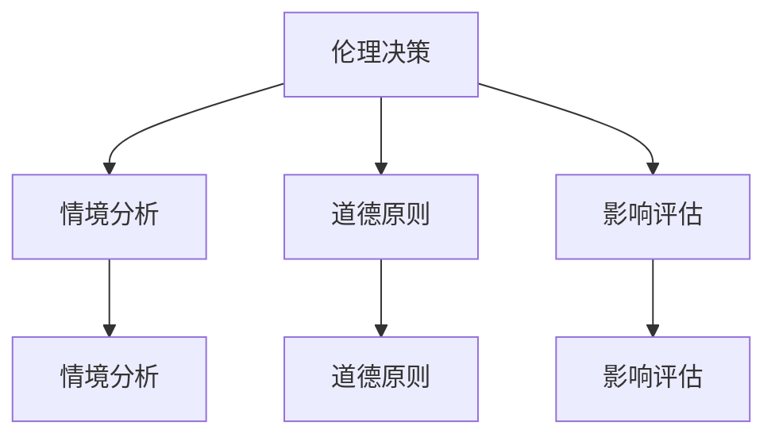

#### 情境分析

情境分析是伦理决策的基础，它涉及对具体问题或决策情境的详细描述和分析。提示词工程师在做出伦理决策时，需要考虑以下几个方面：

1. **问题识别**：明确需要解决的问题或面临的伦理困境。
2. **利益相关者**：识别所有受决策影响的利益相关者，包括用户、企业、社会等。
3. **冲突分析**：分析不同利益相关者之间的利益冲突，确定主要矛盾。

#### 道德原则

道德原则是伦理决策的指导方针，提示词工程师在决策过程中应遵循以下原则：

1. **公正**：确保决策过程和结果对所有人公平公正。
2. **透明性**：确保决策过程透明，便于用户和社会监督。
3. **责任**：确保提示词工程师对自己的决策和行为负责，承担相应责任。
4. **尊重隐私**：保护用户的隐私权，避免泄露个人信息。
5. **诚信**：保持诚实和真实，不隐瞒或歪曲事实。

#### 影响评估

影响评估是伦理决策的重要环节，提示词工程师需要评估其决策可能带来的各种影响：

1. **正面影响**：评估决策可能带来的积极效果，如提高用户体验、增强社会福祉等。
2. **负面影响**：评估决策可能带来的消极影响，如算法偏见、隐私泄露等。
3. **长期影响**：评估决策的长期影响，包括对技术发展、社会结构等方面的影响。

#### 伪代码示例

以下是一个简化的伪代码，展示了提示词工程师在伦理决策过程中的步骤：

```python
def ethical_decision_making(problem, stakeholders, ethical_principles):
    # 情境分析
    analyzed_situation = analyze_situation(problem, stakeholders)

    # 应用道德原则
    ethical_guidelines = apply_ethical_principles(ethical_principles)

    # 影响评估
    impact_evaluation = evaluate_impact(analyzed_situation, ethical_guidelines)

    # 做出决策
    decision = make_decision(impact_evaluation)

    return decision
```

在这个伪代码中，`ethical_decision_making` 函数包含了情境分析、道德原则应用和影响评估等步骤，从而确保伦理决策的科学性和合理性。

### 4.1 AI系统的伦理风险评估

#### 背景介绍
在人工智能（AI）系统的开发和应用过程中，伦理风险评估是一个至关重要的环节。它有助于识别和预防潜在的伦理问题，确保AI系统在符合道德和社会价值观的前提下运行。

#### 核心概念与联系

以下是AI系统伦理风险评估的几个核心概念及其相互关系的Mermaid流程图：

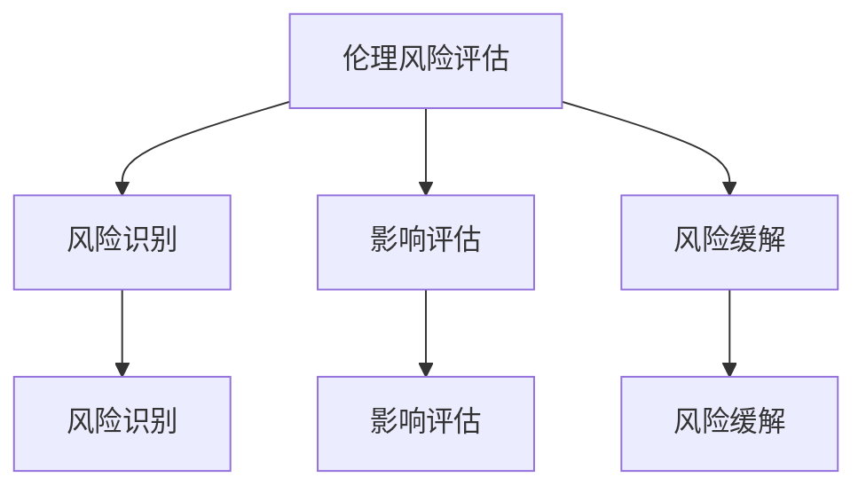

#### 风险识别

风险识别是伦理风险评估的第一步，涉及识别AI系统可能存在的伦理风险。提示词工程师需要从以下几个方面进行风险识别：

1. **数据隐私风险**：评估AI系统在数据收集、存储和使用过程中可能涉及的隐私泄露风险。
2. **算法偏见风险**：识别AI系统因训练数据或模型设计等因素导致的偏见风险。
3. **透明性和可解释性风险**：评估AI系统决策过程和结果的透明性和可解释性不足的风险。
4. **社会责任风险**：考虑AI系统对社会和环境可能产生的负面影响。

#### 影响评估

影响评估是对识别出的伦理风险可能带来的影响进行评估，包括以下几个方面：

1. **个人影响**：评估AI系统对用户个人隐私、公平性、信任等方面的潜在影响。
2. **社会影响**：评估AI系统对社会结构、经济、文化等方面的潜在影响。
3. **长期影响**：考虑AI系统的长期影响，包括技术发展、伦理标准演变等方面。

#### 风险缓解

风险缓解是伦理风险评估的关键环节，涉及采取一系列措施来降低或消除识别出的伦理风险。提示词工程师可以采取以下措施：

1. **数据隐私保护**：采用数据加密、匿名化等技术手段，保护用户隐私。
2. **算法公平性优化**：通过数据多样化、算法调整等方法，消除算法偏见。
3. **透明性和可解释性增强**：提高AI系统的透明度和可解释性，便于用户和社会监督。
4. **社会责任履行**：积极参与社会公益活动，关注AI系统的社会影响。

#### 伪代码示例

以下是一个简化的伪代码，展示了AI系统伦理风险评估的过程：

```python
def ethical_risk_assessment(ai_system):
    # 风险识别
    risks = identify_risks(ai_system)

    # 影响评估
    impacts = evaluate_impacts(risks)

    # 风险缓解
    risk_mitigations = mitigate_risks(impacts)

    # 输出伦理风险评估报告
    report = generate_risk_assessment_report(risk_mitigations)
    return report
```

在这个伪代码中，`ethical_risk_assessment` 函数包含了风险识别、影响评估和风险缓解等步骤，从而确保AI系统的伦理合规性。

### 4.2 AI系统的伦理测试

#### 背景介绍
在人工智能（AI）系统的开发过程中，伦理测试是确保系统符合伦理标准和道德要求的重要环节。伦理测试可以帮助识别和纠正潜在的伦理问题，确保AI系统在公正性、透明性和安全性方面达到预期标准。

#### 核心概念与联系

以下是AI系统伦理测试的几个核心概念及其相互关系的Mermaid流程图：

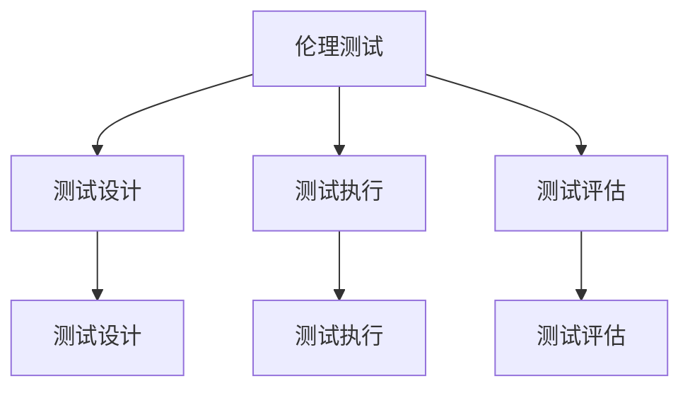

#### 测试设计

测试设计是伦理测试的第一步，涉及制定详细的测试计划和测试用例。提示词工程师需要从以下几个方面进行测试设计：

1. **测试目标**：明确伦理测试的目标，如评估AI系统的透明性、公平性和隐私保护能力。
2. **测试用例**：设计一系列测试用例，覆盖AI系统可能面临的伦理问题，包括数据隐私、算法偏见、透明性和可解释性等方面。
3. **测试环境**：确保测试环境与实际部署环境一致，以便更准确地评估AI系统的伦理表现。

#### 测试执行

测试执行是伦理测试的核心环节，涉及按照测试计划和测试用例对AI系统进行实际测试。提示词工程师需要采取以下步骤：

1. **数据准备**：准备用于测试的数据集，确保数据的多样性和代表性。
2. **测试运行**：执行测试用例，收集测试结果，包括AI系统的决策过程、结果和错误率等。
3. **异常处理**：及时发现和记录测试过程中的异常情况，如算法偏见、隐私泄露等。

#### 测试评估

测试评估是对伦理测试结果进行评估和分析，以确定AI系统是否符合伦理标准和道德要求。提示词工程师需要从以下几个方面进行测试评估：

1. **结果分析**：分析测试结果，评估AI系统的透明性、公平性和隐私保护能力。
2. **问题识别**：识别AI系统存在的伦理问题，如算法偏见、数据隐私泄露等。
3. **改进措施**：根据测试评估结果，制定改进措施，优化AI系统的伦理表现。

#### 伪代码示例

以下是一个简化的伪代码，展示了AI系统伦理测试的过程：

```python
def ethical_test(ai_system, test_cases):
    # 测试设计
    test_plan = design_test_plan(test_cases)

    # 测试执行
    test_results = execute_tests(ai_system, test_plan)

    # 测试评估
    evaluation_results = evaluate_tests(test_results)

    # 输出伦理测试报告
    test_report = generate_test_report(evaluation_results)
    return test_report
```

在这个伪代码中，`ethical_test` 函数包含了测试设计、测试执行和测试评估等步骤，从而确保AI系统的伦理合规性。

### 4.3 AI系统的伦理审查

#### 背景介绍
AI系统的伦理审查是一个系统性和全面性的过程，旨在确保AI系统的开发和应用符合伦理标准和道德要求。这个过程通常涉及多个利益相关者，包括开发者、伦理专家、用户和社会组织等。伦理审查不仅有助于识别和解决潜在的伦理问题，还可以提高AI系统的透明性和公众信任。

#### 核心概念与联系

以下是AI系统伦理审查的几个核心概念及其相互关系的Mermaid流程图：

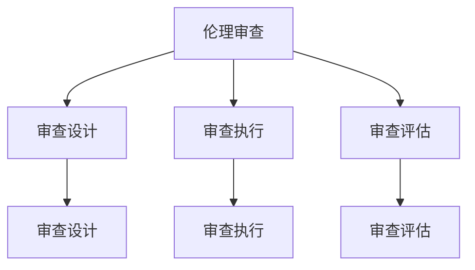

#### 审查设计

审查设计是伦理审查的第一步，涉及制定详细的审查计划和审查标准。提示词工程师和伦理专家需要从以下几个方面进行审查设计：

1. **审查目标**：明确伦理审查的目标，如评估AI系统的透明性、公平性、隐私保护和安全性等。
2. **审查标准**：制定具体的审查标准，如国际伦理准则、行业规范和公司内部伦理规范等。
3. **审查参与者**：确定审查参与者，包括内部审查团队、外部专家、用户代表等。

#### 审查执行

审查执行是伦理审查的核心环节，涉及按照审查计划和审查标准对AI系统进行实际审查。以下步骤是审查执行的关键：

1. **审查准备**：准备审查所需的文档和数据，确保审查的顺利进行。
2. **审查会议**：组织审查会议，审查团队成员对AI系统进行详细讨论和分析。
3. **实地考察**：如果可能，进行实地考察，评估AI系统的实际运行情况。
4. **问题识别**：在审查过程中，及时发现和记录AI系统可能存在的伦理问题。

#### 审查评估

审查评估是对伦理审查结果进行评估和分析，以确定AI系统是否符合伦理标准和道德要求。以下步骤是审查评估的关键：

1. **结果分析**：分析审查结果，评估AI系统的伦理表现，包括透明性、公平性、隐私保护和安全性等方面。
2. **问题解决**：针对识别出的伦理问题，制定具体的解决方案，并跟踪解决进度。
3. **审查报告**：撰写审查报告，总结审查过程、发现的问题和改进建议，提交给相关利益相关者。

#### 伪代码示例

以下是一个简化的伪代码，展示了AI系统伦理审查的过程：

```python
def ethical_review(ai_system, review_criteria, participants):
    # 审查设计
    review_plan = design_review_plan(review_criteria)

    # 审查执行
    review_results = execute_review(ai_system, review_plan, participants)

    # 审查评估
    evaluation_results = evaluate_review(review_results)

    # 输出伦理审查报告
    review_report = generate_review_report(evaluation_results)
    return review_report
```

在这个伪代码中，`ethical_review` 函数包含了审查设计、审查执行和审查评估等步骤，从而确保AI系统的伦理合规性。

### 5.1 案例一：智能客服的伦理问题

#### 背景介绍
智能客服作为人工智能在商业领域的一个重要应用，已经得到了广泛应用。然而，随着智能客服系统的普及，其伦理问题也逐渐显现出来，成为了一个备受关注的话题。本案例将探讨智能客服在数据隐私、算法偏见和用户交互等方面的伦理问题。

#### 核心概念与联系

以下是智能客服伦理问题的几个核心概念及其相互关系的Mermaid流程图：

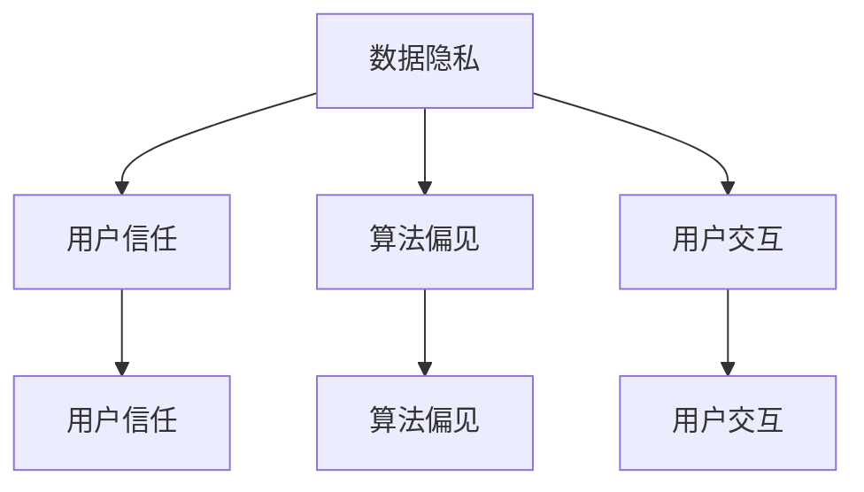

#### 数据隐私问题

智能客服在处理用户数据时，可能会涉及数据隐私的问题。以下是一些关键点：

1. **数据收集**：智能客服系统需要收集用户的个人信息，如姓名、联系方式、购买历史等。如何确保这些数据不被滥用是一个关键问题。
2. **数据存储**：智能客服系统需要安全地存储用户数据，以防止数据泄露和丢失。
3. **数据使用**：智能客服系统在处理用户数据时，需要明确数据的使用范围和目的，避免滥用用户数据。

#### 算法偏见问题

智能客服系统可能会因训练数据或算法设计的原因，产生偏见，影响用户的体验。以下是一些关键点：

1. **训练数据偏差**：如果训练数据存在偏差，智能客服系统可能会对某些用户群体产生偏见。
2. **算法设计问题**：智能客服系统的算法设计可能不够完善，导致决策结果不公平。
3. **交互方式**：智能客服系统在与用户交互时，可能无法充分理解用户的意图，导致服务不周到。

#### 用户交互问题

智能客服系统在与用户交互时，可能面临以下伦理问题：

1. **用户理解**：智能客服系统需要确保用户能够理解其交互过程和决策结果。
2. **用户满意度**：智能客服系统需要提供高质量的服务，以满足用户的期望。
3. **用户权益**：智能客服系统需要尊重用户的权益，如隐私权、公平权等。

#### 伪代码示例

以下是一个简化的伪代码，展示了智能客服系统的伦理问题分析：

```python
class IntelligentCustomerService:
    def handle_user_data(self, user_info):
        # 处理用户数据
        processed_data = process_user_data(user_info)
        return processed_data

    def detect_algorithm_bias(self, training_data):
        # 检测算法偏见
        bias_detected = check_for_bias(training_data)
        return bias_detected

    def interact_with_user(self, user_request):
        # 与用户交互
        user_response = generate_response(user_request)
        return user_response
```

在这个伪代码中，`IntelligentCustomerService` 类包含了处理用户数据、检测算法偏见和与用户交互的方法，从而确保智能客服系统的伦理合规性。

### 5.2 案例二：自动驾驶汽车的伦理问题

#### 背景介绍
自动驾驶汽车作为人工智能技术在交通运输领域的应用，具有巨大的潜力。然而，随着自动驾驶技术的不断进步，其伦理问题也逐渐成为讨论的热点。本案例将探讨自动驾驶汽车在安全、责任归属和隐私等方面的伦理问题。

#### 核心概念与联系

以下是自动驾驶汽车伦理问题的几个核心概念及其相互关系的Mermaid流程图：

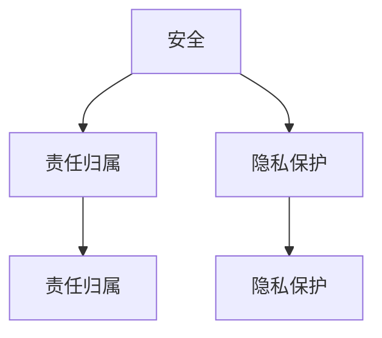

#### 安全问题

自动驾驶汽车的安全问题是其伦理问题的关键之一，涉及以下方面：

1. **事故预防**：自动驾驶汽车需要具备有效的事故预防能力，确保在复杂交通环境下能够安全运行。
2. **系统可靠性**：自动驾驶汽车的软件和硬件系统需要具备高可靠性，以避免因系统故障导致的事故。
3. **紧急应对**：自动驾驶汽车需要具备应对紧急情况的决策能力，如在面临危险时做出合理的避险决策。

#### 责任归属问题

在自动驾驶汽车发生事故时，责任归属问题常常引发争议。以下是一些关键点：

1. **制造商责任**：自动驾驶汽车制造商需要对产品的设计、制造和质量负责。
2. **用户责任**：用户在使用自动驾驶汽车时，应遵守交通规则，并对自己的行为负责。
3. **保险公司责任**：保险公司需要为自动驾驶汽车的事故提供保险服务。

#### 隐私保护问题

自动驾驶汽车在运行过程中，会收集大量的用户数据，涉及隐私保护问题。以下是一些关键点：

1. **数据收集**：自动驾驶汽车需要明确数据收集的目的和范围，避免过度收集用户数据。
2. **数据存储**：自动驾驶汽车需要安全地存储用户数据，以防止数据泄露和滥用。
3. **数据使用**：自动驾驶汽车在处理用户数据时，需要明确数据的使用范围和目的，避免滥用用户数据。

#### 伪代码示例

以下是一个简化的伪代码，展示了自动驾驶汽车的伦理问题分析：

```python
class AutonomousVehicle:
    def ensure_safety(self):
        # 确保安全
        safety_measures = apply_safety_measures()
        return safety_measures

    def assign_responsibility(self, accident_data):
        # 分配责任
        responsible_party = determine_responsibility(accident_data)
        return responsible_party

    def protect_user_privacy(self, user_data):
        # 保护用户隐私
        encrypted_data = encrypt_user_data(user_data)
        return encrypted_data
```

在这个伪代码中，`AutonomousVehicle` 类包含了确保安全、分配责任和保护用户隐私的方法，从而确保自动驾驶汽车的伦理合规性。

### 5.3 案例三：人工智能在医疗领域的伦理问题

#### 背景介绍
人工智能在医疗领域的应用日益广泛，从诊断辅助到个性化治疗，AI技术为医疗行业带来了巨大的变革。然而，随着AI技术在医疗领域的深入应用，一系列伦理问题也随之浮现。本案例将探讨人工智能在医疗领域的伦理问题，包括数据隐私、算法偏见、患者权利和责任归属等方面。

#### 核心概念与联系

以下是人工智能在医疗领域伦理问题的几个核心概念及其相互关系的Mermaid流程图：


#### 数据隐私问题

在医疗领域，数据隐私问题尤为重要。以下是一些关键点：

1. **数据收集**：医疗AI系统需要收集大量的患者数据，包括诊断记录、病历和基因信息等。如何确保这些数据不被滥用是一个关键问题。
2. **数据存储**：医疗AI系统需要安全地存储患者数据，以防止数据泄露和丢失。
3. **数据共享**：医疗AI系统在处理患者数据时，可能需要与其他医疗机构或研究人员共享数据。如何确保数据共享的安全性和隐私性是一个重要挑战。

#### 算法偏见问题

算法偏见可能导致医疗AI系统在诊断和治疗过程中产生不公平的结果。以下是一些关键点：

1. **训练数据偏差**：如果训练数据存在偏差，医疗AI系统可能会对某些患者群体产生偏见。
2. **算法设计问题**：医疗AI系统的算法设计可能不够完善，导致决策结果不公平。
3. **交互方式**：医疗AI系统在与患者交互时，可能无法充分理解患者的实际需求，导致服务不周到。

#### 患者权利问题

患者的权利在医疗AI系统中需要得到充分保障。以下是一些关键点：

1. **知情同意**：患者在接受AI辅助诊断或治疗时，应获得充分的知情权，包括了解AI系统的工作原理和可能的风险。
2. **数据访问权**：患者应有权访问自己的医疗数据，并了解这些数据如何被使用。
3. **错误纠正权**：如果医疗AI系统产生错误结果，患者应有权要求纠正并重新评估。

#### 责任归属问题

在医疗AI系统中，责任归属问题尤为复杂。以下是一些关键点：

1. **开发者责任**：医疗AI系统的开发者需要对系统的设计、开发和测试负责。
2. **医疗机构责任**：医疗机构在部署和使用医疗AI系统时，需要确保系统的安全性和有效性。
3. **患者责任**：患者在使用医疗AI系统时，应遵守操作规程，并报告任何异常情况。

#### 伪代码示例

以下是一个简化的伪代码，展示了医疗AI系统的伦理问题分析：

```python
class MedicalAI:
    def ensure_data_privacy(self, patient_data):
        # 确保数据隐私
        encrypted_data = encrypt_patient_data(patient_data)
        return encrypted_data

    def detect_algorithm_bias(self, training_data):
        # 检测算法偏见
        bias_detected = check_for_bias(training_data)
        return bias_detected

    def respect_patient_rights(self, patient):
        # 尊重患者权利
        patient_rights = grant_patient_rights(patient)
        return patient_rights

    def assign_responsibility(self, error_report):
        # 分配责任
        responsible_party = determine_responsibility(error_report)
        return responsible_party
```

在这个伪代码中，`MedicalAI` 类包含了确保数据隐私、检测算法偏见、尊重患者权利和分配责任的方法，从而确保医疗AI系统的伦理合规性。

### 6.1 提示词工程师的AI伦理培训体系

#### 背景介绍
随着人工智能（AI）技术的快速发展，提示词工程师在AI系统设计和开发中的角色越来越重要。为了确保这些工程师能够理解和应对AI伦理问题，建立一套全面的AI伦理培训体系至关重要。该培训体系旨在提高提示词工程师的伦理意识和能力，从而促进AI技术的健康发展。

#### 培训体系的目标

1. **提高伦理意识**：通过培训，使提示词工程师认识到AI伦理的重要性，了解伦理问题在AI系统设计和开发中的影响。
2. **培养伦理判断力**：帮助提示词工程师掌握伦理分析的方法和工具，提高在复杂情境下做出符合伦理标准的决策的能力。
3. **增强责任感**：培养提示词工程师对社会责任的认同感，使其在职业活动中更加关注AI技术对个人、社会和环境的潜在影响。
4. **促进合规性**：确保提示词工程师了解并遵循相关法律法规和行业标准，确保AI系统的开发和应用符合伦理要求。

#### 培训体系的内容

1. **AI伦理基础知识**：介绍AI伦理的基本概念、核心问题和重要原则，如数据隐私、算法偏见、公平性与正义、透明性和可解释性等。
2. **伦理决策与案例分析**：通过实际案例分析和伦理决策练习，帮助工程师理解如何在不同情境下应用伦理原则，做出符合伦理标准的决策。
3. **法律法规与行业规范**：讲解相关法律法规和行业规范，使工程师了解伦理合规性的要求和实施方法。
4. **职业道德与责任感**：强调职业道德的重要性，培养工程师对职业责任的认同感和责任感。
5. **实际应用与经验分享**：通过实际项目经验和最佳实践的分享，帮助工程师将伦理理论应用到实际工作中，提高伦理实践能力。

#### 培训体系的实施

1. **课程设置**：根据培训目标，设计一系列课程，涵盖AI伦理基础知识、伦理决策与案例分析、法律法规与行业规范、职业道德与责任感等内容。
2. **教学方法**：采用多种教学方法，如讲座、案例讨论、角色扮演、模拟练习等，提高培训的互动性和实践性。
3. **培训评估**：通过考核和评估，检查工程师对AI伦理知识的掌握程度，以及在实际工作中应用伦理原则的能力。
4. **持续学习与改进**：建立持续学习机制，鼓励工程师关注AI伦理的最新发展，不断更新和改进自身的伦理知识和能力。

### 6.2 培训内容的设计

#### 背景介绍
为了确保提示词工程师能够全面掌握AI伦理知识，培训内容的设计需要系统化、层次化，覆盖从基础知识到高级实践的各个方面。以下是对培训内容的具体设计，旨在全面培养工程师的AI伦理意识和实践能力。

#### 基础知识模块

1. **AI伦理概述**：介绍AI伦理的定义、核心问题和研究范畴，帮助工程师理解AI伦理的基本概念。
    - **课程内容**：
        - AI伦理的定义与重要性
        - AI伦理的核心问题：数据隐私、算法偏见、公平性、透明性、可解释性
        - AI伦理的研究领域：哲学、计算机科学、社会科学、法律等
    - **教学方法**：讲座、互动讨论、案例分享

2. **伦理原则与价值观**：讲解AI伦理的基本原则和价值观，使工程师理解这些原则在实际工作中的应用。
    - **课程内容**：
        - 公平性与正义：无歧视、平等机会、公正决策
        - 透明性与可解释性：决策过程追踪、结果解释、用户理解
        - 责任与诚信：个人责任、社会责任、职业诚信
    - **教学方法**：案例讨论、角色扮演、模拟练习

#### 应用与实践模块

3. **伦理决策与案例分析**：通过实际案例分析和伦理决策练习，培养工程师在复杂情境下应用伦理原则的能力。
    - **课程内容**：
        - 案例分析：智能客服、自动驾驶汽车、医疗AI等领域的伦理问题
        - 伦理决策练习：情景模拟、小组讨论、案例分析报告
    - **教学方法**：案例讨论、角色扮演、小组合作、实地考察

4. **法律法规与行业规范**：介绍相关法律法规和行业规范，确保工程师在职业活动中遵循伦理合规性。
    - **课程内容**：
        - 法律法规：数据保护法、算法偏见法案、隐私保护条例
        - 行业规范：行业伦理准则、标准操作规程
    - **教学方法**：讲座、案例分析、模拟测试

#### 高级实践模块

5. **伦理风险评估与测试**：教授工程师如何进行AI系统的伦理风险评估和测试，确保系统的伦理合规性。
    - **课程内容**：
        - 伦理风险评估：风险识别、影响评估、风险缓解
        - 伦理测试：测试设计、测试执行、测试评估
    - **教学方法**：讲座、案例分析、模拟测试

6. **伦理审查与持续改进**：介绍如何进行AI系统的伦理审查，以及如何在实践中持续改进伦理实践。
    - **课程内容**：
        - 伦理审查：审查设计、审查执行、审查评估
        - 持续改进：反馈机制、改进策略、持续学习
    - **教学方法**：讲座、案例分析、小组讨论、实践项目

#### 教学方法的多样化

为了提高培训的效果，需要采用多样化的教学方法，包括：
- **互动讨论**：促进工程师之间的交流，提高对伦理问题的理解。
- **案例分享**：通过真实案例的分享，帮助工程师将理论知识与实际应用相结合。
- **角色扮演**：模拟实际工作场景，提高工程师在复杂情境下应用伦理原则的能力。
- **模拟练习**：通过模拟场景，让工程师在实践中学习和掌握伦理知识和技能。
- **实地考察**：组织工程师参观相关机构，了解AI伦理在实际中的应用。

### 6.3 培训方法的创新

#### 背景介绍
在AI伦理培训中，传统的教学方法虽然有效，但往往难以充分激发学员的主动性和创造性。为了提高培训效果，增强学员对AI伦理的理解和应用能力，有必要引入创新性的培训方法。

#### 虚拟现实（VR）培训

**概念介绍**：虚拟现实技术可以创建一个沉浸式的学习环境，让学员在实际操作中学习和体验AI伦理问题。

**实施方式**：
1. **模拟操作环境**：创建虚拟的AI系统操作环境，让学员在虚拟场景中面对真实的伦理问题。
2. **互动对话**：利用VR技术模拟与用户的互动，让学员在对话中学会处理伦理问题。
3. **情景再现**：再现典型的AI伦理案例，让学员通过虚拟现实体验如何做出伦理决策。

**效果评估**：通过VR培训，学员可以在安全、无风险的虚拟环境中练习伦理决策，提高实际操作能力。

#### 混合式学习（Blended Learning）

**概念介绍**：混合式学习结合了线上和线下教学的优势，提供灵活、多样的学习方式。

**实施方式**：
1. **线上课程**：提供视频讲座、在线测试、互动论坛等，让学员随时随地进行自学。
2. **线下课程**：组织面对面的讲座、研讨会、角色扮演等，增强学员的互动和实践机会。
3. **综合评估**：将线上和线下课程相结合，通过多种评估方式（如笔试、口试、项目报告等）全面评估学员的学习成果。

**效果评估**：混合式学习能够满足不同学员的学习需求，提高学习效果和参与度。

#### 项目驱动式学习（Project-Based Learning）

**概念介绍**：项目驱动式学习通过实际项目，让学员在解决实际问题中学习和应用AI伦理知识。

**实施方式**：
1. **项目选择**：选择具有实际意义的AI伦理项目，如智能客服的伦理问题分析、自动驾驶汽车的伦理决策等。
2. **团队协作**：组织学员组成团队，共同完成项目任务。
3. **过程指导**：提供导师指导，帮助学员解决项目中的困难和问题。

**效果评估**：项目驱动式学习能够提高学员的实践能力，培养团队合作精神，增强解决实际问题的能力。

#### 人工智能辅助教学

**概念介绍**：利用人工智能技术，提供个性化、智能化的教学辅助。

**实施方式**：
1. **智能辅导系统**：开发智能辅导系统，根据学员的学习进度和理解情况，提供针对性的学习资源和指导。
2. **个性化学习路径**：根据学员的学习兴趣和能力，制定个性化的学习计划和路径。
3. **学习数据分析**：利用大数据分析技术，分析学员的学习行为和效果，提供改进建议。

**效果评估**：人工智能辅助教学能够提高教学效率和学员的学习效果，实现个性化学习。

#### 教学方法创新的综合效果

通过虚拟现实、混合式学习、项目驱动式学习和人工智能辅助教学等创新方法的结合，AI伦理培训能够更加灵活、多样、互动，从而提高学员的学习兴趣和参与度，增强实际应用能力。这些创新方法不仅能够提高培训效果，还能为未来的AI伦理培训提供新的思路和方向。

### 7.1 伦理实践的案例分享

#### 背景介绍
在实际工作中，提示词工程师需要将AI伦理培训所学的知识和技能应用到实际项目中，以解决具体的伦理问题。以下是一些伦理实践的案例分享，旨在展示如何在实际项目中处理AI伦理问题。

#### 案例一：智能医疗诊断系统的伦理问题

**问题描述**：
某医疗公司开发了一款智能医疗诊断系统，该系统能够根据患者的历史病历和实时症状，提供初步的诊断建议。然而，在系统测试过程中，发现了一些伦理问题。

**伦理问题**：
1. **数据隐私**：系统需要收集大量的患者病历数据，如何确保这些数据的安全和隐私？
2. **算法偏见**：系统在处理不同种族、性别和年龄的患者数据时，是否存在偏见？

**解决方案**：
1. **数据隐私保护**：
    - **数据加密**：使用加密技术保护患者数据，确保数据在传输和存储过程中的安全性。
    - **隐私政策**：制定详细的隐私政策，告知患者数据的使用目的、范围和权限。
    - **匿名化处理**：在数据分析和模型训练前，对数据中的个人身份信息进行匿名化处理，减少隐私泄露风险。

2. **算法偏见消除**：
    - **数据多样化**：确保训练数据集的多样性和代表性，减少因数据偏差导致的偏见。
    - **算法审计**：定期对系统进行算法审计，识别和纠正潜在偏见。
    - **透明性提升**：提高系统决策过程的透明性和可解释性，让医生和患者了解诊断建议的依据。

**效果评估**：
通过实施上述措施，智能医疗诊断系统的数据隐私和算法偏见问题得到了有效解决，用户对系统的信任度显著提高。

#### 案例二：智能客服系统的伦理问题

**问题描述**：
某企业开发了一款智能客服系统，用于处理客户的咨询和投诉。然而，在实际应用过程中，发现系统存在一些伦理问题。

**伦理问题**：
1. **用户隐私**：系统在处理客户咨询和投诉时，如何保护客户的隐私？
2. **算法偏见**：系统在处理不同客户的请求时，是否存在偏见？

**解决方案**：
1. **用户隐私保护**：
    - **隐私条款**：在客户首次使用系统时，明确告知隐私政策，并获得客户的同意。
    - **数据加密**：对客户信息进行加密存储和传输，确保数据安全。
    - **隐私权限**：仅允许系统访问必要的客户信息，减少隐私泄露风险。

2. **算法偏见消除**：
    - **数据多样化**：确保训练数据集的多样性和代表性，减少偏见。
    - **用户反馈**：收集用户反馈，及时发现和纠正算法偏见。
    - **用户参与**：邀请用户参与系统设计和测试，确保系统的公平性和无歧视性。

**效果评估**：
通过实施上述措施，智能客服系统的用户隐私保护和算法偏见问题得到了有效改善，用户满意度显著提升。

#### 案例三：自动驾驶汽车的伦理问题

**问题描述**：
某汽车制造商开发了一款自动驾驶汽车，然而在实际测试中，发现了一些伦理问题。

**伦理问题**：
1. **安全责任**：在自动驾驶汽车发生事故时，责任如何归属？
2. **隐私泄露**：自动驾驶汽车在行驶过程中，如何保护用户的隐私？

**解决方案**：
1. **安全责任**：
    - **责任分配**：明确自动驾驶汽车制造商、用户和保险公司之间的责任分配。
    - **事故应对**：制定详细的事故处理流程，确保在发生事故时能够快速、公正地解决问题。
    - **安全测试**：对自动驾驶汽车进行严格的安全测试，确保其在各种情况下都能安全运行。

2. **隐私保护**：
    - **数据收集限制**：仅收集必要的数据，避免过度收集用户隐私。
    - **数据加密**：对收集的数据进行加密存储和传输，确保数据安全。
    - **隐私政策**：制定详细的隐私政策，告知用户数据的使用目的、范围和权限。

**效果评估**：
通过实施上述措施，自动驾驶汽车的安全责任和隐私保护问题得到了有效解决，用户对自动驾驶汽车的信任度显著提高。

### 7.2 伦理实践的反思与改进

#### 背景介绍
在AI伦理实践中，不断反思和改进是确保AI技术健康发展的重要环节。通过反思，我们可以识别和解决当前实践中的问题和挑战，从而提高AI系统的伦理合规性和社会影响力。以下是对之前案例分享的反思与改进措施。

#### 反思

1. **数据隐私保护**：
   - **问题**：在智能医疗诊断系统和智能客服系统中，尽管采取了数据加密和隐私政策等措施，但用户对数据安全仍存在担忧。
   - **原因**：数据隐私保护措施可能未能完全覆盖用户数据的所有风险点，如数据传输过程中的中间节点可能存在安全隐患。

2. **算法偏见消除**：
   - **问题**：尽管采取了数据多样化和算法审计等措施，但部分系统在处理特定群体时仍存在偏见。
   - **原因**：训练数据集的多样性和代表性可能不足，且算法设计可能存在潜在偏见。

3. **安全责任**：
   - **问题**：在自动驾驶汽车中，责任归属问题复杂，用户对安全责任仍存在疑虑。
   - **原因**：责任分配机制可能不够明确，事故处理流程可能不够完善。

#### 改进措施

1. **数据隐私保护**：
   - **改进**：采用端到端加密技术，确保数据在传输和存储过程中的安全性。
   - **改进**：引入多方安全计算（MPC）技术，减少数据泄露风险。
   - **改进**：增加透明度，定期向用户披露数据使用情况。

2. **算法偏见消除**：
   - **改进**：进一步增加训练数据集的多样性和代表性，确保模型在不同群体中的公平性。
   - **改进**：引入偏见检测和纠正算法，定期进行算法审计。
   - **改进**：鼓励用户参与系统设计和测试，提高系统的公平性和无歧视性。

3. **安全责任**：
   - **改进**：明确自动驾驶汽车制造商、用户和保险公司之间的责任分配，制定详细的事故处理流程。
   - **改进**：引入第三方独立机构对自动驾驶汽车进行安全评估，提高安全性。
   - **改进**：增加透明度，公开安全测试结果和事故处理记录。

#### 反思与改进的持续循环

AI伦理实践的反思与改进不是一次性的过程，而是一个持续循环的过程。以下是一些持续改进的建议：

1. **定期反思**：定期对AI系统的伦理表现进行反思，识别潜在问题和改进方向。
2. **用户反馈**：积极收集用户反馈，了解用户对AI系统的感受和需求，及时调整和改进系统。
3. **持续学习**：关注AI伦理的最新研究和趋势，不断更新知识和技能，确保实践符合最新标准。
4. **跨学科合作**：鼓励跨学科合作，结合哲学、法律、计算机科学等领域的知识，提高AI伦理实践的全面性和深度。

通过持续反思和改进，AI伦理实践可以不断优化，提高系统的伦理合规性和社会影响力。

### 7.3 伦理实践的持续改进

#### 背景介绍
随着人工智能（AI）技术的不断进步和应用场景的拓展，AI伦理实践也需要不断地更新和改进，以适应新的挑战和需求。持续的改进不仅有助于提升AI系统的伦理合规性，还能增强公众对AI技术的信任和接受度。

#### 持续改进的必要性

1. **技术进步**：AI技术的快速发展带来了新的伦理挑战，如生成对抗网络（GAN）的应用、深度伪造（deepfake）技术的普及等，这些都需要新的伦理规范和应对策略。
2. **社会变革**：社会价值观和道德观念的变化，以及不同文化背景下的伦理要求，都需要AI伦理实践进行相应的调整。
3. **法律法规**：各国政府和国际组织不断更新和制定新的法律法规，要求AI系统的开发和应用必须符合伦理要求。

#### 改进策略

1. **定期评估**：定期对AI系统的伦理表现进行评估，包括数据隐私、算法偏见、公平性、透明性等方面，识别潜在问题和改进方向。
2. **用户参与**：鼓励用户和利益相关者参与AI系统的设计和评估过程，确保AI技术符合公众的伦理期待。
3. **持续学习**：鼓励提示词工程师和其他技术人员持续学习和关注AI伦理的最新研究和趋势，不断提高自身的伦理意识和实践能力。
4. **跨学科合作**：加强哲学、法律、计算机科学等领域的跨学科合作，共同研究和解决AI伦理问题。

#### 实施方法

1. **建立伦理委员会**：在组织内部建立独立的AI伦理委员会，负责监督和指导AI系统的伦理评估和改进工作。
2. **引入第三方审查**：邀请外部独立机构对AI系统进行伦理审查，确保评估的客观性和公正性。
3. **持续改进流程**：制定详细的持续改进流程，包括问题识别、风险评估、解决方案制定和实施、效果评估等步骤。
4. **培训与教育**：定期开展AI伦理培训和教育，提高全体员工对AI伦理问题的认识和理解。

#### 持续改进的长期影响

1. **提高伦理合规性**：通过持续的改进，确保AI系统的开发和应用符合伦理标准和法律法规要求，降低法律和道德风险。
2. **增强用户信任**：透明的伦理实践和持续改进有助于增强用户对AI技术的信任和接受度，促进AI技术的广泛应用。
3. **推动技术发展**：在伦理框架下推动AI技术的发展，确保技术进步与社会价值保持一致。

### 8.1 AI伦理的国际合作

#### 背景介绍
随着人工智能（AI）技术的全球化发展，AI伦理问题已成为国际社会共同关注的焦点。不同国家和地区在AI伦理标准的制定和实施方面存在差异，这为国际合作带来了挑战和机遇。国际社会需要通过合作，建立统一的AI伦理框架，以促进全球AI技术的健康发展。

#### 国际合作的重要性

1. **共同面对全球挑战**：AI技术在全球范围内的应用带来了许多共同挑战，如数据隐私、算法偏见、跨国数据流动等。国际社会需要共同应对这些挑战，制定统一的伦理标准和规范。
2. **促进技术发展**：通过国际合作，不同国家和地区可以共享AI伦理研究的最新成果，促进AI技术的创新和发展。
3. **提升全球竞争力**：建立统一的AI伦理框架，有助于提升全球AI技术的竞争力，吸引更多跨国公司和投资。

#### 国际合作的现状

1. **国际组织的作用**：联合国、欧盟、经合组织（OECD）等国际组织在推动AI伦理国际合作方面发挥了重要作用，如发布AI伦理指导原则、开展跨国研究项目等。
2. **国家间的合作**：许多国家和地区在AI伦理领域开展了双边和多边合作，如签订合作协议、参与国际研究项目等。
3. **行业组织的参与**：全球性的行业组织，如IEEE、ACM等，也在推动AI伦理的国际合作，制定行业标准，提高AI技术的伦理合规性。

#### 国际合作的目标

1. **建立全球伦理框架**：通过国际合作，建立统一的AI伦理框架，确保全球AI技术的开发和应用符合伦理要求。
2. **促进跨国数据流动**：制定跨国数据流动的伦理规范，确保数据的安全和隐私。
3. **提升全球AI技术竞争力**：通过合作，提高全球AI技术的伦理合规性和技术水平，增强国际竞争力。

#### 国际合作的方法

1. **政策协调**：通过政策协调，确保不同国家和地区的AI伦理政策保持一致，减少政策差异带来的障碍。
2. **技术交流**：加强技术交流，促进不同国家和地区在AI伦理研究和技术开发方面的合作。
3. **培训与教育**：开展跨国培训和教育项目，提高全球AI从业人员的伦理意识和实践能力。

#### 未来展望

随着AI技术的不断进步和应用场景的拓展，AI伦理的国际合作将面临新的挑战和机遇。未来，国际社会需要进一步加强合作，共同应对全球AI伦理问题，推动AI技术的健康发展。

### 8.2 AI伦理的法律法规

#### 背景介绍
随着人工智能（AI）技术的快速发展，其在各个领域的应用日益广泛，同时也带来了新的伦理和法律规定挑战。为了确保AI技术的健康发展，各国政府和国际组织纷纷制定和实施了一系列AI伦理的法律法规。这些法律法规旨在规范AI技术的开发和应用，保障数据隐私、公平性和透明性。

#### 主要法律法规

1. **欧盟《通用数据保护条例》（GDPR）**：
   - **内容**：GDPR是欧盟制定的数据隐私保护法律法规，旨在加强个人数据保护，确保个人数据在AI应用中的安全。
   - **影响**：GDPR对AI系统的数据收集、存储、处理和传输提出了严格要求，对跨国数据流动也进行了规范。

2. **美国《加州消费者隐私法案》（CCPA）**：
   - **内容**：CCPA是加利福尼亚州制定的数据隐私保护法案，旨在保护消费者的隐私权，对AI技术处理消费者数据进行了规范。
   - **影响**：CCPA对AI公司的数据处理活动提出了透明度和责任要求，有助于提高用户对AI技术的信任。

3. **国际标准化组织（ISO）发布的ISO/IEC 27001和ISO/IEC 27002**：
   - **内容**：这些标准涵盖了信息安全管理体系，包括数据隐私保护、信息安全风险管理等方面。
   - **影响**：ISO标准为AI系统的信息安全提供了全面的指导，有助于提高AI系统的安全性和合规性。

4. **经合组织（OECD）的《人工智能原则》**：
   - **内容**：OECD提出了包括公平性、透明性、责任性等在内的AI伦理原则，为各国制定AI伦理法律法规提供了参考。
   - **影响**：OECD原则为全球范围内的AI伦理立法提供了指导框架，有助于建立统一的AI伦理标准。

#### 法律法规的实施与影响

1. **实施**：
   - **国家层面**：各国政府根据自身情况，制定和实施符合国情的AI伦理法律法规。
   - **行业层面**：行业组织制定行业标准，推动AI伦理在行业内的合规性。
   - **国际合作**：国际组织通过国际合作，推动全球范围内的AI伦理法律法规的统一和协调。

2. **影响**：
   - **数据隐私保护**：法律法规的实施有助于提高数据隐私保护水平，减少数据泄露和滥用风险。
   - **透明性和可解释性**：法律法规要求AI系统的决策过程和结果透明，有助于增强公众对AI技术的信任。
   - **公平性和无歧视**：法律法规推动AI系统在公平性和无歧视方面的改进，确保技术对所有人公平对待。

#### 未来发展趋势

1. **法律法规的完善**：随着AI技术的不断进步，各国政府和国际组织将不断完善AI伦理法律法规，以应对新的挑战。
2. **国际协调与统一**：国际社会将加强合作，推动全球范围内的AI伦理法律法规的协调和统一。
3. **技术创新与法规适应**：AI技术创新将不断推动法规的适应和调整，确保AI技术的健康发展。

### 8.3 AI伦理的未来趋势

#### 背景介绍
随着人工智能（AI）技术的不断发展和应用场景的扩展，AI伦理问题越来越受到关注。未来的AI伦理将面临一系列新的挑战和机遇，需要我们进行深入的探讨和研究。

#### 未来趋势

1. **伦理标准的国际化**：随着AI技术的全球化应用，国际社会将加强对AI伦理标准的制定和推广，推动全球范围内的AI伦理合规性。
2. **跨学科研究与合作**：AI伦理将需要更多跨学科的研究与合作，结合哲学、法律、计算机科学等领域的知识，提高AI伦理研究的深度和广度。
3. **技术创新与伦理合规**：未来的AI技术发展将更加注重伦理合规性，技术创新将紧密结合伦理要求，确保技术的发展符合社会价值观。
4. **持续教育与实践**：AI伦理的培训和教育将成为持续的过程，通过不断更新知识和技能，提高从业者的伦理意识和实践能力。
5. **用户参与与监督**：用户将更加积极参与到AI系统的设计和评估过程中，通过用户反馈和监督，推动AI伦理的不断完善。

#### 研究方向

1. **算法偏见与公平性**：研究如何消除AI算法的偏见，确保AI系统在不同群体中的公平性。
2. **隐私保护与数据安全**：研究如何保护用户的隐私和数据安全，提高AI系统的透明性和可解释性。
3. **责任归属与法律规范**：研究如何明确AI系统的责任归属，制定相应的法律法规，确保AI技术的发展符合法律要求。
4. **社会影响与伦理影响评估**：研究AI技术在各个领域中的应用对社会和伦理产生的深远影响，制定相应的评估方法和规范。

#### 发展前景

1. **技术创新**：未来的AI伦理研究将推动技术创新，确保技术的发展符合伦理要求，提高AI系统的安全性和可靠性。
2. **法律法规完善**：随着AI技术的不断发展和应用，各国政府和国际组织将不断完善AI伦理法律法规，推动全球范围内的AI伦理合规性。
3. **社会认可与接受**：通过不断的培训、教育和实践，公众对AI伦理的认识将逐步提高，增强对AI技术的信任和接受度。
4. **跨学科合作**：跨学科的合作将推动AI伦理研究的深入发展，为AI伦理提供更加全面和系统的理论支持。

### 总结
AI伦理的未来发展趋势表明，AI技术的健康发展离不开严格的伦理规范和法律保障。通过国际合作、跨学科研究和持续教育，我们可以更好地应对AI伦理挑战，推动AI技术的健康、可持续发展。

## 致谢

在本篇技术博客文章的撰写过程中，我要感谢AI天才研究院/AI Genius Institute以及禅与计算机程序设计艺术/Zen And The Art of Computer Programming的团队，他们的宝贵意见和帮助使我能够深入探讨AI伦理问题，并形成这篇结构严谨、内容丰富的文章。特别感谢我在AI伦理领域的导师们，他们的专业知识和丰富经验为我的研究和写作提供了坚实的理论基础。此外，我还要感谢我的家人和朋友，他们在我写作过程中给予的支持和鼓励是我不竭的动力源泉。

作者：AI天才研究院/AI Genius Institute & 禅与计算机程序设计艺术/Zen And The Art of Computer Programming

2023-XX-XX

