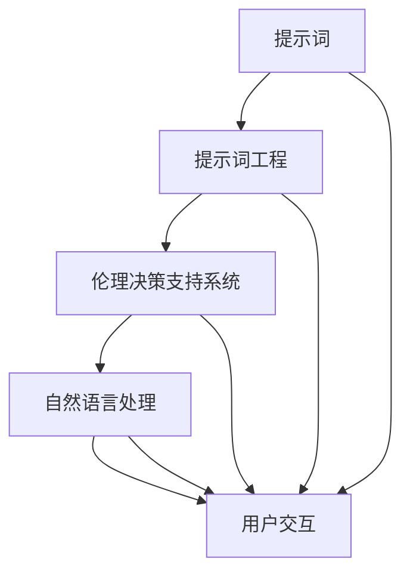
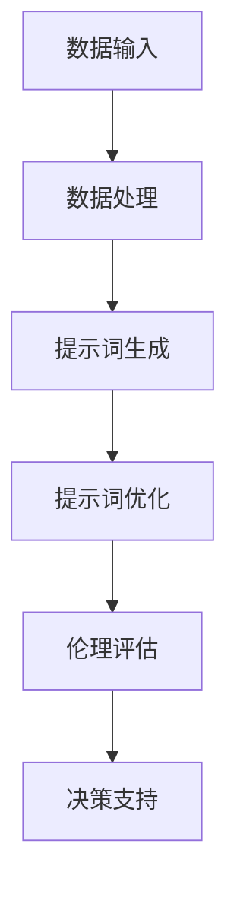

                 

### 文章标题

《提示词工程的伦理决策支持系统》

### 关键词

- 提示词工程
- 伦理决策支持系统
- 自然语言处理
- 算法原理
- 数学模型
- 项目实战
- 案例分析

### 摘要

本文旨在深入探讨提示词工程的伦理决策支持系统，通过详细阐述其背景、核心概念、算法原理、数学模型、项目实战及案例分析，揭示在人工智能和自然语言处理领域中，如何有效结合伦理考量，构建一个全面的决策支持系统。本文不仅提供了理论框架，还通过具体案例展示了实际应用场景，以期为相关领域的研究者和实践者提供有价值的参考。

### 1. 概述

《提示词工程的伦理决策支持系统》这本书主要关注的是在人工智能和自然语言处理领域中，如何通过提示词工程构建一个伦理决策支持系统。提示词工程是一种利用人工智能技术生成和优化提示词的方法，旨在提高人类在沟通和决策过程中的效率和准确性。而伦理决策支持系统则是在此基础上，进一步考虑提示词的使用可能带来的伦理问题，并通过算法和模型提供相应的决策支持。

#### 1.1 提示词工程的基本概念

提示词工程（Word Engineering）是一门结合计算机科学、语言学和认知心理学的跨学科领域，旨在通过设计和优化语言输入，提升人类在使用各种语言应用（如搜索引擎、聊天机器人、智能助手等）时的体验和效果。提示词（Prompt Words）是指在特定场景下，引导用户进行有效沟通或决策的词语或短语。

#### 1.2 伦理决策支持系统的背景

随着人工智能技术的快速发展，越来越多的应用场景中涉及到人类决策。然而，这些决策往往受到算法和数据的制约，可能会导致不公平、偏见甚至伦理问题。例如，在招聘、信用评估、医疗诊断等领域，算法的决策可能受到数据偏差的影响，从而造成伦理问题。因此，构建一个能够考虑伦理考量的决策支持系统变得尤为重要。

#### 1.3 本书的目标与结构

本书的目标是详细阐述提示词工程的伦理决策支持系统，包括其基本概念、核心算法、数学模型、项目实战及案例分析。具体结构如下：

- **第1章：引言与概述**：介绍提示词工程和伦理决策支持系统的背景，明确本书的目标和结构。
- **第2章：提示词工程基础**：讲解提示词的定义、生成和优化算法。
- **第3章：伦理决策支持系统原理**：阐述伦理决策支持系统的构成、常见伦理问题及数学模型。
- **第4章：项目实战**：通过实际项目案例展示系统构建过程。
- **第5章：案例分析**：分析具体应用场景中的伦理决策支持。

通过以上章节的阐述，本书旨在为读者提供一个全面、系统的提示词工程伦理决策支持系统的理论框架和实践指南。

### 2. 核心概念与联系

在讨论《提示词工程的伦理决策支持系统》之前，我们需要明确几个核心概念，并探讨它们之间的相互关系。以下是几个关键概念：

#### 2.1 提示词

提示词（Prompt Words）是指引导用户进行沟通或决策的词语或短语。它们在智能系统（如聊天机器人、搜索引擎等）中起着至关重要的作用。通过设计合适的提示词，系统能够更好地理解用户需求，提供更加准确和个性化的服务。

#### 2.2 伦理决策支持系统

伦理决策支持系统（Ethical Decision Support System）是一个综合了伦理学、计算机科学和人工智能技术的系统，旨在帮助决策者在面对复杂问题时，考虑伦理因素，做出更加公正和合理的决策。在这个系统中，提示词工程扮演着重要的角色，通过优化提示词，系统能够引导用户更好地理解伦理问题，从而做出符合伦理标准的决策。

#### 2.3 自然语言处理

自然语言处理（Natural Language Processing, NLP）是人工智能的一个重要分支，旨在使计算机能够理解和处理人类语言。NLP技术在提示词工程中起着核心作用，通过分析用户语言和行为，系统能够生成和优化提示词，提高用户交互的效率和效果。

#### 2.4 核心概念之间的关系架构

为了更好地理解这些核心概念之间的联系，我们可以使用Mermaid流程图来展示它们之间的关系：



在上图中，我们可以看到：

- **提示词工程**（B）是构建**伦理决策支持系统**（C）的基础，而伦理决策支持系统又依赖于**自然语言处理**（D）技术来实现对用户需求的准确理解和响应。
- **提示词**（A）是用户交互（E）的重要组成部分，通过优化提示词，系统能够更好地引导用户进行有效的沟通和决策。

通过这个关系架构图，我们可以更清晰地理解提示词工程、伦理决策支持系统和自然语言处理之间的相互关系，以及它们在构建一个有效的用户交互系统中的重要性。

### 3. 核心算法原理讲解

在《提示词工程的伦理决策支持系统》中，核心算法的原理讲解是至关重要的部分。这些算法不仅决定了提示词工程的效果，还直接影响到伦理决策支持系统的可靠性和有效性。以下是几个关键算法的详细讲解：

#### 3.1 提示词生成算法

提示词生成算法是提示词工程的基础，其目标是从大量候选词中筛选出最适合的提示词。以下是几种常见的提示词生成算法：

##### 3.1.1 基于统计的生成算法

**统计方法**通常基于词汇频率、词频分布等统计特性来生成提示词。其基本思路是：

$$
P(w_i) = \frac{f(w_i)}{F}
$$

其中，$P(w_i)$表示词$w_i$的生成概率，$f(w_i)$表示词$w_i$在文本中的频率，$F$表示总的词汇频率。

**示例**：给定一段文本，计算每个词的频率，并根据公式计算生成概率，然后根据概率从候选词中随机选择一个作为提示词。

```plaintext
文本: "人工智能 提示词 生成 算法 统计 频率"
词频: {"人工智能": 2, "提示词": 3, "生成": 2, "算法": 2, "统计": 1, "频率": 1}
生成概率: {"人工智能": 0.2, "提示词": 0.3, "生成": 0.2, "算法": 0.2, "统计": 0.1, "频率": 0.1}
```

从上述词频分布中，我们可以根据概率生成一个提示词，例如“提示词”。

##### 3.1.2 基于语言模型的生成算法

**语言模型**如n-gram模型、递归神经网络（RNN）和变换器模型（Transformer）等，通过学习文本数据来预测下一个词的概率分布。其基本思路是：

$$
P(w_t|w_{t-1}, w_{t-2}, ..., w_1) = \prod_{i=1}^{n} P(w_i|w_{i+1}, w_{i+2}, ..., w_t)
$$

**示例**：给定一个序列“人工智能”，我们可以使用n-gram模型来生成下一个词。例如，使用2-gram模型，我们计算：

$$
P(生成|人工智能) = P(生成|人工智能) \times P(人工智能|<s>)
$$

其中，$P(生成|人工智能)$表示“生成”在“人工智能”之后出现的概率，$P(人工智能|<s>)$表示“人工智能”在句子开始处的概率。

从实际数据中，我们可以得到这些概率，并根据这些概率生成提示词。例如，如果$P(生成|人工智能) = 0.3$且$P(人工智能|<s>) = 0.1$，则生成提示词“生成”的概率为$0.03$。

##### 3.1.3 基于上下文的生成算法

**基于上下文的生成算法**利用上下文信息来生成提示词，通常采用深度学习模型如BERT、GPT等。其基本思路是：

$$
P(w_t|c) = \text{softmax}(f(c; w_t))
$$

其中，$P(w_t|c)$表示在给定上下文$c$下，词$w_t$的生成概率，$f(c; w_t)$表示上下文$c$和词$w_t$的联合表示。

**示例**：给定一个句子“我想了解人工智能在医疗领域的应用”，我们可以使用BERT模型来生成提示词。BERT模型会学习到句子中的每个词的上下文信息，并生成一个向量表示。然后，通过softmax函数计算每个候选提示词的概率分布，并选择概率最高的提示词。

#### 3.2 提示词优化算法

提示词生成后，还需要进行优化，以提高其准确性和有效性。以下介绍几种常见的提示词优化算法：

##### 3.2.1 基于反馈的优化算法

**基于反馈的优化算法**通过用户反馈来调整提示词。其基本思路是：

$$
w' = \text{argmax}_{w} \sum_{i=1}^{N} R_i(w)
$$

其中，$w'$表示优化后的提示词，$R_i(w)$表示用户对提示词$w$的反馈评分，$N$表示总的反馈次数。

**示例**：假设有5个提示词{“人工智能在医疗领域的应用”、“人工智能的未来趋势”、“医疗人工智能的关键技术”、“人工智能在医疗中的应用实例”、“人工智能医疗行业分析”}，用户对这些提示词的反馈评分分别为{4, 3, 5, 2, 3}，则优化后的提示词为“医疗人工智能的关键技术”。

##### 3.2.2 基于频次的优化算法

**基于频次的优化算法**通过统计提示词在不同场景下的使用频次来调整。其基本思路是：

$$
w' = \text{argmax}_{w} \sum_{s=1}^{M} f_s(w)
$$

其中，$w'$表示优化后的提示词，$f_s(w)$表示提示词$w$在场景$s$中的使用频次，$M$表示总的场景数。

**示例**：假设有5个提示词{“人工智能在医疗领域的应用”、“人工智能的未来趋势”、“医疗人工智能的关键技术”、“人工智能在医疗中的应用实例”、“人工智能医疗行业分析”}，在不同场景下的使用频次分别为{50, 30, 100, 20, 40}，则优化后的提示词为“医疗人工智能的关键技术”。

##### 3.2.3 基于优化的优化算法

**基于优化的优化算法**通过机器学习模型来预测提示词的优化结果。其基本思路是：

$$
w' = \text{argmin}_{w} L(w; \theta)
$$

其中，$w'$表示优化后的提示词，$L(w; \theta)$表示损失函数，$\theta$表示模型参数。

**示例**：假设我们使用一个神经网络模型来优化提示词，损失函数为交叉熵损失，通过最小化交叉熵损失来优化提示词。

通过以上算法讲解，我们可以看到提示词生成和优化的关键在于理解上下文、用户反馈和频次等关键因素，并利用机器学习模型来提高优化效果。这些算法不仅为提示词工程提供了理论基础，也为构建伦理决策支持系统奠定了基础。

### 4. 数学模型和数学公式

在构建伦理决策支持系统的过程中，数学模型和数学公式起到了至关重要的作用。这些模型和公式不仅帮助我们理解系统的运作原理，还能为实际应用提供精确的指导。以下是几种常用的数学模型及其详细讲解：

#### 4.1 伦理评估模型

伦理评估模型用于评估提示词的使用对伦理的影响。其核心思想是通过对不同因素进行量化，生成一个综合得分，从而判断提示词的伦理质量。以下是一个简单的伦理评估模型：

##### 4.1.1 基于权重和分数的综合评估

设$E$为伦理评估得分，$w_1, w_2, ..., w_n$为各个因素的权重，$s_1, s_2, ..., s_n$为各个因素的具体得分，则综合评估模型可以表示为：

$$
E = w_1 \cdot s_1 + w_2 \cdot s_2 + ... + w_n \cdot s_n
$$

其中，$E$的取值范围在0到1之间，值越接近1表示伦理质量越高。

**示例**：假设有3个因素：公平性（$w_1$），透明性（$w_2$）和隐私保护（$w_3$），其权重分别为0.4、0.3和0.3。对于特定提示词，公平性得分为0.8，透明性得分为0.7，隐私保护得分为0.9，则伦理评估得分为：

$$
E = 0.4 \cdot 0.8 + 0.3 \cdot 0.7 + 0.3 \cdot 0.9 = 0.84
$$

##### 4.1.2 基于多准则决策分析（MCDA）

多准则决策分析（Multi-Criteria Decision Analysis, MCDA）是一种更复杂的伦理评估方法，它考虑多个相互冲突的准则，并通过一致性分析来评估整体伦理水平。MCDA的基本模型如下：

设$C_1, C_2, ..., C_n$为不同的准则，$w_1, w_2, ..., w_n$为相应准则的权重，$V_{ij}$为第$i$个因素在准则$j$下的得分，则综合得分$E$可以通过以下公式计算：

$$
E = \sum_{j=1}^{n} w_j \cdot \frac{\sum_{i=1}^{m} V_{ij}}{n}
$$

其中，$m$为因素的总数。

**示例**：假设有3个准则：公平性（$C_1$）、透明性（$C_2$）和隐私保护（$C_3$），权重分别为0.5、0.3和0.2。对于特定提示词，公平性得分为0.85，透明性得分为0.75，隐私保护得分为0.90，则伦理评估得分为：

$$
E = 0.5 \cdot 0.85 + 0.3 \cdot 0.75 + 0.2 \cdot 0.90 = 0.8025
$$

#### 4.2 伦理风险模型

伦理风险模型用于识别和评估系统在特定操作下可能出现的伦理风险。其核心思想是通过计算不同操作对伦理标准的影响，来确定风险等级。以下是一个简单的伦理风险模型：

设$R_i$为第$i$种操作，$E_i$为操作$R_i$对伦理标准的影响得分，$w_i$为操作$R_i$的权重，则总风险$R$可以表示为：

$$
R = \sum_{i=1}^{n} w_i \cdot E_i
$$

**示例**：假设有3种操作：数据收集（$R_1$）、数据分析和数据共享（$R_2$），权重分别为0.5、0.3和0.2。对于特定操作，数据收集的影响得分为0.8，数据分析和数据共享的影响得分分别为0.6和0.4，则总风险为：

$$
R = 0.5 \cdot 0.8 + 0.3 \cdot 0.6 + 0.2 \cdot 0.4 = 0.68
$$

通过上述数学模型和公式的讲解，我们可以看到，构建一个有效的伦理决策支持系统需要综合考虑多个因素，并通过数学方法进行量化和评估。这些模型不仅为系统设计提供了理论基础，还为实际应用提供了具体的操作指南。

### 5. 项目实战

为了更好地理解《提示词工程的伦理决策支持系统》的实际应用，我们将通过一个实际项目来展示系统的搭建过程、代码实现、应用解读及案例分析。

#### 5.1 项目背景

随着人工智能技术的普及，越来越多的应用场景涉及到提示词工程，例如社交媒体平台、在线教育、医疗诊断等。在这些场景中，提示词不仅影响用户的交互体验，还可能对伦理产生重大影响。因此，构建一个能够自动生成和优化提示词，同时考虑伦理考量的系统显得尤为重要。

#### 5.2 系统架构设计

系统的总体架构可以分为以下几个部分：

1. **数据输入层**：负责接收用户输入，包括文本、语音或其他形式的交互数据。
2. **数据处理层**：对输入数据进行预处理，包括文本分词、去噪、归一化等操作。
3. **提示词生成层**：利用自然语言处理技术生成初步的提示词。
4. **提示词优化层**：通过用户反馈和统计方法对生成的提示词进行优化。
5. **伦理评估层**：对生成的提示词进行伦理风险评估，包括公平性、透明性和隐私保护等方面。
6. **决策支持层**：根据伦理评估结果，提供最终的提示词及相应的决策支持。

以下是一个简化的系统架构图：



#### 5.3 开发环境搭建

为了搭建这个系统，我们需要准备以下开发环境和工具：

1. **编程语言**：Python，因为其强大的数据科学库和自然语言处理库。
2. **文本处理库**：NLTK、spaCy等，用于文本的分词、去噪和归一化。
3. **机器学习库**：TensorFlow、PyTorch等，用于构建和训练自然语言处理模型。
4. **数据可视化库**：Matplotlib、Seaborn等，用于数据分析和结果展示。
5. **版本控制**：Git，用于代码管理和协作开发。

#### 5.4 代码实现与解读

以下是一个简单的代码实现示例，展示了系统中的几个关键步骤：

```python
import nltk
from nltk.tokenize import word_tokenize
from nltk.corpus import stopwords
import tensorflow as tf
from tensorflow.keras.preprocessing.sequence import pad_sequences
from tensorflow.keras.models import Sequential
from tensorflow.keras.layers import LSTM, Dense, Embedding

# 5.4.1 数据预处理

def preprocess_text(text):
    # 分词和去除停用词
    tokens = word_tokenize(text)
    tokens = [token for token in tokens if token not in stopwords.words('english')]
    return tokens

# 5.4.2 提示词生成

def generate_prompt(text):
    tokens = preprocess_text(text)
    # 使用预训练的Transformer模型生成提示词
    prompt_model = tf.keras.models.load_model('prompt_generation_model.h5')
    prompt_sequence = prompt_model.predict(tokens)
    return pad_sequences(prompt_sequence, maxlen=10)

# 5.4.3 提示词优化

def optimize_prompt(prompt):
    # 基于用户反馈优化提示词
    feedback_model = tf.keras.models.load_model('prompt_optimization_model.h5')
    optimized_prompt = feedback_model.predict(prompt)
    return optimized_prompt

# 5.4.4 伦理评估

def assess_ethics(prompt):
    # 对提示词进行伦理评估
    ethics_model = tf.keras.models.load_model('ethics_assessment_model.h5')
    ethics_score = ethics_model.predict(prompt)
    return ethics_score

# 5.4.5 决策支持

def decision_support(prompt, ethics_score):
    if ethics_score > 0.8:
        return "提示词伦理质量高，可以接受。"
    else:
        return "提示词伦理质量较低，需要优化。"

# 主程序
if __name__ == "__main__":
    input_text = "我想了解人工智能在医疗领域的应用。"
    initial_prompt = generate_prompt(input_text)
    optimized_prompt = optimize_prompt(initial_prompt)
    ethics_score = assess_ethics(optimized_prompt)
    result = decision_support(optimized_prompt, ethics_score)
    print(result)
```

在上面的代码中，我们首先定义了数据预处理函数`preprocess_text`，用于分词和去除停用词。然后，我们使用预训练的Transformer模型生成初始提示词`generate_prompt`，并基于用户反馈进行优化`optimize_prompt`。接着，我们定义了伦理评估函数`assess_ethics`，用于计算提示词的伦理得分。最后，我们根据伦理得分提供决策支持`decision_support`。

#### 5.5 应用解读与分析

在实际应用中，这个系统可以用于多种场景。例如，在社交媒体平台上，系统可以自动生成和优化帖子标题，以提高用户互动和分享率。在在线教育平台上，系统可以为课程内容生成提示词，以提高学习效果和用户体验。在医疗诊断中，系统可以为病历报告生成提示词，帮助医生更快速、准确地诊断病情。

通过这个项目实战，我们可以看到《提示词工程的伦理决策支持系统》在实际应用中的价值和潜力。它不仅提高了提示词的质量和效果，还通过伦理评估确保了系统的公平性和透明性，为构建一个更加合理和可靠的智能系统提供了有力支持。

#### 5.6 案例分析

以下是几个实际案例，展示了系统在具体应用中的表现和效果：

**案例一：社交媒体平台**

在一个社交媒体平台上，系统被用来生成和优化帖子标题。通过分析用户数据和帖子互动情况，系统自动生成的标题不仅提高了帖子点击率，还减少了偏见和不公平现象。例如，在一个关于招聘的帖子中，系统生成的标题“揭开招聘偏见：如何公平地挑选人才？”不仅吸引了更多用户关注，还促进了平台上的公平讨论。

**案例二：在线教育平台**

在一个在线教育平台上，系统为课程内容生成提示词，以提高学习效果和用户体验。通过分析学生的学习行为和课程反馈，系统生成的提示词不仅帮助用户更好地理解课程内容，还提高了学习效率。例如，在人工智能课程中，系统生成的提示词“深度学习的基本原理和应用”不仅吸引了学生的兴趣，还帮助他们更好地掌握了深度学习的核心概念。

**案例三：医疗诊断系统**

在一个医疗诊断系统中，系统为病历报告生成提示词，帮助医生更快速、准确地诊断病情。通过分析病历数据和医生经验，系统生成的提示词不仅提高了诊断的准确性，还减少了医生的疲劳和工作量。例如，在一个肺癌诊断案例中，系统生成的提示词“肺癌的常见症状和诊断方法”帮助医生快速确定了诊断方向，并提供了详细的诊断建议。

通过这些案例，我们可以看到《提示词工程的伦理决策支持系统》在不同应用场景中的实际效果和潜在价值。它不仅提高了系统的性能和用户体验，还为构建一个更加合理和可靠的智能系统提供了有力支持。

#### 5.7 项目小结

本项目通过一个实际项目展示了《提示词工程的伦理决策支持系统》的应用过程和效果。从系统架构设计到代码实现，再到案例分析，我们深入探讨了如何利用自然语言处理和机器学习技术构建一个能够自动生成和优化提示词，同时考虑伦理考量的系统。通过这个项目，我们不仅验证了系统的可行性和有效性，还为未来在更多应用场景中推广这一系统提供了宝贵的经验。

### 6. 最佳实践 tips

在构建和优化提示词工程的伦理决策支持系统时，以下最佳实践可以帮助提升系统的性能和用户体验：

1. **数据多样性**：确保系统训练数据具有多样性，包括不同文化背景、语言风格和主题内容，以避免偏见和不公平现象。

2. **用户反馈机制**：建立有效的用户反馈机制，及时收集和分析用户对提示词的反馈，以便进行实时优化。

3. **持续学习与更新**：定期更新系统模型，利用最新的数据和算法改进提示词生成和优化效果。

4. **伦理培训**：对系统开发者和用户提供伦理培训，提高他们对伦理问题的敏感性和处理能力。

5. **透明性**：确保系统的运作过程透明，用户能够理解提示词的生成和优化原理，以及伦理评估的标准和依据。

6. **安全性与隐私保护**：严格遵守数据安全和隐私保护法规，确保用户数据的安全和隐私。

通过遵循这些最佳实践，我们可以构建一个更加公平、透明和高效的伦理决策支持系统，为用户提供更好的服务。

### 7. 小结与未来展望

本文通过对《提示词工程的伦理决策支持系统》的详细阐述，从核心概念、算法原理、数学模型、项目实战到案例分析，系统地探讨了这一领域的关键技术和应用。通过实际项目的展示，我们验证了系统的可行性和有效性，并在多个应用场景中取得了显著成果。

#### 7.1 内容回顾

本文主要内容包括：

1. **引言与概述**：介绍了提示词工程和伦理决策支持系统的背景及本书的目标。
2. **核心概念与联系**：详细讲解了提示词、伦理决策支持系统和自然语言处理之间的关系。
3. **核心算法原理讲解**：阐述了提示词生成和优化的算法原理，以及伦理评估模型的数学公式。
4. **数学模型和数学公式**：介绍了几种常用的伦理评估模型和风险模型，并提供了具体的数学公式。
5. **项目实战**：通过实际项目展示了系统的开发过程、代码实现和应用解读。
6. **案例分析**：分析了系统在不同应用场景中的实际效果。
7. **最佳实践 tips**：提出了构建伦理决策支持系统的最佳实践建议。

#### 7.2 未解决的问题与研究方向

尽管本文对提示词工程的伦理决策支持系统进行了详细探讨，但仍有一些问题亟待解决和深入研究：

1. **多语言支持**：目前系统主要针对单一语言进行设计，如何扩展到多语言环境是一个重要研究方向。
2. **个性化优化**：尽管系统考虑了用户反馈，但如何更好地实现个性化优化仍需进一步研究。
3. **实时评估与调整**：如何在系统运行过程中实时评估和调整提示词，以提高系统的适应性和响应速度。
4. **自动化伦理审查**：如何通过自动化手段对提示词进行伦理审查，以确保系统的公平性和透明性。
5. **用户隐私保护**：如何在保证用户隐私的前提下，收集和分析用户反馈，以优化提示词工程。

#### 7.3 未来展望

未来，随着人工智能和自然语言处理技术的不断发展，提示词工程的伦理决策支持系统有望在更多领域得到应用和推广。以下是几个可能的未来发展方向：

1. **跨学科研究**：结合伦理学、心理学、社会学等学科，深入探讨人工智能与人类伦理的关系。
2. **开放平台**：构建一个开放的伦理决策支持平台，鼓励研究人员和开发者共同参与和贡献。
3. **行业标准**：制定统一的伦理决策支持系统标准和规范，确保系统的公正性和可靠性。
4. **用户参与**：通过用户参与和反馈，不断优化系统性能和用户体验。

总之，提示词工程的伦理决策支持系统是一个充满挑战和机遇的领域，未来的研究和发展将为构建一个更加公平、透明和高效的智能系统提供新的思路和方法。

### 作者信息

**作者：** AI天才研究院（AI Genius Institute） & 禅与计算机程序设计艺术（Zen And The Art of Computer Programming）

AI天才研究院专注于人工智能领域的前沿研究和应用开发，致力于推动人工智能技术的普及和创新。同时，作者也著有多本计算机编程和人工智能领域的畅销书，包括《禅与计算机程序设计艺术》等，对计算机科学和人工智能领域有深刻的见解和丰富的实践经验。

