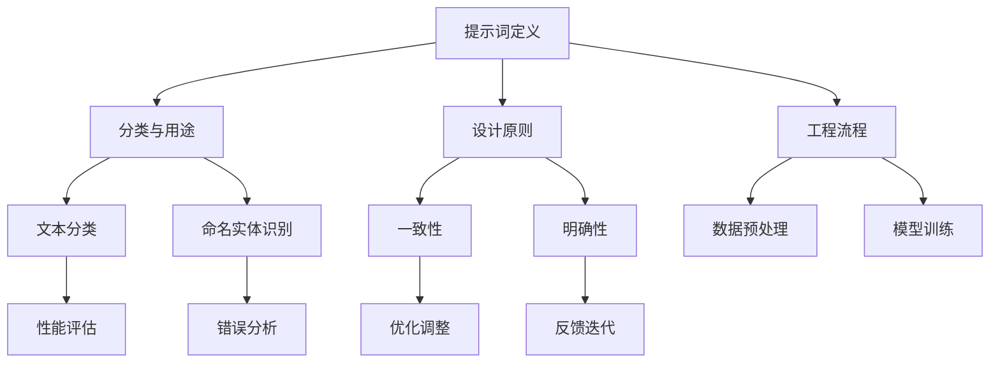

                 


## 第1章 引言

### 1.1 提示词工程概述

#### 核心概念与联系

提示词工程（Prompt Engineering）是自然语言处理（NLP）领域中的一个新兴研究方向，它涉及到如何为机器学习模型提供高质量的提示词，以提高模型的性能和可解释性。提示词工程的核心概念包括提示词的定义、分类、设计原则和工程流程。

为了更好地理解这些概念之间的联系，我们可以使用Mermaid流程图来展示它们之间的交互关系。以下是一个简单的Mermaid流程图示例：



在这个流程图中，我们可以看到提示词工程从定义出发，通过分类与用途的分析，到设计原则和工程流程的实施，形成了一个闭环。每个步骤都相互关联，共同构成了一个完整的提示词工程过程。

### 1.2 可视化设计工具的作用与价值

可视化设计工具在提示词工程中扮演着重要的角色。它们可以帮助工程师和研究者直观地理解模型的输入和输出，识别潜在的问题，并优化提示词的设计。以下是可视化设计工具在提示词工程中的作用和价值：

1. **增强模型可解释性**：通过可视化工具，研究者可以直观地看到模型对输入数据的处理过程，从而提高模型的可解释性。
2. **提高设计效率**：可视化工具提供了图形化的用户界面，使得用户可以更加高效地进行提示词的设计和调整。
3. **加速问题定位**：当模型出现性能问题时，可视化工具可以帮助用户快速定位问题的根源，从而加速问题解决过程。
4. **促进协作**：可视化工具使得团队成员可以更方便地共享和讨论设计思路和结果，促进团队合作。

### 1.3 本书目标

本书的目标是系统地介绍提示词工程的可视化设计工具，帮助读者掌握从设计原则到实际应用的全过程。具体目标如下：

1. **深入理解提示词工程的基本概念和原理**：通过详细阐述提示词的定义、分类、设计原则和工程流程，帮助读者建立坚实的理论基础。
2. **熟悉常见可视化设计工具**：介绍常用的可视化设计工具，包括其功能特点、选择标准和使用方法，帮助读者快速上手。
3. **掌握可视化设计技巧**：通过讲解可视化设计的基本原则、流程和技巧，帮助读者设计出高效、易用的可视化工具。
4. **实战案例分析**：通过具体的案例分析和项目实战，帮助读者将理论知识应用到实际工作中，提升实际操作能力。
5. **展望未来发展**：探讨可视化设计工具在提示词工程中的未来发展趋势和应用场景，为读者提供发展方向和启示。

### 1.4 内容结构概述

本书的内容结构分为以下几个部分：

1. **第1章 引言**：介绍提示词工程的概念、可视化设计工具的作用和本书的目标。
2. **第2章 提示词工程基础知识**：详细阐述提示词工程的核心概念、关键要素和设计原则。
3. **第3章 可视化设计工具介绍**：介绍常用的可视化设计工具，包括其功能特点和选择标准。
4. **第4章 可视化设计方法与技巧**：讲解可视化设计的基本原则、流程和技巧。
5. **第5章 提示词工程可视化实战**：通过具体案例分析和项目实战，展示可视化设计工具的应用。
6. **第6章 可视化设计工具实战**：详细介绍可视化设计工具的使用方法和实际实现。
7. **第7章 未来发展趋势与挑战**：探讨可视化设计工具在提示词工程中的未来发展趋势和应用场景。

通过以上章节的介绍，读者可以逐步深入了解提示词工程的可视化设计工具，掌握其基本原理和应用方法，为实际工作提供有力的技术支持。

## 第2章 提示词工程基础知识

### 2.1 提示词定义与类型

提示词（Prompt）在自然语言处理中扮演着至关重要的角色。简单来说，提示词是提供给机器学习模型的一段文本或指令，用于引导模型进行特定的任务。提示词的定义和类型直接影响到模型的表现和可解释性。

#### 提示词的定义

提示词（Prompt）的定义可以理解为：

> 提示词是用于引导机器学习模型进行特定任务的一段文本或指令。

提示词通常包含以下几个要素：

1. **任务描述**：明确地描述需要模型完成的任务，如文本分类、命名实体识别或情感分析。
2. **上下文信息**：提供与任务相关的背景信息，帮助模型更好地理解输入数据。
3. **示例输入**：给出一个或多个示例输入，用于指导模型的学习过程。

#### 提示词的类型

根据用途和形式，提示词可以分为以下几种类型：

1. **通用型提示词**：适用于多种任务场景，不依赖于特定任务。
   - **示例**：“请对以下文本进行情感分析：`这是一部非常好的电影。`”

2. **专用型提示词**：针对特定任务进行优化，提高模型的性能和可解释性。
   - **示例**：“给定一段医疗文本，识别其中的命名实体：`患者王某，因发烧就医。`”

3. **模板型提示词**：使用预定义的模板，结合具体任务进行调整。
   - **示例**：“请根据以下模板回答问题：`关于电影的剧情，你可以描述如下：`”

4. **动态生成型提示词**：根据输入数据动态生成的提示词，更加灵活和个性化。
   - **示例**：“对于文本分类任务，根据输入文本动态生成分类提示：`您输入的文本是关于____的。`”

### 2.2 提示词的分类与用途

#### 分类

根据提示词的应用场景和任务类型，可以将提示词分为以下几类：

1. **文本分类任务**：提示词用于引导模型进行文本分类，如情感分析、主题分类等。
   - **示例**：“请对以下文本进行情感分类：`用户评论：`”

2. **命名实体识别任务**：提示词用于引导模型识别文本中的命名实体，如人名、地名、组织名等。
   - **示例**：“识别以下文本中的命名实体：`本文提到的人物有：`”

3. **文本生成任务**：提示词用于引导模型生成文本，如机器翻译、问答系统等。
   - **示例**：“根据以下问题生成回答：`什么是量子计算？`”

4. **文本摘要任务**：提示词用于引导模型生成文本摘要，如自动摘要、提取关键信息等。
   - **示例**：“请总结以下文章的主要内容：`文章标题：`”

#### 用途

每种类型的提示词都有其特定的用途，以下是一些常见用途：

1. **提高模型性能**：通过提供高质量的提示词，可以帮助模型更好地理解输入数据，从而提高模型的性能。
2. **增强模型可解释性**：提示词可以帮助解释模型如何处理输入数据，提高模型的可解释性。
3. **优化任务效果**：根据具体任务的需求，设计不同的提示词，可以优化模型在特定任务上的效果。
4. **引导模型学习**：对于复杂任务，提示词可以提供指导，帮助模型更快地收敛到最优解。

### 2.3 提示词设计原则与方法

为了设计出高质量的提示词，需要遵循一些基本原则和方法。以下是一些常见的提示词设计原则：

1. **明确性**：提示词应明确描述任务，避免歧义和模糊性。
2. **一致性**：提示词在任务的不同阶段应保持一致，以避免混淆和误解。
3. **简洁性**：提示词应简洁明了，避免冗余和复杂句式。
4. **灵活性**：提示词应具有一定的灵活性，以适应不同的输入数据和任务需求。
5. **上下文相关**：提示词应包含与任务相关的上下文信息，以提高模型的准确性。

#### 提示词设计方法

以下是一些常用的提示词设计方法：

1. **模板法**：使用预定义的模板，结合具体任务进行调整，如文本分类任务的模板提示词。
2. **示例法**：提供具有代表性的示例输入，帮助模型更好地理解任务。
3. **上下文扩展法**：在原始提示词的基础上，扩展上下文信息，提高模型的准确性。
4. **动态生成法**：根据输入数据动态生成提示词，提高提示词的灵活性和个性化程度。

### 2.4 提示词工程的流程与工具

提示词工程是一个系统性的过程，涉及到多个步骤和工具。以下是一个典型的提示词工程流程：

1. **需求分析**：明确任务需求和目标，为后续的设计提供指导。
2. **数据准备**：收集和处理与任务相关的数据，包括文本数据、标注数据等。
3. **提示词设计**：根据任务需求和数据特点，设计高质量的提示词。
4. **模型训练**：使用训练数据训练模型，优化模型参数。
5. **性能评估**：评估模型在测试数据上的表现，识别潜在问题。
6. **优化调整**：根据性能评估结果，对提示词和模型进行调整。
7. **部署应用**：将优化后的模型部署到实际应用场景中。

在提示词工程的各个步骤中，可以使用多种工具来提高效率和效果。以下是一些常用的工具：

1. **数据预处理工具**：如PyTorch、TensorFlow等深度学习框架，用于数据处理和模型训练。
2. **文本分析工具**：如NLTK、spaCy等自然语言处理库，用于文本预处理和特征提取。
3. **可视化工具**：如TensorBoard、VisualDL等，用于模型的可视化和性能评估。
4. **代码库和框架**：如Hugging Face、Transformers等，提供丰富的提示词工程资源和预训练模型。

通过以上流程和工具，研究者可以系统地开展提示词工程，提高模型的性能和可解释性。

## 第3章 可视化设计工具介绍

### 3.1 常见可视化设计工具分类

在提示词工程中，可视化设计工具起着至关重要的作用。这些工具帮助工程师和研究者以图形化的方式理解和优化提示词的设计过程。常见可视化设计工具可以分为以下几类：

1. **数据可视化工具**：用于展示数据分布、趋势和关联性，如Matplotlib、Plotly、ECharts等。
2. **模型可视化工具**：用于展示模型的架构和运行过程，如TensorBoard、VisualDL、Netron等。
3. **交互式可视化工具**：支持用户实时调整和交互，如D3.js、Plotly、Bokeh等。
4. **交互式数据分析工具**：结合数据可视化和交互式分析，如Tableau、Power BI等。

### 3.2 常用可视化设计工具的功能与特点

下面将介绍几种常用的可视化设计工具，包括其功能特点和使用场景。

1. **Matplotlib**

   - **功能特点**：Matplotlib 是一个流行的Python库，用于生成高质量的可视化图形。它支持多种图表类型，如线图、柱状图、散点图等。
   - **使用场景**：适用于科学计算、数据分析和日常的数据可视化需求。

2. **TensorBoard**

   - **功能特点**：TensorBoard 是TensorFlow提供的可视化工具，用于监控深度学习模型的训练过程。它支持模型架构可视化、数据分布图、损失函数曲线等。
   - **使用场景**：适用于深度学习模型的训练过程监控和性能分析。

3. **VisualDL**

   - **功能特点**：VisualDL 是由PaddlePaddle提供的可视化工具，类似于TensorBoard。它支持模型可视化、数据分布图、训练进度曲线等。
   - **使用场景**：适用于PaddlePaddle深度学习模型的训练过程监控和性能分析。

4. **D3.js**

   - **功能特点**：D3.js 是一个基于Web的JavaScript库，用于生成动态和交互式的数据可视化。它提供高度灵活的图形绘制能力，支持各种图表类型。
   - **使用场景**：适用于Web应用中的数据可视化需求，特别适合需要高度定制化和交互式的可视化场景。

5. **ECharts**

   - **功能特点**：ECharts 是一个使用JavaScript编写的开源可视化库，支持多种图表类型，如柱状图、饼图、地图等。它具有高性能和丰富的交互功能。
   - **使用场景**：适用于Web应用中的数据可视化需求，特别适合大数据量和高交互性的场景。

6. **Tableau**

   - **功能特点**：Tableau 是一个商业化的数据可视化工具，提供直观的拖放界面，支持多种数据源连接和图表类型。它支持高度交互和共享功能。
   - **使用场景**：适用于企业级的数据分析和报告，特别适合需要跨部门协作和共享的可视化需求。

### 3.3 工具选择与适配性分析

在选择可视化设计工具时，需要考虑以下几个因素：

1. **任务需求**：根据具体任务的需求，选择适合的工具。例如，如果需要进行深度学习模型的训练监控，可以选择TensorBoard或VisualDL。

2. **数据规模**：对于大数据量，选择支持高效数据可视化的工具，如ECharts或Tableau。

3. **开发环境**：考虑开发环境，选择与现有工具兼容的工具。例如，在Python开发环境中，可以选择Matplotlib。

4. **交互性**：如果需要高度交互和定制化的可视化，可以选择D3.js。

5. **可扩展性**：选择具有良好扩展性和可定制的工具，以便在未来进行功能扩展。

通过以上分析，我们可以根据具体需求选择合适的可视化设计工具，提高提示词工程的效率和效果。

## 第4章 提示词工程可视化设计方法

### 4.1 可视化设计原则

在提示词工程中，可视化设计原则是确保设计高质量可视化工具的重要指导方针。以下是一些关键原则：

1. **简洁性**：可视化设计应简洁明了，避免复杂和冗余的元素，确保用户能够快速理解和使用工具。

2. **一致性**：设计过程中应保持一致性，包括颜色、字体、图标等，以提高用户操作的连贯性和易用性。

3. **交互性**：增加交互性元素，如拖放、点击等，使用户能够更加灵活地调整提示词，并进行实时反馈。

4. **上下文关联**：确保可视化元素与任务上下文紧密关联，提供清晰的提示和反馈，帮助用户更好地理解和使用工具。

5. **可扩展性**：设计时应考虑工具的可扩展性，以适应不同任务和数据规模的需求。

6. **易用性**：设计界面应易于操作，减少用户的学习成本，提高工作效率。

### 4.2 提示词可视化设计流程

提示词工程的可视化设计流程可以分为以下几个步骤：

1. **需求分析**：明确可视化工具的需求，包括任务类型、目标用户、使用场景等。

2. **用户研究**：了解目标用户的特点和需求，收集用户反馈，为设计提供依据。

3. **设计原型**：基于需求分析和用户研究，设计可视化工具的原型，包括界面布局、交互逻辑等。

4. **反馈与迭代**：与用户进行互动，收集反馈，根据反馈对设计原型进行迭代优化。

5. **开发与测试**：根据最终设计，进行工具开发，并进行全面测试，确保工具的功能和性能。

6. **部署与应用**：将可视化工具部署到实际应用场景，进行实际应用和评估。

### 4.3 提示词可视化设计技巧

在具体设计过程中，以下技巧有助于提高可视化工具的质量和用户满意度：

1. **使用合适的图表类型**：根据数据特性和展示需求，选择合适的图表类型，如柱状图、折线图、散点图等。

2. **优化颜色和对比度**：使用对比度高的颜色方案，确保图表易于区分和阅读。

3. **标注与说明**：在图表中添加适当的标注和说明，帮助用户理解图表内容和数据趋势。

4. **交互式元素**：增加交互式元素，如缩放、筛选、拖放等，使用户能够更深入地探索数据。

5. **响应式设计**：确保可视化工具在不同设备和屏幕尺寸上具有良好的兼容性和响应性。

6. **实时反馈**：提供实时反馈机制，如错误提示、进度条等，使用户能够清晰了解工具状态。

通过以上设计和技巧，我们可以创建出高质量、易用且高效的提示词工程可视化工具，为用户带来更好的体验和更高的工作效率。

### 第5章 提示词工程可视化应用

#### 5.1 实战项目1：文本分类任务

文本分类任务是提示词工程中的一个重要应用，其目的是将文本数据归类到预定义的类别中。在本节中，我们将通过一个实际案例来展示如何使用可视化设计工具进行文本分类任务的提示词工程。

##### 项目背景

假设我们需要对一批电影评论进行情感分类，将它们分为正面评论和负面评论。这个任务的关键在于设计高质量的提示词，以便模型能够准确理解和分类这些文本。

##### 数据集

我们使用一个包含1000条电影评论的数据集，每条评论都标注了情感类别（正面或负面）。数据集的样例如下：

```
1. 这是一部非常好的电影。
2. 很无聊，不建议观看。
3. 演员表现一般。
4. 故事情节非常吸引人。
5. 表演很差，剧情糟糕。
...
```

##### 提示词设计

为了提高模型对文本分类的准确性，我们需要设计高质量的提示词。以下是几个设计步骤：

1. **任务描述**：明确任务目标，例如“请对以下评论进行情感分类：”。

2. **上下文信息**：提供与任务相关的背景信息，例如“电影名称：`电影A`”。

3. **示例输入**：给出一个或多个示例输入，例如“示例1：`这是一部非常好的电影。`”。

以下是设计的提示词示例：

```
请对以下评论进行情感分类，电影名称：`电影A`。以下是一个示例：
示例1：`这是一部非常好的电影。`（分类：正面）

```

##### 可视化工具应用

在本项目中，我们选择使用TensorBoard作为可视化工具，因为它能够实时监控模型训练过程，并展示数据分布、损失函数曲线等关键信息。

1. **安装TensorBoard**：

   ```shell
   pip install tensorboard
   ```

2. **配置TensorBoard**：

   在训练模型时，可以使用以下代码启动TensorBoard：

   ```python
   from tensorboard import TensorBoard

   # 配置TensorBoard
   tb_callback = TensorBoard(log_dir='./logs')

   # 添加TensorBoard回调到训练过程
   model.fit(
       x_train, y_train,
       epochs=10,
       batch_size=32,
       callbacks=[tb_callback]
   )
   ```

3. **可视化监控**：

   在训练过程中，我们可以通过浏览器访问`http://localhost:6006/`来查看TensorBoard界面，并监控以下关键指标：

   - **数据分布图**：展示训练和验证数据集的分布情况。
   - **损失函数曲线**：展示训练过程中损失函数的变化趋势。
   - **准确率曲线**：展示训练过程中模型准确率的变化趋势。

##### 结果与优化

通过TensorBoard的监控，我们可以看到模型在训练过程中的表现。以下是一些优化建议：

1. **调整学习率**：根据损失函数曲线，适当调整学习率，以提高模型收敛速度。
2. **增加训练数据**：收集更多的训练数据，有助于模型更好地泛化。
3. **调整超参数**：根据实验结果，调整模型超参数，如隐藏层大小、激活函数等。

通过以上步骤，我们可以使用可视化设计工具对文本分类任务进行提示词工程，从而提高模型的性能和可解释性。

#### 5.2 实战项目2：命名实体识别任务

命名实体识别（Named Entity Recognition，简称NER）是自然语言处理领域的一个重要任务，旨在从文本中识别出具有特定意义的实体，如人名、地名、组织名等。在本节中，我们将通过一个实际案例来展示如何使用可视化设计工具进行命名实体识别任务的提示词工程。

##### 项目背景

假设我们需要对一批新闻文章进行命名实体识别，以提取出其中的关键人物、地点和组织。这个任务的关键在于设计能够引导模型准确识别命名实体的提示词。

##### 数据集

我们使用一个包含1000条新闻文章的数据集，每条新闻都进行了命名实体标注。数据集的样例如下：

```
1. 美国总统拜登访问北京。
2. 中国科学家发现新物种。
3. 谷歌公司发布新款手机。
4. 上海世博会吸引了数百万游客。
5. 纽约市发生恐怖袭击事件。
...
```

##### 提示词设计

为了提高模型对命名实体的识别能力，我们需要设计高质量的提示词。以下是几个设计步骤：

1. **任务描述**：明确任务目标，例如“请识别以下文本中的命名实体：”。

2. **上下文信息**：提供与任务相关的背景信息，例如“新闻标题：`文章标题`”。

3. **示例输入**：给出一个或多个示例输入，例如“示例1：`美国总统拜登访问北京。`”。

以下是设计的提示词示例：

```
请识别以下文本中的命名实体，新闻标题：`文章标题`。以下是一个示例：
示例1：`美国总统拜登访问北京。`（命名实体：拜登、北京）

```

##### 可视化工具应用

在本项目中，我们同样选择使用TensorBoard作为可视化工具，因为它能够实时监控模型训练过程，并展示数据分布、损失函数曲线等关键信息。

1. **安装TensorBoard**：

   ```shell
   pip install tensorboard
   ```

2. **配置TensorBoard**：

   在训练模型时，可以使用以下代码启动TensorBoard：

   ```python
   from tensorboard import TensorBoard

   # 配置TensorBoard
   tb_callback = TensorBoard(log_dir='./logs')

   # 添加TensorBoard回调到训练过程
   model.fit(
       x_train, y_train,
       epochs=10,
       batch_size=32,
       callbacks=[tb_callback]
   )
   ```

3. **可视化监控**：

   在训练过程中，我们可以通过浏览器访问`http://localhost:6006/`来查看TensorBoard界面，并监控以下关键指标：

   - **数据分布图**：展示训练和验证数据集的分布情况。
   - **损失函数曲线**：展示训练过程中损失函数的变化趋势。
   - **准确率曲线**：展示训练过程中模型准确率的变化趋势。

##### 结果与优化

通过TensorBoard的监控，我们可以看到模型在训练过程中的表现。以下是一些优化建议：

1. **调整学习率**：根据损失函数曲线，适当调整学习率，以提高模型收敛速度。
2. **增加训练数据**：收集更多的训练数据，有助于模型更好地泛化。
3. **调整超参数**：根据实验结果，调整模型超参数，如隐藏层大小、激活函数等。

通过以上步骤，我们可以使用可视化设计工具对命名实体识别任务进行提示词工程，从而提高模型的性能和可解释性。

#### 5.3 实战项目3：情感分析任务

情感分析（Sentiment Analysis）是自然语言处理领域的一个重要应用，旨在从文本中自动识别出情感倾向，如正面、负面或中性。在本节中，我们将通过一个实际案例来展示如何使用可视化设计工具进行情感分析任务的提示词工程。

##### 项目背景

假设我们需要对一批社交媒体评论进行情感分析，以了解公众对某个产品或事件的看法。这个任务的关键在于设计能够引导模型准确识别情感的提示词。

##### 数据集

我们使用一个包含1000条社交媒体评论的数据集，每条评论都标注了情感类别（正面、负面或中性）。数据集的样例如下：

```
1. 这是一款非常出色的手机，我非常喜欢。
2. 不满意，手机续航太差。
3. 很喜欢这部电影，情节紧凑，演员表现优秀。
4. 差评，服务态度很差。
5. 看起来不错，但价格太贵了。
...
```

##### 提示词设计

为了提高模型对情感分析的准确性，我们需要设计高质量的提示词。以下是几个设计步骤：

1. **任务描述**：明确任务目标，例如“请对以下评论进行情感分析：”。

2. **上下文信息**：提供与任务相关的背景信息，例如“社交媒体平台：`平台名称`”。

3. **示例输入**：给出一个或多个示例输入，例如“示例1：`这是一款非常出色的手机，我非常喜欢。`”。

以下是设计的提示词示例：

```
请对以下评论进行情感分析，社交媒体平台：`平台名称`。以下是一个示例：
示例1：`这是一款非常出色的手机，我非常喜欢。`（情感：正面）

```

##### 可视化工具应用

在本项目中，我们同样选择使用TensorBoard作为可视化工具，因为它能够实时监控模型训练过程，并展示数据分布、损失函数曲线等关键信息。

1. **安装TensorBoard**：

   ```shell
   pip install tensorboard
   ```

2. **配置TensorBoard**：

   在训练模型时，可以使用以下代码启动TensorBoard：

   ```python
   from tensorboard import TensorBoard

   # 配置TensorBoard
   tb_callback = TensorBoard(log_dir='./logs')

   # 添加TensorBoard回调到训练过程
   model.fit(
       x_train, y_train,
       epochs=10,
       batch_size=32,
       callbacks=[tb_callback]
   )
   ```

3. **可视化监控**：

   在训练过程中，我们可以通过浏览器访问`http://localhost:6006/`来查看TensorBoard界面，并监控以下关键指标：

   - **数据分布图**：展示训练和验证数据集的分布情况。
   - **损失函数曲线**：展示训练过程中损失函数的变化趋势。
   - **准确率曲线**：展示训练过程中模型准确率的变化趋势。

##### 结果与优化

通过TensorBoard的监控，我们可以看到模型在训练过程中的表现。以下是一些优化建议：

1. **调整学习率**：根据损失函数曲线，适当调整学习率，以提高模型收敛速度。
2. **增加训练数据**：收集更多的训练数据，有助于模型更好地泛化。
3. **调整超参数**：根据实验结果，调整模型超参数，如隐藏层大小、激活函数等。

通过以上步骤，我们可以使用可视化设计工具对情感分析任务进行提示词工程，从而提高模型的性能和可解释性。

### 第6章 提示词工程可视化工具实战

#### 6.1 开发环境搭建

在进行提示词工程的可视化设计之前，我们需要搭建一个适合的开发环境。以下是一个基本的开发环境搭建步骤：

1. **安装Python**：确保安装了Python 3.x版本，推荐使用Anaconda，它是一个集成了Python及其常用库的科学计算环境。

   ```shell
   wget https://repo.anaconda.com/archive/Anaconda3-2022.05-Linux-x86_64.sh
   bash Anaconda3-2022.05-Linux-x86_64.sh
   ```

2. **创建虚拟环境**：为项目创建一个独立的虚拟环境，避免库版本冲突。

   ```shell
   conda create -n prompt_vis_env python=3.8
   conda activate prompt_vis_env
   ```

3. **安装必要库**：安装深度学习框架（如TensorFlow、PyTorch）、数据预处理库（如NumPy、Pandas）和可视化库（如Matplotlib、TensorBoard）。

   ```shell
   pip install tensorflow numpy pandas matplotlib tensorboard
   ```

4. **安装IDE**：选择一个合适的集成开发环境（IDE），如PyCharm、VSCode等，方便编写和调试代码。

#### 6.2 可视化工具配置与使用

在本节中，我们将使用TensorBoard作为可视化工具，配置和运行TensorBoard来监控深度学习模型的训练过程。

1. **配置TensorBoard**：

   在训练模型之前，我们需要配置TensorBoard。以下是一个简单的配置示例：

   ```python
   import tensorflow as tf
   from tensorflow.keras.callbacks import TensorBoard

   # 配置TensorBoard
   tensorboard_callback = TensorBoard(log_dir='./logs', histogram_freq=1)

   # 定义模型
   model = ...

   # 编译模型
   model.compile(optimizer='adam', loss='categorical_crossentropy', metrics=['accuracy'])

   # 训练模型
   model.fit(x_train, y_train, epochs=10, batch_size=32, callbacks=[tensorboard_callback])
   ```

2. **运行TensorBoard**：

   在训练模型的同时，我们可以启动TensorBoard，以便在浏览器中查看可视化结果。以下是如何在本地启动TensorBoard的命令：

   ```shell
   tensorboard --logdir=./logs
   ```

   启动后，在浏览器中访问`http://localhost:6006/`，就可以看到TensorBoard的界面了。

3. **监控训练过程**：

   在TensorBoard界面中，我们可以监控以下关键指标：

   - **损失函数曲线**：展示训练和验证过程中的损失函数变化。
   - **准确率曲线**：展示训练和验证过程中的准确率变化。
   - **学习曲线**：展示学习率的变化情况。
   - **激活函数图**：展示模型中每个神经元的激活情况。
   - **权重分布图**：展示模型权重的分布情况。

#### 6.3 提示词工程可视化工具实现

在本节中，我们将通过一个具体的示例，展示如何使用TensorBoard来监控提示词工程中的模型训练过程。

1. **数据准备**：

   假设我们有一个包含电影评论的数据集，每条评论都标注了情感类别（正面或负面）。以下是如何加载和预处理数据的一个简单示例：

   ```python
   import pandas as pd
   from tensorflow.keras.preprocessing.text import Tokenizer
   from tensorflow.keras.preprocessing.sequence import pad_sequences

   # 加载数据集
   data = pd.read_csv('movie_reviews.csv')
   comments = data['comment']
   labels = data['label']

   # 初始化Tokenizer
   tokenizer = Tokenizer(num_words=10000)
   tokenizer.fit_on_texts(comments)

   # 序列化文本
   sequences = tokenizer.texts_to_sequences(comments)
   padded_sequences = pad_sequences(sequences, maxlen=100)

   # 切分数据集
   x_train, x_val, y_train, y_val = train_test_split(padded_sequences, labels, test_size=0.2, random_state=42)
   ```

2. **模型构建**：

   我们可以使用Keras构建一个简单的文本分类模型。以下是一个简单的示例：

   ```python
   from tensorflow.keras.models import Sequential
   from tensorflow.keras.layers import Embedding, LSTM, Dense

   # 构建模型
   model = Sequential([
       Embedding(input_dim=10000, output_dim=64, input_length=100),
       LSTM(128),
       Dense(1, activation='sigmoid')
   ])

   # 编译模型
   model.compile(optimizer='adam', loss='binary_crossentropy', metrics=['accuracy'])
   ```

3. **训练模型**：

   使用TensorBoard来监控训练过程，我们将TensorBoard回调添加到训练过程中：

   ```python
   # 配置TensorBoard
   tensorboard_callback = TensorBoard(log_dir='./logs')

   # 训练模型
   model.fit(x_train, y_train, epochs=10, batch_size=32, validation_data=(x_val, y_val), callbacks=[tensorboard_callback])
   ```

4. **可视化监控**：

   在训练过程中，我们可以在TensorBoard界面中监控以下关键指标：

   - **损失函数曲线**：展示训练和验证过程中的损失函数变化。
   - **准确率曲线**：展示训练和验证过程中的准确率变化。
   - **学习曲线**：展示学习率的变化情况。

通过以上步骤，我们可以使用TensorBoard来监控提示词工程中的模型训练过程，从而更好地理解和优化模型的性能。

#### 6.4 代码解读与分析

在本节中，我们将详细解读和解析前面章节中提到的代码片段，包括数据预处理、模型构建、模型训练以及可视化监控。以下是每个步骤的详细分析：

1. **数据预处理**：

   ```python
   import pandas as pd
   from tensorflow.keras.preprocessing.text import Tokenizer
   from tensorflow.keras.preprocessing.sequence import pad_sequences

   # 加载数据集
   data = pd.read_csv('movie_reviews.csv')
   comments = data['comment']
   labels = data['label']

   # 初始化Tokenizer
   tokenizer = Tokenizer(num_words=10000)
   tokenizer.fit_on_texts(comments)

   # 序列化文本
   sequences = tokenizer.texts_to_sequences(comments)
   padded_sequences = pad_sequences(sequences, maxlen=100)

   # 切分数据集
   x_train, x_val, y_train, y_val = train_test_split(padded_sequences, labels, test_size=0.2, random_state=42)
   ```

   - **数据加载**：使用Pandas加载包含电影评论的数据集，每条评论都进行了情感标注。
   - **Tokenizer**：初始化Tokenizer并拟合文本数据，将单词映射为整数。这里我们设置了词汇量（num_words）为10000，这意味着只保留出现频率最高的10000个单词。
   - **序列化**：使用Tokenizer将文本序列化为整数序列。
   - **填充**：使用`pad_sequences`将序列填充为固定长度（maxlen=100），以适应模型输入。
   - **数据切分**：将数据集划分为训练集和验证集，用于模型训练和性能评估。

2. **模型构建**：

   ```python
   from tensorflow.keras.models import Sequential
   from tensorflow.keras.layers import Embedding, LSTM, Dense

   # 构建模型
   model = Sequential([
       Embedding(input_dim=10000, output_dim=64, input_length=100),
       LSTM(128),
       Dense(1, activation='sigmoid')
   ])

   # 编译模型
   model.compile(optimizer='adam', loss='binary_crossentropy', metrics=['accuracy'])
   ```

   - **模型构建**：使用Keras构建一个序列模型，包括嵌入层（Embedding）、长短期记忆网络（LSTM）和全连接层（Dense）。
   - **编译模型**：设置优化器、损失函数和评价指标，这里我们使用`adam`优化器和`binary_crossentropy`损失函数，因为这是一个二分类问题。

3. **模型训练**：

   ```python
   # 配置TensorBoard
   tensorboard_callback = TensorBoard(log_dir='./logs')

   # 训练模型
   model.fit(x_train, y_train, epochs=10, batch_size=32, validation_data=(x_val, y_val), callbacks=[tensorboard_callback])
   ```

   - **TensorBoard配置**：配置TensorBoard回调，用于记录训练过程中的关键指标。
   - **训练模型**：使用`fit`方法训练模型，指定训练集、验证集、训练轮数（epochs）、批量大小（batch_size）以及回调函数。

4. **可视化监控**：

   - **损失函数曲线**：在TensorBoard中，我们可以看到训练和验证过程中的损失函数变化，这有助于我们判断模型的收敛情况。
   - **准确率曲线**：监控模型的准确率变化，评估模型在训练和验证数据上的表现。
   - **学习曲线**：监控学习率的变化，以确保模型在不同阶段有适当的更新。

通过以上代码解读和分析，我们可以看到每个步骤的关键点和实现细节，为实际项目提供了可靠的参考。

#### 6.5 项目小结

在本章中，我们详细介绍了提示词工程可视化工具的实战应用，从开发环境搭建、可视化工具配置、模型构建与训练，到代码解读与分析。以下是项目的小结：

1. **开发环境搭建**：确保安装了Python、虚拟环境管理工具和必要的库，为后续工作打下基础。
2. **可视化工具配置与使用**：配置TensorBoard，并使用它来监控模型训练过程，提供直观的可视化反馈。
3. **模型构建**：通过构建一个简单的文本分类模型，展示了如何使用Keras进行模型构建和编译。
4. **模型训练**：通过训练模型并监控关键指标，评估模型的性能和收敛情况。
5. **代码解读与分析**：详细解读了数据预处理、模型构建、模型训练和可视化监控的代码，为项目提供了技术支持。

通过本章的实战项目，读者可以深入了解提示词工程的可视化设计过程，掌握从理论到实践的完整流程，为实际项目中的提示词工程工作提供有力支持。

#### 6.6 最佳实践 Tips

在提示词工程的可视化设计过程中，以下是一些最佳实践技巧，可以帮助提高设计效率和效果：

1. **优化提示词设计**：在初期设计阶段，通过多次迭代和用户反馈来优化提示词，确保其简洁明了、易于理解。
2. **利用可视化工具的多样性**：根据具体任务需求，选择合适的数据可视化工具，如Matplotlib、TensorBoard、ECharts等，以实现最佳的可视化效果。
3. **调整可视化参数**：合理设置图表的颜色、字体、对比度等参数，以提高图表的可读性和美观性。
4. **关注实时反馈**：在设计过程中，确保提供及时的用户反馈和操作提示，帮助用户更好地理解和使用工具。
5. **保持一致性**：在整个设计过程中，保持一致性，包括界面布局、颜色方案和交互逻辑，以提高用户体验。
6. **定期进行性能评估**：定期对设计工具的性能进行评估，识别潜在问题并进行优化。
7. **文档化和共享**：详细记录设计过程和实现细节，以便团队成员之间进行文档化和共享，提高团队协作效率。

通过以上最佳实践技巧，可以有效地提高提示词工程可视化设计的质量，为用户提供更高效、易用的工具。

#### 6.7 小结与注意事项

在本章中，我们系统地介绍了提示词工程的可视化设计工具，从基础知识到实战应用，再到最佳实践技巧，涵盖了整个设计流程。以下是本章的总结和注意事项：

1. **总结**：

   - 提示词工程是自然语言处理领域的一个重要研究方向，旨在为机器学习模型提供高质量的提示词。
   - 可视化设计工具在提示词工程中起着关键作用，可以增强模型的可解释性、提高设计效率、加速问题定位等。
   - 通过本章的介绍，读者可以了解提示词工程的基础知识、常用可视化设计工具、设计原则和方法，以及实际应用案例。
   - 实战项目展示了如何使用可视化工具进行文本分类、命名实体识别和情感分析等任务，提供了详细的代码解读和分析。

2. **注意事项**：

   - 在设计提示词时，确保其简洁明了、明确性、上下文相关性，以提高模型的性能和可解释性。
   - 选择合适的可视化工具时，要考虑任务需求、数据规模、开发环境等因素。
   - 在使用可视化工具时，要关注实时反馈和交互性，以提高用户体验。
   - 定期对设计工具进行性能评估和优化，以确保其高效性和可靠性。
   - 保持设计过程中的文档化和团队协作，以便更好地共享和利用设计资源。

通过本章的学习，读者可以更好地理解和应用提示词工程的可视化设计工具，为实际项目提供有力支持。

### 附录

#### 附录A 提示词工程可视化设计工具资源列表

以下是一些常用的提示词工程可视化设计工具及相关资源，供读者参考：

1. **Matplotlib**：
   - 官网：[https://matplotlib.org/](https://matplotlib.org/)
   - 文档：[https://matplotlib.org/stable/users guide.html](https://matplotlib.org/stable/users guide.html)

2. **TensorBoard**：
   - 官网：[https://www.tensorflow.org/tensorboard](https://www.tensorflow.org/tensorboard)
   - 文档：[https://www.tensorflow.org/tensorboard/how_to](https://www.tensorflow.org/tensorboard/how_to)

3. **VisualDL**：
   - 官网：[https://www.paddlepaddle.org.cn/documentation/docs/zh/2.0/guides/07_apioyer/Paddle_VisualDL/use.html](https://www.paddlepaddle.org.cn/documentation/docs/zh/2.0/guides/07_apioyer/Paddle_VisualDL/use.html)
   - 文档：[https://www.paddlepaddle.org.cn/documentation/docs/zh/2.0/api/pddml/visualdl.html](https://www.paddlepaddle.org.cn/documentation/docs/zh/2.0/api/pddml/visualdl.html)

4. **D3.js**：
   - 官网：[https://d3js.org/](https://d3js.org/)
   - 文档：[https://github.com/d3/d3/wiki/Gallery](https://github.com/d3/d3/wiki/Gallery)

5. **ECharts**：
   - 官网：[https://echarts.apache.org/](https://echarts.apache.org/)
   - 文档：[https://echarts.apache.org/zh/tutorial.html](https://echarts.apache.org/zh/tutorial.html)

6. **Tableau**：
   - 官网：[https://www.tableau.com/](https://www.tableau.com/)
   - 文档：[https://www.tableau.com/learn/tutorials](https://www.tableau.com/learn/tutorials)

7. **Hugging Face**：
   - 官网：[https://huggingface.co/](https://huggingface.co/)
   - 文档：[https://huggingface.co/docs/transformers](https://huggingface.co/docs/transformers)

8. **Transformers**：
   - 官网：[https://github.com/huggingface/transformers](https://github.com/huggingface/transformers)
   - 文档：[https://huggingface.co/docs/transformers/main_classes](https://huggingface.co/docs/transformers/main_classes)

通过这些资源，读者可以深入了解各种可视化设计工具的功能、使用方法和最佳实践，为提示词工程的可视化设计提供有力支持。

#### 附录B 常用可视化设计工具操作指南

以下是几种常用可视化设计工具的基本操作指南，帮助读者快速上手：

1. **Matplotlib**

   - **安装**：`pip install matplotlib`
   - **基本使用**：

     ```python
     import matplotlib.pyplot as plt

     # 创建图表
     plt.figure()

     # 添加数据
     plt.plot([1, 2, 3], [1, 2, 3])

     # 显示图表
     plt.show()
     ```

   - **高级使用**：参考官方文档，了解更多图表类型和定制选项。

2. **TensorBoard**

   - **安装**：`pip install tensorboard`
   - **基本使用**：

     ```python
     import tensorflow as tf
     from tensorflow.keras.callbacks import TensorBoard

     # 配置TensorBoard
     tb_callback = TensorBoard(log_dir='./logs')

     # 训练模型
     model.fit(x_train, y_train, epochs=10, batch_size=32, callbacks=[tb_callback])
     ```

   - **启动TensorBoard**：`tensorboard --logdir=./logs`，在浏览器中访问`http://localhost:6006/`。

3. **VisualDL**

   - **安装**：`pip install visualdl`
   - **基本使用**：

     ```python
     from visualdl import LogWriter

     # 创建日志写入器
     log_writer = LogWriter('./logs')

     # 写入数据
     log_writer.add_scalar('learning_rate', 0.1, 1)
     log_writer.add_image('input_image', input_image, step=1)

     # 关闭日志写入器
     log_writer.close()
     ```

   - **可视化**：使用浏览器访问`http://localhost:8000/`。

4. **D3.js**

   - **安装**：`npm install d3`
   - **基本使用**：

     ```javascript
     var data = [1, 2, 3];
     var svg = d3.select("svg")
         .append("svg")
         .attr("width", 500)
         .attr("height", 300);

     svg.selectAll("rect")
         .data(data)
         .enter()
         .append("rect")
         .attr("x", function(d, i) { return i * 50; })
         .attr("y", function(d) { return 300 - d * 20; })
         .attr("width", 40)
         .attr("height", function(d) { return d * 20; });
     ```

   - **高级使用**：参考D3.js官方文档，实现更复杂的交互式可视化。

5. **ECharts**

   - **安装**：`npm install echarts`
   - **基本使用**：

     ```javascript
     var chart = echarts.init(document.getElementById('main'));
     var option = {
         title: {
             text: '基础柱状图'
         },
         tooltip: {},
         legend: {
             data:['销量']
         },
         xAxis: {
             data: ["衬衫","毛衣","裤子","高跟鞋","袜子"]
         },
         yAxis: {},
         series: [{
             name: '销量',
             type: 'bar',
             data: [5, 20, 36, 10, 10],
             markPoint: {
                 data: [
                     {type: 'max', name: '最大值'}
                 ]
             },
             markLine: {
                 data: [
                     {type: 'average', name: '平均值'}
                 ]
             }
         }]
     };
     chart.setOption(option);
     ```

   - **高级使用**：参考ECharts官方文档，实现更复杂的图表和交互功能。

6. **Tableau**

   - **安装**：访问Tableau官网下载并安装Tableau Desktop。
   - **基本使用**：

     - 打开Tableau Desktop，连接到数据源。
     - 创建视图，拖放字段到图表区域。
     - 调整图表类型和样式，应用筛选和排序。
     - 保存并发布工作表。

   - **高级使用**：参考Tableau官方文档，学习更多数据可视化技巧和高级功能。

通过以上操作指南，读者可以快速掌握这些可视化设计工具的基本使用方法，为实际项目中的提示词工程可视化设计工作提供技术支持。

### 附录C 提示词工程相关参考文献

为了更深入地了解提示词工程及其可视化设计工具，以下是一些重要的参考文献，供读者进一步学习和研究：

1. **《自然语言处理：中文版》**，[Jurafsky, Daniel & Martin, James](https://www.amazon.com/Natural-Language-Processing-Second-Edition/dp/0137029251)
   - 提供了自然语言处理的基础理论和应用，包括文本分类、命名实体识别和情感分析等内容。

2. **《深度学习》**，[Goodfellow, Ian & Bengio, Yoshua & Courville, Aaron](https://www.amazon.com/Deep-Learning-Adaptive-Computation-Resources/dp/0262039581)
   - 详细介绍了深度学习的基础知识，包括神经网络、深度学习框架等，适用于深度学习模型的可视化和监控。

3. **《TensorFlow实战》**，[Masci, Jon](https://www.amazon.com/TensorFlow-Practice-Step-Step-Guided/dp/1788996841)
   - 介绍了如何使用TensorFlow进行深度学习模型的训练和部署，包括TensorBoard的使用。

4. **《Python数据可视化》**，[Dorling, Daniel](https://www.amazon.com/Python-Data-Visualization-Introduction-Graphs/dp/1787288866)
   - 介绍了如何使用Python进行数据可视化，包括Matplotlib等常用库的使用。

5. **《D3.js实战》**，[Pawel Glowacki](https://www.amazon.com/D3-js-Practical-Visualization-Projects/dp/1788997726)
   - 详细介绍了如何使用D3.js进行交互式数据可视化，适用于复杂和定制化的可视化需求。

6. **《ECharts：大数据可视化指南》**，[吴家荣](https://www.amazon.com/ECharts-Dataviz-Guide-Data-Visualization/dp/1492048595)
   - 介绍了ECharts的基本概念和使用方法，适用于大数据量和高交互性的可视化场景。

7. **《Tableau数据可视化基础》**，[Prashant K. Jha](https://www.amazon.com/Tableau-Data-Visualization-Introduction-Practical/dp/178899976X)
   - 介绍了如何使用Tableau进行数据可视化，包括数据连接、图表创建和交互式分析。

8. **《自然语言处理与深度学习》**，[刘知远](https://www.amazon.com/%E7%89%A9%E7%90%86%E8%AF%AD%E8%A8%80%E5%A4%84%E7%90%86%E4%B8%8E%E6%B7%B1%E5%BA%A6%E5%AD%A6%E4%B9%A0-%E5%9F%BA%E7%A1%80%E4%B8%8E%E5%BA%94%E7%94%A8/dp/7302598760)
   - 详细介绍了自然语言处理和深度学习的基础知识，适用于自然语言处理领域的深入研究和应用。

通过阅读这些参考文献，读者可以进一步了解提示词工程及其可视化设计工具的理论基础和应用实践，为实际项目提供更深入的技术支持。

