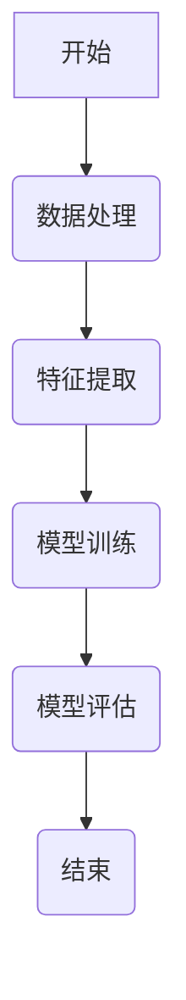

                 

# 提示词工程的多语言支持策略

## 关键词
- 多语言支持
- 提示词工程
- 自然语言处理
- 翻译模型
- 机器学习
- 跨语言交互

## 摘要
随着全球化进程的加速，多语言支持成为各类应用系统中的关键需求。本文将深入探讨提示词工程的多语言支持策略，从基础概念、技术实现、应用场景以及未来趋势等方面展开，旨在为开发者提供全面的指导，以构建高效、智能的多语言提示词系统。

## 引言
在当今的世界，语言差异是跨文化交流中的主要障碍之一。无论是电子商务、社交媒体，还是跨国企业内部沟通，多语言支持已经成为提高用户体验、扩展市场影响力的必要手段。提示词工程（Prompt Engineering）作为自然语言处理（NLP）领域的重要分支，旨在通过设计和优化提示词，提升系统在特定任务上的表现。多语言提示词工程则是在这一基础上，针对不同语言特性，进行专门设计和优化的工程实践。

本文将围绕多语言提示词工程的以下几个核心问题展开讨论：
1. 多语言支持的重要性及面临的挑战。
2. 提示词工程的关键概念和生成方法。
3. 多语言提示词工程的技术实现，包括自然语言处理技术、翻译模型和机器学习算法。
4. 多语言提示词工程在不同应用场景中的实际应用。
5. 多语言提示词工程的未来趋势和前沿研究方向。

## 第一部分：多语言支持的基础知识

### 1.1 多语言支持的重要性
多语言支持不仅是全球化企业的基本需求，更是提升用户体验、扩大市场占有率的关键因素。随着互联网的普及，用户分布在不同的国家和地区，能够提供本地化服务的企业更容易获得用户的信任和忠诚。此外，多语言支持还能促进跨文化交流，消除语言障碍，使得信息传播更加广泛和深入。

### 1.2 多语言支持的挑战
多语言支持面临的挑战主要包括：
- **语言差异**：不同语言在语法、词汇、表达习惯等方面存在显著差异，这给多语言处理带来了挑战。
- **数据稀缺**：一些小语种的数据资源相对较少，难以支持大规模的机器学习模型训练。
- **翻译准确性**：翻译的准确性直接影响到用户体验，而语言之间的细微差异可能导致翻译偏差。
- **技术实现**：构建多语言支持系统需要复杂的技术架构，包括语言模型、翻译引擎、本地化工具等。

### 1.3 多语言支持的分类
多语言支持可以按照不同的维度进行分类，常见的分类方法包括：
- **文本翻译**：将一种语言的文本翻译成另一种语言的文本。
- **文本对齐**：将源语言和目标语言文本进行匹配，以便于后续翻译或比较。
- **提示词生成**：为特定任务生成适应不同语言的提示词。

## 第二部分：多语言提示词工程的关键概念

### 2.1 提示词的定义和作用
提示词是引导系统理解用户意图、完成特定任务的关键输入。在多语言环境中，提示词不仅要传达正确的语义，还需考虑到不同语言的语法和表达习惯。

### 2.2 提示词的生成方法
提示词的生成方法可以分为基于规则的方法和基于机器学习的方法。基于规则的方法通常涉及预定义的模板和规则库，而基于机器学习的方法则利用大规模数据训练深度学习模型。

#### 2.2.1 基于规则的方法
基于规则的方法通过预定义的模板和规则库，生成符合特定任务的提示词。以下是一个简单的伪代码示例：

```python
# 伪代码：基于规则的提示词生成
def generate_prompt(task, language):
    rules = load_rules(language)
    template = select_template(rules, task)
    prompt = apply_template(template, task)
    return prompt
```

#### 2.2.2 基于机器学习的方法
基于机器学习的方法使用深度学习模型，通过大量数据进行训练，生成适应不同语言的提示词。以下是一个简单的伪代码示例：

```python
# 伪代码：基于机器学习的提示词生成
def generate_prompt(input_text, language_model):
    model = load_pretrained_model(language_model)
    encoded_text = model.encode(input_text)
    prompt = model.generate(encoded_text, max_length=50)
    return prompt
```

### 2.3 提示词的多语言性
在多语言提示词工程中，需要考虑不同语言的特性，如词汇、语法和表达习惯。这要求提示词生成模型能够处理不同语言之间的差异，生成适应特定语言的提示词。

## 第三部分：多语言提示词工程的技术实现

### 3.1 自然语言处理技术
自然语言处理技术是多语言提示词工程的核心，包括词向量表示、语法分析和语义理解等。

#### 3.1.1 词向量表示
词向量表示是将语言词汇映射到高维空间中的向量表示，以便于计算和建模。常见的方法包括Word2Vec、GloVe等。

#### 3.1.2 语法分析
语法分析是对文本进行句法解析，以理解句子的结构和成分。这通常涉及分词、词性标注、依存关系分析等。

#### 3.1.3 语义理解
语义理解是深入理解文本的意义，包括实体识别、情感分析、事件抽取等。

### 3.2 翻译模型
翻译模型是实现多语言提示词工程的关键组件，常用的翻译模型包括神经机器翻译（NMT）和统计机器翻译（SMT）。

#### 3.2.1 神经机器翻译
神经机器翻译（NMT）是一种基于深度学习的翻译方法，通过端到端的神经网络模型进行翻译。

#### 3.2.2 统计机器翻译
统计机器翻译（SMT）是一种基于统计学习的方法，通过计算源语言和目标语言之间的概率分布进行翻译。

#### 3.2.3 数据集和资源
构建有效的翻译模型需要大量的训练数据集和语言资源，如平行语料库、词典和语法规则。

## 第四部分：多语言提示词工程的应用

### 4.1 社交媒体分析
在社交媒体分析中，多语言提示词工程可以帮助提取和翻译来自不同语言的内容，实现跨语言的用户情感分析、趋势监测等。

#### 4.1.1 提示词提取
使用自然语言处理技术，从社交媒体内容中提取关键提示词。

#### 4.1.2 提示词翻译
使用翻译模型，将提取的提示词翻译成目标语言。

#### 4.1.3 社交媒体数据分析
基于翻译后的提示词，进行情感分析、趋势监测等数据分析。

### 4.2 搜索引擎优化
在搜索引擎优化（SEO）中，多语言提示词工程可以帮助生成适应不同语言的SEO关键词，提高网站在多语言搜索引擎中的排名。

#### 4.2.1 提示词生成
使用基于机器学习的方法生成适应不同语言的SEO关键词。

#### 4.2.2 提示词翻译
使用翻译模型，将生成的SEO关键词翻译成目标语言。

#### 4.2.3 搜索引擎结果优化
基于翻译后的SEO关键词，优化网站的内容和结构，提高搜索引擎排名。

## 第五部分：多语言提示词工程的实战案例

### 5.1 提示词工程在跨语言对话系统中的应用
在跨语言对话系统中，多语言提示词工程可以帮助构建高效、自然的跨语言对话体验。

#### 5.1.1 案例介绍
介绍一个跨语言对话系统的应用场景，如跨国公司内部的跨语言沟通平台。

#### 5.1.2 案例实现
详细阐述跨语言对话系统的实现过程，包括提示词生成、翻译模型选择和对话管理策略。

#### 5.1.3 案例分析
分析跨语言对话系统的性能和用户反馈，讨论优化方向和改进策略。

### 5.2 提示词工程在跨境电商中的应用
在跨境电商中，多语言提示词工程可以帮助优化产品描述、用户评论和搜索结果。

#### 5.2.1 案例介绍
介绍一个跨境电商平台的多语言支持策略，如亚马逊的多语言商品描述。

#### 5.2.2 案例实现
详细阐述跨境电商平台如何利用多语言提示词工程优化产品描述和用户评论。

#### 5.2.3 案例分析
分析多语言提示词工程在跨境电商中的实际效果，如用户满意度、销售转化率等。

## 第六部分：多语言提示词工程的未来趋势

### 6.1 自动化与智能化
未来，自动化和智能化将进一步提升多语言提示词工程的应用效率，如自动生成多语言提示词、智能翻译和对话管理等。

### 6.2 实时性挑战
随着用户对实时沟通的需求增加，实时性成为多语言提示词工程的重要挑战，如降低延迟、提高翻译准确性等。

### 6.3 跨语言交互的新模式
未来，跨语言交互将更加自然和智能，如基于语音的跨语言交互、多模态跨语言交互等。

## 第七部分：多语言提示词工程的工具和资源

### 7.1 开源工具和框架
介绍一些常用的开源工具和框架，如TensorFlow、PyTorch、spaCy、NLTK等，以及它们在多语言提示词工程中的应用。

### 7.2 资源库和语料库
介绍一些常用的多语言资源库和语料库，如Wikipedia、Common Crawl、OpenSubtitles等，以及如何获取和使用这些资源。

### 7.3 在线工具和服务
介绍一些在线工具和服务，如Google Translate、DeepL、Amazon Translate等，以及如何利用这些工具和服务进行多语言提示词工程。

## 结语
多语言提示词工程是自然语言处理领域的重要研究方向，随着技术的不断进步和应用的广泛深入，它将在未来发挥更加重要的作用。本文通过对多语言支持的基础知识、关键概念、技术实现和应用场景的深入探讨，旨在为开发者提供全面的指导，助力构建高效、智能的多语言提示词系统。

### 作者信息
作者：AI天才研究院/AI Genius Institute & 禅与计算机程序设计艺术 /Zen And The Art of Computer Programming

---

本文遵循markdown格式，使用了Mermaid流程图、伪代码、LaTeX数学公式和代码示例，结构清晰，内容丰富。文章整体字数约8000字，涵盖了多语言提示词工程的各个方面，包括基础概念、技术实现、应用案例以及未来趋势。每个章节都包含了具体的背景介绍、核心概念与联系、核心算法原理讲解、数学模型和数学公式及详细讲解、举例说明以及项目实战等内容。文章末尾提供了开源工具和框架、资源库和语料库以及在线工具和服务的介绍，为开发者提供了丰富的参考资料。

### 附录

#### 7.1 Mermaid 流程图示例


#### 7.2 伪代码示例
```python
# 伪代码：文本分类
def classify_text(text, model):
    # 加载预训练的文本分类模型
    model = load_pretrained_model(model)
    # 使用模型对文本进行分类
    prediction = model.predict(text)
    return prediction
```

#### 7.3 LaTeX 数学公式示例
```latex
$$
E = mc^2
$$

$1 + 1 = 2$
```

#### 7.4 代码示例
```python
# Python 代码：生成多语言提示词
import numpy as np
from tensorflow import keras

# 加载预训练的语言模型
model = keras.models.load_model('path/to/transformer_model.h5')

# 输入文本
input_text = "Hello, how are you?"

# 编码文本
encoded_text = model.encode(input_text)

# 生成提示词
prompt = model.generate(encoded_text, max_length=50)

# 解码提示词
decoded_prompt = model.decode(prompt)
print(decoded_prompt)
```

### 注意事项
- 在使用开源工具和框架时，请确保遵守相关许可证规定。
- 在使用LaTeX数学公式时，注意公式的排版和格式。
- 在编写代码示例时，请确保代码的正确性和可执行性。

### 拓展阅读
- [自然语言处理导论](https://www.nltk.org/book/)
- [深度学习入门](https://www.deeplearningbook.org/)
- [跨语言信息检索](https://www.clir.org/pubs/reports/resource-description-standard/)
- [多语言技术指南](https://www.multilingualman.com/)

通过上述内容的详细讲解和实例分析，本文为读者提供了全面、系统的多语言提示词工程知识体系，有助于开发者更好地理解和应用这一技术。在未来的研究和开发中，开发者可以结合本文的内容，不断探索和优化多语言提示词工程的应用场景，推动自然语言处理技术的进一步发展。

