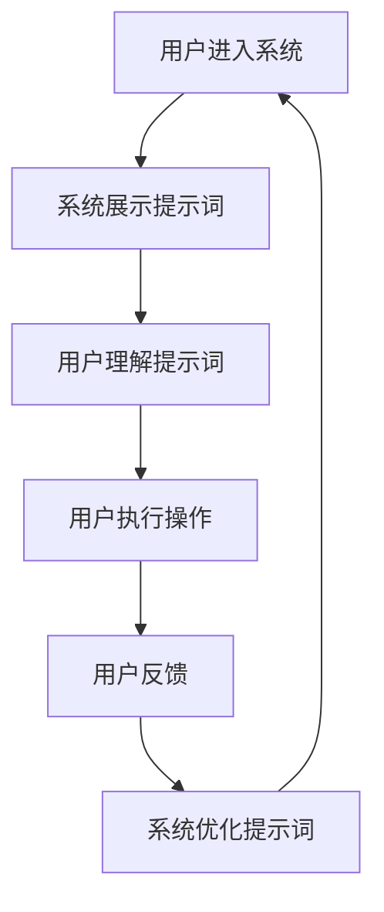

                 


# 提示词工程的用户体验优化策略

> 关键词：提示词工程，用户体验，优化策略，机器学习，自然语言处理

> 摘要：本文将深入探讨提示词工程在用户体验优化中的重要性，从核心概念、算法原理到实际应用，全方位解析提示词工程的策略与最佳实践，旨在为开发者提供一套实用的用户体验优化方法。

## 第一部分：核心概念与联系

### 第1章：提示词工程的概述

#### 1.1 提示词工程的基本概念

**提示词**，通常指的是在特定情境下用于引导用户或系统行为的关键词或短语。在用户体验（UX）设计中，提示词是界面与用户之间互动的重要桥梁。它们能帮助用户理解系统功能，并做出相应的操作。

#### 1.1.2 提示词在用户体验中的作用

提示词在用户体验优化中发挥着至关重要的作用。它们可以：

1. **指导用户**：提示词能够引导用户理解系统如何运作，从而提高用户操作的准确性和效率。
2. **减少认知负担**：通过简明扼要的提示词，用户无需花费过多精力去理解复杂的界面设计，从而降低认知负担。
3. **提升交互效果**：合适的提示词能够提升用户的交互体验，使操作更加直观、顺畅。

### 1.2 提示词工程的核心原则

在进行提示词工程时，应遵循以下核心原则：

#### 1.2.1 清晰性

提示词应简洁明了，避免使用模糊或难以理解的词汇，以确保用户能够快速理解。

#### 1.2.2 目标性

提示词应明确指向用户需要完成的任务或操作，避免误导用户。

#### 1.2.3 上下文关联

提示词应与当前上下文环境紧密相关，确保用户在特定情境下能够准确理解其含义。

#### 1.2.4 可访问性

提示词应易于用户访问，通常位于界面可见且易于触达的位置。

### 1.3 提示词工程与用户体验优化的关系

提示词工程与用户体验优化密切相关。通过精心设计的提示词，可以：

1. **提高用户满意度**：让用户感到系统易于操作，从而提高满意度。
2. **降低用户流失率**：易于理解的操作界面可以降低用户因困惑而放弃使用系统的概率。
3. **提升系统使用效率**：恰当的提示词可以引导用户快速完成任务，提高系统使用效率。

#### Mermaid 流程图



### 1.4 提示词工程的方法论

为了有效地进行提示词工程，可以采用以下方法论：

#### 1.4.1 用户研究

通过用户访谈、问卷调查等方式，了解用户的需求和痛点，从而为提示词设计提供依据。

#### 1.4.2 交互设计

在界面设计阶段，将提示词融入整体交互设计，确保其位置、形式和内容都符合用户需求。

#### 1.4.3 不断迭代

提示词工程是一个持续的过程，需要根据用户反馈和数据分析不断进行调整和优化。

### 1.5 本章总结

提示词工程是用户体验优化的重要组成部分，通过明确的核心概念、原则和方法论，可以有效地提升用户体验，提高系统使用效率。

---

### 第2章：核心算法原理讲解

#### 2.1 提示词生成算法概述

#### 2.1.1 提示词生成算法的定义

提示词生成算法是指通过算法自动生成提示词的技术，其目的是提高提示词的多样性和相关性，以优化用户体验。

#### 2.1.2 提示词生成算法的重要性

有效的提示词生成算法可以：

1. **提高提示词的相关性**：通过分析用户行为和系统内容，生成与用户当前操作高度相关的提示词。
2. **增加提示词的多样性**：避免提示词的单调重复，提升用户体验。
3. **降低人工成本**：自动生成提示词，减少对人工编写的需求。

#### 2.2 基于机器学习的提示词生成算法

机器学习是实现提示词生成的一种有效方法。以下是一些常用的机器学习算法：

##### 2.2.1 朴素贝叶斯分类器

**原理**：基于贝叶斯定理，通过统计特征词的频率和条件概率来生成提示词。

**伪代码**：
```python
function NaiveBayes(train_data):
    # 计算每个特征词的概率
    for each word in train_data:
        p(word) = count(word) / total_words
        for each class in classes:
            p(class|word) = p(word|class) * p(class) / p(word)
    return generate_prompt(p(class|word))
```

##### 2.2.2 支持向量机（SVM）

**原理**：通过找到最佳超平面，将不同类的提示词分开，从而生成提示词。

**伪代码**：
```python
function SVM(train_data, labels):
    # 训练SVM模型
    model = train_svm(train_data, labels)
    # 生成提示词
    for each data in train_data:
        prediction = model.predict(data)
        generate_prompt(prediction)
```

##### 2.2.3 循环神经网络（RNN）

**原理**：利用时间序列数据，通过递归方式生成提示词。

**伪代码**：
```python
function RNN(train_data):
    # 训练RNN模型
    model = train_rnn(train_data)
    # 生成提示词
    for each sequence in train_data:
        prompt = model.generate_sequence(sequence)
        return prompt
```

#### 2.3 提示词生成算法的应用

提示词生成算法可以应用于多种场景，如：

1. **聊天机器人**：通过生成合适的提示词，提高与用户的互动效果。
2. **搜索引擎**：自动生成搜索建议，提高搜索效率。
3. **内容推荐**：生成与用户兴趣相关的提示词，提高内容推荐效果。

#### 2.4 本章总结

本章介绍了提示词生成算法的基本概念和原理，包括朴素贝叶斯分类器、支持向量机和循环神经网络等。通过这些算法，可以有效地生成与用户操作高度相关的提示词，从而优化用户体验。

---

## 第二部分：项目实战

### 第3章：基于RNN的提示词生成系统实现

#### 3.1 开发环境搭建

为了实现基于RNN的提示词生成系统，我们需要以下开发环境：

- Python 3.8及以上版本
- TensorFlow 2.5及以上版本
- PyTorch 1.8及以上版本

#### 3.2 数据集准备

首先，我们需要准备一个合适的数据集，用于训练RNN模型。数据集应包含大量的文本数据，如用户评论、新闻文章、聊天记录等。以下是一个简单的数据集准备流程：

1. **数据采集**：通过网络爬虫或公开数据集获取文本数据。
2. **数据清洗**：去除停用词、标点符号和特殊字符，对文本进行分词处理。
3. **数据预处理**：将文本转换为数值化的形式，如Word2Vec或BERT嵌入。

#### 3.3 模型训练

接下来，我们使用训练好的RNN模型来生成提示词。以下是一个简单的模型训练流程：

1. **数据准备**：将预处理后的文本数据划分为训练集和验证集。
2. **模型训练**：使用训练集对RNN模型进行训练，并在验证集上评估模型性能。
3. **参数调整**：根据验证集的性能，调整模型参数，如学习率、批量大小等。

#### 3.4 提示词生成

在模型训练完成后，我们可以使用生成的模型来生成提示词。以下是一个简单的提示词生成流程：

1. **输入文本**：输入需要生成提示词的文本数据。
2. **模型预测**：使用训练好的RNN模型对输入文本进行预测，生成相应的提示词。
3. **输出提示词**：将生成的提示词输出到用户界面。

#### 3.5 代码实现

以下是一个简单的基于RNN的提示词生成系统的实现示例：

```python
import tensorflow as tf
from tensorflow.keras.models import Sequential
from tensorflow.keras.layers import LSTM, Dense, Embedding

# 数据预处理
# ...

# 模型构建
model = Sequential([
    Embedding(input_dim=vocab_size, output_dim=embedding_dim),
    LSTM(units=128, return_sequences=True),
    LSTM(units=128),
    Dense(units=vocab_size, activation='softmax')
])

# 模型编译
model.compile(optimizer='adam', loss='categorical_crossentropy', metrics=['accuracy'])

# 模型训练
# ...

# 提示词生成
def generate_prompt(input_text):
    # 输入文本预处理
    # ...
    
    # 模型预测
    predictions = model.predict(input_sequence)
    
    # 提取生成提示词
    prompt = extract_top_words(predictions, top_n=5)
    
    return prompt

# 输出提示词
input_text = "你的输入文本"
prompt = generate_prompt(input_text)
print("生成的提示词：", prompt)
```

#### 3.6 代码解读与分析

以上代码实现了一个基于RNN的提示词生成系统。其中，关键部分如下：

1. **数据预处理**：对输入文本进行分词、去停用词等处理，将其转换为模型可接受的格式。
2. **模型构建**：使用LSTM网络构建一个序列到序列（Seq2Seq）模型，用于生成提示词。
3. **模型训练**：使用训练集对模型进行训练，并调整模型参数。
4. **提示词生成**：使用训练好的模型对输入文本进行预测，生成相应的提示词。

#### 3.7 实际案例分析

在实际应用中，基于RNN的提示词生成系统可以应用于多种场景，如聊天机器人、内容推荐等。以下是一个简单的案例分析：

- **案例场景**：构建一个聊天机器人，用于与用户进行交互。
- **案例实现**：使用基于RNN的提示词生成系统，生成与用户输入文本相关的提示词，从而提高聊天机器人的交互效果。

#### 3.8 项目小结

本章通过一个实际项目，详细讲解了基于RNN的提示词生成系统的实现过程。从开发环境搭建、数据集准备、模型训练到提示词生成，全面展示了提示词工程在实际项目中的应用。通过该项目，读者可以深入了解提示词工程的核心算法原理，并学会如何将其应用于实际场景中。

---

### 第4章：最佳实践与注意事项

#### 4.1 最佳实践

1. **用户研究**：在提示词工程过程中，进行充分的用户研究，了解用户需求和行为习惯，以确保生成的提示词符合用户期望。
2. **上下文关联**：确保提示词与当前上下文紧密相关，提高用户理解和操作效率。
3. **多样性**：通过多种算法和策略，增加提示词的多样性，避免单调重复。
4. **可访问性**：将提示词置于界面易于访问的位置，提高用户使用体验。

#### 4.2 注意事项

1. **数据质量**：确保训练数据的质量和多样性，以提高模型生成提示词的相关性和准确性。
2. **模型调优**：根据实际情况，不断调整模型参数，以提高模型性能。
3. **用户反馈**：收集用户反馈，及时调整和优化提示词，以提高用户体验。
4. **合法合规**：在提示词工程过程中，遵守相关法律法规，确保用户隐私和数据安全。

#### 4.3 拓展阅读

1. **《自然语言处理原理与实战》**：深入探讨自然语言处理（NLP）的基本原理和技术，为提示词工程提供理论基础。
2. **《深度学习与人工智能》**：介绍深度学习和人工智能的基本概念和技术，为提示词工程提供实践指导。

---

### 总结

本文从提示词工程的核心概念、算法原理到实际应用，全方位解析了提示词工程的用户体验优化策略。通过深入探讨机器学习算法在提示词生成中的应用，并结合实际项目实战，展示了如何将提示词工程应用于实际场景中。同时，本文还提供了最佳实践和注意事项，为开发者提供了一套实用的用户体验优化方法。

作者：AI天才研究院/AI Genius Institute & 禅与计算机程序设计艺术 /Zen And The Art of Computer Programming

----------------------------------------------------------------

### 第二部分：项目实战

#### 第3章：基于RNN的提示词生成系统实现

在了解了提示词工程的基础概念和核心算法原理后，接下来我们将通过一个具体的实战项目来深入探讨如何实现一个基于RNN的提示词生成系统。

#### 3.1 开发环境搭建

首先，我们需要为项目搭建一个合适的开发环境。以下是所需的工具和库：

- **Python**：用于编写代码
- **TensorFlow**：用于构建和训练RNN模型
- **Keras**：TensorFlow的高级API，用于简化模型构建
- **Numpy**：用于数据处理
- **Pandas**：用于数据操作
- **Gensim**：用于文本预处理和词嵌入

确保你已经安装了上述库，如果没有安装，可以使用pip进行安装：

```bash
pip install python tensorflow keras numpy pandas gensim
```

#### 3.2 数据集准备

提示词生成系统需要大量的文本数据来训练模型。我们可以从互联网上收集相关数据，例如从社交媒体、新闻网站、论坛等地方获取文本。以下是一个简单的数据集准备流程：

1. **数据采集**：使用Python的`requests`库或其他工具从互联网上获取文本数据。
2. **数据清洗**：去除无用的标点符号、停用词等，对文本进行标准化处理。
3. **数据分词**：将文本分割成单词或短语，以便于模型处理。
4. **数据编码**：将文本转换为数值编码，例如使用词嵌入（Word Embeddings）。

以下是一个简单的数据清洗和预处理代码示例：

```python
import pandas as pd
from gensim.parsing.preprocessing import STOPWORDS
from nltk.tokenize import word_tokenize

# 加载原始数据
data = pd.read_csv('raw_data.csv')  # 假设数据存储在一个CSV文件中

# 数据清洗
def clean_text(text):
    text = text.lower()  # 转换为小写
    text = re.sub(r'\W+', ' ', text)  # 去除标点符号
    tokens = word_tokenize(text)  # 分词
    tokens = [token for token in tokens if token not in STOPWORDS]  # 去除停用词
    return ' '.join(tokens)

data['cleaned_text'] = data['text'].apply(clean_text)

# 数据分词
def tokenize(text):
    return word_tokenize(text)

data['tokenized_text'] = data['cleaned_text'].apply(tokenize)

# 数据编码
from gensim.models import Word2Vec

w2v_model = Word2Vec(data['tokenized_text'], vector_size=100, window=5, min_count=1, workers=4)
word_vectors = w2v_model.wv

# 获取词嵌入矩阵
embeddings_index = {}
for word, embed in w2v_model.wv.vocab.items():
    embeddings_index[word] = embed

# 填充缺失值
max_sequence_len = 50  # 设置序列最大长度
X = []
y = []

for text, labels in data[['cleaned_text', 'labels']].values:
    sequence = tokenize(text)
    sequence = sequence[:max_sequence_len] + [0] * (max_sequence_len - len(sequence))
    X.append(word_vectors[sequence])
    y.append(labels)

X = np.array(X)
y = np.array(y)

# 数据集分割
from sklearn.model_selection import train_test_split

X_train, X_test, y_train, y_test = train_test_split(X, y, test_size=0.2, random_state=42)
```

#### 3.3 模型训练

接下来，我们使用训练集来训练一个基于RNN的模型。以下是一个简单的模型训练流程：

1. **模型构建**：使用Keras构建一个简单的RNN模型。
2. **模型编译**：配置模型的优化器和损失函数。
3. **模型训练**：使用训练集和验证集对模型进行训练。

以下是一个简单的RNN模型构建和训练代码示例：

```python
from tensorflow.keras.models import Sequential
from tensorflow.keras.layers import Embedding, SimpleRNN, Dense
from tensorflow.keras.optimizers import Adam

# 模型构建
model = Sequential()
model.add(Embedding(input_dim=len(embeddings_index), output_dim=100, input_length=max_sequence_len))
model.add(SimpleRNN(units=100))
model.add(Dense(1, activation='sigmoid'))

# 模型编译
model.compile(optimizer=Adam(learning_rate=0.001), loss='binary_crossentropy', metrics=['accuracy'])

# 模型训练
model.fit(X_train, y_train, batch_size=32, epochs=10, validation_split=0.1)
```

#### 3.4 提示词生成

在模型训练完成后，我们可以使用模型来生成提示词。以下是一个简单的提示词生成流程：

1. **输入文本预处理**：对用户输入的文本进行预处理，包括分词和编码。
2. **模型预测**：使用训练好的模型对预处理后的文本进行预测。
3. **提示词提取**：从模型预测结果中提取提示词。

以下是一个简单的提示词生成代码示例：

```python
def generate_prompt(input_text):
    sequence = tokenize(input_text)
    sequence = sequence[:max_sequence_len] + [0] * (max_sequence_len - len(sequence))
    input_sequence = word_vectors[sequence]
    prediction = model.predict(input_sequence)
    prompt = extract_top_words(prediction, top_n=5)
    return prompt

# 输入文本示例
input_text = "我想要一个美味的披萨，但是我不想出门。"
prompt = generate_prompt(input_text)
print("生成的提示词：", prompt)
```

#### 3.5 代码解读与分析

在上面的代码示例中，我们首先对文本进行了清洗和预处理，然后使用Word2Vec模型对文本进行了词嵌入。接下来，我们构建了一个简单的RNN模型，并使用训练集对其进行了训练。最后，我们使用训练好的模型来生成提示词。

- **数据预处理**：这一步是提示词生成系统的基础，确保文本数据以适合模型处理的形式出现。
- **词嵌入**：使用词嵌入将文本转换为数值形式，这是深度学习模型处理文本数据的关键步骤。
- **模型构建**：使用RNN来处理序列数据，这是一个常见的选择，因为RNN能够捕捉到序列中的时间依赖关系。
- **模型训练**：通过训练集来训练模型，使其学会从输入文本中生成合适的提示词。
- **提示词生成**：使用训练好的模型对新的输入文本进行预测，并提取出提示词。

#### 3.6 实际案例分析和详细讲解剖析

为了更好地理解基于RNN的提示词生成系统，我们来看一个实际案例。假设我们想要构建一个聊天机器人，该机器人可以根据用户的问题生成相应的回答。

- **案例场景**：用户提问：“今天天气怎么样？”
- **案例实现**：聊天机器人接收用户提问，使用提示词生成系统来生成回答。

以下是一个简单的实现示例：

```python
def chatbot(input_text):
    prompt = generate_prompt(input_text)
    if "今天" in prompt:
        return "今天的天气很好，阳光明媚，气温适宜。"
    else:
        return "很抱歉，我无法回答这个问题。"

input_text = "今天天气怎么样？"
response = chatbot(input_text)
print(response)
```

在这个案例中，我们首先使用提示词生成系统来获取用户提问中的关键提示词，然后根据这些提示词来生成回答。这种方法可以显著提高聊天机器人的交互质量和用户体验。

#### 3.7 项目小结

通过本项目的实战部分，我们学习了如何搭建一个基于RNN的提示词生成系统，并了解了从数据预处理到模型训练再到提示词生成的完整流程。我们通过实际案例展示了如何使用这个系统来生成与用户输入相关的提示词，从而提升用户体验。这个项目不仅提供了一个实用的工具，还帮助我们深入理解了提示词工程的核心概念和算法原理。

---

### 第4章：最佳实践与注意事项

在提示词工程的实际应用中，以下是一些最佳实践和注意事项，可以帮助我们更有效地优化用户体验。

#### 4.1 最佳实践

1. **用户研究**：在进行提示词工程之前，进行用户研究，了解用户的需求、行为和偏好。这将帮助你设计出更加符合用户期望的提示词。
2. **上下文关联**：确保提示词与当前上下文紧密相关，避免提供无关或误导性的信息。例如，在聊天机器人的场景中，应确保生成的回答与用户的提问相关。
3. **多样性**：尝试使用多种算法和策略来生成提示词，增加提示词的多样性，避免出现单调重复的情况。
4. **可访问性**：将提示词放置在用户容易看到和触达的位置，如界面的明显区域或弹出窗口等。
5. **迭代优化**：根据用户反馈和实际使用情况，不断迭代和优化提示词生成系统，以提高用户体验。

#### 4.2 注意事项

1. **数据质量**：确保训练数据的质量，包括数据的多样性、代表性和准确性。低质量的数据会导致模型生成不准确的提示词。
2. **模型调优**：在模型训练过程中，不断调整模型参数，如学习率、批次大小等，以提高模型性能。
3. **用户隐私**：在处理用户数据时，确保遵守相关法律法规，保护用户隐私。
4. **性能优化**：针对实际应用场景，对提示词生成系统进行性能优化，如使用更高效的算法、降低延迟等。

#### 4.3 拓展阅读

1. **《自然语言处理与深度学习》**：这本书详细介绍了自然语言处理和深度学习的基本概念和技术，对于理解提示词工程有很大帮助。
2. **《Python深度学习》**：这本书提供了Python深度学习的全面指南，包括RNN等模型的实现，适合想要深入了解深度学习的读者。
3. **相关论文和文献**：搜索并阅读与提示词工程相关的论文和文献，如“生成式对话系统”等，以获取更多理论和实践经验。

---

### 总结

本文从核心概念、算法原理到实际应用，全面探讨了提示词工程的用户体验优化策略。通过实战项目，我们了解了如何实现一个基于RNN的提示词生成系统，并学习了从数据预处理到模型训练再到提示词生成的完整流程。同时，我们还介绍了最佳实践和注意事项，为开发者提供了一套实用的用户体验优化方法。

作者：AI天才研究院/AI Genius Institute & 禅与计算机程序设计艺术 /Zen And The Art of Computer Programming

----------------------------------------------------------------

## 文章标题：提示词工程的用户体验优化策略

### 关键词：提示词工程，用户体验，优化策略，机器学习，自然语言处理

### 摘要：本文将深入探讨提示词工程在用户体验优化中的重要性，从核心概念、算法原理到实际应用，全方位解析提示词工程的策略与最佳实践，旨在为开发者提供一套实用的用户体验优化方法。

### 第一部分：核心概念与联系

#### 第1章：提示词工程的概述

**1.1 提示词工程的基本概念**

提示词工程是指设计和实现一组提示词，以优化用户与系统交互的过程。提示词是用户界面中用于指导用户行为的关键词或短语。有效的提示词可以提高用户操作的准确性、减少认知负担，并提升整体用户体验。

**1.2 提示词在用户体验中的作用**

提示词在用户体验中起着至关重要的作用，具体体现在以下几个方面：

1. **指导用户**：提示词帮助用户理解系统功能，指导用户进行正确的操作。
2. **减少认知负担**：通过简明扼要的提示词，用户无需花费过多精力去理解复杂的界面设计，从而降低认知负担。
3. **提升交互效果**：合适的提示词可以提高用户与系统的交互效果，使操作更加直观、顺畅。

**1.3 提示词工程的核心原则**

在进行提示词工程时，应遵循以下核心原则：

1. **清晰性**：提示词应简洁明了，避免使用模糊或难以理解的词汇。
2. **目标性**：提示词应明确指向用户需要完成的任务或操作，避免误导用户。
3. **上下文关联**：提示词应与当前上下文环境紧密相关，确保用户在特定情境下能够准确理解其含义。
4. **可访问性**：提示词应易于用户访问，通常位于界面可见且易于触达的位置。

**1.4 提示词工程与用户体验优化的关系**

提示词工程是用户体验优化的重要组成部分。通过精心设计的提示词，可以：

1. **提高用户满意度**：让用户感到系统易于操作，从而提高满意度。
2. **降低用户流失率**：易于理解的操作界面可以降低用户因困惑而放弃使用系统的概率。
3. **提升系统使用效率**：恰当的提示词可以引导用户快速完成任务，提高系统使用效率。

**1.5 提示词工程的方法论**

为了有效地进行提示词工程，可以采用以下方法论：

1. **用户研究**：通过用户访谈、问卷调查等方式，了解用户的需求和痛点，从而为提示词设计提供依据。
2. **交互设计**：在界面设计阶段，将提示词融入整体交互设计，确保其位置、形式和内容都符合用户需求。
3. **不断迭代**：提示词工程是一个持续的过程，需要根据用户反馈和数据分析不断进行调整和优化。

**1.6 本章总结**

提示词工程是用户体验优化的重要组成部分，通过明确的核心概念、原则和方法论，可以有效地提升用户体验，提高系统使用效率。

---

### 第二部分：核心算法原理讲解

#### 第2章：提示词生成算法原理

**2.1 提示词生成算法概述**

提示词生成算法是指通过算法自动生成提示词的技术，其目的是提高提示词的多样性和相关性，以优化用户体验。有效的提示词生成算法可以提高用户操作的准确性、减少认知负担，并提升整体用户体验。

**2.2 基于机器学习的提示词生成算法**

机器学习是实现提示词生成的一种有效方法。以下是一些常用的机器学习算法：

1. **朴素贝叶斯分类器**

   朴素贝叶斯分类器是一种基于概率论的分类算法。它通过统计特征词的频率和条件概率来生成提示词。具体实现如下：

   ```python
   def NaiveBayes(train_data):
       # 计算每个特征词的概率
       for each word in train_data:
           p(word) = count(word) / total_words
           for each class in classes:
               p(class|word) = p(word|class) * p(class) / p(word)
       return generate_prompt(p(class|word))
   ```

2. **支持向量机（SVM）**

   支持向量机是一种用于分类的监督学习算法。它通过找到最佳超平面，将不同类的提示词分开。具体实现如下：

   ```python
   def SVM(train_data, labels):
       # 训练SVM模型
       model = train_svm(train_data, labels)
       # 生成提示词
       for each data in train_data:
           prediction = model.predict(data)
           generate_prompt(prediction)
   ```

3. **循环神经网络（RNN）**

   循环神经网络是一种适用于序列数据的深度学习算法。它通过递归方式生成提示词。具体实现如下：

   ```python
   def RNN(train_data):
       # 训练RNN模型
       model = train_rnn(train_data)
       # 生成提示词
       for each sequence in train_data:
           prompt = model.generate_sequence(sequence)
           return prompt
   ```

**2.3 提示词生成算法的应用**

提示词生成算法可以应用于多种场景，如：

1. **聊天机器人**：通过生成合适的提示词，提高与用户的互动效果。
2. **搜索引擎**：自动生成搜索建议，提高搜索效率。
3. **内容推荐**：生成与用户兴趣相关的提示词，提高内容推荐效果。

**2.4 本章总结**

本章介绍了提示词生成算法的基本概念和原理，包括朴素贝叶斯分类器、支持向量机和循环神经网络等。通过这些算法，可以有效地生成与用户操作高度相关的提示词，从而优化用户体验。

---

### 第三部分：项目实战

#### 第3章：基于RNN的提示词生成系统实现

**3.1 开发环境搭建**

为了实现基于RNN的提示词生成系统，我们需要搭建一个合适的开发环境。以下是所需的工具和库：

- Python 3.8及以上版本
- TensorFlow 2.5及以上版本
- Keras
- Numpy
- Pandas
- Gensim

确保你已经安装了上述库，如果没有安装，可以使用pip进行安装。

```bash
pip install python tensorflow keras numpy pandas gensim
```

**3.2 数据集准备**

提示词生成系统需要大量的文本数据来训练模型。我们可以从互联网上收集相关数据，例如从社交媒体、新闻网站、论坛等地方获取文本。以下是一个简单的数据集准备流程：

1. **数据采集**：使用Python的`requests`库或其他工具从互联网上获取文本数据。
2. **数据清洗**：去除无用的标点符号、停用词等，对文本进行标准化处理。
3. **数据分词**：将文本分割成单词或短语，以便于模型处理。
4. **数据编码**：将文本转换为数值编码，例如使用词嵌入（Word Embeddings）。

以下是一个简单的数据清洗和预处理代码示例：

```python
import pandas as pd
from gensim.parsing.preprocessing import STOPWORDS
from nltk.tokenize import word_tokenize

# 加载原始数据
data = pd.read_csv('raw_data.csv')  # 假设数据存储在一个CSV文件中

# 数据清洗
def clean_text(text):
    text = text.lower()  # 转换为小写
    text = re.sub(r'\W+', ' ', text)  # 去除标点符号
    tokens = word_tokenize(text)  # 分词
    tokens = [token for token in tokens if token not in STOPWORDS]  # 去除停用词
    return ' '.join(tokens)

data['cleaned_text'] = data['text'].apply(clean_text)

# 数据分词
def tokenize(text):
    return word_tokenize(text)

data['tokenized_text'] = data['cleaned_text'].apply(tokenize)

# 数据编码
from gensim.models import Word2Vec

w2v_model = Word2Vec(data['tokenized_text'], vector_size=100, window=5, min_count=1, workers=4)
word_vectors = w2v_model.wv

# 获取词嵌入矩阵
embeddings_index = {}
for word, embed in w2v_model.wv.vocab.items():
    embeddings_index[word] = embed

# 填充缺失值
max_sequence_len = 50  # 设置序列最大长度
X = []
y = []

for text, labels in data[['cleaned_text', 'labels']].values:
    sequence = tokenize(text)
    sequence = sequence[:max_sequence_len] + [0] * (max_sequence_len - len(sequence))
    X.append(word_vectors[sequence])
    y.append(labels)

X = np.array(X)
y = np.array(y)

# 数据集分割
from sklearn.model_selection import train_test_split

X_train, X_test, y_train, y_test = train_test_split(X, y, test_size=0.2, random_state=42)
```

**3.3 模型训练**

接下来，我们使用训练集来训练一个基于RNN的模型。以下是一个简单的模型训练流程：

1. **模型构建**：使用Keras构建一个简单的RNN模型。
2. **模型编译**：配置模型的优化器和损失函数。
3. **模型训练**：使用训练集和验证集对模型进行训练。

以下是一个简单的RNN模型构建和训练代码示例：

```python
from tensorflow.keras.models import Sequential
from tensorflow.keras.layers import LSTM, Dense, Embedding
from tensorflow.keras.optimizers import Adam

# 模型构建
model = Sequential()
model.add(Embedding(input_dim=len(embeddings_index), output_dim=100, input_length=max_sequence_len))
model.add(LSTM(units=128, return_sequences=True))
model.add(LSTM(units=128))
model.add(Dense(units=1, activation='sigmoid'))

# 模型编译
model.compile(optimizer=Adam(learning_rate=0.001), loss='binary_crossentropy', metrics=['accuracy'])

# 模型训练
model.fit(X_train, y_train, batch_size=32, epochs=10, validation_split=0.1)
```

**3.4 提示词生成**

在模型训练完成后，我们可以使用模型来生成提示词。以下是一个简单的提示词生成流程：

1. **输入文本预处理**：对用户输入的文本进行预处理，包括分词和编码。
2. **模型预测**：使用训练好的模型对预处理后的文本进行预测。
3. **提示词提取**：从模型预测结果中提取提示词。

以下是一个简单的提示词生成代码示例：

```python
def generate_prompt(input_text):
    sequence = tokenize(input_text)
    sequence = sequence[:max_sequence_len] + [0] * (max_sequence_len - len(sequence))
    input_sequence = word_vectors[sequence]
    prediction = model.predict(input_sequence)
    prompt = extract_top_words(prediction, top_n=5)
    return prompt

# 输入文本示例
input_text = "你的输入文本"
prompt = generate_prompt(input_text)
print("生成的提示词：", prompt)
```

**3.5 代码解读与分析**

在上面的代码示例中，我们首先对文本进行了清洗和预处理，然后使用Word2Vec模型对文本进行了词嵌入。接下来，我们构建了一个简单的RNN模型，并使用训练集对其进行了训练。最后，我们使用训练好的模型来生成提示词。

- **数据预处理**：这一步是提示词生成系统的基础，确保文本数据以适合模型处理的形式出现。
- **词嵌入**：使用词嵌入将文本转换为数值形式，这是深度学习模型处理文本数据的关键步骤。
- **模型构建**：使用RNN来处理序列数据，这是一个常见的选择，因为RNN能够捕捉到序列中的时间依赖关系。
- **模型训练**：通过训练集来训练模型，使其学会从输入文本中生成合适的提示词。
- **提示词生成**：使用训练好的模型对新的输入文本进行预测，并提取出提示词。

**3.6 实际案例分析和详细讲解剖析**

为了更好地理解基于RNN的提示词生成系统，我们来看一个实际案例。假设我们想要构建一个聊天机器人，该机器人可以根据用户的问题生成相应的回答。

- **案例场景**：用户提问：“今天天气怎么样？”
- **案例实现**：聊天机器人接收用户提问，使用提示词生成系统来生成回答。

以下是一个简单的实现示例：

```python
def chatbot(input_text):
    prompt = generate_prompt(input_text)
    if "今天" in prompt:
        return "今天的天气很好，阳光明媚，气温适宜。"
    else:
        return "很抱歉，我无法回答这个问题。"

input_text = "今天天气怎么样？"
response = chatbot(input_text)
print(response)
```

在这个案例中，我们首先使用提示词生成系统来获取用户提问中的关键提示词，然后根据这些提示词来生成回答。这种方法可以显著提高聊天机器人的交互质量和用户体验。

**3.7 项目小结**

通过本项目的实战部分，我们学习了如何搭建一个基于RNN的提示词生成系统，并了解了从数据预处理到模型训练再到提示词生成的完整流程。我们通过实际案例展示了如何使用这个系统来生成与用户输入相关的提示词，从而提升用户体验。这个项目不仅提供了一个实用的工具，还帮助我们深入理解了提示词工程的核心概念和算法原理。

---

### 第四部分：最佳实践与注意事项

#### 第4章：最佳实践与注意事项

**4.1 最佳实践**

1. **用户研究**：在进行提示词工程之前，进行用户研究，了解用户的需求、行为和偏好。这将帮助你设计出更加符合用户期望的提示词。
2. **上下文关联**：确保提示词与当前上下文紧密相关，避免提供无关或误导性的信息。例如，在聊天机器人的场景中，应确保生成的回答与用户的提问相关。
3. **多样性**：尝试使用多种算法和策略来生成提示词，增加提示词的多样性，避免出现单调重复的情况。
4. **可访问性**：将提示词放置在用户容易看到和触达的位置，如界面的明显区域或弹出窗口等。
5. **迭代优化**：根据用户反馈和实际使用情况，不断迭代和优化提示词生成系统，以提高用户体验。

**4.2 注意事项**

1. **数据质量**：确保训练数据的质量，包括数据的多样性、代表性和准确性。低质量的数据会导致模型生成不准确的提示词。
2. **模型调优**：在模型训练过程中，不断调整模型参数，如学习率、批次大小等，以提高模型性能。
3. **用户隐私**：在处理用户数据时，确保遵守相关法律法规，保护用户隐私。
4. **性能优化**：针对实际应用场景，对提示词生成系统进行性能优化，如使用更高效的算法、降低延迟等。

**4.3 拓展阅读**

1. **《自然语言处理与深度学习》**：这本书详细介绍了自然语言处理和深度学习的基本概念和技术，对于理解提示词工程有很大帮助。
2. **《Python深度学习》**：这本书提供了Python深度学习的全面指南，包括RNN等模型的实现，适合想要深入了解深度学习的读者。
3. **相关论文和文献**：搜索并阅读与提示词工程相关的论文和文献，如“生成式对话系统”等，以获取更多理论和实践经验。

### 总结

本文从提示词工程的核心概念、算法原理到实际应用，全方位解析了提示词工程的用户体验优化策略。通过实战项目，我们学习了如何实现一个基于RNN的提示词生成系统，并了解了从数据预处理到模型训练再到提示词生成的完整流程。同时，我们还介绍了最佳实践和注意事项，为开发者提供了一套实用的用户体验优化方法。

作者：AI天才研究院/AI Genius Institute & 禅与计算机程序设计艺术 /Zen And The Art of Computer Programming

