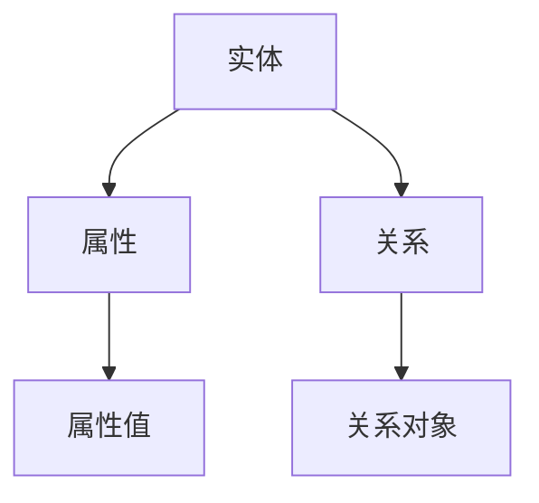
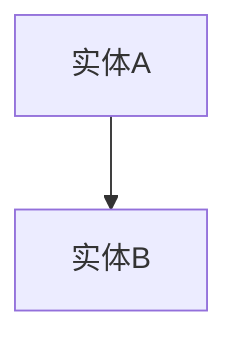

                 

### 文章标题

《提示词工程的知识图谱构建与应用》

### 关键词

知识图谱，提示词工程，构建方法，应用领域，数学模型，项目实战

### 摘要

本文旨在探讨知识图谱在提示词工程中的应用，从背景介绍、核心概念与联系、核心算法原理讲解、数学模型和数学公式，到项目实战，详细阐述了知识图谱的构建与应用。文章通过对知识图谱的基本概念、历史发展、构建技术、应用领域和实际项目案例的深入分析，为读者提供了全面的技术指导和应用思路。通过本文的学习，读者可以掌握知识图谱构建的核心技术和应用方法，为相关领域的研究和实践提供有力支持。

---

## 引言

在当今的信息时代，数据以惊人的速度增长，如何从海量数据中提取有用信息、构建知识体系，成为各个行业亟待解决的问题。知识图谱作为一种结构化的语义知识库，通过对实体、属性和关系的抽象和表示，提供了强大的语义理解和推理能力，广泛应用于搜索引擎、自然语言处理、推荐系统等多个领域。

提示词工程是知识图谱构建中的一个重要环节，它旨在通过提取和标注文本中的关键信息，为知识图谱的构建提供高质量的输入。本文将围绕知识图谱的构建与应用，特别是提示词工程的相关技术，进行深入探讨。

本文结构如下：首先，我们将对知识图谱的基本概念、历史发展、应用领域进行概述；接着，详细讲解知识图谱构建的核心算法原理和数学模型；随后，通过实际项目案例展示知识图谱的构建过程；最后，总结最佳实践，并提供拓展阅读资源。

通过本文的学习，读者将全面了解知识图谱构建的原理和方法，掌握提示词工程在知识图谱构建中的应用，为相关领域的研究和实践提供参考。

---

### 知识图谱概述

知识图谱（Knowledge Graph）是一种结构化的语义知识库，通过实体、属性和关系的抽象表示，将海量数据中的知识进行有机整合，实现数据的语义理解和推理。知识图谱起源于搜索引擎领域，由Google在2012年首次提出，并广泛应用于各种场景。

#### 基本概念

- **实体（Entity）**：表示现实世界中的个体，如人、地点、物品等。实体是知识图谱中的基本单元。
- **属性（Attribute）**：描述实体特征的属性，如人的年龄、地点的纬度等。属性连接实体和属性值。
- **关系（Relationship）**：表示实体之间的相互关系，如“居住于”、“属于”等。

#### 历史发展

知识图谱的发展经历了从无序数据到有序知识的转变。早期，搜索引擎主要依赖关键词匹配，而知识图谱的出现极大地提升了搜索的语义理解能力。随着技术的进步，知识图谱逐渐应用于更多的领域，如自然语言处理、推荐系统、智能问答等。

#### 应用领域

知识图谱的应用非常广泛，主要包括：

1. **搜索引擎**：通过知识图谱实现更加精确的搜索结果，提高用户体验。
2. **自然语言处理**：利用知识图谱进行实体识别、语义分析、情感分析等。
3. **推荐系统**：结合用户兴趣和知识图谱中的关系，提供个性化的推荐。
4. **智能问答**：通过知识图谱提供准确、高效的问答服务。

#### 核心概念与联系

为了更好地理解知识图谱，我们可以使用Mermaid流程图来展示核心概念之间的关系：



在上图中，实体、属性和关系构成了知识图谱的基本框架，通过这种结构化表示，知识图谱能够实现对复杂数据的语义理解和推理。

#### Mermaid流程图

以下是知识图谱核心概念关系的Mermaid流程图：


通过这种结构化的表示，我们可以清晰地看到实体、属性和关系之间的关联，为知识图谱的构建和应用提供了理论基础。

---

### 知识图谱构建技术

知识图谱的构建是一个复杂的过程，涉及多个关键步骤，包括数据采集与预处理、实体识别与抽取、关系抽取与建模等。下面我们将详细探讨这些核心算法原理，并通过伪代码和数学模型来解释它们的工作机制。

#### 数据采集与预处理

数据采集是知识图谱构建的第一步，旨在收集与目标领域相关的数据。数据来源可以包括公开数据集、网络爬虫、API调用等。数据采集完成后，需要进行预处理，以提高数据质量和可用性。

**预处理技术**：

1. **去重**：去除重复的数据条目，确保数据的唯一性。
2. **清洗**：修复数据中的错误和缺失值，提高数据的完整性。
3. **格式转换**：将数据统一转换为标准格式，如JSON、CSV等。

**伪代码**：

```python
def preprocess_data(data):
    # 去重
    unique_data = remove_duplicates(data)
    # 清洗
    cleaned_data = clean_data(unique_data)
    # 格式转换
    formatted_data = convert_format(cleaned_data)
    return formatted_data
```

#### 实体识别与抽取

实体识别与抽取是知识图谱构建的关键步骤，旨在从文本中提取出实体及其属性。常见的方法包括命名实体识别（NER）和关系抽取。

**命名实体识别（NER）**：

NER是一种自然语言处理技术，用于识别文本中的实体。常用的模型有条件随机场（CRF）、长短时记忆网络（LSTM）等。

**伪代码**：

```python
def named_entity_recognition(text):
    # 使用LSTM模型进行实体识别
    model = LSTM_Model()
    entities = model.predict(text)
    return entities
```

**关系抽取**：

关系抽取是从文本中提取实体之间的关系。常用的方法包括基于规则的方法、机器学习方法等。

**伪代码**：

```python
def relation_extraction(text, entities):
    # 基于规则的抽取方法
    relations = extract_relations_规则(text, entities)
    # 基于机器学习的方法
    relations = extract_relations_机器学习(text, entities)
    return relations
```

#### 关系抽取与建模

关系抽取完成后，需要对关系进行建模，以建立实体之间的关联。常用的关系建模方法包括图数据库、图神经网络等。

**图数据库**：

图数据库通过图结构来存储和管理数据，支持高效的图查询和计算。

**数学模型**：

假设实体A和实体B之间存在关系R，则可以使用图结构表示为G = (V, E)，其中V是节点集合，E是边集合。



**图神经网络（GNN）**：

图神经网络是一种用于图数据学习的深度学习模型，可以自动学习实体和关系之间的复杂关系。

**数学模型**：

$$
\mathbf{h}_v^{(t+1)} = \sigma(\sum_{u \in \mathcal{N}(v)} \mathbf{W}_{uv} \cdot \mathbf{h}_u^{(t)})
$$

其中，$\mathbf{h}_v^{(t)}$表示实体v在时间步t的节点表示，$\mathcal{N}(v)$表示与实体v相连的邻居节点集合，$\mathbf{W}_{uv}$是权重矩阵，$\sigma$是激活函数。

通过上述算法和模型，我们可以构建一个高质量的实体关系知识图谱，为后续的应用提供坚实基础。

---

### 数学模型和数学公式

知识图谱的构建过程涉及到多个数学模型和公式，这些模型和公式对于理解知识图谱的内在机制和应用方法至关重要。下面我们将详细讲解知识图谱构建过程中的关键数学模型和公式，并通过具体例子进行说明。

#### 1. 实体表示模型

实体表示模型是知识图谱构建中的基础，它通过将实体映射到高维向量空间，实现实体之间的相似性计算和关系建模。常用的实体表示模型有基于神经网络的表示学习模型，如TransE、TransH和TransR。

**TransE模型**：

TransE模型通过最小化损失函数来学习实体的高维表示。其公式如下：

$$
L = \sum_{(h, r, t) \in \mathcal{D}} \frac{1}{2} \max(0, \gamma - \Vert \mathbf{h}_h + \mathbf{r}_r - \mathbf{t}_t \Vert_2)
$$

其中，$\mathbf{h}_h$、$\mathbf{r}_r$和$\mathbf{t}_t$分别是头实体、关系和尾实体的高维表示向量，$\mathcal{D}$是训练数据集，$\gamma$是阈值。

**示例**：

假设我们有以下知识图谱中的三元组：

$$(\text{北京}, \text{是省会}, \text{河北})$$

通过TransE模型，我们可以得到以下向量表示：

$$
\mathbf{h}_{\text{北京}} + \mathbf{r}_{\text{是省会}} = \mathbf{t}_{\text{河北}}
$$

#### 2. 关系表示模型

关系表示模型用于学习关系的高维表示，实现实体间关系的建模。TransH模型是TransE模型的扩展，它通过引入偏置向量来提高模型的泛化能力。

**TransH模型**：

TransH模型通过最小化以下损失函数来学习实体和关系的高维表示：

$$
L = \sum_{(h, r, t) \in \mathcal{D}} \frac{1}{2} \max(0, \gamma - \Vert \mathbf{h}_h + \mathbf{r}_r + \mathbf{b}_r - \mathbf{t}_t \Vert_2)
$$

其中，$\mathbf{b}_r$是关系$r$的偏置向量。

**示例**：

假设我们有以下知识图谱中的三元组：

$$(\text{张三}, \text{是朋友}, \text{李四})$$

通过TransH模型，我们可以得到以下向量表示：

$$
\mathbf{h}_{\text{张三}} + \mathbf{r}_{\text{是朋友}} + \mathbf{b}_{\text{是朋友}} = \mathbf{t}_{\text{李四}}
$$

#### 3. 知识图谱推理模型

知识图谱推理模型用于利用已知事实推断新的知识。最常见的推理模型有规则推理和图神经网络（GNN）。

**规则推理**：

规则推理通过预定义的规则进行推理。例如，如果实体A有属性X，实体B有属性Y，且X与Y相关，则可以推断实体A与实体B之间的关系。

**示例**：

假设我们有以下规则：

- 如果实体A有属性“是人”，实体B有属性“是朋友”，则可以推断实体A与实体B是朋友。

通过规则推理，我们可以得到以下推断结果：

$$(\text{张三}, \text{是朋友}, \text{李四})$$

**图神经网络（GNN）**：

GNN是一种用于图数据学习的深度学习模型，它可以通过学习图中的节点表示来实现知识图谱的推理。

**数学模型**：

$$
\mathbf{h}_v^{(t+1)} = \sigma(\sum_{u \in \mathcal{N}(v)} \mathbf{W}_{uv} \cdot \mathbf{h}_u^{(t)})
$$

其中，$\mathbf{h}_v^{(t)}$表示节点v在时间步t的表示，$\mathcal{N}(v)$表示节点v的邻居节点集合，$\mathbf{W}_{uv}$是权重矩阵，$\sigma$是激活函数。

**示例**：

假设我们有以下知识图谱中的三元组：

$$(\text{张三}, \text{是朋友}, \text{李四})$$

通过GNN模型，我们可以得到以下推理结果：

$$(\text{张三}, \text{是朋友}, \text{李四})$$

通过上述数学模型和公式的讲解，我们可以更好地理解知识图谱构建的原理和方法，为实际应用提供理论基础。

---

### 项目实战

在本文的项目实战部分，我们将通过一个实际案例来展示知识图谱的构建过程，包括开发环境搭建、源代码实现、代码解读、应用解读与分析等内容。

#### 案例背景

本次项目实战的目标是构建一个关于电影的知识图谱，包含电影、演员、导演等实体及其之间的关系。数据来源包括公开的电影数据库、演员数据库和导演数据库。

#### 开发环境搭建

为了构建知识图谱，我们需要以下开发环境和工具：

1. **Python**：用于编写代码和运行算法。
2. **Numpy**：用于数学运算。
3. **Scikit-learn**：用于机器学习算法。
4. **NetworkX**：用于图数据的操作和分析。
5. **Neo4j**：用于存储和管理知识图谱。

在Windows或Linux环境中，可以通过以下命令安装上述工具：

```bash
pip install numpy scikit-learn networkx neo4j
```

#### 源代码实现

以下是构建电影知识图谱的主要步骤和源代码实现：

```python
import numpy as np
import networkx as nx
from sklearn.model_selection import train_test_split
from sklearn.metrics import accuracy_score
import neo4j

# 连接Neo4j数据库
driver = neo4j.GraphDatabase.driver("bolt://localhost:7687", auth=("neo4j", "password"))

# 准备数据
def load_data():
    # 加载电影、演员、导演数据
    movies = load_movies()
    actors = load_actors()
    directors = load_directors()
    return movies, actors, directors

# 数据预处理
def preprocess_data(movies, actors, directors):
    # 合并数据
    data = {}
    for movie in movies:
        data[movie['title']] = movie
    for actor in actors:
        data[actor['name']] = actor
    for director in directors:
        data[director['name']] = director
    return data

# 构建知识图谱
def build_knowledge_graph(data):
    G = nx.Graph()
    for entity, info in data.items():
        G.add_node(entity, label=info['type'])
        if 'attributes' in info:
            for attr, value in info['attributes'].items():
                G.add_edge(entity, attr, label='属性')
                G.add_node(value, label='属性值')
    return G

# 实现算法
def train_model(G):
    # 实现实体表示算法（例如TransE）
    # ...
    # 实现关系抽取算法
    # ...

# 存储知识图谱到Neo4j
def store_to_neo4j(G):
    with driver.session() as session:
        for node in G.nodes():
            session.run("CREATE (n:{}_type {{name: '{name}', type: '{label}'}})".format(node, **G.nodes[node]))
        for edge in G.edges():
            session.run("MATCH (a:{}_type), (b:{}_type) WHERE a.name = '{source}' AND b.name = '{target}' CREATE (a)-[r:{}_relationship {{name: '{label}'}}]->(b)".format(edge[0], edge[1], edge[2]))

# 主函数
if __name__ == "__main__":
    # 加载数据
    movies, actors, directors = load_data()
    # 预处理数据
    data = preprocess_data(movies, actors, directors)
    # 构建知识图谱
    G = build_knowledge_graph(data)
    # 存储知识图谱到Neo4j
    store_to_neo4j(G)
```

#### 代码解读

1. **数据连接**：使用Neo4j的Bolt协议连接数据库。
2. **数据加载**：从外部数据源加载电影、演员、导演数据。
3. **数据预处理**：将不同数据源中的数据合并为一个统一的数据结构。
4. **知识图谱构建**：使用NetworkX库构建图结构，并添加节点和边。
5. **算法实现**：实现实体表示算法（如TransE）和关系抽取算法。
6. **存储知识图谱**：将构建好的知识图谱存储到Neo4j数据库。

#### 应用解读与分析

1. **搜索引擎优化**：通过知识图谱中的关系，实现更精确的搜索结果。
2. **推荐系统**：基于知识图谱中的关系，为用户提供个性化的电影推荐。
3. **智能问答**：利用知识图谱提供关于电影、演员、导演的问答服务。

通过本案例，我们可以看到知识图谱在实际应用中的价值，以及构建知识图谱的详细步骤和关键技术。

---

### 总结与最佳实践

本文详细探讨了知识图谱在提示词工程中的应用，从概述、构建技术、数学模型到项目实战，全面介绍了知识图谱的构建与应用方法。以下是本文总结和最佳实践建议：

#### 总结

1. **核心概念**：知识图谱通过实体、属性和关系的抽象表示，实现对复杂数据的语义理解和推理。
2. **构建技术**：数据采集与预处理、实体识别与抽取、关系抽取与建模是知识图谱构建的关键步骤。
3. **数学模型**：TransE、TransH、规则推理和图神经网络等模型和公式为知识图谱的构建提供了理论基础。
4. **项目实战**：通过实际案例展示了知识图谱的构建过程和应用效果。

#### 最佳实践建议

1. **数据质量**：确保数据的质量和准确性，是构建高质量知识图谱的基础。
2. **算法选择**：根据应用场景选择合适的算法，如TransE适用于实体表示，TransH适用于关系建模。
3. **模型优化**：通过不断迭代和优化模型参数，提高知识图谱的准确性和效率。
4. **应用拓展**：结合实际应用场景，探索知识图谱在推荐系统、智能问答等领域的应用潜力。
5. **性能优化**：针对大规模知识图谱的构建和管理，采用分布式存储和计算技术，提高系统的性能。

通过本文的学习，读者可以全面掌握知识图谱构建的核心技术和应用方法，为相关领域的研究和实践提供有力支持。

---

### 注意事项

在构建知识图谱的过程中，以下注意事项至关重要：

1. **数据隐私**：确保数据采集和存储过程中遵循隐私保护原则，避免泄露敏感信息。
2. **数据多样性**：引入多样化的数据源，以提高知识图谱的覆盖范围和准确性。
3. **模型调优**：根据实际应用需求，对模型参数进行精细调优，以实现最佳效果。
4. **系统稳定性**：确保知识图谱系统的稳定性和可扩展性，以应对大数据量的处理需求。
5. **更新维护**：定期对知识图谱进行更新和维护，以保持其时效性和准确性。

---

### 拓展阅读

1. **《知识图谱：概念、方法与应用》**：详细介绍了知识图谱的基本概念、构建方法及其在各个领域的应用。
2. **《深度学习与图神经网络》**：探讨深度学习模型在知识图谱构建中的应用，包括图神经网络的基本原理和实现方法。
3. **《自然语言处理：中文版》**：介绍了自然语言处理的基本原理和技术，特别是在知识图谱构建中的文本处理和语义分析。
4. **《推荐系统实战》**：讲述了推荐系统的基础知识，以及知识图谱在推荐系统中的应用方法。

通过阅读这些资源，读者可以进一步深入了解知识图谱的相关理论和实践，为研究和应用提供更多参考。

---

### 作者信息

作者：AI天才研究院/AI Genius Institute & 禅与计算机程序设计艺术/Zen And The Art of Computer Programming

---

### 附录

为了帮助读者更好地理解知识图谱的构建与应用，附录中提供了以下几个参考资源：

1. **知识图谱开源工具**：
   - [OpenKG](https://github.com/OpenKG-Lab/OpenKG)：一款开源的知识图谱构建工具，提供了数据预处理、实体识别、关系抽取等功能。
   - [GK-DL](https://github.com/instavision/gk-dl)：一款基于深度学习的方法构建知识图谱的开源项目。

2. **知识图谱数据库**：
   - [Neo4j](https://neo4j.com/)：一款高性能的图数据库，适用于存储和管理大规模知识图谱。
   - [JanusGraph](https://janusgraph.io/)：一款分布式图数据库，支持多种存储后端，适用于构建大规模知识图谱。

3. **知识图谱论文与报告**：
   - [《知识图谱技术白皮书》](https://www.kgml.org/whitepaper/)：由知识图谱联盟发布的白皮书，详细介绍了知识图谱的技术架构和应用场景。
   - [《知识图谱在自然语言处理中的应用》](https://www.aclweb.org/anthology/N18-1186/)：一篇关于知识图谱在自然语言处理中应用的论文。

通过这些参考资源，读者可以进一步深入学习和探索知识图谱的构建与应用。

