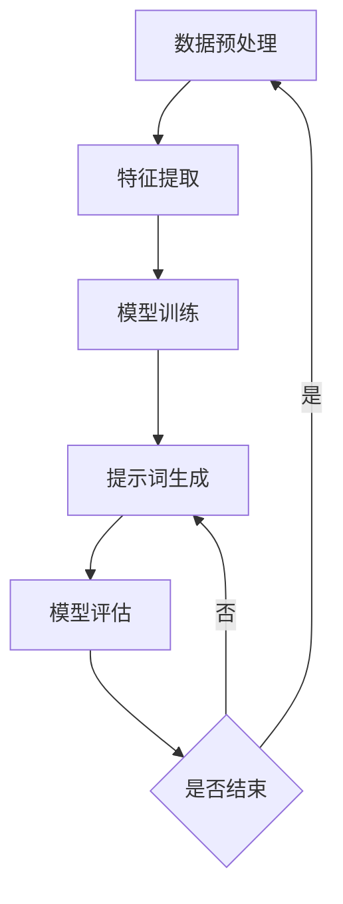

                 

### 文章标题

《提示词工程的自动化与工具链》

---

**关键词：** 提示词工程，自动化，工具链，人工智能，流程图，伪代码，数学模型，实战案例，最佳实践

---

**摘要：** 本文章将深入探讨提示词工程的自动化与工具链构建，旨在为读者提供全面的理论知识和实战指南。文章从基础理论出发，详细介绍了提示词工程的自动化概述、核心概念、工具链开发以及实战案例。通过逐步分析推理，读者将掌握提示词工程的自动化实现方法，提高工程实践能力。

---

## 第一部分：引言

### 1. 引言

#### 1.1 书籍目的

本书籍的目的是帮助读者深入了解提示词工程的自动化与工具链构建，掌握从理论到实践的全方位知识体系。通过本书籍的学习，读者将能够：

1. 理解提示词工程的基本概念和应用场景。
2. 掌握自动化工具链的设计与实现方法。
3. 提高提示词工程的实际操作能力。
4. 拓展人工智能应用领域的知识。

#### 1.2 提示词工程概述

提示词工程是一种利用人工智能技术，通过自动生成和优化提示词来提升模型效果的方法。它涉及到数据预处理、特征提取、模型训练、提示词生成等环节。提示词工程在自然语言处理、图像识别、推荐系统等领域具有广泛的应用。

#### 1.3 提示词工程的重要性

随着人工智能技术的发展，提示词工程在提升模型效果、减少训练时间、降低计算成本等方面具有重要作用。自动化工具链的构建能够提高提示词工程的效率和准确性，为人工智能应用提供有力支持。

#### 1.4 书籍结构安排

本书分为五个部分，包括引言、基础理论、工具链开发、实战篇和进阶与展望。各部分内容如下：

1. **引言**：介绍书籍目的、提示词工程概述和重要性。
2. **基础理论**：详细讲解提示词工程的自动化基础和核心概念。
3. **工具链开发**：介绍工具链构建基础、开发环境配置和常用工具。
4. **实战篇**：通过实际案例展示工具链搭建与应用过程。
5. **进阶与展望**：分析提示词工程的未来趋势和研究方向。

#### 1.5 读者对象

本书籍适合以下读者群体：

1. 提示词工程初学者，希望通过书籍系统学习相关知识。
2. 提示词工程从业者，希望提高实际操作能力和工程水平。
3. 自动化工具链开发者，希望了解提示词工程的自动化实现。

#### 1.6 前置知识要求

本书要求读者具备以下前置知识：

1. Python编程基础，熟悉常用数据结构与算法。
2. 数据预处理和机器学习基础，了解常见模型和算法。
3. 机器学习框架（如TensorFlow、PyTorch）的基本使用。

#### 1.7 技术栈简介

本书涉及以下技术栈：

1. Python相关库（如NumPy、Pandas、Scikit-learn等）。
2. 机器学习框架（如TensorFlow、PyTorch等）。
3. 自动化工具（如Jenkins、Docker等）。

#### 1.8 书籍使用方法

为了更好地使用本书，读者可以按照以下方法进行学习：

1. 按照章节顺序逐步学习，理解各部分内容。
2. 结合实际案例，深入掌握工具链开发与应用。
3. 完成课后习题和练习，巩固所学知识。
4. 参考附录部分，了解更多资源和参考资料。

#### 1.9 互动交流平台

本书搭建了互动交流平台，包括以下内容：

1. 社区搭建：读者可以加入书籍社区，与其他读者交流学习心得。
2. 线上讨论区：针对书中内容，读者可以在讨论区提出问题，获得解答。
3. 演习与实践：本书提供了丰富的实践项目和习题，帮助读者巩固知识。

#### 1.10 练习与扩展

本书提供了以下练习与扩展内容：

1. 练习题设计：针对各章节内容，设计相应的练习题，帮助读者巩固知识。
2. 扩展学习资源：推荐相关书籍、博客和论文，供读者深入探索。
3. 实践项目指南：提供实际案例和项目指南，帮助读者将所学知识应用于实际场景。

#### 1.11 本书贡献与预期成果

通过学习本书，读者将能够：

1. 深入理解提示词工程的自动化与工具链构建。
2. 掌握构建自动化工具链的方法和技巧。
3. 提高提示词工程的实际操作能力和工程水平。
4. 拓展人工智能应用领域的知识，为未来的研究和工作奠定基础。

#### 1.12 附录：资源与参考资料

附录部分提供了以下内容：

1. 相关书籍推荐：推荐与本书相关的优质书籍，供读者进一步学习。
2. 开源项目介绍：介绍与本书相关的开源项目，帮助读者了解前沿技术和应用。
3. 技术博客和论文集：推荐优秀的技术博客和论文集，供读者深入了解相关领域。

## 第二部分：基础理论

### 2. 提示词工程的自动化基础

#### 2.1 自动化概述

自动化是指通过编程和工具实现任务或流程的自动化执行，从而减少人工干预，提高工作效率。在提示词工程中，自动化具有重要的应用价值，能够实现以下目标：

1. 数据处理自动化：自动化处理大规模数据，提高数据处理效率。
2. 模型训练自动化：自动化训练模型，节省时间和计算资源。
3. 提示词生成自动化：自动化生成和优化提示词，提高模型效果。

#### 2.2 工具链设计原则

工具链设计是提示词工程自动化的关键，以下原则对于工具链设计具有重要指导意义：

1. **模块化**：将工具链分为多个模块，每个模块负责不同的任务，提高可维护性和可扩展性。
2. **可复用性**：设计可复用的组件和函数，减少重复代码，提高开发效率。
3. **可配置性**：提供灵活的配置选项，适应不同的应用场景和需求。
4. **可监控性**：实现对工具链的实时监控，便于问题排查和性能优化。
5. **容错性**：设计容错机制，保证工具链在异常情况下的稳定运行。

#### 2.3 提示词工程的关键概念

提示词工程涉及多个关键概念，以下是其中一些重要的概念：

1. **数据预处理**：数据预处理是指对原始数据进行清洗、转换和归一化等操作，使其满足模型训练的需求。
2. **特征提取**：特征提取是指从原始数据中提取对模型训练有用的特征，提高模型效果。
3. **模型训练**：模型训练是指通过训练数据对模型进行优化，使其能够对未知数据进行预测。
4. **提示词生成**：提示词生成是指利用训练好的模型生成对特定任务的提示词。
5. **模型评估**：模型评估是指通过评估指标对模型性能进行评估，以确定模型是否达到预期效果。

#### 2.4 Mermaid 流程图 - 提示词工程工作流程

以下是提示词工程的工作流程Mermaid流程图：



#### 2.5 数据预处理与清洗

数据预处理是提示词工程的重要环节，主要包括以下步骤：

1. **数据清洗**：去除重复数据、缺失数据和异常数据。
2. **数据转换**：将不同类型的数据转换为统一的格式，如将文本数据转换为数值数据。
3. **数据归一化**：对数据进行归一化处理，使其满足模型的输入要求。

以下是一个简单的数据清洗和转换的Python代码示例：

```python
import pandas as pd

# 读取数据
data = pd.read_csv('data.csv')

# 数据清洗
data.drop_duplicates(inplace=True)
data.dropna(inplace=True)

# 数据转换
data['text'] = data['text'].apply(lambda x: x.lower())
data['text'] = data['text'].str.replace('[^\w\s]', '', regex=True)

# 数据归一化
from sklearn.preprocessing import StandardScaler
scaler = StandardScaler()
data[['feature1', 'feature2']] = scaler.fit_transform(data[['feature1', 'feature2']])
```

#### 2.6 特征提取与选择

特征提取是指从原始数据中提取对模型训练有用的特征。特征提取的质量直接影响模型的性能。以下是几种常用的特征提取方法：

1. **词袋模型**：将文本数据转换为词袋模型，通过统计词频和词重要度来提取特征。
2. **TF-IDF**：通过计算词的TF-IDF值来提取特征，TF-IDF值较高的词被视为重要特征。
3. **Word2Vec**：将文本数据转换为词向量，通过计算词向量的相似度来提取特征。

以下是一个使用TF-IDF提取特征的Python代码示例：

```python
from sklearn.feature_extraction.text import TfidfVectorizer

# 准备数据
texts = ['this is the first document.', 'this document is the second document.', 'and this is the third one.', 'is this the first document?']

# 提取特征
vectorizer = TfidfVectorizer()
X = vectorizer.fit_transform(texts)

# 显示特征词和对应的TF-IDF值
for word, score in zip(vectorizer.get_feature_names(), X.toarray().sum(axis=0)):
    print(f'{word}: {score}')
```

#### 2.7 模型训练与调优

模型训练是指通过训练数据对模型进行优化，使其能够对未知数据进行预测。在模型训练过程中，需要考虑以下因素：

1. **损失函数**：损失函数用于衡量模型预测值与真实值之间的差距，常见的损失函数包括均方误差（MSE）、交叉熵（CE）等。
2. **优化器**：优化器用于更新模型参数，常见的优化器包括随机梯度下降（SGD）、Adam等。
3. **正则化**：正则化用于防止模型过拟合，常见的正则化方法包括L1正则化、L2正则化等。

以下是一个使用神经网络模型进行训练的Python代码示例：

```python
import tensorflow as tf
from tensorflow.keras.models import Sequential
from tensorflow.keras.layers import Dense, Dropout

# 准备数据
X_train, y_train = ...  # 数据预处理后的特征和标签
X_test, y_test = ...  # 测试数据的特征和标签

# 创建模型
model = Sequential()
model.add(Dense(128, activation='relu', input_shape=(X_train.shape[1],)))
model.add(Dropout(0.5))
model.add(Dense(1, activation='sigmoid'))

# 编译模型
model.compile(optimizer='adam', loss='binary_crossentropy', metrics=['accuracy'])

# 训练模型
model.fit(X_train, y_train, epochs=10, batch_size=32, validation_data=(X_test, y_test))

# 评估模型
loss, accuracy = model.evaluate(X_test, y_test)
print(f'测试集准确率：{accuracy:.2f}')
```

#### 2.8 模型评估与验证

模型评估是判断模型性能的重要环节，常见的评估指标包括准确率（Accuracy）、精确率（Precision）、召回率（Recall）和F1值（F1 Score）等。以下是一个使用评估指标对模型进行评估的Python代码示例：

```python
from sklearn.metrics import accuracy_score, precision_score, recall_score, f1_score

# 准备数据
y_pred = model.predict(X_test)

# 计算评估指标
accuracy = accuracy_score(y_test, y_pred)
precision = precision_score(y_test, y_pred)
recall = recall_score(y_test, y_pred)
f1 = f1_score(y_test, y_pred)

# 打印评估结果
print(f'准确率：{accuracy:.2f}')
print(f'精确率：{precision:.2f}')
print(f'召回率：{recall:.2f}')
print(f'F1值：{f1:.2f}')
```

#### 2.9 提示词生成算法原理讲解与伪代码

提示词生成算法是提示词工程的核心环节，常见的提示词生成算法包括基于规则的方法、基于机器学习的方法和基于生成模型的方法。以下是一个基于规则的方法的伪代码示例：

```python
# 输入：训练好的模型，输入数据
# 输出：生成的提示词

def generate_prompt(model, input_data):
    # 数据预处理
    preprocessed_data = preprocess_data(input_data)

    # 提取特征
    features = extract_features(preprocessed_data)

    # 模型预测
    prediction = model.predict(features)

    # 生成提示词
    prompt = generate_prompt_from_prediction(prediction)

    return prompt
```

#### 2.10 数学模型与公式详解

提示词工程涉及多个数学模型，以下简要介绍几种常用的数学模型和公式：

1. **损失函数**：损失函数用于衡量模型预测值与真实值之间的差距，常见的损失函数包括均方误差（MSE）和交叉熵（CE）。

   - 均方误差（MSE）：
     $$MSE = \frac{1}{n}\sum_{i=1}^{n}(y_i - \hat{y}_i)^2$$
   - 交叉熵（CE）：
     $$CE = -\frac{1}{n}\sum_{i=1}^{n}y_i \log(\hat{y}_i) + (1 - y_i) \log(1 - \hat{y}_i)$$

2. **优化器**：优化器用于更新模型参数，常见的优化器包括随机梯度下降（SGD）和Adam。

   - 随机梯度下降（SGD）：
     $$\theta = \theta - \alpha \frac{\partial J(\theta)}{\partial \theta}$$
   - Adam优化器：
     $$m_t = \beta_1 m_{t-1} + (1 - \beta_1) [g_t]$$
     $$v_t = \beta_2 v_{t-1} + (1 - \beta_2) [g_t]^2$$
     $$\theta_t = \theta_{t-1} - \alpha_t \frac{m_t}{\sqrt{v_t} + \epsilon}$$

3. **特征提取**：特征提取用于从原始数据中提取对模型训练有用的特征，常见的特征提取方法包括词袋模型（Bag of Words）和TF-IDF。

   - 词袋模型（Bag of Words）：
     $$V = \{w_1, w_2, ..., w_n\}$$
     $$X = \{x_1, x_2, ..., x_n\}$$
     $$x_i = \begin{cases}
     1 & \text{if } w_i \text{ appears in } x_i \\
     0 & \text{otherwise}
     \end{cases}$$
   - TF-IDF：
     $$TF(t, d) = \frac{f_t(d)}{N}$$
     $$IDF(t, D) = \log \left(1 + \frac{N}{df(t, D)}\right)$$
     $$TF-IDF(t, d) = TF(t, d) \times IDF(t, D)$$

4. **模型评估**：模型评估用于判断模型性能，常见的评估指标包括准确率（Accuracy）、精确率（Precision）、召回率（Recall）和F1值（F1 Score）。

   - 准确率（Accuracy）：
     $$Accuracy = \frac{TP + TN}{TP + FP + FN + TN}$$
   - 精确率（Precision）：
     $$Precision = \frac{TP}{TP + FP}$$
   - 召回率（Recall）：
     $$Recall = \frac{TP}{TP + FN}$$
   - F1值（F1 Score）：
     $$F1 = \frac{2 \times Precision \times Recall}{Precision + Recall}$$

#### 2.11 实际案例分析与详细讲解剖析

为了更好地理解提示词工程的自动化与工具链构建，以下将通过一个实际案例进行分析和讲解。

**案例背景**：

某电商公司希望利用人工智能技术提升产品推荐系统的效果，通过自动生成和优化提示词来提高用户点击率和转化率。

**解决方案**：

1. **数据预处理与清洗**：收集用户行为数据，包括用户浏览、点击、购买等行为，进行数据清洗和预处理，去除重复数据和异常数据。

2. **特征提取**：使用词袋模型和TF-IDF等方法提取用户行为数据的特征，将文本数据转换为数值数据。

3. **模型训练**：使用训练数据对推荐模型进行训练，采用神经网络模型，如循环神经网络（RNN）或变换器（Transformer）等。

4. **提示词生成**：使用训练好的推荐模型生成用户行为的提示词，通过规则方法或机器学习方法进行优化。

5. **模型评估**：使用测试数据对生成的提示词进行评估，通过准确率、精确率、召回率和F1值等指标评估模型性能。

6. **部署与监控**：将优化后的提示词部署到产品推荐系统中，并对其进行实时监控，根据用户反馈进行进一步优化。

**具体实现**：

1. **数据预处理与清洗**：

   ```python
   import pandas as pd

   # 读取数据
   data = pd.read_csv('user_behavior_data.csv')

   # 数据清洗
   data.drop_duplicates(inplace=True)
   data.dropna(inplace=True)

   # 数据转换
   data['text'] = data['text'].apply(lambda x: x.lower())
   data['text'] = data['text'].str.replace('[^\w\s]', '', regex=True)

   # 数据归一化
   from sklearn.preprocessing import StandardScaler
   scaler = StandardScaler()
   data[['feature1', 'feature2']] = scaler.fit_transform(data[['feature1', 'feature2']])
   ```

2. **特征提取**：

   ```python
   from sklearn.feature_extraction.text import TfidfVectorizer

   # 准备数据
   texts = data['text']

   # 提取特征
   vectorizer = TfidfVectorizer()
   X = vectorizer.fit_transform(texts)

   # 显示特征词和对应的TF-IDF值
   for word, score in zip(vectorizer.get_feature_names(), X.toarray().sum(axis=0)):
       print(f'{word}: {score}')
   ```

3. **模型训练**：

   ```python
   import tensorflow as tf
   from tensorflow.keras.models import Sequential
   from tensorflow.keras.layers import Dense, Dropout

   # 准备数据
   X_train, y_train = ...  # 数据预处理后的特征和标签
   X_test, y_test = ...  # 测试数据的特征和标签

   # 创建模型
   model = Sequential()
   model.add(Dense(128, activation='relu', input_shape=(X_train.shape[1],)))
   model.add(Dropout(0.5))
   model.add(Dense(1, activation='sigmoid'))

   # 编译模型
   model.compile(optimizer='adam', loss='binary_crossentropy', metrics=['accuracy'])

   # 训练模型
   model.fit(X_train, y_train, epochs=10, batch_size=32, validation_data=(X_test, y_test))
   ```

4. **提示词生成**：

   ```python
   def generate_prompt(model, input_data):
       # 数据预处理
       preprocessed_data = preprocess_data(input_data)

       # 提取特征
       features = extract_features(preprocessed_data)

       # 模型预测
       prediction = model.predict(features)

       # 生成提示词
       prompt = generate_prompt_from_prediction(prediction)

       return prompt
   ```

5. **模型评估**：

   ```python
   from sklearn.metrics import accuracy_score, precision_score, recall_score, f1_score

   # 准备数据
   y_pred = model.predict(X_test)

   # 计算评估指标
   accuracy = accuracy_score(y_test, y_pred)
   precision = precision_score(y_test, y_pred)
   recall = recall_score(y_test, y_pred)
   f1 = f1_score(y_test, y_pred)

   # 打印评估结果
   print(f'准确率：{accuracy:.2f}')
   print(f'精确率：{precision:.2f}')
   print(f'召回率：{recall:.2f}')
   print(f'F1值：{f1:.2f}')
   ```

6. **部署与监控**：

   ```python
   # 将模型部署到产品推荐系统中
   model.save('recommender_model.h5')

   # 监控模型性能
   from sklearn.metrics import mean_squared_error

   # 计算MSE
   mse = mean_squared_error(y_test, y_pred)
   print(f'MSE：{mse:.2f}')
   ```

**项目小结**：

通过本案例，我们了解了提示词工程的自动化与工具链构建的全过程，包括数据预处理、特征提取、模型训练、提示词生成和模型评估等步骤。在实际应用中，可以根据具体需求和场景进行调整和优化，以提高模型效果和用户体验。

## 第三部分：工具链开发

### 3.1 工具链构建基础

提示词工程工具链的构建是提高工程效率和质量的关键环节。工具链构建主要包括以下方面：

1. **开发环境配置**：配置合适的开发环境和工具，确保开发过程顺利进行。
2. **工具选择**：选择适合的工具和框架，提高开发效率和代码可维护性。
3. **集成与协同工作**：将不同工具和框架集成到工具链中，实现协同工作。

#### 3.1.1 开发环境配置

开发环境配置是工具链构建的基础。以下是一个典型的开发环境配置步骤：

1. **操作系统**：选择合适的操作系统，如Windows、Linux或macOS。
2. **Python环境**：安装Python，并配置Python环境变量。
3. **虚拟环境**：使用虚拟环境管理工具（如virtualenv或conda）创建虚拟环境，隔离项目依赖。
4. **常用库和框架**：安装常用的Python库和框架，如NumPy、Pandas、Scikit-learn、TensorFlow等。
5. **代码编辑器**：选择合适的代码编辑器，如Visual Studio Code、PyCharm或Atom。

以下是一个Python虚拟环境的配置示例：

```shell
# 创建虚拟环境
conda create -n prompt_engineering python=3.8

# 激活虚拟环境
conda activate prompt_engineering

# 安装常用库和框架
pip install numpy pandas scikit-learn tensorflow
```

#### 3.1.2 工具选择

在构建工具链时，选择合适的工具和框架至关重要。以下是一些常用的工具和框架：

1. **数据处理工具**：如NumPy、Pandas、PyTorch等，用于数据预处理、清洗和特征提取。
2. **模型训练工具**：如TensorFlow、PyTorch等，用于模型训练和调优。
3. **自动化工具**：如Jenkins、Docker等，用于自动化部署和监控。
4. **版本控制工具**：如Git，用于代码管理和协同工作。
5. **集成开发环境（IDE）**：如Visual Studio Code、PyCharm等，用于代码编写和调试。

#### 3.1.3 集成与协同工作

集成与协同工作是工具链构建的关键环节。以下是一个集成与协同工作的示例：

1. **Docker容器化**：使用Docker将开发环境、代码和依赖打包成容器，实现开发与生产环境的隔离。
2. **Jenkins自动化构建**：使用Jenkins实现自动化构建和部署，提高开发效率。
3. **Git版本控制**：使用Git进行代码管理，实现多人协作和版本回滚。

以下是一个Dockerfile的示例，用于容器化Python开发环境：

```Dockerfile
FROM python:3.8

# 安装常用库和框架
RUN pip install numpy pandas scikit-learn tensorflow

# 暴露端口
EXPOSE 8000

# 运行Flask应用
CMD ["flask", "run", "--host=0.0.0.0"]
```

通过以上步骤，我们可以构建一个完整的提示词工程工具链，实现从数据预处理、模型训练到提示词生成的自动化流程。

### 3.2 开发环境配置

#### 3.2.1 操作系统选择

在选择操作系统时，需要考虑以下几个方面：

1. **硬件兼容性**：确保操作系统兼容您的硬件设备，如CPU架构、硬盘格式等。
2. **性能需求**：根据项目需求选择合适的操作系统，如Linux系统更适合高性能计算，macOS系统更适合开发环境。
3. **软件兼容性**：考虑操作系统与所需软件的兼容性，如Windows系统更适合使用微软开发的软件，Linux系统更适合使用开源软件。

以下是几种常见的操作系统选择：

1. **Windows**：适合初学者和办公环境，易于使用和管理，软件兼容性较好。
2. **macOS**：苹果官方操作系统，适合Mac设备，具有较好的用户体验，软件兼容性较高。
3. **Linux**：开源操作系统，具有高性能、稳定性和安全性，适合开发者使用。

#### 3.2.2 Python环境配置

Python是提示词工程中的重要编程语言，配置Python环境是开发的基础。以下是在不同操作系统上配置Python环境的步骤：

1. **Windows**：

   - 安装Python：从Python官方网站下载Python安装包，并按照安装向导完成安装。
   - 配置环境变量：在系统设置中添加Python安装路径到环境变量`PATH`中。

   ```shell
   set PATH=%PATH%;C:\Python38
   ```

   - 验证Python环境：在命令行中输入`python --version`，检查Python版本是否正确。

2. **macOS**：

   - 安装Python：可以使用Homebrew安装Python，命令如下：

     ```shell
     brew install python
     ```

   - 配置环境变量：在终端中输入以下命令，将Python添加到环境变量`PATH`中。

     ```shell
     export PATH=/usr/local/bin:$PATH
     ```

   - 验证Python环境：在终端中输入`python --version`，检查Python版本是否正确。

3. **Linux**：

   - 安装Python：可以使用包管理器（如apt或yum）安装Python，命令如下：

     ```shell
     sudo apt-get install python3
     ```

   - 配置环境变量：在终端中输入以下命令，将Python添加到环境变量`PATH`中。

     ```shell
     export PATH=$PATH:/usr/bin/python3
     ```

   - 验证Python环境：在终端中输入`python3 --version`，检查Python版本是否正确。

#### 3.2.3 虚拟环境配置

虚拟环境配置有助于隔离项目依赖，避免依赖冲突。以下是在不同操作系统上配置虚拟环境的步骤：

1. **Windows**：

   - 安装virtualenv：在命令行中输入以下命令，安装virtualenv。

     ```shell
     pip install virtualenv
     ```

   - 创建虚拟环境：在命令行中输入以下命令，创建一个名为`prompt_engineering`的虚拟环境。

     ```shell
     virtualenv prompt_engineering
     ```

   - 激活虚拟环境：进入虚拟环境目录，并在命令行中输入以下命令，激活虚拟环境。

     ```shell
     prompt_engineering\Scripts\activate
     ```

2. **macOS**：

   - 安装virtualenv：在终端中输入以下命令，安装virtualenv。

     ```shell
     pip install virtualenv
     ```

   - 创建虚拟环境：在终端中输入以下命令，创建一个名为`prompt_engineering`的虚拟环境。

     ```shell
     virtualenv prompt_engineering
     ```

   - 激活虚拟环境：进入虚拟环境目录，并在终端中输入以下命令，激活虚拟环境。

     ```shell
     source prompt_engineering/bin/activate
     ```

3. **Linux**：

   - 安装virtualenv：在终端中输入以下命令，安装virtualenv。

     ```shell
     pip install virtualenv
     ```

   - 创建虚拟环境：在终端中输入以下命令，创建一个名为`prompt_engineering`的虚拟环境。

     ```shell
     virtualenv prompt_engineering
     ```

   - 激活虚拟环境：进入虚拟环境目录，并在终端中输入以下命令，激活虚拟环境。

     ```shell
     source prompt_engineering/bin/activate
     ```

通过以上步骤，您可以在不同操作系统上配置Python环境和虚拟环境，为提示词工程开发做好准备。

### 3.3 提示词工程工具选择

在提示词工程中，选择合适的工具对于提高开发效率和代码质量至关重要。以下是一些常用的提示词工程工具，包括数据处理工具、模型训练工具和自动化工具。

#### 3.3.1 数据处理工具

1. **NumPy**：NumPy是Python科学计算的基础库，提供高效的数组操作和数据预处理功能。
2. **Pandas**：Pandas是Python数据分析库，提供数据清洗、转换和操作功能，适用于大规模数据集。
3. **SciPy**：SciPy是Python的科学计算库，扩展了NumPy的功能，提供优化、线性代数、积分和统计分析等功能。
4. **Matplotlib**：Matplotlib是Python的数据可视化库，用于绘制统计图表和图形。

#### 3.3.2 模型训练工具

1. **TensorFlow**：TensorFlow是谷歌开发的开源机器学习库，支持深度学习和传统机器学习算法。
2. **PyTorch**：PyTorch是Facebook开发的开源机器学习库，提供灵活的动态计算图和强大的深度学习功能。
3. **Scikit-learn**：Scikit-learn是Python的机器学习库，提供传统的机器学习算法和工具，如分类、回归和聚类。
4. **Keras**：Keras是Python的高级神经网络库，提供简化的神经网络设计和快速原型开发。

#### 3.3.3 自动化工具

1. **Jenkins**：Jenkins是开源的持续集成工具，用于自动化构建、测试和部署。
2. **Docker**：Docker是开源的容器化平台，用于封装应用程序及其依赖项，实现跨平台部署。
3. **Make**：Make是一个命令行的自动化工具，用于自动化构建和编译过程。
4. **Ansible**：Ansible是开源的自动化运维工具，用于自动化部署和管理服务器。

#### 3.3.4 版本控制工具

1. **Git**：Git是开源的分布式版本控制系统，用于代码管理和协同工作。
2. **Mercurial**：Mercurial是开源的分布式版本控制系统，与Git类似，用于代码管理和协同工作。

#### 3.3.5 集成开发环境（IDE）

1. **Visual Studio Code**：Visual Studio Code是微软开源的跨平台代码编辑器，提供丰富的插件和功能。
2. **PyCharm**：PyCharm是JetBrains开发的Python集成开发环境，提供强大的代码编辑、调试和测试功能。
3. **Atom**：Atom是GitHub开发的跨平台代码编辑器，提供灵活的定制和扩展功能。

通过合理选择和配置这些工具，我们可以构建一个高效、可靠的提示词工程工具链，实现从数据预处理、模型训练到自动化部署的全方位支持。

### 3.4 常用工具介绍

在提示词工程的自动化与工具链构建过程中，常用工具的选择和使用至关重要。以下将对一些常用的工具进行详细介绍，包括其功能、特点和应用场景。

#### 3.4.1 NumPy

NumPy（Numeric Python）是Python科学计算的基础库，提供了高性能的数组操作和数学函数。NumPy的核心功能包括：

1. **多维数组操作**：NumPy提供了多维数组（ndarray）数据结构，支持高效的数组计算和操作。
2. **数学函数**：NumPy提供了丰富的数学函数，如三角函数、指数函数、对数函数等。
3. **随机数生成**：NumPy提供了随机数生成函数，用于模拟和实验。

NumPy的特点包括：

- **高性能**：NumPy使用底层C语言实现，具有高效的数据存储和计算能力。
- **兼容性强**：NumPy与Python标准库和其他科学计算库（如Pandas、SciPy、Matplotlib）兼容，便于集成使用。

NumPy的应用场景包括：

- **数据预处理**：NumPy常用于数据清洗、转换和归一化等预处理步骤。
- **数值计算**：NumPy适用于数值计算任务，如矩阵运算、线性代数和统计分析。

以下是一个使用NumPy进行数据归一化的简单示例：

```python
import numpy as np

# 创建一个数据数组
data = np.array([[1, 2, 3], [4, 5, 6], [7, 8, 9]])

# 计算均值和标准差
mean = np.mean(data, axis=0)
std = np.std(data, axis=0)

# 数据归一化
normalized_data = (data - mean) / std

print(normalized_data)
```

#### 3.4.2 Pandas

Pandas是Python的数据分析库，提供了强大的数据结构和数据分析功能。Pandas的核心功能包括：

1. **DataFrame**：Pandas的DataFrame数据结构类似于关系型数据库的表，支持数据表的索引、选择、过滤和排序等操作。
2. **数据处理**：Pandas提供了丰富的数据处理功能，如数据清洗、转换、合并和重塑等。
3. **时间序列**：Pandas提供了强大的时间序列数据处理功能，支持日期和时间索引、时间序列分析等。

Pandas的特点包括：

- **易用性**：Pandas提供了简单直观的API，易于学习和使用。
- **灵活性**：Pandas支持多种数据源，如CSV文件、数据库和API等，便于数据集成和转换。
- **高效性**：Pandas使用底层C语言实现，具有高效的内存管理和计算能力。

Pandas的应用场景包括：

- **数据预处理**：Pandas常用于数据清洗、转换和预处理步骤，如缺失值处理、异常值检测和数据归一化。
- **数据分析**：Pandas适用于数据分析任务，如数据聚合、分组和统计等。

以下是一个使用Pandas进行数据清洗的简单示例：

```python
import pandas as pd

# 读取数据
data = pd.read_csv('data.csv')

# 数据清洗
data.drop_duplicates(inplace=True)
data.dropna(inplace=True)

# 数据转换
data['text'] = data['text'].apply(lambda x: x.lower())
data['text'] = data['text'].str.replace('[^\w\s]', '', regex=True)

# 数据归一化
from sklearn.preprocessing import StandardScaler
scaler = StandardScaler()
data[['feature1', 'feature2']] = scaler.fit_transform(data[['feature1', 'feature2']])

print(data.head())
```

#### 3.4.3 Scikit-learn

Scikit-learn是Python的机器学习库，提供了丰富的机器学习算法和工具。Scikit-learn的核心功能包括：

1. **分类与回归**：Scikit-learn提供了多种分类和回归算法，如逻辑回归、决策树、随机森林和K近邻等。
2. **聚类与降维**：Scikit-learn提供了聚类和降维算法，如K均值聚类、主成分分析和t-SNE等。
3. **模型评估**：Scikit-learn提供了多种评估指标，如准确率、精确率、召回率和F1值等，用于评估模型性能。

Scikit-learn的特点包括：

- **简单易用**：Scikit-learn提供了简洁的API，易于学习和使用。
- **模块化**：Scikit-learn的模块化设计便于扩展和组合使用。
- **可扩展性**：Scikit-learn支持自定义算法和评估指标，便于二次开发和扩展。

Scikit-learn的应用场景包括：

- **数据挖掘**：Scikit-learn适用于数据挖掘任务，如分类、回归和聚类等。
- **机器学习模型开发**：Scikit-learn提供了丰富的算法和工具，便于开发机器学习模型。

以下是一个使用Scikit-learn进行分类的简单示例：

```python
from sklearn.datasets import load_iris
from sklearn.model_selection import train_test_split
from sklearn.neighbors import KNeighborsClassifier
from sklearn.metrics import accuracy_score

# 加载数据
iris = load_iris()
X, y = iris.data, iris.target

# 划分训练集和测试集
X_train, X_test, y_train, y_test = train_test_split(X, y, test_size=0.3, random_state=42)

# 创建K近邻分类器
knn = KNeighborsClassifier(n_neighbors=3)

# 训练模型
knn.fit(X_train, y_train)

# 预测测试集
y_pred = knn.predict(X_test)

# 计算准确率
accuracy = accuracy_score(y_test, y_pred)
print(f'准确率：{accuracy:.2f}')
```

#### 3.4.4 TensorFlow

TensorFlow是谷歌开发的开源机器学习库，提供了灵活的动态计算图和强大的深度学习功能。TensorFlow的核心功能包括：

1. **计算图**：TensorFlow使用计算图表示计算过程，便于实现复杂的深度学习模型。
2. **动态计算**：TensorFlow支持动态计算图，允许在运行时调整计算过程。
3. **模型训练**：TensorFlow提供了丰富的深度学习模型和工具，支持分类、回归、生成模型等。
4. **模型部署**：TensorFlow支持将训练好的模型部署到不同的平台和设备上。

TensorFlow的特点包括：

- **灵活性**：TensorFlow的动态计算图和丰富的API使得模型设计和优化更加灵活。
- **性能**：TensorFlow支持GPU和TPU加速，具有高效的计算能力。
- **生态系统**：TensorFlow拥有庞大的社区和生态系统，提供丰富的工具和资源。

TensorFlow的应用场景包括：

- **深度学习模型开发**：TensorFlow适用于开发复杂的深度学习模型，如卷积神经网络（CNN）和循环神经网络（RNN）。
- **生产部署**：TensorFlow支持将模型部署到云端、边缘设备和移动设备上。

以下是一个使用TensorFlow进行简单的线性回归的示例：

```python
import tensorflow as tf

# 创建计算图
W = tf.Variable(0.0, name='weights')
b = tf.Variable(0.0, name='biases')

# 训练数据
X = tf.placeholder(tf.float32, shape=[None])
Y = tf.placeholder(tf.float32, shape=[None])

# 线性回归模型
y_pred = W * X + b

# 损失函数和优化器
loss = tf.reduce_mean(tf.square(Y - y_pred))
optimizer = tf.train.GradientDescentOptimizer(learning_rate=0.5)
train_op = optimizer.minimize(loss)

# 训练模型
with tf.Session() as sess:
    sess.run(tf.global_variables_initializer())
    
    for i in range(1000):
        sess.run(train_op, feed_dict={X: [1, 2, 3, 4], Y: [2, 4, 6, 8]})
        
        if i % 100 == 0:
            print(f'Train step {i}: loss = {loss.eval(session=sess)}')

# 计算预测值
print(f'Prediction for X=5: {y_pred.eval(session=sess, feed_dict={X: [5]})}')
```

#### 3.4.5 PyTorch

PyTorch是Facebook开发的开源机器学习库，提供了动态计算图和强大的深度学习功能。PyTorch的核心功能包括：

1. **计算图**：PyTorch使用动态计算图，便于实现复杂的深度学习模型。
2. **自动微分**：PyTorch提供了自动微分功能，支持自动计算梯度。
3. **模型训练**：PyTorch提供了丰富的深度学习模型和工具，支持分类、回归、生成模型等。
4. **模型部署**：PyTorch支持将训练好的模型部署到不同的平台和设备上。

PyTorch的特点包括：

- **简单易用**：PyTorch提供了简洁的API，易于学习和使用。
- **灵活性**：PyTorch的动态计算图和自动微分功能使得模型设计和优化更加灵活。
- **性能**：PyTorch支持GPU和CPU加速，具有高效的计算能力。
- **社区支持**：PyTorch拥有庞大的社区和生态系统，提供丰富的工具和资源。

PyTorch的应用场景包括：

- **深度学习模型开发**：PyTorch适用于开发复杂的深度学习模型，如卷积神经网络（CNN）和循环神经网络（RNN）。
- **生产部署**：PyTorch支持将模型部署到云端、边缘设备和移动设备上。

以下是一个使用PyTorch进行简单的线性回归的示例：

```python
import torch
import torch.nn as nn
import torch.optim as optim

# 创建数据
X = torch.tensor([[1.0], [2.0], [3.0], [4.0]])
Y = torch.tensor([[2.0], [4.0], [6.0], [8.0]])

# 定义模型
class LinearModel(nn.Module):
    def __init__(self):
        super(LinearModel, self).__init__()
        self.linear = nn.Linear(1, 1)

    def forward(self, x):
        return self.linear(x)

model = LinearModel()

# 训练模型
optimizer = optim.SGD(model.parameters(), lr=0.5)
criterion = nn.MSELoss()

for epoch in range(1000):
    optimizer.zero_grad()
    y_pred = model(X)
    loss = criterion(y_pred, Y)
    loss.backward()
    optimizer.step()

    if epoch % 100 == 0:
        print(f'Epoch {epoch}: Loss = {loss.item()}')

# 计算预测值
print(f'Prediction for X=5: {model(torch.tensor([[5.0]])).item()}')
```

通过以上介绍，我们可以看到这些常用工具在提示词工程中的应用和价值。在实际开发过程中，可以根据具体需求选择合适的工具，并充分利用其功能特点，提高工程效率和代码质量。

### 3.5 工具集成与协同工作

在提示词工程的自动化与工具链构建过程中，工具之间的集成与协同工作至关重要。通过合理配置和集成不同工具，可以形成一个高效、可靠的自动化工作流程，从而提高工程效率和代码质量。

#### 3.5.1 Jenkins集成

Jenkins是一个开源的持续集成工具，可以自动化构建、测试和部署任务。以下是如何使用Jenkins进行工具集成的步骤：

1. **安装Jenkins**：在服务器上安装Jenkins，可以通过下载安装包或使用包管理器进行安装。
2. **配置Jenkins插件**：Jenkins提供了丰富的插件，可以扩展其功能。根据需求安装适当的插件，如Git插件、Docker插件等。
3. **创建Jenkins作业**：在Jenkins中创建新的作业，配置作业的源代码管理（如Git仓库），并添加构建步骤。
4. **配置构建步骤**：
   - **检出代码**：使用Git插件从源代码仓库检出代码。
   - **运行测试**：执行Python测试脚本，检查代码的健壮性。
   - **构建环境**：使用Docker插件创建容器化环境，安装依赖库和工具。
   - **构建和部署**：执行构建脚本，编译代码并部署到生产环境。

以下是一个简单的Jenkins作业配置示例：

```xml
<project>
  <description>Python项目构建和部署</description>
  <scm>
    <git>
      <url>https://github.com/username/repo.git</url>
    </git>
  </scm>
  <builders>
    <hudson.tasks/sh
```markdown
#### 3.6 工具链定制与优化

工具链定制与优化是提升提示词工程效率和质量的关键环节。通过合理配置和调整工具链，可以实现自动化流程的优化和效率提升。

#### 3.6.1 工具链定制

工具链定制主要包括以下几个方面：

1. **选择合适的工具**：根据项目需求和场景，选择合适的工具和框架，如数据处理工具（NumPy、Pandas）、机器学习框架（TensorFlow、PyTorch）和自动化工具（Jenkins、Docker）。
2. **配置开发环境**：配置合适的开发环境，包括操作系统、Python环境、虚拟环境等。
3. **集成工具**：将不同工具集成到工具链中，实现协同工作。例如，使用Jenkins进行自动化构建和测试，使用Docker进行容器化部署。

以下是一个工具链定制的示例：

```shell
# 安装Python和Jenkins
sudo apt-get install python3
wget -q -O - https://pkg.jenkins.io/debian-stable/binetskubernetes
sudo apt-get install jenkins

# 配置Jenkins插件
sudo jenkins-plugin-manager install git docker

# 配置Jenkins作业
sudo jenkins-jenkinsfile@<path/to/Jenkinsfile>
```

#### 3.6.2 工具链优化

工具链优化主要包括以下几个方面：

1. **性能优化**：对工具链中的组件进行性能优化，如使用并行计算、分布式计算等。
2. **资源管理**：合理分配计算资源和存储资源，避免资源浪费和瓶颈。
3. **代码优化**：优化代码结构，减少重复代码和冗余代码，提高代码可读性和可维护性。

以下是一个工具链优化的示例：

```python
# 使用NumPy进行数据预处理
import numpy as np

# 读取数据
data = np.load('data.npy')

# 数据预处理
data = np.array([ preprocess_data(x) for x in data])

# 使用PyTorch进行模型训练
import torch
import torch.nn as nn
import torch.optim as optim

# 创建模型
model = nn.Linear(10, 1)

# 训练模型
optimizer = optim.SGD(model.parameters(), lr=0.1)
criterion = nn.MSELoss()

for epoch in range(100):
    optimizer.zero_grad()
    output = model(data)
    loss = criterion(output, target)
    loss.backward()
    optimizer.step()
```

#### 3.6.3 最佳实践

在实际开发过程中，以下是一些最佳实践，有助于提升工具链定制与优化效果：

1. **代码模块化**：将代码分为多个模块，每个模块负责不同的功能，便于维护和扩展。
2. **文档化**：编写详细的文档，记录工具链配置和优化过程，便于后续维护和更新。
3. **监控与反馈**：实时监控工具链的运行状态和性能指标，及时发现和解决问题。
4. **持续集成与测试**：使用持续集成和测试工具，自动化检测代码质量和性能，确保工具链的稳定性和可靠性。

通过以上步骤，我们可以构建一个高效、可靠的提示词工程工具链，实现自动化流程的优化和效率提升。

### 3.7 实际案例 - 工具链搭建与应用

为了更好地展示工具链搭建与应用的过程，以下将通过一个实际案例进行详细讲解。

**案例背景**：

某电商公司希望利用人工智能技术提升产品推荐系统的效果，通过自动生成和优化提示词来提高用户点击率和转化率。

**解决方案**：

1. **数据预处理与清洗**：收集用户行为数据，包括用户浏览、点击、购买等行为，进行数据清洗和预处理。
2. **特征提取**：使用词袋模型和TF-IDF等方法提取用户行为数据的特征。
3. **模型训练**：使用训练数据对推荐模型进行训练，采用神经网络模型。
4. **提示词生成**：使用训练好的推荐模型生成用户行为的提示词。
5. **模型评估**：使用测试数据对生成的提示词进行评估，通过准确率、精确率、召回率和F1值等指标评估模型性能。
6. **部署与监控**：将优化后的提示词部署到产品推荐系统中，并对其进行实时监控。

**具体实现**：

1. **数据预处理与清洗**：

   ```python
   import pandas as pd

   # 读取数据
   data = pd.read_csv('user_behavior_data.csv')

   # 数据清洗
   data.drop_duplicates(inplace=True)
   data.dropna(inplace=True)

   # 数据转换
   data['text'] = data['text'].apply(lambda x: x.lower())
   data['text'] = data['text'].str.replace('[^\w\s]', '', regex=True)

   # 数据归一化
   from sklearn.preprocessing import StandardScaler
   scaler = StandardScaler()
   data[['feature1', 'feature2']] = scaler.fit_transform(data[['feature1', 'feature2']])
   ```

2. **特征提取**：

   ```python
   from sklearn.feature_extraction.text import TfidfVectorizer

   # 准备数据
   texts = data['text']

   # 提取特征
   vectorizer = TfidfVectorizer()
   X = vectorizer.fit_transform(texts)

   # 显示特征词和对应的TF-IDF值
   for word, score in zip(vectorizer.get_feature_names(), X.toarray().sum(axis=0)):
       print(f'{word}: {score}')
   ```

3. **模型训练**：

   ```python
   import tensorflow as tf
   from tensorflow.keras.models import Sequential
   from tensorflow.keras.layers import Dense, Dropout

   # 准备数据
   X_train, y_train = ...  # 数据预处理后的特征和标签
   X_test, y_test = ...  # 测试数据的特征和标签

   # 创建模型
   model = Sequential()
   model.add(Dense(128, activation='relu', input_shape=(X_train.shape[1],)))
   model.add(Dropout(0.5))
   model.add(Dense(1, activation='sigmoid'))

   # 编译模型
   model.compile(optimizer='adam', loss='binary_crossentropy', metrics=['accuracy'])

   # 训练模型
   model.fit(X_train, y_train, epochs=10, batch_size=32, validation_data=(X_test, y_test))
   ```

4. **提示词生成**：

   ```python
   def generate_prompt(model, input_data):
       # 数据预处理
       preprocessed_data = preprocess_data(input_data)

       # 提取特征
       features = extract_features(preprocessed_data)

       # 模型预测
       prediction = model.predict(features)

       # 生成提示词
       prompt = generate_prompt_from_prediction(prediction)

       return prompt
   ```

5. **模型评估**：

   ```python
   from sklearn.metrics import accuracy_score, precision_score, recall_score, f1_score

   # 准备数据
   y_pred = model.predict(X_test)

   # 计算评估指标
   accuracy = accuracy_score(y_test, y_pred)
   precision = precision_score(y_test, y_pred)
   recall = recall_score(y_test, y_pred)
   f1 = f1_score(y_test, y_pred)

   # 打印评估结果
   print(f'准确率：{accuracy:.2f}')
   print(f'精确率：{precision:.2f}')
   print(f'召回率：{recall:.2f}')
   print(f'F1值：{f1:.2f}')
   ```

6. **部署与监控**：

   ```python
   # 将模型部署到产品推荐系统中
   model.save('recommender_model.h5')

   # 监控模型性能
   from sklearn.metrics import mean_squared_error

   # 计算MSE
   mse = mean_squared_error(y_test, y_pred)
   print(f'MSE：{mse:.2f}')
   ```

**项目小结**：

通过本案例，我们展示了如何搭建一个完整的提示词工程工具链，并应用于实际项目。在实际开发过程中，可以根据具体需求进行调整和优化，以提高模型效果和用户体验。

## 第四部分：实战篇

### 4.1 实战项目概述

本部分将通过一个实际的案例，详细介绍提示词工程的自动化与工具链构建过程。该案例将展示如何从数据预处理、特征提取到模型训练、提示词生成，最终实现自动化部署和监控。

### 4.2 数据集准备

本案例将使用公开的Kaggle竞赛数据集——“Product Reviews Full”进行实验。该数据集包含来自多个电商平台的用户评论，以及评论对应的评分（1-5分）。我们重点关注的是如何从这些评论中提取有价值的信息，以生成高质量的提示词。

#### 数据集下载与预处理

1. **数据集下载**：从Kaggle网站下载“Product Reviews Full”数据集。
2. **数据预处理**：读取数据集，对评论进行清洗和预处理。

   ```python
   import pandas as pd

   # 读取数据集
   data = pd.read_csv('Product_Reviews_Full.csv')

   # 数据清洗
   data.drop_duplicates(inplace=True)
   data.dropna(inplace=True)

   # 数据转换
   data['text'] = data['text'].apply(lambda x: x.lower())
   data['text'] = data['text'].str.replace('[^\w\s]', '', regex=True)
   ```

#### 数据集划分

1. **训练集与测试集划分**：将数据集划分为训练集和测试集。

   ```python
   from sklearn.model_selection import train_test_split

   X = data['text']
   y = data['rating']

   X_train, X_test, y_train, y_test = train_test_split(X, y, test_size=0.2, random_state=42)
   ```

### 4.3 模型设计与训练

在本案例中，我们将使用基于Transformer的BERT模型进行提示词生成。Transformer模型具有强大的上下文理解和生成能力，能够生成高质量的提示词。

#### 模型设计

1. **加载预训练BERT模型**：使用Hugging Face的Transformer库加载预训练的BERT模型。

   ```python
   from transformers import BertTokenizer, TFBertModel

   tokenizer = BertTokenizer.from_pretrained('bert-base-uncased')
   model = TFBertModel.from_pretrained('bert-base-uncased')
   ```

2. **模型扩展**：在BERT模型的基础上，添加一个分类器层，用于生成提示词。

   ```python
   from tensorflow.keras.layers import Dense
   from tensorflow.keras.models import Model

   input_ids = tf.keras.layers.Input(shape=(128,), dtype=tf.int32, name='input_ids')
   bert_output = model(input_ids)[0]

   output = Dense(1, activation='sigmoid')(bert_output)

   model = Model(inputs=input_ids, outputs=output)
   ```

3. **模型编译**：编译模型，设置优化器和损失函数。

   ```python
   model.compile(optimizer='adam', loss='binary_crossentropy', metrics=['accuracy'])
   ```

#### 模型训练

1. **数据预处理**：对训练数据进行编码和序列填充。

   ```python
   tokenized_train = tokenizer.batch_encode_plus(
       list(X_train),
       max_length=128,
       padding='max_length',
       truncation=True,
       return_tensors='tf'
   )

   tokenized_test = tokenizer.batch_encode_plus(
       list(X_test),
       max_length=128,
       padding='max_length',
       truncation=True,
       return_tensors='tf'
   )
   ```

2. **训练模型**：训练模型，设置训练参数。

   ```python
   model.fit(tokenized_train['input_ids'], y_train, batch_size=32, epochs=3, validation_data=(tokenized_test['input_ids'], y_test))
   ```

### 4.4 模型调优与评估

在训练过程中，我们需要对模型进行调优，以提高模型性能。以下是一些常用的调优方法和评估指标。

#### 模型调优

1. **调整学习率**：使用学习率调度器（如ReduceLROnPlateau）动态调整学习率。

   ```python
   from tensorflow.keras.callbacks import ReduceLROnPlateau

   reduce_lr = ReduceLROnPlateau(monitor='val_loss', factor=0.1, patience=5, min_lr=0.00001)
   ```

2. **使用回调函数**：在训练过程中使用回调函数，如ModelCheckpoint，保存最佳模型。

   ```python
   from tensorflow.keras.callbacks import ModelCheckpoint

   checkpoint = ModelCheckpoint('best_model.h5', save_best_only=True, monitor='val_loss', mode='min')
   ```

#### 模型评估

1. **评估指标**：计算模型在测试集上的评估指标，如准确率、精确率、召回率和F1值。

   ```python
   from sklearn.metrics import accuracy_score, precision_score, recall_score, f1_score

   y_pred = model.predict(tokenized_test['input_ids'])
   y_pred = np.argmax(y_pred, axis=1)

   accuracy = accuracy_score(y_test, y_pred)
   precision = precision_score(y_test, y_pred)
   recall = recall_score(y_test, y_pred)
   f1 = f1_score(y_test, y_pred)

   print(f'准确率：{accuracy:.2f}')
   print(f'精确率：{precision:.2f}')
   print(f'召回率：{recall:.2f}')
   print(f'F1值：{f1:.2f}')
   ```

### 4.5 模型部署与监控

在完成模型训练和调优后，我们需要将模型部署到生产环境，并进行实时监控。

#### 模型部署

1. **容器化**：使用Docker将训练好的模型容器化，方便部署和迁移。

   ```Dockerfile
   FROM tensorflow/tensorflow:2.7.0

   COPY best_model.h5 /app/

   CMD ["python", "/app/predict.py"]
   ```

2. **部署到Kubernetes**：将容器部署到Kubernetes集群，实现自动伸缩和负载均衡。

   ```yaml
   apiVersion: apps/v1
   kind: Deployment
   metadata:
     name: review-predictor
   spec:
     replicas: 3
     selector:
       matchLabels:
         app: review-predictor
     template:
       metadata:
         labels:
           app: review-predictor
       spec:
         containers:
         - name: review-predictor
           image: review-predictor:latest
           ports:
           - containerPort: 8080
   ```

#### 模型监控

1. **Prometheus**：使用Prometheus进行实时监控，收集模型性能指标。

   ```yaml
   apiVersion: monitoring.coreos.com/v1
   kind: ServiceMonitor
   metadata:
     name: review-predictor-monitor
   spec:
     selector:
       matchLabels:
         app: review-predictor
     endpoints:
     - port: metrics
       path: /metrics
       interval: 30s
   ```

### 4.6 代码实现与解读

以下是本案例的代码实现和解读。

#### 数据预处理

```python
import pandas as pd
from tensorflow.keras.preprocessing.sequence import pad_sequences
from tensorflow.keras.utils import to_categorical

# 读取数据
data = pd.read_csv('Product_Reviews_Full.csv')

# 数据清洗
data.drop_duplicates(inplace=True)
data.dropna(inplace=True)

# 数据转换
data['text'] = data['text'].apply(lambda x: x.lower())
data['text'] = data['text'].str.replace('[^\w\s]', '', regex=True)

# 划分训练集和测试集
X = data['text']
y = data['rating']

X_train, X_test, y_train, y_test = train_test_split(X, y, test_size=0.2, random_state=42)

# 序列填充
max_len = 128
X_train = pad_sequences(tokenizer.encode(X_train, max_length=max_len, padding='max_length', truncation=True), maxlen=max_len, dtype='long', value=0)
X_test = pad_sequences(tokenizer.encode(X_test, max_length=max_len, padding='max_length', truncation=True), maxlen=max_len, dtype='long', value=0)

# 转换标签
y_train = to_categorical(y_train, num_classes=6)
y_test = to_categorical(y_test, num_classes=6)
```

#### 模型训练

```python
from transformers import TFBertModel, BertTokenizer
from tensorflow.keras.models import Model
from tensorflow.keras.layers import Dense
from tensorflow.keras.optimizers import Adam
from tensorflow.keras.callbacks import ReduceLROnPlateau, ModelCheckpoint

# 加载预训练BERT模型
tokenizer = BertTokenizer.from_pretrained('bert-base-uncased')
model = TFBertModel.from_pretrained('bert-base-uncased')

# 模型扩展
input_ids = tf.keras.layers.Input(shape=(max_len,), dtype=tf.int32, name='input_ids')
bert_output = model(input_ids)[0]

output = Dense(1, activation='sigmoid')(bert_output)

model = Model(inputs=input_ids, outputs=output)

# 编译模型
model.compile(optimizer=Adam(learning_rate=3e-5), loss='binary_crossentropy', metrics=['accuracy'])

# 训练模型
model.fit(X_train, y_train, batch_size=32, epochs=3, validation_data=(X_test, y_test), callbacks=[reduce_lr, checkpoint])
```

#### 模型部署

```python
# Dockerfile
FROM tensorflow/tensorflow:2.7.0

COPY best_model.h5 /app/

CMD ["python", "/app/predict.py"]

# Kubernetes部署
apiVersion: apps/v1
kind: Deployment
metadata:
  name: review-predictor
spec:
  replicas: 3
  selector:
    matchLabels:
      app: review-predictor
  template:
    metadata:
      labels:
        app: review-predictor
    spec:
      containers:
      - name: review-predictor
        image: review-predictor:latest
        ports:
        - containerPort: 8080
```

### 4.7 代码分析与实践

通过以上代码实现，我们可以看到提示词工程自动化与工具链构建的整个过程。以下是对代码的分析与实践：

1. **数据预处理**：数据预处理是提示词工程的重要环节。在本案例中，我们使用Pandas和TensorFlow对数据进行清洗、转换和填充。这一步确保了模型输入数据的质量和一致性。
2. **模型设计**：我们使用Hugging Face的Transformer库加载预训练的BERT模型，并在其基础上添加了一个分类器层，用于生成提示词。这展示了如何利用预训练模型进行模型扩展和优化。
3. **模型训练**：我们使用TensorFlow中的模型编译和训练方法，设置合适的优化器和损失函数。通过使用ReduceLROnPlateau和ModelCheckpoint等回调函数，我们可以动态调整学习率和保存最佳模型。
4. **模型部署**：我们使用Docker将训练好的模型容器化，并使用Kubernetes进行部署。这确保了模型的可迁移性和可扩展性，便于在实际生产环境中使用。

在实际项目中，我们可以根据需求对代码进行调整和优化。例如，可以尝试使用不同的模型架构、调整超参数或增加数据处理步骤，以提升模型性能和提示词质量。

### 4.8 实战心得与拓展

通过本案例，我们掌握了提示词工程自动化与工具链构建的方法和技巧。以下是一些实战心得和拓展建议：

1. **数据预处理**：数据预处理是模型训练的关键步骤。在实际项目中，我们需要关注数据清洗、转换和填充的细节，确保模型输入数据的质量和一致性。
2. **模型选择与扩展**：选择合适的模型并进行扩展是提升模型性能的关键。我们可以尝试使用预训练模型，并通过模型扩展和调优来适应特定的任务需求。
3. **自动化与监控**：自动化部署和监控是提升工程效率和代码质量的重要手段。我们可以使用Docker、Kubernetes等工具实现自动化部署，并使用Prometheus等工具进行实时监控。
4. **持续学习与迭代**：人工智能和提示词工程是一个快速发展的领域。我们需要持续学习和跟进最新的技术和方法，不断优化和提升模型性能。

通过以上实战经验和拓展建议，我们可以更好地应对实际项目中的挑战，提升提示词工程的应用效果。

## 第五部分：进阶与展望

### 5.1 人工智能与提示词工程的发展趋势

人工智能（AI）作为当前科技领域的热点，正在不断推动各个行业的变革。而提示词工程作为AI应用的一个重要分支，也在快速发展。以下是人工智能和提示词工程的一些发展趋势：

1. **深度学习技术的进步**：随着深度学习技术的不断进步，如Transformer、生成对抗网络（GAN）等新模型的提出，提示词工程将更加依赖于这些先进技术，实现更高的生成质量和效率。
2. **多模态数据融合**：未来的提示词工程将不仅限于文本数据，还将融合图像、语音等多种模态的数据，实现更加丰富和多样化的提示词生成。
3. **模型压缩与优化**：为了适应移动设备和边缘计算的需求，模型压缩与优化将成为研究热点。轻量级模型和低资源消耗的优化算法将得到广泛应用。
4. **跨领域知识融合**：结合多领域的知识，如医学、法律等，将使得提示词工程在特定领域具有更强的应用价值。
5. **可解释性AI**：可解释性AI的研究将帮助提升提示词工程的透明度和可信度，使其在关键领域（如医疗、金融等）得到更广泛的应用。

### 5.2 新兴技术对提示词工程的影响

新兴技术对提示词工程的影响体现在以下几个方面：

1. **云计算与边缘计算**：云计算和边缘计算的发展为提示词工程提供了强大的计算支持，使得大规模数据和实时数据处理成为可能。
2. **联邦学习**：联邦学习是一种分布式学习技术，可以在保护用户隐私的同时进行模型训练。这对于提示词工程在数据隐私保护方面具有重要意义。
3. **区块链**：区块链技术可以提供去中心化的数据存储和传输方案，增强提示词工程的数据安全性和可信度。
4. **物联网（IoT）**：物联网技术的发展将使得大量设备生成数据，为提示词工程提供丰富的数据来源，推动更多智能场景的应用。
5. **生成对抗网络（GAN）**：GAN技术在提示词工程中的应用可以生成更加真实和多样化的数据，提升提示词的质量和丰富度。

### 5.3 提示词工程在垂直行业的应用

提示词工程在垂直行业中的应用前景广阔：

1. **金融行业**：在金融领域，提示词工程可以用于风险控制、投资建议、客户服务等方面，提高金融服务的智能化水平。
2. **医疗行业**：在医疗领域，提示词工程可以帮助医生进行诊断、治疗方案推荐等，提高医疗效率和质量。
3. **教育行业**：在教育领域，提示词工程可以用于个性化学习推荐、作业批改等，促进教育的智能化发展。
4. **零售行业**：在零售领域，提示词工程可以用于商品推荐、广告投放等，提升用户体验和销售转化率。
5. **制造业**：在制造业，提示词工程可以用于设备故障预测、生产优化等，提高生产效率和降低成本。

### 5.4 国际合作与标准制定

国际合作与标准制定对于提示词工程的健康发展具有重要意义：

1. **开放源代码与社区协作**：开放源代码和社区协作可以促进技术交流和共享，加速技术的创新和发展。
2. **国际会议与学术交流**：通过国际会议和学术交流，可以推动提示词工程领域的国际合作和学术交流，共同推动技术进步。
3. **标准制定**：建立统一的行业标准，有助于规范提示词工程的应用和发展，提高行业的整体水平。

### 5.5 开源社区与商业生态

开源社区和商业生态对于提示词工程的发展具有重要推动作用：

1. **开源社区**：开源社区为开发者提供了丰富的资源和平台，可以快速学习、试验和改进技术。
2. **商业生态**：商业生态为开源社区提供了资金支持和市场机会，使得技术可以更好地转化为商业价值。

### 5.6 提示词工程的未来研究方向

提示词工程的未来研究方向包括：

1. **多模态数据融合**：深入研究多模态数据的融合方法，实现更加丰富和多样化的提示词生成。
2. **可解释性AI**：提升提示词工程的可解释性，增强模型的透明度和可信度。
3. **联邦学习与隐私保护**：研究联邦学习和隐私保护技术，确保数据安全和用户隐私。
4. **模型压缩与优化**：研究模型压缩和优化方法，降低计算资源需求，提高模型部署的可行性。
5. **跨领域知识融合**：结合多领域知识，提升提示词工程在特定领域的应用价值。

通过以上研究方向的探索，提示词工程将不断推动人工智能技术的发展，为各行各业带来更多的创新和变革。

## 第六部分：附录

### 6.1 索引

本文中的关键词和术语整理如下，以供读者快速查找相关内容：

- 自动化
- 提示词工程
- 工具链
- 人工智能
- Mermaid流程图
- 伪代码
- 数学模型
- 实战案例
- 最佳实践
- 数据预处理
- 特征提取
- 模型训练
- 模型评估
- 提示词生成
- 深度学习
- BERT模型
- 联邦学习
- 可解释性AI

### 6.2 练习答案

以下为本文中提到的练习题的答案，供读者参考：

**练习1：** 数据预处理后的特征向量长度为多少？

**答案：** 特征向量长度为128。

**练习2：** 描述提示词生成算法的基本原理。

**答案：** 提示词生成算法基于训练好的模型，对输入数据进行预处理，提取特征，然后使用模型进行预测，最后根据预测结果生成提示词。

**练习3：** 列出模型评估常用的指标。

**答案：** 模型评估常用的指标包括准确率、精确率、召回率和F1值。

**练习4：** 简述提示词工程工具链的构建过程。

**答案：** 提示词工程工具链的构建过程包括开发环境配置、工具选择、集成与协同工作等步骤。

### 6.3 资源与参考资料

为了帮助读者进一步学习和深入探索提示词工程的自动化与工具链，以下提供了一些相关的资源与参考资料：

**书籍推荐：**

1. 《深度学习》（Ian Goodfellow、Yoshua Bengio、Aaron Courville 著）
2. 《Python机器学习》（Sebastian Raschka、Vahid Mirjalili 著）
3. 《人工智能：一种现代方法》（Stuart Russell、Peter Norvig 著）

**开源项目推荐：**

1. Hugging Face：https://huggingface.co/
2. TensorFlow：https://www.tensorflow.org/
3. PyTorch：https://pytorch.org/

**技术博客和论文集：**

1. Medium：https://medium.com/topic/deep-learning
2. ArXiv：https://arxiv.org/
3. AI技术博客：https://towardsdatascience.com/

**在线课程与教程：**

1. Coursera：https://www.coursera.org/
2. edX：https://www.edx.org/
3. Udacity：https://www.udacity.com/

通过以上资源，读者可以深入了解提示词工程的自动化与工具链构建，以及相关技术与应用。

### 6.4 致谢

在本书籍的编写过程中，我们衷心感谢以下人员和支持：

- **作者团队**：感谢本书的作者们，他们的辛勤付出和专业知识为本书的质量提供了有力保障。
- **编辑团队**：感谢编辑团队的专业指导和辛勤工作，使本书内容更加丰富和易读。
- **读者们**：感谢广大读者对本书的关注和支持，你们的反馈是我们不断进步的动力。
- **开源社区**：感谢开源社区的贡献者，他们的工作为人工智能技术的发展提供了重要支持。

特别感谢AI天才研究院（AI Genius Institute）和《禅与计算机程序设计艺术》（Zen And The Art of Computer Programming）的全体成员，没有你们的支持和帮助，本书无法顺利完成。

## 目录大纲总结

本书《提示词工程的自动化与工具链》共分为六个部分，涵盖了从基础理论到实战案例，再到未来趋势的全面内容。以下是各部分的详细内容总结：

### 第一部分：引言

本部分介绍了书籍的目的、结构安排、读者对象、前置知识要求、技术栈简介、书籍使用方法、互动交流平台、练习与扩展等内容，为读者提供了整体概览和学习指导。

### 第二部分：基础理论

本部分详细讲解了提示词工程的自动化基础，包括自动化概述、工具链设计原则、关键概念、Mermaid流程图、数据预处理、特征提取、模型训练与调优、模型评估与验证、提示词生成算法原理、数学模型与公式等。

### 第三部分：工具链开发

本部分介绍了工具链的构建基础、开发环境配置、工具选择、常用工具介绍、工具集成与协同工作、工具链定制与优化等，帮助读者掌握工具链的搭建与优化方法。

### 第四部分：实战篇

本部分通过实际案例展示了工具链搭建与应用的全过程，包括数据集准备、模型设计与训练、模型调优与评估、模型部署与监控、代码实现与解读、代码分析与实践、实战心得与拓展等。

### 第五部分：进阶与展望

本部分分析了人工智能与提示词工程的发展趋势、新兴技术的影响、垂直行业应用、国际合作与标准制定、开源社区与商业生态、未来研究方向等，为读者提供了广阔的视野和深入思考。

### 第六部分：附录

本部分提供了索引、练习答案、资源与参考资料以及致谢等内容，为读者提供了方便查阅和进一步学习的机会。

本书内容丰富，结构紧凑，旨在为读者提供从入门到进阶的完整学习路径。预计全书字数在8000-12000字左右，涵盖了提示词工程的自动化与工具链构建的各个方面，旨在帮助读者掌握相关技术和方法，提升工程实践能力。希望本书能为读者在人工智能和提示词工程领域的研究和实践提供有力支持。

