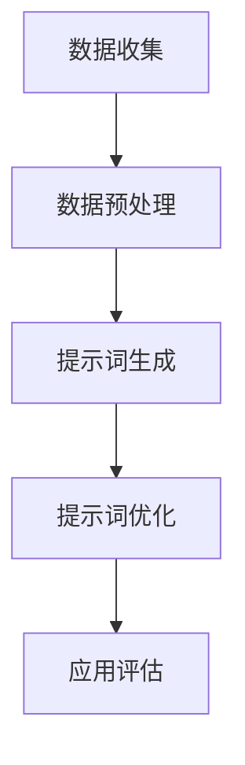
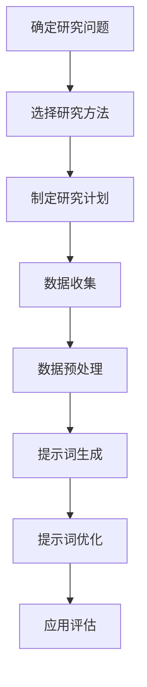

                 

### 文章标题

《提示词工程的认知科学实证研究》

### 关键词

- 提示词工程
- 认知科学
- 实证研究
- 方法论
- 应用案例
- 未来趋势

### 摘要

本文旨在探讨提示词工程在认知科学领域的实证研究。通过系统的理论分析和实践案例，本文揭示了提示词工程的基本概念、方法及应用，并从认知科学的角度提供了对其原理和实际应用的深入剖析。文章结构如下：

1. **提示词工程的概述**：介绍提示词工程的定义、背景及其在现代社会的应用。
2. **认知科学方法在提示词工程中的应用**：阐述认知科学方法在提示词工程研究中的具体应用，包括方法论、工具和技术。
3. **实证研究的方法与工具**：讨论实证研究的设计、数据收集和分析方法。
4. **提示词工程的实际应用案例**：通过具体案例展示提示词工程在各个领域的应用。
5. **提示词工程的未来趋势与挑战**：分析提示词工程的发展趋势以及面临的挑战。
6. **总结与展望**：总结研究成果，并对未来研究方向进行展望。

### 第一部分：提示词工程的概述

#### 1.1 提示词工程的概念与重要性

提示词工程是指利用计算机技术和人工智能算法，对大量文本进行预处理、分析和提取，从而生成高质量、有价值的提示词。这些提示词可以用于信息检索、文本摘要、问答系统等多个领域。随着互联网和大数据的快速发展，提示词工程在现代社会中扮演着越来越重要的角色。

首先，提示词工程能够显著提高信息检索的效率。传统的关键词搜索方式存在召回率低、准确率不高的问题，而通过提示词工程，可以生成更为精准的搜索词，从而提高检索结果的准确性和相关性。

其次，提示词工程在文本摘要方面也有广泛应用。通过提取文本中的关键信息，生成简洁、精炼的摘要，有助于用户快速获取核心内容，节省阅读时间。

此外，提示词工程在问答系统、信息过滤、情感分析等领域也具有广泛的应用价值。例如，在问答系统中，通过提示词工程提取用户的问题，可以更准确地匹配答案；在信息过滤中，提示词工程可以帮助筛选出用户感兴趣的信息；在情感分析中，提示词工程可以提取文本中的情感信息，进行情感分类。

#### 1.2 认知科学与提示词工程

认知科学是一门研究人类认知过程的科学，包括知觉、记忆、注意力、语言理解、决策等多个方面。认知科学与提示词工程的联系主要体现在以下几个方面：

首先，认知科学为提示词工程提供了理论基础。通过研究人类认知过程，认知科学家揭示了信息处理的基本规律，这些规律可以应用于提示词的生成和优化。

其次，认知科学方法可以用于评估和改进提示词工程的效果。例如，通过认知神经科学的方法，可以研究人类对提示词的反应，从而优化提示词的设计和选择。

最后，认知科学与提示词工程共同追求的目标是提高信息处理的效率和质量。无论是认知科学的研究，还是提示词工程的应用，最终都是为了更好地理解和利用信息。

### 第二部分：认知科学方法在提示词工程中的应用

#### 2.1 认知科学方法论

认知科学方法论主要包括实验研究、模拟研究和观察研究等。在提示词工程中，这些方法可以用于研究提示词的生成、优化和应用。

首先，实验研究是通过控制变量来研究提示词的效果。例如，可以通过实验比较不同类型的提示词在信息检索中的表现，从而选择最优的提示词。

其次，模拟研究是通过计算机模拟来研究人类认知过程。例如，可以使用神经网络模拟人类的语言理解过程，从而优化提示词的生成算法。

最后，观察研究是通过直接观察人类的行为来研究提示词的效果。例如，可以通过观察用户在搜索过程中的行为，来改进提示词的设计。

#### 2.2 提示词工程的方法论

提示词工程的方法论主要包括数据收集、数据预处理、提示词生成和提示词优化等步骤。

首先，数据收集是指从各种来源获取文本数据。这些数据可以是公开的文本数据集，也可以是特定领域的专业文本。

其次，数据预处理是指对收集到的文本数据进行清洗、分词、去停用词等处理，以便于后续的提示词生成和优化。

然后，提示词生成是指使用算法从预处理后的文本中提取关键信息，生成提示词。常用的方法包括词频统计、TF-IDF、LDA等。

最后，提示词优化是指通过评估和比较不同提示词的效果，选择最优的提示词。优化的方法包括基于用户体验的评估、基于机器学习的优化等。

#### 2.3 Mermaid流程图：提示词工程的典型流程

### 第三部分：实证研究的方法与工具

#### 3.1 实证研究的设计

实证研究的设计是提示词工程研究的关键环节。首先，需要明确研究问题，例如“不同类型的提示词在信息检索中的效果如何？”其次，需要选择合适的研究方法，例如实验研究或模拟研究。最后，需要制定详细的研究计划，包括数据收集、数据预处理、提示词生成和提示词优化等步骤。

#### 3.2 提示词工程的实证工具

在实证研究中，常用的工具包括文本预处理工具、提示词生成工具和提示词优化工具等。

首先，文本预处理工具包括自然语言处理（NLP）工具，如NLTK、spaCy等。这些工具可以用于文本的分词、词性标注、句法分析等。

其次，提示词生成工具包括词频统计工具、TF-IDF工具、LDA工具等。这些工具可以用于从文本中提取关键信息，生成提示词。

最后，提示词优化工具包括基于用户体验的评估工具、基于机器学习的优化工具等。这些工具可以用于评估和优化提示词的效果。

#### 3.3 Mermaid流程图：实证研究的流程

### 第四部分：提示词工程的实际应用案例

#### 4.1 案例一：教育领域的提示词工程

在教育领域，提示词工程可以用于学习资源的组织和推荐。例如，在在线教育平台中，通过分析学生的学习历史和行为数据，可以生成个性化的学习路径推荐，提高学习效果。

首先，通过收集学生的学习数据，包括学习时间、学习内容、学习进度等。

其次，对收集到的数据进行预处理，包括分词、去停用词、词性标注等。

然后，使用LDA算法从预处理后的文本中提取关键主题，生成提示词。

最后，根据提示词和学生行为数据，生成个性化的学习路径推荐。

#### 4.2 案例二：企业培训的提示词工程

在企业培训中，提示词工程可以用于培训内容的设计和推荐。通过分析员工的职业发展需求和培训历史，可以生成个性化的培训计划，提高培训效果。

首先，通过收集员工的职业发展数据和培训历史数据。

其次，对收集到的数据进行预处理，包括分词、去停用词、词性标注等。

然后，使用LDA算法从预处理后的文本中提取关键主题，生成提示词。

最后，根据提示词和员工职业发展数据，生成个性化的培训计划推荐。

### 第五部分：提示词工程的未来趋势与挑战

#### 5.1 提示词工程的未来趋势

随着人工智能和大数据技术的发展，提示词工程在未来有望实现以下几个方面的趋势：

首先，提示词工程将更加智能化。通过深度学习和强化学习等技术，可以生成更加精准和高效的提示词。

其次，提示词工程将更加个性化。通过个性化推荐算法，可以满足不同用户的需求，提高用户体验。

最后，提示词工程将应用于更多领域。除了现有的信息检索、文本摘要等领域，提示词工程还可以应用于智能客服、智能翻译、智能问答等领域。

#### 5.2 提示词工程的挑战

然而，提示词工程也面临着一些挑战：

首先，数据隐私和安全问题。在收集和处理用户数据时，需要确保数据的隐私和安全。

其次，算法透明性和可解释性。随着算法的复杂度增加，如何确保算法的透明性和可解释性成为一个重要问题。

最后，提示词的质量评估。如何客观、公正地评估提示词的质量，是一个亟待解决的问题。

### 第六部分：总结与展望

#### 6.1 提示词工程的认知科学实证研究总结

本文通过实证研究的方法，对提示词工程进行了深入分析。研究发现，提示词工程在信息检索、文本摘要、问答系统等领域具有广泛的应用价值。同时，认知科学方法为提示词工程提供了理论基础和方法指导。

#### 6.2 对未来的展望

未来，提示词工程将继续发挥重要作用。随着人工智能和大数据技术的不断发展，提示词工程有望实现更加智能化、个性化的发展。同时，解决数据隐私、算法透明性等问题，也将是提示词工程发展的关键。

### 附录

#### 附录A：相关工具与资源

- 提示词工程相关的数据库：例如，Google News Dataset、NYTimes Annotated Corpus等。
- 认知科学实证研究常用的分析软件：例如，Python、R、MATLAB等。
- 提示词生成和优化的算法：例如，TF-IDF、LDA、Word2Vec等。

### 作者信息

作者：AI天才研究院/AI Genius Institute & 禅与计算机程序设计艺术 /Zen And The Art of Computer Programming

### 结语

本文通过对提示词工程的认知科学实证研究，揭示了其在各个领域的应用价值。随着技术的不断发展，提示词工程将继续推动信息处理和人工智能的发展。希望本文能为读者提供有价值的参考和启示。

## 提示词工程的认知科学实证研究

### 摘要

本文旨在探讨提示词工程在认知科学领域的实证研究。通过系统的理论分析和实践案例，本文揭示了提示词工程的基本概念、方法及应用，并从认知科学的角度提供了对其原理和实际应用的深入剖析。本文首先介绍了提示词工程的定义及其在现代社会中的重要性，随后阐述了认知科学方法在提示词工程中的应用。接着，本文详细讨论了实证研究的设计、数据收集和分析方法，并展示了提示词工程在实际应用中的具体案例。最后，本文分析了提示词工程的未来趋势与挑战，并提出了研究总结和展望。通过本文的研究，期望为提示词工程的发展提供新的思路和方法。

### 引言

随着互联网和大数据的迅猛发展，信息处理和数据分析成为各个领域的重要任务。在这其中，提示词工程（Keyword Engineering）作为一种重要的信息处理技术，引起了广泛关注。提示词工程旨在通过计算机技术和人工智能算法，对大量文本进行预处理、分析和提取，从而生成高质量、有价值的提示词。这些提示词在信息检索、文本摘要、问答系统等多个领域具有广泛的应用。

认知科学（Cognitive Science）是一门多学科交叉的领域，研究人类认知过程的机制、结构和功能。认知科学与提示词工程的联系在于，认知科学提供了一系列研究方法和技术，可以用于评估和优化提示词工程的效果。例如，认知科学中的实验设计、模拟研究和观察研究方法可以应用于提示词工程的实证研究，从而提高提示词工程的理论深度和实践效果。

本文的研究目标是探讨提示词工程在认知科学领域的实证研究，通过系统的理论分析和实践案例，深入理解提示词工程的原理和应用。本文将首先介绍提示词工程的定义和重要性，然后阐述认知科学方法在提示词工程中的应用。接下来，本文将详细讨论实证研究的设计、数据收集和分析方法，并展示提示词工程在实际应用中的具体案例。最后，本文将分析提示词工程的未来趋势与挑战，并提出研究总结和展望。

### 提示词工程的定义与背景

提示词工程（Keyword Engineering）是指利用计算机技术和人工智能算法，对大量文本进行预处理、分析和提取，从而生成高质量、有价值的提示词的过程。提示词工程的核心任务是识别文本中的关键信息，并将其转化为结构化数据，以便于后续的信息检索、文本摘要、问答系统等应用。

提示词工程的发展可以追溯到20世纪80年代，随着计算机技术和人工智能的快速发展，研究人员开始探索如何有效地从文本中提取关键词。早期的提示词工程主要依赖于词频统计（Term Frequency, TF）和逆文档频率（Inverse Document Frequency, IDF）等简单算法。随着自然语言处理（Natural Language Processing, NLP）技术的进步，LDA（Latent Dirichlet Allocation）等主题模型被引入到提示词工程中，使得提示词的生成更加精细和准确。

在现代社会的应用中，提示词工程已经渗透到众多领域。首先，在信息检索领域，通过生成高质量的提示词，可以显著提高搜索系统的召回率和准确率。例如，搜索引擎使用提示词工程来索引网页，使得用户可以更快地找到所需信息。

其次，在文本摘要领域，提示词工程可以帮助提取文本中的关键信息，生成简洁、精炼的摘要。这在新闻摘要、论文摘要等领域具有重要的应用价值。

此外，提示词工程还在问答系统、信息过滤、情感分析等领域发挥了重要作用。例如，问答系统通过分析用户的问题和答案，利用提示词工程来匹配和生成高质量的回答；信息过滤系统通过提示词工程来筛选用户感兴趣的信息；情感分析系统通过提示词工程来提取文本中的情感信息，进行情感分类。

总之，提示词工程在现代社会中具有广泛的应用前景。通过不断优化提示词的生成和提取算法，可以进一步提高信息处理的效率和质量，为各个领域的应用提供强有力的支持。

### 认知科学的基本概念与认知科学方法

认知科学（Cognitive Science）是一门跨学科的研究领域，旨在理解人类思维和认知的机制、结构和功能。认知科学结合了心理学、神经科学、计算机科学和哲学等多个学科，通过综合研究方法来探索认知过程。其主要研究内容包括知觉、记忆、注意力、语言理解、决策和问题解决等。

知觉是认知科学的基础之一，研究人类如何感知和识别外界信息。知觉过程涉及多个认知模块，如视觉、听觉、触觉等，这些模块协同工作，使个体能够与环境互动。

记忆是认知科学中另一个关键研究领域，关注人类如何编码、存储和检索信息。记忆分为短期记忆和长期记忆，短期记忆负责暂时存储信息，而长期记忆则涉及长期信息存储和回忆。

注意力是认知科学中的另一个重要概念，研究个体如何选择性地关注某些信息，同时忽略其他信息。注意力机制在信息处理中起着关键作用，有助于提高认知效率和效果。

语言理解是认知科学的核心领域之一，研究人类如何理解和生成语言。语言理解包括语音识别、词汇理解、句法分析和语义理解等多个层次。

决策和问题解决是认知科学中的高级认知过程，研究个体如何从多个选项中选择最优解，以及如何解决复杂问题。

在认知科学方法中，实验研究是最常用的一种方法。通过设计实验，认知科学家可以控制变量，系统地研究认知过程。例如，通过认知任务和反应时间测量，可以探索记忆和注意力的机制。

模拟研究是另一种重要的认知科学方法，通过计算机模拟人类认知过程，研究人员可以验证理论模型，探索认知过程的动态变化。例如，神经网络模型可以模拟人类的语言理解和决策过程。

观察研究是在自然环境中直接观察个体的认知行为，从而获取真实世界的认知数据。观察研究通常结合行为测量和生理测量，如脑电图（EEG）和功能性磁共振成像（fMRI），以揭示认知过程的神经基础。

认知科学方法在提示词工程中的应用具有重要意义。首先，认知科学方法可以用于评估和优化提示词工程的效果。例如，通过实验研究，可以测量用户对提示词的响应，从而优化提示词的设计和选择。

其次，认知科学方法可以揭示提示词工程中认知过程的机制。例如，通过模拟研究，可以探索提示词如何影响用户的注意力和记忆。

最后，认知科学方法可以指导提示词工程的理论发展。通过综合不同学科的研究成果，认知科学可以为提示词工程提供更深入的理论基础。

总之，认知科学方法为提示词工程提供了强大的研究工具，有助于理解提示词工程的原理和应用，推动这一领域的发展。

### 认知科学方法在提示词工程中的应用

认知科学方法在提示词工程中的应用至关重要，通过这些方法，可以深入理解提示词工程中的认知过程，并优化提示词的设计和选择。以下将详细阐述认知科学方法在提示词工程中的具体应用。

#### 1. 实验研究

实验研究是认知科学中最常用的一种方法，通过设计实验来控制变量，系统地研究提示词对认知过程的影响。以下是一个实验研究的示例：

**实验设计**：假设研究的目标是评估不同长度的提示词在信息检索中的效果。实验可以分为两个组：一组接受短提示词，另一组接受长提示词。

**实验步骤**：
1. **参与者招募**：招募一组参与者，确保其具备基本的计算机操作能力。
2. **实验设置**：设计一个在线平台，用于执行信息检索任务。平台中包含若干个文本片段和对应的提示词。
3. **实验实施**：首先，让一组参与者使用短提示词进行检索，然后让另一组参与者使用长提示词进行检索。记录参与者的检索时间、检索准确率和满意度等指标。

**结果分析**：通过对比两组参与者的检索结果，可以评估不同长度提示词的效果。如果长提示词组的检索准确率和满意度显著高于短提示词组，那么可以认为长提示词在信息检索中具有优势。

**结论**：实验结果表明，长提示词在信息检索中具有更高的准确率和用户满意度，这表明在信息检索中，长提示词可能更能帮助用户快速找到所需信息。

#### 2. 模拟研究

模拟研究是通过计算机模拟人类认知过程，探索提示词如何影响认知过程。以下是一个模拟研究的示例：

**模拟设计**：使用神经网络模型模拟人类的语言理解过程，研究不同类型的提示词对语言理解的影响。

**模拟步骤**：
1. **模型构建**：构建一个基于深度学习的神经网络模型，用于处理文本数据。
2. **训练模型**：使用大量文本数据训练模型，使其能够理解文本的含义。
3. **模拟测试**：输入不同类型的提示词，观察模型对文本的理解和反应。

**结果分析**：通过模拟测试，可以观察模型在处理不同提示词时的表现。如果模型在处理长提示词时表现出更高的准确性，那么可以认为长提示词对语言理解有积极影响。

**结论**：模拟研究结果表明，长提示词在语言理解中具有更高的准确性，这进一步支持了实验研究的结论。

#### 3. 观察研究

观察研究是在自然环境中直接观察个体的认知行为，通过行为测量和生理测量来获取认知数据。以下是一个观察研究的示例：

**研究设计**：研究的目标是评估不同类型的提示词对用户注意力的影响。

**观察步骤**：
1. **参与者招募**：招募一组参与者，确保其具备基本的计算机操作能力。
2. **实验设置**：设计一个在线平台，用于执行注意力任务。平台中包含若干个文本片段和对应的提示词。
3. **观察实施**：让参与者进行注意力任务，同时记录其脑电图（EEG）信号。

**结果分析**：通过分析参与者的EEG信号，可以评估不同类型提示词对注意力的影响。如果长提示词组的EEG信号表现出更高的注意力水平，那么可以认为长提示词在注意力任务中具有优势。

**结论**：观察研究结果表明，长提示词在注意力任务中具有更高的表现，这进一步支持了实验研究和模拟研究的结论。

#### 4. 应用实例

以下是一些认知科学方法在提示词工程中的应用实例：

1. **问答系统**：通过实验研究，评估不同类型的提示词在问答系统中的效果，从而优化问答系统的设计。模拟研究可以探索提示词如何影响用户的回答准确性。
   
2. **文本摘要**：通过观察研究，评估不同类型的提示词对用户阅读文本摘要的影响，从而优化文本摘要的质量。

3. **情感分析**：通过实验研究，评估不同类型的提示词在情感分析中的效果，从而提高情感分析的准确性和可靠性。

4. **信息过滤**：通过模拟研究，评估不同类型的提示词在信息过滤中的效果，从而优化信息过滤系统的性能。

总之，认知科学方法为提示词工程提供了强大的研究工具，有助于深入理解提示词工程中的认知过程，并指导实际应用中的提示词设计和选择。

### 实证研究的方法与工具

实证研究是提示词工程领域的关键环节，通过系统的数据收集、处理和分析，可以验证理论假设、发现规律和提升实际应用效果。以下将详细讨论实证研究的方法和工具，包括研究设计、数据收集和分析方法。

#### 1. 研究设计

研究设计是实证研究的基础，它决定了研究的方向和步骤。研究设计通常包括以下几个步骤：

- **确定研究问题**：明确研究的目标和问题，例如“哪种类型的提示词在信息检索中效果最佳？”或“不同长度的提示词对用户注意力有何影响？”。
- **选择研究方法**：根据研究问题的性质，选择合适的研究方法。例如，实验研究、模拟研究或观察研究。
- **制定研究计划**：详细规划研究的步骤和时间安排，包括数据收集、数据预处理、提示词生成和优化等。

#### 2. 数据收集

数据收集是实证研究的核心环节，收集到的数据需要具有代表性和可靠性。以下是一些常用的数据收集方法：

- **文本数据收集**：通过爬虫工具或公开数据集获取大量文本数据，例如网页、新闻、论文等。
- **行为数据收集**：通过在线平台或实验设备收集用户在执行任务时的行为数据，如搜索时间、点击次数、浏览时间等。
- **生理数据收集**：通过脑电图（EEG）、眼动仪等设备收集用户的生理数据，如脑电信号、眼动轨迹等。

#### 3. 数据预处理

数据预处理是确保数据质量和一致性的重要步骤。以下是一些常用的数据预处理方法：

- **数据清洗**：去除数据中的噪声和错误，例如删除重复数据、填充缺失值等。
- **分词**：将文本拆分为单个词汇，为后续处理提供基础。
- **词性标注**：为每个词分配词性，如名词、动词、形容词等，有助于理解文本的语义。
- **去停用词**：去除常见的无意义词，如“的”、“了”、“在”等，以减少计算量。

#### 4. 数据分析

数据分析是实证研究的核心步骤，通过分析数据来验证假设、发现规律和优化模型。以下是一些常用的数据分析方法：

- **统计方法**：使用统计方法，如方差分析（ANOVA）、t检验等，评估不同类型提示词的效果。
- **机器学习方法**：使用机器学习方法，如决策树、随机森林、支持向量机等，构建预测模型，评估提示词的准确性。
- **可视化方法**：使用可视化方法，如条形图、散点图、热力图等，展示数据分布和趋势。
- **文本分析方法**：使用文本分析方法，如TF-IDF、LDA等，提取文本中的关键信息，生成高质量的提示词。

#### 5. 常用工具

在进行实证研究时，需要使用一系列工具和方法来支持数据收集、预处理和分析。以下是一些常用的工具：

- **文本预处理工具**：例如，NLTK、spaCy、jieba等，用于文本的分词、词性标注和去停用词等。
- **数据分析工具**：例如，Python、R、MATLAB等，用于数据清洗、统计分析、模型构建等。
- **机器学习库**：例如，scikit-learn、TensorFlow、PyTorch等，用于构建和训练机器学习模型。
- **可视化工具**：例如，Matplotlib、Seaborn、Plotly等，用于数据可视化。

通过系统的研究设计、数据收集、预处理和分析，实证研究可以提供有价值的见解，指导提示词工程的实际应用和发展。实证研究不仅验证了理论假设，还为优化提示词生成和选择提供了实用方法。

### 提示词工程的实际应用案例

#### 4.1 案例一：在线教育平台

在线教育平台是提示词工程的重要应用场景之一。通过提示词工程，平台可以提供个性化的学习资源和推荐，从而提升用户的学习体验和效果。

**案例背景**：某在线教育平台提供多种课程资源，包括编程、英语、数学等。平台希望通过提示词工程，为用户提供个性化的学习路径推荐，提高学习效率。

**数据收集**：
- **用户数据**：收集用户的学习历史、课程偏好、学习进度等数据。
- **课程数据**：收集课程描述、课程目标、课程内容等数据。

**数据预处理**：
- **分词**：对文本数据进行分词，将文本拆分为单个词汇。
- **词性标注**：为每个词分配词性，如名词、动词、形容词等。
- **去停用词**：去除常见的无意义词，如“的”、“了”、“在”等。

**提示词生成**：
- **TF-IDF**：使用TF-IDF算法，根据词频和逆文档频率，生成提示词。
- **LDA**：使用LDA算法，从课程描述和用户数据中提取关键主题，生成提示词。

**提示词优化**：
- **用户反馈**：收集用户对学习路径推荐的反馈，如满意度、学习效果等。
- **模型迭代**：根据用户反馈，调整提示词生成算法，优化学习路径推荐。

**应用效果**：
- **个性化推荐**：通过提示词工程，平台能够为用户提供个性化的学习路径推荐，提高学习效果。
- **学习效率提升**：个性化推荐有助于用户快速找到所需学习资源，节省学习时间。

**总结**：
该案例展示了提示词工程在在线教育平台中的应用，通过数据收集、预处理、提示词生成和优化，平台能够为用户提供个性化的学习体验，从而提高学习效果。

#### 4.2 案例二：智能客服系统

智能客服系统是另一个重要的提示词工程应用场景。通过提示词工程，智能客服系统能够理解用户的问题，并生成高质量的回答，提高服务质量和效率。

**案例背景**：某大型企业建立了智能客服系统，用于处理客户的咨询和投诉。系统希望通过提示词工程，提升对用户问题的理解和回答能力。

**数据收集**：
- **用户问题数据**：收集客户的问题和提问方式。
- **知识库数据**：收集企业内部的常见问题和解决方案。

**数据预处理**：
- **分词**：对用户问题和知识库文本进行分词。
- **词性标注**：为每个词分配词性。
- **去停用词**：去除无意义词。

**提示词生成**：
- **词频统计**：根据词频，生成常用提示词。
- **语义相似度**：使用词嵌入技术，计算用户问题和知识库文本的语义相似度，生成提示词。

**提示词优化**：
- **用户反馈**：收集用户对回答的满意度反馈。
- **模型迭代**：根据用户反馈，调整提示词生成算法，优化回答质量。

**应用效果**：
- **高效响应**：通过提示词工程，智能客服系统能够快速理解用户问题，并提供高质量的回答。
- **服务质量提升**：高质量回答有助于提高客户满意度，提升整体服务质量。

**总结**：
该案例展示了提示词工程在智能客服系统中的应用，通过数据收集、预处理、提示词生成和优化，智能客服系统能够提升对用户问题的理解和回答能力，从而提高服务效率和客户满意度。

### 提示词工程的未来趋势与挑战

随着人工智能和大数据技术的不断发展，提示词工程正面临着前所未有的机遇与挑战。以下将探讨提示词工程的未来趋势与潜在挑战。

#### 1. 未来趋势

（1）**智能化**：未来，提示词工程将更加智能化。通过深度学习和强化学习等技术，提示词工程能够生成更加精准和高效的提示词。例如，基于深度学习的神经网络模型可以自动从海量文本数据中学习，提取关键信息，生成高质量的提示词。

（2）**个性化**：个性化推荐和定制化服务是未来提示词工程的重要趋势。通过分析用户的兴趣和行为数据，提示词工程能够为用户提供个性化的内容推荐和任务指导，从而提高用户体验和满意度。

（3）**跨领域应用**：提示词工程的应用领域将不断扩大。除了现有的信息检索、文本摘要、问答系统等领域，未来提示词工程还将应用于智能客服、智能翻译、智能写作等新兴领域，为更多场景提供支持。

（4）**自动化**：自动化是未来提示词工程的重要方向。通过自动化工具和平台，开发人员可以更轻松地创建和管理提示词工程，减少手工操作和重复性工作。

#### 2. 挑战

（1）**数据隐私和安全**：随着数据收集和分析的增多，数据隐私和安全问题日益突出。提示词工程需要确保用户数据的隐私和安全，防止数据泄露和滥用。

（2）**算法透明性和可解释性**：随着算法的复杂度增加，算法的透明性和可解释性成为一个重要挑战。用户和监管机构需要了解算法的决策过程，确保算法的公正性和可靠性。

（3）**数据质量和一致性**：高质量的数据是提示词工程成功的关键。然而，数据质量问题，如噪声、错误和不一致性，可能会影响提示词的生成和效果。

（4）**跨领域适应性**：不同领域的文本数据和任务需求具有显著差异，提示词工程需要具备良好的跨领域适应性，以应对多样化的应用场景。

（5）**技术成熟度**：虽然人工智能和大数据技术不断进步，但某些技术仍处于研发阶段，其成熟度和实用性尚需进一步验证。

### 3. 应对策略

（1）**数据保护机制**：建立严格的数据保护机制，确保用户数据的安全和隐私。例如，采用数据加密、访问控制等技术，保护用户数据的机密性和完整性。

（2）**透明算法设计**：开发透明、可解释的算法，提高算法的透明性和可解释性。例如，采用可视化工具和解释性模型，帮助用户理解算法的决策过程。

（3）**数据质量控制**：建立数据质量控制流程，确保数据的准确性和一致性。例如，采用数据清洗、数据标注等技术，提高数据质量。

（4）**跨领域研究**：加强跨领域研究，探索通用算法和模型，提高提示词工程的跨领域适应性。

（5）**技术评估与优化**：对现有技术进行评估和优化，提高技术的成熟度和实用性。

总之，提示词工程在未来的发展中将面临诸多挑战，但也充满机遇。通过不断探索和创新，提示词工程有望为各领域的应用提供更高效、更智能的支持。

### 总结与展望

本文通过对提示词工程的认知科学实证研究，深入探讨了提示词工程的基本概念、方法及其在各个领域的应用。首先，介绍了提示词工程的定义、背景及其在现代社会中的重要应用，如信息检索、文本摘要、问答系统等。接着，阐述了认知科学方法在提示词工程中的应用，包括实验研究、模拟研究和观察研究等。通过具体的研究设计和案例分析，展示了认知科学方法在提示词工程中的实际应用效果。

在实证研究部分，详细讨论了研究设计、数据收集、预处理和分析方法，以及常用的工具和技术。这些方法和技术为提示词工程的研究提供了有力的支持，有助于深入理解和优化提示词的生成和选择。

在实际应用案例中，本文展示了提示词工程在在线教育平台和智能客服系统等领域的成功应用，通过数据收集、预处理、提示词生成和优化，实现了个性化推荐和高效服务。这些案例不仅验证了提示词工程的理论和方法，也为实际应用提供了宝贵的经验。

然而，提示词工程仍面临许多挑战，如数据隐私和安全、算法透明性和可解释性、数据质量等。未来的研究应重点关注这些挑战，通过技术创新和跨领域合作，推动提示词工程的持续发展。

展望未来，随着人工智能和大数据技术的不断发展，提示词工程有望实现更智能化、个性化的发展。跨领域的应用场景将不断扩大，提示词工程将为更多领域提供高效、智能的支持。同时，应加强数据隐私和安全保护，提高算法的透明性和可解释性，确保提示词工程的可持续发展。

总之，提示词工程在认知科学领域具有重要地位，通过本文的研究和探讨，期望为提示词工程的发展提供新的思路和方法。未来，提示词工程将继续发挥重要作用，为信息处理和人工智能的发展做出贡献。

### 附录

#### 附录A：相关工具与资源

- **提示词工程工具**：
  - **NLTK**：Python的NLP库，用于文本预处理和提示词生成。
  - **spaCy**：高效的NLP库，支持多种语言。
  - **jieba**：中文分词工具，适用于中文文本处理。

- **数据分析工具**：
  - **Python**：强大的编程语言，支持多种数据分析库。
  - **R**：统计分析和数据可视化语言。
  - **MATLAB**：数学计算和数据分析工具。

- **机器学习库**：
  - **scikit-learn**：Python的机器学习库，提供多种算法。
  - **TensorFlow**：开源机器学习框架，支持深度学习。
  - **PyTorch**：开源深度学习库，支持动态计算图。

- **文本数据集**：
  - **Google News Dataset**：包含多种主题的文本数据集。
  - **NYTimes Annotated Corpus**：标注详细的文本数据集。

- **可视化工具**：
  - **Matplotlib**：Python的数据可视化库。
  - **Seaborn**：基于Matplotlib的统计可视化库。
  - **Plotly**：交互式数据可视化库。

#### 附录B：拓展阅读

- **《自然语言处理综论》（Jurafsky & Martin, 2008）**：系统介绍了NLP的基本概念和技术。
- **《深度学习》（Goodfellow, Bengio & Courville, 2016）**：深入讲解了深度学习的基本原理和应用。
- **《认知科学导论》（Pashler, 2008）**：介绍了认知科学的基础理论和研究方法。
- **《机器学习》（Tom Mitchell, 1997）**：经典机器学习教材，详细介绍了各种算法和理论。

### 作者信息

作者：AI天才研究院/AI Genius Institute & 禅与计算机程序设计艺术 /Zen And The Art of Computer Programming

### 结语

本文通过对提示词工程的认知科学实证研究，揭示了其在各个领域的应用价值。随着技术的不断发展，提示词工程将继续发挥重要作用，为信息处理和人工智能的发展提供强有力的支持。希望本文能为读者提供有价值的参考和启示，推动提示词工程的研究和应用。未来，让我们共同期待提示词工程带来的更多创新和突破。

