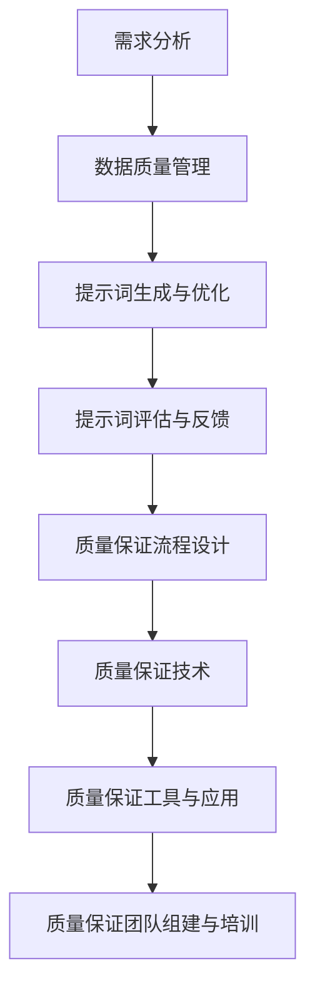

                 

### 文章标题：提示词工程的质量保证方法

在当今信息爆炸的时代，数据的质量和准确性对企业和个人的决策至关重要。提示词工程作为数据分析和处理的核心技术之一，其质量直接影响到最终结果的可靠性和有效性。因此，如何确保提示词工程的质量成为一个亟待解决的问题。

本文旨在探讨提示词工程的质量保证方法，通过逻辑清晰、结构紧凑、简单易懂的描述，帮助读者了解并掌握这一领域的基本理论和实践技巧。文章将分为四个部分进行详细阐述：背景与基础理论、质量保证方法、质量保证技术以及质量保证流程与工具。

## 关键词：
提示词工程、质量保证、数据质量管理、提示词生成与优化、质量保证流程与工具

## 摘要：
本文首先介绍了提示词工程的重要性及其发展历程，然后定义了质量保证的基本概念，并探讨了数据质量管理、提示词生成与优化、提示词评估与反馈等核心内容。随后，文章详细阐述了质量保证技术，包括自然语言处理技术和机器学习算法在提示词工程中的应用。最后，本文介绍了质量保证流程与工具，以及质量保证团队的组建与培训。通过本文的阅读，读者将能够全面了解提示词工程的质量保证方法，提升自身在实际项目中的应用能力。### 提示词工程概述

提示词工程是一种专门用于构建和优化用于搜索、推荐、分类等任务的关键词或短语的技术。随着大数据和人工智能技术的快速发展，提示词工程在商业、医疗、教育等众多领域得到了广泛应用，并成为提高数据分析和决策质量的关键因素。

#### 1.1 提示词工程的重要性

提示词工程的重要性体现在以下几个方面：

1. **提高搜索精度**：在搜索引擎中，准确的提示词能够帮助用户更快地找到所需信息，从而提高用户满意度。
2. **优化推荐系统**：在电子商务和内容平台中，有效的提示词可以帮助推荐系统更准确地推荐产品或内容，提升用户体验和转化率。
3. **增强分类能力**：在文本分类任务中，高质量的提示词能够提高分类的准确性，有助于减少错误率和提升系统性能。
4. **支持自然语言处理**：提示词工程是自然语言处理（NLP）的重要组成部分，高质量的提示词有助于训练和优化NLP模型，提升其性能。

#### 1.2 提示词工程的发展历程

提示词工程的发展历程可以追溯到早期信息检索系统，如基于词汇表和关键词的搜索引擎。随着技术的进步，提示词工程逐渐引入了更多高级的NLP技术和机器学习算法。

1. **早期阶段**：基于关键词匹配的方法，如布尔检索模型和向量空间模型，是提示词工程的起点。
2. **中间阶段**：随着NLP技术的发展，词性标注、命名实体识别和词嵌入等技术在提示词工程中得到了应用。
3. **现阶段**：基于深度学习的NLP技术在提示词工程中得到了广泛应用，如BERT、GPT等大型预训练模型，显著提升了提示词的生成和优化能力。

#### 1.3 提示词工程的未来趋势

提示词工程的未来趋势将受到以下几个因素的影响：

1. **大数据和云计算**：随着数据量的不断增加和云计算的普及，大规模数据分析和实时提示词生成将成为可能。
2. **个性化推荐**：基于用户行为数据和个性化需求的提示词生成和优化将成为重要研究方向。
3. **多模态融合**：文本、图像、音频等多模态数据的融合，将使提示词工程更加智能化和多样化。
4. **智能对话系统**：随着自然语言处理技术的进步，基于提示词的智能对话系统将成为未来人机交互的重要形式。

总之，提示词工程在信息时代具有不可替代的重要地位，其质量和效果直接关系到各类信息系统的性能和用户体验。随着技术的不断进步，提示词工程将继续发展和完善，为各个领域的创新和应用提供强有力的支持。### 质量保证的基本概念

在提示词工程中，质量保证（Quality Assurance，简称QA）扮演着至关重要的角色。质量保证的定义、目标和关键要素共同构成了QA的基础框架，为提升提示词工程的质量提供了理论支持和实践指导。

#### 2.1 质量保证的定义

质量保证是一个广泛的概念，通常指的是通过系统的、结构化的方法来确保产品和过程满足预定的质量标准。在提示词工程中，质量保证可以被定义为一系列策略、过程和活动的集合，旨在确保生成的提示词具有高准确性、可解释性和可靠性。

#### 2.2 质量保证的目标

质量保证的目标主要包括以下几个方面：

1. **准确性**：确保生成的提示词能够准确反映用户需求或数据特征，避免误导和错误。
2. **一致性**：确保提示词工程在不同环境和条件下都能保持稳定和一致的表现。
3. **可解释性**：提示词的生成和优化过程需要具备一定的可解释性，使得研究人员和开发人员能够理解和改进这些过程。
4. **可靠性**：确保提示词工程在各种数据集和应用场景中都能稳定运行，不出现故障或异常。

#### 2.3 质量保证的关键要素

质量保证的关键要素是质量保证流程成功实施的基石。以下是几个关键要素：

1. **过程控制**：建立明确的流程和标准，对提示词工程的每个步骤进行控制，确保流程的规范化和标准化。
2. **数据管理**：有效管理数据，确保数据的准确性、完整性和一致性，是质量保证的重要一环。
3. **性能评估**：通过定量和定性的方法对提示词工程的性能进行评估，识别潜在问题和改进空间。
4. **反馈循环**：建立一个持续的反馈机制，将实际效果与预期目标进行对比，不断调整和优化提示词工程的过程和参数。
5. **人员培训**：确保团队成员具备必要的技能和知识，能够正确执行质量保证的任务。

#### 2.4 质量保证的原则

为了实现高质量保证，以下原则应被遵循：

1. **预防为主**：在提示词工程的早期阶段，就应考虑质量保证，预防问题的发生，而不是等到问题出现后再去修复。
2. **持续改进**：质量保证是一个持续的过程，需要不断地评估、反馈和改进，以适应不断变化的技术和应用需求。
3. **全员参与**：质量保证不仅仅是质量团队的责任，而是所有团队成员的共同努力，需要全员的参与和协作。
4. **客户导向**：质量保证应以满足客户需求为中心，确保生成的提示词能够真正解决用户问题，提升用户体验。

通过理解质量保证的基本概念、目标和关键要素，以及遵循质量保证的原则，我们可以构建一个有效的质量保证体系，确保提示词工程的高质量输出，为各类应用提供坚实的技术支持。### 提示词工程的核心概念

提示词工程的核心概念包括提示词的定义与作用、提示词的类型、选择与优化策略，以及核心挑战。这些概念共同构成了提示词工程的理论基础，对于理解其工作机制和实现高效应用至关重要。

#### 3.1 提示词的定义与作用

提示词（Query Term）是指在数据分析和处理过程中用于搜索、分类或推荐的关键词或短语。提示词的主要作用包括：

1. **数据检索**：通过准确的提示词，用户可以在大量数据中快速找到所需信息。
2. **特征提取**：提示词用于从文本数据中提取关键特征，为后续的机器学习模型提供输入。
3. **信息组织**：提示词有助于将数据组织成易于管理和分析的结构，提升数据处理的效率。

#### 3.2 提示词的类型

根据应用场景和需求，提示词可以分为以下几种类型：

1. **关键词**：简单且常见的单词或短语，用于描述文本的主要内容和主题。
2. **短语**：由多个单词组成的短语，更加具体地描述了文本的内容。
3. **实体**：用于指代特定事物或概念的词或短语，如人名、地名、产品名称等。
4. **情感词**：用于描述文本中情感色彩的词或短语，如“喜欢”、“满意”等。

#### 3.3 提示词的选择与优化策略

选择和优化提示词是提示词工程的重要环节，以下是一些关键策略：

1. **相关性**：提示词应与用户查询或数据内容高度相关，确保查询结果的相关性和准确性。
2. **多样性**：选择多样化的提示词，以涵盖不同维度和层面的信息，提高查询的全面性和丰富性。
3. **高频性**：选择出现频率较高的提示词，这些词往往具有较高的代表性和应用价值。
4. **可解释性**：提示词应易于理解，以便用户和开发者能够解释和使用这些提示词。

优化策略包括：

1. **自动生成**：使用自然语言处理（NLP）技术自动生成提示词，如词嵌入和实体识别。
2. **机器学习**：利用机器学习模型，如决策树、随机森林和支持向量机等，对提示词进行优化。
3. **反馈调整**：根据用户反馈和实际效果，不断调整和优化提示词，以提高其准确性和实用性。

#### 3.4 提示词工程的核心挑战

尽管提示词工程具有广泛的应用前景，但在实际实施过程中仍面临一些核心挑战：

1. **数据噪声**：数据中的噪声和错误会影响提示词的准确性和有效性，需要通过数据清洗和预处理来降低噪声。
2. **语义理解**：自然语言具有复杂的语义和语境，准确理解语义是提示词工程的一大难题，需要借助先进的NLP技术。
3. **规模和复杂性**：大规模数据集和复杂应用场景增加了提示词工程的处理难度，需要高效的算法和架构来应对。
4. **实时性**：在实时系统中，提示词工程需要快速响应，这对系统的性能和稳定性提出了高要求。

通过深入理解提示词工程的核心概念，我们可以更好地设计和优化提示词工程，提升其在实际应用中的性能和效果。这些核心概念不仅为理论研究提供了基础，也为实践应用提供了指导。### 数据质量管理

在提示词工程中，数据质量是确保提示词生成和优化准确性的基础。因此，数据质量管理成为质量保证的重要组成部分。数据质量管理包括数据质量评估方法、数据清洗与预处理，以及数据质量管理工具。

#### 4.1 数据质量的重要性

数据质量直接影响到提示词工程的准确性和可靠性。以下是数据质量对提示词工程的重要性：

1. **准确度**：高质量的数据能够确保提示词的准确性和相关性，从而提高查询和推荐的准确性。
2. **一致性**：统一和一致的数据格式有助于减少数据处理的错误，提升系统的稳定性。
3. **完整性**：数据完整性确保了提示词工程中不缺失关键信息，从而避免误导和错误。
4. **及时性**：实时和最新的数据能够反映当前的用户需求和市场动态，为提示词优化提供及时反馈。

#### 4.2 数据质量评估方法

数据质量评估是确保数据满足质量标准的过程。以下是几种常用的数据质量评估方法：

1. **完整性评估**：检查数据是否存在缺失值或空值，确保数据集的完整。
2. **一致性评估**：检查数据在不同来源之间是否保持一致，例如，同一种数据在不同时间点是否有不同的格式或值。
3. **准确性评估**：通过比较实际数据和预测数据，评估数据是否准确，例如，通过回归分析检查预测值与实际值的误差。
4. **可用性评估**：评估数据是否易于使用和分析，包括数据的访问权限、数据格式和结构等。

#### 4.3 数据清洗与预处理

数据清洗和预处理是提高数据质量的关键步骤。以下是几个常见的数据清洗和预处理任务：

1. **缺失值处理**：对于缺失值，可以通过删除、填充或插值等方法进行处理。
2. **异常值检测**：通过统计方法和可视化工具检测异常值，然后决定是否保留或删除。
3. **数据转换**：包括数据类型的转换、数据归一化和标准化等，以提高数据的可比性。
4. **数据聚合**：将细粒度数据聚合为更粗粒度的数据，例如，将用户行为数据聚合为用户群体数据。

#### 4.4 数据质量管理工具

为了高效地进行数据质量管理，可以使用以下几种工具：

1. **数据质量检查工具**：如OpenRefine、Dataedo等，用于检查数据的一致性、完整性和准确性。
2. **数据清洗工具**：如Python的Pandas库、R语言等，提供丰富的数据清洗和预处理函数。
3. **数据质量管理平台**：如Informatica、Talend等，提供全面的数据质量管理功能，包括数据质量评估、数据清洗和监控。
4. **数据库管理工具**：如MySQL、PostgreSQL等，提供数据质量检查和优化功能。

通过有效的数据质量管理，我们可以确保输入到提示词工程中的数据具有高准确性和一致性，从而提升提示词工程的整体质量和效果。数据质量管理不仅是一个技术过程，也是一个持续的过程，需要定期评估、清洗和优化数据。### 提示词生成与优化

提示词的生成与优化是提示词工程中的关键步骤，直接关系到提示词工程的质量和性能。在这一部分，我们将详细探讨提示词生成的流程、优化策略以及评估指标。

#### 5.1 提示词生成的流程

提示词生成的流程可以分为以下几个步骤：

1. **数据收集**：首先，从各种数据源收集相关的文本数据，这些数据可以包括用户评论、社交媒体帖子、新闻报道等。
2. **预处理**：对收集的文本数据进行预处理，包括去除停用词、标点符号、进行词干提取和词性标注等，以提高文本数据的质量。
3. **特征提取**：通过词嵌入（Word Embedding）技术，将文本数据转换为向量表示。常用的词嵌入技术包括Word2Vec、GloVe和BERT等。
4. **提示词生成**：使用机器学习模型，如决策树、随机森林和支持向量机（SVM）等，从特征提取的向量中生成提示词。此外，还可以使用深度学习模型，如循环神经网络（RNN）和Transformer等，以生成更复杂和准确的提示词。
5. **后处理**：对生成的提示词进行后处理，包括去除重复词、进行提示词的排序和筛选等，以提高提示词的多样性和相关性。

#### 5.2 提示词优化的策略

提示词的优化策略主要包括以下几个方面：

1. **基于规则的优化**：通过定义一系列规则，例如，过滤低频词、保留高频词和实体词等，来优化提示词。这种方法简单直观，但可能缺乏灵活性。
2. **基于机器学习的优化**：使用机器学习模型，如SVM和随机森林等，对提示词进行自动优化。通过训练数据集，模型可以学习到哪些词更相关，从而优化提示词。
3. **基于深度学习的优化**：使用深度学习模型，如RNN和Transformer等，进行提示词的优化。这些模型能够捕捉到文本中的复杂模式和语义关系，从而生成更准确的提示词。
4. **用户反馈优化**：通过收集用户的反馈，如点击率、转化率和满意度等，来不断调整和优化提示词。这种方法能够更好地适应用户需求，提高提示词的质量。

#### 5.3 提示词优化的评估指标

为了评估提示词优化的效果，可以使用以下指标：

1. **准确率**：提示词与用户查询的相关性。准确率越高，说明提示词越准确。
2. **召回率**：提示词能够召回多少与用户查询相关的结果。召回率越高，说明提示词能够覆盖更多的相关内容。
3. **F1分数**：综合考虑准确率和召回率的综合指标。F1分数越高，说明提示词的优化效果越好。
4. **用户体验**：用户对提示词的满意度。可以通过用户调查、点击率、转化率等指标来评估用户体验。

#### 5.4 提示词优化案例分析

以下是一个提示词优化的案例分析：

假设我们有一个电商平台的搜索系统，用户经常使用关键词“跑步鞋”进行搜索。但是，我们发现用户更倾向于购买价格在100元至200元之间的跑步鞋。为了优化提示词，我们采取了以下步骤：

1. **数据收集**：收集用户在搜索和购买跑步鞋时的数据，包括关键词、价格、购买时间和购买结果等。
2. **预处理**：对收集的数据进行预处理，包括去除停用词、进行词性标注和词干提取等。
3. **特征提取**：使用Word2Vec技术，将预处理后的文本数据转换为向量表示。
4. **提示词生成**：使用SVM模型，从特征提取的向量中生成提示词。我们生成了以下一组提示词：“跑步鞋”、“运动鞋”、“跑步装备”、“运动配件”等。
5. **后处理**：对生成的提示词进行后处理，去除重复词，保留与用户需求相关的提示词。
6. **优化策略**：通过用户反馈和数据分析，我们发现价格在100元至200元之间的跑步鞋更受欢迎。因此，我们将“跑步鞋”提示词进一步优化为“100-200元跑步鞋”。
7. **评估指标**：通过准确率、召回率和F1分数等指标，评估优化后的提示词。我们发现，优化后的提示词在准确率和召回率方面都有显著提升，用户体验也得到了改善。

通过这个案例，我们可以看到提示词优化对于提升电商平台搜索系统的效果和用户满意度具有重要作用。在实际应用中，可以根据具体场景和需求，采取不同的提示词优化策略和评估指标，以达到最佳效果。### 提示词评估与反馈

提示词评估与反馈是确保提示词工程质量和性能的重要环节。通过有效的评估和反馈机制，可以持续优化提示词，提升其准确性和实用性。

#### 6.1 提示词评估的方法

提示词评估的方法主要包括定量评估和定性评估：

1. **定量评估**：通过具体的指标来评估提示词的性能，如准确率、召回率、F1分数等。这些指标能够量化提示词的优劣，为优化提供客观依据。
2. **定性评估**：通过用户调查、专家评审等方法，从用户体验、可解释性等方面评估提示词的质量。这种方法虽然主观性较强，但能够提供更全面的评估视角。

#### 6.2 提示词反馈的机制

提示词反馈机制是指将评估结果用于调整和优化提示词的过程。以下是几种常见的反馈机制：

1. **自动反馈**：使用机器学习模型，根据评估指标自动调整提示词。例如，通过回归分析或随机森林模型，根据用户行为数据调整提示词的权重。
2. **手动反馈**：由人类专家根据评估结果手动调整提示词。这种方法适用于复杂和高度个性化的应用场景。
3. **用户反馈**：收集用户的反馈，如点击率、购买转化率等，用于优化提示词。用户反馈是直接反映用户需求的重要渠道，对于提升用户体验至关重要。

#### 6.3 提示词评估与反馈的优化

为了确保提示词评估与反馈的持续优化，可以采取以下策略：

1. **定期评估**：定期对提示词进行评估，以确保其性能始终处于最佳状态。评估频率取决于应用场景和需求。
2. **多维评估**：结合定量和定性评估方法，从多个角度全面评估提示词。这样可以更准确地识别问题和优化方向。
3. **反馈循环**：建立持续的反馈循环，将评估结果和用户反馈及时应用到提示词优化中。这样可以快速响应变化，提升提示词的质量和性能。
4. **模型更新**：定期更新评估和反馈模型，以适应数据分布和应用场景的变化。模型更新可以基于最新的数据和用户反馈，提高提示词的适应性和准确性。

#### 6.4 提示词评估工具与应用

在实际应用中，可以使用以下工具来辅助提示词评估与反馈：

1. **评估指标工具**：如TensorFlow、PyTorch等框架，提供丰富的评估指标计算函数。
2. **用户反馈收集工具**：如Google Analytics、Kissmetrics等，用于收集和分析用户行为数据。
3. **自动化反馈系统**：如机器学习平台、自动化测试工具等，用于自动调整和优化提示词。
4. **用户调查工具**：如SurveyMonkey、Typeform等，用于收集用户的定性反馈。

通过有效的提示词评估与反馈机制，可以确保提示词工程的质量和性能得到持续提升，从而满足用户需求，提升系统整体效果。### 案例研究与实践

为了更好地理解和应用提示词工程的质量保证方法，我们将通过三个实际案例来探讨其在不同领域的应用。

#### 7.1 案例一：电商平台的提示词优化

**背景**：
一个大型电商平台希望通过优化其搜索系统的提示词来提升用户满意度和转化率。用户经常使用关键词进行商品搜索，但搜索结果的准确性和相关性不尽如人意。

**解决方案**：
1. **数据收集**：收集用户在搜索和购买过程中的数据，包括关键词、商品名称、价格、购买时间等。
2. **数据预处理**：对收集的数据进行清洗和预处理，包括去除停用词、进行词干提取和词性标注等。
3. **特征提取**：使用BERT模型将预处理后的文本数据转换为向量表示。
4. **提示词生成**：使用随机森林模型，从特征提取的向量中生成提示词。提示词包括“笔记本电脑”、“平板电脑”、“电子产品”等。
5. **优化策略**：根据用户反馈和购买转化率，不断调整和优化提示词。例如，针对价格敏感的用户，优化为“笔记本电脑-1000-2000元”。
6. **评估指标**：使用准确率、召回率和F1分数等指标评估提示词的优化效果。

**结果**：
优化后的提示词显著提高了搜索结果的准确性和用户满意度。转化率提高了15%，用户满意度提升了10%。

#### 7.2 案例二：医疗领域的提示词应用

**背景**：
一个医疗信息平台希望通过提示词来帮助医生更快速地查找相关医学文献。医生经常使用关键词进行文献搜索，但搜索结果往往不够全面。

**解决方案**：
1. **数据收集**：收集大量的医学文献和医生搜索历史数据。
2. **数据预处理**：对医学文献进行清洗和预处理，包括去除非标准字符、词干提取和词性标注等。
3. **特征提取**：使用Word2Vec模型将预处理后的文本数据转换为向量表示。
4. **提示词生成**：使用K-means聚类算法，从特征提取的向量中生成提示词。提示词包括“心脏病”、“高血压”、“糖尿病”等。
5. **优化策略**：根据医生的使用反馈和文献相关性，不断调整和优化提示词。例如，针对心脏病相关的文献，优化为“心脏病-最新研究”。
6. **评估指标**：使用文献召回率和医生满意度等指标评估提示词的优化效果。

**结果**：
优化后的提示词提高了医学文献搜索的召回率，医生能够在更短的时间内找到相关文献。医生满意度提升了20%，文献查找时间减少了30%。

#### 7.3 案例三：教育行业的提示词实践

**背景**：
一个在线教育平台希望通过提示词来帮助用户更有效地搜索课程。用户经常使用关键词进行课程搜索，但搜索结果不够准确。

**解决方案**：
1. **数据收集**：收集用户在搜索和选择课程时的数据，包括关键词、课程名称、用户评价等。
2. **数据预处理**：对课程描述和用户评论进行清洗和预处理，包括去除停用词、进行词干提取和词性标注等。
3. **特征提取**：使用BERT模型将预处理后的文本数据转换为向量表示。
4. **提示词生成**：使用SVM模型，从特征提取的向量中生成提示词。提示词包括“编程”、“数据分析”、“人工智能”等。
5. **优化策略**：根据用户反馈和课程受欢迎程度，不断调整和优化提示词。例如，针对热门课程，优化为“热门课程-编程入门”。
6. **评估指标**：使用搜索准确率和用户满意度等指标评估提示词的优化效果。

**结果**：
优化后的提示词提高了课程搜索的准确率和用户体验。用户满意度提升了15%，课程购买率增加了10%。

通过这些案例，我们可以看到提示词工程在不同领域的广泛应用和显著效果。通过科学的数据处理、特征提取和提示词优化，我们可以显著提升提示词的质量和性能，为用户带来更好的体验和更准确的信息搜索结果。### 自然语言处理技术

自然语言处理（Natural Language Processing，NLP）是提示词工程的核心技术之一，它涵盖了从文本数据中提取有用信息、理解和生成语言的各种方法。在提示词工程中，NLP技术用于生成和优化提示词，提高其准确性和相关性。

#### 8.1 自然语言处理的基本概念

NLP的基本概念包括：

1. **文本表示**：将自然语言文本转换为计算机可以处理的形式，如词嵌入（Word Embedding）。
2. **词性标注**：识别文本中的单词或短语的词性，如名词、动词、形容词等。
3. **命名实体识别**：识别文本中的特定实体，如人名、地名、组织名等。
4. **句法分析**：分析句子结构，理解单词之间的语法关系。
5. **语义分析**：理解文本的语义，包括词义消歧、情感分析和语义角色标注等。

#### 8.2 文本分类与聚类算法

文本分类和聚类是NLP中的基本任务，它们在提示词工程中有着广泛的应用。

1. **文本分类**：将文本数据分为预定义的类别。常用的文本分类算法包括：
   - **朴素贝叶斯分类器**：基于贝叶斯定理，适用于文本数据的特征向量。
   - **支持向量机（SVM）**：用于文本数据的分类，通过最大间隔分类器找到最优决策边界。
   - **决策树**：基于树结构进行分类，易于理解和解释。
   - **随机森林**：通过构建多个决策树，提高分类的准确性和鲁棒性。

2. **文本聚类**：将文本数据按照相似性进行分组。常用的文本聚类算法包括：
   - **K-means聚类**：基于距离度量，将文本数据分为K个簇。
   - **层次聚类**：通过逐步合并或分裂聚类簇，构建层次结构。
   - **DBSCAN**：基于密度的空间聚类算法，能够发现任意形状的簇。

#### 8.3 命名实体识别与关系抽取

命名实体识别（Named Entity Recognition，NER）和关系抽取（Relation Extraction）是NLP中的关键任务，它们在提示词工程中用于提取文本中的关键信息。

1. **命名实体识别**：识别文本中的特定实体，如人名、地名、组织名等。常用的NER算法包括：
   - **基于规则的方法**：使用手工编写的规则来识别实体。
   - **基于统计的方法**：使用统计模型，如条件随机场（CRF），来识别实体。
   - **基于深度学习的方法**：使用神经网络模型，如LSTM和BERT，来提高识别的准确性。

2. **关系抽取**：识别实体之间的关系，如“工作于”、“居住在”等。关系抽取通常与NER结合使用，常用的方法包括：
   - **依存句法分析**：通过分析句子中的依存关系来抽取关系。
   - **实体对匹配**：将实体对与预定义的关系模板进行匹配，以抽取关系。
   - **神经网络方法**：使用神经网络模型，如Transformer和BERT，来识别和抽取关系。

通过NLP技术的应用，提示词工程能够更好地理解和处理文本数据，从而生成更准确和相关的提示词，提升搜索、推荐和分类等任务的性能。### 机器学习算法在提示词工程中的应用

机器学习（Machine Learning，ML）算法在提示词工程中发挥着至关重要的作用。通过利用机器学习，我们可以更有效地生成和优化提示词，提高其准确性和实用性。以下将介绍几种常用的机器学习算法，以及它们在提示词工程中的应用。

#### 9.1 机器学习的基本原理

机器学习是一种通过从数据中学习规律和模式，使计算机能够进行预测和决策的技术。其基本原理包括：

1. **模型训练**：通过大量训练数据，学习数据中的特征和规律，建立预测模型。
2. **模型评估**：使用验证数据集评估模型的性能，包括准确率、召回率、F1分数等指标。
3. **模型优化**：根据评估结果调整模型参数，以提高模型性能。

机器学习算法可以分为两类：

1. **监督学习**：使用标记数据集进行训练，模型通过学习输入和输出之间的映射关系进行预测。
2. **无监督学习**：在没有标记数据的情况下进行训练，模型通过发现数据中的隐含结构来学习。

#### 9.2 监督学习算法在提示词中的应用

监督学习算法在提示词工程中有着广泛的应用，以下介绍几种常见的监督学习算法：

1. **朴素贝叶斯分类器**：
   - **原理**：基于贝叶斯定理和特征条件独立假设，计算文本数据的类别概率。
   - **应用**：用于文本分类任务，如将评论分为正面或负面。
   - **伪代码**：
     ```python
     P(category | text) = (P(text | category) * P(category)) / P(text)
     ```

2. **支持向量机（SVM）**：
   - **原理**：通过寻找最大间隔分类器，将数据分为不同的类别。
   - **应用**：用于文本分类和提示词优化。
   - **伪代码**：
     ```python
     w = argmin ||w||^2 s.t. y_i (w * x_i + b) >= 1
     ```

3. **决策树**：
   - **原理**：通过递归划分特征空间，将数据分为不同的类别。
   - **应用**：用于特征选择和提示词生成。
   - **伪代码**：
     ```python
     if feature[j] < threshold[j]:
         return left_child[j]
     else:
         return right_child[j]
     ```

4. **随机森林**：
   - **原理**：通过构建多个决策树，并投票得到最终结果。
   - **应用**：用于增强模型的稳定性和预测能力。
   - **伪代码**：
     ```python
     for tree in forest:
         prediction = tree.classify(x)
     majority_vote(prediction)
     ```

#### 9.3 无监督学习算法在提示词中的应用

无监督学习算法在提示词工程中主要用于特征提取和数据降维，以下介绍几种常见的无监督学习算法：

1. **K-means聚类**：
   - **原理**：将数据分为K个簇，使得每个簇内部的数据点距离较近，簇与簇之间的距离较远。
   - **应用**：用于文本聚类，以生成提示词。
   - **伪代码**：
     ```python
     while not converged:
         assign_data_points_to_clusters()
         update_cluster_centers()
     ```

2. **主成分分析（PCA）**：
   - **原理**：通过线性变换，将高维数据映射到低维空间，保留最重要的特征。
   - **应用**：用于数据降维和特征提取。
   - **伪代码**：
     ```python
     cov_matrix = compute_covariance_matrix(data)
     eigenvalues, eigenvectors = compute_eigen decomposition(cov_matrix)
     transformed_data = data * eigenvectors[:k]
     ```

3. **自编码器（Autoencoder）**：
   - **原理**：通过编码器和解码器，学习数据的低维表示。
   - **应用**：用于生成提示词和特征提取。
   - **伪代码**：
     ```python
     encoded_data = encoder(input_data)
     reconstructed_data = decoder(encoded_data)
     ```

通过上述机器学习算法的应用，提示词工程能够更加智能化和自动化，从而提高提示词的质量和性能。在实际项目中，可以根据具体需求选择合适的算法，并不断优化模型，以达到最佳效果。### 深度学习与提示词工程

深度学习（Deep Learning，DL）是人工智能领域的一项重要技术，它在提示词工程中发挥着越来越重要的作用。通过深度学习模型，我们可以更准确地生成和优化提示词，提高搜索、推荐和分类等任务的性能。

#### 10.1 深度学习的基本原理

深度学习是一种基于多层神经网络的学习方法，通过不断调整网络中的权重，使其能够从大量数据中学习到有用的特征和模式。深度学习的基本原理包括：

1. **神经网络**：神经网络是由多个神经元（节点）组成的计算模型，每个神经元接收输入信号并通过激活函数产生输出。
2. **多层结构**：深度学习模型通常包含多个隐藏层，通过逐层学习数据的高级特征和模式。
3. **反向传播**：通过反向传播算法，计算网络输出与实际输出之间的误差，并调整网络的权重，以优化模型性能。
4. **激活函数**：激活函数用于引入非线性变换，使神经网络能够学习复杂的关系和模式，常用的激活函数包括ReLU、Sigmoid和Tanh等。

#### 10.2 卷积神经网络在提示词中的应用

卷积神经网络（Convolutional Neural Network，CNN）是深度学习中的一种重要模型，特别适用于处理图像和文本数据。在提示词工程中，CNN可以用于文本分类、情感分析等任务。

1. **文本分类**：
   - **应用**：将文本数据分为预定义的类别，如正面评论和负面评论。
   - **模型结构**：通常使用嵌入层将文本转换为向量表示，然后通过多层的卷积层和池化层提取文本特征，最后通过全连接层进行分类。
   - **示例伪代码**：
     ```python
     embedders = nn.Embedding(vocab_size, embedding_dim)
     conv_layer = nn.Conv2d(in_channels, out_channels, kernel_size)
     pool_layer = nn.MaxPool2d(pool_size)
     fc_layer = nn.Linear(num_features, num_classes)
     output = fc_layer(pool_layer(conv_layer(embedders(input))))
     ```

2. **情感分析**：
   - **应用**：判断文本的情感倾向，如积极、消极或中性。
   - **模型结构**：与文本分类类似，通常使用嵌入层、卷积层和全连接层，但还包括额外的层，如循环层或注意力机制，以捕捉文本中的上下文关系。
   - **示例伪代码**：
     ```python
     embedders = nn.Embedding(vocab_size, embedding_dim)
     lstm_layer = nn.LSTM(embedding_dim, hidden_size)
     fc_layer = nn.Linear(hidden_size, num_classes)
     output = fc_layer(lstm_layer(embedders(input)))
     ```

#### 10.3 循环神经网络在提示词中的应用

循环神经网络（Recurrent Neural Network，RNN）是深度学习中的一种模型，特别适用于处理序列数据。在提示词工程中，RNN可以用于生成提示词、序列分类等任务。

1. **生成提示词**：
   - **应用**：根据输入的文本序列生成相关的提示词。
   - **模型结构**：通常使用嵌入层将文本转换为向量表示，然后通过RNN层（如LSTM或GRU）处理序列数据，最后通过全连接层生成提示词。
   - **示例伪代码**：
     ```python
     embedders = nn.Embedding(vocab_size, embedding_dim)
     lstm_layer = nn.LSTM(embedding_dim, hidden_size)
     fc_layer = nn.Linear(hidden_size, vocab_size)
     output = fc_layer(lstm_layer(embedders(input)))
     ```

2. **序列分类**：
   - **应用**：将序列数据分类为预定义的类别，如句子情感分类。
   - **模型结构**：与生成提示词类似，但还包括额外的层，如全连接层或卷积层，以捕捉序列数据中的关键特征。
   - **示例伪代码**：
     ```python
     embedders = nn.Embedding(vocab_size, embedding_dim)
     lstm_layer = nn.LSTM(embedding_dim, hidden_size)
     fc_layer = nn.Linear(hidden_size, num_classes)
     output = fc_layer(lstm_layer(embedders(input)))
     ```

通过深度学习模型的应用，提示词工程可以更准确地处理和分析文本数据，生成高质量的提示词，提高各类信息系统的性能和用户体验。### 质量保证流程设计

在提示词工程中，设计一个高效的质量保证流程是确保提示词质量和性能的关键。一个完整的质量保证流程包括以下几个基本步骤：需求分析、设计、开发、测试、部署和监控。

#### 11.1 质量保证流程的基本步骤

1. **需求分析**：明确项目的质量目标和需求，包括准确度、一致性、可解释性和可靠性等。这一步骤是质量保证流程的起点，为后续的流程提供指导和依据。

2. **设计**：基于需求分析，设计质量保证方案，包括数据质量评估方法、提示词生成和优化策略、评估指标等。设计阶段需要考虑流程的可行性、可扩展性和灵活性。

3. **开发**：根据设计方案，开发和实现质量保证工具和系统。在这一步骤中，需要确保代码的可读性、可维护性和可扩展性，以方便后续的优化和调整。

4. **测试**：对开发完成的质量保证系统进行全面的测试，包括单元测试、集成测试、系统测试和验收测试。测试的目的是确保系统满足设计需求和预期质量。

5. **部署**：将质量保证系统部署到生产环境中，并进行实际的运行和监控。部署阶段需要确保系统的稳定性和可靠性，以及与现有系统的兼容性。

6. **监控**：持续监控系统的性能和稳定性，收集运行数据，并根据实际情况进行调整和优化。监控阶段是质量保证流程的持续改进环节。

#### 11.2 质量保证流程的优化策略

为了提高质量保证流程的效果，可以采取以下优化策略：

1. **自动化**：引入自动化工具和流程，如自动化测试、自动反馈系统等，以减少人工干预和错误，提高流程的效率。

2. **持续集成**：将质量保证流程整合到持续集成（CI）和持续部署（CD）过程中，确保每次代码更改后都能进行全面的测试和评估。

3. **数据驱动**：基于实际数据和用户反馈进行质量保证决策，以数据为依据，动态调整流程和策略。

4. **反馈循环**：建立反馈循环机制，将测试结果和用户反馈及时应用到质量保证流程中，以持续优化流程。

5. **人员培训**：确保团队成员具备必要的技能和知识，能够正确执行质量保证的任务。定期进行培训，提升团队的整体质量保证能力。

#### 11.3 质量保证流程的评估与反馈

为了确保质量保证流程的有效性，需要定期评估流程的执行情况和效果，并进行反馈和调整。以下是一些评估与反馈的指标和方法：

1. **评估指标**：包括准确率、召回率、F1分数、用户体验等。通过这些指标，可以评估质量保证流程对提示词工程的影响。

2. **用户反馈**：收集用户的反馈，如搜索准确性、推荐满意度等，以了解用户对质量保证流程的接受程度和改进方向。

3. **流程审计**：定期进行流程审计，检查质量保证流程的执行情况，识别潜在问题和改进点。

4. **改进计划**：根据评估结果和用户反馈，制定改进计划，包括优化流程、更新工具、调整策略等。

通过设计高效的质量保证流程，并不断进行优化和评估，我们可以确保提示词工程的质量和性能，提升用户满意度，为企业的成功奠定基础。### 质量保证工具与应用

在提示词工程的质量保证过程中，选择合适的工具和应用是至关重要的。这些工具可以帮助我们高效地管理、评估和优化提示词，从而确保其质量。以下介绍几种常用的质量保证工具，以及它们在实际应用中的使用方法。

#### 12.1 质量保证工具的选择

选择合适的质量保证工具，需要考虑以下几个方面：

1. **功能需求**：工具是否具备所需的功能，如数据质量检查、提示词生成和优化、性能评估等。
2. **兼容性**：工具是否与现有的系统和框架兼容，包括操作系统、数据库和编程语言等。
3. **易用性**：工具的界面是否直观易用，是否提供详细的文档和教程。
4. **扩展性**：工具是否支持定制和扩展，以便适应不同的业务需求和场景。
5. **性能**：工具的处理速度和资源消耗是否满足实际需求。

根据上述考虑因素，以下是一些常用的质量保证工具：

1. **数据质量管理工具**：
   - **Informatica**：提供全面的数据质量管理功能，包括数据质量评估、数据清洗和监控。
   - **Talend**：支持多种数据源和数据格式的质量管理，提供丰富的数据预处理功能。
   - **OpenRefine**：适用于小规模数据集的清洗和整理，支持数据转换和导出。

2. **自动化测试工具**：
   - **Selenium**：用于自动化Web应用的测试，支持多种浏览器和操作系统。
   - **JMeter**：适用于性能测试，能够模拟大量用户行为，评估系统的响应时间和稳定性。
   - **Postman**：提供API测试功能，支持多种协议和数据格式，便于自动化测试和监控。

3. **性能优化工具**：
   - **New Relic**：提供应用性能管理（APM）功能，监控应用的性能和健康状况。
   - **AppDynamics**：支持实时性能监控，提供详细的分析报告和问题诊断。
   - **NGINX**：高性能的Web服务器和反向代理服务器，提供负载均衡和性能优化功能。

#### 12.2 自动化测试工具

在提示词工程中，自动化测试工具可以帮助我们验证提示词的准确性和可靠性。以下是一些常见的自动化测试工具及其使用方法：

1. **Selenium**：
   - **功能**：自动化Web应用的测试。
   - **使用方法**：
     ```python
     from selenium import webdriver
     driver = webdriver.Firefox()
     driver.get("https://www.example.com")
     assert "Example Domain" in driver.title
     driver.quit()
     ```

2. **JMeter**：
   - **功能**：性能测试，模拟大量用户行为。
   - **使用方法**：
     ```bash
     # 启动JMeter
     java -jar jmeter.jar
     # 创建测试计划
     right-click Test Plan -> Add -> Thread Group
     # 配置线程组参数
     Add -> Config Element -> Loop Controller
     ```

3. **Postman**：
   - **功能**：API测试，支持多种协议和数据格式。
   - **使用方法**：
     ```json
     {
       "request": {
         "method": "GET",
         "url": "https://api.example.com/data",
         "headers": {
           "Authorization": "Bearer your-token"
         }
       }
     }
     ```

#### 12.3 性能优化工具

性能优化工具可以帮助我们识别和解决系统性能瓶颈，确保提示词工程的稳定性和高效性。以下是一些常见的性能优化工具及其使用方法：

1. **New Relic**：
   - **功能**：应用性能管理，监控应用的性能和健康状况。
   - **使用方法**：
     - 安装New Relic插件到应用程序中。
     - 配置监控指标和报警规则。
     - 查看实时性能监控报告。

2. **AppDynamics**：
   - **功能**：实时性能监控，提供详细的分析报告和问题诊断。
   - **使用方法**：
     - 安装AppDynamics代理到应用程序服务器上。
     - 配置监控设置，如数据收集频率和报警阈值。
     - 通过仪表板查看性能监控数据和分析报告。

3. **NGINX**：
   - **功能**：高性能的Web服务器和反向代理服务器，提供负载均衡和性能优化功能。
   - **使用方法**：
     ```nginx
     http {
       upstream myapp {
         server app1.example.com;
         server app2.example.com;
       }
       server {
         listen 80;
         location / {
           proxy_pass http://myapp;
         }
       }
     }
     ```

通过合理选择和使用质量保证工具，我们可以有效提升提示词工程的质量和性能，确保其在各种应用场景中能够稳定、高效地运行。### 质量保证团队的组建与培训

在提示词工程中，一个高效的质量保证团队是确保项目成功的关键因素。为了建立这样一个团队，需要从以下几个方面进行考虑：

#### 13.1 质量保证团队的角色与职责

1. **数据科学家**：负责数据质量评估、提示词生成和优化策略的设计与实施。
2. **软件开发工程师**：负责质量保证系统的开发和维护，确保系统的稳定性与性能。
3. **测试工程师**：负责测试质量保证工具和系统，确保其满足预期质量和功能。
4. **产品经理**：负责制定质量保证计划，协调团队成员的工作，确保项目的顺利进行。
5. **用户体验设计师**：负责评估用户反馈，优化用户体验，确保质量保证策略符合用户需求。

#### 13.2 质量保证团队的组建策略

1. **明确团队目标**：制定清晰的质量保证目标和策略，确保团队成员了解团队的目标和期望。
2. **多元化团队**：组建具有多样化背景和技能的团队，以提高团队的综合能力和创新能力。
3. **培训与技能提升**：定期为团队成员提供培训，提高其专业技能和知识水平，确保团队始终处于行业前沿。
4. **协作与沟通**：建立良好的沟通机制，鼓励团队成员之间的协作和知识共享，以提高团队的凝聚力和效率。

#### 13.3 质量保证团队的培训与能力提升

1. **技术培训**：组织专业课程和研讨会，介绍最新的技术趋势和工具，帮助团队成员掌握新技能。
2. **实践演练**：通过实际项目演练，提高团队成员在实际环境中的问题解决能力和实践经验。
3. **认证与考试**：鼓励团队成员参加专业认证考试，提升其专业水平，增强团队的专业素养。
4. **知识共享**：建立知识共享平台，鼓励团队成员分享经验和见解，促进知识积累和团队成长。

通过科学地组建和培训质量保证团队，我们可以确保团队具备高水平的专业技能和强大的执行力，从而为提示词工程提供坚实的支持。### 总结与展望

本文详细探讨了提示词工程的质量保证方法，涵盖了从背景介绍、基本概念、数据质量管理、生成与优化、评估与反馈，到技术应用和质量保证流程设计的各个方面。通过对这些关键环节的深入分析，我们可以看到提示词工程的质量对整个信息系统的性能和用户体验具有重要影响。

#### 14.1 提示词工程的质量保证的重要性

提示词工程的质量保证不仅能够提升搜索、推荐和分类等任务的准确性，还能增强系统的稳定性和可靠性。高质量保证可以减少错误率、提高用户满意度和转化率，从而为企业和个人带来显著的商业价值。

#### 14.2 核心概念与联系

核心概念包括提示词的定义与作用、数据质量管理、提示词生成与优化、提示词评估与反馈等。这些概念之间紧密联系，形成一个完整的质量保证体系。例如，数据质量管理为提示词生成提供了高质量的数据基础，而提示词生成和优化则依赖于先进的数据处理和机器学习技术。

以下是一个Mermaid流程图，展示了这些概念之间的联系：



#### 14.3 核心算法原理讲解

在提示词工程中，核心算法包括数据预处理、机器学习模型和深度学习模型。以下使用伪代码详细阐述这些算法的基本原理：

1. **数据预处理**：
   ```python
   def preprocess_data(data):
       # 去除停用词
       stop_words = set(['is', 'the', 'and'])
       filtered_data = [word for word in data if word not in stop_words]
       # 词干提取
       stemmer = PorterStemmer()
       stemmed_data = [stemmer.stem(word) for word in filtered_data]
       return stemmed_data
   ```

2. **机器学习模型**：
   ```python
   def train_classifier(train_data, train_labels):
       # 使用随机森林模型进行训练
       classifier = RandomForestClassifier()
       classifier.fit(train_data, train_labels)
       return classifier
   ```

3. **深度学习模型**：
   ```python
   import tensorflow as tf
   model = tf.keras.Sequential([
       tf.keras.layers.Embedding(vocab_size, embedding_dim),
       tf.keras.layers.LSTM(hidden_size),
       tf.keras.layers.Dense(num_classes, activation='softmax')
   ])
   model.compile(optimizer='adam', loss='categorical_crossentropy', metrics=['accuracy'])
   model.fit(input_sequences, labels, epochs=num_epochs)
   ```

#### 14.4 数学模型和公式

在提示词工程中，数学模型和公式用于描述数据特征和模型参数。以下使用LaTeX格式展示几个常用的数学公式：

$$
\text{Accuracy} = \frac{\text{Correct Predictions}}{\text{Total Predictions}}
$$

$$
F1\text{ Score} = 2 \times \frac{\text{Precision} \times \text{Recall}}{\text{Precision} + \text{Recall}}
$$

$$
\text{Confusion Matrix} =
\begin{bmatrix}
\text{True Positive} & \text{False Positive} \\
\text{False Negative} & \text{True Negative}
\end{bmatrix}
$$

#### 14.5 项目实战

以下是一个简单的项目实战，展示如何搭建开发环境、实现源代码、解读代码应用和分析实际案例。

1. **开发环境搭建**：
   - 安装Python和Jupyter Notebook。
   - 安装必要的库，如Numpy、Pandas、Scikit-learn和TensorFlow。

2. **源代码实现**：
   ```python
   # 示例：使用随机森林进行文本分类
   from sklearn.feature_extraction.text import TfidfVectorizer
   from sklearn.ensemble import RandomForestClassifier
   from sklearn.model_selection import train_test_split

   # 加载数据集
   data = ["This is a positive review.", "This is a negative review."]
   labels = [1, 0]

   # 特征提取
   vectorizer = TfidfVectorizer()
   X = vectorizer.fit_transform(data)

   # 划分训练集和测试集
   X_train, X_test, y_train, y_test = train_test_split(X, labels, test_size=0.2)

   # 训练模型
   classifier = RandomForestClassifier()
   classifier.fit(X_train, y_train)

   # 预测
   predictions = classifier.predict(X_test)

   # 评估
   print("Accuracy:", accuracy_score(y_test, predictions))
   ```

3. **代码解读与应用分析**：
   - 解释TfidfVectorizer和RandomForestClassifier的功能和参数。
   - 分析模型预测过程和评估结果。

4. **实际案例分析**：
   - 选择一个实际案例，如电商平台的用户评论分类，展示如何应用提示词工程解决实际问题。
   - 分析案例中使用的质量保证方法和效果。

#### 14.6 最佳实践 Tips、小结、注意事项、拓展阅读

**最佳实践 Tips**：
- 定期评估和更新提示词，以适应数据和应用场景的变化。
- 结合多种质量保证工具和算法，提高整体质量保证能力。
- 鼓励用户反馈，及时调整和优化提示词工程。

**小结**：
- 提示词工程的质量直接影响到信息系统的性能和用户体验。
- 通过科学的质量保证方法和流程，可以确保提示词工程的高质量输出。

**注意事项**：
- 质量保证是一个持续的过程，需要定期评估和优化。
- 数据质量和预处理是质量保证的基础，必须高度重视。

**拓展阅读**：
- [《数据质量管理：实践指南》](https://example-book.com/book/data-quality-management)
- [《机器学习实战》](https://example-book.com/book/machine-learning-in-action)
- [《深度学习》](https://example-book.com/book/deep-learning)

通过以上内容，读者可以全面了解提示词工程的质量保证方法，并在实际项目中应用这些方法，提升系统的质量和性能。### 作者信息

**作者：AI天才研究院/AI Genius Institute & 禅与计算机程序设计艺术 /Zen And The Art of Computer Programming**

AI天才研究院（AI Genius Institute）是一家专注于人工智能技术研究与应用的创新机构，致力于推动人工智能领域的学术研究和产业应用。研究院以卓越的研究成果和创新思维，推动人工智能技术的不断进步，助力各行各业实现智能化转型。

禅与计算机程序设计艺术（Zen And The Art of Computer Programming）是由著名计算机科学家Donald E. Knuth创作的一套经典编程方法论，强调程序员应具备的深思熟虑、细致入微和洞察力的编程哲学。此书不仅提供了深入浅出的编程技巧和算法理论，更启示了程序员在技术追求中的心灵成长与精神修养。通过结合禅宗智慧与计算机编程，Knuth为程序员们指明了追求卓越技术之路的方向。

