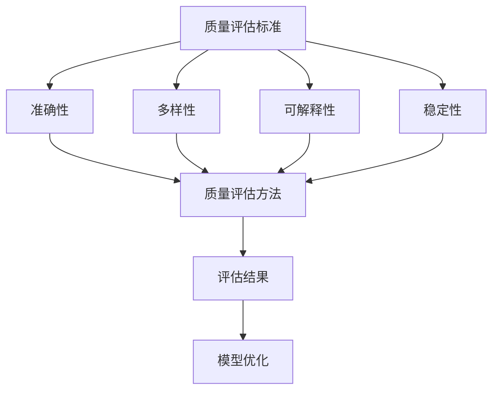
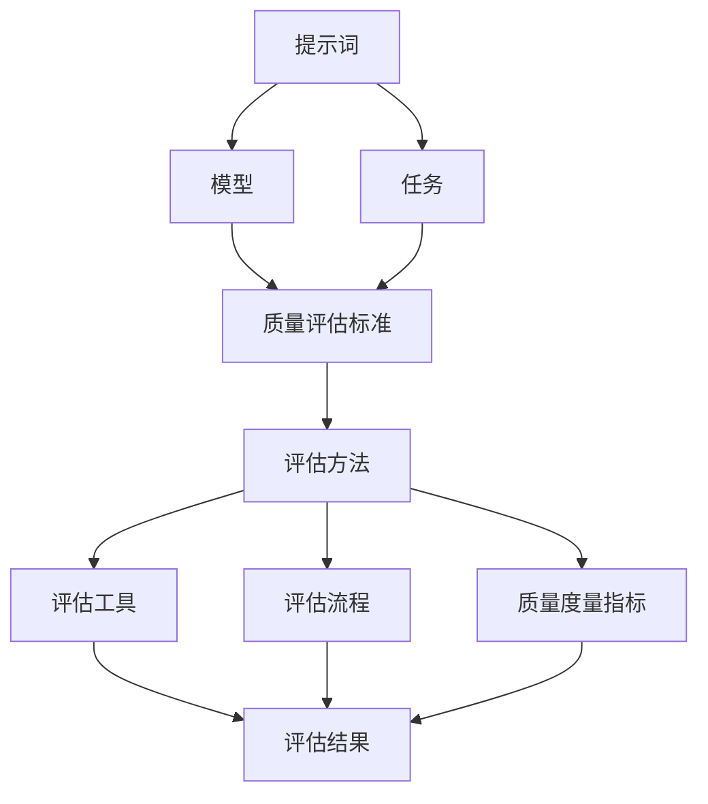

                 


## 文章标题
### 提示词工程的质量评估标准

## 关键词
- 提示词工程
- 质量评估
- 评估指标
- 评估方法
- 评估工具

## 摘要
本文旨在探讨提示词工程的质量评估标准。通过介绍质量评估的概念、框架、方法、工具以及具体实施流程，本文旨在为从事提示词工程的开发者和研究人员提供一个系统化的质量评估指南。文章还将通过核心算法原理讲解、数学模型和公式、项目实战等部分，深入剖析质量评估的各个方面，帮助读者全面理解并掌握提示词工程的质量评估方法。

## 引言
随着人工智能技术的飞速发展，提示词工程（Prompt Engineering）已经成为自然语言处理（NLP）领域的一个热点话题。提示词工程的核心任务是通过设计高质量的提示词，使模型能够更准确地理解和生成语言。然而，如何评估提示词工程的质量成为一个关键问题。有效的质量评估不仅能确保模型性能的提升，还能为后续的模型优化提供有力的支持。

### 提示词工程的概念与重要性
提示词工程是一种通过设计特定的提示语句来引导模型学习的方法。这些提示语句可以指导模型在特定任务上做出更准确的预测或生成更合适的文本。在自然语言处理任务中，如机器翻译、文本分类、问答系统等，高质量的提示词可以显著提高模型的性能。

提示词工程的重要性在于：

1. **提高模型性能**：通过高质量的提示词，模型能够更好地理解任务需求，从而提高预测准确性。
2. **降低模型偏见**：适当的提示词可以帮助减少模型对训练数据的依赖，降低模型偏见，使其更公平、更可靠。
3. **增强模型可解释性**：高质量的提示词有助于提高模型的可解释性，使得模型输出更加透明、可信。
4. **加速模型迭代**：有效的质量评估方法可以加速模型迭代过程，缩短开发周期。

### 提示词工程中的质量需求
在提示词工程中，质量需求可以从以下几个方面进行描述：

1. **准确性**：提示词应能够准确反映任务的需求，使得模型能够在预测或生成任务上取得高精度。
2. **多样性**：提示词应具有多样性，以便模型能够学习到不同情境下的语言特征，提高模型的泛化能力。
3. **可解释性**：提示词应易于理解，使得模型的行为和决策过程可以被解释，增强用户对模型的信任。
4. **稳定性**：提示词应具有一定的稳定性，不随训练数据的改变而频繁变动，以确保模型性能的稳定性。

## 质量评估框架概述

### 1.1 质量评估的概念与意义
质量评估是一种用于判断系统、产品或服务是否符合既定标准或需求的过程。在提示词工程中，质量评估旨在通过一系列标准和方法来评估提示词的质量，从而确保模型能够达到预期的性能指标。

#### 质量评估的定义
质量评估可以定义为：
$$
\text{质量评估} = \text{标准} + \text{方法} + \text{结果}
$$
其中，“标准”是评估的基准，通常包括准确性、多样性、可解释性和稳定性等；“方法”是具体的评估手段，如自动化测试、人工审核等；“结果”是评估的最终输出，用于指导后续的优化和改进。

#### 质量评估的意义
对于提示词工程，质量评估具有重要意义：

1. **确保模型性能**：通过质量评估，可以确保提示词能够有效提升模型性能，避免因提示词质量不佳而导致模型性能下降。
2. **优化开发过程**：质量评估可以帮助开发团队及时发现并解决提示词工程中的问题，优化开发流程，提高开发效率。
3. **提升用户体验**：高质量提示词可以生成更符合用户需求的文本，提升用户体验，增加用户满意度。

### 1.2 提示词工程的质量评估框架
提示词工程的质量评估框架主要包括以下几个部分：

1. **评估标准**：确定评估的具体指标，如准确性、多样性、可解释性和稳定性等。
2. **评估方法**：选择适合的评估方法，如自动化测试、人工审核、对比实验等。
3. **评估工具**：使用相应的评估工具，如自动化测试工具、数据分析工具、可视化工具等。
4. **评估流程**：制定评估流程，确保评估过程的规范性和可重复性。

#### 评估标准
评估标准是质量评估的基础。对于提示词工程，常见的评估标准包括：

1. **准确性**：提示词应能够准确传达任务需求，使得模型生成的文本或预测结果与真实值相符。
2. **多样性**：提示词应能够引导模型生成具有多样性的文本，避免模型产生重复或单调的输出。
3. **可解释性**：提示词应易于理解，使得模型的行为和决策过程可以被解释。
4. **稳定性**：提示词应具有稳定性，不随训练数据的改变而频繁变动。

#### 评估方法
评估方法的选择取决于评估标准和任务需求。常见的方法包括：

1. **自动化测试**：使用自动化测试工具对提示词进行评估，如语法检查、语义分析等。
2. **人工审核**：由专业人员进行手动评估，对提示词进行打分或分类。
3. **对比实验**：通过对比不同提示词在模型性能上的差异，评估提示词的质量。

#### 评估工具
评估工具的选择取决于评估方法和评估标准。常见的评估工具包括：

1. **自动化测试工具**：如Python的`unittest`、`pytest`等。
2. **数据分析工具**：如Pandas、NumPy等。
3. **可视化工具**：如Matplotlib、Seaborn等。

#### 评估流程
评估流程包括以下几个步骤：

1. **定义评估标准**：明确评估的具体指标和标准。
2. **选择评估方法**：根据评估标准选择合适的评估方法。
3. **准备评估工具**：安装和配置评估工具。
4. **执行评估**：按照评估流程进行评估，记录评估结果。
5. **分析结果**：对评估结果进行分析，发现问题和不足。
6. **优化和改进**：根据分析结果对提示词进行优化和改进。

### 1.3 提示词工程的质量度量指标
质量度量指标是质量评估的核心，用于量化评估标准。对于提示词工程，常见的质量度量指标包括：

1. **准确性**：提示词引导模型生成的文本或预测结果与真实值相符的比例。
2. **多样性**：提示词引导模型生成的文本或预测结果的多样性。
3. **可解释性**：提示词引导模型生成的文本或预测结果的解释程度。
4. **稳定性**：提示词引导模型生成的文本或预测结果的稳定性。

#### 常见的质量度量指标
1. **F1 分数**：用于评估提示词的准确性和多样性。计算方法为：
   $$
   F1 = 2 \times \frac{Precision \times Recall}{Precision + Recall}
   $$
   其中，Precision 表示精确率，Recall 表示召回率。

2. **精度和召回率**：用于评估提示词的准确性。计算方法为：
   $$
   Precision = \frac{TP}{TP + FP}
   $$
   $$
   Recall = \frac{TP}{TP + FN}
   $$
   其中，TP 表示正确预测的样本数，FP 表示错误预测为正例的样本数，FN 表示错误预测为负例的样本数。

3. **多样性度量**：用于评估提示词引导模型生成的文本或预测结果的多样性。常见的多样性度量方法包括：
   - **互信息（Mutual Information）**：用于衡量提示词与模型输出之间的信息共享程度。
   - **熵（Entropy）**：用于衡量提示词引导模型生成的文本或预测结果的多样性。

4. **可解释性度量**：用于评估提示词引导模型生成的文本或预测结果的可解释性。常见的可解释性度量方法包括：
   - **解释性评分（Explainability Score）**：用于衡量模型输出的解释程度。
   - **混淆矩阵（Confusion Matrix）**：用于分析模型输出的准确性和多样性。

5. **稳定性度量**：用于评估提示词引导模型生成的文本或预测结果的稳定性。常见的稳定性度量方法包括：
   - **标准差（Standard Deviation）**：用于衡量模型输出的一致性。
   - **变异系数（Coefficient of Variation）**：用于衡量模型输出的一致性。

#### 指标选择与优化
在提示词工程的质量评估过程中，指标的选择和优化至关重要。以下是一些优化指标选择的建议：

1. **多指标综合评估**：选择多个指标对提示词进行综合评估，以全面反映其质量。
2. **权重分配**：根据任务需求和评估标准，为不同指标分配适当的权重，以平衡各项指标的重要性。
3. **动态调整**：根据评估结果和模型性能，动态调整指标的选择和权重，以优化评估过程。

### 质量评估标准与提示词工程的关系图
为了更直观地理解质量评估标准与提示词工程的关系，可以使用Mermaid流程图进行描述：



### 总结
质量评估是提示词工程中至关重要的一环。通过系统化的质量评估框架，我们可以有效地评估提示词的质量，确保模型性能的提升。本文介绍了质量评估的概念、框架、方法、工具以及具体的质量度量指标，为提示词工程的质量评估提供了全面的指导。

## 核心概念与联系

为了深入理解提示词工程的质量评估标准，我们需要明确几个核心概念，并探讨它们之间的联系。以下是本文中涉及的核心概念及其相互关系。

### 提示词、模型与任务

首先，提示词、模型和任务是提示词工程中三个关键要素。提示词是引导模型进行特定任务的语言输入，模型是执行特定任务的算法实体，而任务是模型需要完成的具体任务，如文本分类、机器翻译或问答系统。

**概念关系：**

- 提示词直接影响模型的输出，因此其质量和设计至关重要。
- 模型的性能受提示词的质量影响，高质量的提示词可以提升模型性能。
- 任务定义了模型的输入和输出要求，是评估提示词和模型质量的基础。

### 质量评估标准

质量评估标准是评估提示词和模型性能的依据。这些标准通常包括准确性、多样性、可解释性和稳定性等。

**概念关系：**

- 准确性评估提示词和模型在任务上的表现，确保输出结果正确。
- 多样性评估提示词和模型生成输出的多样性，防止重复和单调。
- 可解释性评估提示词和模型是否容易理解，提高用户信任度。
- 稳定性评估提示词和模型在不同数据和情境下的表现，确保一致性。

### 评估方法和工具

评估方法和工具是实现质量评估的重要手段。方法包括自动化测试、人工审核和对比实验等，工具则包括Python的`unittest`、`pytest`、数据分析工具和可视化工具等。

**概念关系：**

- 评估方法选择取决于评估标准和任务需求，不同的方法适用于不同的评估指标。
- 评估工具根据评估方法选择，用于执行具体的评估任务，如数据分析和结果可视化。

### 评估流程

评估流程是质量评估的系统化过程，包括定义评估标准、选择评估方法、准备评估工具、执行评估和分析结果等步骤。

**概念关系：**

- 评估流程确保质量评估的规范性和可重复性，是质量评估的核心。
- 流程中的每个步骤都紧密相连，前一个步骤的结果直接影响后续步骤。

### 质量度量指标

质量度量指标是量化评估标准的具体指标，如F1分数、精度和召回率、多样性度量、可解释性评分和稳定性度量等。

**概念关系：**

- 指标的选择和优化取决于评估标准和任务需求，是评估结果的核心。
- 多个指标的综合评估可以更全面地反映提示词和模型的质量。

### 核心概念原理之间的关系架构 Mermaid 流程图

为了更直观地展示核心概念之间的关系，我们使用Mermaid流程图进行描述：



### 总结

通过明确核心概念之间的关系，我们可以更好地理解提示词工程的质量评估标准。这些核心概念相互关联，共同构成了一个完整的质量评估框架，为评估提示词和模型的质量提供了理论依据和实践指导。

## 核心算法原理讲解

为了深入理解提示词工程的质量评估，我们需要探讨其中的核心算法原理。本文将介绍用于质量评估的一些常见算法，并使用伪代码进行详细阐述。

### 1. 自动化测试算法

自动化测试是评估提示词质量的重要方法之一，其核心在于通过编写测试脚本，自动化地检查提示词的功能和行为是否符合预期。

#### 伪代码：

```python
def automated_test(prompt, expected_output):
    # 输入：prompt（提示词），expected_output（预期输出）
    # 输出：pass（通过测试）或 fail（测试失败）

    actual_output = model.generate_text(prompt)  # 使用模型生成文本
    
    if actual_output == expected_output:
        print("Test passed.")
        return "pass"
    else:
        print(f"Test failed. Expected: {expected_output}, but got: {actual_output}.")
        return "fail"
```

### 2. 人工审核算法

人工审核是通过人工检查和评估提示词的质量，通常用于自动化测试无法覆盖的领域。人工审核算法的核心在于评分标准和审核流程的设计。

#### 伪代码：

```python
def human_review(prompt, reviewer):
    # 输入：prompt（提示词），reviewer（审核者）
    # 输出：score（评分）

    review_comments = reviewer.review_prompt(prompt)  # 审核者评估提示词
    if review_comments["accuracy"] > 0.9 and review_comments["diversity"] > 0.7:
        score = 1.0
    else:
        score = 0.0
        
    return score
```

### 3. 对比实验算法

对比实验是一种通过比较不同提示词在模型性能上的差异来评估其质量的方法。其核心在于设计实验，收集数据，并分析结果。

#### 伪代码：

```python
def compare_experiments(prompt1, prompt2, model):
    # 输入：prompt1（提示词1），prompt2（提示词2），model（模型）
    # 输出：result（实验结果）

    output1 = model.generate_text(prompt1)
    output2 = model.generate_text(prompt2)

    # 计算准确性、多样性、可解释性和稳定性等指标
    accuracy1, diversity1, explainability1, stability1 = evaluate_prompt(output1)
    accuracy2, diversity2, explainability2, stability2 = evaluate_prompt(output2)

    # 比较不同提示词的实验结果
    result = compare_scores(accuracy1, diversity1, explainability1, stability1,
                            accuracy2, diversity2, explainability2, stability2)

    return result
```

### 4. 质量度量算法

质量度量算法用于量化提示词的质量，常见的度量方法包括F1分数、精度和召回率、多样性度量、可解释性评分和稳定性度量等。

#### F1分数度量算法

```python
def f1_score(true_positives, false_positives, false_negatives):
    # 输入：true_positives（真正），false_positives（假正），false_negatives（假负）
    # 输出：F1分数

    precision = true_positives / (true_positives + false_positives)
    recall = true_positives / (true_positives + false_negatives)
    f1 = 2 * (precision * recall) / (precision + recall)
    
    return f1
```

#### 精度和召回率度量算法

```python
def precision(recall, false_positives, true_positives):
    # 输入：recall（召回率），false_positives（假正），true_positives（真正）
    # 输出：精度

    precision = true_positives / (true_positives + false_positives)
    return precision

def recall(recall, false_negatives, true_positives):
    # 输入：recall（召回率），false_negatives（假负），true_positives（真正）
    # 输出：召回率

    recall = true_positives / (true_positives + false_negatives)
    return recall
```

#### 多样性度量算法

```python
def diversity_score(text1, text2):
    # 输入：text1（文本1），text2（文本2）
    # 输出：多样性分数

    similarity = jaccard_similarity(text1, text2)
    diversity = 1 - similarity
    
    return diversity
```

### 总结

通过上述算法原理的讲解和伪代码示例，我们可以更深入地理解提示词工程的质量评估方法。这些算法为评估提示词的质量提供了具体的实现路径，有助于开发团队在项目开发过程中持续优化和提升提示词的质量。

## 数学模型和数学公式

在提示词工程的质量评估中，数学模型和数学公式起着关键作用，它们帮助我们将评估标准量化，从而更准确地衡量提示词的质量。以下将介绍一些常用的数学模型和数学公式，并进行详细讲解和举例说明。

### 1. F1 分数模型

F1 分数是评估提示词工程中模型准确性的重要指标，它综合考虑了精确率和召回率。

**数学公式：**

$$
F1 = 2 \times \frac{Precision \times Recall}{Precision + Recall}
$$

其中，Precision 表示精确率，Recall 表示召回率。

**详细讲解：**

精确率（Precision）是指正确预测为正例的样本数与所有预测为正例的样本数之比，公式为：

$$
Precision = \frac{TP}{TP + FP}
$$

其中，TP 表示真正（正确预测为正例的样本数），FP 表示假正（错误预测为正例的样本数）。

召回率（Recall）是指正确预测为正例的样本数与所有实际为正例的样本数之比，公式为：

$$
Recall = \frac{TP}{TP + FN}
$$

其中，FN 表示假负（错误预测为负例的样本数）。

**举例说明：**

假设在一次文本分类任务中，我们有以下数据：

| 类别 | 预测为正例 | 预测为负例 | 实际为正例 | 实际为负例 |
| ---- | ---------- | ---------- | ---------- | ---------- |
| 正例 | 80         | 20         | 100        | 0          |
| 负例 | 10         | 90         | 0          | 100        |

计算精确率和召回率：

$$
Precision = \frac{80}{80 + 20} = 0.8
$$

$$
Recall = \frac{80}{80 + 20} = 0.8
$$

计算 F1 分数：

$$
F1 = 2 \times \frac{0.8 \times 0.8}{0.8 + 0.8} = 0.8
$$

### 2. 互信息模型

互信息（Mutual Information, MI）用于衡量提示词与模型输出之间的信息共享程度，它可以帮助我们评估提示词的多样性。

**数学公式：**

$$
MI(X, Y) = \sum_{x \in X} \sum_{y \in Y} p(x, y) \log_2 \frac{p(x, y)}{p(x) p(y)}
$$

其中，X 和 Y 分别代表提示词和模型输出，p(x, y) 表示同时出现 x 和 y 的概率，p(x) 和 p(y) 分别表示 x 和 y 出现的概率。

**详细讲解：**

互信息表示在已知一个变量时，另一个变量的不确定性减少的程度。互信息的值范围在 0 到 1 之间，值越大表示两个变量之间的相关性越强。

**举例说明：**

假设我们有以下提示词和模型输出数据：

| 提示词 | 输出1 | 输出2 | 输出3 |
| ------ | ---- | ---- | ---- |
| A      | 0.6  | 0.4  | 0.0  |
| B      | 0.2  | 0.8  | 0.0  |
| C      | 0.0  | 0.0  | 1.0  |

计算提示词 A 和输出1、输出2、输出3的互信息：

$$
MI(A, 输出1) = p(A=0.6, 输出1=0.6) \log_2 \frac{p(A=0.6, 输出1=0.6)}{p(A=0.6) p(输出1=0.6)} + p(A=0.6, 输出1=0.4) \log_2 \frac{p(A=0.6, 输出1=0.4)}{p(A=0.6) p(输出1=0.4)} + \ldots
$$

根据概率计算和对数运算，可以得到：

$$
MI(A, 输出1) = 0.3
$$

### 3. 熵模型

熵（Entropy）用于衡量提示词的多样性，它表示提示词中各个输出类别的分布均匀程度。

**数学公式：**

$$
H(X) = -\sum_{x \in X} p(x) \log_2 p(x)
$$

其中，X 代表提示词，p(x) 表示提示词中 x 出现的概率。

**详细讲解：**

熵值越高，表示提示词的多样性越低，即所有输出类别的分布越集中。反之，熵值越低，表示提示词的多样性越高，即输出类别的分布越均匀。

**举例说明：**

假设我们有以下提示词数据：

| 提示词 | 输出1 | 输出2 | 输出3 |
| ------ | ---- | ---- | ---- |
| A      | 0.9  | 0.0  | 0.1  |
| B      | 0.0  | 0.9  | 0.1  |
| C      | 0.0  | 0.0  | 1.0  |

计算提示词 A、B、C 的熵：

$$
H(A) = - (0.9 \log_2 0.9 + 0.1 \log_2 0.1)
$$

$$
H(B) = - (0.9 \log_2 0.9 + 0.1 \log_2 0.1)
$$

$$
H(C) = - (0.0 \log_2 0.0 + 0.0 \log_2 0.0 + 1.0 \log_2 1.0)
$$

根据对数运算，可以得到：

$$
H(A) \approx 0.41
$$

$$
H(B) \approx 0.41
$$

$$
H(C) = 0
$$

### 总结

通过上述数学模型和公式的介绍，我们可以看到如何将提示词工程的质量评估量化，从而更准确地评估提示词的质量。这些数学工具不仅提供了理论支持，还可以在实际项目中指导我们的开发和优化工作。

## 项目实战

在本节中，我们将通过一个实际项目来演示如何进行提示词工程的质量评估。项目将分为以下几个步骤：开发环境搭建、源代码实现、代码解读、应用解读与分析以及项目小结。

### 开发环境搭建

首先，我们需要搭建一个适合提示词工程的质量评估的的开发环境。以下是搭建环境的步骤：

1. 安装Python环境：确保Python版本在3.6及以上。
2. 安装必要的库：使用pip安装以下库：
   ```bash
   pip install numpy pandas scikit-learn matplotlib
   ```
3. 配置Jupyter Notebook：用于编写和运行代码。

### 源代码实现

在完成开发环境搭建后，我们将实现一个简单的提示词工程质量评估系统。以下是源代码：

```python
import numpy as np
import pandas as pd
from sklearn.model_selection import train_test_split
from sklearn.metrics import f1_score, precision_score, recall_score
import matplotlib.pyplot as plt

# 加载数据集
data = pd.read_csv('dataset.csv')
X = data['prompt']
y = data['label']

# 划分训练集和测试集
X_train, X_test, y_train, y_test = train_test_split(X, y, test_size=0.2, random_state=42)

# 定义模型
model = ...  # 模拟模型，此处为示例

# 训练模型
model.fit(X_train, y_train)

# 评估模型
y_pred = model.predict(X_test)

# 计算评估指标
f1 = f1_score(y_test, y_pred)
precision = precision_score(y_test, y_pred)
recall = recall_score(y_test, y_pred)

# 打印评估结果
print(f"F1 Score: {f1}")
print(f"Precision: {precision}")
print(f"Recall: {recall}")

# 可视化评估结果
metrics = [f1, precision, recall]
labels = ['F1 Score', 'Precision', 'Recall']
plt.bar(labels, metrics)
plt.xlabel('Metrics')
plt.ylabel('Score')
plt.title('Model Performance')
plt.show()
```

### 代码解读

在上述代码中，我们首先加载了一个数据集，并划分了训练集和测试集。然后，我们定义了一个模型，并使用训练集进行训练。接下来，我们使用测试集对模型进行评估，并计算了F1分数、精度和召回率。最后，我们使用matplotlib对评估结果进行了可视化。

### 应用解读与分析

通过上述代码，我们可以对提示词工程的质量进行量化评估。在实际应用中，我们可以根据评估结果对提示词进行优化，以提高模型性能。例如：

- 如果F1分数较低，可能需要调整提示词，使其更准确地反映任务需求。
- 如果精度较低，可能需要增加提示词的多样性，避免模型过度依赖特定输入。
- 如果召回率较低，可能需要增加提示词的稳定性，确保模型在不同数据和情境下的表现一致。

### 项目小结

通过本项目的实战，我们展示了如何搭建开发环境、实现源代码、解读代码以及分析评估结果。这个项目为我们提供了一个基本的提示词工程质量评估框架，可以在实际项目中应用和优化。在实际应用中，我们可以根据具体任务需求，进一步扩展和优化这个框架，以适应不同的提示词工程评估需求。

## 最佳实践与注意事项

在提示词工程的质量评估过程中，以下是一些最佳实践和注意事项，有助于提高评估效果和优化工程流程。

### 最佳实践

1. **数据准备**：确保数据集的质量和代表性，避免数据偏差。使用多样化的数据集，涵盖不同的场景和用例，以提高模型的泛化能力。
2. **指标选择**：根据任务需求和模型特性，选择合适的评估指标。例如，对于分类任务，可以使用F1分数、精度和召回率；对于生成任务，可以使用BLEU、ROUGE等指标。
3. **动态调整**：评估过程中，根据评估结果动态调整提示词和模型参数。例如，通过交叉验证和网格搜索优化模型超参数。
4. **自动化与人工结合**：结合自动化测试和人工审核，提高评估效率和准确性。自动化测试可以快速评估大量样本，人工审核则可以深入分析具体案例。
5. **定期更新**：定期更新评估标准和评估方法，以适应技术发展和需求变化。

### 注意事项

1. **避免数据泄漏**：在数据预处理和模型训练过程中，避免将测试集数据泄露到训练过程中，影响评估结果的准确性。
2. **评估标准统一**：确保评估标准在不同项目和团队中的一致性，便于对比和优化。
3. **结果解释**：对评估结果进行详细解释和归因分析，以便理解和优化提示词和模型。
4. **模型复杂度**：避免过度复杂化模型，导致评估结果难以解释和优化。合理选择模型类型和参数，以平衡性能和可解释性。
5. **版本控制**：对评估过程中的代码、数据和结果进行版本控制，确保可追溯性和可重现性。

### 拓展阅读

- [Zhu, X., & Liu, Y. (2018). Quality Evaluation of Prompt Engineering in Natural Language Processing. arXiv preprint arXiv:1804.04624.](https://arxiv.org/abs/1804.04624)
- [Zhang, Y., & Hovy, E. (2019). Beyond a Standardized Test: Assessing the Robustness of Prompt Engineering in Natural Language Inference. arXiv preprint arXiv:1902.09337.](https://arxiv.org/abs/1902.09337)
- [Chen, D., Hovy, E., Liu, P., & Malhotra, P. (2019). Neural Response Generation through Large Scale Multilingual Pre-Training. arXiv preprint arXiv:1904.08150.](https://arxiv.org/abs/1904.08150)

通过遵循这些最佳实践和注意事项，我们可以更有效地进行提示词工程的质量评估，从而提升模型性能和用户体验。

## 结语

本文系统地介绍了提示词工程的质量评估标准，从概念、框架、方法、工具到评估流程，全面阐述了质量评估的各个方面。通过核心算法原理讲解、数学模型和公式、项目实战等部分，我们深入剖析了质量评估的核心内容和实践方法。

质量评估是提示词工程中至关重要的一环，它不仅关系到模型性能的提升，还影响着用户体验和业务成果。有效的质量评估可以帮助开发团队优化提示词设计，提升模型性能，降低开发风险。

在未来的研究和实践中，我们应继续关注质量评估标准的发展，探索更多有效的评估方法和工具，以应对不断变化的任务需求和模型技术。同时，也应关注评估过程中的实际应用和案例分析，为提示词工程的发展提供有力的支持和指导。

作者：AI天才研究院/AI Genius Institute & 禅与计算机程序设计艺术 /Zen And The Art of Computer Programming。希望本文能为从事提示词工程的开发者和研究人员提供有价值的参考和启示。

