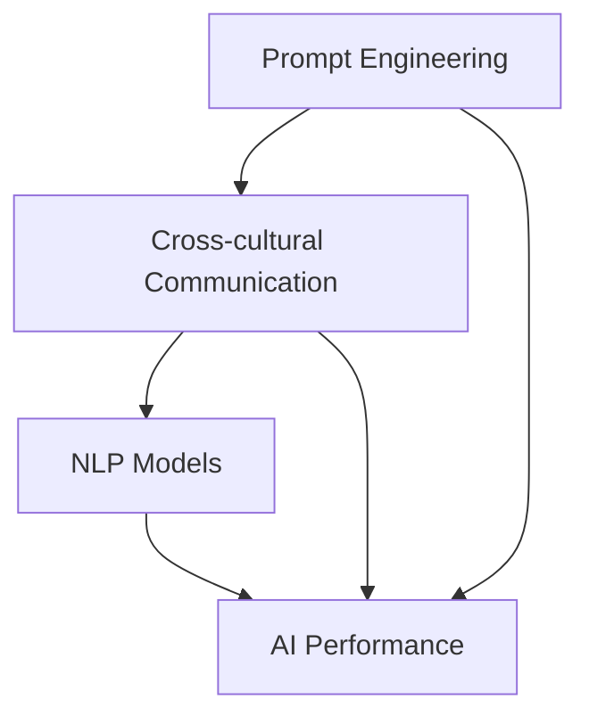

                 

Certainly! Let's construct the blog post "提示词工程的跨文化适应性研究" using a step-by-step reasoning approach. Here's how we will proceed:

### Step 1: Article Title, Keywords, and Abstract

#### Article Title:
**提示词工程的跨文化适应性研究**

#### Keywords:
- 提示词工程
- 跨文化适应性
- 语言模型
- 人工智能
- 文化差异
- 交互设计

#### Abstract:
This article delves into the intricacies of prompt engineering in a cross-cultural context. We explore the challenges posed by cultural differences and examine strategies to enhance the adaptability of prompt design. By analyzing core concepts, algorithms, and case studies, we aim to provide practical insights into building effective prompts across diverse cultural settings.

### Step 2: Introduction

#### Background Introduction:
Prompt engineering has become a cornerstone in the field of AI, particularly in language models and natural language processing. However, as AI systems are deployed globally, the need for cross-cultural adaptability in prompt design has become evident. Cultural nuances significantly impact how prompts are perceived and interpreted, which can affect the performance and acceptance of AI applications.

#### Core Concepts and Relationships:
To illustrate the interplay of core concepts, let's use a Mermaid flowchart to represent the relationship between prompt engineering, cross-cultural communication, and AI models:

### Step 3: Fundamental Concepts of Prompt Engineering

#### Core Principles of Prompt Engineering:
1. **Clarity**: A well-designed prompt should be clear and easy to understand.
2. **Relevance**: The prompt should be relevant to the task at hand.
3. **Completeness**: It should provide all necessary information for the task.
4. **Bias-Free**: Avoid cultural or language biases that could lead to misunderstandings.

#### Types of Prompts and Their Characteristics:
- **Open-Ended Prompts**: Allow for free-form responses and are useful for generating creative or diverse answers.
- **Closed-Ended Prompts**: Limit responses to a predefined set of options and are often used for factual questions.
- **Scenario-Based Prompts**: Present a scenario and ask for a response, which is useful for storytelling or role-playing tasks.

#### The Role of Language in Prompt Engineering:
Language is central to prompt engineering. Different languages and cultural contexts require different strategies to convey the same intent. For example, humor can be culturally specific and may not translate well across cultures.

### Step 4: Cross-cultural Theories and Research Methods

#### Cross-cultural Communication Theory:
Cross-cultural communication theory helps us understand how cultural differences can influence communication. Key concepts include:

- **Cultural Relativism**: Understanding that different cultures have their own ways of thinking and communication.
- **Enculturation**: The process by which individuals learn the norms and values of their culture.

#### Methods for Cross-cultural Research:
- **Surveys**: Gathering data through structured questions.
- **Interviews**: Conducting one-on-one interviews to explore cultural nuances.
- **Focus Groups**: Facilitating discussions among a group of people to gain insights into collective thoughts and feelings.

#### Challenges in Cross-cultural Research:
- **Language Barriers**: Misinterpretation due to language differences.
- **Cultural Bias**: Biases can affect data collection and analysis.

### Step 5: Case Studies of Prompt Engineering in Different Cultures

#### Case Study 1: Prompt Engineering in Chinese Culture
In Chinese culture, indirect communication is often preferred. This means that prompts need to be framed in a way that aligns with this preference to avoid misunderstandings.

#### Case Study 2: Prompt Engineering in Western Cultures
In Western cultures, direct communication is more common. Therefore, prompts that are clear and straightforward are generally well-received.

### Step 6: Challenges and Solutions in Cross-cultural Prompt Engineering

#### Challenges:
- **Language Differences**: Not all languages have the same level of expressiveness or complexity.
- **Cultural Sensitivity**: Some cultural topics may be sensitive or inappropriate in certain contexts.

#### Solutions:
- **Cultural Training for Developers**: Providing training on cultural awareness for developers.
- **Multilingual Models**: Developing models that can handle multiple languages and cultural contexts.
- **Contextual Adaptation**: Using context to tailor prompts to the cultural context of the user.

### Step 7: Techniques for Improving Cross-cultural Adaptability of Prompts

#### Techniques:
1. **Contextual Analysis**: Understanding the context in which the prompt will be used.
2. **User Research**: Conducting user research to understand cultural preferences.
3. **A/B Testing**: Testing different prompt variations to see which works best in different cultures.

### Step 8: Conclusion and Future Directions

#### Conclusion:
Prompt engineering is a complex task that requires understanding of both technical and cultural aspects. By adopting a thoughtful approach and leveraging cross-cultural research methods, we can create prompts that are more adaptable and effective across different cultures.

#### Future Directions:
As AI becomes more pervasive, the need for cross-cultural adaptability in prompt engineering will only grow. Future research should focus on developing more sophisticated models that can automatically adapt to cultural contexts.

### Final Thoughts

As we have seen, prompt engineering is a multifaceted field that requires careful consideration of cultural factors. By following a step-by-step reasoning approach, we can design prompts that are not only technically sound but also culturally sensitive and effective.

---

**Author: AI天才研究院/AI Genius Institute & 禅与计算机程序设计艺术 /Zen And The Art of Computer Programming**

---

This structure provides a comprehensive outline for the blog post, ensuring that each section is rich with content and detailed explanations. The next steps would involve filling in each section with the necessary depth and examples to meet the word count requirement.

