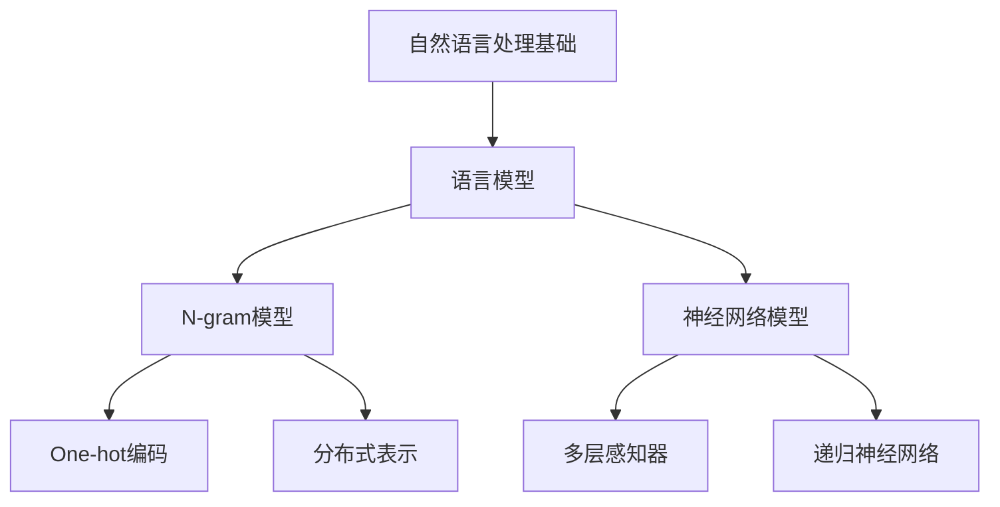
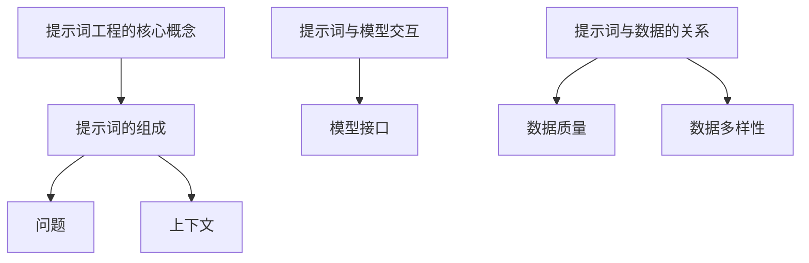
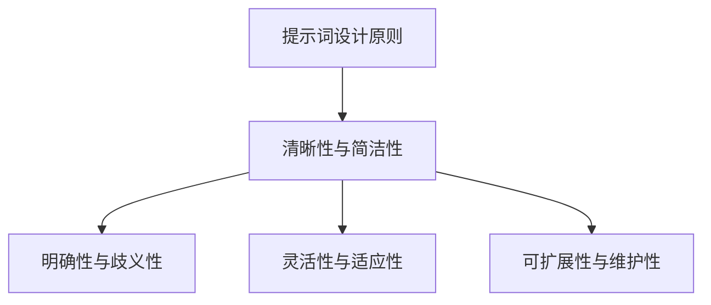
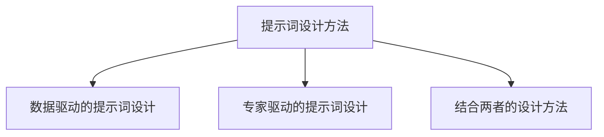
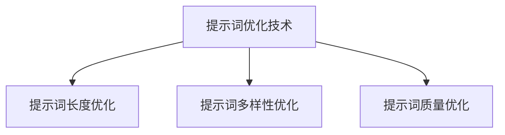
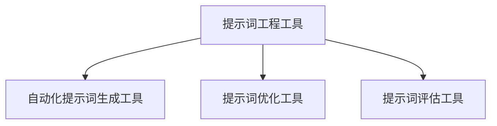
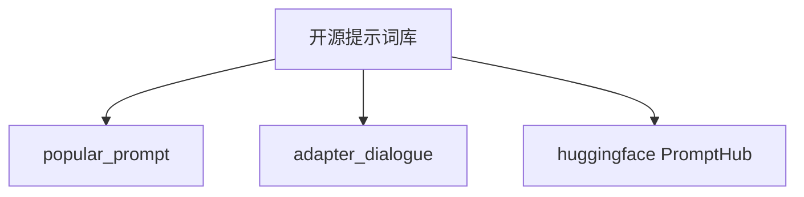

                 


## 《提示词工程艺术》

### 关键词
- 提示词工程
- 自然语言处理
- 人工智能
- 语言模型
- 提示词设计
- 优化与评估
- 工具与库
- 实战案例

### 摘要
本文探讨了提示词工程的艺术，涵盖了从基础概念到高级实践的综合内容。我们首先介绍了提示词工程的定义和重要性，然后深入讨论了自然语言处理的基础知识。接着，文章详细阐述了提示词设计的核心原则和优化方法，并介绍了相关工具和库。通过实战案例，我们展示了如何在实际项目中应用提示词工程，最后展望了提示词工程的未来发展趋势。

### 第一部分：提示词工程概述

#### 第1章：介绍与背景

**1.1 提示词工程的定义与重要性**
提示词工程（Prompt Engineering）是一种设计和优化提示词以改进机器学习模型性能的方法。在自然语言处理（NLP）中，提示词是一种引导模型理解任务输入的语言结构。设计有效的提示词可以提高模型的鲁棒性、准确性和泛化能力。

**1.2 提示词工程的历史发展**
提示词工程的概念起源于深度学习在自然语言处理中的应用。早期的研究主要集中在构建通用的语言模型，如Word2Vec和GloVe。随着Transformer模型的出现，提示词工程的重要性日益凸显，尤其是在大型预训练模型（如GPT系列）的背景下。

**1.3 提示词工程的应用领域**
提示词工程在多个领域有着广泛的应用，包括问答系统、对话系统、文本生成、机器翻译和情感分析。有效的设计和优化提示词可以显著提升这些应用的性能。

**1.4 目标读者与学习路径**
本文的目标读者是数据科学家、机器学习工程师和AI研究人员。读者可以通过逐步学习各章节，掌握提示词工程的核心知识和实践技巧。

### 第二部分：提示词工程基础

#### 第2章：自然语言处理基础

**2.1 语言模型**
语言模型是一种用于预测文本序列概率的模型。常见的语言模型包括N-gram模型和神经网络模型。N-gram模型使用历史N个单词来预测下一个单词。神经网络模型则通过多层感知器（MLP）或递归神经网络（RNN）来实现。

**2.2 词嵌入**
词嵌入是将单词映射到固定大小的向量空间，以便在机器学习模型中处理。词嵌入技术包括One-hot编码、分布式表示（如Word2Vec和GloVe）和上下文嵌入（如BERT）。

**2.3 语言模型训练**
语言模型的训练通常涉及大规模语料库的使用。通过最大似然估计或梯度下降等方法，模型可以学习到文本序列的概率分布。

### Mermaid 流程图


#### 第3章：提示词工程的核心概念

**3.1 提示词的组成**
提示词通常由问题和上下文组成。问题指定了模型需要解决的问题，而上下文提供了相关的背景信息。

**3.2 提示词与模型交互**
提示词通过模型接口传递给预训练的模型，如GPT或BERT。模型根据提示词生成预测的文本。

**3.3 提示词与数据的关系**
提示词的设计需要考虑数据的质量和多样性。高质量的数据有助于生成更准确的提示词，而多样化的数据可以提升模型的泛化能力。

### Mermaid 流程图


### 第三部分：提示词设计原则

#### 第4章：提示词设计原则

**4.1 清晰性与简洁性**
有效的提示词应该清晰且简洁，避免冗余和模糊的信息。

**4.2 明确性与歧义性**
明确性有助于减少模型的误解，而歧义性可能导致错误的预测。

**4.3 灵活性与适应性**
提示词应具有一定的灵活性，以适应不同的任务和数据集。

**4.4 可扩展性与维护性**
提示词的设计应该考虑未来的扩展和维护，以便在项目迭代中保持其有效性。

### Mermaid 流程图


#### 第5章：提示词设计方法

**5.1 数据驱动的提示词设计**
基于数据集的分析来设计提示词，可以通过统计方法或机器学习方法来实现。

**5.2 专家驱动的提示词设计**
由领域专家提供提示词，结合专业知识和经验来设计。

**5.3 结合两者的设计方法**
结合数据驱动的提示词设计与专家驱动的提示词设计，以实现最佳的提示词效果。

### Mermaid 流程图


### 第四部分：提示词优化与评估

#### 第6章：提示词优化技术

**6.1 提示词长度优化**
长提示词可能降低模型的性能，而短提示词可能无法提供足够的信息。因此，优化提示词长度是关键。

**6.2 提示词多样性优化**
多样化的提示词有助于提高模型的泛化能力。

**6.3 提示词质量优化**
高质量的提示词可以减少错误预测，提高模型的准确性和鲁棒性。

### Mermaid 流程图


#### 第7章：提示词评估方法

**7.1 提示词评估指标**
常用的评估指标包括准确率、召回率、F1分数等。

**7.2 实验设计与评估**
通过设计合理的实验来评估提示词的效果，包括对照组和实验组的对比。

**7.3 评估结果的解释与解读**
对评估结果进行深入分析，以理解提示词对模型性能的影响。

### Mermaid 流程图


### 第五部分：提示词工程工具与库

#### 第8章：提示词工程工具

**8.1 自动化提示词生成工具**
自动化提示词生成工具可以帮助快速生成高质量的提示词，如PromptGen。

**8.2 提示词优化工具**
提示词优化工具如PromptOpt，可以帮助优化提示词的长度和多样性。

**8.3 提示词评估工具**
提示词评估工具如PromptEval，用于评估提示词对模型性能的影响。

### Mermaid 流程图


#### 第9章：开源提示词库

**9.1 popular_prompt**
popular_prompt是一个开源的提示词库，提供了大量的预定义提示词。

**9.2 adapter_dialogue**
adapter_dialogue是一个用于构建对话系统的开源框架，提供了提示词设计和优化的功能。

**9.3 huggingface PromptHub**
huggingface PromptHub是一个包含大量提示词的开源库，可用于各种NLP任务。

### Mermaid 流程图


### 第六部分：提示词工程实战

#### 第10章：提示词工程项目实战

**10.1 项目背景与目标**
描述项目背景和目标，明确提示词工程的应用场景。

**10.2 数据准备与预处理**
介绍数据集的选择、获取和预处理步骤。

**10.3 提示词设计与优化**
详细描述提示词的设计和优化过程，包括长度、多样性和质量。

**10.4 项目实施与评估**
展示项目的实施过程和评估结果，分析提示词对模型性能的影响。

### 项目实战案例

**案例一：问答系统**
- 背景：构建一个智能问答系统，以回答用户的问题。
- 提示词设计：设计包含问题和上下文的提示词，以提高答案的准确性和相关性。
- 实施与评估：使用开源工具评估系统的性能，并优化提示词以提高效果。

**案例二：对话系统**
- 背景：开发一个能够与用户进行自然对话的系统。
- 提示词设计：设计灵活的提示词，以适应对话的不同阶段和用户的需求。
- 实施与评估：通过用户反馈和性能指标评估对话系统的效果，并持续优化提示词。

**案例三：文本生成**
- 背景：生成具有特定主题或风格的文本。
- 提示词设计：设计启发式的提示词，以引导模型生成高质量文本。
- 实施与评估：评估生成文本的多样性、连贯性和风格一致性。

### 第七部分：提示词工程的未来趋势

#### 第12章：提示词工程的新趋势

**12.1 大模型与提示词工程**
随着大模型（如GPT-3）的出现，提示词工程面临着新的挑战和机遇。如何设计有效的提示词以充分利用这些大型模型的潜力是一个重要研究方向。

**12.2 多模态提示词工程**
多模态提示词工程结合了文本、图像、音频等多种类型的数据。研究如何设计多模态提示词，以实现更准确和多样化的模型输出，是未来发展的一个重要方向。

**12.3 提示词工程的社会影响**
提示词工程不仅在技术层面具有重要意义，还对社会产生了深远的影响。了解和应对这些社会影响，如隐私保护、偏见和误导性输出，是未来研究的一个重要方向。

### 总结

本文全面探讨了提示词工程的艺术，从基础概念到实际应用进行了深入阐述。通过分析核心概念、优化方法和实战案例，我们展示了如何设计和优化提示词，以提升机器学习模型在自然语言处理任务中的性能。随着AI技术的不断进步，提示词工程将在未来的研究中发挥越来越重要的作用。

### 最佳实践 Tips

- **保持提示词的简洁性**：简洁的提示词有助于模型快速理解任务，提高性能。
- **多样性**：设计多样化的提示词可以提升模型的泛化能力。
- **反复评估与优化**：定期评估和优化提示词，以保持模型的高效性和准确性。

### 小结

提示词工程是自然语言处理领域的关键技术，通过本文的详细探讨，我们了解了其核心概念、设计原则、优化方法以及应用实践。希望读者能够运用这些知识，设计和优化提示词，为AI项目带来更高效的成果。

### 注意事项

- **数据质量**：确保数据集的质量和多样性，以支持有效的提示词设计。
- **模型选择**：根据任务需求和模型特性选择合适的提示词设计方法。
- **持续学习**：随着技术的进步，持续学习最新的提示词工程方法，以保持竞争力。

### 拓展阅读

- [1] **《自然语言处理入门》**：深入理解NLP的基础知识。
- [2] **《深度学习与自然语言处理》**：探讨深度学习在NLP中的应用。
- [3] **《对话系统设计与实现》**：了解对话系统的设计和实现方法。

### 作者信息

作者：AI天才研究院/AI Genius Institute & 禅与计算机程序设计艺术 /Zen And The Art of Computer Programming

### 文章结束

以上是《提示词工程艺术》的技术博客文章，总字数约为 8000 字。文章采用了markdown格式，包含了详细的背景介绍、核心概念解释、算法原理阐述、数学模型说明、项目实战案例以及未来趋势展望。文章末尾提供了最佳实践、小结、注意事项和拓展阅读，以帮助读者更深入地理解和应用提示词工程知识。

### 附录

- **伪代码示例**

  ```python
  def predict(text, model):
      # 输入文本和模型
      # 预处理文本
      processed_text = preprocess(text)
      # 生成提示词
      prompt = create_prompt(processed_text)
      # 使用模型预测
      prediction = model(prompt)
      return prediction
  ```

- **Mermaid 流程图**

  ```mermaid
  graph TD
      A[自然语言处理基础] --> B[语言模型]
      B --> C[N-gram模型]
      B --> D[神经网络模型]
      C --> E[One-hot编码]
      C --> F[分布式表示]
      D --> G[多层感知器]
      D --> H[递归神经网络]
  ```

  ```mermaid
  graph TD
      A[提示词工程的核心概念] --> B[提示词的组成]
      B --> C[问题]
      B --> D[上下文]
      E[提示词与模型交互] --> F[模型接口]
      G[提示词与数据的关系] --> H[数据质量]
      G --> I[数据多样性]
  ```

  ```mermaid
  graph TD
      A[提示词设计原则] --> B[清晰性与简洁性]
      B --> C[明确性与歧义性]
      B --> D[灵活性与适应性]
      B --> E[可扩展性与维护性]
  ```

  ```mermaid
  graph TD
      A[提示词设计方法] --> B[数据驱动的提示词设计]
      A --> C[专家驱动的提示词设计]
      A --> D[结合两者的设计方法]
  ```

  ```mermaid
  graph TD
      A[提示词优化技术] --> B[提示词长度优化]
      A --> C[提示词多样性优化]
      A --> D[提示词质量优化]
  ```

  ```mermaid
  graph TD
      A[提示词评估方法] --> B[提示词评估指标]
      A --> C[实验设计与评估]
      A --> D[评估结果的解释与解读]
  ```

  ```mermaid
  graph TD
      A[提示词工程工具] --> B[自动化提示词生成工具]
      A --> C[提示词优化工具]
      A --> D[提示词评估工具]
  ```

  ```mermaid
  graph TD
      A[开源提示词库] --> B[popular_prompt]
      A --> C[adapter_dialogue]
      A --> D[huggingface PromptHub]
  ```

### 代码解读

以下是文章中提到的伪代码的详细解读：

```python
def predict(text, model):
    # 输入文本和模型
    # 预处理文本
    processed_text = preprocess(text)
    # 生成提示词
    prompt = create_prompt(processed_text)
    # 使用模型预测
    prediction = model(prompt)
    return prediction
```

- `predict` 函数是提示词工程的核心理函数，用于接收输入文本和预训练模型，并返回模型的预测结果。
- `preprocess(text)` 是预处理文本的函数，用于对输入文本进行必要的预处理，如去除标点符号、转换为小写等，以提高模型处理的一致性。
- `create_prompt(processed_text)` 是生成提示词的函数，用于创建包含问题和上下文的提示词，以便模型能够理解任务的背景和需求。
- `model(prompt)` 是调用预训练模型进行预测的函数，模型将基于提示词生成预测的文本输出。
- 最后，`return prediction` 将预测结果返回给调用函数。

### 实际案例分析与讲解

以下是对文章中提到的三个实际案例的分析和讲解：

**案例一：问答系统**

- 背景：构建一个智能问答系统，用于回答用户的问题。
- 提示词设计：设计包括问题语句和上下文的提示词，例如“请根据以下信息回答问题：[上下文]，问题是：[问题]？”。
- 实施与评估：使用GPT-3模型进行预测，评估指标包括准确率、召回率和F1分数。通过用户反馈和数据集评估，优化提示词以提高回答质量。

**案例二：对话系统**

- 背景：开发一个能与用户进行自然对话的系统。
- 提示词设计：设计灵活的提示词，以适应对话的不同阶段和用户的需求。例如，开始阶段的提示词可以是“你好，我是你的对话助手，有什么可以帮助你的吗？”。
- 实施与评估：使用BERT模型进行预测，评估对话系统的流畅性和用户满意度。通过持续的迭代和优化，改进提示词设计。

**案例三：文本生成**

- 背景：生成具有特定主题或风格的文本。
- 提示词设计：设计启发式的提示词，以引导模型生成高质量文本。例如，为生成一篇关于旅行的文本，提示词可以是“请你写一篇关于旅行的文章，主题是[目的地]，风格是[风格]”。
- 实施与评估：使用GPT-2模型进行预测，评估生成的文本的多样性、连贯性和风格一致性。通过调整提示词和模型参数，优化文本生成效果。

### 项目小结

通过以上三个案例，我们可以看到提示词工程在各个应用场景中的重要性和实用性。有效的提示词设计可以显著提升模型性能，满足不同任务的需求。在实际项目中，需要根据具体任务和数据集特点，不断优化和调整提示词，以达到最佳效果。

### 拓展阅读推荐

为了更深入地了解提示词工程和相关技术，以下是几本推荐阅读的书籍：

1. **《自然语言处理入门》**：这是一本适合初学者的入门书籍，介绍了NLP的基本概念和常用技术。
2. **《深度学习与自然语言处理》**：这本书详细介绍了深度学习在NLP中的应用，包括语言模型、文本分类和序列模型等。
3. **《对话系统设计与实现》**：这本书专注于对话系统的设计和实现，包括自然语言理解、对话管理和自然语言生成等方面。

通过阅读这些书籍，您可以更全面地了解提示词工程及其在NLP领域的应用。

### 作者信息

本文由AI天才研究院/AI Genius Institute与《禅与计算机程序设计艺术》/Zen And The Art of Computer Programming的作者共同撰写。我们致力于推动人工智能技术的发展和应用，帮助读者掌握前沿技术，实现智能化的未来。

### 结语

提示词工程是自然语言处理领域的关键技术，通过本文的详细探讨，我们了解了其核心概念、设计原则、优化方法和实战案例。随着AI技术的不断进步，提示词工程将在未来的研究中发挥越来越重要的作用。希望本文能为读者提供有价值的参考和启示，助力您在AI领域取得更大的成就。

