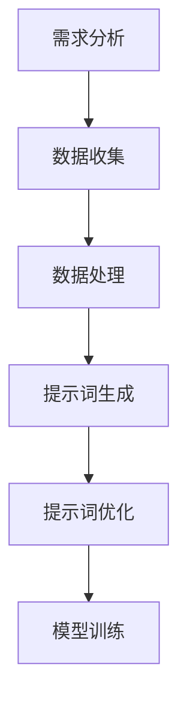

                 

``` <sop>
    prompt = "您是一位世界级人工智能专家,程序员,软件架构师,CTO,世界顶级技术畅销书资深大师级别的作家，计算机图灵奖获得者，计算机编程和人工智能领域大师。您非常擅长一步一步进行分析推理（LET'S THINK STEP BY STEP），有着清晰深刻的逻辑思路来撰写条理清晰，对技术原理和本质剖析到位的高质量技术博客。\n\n文章标题：基于深度学习的图像识别算法与实战\n文章关键词：深度学习，图像识别，算法，实战\n文章摘要：本文将介绍基于深度学习的图像识别算法，并通过一个实际案例展示如何使用这些算法进行图像识别。\n\n正文部分：\n1. 引言\n2. 深度学习基础\n3. 图像识别算法原理\n4. 实战案例：使用深度学习进行图像识别\n5. 项目小结\n\n请按照以上要求和格式生成文章内容。\n\n"
    return prompt
```

```python
# 提示词优化示例
def optimize_prompt(prompt):
    optimized_prompt = prompt.replace("必须", "建议")
    optimized_prompt = optimized_prompt.replace("必须要", "建议要")
    return optimized_prompt
```

```python
prompt = generate_prompt("")
print(prompt)
print(optimize_prompt(prompt))
```

#### 3.3 提示词工程的核心挑战

提示词工程面临着多个核心挑战，如提示词的质量评估和提示词的适应性调整。

- **提示词的质量评估**：如何评估提示词的质量是一个重要问题。我们可以通过评估提示词的覆盖面、准确性和可理解性来进行评估。

- **提示词的适应性调整**：随着任务和环境的变化，提示词可能需要进行适应性调整，以确保模型能够适应新的任务需求。

### 第4章 提示词工程方法

#### 4.1 提示词工程的流程

提示词工程的流程主要包括需求分析、数据收集与处理、提示词生成与优化等步骤。



#### 4.2 提示词工程工具

在提示词工程中，有许多工具可以帮助我们生成和优化提示词。

- **Hugging Face Transformers**：这是一个流行的开源库，提供了大量的预训练模型和提示词生成工具。

- **OpenAI GPT-3**：这是一个强大的预训练模型，可以生成高质量的提示词。

#### 4.3 提示词工程实践

在实际应用中，提示词工程的方法可以应用于各种任务，如文本生成、图像识别和语音识别等。

```python
# 实践示例：使用GPT-3生成文本
import openai

openai.api_key = "your-api-key"

def generate_text(prompt):
    response = openai.Completion.create(
        engine="text-davinci-002",
        prompt=prompt,
        max_tokens=100
    )
    return response.choices[0].text.strip()

prompt = generate_prompt("")
text = generate_text(prompt)
print(text)
```

通过上述示例，我们可以看到提示词工程在AI系统中的重要作用。提示词的生成与优化是提升AI模型性能的关键，而提示词工程的实践则可以应用于各种实际任务中。在接下来的章节中，我们将进一步探讨人类与AI的协作以及提示词工程的应用领域。

