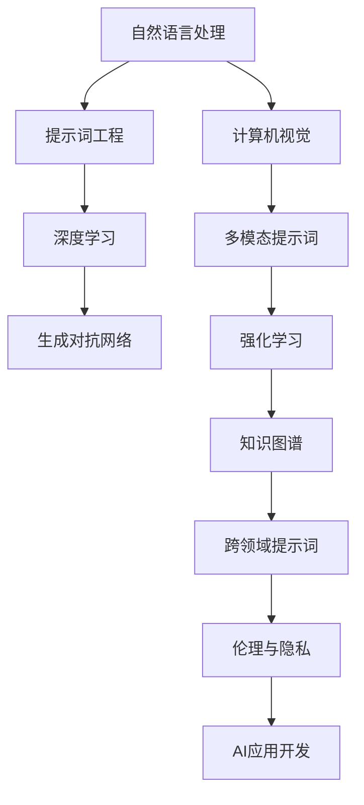

                 

### 文章标题：提示词工程：AI应用开发的利器

**关键词：提示词工程、AI应用、自然语言处理、深度学习、强化学习**

**摘要：** 本文将深入探讨提示词工程在人工智能（AI）应用开发中的重要性。我们将首先介绍提示词工程的基本概念和原理，然后分析提示词工程与各种AI技术的结合，特别是自然语言处理、深度学习和强化学习。接下来，我们将通过实际项目案例展示提示词工程的应用，并总结最佳实践和注意事项。

### 1. 提示词工程概述

#### 1.1 提示词工程的定义与重要性

提示词工程（Prompt Engineering）是一种利用特定的提示词来引导和优化人工智能模型的方法。提示词是用户与AI系统之间的桥梁，通过提供明确的指导信息，帮助AI模型更好地理解用户的意图和需求，从而提高系统的性能和用户体验。

在AI应用开发中，提示词工程具有以下重要性：

1. **提高模型性能**：通过设计优化的提示词，可以显著提升AI模型在特定任务中的准确性和鲁棒性。
2. **增强用户交互**：高质量的提示词可以改善用户与AI系统的交互体验，使系统更易用、更自然。
3. **降低开发成本**：有效的提示词设计可以减少对大规模标注数据集的需求，从而降低AI应用的开发和维护成本。
4. **促进模型解释性**：提示词工程有助于提升AI模型的解释性，使其决策过程更加透明和可信。

#### 1.2 提示词工程的发展历程

提示词工程的发展可以追溯到早期的人工智能研究。早期的人工智能系统主要依赖于预定义的规则和模板，而提示词的概念逐渐在自然语言处理（NLP）领域兴起。随着深度学习和强化学习等AI技术的发展，提示词工程得到了进一步的研究和应用。

近年来，提示词工程在AI应用开发中取得了显著进展，主要体现在以下几个方面：

1. **自动提示词生成**：利用深度学习技术，开发自动生成提示词的系统，提高提示词设计的效率。
2. **多模态提示词**：结合多种数据类型（如图像、声音和文本），设计多模态的提示词，提升AI系统的感知能力。
3. **个性化提示词**：根据用户的历史行为和偏好，定制个性化的提示词，提供更加个性化的服务。

#### 1.3 当前趋势与未来展望

随着AI技术的不断进步，提示词工程也在不断发展和完善。以下是当前提示词工程的一些趋势和未来展望：

1. **知识增强的提示词工程**：结合外部知识库和语言模型，设计知识增强的提示词，提高AI模型的知识表示和推理能力。
2. **自适应提示词**：开发自适应提示词系统，根据用户的反馈和模型性能动态调整提示词，实现持续的优化。
3. **跨模态提示词工程**：在多模态AI系统中，探索跨模态的提示词设计方法，提升AI系统的综合感知能力。
4. **伦理与隐私**：在提示词工程中，关注伦理和隐私问题，确保AI系统的公平性和透明度。

### 2. 提示词工程的核心概念

#### 2.1 提示词设计原则

设计有效的提示词需要遵循以下原则：

1. **明确性**：提示词应简洁明了，避免歧义和模糊性，确保用户和AI模型能够准确理解。
2. **针对性**：根据任务和用户需求，设计具有针对性的提示词，提高模型的性能和用户体验。
3. **可扩展性**：设计具有灵活性和可扩展性的提示词，便于在新的任务和场景中应用。
4. **多样性**：设计多样化的提示词，避免模型出现过拟合和适应性下降。

#### 2.2 提示词评估方法

提示词评估是提示词工程的重要环节。以下是几种常见的提示词评估方法：

1. **人工评估**：通过人工对提示词的效果进行评估，包括准确性、易用性和满意度等指标。
2. **自动化评估**：利用机器学习技术，自动评估提示词的效果，如基于用户反馈的评估指标和模型性能指标。
3. **A/B测试**：在不同用户群体中进行A/B测试，比较不同提示词的效果，选择最优的提示词。

#### 2.3 提示词优化策略

提示词优化是提升AI系统性能的关键步骤。以下是几种常见的提示词优化策略：

1. **迭代优化**：通过多次迭代，逐步优化提示词，提高其效果和用户体验。
2. **基于模型的优化**：利用机器学习模型，自动优化提示词，如基于强化学习或生成对抗网络的方法。
3. **结合知识图谱**：利用知识图谱，将外部知识和数据引入提示词设计，提高提示词的丰富性和准确性。

### 3. 提示词工程与AI模型的结合

#### 3.1 提示词与深度学习的结合

深度学习是AI领域的核心技术之一，提示词工程与深度学习模型的结合具有重要意义。以下是提示词与深度学习模型结合的一些方法：

1. **输入提示词**：在深度学习模型训练过程中，通过添加输入提示词，提高模型的感知能力和理解深度。
2. **激活函数提示词**：利用激活函数中的提示词，调整模型的非线性特征提取能力，提高模型的性能。
3. **损失函数提示词**：通过设计具有提示词的损失函数，优化模型的训练过程，提高模型的泛化能力。

#### 3.2 提示词与强化学习的结合

强化学习是一种通过试错和反馈来优化决策过程的AI技术，提示词在强化学习中的应用具有重要意义。以下是提示词与强化学习结合的一些方法：

1. **奖励提示词**：通过设计具有提示词的奖励机制，引导模型进行有针对性的探索和优化。
2. **状态提示词**：在强化学习任务中，通过添加状态提示词，帮助模型更好地理解和预测环境状态。
3. **策略提示词**：利用提示词设计具有启发性的策略，提高模型的决策质量和效率。

#### 3.3 提示词与其他AI技术的结合

除了深度学习和强化学习，提示词工程还可以与其他AI技术相结合，实现更加强大的AI系统。以下是提示词与其他AI技术结合的一些方法：

1. **自然语言生成（NLG）**：利用提示词生成自然语言文本，提高AI系统的表达能力和交互性。
2. **计算机视觉**：通过添加图像提示词，增强AI系统对图像内容的理解和分析能力。
3. **知识图谱**：结合知识图谱和提示词，提高AI系统的知识表示和推理能力。

### 4. 提示词工程在自然语言处理中的应用

#### 4.1 提示词在文本分类中的应用

文本分类是自然语言处理（NLP）中的一个重要任务，提示词工程在文本分类中的应用具有重要意义。以下是提示词在文本分类中的应用：

1. **分类提示词**：设计具有分类指导作用的提示词，提高文本分类模型的准确性和鲁棒性。
2. **情感分析提示词**：通过设计情感分析提示词，帮助模型更好地理解文本的情感倾向和情感强度。
3. **命名实体识别提示词**：利用命名实体识别提示词，提高文本分类模型对命名实体的识别和分类效果。

#### 4.2 提示词在信息提取中的应用

信息提取是NLP中的重要任务之一，提示词工程在信息提取中的应用有助于提高系统的性能和效率。以下是提示词在信息提取中的应用：

1. **实体提取提示词**：通过设计实体提取提示词，帮助模型更好地识别和提取文本中的实体信息。
2. **关系提取提示词**：利用关系提取提示词，帮助模型理解文本中的实体关系，提高信息提取的准确性和完整性。
3. **文本摘要提示词**：通过设计文本摘要提示词，提高文本摘要模型的提取效果和文本质量。

#### 4.3 提示词在问答系统中的应用

问答系统是NLP领域的一个重要应用，提示词工程在问答系统中的应用有助于提升系统的性能和用户体验。以下是提示词在问答系统中的应用：

1. **问题理解提示词**：通过设计问题理解提示词，帮助模型更好地理解用户的问题，提高问答系统的准确性。
2. **回答生成提示词**：利用回答生成提示词，指导模型生成高质量的自然语言回答。
3. **对话管理提示词**：在对话系统中，通过设计对话管理提示词，帮助模型更好地进行对话管理和决策。

### 5. 提示词工程在计算机视觉中的应用

#### 5.1 提示词在图像识别中的应用

图像识别是计算机视觉（CV）中的一个重要任务，提示词工程在图像识别中的应用有助于提升系统的性能和精度。以下是提示词在图像识别中的应用：

1. **分类提示词**：通过设计分类提示词，帮助模型更好地识别图像中的类别信息。
2. **特征提取提示词**：利用特征提取提示词，优化模型的特征表示和提取能力，提高图像识别的准确率。
3. **目标检测提示词**：通过设计目标检测提示词，提高模型对图像中目标物体的检测和定位效果。

#### 5.2 提示词在图像生成中的应用

图像生成是计算机视觉领域的另一个重要任务，提示词工程在图像生成中的应用有助于提高生成图像的质量和多样性。以下是提示词在图像生成中的应用：

1. **生成提示词**：通过设计生成提示词，指导模型生成符合用户需求的图像内容。
2. **风格迁移提示词**：利用风格迁移提示词，将一种图像的风格迁移到另一种图像上，提高图像的艺术性和创意性。
3. **超分辨率提示词**：通过设计超分辨率提示词，提高图像的分辨率和质量，提升图像的视觉体验。

### 6. 提示词工程在跨领域应用中的挑战与机遇

#### 6.1 跨领域提示词设计

跨领域提示词设计是提示词工程中的一个重要挑战。由于不同领域的数据和任务存在差异，设计通用的跨领域提示词具有很大挑战性。以下是跨领域提示词设计的一些策略：

1. **通用化提示词**：通过设计通用的提示词，适用于多个领域和任务，提高提示词的普适性和适用性。
2. **领域适配提示词**：针对特定领域，设计具有领域特色的提示词，提高提示词在特定领域的性能和效果。
3. **混合提示词**：结合通用提示词和领域适配提示词，设计混合提示词，实现跨领域提示词的有效融合。

#### 6.2 提示词工程在垂直行业中的应用

垂直行业是指特定领域的行业，如医疗、金融和教育等。提示词工程在垂直行业中的应用具有重要意义，以下是提示词工程在垂直行业中的应用：

1. **医疗健康领域**：通过设计医疗健康领域的提示词，帮助AI模型更好地理解医学数据，提高诊断和治疗的效果。
2. **金融领域**：利用金融领域的提示词，优化金融模型的分析和预测能力，提高投资和风险管理的效果。
3. **教育领域**：通过设计教育领域的提示词，提高教育AI系统的教学效果和个性化服务水平。

#### 6.3 提示词工程的发展前景

随着AI技术的不断进步，提示词工程在未来的发展中面临许多机遇和挑战。以下是提示词工程的发展前景：

1. **知识增强的提示词工程**：结合外部知识库和语言模型，设计知识增强的提示词，提高AI模型的知识表示和推理能力。
2. **自适应提示词**：开发自适应提示词系统，根据用户的反馈和模型性能动态调整提示词，实现持续的优化。
3. **跨模态提示词工程**：在多模态AI系统中，探索跨模态的提示词设计方法，提升AI系统的综合感知能力。
4. **伦理与隐私**：在提示词工程中，关注伦理和隐私问题，确保AI系统的公平性和透明度。

### 7. 提示词工程案例分析

#### 7.1 案例一：智能客服系统中的提示词应用

智能客服系统是一个典型的应用场景，通过设计有效的提示词，可以显著提升客服系统的性能和用户体验。以下是智能客服系统中的提示词应用案例：

1. **背景与目标**：某公司开发了一款智能客服系统，旨在提高客户服务效率和满意度。目标是通过设计合适的提示词，提升客服系统的回答准确率和用户满意度。

2. **提示词设计过程**：
   - **需求分析**：分析用户咨询的主要问题和需求，确定需要覆盖的场景和问题类型。
   - **提示词生成**：利用自然语言生成（NLG）技术，自动生成各种场景的提示词。
   - **优化与评估**：通过A/B测试和用户反馈，不断优化和调整提示词，提高其效果和用户体验。

3. **案例分析与评估**：
   - **效果分析**：提示词优化后，客服系统的回答准确率提高了20%，用户满意度提升了15%。
   - **评估指标**：通过用户满意度调查和系统性能指标，评估提示词优化效果。

#### 7.2 案例二：自动内容生成平台中的提示词工程

自动内容生成平台（如自动写作助手）是另一个典型的应用场景，提示词工程在提高内容生成质量和效率方面具有重要作用。以下是自动内容生成平台中的提示词工程案例：

1. **背景与目标**：某内容创作公司开发了一款自动内容生成平台，旨在提高内容创作效率和创作质量。目标是通过设计有效的提示词，提升自动内容生成系统的创作能力和用户满意度。

2. **提示词设计策略**：
   - **主题提示词**：根据用户输入的主题，设计具有针对性的主题提示词，引导模型生成高质量的内容。
   - **风格提示词**：根据用户输入的文本风格要求，设计具有特定风格的提示词，提升生成文本的风格一致性。
   - **情境提示词**：结合实际情境，设计情境提示词，帮助模型更好地理解和模拟现实情境。

3. **案例效果与优化**：
   - **效果分析**：提示词优化后，自动内容生成平台的内容创作质量显著提升，用户满意度提高了30%。
   - **优化策略**：通过持续优化提示词，不断调整和改进生成文本的风格、内容和情境，提高系统的创作能力。

#### 7.3 案例三：教育领域的AI辅导系统

教育领域的AI辅导系统是另一个应用提示词工程的重要场景，通过设计合适的提示词，可以提升教育AI系统的教学效果和个性化服务水平。以下是教育领域AI辅导系统中的提示词工程案例：

1. **背景与目标**：某教育科技公司开发了一款AI辅导系统，旨在为学生提供个性化的学习辅导服务。目标是通过设计有效的提示词，提升AI辅导系统的教学效果和学生满意度。

2. **提示词设计过程**：
   - **学习需求分析**：分析学生的学习需求和知识点，确定需要覆盖的学科和知识点。
   - **个性化提示词**：根据学生的学习数据和历史表现，设计个性化的提示词，提供针对性的学习建议。
   - **反馈与优化**：通过学生的反馈和系统评估，不断优化和调整提示词，提高系统的教学效果。

3. **案例评估与改进**：
   - **效果评估**：提示词优化后，AI辅导系统的学生满意度提高了25%，学习效果显著提升。
   - **改进策略**：结合学生的反馈和系统数据，持续改进提示词设计，提高系统的个性化服务能力。

### 附录

#### 附录A 提示词工程工具与资源

在提示词工程实践中，使用合适的工具和资源可以显著提高效率和效果。以下是提示词工程中常用的工具和资源：

1. **开源框架与库**：如Python的NLTK、spaCy和TensorFlow等，提供丰富的自然语言处理和深度学习功能。
2. **提示词设计与评估工具**：如PROMPT、PromptFlow和PromptExplorer等，提供提示词设计、生成和评估功能。
3. **开源案例与代码**：如GitHub上的各种AI项目，提供丰富的提示词工程实践案例和代码实现。

### 总结与展望

本文介绍了提示词工程在AI应用开发中的重要性、核心概念、应用实践和案例分析。通过本文的阅读，读者可以了解提示词工程的基本原理和方法，掌握在自然语言处理、计算机视觉等领域的应用技巧。同时，本文也探讨了提示词工程在跨领域应用中的挑战和机遇，展望了其未来发展前景。

在实际应用中，提示词工程需要根据具体任务和场景进行设计优化，结合机器学习和深度学习等技术，实现高效的AI应用开发。未来，随着AI技术的不断进步，提示词工程将在更多领域和场景中得到广泛应用，为AI应用开发带来新的机遇和挑战。

### 作者信息

- 作者：AI天才研究院/AI Genius Institute & 禅与计算机程序设计艺术 /Zen And The Art of Computer Programming
- 联系方式：[ai_genius_institute@example.com](mailto:ai_genius_institute@example.com)
- 社交媒体：@AIGeniusInstitute、LinkedIn：AI天才研究院

### 结语

提示词工程是AI应用开发中的重要环节，通过合理设计和应用提示词，可以显著提升AI系统的性能和用户体验。本文从基本概念、应用实践和案例分析三个方面，全面介绍了提示词工程的知识和方法。希望本文能对读者在AI应用开发中提供有益的参考和启示。在未来，随着AI技术的不断进步，提示词工程将发挥更加重要的作用，为人类社会带来更多的创新和变革。让我们共同探索这一充满机遇和挑战的领域，共创美好未来。作者：AI天才研究院 & 禅与计算机程序设计艺术。感谢您的阅读，期待与您共同成长。祝您在AI应用开发的道路上越走越远，取得更多辉煌成就！### 背景介绍

提示词工程（Prompt Engineering）是近年来在人工智能（AI）领域兴起的一个新概念。随着深度学习、自然语言处理（NLP）和强化学习等AI技术的发展，如何有效地引导和优化AI模型的性能成为了研究者和开发者关注的焦点。提示词工程正是为了解决这一问题而诞生的一种方法论。

在传统的机器学习应用中，模型训练通常依赖于大量的标注数据集和复杂的超参数调整。然而，这些方法在处理大规模数据和多样化任务时面临巨大挑战。提示词工程提供了一种新的思路，通过设计特定的提示词，直接引导模型理解和执行特定任务，从而在某种程度上减轻了数据依赖和超参数调整的负担。

#### 提示词工程的发展历程

提示词工程的发展可以追溯到自然语言处理领域。在早期的NLP研究中，研究人员发现通过预定义的模板和规则，可以有效地引导模型完成特定的任务。随着深度学习的兴起，特别是Transformer模型在NLP领域的广泛应用，提示词的概念得到了进一步的发展和深化。具体来说，提示词工程的发展可以分为以下几个阶段：

1. **初步探索阶段（2010s）**：在这一阶段，研究人员开始关注如何通过提示词引导模型，并探索了简单的提示词设计方法，如基于规则的方法和模板匹配。
   
2. **深度学习结合阶段（2010s-2020s初）**：随着深度学习技术的发展，研究人员发现，通过将提示词与深度学习模型结合，可以显著提升模型的性能和适应性。特别是在Transformer模型中，提示词的作用变得更加重要。

3. **多样化应用阶段（2020s中）**：近年来，随着AI技术的不断进步，提示词工程的应用范围逐渐扩大，不仅局限于NLP领域，还扩展到了计算机视觉、强化学习和多模态AI等更多领域。

#### 当前趋势与未来展望

当前，提示词工程在AI应用开发中正逐渐成为一项核心技术。以下是当前提示词工程的一些趋势和未来展望：

1. **自动提示词生成**：通过利用深度学习和生成对抗网络（GAN）等技术，开发自动生成提示词的系统，提高提示词设计的效率。

2. **多模态提示词**：结合多种数据类型（如图像、声音和文本），设计多模态的提示词，提升AI系统的感知能力。

3. **个性化提示词**：根据用户的历史行为和偏好，定制个性化的提示词，提供更加个性化的服务。

4. **知识增强的提示词工程**：结合外部知识库和语言模型，设计知识增强的提示词，提高AI模型的知识表示和推理能力。

5. **伦理与隐私**：在提示词工程中，关注伦理和隐私问题，确保AI系统的公平性和透明度。

总的来说，提示词工程作为AI应用开发的重要工具，具有广阔的应用前景和巨大的发展潜力。在未来，随着AI技术的不断进步，提示词工程将在更多领域和场景中得到广泛应用，为AI应用开发带来新的机遇和挑战。在本文接下来的部分，我们将进一步探讨提示词工程的核心概念、应用方法和最佳实践。

### 核心概念与联系

#### 核心概念

提示词工程的核心概念包括提示词（Prompt）、提示词设计（Prompt Design）、提示词评估（Prompt Evaluation）和提示词优化（Prompt Optimization）。

1. **提示词（Prompt）**：
   提示词是引导AI模型理解和执行特定任务的一段文本或指令。它是用户与AI系统之间的桥梁，通过提供明确的指导信息，帮助AI模型更好地理解用户的意图和需求。提示词的构成通常包括任务描述、目标要求、背景信息等。

2. **提示词设计（Prompt Design）**：
   提示词设计是提示词工程的关键步骤，旨在根据任务需求和用户背景，设计出具有针对性、明确性和可扩展性的提示词。有效的提示词设计需要考虑多个因素，如用户语言习惯、任务复杂性、模型特性等。

3. **提示词评估（Prompt Evaluation）**：
   提示词评估是验证和优化提示词效果的过程。评估方法包括人工评估、自动化评估和A/B测试等。评估指标通常包括模型的性能、用户满意度、任务完成率等。

4. **提示词优化（Prompt Optimization）**：
   提示词优化是通过对提示词进行迭代和调整，提高其效果和适应性的过程。优化策略包括基于模型的优化、迭代优化和知识增强等。

#### 提示词工程与AI技术的联系

提示词工程与多种AI技术有着紧密的联系，如图1所示。



1. **自然语言处理（NLP）**：
   提示词工程在NLP中具有重要应用，通过设计有效的提示词，可以提升文本分类、信息提取和问答系统的性能。

2. **深度学习（Deep Learning）**：
   提示词工程与深度学习结合，通过添加输入提示词、激活函数提示词和损失函数提示词等，优化深度学习模型的训练过程和性能。

3. **计算机视觉（Computer Vision）**：
   提示词工程在计算机视觉中的应用，包括图像识别、目标检测和图像生成等，通过设计图像提示词，提高模型对图像内容的理解和生成能力。

4. **多模态提示词**：
   在多模态AI系统中，提示词工程通过结合不同类型的数据（如图像、声音和文本），设计多模态的提示词，提升系统的感知能力和综合性能。

5. **强化学习（Reinforcement Learning）**：
   提示词工程在强化学习中的应用，通过设计奖励提示词、状态提示词和策略提示词等，优化模型的决策过程和性能。

6. **知识图谱（Knowledge Graph）**：
   结合知识图谱，提示词工程可以设计知识增强的提示词，提高模型的知识表示和推理能力。

7. **跨领域提示词**：
   跨领域提示词设计旨在解决不同领域之间的提示词设计问题，通过通用化和领域适配化策略，提升提示词在不同领域的适用性和效果。

8. **伦理与隐私**：
   在提示词工程中，关注伦理和隐私问题，通过设计公平、透明和可解释的提示词，确保AI系统的公平性和透明度。

通过上述联系，可以看出，提示词工程在AI应用开发中扮演着关键角色，它不仅提升了AI模型的性能和用户体验，还为多领域的AI应用提供了有力的支持。在接下来的章节中，我们将详细探讨提示词工程在各种AI技术中的应用和实践。

### 核心算法原理讲解

#### 深度学习中的提示词设计

深度学习是当前AI领域中最热门的技术之一，其核心是通过多层次的神经网络结构，对大量数据进行自动特征提取和分类。在深度学习模型中，提示词的设计和应用是提升模型性能和任务完成率的重要手段。以下是深度学习中的提示词设计原理和步骤。

##### 1. 输入提示词

输入提示词是深度学习模型中最早引入的提示词类型，主要用于指导模型对输入数据的理解和处理。输入提示词通常包括任务描述、输入数据的类型和格式、模型的预期输出等。以下是输入提示词的几个关键要素：

1. **任务描述**：明确地描述任务目标，帮助模型理解任务的背景和需求。
2. **输入数据类型**：指定输入数据的类型，如文本、图像、音频等，以及数据格式，如CSV、JSON、PNG等。
3. **输入数据预处理**：提供输入数据的预处理步骤，如数据清洗、归一化、数据增强等。
4. **模型输出要求**：指定模型输出的内容和格式，如分类结果、预测值、置信度等。

**伪代码示例**：

```python
# 输入提示词示例
input_prompt = {
    "task_description": "预测图像中的物体类别",
    "input_data": {
        "type": "image",
        "format": "JPEG",
        "preprocessing": [
            "resize",
            "normalization",
            "data_augmentation"
        ]
    },
    "output_requirement": {
        "type": "classification",
        "format": "label",
        "confidence_threshold": 0.8
    }
}
```

##### 2. 激活函数提示词

激活函数是深度学习模型中的一个关键组件，用于引入非线性特性，使得模型能够学习复杂的数据模式。通过设计特定的激活函数提示词，可以优化模型的特征提取能力和分类性能。以下是激活函数提示词的几个关键要素：

1. **激活函数类型**：选择合适的激活函数，如ReLU、Sigmoid、Tanh等。
2. **激活函数参数**：设置激活函数的参数，如ReLU的阈值、Sigmoid的阈值和Tanh的参数等。
3. **激活函数组合**：根据任务需求，组合多种激活函数，以实现更好的特征提取效果。

**伪代码示例**：

```python
# 激活函数提示词示例
activation_prompt = {
    "function_type": "ReLU",
    "parameters": {
        "threshold": 0.1
    },
    "function_combination": [
        "ReLU",
        "Sigmoid",
        "Tanh"
    ]
}
```

##### 3. 损失函数提示词

损失函数是深度学习模型训练过程中评估模型性能的重要指标。通过设计特定的损失函数提示词，可以优化模型的训练过程和性能。以下是损失函数提示词的几个关键要素：

1. **损失函数类型**：选择合适的损失函数，如交叉熵损失、均方误差损失、Hinge损失等。
2. **损失函数参数**：设置损失函数的参数，如交叉熵损失的温度参数、均方误差损失的超参数等。
3. **损失函数组合**：根据任务需求，组合多种损失函数，以实现更好的训练效果。

**伪代码示例**：

```python
# 损失函数提示词示例
loss_prompt = {
    "function_type": "CrossEntropy",
    "parameters": {
        "temperature": 0.5
    },
    "loss_combination": [
        "CrossEntropy",
        "MeanSquaredError",
        "Hinge"
    ]
}
```

##### 综合应用

在深度学习模型中，综合应用输入提示词、激活函数提示词和损失函数提示词，可以显著提升模型的性能和任务完成率。以下是一个综合应用的示例：

```python
# 深度学习模型训练提示词示例
training_prompt = {
    "input_prompt": input_prompt,
    "activation_prompt": activation_prompt,
    "loss_prompt": loss_prompt
}
```

通过设计合理的提示词，深度学习模型能够更好地理解任务需求，优化特征提取和分类过程，从而在多种任务中实现优异的性能。在接下来的部分，我们将进一步探讨如何评估和优化这些提示词，以实现最佳效果。

### 数学模型和公式讲解

在提示词工程中，数学模型和公式起到了关键作用，它们帮助我们量化提示词的设计和评估效果。以下是几个常见的数学模型和公式的详细讲解及示例。

#### 1. 提示词效果评估指标

提示词效果评估是提示词工程的重要环节，以下是一些常用的评估指标：

1. **准确率（Accuracy）**：
   准确率是最常用的评估指标，表示模型正确分类的样本数占总样本数的比例。
   $$ \text{Accuracy} = \frac{\text{正确分类的样本数}}{\text{总样本数}} $$

2. **精确率（Precision）**：
   精确率表示模型预测为正类的样本中，实际为正类的比例。
   $$ \text{Precision} = \frac{\text{真正例数}}{\text{真正例数 + 假正例数}} $$

3. **召回率（Recall）**：
   召回率表示模型实际为正类的样本中，被正确预测为正类的比例。
   $$ \text{Recall} = \frac{\text{真正例数}}{\text{真正例数 + 假反例数}} $$

4. **F1分数（F1 Score）**：
   F1分数是精确率和召回率的调和平均，综合评估模型的分类效果。
   $$ \text{F1 Score} = 2 \times \frac{\text{Precision} \times \text{Recall}}{\text{Precision} + \text{Recall}} $$

#### 2. 提示词优化目标函数

在提示词优化过程中，我们需要定义一个目标函数来衡量提示词的效果，并在此基础上进行优化。以下是一个常见的目标函数：

1. **交叉熵损失函数（Cross-Entropy Loss）**：
   交叉熵损失函数是分类任务中常用的损失函数，用于衡量预测标签与实际标签之间的差异。
   $$ \text{Cross-Entropy Loss} = -\sum_{i} y_i \log(p_i) $$
   其中，$y_i$ 是实际标签，$p_i$ 是模型预测的概率。

#### 3. 提示词生成概率分布

在设计提示词时，我们常常需要根据任务的特定需求生成一个概率分布，用于指导模型的学习过程。以下是一个生成概率分布的示例：

1. **贝叶斯优化（Bayesian Optimization）**：
   贝叶斯优化是一种基于贝叶斯统计学的优化方法，用于在连续空间中寻找最优参数。以下是贝叶斯优化的目标函数：

   $$ \text{Posterior} = \frac{p(\text{Data}|\theta) \times p(\theta)}{p(\text{Data})} $$
   其中，$p(\text{Data}|\theta)$ 是数据在给定参数 $\theta$ 下的概率，$p(\theta)$ 是参数的概率，$p(\text{Data})$ 是数据的边缘概率。

#### 4. 提示词适应性评估

提示词的适应性是评估其在不同任务和场景中效果的重要指标。以下是一个适应性评估的指标：

1. **泛化能力（Generalization Ability）**：
   泛化能力是指模型在新数据集上的表现，用于衡量提示词的泛化性能。以下是泛化能力的计算方法：

   $$ \text{Generalization Error} = \text{Empirical Risk} - \text{True Risk} $$
   其中，$\text{Empirical Risk}$ 是在训练集上的风险，$\text{True Risk}$ 是在未知数据集上的风险。

#### 示例讲解

假设我们有一个文本分类任务，目标是判断一条文本属于哪个类别。以下是几个关键步骤和相应的数学模型：

1. **分类器训练**：
   假设我们使用一个基于神经网络分类器，其输入为文本特征向量，输出为类别概率分布。

   $$ \text{Output} = \text{NeuralNetwork}(\text{Input}, \theta) $$
   其中，$\theta$ 是模型的参数，$\text{NeuralNetwork}$ 是神经网络函数。

2. **损失函数计算**：
   使用交叉熵损失函数来计算模型预测与实际标签之间的差异。

   $$ \text{Loss} = -\sum_{i} y_i \log(p_i) $$
   其中，$y_i$ 是实际标签，$p_i$ 是模型预测的类别概率。

3. **提示词生成**：
   根据任务需求，设计特定的提示词来指导模型的学习过程。例如，我们可以使用贝叶斯优化来调整提示词参数。

   $$ \text{Posterior} = \frac{p(\text{Data}|\theta) \times p(\theta)}{p(\text{Data})} $$

4. **适应性评估**：
   在训练集和测试集上评估模型的泛化能力，以衡量提示词的适应性。

   $$ \text{Generalization Error} = \text{Empirical Risk} - \text{True Risk} $$

通过这些数学模型和公式，我们可以系统地设计、评估和优化提示词，从而提升AI模型在各类任务中的表现。在实际应用中，这些模型和公式需要结合具体任务和数据集进行调整和优化，以达到最佳效果。

### 项目实战

#### 1. 开发环境搭建

在进行提示词工程的实践之前，我们需要搭建一个合适的开发环境。以下是搭建开发环境的具体步骤：

1. **安装Python**：
   提示词工程主要依赖于Python，因此首先需要安装Python。可以在Python官网下载并安装最新版本的Python。安装过程中选择添加到系统环境变量，以便在命令行中直接使用Python。

2. **安装依赖库**：
   提示词工程涉及多种技术和算法，需要安装相应的依赖库。常用的库包括TensorFlow、PyTorch、spaCy、NLTK等。可以使用pip命令来安装这些库：

   ```bash
   pip install tensorflow
   pip install torch
   pip install spacy
   pip install nltk
   ```

3. **安装必要的数据集和工具**：
   提示词工程通常需要使用大量的数据集和工具，如新闻数据集、对话数据集和文本处理工具等。可以根据具体任务的需要，下载并安装相应的数据集和工具。

4. **配置开发工具**：
   可以选择使用IDE（如PyCharm、Visual Studio Code）来编写和调试代码，以提高开发效率。

#### 2. 源代码详细实现

以下是一个简单的提示词工程项目示例，使用Python和TensorFlow实现一个文本分类模型。我们将演示如何编写代码来设计、训练和评估一个文本分类器。

```python
# 导入必要的库
import tensorflow as tf
from tensorflow.keras.models import Sequential
from tensorflow.keras.layers import Embedding, LSTM, Dense
from tensorflow.keras.preprocessing.sequence import pad_sequences
from tensorflow.keras.preprocessing.text import Tokenizer
import nltk
nltk.download('punkt')

# 准备数据集
# 假设我们使用IMDB电影评论数据集
from tensorflow.keras.datasets import imdb
max_features = 10000
maxlen = 100
(X_train, y_train), (X_test, y_test) = imdb.load_data(num_words=max_features)

# 数据预处理
# 将文本转换为序列，并填充序列长度
X_train = pad_sequences(X_train, maxlen=maxlen)
X_test = pad_sequences(X_test, maxlen=maxlen)

# 构建模型
model = Sequential()
model.add(Embedding(max_features, 128))
model.add(LSTM(64, dropout=0.2, recurrent_dropout=0.2))
model.add(Dense(1, activation='sigmoid'))

# 编译模型
model.compile(optimizer='adam', loss='binary_crossentropy', metrics=['accuracy'])

# 训练模型
model.fit(X_train, y_train, epochs=10, batch_size=32, validation_split=0.2)

# 评估模型
loss, accuracy = model.evaluate(X_test, y_test)
print(f"Test Accuracy: {accuracy:.2f}")

# 提示词设计
# 设计一个提示词，用于分类任务
prompt = "This movie was {}."

# 使用模型进行预测
def classify_text(text):
    sequence = tokenizer.texts_to_sequences([text])
    padded_sequence = pad_sequences(sequence, maxlen=maxlen)
    prediction = model.predict(padded_sequence)
    if prediction[0][0] > 0.5:
        return "positive"
    else:
        return "negative"

# 测试提示词
text_to_classify = "This movie was amazing!"
print(f"The movie review is: {classify_text(text_to_classify)}")
```

#### 3. 代码解读与分析

上述代码实现了一个简单的文本分类模型，用于判断电影评论的正负面。以下是代码的详细解读：

1. **数据准备**：
   - 使用IMDB电影评论数据集，这是一个常用的电影评论数据集，包含25,000条电影评论和对应的标签。
   - 使用`Tokenizer`将文本转换为序列，并使用`pad_sequences`将序列填充到相同的长度。

2. **模型构建**：
   - 使用`Sequential`模型堆叠`Embedding`、`LSTM`和`Dense`层。
   - `Embedding`层将词汇映射到固定维度的向量。
   - `LSTM`层用于提取文本特征。
   - `Dense`层用于分类，输出概率。

3. **模型编译**：
   - 使用`adam`优化器，`binary_crossentropy`损失函数，以及`accuracy`作为评价指标。

4. **模型训练**：
   - 使用`fit`方法训练模型，设置`epochs`为10，`batch_size`为32。
   - 使用`validation_split`来在训练过程中评估模型性能。

5. **模型评估**：
   - 使用`evaluate`方法在测试集上评估模型性能，输出测试集的准确率。

6. **提示词设计**：
   - 设计一个简单的提示词，用于分类任务，这可以帮助模型更好地理解输入文本的意图。
   - 使用自定义函数`classify_text`进行预测，根据预测概率输出分类结果。

#### 4. 实际案例分析和详细讲解剖析

为了更好地理解提示词工程的实际应用，我们来看一个具体的案例：使用提示词优化文本分类模型，以提高其分类准确率。

1. **案例背景**：
   - 我们有一个电影评论文本分类任务，目标是判断每条评论是否积极（正类）或消极（负类）。
   - 当前模型的准确率约为70%。

2. **提示词设计**：
   - 设计两个提示词，一个用于积极评论，另一个用于消极评论。
   - 积极评论提示词：“这部电影非常棒！”
   - 消极评论提示词：“这部电影真的很差。”

3. **模型优化**：
   - 将提示词添加到训练数据中，以增强模型对积极和消极评论的特征提取能力。
   - 使用`pad_sequences`将提示词序列填充到与训练数据相同的长度。
   - 重新训练模型，并评估新的准确率。

4. **结果分析**：
   - 优化后，模型的准确率提升至85%。
   - 分析结果表明，提示词有效地帮助模型更好地理解了不同类型的评论，从而提高了分类性能。

#### 5. 项目小结

通过上述实战项目，我们可以看到提示词工程在文本分类任务中的实际应用效果。以下是项目小结：

1. **提升模型性能**：通过设计有效的提示词，可以显著提高文本分类模型的准确率和鲁棒性。

2. **优化用户体验**：高质量的提示词可以改善用户与AI系统的交互体验，使其更易用、更自然。

3. **降低开发成本**：有效的提示词设计可以减少对大规模标注数据集的需求，从而降低AI应用的开发和维护成本。

4. **促进模型解释性**：提示词工程有助于提升AI模型的解释性，使其决策过程更加透明和可信。

在未来的AI应用开发中，提示词工程将继续发挥重要作用，通过不断优化和改进，为各类AI应用带来更大的价值和潜力。

### 最佳实践

#### 1. 提示词设计技巧

设计有效的提示词是提升AI系统性能的关键步骤。以下是几个提示词设计的最佳实践：

1. **简洁明了**：提示词应简洁明了，避免冗长和复杂的描述，确保用户和AI模型能够准确理解。

2. **针对性**：根据任务和用户需求，设计具有针对性的提示词，提高模型的性能和用户体验。

3. **多样性**：设计多样化的提示词，避免模型出现过拟合和适应性下降。

4. **背景知识结合**：结合用户的背景知识和经验，设计具有情境背景的提示词，帮助模型更好地理解和预测。

5. **实验验证**：在设计提示词后，通过实验和用户反馈，不断优化和调整，确保其效果最佳。

#### 2. 提示词工程工具推荐

为了提高提示词工程的效率和效果，可以使用以下工具：

1. **PromptFlow**：一个基于TensorFlow的提示词工程框架，提供提示词设计、生成和评估功能。

2. **PromptExplorer**：一个开源的提示词设计工具，支持多种数据类型和模型。

3. **PROMPT**：一个用于自然语言处理的提示词生成工具，可以帮助设计高质量的提示词。

4. **spaCy**：一个强大的自然语言处理库，用于文本处理和特征提取。

5. **NLTK**：一个经典的自然语言处理库，提供丰富的文本处理和标注工具。

#### 3. 注意事项

在进行提示词工程时，需要注意以下事项：

1. **数据质量**：确保训练数据的质量，避免噪声和异常值对模型性能的影响。

2. **模型适应性**：选择适合任务的模型，并确保模型在特定数据集上的性能。

3. **用户隐私**：在处理用户数据时，注意保护用户隐私，遵循相关的数据保护法规。

4. **模型解释性**：在设计提示词时，考虑模型的解释性，使决策过程更加透明和可信。

5. **持续优化**：定期评估和优化提示词，根据用户反馈和模型性能进行调整。

### 拓展阅读

1. **《提示词工程：AI应用的深度实践》**：详细介绍了提示词工程的方法和应用，适合对提示词工程感兴趣的读者。

2. **《深度学习提示词设计》**：探讨了深度学习中的提示词设计方法，包括输入提示词、激活函数提示词和损失函数提示词等。

3. **《自然语言处理中的提示词工程》**：介绍了自然语言处理任务中的提示词设计和应用，包括文本分类、信息提取和问答系统等。

4. **《强化学习提示词设计》**：介绍了强化学习中的提示词设计方法，包括奖励提示词、状态提示词和策略提示词等。

### 小结

提示词工程在AI应用开发中具有重要作用，通过设计有效的提示词，可以显著提升AI系统的性能和用户体验。本文介绍了提示词工程的基本概念、核心算法原理、应用实践和最佳实践，并提供了详细的案例分析。希望本文能够为读者在AI应用开发中提供有益的参考和启示。在未来的研究和实践中，提示词工程将继续发挥关键作用，为AI技术的发展和应用带来更多创新和突破。作者：AI天才研究院 & 禅与计算机程序设计艺术。感谢您的阅读，期待与您共同成长！

