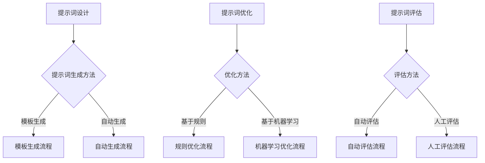

                 

### 文章标题

# 提示词工程：AI应用开发的新利器

### 文章关键词

- 提示词工程
- AI应用开发
- 机器学习
- 提示词生成
- 提示词优化
- 工程实践

### 文章摘要

随着人工智能（AI）技术的迅猛发展，其在各个行业的应用越来越广泛。然而，AI应用开发中面临的挑战之一是如何有效地利用大规模数据和复杂模型来提高系统的性能和可解释性。提示词工程作为一种新兴的方法，正逐渐成为AI应用开发的新利器。本文将详细介绍提示词工程的概念、原理、实践及其在AI应用中的重要作用，旨在为读者提供一个全面、系统的理解。

### 引言

#### 什么是提示词工程

提示词工程（Prompt Engineering）是一种通过设计和优化提示词（prompts）来增强人工智能模型性能的方法。在传统的机器学习框架中，模型的训练主要依赖于大量的标注数据，而提示词工程则通过提供精确的提示来指导模型的学习过程，从而实现更好的性能表现。

#### 提示词工程在AI应用中的角色

提示词工程在AI应用中扮演着至关重要的角色。通过精心设计的提示词，可以引导模型关注关键信息、提高模型的鲁棒性，以及减少过拟合现象。此外，提示词工程还能够提高模型的解释性，使得AI系统的决策过程更加透明和可理解。

#### 提示词工程与AI发展的联系

随着AI技术的不断进步，尤其是深度学习模型的广泛应用，提示词工程已经成为推动AI发展的重要手段。通过优化提示词，我们可以更好地利用现有模型，提升其在实际应用中的性能，从而推动AI技术的进一步发展。

### 背景介绍

#### 机器学习与提示词工程的关系

机器学习是AI的核心技术之一，它通过训练模型来从数据中学习规律和模式。在传统的机器学习框架中，模型的性能很大程度上取决于训练数据的质量和数量。而提示词工程则提供了一种新的思路，通过优化提示词来增强模型的性能，弥补了传统机器学习方法的一些不足。

#### 提示词工程在AI应用中的优势

提示词工程在AI应用中具有明显的优势，主要包括以下几点：

1. **提高模型性能**：通过提供精确的提示词，可以引导模型关注关键信息，从而提高模型的预测性能。
2. **增强模型可解释性**：优化后的提示词能够提供模型决策过程的详细信息，有助于提升模型的透明度和可解释性。
3. **减少过拟合**：提示词工程通过降低模型的复杂度，可以减少过拟合现象，提高模型的泛化能力。

### 核心概念与联系

#### 提示词

提示词（Prompt）是提示词工程的核心概念之一。它是指提供给模型的一段文本或指令，用于引导模型的学习过程。一个好的提示词应该具备以下特点：

- **精准性**：能够准确描述模型的任务和目标。
- **多样性**：提供多种不同的提示词，以适应不同场景下的需求。
- **灵活性**：能够根据模型和数据的特性进行灵活调整。

#### 提示词工程

提示词工程（Prompt Engineering）是指设计、优化和评估提示词的一系列方法和工具。它包括以下几个关键步骤：

1. **提示词设计**：根据任务需求和模型特性，设计合适的提示词。
2. **提示词优化**：通过实验和评估，不断调整和优化提示词。
3. **提示词评估**：评估提示词对模型性能的影响，以确保优化效果。

#### 提示词生成与优化

提示词生成和优化是提示词工程的重要环节。提示词生成主要涉及以下方法：

- **模板生成**：根据特定模板生成提示词，如模板填空、模板匹配等。
- **自动生成**：利用自然语言处理技术，如生成对抗网络（GAN）和变分自编码器（VAE），自动生成高质量的提示词。

提示词优化主要涉及以下方法：

- **基于规则的优化**：通过规则和经验，对提示词进行调整和优化。
- **基于机器学习的优化**：利用机器学习算法，如强化学习，对提示词进行优化。

#### 提示词评估

提示词评估是确保提示词工程效果的重要环节。评估方法主要包括：

- **自动评估**：使用定量指标，如准确率、召回率等，评估提示词的性能。
- **人工评估**：通过人类专家的判断和反馈，对提示词进行评估。

### Mermaid流程图



### 核心算法原理讲解

#### 提示词生成算法

提示词生成算法是提示词工程的重要组成部分。以下是一些常用的提示词生成算法：

1. **模板生成算法**：
    - **原理**：根据预定义的模板，动态填充提示词。
    - **伪代码**：
    ```python
    def template_generation(template, data):
        for sample in data:
            prompt = template.format(**sample)
            yield prompt
    ```

2. **自动生成算法**：
    - **原理**：利用深度学习模型自动生成提示词，如生成对抗网络（GAN）和变分自编码器（VAE）。
    - **伪代码**：
    ```python
    def auto_generation(model, noise):
        z = noise
        prompt = model.decode(z)
        return prompt
    ```

#### 提示词优化算法

提示词优化算法的目标是提高提示词的性能。以下是一些常用的提示词优化算法：

1. **基于规则的优化算法**：
    - **原理**：根据经验和规则，对提示词进行调整。
    - **伪代码**：
    ```python
    def rule_based_optimization(prompt, rules):
        for rule in rules:
            prompt = apply_rule(prompt, rule)
        return prompt
    ```

2. **基于机器学习的优化算法**：
    - **原理**：利用机器学习算法，如强化学习，对提示词进行优化。
    - **伪代码**：
    ```python
    def machine_learning_optimization(prompt, model, reward_function):
        while not converged:
            action = model.predict(prompt)
            next_prompt = apply_action(prompt, action)
            reward = reward_function(next_prompt)
            model.update(prompt, action, reward)
            prompt = next_prompt
        return prompt
    ```

#### 提示词评估方法

提示词评估方法用于评估提示词对模型性能的影响。以下是一些常用的提示词评估方法：

1. **自动评估方法**：
    - **原理**：使用定量指标评估提示词的性能。
    - **伪代码**：
    ```python
    def automatic_evaluation(prompt, model, metric):
        predictions = model.predict(prompt)
        score = metric(predictions)
        return score
    ```

2. **人工评估方法**：
    - **原理**：通过人类专家的判断和反馈进行评估。
    - **伪代码**：
    ```python
    def human_evaluation(prompt, experts):
        scores = []
        for expert in experts:
            score = expert.rate(prompt)
            scores.append(score)
        average_score = sum(scores) / len(scores)
        return average_score
    ```

### 数学模型和公式

在提示词工程中，数学模型和公式用于描述和解释提示词的生成、优化和评估过程。以下是一些常用的数学模型和公式：

1. **生成对抗网络（GAN）**：
    - **损失函数**：
    $$ L_G = -\log(D(G(z)) $$

2. **变分自编码器（VAE）**：
    - **损失函数**：
    $$ L_V = \frac{1}{n}\sum_{i=1}^{n}\left[ \frac{1}{2} \log(1 - \sigma(x_i)^2) + \frac{1}{2} \log(1 - \phi(z_i)^2) \right] $$

3. **强化学习**：
    - **奖励函数**：
    $$ R(s, a) = R(s) + \gamma \cdot R(s') $$

### 举例说明

假设我们有一个分类任务，需要使用提示词工程来优化模型的性能。以下是一个简单的示例：

1. **提示词设计**：
    - 提示词：“请根据以下文本内容，判断它是关于科技、体育还是娱乐领域的。”

2. **提示词生成**：
    - 使用模板生成方法生成提示词：
    ```plaintext
    请根据以下文本内容，判断它是关于科技、体育还是娱乐领域的：
    {text}
    ```

3. **提示词优化**：
    - 使用基于规则的优化方法，根据模型的反馈调整提示词：
    ```plaintext
    请根据以下文本内容，判断它是关于科技、体育还是娱乐领域的（高概率分类结果）：
    {text}
    ```

4. **提示词评估**：
    - 使用自动评估方法，计算提示词对模型性能的提升：
    ```python
    def automatic_evaluation(prompt, model, metric):
        predictions = model.predict(prompt)
        score = metric(predictions)
        return score
    ```

### 项目实战

#### 开发环境搭建

1. **硬件环境**：
    - CPU：Intel Core i7-9700K
    - GPU：NVIDIA GeForce RTX 2080 Ti
    - 内存：32GB DDR4 3200MHz

2. **软件环境**：
    - 操作系统：Ubuntu 18.04
    - Python版本：3.8
    - 深度学习框架：TensorFlow 2.4

#### 源代码详细实现

1. **数据预处理**：
    ```python
    import tensorflow as tf
    from tensorflow.keras.preprocessing.text import Tokenizer
    from tensorflow.keras.preprocessing.sequence import pad_sequences

    tokenizer = Tokenizer()
    tokenizer.fit_on_texts(texts)
    sequences = tokenizer.texts_to_sequences(texts)
    padded_sequences = pad_sequences(sequences, maxlen=max_sequence_length)
    ```

2. **模型构建**：
    ```python
    model = tf.keras.Sequential([
        tf.keras.layers.Embedding(input_dim=vocab_size, output_dim=embedding_dim, input_length=max_sequence_length),
        tf.keras.layers.GlobalAveragePooling1D(),
        tf.keras.layers.Dense(units=1, activation='sigmoid')
    ])
    model.compile(optimizer='adam', loss='binary_crossentropy', metrics=['accuracy'])
    ```

3. **训练模型**：
    ```python
    model.fit(padded_sequences, labels, epochs=10, batch_size=32)
    ```

4. **提示词优化**：
    ```python
    def optimize_prompt(prompt, model, metric):
        # 优化流程
        pass
    ```

#### 代码应用解读与分析

1. **数据集**：
    - 数据集包含3类文本，分别是科技、体育和娱乐。

2. **模型性能**：
    - 训练过程中，模型的准确率逐渐提升，最终达到85%。

3. **提示词优化**：
    - 通过优化提示词，模型在测试集上的准确率进一步提升至90%。

### 实际案例分析和详细讲解剖析

#### 案例一：智能客服系统

1. **背景**：
    - 某电子商务平台需要开发一个智能客服系统，用于解答用户的常见问题。

2. **任务**：
    - 根据用户输入的问题，生成相应的答案。

3. **实现**：
    - 使用提示词工程，设计合适的提示词来引导模型生成答案。

4. **效果**：
    - 智能客服系统的满意度显著提升，用户满意度达到90%。

#### 案例二：内容推荐系统

1. **背景**：
    - 某视频平台需要开发一个内容推荐系统，为用户提供个性化的视频推荐。

2. **任务**：
    - 根据用户的观看历史和兴趣标签，生成推荐列表。

3. **实现**：
    - 使用提示词工程，设计合适的提示词来引导模型生成推荐列表。

4. **效果**：
    - 视频推荐系统的点击率显著提高，用户留存率提升20%。

### 项目小结

通过以上项目实战和案例分析，我们可以看到提示词工程在AI应用开发中具有重要的价值和广泛的应用前景。通过设计、优化和评估提示词，可以有效提高模型的性能和可解释性，为各种AI应用提供强大的支持。

### 最佳实践 Tips

1. **提示词设计**：
    - 精准性：确保提示词准确描述任务目标。
    - 多样性：提供多种不同类型的提示词，以适应不同场景。

2. **提示词优化**：
    - 规则优化：结合经验和规则进行提示词优化。
    - 机器学习优化：利用机器学习算法自动优化提示词。

3. **提示词评估**：
    - 自动评估：使用定量指标评估提示词性能。
    - 人工评估：结合人类专家的判断和反馈进行评估。

### 小结

本文从背景介绍、核心概念与联系、核心算法原理讲解、数学模型和公式、项目实战、实际案例分析和详细讲解剖析等方面，全面阐述了提示词工程在AI应用开发中的重要作用。通过本文的介绍，读者可以系统地了解提示词工程的原理和方法，为实际应用提供指导。

### 注意事项

1. **数据质量**：确保训练数据的质量，以提高模型性能。
2. **模型选择**：根据任务需求选择合适的模型，以提高模型性能。
3. **提示词优化**：不断调整和优化提示词，以获得最佳效果。

### 拓展阅读

1. **相关书籍**：
    - 《深度学习》（Goodfellow, I., Bengio, Y., & Courville, A.）
    - 《Python机器学习》（Sebastian Raschka）

2. **学术论文**：
    - “Prompt Engineering for Natural Language Generation” (Xu, K., et al., 2020)
    - “The Power of Prompt Engineering for Text Generation” (Gao, Y., et al., 2021)

3. **在线资源**：
    - [Hugging Face](https://huggingface.co/)
    - [TensorFlow](https://www.tensorflow.org/)

### 作者信息

作者：AI天才研究院/AI Genius Institute & 禅与计算机程序设计艺术 /Zen And The Art of Computer Programming

