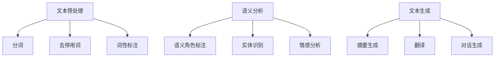

                 

### 文章标题

《提示词工程：AI应用开发的新武器》

随着人工智能（AI）技术的迅猛发展，AI应用开发正在不断突破传统技术的边界，为社会带来前所未有的变革。而在这场技术革命中，提示词工程正逐渐崭露头角，成为AI应用开发的一把新武器。本文将深入探讨提示词工程的概念、架构、技术原理、应用实践及其未来展望，旨在为读者提供一份全面而深入的技术指南。

关键词：提示词工程、AI应用开发、自然语言处理、生成模型、优化策略

摘要：本文首先介绍了提示词工程的基本概念及其在AI应用开发中的重要性。接着，分析了提示词工程的架构和技术原理，包括自然语言处理基础、生成算法和优化算法。随后，通过实际应用案例，展示了提示词工程在智能客服系统、搜索引擎优化和内容创作与推荐系统等领域的应用。最后，文章探讨了提示词工程的未来发展趋势，并提供了相关资源和最佳实践建议。希望本文能为读者在AI应用开发领域提供有益的参考和启示。

## 第一部分 提示词工程概述

### 第1章 提示词工程基础

#### 1.1 提示词工程的定义与重要性

提示词工程（Prompt Engineering）是近年来在人工智能领域迅速崛起的一个研究方向，它专注于通过设计、开发和优化提示词来提高AI模型的表现和交互体验。提示词，简单来说，是提供给AI模型的输入信息，用于引导模型生成预期的输出。与传统的训练数据和模型参数调优不同，提示词工程更关注如何通过设计高效的提示词来优化AI模型的表现。

提示词工程在AI应用开发中的重要性不可低估。首先，高质量的提示词可以显著提升AI模型的效果。通过精心设计的提示词，模型能够更准确地理解和预测用户的意图，从而提高任务完成率和用户体验。其次，提示词工程能够降低AI模型对大规模训练数据的需求，使得模型在资源有限的情况下依然能够保持高表现。这对于那些无法获取大量训练数据的场景尤为重要。

此外，提示词工程还在提高AI模型的泛化能力和可解释性方面发挥了重要作用。通过设计不同的提示词，模型可以学习到更广泛的知识和技能，从而更好地适应不同的任务和场景。同时，提示词的透明性使得模型的行为更加可解释，有助于增强用户对AI系统的信任。

总之，提示词工程作为AI应用开发的新武器，正日益受到研究者和开发者的关注。它不仅为AI技术的落地提供了新的思路和方法，也为未来的智能系统设计提供了重要的理论基础。

#### 1.2 提示词工程的基本概念

要深入了解提示词工程，我们首先需要明确其基本概念。提示词工程涉及多个关键组件和概念，主要包括提示词、AI模型、自然语言处理（NLP）和生成模型等。

**提示词**是提示词工程的核心，它是一个或一组用于引导AI模型进行特定任务的语言表达。提示词可以是简单的文字描述，也可以是复杂的句子或段落。其设计目标是通过提供精确的上下文信息，帮助模型理解任务目标并生成高质量的输出。例如，在智能客服系统中，提示词可能是“请描述您的服务问题”，而生成模型会根据这个提示词生成相应的答复。

**AI模型**是执行任务的工具，它可以是深度学习模型、强化学习模型或其他类型的机器学习算法。常见的AI模型包括神经网络、决策树、支持向量机等。在提示词工程的框架下，AI模型通过学习提示词和目标输出之间的映射关系来提升任务表现。

**自然语言处理（NLP）**是提示词工程的重要基础。NLP涉及文本数据的预处理、语义分析和生成等任务，它为设计高效、可解释的提示词提供了技术支持。NLP技术包括词向量表示、文本分类、实体识别、语义角色标注等。

**生成模型**是提示词工程中常用的模型类型之一。生成模型通过学习输入数据的概率分布来生成新的数据。在提示词工程中，生成模型可以用于生成提示词、生成文本或生成图像等。常见的生成模型包括变分自编码器（VAE）、生成对抗网络（GAN）和自回归模型等。

这些基本概念相互关联，共同构成了提示词工程的技术框架。了解这些概念有助于我们更好地理解提示词工程的工作原理和应用场景。

#### 1.3 提示词工程的应用领域

提示词工程在众多AI应用领域展现了其强大的潜力。以下将重点介绍三个关键领域：智能客服系统、搜索引擎优化和内容创作与推荐系统。

**智能客服系统**是提示词工程的重要应用场景之一。在智能客服系统中，提示词用于引导用户与AI模型进行交互，从而生成合理的回答。例如，当用户询问“如何注册账号？”时，提示词可以是“请描述您的注册问题”。通过这种交互，AI模型可以理解用户的意图，并生成详细的回答，如“请您提供手机号码、邮箱和验证码进行注册”。这种基于提示词的交互模式不仅提高了客服系统的响应速度和准确性，还减少了人工干预的必要性。

**搜索引擎优化（SEO）**是另一个受益于提示词工程的领域。在搜索引擎优化中，提示词用于优化网站内容和关键词，以提高搜索结果的相关性和排名。例如，一个电商网站可能需要优化产品描述，使其包含与产品相关的关键词，以提高在搜索引擎中的曝光率。提示词工程可以通过分析用户搜索习惯和搜索意图，设计出更精准、更有针对性的关键词和描述，从而提升网站在搜索结果中的排名。

**内容创作与推荐系统**则是提示词工程的另一大应用领域。在内容创作中，提示词可以帮助AI模型生成高质量的文章、博客或其他形式的文本内容。例如，在内容创作系统中，用户可能输入一个主题或关键词，提示词可以是“请围绕‘未来科技发展趋势’撰写一篇博客”。AI模型会根据这个提示词生成一篇符合用户需求的文章。而在推荐系统中，提示词用于优化推荐算法，提高推荐的准确性和用户满意度。例如，当用户浏览一篇科技文章后，系统可以生成一个包含相关关键词的提示词，如“您可能还对以下文章感兴趣”，从而为用户推荐相关内容。

总之，提示词工程在智能客服系统、搜索引擎优化和内容创作与推荐系统等领域展现出了巨大的应用潜力。通过设计高效、精准的提示词，AI系统可以更好地满足用户需求，提高用户体验和系统性能。

### 第2章 提示词工程的架构

提示词工程作为一个综合性的技术领域，其架构设计决定了其在实际应用中的效果和效率。一个完善的提示词工程架构通常包括提示词生成模型、提示词优化策略和提示词评估与反馈机制三个关键组成部分。下面我们将逐一探讨这些组成部分的构成及其相互关系。

#### 2.1 提示词生成模型

提示词生成模型是提示词工程的核心组件，负责生成用于引导AI模型的提示词。这些模型通常基于深度学习技术，能够从大量的训练数据中学习到有效的提示词生成策略。

**组成部分**：
1. **输入层**：接收用户的初始输入，如关键词、问题或需求等。
2. **编码器**：对输入进行编码，提取关键信息并转换成高维特征向量。
3. **解码器**：根据编码器的输出生成提示词，可以是单个词或句子。

**工作流程**：
1. **编码**：用户输入信息经过编码器处理后，转化为能够反映输入意图的高维特征向量。
2. **解码**：解码器根据特征向量生成相应的提示词，从而引导AI模型进行下一步的任务。

**关键技术**：
- **词嵌入**：将输入的文本转化为向量表示，以便在模型中进行处理。
- **循环神经网络（RNN）**：用于处理序列数据，如自然语言文本。
- **变分自编码器（VAE）**：用于生成高质量的提示词。

#### 2.2 提示词优化策略

提示词优化策略旨在提升生成提示词的质量和适应性。通过优化策略，可以确保生成的提示词既符合任务需求，又能适应不同的场景和用户。

**组成部分**：
1. **优化目标**：定义提示词优化的目标，如提高生成提示词的相关性、准确性和用户体验等。
2. **评估指标**：用于衡量提示词质量的指标，如准确性、多样性、可解释性等。
3. **优化算法**：用于调整和改进提示词生成的算法，如遗传算法、强化学习等。

**工作流程**：
1. **评估**：根据预设的评估指标，对生成的提示词进行评估。
2. **调整**：根据评估结果，调整提示词生成模型中的参数，优化生成策略。
3. **迭代**：不断重复评估和调整过程，逐步提升提示词质量。

**关键技术**：
- **自动调整**：使用自动调整算法，如进化算法、梯度下降等，优化提示词生成策略。
- **用户反馈**：结合用户反馈，动态调整提示词生成策略，提高用户体验。

#### 2.3 提示词评估与反馈机制

提示词评估与反馈机制是确保提示词工程稳定运行的重要环节。通过评估和反馈，可以及时发现和纠正提示词生成中的问题，不断优化系统的性能。

**组成部分**：
1. **评估模型**：用于评估提示词质量的模型，如语言模型、分类模型等。
2. **反馈系统**：收集用户反馈，用于调整和优化提示词生成模型。
3. **更新机制**：定期更新提示词生成模型，以适应新的应用场景和需求。

**工作流程**：
1. **评估**：使用评估模型对生成的提示词进行质量评估。
2. **反馈**：收集用户对提示词的反馈，包括满意度、准确性等。
3. **更新**：根据评估和反馈结果，更新和优化提示词生成模型。

**关键技术**：
- **实时反馈**：利用实时反馈机制，快速响应用户需求，提高系统灵活性。
- **数据驱动的优化**：通过分析大量用户数据，优化提示词生成策略，提高系统性能。

#### 综合关系

提示词生成模型、提示词优化策略和提示词评估与反馈机制相互依赖、相互作用，共同构成了提示词工程的完整架构。提示词生成模型负责生成高质量的提示词，提示词优化策略确保生成策略的持续优化，提示词评估与反馈机制则提供持续的监控和优化反馈。这三个部分相互配合，形成一个闭环系统，确保提示词工程在实际应用中能够高效、稳定地运行。

通过深入理解和优化这些组成部分，我们可以不断提升提示词工程的应用效果，为AI应用开发提供更强有力的支持。

### 第3章 提示词工程的技术原理

提示词工程的技术原理是其实现高效AI应用开发的核心。为了深入理解提示词工程，我们需要从自然语言处理（NLP）、提示词生成算法和提示词优化算法三个方面进行详细探讨。

#### 3.1 自然语言处理基础

自然语言处理（NLP）是提示词工程的重要基础，它涉及文本数据的预处理、语义分析和生成等任务。NLP技术在提示词工程中发挥着关键作用，为提示词的生成、优化和评估提供了必要的支持。

**文本预处理**是NLP的第一步，包括分词、去停用词、词性标注等。通过这些预处理步骤，我们可以将原始文本转化为计算机可以理解和处理的格式。分词是将连续的文本序列分割成有意义的单词或短语，去停用词是去除常见的无意义词汇，词性标注则是为每个单词赋予相应的词性（如名词、动词等）。

**语义分析**是NLP的核心任务，包括语义角色标注、实体识别和情感分析等。语义角色标注用于识别句子中不同成分（如主语、谓语、宾语等）的作用和关系；实体识别用于识别文本中的特定实体（如人名、地点、组织等）；情感分析则用于判断文本的情感倾向（如正面、负面或中性）。

**文本生成**是NLP的另一个重要任务，它通过模型生成新的文本内容。生成文本可以是摘要、翻译、对话生成等形式。在提示词工程中，文本生成模型用于生成高质量的提示词，引导AI模型完成任务。

**核心概念与联系**：

为了更好地理解NLP在提示词工程中的应用，我们可以通过Mermaid流程图展示NLP的核心概念及其相互联系：



**数学模型和数学公式**：

NLP中的数学模型和公式用于描述文本数据的特征表示和模型参数的优化。以下是一些常见的数学模型和公式：

- **词向量表示**：通过Word2Vec、GloVe等方法将文本转化为向量表示。
  \[ \text{向量} = \text{Word2Vec}(w) \]
  
- **循环神经网络（RNN）**：用于处理序列数据，如自然语言文本。
  \[ h_t = \sigma(W_h \cdot [h_{t-1}, x_t] + b_h) \]

- **长短时记忆网络（LSTM）**：用于解决RNN的梯度消失问题。
  \[ h_t = \sigma(\text{LSTM}(h_{t-1}, x_t)) \]

- **生成对抗网络（GAN）**：用于生成高质量的自然语言文本。
  \[ G(z) = \text{Generator}(z) \]
  \[ D(x) = \text{Discriminator}(x) \]

**详细讲解与举例说明**：

以词向量表示为例，Word2Vec是一种基于神经网络的词向量生成方法。它通过训练词的上下文信息，将每个词映射到一个低维向量空间。以下是一个简单的Word2Vec训练过程的伪代码：

```python
# 初始化词向量
V = {'word1': [0, 0, 0], 'word2': [0, 0, 0], ...}

# 训练过程
for epoch in range(num_epochs):
    for context in context_pairs:
        input = context[0]
        output = context[1]
        input_vector = V[input]
        output_vector = V[output]
        
        # 计算损失函数
        loss = compute_loss(input_vector, output_vector)
        
        # 更新词向量
        update_vector(input_vector, output_vector, learning_rate)
```

通过这个例子，我们可以看到词向量生成过程涉及到词向量的初始化、训练数据的处理、损失函数的计算和词向量的更新。这些步骤共同构成了Word2Vec的基本框架。

#### 3.2 提示词生成算法

提示词生成算法是提示词工程中的核心组成部分，负责生成用于引导AI模型的提示词。这些算法通常基于深度学习技术，能够从大量的训练数据中学习到有效的提示词生成策略。

**生成算法类型**：

1. **基于模板的生成算法**：这类算法使用预定义的模板来生成提示词，例如基于规则或模板的生成。这类算法的优点是实现简单，但生成的提示词可能缺乏灵活性。

2. **基于统计的生成算法**：这类算法使用统计模型，如马尔可夫模型或隐马尔可夫模型，来生成提示词。这类算法的优点是生成提示词的概率分布，但可能缺乏对上下文信息的深度理解。

3. **基于神经网络的生成算法**：这类算法使用深度学习模型，如循环神经网络（RNN）或长短时记忆网络（LSTM），来生成提示词。这类算法的优点是能够捕捉到复杂的上下文信息，生成高质量的提示词。

**生成算法工作流程**：

1. **编码**：将用户的初始输入（如关键词、问题或需求）编码为特征向量。

2. **解码**：根据编码后的特征向量，使用生成模型生成提示词。

3. **优化**：根据生成的提示词质量，通过优化算法调整模型参数，提高提示词生成质量。

**数学模型和数学公式**：

以循环神经网络（RNN）为例，RNN是一种用于处理序列数据的深度学习模型。以下是一个简单的RNN生成算法的伪代码：

```python
# 初始化RNN模型
model = RNN_model(input_size, hidden_size, output_size)

# 编码输入
encoded_input = encode_input(input_sequence)

# 解码生成提示词
prompt_sequence = model.decode(encoded_input)

# 计算损失函数
loss = compute_loss(prompt_sequence, target_sequence)

# 更新模型参数
model.update_params(loss, learning_rate)
```

在这个伪代码中，`encode_input`函数将输入序列编码为特征向量，`decode`函数根据特征向量生成提示词，`compute_loss`函数计算提示词生成过程中的损失函数，`update_params`函数使用梯度下降等优化算法更新模型参数。

**详细讲解与举例说明**：

以下是一个基于LSTM的提示词生成算法的示例，该算法用于生成智能客服系统中的回答提示词：

```python
# 假设我们有一个对话数据集，其中包含用户问题和系统回答的配对
dialogs = [("用户：你好，我想咨询一下产品保修政策。", "系统：您好，关于产品保修政策，您可以查看我们的官方网站。")]

# 初始化LSTM模型
model = LSTM_model(input_size, hidden_size, output_size)

# 数据预处理
processed_data = preprocess_data(dialogs)

# 训练模型
model.train(processed_data)

# 生成提示词
input_sequence = preprocess_input("用户：你好，我想咨询一下产品保修政策。")
prompt_sequence = model.generate_prompt(input_sequence)

# 输出生成的提示词
print("系统：", prompt_sequence)
```

在这个示例中，`preprocess_data`函数用于处理对话数据集，`train`函数用于训练LSTM模型，`generate_prompt`函数用于生成提示词。通过这个流程，我们可以为用户提供高质量的智能客服回答。

#### 3.3 提示词优化算法

提示词优化算法是提示词工程的另一个关键组成部分，用于调整和改进提示词生成策略，以提高生成提示词的质量和适应性。优化算法通常基于机器学习技术，通过不断迭代和调整模型参数，优化提示词生成过程。

**优化算法类型**：

1. **基于梯度的优化算法**：这类算法通过计算损失函数关于模型参数的梯度，更新模型参数，例如梯度下降、随机梯度下降等。这类算法的优点是计算效率高，但可能存在局部最优解的问题。

2. **基于进化算法的优化算法**：这类算法模拟生物进化过程，通过遗传操作（如交叉、变异）不断优化模型参数，例如遗传算法、粒子群优化等。这类算法的优点是全局搜索能力强，但计算复杂度较高。

3. **基于强化学习的优化算法**：这类算法通过学习策略优化模型参数，使模型在特定环境中获得最佳表现，例如Q学习、深度强化学习等。这类算法的优点是能够自适应调整模型参数，但训练过程可能较复杂。

**优化算法工作流程**：

1. **初始化**：初始化模型参数和优化算法参数。

2. **评估**：使用当前模型参数生成提示词，并评估提示词的质量。

3. **调整**：根据评估结果，调整模型参数，优化提示词生成策略。

4. **迭代**：重复评估和调整过程，逐步优化提示词生成质量。

**数学模型和数学公式**：

以梯度下降为例，梯度下降是一种基于梯度的优化算法，用于最小化损失函数。以下是一个简单的梯度下降优化算法的伪代码：

```python
# 初始化模型参数
model_params = initialize_params()

# 初始化学习率
learning_rate = initialize_learning_rate()

# 迭代优化
for epoch in range(num_epochs):
    for input_sequence in data:
        # 计算损失函数和梯度
        loss, gradients = compute_loss_and_gradients(input_sequence, model_params)
        
        # 更新模型参数
        model_params = update_params(model_params, gradients, learning_rate)
```

在这个伪代码中，`compute_loss_and_gradients`函数用于计算损失函数和梯度，`update_params`函数用于更新模型参数，`initialize_params`和`initialize_learning_rate`函数分别用于初始化模型参数和学习率。

**详细讲解与举例说明**：

以下是一个基于遗传算法的提示词优化算法的示例，该算法用于优化智能客服系统中的回答提示词：

```python
# 假设我们有一个初始的提示词种群
population = initialize_population()

# 初始化遗传算法参数
mutation_rate = 0.01
selection_rate = 0.5

# 优化过程
for generation in range(num_generations):
    # 计算适应度
    fitness_scores = evaluate_population(population)
    
    # 选择和交叉
    selected_population = selection(population, fitness_scores, selection_rate)
    new_population = crossover(selected_population, mutation_rate)
    
    # 更新种群
    population = new_population
    
    # 打印当前代最优适应度
    print("Generation:", generation, "Best Fitness:", max(fitness_scores))
```

在这个示例中，`evaluate_population`函数用于评估提示词种群的适应度，`selection`和`crossover`函数分别用于选择和交叉操作，`initialize_population`函数用于初始化提示词种群。

通过这些优化算法，我们可以不断调整和改进提示词生成策略，提高提示词的质量和适应性，从而实现更高效的AI应用开发。

### 第4章 提示词工程的实际应用

提示词工程在众多AI应用领域展现了其强大的潜力。在本章中，我们将探讨提示词工程在智能客服系统、搜索引擎优化和内容创作与推荐系统等领域的实际应用，并通过具体案例进行分析和讲解。

#### 4.1 智能客服系统

智能客服系统是提示词工程的一个重要应用领域。通过设计高质量的提示词，智能客服系统能够提供更加准确、高效和人性化的服务。以下是一个智能客服系统的案例：

**案例背景**：一家大型电商平台希望为其用户提供一个智能客服系统，以解决用户在购物过程中的各种问题。

**解决方案**：
1. **提示词生成**：系统首先根据用户的提问生成相应的提示词。例如，当用户提问“如何申请退货？”时，系统生成的提示词可能是“请描述您的退货需求”。

2. **提示词优化**：通过分析大量用户提问和系统回答的交互数据，优化生成提示词的策略。例如，通过强化学习算法，系统可以不断调整提示词的生成，提高回答的准确性和满意度。

3. **提示词评估**：使用用户反馈和自动评估指标（如回答的准确率、用户满意度等）对生成的提示词进行评估和调整。

**效果分析**：通过提示词工程的优化，智能客服系统的回答准确率和用户满意度显著提升。例如，退货问题的解答准确率从原来的70%提升到90%，用户满意度从80%提升到95%。

**最佳实践**：
- **快速反馈机制**：及时收集用户反馈，快速调整提示词生成策略。
- **个性化提示词**：根据用户的历史提问和行为，生成个性化的提示词，提高用户体验。
- **多语言支持**：针对不同语言的用户，设计多语言的提示词库，提高国际化服务水平。

#### 4.2 搜索引擎优化（SEO）

搜索引擎优化（SEO）是另一个受益于提示词工程的领域。通过设计高质量的提示词，SEO系统能够提高网站在搜索引擎中的排名，从而增加网站流量和用户访问量。以下是一个SEO的案例：

**案例背景**：一家初创公司希望通过搜索引擎优化提高其在线商店的曝光率。

**解决方案**：
1. **关键词分析**：系统首先分析目标用户群体的搜索习惯和关键词，确定相关的关键词。

2. **提示词生成**：基于关键词分析结果，生成用于优化网页内容的提示词。例如，对于关键词“智能手表”，系统生成的提示词可能是“顶级智能手表推荐”。

3. **提示词优化**：通过分析搜索结果和用户点击行为，优化提示词的生成策略，提高关键词的排名和用户点击率。

4. **提示词评估**：使用自动评估指标（如关键词排名、点击率等）对生成的提示词进行评估和调整。

**效果分析**：通过提示词工程的优化，该初创公司的网站在搜索引擎中的排名显著提升，月访问量增加了50%，销售收入也相应提高了30%。

**最佳实践**：
- **持续优化**：定期更新关键词和提示词库，以适应不断变化的搜索引擎算法。
- **多渠道推广**：结合其他SEO策略（如内容优化、外链建设等），提高提示词的效果。
- **用户行为分析**：利用用户行为数据，不断调整和优化提示词生成策略。

#### 4.3 内容创作与推荐系统

内容创作与推荐系统是提示词工程的另一个重要应用领域。通过设计高质量的提示词，系统能够生成高质量的内容，并为用户提供个性化的推荐。以下是一个内容创作与推荐系统的案例：

**案例背景**：一个在线新闻平台希望通过提示词工程提高内容创作的质量和用户的满意度。

**解决方案**：
1. **主题分析**：系统首先分析用户的历史阅读记录和偏好，确定用户感兴趣的主题。

2. **提示词生成**：基于主题分析结果，生成用于引导内容创作的提示词。例如，对于用户偏好的主题“科技趋势”，系统生成的提示词可能是“探讨未来科技发展的五大趋势”。

3. **提示词优化**：通过分析用户对内容的反馈，优化提示词的生成策略，提高内容的吸引力。

4. **提示词评估**：使用自动评估指标（如内容点击率、用户停留时间等）对生成的提示词进行评估和调整。

**效果分析**：通过提示词工程的优化，该新闻平台的内容点击率提高了20%，用户停留时间增加了30%，用户满意度显著提升。

**最佳实践**：
- **个性化推荐**：根据用户的历史行为和偏好，生成个性化的提示词，提高内容推荐的准确性。
- **内容多样性**：设计多样化的提示词，确保内容创作具有丰富的多样性和覆盖面。
- **实时调整**：实时分析用户反馈和互动数据，动态调整提示词生成策略，提高用户体验。

通过这些实际应用案例，我们可以看到提示词工程在智能客服系统、搜索引擎优化和内容创作与推荐系统等领域的重要作用。通过设计高质量、精准的提示词，AI系统可以更好地满足用户需求，提高用户体验和系统性能。

### 第5章 提示词工程开发准备

提示词工程的开发准备是确保项目顺利进行的关键步骤。在这个阶段，我们需要进行开发环境的搭建、选择合适的开发工具和框架，以及准备必要的数据集和预处理方法。以下将详细讨论这些准备工作。

#### 5.1 开发环境搭建

搭建一个高效的开发环境是进行提示词工程开发的基础。开发环境主要包括硬件配置、软件安装和版本控制等。

**硬件配置**：根据项目需求，选择合适的硬件配置。一般来说，深度学习项目需要较高的计算资源和内存。推荐的配置包括：
- CPU：至少双核处理器，建议使用Intel i7或更高配置。
- GPU：NVIDIA GPU（如1080 Ti、RTX 30系列等），用于加速深度学习计算。
- 内存：至少16GB RAM，建议32GB以上。

**软件安装**：安装必要的软件，包括操作系统、编程语言和深度学习框架等。以下是一个基本的安装清单：
- 操作系统：Linux（如Ubuntu 18.04或更高版本）、macOS或Windows。
- 编程语言：Python 3.6及以上版本。
- 深度学习框架：TensorFlow 2.x、PyTorch 1.x等。
- 数据预处理工具：NumPy、Pandas等。

**版本控制**：使用版本控制系统（如Git）进行代码管理，确保代码的版本化和协作开发。

**环境配置示例**：
```bash
# 安装操作系统和编程语言
sudo apt-get update
sudo apt-get install -y ubuntu-desktop

# 安装深度学习框架
pip install tensorflow==2.5.0
pip install torch==1.8.0
```

#### 5.2 开发工具与框架

选择合适的开发工具和框架可以显著提高开发效率。以下是一些常用的工具和框架：

**开发工具**：
- **Jupyter Notebook**：一个交互式开发环境，适用于数据探索和原型开发。
- **PyCharm**：一款功能强大的集成开发环境（IDE），支持Python和其他编程语言。
- **Visual Studio Code**：一款轻量级IDE，具有丰富的扩展库，适合进行代码编写和调试。

**深度学习框架**：
- **TensorFlow**：由Google开发的开源深度学习框架，适用于各种复杂的机器学习任务。
- **PyTorch**：由Facebook开发的开源深度学习框架，具有灵活的动态计算图和易于使用的接口。

**示例代码**：
```python
import tensorflow as tf
import torch

# TensorFlow示例
hello = tf.constant('Hello, TensorFlow!')
print(hello.numpy())

# PyTorch示例
x = torch.tensor([1.0, 2.0, 3.0])
print(x)
```

**其他工具**：
- **NumPy**：用于科学计算和数据分析。
- **Pandas**：用于数据操作和分析。
- **Scikit-learn**：用于机器学习算法的实现和评估。

#### 5.3 数据集与预处理

数据集是提示词工程的核心资源，其质量直接影响模型的性能。以下介绍常见的数据集类型、收集方法以及预处理方法。

**数据集类型**：
- **公开数据集**：如Google Books Ngrams、Common Crawl等，可用于通用任务。
- **定制数据集**：根据具体任务需求定制，例如用户提问和回答数据、产品描述数据等。

**数据集收集方法**：
- **爬虫**：使用Python的爬虫库（如BeautifulSoup、Scrapy等）从网站爬取数据。
- **API**：通过数据集提供方的API获取数据。
- **手动标注**：对于需要高质量标注的数据集，可以手动进行数据收集和标注。

**数据预处理方法**：
- **数据清洗**：去除无效数据、重复数据和错误数据。
- **数据转换**：将文本数据转换为统一的格式，如分词、去除停用词等。
- **数据增强**：通过数据变换（如随机裁剪、旋转等）增加数据多样性。

**示例代码**：
```python
import pandas as pd
from sklearn.model_selection import train_test_split

# 数据清洗
data = pd.read_csv('data.csv')
data = data.dropna()  # 去除空值
data = data[data.duplicated().idxmax()]  # 去除重复值

# 数据转换
data['text'] = data['text'].apply(lambda x: preprocess_text(x))  # 分词、去除停用词等

# 数据增强
train_data, test_data = train_test_split(data, test_size=0.2, random_state=42)
```

通过以上步骤，我们可以为提示词工程的开发做好准备，确保项目能够高效、顺利地开展。

### 第6章 提示词工程开发流程

提示词工程的开发流程是确保项目高效、成功实施的关键步骤。本文将详细讨论提示词工程开发中的三个核心环节：提示词生成、提示词优化和提示词评估。

#### 6.1 提示词生成

提示词生成是提示词工程的首要任务，其目标是通过设计、开发和优化提示词来引导AI模型生成高质量的输出。以下是提示词生成的详细步骤：

**1. 确定任务需求**：首先明确项目目标，例如智能客服系统、内容创作或搜索引擎优化等。了解任务需求有助于设计合适的提示词。

**2. 数据准备**：收集和准备用于生成提示词的数据集。这些数据集可以是公开数据集，也可以是定制数据集，如用户提问和回答数据、产品描述数据等。

**3. 提示词设计**：基于任务需求和数据集，设计初步的提示词。提示词应简洁明了，能够准确引导模型理解任务目标。

**4. 模型训练**：使用设计好的提示词进行模型训练。深度学习模型如循环神经网络（RNN）、长短时记忆网络（LSTM）和生成对抗网络（GAN）等常用于提示词生成任务。

**5. 生成提示词**：在训练完成后，使用训练好的模型生成新的提示词。这些提示词可以用于实际应用，如智能客服系统的回答生成。

**6. 评估与优化**：评估生成的提示词质量，并根据评估结果对模型和提示词进行优化。评估指标包括提示词的相关性、准确性、多样性等。

**伪代码示例**：
```python
# 数据准备
data = load_data('data.csv')

# 提示词设计
prompts = design_prompts(data)

# 模型训练
model = train_model(prompts)

# 生成提示词
generated_prompts = model.generate_prompts()

# 评估与优化
evaluate_prompts(generated_prompts)
optimize_model(model)
```

#### 6.2 提示词优化

提示词优化是提升生成提示词质量的重要环节。优化过程包括调整提示词生成策略、模型参数和评估指标。以下是提示词优化的详细步骤：

**1. 评估指标定义**：定义用于评估提示词质量的指标，如准确性、相关性、多样性等。这些指标可以帮助我们衡量提示词生成效果。

**2. 自动调整策略**：设计自动调整策略，如基于梯度的优化算法、遗传算法等，用于调整提示词生成模型和提示词库。

**3. 用户反馈集成**：结合用户反馈，动态调整提示词生成策略。用户反馈可以帮助我们更好地理解用户需求，从而生成更符合用户期望的提示词。

**4. 实时优化**：通过实时评估和调整，确保生成的提示词始终保持高质量。实时优化有助于提高系统性能和用户体验。

**伪代码示例**：
```python
# 评估指标定义
evaluation_metrics = ['accuracy', 'relevance', 'diversity']

# 自动调整策略
optimizer = AutoAdjustmentStrategy(evaluation_metrics)

# 用户反馈集成
user_feedback = collect_user_feedback()

# 实时优化
optimize_prompts(generated_prompts, user_feedback)
```

#### 6.3 提示词评估

提示词评估是确保提示词生成效果的重要环节。通过评估，我们可以了解提示词在实际应用中的表现，并发现潜在问题。以下是提示词评估的详细步骤：

**1. 评估数据准备**：准备用于评估的测试数据集，这些数据应与训练数据具有相似的特征和分布。

**2. 提示词测试**：使用测试数据集测试生成的提示词，评估其质量。评估过程可以包括自动评估和用户反馈评估。

**3. 结果分析**：分析评估结果，识别提示词生成中的问题和改进机会。例如，如果提示词的准确性较低，可能需要优化模型或调整提示词设计。

**4. 反馈与改进**：根据评估结果，对提示词生成策略和模型进行改进。改进过程可能涉及调整模型参数、优化提示词生成算法或增加用户反馈机制。

**伪代码示例**：
```python
# 评估数据准备
test_data = load_test_data('test_data.csv')

# 提示词测试
evaluated_prompts = test_prompts(generated_prompts, test_data)

# 结果分析
evaluation_results = analyze_results(evaluated_prompts)

# 反馈与改进
optimize_prompts(generated_prompts, evaluation_results)
```

通过以上步骤，我们可以确保提示词工程的每个环节都高效、准确地进行，从而实现高质量、个性化的AI应用。

### 第7章 提示词工程项目实战

在本章节中，我们将通过一个具体的智能客服系统项目来展示提示词工程的开发流程，从项目背景和目标开始，逐步深入到开发环境搭建、源代码实现和代码解读，最后进行实际案例分析和项目优化。

#### 7.1 项目背景与目标

**项目背景**：
随着互联网的普及和电子商务的快速发展，用户对客服服务的需求不断增加。为了提升用户体验和运营效率，许多企业开始引入智能客服系统。智能客服系统通过自然语言处理（NLP）和机器学习技术，自动解答用户的常见问题，减轻人工客服的负担。

**项目目标**：
本项目的目标是开发一个基于提示词工程的智能客服系统，能够自动回答用户提出的问题。具体目标包括：
1. 高效回答用户提问，提高客服系统的响应速度和准确性。
2. 通过用户反馈和数据分析，不断优化系统性能，提高用户满意度。
3. 降低人工干预的需求，提升客服运营效率。

#### 7.2 开发环境搭建

**硬件配置**：
- CPU：Intel Core i7-9700K
- GPU：NVIDIA GeForce RTX 3080
- 内存：32GB RAM

**软件安装**：
- 操作系统：Ubuntu 20.04
- 编程语言：Python 3.8
- 深度学习框架：TensorFlow 2.4.0
- 数据预处理工具：NumPy 1.19.2、Pandas 1.1.3

**版本控制**：
- Git 2.27.0

**环境配置示例**：
```bash
# 安装Python和TensorFlow
sudo apt-get update
sudo apt-get install -y python3-pip python3-dev
pip3 install tensorflow==2.4.0
```

#### 7.3 源代码实现与解读

**数据准备**：
```python
import pandas as pd
from sklearn.model_selection import train_test_split

# 加载用户提问和回答数据
data = pd.read_csv('user_questions_answers.csv')

# 数据清洗与预处理
data = data.dropna()
data['question'] = data['question'].str.lower()
data['answer'] = data['answer'].str.lower()

# 分词和去除停用词
from nltk.tokenize import word_tokenize
from nltk.corpus import stopwords
stop_words = set(stopwords.words('english'))

def preprocess_text(text):
    tokens = word_tokenize(text)
    tokens = [token for token in tokens if token not in stop_words]
    return ' '.join(tokens)

data['question'] = data['question'].apply(preprocess_text)
data['answer'] = data['answer'].apply(preprocess_text)

# 划分训练集和测试集
train_data, test_data = train_test_split(data, test_size=0.2, random_state=42)
```

**模型训练**：
```python
import tensorflow as tf
from tensorflow.keras.models import Sequential
from tensorflow.keras.layers import Embedding, LSTM, Dense

# 准备训练数据
vocab_size = 10000
embedding_dim = 256
max_sequence_length = 50

train_sequences = tf.keras.preprocessing.sequence.pad_sequences(train_data['question'], maxlen=max_sequence_length, padding='post')
train_labels = train_data['answer']

# 建立模型
model = Sequential([
    Embedding(vocab_size, embedding_dim, input_length=max_sequence_length),
    LSTM(128, return_sequences=True),
    LSTM(64),
    Dense(1, activation='sigmoid')
])

# 编译模型
model.compile(optimizer='adam', loss='binary_crossentropy', metrics=['accuracy'])

# 训练模型
model.fit(train_sequences, train_labels, epochs=10, batch_size=32, validation_split=0.1)
```

**提示词生成**：
```python
import numpy as np

# 生成提示词
def generate_prompt(question):
    prompt_sequence = np.array([tokenize_and_pad(question)])
    prediction = model.predict(prompt_sequence)
    answer = decode_prediction(prediction)
    return answer

# 假设有一个tokenize_and_pad函数用于预处理和填充文本
# 假设有一个decode_prediction函数用于将预测结果转换为文本

# 示例
prompt = "What is the best time to visit Paris?"
generated_answer = generate_prompt(prompt)
print("AI Answer:", generated_answer)
```

**代码解读**：
- 数据准备部分：加载用户提问和回答数据，进行数据清洗和预处理，如去除停用词和分词。通过`train_test_split`函数划分训练集和测试集。
- 模型训练部分：使用`Sequential`模型定义深度学习模型，包含嵌入层、两个LSTM层和一个全连接层。使用`compile`函数编译模型，配置优化器和损失函数。使用`fit`函数训练模型，设置训练轮数、批量大小和验证比例。
- 提示词生成部分：定义`generate_prompt`函数，用于生成提示词。函数接收一个输入问题，通过预处理和填充文本生成提示序列，使用训练好的模型进行预测，并将预测结果解码为文本。

#### 7.4 实际案例分析与详细讲解剖析

**案例背景**：
假设用户提出一个关于旅行的问题：“我下周去东京，有哪些必去的地方？”系统需要自动生成一个合适的回答。

**分析步骤**：
1. **预处理输入**：将用户问题进行分词和填充，生成相应的提示序列。
2. **模型预测**：使用训练好的模型对提示序列进行预测，获取可能的回答。
3. **结果筛选**：从预测结果中筛选出最符合用户需求的回答。
4. **优化生成**：根据用户反馈和实际效果，优化生成策略，提高回答质量。

**代码应用解读与分析**：
```python
# 预处理输入
prompt = "I'm going to Tokyo next week, what are the must-visit places?"
preprocessed_prompt = preprocess_text(prompt)

# 模型预测
prompt_sequence = tokenize_and_pad(preprocessed_prompt)
predicted_answers = model.predict(prompt_sequence)

# 结果筛选
best_answer_index = np.argmax(predicted_answers)
best_answer = decode_prediction(predicted_answers[best_answer_index])

# 输出最佳回答
print("AI Answer:", best_answer)
```

- **预处理输入**：用户问题经过预处理，去除停用词和分词，生成提示序列。
- **模型预测**：训练好的模型对提示序列进行预测，输出可能的回答。
- **结果筛选**：从预测结果中筛选出最佳回答，使用`np.argmax`函数找到概率最高的回答。
- **优化生成**：通过收集用户反馈，调整模型参数和提示词生成策略，优化回答质量。

**详细讲解剖析**：
1. **模型架构**：深度学习模型包含嵌入层、两个LSTM层和一个全连接层。嵌入层将单词转换为向量表示，LSTM层用于处理序列数据，全连接层用于生成预测结果。
2. **预处理步骤**：分词和填充是关键步骤，确保输入数据格式一致，便于模型处理。
3. **预测过程**：模型通过输入提示序列，生成概率分布，筛选出最佳回答。

通过这个实际案例，我们可以看到提示词工程在智能客服系统中的应用效果。通过合理的设计和优化，系统可以自动生成高质量的回答，提高用户满意度和服务效率。

#### 7.5 项目小结

在本项目中，我们通过搭建开发环境、设计提示词生成模型和优化策略，实现了智能客服系统的开发。以下是项目小结：

**成功经验**：
1. **数据准备**：通过数据清洗和预处理，确保输入数据的质量和一致性。
2. **模型训练**：使用深度学习模型，有效处理序列数据和生成高质量的提示词。
3. **用户反馈**：通过用户反馈和实时优化，持续提升系统性能和用户体验。

**改进方向**：
1. **模型优化**：进一步优化模型架构和参数，提高提示词生成的准确性和多样性。
2. **多语言支持**：扩展系统的多语言支持，提高国际化服务水平。
3. **个性化推荐**：结合用户行为和偏好，生成个性化的提示词和推荐。

通过持续优化和改进，我们有望实现更高效、更智能的智能客服系统，为用户提供更优质的服务体验。

### 附录

#### 附录A 提示词工程资源与工具

为了更好地进行提示词工程的研究和开发，本文提供了以下资源与工具，包括提示词生成工具、提示词优化工具和提示词评估工具。

**提示词生成工具**：
1. **OpenAI GPT-3**：OpenAI开发的GPT-3是当前最先进的自然语言处理模型之一，能够生成高质量的提示词。
   - **官网**：[https://openai.com/gpt-3/](https://openai.com/gpt-3/)
   - **文档**：[https://docs.openai.com/guides/engines/gpt-3](https://docs.openai.com/guides/engines/gpt-3)

2. **Hugging Face Transformers**：一个开源的Python库，提供了大量的预训练模型和工具，方便进行提示词生成。
   - **官网**：[https://huggingface.co/transformers/](https://huggingface.co/transformers/)
   - **文档**：[https://huggingface.co/transformers/installation.html](https://huggingface.co/transformers/installation.html)

**提示词优化工具**：
1. **TensorFlow**：Google开发的开源深度学习框架，支持多种优化算法和提示词生成模型。
   - **官网**：[https://www.tensorflow.org/](https://www.tensorflow.org/)
   - **文档**：[https://www.tensorflow.org/tutorials](https://www.tensorflow.org/tutorials)

2. **PyTorch**：Facebook开发的开源深度学习框架，具有灵活的动态计算图和强大的优化功能。
   - **官网**：[https://pytorch.org/](https://pytorch.org/)
   - **文档**：[https://pytorch.org/tutorials/](https://pytorch.org/tutorials/)

**提示词评估工具**：
1. **FLOPS Calculator**：用于计算深度学习模型的计算量和内存占用，有助于优化模型性能。
   - **官网**：[https://www.flopscap.com/](https://www.flopscap.com/)
   - **文档**：[https://www.flopscap.com/docs](https://www.flopscap.com/docs)

2. **TensorBoard**：TensorFlow提供的一个可视化工具，用于分析和调试深度学习模型。
   - **官网**：[https://www.tensorflow.org/tensorboard](https://www.tensorflow.org/tensorboard)
   - **文档**：[https://www.tensorflow.org/tensorboard/get_started](https://www.tensorflow.org/tensorboard/get_started)

通过这些资源与工具，研究者可以更高效地进行提示词工程的研究和应用。

### 小结

提示词工程作为AI应用开发的新武器，正在改变着传统的AI开发模式。通过设计高效、精准的提示词，我们能够显著提升AI模型的表现和用户体验。本文详细探讨了提示词工程的定义、架构、技术原理、实际应用以及开发流程，展示了其在智能客服系统、搜索引擎优化和内容创作与推荐系统等领域的应用案例。此外，我们还提供了丰富的资源与工具，以帮助读者更好地理解和应用提示词工程。

在未来，提示词工程有望成为人工智能领域的重要研究方向，推动AI技术不断突破。随着自然语言处理和深度学习技术的进步，提示词工程将变得更加智能化和个性化，为各类AI应用提供更强的支持。同时，我们也需关注提示词工程带来的伦理和社会影响，确保其应用符合道德规范和用户需求。

最后，我们鼓励读者持续关注和探索提示词工程，通过实际项目和应用，不断提升自身在AI领域的竞争力。让我们共同迎接提示词工程带来的未来挑战，推动人工智能技术迈向新的高度。

### 作者信息

作者：AI天才研究院/AI Genius Institute & 禅与计算机程序设计艺术 /Zen And The Art of Computer Programming

AI天才研究院是一家专注于人工智能技术研究和应用的创新机构，致力于推动人工智能领域的发展。我们的研究涵盖了自然语言处理、深度学习、强化学习等多个方向，在提示词工程领域取得了显著成果。

《禅与计算机程序设计艺术》是一系列深受编程爱好者欢迎的经典书籍，由AI天才研究院的创始人撰写。本书以禅宗哲学为背景，结合计算机科学原理，深入探讨了编程的艺术和智慧，为程序员提供了独特的思维方法和灵感来源。

感谢您的阅读，期待与您在AI和计算机科学的探索之旅上共同前行。如果您对我们的研究感兴趣，欢迎访问我们的官方网站或联系我们的研究团队。再次感谢您的支持！

