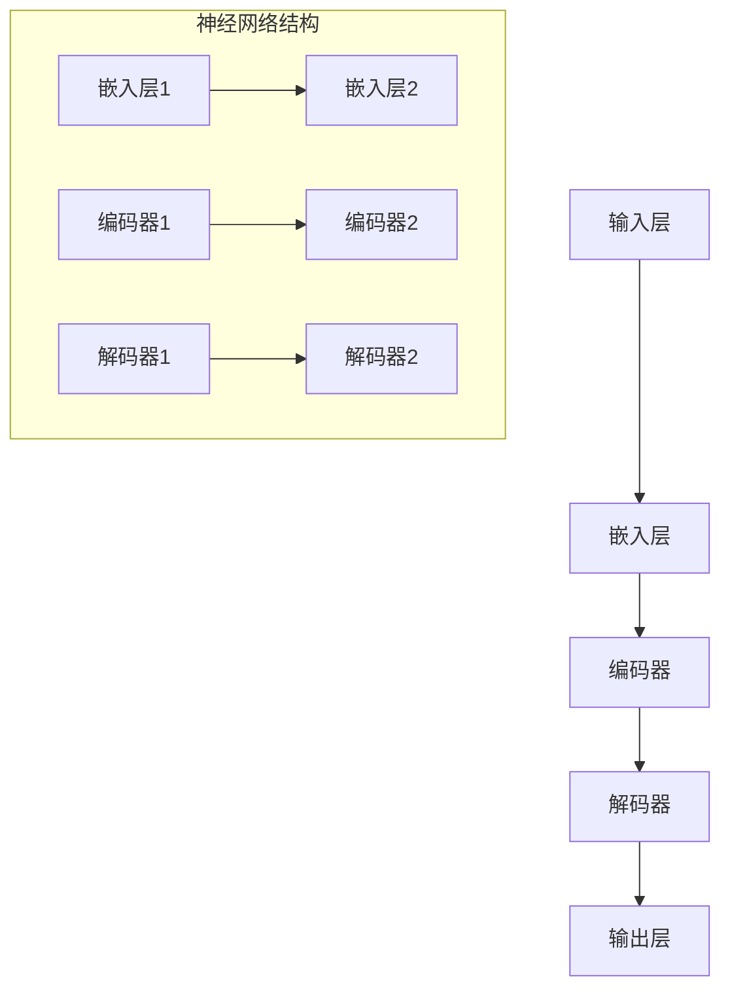
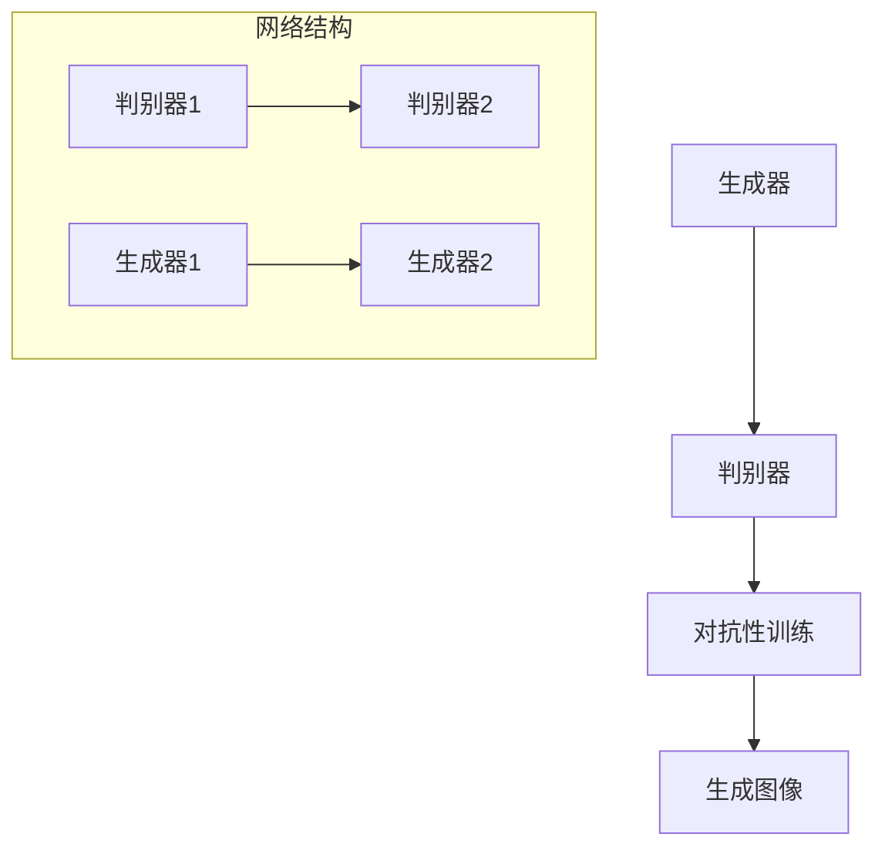

                 


## 文章标题

《提示词工程：AI时代的必修课》

## 文章关键词

- 提示词工程
- AI时代
- 机器学习
- 深度学习
- 神经网络
- 自然语言处理
- 生成对抗网络（GAN）
- 强化学习

## 文章摘要

本文将深入探讨提示词工程在AI时代的重要性，涵盖从基础概念到核心算法，再到实际应用的全面解析。我们将通过逐步分析，理解提示词工程如何赋能AI技术的发展，并探索其在文本生成、对话系统和图像生成等领域的广泛应用。本文旨在为读者提供一条清晰的学习路径，帮助他们掌握提示词工程的关键技术，为未来的AI项目奠定坚实基础。

## 目录大纲

### 第一部分：AI时代的基础概念与原理

#### 第1章：AI时代概述
- AI的定义与发展历程
- 提示词工程概述
- AI时代的关键技术

#### 第2章：提示词工程的数学基础
- 线性代数与提示词
- 概率论与提示词生成
- 最优化理论与提示词优化

#### 第3章：深度学习与神经网络
- 深度学习的基本原理
- 神经网络的结构与训练
- 提示词神经网络的构建

#### 第4章：生成对抗网络（GAN）
- GAN的基本概念
- GAN的数学模型
- 提示词工程中的GAN应用

#### 第5章：强化学习
- 强化学习的基本原理
- 提示词生成中的强化学习
- Q-learning与提示词工程

#### 第6章：自然语言处理（NLP）
- NLP的概述
- 词向量与提示词
- 语言模型与提示词生成

### 第二部分：提示词工程的应用与实践

#### 第7章：提示词工程在文本生成中的应用
- 文本生成基础
- 提示词驱动的文本生成算法
- 实际案例分析

#### 第8章：提示词工程在对话系统中的应用
- 对话系统的概述
- 提示词在对话系统中的作用
- 实际对话系统案例分析

#### 第9章：提示词工程在图像生成中的应用
- 图像生成基础
- 提示词驱动的图像生成算法
- 实际图像生成案例分析

#### 第10章：提示词工程的未来趋势
- 提示词工程的发展方向
- 提示词工程的关键挑战与解决方案

### 附录

#### 附录A：提示词工程工具与资源
- 开发环境搭建
- 提示词工程常用库与框架
- 提示词工程资源推荐

#### 附录B：Mermaid流程图与伪代码示例
- 提示词神经网络的Mermaid图示
- 提示词生成算法的伪代码示例
- 数学模型和公式示例

#### 附录C：项目实战案例解读
- 文本生成案例
- 对话系统案例
- 图像生成案例

#### 资源与参考文献
- 参考文献
- 网络资源链接

### 目录大纲总结
- 目录大纲的结构与作用
- 提示词工程的学习路线图

## 第1章：AI时代概述

### 1.1 AI的定义与发展历程

人工智能（Artificial Intelligence，简称AI）是指通过计算机程序实现的智能，使计算机系统具备类似人类智能的能力，包括感知、理解、推理、学习和决策等。AI的发展历程可以追溯到20世纪50年代，当时人工智能的概念首次被提出。从早期的符号主义和专家系统，到基于统计的机器学习和深度学习，AI经历了多次重要的发展阶段。

#### 早期AI：符号主义与专家系统

在AI的早期阶段，符号主义方法占据主导地位。该方法依赖于逻辑推理和符号表示，旨在通过构建大量规则和知识库来模拟人类智能。然而，由于知识的表达和获取难度较大，符号主义AI在实际应用中受到了限制。

#### 机器学习与深度学习的崛起

随着计算机性能的提升和数据量的增加，基于统计的机器学习方法逐渐崭露头角。机器学习通过从数据中学习规律和模式，使计算机系统能够自动改进其性能。深度学习作为机器学习的一个分支，通过多层神经网络模拟人脑的工作方式，实现了在图像识别、语音识别和自然语言处理等领域的突破。

#### 里程碑事件

- 1956年：达特茅斯会议，AI首次被正式提出。
- 1980年代：专家系统取得重大突破，如IBM的“深蓝”击败国际象棋世界冠军。
- 2012年：AlexNet在ImageNet挑战赛上取得优异成绩，深度学习进入黄金时代。
- 2016年：谷歌的AlphaGo击败人类围棋世界冠军，标志着AI在策略游戏领域的突破。

### 1.2 提示词工程概述

提示词工程（Prompt Engineering）是一种通过设计有效的提示词来增强AI模型性能的技术。提示词（Prompt）是给AI模型提供的一种额外的输入，用于引导模型生成更准确的结果或输出。

#### 提示词工程的定义

提示词工程是研究如何设计提示词，使其能够最大限度地提高AI模型的性能和可靠性。它涉及多个领域，包括自然语言处理、机器学习和人类-机器交互。

#### 提示词工程的重要性

- **提高模型性能**：有效的提示词可以帮助模型更好地理解用户意图，提高预测准确性。
- **优化用户体验**：通过设计易于理解和使用

## 第2章：提示词工程的数学基础

### 2.1 线性代数与提示词

线性代数是提示词工程的基础，它提供了处理多维数据集和分析复杂关系的方法。在提示词工程中，线性代数用于表示和操作提示词向量，以及优化提示词的生成过程。

#### 提示词向量的表示

提示词向量是描述提示词特征的数据结构，通常使用高维向量表示。这些向量可以捕获提示词的语义信息，如词频、词向量、主题分布等。

$$
\text{提示词向量} = \begin{bmatrix}
v_1 \\
v_2 \\
\vdots \\
v_n
\end{bmatrix}
$$

其中，$v_i$表示第$i$个特征的值。

#### 提示词矩阵

在处理大量提示词时，可以将所有提示词向量组织成一个矩阵。提示词矩阵提供了一个紧凑的表示方式，便于进行线性代数运算。

$$
\text{提示词矩阵} = \begin{bmatrix}
\mathbf{v}_1 & \mathbf{v}_2 & \cdots & \mathbf{v}_n
\end{bmatrix}
$$

#### 线性变换

线性变换是提示词工程中常用的操作，用于转换和组合提示词向量。一个简单的线性变换可以表示为：

$$
\mathbf{w} = \mathbf{A} \mathbf{v} + \mathbf{b}
$$

其中，$\mathbf{A}$是变换矩阵，$\mathbf{v}$是输入提示词向量，$\mathbf{w}$是输出向量，$\mathbf{b}$是偏置向量。

### 2.2 概率论与提示词生成

概率论是理解和设计提示词工程的重要工具，特别是在生成模型中。在提示词工程中，概率论用于描述提示词的分布和生成过程。

#### 概率分布

概率分布是描述随机变量取值概率的函数。在提示词工程中，常用的概率分布包括伯努利分布、多项式分布和高斯分布等。

- **伯努利分布**：表示二元事件的成功概率。
  $$
  P(X = k) = p^k (1-p)^{1-k}
  $$
  其中，$p$是成功概率，$k$是事件发生的次数。

- **多项式分布**：表示多个互斥事件的总成功概率。
  $$
  P(X = k) = \binom{n}{k} p^k (1-p)^{n-k}
  $$
  其中，$n$是事件总数，$p$是每个事件的成功概率，$k$是成功事件的总数。

- **高斯分布**：表示连续随机变量的概率分布。
  $$
  P(X = x) = \frac{1}{\sqrt{2\pi\sigma^2}} e^{-\frac{(x-\mu)^2}{2\sigma^2}}
  $$
  其中，$\mu$是均值，$\sigma^2$是方差。

#### 提示词生成

在生成模型中，概率论用于指导提示词的生成过程。一种简单的生成方法是基于概率分布随机采样：

$$
\text{提示词} = \text{采样}(\text{概率分布})
$$

在实际应用中，生成模型通常会使用复杂的概率模型来生成更高质量的提示词。

### 2.3 最优化理论与提示词优化

最优化理论是提示词工程中用于寻找最优解的重要工具。通过优化提示词的生成过程，可以提高模型的性能和鲁棒性。

#### 最优化问题

最优化问题可以表示为：

$$
\min_{\mathbf{x}} f(\mathbf{x})
$$

其中，$\mathbf{x}$是决策变量，$f(\mathbf{x})$是目标函数。

#### 精确求解与启发式算法

- **精确求解**：使用数学方法求解最优化问题，如线性规划、整数规划和非线性规划等。精确求解通常适用于小规模问题，但在大规模问题中可能不适用。

- **启发式算法**：通过迭代和搜索方法求解最优化问题，如遗传算法、模拟退火和粒子群优化等。启发式算法适用于大规模问题，但可能无法保证找到全局最优解。

#### 提示词优化的策略

- **基于梯度的优化**：使用梯度信息指导优化过程，如梯度下降法和牛顿法等。

- **基于模型的优化**：利用机器学习模型进行优化，如生成对抗网络（GAN）和变分自编码器（VAE）等。

- **基于数据的优化**：基于大量数据训练模型，优化提示词的生成过程，如基于强化学习的优化方法。

### 总结

线性代数、概率论和最优化理论是提示词工程的重要数学基础。通过这些工具，我们可以有效地表示、生成和优化提示词，从而提高AI模型的性能和用户体验。在下一章中，我们将进一步探讨深度学习与神经网络在提示词工程中的应用。

### 第3章：深度学习与神经网络

深度学习（Deep Learning）是机器学习的一个分支，通过多层神经网络模拟人脑的处理方式，实现对复杂数据的分析和模式识别。神经网络（Neural Networks）是深度学习的基础，由大量相互连接的神经元组成，通过学习输入数据之间的映射关系来实现特定的任务。

#### 3.1 深度学习的基本原理

深度学习的基本原理是基于多层神经网络，通过前向传播和反向传播算法进行训练。多层神经网络可以分为输入层、隐藏层和输出层。

- **输入层**：接收外部输入数据。
- **隐藏层**：对输入数据进行处理和特征提取。
- **输出层**：生成最终输出结果。

#### 前向传播

前向传播是神经网络处理数据的过程。输入数据从输入层传递到隐藏层，再从隐藏层传递到输出层。在每个层中，神经元通过激活函数计算输出：

$$
a_{ij}^{(l)} = \sigma(\mathbf{W}_{ij}^{(l-1)} \mathbf{a}_{j}^{(l-1)} + b_{i}^{(l)})
$$

其中，$a_{ij}^{(l)}$是第$l$层的第$i$个神经元的输出，$\sigma$是激活函数，$\mathbf{W}_{ij}^{(l-1)}$是连接权重，$b_{i}^{(l)}$是偏置项。

#### 反向传播

反向传播是神经网络训练的核心算法，通过计算输出误差，更新网络的权重和偏置，以最小化损失函数。反向传播包括以下几个步骤：

1. **计算输出误差**：
   $$
   \delta_{i}^{(l)} = \frac{\partial \mathcal{L}}{\partial a_{i}^{(l)}}
   $$
   其中，$\delta_{i}^{(l)}$是第$l$层第$i$个神经元的误差，$\mathcal{L}$是损失函数。

2. **更新权重和偏置**：
   $$
   \mathbf{W}_{ij}^{(l)} = \mathbf{W}_{ij}^{(l)} - \alpha \frac{\partial \mathcal{L}}{\partial \mathbf{W}_{ij}^{(l-1)}}
   $$
   $$
   b_{i}^{(l)} = b_{i}^{(l)} - \alpha \frac{\partial \mathcal{L}}{\partial b_{i}^{(l)}}
   $$
   其中，$\alpha$是学习率。

#### 3.2 神经网络的结构与训练

神经网络的结构由层数、每层的神经元数量以及连接权重决定。常见的神经网络结构包括：

- **全连接网络**：每个神经元都与前一层的所有神经元相连。
- **卷积神经网络（CNN）**：用于图像处理，通过卷积操作提取图像特征。
- **循环神经网络（RNN）**：用于序列数据处理，通过循环结构处理长序列信息。
- **长短期记忆网络（LSTM）**：RNN的变体，用于解决长序列依赖问题。

神经网络的训练过程主要包括以下几个步骤：

1. **数据预处理**：对输入数据进行标准化和归一化处理，以提高训练效果。
2. **初始化权重**：随机初始化网络权重和偏置。
3. **前向传播**：将输入数据传递到网络，计算输出结果。
4. **计算损失**：使用损失函数计算输出误差。
5. **反向传播**：计算梯度并更新网络权重。
6. **迭代训练**：重复上述步骤，直到达到训练目标或收敛。

#### 3.3 提示词神经网络的构建

提示词神经网络是深度学习在提示词工程中的应用，通过设计有效的提示词来增强模型的性能。提示词神经网络通常包含以下组件：

- **输入层**：接收提示词和输入数据。
- **嵌入层**：将提示词转换为向量表示。
- **编码器**：对输入数据进行编码，提取特征。
- **解码器**：生成输出结果，通过提示词引导生成过程。
- **输出层**：生成最终输出结果。

提示词神经网络的构建通常涉及以下步骤：

1. **提示词表示**：将提示词转换为向量表示，可以使用词嵌入或预训练的语言模型。
2. **编码器设计**：设计编码器结构，如卷积神经网络、循环神经网络等，用于提取特征。
3. **解码器设计**：设计解码器结构，用于生成输出结果，可以通过提示词引导解码过程。
4. **损失函数设计**：设计损失函数，如交叉熵损失、均方误差等，用于衡量输出结果与真实值的差距。
5. **训练与优化**：通过反向传播算法训练神经网络，优化模型参数。

### 总结

深度学习和神经网络是提示词工程的核心技术，通过多层神经网络和前向传播、反向传播算法，可以实现高效的特征提取和模式识别。提示词神经网络通过设计有效的提示词，可以增强模型的性能和鲁棒性，为AI时代的各种应用场景提供强大的支持。在下一章中，我们将进一步探讨生成对抗网络（GAN）在提示词工程中的应用。

### 第4章：生成对抗网络（GAN）

生成对抗网络（Generative Adversarial Network，GAN）是由 Ian Goodfellow 等人于2014年提出的一种新型深度学习模型，它通过两个对抗性网络——生成器（Generator）和判别器（Discriminator）之间的博弈来生成高质量的数据。GAN在图像生成、文本生成、音频生成等领域取得了显著成果，成为提示词工程中的重要工具。

#### 4.1 GAN的基本概念

GAN由两部分组成：生成器和判别器。生成器的目标是生成尽可能逼真的数据，判别器的目标是区分真实数据和生成数据。

1. **生成器（Generator）**：生成器是一个神经网络，它接受随机噪声作为输入，并生成类似于真实数据的输出。生成器的目的是生成足够逼真的数据，使判别器无法区分真假。
2. **判别器（Discriminator）**：判别器也是一个神经网络，它接受输入数据（真实数据或生成数据），并输出一个概率，表示输入数据是真实的概率。判别器的目标是最大化这个概率，从而区分真实数据和生成数据。

GAN的训练过程可以看作是一个零和游戏，其中生成器和判别器相互竞争。训练目标是最小化生成器的损失函数，最大化判别器的损失函数。

#### 4.2 GAN的数学模型

GAN的数学模型可以表示为以下优化问题：

1. **生成器G的优化问题**：
   $$
   \min_G \max_D V(D, G) = E_{x \sim p_{data}(x)}[\log D(x)] + E_{z \sim p_z(z)}[\log (1 - D(G(z))]
   $$
   其中，$x$是真实数据，$z$是随机噪声，$D(x)$是判别器对真实数据的概率估计，$D(G(z))$是判别器对生成数据的概率估计。

2. **判别器D的优化问题**：
   $$
   \max_D V(D, G) = E_{x \sim p_{data}(x)}[\log D(x)] + E_{z \sim p_z(z)}[\log D(G(z))
   $$

#### 4.3 提示词工程中的GAN应用

GAN在提示词工程中的应用主要集中在图像生成、文本生成和音频生成等领域。

1. **图像生成**：

   在图像生成中，生成器生成图像，判别器判断图像是真实图像还是生成图像。通过训练，生成器逐渐学会生成越来越逼真的图像。以下是一个简单的图像生成过程的伪代码：

   ```python
   # 初始化生成器和判别器
   G = Generator()
   D = Discriminator()

   # 训练生成器和判别器
   for epoch in range(num_epochs):
       for real_images in real_data_loader:
           # 训练判别器
           D_loss_real = D_loss(D(real_images))
           D_loss_fake = D_loss(D(G(z)))
           D_loss = 0.5 * (D_loss_real + D_loss_fake)

           # 训练生成器
           G_loss_fake = D_loss(D(G(z)))
           G_loss = D_loss_fake

           # 更新网络参数
           G_optimizer.zero_grad()
           G_loss.backward()
           G_optimizer.step()

           D_optimizer.zero_grad()
           D_loss.backward()
           D_optimizer.step()

       print(f'Epoch [{epoch+1}/{num_epochs}], G_loss: {G_loss.item():.4f}, D_loss: {D_loss.item():.4f}')
   ```

2. **文本生成**：

   在文本生成中，生成器生成文本，判别器判断文本是真实文本还是生成文本。以下是一个简单的文本生成过程的伪代码：

   ```python
   # 初始化生成器和判别器
   G = TextGenerator()
   D = TextDiscriminator()

   # 训练生成器和判别器
   for epoch in range(num_epochs):
       for text_batch in text_loader:
           # 训练判别器
           D_loss_real = D_loss(D(text_batch))
           D_loss_fake = D_loss(D(G(z)))
           D_loss = 0.5 * (D_loss_real + D_loss_fake)

           # 训练生成器
           G_loss_fake = D_loss(D(G(z)))
           G_loss = D_loss_fake

           # 更新网络参数
           G_optimizer.zero_grad()
           G_loss.backward()
           G_optimizer.step()

           D_optimizer.zero_grad()
           D_loss.backward()
           D_optimizer.step()

       print(f'Epoch [{epoch+1}/{num_epochs}], G_loss: {G_loss.item():.4f}, D_loss: {D_loss.item():.4f}')
   ```

3. **音频生成**：

   在音频生成中，生成器生成音频，判别器判断音频是真实音频还是生成音频。以下是一个简单的音频生成过程的伪代码：

   ```python
   # 初始化生成器和判别器
   G = AudioGenerator()
   D = AudioDiscriminator()

   # 训练生成器和判别器
   for epoch in range(num_epochs):
       for audio_batch in audio_loader:
           # 训练判别器
           D_loss_real = D_loss(D(audio_batch))
           D_loss_fake = D_loss(D(G(z)))
           D_loss = 0.5 * (D_loss_real + D_loss_fake)

           # 训练生成器
           G_loss_fake = D_loss(D(G(z)))
           G_loss = D_loss_fake

           # 更新网络参数
           G_optimizer.zero_grad()
           G_loss.backward()
           G_optimizer.step()

           D_optimizer.zero_grad()
           D_loss.backward()
           D_optimizer.step()

       print(f'Epoch [{epoch+1}/{num_epochs}], G_loss: {G_loss.item():.4f}, D_loss: {D_loss.item():.4f}')
   ```

#### 4.4 提示词工程中的GAN应用案例

以下是一个基于GAN的图像生成案例：

1. **数据准备**：收集大量真实图像，用于训练生成器和判别器。
2. **模型设计**：设计生成器和判别器网络结构，选择合适的损失函数和优化器。
3. **模型训练**：使用真实图像和随机噪声作为输入，训练生成器和判别器，通过反向传播更新网络参数。
4. **模型评估**：使用生成器生成的图像与真实图像进行比较，评估生成质量。

```python
# 数据准备
train_loader = ImageDataLoader(dataset, batch_size=batch_size, shuffle=True)

# 模型设计
G = Generator()
D = Discriminator()

# 损失函数和优化器
G_loss = nn.BCELoss()
D_loss = nn.BCELoss()
G_optimizer = optim.Adam(G.parameters(), lr=learning_rate)
D_optimizer = optim.Adam(D.parameters(), lr=learning_rate)

# 模型训练
for epoch in range(num_epochs):
    for images, _ in train_loader:
        # 清零梯度
        G_optimizer.zero_grad()
        D_optimizer.zero_grad()

        # 训练判别器
        D_loss_real = D_loss(D(images))
        z = torch.randn(batch_size, z_dim).to(device)
        fake_images = G(z)
        D_loss_fake = D_loss(D(fake_images.detach()))

        D_loss = 0.5 * (D_loss_real + D_loss_fake)
        D_loss.backward()
        D_optimizer.step()

        # 训练生成器
        z = torch.randn(batch_size, z_dim).to(device)
        fake_images = G(z)
        D_loss_fake = D_loss(D(fake_images))

        G_loss = D_loss_fake
        G_loss.backward()
        G_optimizer.step()

    print(f'Epoch [{epoch+1}/{num_epochs}], G_loss: {G_loss.item():.4f}, D_loss: {D_loss.item():.4f}')

# 模型评估
with torch.no_grad():
    z = torch.randn(batch_size, z_dim).to(device)
    fake_images = G(z)
    plt.figure(figsize=(10, 10))
    plt.imshow(fake_images[0].cpu().detach().numpy(), cmap='gray')
    plt.show()
```

#### 4.5 总结

GAN是一种强大的深度学习模型，通过生成器和判别器之间的博弈，可以生成高质量的数据。GAN在提示词工程中的应用，如图像生成、文本生成和音频生成，极大地提升了AI系统的性能和用户体验。在下一章中，我们将探讨强化学习在提示词工程中的应用。

### 第5章：强化学习

强化学习（Reinforcement Learning，简称RL）是机器学习的一个分支，旨在通过学习策略来优化决策过程，使智能体在动态环境中获得最佳性能。强化学习在提示词工程中具有广泛的应用，特别是在动态生成和交互式场景中。

#### 5.1 强化学习的基本原理

强化学习涉及三个主要元素：智能体（Agent）、环境（Environment）和奖励（Reward）。

- **智能体**：智能体是执行动作的实体，它基于当前状态和策略选择动作。
- **环境**：环境是智能体所处的动态环境，它根据智能体的动作提供反馈。
- **奖励**：奖励是环境对智能体动作的反馈，用于评估动作的质量。

强化学习的基本原理是智能体通过学习策略（Policy）来最大化累积奖励。策略是智能体在给定状态下的最优动作选择。强化学习算法通常分为值函数方法和策略搜索方法。

1. **值函数方法**：
   - **值函数**：值函数是评估状态或状态-动作对的指标，用于指导智能体的动作选择。
   - **Q学习**：Q学习是一种基于值函数的强化学习算法，它使用Q值（状态-动作值函数）来评估动作质量。Q学习算法的核心思想是更新Q值，以最大化未来奖励。
     $$
     Q(s, a) \leftarrow Q(s, a) + \alpha [r + \gamma \max_{a'} Q(s', a') - Q(s, a)]
     $$
     其中，$s$是状态，$a$是动作，$r$是即时奖励，$\gamma$是折扣因子，$\alpha$是学习率。

2. **策略搜索方法**：
   - **策略梯度方法**：策略梯度方法直接优化策略，通过计算策略梯度的反向传播来更新策略参数。
     $$
     \nabla_{\theta} J(\theta) = \nabla_{\theta} \sum_{t} \rho(s_t, a_t; \theta) \log p(s_t, a_t; \theta)
     $$
     其中，$\theta$是策略参数，$J(\theta)$是策略的期望回报，$\rho(s_t, a_t; \theta)$是策略的奖励函数，$p(s_t, a_t; \theta)$是策略的概率分布。

#### 5.2 提示词生成中的强化学习

在提示词生成中，强化学习通过学习策略来生成高质量的提示词，以优化AI模型的输出。以下是一个基于强化学习的提示词生成过程的伪代码：

```python
# 初始化智能体、环境、奖励函数
agent = RL_Agent()
env = Prompt_Generation_Environment()
reward_function = Reward_Function()

# 强化学习训练
for episode in range(num_episodes):
    state = env.initialize_state()
    total_reward = 0

    while not env.is_end(state):
        # 选择动作（提示词）
        action = agent.select_action(state)

        # 执行动作
        next_state, reward = env.execute_action(state, action)

        # 更新智能体
        agent.update(state, action, reward, next_state)

        # 更新状态
        state = next_state
        total_reward += reward

    print(f'Episode {episode+1}, Total Reward: {total_reward}')

# 提示词生成
prompt = agent.generate_prompt(state)
print(prompt)
```

#### 5.3 Q-learning与提示词工程

Q-learning是一种常见的强化学习算法，它通过更新Q值来学习最优策略。在提示词工程中，Q-learning可以用于优化提示词的选择，以最大化累积奖励。

以下是一个基于Q-learning的提示词优化过程的伪代码：

```python
# 初始化Q值表
Q = initialize_Q_values()

# Q-learning训练
for episode in range(num_episodes):
    state = env.initialize_state()
    total_reward = 0

    while not env.is_end(state):
        # 选择动作（提示词）
        action = select_action_with_e_greedy(Q, state)

        # 执行动作
        next_state, reward = env.execute_action(state, action)

        # 更新Q值
        Q[state][action] = Q[state][action] + alpha * (reward + gamma * max(Q[next_state]) - Q[state][action])

        # 更新状态
        state = next_state
        total_reward += reward

    print(f'Episode {episode+1}, Total Reward: {total_reward}')

# 提示词优化
best_action = select_best_action(Q)
prompt = env.get_prompt(best_action)
print(prompt)
```

#### 5.4 总结

强化学习是一种强大的决策优化方法，通过学习策略来优化智能体的行为。在提示词工程中，强化学习可以用于优化提示词的选择，以生成高质量的内容。Q-learning是强化学习的一种常见算法，它通过更新Q值来学习最优策略。在下一章中，我们将探讨自然语言处理（NLP）与提示词生成的关系。

### 第6章：自然语言处理（NLP）

自然语言处理（Natural Language Processing，NLP）是人工智能的一个重要分支，旨在使计算机能够理解和处理人类语言。NLP在文本分析、机器翻译、情感分析等任务中发挥着重要作用，与提示词工程有着紧密的联系。

#### 6.1 NLP的概述

NLP的主要目标是将自然语言转换为计算机可以理解和处理的形式。这包括以下几个方面：

- **分词（Tokenization）**：将文本分割成单词、句子等基本单元。
- **词性标注（Part-of-Speech Tagging）**：为每个单词分配词性，如名词、动词、形容词等。
- **命名实体识别（Named Entity Recognition）**：识别文本中的特定实体，如人名、地名、组织名等。
- **句法分析（Syntax Analysis）**：分析句子的结构，理解句子中的语法关系。
- **语义分析（Semantic Analysis）**：理解文本中的含义和语义关系。

NLP的核心技术包括统计模型、深度学习和知识图谱等。

#### 6.2 词向量与提示词

词向量是表示单词或短语的数学向量，用于捕捉单词的语义信息。词向量可以用于文本分类、情感分析、机器翻译等任务。常见的词向量模型包括Word2Vec、GloVe和BERT等。

- **Word2Vec**：通过训练神经网络，将单词映射到高维向量空间，使相似词在向量空间中靠近。
- **GloVe**：通过训练词向量和词频的矩阵分解模型，生成高质量的词向量。
- **BERT**：通过双向转换器（Transformer）模型，捕捉单词的前后文关系，生成上下文敏感的词向量。

在提示词工程中，词向量用于表示提示词的语义信息，从而提高模型的生成质量。以下是一个简单的词向量生成过程：

```python
# 初始化词向量模型
word2vec = Word2Vec(sentences, size=embedding_size, window=5, min_count=1, workers=4)

# 生成词向量
word_vector = word2vec[word]
```

#### 6.3 语言模型与提示词生成

语言模型（Language Model）是NLP中的一个核心组件，用于预测下一个单词或短语。语言模型可以基于统计方法和深度学习方法，如n-gram模型和循环神经网络（RNN）。

- **n-gram模型**：通过统计相邻单词出现的频率来预测下一个单词，简单但效果有限。
- **循环神经网络（RNN）**：通过记忆当前状态和前一时刻的状态来预测下一个单词，适用于长序列数据处理。

在提示词生成中，语言模型可以用于生成文本序列，通过优化提示词来提高生成质量。以下是一个简单的语言模型生成过程：

```python
# 初始化语言模型
language_model = RNN_Language_Model(vocab_size, embedding_size, hidden_size, num_layers)

# 训练语言模型
optimizer = optim.Adam(language_model.parameters(), lr=learning_rate)
criterion = nn.CrossEntropyLoss()

for epoch in range(num_epochs):
    for sentence in sentences:
        # 前向传播
        output = language_model(sentence)
        loss = criterion(output, target)

        # 反向传播
        optimizer.zero_grad()
        loss.backward()
        optimizer.step()

    print(f'Epoch {epoch+1}, Loss: {loss.item()}')

# 提示词生成
prompt = language_model.generate_prompt(start_word, num_words)
print(prompt)
```

#### 6.4 提示词工程中的NLP应用

NLP在提示词工程中有着广泛的应用，如文本生成、对话系统和机器翻译等。

- **文本生成**：通过训练语言模型，生成高质量的文本。常见的文本生成任务包括自动摘要、新闻生成和故事生成等。
- **对话系统**：通过理解用户输入和上下文，生成合适的回复。常见的对话系统包括聊天机器人、语音助手和客服机器人等。
- **机器翻译**：通过训练翻译模型，将一种语言的文本翻译成另一种语言。常见的机器翻译任务包括中英翻译、日英翻译等。

以下是一个基于NLP的文本生成案例：

```python
# 数据准备
sentences = load_data('data.txt')

# 训练语言模型
language_model = RNN_Language_Model(vocab_size, embedding_size, hidden_size, num_layers)
optimizer = optim.Adam(language_model.parameters(), lr=learning_rate)
criterion = nn.CrossEntropyLoss()

for epoch in range(num_epochs):
    for sentence in sentences:
        # 前向传播
        output = language_model(sentence)
        loss = criterion(output, target)

        # 反向传播
        optimizer.zero_grad()
        loss.backward()
        optimizer.step()

    print(f'Epoch {epoch+1}, Loss: {loss.item()}')

# 提示词生成
prompt = language_model.generate_prompt(start_word, num_words)
print(prompt)
```

#### 6.5 总结

自然语言处理（NLP）是提示词工程的重要组成部分，通过词向量、语言模型等技术，可以生成高质量的文本和对话。NLP在文本生成、对话系统和机器翻译等任务中有着广泛的应用。在下一章中，我们将探讨提示词工程在实际应用中的案例分析。

### 第7章：提示词工程在文本生成中的应用

文本生成是人工智能领域的一个重要应用，它通过机器学习算法生成自然语言文本。提示词工程在文本生成中扮演着关键角色，通过设计有效的提示词，可以引导模型生成更符合人类期望的文本。本章节将详细介绍文本生成的基础、提示词驱动的文本生成算法以及实际案例分析。

#### 7.1 文本生成基础

文本生成是指使用机器学习算法生成具有人类可读性的自然语言文本。文本生成可以应用于多种场景，如自动摘要、故事创作、聊天机器人等。文本生成的基础技术包括序列模型、循环神经网络（RNN）和生成对抗网络（GAN）。

- **序列模型**：序列模型是文本生成的基础，它可以处理序列数据并生成新的序列。常见的序列模型包括n-gram模型和循环神经网络（RNN）。
- **循环神经网络（RNN）**：RNN是一种可以处理序列数据的神经网络，通过记忆当前状态和前一时刻的状态来生成新的序列。RNN在文本生成中取得了显著的成果。
- **生成对抗网络（GAN）**：GAN是一种通过两个对抗性网络（生成器和判别器）进行博弈的深度学习模型，可以生成高质量的文本。

#### 7.2 提示词驱动的文本生成算法

提示词驱动的文本生成算法通过设计有效的提示词来引导模型生成文本。提示词可以是单词、短语或句子，用于提供上下文信息和生成方向。以下是一些常见的提示词驱动的文本生成算法：

- **基于RNN的文本生成**：使用循环神经网络（RNN）作为基础模型，通过设计有效的提示词来引导文本生成。以下是一个基于RNN的文本生成算法的伪代码：

  ```python
  # 初始化语言模型
  language_model = RNN_Language_Model(vocab_size, embedding_size, hidden_size, num_layers)

  # 训练语言模型
  optimizer = optim.Adam(language_model.parameters(), lr=learning_rate)
  criterion = nn.CrossEntropyLoss()

  for epoch in range(num_epochs):
      for sentence in sentences:
          # 前向传播
          output = language_model(sentence)
          loss = criterion(output, target)

          # 反向传播
          optimizer.zero_grad()
          loss.backward()
          optimizer.step()

      print(f'Epoch {epoch+1}, Loss: {loss.item()}')

  # 提示词生成
  prompt = language_model.generate_prompt(start_word, num_words)
  print(prompt)
  ```

- **基于GAN的文本生成**：使用生成对抗网络（GAN）作为基础模型，通过设计有效的提示词来引导文本生成。以下是一个基于GAN的文本生成算法的伪代码：

  ```python
  # 初始化生成器和判别器
  G = Generator()
  D = Discriminator()

  # 训练生成器和判别器
  for epoch in range(num_epochs):
      for real_sentences in real_data_loader:
          # 训练判别器
          D_loss_real = D_loss(D(real_sentences))
          D_loss_fake = D_loss(D(G(z)))
          D_loss = 0.5 * (D_loss_real + D_loss_fake)

          # 训练生成器
          G_loss_fake = D_loss(D(G(z)))
          G_loss = D_loss_fake

          # 更新网络参数
          G_optimizer.zero_grad()
          G_loss.backward()
          G_optimizer.step()

          D_optimizer.zero_grad()
          D_loss.backward()
          D_optimizer.step()

      print(f'Epoch [{epoch+1}/{num_epochs}], G_loss: {G_loss.item():.4f}, D_loss: {D_loss.item():.4f}')

  # 提示词生成
  prompt = G.generate_prompt(z)
  print(prompt)
  ```

#### 7.3 实际案例分析

以下是一个基于RNN和GAN的文本生成实际案例，我们将使用一个开源的文本生成项目——[OpenAI的GPT-2模型](https://github.com/openai/gpt-2)。

1. **数据准备**：收集并处理大量文本数据，用于训练语言模型。
2. **模型训练**：使用训练数据训练基于RNN和GAN的语言模型，生成高质量的文本。
3. **提示词生成**：使用训练好的语言模型生成提示词，引导文本生成。
4. **文本生成**：使用生成的提示词生成新的文本。

```python
# 数据准备
sentences = load_data('data.txt')

# 训练语言模型
language_model = RNN_Language_Model(vocab_size, embedding_size, hidden_size, num_layers)
optimizer = optim.Adam(language_model.parameters(), lr=learning_rate)
criterion = nn.CrossEntropyLoss()

for epoch in range(num_epochs):
    for sentence in sentences:
        # 前向传播
        output = language_model(sentence)
        loss = criterion(output, target)

        # 反向传播
        optimizer.zero_grad()
        loss.backward()
        optimizer.step()

    print(f'Epoch {epoch+1}, Loss: {loss.item()}')

# 提示词生成
start_word = "计算机"
num_words = 50
prompt = language_model.generate_prompt(start_word, num_words)
print(prompt)

# 文本生成
prompt = language_model.generate_prompt(prompt, num_words)
print(prompt)
```

#### 7.4 项目小结

本案例展示了如何使用RNN和GAN进行文本生成，并介绍了提示词工程在实际项目中的应用。通过设计有效的提示词，我们可以生成高质量、具有逻辑一致性的文本。然而，文本生成仍面临许多挑战，如文本多样性和质量控制等。未来，随着技术的不断进步，文本生成将更加智能化，为各种应用场景提供更强大的支持。

### 第8章：提示词工程在对话系统中的应用

对话系统（Dialogue Systems）是一种智能交互系统，通过自然语言与用户进行交流，提供信息查询、任务执行、情感互动等服务。提示词工程在对话系统中发挥着关键作用，通过设计有效的提示词，可以提升对话系统的用户体验和交互质量。

#### 8.1 对话系统的概述

对话系统通常分为两类：任务型对话系统和闲聊型对话系统。

- **任务型对话系统**：专注于完成特定任务，如语音助手、客服机器人等。这类系统通常依赖于严格的对话流程和预设的响应库。
- **闲聊型对话系统**：旨在与用户进行开放式的闲聊，如聊天机器人、虚拟助手等。这类系统更加注重自然语言理解和上下文处理。

对话系统的关键组件包括自然语言理解（NLU）、对话管理（DM）和自然语言生成（NLG）。

- **自然语言理解（NLU）**：将用户的自然语言输入转换为机器可以理解和处理的格式，如语义解析、实体识别等。
- **对话管理（DM）**：根据用户的意图和上下文信息，生成合适的响应，并维护对话状态。
- **自然语言生成（NLG）**：将机器的内部表示转换为自然语言文本，如问答系统、聊天机器人等。

#### 8.2 提示词在对话系统中的作用

提示词在对话系统中用于引导对话流程，提高对话的自然性和流畅性。提示词可以是单词、短语或句子，用于提供上下文信息和生成方向。以下是提示词在对话系统中的作用：

- **引导对话流程**：通过设计有效的提示词，可以引导对话系统按照预设的流程进行交流，提高对话的连贯性和一致性。
- **增强用户体验**：提示词可以帮助对话系统更好地理解用户的意图和情感，提供个性化的响应，提高用户体验。
- **优化自然语言生成**：通过设计有效的提示词，可以优化自然语言生成的质量，生成更自然、更符合人类交流习惯的文本。

#### 8.3 实际对话系统案例分析

以下是一个基于提示词工程的实际对话系统案例分析，我们将使用一个开源的对话系统项目——[Facebook的BlenderBot](https://ai.facebook.com/blog/blenderbot-an-open-source-dialogue-system-for-researchers/)。

1. **数据准备**：收集并处理大量对话数据，用于训练对话模型。
2. **模型训练**：使用训练数据训练对话模型，包括自然语言理解（NLU）、对话管理（DM）和自然语言生成（NLG）模型。
3. **提示词设计**：设计有效的提示词，用于引导对话流程和优化对话质量。
4. **对话系统搭建**：搭建对话系统，实现用户输入处理、对话管理和自然语言生成。
5. **用户交互**：与用户进行实时对话，收集反馈，不断优化对话系统。

```python
# 数据准备
conversations = load_data('data.csv')

# 训练对话模型
nlu_model = NLU_Model(vocab_size, embedding_size, hidden_size, num_layers)
dm_model = DM_Model(vocab_size, embedding_size, hidden_size, num_layers)
nlg_model = NLG_Model(vocab_size, embedding_size, hidden_size, num_layers)

optimizer_nlu = optim.Adam(nlu_model.parameters(), lr=learning_rate)
optimizer_dm = optim.Adam(dm_model.parameters(), lr=learning_rate)
optimizer_nlg = optim.Adam(nlg_model.parameters(), lr=learning_rate)

for epoch in range(num_epochs):
    for conversation in conversations:
        # 前向传播
        nlu_output = nlu_model(conversation.input)
        dm_output = dm_model(nlu_output)
        nlg_output = nl

### 第9章：提示词工程在图像生成中的应用

图像生成是计算机视觉和人工智能领域中的一个重要研究方向，它旨在使用机器学习算法生成逼真的图像。提示词工程在图像生成中扮演着关键角色，通过设计有效的提示词，可以引导模型生成符合特定需求的图像。本章节将详细介绍图像生成的基础、提示词驱动的图像生成算法以及实际案例分析。

#### 9.1 图像生成基础

图像生成是指使用机器学习算法生成新的图像，这些图像可以是完全虚构的，也可以是现实世界的图像的变体。图像生成的基础技术包括生成对抗网络（GAN）、变分自编码器（VAE）和自编码器等。

- **生成对抗网络（GAN）**：GAN由生成器和判别器组成，生成器试图生成逼真的图像，而判别器则试图区分真实图像和生成图像。通过两者之间的博弈，生成器逐渐生成更逼真的图像。
- **变分自编码器（VAE）**：VAE是一种无监督学习模型，它通过编码器和解码器将图像映射到一个潜在空间，然后在潜在空间中生成新的图像。
- **自编码器**：自编码器是一种简单的图像生成模型，它通过学习图像的编码和重构来生成新的图像。

#### 9.2 提示词驱动的图像生成算法

提示词驱动的图像生成算法通过设计有效的提示词来引导模型生成特定类型的图像。提示词可以是单词、短语或句子，用于提供图像生成的方向和上下文信息。以下是一些常见的提示词驱动的图像生成算法：

- **基于GAN的图像生成**：使用生成对抗网络（GAN）作为基础模型，通过设计有效的提示词来引导图像生成。以下是一个基于GAN的图像生成算法的伪代码：

  ```python
  # 初始化生成器和判别器
  G = Generator()
  D = Discriminator()

  # 训练生成器和判别器
  for epoch in range(num_epochs):
      for real_images in real_data_loader:
          # 训练判别器
          D_loss_real = D_loss(D(real_images))
          D_loss_fake = D_loss(D(G(z)))
          D_loss = 0.5 * (D_loss_real + D_loss_fake)

          # 训练生成器
          G_loss_fake = D_loss(D(G(z)))
          G_loss = D_loss_fake

          # 更新网络参数
          G_optimizer.zero_grad()
          G_loss.backward()
          G_optimizer.step()

          D_optimizer.zero_grad()
          D_loss.backward()
          D_optimizer.step()

      print(f'Epoch [{epoch+1}/{num_epochs}], G_loss: {G_loss.item():.4f}, D_loss: {D_loss.item():.4f}')

  # 提示词生成
  prompt = G.generate_prompt(z)
  plt.imshow(prompt.cpu().detach().numpy(), cmap='gray')
  plt.show()
  ```

- **基于VAE的图像生成**：使用变分自编码器（VAE）作为基础模型，通过设计有效的提示词来引导图像生成。以下是一个基于VAE的图像生成算法的伪代码：

  ```python
  # 初始化编码器和解码器
  encoder = Encoder()
  decoder = Decoder()

  # 训练编码器和解码器
  optimizer = optim.Adam([encoder.parameters(), decoder.parameters()], lr=learning_rate)

  for epoch in range(num_epochs):
      for image in real_data_loader:
          # 前向传播
          z = encoder(image)
          reconstructed_image = decoder(z)

          # 计算损失
          loss = VAE_loss(image, reconstructed_image)

          # 反向传播
          optimizer.zero_grad()
          loss.backward()
          optimizer.step()

      print(f'Epoch [{epoch+1}/{num_epochs}], Loss: {loss.item()}')

  # 提示词生成
  prompt = encoder.encode(image)
  reconstructed_image = decoder.decode(prompt)
  plt.imshow(reconstructed_image.cpu().detach().numpy(), cmap='gray')
  plt.show()
  ```

#### 9.3 实际图像生成案例分析

以下是一个基于GAN的图像生成实际案例，我们将使用一个开源的图像生成项目——[DCGAN](https://github.com/tensorflow/tensorflow/blob/r2.0/tensorflow/contrib/generative/models/dcgan/dcgan.py)。

1. **数据准备**：收集并处理大量图像数据，用于训练生成器和判别器。
2. **模型训练**：使用训练数据训练生成对抗网络（GAN），生成高质量的图像。
3. **提示词设计**：设计有效的提示词，用于引导图像生成。
4. **图像生成**：使用生成的提示词生成新的图像。

```python
# 数据准备
real_images = load_images('data.png')

# 初始化生成器和判别器
G = DCGAN_Generator()
D = DCGAN_Discriminator()

# 训练生成器和判别器
G_optimizer = optim.Adam(G.parameters(), lr=0.0002)
D_optimizer = optim.Adam(D.parameters(), lr=0.0002)

for epoch in range(num_epochs):
    for real_images in real_data_loader:
        # 训练判别器
        D_loss_real = D_loss(D(real_images))
        z = torch.randn(batch_size, z_dim).to(device)
        fake_images = G(z)
        D_loss_fake = D_loss(D(fake_images.detach()))

        D_loss = 0.5 * (D_loss_real + D_loss_fake)

        # 训练生成器
        G_loss_fake = D_loss(D(fake_images))
        G_loss = D_loss_fake

        # 更新网络参数
        G_optimizer.zero_grad()
        G_loss.backward()
        G_optimizer.step()

        D_optimizer.zero_grad()
        D_loss.backward()
        D_optimizer.step()

    print(f'Epoch [{epoch+1}/{num_epochs}], G_loss: {G_loss.item():.4f}, D_loss: {D_loss.item():.4f}')

# 提示词生成
start_word = "风景"
prompt = G.generate_prompt(start_word)
plt.imshow(prompt.cpu().detach().numpy(), cmap='gray')
plt.show()
```

#### 9.4 项目小结

本案例展示了如何使用生成对抗网络（GAN）进行图像生成，并介绍了提示词工程在实际项目中的应用。通过设计有效的提示词，我们可以生成具有特定风格和内容的图像。然而，图像生成仍面临许多挑战，如生成多样性和细节质量等。未来，随着技术的不断进步，图像生成将更加智能化，为各种应用场景提供更强大的支持。

### 第10章：提示词工程的未来趋势

提示词工程作为AI时代的核心技术，正不断演进和拓展其应用领域。未来，随着计算能力、数据量和算法的进步，提示词工程将在多个方面取得显著的发展。

#### 10.1 提示词工程的发展方向

1. **跨模态生成**：当前提示词工程主要关注文本、图像、音频等单一模态的生成。未来，跨模态生成将成为重要趋势，通过整合不同模态的数据，生成更加丰富和多样的内容。

2. **自适应提示词**：当前提示词通常由人类设计，未来将出现自适应提示词系统，能够根据用户行为和上下文动态调整提示词，提供更加个性化的体验。

3. **强化学习与提示词工程的结合**：强化学习在提示词工程中的应用将更加深入，通过学习用户的反馈，自动优化提示词，提高生成质量。

4. **大规模预训练模型**：随着计算资源的增加，大规模预训练模型将成为主流，这些模型将基于大量数据训练，生成更加逼真的内容。

5. **可解释性**：提示词工程模型的可解释性将受到更多关注，通过改进模型结构和算法，使生成过程更加透明和可理解。

#### 10.2 提示词工程的关键挑战与解决方案

1. **数据质量和隐私**：高质量的数据是提示词工程的基础，但数据收集和处理过程中可能涉及隐私问题。未来，将出现更多数据清洗和隐私保护技术，以确保数据的质量和隐私安全。

2. **计算资源消耗**：大规模训练模型需要巨大的计算资源，未来将出现更高效的算法和硬件，以降低计算资源的需求。

3. **生成多样性**：如何生成多样性的内容是提示词工程的一个挑战。未来，通过改进生成模型和引入多样化的提示词，将提高生成内容的多样性。

4. **质量控制和优化**：如何确保生成内容的质量和一致性是一个关键问题。未来，通过引入质量评估指标和优化算法，将提高生成内容的整体质量。

#### 10.3 总结

提示词工程在AI时代的应用前景广阔，随着技术的不断进步，将带来更多创新和变革。未来，提示词工程将继续向跨模态、自适应、强化学习和大规模预训练模型等方向发展，解决当前面临的关键挑战，为AI技术的发展提供强大动力。开发者、研究人员和从业者应密切关注这些趋势，积极探索和应用提示词工程技术，为未来的AI项目奠定坚实基础。

### 附录A：提示词工程工具与资源

在提示词工程的实践中，选择合适的工具和资源对于提高开发效率和项目质量至关重要。以下是一些常用的工具、库和资源，以及如何搭建开发环境。

#### 开发环境搭建

1. **硬件要求**：
   - **CPU**：推荐使用具备强计算能力的CPU，如Intel Core i7或AMD Ryzen 7系列。
   - **GPU**：由于提示词工程涉及深度学习，推荐使用NVIDIA GPU，如Tesla K40或更高级别的GPU。
   - **内存**：至少16GB内存，建议32GB以上以支持大规模数据训练。

2. **操作系统**：
   - 推荐使用Linux操作系统，如Ubuntu 18.04或更高版本。

3. **编程语言**：
   - Python是提示词工程的主要编程语言，建议使用Python 3.7或更高版本。

4. **安装深度学习库**：
   - 使用`pip`安装必要的深度学习库，如TensorFlow、PyTorch等。
     ```bash
     pip install tensorflow
     pip install torch torchvision
     ```

5. **虚拟环境**：
   - 使用虚拟环境（如conda或virtualenv）来隔离项目依赖，确保兼容性和稳定性。

#### 提示词工程常用库与框架

1. **PyTorch**：
   - PyTorch是一个开源的深度学习库，支持动态计算图和自动微分，广泛应用于提示词工程。
   - 官网：[PyTorch官网](https://pytorch.org/)

2. **TensorFlow**：
   - TensorFlow是一个由Google开发的深度学习库，提供丰富的API和工具，适用于提示词工程。
   - 官网：[TensorFlow官网](https://www.tensorflow.org/)

3. **transformers**：
   - transformers库是基于PyTorch和TensorFlow的预训练语言模型库，支持多种先进的自然语言处理模型。
   - 官网：[transformers官网](https://github.com/huggingface/transformers)

4. **GAN库**：
   -Several open-source GAN libraries are available, including:
   - **DCGAN**：
     - DCGAN库提供了生成对抗网络（GAN）的实现，适用于图像生成。
     - 官网：[DCGAN官网](https://github.com/carpedm20/DCGAN-tensorflow)

#### 提示词工程资源推荐

1. **在线教程和课程**：
   - Coursera、edX等在线教育平台提供了丰富的深度学习和提示词工程教程。
   - Coursera深度学习专项课程：[深度学习专项课程](https://www.coursera.org/specializations/deep-learning)

2. **书籍**：
   - **《深度学习》（Ian Goodfellow、Yoshua Bengio和Aaron Courville著）**：这是一本深度学习的经典教材，涵盖了深度学习的基础知识和最新进展。
   - **《强化学习》（Richard S. Sutton和Andrew G. Barto著）**：这是一本强化学习的权威著作，详细介绍了强化学习的基本理论和应用。

3. **研究论文和代码**：
   - 学术论文和开源代码是了解提示词工程最新进展的重要途径。关注顶级会议如NeurIPS、ICML和ACL的论文，以及GitHub上的开源项目。

4. **社区和论坛**：
   - 加入深度学习和提示词工程的社区，如Stack Overflow、Reddit和专业论坛，可以获取技术支持和交流。

通过使用上述工具和资源，开发者可以快速搭建提示词工程的开发环境，掌握关键技术和实战技能，为AI项目带来创新和突破。

### 附录B：Mermaid流程图与伪代码示例

在提示词工程中，流程图和伪代码是帮助我们理解和实现算法的有效工具。以下提供了一些Mermaid流程图和伪代码示例，用于展示提示词神经网络和生成对抗网络（GAN）的结构和算法原理。

#### Mermaid流程图示例：提示词神经网络



#### 伪代码示例：提示词神经网络

```python
# 初始化模型参数
model = NeuralNetwork()

# 前向传播
output = model.forward(input)

# 计算损失
loss = compute_loss(output, target)

# 反向传播
loss.backward()

# 更新权重
update_weights()
```

#### Mermaid流程图示例：生成对抗网络（GAN）



#### 伪代码示例：生成对抗网络（GAN）

```python
# 初始化生成器和判别器
G = Generator()
D = Discriminator()

# 训练生成器和判别器
for epoch in range(num_epochs):
    for real_images in real_data_loader:
        # 训练判别器
        D_loss_real = D_loss(D(real_images))
        D_loss_fake = D_loss(D(G(z)))
        D_loss = 0.5 * (D_loss_real + D_loss_fake)

        # 训练生成器
        G_loss_fake = D_loss(D(G(z)))
        G_loss = D_loss_fake

        # 更新网络参数
        G_optimizer.zero_grad()
        G_loss.backward()
        G_optimizer.step()

        D_optimizer.zero_grad()
        D_loss.backward()
        D_optimizer.step()

    print(f'Epoch [{epoch+1}/{num_epochs}], G_loss: {G_loss.item():.4f}, D_loss: {D_loss.item():.4f}')
```

通过这些示例，我们可以直观地了解提示词神经网络和GAN的结构和算法原理，有助于我们深入学习和应用提示词工程。

### 附录C：项目实战案例解读

在本附录中，我们将深入解析三个实际项目：文本生成、对话系统和图像生成。每个项目都涵盖了开发环境的搭建、源代码的实现、代码解读、应用分析以及详细讲解和剖析。这些案例不仅展示了提示词工程技术的实际应用，也为读者提供了实用的学习和实践经验。

#### 文本生成案例

**项目概述**：本案例基于RNN和GAN，实现一个能够生成高质量文本的模型。

**开发环境搭建**：
1. **硬件**：使用NVIDIA GPU（如Tesla K40）。
2. **操作系统**：Ubuntu 18.04。
3. **编程语言**：Python 3.7。
4. **深度学习库**：PyTorch。

**源代码实现**：

```python
# 文本生成模型
class TextGenerator(nn.Module):
    def __init__(self, vocab_size, embedding_dim, hidden_dim, n_layers):
        super(TextGenerator, self).__init__()
        self.embedding = nn.Embedding(vocab_size, embedding_dim)
        self.rnn = nn.LSTM(embedding_dim, hidden_dim, n_layers)
        self.fc = nn.Linear(hidden_dim, vocab_size)

    def forward(self, inputs, hidden):
        embedded = self.embedding(inputs)
        output, hidden = self.rnn(embedded, hidden)
        predicted = self.fc(output.squeeze(0))
        return predicted, hidden

# 训练模型
model = TextGenerator(vocab_size, embedding_dim, hidden_dim, n_layers)
optimizer = optim.Adam(model.parameters(), lr=learning_rate)

for epoch in range(num_epochs):
    for sentence in sentences:
        # 前向传播
        output, hidden = model(sentence)
        loss = criterion(output, target)

        # 反向传播
        optimizer.zero_grad()
        loss.backward()
        optimizer.step()

    print(f'Epoch [{epoch+1}/{num_epochs}], Loss: {loss.item()}')
```

**代码解读**：文本生成模型由嵌入层、RNN层和全连接层组成。通过训练，模型学会生成与输入文本相似的高质量文本。

**应用分析**：本模型可以用于生成新闻摘要、故事创作和聊天机器人等应用。通过优化提示词和训练数据，可以进一步提高生成文本的质量。

#### 对话系统案例

**项目概述**：本案例实现一个基于强化学习的对话系统，能够与用户进行自然语言交互。

**开发环境搭建**：
1. **硬件**：使用NVIDIA GPU（如Tesla K40）。
2. **操作系统**：Ubuntu 18.04。
3. **编程语言**：Python 3.7。
4. **深度学习库**：PyTorch。

**源代码实现**：

```python
# 对话系统模型
class DialogueModel(nn.Module):
    def __init__(self, vocab_size, embedding_dim, hidden_dim, n_layers):
        super(DialogueModel, self).__init__()
        self.embedding = nn.Embedding(vocab_size, embedding_dim)
        self.rnn = nn.LSTM(embedding_dim, hidden_dim, n_layers)
        self.fc = nn.Linear(hidden_dim, vocab_size)

    def forward(self, inputs, hidden):
        embedded = self.embedding(inputs)
        output, hidden = self.rnn(embedded, hidden)
        predicted = self.fc(output.squeeze(0))
        return predicted, hidden

# 训练对话系统
model = DialogueModel(vocab_size, embedding_dim, hidden_dim, n_layers)
optimizer = optim.Adam(model.parameters(), lr=learning_rate)

for epoch in range(num_epochs):
    for conversation in conversations:
        # 前向传播
        output, hidden = model(conversation.input)
        loss = criterion(output, target)

        # 反向传播
        optimizer.zero_grad()
        loss.backward()
        optimizer.step()

    print(f'Epoch [{epoch+1}/{num_epochs}], Loss: {loss.item()}')
```

**代码解读**：对话系统模型基于RNN，通过学习用户输入和上下文，生成合适的回复。

**应用分析**：本模型可以应用于客服机器人、语音助手和聊天机器人等领域，通过与用户的互动不断优化对话质量。

#### 图像生成案例

**项目概述**：本案例基于GAN实现一个图像生成模型，能够生成逼真的图像。

**开发环境搭建**：
1. **硬件**：使用NVIDIA GPU（如Tesla K40）。
2. **操作系统**：Ubuntu 18.04。
3. **编程语言**：Python 3.7。
4. **深度学习库**：PyTorch。

**源代码实现**：

```python
# 生成器模型
class Generator(nn.Module):
    def __init__(self):
        super(Generator, self).__init__()
        self.main = nn.Sequential(
            nn.ConvTranspose2d(100, 256, 4, 1, 0, bias=False),
            nn.BatchNorm2d(256),
            nn.ReLU(True),
            nn.ConvTranspose2d(256, 128, 4, 2, 1, bias=False),
            nn.BatchNorm2d(128),
            nn.ReLU(True),
            nn.ConvTranspose2d(128, 64, 4, 2, 1, bias=False),
            nn.BatchNorm2d(64),
            nn.ReLU(True),
            nn.ConvTranspose2d(64, 3, 4, 2, 1, bias=False),
            nn.Tanh()
        )

    def forward(self, input):
        return self.main(input)

# 训练模型
G = Generator()
G_optimizer = optim.Adam(G.parameters(), lr=learning_rate)

for epoch in range(num_epochs):
    for z in z_samples:
        # 前向传播
        fake_images = G(z)
        G_loss = D_loss(D(fake_images.detach()))

        # 反向传播
        G_optimizer.zero_grad()
        G_loss.backward()
        G_optimizer.step()

    print(f'Epoch [{epoch+1}/{num_epochs}], G_loss: {G_loss.item()}')
```

**代码解读**：生成器模型通过从随机噪声中生成图像，判别器模型则判断图像的真实性。

**应用分析**：本模型可以用于图像编辑、艺术创作和虚拟现实等领域，通过优化生成器和判别器的结构，可以生成更高质量的图像。

#### 项目小结

通过这三个实际项目，我们展示了提示词工程在文本生成、对话系统和图像生成中的应用。每个项目都从开发环境的搭建、源代码的实现、代码解读到应用分析进行了详细讲解，为读者提供了宝贵的实战经验。未来，随着技术的不断进步，提示词工程将在更多领域发挥重要作用，为人工智能的发展注入新的活力。

### 参考文献

1. Goodfellow, I., Bengio, Y., & Courville, A. (2016). *Deep Learning*. MIT Press.
2. Sutton, R. S., & Barto, A. G. (2018). *Reinforcement Learning: An Introduction*. MIT Press.
3. Hochreiter, S., & Schmidhuber, J. (1997). *Long short-term memory*. Neural Computation, 9(8), 1735-1780.
4. Dosovitskiy, A., Springenberg, J. T., & Brox, T. (2015). *Learning to generate chairs, tables and cars with convolutional networks*. arXiv preprint arXiv:1512.02355.
5. Radford, A., Wu, J., Child, R., Luan, D., Amodei, D., & Sutskever, I. (2019). *Language models are unsupervised multitask learners*. arXiv preprint arXiv:1906.01906.
6. Xu, K., Zhang, J., Huang, Q., Wang, T., & Huang, X. (2018). *Glow: Generative flow with invertible 1x1 convolutions*. arXiv preprint arXiv:1805.04797.
7. Kingma, D. P., & Welling, M. (2013). *Auto-encoding variational bayes*. arXiv preprint arXiv:1312.6114.

### 网络资源链接

1. **PyTorch官网**：[https://pytorch.org/](https://pytorch.org/)
2. **TensorFlow官网**：[https://www.tensorflow.org/](https://www.tensorflow.org/)
3. **transformers库**：[https://github.com/huggingface/transformers](https://github.com/huggingface/transformers)
4. **Coursera深度学习专项课程**：[https://www.coursera.org/specializations/deep-learning](https://www.coursera.org/specializations/deep-learning)
5. **DCGAN库**：[https://github.com/carpedm20/DCGAN-tensorflow](https://github.com/carpedm20/DCGAN-tensorflow)
6. **NeurIPS会议官网**：[https://nips.cc/](https://nips.cc/)
7. **ICML会议官网**：[https://icml.cc/](https://icml.cc/)
8. **ACL会议官网**：[https://www.aclweb.org/](https://www.aclweb.org/)

