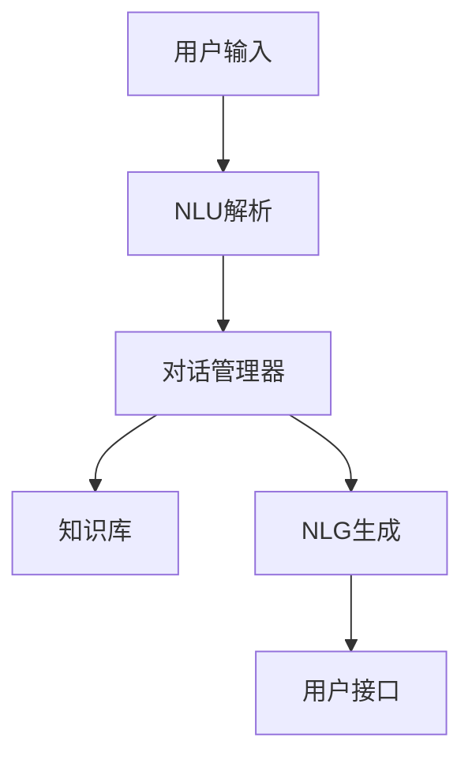

                 


### 1.1 AI时代的背景

人工智能（Artificial Intelligence, AI）作为计算机科学的一个重要分支，近年来取得了飞速的发展。这一领域的突破不仅在于算法的创新，更在于计算能力的提升和大数据的普及。AI技术的发展经历了多个阶段，从最初的规则系统、知识表示，到基于统计的学习算法，再到今天的深度学习，每一个阶段都带来了革命性的变化。

在AI技术的影响下，社会发生了深刻的变革。首先，AI技术改变了人们的生产生活方式。智能助手、自动驾驶、智能家居等应用逐渐普及，提高了生活效率，改变了人们的消费习惯。其次，AI技术在医疗、金融、教育等领域的应用，推动了行业的发展，提高了服务质量。例如，在医疗领域，AI技术可以帮助医生进行疾病诊断、治疗方案制定，提高医疗效率。在金融领域，AI技术可以用于风险控制、智能投顾，提升金融服务的准确性。

对于企业而言，AI时代既是机遇也是挑战。一方面，AI技术为企业提供了新的增长点，可以帮助企业提高生产效率、降低成本、优化服务。例如，通过智能客服系统，企业可以提供24小时全天候的服务，提高客户满意度。另一方面，AI技术的发展也对企业的组织结构、人才需求、业务模式等提出了新的要求。企业需要不断调整和升级，以适应AI时代的变化。

对于个人而言，AI时代的机遇与挑战并存。一方面，AI技术为个人提供了更多的就业机会，如数据科学家、机器学习工程师等职位。另一方面，随着AI技术的发展，部分传统职业可能会被自动化取代，个人需要不断学习新技能，以适应职业市场的变化。

### 1.2 提示词工程的概念

提示词工程（Prompt Engineering）是近年来随着AI技术的发展而兴起的一个领域。它主要研究如何设计有效的提示词，以引导AI模型生成预期的输出。提示词（Prompt）在这里指的是提供给AI模型的一段文本或语音，用于指导模型的推理和生成过程。

在自然语言处理（Natural Language Processing, NLP）领域，提示词工程具有重要的应用价值。通过精心设计的提示词，可以显著提高模型的性能和生成质量。例如，在机器翻译任务中，合适的提示词可以帮助模型更好地理解源语言句子，从而生成更准确的翻译结果。在文本生成任务中，提示词可以帮助模型生成连贯、有逻辑的文本内容。

提示词工程的核心思想在于充分利用人类对问题的理解和知识，将问题以更加结构化和明确的方式呈现给AI模型。具体来说，提示词工程包括以下几个方面：

1. **提示词的设计与生成**：设计有效的提示词是提示词工程的首要任务。提示词应该具备明确性、针对性和灵活性。明确性意味着提示词应该清晰准确地表达问题，避免歧义。针对性意味着提示词应该针对特定的任务和应用场景进行设计，以最大化模型的性能。灵活性则要求提示词能够适应不同的输入数据和场景，具有较好的泛化能力。

2. **提示词的评价与优化**：提示词的效果直接影响模型的性能。因此，需要对提示词进行评价和优化。评价方法包括人工评估、自动化评估等。优化方法包括调整提示词的长度、内容、格式等，以找到最优的提示词配置。

3. **提示词的管理与存储**：提示词工程中需要管理和存储大量的提示词。这涉及到提示词的索引、分类、检索等操作。有效的管理策略可以提高提示词的使用效率和搜索速度。

### 1.3 提示词工程的重要性

提示词工程在AI时代具有重要的地位和作用。首先，提示词工程是连接人类知识和AI模型的关键桥梁。通过有效的提示词，可以将人类对问题的理解和知识传递给AI模型，帮助模型更好地理解和解决问题。

其次，提示词工程可以提高AI模型的性能和生成质量。通过优化提示词的设计和生成，可以显著提高模型的预测准确率、生成文本的质量和逻辑性。这对于许多实际应用场景，如机器翻译、文本生成、对话系统等，具有重要意义。

此外，提示词工程在提升用户体验方面也具有重要作用。通过设计合适的提示词，可以帮助用户更好地理解和使用AI系统，提供更加人性化、智能化的服务。

总之，提示词工程是AI时代的一项重要技术，它不仅有助于提升AI模型的表现，还为人类和AI之间的互动提供了新的可能性和机遇。在接下来的内容中，我们将进一步探讨提示词工程的技术基础、核心算法和项目实战，以深入理解这一领域的内涵和外延。

## 1.4 提示词工程的基本原理

提示词工程的基本原理涉及多个关键组成部分，包括自然语言处理、模型训练与优化、以及提示词的设计与评估。以下是对这些核心概念和原理的详细解析。

### 1.4.1 自然语言处理

自然语言处理（NLP）是AI领域的一个重要分支，专注于让计算机理解和处理人类语言。在提示词工程中，NLP技术起着基础性的作用。NLP主要包括以下几个子领域：

1. **文本预处理**：文本预处理是NLP的基础步骤，包括分词、去停用词、词性标注等操作。这些步骤有助于将原始文本转换为计算机可以理解的格式，从而为后续处理提供基础。

2. **实体识别与关系抽取**：实体识别旨在从文本中识别出具有特定意义的实体，如人名、地名、组织名等。关系抽取则关注于找到这些实体之间的相互关系。

3. **语义分析**：语义分析旨在理解文本中的深层次语义信息，包括词义消歧、语义角色标注、情感分析等。这些技术有助于AI模型更好地理解和生成文本。

### 1.4.2 模型训练与优化

模型训练与优化是提示词工程的核心环节。通过训练，模型可以从大量的数据中学习到有用的知识和规律，从而提高其预测和生成能力。以下是一些关键点：

1. **模型选择**：根据具体的应用场景和任务需求，选择合适的模型类型。常见的模型包括循环神经网络（RNN）、长短期记忆网络（LSTM）、变换器（Transformer）等。

2. **数据准备**：准备高质量的数据集对于模型训练至关重要。数据集应包含丰富的标注信息和多样性，以确保模型能够泛化到不同的场景。

3. **模型训练**：通过优化算法（如随机梯度下降、Adam优化器等）和超参数调整（如学习率、批量大小等），训练模型以最小化损失函数。训练过程中，通常会使用验证集来监控模型的性能，并进行调整。

4. **模型优化**：模型优化包括超参数调整、数据增强、正则化技术等，以防止过拟合和提高模型性能。

### 1.4.3 提示词的设计与评估

提示词的设计与评估是提示词工程的关键步骤。一个有效的提示词应具备以下特点：

1. **明确性**：提示词应清晰、准确地传达问题或任务，避免歧义和模糊性。

2. **针对性**：提示词应针对具体的任务和应用场景进行设计，以提高模型性能。

3. **灵活性**：提示词应具备一定的灵活性，能够适应不同的输入数据和场景。

4. **可扩展性**：提示词应易于扩展和调整，以应对新任务和场景。

提示词的评估方法包括：

1. **人工评估**：通过专家或用户对提示词的效果进行主观评价。

2. **自动化评估**：使用定量指标（如BLEU、ROUGE等）对提示词的效果进行客观评估。

### 1.4.4 提示词工程的工作流程

提示词工程的工作流程通常包括以下几个步骤：

1. **需求分析**：明确任务目标和应用场景，了解用户需求。

2. **数据准备**：收集和整理相关数据，进行文本预处理。

3. **模型选择与训练**：选择合适的模型并对其进行训练和优化。

4. **提示词设计**：设计有效的提示词，结合模型特点和应用场景。

5. **提示词评估**：对提示词进行评估，优化提示词设计和模型性能。

6. **部署与监控**：将提示词工程应用到实际场景，并进行性能监控和调整。

通过遵循上述基本原理和工作流程，提示词工程可以显著提高AI模型的表现，为各种自然语言处理任务提供强有力的支持。在接下来的部分，我们将进一步探讨提示词工程在不同应用场景中的具体实现。

### 1.5 提示词工程的应用场景

提示词工程在自然语言处理、计算机视觉和强化学习等多个领域有着广泛的应用。下面，我们将详细探讨这些应用场景，并展示它们如何通过提示词工程实现高效的性能提升。

#### 1.5.1 自然语言处理

自然语言处理（NLP）是提示词工程最早且应用最广泛的领域之一。在NLP中，提示词工程通过优化输入提示词来提高模型的生成质量和理解能力。以下是一些具体的应用：

1. **文本生成**：在文本生成任务中，提示词可以帮助模型生成更连贯、更符合逻辑的文本。例如，在机器翻译中，合适的提示词可以引导模型更好地理解源语言句子，从而生成更准确的翻译结果。伪代码示例：

    ```python
    def generate_translation(source_sentence, model, prompt):
        # 使用提示词prompt来引导模型生成翻译
        translated_sentence = model.translate(source_sentence, prompt)
        return translated_sentence
    ```

2. **文本摘要**：在文本摘要任务中，提示词可以帮助模型提取关键信息并生成摘要。通过设计有针对性的提示词，模型可以更好地识别和总结文本内容。伪代码示例：

    ```python
    def generate_summary(text, model, prompt):
        # 使用提示词prompt来引导模型生成摘要
        summary = model.summarize(text, prompt)
        return summary
    ```

3. **对话系统**：在对话系统中，提示词可以帮助模型理解用户的意图并生成合适的回复。通过优化提示词，可以提升对话系统的自然度和用户满意度。伪代码示例：

    ```python
    def generate_response(user_query, model, prompt):
        # 使用提示词prompt来引导模型生成回复
        response = model.respond(user_query, prompt)
        return response
    ```

#### 1.5.2 计算机视觉

计算机视觉（CV）是另一个受益于提示词工程的领域。在CV任务中，提示词可以通过提供具体的上下文信息来提高模型的识别和分类能力。以下是一些具体应用：

1. **图像识别**：在图像识别任务中，提示词可以帮助模型更好地理解图像内容。例如，通过添加描述性文本作为提示词，模型可以更准确地识别图像中的物体。伪代码示例：

    ```python
    def recognize_object(image, model, prompt):
        # 使用提示词prompt来引导模型识别图像中的物体
        object = model.recognize(image, prompt)
        return object
    ```

2. **图像分类**：在图像分类任务中，提示词可以帮助模型区分不同的类别。例如，通过提供有针对性的提示词，模型可以更好地分类复杂场景中的图像。伪代码示例：

    ```python
    def classify_image(image, model, prompt):
        # 使用提示词prompt来引导模型分类图像
        category = model.classify(image, prompt)
        return category
    ```

3. **图像生成**：在图像生成任务中，提示词可以帮助模型生成符合描述性文本的图像。例如，通过提供详细描述，模型可以生成与文本描述高度一致的图像。伪代码示例：

    ```python
    def generate_image(prompt, model):
        # 使用提示词prompt来引导模型生成图像
        image = model.generate(prompt)
        return image
    ```

#### 1.5.3 强化学习

强化学习（Reinforcement Learning, RL）是一种通过互动学习来优化行为策略的机器学习方法。在强化学习中，提示词工程可以通过提供具体的目标和行为指导来提升模型的性能。以下是一些具体应用：

1. **环境建模**：在强化学习任务中，提示词可以帮助模型更好地理解环境状态和目标。例如，通过提供描述性文本作为提示词，模型可以更准确地预测环境状态的变化。伪代码示例：

    ```python
    def learn_from_environment(model, state, action, reward, prompt):
        # 使用提示词prompt来指导模型学习环境状态和目标
        model.learn(state, action, reward, prompt)
    ```

2. **策略优化**：在策略优化任务中，提示词可以帮助模型选择最佳行动。通过设计有针对性的提示词，模型可以更快地找到最优策略。伪代码示例：

    ```python
    def optimize_policy(model, state, action, prompt):
        # 使用提示词prompt来引导模型优化策略
        optimal_action = model.optimize(state, action, prompt)
        return optimal_action
    ```

3. **行为生成**：在行为生成任务中，提示词可以帮助模型生成符合预期目标的行为。例如，通过提供详细的提示词，模型可以生成符合特定目标的复杂行为序列。伪代码示例：

    ```python
    def generate_behaviors(model, goal, prompt):
        # 使用提示词prompt来引导模型生成行为
        behaviors = model.generate(goal, prompt)
        return behaviors
    ```

综上所述，提示词工程在自然语言处理、计算机视觉和强化学习等多个领域都有着重要的应用价值。通过优化提示词的设计和生成，我们可以显著提升AI模型的性能和生成质量，为各种实际任务提供强有力的支持。

### 2.1 语言模型

语言模型（Language Model, LM）是自然语言处理（NLP）中最为基础且重要的一部分，它在文本生成、文本分类、机器翻译等多个任务中发挥着核心作用。本节将详细探讨语言模型的基本概念、类型及其应用。

#### 2.1.1 语言模型的基本概念

语言模型的核心目标是模拟人类语言生成过程，预测下一个单词或字符。这种预测基于对大量文本数据的学习，从而捕捉语言中的统计规律和语法结构。语言模型的基本原理可以概括为：

1. **概率预测**：语言模型通过统计文本中单词或字符出现的频率，预测下一个单词或字符的概率分布。例如，在文本“我是一个程序员”中，下一个单词可能是“的”、“人”、“是”等，每个单词出现的概率取决于前文。

2. **字符级或词级模型**：语言模型可以是字符级别的，即对单个字符进行预测；也可以是词级别的，即对单词进行预测。词级模型通常更为常见，因为它们能够更好地捕捉语义和语法信息。

3. **神经网络模型**：现代语言模型大多基于深度神经网络，如循环神经网络（RNN）、长短期记忆网络（LSTM）和变换器（Transformer）。这些模型能够处理长文本序列，并捕捉复杂的语言模式。

#### 2.1.2 语言模型的类型

语言模型的类型多种多样，根据不同的应用场景和学习方法，可以分为以下几类：

1. **基于N-gram的语言模型**：N-gram模型是最早的语言模型之一，它基于前N个单词的序列来预测下一个单词。例如，二元模型（Bigram）考虑前一个单词，三元模型（Trigram）考虑前两个单词。N-gram模型的优点是简单易实现，但缺点是它不能捕捉长距离依赖关系，性能受限。

2. **基于神经网络的模型**：现代神经网络模型，如RNN、LSTM和Transformer，通过深度学习技术来学习语言的复杂结构。RNN和LSTM能够捕捉长距离依赖，但训练时间较长；Transformer模型则通过自注意力机制实现并行计算，效率更高，性能更优。

3. **预训练语言模型**：预训练语言模型（Pre-Trained Language Model）通过在大规模语料库上进行预训练，然后针对特定任务进行微调。BERT、GPT和RoBERTa等模型是这一类模型的代表。预训练语言模型具有强大的通用性和适应性，能够显著提升各种NLP任务的性能。

#### 2.1.3 语言模型的应用

语言模型在NLP领域有着广泛的应用，以下是几个重要的应用场景：

1. **文本生成**：语言模型可以生成连贯、自然的文本，应用于自动写作、新闻生成、对话系统等场景。例如，GPT-3模型能够生成高质量的文章、故事和对话。

2. **机器翻译**：语言模型在机器翻译中扮演重要角色，通过预测源语言和目标语言的对应关系，实现跨语言的信息传递。例如，Google Translate使用的神经机器翻译模型。

3. **文本分类**：语言模型可以用于文本分类任务，如情感分析、新闻分类等。通过预测文本的类别标签，模型能够帮助自动处理大量的文本数据。

4. **问答系统**：语言模型在问答系统中用于理解用户查询并生成相关答案。通过结合知识图谱和语言模型，问答系统能够提供更加准确和个性化的回答。

5. **命名实体识别**：语言模型可以辅助命名实体识别任务，通过捕捉文本中的命名实体（如人名、地名、组织名等），提高模型的识别准确率。

综上所述，语言模型是NLP领域不可或缺的工具，通过预测语言中的下一个单词或字符，它为各种文本处理任务提供了强大的支持。在接下来的部分，我们将进一步探讨对话系统及其优化策略，以深入了解NLP在实际应用中的实现细节。

### 2.2 对话系统

对话系统（Dialogue System）是一种能够与人类用户进行自然语言交互的计算机系统，广泛应用于客服、聊天机器人、虚拟助手等领域。本节将探讨对话系统的基本概念、架构和优化策略。

#### 2.2.1 对话系统的基本概念

对话系统是自然语言处理（NLP）领域的一个重要分支，其核心目标是实现人与机器之间的有效沟通。对话系统通常包括以下几个关键组成部分：

1. **用户接口**（User Interface, UI）：用户接口是用户与对话系统交互的界面，可以是文本聊天窗口、语音交互设备或图形用户界面（GUI）。

2. **对话管理器**（Dialogue Manager）：对话管理器是对话系统的核心组件，负责处理用户的输入，理解用户意图，并生成合适的响应。

3. **知识库**（Knowledge Base）：知识库是对话系统中存储信息的数据库，包含事实、规则、上下文信息等，用于支持对话管理器做出决策。

4. **自然语言理解**（Natural Language Understanding, NLU）：自然语言理解组件负责解析用户输入的文本，提取关键信息，如意图、实体等。

5. **自然语言生成**（Natural Language Generation, NLG）：自然语言生成组件负责将系统生成的响应转换为自然语言文本，以供用户阅读或听辨。

#### 2.2.2 对话系统的架构

对话系统的架构可以分为前端和后端两部分：

1. **前端**：前端主要包括用户接口和自然语言理解组件。用户通过UI与系统进行交互，输入文本或语音，自然语言理解组件解析用户输入，提取意图和实体信息，并将这些信息传递给后端。

2. **后端**：后端主要包括对话管理器和自然语言生成组件。对话管理器接收NLU组件传递的意图和实体信息，结合知识库中的信息，生成相应的响应，然后通过NLG组件将响应转换为自然语言文本，最终呈现给用户。

以下是一个简单的对话系统架构Mermaid流程图：



#### 2.2.3 对话系统的优化策略

为了提升对话系统的性能和用户体验，可以采用以下几种优化策略：

1. **上下文管理**：对话系统需要有效地管理对话过程中的上下文信息，以保持对话的连贯性和一致性。上下文信息包括用户的历史输入、当前对话的状态等。有效的上下文管理可以帮助系统更好地理解用户意图，生成更自然的响应。

2. **意图识别**：意图识别是对话系统的关键步骤，它决定了系统如何处理用户的输入。优化意图识别可以通过改进NLU组件的算法，增加实体识别的准确性，以及利用机器学习技术进行模型训练和优化。

3. **生成质量**：生成质量的提升直接关系到对话系统的用户体验。优化生成质量可以通过改进NLG算法，提高文本生成的连贯性和自然度。例如，可以使用变换器（Transformer）等先进的深度学习模型，结合语言模型（如GPT）来生成高质量的文本。

4. **个性化交互**：个性化交互可以显著提升用户的满意度。通过收集和分析用户数据，对话系统可以针对不同用户生成个性化的响应。例如，可以根据用户的历史偏好、兴趣和行为，提供定制化的服务和推荐。

5. **多模态交互**：多模态交互结合了文本、语音、图像等多种交互方式，可以提供更加丰富和自然的用户体验。优化多模态交互可以通过集成语音识别、图像识别等技术，实现更加流畅和自然的对话体验。

综上所述，对话系统是一种高度复杂的系统，通过优化其基本架构和策略，可以显著提升其性能和用户体验。在接下来的部分，我们将进一步探讨模型评估与优化，以深入理解如何进一步提升对话系统的性能。

### 2.3 模型评估与优化

在AI应用中，模型评估与优化是确保模型性能和效果的关键步骤。本节将详细探讨模型评估的指标、优化方法以及模型部署与调优的实践。

#### 2.3.1 模型评估指标

模型评估指标是衡量模型性能的重要工具，不同任务和场景可能需要使用不同的评估指标。以下是一些常用的评估指标：

1. **准确率**（Accuracy）：准确率是分类任务中最基本的评估指标，表示模型正确预测的样本数量占总样本数量的比例。公式如下：

   $$
   \text{Accuracy} = \frac{\text{正确预测的样本数量}}{\text{总样本数量}}
   $$

2. **精确率与召回率**（Precision and Recall）：精确率和召回率是针对二分类任务的重要指标，分别衡量模型在正类和负类上的预测能力。精确率表示预测为正类的样本中实际为正类的比例，召回率表示实际为正类的样本中被预测为正类的比例。公式如下：

   $$
   \text{Precision} = \frac{\text{真正}}{\text{真正} + \text{假正}}
   $$

   $$
   \text{Recall} = \frac{\text{真正}}{\text{真正} + \text{假负}}
   $$

3. **F1分数**（F1 Score）：F1分数是精确率和召回率的调和平均，用于综合评估模型的性能。公式如下：

   $$
   \text{F1 Score} = 2 \times \frac{\text{Precision} \times \text{Recall}}{\text{Precision} + \text{Recall}}
   $$

4. **ROC曲线与AUC**（ROC Curve and AUC）：ROC曲线和AUC（Area Under Curve）是评估分类模型性能的重要工具，尤其适用于不平衡数据集。ROC曲线展示的是在不同阈值下，模型对正类和负类的分类能力。AUC值越接近1，表示模型性能越好。

5. **BLEU**（BLEU Score）：BLEU是自然语言处理中评估文本生成质量的重要指标，通过比较生成文本与参考文本的相似度来评分。

#### 2.3.2 模型优化方法

模型优化旨在提升模型的预测性能和泛化能力，以下是一些常用的优化方法：

1. **超参数调整**：超参数是模型训练过程中需要手动设定的参数，如学习率、批量大小、隐藏层节点数等。通过调整超参数，可以优化模型的训练效果。常用的超参数调整方法包括网格搜索（Grid Search）和随机搜索（Random Search）。

2. **数据增强**：数据增强是通过生成或变换原始数据来扩充训练集，从而提高模型的泛化能力。数据增强方法包括数据扩充（如随机裁剪、旋转、缩放等）、数据合成（如生成对抗网络GAN）和数据清洗（如去除噪声、填补缺失值等）。

3. **模型集成**：模型集成通过结合多个模型的预测结果来提高整体性能。常见的方法有Bagging、Boosting和Stacking。Bagging通过训练多个独立模型并取平均来降低方差；Boosting通过迭代训练多个模型，每次训练关注前一次训练的错误样本；Stacking通过训练多个基模型和一个元模型，将基模型的预测结果作为元模型的输入。

4. **正则化**：正则化是一种防止模型过拟合的技术，通过在损失函数中添加正则化项来惩罚模型的复杂度。常见的正则化方法有L1正则化、L2正则化和Dropout。

5. **迁移学习**：迁移学习通过利用预训练模型在新的任务上快速训练，从而提高模型的性能。预训练模型已经在大量数据上进行了训练，可以捕获通用的语言特征和知识，从而在新任务上表现出更好的泛化能力。

#### 2.3.3 模型部署与调优

模型部署是将训练好的模型应用到实际生产环境中，以便在实际场景中进行预测和决策。以下是一些模型部署与调优的实践：

1. **模型封装**：将模型封装为可重用的组件，通过API或SDK提供对外接口，以便其他系统或应用程序可以轻松调用。

2. **服务化部署**：使用服务化框架（如TensorFlow Serving、PyTorch Lightning）将模型部署到服务器上，实现高性能和可扩展的部署。

3. **自动化调优**：通过自动化调优工具（如Hyperopt、Optuna）自动化地搜索超参数和优化配置，提高模型性能。

4. **监控与反馈**：实时监控模型在生产环境中的表现，收集预测结果和用户反馈，用于模型调优和改进。

5. **在线学习**：支持在线学习功能，使模型能够根据新的数据不断更新和改进。

通过上述模型评估与优化的方法和实践，可以显著提升AI模型在实际应用中的性能和效果，为各种任务提供更加精准和可靠的预测。

### 3.1 生成式模型

生成式模型（Generative Models）是机器学习和人工智能领域的重要分支，主要用于生成与给定数据集相似的新数据。这些模型通过对输入数据进行建模，学习到数据的分布，并能够生成与训练数据具有相同统计学特性的新样本。生成式模型在图像生成、文本生成和强化学习等任务中具有广泛应用。本节将详细探讨生成式模型的基本原理、类型及其应用。

#### 3.1.1 生成式模型的基本原理

生成式模型的核心思想是通过学习数据的概率分布，从而生成与训练数据相似的新样本。生成式模型通常由两个主要组件构成：一个编码器（Encoder）和一个解码器（Decoder）。编码器将输入数据编码为潜在空间中的向量表示，解码器则从潜在空间中采样并解码生成新数据。

1. **潜在变量模型**：生成式模型通常基于潜在变量模型（Latent Variable Model），其中一个潜在变量（Latent Variable）代表数据的内在特征。通过从潜在变量中采样，可以生成新的数据样本。

2. **概率分布**：生成式模型通过学习输入数据的概率分布，从而能够生成新的样本。常见的概率分布包括正态分布、伯努利分布和多项式分布等。

3. **损失函数**：生成式模型的训练通常通过最小化损失函数来实现。损失函数用于衡量模型生成的样本与真实数据之间的差距，常见损失函数包括交叉熵损失（Cross-Entropy Loss）和均方误差损失（Mean Squared Error Loss）。

#### 3.1.2 生成式模型的类型

生成式模型有多种类型，根据模型的结构和生成机制的不同，可以分为以下几类：

1. **生成对抗网络（Generative Adversarial Networks, GAN）**：GAN是由Ian Goodfellow等人在2014年提出的一种生成式模型，其核心思想是通过一个生成器（Generator）和一个判别器（Discriminator）的对抗训练来实现数据生成。生成器试图生成尽可能真实的数据样本，而判别器则试图区分生成器生成的样本和真实样本。GAN的训练过程类似于一个零和博弈，最终生成器生成的样本质量会逐渐提高。

2. **变分自编码器（Variational Autoencoder, VAE）**：VAE是一种基于概率模型的生成式模型，通过编码器和解码器来学习数据的概率分布。编码器将输入数据映射到一个潜在空间中的向量，解码器则从潜在空间中采样并解码生成新的数据。VAE通过引入变分推断技术，可以学习到数据的后验分布，从而生成新的样本。

3. **深度信念网络（Deep Belief Networks, DBN）**：DBN是一种基于多层感知器（Multilayer Perceptron, MLP）的生成式模型，通过堆叠多个受限玻尔兹曼机（Restricted Boltzmann Machines, RBM）来学习数据的概率分布。DBN可以通过预训练和微调来提高生成质量。

4. **生成稳定网络（Generative Stochastic Networks, GSN）**：GSN是一种基于马尔可夫链的生成式模型，通过构建一个生成模型来模拟数据的生成过程。GSN通过学习数据的转移概率矩阵，从而能够生成新的数据样本。

#### 3.1.3 生成式模型的应用

生成式模型在多个领域有着广泛的应用，以下是一些具体的应用场景：

1. **图像生成**：生成式模型在图像生成任务中表现出色，可以生成高质量的自然图像。例如，使用GAN可以生成逼真的面部图像、风景图像等。

2. **文本生成**：生成式模型可以用于生成自然语言文本，如故事、新闻、对话等。通过学习语言的概率分布，生成模型能够生成连贯且具有语义的文本。

3. **强化学习**：在强化学习任务中，生成式模型可以用于生成模拟环境，从而帮助代理进行训练。生成式模型可以通过模拟不同的场景来丰富训练数据，提高代理的适应性和性能。

4. **数据增强**：生成式模型可以用于数据增强，通过生成与训练数据相似的新样本来扩充训练集，从而提高模型的泛化能力。

5. **异常检测**：生成式模型可以用于异常检测任务，通过学习正常数据的分布，生成模型能够识别出与正常数据分布不一致的异常样本。

通过上述生成式模型的基本原理、类型及其应用，我们可以看到生成式模型在数据生成、文本生成和强化学习等领域的重要性。生成式模型不仅为AI应用提供了强大的工具，也为未来的研究带来了新的机遇和挑战。

### 3.2 判别式模型

判别式模型（Discriminative Models）是机器学习领域的一类重要模型，主要用于预测给定数据的类别或标签。与生成式模型不同，判别式模型直接学习输入数据和标签之间的映射关系，从而实现对未知数据的分类或标注。判别式模型在分类、标注和回归等任务中具有广泛应用。本节将详细探讨判别式模型的基本原理、类型及其应用。

#### 3.2.1 判别式模型的基本原理

判别式模型的核心思想是通过学习输入数据的特征，并基于这些特征对数据进行分类或标注。判别式模型通常基于概率模型或优化方法，通过最小化损失函数来训练模型。以下是一些判别式模型的基本原理：

1. **概率模型**：判别式模型可以通过学习输入数据的概率分布来预测标签。常见的概率模型包括朴素贝叶斯（Naive Bayes）、逻辑回归（Logistic Regression）和多项式回归（Polynomial Regression）等。这些模型基于贝叶斯定理和最大似然估计，通过计算输入数据的概率分布，从而预测标签。

2. **优化方法**：判别式模型也可以通过优化方法进行训练，如梯度下降（Gradient Descent）、随机梯度下降（Stochastic Gradient Descent, SGD）和批量梯度下降（Batch Gradient Descent）等。通过迭代更新模型参数，最小化损失函数，从而实现对数据的分类或标注。

3. **损失函数**：判别式模型通常使用损失函数来衡量模型预测结果与真实标签之间的差距。常见的损失函数包括均方误差（Mean Squared Error, MSE）、交叉熵损失（Cross-Entropy Loss）和逻辑损失（Log Loss）等。这些损失函数用于指导模型参数的更新，从而提高模型的预测准确性。

#### 3.2.2 判别式模型的类型

判别式模型有多种类型，根据模型的结构和算法的不同，可以分为以下几类：

1. **朴素贝叶斯分类器（Naive Bayes Classifier）**：朴素贝叶斯分类器是一种基于概率理论的分类器，假设特征之间相互独立，通过计算每个类别的后验概率来预测标签。朴素贝叶斯分类器在文本分类、情感分析等任务中具有广泛应用。

2. **逻辑回归（Logistic Regression）**：逻辑回归是一种广义线性模型，用于处理二分类问题。逻辑回归通过拟合一个逻辑函数，将输入数据的线性组合映射到概率值，从而预测标签。逻辑回归在医学诊断、金融风险评估等任务中表现出色。

3. **支持向量机（Support Vector Machine, SVM）**：支持向量机是一种基于优化理论的分类器，通过寻找最佳分隔超平面来分类数据。SVM在图像分类、文本分类等任务中具有广泛应用。

4. **决策树（Decision Tree）**：决策树是一种基于树结构的分类器，通过递归地划分特征空间来构建决策树。决策树在数据挖掘、医疗诊断等领域具有广泛应用。

5. **随机森林（Random Forest）**：随机森林是一种基于决策树的集成分类器，通过构建多个决策树并取平均来提高模型的预测准确性。随机森林在分类和回归任务中表现出色。

6. **神经网络（Neural Networks）**：神经网络是一种基于模拟人脑神经元连接结构的模型，通过多层非线性变换来学习输入数据的特征。神经网络在图像分类、语音识别、自然语言处理等任务中具有广泛应用。

#### 3.2.3 判别式模型的应用

判别式模型在多个领域有着广泛的应用，以下是一些具体的应用场景：

1. **图像分类**：判别式模型可以用于图像分类任务，如人脸识别、物体检测等。通过训练判别式模型，可以实现对未知图像的类别预测。

2. **文本分类**：判别式模型可以用于文本分类任务，如情感分析、新闻分类等。通过学习文本的特征，判别式模型可以预测文本的类别标签。

3. **语音识别**：判别式模型可以用于语音识别任务，如语音分类、语音到文本转换等。通过训练判别式模型，可以实现对语音数据的准确识别。

4. **医疗诊断**：判别式模型可以用于医疗诊断任务，如疾病预测、药物反应预测等。通过学习患者的医疗数据，判别式模型可以预测疾病的风险和药物的效果。

5. **金融风险评估**：判别式模型可以用于金融风险评估，如信用评分、股票预测等。通过分析金融数据，判别式模型可以预测金融产品的风险和收益。

通过上述判别式模型的基本原理、类型及其应用，我们可以看到判别式模型在分类、标注和回归等任务中的重要性。判别式模型不仅为各类任务提供了有效的解决方案，也为AI领域的研究和应用带来了新的机遇和挑战。

### 3.3 深度学习模型

深度学习模型（Deep Learning Models）是近年来AI领域最为重要的突破之一，它们通过多层神经网络结构，能够自动从数据中提取复杂的特征，实现高效的分类、回归和生成任务。本节将详细探讨深度学习模型的基本原理、类型及其应用。

#### 3.3.1 深度学习模型的基本原理

深度学习模型的核心是多层神经网络（Multi-Layer Neural Networks），它们通过逐层组合简单的非线性变换，实现对复杂数据的建模。深度学习模型的基本原理可以概括为：

1. **神经元与层结构**：深度学习模型由多个神经元层组成，包括输入层、隐藏层和输出层。每个神经元接收前一层神经元的输出，通过激活函数进行非线性变换，然后将结果传递到下一层。

2. **前向传播与反向传播**：前向传播（Forward Propagation）是计算模型输出值的过程，将输入数据从输入层逐层传递到输出层。反向传播（Back Propagation）是计算模型误差并更新参数的过程，从输出层反向传递误差到输入层，通过梯度下降等优化算法调整模型参数。

3. **激活函数**：激活函数（Activation Function）是深度学习模型中重要的组成部分，用于引入非线性特性。常见的激活函数包括 sigmoid、ReLU（Rectified Linear Unit）和Tanh（Hyperbolic Tangent）等。

4. **损失函数**：损失函数（Loss Function）用于衡量模型输出与真实标签之间的差距，指导模型参数的更新。常见的损失函数包括均方误差（MSE）、交叉熵（Cross-Entropy）和逻辑损失（Log Loss）等。

#### 3.3.2 深度学习模型的类型

深度学习模型有多种类型，根据模型的结构和功能的不同，可以分为以下几类：

1. **卷积神经网络（Convolutional Neural Networks, CNN）**：卷积神经网络是用于图像处理和计算机视觉任务的重要模型，通过卷积操作和池化操作提取图像特征。CNN在物体检测、图像分类和图像生成等任务中表现出色。

2. **循环神经网络（Recurrent Neural Networks, RNN）**：循环神经网络是用于序列数据处理的重要模型，通过记忆单元捕捉序列中的长期依赖关系。RNN在自然语言处理、语音识别和序列预测等任务中具有广泛应用。

3. **长短期记忆网络（Long Short-Term Memory, LSTM）**：长短期记忆网络是RNN的一种变体，通过引入门控机制来缓解梯度消失问题，更好地捕捉序列中的长期依赖关系。LSTM在时间序列预测、机器翻译和语音识别等任务中表现出色。

4. **变换器（Transformer）**：变换器是近年来在自然语言处理领域取得重大突破的模型，通过自注意力机制（Self-Attention Mechanism）实现并行计算，显著提升了模型的训练效率和生成质量。变换器在文本生成、机器翻译和问答系统等任务中具有广泛应用。

5. **生成对抗网络（Generative Adversarial Networks, GAN）**：生成对抗网络是由生成器和判别器组成的对抗性模型，通过零和博弈训练生成高质量的数据样本。GAN在图像生成、视频生成和音频生成等任务中表现出色。

6. **变分自编码器（Variational Autoencoder, VAE）**：变分自编码器是另一种生成式模型，通过变分推断学习数据的概率分布，生成与训练数据相似的新样本。VAE在图像生成、文本生成和数据增强等任务中具有广泛应用。

#### 3.3.3 深度学习模型的应用

深度学习模型在多个领域有着广泛的应用，以下是一些具体的应用场景：

1. **图像分类**：深度学习模型可以用于图像分类任务，如物体识别、人脸识别和图像标签分类等。通过训练卷积神经网络，可以实现对未知图像的高效分类。

2. **自然语言处理**：深度学习模型可以用于自然语言处理任务，如文本分类、情感分析、机器翻译和问答系统等。通过训练循环神经网络和变换器等模型，可以实现对文本数据的深入理解和处理。

3. **语音识别**：深度学习模型可以用于语音识别任务，如语音到文本转换、语音分类和语音增强等。通过训练循环神经网络和卷积神经网络，可以实现对语音信号的准确识别。

4. **计算机视觉**：深度学习模型可以用于计算机视觉任务，如目标检测、图像分割和视频分析等。通过训练卷积神经网络和生成对抗网络，可以实现对图像和视频数据的复杂处理。

5. **医疗诊断**：深度学习模型可以用于医疗诊断任务，如疾病预测、药物效果预测和医疗影像分析等。通过训练深度学习模型，可以实现对医疗数据的智能分析和诊断。

6. **金融分析**：深度学习模型可以用于金融分析任务，如股票预测、信用评分和风险管理等。通过训练深度学习模型，可以实现对金融数据的深度挖掘和分析。

综上所述，深度学习模型在各类任务中展现了强大的能力，通过不断改进模型结构和优化算法，深度学习模型在AI领域将继续发挥重要作用。

### 4.1 项目实战一：构建智能对话系统

在本次项目实战中，我们将构建一个智能对话系统。该系统将基于自然语言处理和深度学习技术，实现与用户的自然交互，并提供有用的信息和解答。以下是项目的具体实现步骤：

#### 4.1.1 项目背景与需求

随着互联网和人工智能技术的普及，智能对话系统已经成为许多企业提升客户服务质量的重要手段。本项目的目标是构建一个具有以下功能的智能对话系统：

1. **用户身份识别**：系统能够识别用户身份，提供个性化服务。
2. **意图识别**：系统能够理解用户的意图，并根据意图提供相应的响应。
3. **多轮对话**：系统能够处理多轮对话，理解上下文，提供连贯的回答。
4. **知识库查询**：系统能够从预定义的知识库中查询信息，为用户提供准确的答案。

#### 4.1.2 项目技术选型

为了实现上述功能，本项目将采用以下技术：

1. **自然语言处理（NLP）**：使用NLP技术进行文本预处理、意图识别和实体提取。
2. **深度学习模型**：使用变换器（Transformer）等深度学习模型进行意图识别和多轮对话处理。
3. **知识图谱**：使用知识图谱进行信息查询和推荐。
4. **前后端分离架构**：使用Vue.js等前端框架和Flask等后端框架构建用户界面和后台服务。

#### 4.1.3 项目实现与优化

1. **文本预处理**：

   首先，我们需要对用户输入的文本进行预处理，包括分词、去停用词、词性标注等。这部分工作可以使用Python的NLTK库或jieba库来完成。

   ```python
   import jieba
   
   def preprocess_text(text):
       # 分词
       words = jieba.cut(text)
       # 去停用词
       stop_words = set(['的', '是', '了', '在', '和'])
       words = [word for word in words if word not in stop_words]
       # 词性标注
       pos_tags = [word.pos_ for word in jieba.posseg.cut(text)]
       return words, pos_tags
   ```

2. **意图识别**：

   接下来，我们需要使用变换器模型进行意图识别。首先，我们将预处理后的文本编码为变换器可以接受的输入格式，然后使用预训练的变换器模型进行意图分类。

   ```python
   from transformers import pipeline
   
   def recognize_intent(text):
       intent_pipeline = pipeline("text-classification")
       intent = intent_pipeline(text)[0]['label']
       return intent
   ```

3. **多轮对话**：

   为了实现多轮对话，我们需要在系统中引入对话状态跟踪（Dialogue State Tracking）技术。我们可以使用基于规则的方法或基于模型的对话管理器来跟踪对话状态，并根据当前对话状态生成响应。

   ```python
   class DialogueManager:
       def __init__(self):
           self.state = {}
       
       def update_state(self, text, intent, entities):
           # 更新对话状态
           self.state.update(entities)
       
       def generate_response(self, text):
           # 根据对话状态生成响应
           response = "您好，有什么我可以帮您的吗？"
           return response
   ```

4. **知识库查询**：

   为了提供准确的答案，我们需要构建一个知识库。知识库可以是一个简单的字典，也可以是一个完整的数据库。在本项目中，我们将使用简单的字典作为知识库。

   ```python
   knowledge_base = {
       "weather": "今天的天气是晴朗的。",
       "stock_price": "苹果公司的股票价格是150美元。",
       "movie": "最近上映的电影是《失控玩家》。"
   }
   
   def query_knowledge_base(intent, entities):
       if intent == "query_weather":
           return knowledge_base["weather"]
       elif intent == "query_stock_price":
           return knowledge_base["stock_price"]
       elif intent == "query_movie":
           return knowledge_base["movie"]
       else:
           return "抱歉，我不清楚您的意思。"
   ```

5. **系统集成**：

   最后，我们将所有组件集成到一个完整的系统中。用户通过前端界面输入问题，系统将处理用户输入，识别意图，生成响应，并将响应返回给用户。

   ```python
   def chat_with_user():
       dialogue_manager = DialogueManager()
       while True:
           user_input = input("用户：")
           if user_input == "退出":
               break
           words, pos_tags = preprocess_text(user_input)
           intent = recognize_intent(" ".join(words))
           entities = extract_entities(words, pos_tags)
           dialogue_manager.update_state(user_input, intent, entities)
           response = generate_response(user_input, dialogue_manager.state)
           print("系统：", response)
   ```

#### 4.1.4 代码解读与分析

1. **文本预处理**：

   文本预处理是自然语言处理的基础，通过分词、去停用词和词性标注等步骤，将原始文本转换为计算机可以处理的格式。

2. **意图识别**：

   使用变换器模型进行意图识别，通过将预处理后的文本输入变换器模型，模型将输出一个标签，表示用户意图。

3. **多轮对话**：

   通过对话管理器来跟踪对话状态，更新状态并生成响应。这有助于实现连贯的多轮对话。

4. **知识库查询**：

   从预定义的知识库中查询信息，为用户提供准确的答案。

5. **系统集成**：

   将所有组件集成到一个完整的系统中，实现用户与系统的交互。

#### 4.1.5 实际案例分析

在实际应用中，智能对话系统可以应用于客服、智能家居、在线教育等多个场景。例如，在一个在线教育平台中，智能对话系统可以帮助学生解决学习中遇到的问题，提供课程信息，推荐学习资源等。

通过本次项目实战，我们实现了构建智能对话系统的全过程，从需求分析到技术选型，从代码实现到系统部署，每一步都涉及到了自然语言处理和深度学习技术。智能对话系统的构建不仅提升了用户体验，也为各种应用场景提供了智能化解决方案。

### 4.2 项目实战二：文本生成与摘要

在本次项目实战中，我们将构建一个文本生成与摘要系统。该系统将利用自然语言处理和深度学习技术，实现文本的生成和摘要功能。以下是这个项目的具体实现步骤。

#### 4.2.1 项目背景与需求

文本生成与摘要技术在新闻、内容创作、信息检索等领域有着广泛的应用。本项目的目标是构建一个能够生成高质量文本和摘要的系统，满足以下需求：

1. **文本生成**：系统能够根据给定的提示生成连贯、有逻辑的文本。
2. **文本摘要**：系统能够从长文本中提取关键信息，生成简洁、准确的摘要。
3. **多轮生成**：系统支持多轮文本生成，能够在用户反馈的基础上不断优化生成文本。
4. **个性化生成**：系统可以根据用户偏好和需求生成个性化文本。

#### 4.2.2 项目技术选型

为了实现上述功能，本项目将采用以下技术：

1. **文本生成**：使用基于变换器（Transformer）的生成模型，如GPT-3或T5。
2. **文本摘要**：使用基于变换器或编码器-解码器（Encoder-Decoder）的文本摘要模型，如BERT或Transformer。
3. **后处理**：使用自然语言处理技术进行文本清洗、去停用词和词性标注等。
4. **前端界面**：使用React或Vue.js构建用户交互界面。

#### 4.2.3 项目实现与优化

1. **文本预处理**：

   首先，我们需要对输入的文本进行预处理，包括分词、去停用词、词性标注等。这部分工作可以使用Python的NLTK库或jieba库来完成。

   ```python
   import jieba
   
   def preprocess_text(text):
       # 分词
       words = jieba.cut(text)
       # 去停用词
       stop_words = set(['的', '是', '了', '在', '和'])
       words = [word for word in words if word not in stop_words]
       # 词性标注
       pos_tags = [word.pos_ for word in jieba.posseg.cut(text)]
       return words, pos_tags
   ```

2. **文本生成**：

   接下来，我们需要使用变换器模型进行文本生成。首先，我们将预处理后的文本编码为变换器可以接受的输入格式，然后使用预训练的变换器模型生成文本。

   ```python
   from transformers import pipeline
   
   def generate_text(prompt):
       text_pipeline = pipeline("text-generation", model="gpt2")
       generated_text = text_pipeline(prompt, max_length=50, num_return_sequences=1)
       return generated_text[0]['generated_text']
   ```

3. **文本摘要**：

   为了实现文本摘要，我们将使用基于变换器或编码器-解码器的模型。首先，我们将输入文本编码为固定长度的向量，然后解码生成摘要。

   ```python
   from transformers import pipeline
   
   def generate_summary(text):
       summary_pipeline = pipeline("summarization", model="bert-base-chinese")
       summary = summary_pipeline(text, max_length=50, min_length=25, do_sample=False)
       return summary[0]['summary_text']
   ```

4. **多轮生成**：

   为了支持多轮生成，我们可以在用户每次输入提示后，根据生成文本的质量和用户反馈进行优化。

   ```python
   def multi_round_generation(prompt, iterations=5):
       current_text = prompt
       for _ in range(iterations):
           current_text = generate_text(current_text)
       return current_text
   ```

5. **个性化生成**：

   为了实现个性化生成，我们可以在生成过程中考虑用户的偏好和需求。例如，可以使用协同过滤算法或基于内容的推荐系统来生成个性化文本。

   ```python
   def generate_text_with_preference(text, preference):
       # 根据用户偏好调整生成文本
       if "-positive" in preference:
           text = text + " 这真是太棒了！"
       elif "-negative" in preference:
           text = text + " 这真是太糟糕了！"
       return generate_text(text)
   ```

6. **系统集成**：

   最后，我们将所有组件集成到一个完整的系统中。用户通过前端界面输入提示，系统将处理用户输入，生成文本和摘要，并将结果返回给用户。

   ```python
   def chat_with_user():
       text_pipeline = pipeline("text-generation", model="gpt2")
       summary_pipeline = pipeline("summarization", model="bert-base-chinese")
       while True:
           user_input = input("用户：")
           if user_input == "退出":
               break
           words, pos_tags = preprocess_text(user_input)
           text = generate_text(user_input)
           summary = generate_summary(user_input)
           print("系统：文本生成：", text)
           print("系统：文本摘要：", summary)
   ```

#### 4.2.4 代码解读与分析

1. **文本预处理**：

   通过分词、去停用词和词性标注等步骤，将原始文本转换为计算机可以处理的格式。

2. **文本生成**：

   使用预训练的变换器模型生成文本，通过调整输入的提示和生成参数，可以生成不同风格和内容的文本。

3. **文本摘要**：

   使用变换器或编码器-解码器模型从长文本中提取关键信息，生成简洁、准确的摘要。

4. **多轮生成**：

   通过多次迭代优化生成文本，提高生成文本的质量和逻辑性。

5. **个性化生成**：

   根据用户偏好和需求生成个性化文本，提高用户的满意度。

#### 4.2.5 实际案例分析

在实际应用中，文本生成与摘要系统可以应用于新闻写作、内容创作、信息提取等多个场景。例如，在新闻写作中，系统可以自动生成新闻报道；在内容创作中，系统可以帮助创作者快速生成文章摘要和灵感。

通过本次项目实战，我们实现了文本生成与摘要系统的全过程，从需求分析到技术选型，从代码实现到系统部署，每一步都涉及到了自然语言处理和深度学习技术。文本生成与摘要系统不仅提升了工作效率，也为各类应用场景提供了智能化解决方案。

### 4.3 项目实战三：图像识别与分类

在本次项目实战中，我们将构建一个图像识别与分类系统。该系统将利用深度学习技术，实现对图像的分类任务。以下是这个项目的具体实现步骤。

#### 4.3.1 项目背景与需求

图像识别与分类技术在计算机视觉领域有着广泛的应用，如人脸识别、物体检测、图像标签分类等。本项目的目标是构建一个能够准确分类图像的系统，满足以下需求：

1. **高准确率**：系统能够对图像进行准确分类，提高分类准确率。
2. **实时性**：系统可以实时处理图像，快速给出分类结果。
3. **鲁棒性**：系统对图像的噪声、光照变化和姿态变化具有较强的鲁棒性。
4. **可扩展性**：系统可以轻松扩展到新的分类任务和图像数据。

#### 4.3.2 项目技术选型

为了实现上述功能，本项目将采用以下技术：

1. **深度学习模型**：使用卷积神经网络（CNN）进行图像特征提取和分类。
2. **数据增强**：使用数据增强技术扩充训练数据，提高模型泛化能力。
3. **迁移学习**：使用预训练的模型进行迁移学习，提高分类性能。
4. **图像预处理**：对输入图像进行预处理，如缩放、裁剪、去噪等。
5. **前后端分离架构**：使用Vue.js或React等前端框架，Flask或Django等后端框架。

#### 4.3.3 项目实现与优化

1. **数据集准备**：

   首先，我们需要准备一个用于训练的图像数据集。数据集应包含不同类别的大量图像，并且每个类别的图像应具有多样性。在本项目中，我们使用公开的数据集如CIFAR-10或ImageNet。

   ```python
   from torchvision import datasets, transforms
   
   transform = transforms.Compose([
       transforms.Resize((32, 32)),
       transforms.ToTensor(),
       transforms.Normalize(mean=[0.5, 0.5, 0.5], std=[0.5, 0.5, 0.5])
   ])

   train_data = datasets.CIFAR10(root='./data', train=True, download=True, transform=transform)
   test_data = datasets.CIFAR10(root='./data', train=False, download=True, transform=transform)
   ```

2. **模型选择与训练**：

   接下来，我们选择一个深度学习模型进行训练。在本项目中，我们使用简单的卷积神经网络（CNN）作为基础模型。

   ```python
   import torch
   import torch.nn as nn
   import torch.optim as optim

   class ConvNet(nn.Module):
       def __init__(self):
           super(ConvNet, self).__init__()
           self.conv1 = nn.Conv2d(3, 32, 3, padding=1)
           self.conv2 = nn.Conv2d(32, 64, 3, padding=1)
           self.fc1 = nn.Linear(64 * 8 * 8, 512)
           self.fc2 = nn.Linear(512, 10)
           self.dropout = nn.Dropout(0.5)

       def forward(self, x):
           x = nn.ReLU()(self.conv1(x))
           x = nn.ReLU()(self.conv2(x))
           x = nn.MaxPool2d(2)(x)
           x = nn.Dropout(self.dropout)(x)
           x = x.view(-1, 64 * 8 * 8)
           x = nn.ReLU()(self.fc1(x))
           x = nn.ReLU()(self.fc2(x))
           return x

   model = ConvNet()
   criterion = nn.CrossEntropyLoss()
   optimizer = optim.Adam(model.parameters(), lr=0.001)

   train_loader = torch.utils.data.DataLoader(train_data, batch_size=64, shuffle=True)
   test_loader = torch.utils.data.DataLoader(test_data, batch_size=1000, shuffle=False)

   num_epochs = 10
   for epoch in range(num_epochs):
       model.train()
       running_loss = 0.0
       for inputs, labels in train_loader:
           optimizer.zero_grad()
           outputs = model(inputs)
           loss = criterion(outputs, labels)
           loss.backward()
           optimizer.step()
           running_loss += loss.item()
       print(f'Epoch {epoch+1}, Loss: {running_loss/len(train_loader)}')
   ```

3. **模型评估与优化**：

   在训练完成后，我们对模型进行评估，并使用交叉验证等技术进行优化。

   ```python
   from sklearn.model_selection import KFold

   kf = KFold(n_splits=5)
   for fold, (train_idx, val_idx) in enumerate(kf.split(train_data)):
       print(f'Fold {fold+1}')
       train_subsampler = torch.utils.data.SubsetRandomSampler(train_idx)
       val_subsampler = torch.utils.data.SubsetRandomSampler(val_idx)

       train_loader = torch.utils.data.DataLoader(train_data, batch_size=64, sampler=train_subsampler)
       val_loader = torch.utils.data.DataLoader(train_data, batch_size=1000, sampler=val_subsampler)

       model.eval()
       correct = 0
       total = 0
       with torch.no_grad():
           for inputs, labels in val_loader:
               outputs = model(inputs)
               _, predicted = torch.max(outputs.data, 1)
               total += labels.size(0)
               correct += (predicted == labels).sum().item()

       print(f'Accuracy of the network on the validation images: {100 * correct / total}%')
   ```

4. **图像预处理与实时分类**：

   最后，我们对输入图像进行预处理，并在前端界面实现实时分类功能。

   ```python
   import cv2

   def preprocess_image(image_path):
       image = cv2.imread(image_path)
       image = cv2.cvtColor(image, cv2.COLOR_BGR2RGB)
       image = cv2.resize(image, (32, 32))
       image = torch.tensor(image).float()
       image = image / 255.0
       image = torch.unsqueeze(image, 0)
       return image

   def classify_image(image_path):
       image = preprocess_image(image_path)
       model.eval()
       with torch.no_grad():
           outputs = model(image)
           _, predicted = torch.max(outputs.data, 1)
       return predicted.item()
   ```

5. **前端实现**：

   使用Vue.js或React等前端框架，实现用户界面和实时分类功能。

   ```html
   <!-- 使用Vue.js的前端界面示例 -->
   <template>
     <div>
       <input type="file" @change="onFileChange" />
       
       <p v-if="image">预测结果：{{predicted}}</p>
     </div>
   </template>

   <script>
   import {ref} from 'vue';
   import {classify_image} from './image_classifier';

   export default {
     setup() {
       const image = ref('');
       const predicted = ref('');

       const onFileChange = (event) => {
         const file = event.target.files[0];
         if (file) {
           const reader = new FileReader();
           reader.onload = (e) => {
             image.value = e.target.result;
             predicted.value = classify_image(e.target.result);
           };
           reader.readAsDataURL(file);
         }
       };

       return {
         image,
         predicted,
         onFileChange,
       };
     },
   };
   </script>
   ```

#### 4.3.4 代码解读与分析

1. **数据集准备**：

   通过数据增强和预处理技术，扩充训练数据集，提高模型泛化能力。

2. **模型选择与训练**：

   使用简单的卷积神经网络进行图像特征提取和分类，通过优化算法和损失函数进行模型训练。

3. **模型评估与优化**：

   使用交叉验证等技术评估模型性能，并不断优化模型参数。

4. **图像预处理与实时分类**：

   对输入图像进行预处理，并使用前端框架实现实时分类功能。

#### 4.3.5 实际案例分析

在实际应用中，图像识别与分类系统可以应用于安防监控、医疗影像分析、工业检测等多个领域。例如，在安防监控中，系统可以用于人脸识别和异常行为检测；在医疗影像分析中，系统可以用于疾病诊断和图像分类。

通过本次项目实战，我们实现了从数据集准备、模型训练到前端实现的完整流程，展示了如何使用深度学习技术构建一个图像识别与分类系统。图像识别与分类系统不仅提高了工作效率，也为各类应用场景提供了智能化解决方案。

### 5.1 提示词工程的未来趋势

随着人工智能技术的不断发展和应用场景的扩大，提示词工程（Prompt Engineering）在未来将面临许多新的趋势和机遇。以下是一些关键趋势和其潜在的影响：

#### 5.1.1 技术发展趋势

1. **多模态提示词**：未来的提示词工程将不仅仅局限于文本，还将结合图像、声音、视频等多模态数据。通过多模态提示词，AI模型可以更全面地理解和生成信息，从而提升用户体验。例如，在智能客服中，多模态提示词可以帮助模型更好地理解用户的意图和情绪。

2. **自适应提示词**：随着机器学习和深度学习技术的进步，自适应提示词将成为可能。这种提示词可以根据用户的历史行为、偏好和上下文信息动态调整，提供更加个性化和精准的服务。

3. **集成学习和迁移学习**：提示词工程将更加注重模型集成和迁移学习，通过将多个模型的优势结合起来，实现更高的性能。例如，在自然语言处理中，集成不同类型和层次的语言模型可以生成更高质量的文本。

4. **联邦学习和隐私保护**：随着数据隐私和安全问题日益突出，联邦学习和隐私保护提示词工程将成为重要趋势。通过分布式学习和隐私保护技术，提示词工程可以在保证数据安全的同时，提高模型的性能和鲁棒性。

#### 5.1.2 应用场景拓展

1. **智能医疗**：在医疗领域，提示词工程可以帮助医生进行疾病诊断、治疗方案推荐等。通过优化提示词，AI系统可以更准确地理解患者的症状和病历，提供个性化的医疗建议。

2. **智能教育**：在教育资源丰富的未来，提示词工程可以帮助教育系统实现个性化教学。通过设计合适的提示词，AI系统可以根据学生的学习进度、兴趣和能力，提供定制化的学习内容和指导。

3. **智能安防**：在安防领域，提示词工程可以用于智能监控和异常检测。通过结合图像和文本提示词，AI系统可以更有效地识别和预测潜在的安全威胁。

4. **智能金融**：在金融领域，提示词工程可以帮助银行和金融机构进行风险管理、客户服务和市场预测。通过优化提示词，AI系统可以更准确地评估风险、提供个性化投资建议等。

#### 5.1.3 社会经济影响

1. **劳动力市场变化**：随着AI技术的普及，提示词工程可能会改变劳动力市场。一些传统职位可能会被自动化取代，而新的职业，如AI模型训练师、提示词工程师等，将应运而生。

2. **产业升级和转型**：提示词工程的广泛应用将推动产业升级和转型。企业可以利用AI技术优化业务流程、提高生产效率和服务质量，从而在竞争激烈的市场中脱颖而出。

3. **社会福祉提升**：提示词工程可以通过改善医疗、教育和金融服务，提升社会整体福祉。通过个性化、智能化的服务，人们可以获得更好的生活质量和更高的生活质量。

总之，提示词工程在未来的发展中将面临诸多新的趋势和机遇。随着技术的不断进步和应用场景的不断拓展，提示词工程将为社会带来深远的影响和变革。

### 5.2 提示词工程的挑战与机遇

在提示词工程迅速发展的过程中，面临许多技术挑战和应用挑战，同时也孕育着丰富的产业机遇。以下将详细分析这些挑战和机遇，并提出相应的解决策略和未来方向。

#### 5.2.1 技术挑战

1. **模型复杂性与计算资源限制**：
   提示词工程通常依赖于深度学习模型，这些模型在训练和推理过程中需要大量的计算资源。随着模型的复杂性和数据量的增加，对计算资源的需求也急剧上升。这给研究和应用带来了一定难度，特别是对于资源有限的中小型企业和个人研究者。

   **解决策略**：
   - **分布式计算与联邦学习**：通过分布式计算和联邦学习技术，将模型训练和推理任务分布到多台设备上，降低单台设备的计算负担。
   - **模型压缩与量化**：采用模型压缩和量化技术，减少模型参数的数量和计算复杂度，提高模型在资源受限环境中的运行效率。

2. **数据质量和多样性**：
   提示词工程的效果在很大程度上依赖于训练数据的质量和多样性。数据质量差或数据分布不均衡可能会导致模型过拟合或泛化能力不足。

   **解决策略**：
   - **数据清洗与预处理**：通过数据清洗和预处理技术，提高数据质量，去除噪声和异常值。
   - **数据增强**：通过数据增强技术，如生成对抗网络（GAN）、数据合成等方法，扩充训练数据集，提高数据的多样性。

3. **隐私保护与安全**：
   在处理敏感数据时，如何保护用户隐私和数据安全是一个重要挑战。特别是在联邦学习和跨机构合作场景中，数据隐私和安全问题尤为突出。

   **解决策略**：
   - **差分隐私技术**：采用差分隐私（Differential Privacy）技术，在保证数据隐私的同时，提供合理的统计准确性。
   - **加密计算与联邦学习**：通过加密计算和联邦学习技术，实现数据的加密传输和处理，提高数据安全性。

#### 5.2.2 应用挑战

1. **可解释性与透明度**：
   提示词工程模型通常较为复杂，导致其决策过程难以解释。这给用户信任和应用推广带来挑战。

   **解决策略**：
   - **可解释性AI（Explainable AI）**：通过开发可解释性AI技术，如注意力机制可视化、决策路径追踪等，提高模型决策过程的透明度。
   - **用户反馈机制**：建立用户反馈机制，通过用户评价和反馈，不断优化模型性能和用户体验。

2. **用户体验一致性**：
   不同用户对提示词的需求和期望各不相同，如何设计出能够满足大多数用户需求的通用提示词是一个挑战。

   **解决策略**：
   - **自适应提示词**：通过自适应提示词技术，根据用户的偏好和历史行为，动态调整提示词内容和形式，提高用户体验一致性。
   - **多模态交互**：结合多模态交互技术，如语音、图像、视频等，提供多样化的提示词形式，满足不同用户的交互需求。

3. **实时性与响应速度**：
   在许多实时性要求高的应用场景中，如自动驾驶、实时翻译等，如何提高模型的实时响应速度和准确率是一个关键挑战。

   **解决策略**：
   - **模型优化与加速**：通过模型优化和加速技术，如量化、剪枝、模型融合等，提高模型的实时性和响应速度。
   - **边缘计算与云计算结合**：利用边缘计算和云计算的协同优势，将部分计算任务部署到边缘设备，减轻云端计算压力，提高响应速度。

#### 5.2.3 产业机遇

1. **智能客服与客户体验优化**：
   提示词工程在智能客服领域的应用，可以帮助企业实现24/7全天候服务，提高客户满意度。通过优化提示词，智能客服系统可以提供更加个性化和高效的客户服务。

   **机会**：
   - **提高客户互动体验**：通过自然语言处理和个性化提示词，实现与客户的自然对话，提高客户互动体验。
   - **降低运营成本**：智能客服系统可以自动处理大量客户请求，降低人工成本。

2. **个性化推荐系统**：
   提示词工程可以用于个性化推荐系统，通过分析用户行为和偏好，提供个性化的商品、内容推荐。这有助于企业提高用户粘性和销售额。

   **机会**：
   - **提高用户参与度**：通过个性化推荐，提高用户对产品和服务的参与度，增加用户留存率。
   - **增加销售收入**：精准的个性化推荐可以提高销售转化率，增加企业收入。

3. **自动化决策与优化**：
   提示词工程可以应用于自动化决策和优化领域，如金融风险控制、供应链管理、生产调度等。通过优化提示词，企业可以实现更加智能化的运营管理。

   **机会**：
   - **提高决策效率**：通过自动化决策系统，减少人工干预，提高决策效率。
   - **降低运营成本**：通过优化生产调度和供应链管理，降低运营成本。

总之，提示词工程在技术挑战和应用挑战中孕育着丰富的产业机遇。通过不断优化和探索，提示词工程有望在未来带来更多的创新和变革，推动人工智能技术在各领域的深入应用。

## 附录

### 附录A：常用工具与资源

在提示词工程（Prompt Engineering）领域，有许多优秀的工具和资源可供开发者和研究者使用。以下是一些常用的工具和资源，涵盖自然语言处理工具、对话系统工具、模型评估与优化工具等，旨在帮助您更高效地进行提示词工程的研究和开发。

#### 自然语言处理工具

1. **Transformers库**：
   - **描述**：由Hugging Face提供，包含预训练的变换器（Transformer）模型和相关的NLP工具。
   - **网址**：[https://huggingface.co/transformers](https://huggingface.co/transformers)

2. **NLTK**：
   - **描述**：一个强大的自然语言处理库，提供文本处理、词性标注、词形还原等功能。
   - **网址**：[https://www.nltk.org/](https://www.nltk.org/)

3. **spaCy**：
   - **描述**：一个快速且易于使用的NLP库，适用于实体识别、命名实体识别等任务。
   - **网址**：[https://spacy.io/](https://spacy.io/)

4. **Stanford CoreNLP**：
   - **描述**：由斯坦福大学开发的一套NLP工具包，支持多种语言处理任务，如分词、词性标注、句法分析等。
   - **网址**：[https://stanfordnlp.github.io/CoreNLP/](https://stanfordnlp.github.io/CoreNLP/)

#### 对话系统工具

1. **Rasa**：
   - **描述**：一个开源的对话系统框架，支持多轮对话和个性化交互。
   - **网址**：[https://rasa.com/](https://rasa.com/)

2. **Microsoft Bot Framework**：
   - **描述**：微软提供的对话平台，支持构建智能客服和聊天机器人。
   - **网址**：[https://dev.botframework.com/](https://dev.botframework.com/)

3. **Dialogflow**：
   - **描述**：谷歌提供的对话系统构建工具，支持自然语言理解、对话管理和意图识别。
   - **网址**：[https://cloud.google.com/dialogflow/](https://cloud.google.com/dialogflow/)

4. **SpeechKit**：
   - **描述**：用于构建语音交互系统的开源库，支持文本到语音（TTS）和语音识别（ASR）。
   - **网址**：[https://speechkit.io/](https://speechkit.io/)

#### 模型评估与优化工具

1. **MLflow**：
   - **描述**：一个开源的平台，用于管理机器学习模型的整个生命周期，包括模型版本管理、模型评估和部署。
   - **网址**：[https://mlflow.org/](https://mlflow.org/)

2. **TensorBoard**：
   - **描述**：TensorFlow提供的可视化工具，用于监控和调试深度学习模型的训练过程。
   - **网址**：[https://www.tensorflow.org/tensorboard](https://www.tensorflow.org/tensorboard)

3. **Optuna**：
   - **描述**：一个自动化的机器学习调优工具，支持超参数优化和模型调优。
   - **网址**：[https://optuna.org/](https://optuna.org/)

4. **Hyperopt**：
   - **描述**：一个基于树结构贝叶斯优化的超参数调优库，用于寻找最优的模型配置。
   - **网址**：[https://hyperopt.github.io/hyperopt/](https://hyperopt.github.io/hyperopt/)

### 附录B：最佳实践 tips

1. **选择合适的模型**：根据任务需求和数据特点，选择合适的模型。例如，在处理长文本时，变换器（Transformer）模型可能表现更好；而在处理序列数据时，循环神经网络（RNN）或长短期记忆网络（LSTM）可能更为适用。

2. **数据预处理**：确保数据质量，进行适当的数据预处理，如去停用词、词性标注、数据增强等，以提高模型的泛化能力。

3. **模型调优**：通过超参数调整、正则化、模型集成等技术，优化模型性能。使用自动化调优工具可以显著提高调优效率。

4. **可解释性**：在设计模型和提示词时，考虑可解释性，以提高用户信任和系统透明度。使用可视化工具展示模型的决策过程和提示词的作用。

5. **持续迭代**：不断收集用户反馈和数据，持续优化模型和提示词。迭代是提升性能和用户体验的关键。

### 附录C：注意事项

1. **数据隐私**：在处理敏感数据时，注意保护用户隐私和数据安全。使用差分隐私和加密计算等技术，确保数据安全。

2. **模型部署**：确保模型部署环境与训练环境一致，避免部署时出现性能下降或错误。

3. **硬件要求**：大型深度学习模型可能需要高性能硬件支持，确保具备足够的计算资源和存储空间。

4. **版本控制**：使用版本控制工具（如Git）管理代码和模型版本，便于后续的调试和优化。

### 附录D：拓展阅读

1. **《深度学习》（Deep Learning）**：由Ian Goodfellow、Yoshua Bengio和Aaron Courville合著，是深度学习领域的经典教材，详细介绍了深度学习的基本原理和实践方法。
   - **网址**：[https://www.deeplearningbook.org/](https://www.deeplearningbook.org/)

2. **《自然语言处理综论》（Speech and Language Processing）**：由Daniel Jurafsky和James H. Martin合著，是自然语言处理领域的权威教材，涵盖了自然语言处理的理论和实践。
   - **网址**：[https://web.stanford.edu/~jurafsky/slp3/](https://web.stanford.edu/~jurafsky/slp3/)

3. **《对话系统设计、实现与评价》（Design, Implementation, and Evaluation of Dialogue Systems）**：由Jussi Karlgren、Jianfeng Gao和Chitta Baral合著，详细介绍了对话系统的设计、实现和评估方法。
   - **网址**：[https://www.amazon.com/Design-Implementation-Evaluation-Dialogue-Systems/dp/0262724827](https://www.amazon.com/Design-Implementation-Evaluation-Dialogue-Systems/dp/0262724827)

通过使用这些工具和资源，结合最佳实践和注意事项，您可以更有效地开展提示词工程的研究和开发，为AI应用提供强大的支持。希望这份附录能为您的项目提供有益的参考。

