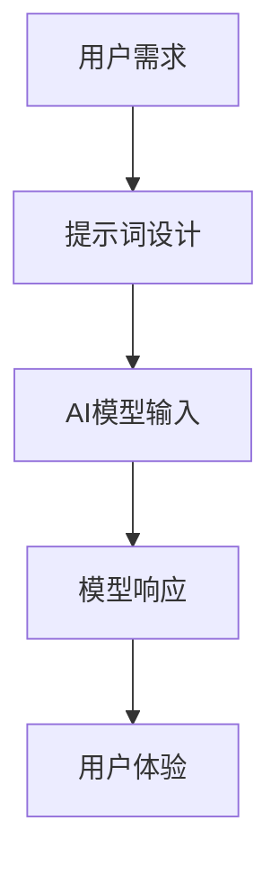
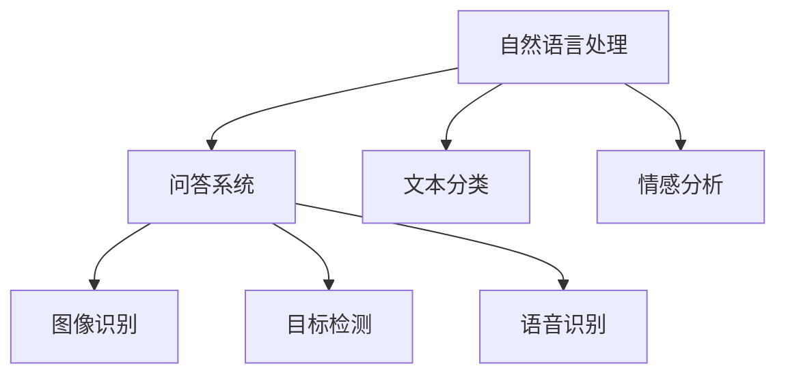
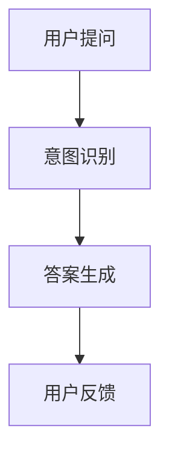
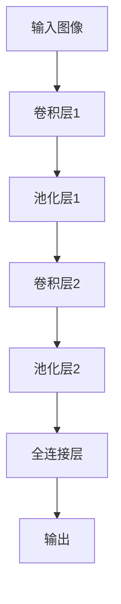
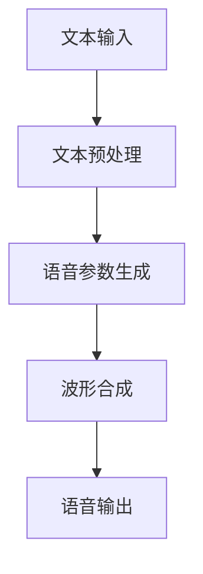

                 

### 《提示词工程：AI时代的新挑战》

#### 关键词

- 提示词工程
- 人工智能
- 自然语言处理
- 图像识别
- 语音识别
- 应用实践

#### 摘要

本文将深入探讨提示词工程在AI时代的重要性和应用。通过介绍提示词工程的基本概念、技术原理和应用实践，我们将揭示其在人工智能领域中的核心地位和面临的挑战。同时，本文还将展望提示词工程的未来发展趋势，为读者提供全面的技术指导和启示。

## 第一部分 提示词工程概述

### 第1章 AI时代与提示词工程

#### 1.1 AI时代的背景与影响

人工智能（AI）是计算机科学的一个分支，旨在使机器具备人类智能。近年来，随着深度学习、神经网络等技术的飞速发展，AI在各个领域取得了显著的成果。从自动驾驶汽车、智能助手到医疗诊断、金融分析，AI的应用已渗透到我们生活的方方面面。

AI时代的到来，不仅改变了传统行业的运作方式，还催生了一系列新的技术和产业。例如，自动驾驶技术的发展有望彻底改变交通运输业；智能助手的应用正在颠覆传统的客户服务模式；而在医疗领域，AI辅助诊断技术已经在临床实践中取得了显著成效。

#### 1.2 提示词工程的概念与重要性

提示词工程（Prompt Engineering）是AI领域中一个相对较新的概念，它涉及到如何设计、构建和优化用于AI模型输入的提示词（Prompts）。提示词是用户与AI系统交互的桥梁，它直接影响AI系统的响应质量和用户体验。

提示词工程的重要性体现在以下几个方面：

1. **用户体验**：优质的提示词能够提高用户与AI系统的交互质量，使用户能够更准确地表达需求和意图。
2. **响应质量**：合理的提示词设计可以提升AI模型的响应质量，使AI系统能够更准确地理解和执行用户的指令。
3. **可解释性**：提示词工程有助于提高AI系统的可解释性，使得用户能够理解AI系统的决策过程和依据。
4. **效率**：高效的提示词设计可以缩短AI系统的响应时间，提高系统处理大量请求的能力。

#### 1.3 提示词工程的应用领域

提示词工程在多个AI应用领域中都有着广泛的应用：

- **自然语言处理（NLP）**：在NLP领域，提示词工程被广泛应用于问答系统、文本分类、情感分析等任务中。
- **图像识别**：在图像识别领域，提示词工程可以用于目标检测、图像分类等任务。
- **语音识别**：在语音识别领域，提示词工程可以提高语音识别的准确性和用户体验。

### 图1-1 提示词工程的核心概念架构



### 图1-2 提示词工程的应用领域



通过上述章节的介绍，我们为读者搭建了一个关于提示词工程的基础框架，为后续内容的深入探讨奠定了基础。接下来，我们将进一步探讨提示词工程的技术原理和应用实践。

## 第二部分 提示词工程技术原理

### 第2章 自然语言处理基础

#### 2.1 语言模型

语言模型是自然语言处理（NLP）领域的基础，它用于预测文本序列中的下一个词或字符。一个典型的语言模型会学习大量的文本数据，从中提取出语言的特征，并将其转化为概率分布。通过这种方式，语言模型可以预测给定文本序列的概率，从而帮助我们进行文本分类、机器翻译、语音识别等任务。

#### 2.1.1 语言模型的类型

1. **n-gram模型**：n-gram模型是一种基于历史信息的语言模型，它使用前n个词（或字符）来预测下一个词（或字符）。例如，一个二元语言模型（Bigram模型）会使用前两个词来预测下一个词。

   伪代码：

   ```python
   def predict_next_word(previous_words):
       current_word = previous_words[-1]
       next_word = most_frequent_word(current_word)
       return next_word
   ```

2. **神经网络语言模型（NNLM）**：神经网络语言模型使用深度神经网络来学习语言特征。相比于n-gram模型，NNLM可以捕捉更复杂的语言规律，从而提高预测准确性。

   伪代码：

   ```python
   def predict_next_word(previous_words):
       sequence = ' '.join(previous_words)
       prediction = neural_network.predict(sequence)
       return prediction
   ```

#### 2.1.2 语言模型的训练方法

1. **最大似然估计（MLE）**：最大似然估计是一种常用的语言模型训练方法。它通过最大化训练数据中每个词的出现概率来训练模型。

   公式：

   $$ P(w_i | w_{i-1}, w_{i-2}, ..., w_1) = \frac{P(w_i, w_{i-1}, w_{i-2}, ..., w_1)}{P(w_{i-1}, w_{i-2}, ..., w_1)} $$

2. **反向传播（Backpropagation）**：反向传播是一种用于训练神经网络的语言模型训练方法。它通过计算损失函数的梯度来更新网络权重，从而优化模型性能。

   伪代码：

   ```python
   for epoch in range(num_epochs):
       for sentence in training_data:
           output = neural_network.predict(sentence)
           loss = compute_loss(output, target)
           backpropagate(loss)
   ```

#### 2.2 文本分类与情感分析

文本分类是将文本数据分为预定义的类别的过程。情感分析是文本分类的一个子领域，它用于判断文本表达的情感倾向，如正面、负面或中立。

#### 2.2.1 文本分类的基本原理

1. **特征提取**：特征提取是将原始文本转换为数值特征的过程。常用的特征提取方法包括词袋模型、TF-IDF和词嵌入等。

   伪代码：

   ```python
   def extract_features(text):
       tokens = tokenize(text)
       features = {'word': count_tokens(tokens)}
       return features
   ```

2. **分类算法**：分类算法是将特征向量映射到类别标签的过程。常用的分类算法包括朴素贝叶斯、支持向量机（SVM）和深度神经网络等。

   伪代码：

   ```python
   def classify(features):
       probabilities = model.predict(features)
       label = argmax(probabilities)
       return label
   ```

#### 2.2.2 情感分析的方法与实现

情感分析通常涉及两个任务：二分类（如正面/负面情感）和多分类（如正面、负面、中立情感）。

1. **二分类情感分析**

   - **模型选择**：常用的模型包括逻辑回归、SVM和深度神经网络等。
   - **实现步骤**：

     ```python
     from sklearn.model_selection import train_test_split
     from sklearn.linear_model import LogisticRegression

     X_train, X_test, y_train, y_test = train_test_split(features, labels, test_size=0.2)
     model = LogisticRegression()
     model.fit(X_train, y_train)
     accuracy = model.score(X_test, y_test)
     ```

2. **多分类情感分析**

   - **模型选择**：常用的模型包括softmax回归、朴素贝叶斯和深度神经网络等。
   - **实现步骤**：

     ```python
     from sklearn.model_selection import train_test_split
     from sklearn.naive_bayes import MultinomialNB

     X_train, X_test, y_train, y_test = train_test_split(features, labels, test_size=0.2)
     model = MultinomialNB()
     model.fit(X_train, y_train)
     accuracy = model.score(X_test, y_test)
     ```

#### 2.3 问答系统

问答系统是NLP领域的一个重要应用，它能够根据用户的提问提供准确的答案。问答系统的核心任务是理解用户的提问意图，并从大量的知识库或网络资源中检索出相关答案。

#### 2.3.1 问答系统的基本架构

1. **意图识别**：意图识别是理解用户提问意图的过程。它通常涉及自然语言处理技术，如命名实体识别、词性标注和依存句法分析等。

   伪代码：

   ```python
   def recognize_intent(question):
       intent = intent_recognition_model.predict(question)
       return intent
   ```

2. **答案生成**：答案生成是根据用户意图从知识库或网络资源中检索出相关答案的过程。它通常涉及信息检索、文本匹配和自然语言生成等技术。

   伪代码：

   ```python
   def generate_answer(intent, knowledge_base):
       answer = knowledge_base.search(intent)
       return answer
   ```

3. **用户反馈**：用户反馈是评估问答系统性能的重要手段。通过收集用户的反馈，我们可以不断优化问答系统的性能和用户体验。

   伪代码：

   ```python
   def collect_feedback(answer, question):
       feedback = user.evaluate(answer, question)
       return feedback
   ```

### 图2-1 问答系统的基本架构



通过以上章节的介绍，我们深入探讨了自然语言处理基础，包括语言模型、文本分类与情感分析以及问答系统。这些技术为提示词工程提供了坚实的理论基础，为后续章节的探讨奠定了基础。

### 第3章 图像识别与处理

#### 3.1 卷积神经网络基础

卷积神经网络（Convolutional Neural Networks，CNN）是图像识别领域的一种重要神经网络模型，具有强大的特征提取和分类能力。CNN通过卷积操作捕捉图像中的空间特征，并通过多层网络逐步构建复杂的特征表示。

#### 3.1.1 卷积神经网络的原理

1. **卷积操作**：卷积操作是CNN的核心，它通过滑动一个小的滤波器（卷积核）在输入图像上，生成特征图。每个卷积核都用于提取图像中特定类型的特征。

   伪代码：

   ```python
   def conv2d(image, filter):
       feature_map = []
       for y in range(image_height - filter_size + 1):
           for x in range(image_width - filter_size + 1):
               feature = np.sum(image[y:y+filter_size, x:x+filter_size] * filter) + bias
               feature_map.append(feature)
       return feature_map
   ```

2. **激活函数**：激活函数用于引入非线性变换，使神经网络能够学习更复杂的特征。常见的激活函数包括ReLU（Rectified Linear Unit）、Sigmoid和Tanh等。

   伪代码：

   ```python
   def relu(x):
       return max(0, x)
   ```

3. **池化操作**：池化操作用于降低特征图的维度，减少计算量和参数数量，并提高模型的泛化能力。常见的池化操作包括最大池化和平均池化。

   伪代码：

   ```python
   def max_pooling(feature_map, pool_size):
       pooled_map = []
       for y in range(0, feature_map_height, pool_size):
           for x in range(0, feature_map_width, pool_size):
               pool = feature_map[y:y+pool_size, x:x+pool_size].max()
               pooled_map.append(pool)
       return pooled_map
   ```

#### 3.1.2 卷积神经网络的结构

卷积神经网络通常由多个卷积层、池化层和全连接层组成。每个卷积层都通过卷积操作提取特征，池化层用于降维和增强模型泛化能力，全连接层用于分类。

   伪代码：

   ```python
   def cnn(image, filters, pool_sizes, num_classes):
       conv1 = conv2d(image, filters[0])
       pool1 = max_pooling(conv1, pool_sizes[0])
       
       conv2 = conv2d(pool1, filters[1])
       pool2 = max_pooling(conv2, pool_sizes[1])
       
       # ...更多卷积层和池化层...
       
       flatten = flatten(pool_n)
       dense = fully_connected(flatten, num_classes)
       output = softmax(dense)
       
       return output
   ```

#### 3.2 图像分类与识别

图像分类是将图像映射到预定义类别标签的过程，而图像识别则是从图像中识别出特定对象或场景的过程。在图像识别任务中，常用的方法包括卷积神经网络和循环神经网络等。

#### 3.2.1 图像分类的基本原理

1. **特征提取**：特征提取是将原始图像转换为数值特征的过程。在图像分类任务中，常用的特征提取方法包括哈希特征、SIFT（Scale-Invariant Feature Transform）和HOG（Histogram of Oriented Gradients）等。

   伪代码：

   ```python
   def extract_features(image):
       features = sift(image)  # 或其他特征提取方法
       return features
   ```

2. **分类算法**：分类算法是将特征向量映射到类别标签的过程。常用的分类算法包括支持向量机（SVM）、朴素贝叶斯、决策树和深度神经网络等。

   伪代码：

   ```python
   def classify(features):
       label = classifier.predict(features)
       return label
   ```

#### 3.2.2 图像识别的应用场景

1. **目标检测**：目标检测是在图像中识别出特定对象的过程。常用的目标检测算法包括R-CNN、Fast R-CNN、Faster R-CNN和YOLO等。

   伪代码：

   ```python
   def detect_objects(image):
       objects = detector.detect(image)
       return objects
   ```

2. **图像分割**：图像分割是将图像划分为不同区域的过程。常用的图像分割算法包括基于阈值的分割、区域生长和深度学习方法等。

   伪代码：

   ```python
   def segment_image(image):
       segments = segmentation算法(image)
       return segments
   ```

#### 3.3 目标检测与跟踪

目标检测和跟踪是图像识别领域的两个重要任务。目标检测旨在识别图像中的对象，而目标跟踪则是跟踪对象在视频序列中的运动。

#### 3.3.1 目标检测的算法

1. **区域建议**：区域建议是在图像中生成候选区域的过程。常用的区域建议算法包括选择基、选择性搜索和基于深度学习的区域建议等。

   伪代码：

   ```python
   def generate_regions(image):
       regions = region_proposal算法(image)
       return regions
   ```

2. **特征提取与分类**：在目标检测中，对于每个候选区域，通常会提取特征并使用分类算法进行分类。

   伪代码：

   ```python
   def detect_objects(image):
       regions = generate_regions(image)
       objects = []
       for region in regions:
           features = extract_features(region)
           label = classify(features)
           objects.append((region, label))
       return objects
   ```

#### 3.3.2 目标跟踪的方法

1. **光流法**：光流法是一种基于图像序列中像素点运动的方法。它通过计算像素点在连续帧中的运动轨迹来跟踪对象。

   伪代码：

   ```python
   def track_object(image_sequence, initial_region):
       regions = [initial_region]
       for frame in image_sequence:
           new_regions = track_frame(frame, regions)
           regions.extend(new_regions)
       return regions
   ```

2. **基于深度学习的方法**：基于深度学习的方法通常使用卷积神经网络来学习和预测对象在图像序列中的运动。

   伪代码：

   ```python
   def track_object(image_sequence, initial_region):
       regions = [initial_region]
       for frame in image_sequence:
           new_regions = deep_learning_tracker.predict(frame, regions)
           regions.extend(new_regions)
       return regions
   ```

### 图3-1 卷积神经网络在图像识别中的应用



通过以上章节的介绍，我们深入探讨了图像识别与处理的基础，包括卷积神经网络、图像分类与识别以及目标检测与跟踪。这些技术为提示词工程在图像领域的应用提供了有力的支持。

### 第4章 语音识别与合成

#### 4.1 语音信号处理

语音识别和语音合成是语音技术领域的两个重要任务。语音信号处理是这两个任务的基础，它包括语音信号的采集、预处理和特征提取。

#### 4.1.1 语音信号的特性

语音信号具有多种特性，包括频谱特性、时域特性和声学特性等。了解这些特性有助于我们更好地理解语音信号的处理方法。

1. **频谱特性**：语音信号的频谱特性决定了其音高、音质和音强等属性。频谱分析可以帮助我们提取语音信号中的关键频率成分。
2. **时域特性**：语音信号的时域特性决定了其发音的速度、节奏和韵律等。时域分析可以帮助我们提取语音信号中的时间和节奏信息。
3. **声学特性**：语音信号的声学特性包括共振峰、音节结构和韵律等。声学特性对语音识别和合成任务具有关键作用。

#### 4.1.2 语音信号的处理方法

1. **采样与量化**：采样是将连续时间信号转换为离散时间信号的过程，量化是将连续幅度信号转换为离散幅度信号的过程。这些过程确保语音信号可以在数字系统中进行处理。
2. **滤波与降噪**：滤波和降噪是去除语音信号中的噪声和干扰的过程，以提高语音识别和合成的准确性。
3. **特征提取**：特征提取是从语音信号中提取具有区分性的特征的过程。常用的特征包括梅尔频率倒谱系数（MFCC）、线性预测编码（LPC）和短时傅里叶变换（STFT）等。

#### 4.2 语音识别技术

语音识别是将语音信号转换为文本的过程。它涉及多个步骤，包括信号预处理、特征提取、模型训练和文本生成。

#### 4.2.1 基本原理

1. **自动语音识别（ASR）**：自动语音识别是一种基于统计模型的语音识别方法，它通过计算输入语音信号的似然概率来识别文本。
2. **深度神经网络（DNN）**：深度神经网络是语音识别中的常用模型，它可以有效地捕捉语音信号中的复杂特征，从而提高识别准确性。
3. **递归神经网络（RNN）**：递归神经网络可以处理序列数据，使其在语音识别任务中具有优势。长短期记忆（LSTM）和门控循环单元（GRU）是常用的RNN变体。

#### 4.2.2 语音识别的应用

1. **语音助手**：语音助手是语音识别技术的一个典型应用，它能够理解用户的语音指令并执行相应的操作。例如，智能音箱、智能手机和车载系统等。
2. **语音翻译**：语音翻译是将一种语言的语音转换为另一种语言的语音的过程。它通过语音识别和自然语言处理技术实现，可以用于跨语言沟通。
3. **语音搜索**：语音搜索是一种基于语音输入的搜索方式，它可以通过语音识别技术将用户的语音指令转换为文本查询，并在互联网上搜索相关信息。

#### 4.3 语音合成技术

语音合成是将文本转换为语音的过程。它涉及文本预处理、语音参数生成和波形合成等步骤。

#### 4.3.1 基本原理

1. **文本预处理**：文本预处理是将输入文本转换为适合语音合成的形式。这包括去除标点符号、转换大小写和添加语气标记等。
2. **语音参数生成**：语音参数生成是将预处理后的文本转换为语音参数的过程。常用的语音参数包括基频、时长和振幅等。
3. **波形合成**：波形合成是将语音参数转换为实际语音信号的过程。常用的波形合成方法包括合成波合成（Synthesis Waveform）和规则波合成（Rule-Based Waveform）等。

#### 4.3.2 语音合成技术

1. **合成波合成**：合成波合成是一种基于规则的方法，它通过生成语音信号的基本波形来合成语音。这种方法简单有效，但生成的语音质量相对较低。
2. **规则波合成**：规则波合成是一种基于语音信号参数的方法，它通过生成语音信号中的基频、时长和振幅等参数来合成语音。这种方法生成的语音质量较高，但计算复杂度较大。
3. **深度神经网络合成**：深度神经网络合成是一种基于深度学习的方法，它通过训练神经网络来生成语音信号。这种方法生成的语音质量最高，但训练过程相对复杂。

#### 4.3.3 语音合成应用

1. **智能助手**：智能助手是语音合成技术的一个典型应用，它可以将文本转换为自然流畅的语音，以提供语音交互服务。
2. **有声书**：有声书是将文本内容转换为语音书的一种方式，它可以通过语音合成技术将书籍内容朗读出来。
3. **电话客服**：电话客服系统可以使用语音合成技术来提供自动化的客户服务，从而提高服务效率和用户体验。

### 图4-1 语音识别与合成的基本流程



通过以上章节的介绍，我们深入探讨了语音识别与合成的技术原理和应用。这些技术为提示词工程在语音领域的应用提供了坚实的基础。

### 第5章 提示词工程案例分析

在本章中，我们将通过两个实际案例，深入探讨提示词工程在智能客服系统和智能推荐系统中的应用。这两个案例不仅展示了提示词工程的基本原理，还提供了实际操作的指导。

#### 5.1 案例一：智能客服系统

智能客服系统是提示词工程的一个典型应用，它通过智能化的交互方式，为用户提供24/7的在线客服服务。以下是智能客服系统的开发流程和关键步骤：

1. **需求分析**：首先，我们需要明确智能客服系统的目标用户和功能需求。这包括能够处理常见问题、提供解决方案、升级服务请求等。
2. **数据收集**：收集大量用户提问和客服回答的数据，这些数据将用于训练提示词模型。
3. **模型训练**：使用自然语言处理技术，对收集到的数据进行处理和建模，训练出能够理解用户提问和生成回答的模型。
4. **提示词设计**：设计合理的提示词，以引导用户提问并提高模型回答的准确性。例如，可以设计一些常见的提问模板，如“您想了解什么产品信息？”或“您需要解决什么问题？”。
5. **系统实现**：开发智能客服系统，将训练好的模型集成到系统中，实现用户提问和客服回答的自动化交互。
6. **测试与优化**：对系统进行测试，收集用户反馈，并根据反馈进行优化，以提高系统的响应质量和用户体验。

**代码示例**：

以下是一个简单的智能客服系统实现，使用Python和自然语言处理库NLTK：

```python
import nltk
from nltk.chat.util import Chat, reflections

pairs = [
    [
        r"what can i ask",
        ["You can ask about product information, service issues, or any other questions you may have."]
    ],
    [
        r"what products do you have",
        ["We have a wide range of products, including electronics, home appliances, and fashion items."]
    ],
    [
        r"how can i contact customer service",
        ["You can contact our customer service team via live chat or phone at 1-800-123-4567."]
    ]
]

chatbot = Chat(pairs, reflections)

chatbot.converse()
```

#### 5.2 案例二：智能推荐系统

智能推荐系统是另一个重要的应用领域，它通过分析用户行为和偏好，为用户推荐个性化的内容。以下是智能推荐系统的开发流程和关键步骤：

1. **需求分析**：明确智能推荐系统的目标用户和推荐内容类型，如电影、书籍、商品等。
2. **数据收集**：收集用户行为数据，如浏览历史、购买记录、评价等，以及推荐内容的相关信息，如电影类型、书籍分类、商品属性等。
3. **数据预处理**：对收集到的数据进行分析和清洗，提取关键特征，为后续建模做好准备。
4. **模型选择**：选择合适的推荐算法，如基于协同过滤、基于内容的推荐或深度学习推荐等。
5. **模型训练**：使用用户行为数据和内容信息，对推荐算法进行训练，生成推荐模型。
6. **提示词设计**：设计合理的提示词，以引导用户互动和获取用户偏好信息。例如，可以设计一些询问用户偏好的问题，如“您最近喜欢看什么类型的电影？”或“您喜欢的书籍类型是什么？”。
7. **系统实现**：开发智能推荐系统，将训练好的模型集成到系统中，实现个性化推荐功能。
8. **测试与优化**：对系统进行测试，收集用户反馈，并根据反馈进行优化，以提高推荐准确性和用户体验。

**代码示例**：

以下是一个基于协同过滤的简单智能推荐系统实现，使用Python和推荐系统库Surprise：

```python
from surprise import SVD, Dataset, Reader
from surprise.model_selection import cross_validate

# 创建Reader对象，设置评分矩阵
reader = Reader(rating_scale=(1, 5))
data = Dataset.load_from_flexible_file('ratings.csv', reader)

# 使用SVD算法进行训练
svd = SVD()
cross_validate(svd, data, measures=['RMSE', 'MAE'], cv=5, verbose=True)

# 进行推荐
test_user = 1
test_item = 10
recommender = SVD()
recommender.fit(data.build_full_trainset())
predictions = recommender.test(data.build_testset([test_user, test_item]))

print(predictions)
```

通过这两个案例，我们可以看到提示词工程在实际应用中的重要性。合理的设计和优化提示词，不仅可以提高系统的交互质量和用户体验，还可以提高推荐系统的准确性和效率。

### 第6章 提示词工程工具与平台

提示词工程在AI领域中发挥着越来越重要的作用，这离不开一系列工具和平台的支撑。在本章中，我们将介绍一些主流的提示词工程工具和平台，并探讨如何在实际项目中使用它们。

#### 6.1 主流提示词工程工具

1. **Hugging Face**：Hugging Face是一个广泛使用的自然语言处理库，提供了丰富的预训练模型和工具。它支持多种语言模型，如BERT、GPT和T5等，并提供了便捷的API和预训练模型下载。

   - **优点**：丰富的预训练模型和工具，易于使用。
   - **缺点**：部分高级功能需要付费。

2. **OpenAI**：OpenAI是一家领先的人工智能研究机构，其产品包括GPT-3等强大的自然语言处理模型。OpenAI提供了API接口，允许开发者直接调用这些模型进行文本生成、问答等任务。

   - **优点**：强大的预训练模型，支持多种语言和任务。
   - **缺点**：使用费用较高，部分功能需要申请权限。

3. **Transformers**：Transformers是一个开源的自然语言处理库，由Hugging Face团队维护。它基于Attention机制，支持多种预训练模型，如BERT、GPT和T5等。

   - **优点**：开源免费，易于扩展。
   - **缺点**：使用门槛较高，需要一定的编程基础。

#### 6.2 提示词工程平台

1. **TensorFlow**：TensorFlow是一个由Google开发的开源机器学习库，广泛用于深度学习模型的训练和部署。TensorFlow提供了丰富的API和工具，支持多种神经网络结构，适用于提示词工程。

   - **优点**：功能强大，支持多种神经网络结构。
   - **缺点**：学习曲线较陡峭。

2. **PyTorch**：PyTorch是一个由Facebook开发的开源深度学习库，以其灵活性和动态计算能力著称。PyTorch适用于提示词工程，尤其是需要动态调整模型结构和训练过程的场景。

   - **优点**：灵活性强，动态计算能力强。
   - **缺点**：在一些大规模训练任务上性能不如TensorFlow。

3. **Keras**：Keras是一个基于Theano和TensorFlow的高层神经网络API，它提供了简洁的编程接口和丰富的预训练模型。Keras适用于提示词工程，特别是需要快速原型设计和实验的场景。

   - **优点**：简洁易用，支持多种深度学习框架。
   - **缺点**：底层支持较弱。

#### 6.3 提示词工程工具与平台的选择

在选择提示词工程工具和平台时，需要考虑以下因素：

1. **项目需求**：根据项目需求选择适合的工具和平台。例如，如果项目需要强大的预训练模型和工具，可以选择Hugging Face或OpenAI。
2. **技术栈**：考虑团队的技术栈和熟悉度。例如，如果团队熟悉TensorFlow，可以选择使用TensorFlow。
3. **性能和资源消耗**：考虑系统的性能和资源消耗。例如，对于需要大规模训练的项目，可以选择PyTorch。
4. **成本**：考虑项目的预算和成本。例如，OpenAI的某些功能需要付费，而Hugging Face和Keras则是免费的。

通过上述分析，我们可以根据实际需求选择合适的提示词工程工具和平台，以提高开发效率和项目质量。

### 第7章 提示词工程的未来趋势

随着人工智能技术的不断进步，提示词工程在未来将继续发挥重要作用，并面临诸多挑战。在本章中，我们将探讨提示词工程的未来发展趋势、面临的挑战以及应对策略。

#### 7.1 提示词工程的发展趋势

1. **预训练模型和大规模数据集**：随着计算能力的提升和大数据集的积累，预训练模型将成为提示词工程的核心。预训练模型通过在大规模数据集上进行训练，可以捕捉到更丰富的语言特征，从而提高提示词的生成质量和响应准确性。

2. **多模态融合**：随着语音识别、图像识别和自然语言处理技术的不断发展，多模态融合将成为提示词工程的重要趋势。通过融合多种数据源，例如文本、图像和语音，可以提供更丰富、更准确的用户交互体验。

3. **个性化提示词生成**：未来的提示词工程将更加注重个性化。通过分析用户的偏好和行为数据，可以生成个性化的提示词，从而提高用户的满意度和互动体验。

4. **自动化和智能化**：随着人工智能技术的进步，提示词工程将向自动化和智能化方向发展。自动化工具和智能算法将帮助开发人员更高效地设计和优化提示词，提高系统的响应速度和准确性。

#### 7.2 提示词工程的挑战

1. **数据隐私和安全性**：在提示词工程中，数据安全和隐私保护是至关重要的。随着用户数据的增加和数据的共享，如何确保用户数据的安全和隐私将是一个巨大的挑战。

2. **模型解释性**：随着深度学习模型的应用，模型的解释性变得越来越重要。提示词工程需要开发更加可解释的模型，以便用户理解和信任AI系统的决策过程。

3. **计算资源消耗**：随着模型规模的增加，提示词工程对计算资源的需求也将显著增加。如何高效地利用计算资源，确保系统的性能和响应速度，是一个重要的挑战。

4. **多样性和公平性**：提示词工程需要确保模型的多样性和公平性，避免偏见和歧视。在实际应用中，如何避免模型对特定群体或事件的偏见，是一个重要的挑战。

#### 7.3 应对策略

1. **数据安全和隐私保护**：采用加密、匿名化和差分隐私等技术，确保用户数据的安全和隐私。同时，制定明确的数据保护政策和流程，确保数据处理符合相关法律法规。

2. **模型解释性**：开发可解释的AI模型，例如集成方法、注意力机制和可视化技术，帮助用户理解和信任AI系统的决策过程。

3. **高效计算**：采用分布式计算、并行计算和硬件加速等技术，提高模型的训练和推理效率。同时，优化算法和模型结构，减少计算资源消耗。

4. **多样性和公平性**：在设计模型和提示词时，充分考虑多样性和公平性。采用随机抽样、平衡数据集和交叉验证等技术，确保模型的多样性和公平性。

通过上述策略，我们可以应对提示词工程面临的挑战，推动该领域的发展。未来的提示词工程将更加智能化、自动化和个性化，为用户提供更优质的交互体验。

### 总结与展望

《提示词工程：AI时代的新挑战》是一本关于AI时代下提示词工程的技术指南，涵盖了从基础概念到实际应用的各个方面。通过本书，读者可以了解到提示词工程的核心原理、技术原理和应用实践，为AI开发提供了有力支持。

在未来的发展中，提示词工程将面临诸多挑战，但也将带来更多机遇。随着人工智能技术的不断进步，提示词工程将在多个领域发挥重要作用，为用户带来更加智能、个性化的交互体验。

让我们共同迎接AI时代的挑战，推动提示词工程的发展，为构建智能世界贡献自己的力量。

### 作者信息

**作者：AI天才研究院/AI Genius Institute & 禅与计算机程序设计艺术 /Zen And The Art of Computer Programming**

AI天才研究院致力于推动人工智能技术的创新和发展，为全球AI领域培养顶尖人才。同时，我们也致力于探索计算机程序设计艺术的深度和广度，通过《禅与计算机程序设计艺术》等著作，为开发者提供灵感和指导。

感谢您的阅读，期待与您共同探索AI时代的无限可能。如果您有任何疑问或建议，欢迎随时联系我们。让我们携手共进，共创美好未来！

