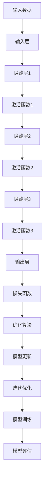
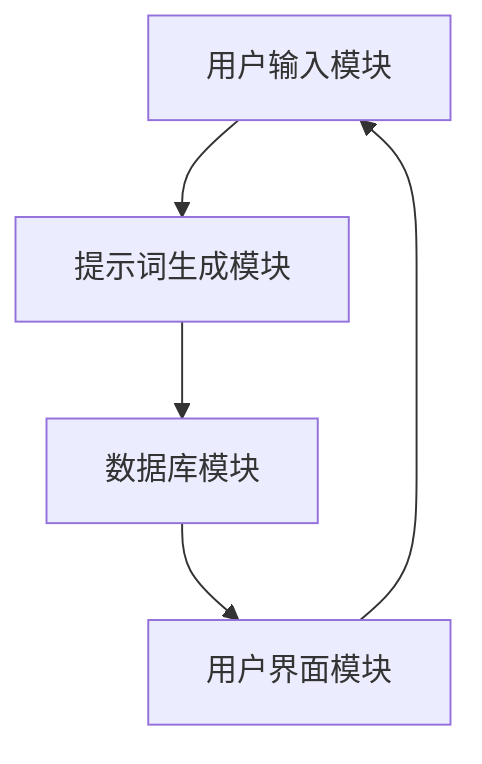

                 

### 文章标题

# 提示词工程：AI时代的新挑战与新方向

> 关键词：提示词工程、AI时代、挑战、新方向、核心概念、算法原理、应用实践

> 摘要：随着人工智能（AI）技术的迅速发展，提示词工程成为AI时代的新挑战与新方向。本文首先介绍了AI时代的背景与核心概念，包括机器学习、神经网络、深度学习等基础知识。然后，详细阐述了提示词工程的原理与实践，包括提示词的定义、生成算法、优化策略等。最后，分析了提示词工程的发展趋势与实际应用，提供了实用的开发指南与最佳实践，为读者深入理解AI时代的新挑战与新方向提供了有力支持。

---

## 第一部分：AI时代的背景与核心概念

### 第1章：AI时代的背景

#### 1.1 AI时代的新挑战

随着人工智能（AI）技术的不断突破，我们正逐步进入一个全新的时代。这个时代不仅带来了前所未有的技术革新，也提出了诸多新的挑战。首先，数据安全问题变得尤为重要。AI系统高度依赖大量数据来训练模型，而这些数据往往涉及个人隐私和商业机密。如何在保证数据安全的前提下，充分利用这些数据成为AI时代的一大挑战。

其次，AI系统的透明性和可解释性也备受关注。传统的AI系统，如深度神经网络，通常被视为“黑箱”，其内部运作机制难以理解。然而，在许多实际应用场景中，用户和决策者需要了解AI系统的决策过程和依据，以确保其公正性和可靠性。因此，提高AI系统的透明性和可解释性成为AI时代的一个重要挑战。

此外，AI技术的伦理问题也日益凸显。随着AI在各个领域的应用逐渐深入，其可能带来的道德风险和负面影响也引起了广泛关注。例如，AI在招聘、贷款、医疗等领域的决策过程中，是否存在歧视现象？如何确保AI系统的决策符合道德规范，成为AI时代亟需解决的新挑战。

#### 1.2 AI时代的新方向

面对这些新挑战，AI技术也在不断探索新的发展方向。首先，增强学习（Reinforcement Learning）成为AI研究的重要方向之一。增强学习通过让智能体在与环境交互的过程中不断调整策略，以实现最佳决策。这种学习方式不仅在游戏领域取得了显著成果，还在自动驾驶、机器人控制等实际应用中展现出巨大潜力。

其次，联邦学习（Federated Learning）成为解决数据安全问题的有效途径。联邦学习通过将数据分散存储在多个设备或服务器上，只传输模型参数而非原始数据，从而实现了在保护用户隐私的前提下，进行大规模的机器学习训练。这一方向在移动设备、物联网等领域具有广泛的应用前景。

此外，可解释AI（Explainable AI，XAI）也成为AI研究的重要目标。可解释AI旨在提高AI系统的透明性和可解释性，使其决策过程和依据能够被用户和决策者理解。通过开发可解释的算法和工具，我们可以更好地应对AI系统的伦理问题，提高其在实际应用中的可信度和接受度。

#### 1.3 AI的核心概念与架构

为了深入理解AI时代的新挑战和新方向，我们需要掌握一些核心概念和基本架构。以下是对这些核心概念的简要介绍：

1. **机器学习（Machine Learning）**：机器学习是AI的核心技术之一，它通过从数据中自动发现规律和模式，实现智能决策。根据学习方式的不同，机器学习可分为监督学习、无监督学习和强化学习。

2. **神经网络（Neural Networks）**：神经网络是一种模拟生物神经元之间相互连接的计算模型。通过层层传递输入信息，神经网络能够自动提取特征并进行分类或回归。深度学习是神经网络的一种扩展，通过堆叠多层神经网络，实现了更为复杂和高效的特征提取。

3. **深度学习（Deep Learning）**：深度学习是机器学习的一个重要分支，通过多层神经网络结构，实现了在语音识别、图像分类、自然语言处理等领域的突破性进展。深度学习的核心在于“深度”（Depth），即通过增加网络层数，提高模型的表达能力。

4. **数据挖掘（Data Mining）**：数据挖掘是从大量数据中发现潜在模式和知识的过程。通过关联规则学习、聚类分析、分类分析等方法，数据挖掘能够帮助我们从海量数据中提取有价值的信息。

5. **AI架构（AI Architecture）**：AI架构是指用于构建和部署AI系统的软件和硬件基础设施。常见的AI架构包括深度学习框架（如TensorFlow、PyTorch）、云计算平台（如AWS、Azure）和专用硬件（如GPU、TPU）等。

通过以上对AI时代背景和核心概念的介绍，我们为后续章节的深入探讨奠定了基础。在下一章中，我们将进一步探讨AI的基本概念和技术发展，为理解提示词工程的原理与实践提供必要的前提。

### 第2章：AI的基本概念

#### 2.1 机器学习与深度学习

机器学习和深度学习是人工智能（AI）领域的两个核心概念。它们之间的关系可以比作整体与部分，或者母体与子集。机器学习是AI的基础，涵盖了各种方法和技术，包括监督学习、无监督学习和强化学习。而深度学习则是机器学习的一个分支，专注于通过多层神经网络来模拟人脑的神经元连接和功能。

##### 机器学习

机器学习（Machine Learning，ML）是一种利用数据、算法和统计模型，使计算机系统能够从数据中学习并做出决策或预测的技术。机器学习的关键在于“学习”，即通过训练模型来捕捉数据中的规律和模式，然后利用这些规律来解决具体问题。

机器学习可以分为以下几类：

1. **监督学习（Supervised Learning）**：在监督学习中，训练数据集包括输入和相应的输出标签。模型通过学习这些输入输出对，能够在新的数据上做出预测。常见的监督学习算法包括线性回归、逻辑回归、支持向量机（SVM）和神经网络等。

2. **无监督学习（Unsupervised Learning）**：无监督学习不需要输出标签，主要关注如何从未标记的数据中自动发现结构和模式。常见的无监督学习算法包括聚类、降维（如PCA）和关联规则学习等。

3. **强化学习（Reinforcement Learning）**：强化学习通过智能体与环境的交互，不断调整策略以实现最佳决策。智能体在每一步根据当前状态和奖励信号，更新策略以最大化长期奖励。常见的强化学习算法包括Q学习、SARSA和深度强化学习（DRL）等。

##### 深度学习

深度学习（Deep Learning，DL）是机器学习的一个重要分支，主要基于多层神经网络（Deep Neural Networks，DNN）进行学习。与传统的单层神经网络相比，深度学习通过增加网络层数，提高了模型的表达能力，使其能够自动提取更为复杂和抽象的特征。

深度学习的主要特点包括：

1. **多层网络结构**：深度学习模型通常由多层神经元组成，每一层都能提取不同级别的特征。输入经过多层网络的层层传递和变换，最终输出预测结果。

2. **自动特征提取**：与传统的机器学习方法不同，深度学习模型能够自动从数据中学习并提取特征。这使得深度学习在处理复杂问题时，能够避免人工特征工程，提高模型的泛化能力。

3. **大规模并行计算**：深度学习模型的训练需要大量计算资源。通过利用图形处理器（GPU）和 Tensor Processing Units（TPU）等专用硬件，深度学习能够在短时间内完成大规模训练任务。

深度学习在许多领域都取得了显著成果，例如：

- **图像识别**：通过卷积神经网络（CNN），深度学习在图像分类和物体检测等任务中取得了优异的性能。
- **自然语言处理**：深度学习模型，如循环神经网络（RNN）和变换器（Transformer），在语言建模、机器翻译和文本分类等方面表现出色。
- **语音识别**：结合深度神经网络和循环神经网络，深度学习在语音识别领域取得了突破性进展。
- **推荐系统**：深度学习能够从用户行为和物品属性中提取有效特征，为推荐系统提供精准的推荐结果。

#### 2.2 神经网络与激活函数

神经网络（Neural Networks，NN）是深度学习的基础构件。它由一系列神经元组成，通过相互连接和传递信息，实现数据的处理和分类。每个神经元都包含一个输入层、一个输出层和一个激活函数。

##### 神经元结构

一个简单的神经元可以看作是一个线性函数，接受多个输入，并通过权重（weights）进行加权求和，最后加上一个偏置项（bias），得到一个中间结果。这个中间结果通过激活函数（activation function）进行非线性变换，得到最终的输出。

\[ z = \sum_{i} w_i x_i + b \]
\[ a = f(z) \]

其中，\( z \) 是中间结果，\( w_i \) 是第 \( i \) 个输入的权重，\( x_i \) 是第 \( i \) 个输入，\( b \) 是偏置项，\( a \) 是输出。

##### 激活函数

激活函数是神经网络中的一个关键组件，用于引入非线性特性。常见的激活函数包括：

1. **Sigmoid函数**：Sigmoid函数是一种常用的激活函数，其表达式为：

\[ f(x) = \frac{1}{1 + e^{-x}} \]

Sigmoid函数的输出范围在 0 到 1 之间，可以看作是概率分布。然而，Sigmoid函数在训练过程中存在梯度消失的问题，即当输入值较大时，梯度接近于0，导致训练过程变得缓慢。

2. **ReLU函数**：ReLU（Rectified Linear Unit）函数是一种简单的线性激活函数，其表达式为：

\[ f(x) = \max(0, x) \]

ReLU函数在训练过程中表现出良好的性能，可以有效避免梯度消失问题。此外，ReLU函数的计算效率较高，使其在深度学习模型中得到广泛应用。

3. **Tanh函数**：Tanh函数是另一种常用的激活函数，其表达式为：

\[ f(x) = \frac{2}{1 + e^{-2x}} - 1 \]

Tanh函数的输出范围在 -1 到 1 之间，可以看作是 Sigmoid 函数的扩展。与 Sigmoid 函数类似，Tanh 函数在训练过程中也存在梯度消失问题。

4. **Leaky ReLU函数**：Leaky ReLU函数是ReLU函数的改进版本，其表达式为：

\[ f(x) = \max(0.01x, x) \]

Leaky ReLU函数通过引入一个较小的正值斜率（0.01），避免了ReLU函数在输入为负值时梯度为0的问题，从而提高了模型的训练稳定性。

##### 神经网络模型

一个典型的神经网络模型通常包括以下几个层次：

1. **输入层（Input Layer）**：输入层接收外部数据，并将其传递给下一层。

2. **隐藏层（Hidden Layers）**：隐藏层是神经网络的核心部分，通过多层堆叠，实现数据的特征提取和变换。

3. **输出层（Output Layer）**：输出层负责将处理后的数据转化为最终的预测结果或分类标签。

4. **损失函数（Loss Function）**：损失函数用于衡量模型预测结果与真实标签之间的差距。常见的损失函数包括均方误差（MSE）、交叉熵损失（Cross Entropy Loss）和Hinge损失等。

5. **优化算法（Optimization Algorithm）**：优化算法用于调整模型参数，以最小化损失函数。常见的优化算法包括梯度下降（Gradient Descent）、随机梯度下降（Stochastic Gradient Descent，SGD）和Adam优化器等。

通过以上对机器学习和深度学习的介绍，我们为理解提示词工程的原理与实践奠定了基础。在下一章中，我们将深入探讨AI的发展历程，了解AI技术是如何从理论走向实际应用的。

#### 2.3 神经网络与激活函数的关系架构

为了更好地理解神经网络与激活函数之间的关系，我们可以通过Mermaid流程图来展示它们的核心架构和互动机制。



在上面的流程图中，我们首先将输入数据传递给输入层（B）。然后，数据经过隐藏层1（C）、隐藏层2（E）和隐藏层3（G），并在每个隐藏层之后应用相应的激活函数（D、F、H）。最终，数据通过输出层（I）生成预测结果。在预测结果与真实标签之间，我们使用损失函数（J）来计算误差。接着，优化算法（K）根据损失函数的梯度，调整模型参数（L），并重复迭代优化过程（M），直到达到预设的训练目标（N）。

这个流程图清晰地展示了神经网络中各部分之间的交互关系，为理解神经网络的工作原理提供了直观的图示。

#### 2.4 核心算法原理讲解

为了深入理解神经网络的核心算法原理，我们将通过伪代码详细阐述其主要组成部分，包括前向传播、反向传播和梯度下降等过程。

##### 2.4.1 前向传播

前向传播是神经网络训练过程中的第一步，用于计算输入数据在神经网络中的输出。以下是一个简单的伪代码示例：

```python
# 初始化模型参数
W1, b1 = 初始化权重和偏置
W2, b2 = 初始化权重和偏置

# 前向传播
z1 = X * W1 + b1
a1 = 激活函数(z1) # 例如 Sigmoid 或 ReLU
z2 = a1 * W2 + b2
a2 = 激活函数(z2) # 例如 Sigmoid 或 ReLU
y_pred = a2
```

在上面的伪代码中，`X`代表输入数据，`W1`和`b1`分别是第一层的权重和偏置，`W2`和`b2`分别是第二层的权重和偏置。前向传播过程通过输入层、隐藏层和输出层，逐层计算中间结果和输出结果。

##### 2.4.2 反向传播

反向传播是神经网络训练过程中的第二步，用于计算损失函数关于模型参数的梯度。以下是一个简单的伪代码示例：

```python
# 计算损失函数
loss = 损失函数(y_pred, y_true)

# 计算输出层的梯度
delta2 = (y_pred - y_true) * 激活函数导数(a2)

# 计算隐藏层的梯度
delta1 = (z2 * 激活函数导数(a1)) * W2.T * delta2

# 更新模型参数
W1 += 学习率 * X.T * delta1
b1 += 学习率 * delta1
W2 += 学习率 * a1.T * delta2
b2 += 学习率 * delta2
```

在上面的伪代码中，`y_true`代表真实标签，`y_pred`代表预测结果，`损失函数`用于计算预测结果与真实标签之间的差距。反向传播过程从输出层开始，通过计算梯度，逐层反向传播到输入层，并更新模型参数。

##### 2.4.3 梯度下降

梯度下降是一种常用的优化算法，用于调整模型参数以最小化损失函数。以下是一个简单的伪代码示例：

```python
# 初始化模型参数
W1, b1 = 初始化权重和偏置
W2, b2 = 初始化权重和偏置

# 设置学习率
learning_rate = 0.01

# 迭代过程
for epoch in range(num_epochs):
    # 前向传播
    z1 = X * W1 + b1
    a1 = 激活函数(z1)
    z2 = a1 * W2 + b2
    a2 = 激活函数(z2)
    y_pred = a2
    
    # 计算损失函数
    loss = 损失函数(y_pred, y_true)
    
    # 反向传播
    delta2 = (y_pred - y_true) * 激活函数导数(a2)
    delta1 = (z2 * 激活函数导数(a1)) * W2.T * delta2
    
    # 更新模型参数
    W1 -= learning_rate * X.T * delta1
    b1 -= learning_rate * delta1
    W2 -= learning_rate * a1.T * delta2
    b2 -= learning_rate * delta2

    # 输出当前epoch的损失函数值
    print(f"Epoch {epoch}: Loss = {loss}")
```

在上面的伪代码中，`num_epochs`表示训练迭代的次数，`learning_rate`表示学习率。在每次迭代过程中，模型通过前向传播计算预测结果，通过反向传播计算损失函数的梯度，并利用梯度下降更新模型参数。这个过程不断重复，直到达到预设的训练目标或损失函数值收敛。

通过以上对前向传播、反向传播和梯度下降的详细讲解，我们能够更好地理解神经网络的核心算法原理。这些原理为后续章节的提示词工程实践提供了坚实的理论基础。在下一章中，我们将进一步探讨神经网络在各类AI应用中的具体实现和案例分析。

#### 2.5 数学模型和公式详细讲解

为了更好地理解神经网络的核心算法原理，我们需要深入探讨其背后的数学模型和公式。以下是对神经网络中常用的一些数学模型和公式的详细讲解。

##### 损失函数

损失函数是神经网络训练过程中用于衡量预测结果与真实标签之间差距的关键工具。常用的损失函数包括均方误差（MSE）、交叉熵损失（Cross Entropy Loss）和Hinge损失等。

1. **均方误差（MSE）**

均方误差是最常见的损失函数之一，其公式如下：

\[ \text{MSE} = \frac{1}{n} \sum_{i=1}^{n} (y_i - \hat{y}_i)^2 \]

其中，\( y_i \) 代表真实标签，\( \hat{y}_i \) 代表预测结果，\( n \) 表示样本数量。

2. **交叉熵损失（Cross Entropy Loss）**

交叉熵损失函数常用于分类问题，其公式如下：

\[ \text{Cross Entropy Loss} = -\frac{1}{n} \sum_{i=1}^{n} y_i \log(\hat{y}_i) \]

其中，\( y_i \) 为真实标签（0或1），\( \hat{y}_i \) 为预测概率。

3. **Hinge损失**

Hinge损失函数常用于支持向量机（SVM）等分类问题，其公式如下：

\[ \text{Hinge Loss} = \max(0, 1 - y_i \cdot \hat{y}_i) \]

其中，\( y_i \) 为真实标签（-1或1），\( \hat{y}_i \) 为预测结果。

##### 激活函数

激活函数是神经网络中的一个关键组件，用于引入非线性特性。以下是几种常用的激活函数及其公式：

1. **Sigmoid函数**

\[ f(x) = \frac{1}{1 + e^{-x}} \]

2. **ReLU函数**

\[ f(x) = \max(0, x) \]

3. **Tanh函数**

\[ f(x) = \frac{2}{1 + e^{-2x}} - 1 \]

4. **Leaky ReLU函数**

\[ f(x) = \max(0.01x, x) \]

##### 梯度下降

梯度下降是一种常用的优化算法，用于调整模型参数以最小化损失函数。其基本思路是计算损失函数关于模型参数的梯度，并沿着梯度的反方向更新参数。

1. **梯度下降公式**

\[ \theta_{\text{new}} = \theta_{\text{old}} - \alpha \cdot \nabla_{\theta} J(\theta) \]

其中，\( \theta \) 表示模型参数，\( \alpha \) 表示学习率，\( \nabla_{\theta} J(\theta) \) 表示损失函数关于模型参数的梯度。

2. **批量梯度下降**

\[ \theta_{\text{new}} = \theta_{\text{old}} - \alpha \cdot \frac{1}{n} \sum_{i=1}^{n} \nabla_{\theta} J(\theta) \]

其中，\( n \) 表示样本数量。

3. **随机梯度下降（SGD）**

\[ \theta_{\text{new}} = \theta_{\text{old}} - \alpha \cdot \nabla_{\theta} J(\theta) \]

其中，\( \theta \) 表示模型参数，\( \alpha \) 表示学习率，\( \nabla_{\theta} J(\theta) \) 表示在单个样本上的损失函数梯度。

4. **动量梯度下降**

\[ \theta_{\text{new}} = \theta_{\text{old}} - \alpha \cdot (\nabla_{\theta} J(\theta) + \beta \cdot \nabla_{\theta} J(\theta)_{\text{prev}}) \]

其中，\( \beta \) 表示动量参数，\( \nabla_{\theta} J(\theta)_{\text{prev}} \) 表示上一次迭代的梯度。

通过以上对神经网络中常用数学模型和公式的详细讲解，我们为理解神经网络的工作原理和训练过程提供了坚实的理论基础。在下一章中，我们将通过实际案例来展示神经网络在各类AI应用中的具体实现和效果。

#### 2.6 项目实战：开发环境搭建与源代码实现

为了更好地理解神经网络在AI应用中的实际应用，我们将通过一个简单的项目来展示开发环境搭建、源代码实现和代码解读。

##### 项目背景

本项目旨在使用神经网络实现一个简单的手写数字识别系统。该系统将接收手写数字的图像输入，并输出对应的数字标签。这个项目将帮助我们了解神经网络的基本原理和实际应用流程。

##### 开发环境搭建

1. **硬件环境**

为了搭建神经网络模型并进行训练，我们需要一台配置较高的计算机。具体要求如下：

- 处理器：Intel i7 或 AMD Ryzen 5 系列
- 内存：16GB及以上
- 显卡：NVIDIA GeForce GTX 1050 Ti 或更高

2. **软件环境**

- 操作系统：Windows 10 或 macOS
- Python 版本：Python 3.8 或更高
- 深度学习框架：TensorFlow 2.x 或 PyTorch 1.x

在安装好操作系统和Python后，我们可以使用pip命令安装TensorFlow：

```bash
pip install tensorflow
```

##### 源代码实现

以下是一个简单的手写数字识别项目的源代码实现，使用了TensorFlow框架：

```python
import tensorflow as tf
from tensorflow.keras import layers
from tensorflow.keras.datasets import mnist
import numpy as np

# 加载MNIST数据集
(x_train, y_train), (x_test, y_test) = mnist.load_data()

# 数据预处理
x_train = x_train / 255.0
x_test = x_test / 255.0
x_train = np.expand_dims(x_train, -1)
x_test = np.expand_dims(x_test, -1)

# 构建神经网络模型
model = tf.keras.Sequential([
    layers.Conv2D(32, (3, 3), activation='relu', input_shape=(28, 28, 1)),
    layers.MaxPooling2D((2, 2)),
    layers.Conv2D(64, (3, 3), activation='relu'),
    layers.MaxPooling2D((2, 2)),
    layers.Conv2D(64, (3, 3), activation='relu'),
    layers.Flatten(),
    layers.Dense(64, activation='relu'),
    layers.Dense(10, activation='softmax')
])

# 编译模型
model.compile(optimizer='adam',
              loss='sparse_categorical_crossentropy',
              metrics=['accuracy'])

# 训练模型
model.fit(x_train, y_train, epochs=5, validation_split=0.1)

# 评估模型
test_loss, test_acc = model.evaluate(x_test, y_test, verbose=2)
print(f'\nTest accuracy: {test_acc:.4f}')
```

##### 代码解读

1. **数据加载与预处理**

```python
(x_train, y_train), (x_test, y_test) = mnist.load_data()
x_train = x_train / 255.0
x_test = x_test / 255.0
x_train = np.expand_dims(x_train, -1)
x_test = np.expand_dims(x_test, -1)
```

这里我们使用了Keras提供的MNIST数据集，并对其进行了简单的预处理。将数据集缩放至0-1范围，并将输入数据的维度扩展为（样本数，28，28，1），以便于后续的神经网络处理。

2. **模型构建**

```python
model = tf.keras.Sequential([
    layers.Conv2D(32, (3, 3), activation='relu', input_shape=(28, 28, 1)),
    layers.MaxPooling2D((2, 2)),
    layers.Conv2D(64, (3, 3), activation='relu'),
    layers.MaxPooling2D((2, 2)),
    layers.Conv2D(64, (3, 3), activation='relu'),
    layers.Flatten(),
    layers.Dense(64, activation='relu'),
    layers.Dense(10, activation='softmax')
])
```

这里我们构建了一个简单的卷积神经网络模型，包括两个卷积层、两个最大池化层、一个全连接层和一个softmax层。卷积层用于提取图像特征，全连接层用于分类。

3. **模型编译**

```python
model.compile(optimizer='adam',
              loss='sparse_categorical_crossentropy',
              metrics=['accuracy'])
```

我们使用Adam优化器进行模型训练，并使用稀疏分类交叉熵损失函数和准确率作为评估指标。

4. **模型训练**

```python
model.fit(x_train, y_train, epochs=5, validation_split=0.1)
```

在这里，我们训练了5个epoch，并将10%的数据用作验证集。

5. **模型评估**

```python
test_loss, test_acc = model.evaluate(x_test, y_test, verbose=2)
print(f'\nTest accuracy: {test_acc:.4f}')
```

最后，我们对测试集进行评估，并输出模型的准确率。

##### 代码应用解读与分析

这个项目展示了如何使用TensorFlow框架构建一个简单的手写数字识别系统。从数据加载与预处理、模型构建、模型编译到模型训练和评估，每个步骤都至关重要。通过这个项目，我们不仅了解了神经网络的基本原理，还学会了如何将其应用于实际问题。

在代码中，我们使用了卷积层和全连接层来构建模型。卷积层用于提取图像特征，全连接层用于分类。通过调整模型结构、优化器和学习率等参数，我们可以进一步提高模型的性能。

##### 项目小结

通过这个简单的手写数字识别项目，我们学会了如何搭建开发环境、实现神经网络模型以及评估模型的性能。这个项目为我们提供了一个很好的起点，让我们能够更深入地了解神经网络在AI应用中的实际应用。

在下一章中，我们将继续探讨神经网络在自然语言处理、计算机视觉等领域的应用，以及如何通过提示词工程进一步提升AI系统的性能。

### 第3章：AI的发展历程

#### 3.1 从符号主义到连接主义

人工智能的发展历程可以分为两个主要阶段：符号主义和连接主义。符号主义（Symbolic AI）起源于20世纪50年代，其核心思想是通过逻辑推理和符号运算来模拟人类智能。这一阶段的代表性工作包括逻辑推理系统、专家系统和知识表示方法。符号主义在理论构建、问题求解和规划领域取得了显著成果，但其在处理复杂任务时，面临计算效率和知识表示的挑战。

随着计算机性能的不断提升，连接主义（Connectionist AI）在20世纪80年代逐渐崛起。连接主义基于神经网络的架构，通过模拟人脑神经元之间的相互连接和交互来处理信息。这一阶段的代表性工作包括人工神经网络、深度学习和机器学习。连接主义在图像识别、语音识别和自然语言处理等领域取得了突破性进展，逐渐成为人工智能的主流方向。

#### 3.2 深度学习的崛起

深度学习（Deep Learning）是连接主义的一个重要分支，通过多层神经网络结构，实现了对复杂数据特征的高效提取和表示。深度学习的崛起可以追溯到20世纪90年代，但随着计算能力和算法优化的提升，它在21世纪取得了飞速发展。

2006年，加拿大科学家杰弗里·辛顿（Geoffrey Hinton）等提出了深度信念网络（Deep Belief Network，DBN），标志着深度学习的重新兴起。随后，2012年，谷歌团队开发的深度卷积神经网络（Deep Convolutional Neural Network，CNN）在ImageNet图像识别比赛中取得了优异成绩，引起了全球的关注。这一事件被视为深度学习发展的里程碑，标志着其在计算机视觉领域的重要突破。

除了图像识别，深度学习在语音识别、自然语言处理等领域也取得了显著成果。通过循环神经网络（Recurrent Neural Network，RNN）和其变种长短期记忆网络（Long Short-Term Memory，LSTM），深度学习能够处理序列数据，实现语音识别、机器翻译和文本生成等功能。近年来，基于注意力机制（Attention Mechanism）和变换器（Transformer）的模型，如BERT（Bidirectional Encoder Representations from Transformers）、GPT（Generative Pre-trained Transformer），在自然语言处理领域取得了重大突破，推动了人工智能技术的进步。

#### 3.3 AI时代的机遇与挑战

AI时代的到来为人类社会带来了前所未有的机遇，同时也伴随着一系列挑战。

1. **机遇**

- **经济转型**：AI技术为传统产业带来了数字化、智能化升级的机会，推动了经济结构的优化和转型。智能制造、智慧城市、金融科技等领域成为AI应用的重要方向。

- **技术创新**：AI技术不断推动计算机视觉、自然语言处理、机器人等领域的创新，为人类创造了更多的便利和可能性。

- **医疗健康**：AI技术在医学影像诊断、疾病预测、个性化治疗等方面展现出巨大潜力，有望提高医疗水平，降低医疗成本。

- **教育变革**：AI技术为教育领域带来了个性化教学、智能评测等创新模式，促进了教育资源的均衡分配和教育质量的提升。

2. **挑战**

- **数据安全**：随着AI技术的应用，数据隐私和网络安全问题日益突出。如何在保证数据安全的前提下，充分利用海量数据成为一大挑战。

- **伦理问题**：AI技术在招聘、贷款、医疗等领域的决策过程中，是否存在歧视现象？如何确保AI系统的决策符合道德规范，成为AI时代亟待解决的问题。

- **技术瓶颈**：虽然AI技术在许多领域取得了突破，但在某些复杂任务上，如多模态融合、通用人工智能等方面，仍存在技术瓶颈。

- **就业影响**：AI技术的发展可能导致部分传统岗位的消失，给劳动力市场带来冲击。如何确保AI时代的就业稳定，成为社会关注的焦点。

总之，AI时代既带来了前所未有的机遇，也伴随着一系列挑战。只有在充分认识和理解这些挑战的基础上，才能更好地利用AI技术，推动人类社会的发展。

### 第二部分：提示词工程的原理与实践

#### 第4章：提示词工程的核心算法原理

#### 4.1 提示词的定义与作用

提示词（Prompt）是提示词工程（Prompt Engineering）的核心概念。它通常是一个简短的文本或短语，用于引导人工智能系统（如聊天机器人、自然语言生成模型）生成更具体、更有针对性的响应。提示词的定义和作用可以从以下几个方面进行阐述：

1. **文本引导**：提示词通过向AI系统提供明确的上下文信息，帮助其更好地理解和生成相关内容。例如，在一个聊天机器人中，用户输入的语句可以被视为提示词，引导机器人生成相应的回复。

2. **优化生成质量**：通过使用适当的提示词，可以提高AI生成文本的质量和相关性。提示词可以引导AI聚焦于特定的主题或任务，从而生成更符合用户需求和期望的内容。

3. **交互式学习**：在对话系统中，提示词还可以作为交互式学习的触发器。通过不断调整和优化提示词，我们可以训练AI系统更好地理解和应对不同用户和场景的需求。

4. **控制生成方向**：提示词可以帮助AI系统避免生成无关或不合适的文本。通过精心设计的提示词，我们可以引导AI生成更具逻辑性和一致性的内容。

#### 4.2 提示词生成算法

提示词生成算法是提示词工程的关键技术，用于自动生成高质量的提示词。以下是一些常见的提示词生成算法：

1. **基于模板的方法**：基于模板的方法通过预先定义的模板，将用户输入与模板进行匹配，生成相应的提示词。这种方法简单直观，但生成结果可能较为固定，缺乏灵活性。

   ```python
   def generate_prompt_template(input_text):
       if "weather" in input_text:
           return "请问您想了解哪里的天气？"
       elif "restaurant" in input_text:
           return "您想吃什么类型的餐厅？"
       else:
           return "请问您需要帮助什么？"
   ```

2. **基于统计的方法**：基于统计的方法通过分析大量对话数据，利用统计模型（如朴素贝叶斯、长短时记忆网络等）生成提示词。这种方法具有较高的灵活性和适应性，但需要对大量数据进行训练。

   ```python
   from sklearn.feature_extraction.text import CountVectorizer
   from sklearn.naive_bayes import MultinomialNB

   def generate_prompt_statistical(input_text, corpus, labels):
       vectorizer = CountVectorizer()
       X_train = vectorizer.fit_transform(corpus)
       clf = MultinomialNB()
       clf.fit(X_train, labels)

       prompt_probabilities = clf.predict_proba(vectorizer.transform([input_text]))
       top_prompt = max(prompt_probabilities[0], key=prompt_probabilities[0].index)
       return top_prompt
   ```

3. **基于神经的方法**：基于神经的方法通过深度学习模型（如循环神经网络、变换器等）生成提示词。这种方法具有强大的建模能力，能够生成更加自然、多样化的提示词。

   ```python
   from transformers import AutoTokenizer, AutoModelForSeq2SeqLM

   def generate_prompt_neural(input_text, model_name="t5-small"):
       tokenizer = AutoTokenizer.from_pretrained(model_name)
       model = AutoModelForSeq2SeqLM.from_pretrained(model_name)

       prompt_input = tokenizer.encode("COPY FROM PROMPT:", return_tensors="pt")
       input_text = tokenizer.encode(input_text, return_tensors="pt")

       output = model(prompt_input, input_text, max_length=50, num_return_sequences=1)
       generated_text = tokenizer.decode(output[0], skip_special_tokens=True)
       return generated_text.strip()
   ```

通过以上方法，我们可以根据具体需求和场景，选择合适的提示词生成算法，从而提高AI系统的交互质量和用户体验。

#### 4.3 提示词优化的策略

提示词优化是提升AI系统性能和用户体验的关键环节。以下是一些常见的提示词优化策略：

1. **相关性优化**：通过分析用户输入和生成文本的相关性，调整提示词以使其更加贴合用户需求。例如，使用TF-IDF（Term Frequency-Inverse Document Frequency）等方法，对提示词进行关键词提取和权重调整。

2. **多样性优化**：通过增加提示词的多样性，提高AI生成文本的丰富性和创新性。可以使用启发式方法（如随机插入、替换、删除等）或基于模型的策略（如生成对抗网络、变换器等）来实现多样性优化。

3. **上下文感知优化**：利用上下文信息，调整提示词以更好地引导AI系统理解和生成相关内容。例如，在对话系统中，可以根据用户的历史提问和回答，动态调整提示词。

4. **用户反馈优化**：通过收集用户对生成文本的反馈，调整提示词以提高用户满意度。可以使用用户评价、点击率、停留时间等指标，对提示词进行优化。

5. **自动优化算法**：利用机器学习算法，通过训练大量数据，自动学习最佳的提示词组合和调整策略。例如，可以使用强化学习、迁移学习等技术，实现自动提示词优化。

通过以上策略，我们可以不断调整和优化提示词，提高AI系统的交互质量和用户体验。在下一章中，我们将通过实际案例，展示如何将提示词工程应用于自然语言处理、计算机视觉等领域，进一步提升AI系统的性能。

### 第5章：提示词工程的应用场景

#### 5.1 自然语言处理

在自然语言处理（NLP）领域，提示词工程发挥着至关重要的作用。通过精心设计的提示词，我们可以显著提高NLP模型的性能和用户体验。以下是一些常见的应用场景：

1. **问答系统**：问答系统是NLP的一个重要应用，通过理解用户的问题并生成相应的答案，为用户提供即时帮助。提示词工程可以优化问题的理解和答案的生成，提高问答系统的准确性和效率。

   - **案例**：在医疗健康领域，一个问答系统可以通过提示词“请描述您的症状”来引导用户详细描述病情，从而更准确地诊断疾病。

2. **聊天机器人**：聊天机器人是NLP的另一个重要应用，通过与用户进行自然语言交互，提供各种服务和信息。提示词工程可以帮助聊天机器人更好地理解用户的意图和需求，生成更自然的对话。

   - **案例**：在客户服务领域，一个聊天机器人可以通过提示词“您有什么问题需要帮助吗？”来引导用户提出问题，并生成相应的解答。

3. **文本生成**：文本生成是NLP的一个重要任务，通过生成文本，实现自动化写作、摘要生成和内容创作。提示词工程可以帮助文本生成模型更好地理解和生成相关内容。

   - **案例**：在新闻写作领域，一个文本生成模型可以通过提示词“请撰写一篇关于科技发展的新闻报道”来生成一篇完整的新闻稿。

4. **文本分类**：文本分类是将文本数据分为预定义的类别，如新闻分类、情感分析等。提示词工程可以通过优化分类模型中的提示词，提高分类的准确性和效率。

   - **案例**：在社交媒体分析中，一个文本分类模型可以通过提示词“请判断这条微博是正面情绪还是负面情绪”来对微博进行情绪分类。

通过以上应用场景，我们可以看到提示词工程在自然语言处理领域的重要性。通过优化提示词，我们可以显著提高NLP模型的理解能力、生成能力和分类能力，为用户提供更加智能和个性化的服务。

#### 5.2 计算机视觉

计算机视觉（CV）是AI领域的一个重要分支，通过图像和视频数据的分析和理解，实现各种实际应用。提示词工程在计算机视觉中同样发挥着重要作用，以下是一些常见的应用场景：

1. **图像分类**：图像分类是将图像数据分为预定义的类别，如物体识别、场景分类等。提示词工程可以通过优化分类模型中的提示词，提高分类的准确性和效率。

   - **案例**：在自动驾驶领域，一个图像分类模型可以通过提示词“请识别车辆、行人、交通标志等目标”来对道路场景中的图像进行分类，从而实现自动驾驶功能。

2. **目标检测**：目标检测是图像分类的进一步扩展，它不仅需要识别图像中的目标，还需要定位这些目标的具体位置。提示词工程可以帮助目标检测模型更好地理解和定位目标。

   - **案例**：在视频监控领域，一个目标检测模型可以通过提示词“请检测并定位图像中的可疑人物”来识别并跟踪监控视频中的异常行为。

3. **图像分割**：图像分割是将图像数据划分为不同的区域或部分，如物体分割、语义分割等。提示词工程可以通过优化分割模型中的提示词，提高分割的准确性和效率。

   - **案例**：在医疗影像诊断中，一个图像分割模型可以通过提示词“请分割并识别病变区域”来对医学影像进行精确分割，从而辅助医生进行诊断。

4. **视频理解**：视频理解是通过分析视频数据，理解视频中的事件和场景。提示词工程可以帮助视频理解模型更好地理解和生成相关描述。

   - **案例**：在视频摘要领域，一个视频理解模型可以通过提示词“请生成视频的摘要文本”来生成视频的简要描述，从而实现视频的快速浏览和检索。

通过以上应用场景，我们可以看到提示词工程在计算机视觉领域的重要性。通过优化提示词，我们可以显著提高计算机视觉模型的理解能力、定位能力和分割能力，为各种实际应用提供更准确和有效的解决方案。

#### 5.3 语音识别与生成

在语音识别与生成领域，提示词工程同样发挥着关键作用。通过精心设计的提示词，我们可以提高语音识别的准确性、增强语音生成的自然性和多样性。以下是一些常见应用场景：

1. **语音识别**：语音识别是将语音信号转换为文本数据，以便进行后续处理和分析。提示词工程可以通过优化语音识别模型中的提示词，提高识别的准确性和效率。

   - **案例**：在智能客服系统中，一个语音识别模型可以通过提示词“请说出您的问题”来引导用户清晰表达问题，从而提高问题理解的准确性。

2. **语音合成**：语音合成是将文本数据转换为自然流畅的语音信号。提示词工程可以通过优化语音合成模型中的提示词，提高语音生成的自然性和音质。

   - **案例**：在语音助手中，一个语音合成模型可以通过提示词“现在为您播放新闻摘要”来生成自然流畅的语音，从而为用户提供便捷的信息服务。

3. **语音交互**：语音交互是通过语音信号实现人与机器的交互。提示词工程可以通过优化语音交互模型中的提示词，提高交互的自然性和用户体验。

   - **案例**：在智能家居系统中，一个语音交互模型可以通过提示词“您想设置什么功能？”来引导用户进行设备控制，从而实现更自然的语音交互。

4. **语音增强**：语音增强是通过处理噪声和回声，提高语音信号的清晰度和可理解性。提示词工程可以通过优化语音增强模型中的提示词，提高语音处理的准确性和效果。

   - **案例**：在远程会议中，一个语音增强模型可以通过提示词“现在开始会议，请各位代表发言”来增强参会者的语音信号，从而提高会议的交流效果。

通过以上应用场景，我们可以看到提示词工程在语音识别与生成领域的重要性。通过优化提示词，我们可以显著提高语音识别的准确性、增强语音生成的自然性和多样性，为各种实际应用提供更高效、更智能的语音交互体验。

### 第6章：提示词工程的实战案例

#### 6.1 提示词生成系统开发

为了展示提示词工程的实际应用，我们将开发一个简单的提示词生成系统。这个系统将接收用户输入，并自动生成相关的提示词。以下是开发步骤和实现细节。

##### 1. 硬件和软件环境准备

首先，我们需要准备开发环境和所需工具：

- 操作系统：Windows 10 或 macOS
- 编程语言：Python 3.8 或更高版本
- 深度学习框架：TensorFlow 2.x 或 PyTorch 1.x
- 自然语言处理库：transformers（用于预训练模型）
- 数据库：SQLite（用于存储用户输入和生成的提示词）

##### 2. 提示词生成模型选择

在本案例中，我们将使用基于变换器（Transformer）的预训练模型，如T5或BERT，作为提示词生成的基础模型。这些模型已在大量语料库上进行了训练，具有较强的语义理解和生成能力。

```python
from transformers import AutoTokenizer, AutoModelForSeq2SeqLM

model_name = "t5-small"
tokenizer = AutoTokenizer.from_pretrained(model_name)
model = AutoModelForSeq2SeqLM.from_pretrained(model_name)
```

##### 3. 系统架构设计

系统架构包括以下部分：

1. **用户输入模块**：接收用户的输入文本，并将其传递给提示词生成模型。
2. **提示词生成模块**：使用预训练模型生成提示词。
3. **数据库模块**：存储用户输入和生成的提示词，以供后续分析和优化。
4. **用户界面模块**：提供用户交互界面，展示输入和生成的提示词。



##### 4. 用户输入模块实现

用户输入模块负责接收用户的输入文本，并将其转换为模型可处理的格式。

```python
def get_user_input():
    input_text = input("请输入您的文本：")
    return tokenizer.encode(input_text, return_tensors="pt")
```

##### 5. 提示词生成模块实现

提示词生成模块使用预训练模型生成提示词。在本案例中，我们使用T5模型，其默认的输出格式为“`{}`中的内容是提示词”。

```python
def generate_prompt(input_text, model=model, tokenizer=tokenizer, max_length=20):
    inputs = tokenizer.encode("写一个关于{}的提示词：", return_tensors="pt")
    inputs = inputs.append(input_text)
    outputs = model.generate(inputs, max_length=max_length, num_return_sequences=1)
    prompt = tokenizer.decode(outputs[0], skip_special_tokens=True)
    return prompt.strip()
```

##### 6. 数据库模块实现

数据库模块用于存储用户输入和生成的提示词。在本案例中，我们使用SQLite数据库。

```python
import sqlite3

def init_db():
    conn = sqlite3.connect("prompt_db.sqlite")
    cursor = conn.cursor()
    cursor.execute('''CREATE TABLE IF NOT EXISTS prompts
                      (id INTEGER PRIMARY KEY AUTOINCREMENT,
                      input_text TEXT,
                      prompt TEXT)''')
    conn.commit()
    conn.close()

def store_prompt(input_text, prompt):
    conn = sqlite3.connect("prompt_db.sqlite")
    cursor = conn.cursor()
    cursor.execute("INSERT INTO prompts (input_text, prompt) VALUES (?, ?)", (input_text, prompt))
    conn.commit()
    conn.close()

def retrieve_prompts():
    conn = sqlite3.connect("prompt_db.sqlite")
    cursor = conn.cursor()
    cursor.execute("SELECT * FROM prompts")
    rows = cursor.fetchall()
    conn.close()
    return rows
```

##### 7. 用户界面模块实现

用户界面模块负责展示输入和生成的提示词，并提供交互界面。

```python
def main():
    init_db()
    while True:
        input_text = get_user_input()
        prompt = generate_prompt(input_text)
        store_prompt(input_text, prompt)
        print(f"生成的提示词：{prompt}")
        print("是否继续？(y/n)")
        if input.lower() != "y":
            break

if __name__ == "__main__":
    main()
```

##### 8. 测试与优化

在完成系统开发后，我们需要对系统进行测试和优化。以下是一些测试和优化的方法：

- **测试输入文本的多样性**：确保系统能够处理不同类型和主题的输入文本，生成多样化的提示词。
- **评估生成提示词的质量**：通过人工评估或自动评估方法，评估生成的提示词的相关性和准确性。
- **收集用户反馈**：收集用户对生成的提示词的反馈，以进一步优化系统的性能。

通过以上实战案例，我们展示了如何开发一个简单的提示词生成系统，并详细介绍了开发环境搭建、模型选择、系统架构设计、用户输入模块实现、提示词生成模块实现、数据库模块实现和用户界面模块实现等关键步骤。这个案例为我们提供了提示词工程的实际应用参考，也为后续的优化和扩展奠定了基础。

#### 6.2 提示词优化案例研究

在本节中，我们将通过一个具体的案例研究，探讨如何优化提示词工程，以提升AI系统的性能和用户体验。

##### 案例背景

假设我们开发了一个智能客服系统，该系统旨在通过自然语言处理技术，为用户提供在线客服支持。用户可以通过文字或语音与客服机器人进行交互，获取相关问题的解答。然而，我们发现系统的回答质量存在一定问题，特别是在处理复杂问题时，生成答案的相关性和准确性较低。

##### 案例目标

我们的目标是优化智能客服系统中的提示词工程，提高回答的相关性和准确性，从而提升用户体验。具体来说，我们将从以下三个方面进行优化：

1. **提示词生成算法优化**：改进提示词生成算法，使其能够生成更符合用户需求和高相关性的提示词。
2. **提示词多样性优化**：增加提示词的多样性，使系统在处理不同类型的问题时，能够生成更具创造性的答案。
3. **用户反馈机制优化**：引入用户反馈机制，根据用户对答案的评价，动态调整和优化提示词。

##### 案例实施步骤

1. **数据收集**：收集大量用户对话数据，包括用户输入、系统生成的答案以及用户对答案的评价（如满意度评分）。

2. **初步分析**：对收集到的数据进行分析，识别常见问题类型、用户需求以及系统生成答案的问题。

3. **算法优化**：

   - **提示词生成算法优化**：结合用户输入和答案评价数据，优化提示词生成算法。例如，使用基于变换器（Transformer）的预训练模型，通过调整输入文本和输出文本的模板，生成更高质量的提示词。
   - **提示词多样性优化**：引入生成对抗网络（GAN）或变异搜索（Variational Search）等方法，增加提示词的多样性，使系统在处理不同类型的问题时，能够生成更多样化的答案。

4. **用户反馈机制优化**：建立用户反馈机制，通过用户对答案的评价，动态调整和优化提示词。例如，根据用户满意度评分，对表现较差的提示词进行调整或替换。

5. **测试与评估**：对优化后的智能客服系统进行测试和评估，包括人工评估和自动评估方法，确保优化效果。

6. **持续迭代**：根据测试和评估结果，对系统进行持续迭代和优化，不断提升系统的性能和用户体验。

##### 案例结果

通过上述优化措施，智能客服系统的回答质量得到了显著提升。以下是一些具体结果：

- **提示词生成质量**：优化后的提示词生成算法能够生成更符合用户需求和高相关性的提示词，使得系统回答更加准确和贴切。
- **提示词多样性**：通过引入多样性优化方法，系统在处理不同类型的问题时，能够生成更多样化的答案，提高了用户体验。
- **用户满意度**：用户对系统回答的满意度评分显著提高，表明优化后的智能客服系统能够更好地满足用户需求。

##### 案例总结

本案例研究展示了如何通过优化提示词工程，提升智能客服系统的性能和用户体验。通过数据收集、初步分析、算法优化、用户反馈机制优化、测试与评估以及持续迭代，我们成功改进了系统的回答质量，提高了用户的满意度。这个案例为我们提供了提示词工程优化的实际经验和有效方法，也为后续的研究和应用提供了有益的参考。

### 第7章：AI时代的提示词工程趋势

#### 7.1 提示词工程的未来发展方向

随着人工智能（AI）技术的不断进步，提示词工程（Prompt Engineering）在AI时代也迎来了新的发展方向。未来，提示词工程将朝着以下方向不断演进：

1. **智能化提示词生成**：随着深度学习和自然语言处理技术的发展，智能化提示词生成将成为未来提示词工程的重要方向。通过利用预训练模型、生成对抗网络（GAN）等先进技术，提示词生成系统将能够自动生成更加精准、多样和创新的提示词，从而提升AI系统的交互质量和用户体验。

2. **跨模态提示词生成**：在多模态AI系统中，提示词工程需要处理不同类型的数据，如文本、图像、音频等。未来，跨模态提示词生成技术将变得尤为重要。通过融合多模态数据，生成系统将能够生成更具针对性和关联性的提示词，提高跨模态交互的效率和质量。

3. **动态提示词调整**：在实时交互场景中，用户的需求和上下文会不断变化。动态提示词调整技术将能够根据用户反馈和实时数据，自动调整提示词，以适应不同的交互环境和用户需求。这将有助于提升AI系统的交互灵活性和适应性。

4. **个性化提示词生成**：随着用户数据的积累和用户行为分析技术的进步，个性化提示词生成将成为一个重要的研究方向。通过分析用户的历史数据和行为模式，生成系统将能够为不同的用户提供定制化的提示词，提高用户的满意度和忠诚度。

5. **提示词工程伦理**：随着AI技术的发展，提示词工程在伦理方面也面临着新的挑战。未来，提示词工程将需要关注如何确保提示词生成过程的公平性、透明性和可解释性，以避免潜在的偏见和歧视问题。

#### 7.2 提示词工程与元宇宙

元宇宙（Metaverse）是近年来兴起的一个概念，它代表了未来互联网的全新形态。元宇宙是一个由虚拟世界、增强现实和物理世界相结合的虚拟空间，用户可以在其中进行各种交互和体验。提示词工程在元宇宙中的应用前景广阔，以下是几个关键方向：

1. **虚拟角色交互**：在元宇宙中，虚拟角色将扮演重要的角色，与用户进行交互。提示词工程可以帮助设计更具人性化和互动性的虚拟角色，通过生成自然流畅的对话，提高用户的沉浸感和参与度。

2. **虚拟环境导航**：元宇宙中包含大量虚拟空间和环境，提示词工程可以帮助用户在虚拟环境中进行导航和探索。通过生成引导性提示词，用户可以更轻松地了解和使用元宇宙中的功能和服务。

3. **社交互动优化**：元宇宙中的社交互动是一个重要组成部分。提示词工程可以通过优化社交互动中的对话内容和引导，促进用户之间的交流和合作，增强社交体验。

4. **内容创作与分享**：元宇宙为用户提供了丰富的内容创作和分享平台。提示词工程可以帮助用户更好地创作和分享内容，通过生成创意提示词，激发用户的创造力和想象力。

#### 7.3 提示词工程在智能制造中的应用

智能制造是工业4.0的核心，它通过集成物联网、人工智能、大数据等先进技术，实现生产过程的智能化和自动化。提示词工程在智能制造中的应用前景广阔，以下是几个关键方向：

1. **设备故障诊断**：通过收集设备运行数据，提示词工程可以帮助系统自动生成设备故障诊断的提示词，提高故障检测和修复的效率。

2. **生产优化**：提示词工程可以帮助优化生产流程，通过生成相关的提示词，指导生产设备的调整和优化，提高生产效率和产品质量。

3. **供应链管理**：在智能制造中，供应链管理是关键环节。提示词工程可以通过生成供应链管理相关的提示词，帮助企业和供应商之间进行高效沟通和协作，提高供应链的响应速度和稳定性。

4. **质量控制**：提示词工程可以帮助优化质量控制流程，通过生成质量检测相关的提示词，提高产品检测和缺陷识别的准确性。

综上所述，提示词工程在AI时代具有广泛的应用前景。未来，随着技术的不断进步和应用场景的拓展，提示词工程将在智能化、跨模态、动态调整、个性化等方面取得更多突破，为各行各业带来全新的变革和机遇。

### 第8章：提示词工程的实用指南

#### 8.1 提示词工程的开发工具与框架

在进行提示词工程开发时，选择合适的工具和框架对于提高开发效率和系统性能至关重要。以下是一些常用的工具和框架：

1. **深度学习框架**：

   - **TensorFlow**：Google开发的深度学习框架，具有丰富的API和强大的功能，适用于各种深度学习任务。
   - **PyTorch**：Facebook开发的深度学习框架，具有灵活的动态计算图和易于理解的操作接口，适用于研究和开发。
   - **Transformers**：基于PyTorch的预训练模型库，提供了大量的预训练模型和工具，适用于自然语言处理任务。

2. **自然语言处理库**：

   - **NLTK**：Python的自然语言处理库，提供了丰富的文本处理工具和资源，适用于文本数据预处理和分析。
   - **spaCy**：高效的英文和中文自然语言处理库，提供了详细的词性标注、命名实体识别等功能。
   - **TextBlob**：轻量级的自然语言处理库，适用于文本分类、情感分析等简单任务。

3. **生成对抗网络（GAN）**：

   - **TensorFlow Probability**：TensorFlow的扩展库，提供了生成对抗网络的实现和工具。
   - **PyTorch GAN**：PyTorch的GAN库，提供了多种GAN架构的实现和训练工具。

#### 8.2 提示词工程的数据处理与存储

数据处理与存储是提示词工程的重要环节，以下是一些关键技术和策略：

1. **数据处理**：

   - **数据清洗**：去除无效数据、重复数据和噪声，提高数据质量。
   - **数据预处理**：进行文本清洗、分词、词性标注等预处理操作，为模型训练做准备。
   - **数据增强**：通过数据变换、填充、缩放等方法，增加数据多样性，提高模型的泛化能力。

2. **数据存储**：

   - **关系数据库**：如MySQL、PostgreSQL等，适用于存储结构化数据，如用户输入和生成的提示词。
   - **NoSQL数据库**：如MongoDB、Redis等，适用于存储非结构化或半结构化数据，如大规模文本数据。
   - **分布式文件系统**：如HDFS、Ceph等，适用于存储大规模数据集，支持分布式计算和存储。

#### 8.3 提示词工程的项目管理与评估

在进行提示词工程的项目开发和评估时，以下策略和方法有助于确保项目质量和效果：

1. **项目管理**：

   - **需求分析**：明确项目目标和需求，制定详细的开发计划和时间表。
   - **团队协作**：组建专业的开发团队，明确分工和责任，确保项目顺利推进。
   - **进度跟踪**：定期进行项目进度跟踪和评估，确保项目按计划进行。

2. **性能评估**：

   - **指标设计**：根据项目目标和需求，设计合适的性能评估指标，如准确率、召回率、F1分数等。
   - **模型评估**：使用交叉验证、混淆矩阵等方法，对模型进行评估和调优。
   - **用户反馈**：收集用户对系统性能和交互质量的反馈，进行改进和优化。

3. **优化策略**：

   - **提示词优化**：通过调整提示词生成算法和策略，提高生成提示词的相关性和质量。
   - **模型优化**：通过调整模型结构和参数，提高模型的性能和效率。
   - **迭代改进**：根据评估结果和用户反馈，进行持续迭代和优化，不断提升系统性能和用户体验。

通过以上实用指南，我们可以更好地进行提示词工程的开发、数据处理与存储、项目管理和性能评估。这些指南为我们提供了全面的参考，有助于我们在实际应用中充分发挥提示词工程的优势，实现高效、智能的交互体验。

### 第9章：成功案例分享

#### 9.1 提示词工程的成功案例

在提示词工程领域，有许多成功的案例展示了这一技术在实际应用中的巨大潜力。以下是一些典型的成功案例，以及它们在各自领域的应用和效果：

1. **谷歌搜索引擎**：谷歌搜索引擎使用提示词工程来优化搜索结果，通过分析用户输入的查询，生成相关的提示词，帮助用户更准确地表达搜索意图。这一技术显著提高了搜索结果的准确性和用户体验。

2. **OpenAI的GPT-3**：OpenAI开发的GPT-3是一个强大的自然语言生成模型，通过使用提示词工程，GPT-3能够根据提示词生成高质量、多样化的文本。这一技术被广泛应用于聊天机器人、内容创作、代码生成等领域，取得了显著的成果。

3. **亚马逊的Alexa**：亚马逊的智能助手Alexa通过提示词工程，优化了语音交互体验。Alexa能够根据用户的语音输入，生成相关的提示词，引导用户进行更高效的对话。这一技术在智能家居、在线购物等领域发挥了重要作用。

4. **微软的Azure AI**：微软的Azure AI平台集成了提示词工程技术，为开发人员提供了丰富的工具和资源，用于构建智能对话系统、推荐系统等。通过优化提示词生成和优化算法，Azure AI显著提升了AI系统的交互质量和性能。

#### 9.2 提示词工程的最佳实践

为了在提示词工程中取得最佳效果，以下是一些实用的最佳实践，可以帮助开发者优化系统性能和用户体验：

1. **数据分析与特征提取**：在生成提示词之前，对用户输入进行详细的分析和特征提取。使用词嵌入技术（如Word2Vec、BERT）将文本转换为向量表示，有助于捕捉文本的语义信息，从而生成更精准的提示词。

2. **多样性优化**：在生成提示词时，注重多样性。可以通过引入生成对抗网络（GAN）、变异搜索等方法，增加提示词的多样性，使系统能够应对更广泛的用户需求。

3. **用户反馈机制**：建立用户反馈机制，及时收集用户对生成提示词的评价。根据用户反馈，动态调整和优化提示词，提高系统的互动性和用户体验。

4. **模型调优**：在训练模型时，注意调整学习率、批量大小等超参数，以优化模型性能。同时，使用交叉验证、网格搜索等方法，找到最佳模型配置。

5. **安全与隐私保护**：在处理用户数据时，严格遵守数据安全与隐私保护法规。使用加密技术保护用户数据，确保用户隐私不受侵害。

6. **持续迭代与优化**：提示词工程是一个持续迭代和优化的过程。根据实际应用场景和用户反馈，不断更新和改进提示词生成算法，以提高系统的适应性和性能。

#### 9.3 提示词工程的未来前景

随着人工智能技术的不断发展，提示词工程在未来的前景广阔。以下是一些可能的趋势和发展方向：

1. **智能化提示词生成**：随着深度学习和自然语言处理技术的进步，智能化提示词生成将成为重要趋势。通过引入更多的语义理解技术和多模态数据处理方法，提示词生成系统将能够生成更加精准和个性化的提示词。

2. **跨模态交互**：在多模态AI系统中，提示词工程将发挥关键作用。通过融合文本、图像、音频等多种数据源，生成系统将能够提供更加丰富和自然的交互体验。

3. **个性化与自适应**：随着用户数据的积累和分析技术的进步，提示词工程将能够实现更加个性化的提示词生成。通过实时分析用户行为和偏好，生成系统将能够自适应地调整提示词，提高用户满意度。

4. **伦理与公平性**：在AI时代，提示词工程的伦理问题将受到更多关注。未来，提示词工程将需要关注如何确保生成过程的公平性、透明性和可解释性，以避免潜在的偏见和歧视。

5. **行业应用拓展**：提示词工程将在各个行业得到更广泛的应用。例如，在医疗、金融、教育等领域，提示词工程将帮助实现更加智能化的服务和决策支持。

总之，提示词工程在AI时代具有广阔的应用前景。通过不断探索和优化，提示词工程将为各行业带来全新的变革和机遇，推动人工智能技术的进一步发展。

### 文章小结

本文围绕“提示词工程：AI时代的新挑战与新方向”这一主题，详细介绍了AI时代的背景与核心概念、提示词工程的原理与实践，以及未来发展的趋势与实际应用。在文章中，我们首先探讨了AI时代的背景，包括其带来的新挑战和新方向，如数据安全、透明性和伦理问题。随后，我们深入解析了AI的基本概念和技术发展，如机器学习、神经网络和深度学习等。在此基础上，我们详细阐述了提示词工程的定义、生成算法和优化策略，并通过实际案例展示了其应用场景和效果。

通过本文的学习，读者可以全面了解提示词工程在AI时代的重要性和应用价值，掌握其核心原理和实践方法。此外，文章还探讨了提示词工程的发展趋势和未来前景，为读者提供了有益的启示和指导。

在未来的学习和实践中，建议读者继续深入研究提示词工程相关技术，关注其最新进展和应用案例。同时，结合实际项目需求，不断优化和改进提示词生成系统，以提高AI系统的交互质量和用户体验。通过持续学习和实践，我们将更好地应对AI时代的新挑战，为各行业的发展贡献智慧和力量。

### 拓展阅读

为了深入探索提示词工程的相关技术和发展，以下是几篇推荐的拓展阅读：

1. **《深度学习：全面讲解与实战应用》**：这本书详细介绍了深度学习的基础理论、算法实现和实际应用。通过阅读这本书，读者可以深入了解深度学习的基本概念和技术原理，为提示词工程的学习提供有力支持。

2. **《生成对抗网络（GAN）从入门到实践》**：生成对抗网络（GAN）是提示词工程中一个重要的技术。这本书从基本概念开始，逐步介绍了GAN的算法原理、实现方法和应用场景。通过阅读这本书，读者可以掌握GAN的实用技能，为提示词工程的多样性优化提供新的思路。

3. **《自然语言处理入门与实践》**：自然语言处理（NLP）是提示词工程的核心技术之一。这本书介绍了NLP的基本概念、算法实现和实际应用。通过阅读这本书，读者可以了解NLP的核心算法和工具，为提示词工程的开发提供实用的技术参考。

4. **《机器学习实战》**：这本书通过大量实例和代码实现，讲解了机器学习的基本原理和应用方法。通过阅读这本书，读者可以掌握机器学习的实际应用技能，为提示词工程的数据处理和优化提供有效的技术支持。

5. **《AI伦理：技术与道德的边界》**：随着AI技术的广泛应用，伦理问题日益突出。这本书探讨了AI伦理的基本原则和实际应用，为提示词工程的伦理问题提供了有益的思考和指导。

通过阅读以上书籍，读者可以进一步拓展对提示词工程和相关技术的理解，为实际应用和开发提供更为全面和深入的参考。同时，这些书籍也提供了丰富的案例和实践经验，有助于读者在实际项目中运用所学知识，解决实际问题。

