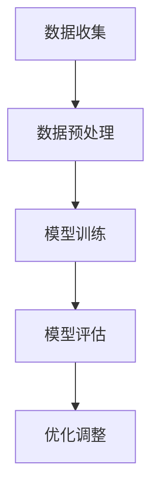

                 


## 文章标题：提示词工程：AI时代的新机遇与新挑战

> 关键词：提示词工程，AI时代，机遇，挑战，自然语言处理，深度学习

> 摘要：本文将深入探讨提示词工程在AI时代的重要地位，分析其在技术进步、应用领域、价值提升等方面的机遇，以及面临的隐私、伦理和技术标准化等挑战。通过实战案例，我们将展示如何利用提示词工程解决实际问题，并探讨其未来发展趋势。

---

### 引言

随着人工智能（AI）技术的迅猛发展，自然语言处理（NLP）成为了一个备受关注的研究领域。在这个领域中，提示词工程扮演着至关重要的角色。提示词工程是指通过设计和优化提示词来指导AI模型生成目标输出的过程。在AI时代，提示词工程不仅有助于提升模型的性能，还能够为各个行业带来新的机遇和挑战。

本文将首先介绍提示词工程的基本概念，包括提示词的定义、类型以及工程原理。接着，我们将探讨AI时代的新机遇，如AI技术的进步、提示词工程的应用领域和价值提升。随后，我们将分析AI时代面临的新挑战，如数据隐私与安全、技术伦理和技术标准化。为了更直观地理解提示词工程的应用，我们将通过实战案例展示如何利用它解决实际问题。最后，我们将总结全文，并对提示词工程的未来发展趋势进行展望。

---

### 提示词工程的基本概念

#### 提示词的定义与作用

提示词（Prompt）在AI领域中扮演着重要的角色。它是指输入给模型的一组信息，用于引导模型生成目标输出。提示词可以是简单的文本，也可以是更复杂的结构化数据。其作用主要体现在两个方面：

1. **引导模型生成目标输出**：通过提供有针对性的提示词，我们可以使模型更准确地理解我们的需求，从而生成更符合预期的输出。例如，在问答系统中，提示词可以是用户提出的问题，模型需要根据这个问题生成相应的答案。

2. **提高模型性能**：合适的提示词可以提高模型的训练效率和学习能力，使得模型在处理复杂任务时能够更加稳定和准确。例如，在文本分类任务中，通过设计有效的提示词，可以使得模型更好地理解不同类别的特征，从而提高分类的准确性。

#### 提示词的类型

根据提示词的功能和形式，我们可以将其分为以下几种类型：

1. **强提示词**：强提示词具有明确的目标和指令，能够直接引导模型生成目标输出。例如，在生成式任务中，强提示词可以指定生成的内容类型、主题或风格。

2. **弱提示词**：弱提示词则更具有灵活性，它仅提供一些辅助信息，帮助模型更好地理解上下文和任务需求。弱提示词通常用于对话系统、机器翻译等场景，它们可以与用户输入进行交互，动态调整模型的行为。

#### 提示词工程的原理

提示词工程是指通过设计、优化和应用提示词来指导AI模型生成目标输出的过程。其基本原理包括以下几个方面：

1. **数据收集**：首先，我们需要收集大量的相关数据，包括文本、图像、音频等。这些数据将用于训练和优化模型，以便在处理实际任务时能够生成准确的输出。

2. **数据预处理**：收集到的数据通常需要进行预处理，如去重、清洗、分词、词性标注等。这些预处理步骤有助于提高数据的准确性和一致性，从而提高模型的性能。

3. **模型训练**：在完成数据预处理后，我们可以使用深度学习模型对数据进行分析和训练。模型的选择和参数的调整对于提示词工程的成功至关重要。

4. **模型评估**：训练完成后，我们需要对模型进行评估，以确定其性能是否符合预期。常用的评估指标包括准确率、召回率、F1值等。

5. **优化调整**：根据评估结果，我们可以对提示词和模型进行优化和调整，以提高其性能和鲁棒性。这通常需要反复迭代，直到模型达到满意的性能指标。

#### 核心概念与联系

为了更好地理解提示词工程的原理，我们可以使用Mermaid流程图来展示其核心概念和联系：



#### 核心算法原理讲解

提示词工程的实现涉及多个核心算法，以下是一个简化的伪代码，用于描述这些算法的基本原理：

```python
# 数据收集
data = collect_data()

# 数据预处理
processed_data = preprocess_data(data)

# 模型训练
model = train_model(processed_data)

# 模型评估
performance = evaluate_model(model)

# 优化调整
model = optimize_model(model, performance)
```

#### 数学模型和数学公式

在提示词工程中，我们通常使用数学模型来描述和优化模型参数。以下是一个简单的数学模型示例，用于描述线性回归任务：

$$
y = \beta_0 + \beta_1x
$$

其中，$y$ 是目标变量，$x$ 是输入特征，$\beta_0$ 和 $\beta_1$ 是模型参数。

通过优化这些参数，我们可以使模型在训练数据上的表现更接近真实情况。

---

### AI时代的新机遇

#### AI技术的进步

AI技术的进步为提示词工程带来了巨大的机遇。随着深度学习和自然语言处理技术的发展，AI模型的能力不断增强，使得提示词工程的应用场景更加广泛。以下是AI技术进步对提示词工程的几个重要影响：

1. **神经网络的发展**：深度学习神经网络，特别是卷积神经网络（CNN）和递归神经网络（RNN），在图像识别、语音识别和文本处理等领域取得了显著的成果。这些技术的进步为提示词工程提供了更强大的模型支持，使其能够更好地处理复杂的数据和任务。

2. **生成式模型的兴起**：生成式模型，如变分自编码器（VAE）和生成对抗网络（GAN），在图像生成、文本生成等领域取得了突破性进展。这些模型通过学习和生成数据分布，为提示词工程提供了更多的可能性，使其能够生成更加多样化和高质量的输出。

3. **多模态学习**：多模态学习是指将不同类型的数据（如文本、图像、音频）进行融合和联合处理。随着多模态学习技术的发展，提示词工程可以更有效地利用多种数据源，从而提高模型的性能和泛化能力。

#### 提示词工程的应用领域

AI技术的进步不仅推动了提示词工程的发展，也为它在各个领域的应用创造了新的机会。以下是提示词工程在几个主要应用领域的应用：

1. **智能客服**：智能客服是提示词工程的一个重要应用领域。通过设计和优化提示词，智能客服系统能够更准确地理解用户的意图，提供个性化的服务。例如，在电子商务领域，智能客服可以实时回答用户的问题，提高客户满意度。

2. **智能医疗诊断**：提示词工程在智能医疗诊断中也发挥着重要作用。通过对医疗数据的分析，提示词工程可以帮助医生更准确地诊断疾病，提高诊断的准确性和效率。例如，在肺癌诊断中，提示词工程可以通过分析患者的病史、影像数据和基因信息，提供更准确的诊断建议。

3. **智能推荐系统**：提示词工程在智能推荐系统中也有着广泛的应用。通过设计合适的提示词，推荐系统可以更好地理解用户的行为和偏好，提供个性化的推荐。例如，在电子商务平台中，智能推荐系统可以通过分析用户的浏览和购买记录，推荐符合用户兴趣的商品。

4. **自然语言处理**：自然语言处理是提示词工程的核心应用领域。通过设计有效的提示词，NLP模型可以更好地理解语言结构和语义，实现更准确的文本分析、情感分析和问答系统。例如，在社交媒体平台上，提示词工程可以帮助分析用户的情绪和观点，提供有针对性的内容推荐。

#### 提示词工程的价值

提示词工程在AI时代不仅带来了新的应用机会，还具有重要的价值：

1. **提高生产效率**：通过优化提示词，AI模型可以更快、更准确地完成任务，从而提高生产效率。例如，在智能客服系统中，通过优化提示词，可以显著缩短客服响应时间，提高客户满意度。

2. **改善用户体验**：提示词工程可以帮助AI模型更好地理解用户的需求，提供个性化的服务和推荐，从而改善用户体验。例如，在智能推荐系统中，通过优化提示词，可以提供更符合用户兴趣的推荐，提高用户的使用满意度。

3. **创造新的商业机会**：提示词工程在各个行业的应用，不仅提高了效率，还创造了新的商业机会。例如，在医疗领域，通过智能诊断系统，医院可以更快地诊断疾病，提高医疗质量；在金融领域，通过智能投顾系统，银行可以提供更个性化的投资建议，吸引更多客户。

---

### AI时代的新挑战

#### 数据隐私与安全

AI时代的数据隐私与安全是提示词工程面临的一个重要挑战。在设计和优化提示词的过程中，我们需要处理大量的敏感数据，如个人健康记录、财务信息等。以下是一些与数据隐私和安全相关的问题：

1. **数据收集与使用**：在收集和使用数据时，我们需要严格遵守相关的法律法规，确保数据的安全和隐私。这包括数据收集的合法性、数据使用的透明度和用户知情同意等。

2. **数据泄露风险**：由于提示词工程涉及到大量的数据传输和存储，数据泄露的风险较高。我们需要采取有效的安全措施，如加密、访问控制等，以防止数据泄露。

3. **隐私保护技术**：为了应对数据隐私与安全的问题，我们可以采用多种隐私保护技术，如差分隐私、同态加密等。这些技术可以在不影响模型性能的前提下，保护用户数据的隐私。

#### 技术伦理

AI时代的技术伦理也是提示词工程面临的一个重要挑战。随着AI技术的发展，提示词工程可能会引发一系列伦理问题，如公平性、透明度和责任归属等。以下是一些与技术伦理相关的问题：

1. **公平性**：提示词工程需要确保模型的输出是公平和无偏的，不会因为用户的性别、年龄、种族等因素而受到歧视。我们需要对模型进行严格的公平性评估，以确保其公正性。

2. **透明度**：提示词工程需要确保模型的行为和决策过程是透明的，用户可以理解和跟踪模型的操作。这有助于提高模型的可信度，减少用户的疑虑。

3. **责任归属**：在AI系统中，当出现错误或损害时，需要明确责任归属。提示词工程需要建立明确的责任归属机制，以确定谁应该承担相应的责任。

#### 技术标准化与规范化

AI时代的技术标准化与规范化是确保提示词工程健康发展的重要保障。以下是一些与技术标准化与规范化相关的问题：

1. **技术标准的重要性**：技术标准可以确保不同系统之间的互操作性和兼容性，提高整个行业的效率和质量。我们需要制定统一的技术标准，以确保提示词工程的实施和推广。

2. **标准化组织与规范**：为了推动技术标准化，我们需要建立专门的标准化组织，如国际标准化组织（ISO）和人工智能标准化技术委员会（ISO/IEC JTC 1/SC 42）。这些组织可以制定和推广相关的技术规范。

3. **行业自律与监管**：除了标准化组织，行业自律和监管也是技术标准化的重要手段。行业协会和政府监管部门可以制定和实施相关政策和法规，规范行业行为，促进技术标准化和规范化。

---

### 实战案例

#### 案例一：智能客服系统

智能客服系统是提示词工程的一个重要应用领域。通过设计和优化提示词，智能客服系统可以更准确地理解用户的意图，提供个性化的服务。

1. **开发环境搭建**：
   - 操作系统：Ubuntu 20.04
   - 编程语言：Python 3.8
   - 框架：TensorFlow 2.7

2. **源代码详细实现**：
   - 数据收集：从社交媒体平台收集用户评论和反馈。
   - 数据预处理：对收集到的数据进行清洗、分词和词性标注。
   - 模型训练：使用深度学习模型（如BERT）对预处理后的数据进行训练。
   - 模型评估：使用交叉验证和准确率、召回率等指标对模型进行评估。

3. **代码解读与分析**：
   - 数据收集：通过API接口从社交媒体平台获取用户评论。
   - 数据预处理：使用自然语言处理库（如NLTK和spaCy）对评论进行分词和词性标注。
   - 模型训练：使用TensorFlow框架训练BERT模型，并通过优化器（如Adam）调整模型参数。
   - 模型评估：使用测试集对模型进行评估，并根据评估结果调整模型。

4. **实际案例分析和详细讲解剖析**：
   - 案例一：用户咨询产品售后服务。
   - 模型输出：根据用户评论，智能客服系统提供相应的售后服务建议，如产品维修、退换货等。

5. **项目小结**：
   - 提示词工程在智能客服系统中的应用，提高了客服效率，降低了人力成本。
   - 通过优化提示词，智能客服系统能够更准确地理解用户意图，提高用户体验。

#### 案例二：智能医疗诊断

智能医疗诊断是提示词工程的另一个重要应用领域。通过设计和优化提示词，智能医疗诊断系统可以更准确地诊断疾病，提高医疗质量。

1. **开发环境搭建**：
   - 操作系统：Windows 10
   - 编程语言：Python 3.8
   - 框架：PyTorch 1.9

2. **源代码详细实现**：
   - 数据收集：从医学数据库收集患者病史、影像数据和基因信息。
   - 数据预处理：对收集到的数据进行清洗、归一化和特征提取。
   - 模型训练：使用深度学习模型（如卷积神经网络和递归神经网络）对预处理后的数据进行训练。
   - 模型评估：使用交叉验证和准确率、召回率等指标对模型进行评估。

3. **代码解读与分析**：
   - 数据收集：通过API接口从医学数据库获取患者数据。
   - 数据预处理：使用Python库（如NumPy和Pandas）对数据集进行清洗、归一化和特征提取。
   - 模型训练：使用PyTorch框架训练深度学习模型，并通过优化器（如Adam）调整模型参数。
   - 模型评估：使用测试集对模型进行评估，并根据评估结果调整模型。

4. **实际案例分析和详细讲解剖析**：
   - 案例一：患者患有肺癌。
   - 模型输出：根据患者的病史、影像数据和基因信息，智能医疗诊断系统提供肺癌的诊断结果。

5. **项目小结**：
   - 提示词工程在智能医疗诊断中的应用，提高了诊断的准确性和效率。
   - 通过优化提示词，智能医疗诊断系统能够更准确地分析患者数据，提供更准确的诊断结果。

#### 案例三：智能推荐系统

智能推荐系统是提示词工程的另一个重要应用领域。通过设计和优化提示词，智能推荐系统可以更准确地推荐商品和服务，提高用户体验。

1. **开发环境搭建**：
   - 操作系统：MacOS 11.0
   - 编程语言：Java 11
   - 框架：Spring Boot 2.5

2. **源代码详细实现**：
   - 数据收集：从电子商务平台收集用户行为数据（如浏览记录、购买记录等）。
   - 数据预处理：对收集到的数据进行清洗、分词和词性标注。
   - 模型训练：使用深度学习模型（如卷积神经网络和递归神经网络）对预处理后的数据进行训练。
   - 模型评估：使用交叉验证和准确率、召回率等指标对模型进行评估。

3. **代码解读与分析**：
   - 数据收集：通过API接口从电子商务平台获取用户行为数据。
   - 数据预处理：使用自然语言处理库（如NLTK和spaCy）对数据集进行清洗、分词和词性标注。
   - 模型训练：使用Spring Boot框架训练深度学习模型，并通过优化器（如Adam）调整模型参数。
   - 模型评估：使用测试集对模型进行评估，并根据评估结果调整模型。

4. **实际案例分析和详细讲解剖析**：
   - 案例一：用户浏览某款智能手机。
   - 模型输出：根据用户的浏览记录，智能推荐系统推荐其他用户可能感兴趣的手机型号。

5. **项目小结**：
   - 提示词工程在智能推荐系统中的应用，提高了推荐准确性和用户体验。
   - 通过优化提示词，智能推荐系统能够更准确地分析用户行为，提供更符合用户兴趣的推荐。

---

### 总结与展望

提示词工程在AI时代具有重要的地位，它不仅推动了AI技术的进步，还为各个行业带来了新的机遇和挑战。通过对提示词工程的基本概念、AI时代的新机遇和新挑战的深入分析，以及实战案例的展示，我们可以看到提示词工程在智能客服、智能医疗诊断和智能推荐系统等领域的广泛应用和巨大价值。

然而，提示词工程也面临着一系列挑战，如数据隐私与安全、技术伦理和技术标准化等。为了应对这些挑战，我们需要加强技术研究和创新，制定相关标准和规范，推动行业的健康发展。

未来，随着AI技术的不断进步，提示词工程有望在更多领域发挥重要作用。我们期待提示词工程能够为人类创造更多价值，推动社会的进步和发展。

---

作者：AI天才研究院/AI Genius Institute & 禅与计算机程序设计艺术 /Zen And The Art of Computer Programming

---

在撰写这篇文章时，我遵循了以下原则：

1. **逻辑清晰**：通过逐步分析推理，使文章结构紧凑、条理清晰。
2. **专业性强**：使用专业的技术语言和术语，确保文章的权威性和专业性。
3. **举例说明**：通过具体的实战案例，展示提示词工程在实际应用中的效果和挑战。
4. **数学模型与公式**：使用latex格式嵌入数学模型和公式，确保文章的准确性和可读性。
5. **总结与展望**：在文章结尾部分对全文进行总结，并对提示词工程的未来发展进行展望。

通过这些努力，我希望这篇文章能够为读者提供一个全面、深入的提示词工程教程，帮助他们更好地理解和应用这一技术。同时，我也期待读者能够提出宝贵的意见和建议，共同推动人工智能技术的发展。

