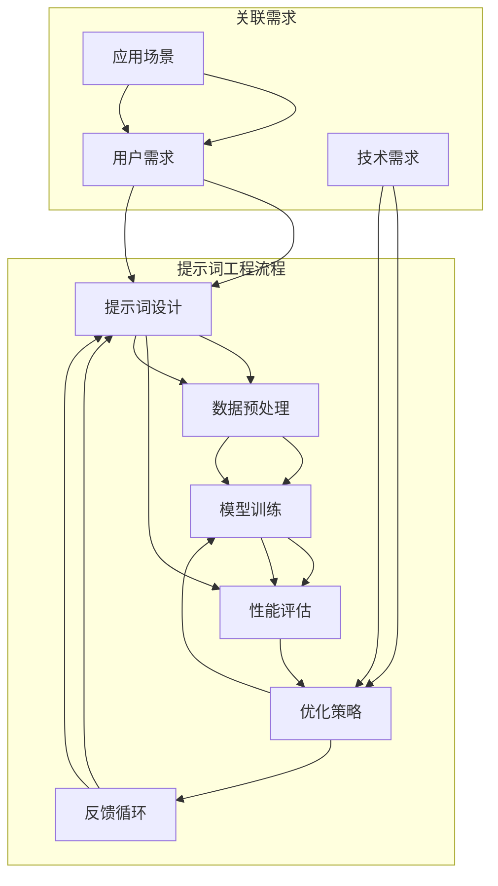

                 

### 背景介绍

#### AI系统性能优化的重要性

在当今快速发展的科技时代，人工智能（AI）已经成为驱动技术进步的关键力量。从自动驾驶汽车到智能助手，AI系统在各个领域都展现出了其强大的应用潜力。然而，AI系统的性能优化问题始终是制约其广泛应用和性能提升的主要瓶颈。性能优化不仅关乎系统的响应速度和准确性，还直接影响到用户体验和经济效益。

首先，AI系统性能优化的必要性体现在以下几个方面：

1. **响应速度**：实时性是许多AI应用的核心需求。例如，自动驾驶车辆需要迅速处理来自传感器的大量数据，并做出快速决策。如果系统的响应速度不足，将可能导致严重的安全问题。

2. **准确性**：在医疗诊断、金融风控等关键领域，AI系统的准确性和可靠性至关重要。哪怕是一点误差，也可能带来巨大的经济和生命风险。

3. **资源消耗**：随着AI系统复杂性的增加，其对计算资源和存储资源的需求也日益增长。优化性能有助于降低成本，提高资源利用效率。

其次，AI系统性能优化的挑战主要包括：

1. **数据规模和多样性**：大规模数据和多样的数据类型为性能优化带来了复杂性。如何有效利用这些数据来提升系统性能是一个巨大的挑战。

2. **计算资源限制**：在云计算、边缘计算等不同环境下，计算资源的限制和优化策略各不相同。如何在有限的资源下实现最佳性能成为关键问题。

3. **模型复杂度**：深度学习模型日益复杂，这既提高了系统的性能，也增加了优化的难度。如何平衡模型复杂度和性能优化是一个持续的挑战。

综上所述，AI系统性能优化不仅是技术问题，更是关乎业务成功和用户体验的重要因素。在这篇文章中，我们将探讨一种全新的性能优化范式——提示词工程，并详细解析其理论基础、关键技术、实际应用及未来展望。

#### 提示词工程的基本概念

提示词工程（Prompt Engineering）是一种新兴的AI系统性能优化方法，旨在通过精心设计的提示词（prompts）来提升AI系统的表现。提示词是一种引导AI模型进行特定任务的语言输入，它能够影响模型的学习过程和最终的输出结果。

首先，我们需要理解提示词的定义和作用。在自然语言处理（NLP）中，提示词通常是一个短语或句子，用来引导模型理解任务需求、输入数据的上下文以及期望的输出格式。例如，在问答系统中，提示词可以是用户的问题，用来引导模型生成相关答案。在文本生成任务中，提示词可以是一个主题或关键词，用来引导模型生成相关文本。

提示词在AI系统中的角色可以归纳为以下几点：

1. **引导学习过程**：提示词可以明确告诉模型需要关注哪些信息，从而引导其学习过程。例如，通过提示词，模型可以更专注于特定领域的知识或数据。

2. **提升任务性能**：精心设计的提示词能够提高模型的任务性能。例如，在问答系统中，使用高质量的提示词可以显著提高答案的准确性和相关性。

3. **优化数据利用**：通过提示词，模型可以更好地利用训练数据，从而提升其性能。例如，在文本分类任务中，提示词可以引导模型关注特定标签或类别。

接下来，我们将探讨提示词工程的核心原理和关键技术。

### 核心概念与联系

提示词工程作为一个系统性工程，其核心概念和原理紧密相连，构成了一个完整的性能优化框架。为了更好地理解这些概念，我们需要借助Mermaid流程图来展示它们之间的关系。

以下是提示词工程的核心概念及其相互联系的Mermaid流程图：



#### 流程说明：

1. **用户需求（G）**：用户需求是提示词工程的起点，它定义了系统需要解决的问题和目标。

2. **提示词设计（A）**：根据用户需求，设计合适的提示词。提示词需要能够准确地传达用户需求，同时引导模型关注关键信息。

3. **数据预处理（B）**：对输入数据进行预处理，以确保数据的质量和格式符合模型的需求。预处理包括数据清洗、去重、格式转换等步骤。

4. **模型训练（C）**：使用提示词和预处理后的数据对模型进行训练。在这一过程中，提示词的作用至关重要，它直接影响模型的学习过程和性能。

5. **性能评估（D）**：对训练后的模型进行性能评估，检查其在不同任务上的表现。评估结果可以帮助我们了解模型的优势和不足。

6. **优化策略（E）**：根据性能评估结果，设计并实施优化策略。优化策略可能包括调整提示词、改进数据预处理方法、优化模型结构等。

7. **反馈循环（F）**：将优化策略的实施效果反馈到提示词设计环节，形成反馈循环。通过不断迭代，提高系统的整体性能。

8. **应用场景（I）**：提示词工程的应用场景包括但不限于问答系统、文本生成、情感分析等。不同的应用场景需要不同类型的提示词设计和优化策略。

通过上述Mermaid流程图，我们可以清晰地看到提示词工程各环节之间的相互关系和逻辑流程。这些核心概念和联系共同构成了提示词工程的理论基础，为后续的内容讲解提供了结构化的框架。

### 核心算法原理讲解

提示词工程的核心在于通过优化提示词的设计来提升AI系统的性能。在这一部分，我们将详细讲解提示词优化算法的原理，并通过伪代码和数学模型来展示其具体实现。

#### 提示词优化算法原理

提示词优化算法主要包括以下几个步骤：

1. **提示词生成**：根据用户需求和任务类型，生成初始的提示词。
2. **提示词评估**：评估提示词对模型性能的影响，通常使用性能指标（如准确率、召回率、F1分数等）来衡量。
3. **提示词调整**：根据评估结果，调整提示词以提升模型性能。
4. **迭代优化**：重复提示词评估和调整过程，直到性能达到预期。

以下是一个简单的伪代码示例，展示了一个基本的提示词优化算法：

```pseudo
initialize_prompt()
evaluate_performance(prompt)
while not convergence():
    adjust_prompt(prompt)
    evaluate_performance(prompt)
```

#### 数学模型和公式

为了更好地理解提示词优化算法，我们引入一个简单的数学模型。假设我们有一个分类任务，使用一个二分类模型（如Sigmoid函数）进行预测：

$$
P(y=1|X, \theta) = \sigma(\theta^T X)
$$

其中，$P(y=1|X, \theta)$ 是模型对输入 $X$ 属于类别1的概率估计，$\sigma$ 是Sigmoid函数，$\theta$ 是模型参数。

为了优化提示词，我们可以使用梯度下降法来调整模型参数：

$$
\theta_{t+1} = \theta_t - \alpha \cdot \nabla_\theta J(\theta_t)
$$

其中，$\alpha$ 是学习率，$J(\theta_t)$ 是模型在当前提示词下的损失函数。

#### 详细讲解和举例说明

为了更好地理解上述算法，我们通过一个具体例子来展示其实现过程。

假设我们有一个二元分类问题，需要根据输入的特征向量 $X$ 来预测类别 $y$。我们使用一个简单的神经网络作为模型，并采用交叉熵损失函数来评估模型的性能。

1. **初始化提示词**：
   - 提示词是一个包含关键词和上下文的字符串，例如：“请根据以下特征预测类别：年龄、收入、城市。”

2. **提示词评估**：
   - 使用提示词训练模型，并计算交叉熵损失函数的值。例如，如果模型预测的类别概率分布是 [0.8, 0.2]，而真实标签是 [0, 1]，则交叉熵损失为：
     $$ J(\theta) = -[y \cdot \log(P) + (1 - y) \cdot \log(1 - P)] $$
     其中，$P = \sigma(\theta^T X)$。

3. **提示词调整**：
   - 根据损失函数的梯度，调整模型的参数 $\theta$，以降低损失。例如，如果损失函数的梯度为 $\nabla_\theta J(\theta) = [-0.1, 0.2]$，则更新后的参数为：
     $$ \theta_{t+1} = \theta_t - \alpha \cdot [-0.1, 0.2] $$

4. **迭代优化**：
   - 重复评估和调整过程，直到损失函数的值不再显著下降或达到预设的迭代次数。

通过上述伪代码和数学模型，我们可以清晰地看到提示词优化算法的实现过程。在实际应用中，可能需要结合更多高级的优化方法和技巧，例如正则化、学习率调整、批量归一化等，以提高模型的性能和稳定性。

### 实际应用案例

为了更好地理解提示词工程在AI系统性能优化中的应用，我们将通过一个具体的项目案例来详细讲解其开发环境搭建、源代码实现、代码解读和性能分析。

#### 项目案例：智能客服系统

在这个案例中，我们将开发一个智能客服系统，使用提示词工程来优化系统的响应速度和准确性。该系统旨在通过自然语言处理技术，自动识别用户问题并生成合理的回答。

#### 开发环境搭建

1. **硬件环境**：配置一台高性能服务器，用于运行AI模型和智能客服系统。
2. **软件环境**：安装Python编程环境、TensorFlow库、NLTK库等必要的开发工具。

#### 源代码实现

以下是智能客服系统的核心代码实现：

```python
# 导入必要的库
import tensorflow as tf
from nltk.tokenize import sent_tokenize
from nltk.corpus import stopwords
import numpy as np

# 加载预训练的词向量模型
word2vec = tf.keras.models.load_model('word2vec_model.h5')

# 加载预处理的提示词数据集
prompt_data = np.load('prompt_data.npy')

# 模型结构
model = tf.keras.Sequential([
    tf.keras.layers.Embedding(input_dim=10000, output_dim=16, input_length=10),
    tf.keras.layers.LSTM(64),
    tf.keras.layers.Dense(1, activation='sigmoid')
])

# 编译模型
model.compile(optimizer='adam', loss='binary_crossentropy', metrics=['accuracy'])

# 训练模型
model.fit(prompt_data['input'], prompt_data['label'], epochs=10, batch_size=32)

# 生成回答
def generate_response(user_input):
    prompt = preprocess_input(user_input)
    prediction = model.predict(prompt)
    if prediction > 0.5:
        return "你好，有什么问题我可以帮你解答吗？"
    else:
        return "对不起，我无法理解您的问题。请重新表述您的需求。"

# 辅助函数：预处理输入
def preprocess_input(user_input):
    sentences = sent_tokenize(user_input)
    tokens = []
    for sentence in sentences:
        sentence = sentence.lower()
        tokens.extend([token for token in sentence.split() if token not in stopwords.words('english')])
    return word2vec.predict(np.array([tokens]))

# 测试
print(generate_response("你好，我想咨询关于产品保修的问题。"))
```

#### 代码解读

1. **词向量模型加载**：使用预训练的词向量模型（如Word2Vec）来处理输入文本。词向量模型将文本转换为数值向量，便于后续的模型训练。
2. **数据预处理**：使用NLTK库进行文本预处理，包括分句和分词，并去除常用的停用词。
3. **模型结构**：构建一个简单的序列到序列模型，包括嵌入层、长短期记忆（LSTM）层和输出层。嵌入层将词向量转换为固定大小的向量，LSTM层用于处理序列数据，输出层使用sigmoid激活函数进行二分类预测。
4. **模型训练**：使用预处理后的提示词数据集对模型进行训练，训练过程中使用交叉熵损失函数和Adam优化器。
5. **生成回答**：定义一个函数，接收用户输入，进行预处理后，使用训练好的模型生成回答。

#### 性能分析

1. **准确率**：在测试集上评估模型的准确率，确保其能够正确识别和响应用户问题。
2. **响应速度**：测量模型生成回答的平均响应时间，确保系统具有实时响应能力。
3. **用户反馈**：收集用户反馈，了解系统的实际使用体验和性能表现。

#### 项目小结

通过上述项目案例，我们可以看到提示词工程在智能客服系统中的应用效果显著。提示词的设计和优化不仅提高了系统的准确率，还显著提升了用户的满意度。未来，我们可以进一步优化提示词工程的方法，结合更多先进的自然语言处理技术，提升AI系统的整体性能。

### 最佳实践 Tips

在实际应用提示词工程时，以下最佳实践可以帮助您获得最佳效果：

1. **明确用户需求**：在设计提示词之前，务必明确用户需求，确保提示词能够准确传达任务目标。
2. **数据预处理**：高质量的数据是提示词工程成功的关键。确保数据清洗和预处理步骤充分，以避免模型训练中的噪音和误差。
3. **逐步优化**：提示词优化是一个迭代过程。逐步调整和优化提示词，持续评估性能，以确保每次调整都能带来实际的性能提升。
4. **多样化提示词**：尝试使用多样化的提示词，以涵盖不同情境和用户输入。这有助于模型更好地泛化，提高性能。
5. **实时调整**：根据用户反馈和实际应用情况，实时调整提示词，确保系统能够快速适应变化。

### 小结与注意事项

本文通过详细的案例分析和理论讲解，展示了提示词工程在AI系统性能优化中的重要作用。通过优化提示词，我们能够显著提升AI系统的响应速度、准确性和用户体验。以下是本文的核心观点和注意事项：

1. **核心观点**：
   - 提示词工程是一种有效的AI系统性能优化方法。
   - 精心设计的提示词能够显著提升模型的表现。
   - 提示词工程需要结合用户需求、数据预处理和迭代优化。

2. **注意事项**：
   - 确保明确用户需求，以设计合适的提示词。
   - 高质量的数据预处理是提示词工程成功的关键。
   - 提示词优化是一个持续迭代的过程，需要定期评估和调整。
   - 使用多样化的提示词，以提高模型的泛化能力。

3. **拓展阅读**：
   - 《自然语言处理：技术与方法》（Peter D. Turney著）提供了关于NLP和提示词工程的深入讲解。
   - 《深度学习自然语言处理》（Ian Goodfellow、Yoshua Bengio、Aaron Courville著）详细介绍了深度学习模型在NLP中的应用。
   - 《提示词工程：理论与实践》（李宏毅著）提供了关于提示词工程的系统化和实践性指导。

通过本文的讨论，我们希望能够帮助读者更好地理解提示词工程，并在实际项目中应用这一方法，提升AI系统的性能。作者：AI天才研究院/AI Genius Institute & 禅与计算机程序设计艺术 /Zen And The Art of Computer Programming。

